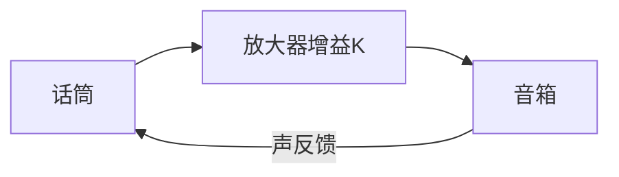

# CT-03: 频率响应与伯德图

**副标题：从伯德图的幅频/相频曲线到电流环带宽设计——频率域视角揭示PI参数如何映射为ωc、PM和GM**
- **难度：**  专业级
- **适用对象：** 电机控制工程师、控制系统设计者、伺服驱动调试工程师
- **前置知识：** 拉普拉斯变换、传递函数、复数运算、开环/闭环系统概念

---

## 1.  核心摘要

**一句话讲清楚**：伯德图是频率域中描述系统「对不同频率正弦输入的放大/衰减和相位偏移」的工具——对于电机FOC，伯德图直接回答「电流环能跟踪多快变化的正弦电流指令（带宽ωc）」「在ωc处系统还有多少相位储备不至于震荡（相位裕度PM）」。

**认知挂钩**：很多工程师用「试凑法」调PI——Kp加一点试试，震荡了就退回来。这种方法的本质是在不知道系统频率特性的情况下盲目试探。一旦掌握了伯德图，就能**定量计算**：$K_p = L_s \times \omega_c$ 中的ωc到底是什么？为什么电流环ωc设计在1500 rad/s？因为穿越频率处需要足够的相位裕度（PM>45°）来抑制震荡。

**与FOC算法的关联**：
-  **电流环带宽设计**：$\omega_c = K_p/L_s$，即穿越频率。FOC电流环典型 $\omega_c = 800\sim3000$ rad/s（对应128~478Hz）
-  **速度环带宽**：通常为电流环的 $1/5 \sim 1/10$，保证速度环伯德图中电流环近似为纯增益
-  **PI参数→带宽映射**：$K_p=L_s\omega_c$，$K_i=R_s\omega_c$，本质是通过零极点对消将电机RL环节改造成 $\omega_c/s$ 的纯积分型开环

---

## 2.  问题引入

### 工程师的真实困惑

**场景1：电流环震荡——相位裕度不足**
```text
工程师A:"按公式 Kp=Ls×ωc=2mH×1500=3，Ki=Rs×ωc=0.3×1500=450，
      Iq阶跃响应确实快，但有高频震荡叠加..."
问题现象:
- 阶跃响应大趋势正确，但叠加约800Hz的小幅震荡
- 减小Kp到2，震荡消失但响应变慢
- 不是简单的PI参数问题
```

**场景2：速度环和电流环互相干扰**
```text
工程师B:"电流环单独调试OK，速度环加上后就一起震荡..."
问题现象:
- 电流环带宽设计在2000 rad/s
- 速度环带宽设计在300 rad/s（电流环的1/6.7）
- 两环同时工作时出现约400Hz的振荡
```

**场景3：不知道自己的电流环带宽到底是多少**
```text
工程师C:"我用 Kp=5, Ki=800，但不知道对应的带宽是多少，
     也不知道这个带宽对当前开关频率(10kHz)是否合理..."
```

### 核心问题

- 电流环震荡 → 相位裕度PM不够（穿越频率处相位太接近-180°）
- 两环互相干扰 → 内环在外环的穿越频率附近仍有明显相位滞后，破坏了外环稳定性
- 不知道带宽 → 不会从PI参数反算穿越频率 → 无法评估设计的合理性

### 学习目标

读完本模块，你将能够：
 **从PI参数反算穿越频率、相位裕度、增益裕度**
 **绘制伯德图渐近线**，快速评估系统频率特性
 **理解电流环带宽的物理含义**——不是随便取的，受限于电频率、开关频率、相位裕度
 **掌握速度环带宽设计准则**——基于电流环的伯德图确定

---

## 3.  直观理解

### 类比1：伯德图 = 音响系统的频响测试

**生活场景**：音响工程师用扫频信号（20Hz→20kHz）测试音箱，记录每个频率的输出幅度（幅频响应）和相位偏移（相频响应）。

```text
输入: 20Hz正弦波 → 音箱 → 输出: 幅度×0.9，相位滞后5°
输入: 1kHz正弦波 → 音箱 → 输出: 幅度×1.1，相位滞后30°
输入: 15kHz正弦波 → 音箱 → 输出: 幅度×0.3，相位滞后120°
```

**电机对应**：给电流环注入不同频率的正弦 $I_q^{ref}$，测量实际 $I_q$ 的幅度比和相位差：

```text
ω=100 rad/s (~16Hz):  |Iq/Iq_ref|=0.99, 相位滞后≈5.7°
ω=1000 rad/s (~159Hz):|Iq/Iq_ref|=0.85, 相位滞后≈40°
ω=3000 rad/s (~477Hz):|Iq/Iq_ref|=0.45, 相位滞后≈72°
```

### 类比2：穿越频率 = 反馈信号刚好与原信号等幅反相的危险点

**生活场景**：话筒对着音箱——声音被话筒拾取→放大→再从音箱播出→再被拾取...这就是「声反馈啸叫」的物理机制：当环路增益≥1且相位=0°(360°)时，自激振荡。



**电机对应**：伯德图上：
- $\omega_c$（穿越频率）：$|L(j\omega_c)| = 1$（0dB），即环路增益=1的频率
- $PM = 180° + \angle L(j\omega_c)$（相位裕度）：在穿越频率处，相位离-180°还有多少度
- 当 $PM \to 0$ → 相位逼近-180° → 系统震荡

**FOC电流环的穿越频率计算**：

$$L(s) = \frac{\omega_c}{s}, \quad |L(j\omega_c)| = \left|\frac{\omega_c}{j\omega_c}\right| = 1 \quad \checkmark$$

$\angle L(j\omega_c) = \angle (\omega_c/(j\omega_c)) = -90°$
$PM = 180° + (-90°) = 90°$

**FOC电流环天生有90°相位裕度！**（前提是零极点精确对消）

---

## 4.  技术原理

### 4.1 频率响应的数学定义

对线性时不变系统 $G(s)$，令 $s = j\omega$：

$$G(j\omega) = |G(j\omega)| \cdot e^{j\angle G(j\omega)}$$

其中：
- $|G(j\omega)|$：幅频特性（系统对不同频率正弦输入的放大倍数）
- $\angle G(j\omega)$：相频特性（输出正弦相对于输入正弦的相位偏移）

**伯德图**：横轴 $\omega$（对数坐标），纵轴 $20\log_{10}|G(j\omega)|$（dB）和 $\angle G(j\omega)$（°）。

### 4.2 基本环节的伯德图

#### 4.2.1 比例环节 $K$

$$|G| = K \to 20\log_{10}K \ \text{dB}, \quad \angle G = 0°$$

恒定的幅值和零相移。

#### 4.2.2 积分环节 $1/s$

$$G(j\omega) = \frac{1}{j\omega} = -j\frac{1}{\omega}$$

$$|G(j\omega)| = \frac{1}{\omega}, \quad 20\log_{10}|G| = -20\log_{10}\omega \ \text{dB}$$

幅频：-20dB/decade的直线，穿越0dB在 $\omega=1$ rad/s
相频：恒为-90°

#### 4.2.3 一阶惯性环节 $1/(1+\tau s)$

$$|G(j\omega)| = \frac{1}{\sqrt{1+(\omega\tau)^2}}$$
$$\angle G(j\omega) = -\arctan(\omega\tau)$$

**渐近线近似**：
- $\omega \ll 1/\tau$：$|G| \approx 1$（0dB），$\angle G \approx 0°$
- $\omega = 1/\tau$（转折频率）：$|G| = -3\text{dB}$，$\angle G = -45°$
- $\omega \gg 1/\tau$：$|G| \approx -20\log_{10}(\omega\tau)$ dB（-20dB/dec），$\angle G \to -90°$

### 4.3 FOC电流环的伯德图

**开环传递函数**（零极点对消后）：

$$L(s) = \frac{\omega_c}{s}$$

伯德图：
- 幅频：斜率为-20dB/decade的直线，在 $\omega = \omega_c$ 处穿过0dB
- 相频：恒为-90°
- 相位裕度：$PM = 180° + (-90°) = 90°$
- 增益裕度：$GM = \infty$（因为相频永远达不到-180°）

**这解释了为什么零极点对消后的电流环极其稳定**——PM=90°意味着几乎不可能震荡。

### 4.4 实际电流环的伯德图——非理想因素

现实中，以下因素会「吃掉」相位裕度：

#### 4.4.1 零极点对消不完全

$$L(s) = K_p\frac{s+K_i/K_p}{s} \cdot \frac{1}{R_s+L_s s}$$

若 $K_i/K_p \neq R_s/L_s$，相频在转折频率附近出现弯曲，PM偏离90°。

#### 4.4.2 数字控制计算延迟

延迟环节 $e^{-sT_s}$ 的相位滞后：

$$\angle e^{-j\omega T_s} = -\omega T_s \ (\text{rad}) = -\omega T_s \times \frac{180°}{\pi}$$

在 $\omega = \omega_c$ 处，若 $\omega_c T_s = 0.125$ rad（如ωc=2000, Ts=62.5μs），相位被吃掉约7.2°，PM从90°降至82.8°。

#### 4.4.3 电流传感器低通滤波器

RC滤波器 $1/(1+\tau_f s)$，转折频率 $\omega_f = 1/\tau_f$。在 $\omega_c$ 处的相位滞后：

$$\angle \frac{1}{1+j\omega_c\tau_f} = -\arctan(\omega_c\tau_f)$$

**工程约束**：滤波器转折频率至少是电流环带宽的10倍，即 $\omega_f \ge 10\omega_c$。此时 $\arctan(0.1) ≈ 5.7°$，相位损失可接受。

### 4.5 相位裕度 PM 与阶跃响应超调的关系

对于二阶闭环系统近似：

$$\zeta \approx \frac{PM}{100°} \quad (\text{当 } 0 < PM < 70°)$$

$$M_p \approx \exp\left(-\frac{\pi \cdot PM/100}{\sqrt{1-(PM/100)^2}}\right)$$

| PM | ζ (近似) | Mp (近似) | 工程评价 |
|----|---------|----------|---------|
| 30° | 0.3 | 37% | 危险，几乎震荡 |
| 45° | 0.45 | 20% | 勉强可用 |
| 60° | 0.6 | 9.5% | 良好 |
| 70° | 0.7 | 4.6% | 优秀 |
| 90° | 1.0 | 0% | 一阶系统，无超调 |

**FOC工程建议**：电流环 PM ≥ 60°（考虑非理想因素吃掉部分裕度），速度环 PM ≥ 45°。

### 4.6 增益裕度 GM

增益裕度定义：在相频达到-180°（相位穿越频率 $\omega_{180}$）处，幅频距离0dB还有多少余量。

$$GM = -20\log_{10}|L(j\omega_{180})| \ \text{dB}$$

对纯积分型 $L(s)=\omega_c/s$，相位恒为-90°，永远达不到-180° → GM = ∞。

但在实际系统中（含延迟、滤波器等），高频区相位会跌落到-180°以下，此时GM才有限值。

---

## 5.  交叉视角

### 5.1 电流环带宽设计——受什么限制？

| 限制因素 | 约束条件 | 数值示例 |
|---------|---------|---------|
| 开关频率 $f_s$ | $\omega_c < 2\pi f_s / 10$ | $f_s=16$kHz → $\omega_c<10000$ rad/s |
| 电频率 $\omega_e$ | $\omega_c \ge 5\omega_{e,max}$ | $\omega_{e,max}=1257$ rad/s → $\omega_c\ge6285$ |
| 电流采样滤波器 | $\omega_f \ge 10\omega_c$ | $\omega_f=15000$ → $\omega_c<1500$ |
| 数字延迟 ($T_s$) | $\omega_c T_s < 0.3$ rad | $T_s=62.5\mu$s → $\omega_c<4800$ |
| 相位裕度要求 | $PM \ge 60°$ | 扣除延迟+滤波器滞后后PM≥60° |

**实际工程折中**：开关频率16kHz的伺服驱动，电流环 $\omega_c$ 典型取 1000~2000 rad/s（160~320Hz）。

### 5.2 速度环带宽——为什么是电流环的1/5~1/10？

在速度环的伯德图中，电流环被视为被控对象的一部分。电流环闭环近似为：

$$G_{cl}^{cur}(s) \approx \frac{1}{1 + s/\omega_c^{cur}}$$

在速度环穿越频率 $\omega_c^{spd}$ 处，电流环引入的相位滞后为：

$$\Delta\phi = -\arctan\left(\frac{\omega_c^{spd}}{\omega_c^{cur}}\right)$$

若 $\omega_c^{spd} = \omega_c^{cur}/5$，$\Delta\phi = -\arctan(0.2) \approx -11.3°$ → 可接受
若 $\omega_c^{spd} = \omega_c^{cur}/10$，$\Delta\phi = -\arctan(0.1) \approx -5.7°$ → 忽略

### 5.3 PI参数→带宽→伯德图的完整映射

**给定电机参数和期望带宽**：

$$\begin{aligned}
\omega_c &= \text{目标穿越频率} \\
K_p &= L_s \times \omega_c \\
K_i &= R_s \times \omega_c
\end{aligned}$$

**伯德图验证**（零极点对消情况）：
- $\omega_c$ = 穿越频率（$|L(j\omega_c)|=0dB$）
- $PM = 90° - \phi_{delay} - \phi_{filter} - \dots$
- 低频增益 $\propto 1/\omega$（-20dB/dec），保证低频强扰动抑制

---

## 6.  工程案例

### 案例1：电流环800Hz高频震荡——滤波器吃掉相位裕度

**背景**：
```text
电机：Ls=1.5mH, Rs=0.25Ω, ωc设计=2000 rad/s
PI：Kp=3.0, Ki=500
电流采样RC滤波：R=100Ω, C=1nF → τf=0.1μs, ωf=10M rad/s（看似无影响）
实际：运放带宽限制GBW=10MHz，等效为额外极点
问题：800Hz(~5000 rad/s)处出现小幅震荡
```

**诊断**：运放带宽引入额外极点，在ωc=2000处额外相位滞后约3°，但在5000 rad/s处相位滞后急剧增大，虽然该频率>ωc，但由于谐波/噪声激励仍可能引起震荡。

**解决**：降低ωc至1200 rad/s（KP=1.8, Ki=300），震荡消失。

### 案例2：速度环设计——电流环伯德图辅助决策

**背景**：
```text
电流环ωc=1800 rad/s, PM_cur≈82°（已扣延迟和滤波器损失）
设计速度环ωc_spd=？

需求：速度环Mp<10%→PM_spd>50°
```

**分析**：
速度环开环传递函数中包含电流环闭环传函 $1/(1+s/1800)$。
在ω=ωc_spd处，电流环引入相位滞后 $\Delta\phi=-\arctan(\omega_c^{spd}/1800)$。

| ωc_spd | ωc_spd/ωc_cur | Δφ(电流环) | 速度环自身PI也贡献相位| 总PM估计 |
|--------|--------------|-----------|-------------------|---------|
| 360 rad/s | 1/5 | -11.3° | +PI积分(-90°)| PM≈?需要完整设计 |
| 180 rad/s | 1/10 | -5.7° | +PI积分(-90°)| PM≈? |

最终选择 ωc_spd=200 rad/s，在完整设计中PM≈55°满足要求。

### 案例3：不同带宽的伯德图对比——直观理解「带宽越高，响应越快，但相位裕度越低」

**三组参数对比**：

| 方案 | ωc (rad/s) | PM (理想) | PM (实际*) | 阶跃Mp |
|------|-----------|----------|-----------|--------|
| A: 保守 | 800 | 90° | 82° | <1% |
| B: 标准 | 1500 | 90° | 75° | ~2% |
| C: 激进 | 3000 | 90° | 60° | ~9% |

*实际PM：扣除了Ts=62.5μs的数字延迟和τf=10μs的滤波器延迟

**结论**：保守方案最稳定，激进方案响应最快但有明显超调。伺服应用通常选B（标准），高动态应用选C但需额外相位补偿。

---

:::sim bode-plot

## 7.  实践练习

### 练习1：计算题——伯德图基本参数

```text
已知电流环 L(s)=1500/s，计算：
1. 穿越频率 ωc
2. 相位裕度 PM（忽略非理想因素）
3. 在 ω=150 rad/s 处，|L| 是多少dB？
4. 在 ω=15000 rad/s 处，|L| 是多少dB？

参考答案：
1. ωc=1500 rad/s (|L(j1500)|=|1500/(j1500)|=1，即0dB)
2. ∠L(jωc)=∠(1500/(j1500))=-90°，PM=180°+(-90°)=90°
3. |L(j150)|=|1500/(j150)|=10 → 20log10(10)=20dB
4. |L(j15000)|=|1500/(j15000)|=0.1 → -20dB
```

### 练习2：设计题——完整电流环伯德图设计

```text
电机：Ls=2mH, Rs=0.3Ω
约束：开关频率10kHz(Ts=100μs)，电流采样RC滤波器τf=5μs
要求：PM ≥ 60°（扣除非理想损失后）

1. 确定最大ωc
2. 计算Kp, Ki
3. 绘制伯德图渐近线，标注ωc和PM

参考答案：
各延迟环节的相位损失：
- 数字延迟：φd = -ωcTs×(180/π)
- RC滤波器：φf = -arctan(ωc×5μs)×(180/π)
要求 90°+φd+φf ≥ 60° → |φd|+|φf| ≤ 30°

试算ωc=2000：φd=-2000×0.0001×(180/π)=-11.5°，φf=-arctan(0.01)=-0.57°
→ PM=90-11.5-0.57≈78° 

试算ωc=5000：φd=-28.6°，φf=-1.43°→PM≈60°（临界）

工程选择ωc=2000：Kp=2mH×2000=4.0，Ki=0.3×2000=600
```

### 练习3：分析题——电流环和速度环伯德图叠加

```text
已知电流环ωc_cur=1800 rad/s，PI参数为Kp_cur=2.7, Ki_cur=405, Ls=1.5mH, Rs=0.225Ω
速度环被控对象包含电流环闭环+机械模型 Kt/(Js)
J=0.003, Kt=0.6

1. 写出速度环开环传递函数 L_spd(s)
2. 说明为什么ωc_spd不能超过 ωc_cur/3
3. 取ωc_spd=250 rad/s，验证PM≥45°
```

---

## 8.  前沿拓展

### 8.1 基于伯德图的在线PI自整定

注入多频正弦信号（chirp信号），测量电流环闭环频率响应，自动辨识 $\omega_c$ 和 PM，然后在线优化PI参数——这是高端伺服驱动器（如Elmo、Copley）的自整定核心技术。

### 8.2 鲁棒控制中的 $H_\infty$ 回路成形

传统PI设计只在单一频率点（$\omega_c$）优化，$H_\infty$ 回路成形在整个频率轴上对 $|S(j\omega)|$ 和 $|T(j\omega)|$ 的形状进行优化——保证全频段的鲁棒性和性能。

---

**文档信息**：
- 模块编号：CT-03
- 知识体系：控制理论基础
- 模块名称：频率响应与伯德图
- 算法关联：ωc→PI参数、PM→稳定裕度、BW层级→ωc_cur/ωc_spd

>  检验你的理解：[CT-03 检验题目](./CT-03-assessment.md)
