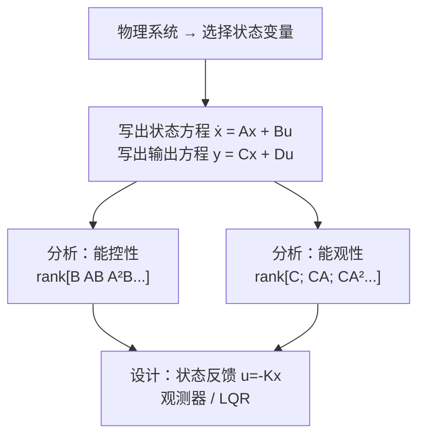

# CT-10: 状态空间方程

**副标题：ẋ=Ax+Bu——多维系统的统一建模语言**
**难度：**  专业级
**适用对象：** 电机控制工程师、控制系统设计者
**前置知识：** 线性代数（矩阵运算、特征值）、微分方程、传递函数

---

## 1.  核心摘要

**一句话：** 状态空间方程用一阶微分方程组描述系统的全部内部行为——不仅能表示输入-输出关系（如传递函数），还能刻画系统内部各物理量的动态交互，是现代控制理论（LQR、Kalman滤波、MPC）的数学基础。

**认知挂钩：** 传递函数像"黑箱"——只看输入输出。状态空间像"透明箱"——你能看到箱子内部每个齿轮（状态变量）如何转动、如何相互影响。对PMSM，状态空间让你同时看清 id、iq、ωm、θe 四个状态的耦合动态。

**核心流程：**


**传递函数 vs 状态空间：**
| 特性 | 传递函数 | 状态空间 |
|------|---------|---------|
| 描述维度 | 单输入单输出（SISO） | 多输入多输出（MIMO） |
| 内部状态 | 不可见 | 完全可见 |
| 初始条件 | 假设为零 | 任意初始状态 |
| 设计方法 | 频域（Bode, 根轨迹） | 时域（极点配置, LQR） |
| 电机应用 | 电流环PI设计 | 全状态反馈、无传感器观测器 |

---

## 2.  问题引入

**场景：** 你正在设计PMSM的无传感器FOC。需要同时控制 id、iq、ωm 三个变量（id→0, iq→转矩, ωm→速度）。传统方法：为每个变量设计独立的PI控制器，然后级联。

**问题：**
1. id、iq 通过反电动势相互耦合——独立PI无法完全解耦
2. 级联结构要求内环远快于外环——但在高速区，电流环和速度环的时间常数可能接近
3. 如何用统一的数学模型描述 id、iq、ωm 之间的全部耦合关系？

**答案：状态空间方法。** 将所有相关变量归为一个状态向量：

$$
\mathbf{x} = \begin{bmatrix} i_d \\ i_q \\ \omega_m \end{bmatrix}
$$

用一个矩阵微分方程描述它们的同时演化：

$$
\mathbf{\dot{x}} = \mathbf{A}\mathbf{x} + \mathbf{B}\mathbf{u}
$$

矩阵 A 的元素直接揭示了各状态之间的耦合强度和方向。

---

## 3.  直观理解

### 3.1 状态变量是什么？

状态变量是描述系统"记忆力"的最小变量集合——知道当前状态和未来输入，就能完全预测未来行为。

**电机的状态变量：**
- id, iq：电磁状态（电流建立了磁场）
- ωm：机械状态（转速储存了动能）
- θe：角度状态（转子位置）

### 3.2 状态方程的直观解释

$$
\underbrace{\begin{bmatrix} \dot{i}_d \\ \dot{i}_q \\ \dot{\omega}_m \end{bmatrix}}_{\mathbf{\dot{x}}} = 
\underbrace{\begin{bmatrix} -R/L & \omega_e & 0 \\ -\omega_e & -R/L & -\psi_f/L \\ 0 & K_t/J & -B/J \end{bmatrix}}_{\mathbf{A}}
\underbrace{\begin{bmatrix} i_d \\ i_q \\ \omega_m \end{bmatrix}}_{\mathbf{x}} + 
\underbrace{\begin{bmatrix} 1/L & 0 \\ 0 & 1/L \\ 0 & 0 \end{bmatrix}}_{\mathbf{B}}
\underbrace{\begin{bmatrix} u_d \\ u_q \end{bmatrix}}_{\mathbf{u}}
$$

**逐行解读：**

第1行：$\dot{i}_d = -\frac{R}{L}i_d + \omega_e i_q + \frac{1}{L}u_d$
- id的变化 = 电阻衰减 + 旋转耦合（ωe·iq 注入） + 控制输入

第2行：$\dot{i}_q = -\omega_e i_d - \frac{R}{L}i_q - \frac{\psi_f}{L}\omega_m + \frac{1}{L}u_q$
- iq的变化 = 旋转耦合 + 电阻衰减 + 反电动势 + 控制输入

第3行：$\dot{\omega}_m = \frac{K_t}{J}i_q - \frac{B}{J}\omega_m$
- ωm的变化 = 电磁转矩驱动 + 摩擦阻尼

### 3.3 A矩阵：系统的"基因图谱"

A矩阵的特征值 = 系统的极点（与传递函数极点一致）
A矩阵的非对角元素 = 状态之间的耦合

电机A矩阵中 ωe 出现在非对角位置 → 解释了"转速越高，d-q耦合越强"

---

## 4.  技术原理

### 4.1 状态空间标准形式

**连续时间：**
$$
\begin{cases}
\mathbf{\dot{x}}(t) = \mathbf{A}\mathbf{x}(t) + \mathbf{B}\mathbf{u}(t) \\
\mathbf{y}(t) = \mathbf{C}\mathbf{x}(t) + \mathbf{D}\mathbf{u}(t)
\end{cases}
$$

- x：n×1 状态向量
- u：m×1 输入向量
- y：p×1 输出向量
- A：n×n 系统矩阵
- B：n×m 输入矩阵
- C：p×n 输出矩阵
- D：p×m 直通矩阵（电机系统中通常为零）

### 4.2 PMSM dq轴状态空间模型

**状态变量：** x = [id, iq, ωm]ᵀ
**输入变量：** u = [ud, uq]ᵀ（或包含负载转矩作为扰动输入）
**输出变量：** y = [id, iq, ωm]ᵀ

**SPMSM完整模型：**

从电压方程和机械方程：

$$
\begin{cases}
\dot{i}_d = -\frac{R}{L}i_d + p\omega_m i_q + \frac{1}{L}u_d \\
\dot{i}_q = -p\omega_m i_d - \frac{R}{L}i_q - \frac{p\psi_f}{L}\omega_m + \frac{1}{L}u_q \\
\dot{\omega}_m = \frac{3p\psi_f}{2J}i_q - \frac{B}{J}\omega_m - \frac{1}{J}T_L
\end{cases}
$$

其中 p 为极对数。注意这里是非线性的（含有 ωm·id 和 ωm·iq 乘积项）。

**在工作点附近线性化：**

假设稳态工作点 (id0, iq0, ωm0, ud0, uq0)，小信号模型：

$$
\begin{bmatrix} \Delta\dot{i}_d \\ \Delta\dot{i}_q \\ \Delta\dot{\omega}_m \end{bmatrix} = 
\begin{bmatrix} -R/L & p\omega_{m0} & pi_{q0} \\ -p\omega_{m0} & -R/L & -p(i_{d0} + \psi_f/L) \\ 0 & \frac{3p\psi_f}{2J} & -B/J \end{bmatrix}
\begin{bmatrix} \Delta i_d \\ \Delta i_q \\ \Delta\omega_m \end{bmatrix} + 
\begin{bmatrix} 1/L & 0 \\ 0 & 1/L \\ 0 & 0 \end{bmatrix}
\begin{bmatrix} \Delta u_d \\ \Delta u_q \end{bmatrix}
$$

### 4.3 传递函数与状态空间的关系

从状态空间推导传递函数：

$$
\mathbf{G}(s) = \mathbf{C}(s\mathbf{I} - \mathbf{A})^{-1}\mathbf{B} + \mathbf{D}
$$

对于SISO系统：

$$
G(s) = \frac{\mathbf{C} \cdot \text{adj}(s\mathbf{I}-\mathbf{A}) \cdot \mathbf{B}}{\det(s\mathbf{I}-\mathbf{A})}
$$

分母多项式 = det(sI-A) = 特征多项式 → 极点 = A的特征值

**示例：电流环（id=0控制，低速，忽略耦合）：**
A = [-R/L], B = [1/L], C = [1] → $G(s) = \frac{1/L}{s + R/L} = \frac{1}{Ls+R}$

### 4.4 能控性（Controllability）

**定义：** 是否存在控制输入 u(t)，能在有限时间内将系统从任意初始状态 x(0) 驱动到任意目标状态 x(tf)？

**判别矩阵：**
$$
\mathcal{C} = [\mathbf{B} \quad \mathbf{AB} \quad \mathbf{A}^2\mathbf{B} \quad \cdots \quad \mathbf{A}^{n-1}\mathbf{B}]
$$

**判定：** rank(C) = n（满秩）→ 系统完全能控

**电机实例：** PMSM三阶模型，n=3

$$
\mathbf{B} = \begin{bmatrix} 1/L & 0 \\ 0 & 1/L \\ 0 & 0 \end{bmatrix}, \quad 
\mathbf{AB} = \begin{bmatrix} -R/L^2 & p\omega_{m0}/L \\ -p\omega_{m0}/L & -R/L^2 \\ 0 & \frac{3p\psi_f}{2JL} \end{bmatrix}
$$

计算 rank([B AB])即可。通常情况下 rank=3 → 完全能控（电压可以控制所有状态）。

**不控的情况：** 如果电机转子和定子完全断开（如缺相），某些状态无法控制。

### 4.5 能观性（Observability）

**定义：** 能否通过有限时间的输出测量 y(t)，唯一确定初始状态 x(0)？

**判别矩阵：**
$$
\mathcal{O} = \begin{bmatrix} \mathbf{C} \\ \mathbf{CA} \\ \mathbf{CA}^2 \\ \vdots \\ \mathbf{CA}^{n-1} \end{bmatrix}
$$

**判定：** rank(O) = n → 系统完全能观

**电机实例（只测量电流）：**
C = [I₂ₓ₂ | 0₂ₓ₁]（只输出 id, iq，不直接测量 ωm）

$$
\mathcal{O} = \begin{bmatrix} 1 & 0 & 0 \\ 0 & 1 & 0 \\ -R/L & p\omega_{m0} & p i_{q0} \\ -p\omega_{m0} & -R/L & -p(i_{d0}+\psi_f/L) \\ \cdots & \cdots & \cdots \end{bmatrix}
$$

**关键结论：** 当 ωm0 ≠ 0 时，通过测量 id/iq 可以间接估计 ωm——这就是无传感器控制的能观性基础！当 ωm0 = 0（静止）时，O 降秩 → 零速时无法从电流观测转速（解释了无传感器启动困难）。

### 4.6 离散时间状态空间

DSP实现需要离散化。前向欧拉法（最简单但不稳定）：

$$
\mathbf{x}[k+1] = (\mathbf{I} + T_s\mathbf{A})\mathbf{x}[k] + T_s\mathbf{B}\mathbf{u}[k]
$$

**精确离散化（零阶保持器ZOH）：**

$$
\mathbf{A}_d = e^{\mathbf{A}T_s}, \quad \mathbf{B}_d = \int_0^{T_s} e^{\mathbf{A}\tau}\mathbf{B} d\tau
$$

对于电机控制，Ts 很小（~62.5μs），通常可直接用欧拉近似。

### 4.7 对角化与模态分解

对 A 进行特征值分解：

$$
\mathbf{A} = \mathbf{V}\mathbf{\Lambda}\mathbf{V}^{-1}
$$

- Λ = diag(λ₁, λ₂, ...)：特征值矩阵（即极点）
- V：特征向量矩阵

变换 z = V⁻¹x → 解耦系统：

$$
\dot{\mathbf{z}} = \mathbf{\Lambda}\mathbf{z} + \mathbf{V}^{-1}\mathbf{B}\mathbf{u}
$$

每个模态 zi 独立演化 $\dot{z}_i = \lambda_i z_i + ...$，直观展示系统的多时间尺度行为。电机系统中，电流模态（快速）和速度模态（慢速）在Λ中表现为特征值数量级的差异。

---

## 5.  交叉视角：状态空间与电机控制的桥梁

### 5.1 MTPA控制的几何解释

MTPA问题在状态空间中：在状态约束 $i_d^2 + i_q^2 \leq I_{max}^2$ 下最大化转矩 $T_e = \frac{3}{2}p[\psi_f i_q + (L_d-L_q)i_d i_q]$。

状态空间视角：这是一个约束优化问题，最优解在约束边界的切点处。用拉格朗日乘子法求解即得到MTPA曲线——一条状态空间中的轨迹。

### 5.2 弱磁控制的能控性分析

弱磁控制涉及电压约束：$u_d^2 + u_q^2 \leq V_{max}^2$

状态空间视角：电压约束映射为状态变化率的约束（通过B矩阵）：

$$
\|\dot{\mathbf{x}} - \mathbf{A}\mathbf{x}\|_{\mathbf{B}^{-1}} \leq V_{max}
$$

当转速升高，A矩阵的耦合项增大，允许的状态变化率范围缩小。到达极限时，系统"能控性减弱"——某些状态组合无法达到。这就是电压饱和的本质。

### 5.3 无传感器控制的能观性条件

从能观性分析直接推导无传感器控制的可行性：

**必要条件：** rank(O) = n（状态全维）

对于 PMSM，当 ωm ≠ 0 且 id ≠ -ψf/Ld 时，从电流测量可观转速和角度。当 ωm = 0（静止）时，O 降秩——解释了为什么所有无传感器方法在零速/极低速时都需要特殊处理（如高频注入）。

### 5.4 离散化与实时实现

电机FOC的状态空间实现在每个PWM周期执行一次：

```c
void state_space_update(float x[3], float u[2], float dt) {
    float dx[3];
    dx[0] = A11*x[0] + A12*x[1] + A13*x[2] + B11*u[0] + B12*u[1];
    dx[1] = A21*x[0] + A22*x[1] + A23*x[2] + B21*u[0] + B22*u[1];
    dx[2] = A31*x[0] + A32*x[1] + A33*x[2];  // B31=B32=0
    x[0] += dx[0] * dt;
    x[1] += dx[1] * dt;
    x[2] += dx[2] * dt;
}
```

计算量：约 3×3+2 = 11次乘法 + 9次加法（非常轻量）。

### 5.5 hpm_MC 工程实践

**状态方程建模** (`hpm_mcl_v2/core/control/`):
- PMSM d/q 轴电压方程在 `hpm_mcl_v2` 中以差分方程形式离散化实现
- 电流环设计基于 d/q 轴解耦模型（前馈补偿交叉耦合项）
- SMC 滑模观测器基于 α/β 轴状态方程

参考: [SDK-01-HPM-MC-Architecture.md](../algorithm/HPM-MC/SDK-01-HPM-MC-Architecture.md) + [ALG-07-Sensorless-Observers.md](../algorithm/ALG-07-Sensorless-Observers.md)

---

## 6.  工程案例

### 案例1：id=0控制下PMSM的完整状态空间模型

**参数：** Ld=Lq=0.8mH, Rs=0.15Ω, p=4, ψf=0.1Wb, J=0.0005kg·m², B=0.0001N·m·s/rad

**状态空间（id=0工作点线性化，ωm0=300rad/s ≈ 2865rpm）：**

$$
\mathbf{A} = \begin{bmatrix}
-187.5 & 1200 & 0 \\
-1200 & -187.5 & -500 \\
0 & 1200 & -0.2
\end{bmatrix}
$$

**特征值：** λ₁ = -193.8 + j1196.2, λ₂ = -193.8 - j1196.2, λ₃ = -0.2

**解读：**
- λ₁,₂：电流环极点（快速动态），自然频率≈1210rad/s(193Hz)，阻尼比 0.16→欠阻尼
- λ₃：速度环极点（慢速动态），对应时间常数 τ=5s（仅摩擦阻尼，极慢）
- 电流和速度的时间尺度差约600倍→解释了为什么级联控制有效

### 案例2：从状态空间推导电流环传递函数

部分输出（只看id, iq，忽略ωm时），系统简化为：

$$
\mathbf{A}_{dq} = \begin{bmatrix} -R/L & \omega_e \\ -\omega_e & -R/L \end{bmatrix}, \quad
\mathbf{B}_{dq} = \begin{bmatrix} 1/L & 0 \\ 0 & 1/L \end{bmatrix}
$$

传递函数矩阵：

$$
\mathbf{G}(s) = \begin{bmatrix} i_d(s) \\ i_q(s) \end{bmatrix} = 
\frac{1}{(s+R/L)^2 + \omega_e^2} \begin{bmatrix} \frac{s+R/L}{L} & \frac{\omega_e}{L} \\ -\frac{\omega_e}{L} & \frac{s+R/L}{L} \end{bmatrix} \begin{bmatrix} u_d \\ u_q \end{bmatrix}
$$

揭示了交叉耦合：$i_d(s) = \frac{s+R/L}{L\Delta(s)}u_d + \frac{\omega_e}{L\Delta(s)}u_q$ —— ud不仅影响id，还通过ωe耦合影响iq。

---

## 7.  实践练习

### 练习1：PMSM状态空间建模
给定电机参数，写出五阶状态空间模型（状态：id, iq, ωm, θe, TL_hat），分析能控性和能观性。

### 练习2：离散化精度分析
将电流环连续状态空间分别用欧拉法和ZOH法离散化，对比在16kHz vs 8kHz下的极点偏差。

### 练习3：MATLAB仿真
用MATLAB的ss()和c2d()函数建立PMSM的离散状态空间模型，验证阶跃响应与连续系统的差异。

---

## 8.  前沿拓展

### 8.1 非线性状态空间（LPV模型）

电机模型本质上是非线性的（A矩阵含ωm）。线性参数变化（LPV）模型将非线性系统表示为：

$$
\dot{\mathbf{x}} = \mathbf{A}(\rho)\mathbf{x} + \mathbf{B}(\rho)\mathbf{u}
$$

其中 ρ 是调度变量（如 ωm）。在每一调度点设计控制器，通过插值实现全工况控制。

### 8.2 降阶模型

对于多物理域耦合系统（如电机+传动轴+负载），状态空间维数可能很高。通过平衡截断（balanced truncation）保留主导模态，将几十阶模型降为几阶，大幅降低计算量。

### 8.3 数据驱动的状态空间识别

当电机参数未知时，通过输入输出数据用子空间辨识法（N4SID）直接估计A、B、C矩阵。这在老旧电机改造和参数在线辨识中很有价值。

---

## 关键公式速查表

| 名称 | 公式 | 说明 |
|------|------|------|
| 状态方程 | $\dot{\mathbf{x}} = \mathbf{A}\mathbf{x} + \mathbf{B}\mathbf{u}$ | 连续时间 |
| 输出方程 | $\mathbf{y} = \mathbf{C}\mathbf{x} + \mathbf{D}\mathbf{u}$ | 测量输出 |
| 传递函数 | $\mathbf{G}(s) = \mathbf{C}(s\mathbf{I}-\mathbf{A})^{-1}\mathbf{B} + \mathbf{D}$ | s域 |
| 能控性矩阵 | $\mathcal{C} = [\mathbf{B}\ \mathbf{AB}\ \cdots\ \mathbf{A}^{n-1}\mathbf{B}]$ | 秩=n |
| 能观性矩阵 | $\mathcal{O} = [\mathbf{C};\ \mathbf{CA};\ \cdots;\ \mathbf{CA}^{n-1}]$ | 秩=n |
| 离散ZOH | $\mathbf{A}_d = e^{\mathbf{A}T_s}, \mathbf{B}_d = \int_0^{T_s}e^{\mathbf{A}\tau}d\tau\mathbf{B}$ | 精确离散 |
| 特征多项式 | $\det(s\mathbf{I} - \mathbf{A})$ | 极点 |
| 对角化 | $\mathbf{A} = \mathbf{V}\mathbf{\Lambda}\mathbf{V}^{-1}$ | 模态解耦 |

>  检验你的理解：[CT-10 检验题目](./CT-10-assessment.md)
