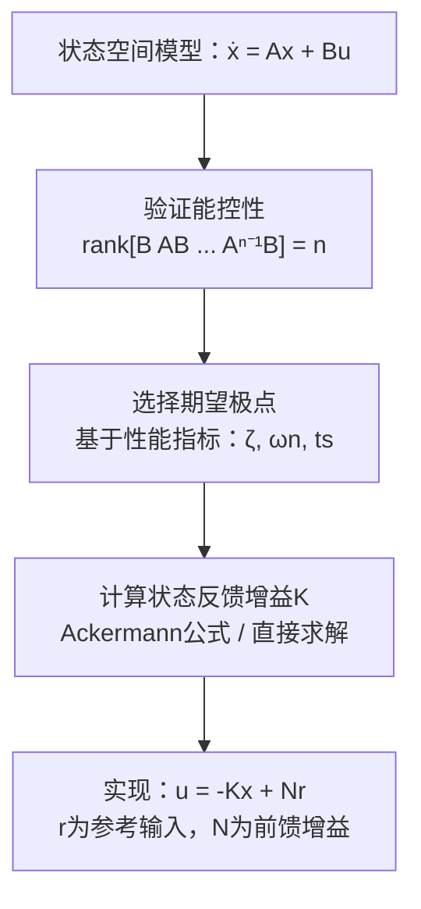

# CT-12: 状态反馈与极点配置

**副标题：u=-Kx——全状态信息下的最优控制架构**
**难度：**  专家级
**适用对象：** 伺服驱动高级工程师、控制算法开发者
**前置知识：** 状态空间方程、能控性分析、极点位置与动态响应、LQR基础

---

## 1.  核心摘要

**一句话：** 状态反馈通过 u=-Kx 将所有状态变量反馈回输入端，用极点配置方法将闭环极点精确放置在期望位置，实现比传统PID级联更优的多变量协调控制——在电机控制中，可以同时优化电流响应和转速阻尼，避免级联结构的内外环带宽约束。

**认知挂钩：** PID控制是"只看输出误差来调整输入"（单变量）；状态反馈是"看清所有内部状态，一次决定最优输入"（多变量）。就像开车：PID只看车速表来调油门；状态反馈同时看车速、加速度、引擎转速、档位——做出的决策更全面、更协调。

**核心流程：**

**状态反馈 vs PI控制：**
| 特性 | PI级联控制 | 全状态反馈 |
|------|-----------|-----------|
| 设计维度 | 逐环独立（电流→速度→位置） | 所有状态联合设计 |
| 耦合处理 | 需前馈解耦 | 天然处理（K矩阵的非对角项） |
| 带宽约束 | 内环>>外环（5~10倍） | 无严格约束 |
| 参数数量 | 6个（3环×PI各2参数） | n×m个（K矩阵元素） |
| 鲁棒性 | 经验丰富、调试直观 | 需额外鲁棒设计 |
| 电机应用 | 通用FOC | 高性能伺服 |

---

## 2.  问题引入

**场景：** 你正在调试一台高动态伺服电机的位置环。传统三环级联（位置→速度→电流）PI控制存在两个问题：

1. **带宽瓶颈：** 规则说电流环带宽 ≥ 5×速度环带宽 ≥ 25×位置环带宽。当位置环需要30Hz带宽时，电流环需要750Hz——这对低电感电机不算什么，但对高电感大功率电机可能已达极限。

2. **振荡耦合：** 电流环和速度环各自调好后，联调时发现某些转速下有低频振荡——两环之间的动态交互没有被PI结构捕获。

**问题：能否打破"电流→速度→位置"的一环套一环结构，用一个统一控制器同时管理所有状态？**

**答案：全状态反馈。** 将 id、iq、ωm、θe（甚至加上积分状态）放入一个状态向量，设计一个增益矩阵K，使得：

- u_d = -K₁₁·id - K₁₂·iq - K₁₃·ωm - K₁₄·θe（而不是只有PI(id_ref - id)）
- u_q = -K₂₁·id - K₂₂·iq - K₂₃·ωm - K₂₄·θe（而不是PI(iq_ref - iq)）

K矩阵的非对角元（K₁₂, K₁₃, K₂₁, K₂₄...）自动处理了所有交叉耦合！

---

## 3.  直观理解

### 3.1 状态反馈 = "给每个状态分配一个权重"

控制律 u = -Kx 展开为：

$$
u_d = -[k_{11}i_d + k_{12}i_q + k_{13}\omega_m + k_{14}\theta_e]
$$

- k₁₁·id：id自身的负反馈（类似P控制）
- k₁₂·iq：iq对id的交叉补偿（自动解耦！）
- k₁₃·ωm：转速信息用于改善id的动态
- k₁₄·θe：角度信息（如用于位置环）

**传统PI做不到k₁₂和k₁₃——这就是状态反馈的优势。**

### 3.2 极点配置 = "给系统安装期望的动态特性"

如果把系统比作一辆车：
- 传统PI：只调油门踏板（一个输入）来控制速度（一个输出）
- 极点配置：同时决定油门、刹车、方向盘（多输入）的协调动作，让车辆的"速度-方向-姿态"（多状态）按照你设计的动力学特性（期望极点）运行

### 3.3 为什么极点配置在电机中有效？

因为PMSM的A矩阵包含的耦合项（ωe出现在A₁₂, A₂₁位置）在K矩阵中可以被"反耦合"——K₁₂=-ωe·L就是天然的"解耦+阻尼"项。

---

## 4.  技术原理

### 4.1 全状态反馈的数学形式

**控制律：**

$$
\mathbf{u} = -\mathbf{K}\mathbf{x} + \mathbf{N}r
$$

- K：m×n 状态反馈增益矩阵
- N：m×m 前馈增益矩阵（保证稳态无差）
- r：参考输入

**闭环系统：**

$$
\dot{\mathbf{x}} = (\mathbf{A} - \mathbf{B}\mathbf{K})\mathbf{x} + \mathbf{B}\mathbf{N}r
$$

闭环系统矩阵为 A-BK。极点配置 = 选择K使 A-BK 的特征值等于期望极点。

### 4.2 Ackermann公式（SISO）

对于单输入系统 (A, B)：

$$
\mathbf{K} = [0\ 0\ \cdots\ 0\ 1] \cdot \mathcal{C}^{-1} \cdot \phi_c(\mathbf{A})
$$

其中：
- $\mathcal{C}$：能控性矩阵 [B AB ... Aⁿ⁻¹B]
- $\phi_c(\mathbf{A})$：期望特征多项式代入A矩阵

$$
\phi_c(\mathbf{A}) = \mathbf{A}^n + a_{n-1}\mathbf{A}^{n-1} + \cdots + a_1\mathbf{A} + a_0\mathbf{I}
$$

系数 $a_i$ 来自期望特征多项式：

$$
\phi_c(s) = (s - \lambda_1)(s - \lambda_2)\cdots(s - \lambda_n) = s^n + a_{n-1}s^{n-1} + \cdots + a_0
$$

### 4.3 MIMO系统的极点配置

PMSM通常有2个输入（ud, uq）→ MIMO系统（m=2, n=3或4）。

MIMO极点配置不像SISO有唯一解。常用方法：
- **直接求解Lyapunov方程**
- **MATLAB place() 函数**（基于鲁棒特征值分配）

### 4.4 PMSM状态反馈电流控制器

**状态：** x = [id, iq]ᵀ（仅电流环，二阶）
**输入：** u = [ud, uq]ᵀ
**期望极点：** s₁ = s₂ = -ωc（两个相等的负实根，临界阻尼）

$$
\mathbf{A} = \begin{bmatrix} -R/L & \omega_e \\ -\omega_e & -R/L \end{bmatrix}, \quad
\mathbf{B} = \begin{bmatrix} 1/L & 0 \\ 0 & 1/L \end{bmatrix}
$$

期望特征多项式：$(s + \omega_c)^2 = s^2 + 2\omega_c s + \omega_c^2$

直接求解 $\det(s\mathbf{I} - (\mathbf{A} - \mathbf{B}\mathbf{K})) = (s+\omega_c)^2$：

$$
\mathbf{K} = \begin{bmatrix} \omega_c L - R & \omega_e L \\ -\omega_e L & \omega_c L - R \end{bmatrix}
$$

**关键发现：** K₁₂ = ωeL, K₂₁ = -ωeL ——状态反馈自动包含了与转速成正比的前馈解耦项！这解释了为什么状态反馈天然能处理dq耦合。

展开控制律：

$$
u_d = -(\omega_c L - R)i_d - \omega_e L \cdot i_q
$$
$$
u_q = \omega_e L \cdot i_d - (\omega_c L - R)i_q
$$

第1项是P控制，第2项是自动解耦——比"PI+前馈解耦"更简洁优雅。

### 4.5 PMSM三阶状态反馈（电流+转速）

**状态：** x = [id, iq, ωm]ᵀ
**输入：** u = [ud, uq]ᵀ
**期望极点：**
- s₁, s₂：电流环（快速），配置在 -800（临界阻尼）
- s₃：速度环（慢速），配置在 -50（对应时间常数20ms）

A矩阵需要在工作点线性化。K矩阵为2×3：

$$
\mathbf{K} = \begin{bmatrix} k_{11} & k_{12} & k_{13} \\ k_{21} & k_{22} & k_{23} \end{bmatrix}
$$

设计了6个参数→取代了电流环PI（4参数）+速度环PI（2参数）=6参数，但参数之间有内在联系（不是独立调出来的6个数）。

### 4.6 前馈增益N的设计

状态反馈 u=-Kx 只能调节动态（极点），不能保证稳态（输出=y_ref）。

需要前馈N使 y→r：

$$
\mathbf{N} = (\mathbf{C}(-\mathbf{A} + \mathbf{B}\mathbf{K})^{-1}\mathbf{B})^{-1}
$$

物理意义：N补偿了K引入的稳态增益变化。

### 4.7 积分增强（无差控制）

状态反馈自身不能消除稳态误差。在状态向量中增加积分状态：

$$
\dot{x}_I = r - y = r - \mathbf{C}\mathbf{x}
$$

扩展系统：

$$
\begin{bmatrix} \dot{\mathbf{x}} \\ \dot{x}_I \end{bmatrix} = 
\begin{bmatrix} \mathbf{A} & \mathbf{0} \\ -\mathbf{C} & 0 \end{bmatrix}
\begin{bmatrix} \mathbf{x} \\ x_I \end{bmatrix} + 
\begin{bmatrix} \mathbf{B} \\ 0 \end{bmatrix}\mathbf{u} + 
\begin{bmatrix} \mathbf{0} \\ 1 \end{bmatrix}r
$$

对这个扩展系统设计K → 控制器自动包含积分作用。

---

## 5.  交叉视角：状态反馈与电机控制的桥梁

### 5.1 电流环：状态反馈 vs PI+前馈

**PI+前馈解耦：**
- 需要人为设计解耦项 $u_d^{dec} = -\omega_e L_q i_q$
- PI参数和解耦参数独立设计
- 如果L_q不准 → 解耦不彻底

**状态反馈：**
- K₁₂ = ωe L 自动出现在K矩阵中
- 只需要电机参数准确 → K自动处理耦合
- 即使参数有 ±20% 误差，K的非对角项也能部分解耦

### 5.2 速度-位置一体化控制

传统三环级联中，位置环在最外层，带宽最低。状态反馈可以同时对所有状态施加控制：

- K₁₄（θe→ud）：角度误差影响d轴电压 → 辅助弱磁
- K₂₃（ωm→uq）：转速反馈 → 相当于速度PI
- K₂₄（θe→uq）：角度反馈 → 相当于位置PI

所有增益通过**极点配置统一计算**，避免了逐环调参的反复。

### 5.3 离散时间实现

DSP中实现：$\mathbf{u}[k] = -\mathbf{K}\mathbf{x}[k] + \mathbf{N}r[k]$

对于PMSM：
- x = [id_meas, iq_meas, ωm_est, θe_est]ᵀ
- u = [ud_cmd, uq_cmd]ᵀ
- K = 2×4矩阵（8个系数）

每次控制循环只需 **8次乘法 + 6次加法** →计算量远小于3个PI控制器！

### 5.4 hpm_MC 工程实践

**弱磁控制状态反馈** (`hpm_mcl_v2/core/control/`):
- 弱磁控制本质是 d 轴电流的状态反馈：根据速度反馈调整 Id_ref 弱磁分量
- `hpm_mcl_v2` 中弱磁策略集成在路径规划中（超越基速时自动降额加速度）
- 应用层可在 d 轴电流参考中注入弱磁分量

参考: [SDK-05-HPM-MC-v2-Path-Plan.md](../algorithm/HPM-MC/SDK-05-HPM-MC-v2-Path-Plan.md) 第6节「弱磁控制关联」

---

## 6.  工程案例

### 案例1：状态反馈电流环设计

**电机：** L=0.5mH, R=0.08Ω, ωe=1000rad/s

**期望电流环带宽：** ωc=2000rad/s（318Hz）

**计算K：**

$$
\mathbf{K} = \begin{bmatrix} 2000\times0.0005-0.08 & 1000\times0.0005 \\ -1000\times0.0005 & 2000\times0.0005-0.08 \end{bmatrix} = 
\begin{bmatrix} 0.92 & 0.5 \\ -0.5 & 0.92 \end{bmatrix}
$$

**控制律：**
- ud = -0.92·id - 0.5·iq + 0.92·id_ref（N的简化形式）
- uq = 0.5·id - 0.92·iq + 0.92·iq_ref

**性能：** 闭环极点 s=-2000（双重根），电流阶跃响应无超调，调节时间 2/2000=1ms。

### 案例2：三阶状态反馈（电流+速度）

**扩展状态：** x=[id, iq, ωm]ᵀ, u=[ud, uq]ᵀ

**期望极点：** s₁,₂ = -3000（电流，快）, s₃ = -80（速度，τ=12.5ms）

**K矩阵（2×3）：**

$$K = \begin{bmatrix} 1.42 & 0.5 & 0.02 \\ -0.5 & 1.42 & 0.08 \end{bmatrix}$$

**解读：**
- K₁₃=0.02：id通过转速反馈微调（弱磁辅助）
- K₂₃=0.08：转速反馈到uq → 速度PI的等效效果
- K₂₃=0.08 对比传统PI：如果Ksp=K₂₃/(Kt/J)=0.08/(0.5/0.001)=1.6×10⁻⁴——数值虽小，但自动纳入了与电流环的协调。

---

## 7.  实践练习

### 练习1：二阶状态反馈设计
给定电机L,R，设计电流环状态反馈，使闭环带宽1.5kHz（临界阻尼）。对比状态反馈和传统PI+前馈的控制律。

### 练习2：极点位置对K矩阵的影响
改变期望极点位置（ζ=0.5, 0.707, 1.0），观察K矩阵各元素的变化规律。

### 练习3：状态反馈参数鲁棒性
电感L变化±30%时，状态反馈控制器的实际闭环极点偏离期望多少？与PI控制器对比。

---

## 8.  前沿拓展

### 8.1 鲁棒极点配置

传统极点配置假设模型精确。鲁棒极点配置考虑参数不确定性，将极点配置在"区域"而非精确点——如配置在左半平面Re(s)<-σ₀, ζ>ζ₀的梯形区域。

### 8.2 基于LMI的约束极点配置

线性矩阵不等式（LMI）方法可将极点配置在满足多种约束（D-稳定性区域）的凸优化问题中求解。适用于电机参数大范围变化的场景。

### 8.3 自适应状态反馈

在线辨识L,R → 实时更新K矩阵 → 闭环极点始终在期望位置。这比自适应PI更系统——PI只有2~3个自由度，K矩阵有更多自由度来应对参数变化。

---

## 关键公式速查表

| 名称 | 公式 | 说明 |
|------|------|------|
| 状态反馈 | $\mathbf{u} = -\mathbf{K}\mathbf{x} + \mathbf{N}r$ | K由极点配置得到 |
| 闭环系统 | $\dot{\mathbf{x}} = (\mathbf{A}-\mathbf{B}\mathbf{K})\mathbf{x} + \mathbf{B}\mathbf{N}r$ | A-BK的特征值=极点 |
| Ackermann | $\mathbf{K} = [0..1]\mathcal{C}^{-1}\phi_c(\mathbf{A})$ | SISO极点配置 |
| 期望特征多项式 | $\phi_c(s)=\prod(s-\lambda_i)=s^n+a_{n-1}s^{n-1}+...+a_0$ | 期望极点→系数 |
| 前馈增益 | $\mathbf{N}=(\mathbf{C}(-\mathbf{A}+\mathbf{B}\mathbf{K})^{-1}\mathbf{B})^{-1}$ | 保证稳态无差 |
| 扩展系统 | $\dot{\mathbf{x}}_e = \mathbf{A}_e\mathbf{x}_e + \mathbf{B}_e\mathbf{u}$ | 增加积分状态 |
| PMSM电流K | $k_{ii}=\omega_c L-R$, $k_{ij}=\pm\omega_e L$ | 自动解耦 |

>  检验你的理解：[CT-12 检验题目](./CT-12-assessment.md)
