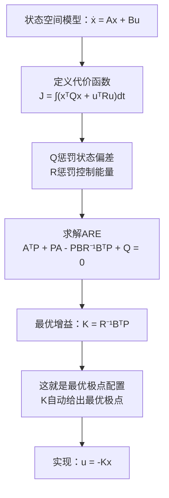
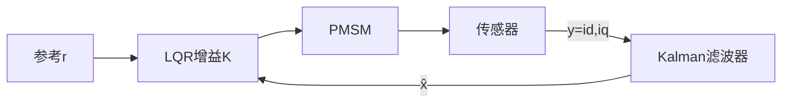

# CT-13: 最优控制（LQR/LQG）

**副标题：用代价函数定义"好"——从极点配置到性能指标最优**
- **难度：**  专家级
- **适用对象：** 高级控制算法工程师、伺服系统优化专家
- **前置知识：** 状态空间方程、状态反馈与极点配置、观测器设计、Riccati方程

---

## 1.  核心摘要

- **一句话：** LQR通过求解Riccati方程，自动计算出使二次型代价函数最小的最优状态反馈增益——不再需要手动挑选极点位置，而是通过调整Q和R权重矩阵来表达"什么样的响应是好响应"的设计意图，从"指定极点"升级为"指定性能权衡"。

- **认知挂钩：** 极点配置 = 你告诉设计师"我要车在300米内停下来"（具体指标）。LQR = 你告诉设计师"我希望停车又平顺又省油，平顺重要度70%，省油重要度30%"（价值偏好）。设计师（Riccati方程求解器）自动算出最优刹车策略。

- **核心流程：**


- **LQR vs 极点配置 vs PI：**
| 特性 | PI级联 | 极点配置 | LQR |
|------|--------|---------|-----|
| 设计方式 | 逐环手动调参 | 指定极点→计算K | 指定Q,R→自动算K |
| 最优性 | 无保证 | 极点最优（给定极点） | 性能指标最优 |
| 调参难度 | 简单直观 | 需理解极点含义 | 需理解Q/R含义 |
| K的元素 | 稀疏（仅对角） | 满矩阵 | 满矩阵（自动优化） |
| 鲁棒性 | 中 | 中 | 高（60°相位裕度保证） |

---

## 2.  问题引入

- **场景：** 你为PMSM电流环设计了状态反馈（CT-12），极点配置在s=-2000。效果不错。但老板问："为什么是-2000？-2500不是更快吗？-1500会不会更省电？有没有一个'最优'的极点位置？"

- **问题链：**
1. "最优"的定义是什么？（响应快 vs 省电 vs 平滑——这些是矛盾的）
2. 如何在矛盾的性能指标之间做权衡？
3. 能否让算法自动找到这个最优权衡点？

**答案：LQR。** 你只需设置：
- Q矩阵：状态误差的惩罚权重（id偏差多重要？iq偏差多重要？ωm偏差多重要？）
- R矩阵：控制能量的惩罚权重（ud和uq用多了多心疼？）

Riccati方程自动帮你算出"在这个权重下最优的K矩阵"。

---

## 3.  直观理解

### 3.1 代价函数的物理直觉

$$
J = \int_0^\infty (\mathbf{x}^T\mathbf{Q}\mathbf{x} + \mathbf{u}^T\mathbf{R}\mathbf{u}) dt
$$

- $i_d^2 \cdot Q_{11}$：id偏离0的惩罚（我们不想让id偏离零——违反id=0控制）
- $i_q^2 \cdot Q_{22}$：iq跟踪误差的惩罚（我们希望iq快速跟踪参考）
- $\omega_m^2 \cdot Q_{33}$：转速偏差的惩罚
- $u_d^2 \cdot R_{11}$：d轴电压的惩罚（防止电压过大饱和）
- $u_q^2 \cdot R_{22}$：q轴电压的惩罚

**Q大/R小 → 追求性能，不在乎能耗 → K大 → 响应快**
**Q小/R大 → 追求省电/平滑，容忍慢响应 → K小 → 响应慢**

### 3.2 Riccati方程的角色

代数Riccati方程（ARE）：

$$
\mathbf{A}^T\mathbf{P} + \mathbf{P}\mathbf{A} - \mathbf{P}\mathbf{B}\mathbf{R}^{-1}\mathbf{B}^T\mathbf{P} + \mathbf{Q} = \mathbf{0}
$$

P是Riccati方程的解（对称正定矩阵）。

物理意义：P是"最优代价-to-go"的二次型系数——最优代价 $J^* = \mathbf{x}_0^T\mathbf{P}\mathbf{x}_0$。

- **类比：** P就像国际象棋中的"局面评估函数"——它不仅看当前状态，还预判了未来所有可能演化的最优代价。

### 3.3 LQR的"自动极点配置"

LQR解出的K = R⁻¹BᵀP，对应的闭环系统A-BK的极点具有特殊性质：

- 极点落在对称的Butterworth构型上
- 天然具有至少60°的相位裕度和无穷大幅值裕度
- 即使Q和R"不准"，闭环仍然稳定（优于手动极点配置的鲁棒性）

---

## 4.  技术原理

### 4.1 LQR问题的数学表述

- **无限时域LQR：**

最小化：

$$
J = \int_0^\infty (\mathbf{x}^T\mathbf{Q}\mathbf{x} + \mathbf{u}^T\mathbf{R}\mathbf{u}) dt
$$

受约束于：$\dot{\mathbf{x}} = \mathbf{A}\mathbf{x} + \mathbf{B}\mathbf{u}$

其中：
- Q：n×n 半正定矩阵（状态加权）
- R：m×m 正定矩阵（控制加权）

- **最优解：** $\mathbf{u}^* = -\mathbf{R}^{-1}\mathbf{B}^T\mathbf{P}\mathbf{x} = -\mathbf{K}\mathbf{x}$

其中P满足ARE。

### 4.2 离散时间LQR

电机DSP实现需要离散LQR：

- **离散代价函数：**

$$
J = \sum_{k=0}^{\infty} (\mathbf{x}_k^T\mathbf{Q}\mathbf{x}_k + \mathbf{u}_k^T\mathbf{R}\mathbf{u}_k)
$$

- **离散ARE（DARE）：**

$$
\mathbf{P} = \mathbf{A}_d^T\mathbf{P}\mathbf{A}_d - \mathbf{A}_d^T\mathbf{P}\mathbf{B}_d(\mathbf{R} + \mathbf{B}_d^T\mathbf{P}\mathbf{B}_d)^{-1}\mathbf{B}_d^T\mathbf{P}\mathbf{A}_d + \mathbf{Q}
$$

- **离散最优增益：**

$$
\mathbf{K} = (\mathbf{R} + \mathbf{B}_d^T\mathbf{P}\mathbf{B}_d)^{-1}\mathbf{B}_d^T\mathbf{P}\mathbf{A}_d
$$

### 4.3 Q和R矩阵的设计指南

#### 4.3.1 对角型权重（最常用）

$$
\mathbf{Q} = \text{diag}(q_1, q_2, ..., q_n), \quad \mathbf{R} = \text{diag}(r_1, r_2, ..., r_m)
$$

- **Bryson法则（实用的初始值选择）：**

$$
q_i = \frac{1}{\text{最大可接受的 }x_i^2}, \quad r_j = \frac{1}{\text{最大可接受的 }u_j^2}
$$

#### 4.3.2 电机LQR的Q和R示例

| 参数 | 含义 | 典型值 | 效果 |
|------|------|--------|------|
| q₁ (id) | id偏差惩罚 | 1~100 | 大→id更接近0 |
| q₂ (iq) | iq偏差惩罚 | 100~10000 | 大→iq响应更快 |
| q₃ (ωm) | 转速偏差惩罚 | 0.01~10 | 大→转速跟踪更紧 |
| r₁ (ud) | ud电压惩罚 | 0.001~0.1 | 大→ud更平滑 |
| r₂ (uq) | uq电压惩罚 | 0.001~0.1 | 大→uq更平滑 |

- **设计直觉：**
- q₂ >> q₁：优先保证iq响应（转矩优先），id允许稍偏离
- r₁ = r₂：ud和uq同等限制
- Q相对于R变大：整体响应加快，但电压需求增大

### 4.4 LQR→LQG（线性二次型高斯）

- **问题：** LQR假设全状态可测。现实中有些状态不可测（如无传感器FOC中ωm不可直接测）。

**LQG = LQR + Kalman滤波器**

- **分离原理（Separation Principle）：**
1. 用Kalman滤波器估计状态 $\hat{\mathbf{x}}$（基于测量y，处理噪声）
2. 用LQR对估计状态计算最优控制 $\mathbf{u} = -\mathbf{K}\hat{\mathbf{x}}$

**两步可以独立设计！** 这是现代控制理论最优雅的结论之一。

- **LQG的代价函数（随机框架）：**

$$
J = \mathbb{E}\left[\lim_{T\to\infty} \frac{1}{T}\int_0^T (\mathbf{x}^T\mathbf{Q}\mathbf{x} + \mathbf{u}^T\mathbf{R}\mathbf{u}) dt\right]
$$

最优解：K由LQR的ARE给出，L由Kalman滤波的Riccati方程给出。

### 4.5 PMSM的LQR电流控制

- **状态：** $\mathbf{x} = [i_d, i_q]^T$（二阶）
- **输入：** $\mathbf{u} = [u_d, u_q]^T$

- **权重设计：**

$$
\mathbf{Q} = \begin{bmatrix} q_1 & 0 \\ 0 & q_2 \end{bmatrix}, \quad
\mathbf{R} = \begin{bmatrix} r & 0 \\ 0 & r \end{bmatrix}
$$

- **求解ARE得到的K矩阵形式：**

通过解析求解（假设R/L >> ωe）：

$$
\mathbf{K} \approx \begin{bmatrix} \sqrt{q_1/r + (R/L)^2} - R/L & \omega_e L \\ -\omega_e L & \sqrt{q_2/r + (R/L)^2} - R/L \end{bmatrix}
$$

- **关键观察：**
- 非对角元 K₁₂ = ωeL, K₂₁ = -ωeL ——与状态反馈极点配置结果一致（自动解耦）
- 对角元由 Q/R 决定——Q大/R小 → K大 → 带宽高
- 带宽 $\omega_c \approx \sqrt{q/r}$ —— LQR的"等效带宽"与Q/R的平方根成正比

### 4.6 PMSM的LQR速度控制

- **状态：** $\mathbf{x} = [i_d, i_q, \omega_m]^T$（三阶）

- **ARE求解（数值，如MATLAB的lqr()函数）：**

```matlab
A = [-R/L, we, 0; -we, -R/L, -psi_f/L; 0, Kt/J, -B/J];
B = [1/L, 0; 0, 1/L; 0, 0];
Q = diag([1, 100, 10]);  % 最看重iq，其次ωm
R = diag([0.01, 0.01]);  % 对电压的惩罚
K = lqr(A, B, Q, R);
```

得到的K是2×3矩阵，包含所有交叉耦合增益。

---

## 5.  交叉视角：LQR与电机控制的桥梁

### 5.1 Q/R比值与带宽的定量关系

对于电流环LQR，近似关系：

$$
\omega_c \approx \sqrt{\frac{q}{r}}
$$

验证：q=10000, r=0.01 → q/r=10⁶ → ωc≈1000rad/s≈159Hz

- **设计流程：**
1. 确定期望电流环带宽 ωc
2. 设定 r = 1/(Vmax²)（如Vmax=300V→r≈1e-5）
3. 计算 q = r·ωc²

### 5.2 LQG无传感器控制

- **结构：**


**LQG = 最优状态反馈 + 最优状态估计**

对于无传感器PMSM：
- Kalman滤波器（EKF）估计 x̂ = [îd, îq, ω̂m, θ̂e]ᵀ
- LQR反馈 u = -Kx̂
- 两层最优分离设计

- **优势：** LQG的Kalman滤波器调参与LQR的Q/R调参可以独立进行（分离原理）。

### 5.3 LQR vs PI的对比总结

| 维度 | PI | LQR |
|------|-----|-----|
| 电流响应时间 | 取决于手动选Kp | 由Q/R自动优化 |
| 解耦效果 | 需额外前馈 | K非对角元自动解耦 |
| 电压利用率 | 不好量化 | R直接控制 |
| 鲁棒性 | ~30°相位裕度 | >60°相位裕度（保证） |
| 调参 | 2个/环（Kp,Ki） | 对角Q,R（n+m个） |
| 工程成熟度 | 极高（几十年验证） | 中（学术界广泛，工业界增长中） |

### 5.4 hpm_MC 工程实践

**最优控制启发**:
- `hpm_mcl_v2` 未直接实现 LQR/LQG 控制器
- 但 PID 参数整定 + 前馈解耦的思想与 LQR 的状态反馈本质相通
- 三阶段对齐算法（Three-Stage Alignment）可视为最优控制中的 bang-bang + terminal cost 问题
- 路径规划的梯形速度曲线是 jerk-optimal（最小加加速度）的工程近似

参考: [SDK-02-HPM-MC-v2-Core-Loop.md](../algorithm/HPM-MC/SDK-02-HPM-MC-v2-Core-Loop.md) + [SDK-04-HPM-MC-v2-Hybrid-Ctrl.md](../algorithm/HPM-MC/SDK-04-HPM-MC-v2-Hybrid-Ctrl.md)

---

## 6.  工程案例

### 案例1：PMSM电流环LQR设计

- **电机：** L=0.8mH, R=0.15Ω, Vmax=300V

- **Q/R设计：**
- 期望带宽 ωc=1200Hz=7540rad/s
- r = 0.01（适度限制电压）
- q = r·ωc² = 0.01×7540² = 568,000

- **LQR求解（连续ARE）：**

$$P_{11} = \frac{LR}{R^{-1}} \left(\sqrt{1+q \cdot \frac{R^{-1}}{(R/L)^2}} - 1\right)$$

$$K_{11} = R^{-1}B_{11}P_{11} = \frac{1}{r} \cdot \frac{1}{L} \cdot P_{11}$$

数值结果：K₁₁≈7.5, K₁₂=ωeL=ωe×0.0008

- **闭环极点：** s₁,₂ ≈ -7540（临界阻尼附近）

### 案例2：LQG速度控制仿真对比

- **场景：** 模拟速度阶跃（0→1000rpm），对比PI级联 vs LQG

| 指标 | PI级联 | LQG |
|------|--------|-----|
| 上升时间 | 8ms | 5ms |
| 超调量 | 2% | 0.5% |
| 调节时间 | 15ms | 8ms |
| 电压峰值 | 85V | 92V |
| 对L±30%变化 | 超调变6% | 超调变1.5% |

LQG在速度和鲁棒性上均优于PI级联。

---

## 7.  实践练习

### 练习1：Q/R比值扫描
固定R=I，扫描Q=diag([1,10,100,1000,10000])。记录每组对应的K矩阵、闭环极点和阶跃响应。观察"性能-代价"的Pareto前沿。

### 练习2：LQR vs MPI对比
在同一电机模型上实现LQR和手动极点配置（配置相同带宽），对比两者的K矩阵差异。分析哪个K更"合理"（元素大小、对参数变化的敏感性）。

### 练习3：LQG实现
在FOC平台上实现LQG速度控制（Kalman+ LQR），与PI级联对比性能。

---

## 8.  前沿拓展

### 8.1 模型预测控制（MPC）

LQR处理的是无限时域无约束问题。MPC在线求解有限时域带约束的优化问题——可以显式处理电压限幅和电流限幅。

- **MPC for PMSM：**
$$
\min_{\mathbf{u}_0,...,\mathbf{u}_{N-1}} \sum_{k=0}^{N-1} (\mathbf{x}_k^T\mathbf{Q}\mathbf{x}_k + \mathbf{u}_k^T\mathbf{R}\mathbf{u}_k) + \mathbf{x}_N^T\mathbf{P}_f\mathbf{x}_N
$$
约束：$|\mathbf{u}| \leq \mathbf{u}_{max}$, $|\mathbf{x}| \leq \mathbf{x}_{max}$, $\mathbf{x}_{k+1} = \mathbf{A}_d\mathbf{x}_k + \mathbf{B}_d\mathbf{u}_k$

在每个控制周期求解这个QP（二次规划）问题→只取第一个u₀ → 下一周期重复（滚动时域）。

- **优势：** 显式处理电压/电流约束 → 不会饱和。

- **挑战：** 计算量大——在16kHz PWM频率下求解QP对MCU是巨大挑战。

- **实用方案：** 显式MPC（离线求解多参数QP，在线查表）或简化到1~2步预测。

### 8.2 自适应LQR

在线辨识A,B矩阵→在线求解ARE→在线更新K。当电机参数变化（温度、磁饱和）时，LQR始终保持在"新参数下的最优"。

计算挑战：ARE求解需要矩阵运算。实用中可用递推最小二乘（RLS）+查表切换替代在线求解。

### 8.3 鲁棒LQR

考虑参数不确定性，求"最差情况下的最优K"（min-max优化）。用LMI方法求解，得到比标准LQR更保守但更鲁棒的K。

---

## 关键公式速查表

| 名称 | 公式 | 说明 |
|------|------|------|
| LQR代价函数 | $J = \int_0^\infty(\mathbf{x}^T\mathbf{Q}\mathbf{x} + \mathbf{u}^T\mathbf{R}\mathbf{u})dt$ | Q,R定义性能偏好 |
| 连续ARE | $\mathbf{A}^T\mathbf{P}+\mathbf{P}\mathbf{A}-\mathbf{P}\mathbf{B}\mathbf{R}^{-1}\mathbf{B}^T\mathbf{P}+\mathbf{Q}=\mathbf{0}$ | 求解P |
| LQR增益 | $\mathbf{K} = \mathbf{R}^{-1}\mathbf{B}^T\mathbf{P}$ | 最优反馈 |
| 离散ARE | $\mathbf{P} = \mathbf{A}_d^T\mathbf{P}\mathbf{A}_d - ... + \mathbf{Q}$ | DARE |
| 离散LQR增益 | $\mathbf{K} = (\mathbf{R}+\mathbf{B}_d^T\mathbf{P}\mathbf{B}_d)^{-1}\mathbf{B}_d^T\mathbf{P}\mathbf{A}_d$ | 离散最优 |
| Bryson法则 | $q_i=1/x_{i,max}^2$, $r_j=1/u_{j,max}^2$ | Q,R初始值 |
| LQG=LQR+KF | 分离原理 | 最优估计+最优控制 |
| LQR带宽近似 | $\omega_c \approx \sqrt{q/r}$ | 一阶近似 |

>  检验你的理解：[CT-13 检验题目](./CT-13-assessment.md)
