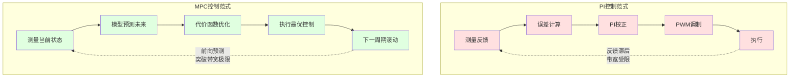

# CT-19: 模型预测控制

**副标题：从滚动优化到有限控制集——深入理解MPC如何在电机控制中突破PI带宽瓶颈与DTC纹波困境**
- **难度：**  专家级
- **适用对象：** 电机控制算法工程师、控制理论研究者、高性能伺服开发者
- **前置知识：** PID原理（CT-04）、状态空间（CT-10）、观测器设计（CT-11）、SVPWM调制、电机dq模型

---

## 1.  核心摘要

**一句话讲清楚**：MPC（Model Predictive Control）在每个控制周期内，利用系统模型预测未来有限时域内所有候选控制量的效果，通过最小化代价函数选择最优控制作用——在电机控制中，FCS-MPC直接从逆变器8个开关状态中选最优（无需调制器），MPC-CC基于调制器的连续集优化实现高带宽电流环，MPC-TC直接优化转矩和磁链取代DTC——三者共同特征是"前向预测+滚动优化"，与PI的"反馈+校正"形成本质区别。

**认知挂钩**：PI电流环的带宽受限于采样频率和对象特性，典型 $\omega_c \approx \frac{1}{10}f_s$，10kHz采样→带宽约1000rad/s；MPC电流环理论上可达 $\omega_c \approx \frac{1}{2}f_s$，同样10kHz采样→带宽约3000rad/s以上。代价是什么？计算量。FCS-MPC需要8次模型预测+8次代价函数评估，MPC-CC需要在线矩阵求逆。**MPC用计算量换带宽，用模型精度换控制性能——这是它和PI的根本trade-off。**

**与FOC算法的关联**：
-  **FCS-MPC电流控制**：直接选择最优开关状态→无需PI+PWM→超快动态响应
-  **MPC-CC电流环**：替代PI电流环→更高带宽、更强抗扰→但需在线优化
-  **MPC-TC转矩控制**：替代DTC→更小转矩纹波、可控开关频率→保留DTC的快速动态



---

## 2.  问题引入

### 工程师的真实困惑

**场景1：PI电流环带宽不够**
```text
工程师A:"做高速永磁伺服，基速6000rpm对应电频率400Hz，
      PI电流环带宽调到1500rad/s勉强够用，但弱磁区电流畸变严重，
      想再提高带宽但相位裕度不够了..."
问题现象:
- 高速弱磁区Id/Iq交叉耦合严重
- PI带宽受限于采样频率和对象延迟
- 电流波形畸变→转矩脉动→振动噪声
```

**场景2：DTC转矩纹波太大**
```text
工程师B:"DTC动态响应确实快，但稳态转矩纹波太大，
      开关频率不固定导致噪声频谱分散，EMC很难过..."
问题现象:
- 稳态转矩脉动±10%以上
- 开关频率在1~10kHz间波动
- 噪声频谱宽，滤波器设计困难
```

**场景3：MPC能否兼得？**
```text
工程师C:"听说MPC既有DTC的快动态，又能像FOC一样稳态好，
      还能直接处理约束（电流限幅、电压限幅），
      那为什么工业上还是PI+PWM为主？"
问题现象:
- MPC论文很多，量产产品很少
- 计算量太大？模型依赖太强？参数整定太难？
- 不清楚FCS-MPC和MPC-CC的区别和适用场景
```

### 核心问题

- PI带宽不够 → MPC前向预测能否突破反馈控制的带宽极限？
- DTC纹波太大 → MPC能否在保留快动态的同时降低纹波？
- 约束处理 → MPC如何自然地处理电流/电压/开关频率约束？
- 工程落地 → 计算量、模型敏感性、权重整定三大拦路虎如何解决？

### 学习目标

读完本模块，你将能够：
 **理解MPC三大核心思想**：滚动优化、预测模型、约束处理
 **区分FCS-MPC、MPC-CC、MPC-TC**三种电机控制变体的原理与适用场景
 **设计FCS-MPC代价函数**：电流跟踪+开关频率惩罚的权重整定
 **理解MPC与PI/ADRC的本质区别**：前向预测 vs 反馈校正
 **评估MPC在具体项目中的可行性**：计算量、鲁棒性、工程成熟度

---

## 3.  直观理解

### MPC vs PI：开车的前视距离

**PI控制——盯着车头1米**
- 只看当前误差（车偏了多远），根据误差大小和累积来修正方向
- 前方有弯道？看不到，等偏了再纠正→总是滞后
- 对应：PI电流环只看当前电流误差，无法预判下一拍电压需求

**MPC控制——看着前方50米**
- 预测未来N步的轨迹，选择让预测轨迹最贴近期望路径的方向盘角度
- 前方有弯道？提前打方向→平滑过弯
- 对应：MPC预测未来N拍电流轨迹，选择让预测电流最接近参考值的电压矢量

### 三种MPC的类比

| 类型 | 类比 | 核心特征 |
| --- | --- | --- |
| FCS-MPC | 下棋——每步从有限着法中选最优 | 候选集=8个开关状态，离散选择 |
| MPC-CC | 油门——连续调节到最优开度 | 候选集=连续电压矢量，需调制器 |
| MPC-TC | 方向盘——直接控制方向和速度 | 直接优化转矩+磁链，无需电流环 |

---

## 4.  技术原理

### 4.1 MPC三大核心思想

#### 4.1.1 预测模型

MPC的核心前提：**有一个足够准确的系统模型来预测未来**。

电机dq轴离散模型（一阶欧拉法，采样周期 $T_s$）：

$$i_d(k+1) = \left(1 - \frac{R_s T_s}{L_d}\right)i_d(k) + \frac{T_s}{L_d}v_d(k) + \frac{\omega_e L_q T_s}{L_d}i_q(k)$$

$$i_q(k+1) = \left(1 - \frac{R_s T_s}{L_q}\right)i_q(k) + \frac{T_s}{L_q}v_q(k) - \frac{\omega_e L_d T_s}{L_q}i_d(k) - \frac{\omega_e \psi_f T_s}{L_q}$$

写成状态空间形式：

$$\mathbf{x}(k+1) = \mathbf{A}_d\mathbf{x}(k) + \mathbf{B}_d\mathbf{u}(k) + \mathbf{d}(k)$$

其中 $\mathbf{x}=[i_d, i_q]^T$，$\mathbf{u}=[v_d, v_q]^T$，$\mathbf{d}$ 为交叉耦合和反电动势项。

**关键**：预测精度直接取决于 $R_s$、$L_d$、$L_q$、$\psi_f$ 的准确性——这是MPC的阿喀琉斯之踵。

#### 4.1.2 滚动优化

在每个控制周期，MPC求解有限时域优化问题：

$$\min_{\mathbf{u}(k),\ldots,\mathbf{u}(k+N-1)} J = \sum_{j=1}^{N}\left[\lVert\mathbf{x}(k+j)-\mathbf{x}_{ref}\lVert_{\mathbf{Q}}^2 + \lVert\Delta\mathbf{u}(k+j-1)\lVert_{\mathbf{R}}^2\right]$$

约束条件：
$$\mathbf{x}(k+j) \in \mathcal{X}, \quad \mathbf{u}(k+j) \in \mathcal{U}$$

其中 $N$ 为预测时域，$\mathbf{Q}$ 为状态跟踪权重，$\mathbf{R}$ 为控制变化量权重。

**滚动优化的含义**：
1. 在 $k$ 时刻求解 $N$ 步最优控制序列
2. 只执行第一步 $\mathbf{u}(k)$
3. $k+1$ 时刻重新测量状态，重新求解（滚动向前）

**与LQR的区别**：LQR求解无限时域问题，离线计算增益矩阵；MPC求解有限时域问题，在线滚动求解，可处理约束。

#### 4.1.3 约束处理

MPC最独特的优势——**约束是优化问题的天然组成部分**，而非事后限幅。

电机控制中的典型约束：

| 约束类型 | 数学表达 | 物理含义 |
| --- | --- | --- |
| 电流限幅 | $\sqrt{i_d^2+i_q^2} \leq I_{max}$ | 保护逆变器/电机 |
| 电压限幅 | $\sqrt{v_d^2+v_q^2} \leq V_{max}$ | SVPWM线性调制区 |
| 开关频率 | $f_{sw} \leq f_{sw,max}$ | 限制开关损耗 |
| $di/dt$ 限制 | $\lvert i(k+1)-i(k) \rvert \leq \Delta i_{max}$ | 限制电流变化率 |

**PI的约束处理**：输出限幅→饱和→anti-windup→仍是事后补救，无法预判约束边界。

**MPC的约束处理**：约束写入优化问题→求解时自动避开不可行区域→前瞻性约束满足。

### 4.2 MPC与PI/ADRC的本质区别

| 维度 | PI | ADRC | MPC |
| --- | --- | --- | --- |
| 控制范式 | 反馈+校正 | 估计+补偿 | 预测+优化 |
| 信息利用 | 当前误差 | 当前误差+扰动估计 | 未来预测轨迹 |
| 约束处理 | 事后限幅 | 事后限幅 | 优化内嵌 |
| 模型依赖 | 弱（只需近似零极点对消） | 弱（ESO估计总扰动） | 强（预测精度依赖模型） |
| 计算量 | 极低 | 低（ESO+NLSEF） | 高（优化求解） |
| 带宽极限 | $\sim f_s/10$ | $\sim f_s/5$ | $\sim f_s/2$ |

**核心区别一句话**：PI是"偏了再纠"，ADRC是"估计扰动提前补偿"，MPC是"预测未来选最优路径"。

---

### 4.3 FCS-MPC（有限控制集MPC）

#### 4.3.1 基本原理

三相两电平逆变器有8种开关状态（6个有效矢量+2个零矢量），构成有限控制集：

$$\mathcal{U} = \{S_0, S_1, S_2, S_3, S_4, S_5, S_6, S_7\}$$

每个开关状态对应一个电压矢量 $\mathbf{v}_j$（$j=0,1,\ldots,7$），在 $\alpha\beta$ 平面上的分布：

```text
              β
              ↑
        V3(010)──V2(110)
       /    \    /    
      /      \  /     
     /        \/      
    V4(011)───V1(100)──→α
     \        /\      
      \      / \     
       \    /   \    
        V5(001)──V6(101)
              |
           V0(000)/V7(111)
              原点
```

FCS-MPC的流程：
1. 测量当前电流 $i_d(k), i_q(k)$
2. 对8个开关状态分别预测 $i_d(k+1\lvert j), i_q(k+1 \rvertj)$
3. 对8个预测结果分别计算代价函数 $g_j$
4. 选择 $j^* = \arg\min_j g_j$
5. 直接施加开关状态 $S_{j^*}$（无需PWM调制器）

#### 4.3.2 代价函数设计

**基本电流跟踪代价函数**：

$$g_j = \left[i_d^{ref} - i_d(k+1\lvert j)\right]^2 + \left[i_q^{ref} - i_q(k+1 \rvertj)\right]^2$$

**加入开关频率惩罚**（减少开关损耗）：

$$g_j = \lambda_i\left\{\left[i_d^{ref} - i_d(k+1\lvert j)\right]^2 + \left[i_q^{ref} - i_q(k+1 \rvertj)\right]^2\right\} + \lambda_{sw}\lvert S(k) - S_j \rvert$$

其中 $\lvert S(k)-S_j \rvert$ 表示开关状态变化的相数（0~3），$\lambda_i$ 和 $\lambda_{sw}$ 为权重系数。

**加入磁链幅值约束**（抑制弱磁区磁链偏差）：

$$g_j = \lambda_i\left(\Delta i_d^2 + \Delta i_q^2\right) + \lambda_{sw}\Delta S + \lambda_\psi\left(\lvert \psi_s^{ref} \rvert - \lvert \psi_s(k+1 \rvertj)|\right)^2$$

**权重系数整定经验**：

| 权重 | 作用 | 典型值 | 调大效果 |
| --- | --- | --- | --- |
| $\lambda_i$ | 电流跟踪精度 | 1.0（基准） | 电流跟踪更好，开关频率升高 |
| $\lambda_{sw}$ | 开关频率限制 | 0.01~0.5 | 开关频率降低，电流纹波增大 |
| $\lambda_\psi$ | 磁链幅值约束 | 0~0.1 | 磁链更稳定，电流跟踪略差 |

#### 4.3.3 FCS-MPC的开关频率问题

**问题**：FCS-MPC没有固定调制周期，开关频率由代价函数和运行工况决定，波动范围大。

**定量分析**：
- $\lambda_{sw}=0$ 时：开关频率可达 $f_s/2$（每拍都可能切换），10kHz采样→开关频率约5kHz
- $\lambda_{sw}$ 增大：开关频率降低，但电流纹波增大
- 负载突变时：开关频率可能瞬间翻倍→开关损耗尖峰

**解决方案**：

| 方案 | 原理 | 优点 | 缺点 |
| --- | --- | --- | --- |
| 权重惩罚 | 代价函数加 $\lambda_{sw}$ 项 | 简单 | 开关频率仍不固定 |
| 滞环约束 | 开关频率超限时增大 $\lambda_{sw}$ | 频率可控 | 引入非线性 |
| 调制MPC | 改用MPC-CC（见4.4节） | 固定开关频率 | 需要调制器 |
| 多矢量FCS | 一拍内施加2~3个矢量 | 折中 | 计算量增大 |

#### 4.3.4 FCS-MPC的C代码框架

```c
typedef struct {
    float id_ref, iq_ref;
    float id, iq;
    float omega_e;
    float Rs, Ld, Lq, psi_f;
    float Ts;
    float lambda_i, lambda_sw;
    uint8_t current_sector;
} fcs_mpc_t;

uint8_t fcs_mpc_optimize(fcs_mpc_t *mpc)
{
    float g_min = 1e30f;
    uint8_t opt_sw = 0;
    float v_d[8], v_q[8];

    for (uint8_t j = 0; j < 8; j++) {
        voltage_vector_dq(j, mpc->omega_e, mpc->current_sector, v_d + j, v_q + j);
    }

    for (uint8_t j = 0; j < 8; j++) {
        float id_pred = (1.0f - mpc->Rs * mpc->Ts / mpc->Ld) * mpc->id
                      + mpc->Ts / mpc->Ld * v_d[j]
                      + mpc->omega_e * mpc->Lq * mpc->Ts / mpc->Ld * mpc->iq;

        float iq_pred = (1.0f - mpc->Rs * mpc->Ts / mpc->Lq) * mpc->iq
                      + mpc->Ts / mpc->Lq * v_q[j]
                      - mpc->omega_e * mpc->Ld * mpc->Ts / mpc->Lq * mpc->id
                      - mpc->omega_e * mpc->psi_f * mpc->Ts / mpc->Lq;

        float g = mpc->lambda_i * ((mpc->id_ref - id_pred) * (mpc->id_ref - id_pred)
                                 + (mpc->iq_ref - iq_pred) * (mpc->iq_ref - iq_pred))
                + mpc->lambda_sw * switching_transitions(mpc->current_sector, j);

        if (g < g_min) {
            g_min = g;
            opt_sw = j;
        }
    }
    return opt_sw;
}
```

---

### 4.4 MPC-CC（MPC电流控制）

#### 4.4.1 基本原理

MPC-CC（Model Predictive Current Control）使用连续控制集——电压矢量可以在SVPWM六边形内任意取值，因此需要调制器（SPWM/SVPWM），但开关频率固定。

**与PI电流环的架构对比**：

```text
PI电流环：  Iref → [PI] → Vdq → [SVPWM] → 逆变器 → 电机
MPC-CC：    Iref → [MPC优化] → Vdq → [SVPWM] → 逆变器 → 电机
```

区别仅在控制器部分：PI用误差的P+I运算，MPC-CC用模型预测+代价函数优化。

#### 4.4.2 单步预测MPC-CC

预测时域 $N=1$ 时，MPC-CC退化为**无差拍控制**（Deadbeat Control）的推广形式。

令 $i_d(k+1) = i_d^{ref}$，$i_q(k+1) = i_q^{ref}$，反解所需电压：

$$v_d^*(k) = \frac{L_d}{T_s}\left(i_d^{ref} - i_d(k)\right) + R_s i_d(k) - \omega_e L_q i_q(k)$$

$$v_q^*(k) = \frac{L_q}{T_s}\left(i_q^{ref} - i_q(k)\right) + R_s i_q(k) + \omega_e L_d i_d(k) + \omega_e \psi_f$$

**与无差拍的关系**：$N=1$ 且 $\mathbf{Q}=\mathbf{I}$、$\mathbf{R}=\mathbf{0}$ 时的MPC-CC等价于无差拍控制。加入 $\mathbf{R}\neq\mathbf{0}$ 后，MPC-CC在跟踪速度和控制平滑性之间取得平衡，鲁棒性优于纯无差拍。

#### 4.4.3 多步预测MPC-CC

$N>1$ 时，MPC-CC需要求解带约束的二次规划（QP）问题：

$$\min_{\mathbf{U}} J = \mathbf{E}^T\mathbf{Q}\mathbf{E} + \mathbf{U}^T\mathbf{R}\mathbf{U}$$

其中 $\mathbf{E} = \mathbf{X}_{ref} - \mathbf{\Phi}\mathbf{x}(k) - \mathbf{\Gamma}\mathbf{U}$ 为预测误差向量。

无约束解析解：

$$\mathbf{U}^* = \left(\mathbf{\Gamma}^T\mathbf{Q}\mathbf{\Gamma}+\mathbf{R}\right)^{-1}\mathbf{\Gamma}^T\mathbf{Q}\left(\mathbf{X}_{ref}-\mathbf{\Phi}\mathbf{x}(k)\right)$$

**计算量分析**：

| 预测步数 $N$ | 矩阵维度 | 乘法次数 | 100MHz DSP耗时 |
| --- | --- | --- | --- |
| 1 | $2\times2$ | ~20 | <1μs |
| 2 | $4\times4$ | ~200 | ~5μs |
| 3 | $6\times6$ | ~800 | ~20μs |
| 5 | $10\times10$ | ~5000 | ~100μs |

**工程结论**：$N=1\sim2$ 可在10kHz控制频率下实时运行；$N\geq3$ 需要高性能DSP或预计算增益矩阵。

#### 4.4.4 MPC-CC vs PI电流环

| 对比维度 | PI电流环 | MPC-CC（$N=1$） | MPC-CC（$N=2$） |
| --- | --- | --- | --- |
| 带宽 | $\omega_c \approx f_s/10$ | $\omega_c \approx f_s/3$ | $\omega_c \approx f_s/2$ |
| 抗扰动 | 依赖I项累积 | 一步预测补偿 | 两步预测补偿 |
| 参数敏感性 | 零极点对消偏差→性能降级 | 模型偏差→预测不准→性能降级 | 同左，但多步可部分补偿 |
| 计算量 | 4次乘+2次加 | 矩阵求逆+向量运算 | 更大矩阵运算 |
| 约束处理 | 输出限幅 | 优化内嵌 | 优化内嵌 |
| 工程成熟度 |  |  |  |

---

### 4.5 MPC-TC（MPC转矩控制）

#### 4.5.1 基本原理

MPC-TC（Model Predictive Torque Control）直接控制转矩和定子磁链，不经过电流环。

代价函数：

$$g_j = \lambda_T\left(T_e^{ref} - T_e(k+1\lvert j)\right)^2 + \lambda_\psi\left( \rvert\psi_s^{ref}\lvert - \rvert\psi_s(k+1\lvert j) \rvert\right)^2 + \lambda_{sw}\Delta S_j$$

转矩预测：

$$T_e(k+1\lvert j) = \frac{3}{2}p_n\left[\psi_f i_q(k+1 \rvertj) + (L_d-L_q)i_d(k+1\lvert j)i_q(k+1 \rvertj)\right]$$

磁链预测：

$$\psi_s(k+1|j) = \psi_s(k) + T_s\mathbf{v}_j - R_s T_s \mathbf{i}(k)$$

#### 4.5.2 MPC-TC vs DTC

| 对比维度 | DTC | MPC-TC |
| --- | --- | --- |
| 矢量选择 | 滞环比较器+开关表 | 代价函数全局优化 |
| 稳态转矩纹波 | 大（±5~15%） | 小（±1~3%） |
| 开关频率 | 不固定 | 通过 $\lambda_{sw}$ 可控 |
| 动态响应 | 极快（1拍） | 快（1~2拍） |
| 计算量 | 极低 | 中等 |
| 磁链观测 | 需要 | 需要（同DTC） |
| 工程成熟度 |  |  |

**MPC-TC的核心优势**：用代价函数替代DTC的滞环比较器+开关表，实现全局最优矢量选择，稳态纹波显著降低。

---

## 5.  MPC在电机控制中的工程挑战

### 5.1 计算延迟补偿（一拍延迟）

**问题**：从电流采样到PWM更新存在一拍延迟 $T_d$（ADC转换+MPC计算+PWM加载），导致实际施加的电压基于过时的状态信息。

**影响**：
- 预测电流与实际电流偏差 $\Delta i \approx \frac{V_{dc}}{2L_s}T_d$
- $T_d=100\mu s$、$V_{dc}=300V$、$L_s=1mH$ 时：$\Delta i \approx 15A$——严重失准

**补偿方法**：

**方法1：状态预测补偿**
在 $k$ 时刻先预测 $k+1$ 时刻的状态，再基于 $k+1$ 的预测状态进行MPC优化：

$$\hat{\mathbf{x}}(k+1) = \mathbf{A}_d\mathbf{x}(k) + \mathbf{B}_d\mathbf{u}(k-1)$$

然后用 $\hat{\mathbf{x}}(k+1)$ 替代 $\mathbf{x}(k)$ 进行MPC优化。

**方法2：增大预测时域**
将延迟纳入预测模型，预测时域从 $N$ 扩展到 $N+1$，第一拍使用上一拍的决策。

### 5.2 模型参数敏感性

**问题**：MPC的预测精度直接依赖模型参数 $R_s$、$L_d$、$L_q$、$\psi_f$，这些参数在实际运行中会变化。

**参数偏差对MPC-CC的影响**：

| 参数 | 变化原因 | 偏差+20%时的影响 |
| --- | --- | --- |
| $R_s$ | 温度（+50%从冷态到热态） | 电流稳态偏差~5%，动态略差 |
| $L_d$ | 磁饱和（弱磁区-30%） | $i_d$ 预测偏差→弱磁精度下降 |
| $L_q$ | 磁饱和（负载增大-20%） | $i_q$ 预测偏差→转矩精度下降 |
| $\psi_f$ | 温度（-10%从冷态到热态） | 反电动势补偿不足→$i_q$ 稳态偏差 |

**与PI鲁棒性的对比**：
- PI的零极点对消被破坏后→闭环从一阶变二阶→可能超调/震荡，但增益裕度和相位裕度通常仍为正→系统仍稳定
- MPC参数偏差→预测不准→代价函数最小值偏移→选择的控制量非最优→性能降级，极端情况可能不稳定

**缓解策略**：

| 策略 | 原理 | 实现复杂度 |
| --- | --- | --- |
| 在线参数辨识 | 实时辨识 $R_s$、$L_s$ 并更新模型 | 中 |
| 扰动观测器 | ESO估计模型失配引起的等效扰动并补偿 | 中 |
| 鲁棒MPC | 在优化中考虑模型不确定性 | 高 |
| 增大 $\mathbf{R}$ 权重 | 降低对模型的依赖（保守控制） | 低 |

### 5.3 权重系数整定

**问题**：FCS-MPC代价函数中的权重系数 $\lambda_i$、$\lambda_{sw}$、$\lambda_\psi$ 没有系统的整定方法，主要靠试凑。

**整定指南**：

**Step 1**：令 $\lambda_{sw}=0$，$\lambda_\psi=0$，$\lambda_i=1$——纯电流跟踪，观察电流纹波和开关频率

**Step 2**：如果开关频率过高（>10kHz），逐步增大 $\lambda_{sw}$：
- $\lambda_{sw}=0.01$：轻微影响电流跟踪
- $\lambda_{sw}=0.1$：开关频率降低约30%
- $\lambda_{sw}=1.0$：开关频率降低约70%，但电流纹波明显增大

**Step 3**：如果需要磁链约束（如弱磁区），加入 $\lambda_\psi$，从0.01开始微调

**归一化方法**：将各项除以其典型量级，使各项在相同数量级上比较：

$$g_j = \frac{\Delta i_d^2 + \Delta i_q^2}{I_{rated}^2} + \lambda_{sw}\frac{\Delta S}{3} + \lambda_\psi\frac{\Delta\psi^2}{\psi_{rated}^2}$$

---

## 6.  MPC vs PI vs ADRC 对比表

| 对比维度 | PI | ADRC/LADRC | FCS-MPC | MPC-CC | MPC-TC |
| --- | --- | --- | --- | --- | --- |
| **控制范式** | 反馈+校正 | 估计+补偿 | 预测+优化 | 预测+优化 | 预测+优化 |
| **电流环带宽** | $f_s/10$ | $f_s/5$ | $f_s/3$ | $f_s/2$ | N/A |
| **转矩动态** | 中 | 中快 | 极快 | 快 | 极快 |
| **稳态纹波** | 小 | 小 | 中 | 小 | 小 |
| **开关频率** | 固定 | 固定 | 不固定 | 固定 | 可控 |
| **约束处理** | 事后限幅 | 事后限幅 | 优化内嵌 | 优化内嵌 | 优化内嵌 |
| **模型依赖** | 弱 | 弱 | 强 | 强 | 强 |
| **参数鲁棒性** |  |  |  |  |  |
| **计算量** |  |  |  |  |  |
| **整定难度** |  |  |  |  |  |
| **工程成熟度** |  |  |  |  |  |
| **适用场景** | 通用工业驱动 | 抗扰要求高 | 高动态伺服 | 高带宽电流环 | 替代DTC |

**选型建议**：
- 90%的电机控制应用 → **PI+PWM**，成熟可靠，计算量低
- 强扰动场景（负载突变、电网波动）→ **LADRC**，抗扰能力最强
- 极高动态响应（伺服定位、机器人快动）→ **FCS-MPC**，1拍响应
- 高带宽电流环（高速弱磁、高频注入）→ **MPC-CC**，突破PI带宽极限
- 替代DTC（降低纹波+保留快动态）→ **MPC-TC**，兼顾两者

---

## 7.  工程案例

### 案例1：FCS-MPC权重整定导致开关过热

**背景**：
```text
永磁伺服，Vdc=300V, Ls=1.5mH, Rs=0.3Ω
FCS-MPC采样频率10kHz
初始权重: λi=1.0, λsw=0（纯电流跟踪）
实测开关频率: 5~8kHz（波动大），IGBT温升过高
```

**分析**：
$\lambda_{sw}=0$ 时，代价函数只看电流跟踪→每拍都可能切换开关状态→开关频率接近 $f_s/2$。负载突变时开关频率可达8kHz→开关损耗 $P_{sw}\propto f_{sw}$→温升超限。

**解决**：
1. 逐步增大 $\lambda_{sw}$：0→0.05→0.1→0.2
2. $\lambda_{sw}=0.1$ 时：平均开关频率降至3kHz，电流THD从3.2%增至4.5%
3. $\lambda_{sw}=0.2$ 时：平均开关频率降至2kHz，电流THD增至7%（不可接受）
4. **最终选择** $\lambda_{sw}=0.1$，开关频率~3kHz，温升合格，电流品质可接受

### 案例2：MPC-CC参数失配导致电流震荡

**背景**：
```text
表贴式PMSM: Ls=2.0mH(铭牌值), Rs=0.5Ω(铭牌值)
MPC-CC(N=1), 采样频率10kHz
冷态运行正常，热态(80°C)后电流出现低频震荡
```

**分析**：
热态 $R_s$ 从0.5Ω升至0.6Ω（+20%），MPC预测模型仍用0.5Ω→预测电流偏大→输出电压偏小→实际电流偏小→下一拍误差更大→震荡。

无差拍控制电压公式中 $R_s$ 项的影响：
$$\Delta v_d = \Delta R_s \cdot i_d = 0.1 \times 10 = 1V$$
在 $V_{dc}=300V$ 系统中占0.33%，看似不大，但累积效应导致预测偏差→震荡。

**解决**：
1. 在线 $R_s$ 辨识：利用 $i_d=0$ 控制策略，从 $v_d$ 反推 $R_s$
2. 加入LESO估计模型失配等效扰动并补偿
3. 增大 $\mathbf{R}$ 权重使控制更保守→牺牲部分带宽换鲁棒性

### 案例3：FCS-MPC vs PI电流环动态对比

**背景**：
```text
永磁伺服，Iq阶跃: 0→10A
PI: Kp=3.0, Ki=600, ωc=1500rad/s, 采样10kHz
FCS-MPC: λi=1.0, λsw=0.05, 采样10kHz
```

**测试结果**：

| 指标 | PI | FCS-MPC |
| --- | --- | --- |
| 上升时间 | 1.2ms | 0.3ms |
| 超调 | 0%（一阶响应） | 5%（1拍延迟引起） |
| 稳态纹波 | ±0.2A | ±0.5A |
| 开关频率 | 10kHz（固定） | 3~5kHz（波动） |

**结论**：FCS-MPC动态响应快4倍，但稳态纹波更大、开关频率不固定——适合对动态要求极高的场景，不适合对稳态品质和EMC要求高的场景。

---

## 8.  实践练习

### 练习1：计算题——FCS-MPC代价函数评估

```text
PMSM参数: Ld=Lq=2mH, Rs=0.5Ω, ψf=0.05Wb, p=4
当前状态: id=0A, iq=5A, ωe=300rad/s, Ts=100μs
参考值: id_ref=0A, iq_ref=10A
当前开关状态: S1(100)

分别计算施加V1(100)和V2(110)时的代价函数值g1和g2
（λi=1, λsw=0.1，V1→S1无切换，V2→S2切换2相）

参考答案：
V1在dq下的分量（θe=0时）: vd1=2Vdc/3, vq1=0
V2在dq下的分量: vd2=Vdc/3, vq2=Vdc/√3/3 (需根据电角度旋转)

id_pred(V1) = (1-0.5×0.0001/0.002)×0 + 0.0001/0.002×vd1 + 300×0.002×0.0001/0.002×5
            ≈ 0.05×vd1 + 0.075

iq_pred(V1) = (1-0.025)×5 + 0.05×vq1 - 300×0.002×0.0001/0.002×0 - 300×0.05×0.0001/0.002
            ≈ 4.875 + 0.05×vq1 - 7.5

（具体数值取决于Vdc和电角度，关键理解计算流程）
```

### 练习2：设计题——MPC-CC无差拍电压计算

```text
SPMSM: Ls=1.5mH, Rs=0.3Ω, ψf=0.03Wb
当前: id=0A, iq=8A, ωe=200rad/s, Ts=100μs
参考: id_ref=0A, iq_ref=10A

1. 计算无差拍控制所需的vd*和vq*
2. 如果Vdc=48V，SVPWM最大线性调制电压Vmax=Vdc/√3≈27.7V，
   计算出的电压矢量幅值是否超限？
3. 如果超限，如何处理？

参考答案：
1. vd* = Ls/Ts×(id_ref-id) + Rs×id - ωe×Ls×iq
      = 1.5e-3/1e-4×(0-0) + 0.3×0 - 200×1.5e-3×8
      = 0 + 0 - 2.4 = -2.4V
   vq* = Ls/Ts×(iq_ref-iq) + Rs×iq + ωe×Ls×id + ωe×ψf
      = 15×2 + 2.4 + 0 + 6 = 38.4V
2. |V| = √(2.4²+38.4²) ≈ 38.5V > 27.7V → 超限
3. 等比例缩放: vd' = -2.4×27.7/38.5 = -1.73V, vq' = 38.4×27.7/38.5 = 27.6V
   或在MPC框架内加入电压约束，QP求解器自动给出可行解
```

### 练习3：分析题——一拍延迟补偿

```text
FCS-MPC采样频率20kHz（Ts=50μs），ADC+计算延迟Td=40μs
电机: Ls=1mH, Vdc=300V

1. 不补偿时，延迟导致的电流预测偏差约为多少？
2. 画出带延迟补偿的FCS-MPC控制时序图
3. 如果Ts=25μs（40kHz），延迟补偿是否更关键？为什么？

参考答案：
1. Δi ≈ Vdc/(2Ls)×Td = 300/(2×0.001)×40e-6 = 6A（显著！）
2. 时序: ADC采样(k) → 预测x(k+1) → 基于x(k+1)优化 → 加载PWM(k+1)
3. Ts=25μs时Td/Ts=40/25=1.6拍，延迟超过一个控制周期，
   必须预测到k+2时刻，补偿更关键
```

---

## 9.  前沿趋势

### 9.1 基于深度学习的MPC

**思路**：用神经网络离线学习MPC的最优控制策略，在线推理替代实时优化。

| 方法 | 原理 | 优势 | 挑战 |
| --- | --- | --- | --- |
| 神经网络拟合 | 训练NN映射状态→控制量 | 推理速度快（μs级） | 泛化性、安全性验证 |
| 强化学习MPC | RL学习代价函数权重 | 自适应整定 | 训练不稳定、安全约束 |
| PINN+MPC | 物理信息神经网络替代模型 | 鲁棒性更好 | 训练数据需求 |

### 9.2 鲁棒MPC

**思路**：在优化中显式考虑模型不确定性，保证最坏情况下的性能和稳定性。

- **Min-Max MPC**：最小化最坏情况下的代价函数→保守但安全
- **Tube-based MPC**：设计标称轨迹+不确定性的"管道"→计算效率更高
- **分布鲁棒MPC**：基于Wasserstein距离的不确定性建模→数据驱动

### 9.3 显式MPC

**思路**：离线将状态空间划分为多面体区域，每个区域对应一个线性控制律→在线仅需查表。

$$\mathbf{u}^*(\mathbf{x}) = \mathbf{K}_i\mathbf{x} + \mathbf{c}_i, \quad \mathbf{x} \in \mathcal{P}_i$$

**优势**：在线计算量极低（查表+矩阵乘法），与PI相当
**劣势**：区域数量随状态维数和约束数量指数增长（维数灾难），$N=2$、2维状态+4个约束时约100个区域，尚可接受；$N=5$、4维状态时区域数>10万→存储不可行

---

## 10.  交叉视角

### 与CT-04（PID控制原理）的关联

- PI电流环的零极点对消是"基于模型的设计"，但只用了模型的一阶信息（极点位置）；MPC用了模型的全部动态信息（状态转移矩阵）
- PI的anti-windup是事后处理约束；MPC将约束嵌入优化→本质区别
- MPC-CC（$N=1$, $\mathbf{R}\neq0$）可以看作PI的"预测增强版"——当 $\mathbf{R}\to\infty$ 时退化为保守控制，当 $\mathbf{R}\to 0$ 时趋近无差拍

### 与CT-11（观测器设计）的关联

- MPC需要全状态反馈→$i_d$、$i_q$ 可测量，但 $\psi_s$、$T_e$ 需要观测器
- MPC-TC的磁链观测与DTC完全相同→CT-11的磁链观测器直接适用
- 模型参数失配可通过ESO/Luenberger观测器估计等效扰动并补偿→MPC+观测器=鲁棒MPC的工程实现

### 与ALG-03（PI电流调节器）的关联

- ALG-03的PI参数设计 $K_p=L_s\omega_c$, $K_i=R_s\omega_c$ 基于零极点对消
- MPC-CC（$N=1$）的电压计算 $v_d^*=\frac{L_d}{T_s}(i_d^{ref}-i_d)+R_s i_d-\omega_e L_q i_q$ 包含相同的 $L_d$、$R_s$ 项
- **本质联系**：PI是MPC-CC在特定条件下的简化——当预测时域 $N=1$ 且忽略交叉耦合时，MPC-CC退化为比例控制+前馈补偿

### 与ALG-19（无差拍控制）的关联

- 无差拍控制是MPC-CC（$N=1$, $\mathbf{Q}=\mathbf{I}$, $\mathbf{R}=\mathbf{0}$）的特例
- 无差拍对参数极度敏感→MPC-CC加入 $\mathbf{R}$ 权重后鲁棒性显著改善
- 无差拍无法处理约束→MPC-CC加入约束后成为真正的MPC

---

## 11.  工程案例与实践练习总结

### 工程选型决策树

```text
电机控制需求分析
├── 动态响应要求极高（<0.5ms）？
│   ├── 是 → FCS-MPC（1拍响应，无需调制器）
│   └── 否 → 继续判断
├── 电流环带宽要求高（>2kHz）？
│   ├── 是 → MPC-CC（突破PI带宽极限）
│   └── 否 → 继续判断
├── 需要直接转矩控制？
│   ├── 是 → MPC-TC（替代DTC，降低纹波）
│   └── 否 → 继续判断
├── 抗扰动要求高？
│   ├── 是 → LADRC（最强抗扰，模型依赖弱）
│   └── 否 → PI+PWM（成熟可靠，90%场景够用）
```

### 关键提醒

1. **MPC不是万能的**：在模型不准、计算资源有限、EMC要求严格的场景下，PI仍然是最佳选择
2. **先跑通PI，再考虑MPC**：MPC的收益主要体现在极端工况，常规工况PI足够
3. **FCS-MPC的EMC问题**：开关频率不固定→噪声频谱分散→EMC认证困难→工业应用受限
4. **模型精度是MPC的生命线**：投入MPC之前，先确保参数辨识的精度和实时性

---

**文档信息**：
- 模块编号：CT-19
- 知识体系：控制理论基础
- 模块名称：模型预测控制
- 算法关联：FCS-MPC→有限控制集优化、MPC-CC→高带宽电流环、MPC-TC→直接转矩控制、无差拍→MPC-CC特例

---

##  仿真验证
> 本模块的理论可在 [C 语言仿真](../simulation/c-simulation/SIM-00-C-Simulation-Overview.md) 中验证。
> 关键操作：在电流环控制中分别实现PI和MPC-CC，对比阶跃响应上升时间和稳态纹波
