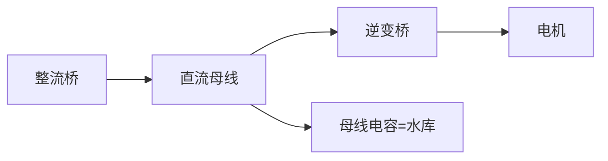
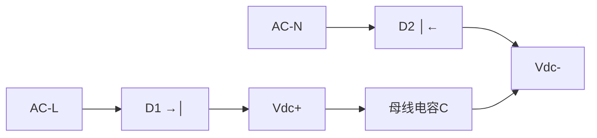
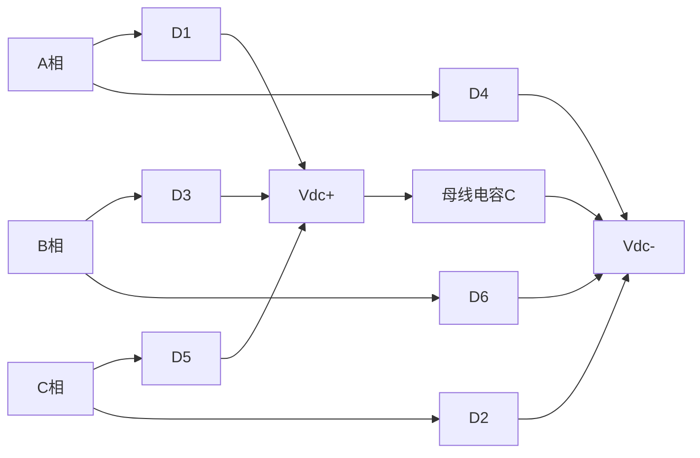
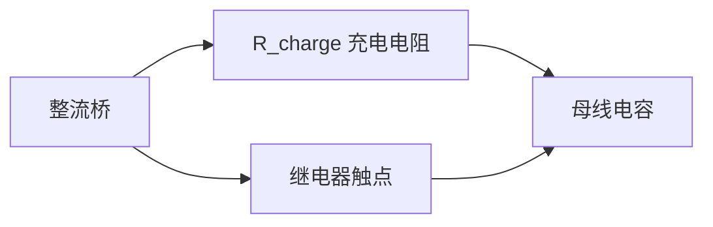
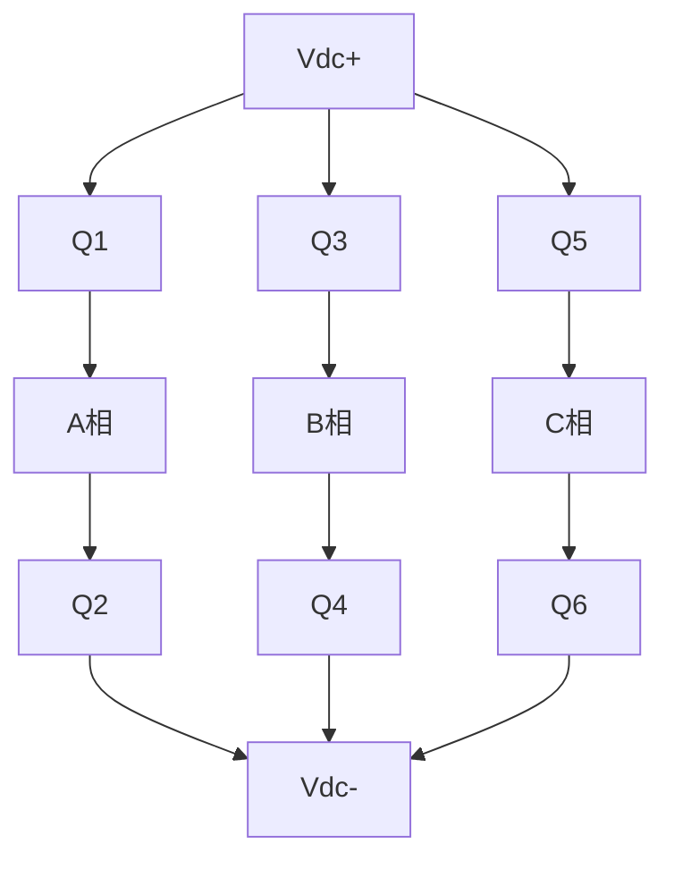
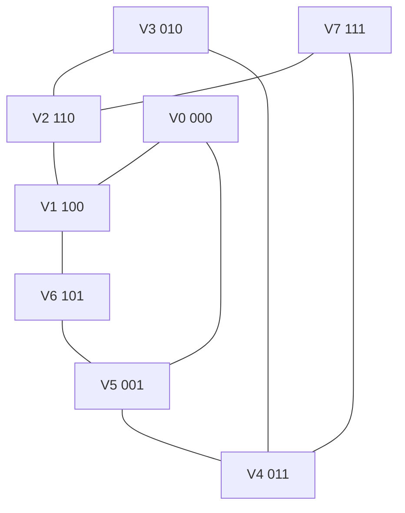
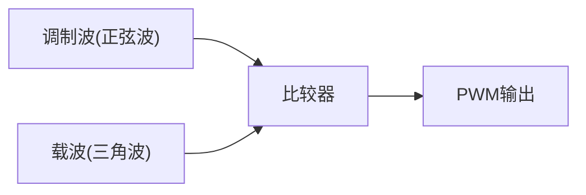
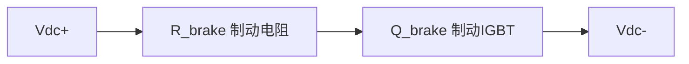

# EE-08 整流与逆变拓扑

**副标题：从交流电网到直流母线再到三相交流，掌握电机驱动的功率变换链路**

---

## 1.  核心摘要  

**一句话讲清楚**：电机驱动器的功率变换链路是"AC→DC→AC"的两次变换——先通过整流器将电网交流电变成直流母线电压，再通过逆变器将直流变成频率和幅值可调的交流电驱动电机。理解这条链路上的每个环节（整流、滤波、逆变、调制）是设计可靠电机驱动器的前提。

**认知挂钩**：很多初学者以为"整流就是四个二极管，逆变就是六个MOSFET开关"，**这是停留在原理图级别的理解！** 实际的整流逆变涉及浪涌电流抑制、母线电容选型、电压利用率优化、空间矢量调制等深层次工程问题。母线电容选小了大电流纹波导致过热，选大了体积和成本不可接受；SPWM的电压利用率只有86.6%，而SVPWM能提升到100%。

**与电机控制的关联**：
-  **母线电压**：$V_{dc}=1.35\times V_{LL}$（三相）→ 决定电机基速和弱磁进入点
-  **母线电容**：储能和滤波 → 影响母线电压纹波 → 影响FOC输出精度
-  **SVPWM调制**：8个开关状态对应6个基本矢量和2个零矢量 → FOC的执行机构
-  **调制指数**：$m_i=V_{ref}/(V_{dc}/2)$ → 决定电压利用率
-  **死区补偿**：死区导致电压损失 → 需要软件补偿（见ALG模块）

---

## 2.  问题引入  

### 工程师的真实困惑

**场景1：母线上电炸电容**
```text
工程师A:"第一次上电,空开一合,母线电容就炸了..."
问题现象:
- 没有任何软启动/预充电电路
- 整流桥+大电容直接上电
- 上电瞬间火花+爆炸
```

**场景2：电压利用率困惑**
```text
工程师B:"我用SPWM调制,理论上Vdc=310V应该能输出310V的相电压,
但实际最大输出只有270V,电机在高速时电压不够..."
问题现象:
- 高速时调制指数饱和
- 输出电压明显低于母线电压
```

**场景3：母线电压跌落**
```text
工程师C:"电机加速时,母线电压从310V跌到260V,导致FOC失控..."
问题现象:
- 加速时母线电压骤降
- 减速(制动)时母线电压飙升到420V
- 过压保护频繁触发
```

### 核心问题

- 电容炸 → 没有浪涌电流限制 → 上电瞬间相当于短路！
- 电压不够 → SPWM的相电压最大值 = $V_{dc}/2$ = 155V（线电压268V）= 86.6%利用率
- 母线跌升 → 电解电容容量不足 + 制动能量回灌 → 需要制动斩波器

### 学习目标

读完本模块，你将能够：

 **计算母线电压** - 单相/三相整流的 $V_{dc}$ 精确计算
 **设计预充电电路** - NTC、继电器旁路、充电电阻计算
 **选型母线电容** - 容量计算、纹波电流、寿命估算
 **理解SPWM原理** - 调制波与载波比较、调制比、电压利用率
 **掌握空间矢量** - 8个开关状态、6个扇区、SVPWM的电压利用率

---

## 3.  直观理解  

### 类比1：整流器 = "单向阀门"

**生活场景**：像自行车的单向飞轮——只允许电流从电网流向直流母线，不允许反向。


### 类比2：母线电容 = "水库"



### 类比3：SPWM vs SVPWM = "正弦波 vs 六边形"

```text
SPWM：三个正弦波分别与三角载波比较
  → 每相独立调制，简单直观
  → 但"浪费"了母线电压的利用率

SVPWM：在三相空间中，参考电压矢量在6个基本矢量间旋转
  → 三相协调调制，充分利用母线
  → 电压利用率提高 15.5%（1/√3/2 = 1.155倍）
```

---

## 4.  技术原理  

### 4.1 整流电路

#### 4.1.1 单相桥式不控整流



#### 4.1.2 三相桥式不控整流  电机驱动标配



**手动推导验证三相整流 $V_{dc}=1.35V_{LL}$：**
$$
V_{dc\_avg} = \frac{3}{\pi} \int_{\pi/3}^{2\pi/3} \sqrt{2}V_{LL}\sin(\omega t)\,d(\omega t)
$$
$$
= \frac{3\sqrt{2}V_{LL}}{\pi} \times [-\cos(\omega t)]_{\pi/3}^{2\pi/3}
$$
$$
= \frac{3\sqrt{2}V_{LL}}{\pi} \times [-\cos(120°) + \cos(60°)] = \frac{3\sqrt{2}}{\pi} \times 1 = \frac{3\sqrt{2}}{\pi}V_{LL}
$$

$$
\frac{3\sqrt{2}}{\pi} = \frac{3\times 1.414}{3.1416} = 1.350 \quad\checkmark
$$

#### 4.1.3 整流桥选型

```text
整流桥关键参数：
  - V_RRM ≥ 1.5 × Vdc_max（反向重复峰值电压）
  - I_F(AV) ≥ 1.5 × I_load（平均正向电流）
  - I_FSM ≥ 浪涌电流（不重复浪涌电流）

  7.5kW三相伺服（380V, In≈15A）：
    V_RRM > 1.5×540 = 810V → 选1200V
    I_F(AV) > 1.5×15 = 22.5A → 选35A或50A模块
    I_FSM > 200A（上电浪涌，取决于预充电设计）
```

### 4.2 直流母线电容

#### 4.2.1 电容的作用

```text
母线电容的三重角色：

1. 储能（Energy Storage）
   → 在整流桥"谷值"期间为逆变器供电
   → 平滑母线电压纹波

2. 滤波（Filtering）
   → 吸收逆变器的PWM高频纹波电流
   → 提供低阻抗路径给开关频率电流

3. 缓冲（Snubbing）
   → 吸收开关过程中的电压尖峰
   → 降低母线寄生电感导致的过冲
```

#### 4.2.2 电容容量计算 

$$
C_{dc} = \frac{P_{out}}{\omega \times V_{dc\_avg} \times \Delta V_{ripple}}
$$

其中：
- $\omega = 2\pi f_{ripple}$（三相300Hz，单相100Hz）
- $\Delta V_{ripple}$ = 允许的纹波电压峰值（通常取 $V_{dc}$ 的3~5%）

**计算实例（7.5kW三相伺服）：**
$$
P_{out}=7500W, V_{dc}=540V, \Delta V_{ripple}=540 \times 5\%=27V, f_{ripple}=300Hz
$$

$$
C_{dc} = \frac{7500}{2\pi \times 300 \times 540 \times 27} \approx 272\mu F
$$

工程经验：按 $2\sim4\mu F/W$ 估算
$$
C_{dc}=7500\times 3\mu F/W=22500\mu F \approx 22000\mu F
$$

 两个公式结果差异巨大（272μF vs 22000μF）！原因：
- 上一个公式只考虑了电网纹波滤波
- 工程经验值包含了逆变器的PWM纹波吸收需求
- **实际选型应参考经验值 + 纹波电流耐受验算**

**最终选型：**
- 两个 $10000\mu F/450V$ 电解电容并联 = 20000μF
- 加 $2.2\mu F$ 薄膜电容并联（高频去耦）

#### 4.2.3 纹波电流验算

$$
I_{ripple\_RMS} = \sqrt{I_{dc\_RMS}^2 - I_{dc\_avg}^2}
$$

电容器datasheet给出的纹波电流额定值 $I_{ripple\_rated}$ @120Hz/85°C
开关频率纹波需通过薄膜电容分担。

### 4.3 浪涌电流限制

#### 4.3.1 问题：为什么电容会炸？

```text
上电瞬间：
  母线电容初始电压 = 0V
  电网峰值电压 ≈ 540V（三相380V）
  
  等效回路：540V ──→ 整流桥(~1Ω) ──→ 电容(ESR~10mΩ) ──→ GND
  
  峰值浪涌电流：I_inrush = 540V / (~1Ω+10mΩ) ≈ 530A!!
  
  这个电流会：
  - 烧毁整流桥（I_FSM不够）
  - 熔断PCB走线
  - 导致空开跳闸
  - 电容内部过热→爆炸
```

#### 4.3.2 预充电方案

**方案A：NTC热敏电阻（小功率 <1kW）**


**方案B：充电电阻+继电器旁路（推荐 ）**


**方案C：可控硅相控软启动（大功率 >50kW）**
通过控制晶闸管导通角，逐步增大整流输出电压。

### 4.4 三相逆变器拓扑

#### 4.4.1 六开关三相逆变桥



#### 4.4.2 8个开关状态

每个桥臂上下管互补导通（考虑死区），定义：
- $S_a=1$：A相上管导通，A点接Vdc+
- $S_a=0$：A相下管导通，A点接Vdc-

三相共有 $2^3=8$ 个开关状态：

```text
┌─────────────────────────────────────────────────┐
│ 状态  │ Sa Sb Sc │ 矢量名称   │ Vα       │ Vβ      │
│ ─────┼─────────┼──────────┼─────────┼────────│
│  V0   │ 0  0  0 │ 零矢量     │ 0        │ 0       │
│  V1   │ 1  0  0 │ 基本矢量1  │ 2Vdc/3   │ 0       │
│  V2   │ 1  1  0 │ 基本矢量2  │ Vdc/3    │ Vdc/√3  │
│  V3   │ 0  1  0 │ 基本矢量3  │ -Vdc/3   │ Vdc/√3  │
│  V4   │ 0  1  1 │ 基本矢量4  │ -2Vdc/3  │ 0       │
│  V5   │ 0  0  1 │ 基本矢量5  │ -Vdc/3   │ -Vdc/√3 │
│  V6   │ 1  0  1 │ 基本矢量6  │ Vdc/3    │ -Vdc/√3 │
│  V7   │ 1  1  1 │ 零矢量     │ 0        │ 0       │
└─────────────────────────────────────────────────┘

6个非零矢量幅值：|V| = 2Vdc/3
相邻矢量夹角：60°
```

**空间矢量图：**



### 4.5 SPWM调制原理

#### 4.5.1 基本原理



#### 4.5.2 输出电压

$$
V_{phase\_peak} = m_a \times \frac{V_{dc}}{2} \quad \text{（SPWM线性区）}
$$

$$
V_{LL\_RMS} = m_a \times \frac{\sqrt{3}}{2\sqrt{2}} \times V_{dc} \approx m_a \times 0.612 \times V_{dc}
$$

**电压利用率（SPWM的最大问题）：**
$$
V_{LL\_RMS\_max}(m_a=1) = \frac{\sqrt{3}}{2\sqrt{2}} \times V_{dc} \approx 0.612 V_{dc}
$$

占比 $V_{dc}$ 的比例：
$$
\frac{V_{LL\_peak}}{V_{dc}} = \frac{\sqrt{2}\times 0.612 V_{dc}}{V_{dc}} = 0.866 = 86.6\%
$$

**这意味着SPWM天然"浪费"了13.4%的母线电压！**

实例：$V_{dc}=540V$，SPWM能输出的最大线电压RMS = $0.612\times 540=330V$
而三相380V电机需要380V→SPWM根本达不到！（除非升母线电压或过调制）

#### 4.5.3 过调制（Overmodulation）

当 $m_a>1$ 时，进入过调制区：
- 调制波被削顶，输出电压不再是纯正弦
- 极限 $m_a \to \infty$（方波模式）：$V_{LL\_RMS}=0.78V_{dc}$

### 4.6 SVPWM（空间矢量PWM）

#### 4.6.1 基本概念

**SVPWM的核心思想**：不要独立控制三相的占空比，而是把三相看成一个旋转的空间电压矢量 $\vec{V}_{ref}$，用相邻的2个基本矢量（$V_k, V_{k+1}$）和零矢量（$V_0, V_7$）在一周期内合成。

#### 4.6.2 七段式合成（扇区I为例）

$$
\vec{V}_{ref} \times T_s = \vec{V}_1 \times T_1 + \vec{V}_2 \times T_2 + \vec{V}_{zero} \times T_0
$$

$$
T_1 = \frac{\sqrt{3}\times T_s \times |V_{ref}| \times \sin(60°-\theta)}{V_{dc}}
$$
$$
T_2 = \frac{\sqrt{3}\times T_s \times |V_{ref}| \times \sin\theta}{V_{dc}}
$$
$$
T_0 = T_s - T_1 - T_2
$$

**七段式PWM序列（扇区I, T0/4→T1/2→T2/2→T0/2→T2/2→T1/2→T0/4）：**


#### 4.6.3 SVPWM的最大输出电压（核心优势）

非零矢量的最大内切圆半径：
$$
|V_{ref\_max}| = \frac{2}{3}V_{dc} \times \cos(30°) = \frac{2}{3}V_{dc} \times \frac{\sqrt{3}}{2} = \frac{V_{dc}}{\sqrt{3}}
$$

对应的相电压峰值：
$$
V_{phase\_peak\_SVPWM} = \frac{V_{dc}}{\sqrt{3}}
$$

线电压RMS：
$$
V_{LL\_RMS\_SVPWM} = \sqrt{\frac{3}{2}} \times \frac{V_{dc}}{\sqrt{3}} = \frac{V_{dc}}{\sqrt{2}} \approx 0.707 V_{dc}
$$

**电压利用率对比：**

| 调制方式 | $V_{LL\_RMS}/V_{dc}$ | 利用率比率 |
|---------|---------------------|-----------|
| SPWM(m=1) | 0.612 | 100%（基准） |
| SVPWM | 0.707 | **115.5%**  |
| 方波(六步) | 0.78 | 127.5% |

$$
\frac{V_{SVPWM}}{V_{SPWM}} = \frac{0.707}{0.612} = 1.155
$$

**实例如下**：$V_{dc}=540V$

- SPWM最大输出线电压峰值：$540\times 0.866=467.6V$（RMS=330.6V）
- SVPWM最大输出线电压峰值：$540\times 1.0=540V$（RMS=381.8V）
- **SVPWM刚好能输出380VAC！这就是为什么电机驱动必须用SVPWM！** 

#### 4.6.4 SVPWM调制指数

$$
m_i = \frac{|V_{ref}|}{V_{dc}/\sqrt{3}} = \frac{\sqrt{3}\times|V_{ref}|}{V_{dc}}
$$

线性区：$0 \le m_i \le 1$（对应 SVPWM 线性调制）
过调制I区：$1 < m_i \le 1.05$
过调制II区：$1.05 < m_i \le 1.10$（逼近方波）

### 4.6.5 五段式 SVPWM 与开关损耗优化

#### 4.6.5.1 基本原理

五段式 SVPWM 在每个 PWM 周期内只使用 **5 段**开关序列，相比七段式减少了一个零矢量（V0 或 V7），从而降低开关次数。

**奇数扇区（舍弃 V0）：** V1 → V2 → V7 → V2 → V1  
**偶数扇区（舍弃 V7）：** V0 → V2 → V1（或 V3）→ V2 → V0

由于奇数扇区舍弃 V0(000)，偶数扇区舍弃 V7(111)，相邻扇区之间的切换可以实现平滑过渡。

#### 4.6.5.2 七段式 vs 五段式对比

| 特性 | 七段式 SVPWM | 五段式 SVPWM |
|------|-------------|-------------|
| 每周期段数 | 7 | 5 |
| 零矢量使用 | V0 + V7 对称分布 | 交替舍弃 V0 或 V7 |
| 单相开关次数/周期 | 2 次 | 1~2 次（平均约 1.33 次） |
| 开关损耗 | 基准 | **降低约 33%** |
| 电流 THD | 最小 | 略高（约 1.5×） |
| 适用场景 | 低频、高精度伺服 | 高频 PWM、中大功率驱动 |

> **工程权衡**：当 PWM 频率较高（如 >16kHz）时，开关损耗成为主要矛盾，五段式可显著降低散热需求；当对电流波形质量要求极高时（如伺服定位），优先七段式。

#### 4.6.5.3 开关损耗估算

单次开关损耗（硬开关）：

$$E_{sw} = \frac{1}{2} V_{ds} I_d (t_r + t_f)$$

总开关损耗功率：

$$P_{sw} = E_{sw} \cdot f_{sw} \cdot N_{sw}$$

其中 $N_{sw}$ 为每基波周期的等效开关次数。五段式使 $N_{sw}$ 降低约 33%，在高频应用中可减少数十瓦的热损耗。

---

### 4.6.6 从 SPWM 到 SVPWM：最大最小值法与三次谐波注入

#### 4.6.6.1 最大最小值法

SVPWM 可以通过在 SPWM 的三相调制波上叠加零序分量来等效实现，称为**最大最小值法**。

三相原始正弦调制波（调制比 $m_a$）：

$$V_{as} = m_a \frac{V_{dc}}{2} \sin(\omega t)$$
$$V_{bs} = m_a \frac{V_{dc}}{2} \sin(\omega t - 120^\circ)$$
$$V_{cs} = m_a \frac{V_{dc}}{2} \sin(\omega t + 120^\circ)$$

零序分量（最大最小值法）：

$$V_{offset} = -\frac{\max(V_{as}, V_{bs}, V_{cs}) + \min(V_{as}, V_{bs}, V_{cs})}{2}$$

注入零序后的调制波：

$$V_{as}^* = V_{as} + V_{offset}$$
$$V_{bs}^* = V_{bs} + V_{offset}$$
$$V_{cs}^* = V_{cs} + V_{offset}$$

> **关键结论**：将 $V_{as}^*, V_{bs}^*, V_{cs}^*$ 与三角载波比较产生的 PWM，**完全等价于七段式 SVPWM**。

#### 4.6.6.2 三次谐波注入的等价性

零序分量 $V_{offset}$ 的波形近似于三次谐波：

$$V_{offset}(\theta) \approx -\frac{1}{2} \cdot \frac{V_{dc}}{2} \cdot m_a \cdot \sin(3\theta)$$

即 $V_{offset}$ 的频率是基波频率的 3 倍。

**为什么注入三次谐波可以提升线性调制范围？**

- SPWM 的最大线性调制比为 $m_a = 1$，此时输出相电压基波幅值 $= V_{dc}/2$
- 注入三次谐波后，调制波峰值被"削平"，允许 $m_a$ 继续增大
- SVPWM 的最大线性调制比 $m = 2/\sqrt{3} \approx 1.1547$
- 此时输出相电压基波幅值 $= V_{dc}/\sqrt{3}$，比 SPWM 提升约 **15.5%**

> **物理意义**：三次谐波是零序分量，在三相三线系统中不产生电流（线电压中三次谐波相互抵消），因此可以"免费"利用这部分电压裕量来扩展线性调制范围。

#### 4.6.6.3 统一视角

三种方法是等价的：

1. **矢量合成法**：在 α-β 平面上用基本矢量合成 Vref
2. **最大最小值法**：$V_{offset} = -(V_{max} + V_{min}) / 2$
3. **三次谐波注入法**：$V_{offset} \approx -0.5 \cdot m_a \cdot V_{dc}/2 \cdot \sin(3\omega t)$

在实际 DSP 实现中，**最大最小值法**最为简便：只需计算三相正弦值 → 取最大最小 → 计算零序 → 叠加输出，无需扇区判定和三角函数查表之外的额外运算。

### 4.7 制动能量处理

#### 4.7.1 为什么母线电压会飙升？

电机减速/制动时，动能→通过逆变器回馈到直流母线：
$$
E_{kinetic} = \frac{1}{2}J\omega^2
$$

这部分能量对母线电容充电 → $V_{dc}$ 飙升！

$$
\Delta V_{dc} = \frac{E_{brake}}{C_{dc} \times V_{dc}}
$$

#### 4.7.2 制动斩波器（Braking Chopper）



---

## 5.  交叉视角  

### 5.1 母线电压 $V_{dc}$ → 电机基速

$$
n_{base} = \frac{V_{dc}}{\sqrt{3} \times K_e} = \frac{V_{dc}}{\sqrt{3} \times P \times \psi_f}
$$

- 220V单相 → $V_{dc}\approx 310V$ → 基速相对较低
- 380V三相 → $V_{dc}\approx 540V$ → 基速提升约 $\sqrt{3}\times$

$$
\frac{n_{380V}}{n_{220V}} = \frac{540}{310} \approx 1.74 \text{倍}
$$

### 5.2 调制指数 $m_i$ → 弱磁控制进入点

$$
|V_{ref}| = \sqrt{V_d^2 + V_q^2}
$$
$$
m_i = \frac{\sqrt{3}\times |V_{ref}|}{V_{dc}} \le 1
$$

当 $m_i$ 趋近 1 时，说明输出电压已达SVPWM线性区极限 → 需要进入弱磁控制（Id<0）：

$$
V_{d\_weak} = -\omega_e \times L_q \times I_q \quad \text{（q轴反电动势）}
$$
$$
I_{d\_fw} = -\frac{\psi_f}{L_d} + \frac{\sqrt{(V_{dc}/\sqrt{3})^2 - (\omega_e L_q I_q)^2}}{\omega_e L_d}
$$

### 5.3 母线电容容量 $C_{dc}$ → 纹波电压 → FOC输出精度

$$
\Delta V_{dc\_ripple} = \frac{P_{out}}{2\pi f_{ripple} \times V_{dc} \times C_{dc}}
$$

纹波 $V_{dc}$ 导致：
- SVPWM计算中的 $V_{dc}$ 值波动 → 调制指数不准
- FOC前馈补偿 $V_{ff}$ 用到 $V_{dc}$ → 实际输出电压与指令偏差
- 需要在软件中在线补偿：$V_{dc\_comp}$ → 动态调整占空比

### 5.4 SVPWM → FOC的执行机构

FOC输出的是 $V_d, V_q$ 参考电压 → 经过IPark变换 → $V_\alpha, V_\beta$ → SVPWM计算 $T_1, T_2, T_0$ → PWM占空比输出。

SVPWM的扇区判断和占空比计算是每个PWM周期执行的"最后一公里"。

---

## 6.  工程案例  

### 案例1：无预充电电路导致炸机

**项目背景**：
```text
应用：5.5kW伺服驱动器
母线电容：2×4700μF/450V = 9400μF
设计：没有预充电电路（继电器+充电电阻）
问题：上电时整流桥击穿、PCB铜皮熔断
```

**原因分析**：
```text
浪涌电流估算：
  R_path ≈ 0.5Ω（整流桥+铜皮+电容ESR）
  I_inrush = 540V / 0.5Ω = 1080A
  
  整流桥IFSM = 300A < 1080A → 桥堆击穿
```

**解决方案**：
```text
增加预充电电路：
  R_charge = 47Ω/50W 铝壳电阻
  继电器：24V/30A（常开）
  
  上电流程：
  1. 继电器断开，电容经47Ω充电
  2. I_inrush = 540/47 = 11.5A << 300A 
  3. 延迟3~5秒（5τ = 5×47×9400μF ≈ 2.2s，留裕量取3s）
  4. MCU检测Vdc>450V → 闭合继电器 → 短路R_charge
  
  正常运行：继电器导通阻抗≈2mΩ → 功耗可忽略
```

---

### 案例2：SPWM导致"输出不够"

**项目背景**：
```text
应用：3.7kW伺服（三相220V输入）
母线：Vdc≈310V
控制：SPWM（调制比ma≤1）
问题：电机达不到额定转速3000rpm
```

**分析**：
```text
SPWM最大输出线电压RMS = 310×0.612 = 189.7V
但电机额定电压 = 220V

只有189.7V/220V = 86.2%的电压 → 转速也只能到2585rpm
```

**解决方案**：
```text
改用SVPWM：
  最大线电压RMS = 310×0.707 = 219.2V ≈ 额定220V 
  
  或改为380V三相供电：
  Vdc=540V → SPWM=330V, SVPWM=382V（都够用）
```

---

### 案例3：制动过压保护

**项目背景**：
```text
应用：电梯变频器（频繁启停，大量制动回馈）
母线电容：10000μF
Vdc保护阈值：800V（1200V IGBT）
问题：快速制动时Vdc从540V飙升到820V→过压保护→自由停机→坠落风险!
```

**解决方案**：
```text
增加制动斩波器：
  R_brake = 10Ω/2kW（铝壳电阻，散热器安装）
  Q_brake = 1200V/50A IGBT
  Vdc_threshold = 700V（开通Q_brake）
  Vdc_release = 680V（关断Q_brake，滞回20V）
  
  制动能量计算：
  电机+负载转动惯量 J=0.5 kg·m²
  额定转速 ω=314 rad/s
  E_brake = 0.5×0.5×314² = 24.6kJ
  
  若无斩波器：
  ΔV = √(2E/C + Vdc²) = √(2×24600/0.01 + 540²) ≈ 788V →接近阈值!
  
  有了斩波器+Vdc>700V→20Ω分流：
  I_brake = 700/20 = 35A → P_brake = 700×35 = 24.5kW → 能量1s内消耗完 
```

---

### 案例4：母线电容选型

**项目背景**：
```text
应用：11kW三相380V伺服
需求：母线纹波<5%，支撑300Hz电流需求
```

**计算**：
```text
1. 按储能需求（经验值 2~4μF/W）：
   C = 11000 × 3μF/W = 33000μF → 选3×10000μF/450V

2. 按纹波需求验证：
   ΔV_ripple = P/(2πfCVdc) = 11000/(2π×300×33000μF×540) ≈ 1V
   纹波 = 1/540 = 0.185% << 5% 

3. 纹波电流验证：
   I_ripple_RMS_300Hz ≈ 11A
   电容datasheet 10000μF/450V：I_ripple_rated = 8A @120Hz/85°C
   3×8A = 24A > 11A 

4. 增加高频去耦：
   2.2μF/630V 薄膜电容（低ESR）并联，吸收PWM高频纹波
```

---

### 案例5：SVPWM七段式vs五段式效率对比

```text
七段式（对称）：
  V0→Vk→V(k+1)→V7→V(k+1)→Vk→V0
  每周期每相2次开关 → 开关损耗较大，但THD最低

五段式（DPWM，不连续）：
  周期性省略V7→减少1/3开关次数
  开关损耗降低约33%，但THD略高(~1%)

电机驱动（>10kW, f_sw>10kHz）推荐五段式DPWM：
  节省的开关损耗 ≈ 33% × P_sw_IGBT → 散热需求显著降低
  THD增加1~2%（在电机电感滤波后基本无差异）
```

---

:::sim svpwm

## 7.  实践练习  

### 练习1：计算题

```text
380V三相伺服：
1. 计算空载母线电压 Vdc
2. 用SPWM时，最大输出线电压RMS
3. 用SVPWM时，最大输出线电压RMS
4. 用SPWM能否驱动额定电压380V的电机？

参考答案：
1. Vdc = 1.35×380 = 513V（三相整流有载平均值），空载峰值≈√2×380 = 537V
2. SPWM: V_LL_RMS_max = 540×0.612 = 330.5V < 380V → 不能驱动！
3. SVPWM: V_LL_RMS_max = 540×0.707 = 381.8V ≈ 380V → 刚好可以！
4. SPWM不能直接驱动380V电机，除非升压（Vdc需要≥380/0.612=621V）
   SVPWM：所需Vdc_min = 380/0.707 = 537.5V < 540V 
```

### 练习2：判断题

**题目1**：三相不控整流的母线电压平均值计算公式是 $V_{dc}=1.35\times V_{LL}$。（ ）
> 答案：。这是6脉波整流的基本公式。

**题目2**：SVPWM的电压利用率比SPWM高15.5%，因为SVPWM用了更大的调制比。（ ）
> 答案：。SPWM的极限ma=1已到顶。SVPWM更高是因为"三相协同调制"等效于在正弦调制波中注入了三次谐波，使得基波分量增大而调制波峰值不超标。

**题目3**：母线电容容量越大越好。（ ）
> 答案：。容量太大→体积/成本增大→浪涌电流更大→预充电更困难。需折中选择。

**题目4**：制动斩波器的作用是把制动能量消耗在制动电阻上。（ ）
> 答案：。防止制动能量回馈导致母线过压。

**题目5**：SPWM的载波频率等于IGBT开关频率。（ ）
> 答案：。每个载波周期上下管各开关一次。

---

## 附录：关键公式汇总

### A. 整流
```text
Vdc(三相) = 1.35 × VLL (空载，理想)
Vdc(单相) = 0.9 × Vac (空载，理想)
Vdc(带载) ≈ 1.35×VLL - I_load×R_source
```

### B. 母线电容
```text
C_dc_min = P_out / (2π × f_ripple × Vdc × ΔV_ripple)
工程经验：C_dc = (2~4)μF/W
纹波频率：三相300Hz，单相100Hz
```

### C. SPWM
```text
V_phase_peak = ma × Vdc/2 （线性区 ma≤1）
V_LL_RMS_max = 0.612 × Vdc
```

### D. SVPWM
```text
V_ref_max = Vdc/√3 （内切圆半径）
V_LL_RMS_max = 0.707 × Vdc = Vdc/√2
m_i = √3 × |V_ref| / Vdc （线性区 m_i ≤ 1）
```

### E. 预充电
```text
I_inrush_max = Vdc_peak / R_charge
τ = R_charge × C_dc
充电时间 ≈ 5τ（达到99.3%）
```

---

**文档信息**：
- 模块编号：EE-08
- 知识体系：电子学基础
- 模块名称：整流与逆变拓扑
- 算法关联：母线Vdc→基速/弱磁、SVPWM→FOC执行、调制指数→电压利用率

>  检验你的理解：[EE-08 检验题目](./EE-08-assessment.md)
