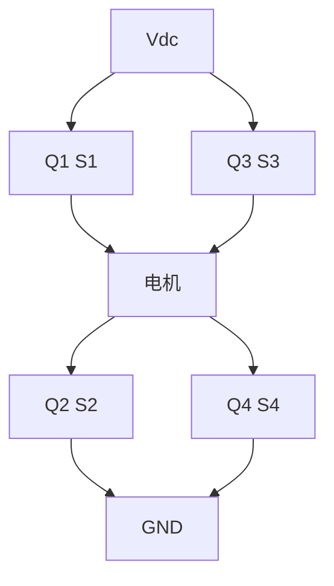
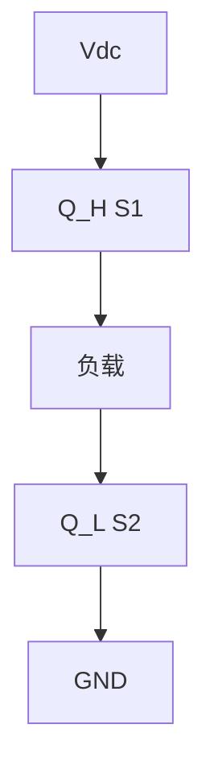
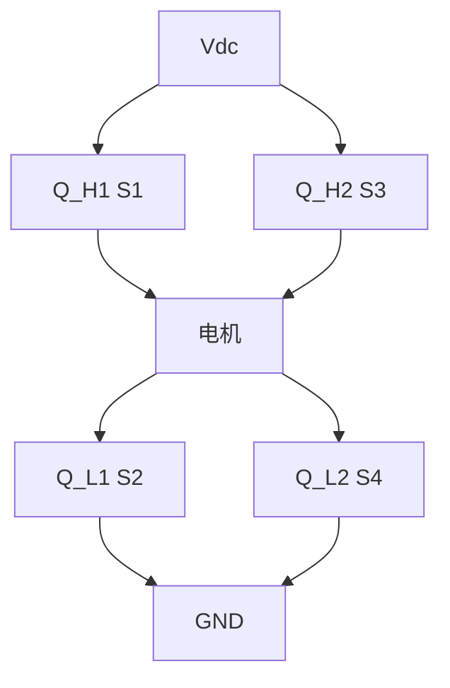
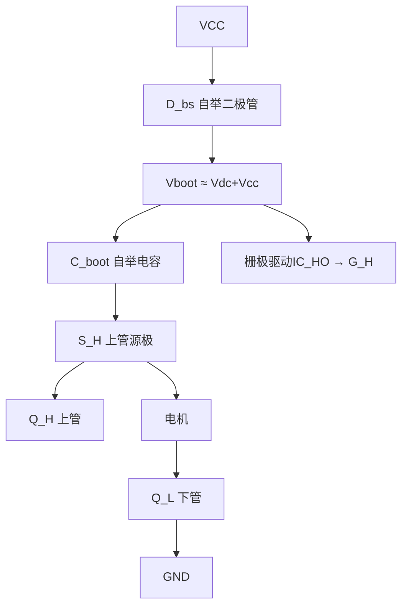
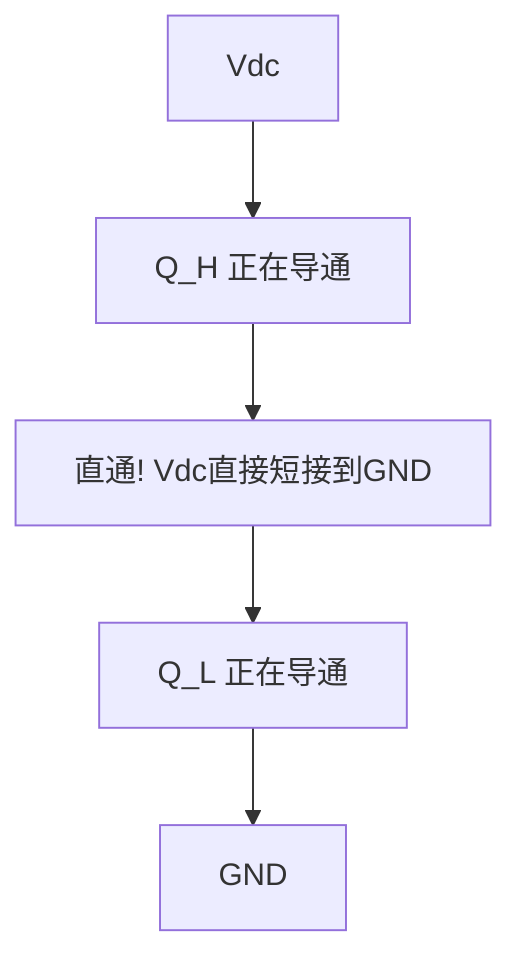
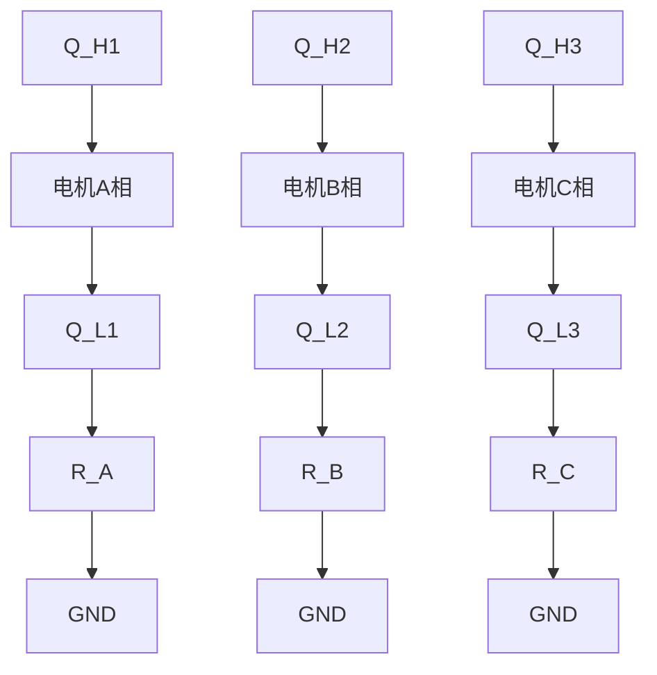
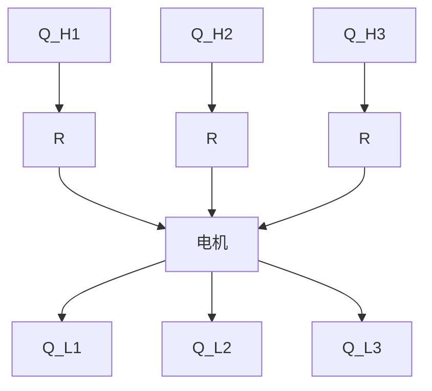
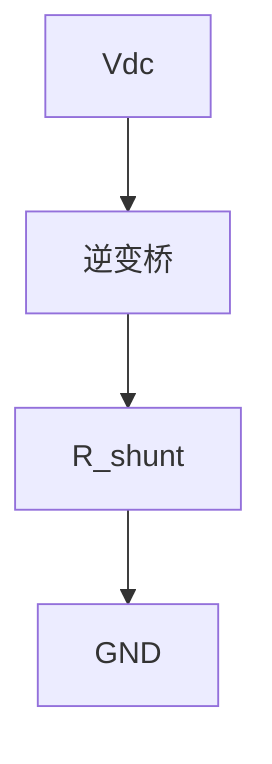

# EE-09 H桥与电机驱动拓扑

**副标题：从半桥到BLDC六步换相，掌握中小功率电机驱动的核心拓扑**

---

## 1.  核心摘要  

**一句话讲清楚**：H桥（全桥）是中小功率直流电机和BLDC驱动的核心拓扑——4个开关管构成"电子换向器"，通过控制不同开关组合实现正反转、制动和调速。理解H桥的换相逻辑、自举驱动、死区保护和电流采样是设计可靠电机驱动器的基础。

**认知挂钩**：很多人认为H桥"就是4个MOSFET"，**但这个简单结构蕴含着丰富的工程问题！** 自举电容选小→高端驱动失效，死区不够→上下管直通炸管，电流采样位置不对→电流信号全是噪声。BLDC的六步换相看似简单，但换相时刻的确定（霍尔传感器 vs BEMF过零检测）、换相转矩脉动的抑制都是实际工程难题。

**与电机控制的关联**：
-  **BLDC六步换相**：6个状态对应6个基本空间矢量 → 方波驱动的基础
-  **自举驱动**：上管N-MOSFET的栅极驱动电源 → 决定占空比能否到100%
-  **死区时间**：上下管开关间隙 → 影响BLDC换相时的转矩脉动
-  **电流采样位置**：低端/相线/母线 → 影响电流控制策略选择
-  **再生制动**：H桥的制动能量回馈路径 → 需要母线电容吸收或制动电阻消耗

---

## 2.  问题引入  

### 工程师的真实困惑

**场景1：自举电容导致上管无法导通**
```text
工程师A:"我的BLDC驱动器在100%占空比下运行一段时间后,
上管突然不导通了,电机失速..."
问题现象:
- 低占空比(如90%)正常工作
- 满占空比(100%)运行约5秒后上管失效
- 降低占空比后恢复
```

**场景2：死区设置导致BLDC换相转矩脉动**
```text
工程师B:"BLDC电机在换相瞬间有明显的顿挫感,特别是低速时..."
问题现象:
- 每次换相(每60°电角度)电机抖动一下
- 高速时抖动不明显,低速时非常明显
- 电流波形在换相点有尖峰
```

**场景3：电流采样位置错误**
```text
工程师C:"我在H桥的母线上串了采样电阻,但读到的电流波形跟相电流完全对不上..."
问题现象:
- 母线电流是间断的脉冲,不是连续的相电流
- PWM关断时母线电流为零
- 无法用于FOC控制
```

### 核心问题

- 上管失效 → 自举电容在100%占空比下无法刷新 → 高端驱动电压跌落
- 换相抖动 → 死区导致换相瞬间出现电流断续 → 转矩瞬时跌落
- 采样错误 → 母线电流是斩波后的,不是连续相电流 → 需要低端或相线采样

### 学习目标

读完本模块，你将能够：

 **掌握H桥拓扑** - 半桥/全桥结构，四象限运行（正转/反转/制动/发电）
 **理解自举驱动** - 自举电容原理、容量计算、占空比限制
 **精通BLDC六步换相** - 换相表、霍尔传感器与换相逻辑
 **设计死区时间** - 直通防止、换相重叠、转矩脉动抑制
 **选择电流采样方案** - 低端/相线/母线三种方案的利弊

---

## 3.  直观理解  

### 类比1：H桥 = "四向开关矩阵"



### 类比2：自举电路 = "给自己抬轿子"

```text
生活场景：你想把自己抬起来——抓住自己的头发是做不到的。
但如果你站在一个平台上，用泵把平台升高，你也就升高了。

自举电路原理：
  下管导通时 → 自举电容通过Vcc充电 → 电容两端电压≈Vcc
  下管关断 → 电容负端（接上管源极）被"抬"到母线电压Vdc
  电容正端 = Vdc + Vcc → 为上管栅极提供驱动电压
  
  这就是"自举"（Bootstrap）——自己把自己抬起来！
```

### 类比3：BLDC六步换相 = "接力赛"

```text
6个开关状态对应电机旋转一周的6个扇区：

扇区1: Q1+Q6 → 电流A→B      ← 第一棒
扇区2: Q1+Q2 → 电流A→C      ← 第二棒
扇区3: Q3+Q2 → 电流B→C      ← 第三棒
扇区4: Q3+Q4 → 电流B→A      ← 第四棒
扇区5: Q5+Q4 → 电流C→A      ← 第五棒
扇区6: Q5+Q6 → 电流C→B      ← 第六棒

每60°电角度交接一次，像接力赛跑传递接力棒。
```

---

## 4.  技术原理  

### 4.1 半桥与全桥拓扑

#### 4.1.1 半桥（Half-Bridge）



#### 4.1.2 全桥（H-Bridge）



### 4.2 自举栅极驱动（Bootstrap Gate Drive）

#### 4.2.1 为什么需要自举？

N-MOSFET的导通条件：
$$
V_{GS} > V_{GS(th)} \quad \text{通常 } V_{GS} \ge 10V
$$

对于H桥中的上管（高端N-MOSFET）：
- 源极(S)接负载，电压在0V到Vdc之间变化
- 要导通上管，栅极(G)电压必须比源极高10V以上
- 当上管导通时，源极电压≈Vdc → 栅极需要Vdc+10V！

**自举电路的目的：产生比Vdc还高10V的驱动电压。**

#### 4.2.2 自举电路原理



#### 4.2.3 自举电容容量计算 

$$
C_{boot} > \frac{Q_{g\_total} + I_{leak} \times T_{on\_max}}{\Delta V_{boot\_allowed}}
$$

其中：
- $Q_{g\_total}$ = 上管总栅极电荷（从datasheet）
- $I_{leak}$ = 驱动IC的静态电流 + 自举二极管漏电流
- $T_{on\_max}$ = 上管最长导通时间
- $\Delta V_{boot\_allowed}$ = 允许的自举电压跌落（通常<1V）

**计算实例**：
```text
上管MOSFET: IRF540N, Qg_total=71nC @Vgs=10V
驱动IC: IR2110, I_qbs=50μA (高侧静态电流)
二极管漏电流: 1μA
最长导通时间: 100%占空比下 T_on_max=∞（实际上不可能）

设计100Hz刷新率（每10ms至少刷新一次）：
  T_on_max = 10ms
  Q_total = 71nC + (50μA+1μA) × 10ms = 71nC + 510nC = 581nC
  ΔV_boot_allowed = 1V
  C_boot_min = 581nC / 1V = 581nF

选择 C_boot = 1μF（留裕量，且标准值）

 如果占空比必须达到100%：
  自举电容无法刷新→Vboot持续跌落→最终上管无法导通
  解决方案：
    1. 使用隔离DC-DC为上管提供独立电源
    2. 使用电荷泵（charge pump）辅助刷新
    3. PMOS做上管（栅极驱动简单，但PMOS性能差）
```

### 4.3 BLDC六步换相

#### 4.3.1 换相表

BLDC三相全桥驱动（与FOC三相逆变器拓扑相同，但控制方式不同）：

```text
BLDC换相真值表（基于霍尔传感器位置）：

霍尔 │ 状态 │ A+ │ A- │ B+ │ B- │ C+ │ C- │ 电流流向
─────┼─────┼────┼────┼────┼────┼────┼────┼─────────
 101 │  1  │ 1  │ 0  │ 0  │ 0  │ 0  │ 1  │ A→C
 100 │  2  │ 1  │ 0  │ 0  │ 1  │ 0  │ 0  │ A→B
 110 │  3  │ 0  │ 0  │ 0  │ 1  │ 1  │ 0  │ C→B
 010 │  4  │ 0  │ 1  │ 0  │ 0  │ 1  │ 0  │ C→A
 011 │  5  │ 0  │ 1  │ 1  │ 0  │ 0  │ 0  │ B→A
 001 │  6  │ 0  │ 0  │ 1  │ 0  │ 0  │ 1  │ B→C

1 = 上管导通，0 = 下管导通
(注意：霍尔101/100/110/010/011/001是120°霍尔序列的6种合法状态)
```

#### 4.3.2 六步换相的物理过程

```text
每一步持续60°电角度，6步为一周期（360°电角度）

转子位置　　　　电流方向　　　　定子磁场
────────────────────────────────────────
0°~60°　　　　 A→C　　　　　  →  方向
60°~120°　　　 A→B　　　　　  →  方向
120°~180°　　　 C→B　　　　　  ←  方向
180°~240°　　　 C→A　　　　　  ←  方向
240°~300°　　　 B→A　　　　　  ←  方向
300°~360°　　　 B→C　　　　　  →  方向

定子磁场以60°步长旋转，转子永磁体跟随定子磁场
转矩产生原理与FOC相同，但方波驱动→转矩脉动大
```

#### 4.3.3 PWM调制策略

**方案A：上管PWM + 下管常通（最常用）**
```text
优点：实现简单，只需PWM上管
缺点：开关损耗集中在上管

示例（扇区1，A→C）：
  Q1(A+): PWM调制
  Q6(C-): 常通
  其他管: 关断
```

**方案B：互补PWM + 死区（接近FOC模式）**
```text
上下管互补导通（对称调制），类似SVPWM

优点：电流纹波小，开关损耗均匀
缺点：需要死区插入，复杂度稍高
```

### 4.4 死区时间与直通保护

#### 4.4.1 直通（Shoot-Through）机制



#### 4.4.2 死区时间计算

$$
t_{dead\_min} > t_{d(off)\_max} + t_{f\_max} - t_{d(on)\_min}
$$

MOSFET典型值：
- $t_{d(off)}$: 20~50ns
- $t_f$: 10~30ns
- $t_{d(on)}$: 10~20ns
- **$t_{dead}$典型值：500ns~1μs**（低压MOSFET）

BLDC换相时的死区影响：
- 死区期间两个上管都关断→电流断续→转矩瞬时跌落→换相转矩脉动
- 高转速时换相周期短→死区占比大→转矩脉动显著

```text
改善方案：换相重叠（Overlap Commutation）
  在BLDC换相时，让"待关断相"和"待导通相"短暂重叠导通
  类似于直流电机的"有刷换向器短路换向"
  代价：短时环流→额外损耗
```

### 4.5 电流采样方案对比

#### 4.5.1 三种采样位置







#### 4.5.2 BLDC vs FOC的采样需求

```text
BLDC六步换相：只需要平均值或峰值电流→母线采样或低端采样均可
FOC控制：需要三相瞬时相电流→必须相线采样或低端三电阻+同步采样
```

### 4.6 再生制动路径

```text
```mermaid
flowchart LR
    A["电机减速"] --> B["反电动势>母线电压"]
    B --> C["续流二极管导通"]
    C --> D["电流回流到母线"]
    D --> E["母线电压升高!"]
```text

能量回馈路径：
  电机L → D_upper → Vdc+ → C_dc → GND → D_lower → 电机L

若Vdc过高：
  → 需要制动斩波器消耗多余能量
  → 或使用有源前端（AFE）回馈电网
```

### 4.7 常用BLDC集成驱动IC

```text
┌──────────────────────────────────────────────────────────────────┐
│  IC型号     │ 电压范围  │ 峰值电流 │ 特性                         │
│ ──────────┼─────────┼────────┼──────────────────────────────│
│ DRV8313    │ 8~60V    │ 2.5A   │ 三半桥集成，SPI控制，内置保护   │
│ DRV8301    │ 6~60V    │ 外置MOS│ 栅极驱动+双CSA+SPI             │
│ L6234      │ 7~52V    │ 5A     │ 三半桥集成，霍尔输入，6步自动   │
│ A4950      │ 8~40V    │ 3.5A   │ 单H桥，电流检测，PWM控制       │
│ TMC5160    │ 8~60V    │ 外置MOS│ 静音驱动，StealthChop2         │
│ FD6288     │ 5~20V驱  │ 外置MOS│ 三相栅极驱动，国产高性价比      │
└──────────────────────────────────────────────────────────────────┘
```

---

## 5.  交叉视角  

### 5.1 H桥 → FOC三相逆变器

H桥（4管）本质上就是两个半桥，而三相逆变器（6管）是三个半桥。

从H桥到FOC逆变器的思维升级：
- BLDC六步换相：6个离散状态→每个状态持续60°→方波驱动
- FOC SVPWM：连续的电压矢量→任意角度、任意幅值→正弦波驱动

**硬件拓扑完全相同**，差别仅在控制方式（软件层面）！

这就是为什么同一个硬件平台既可以跑BLDC方波控制，也可以跑FOC——通过软件切换即可。

### 5.2 自举驱动限制 → PWM调制策略

自举驱动限制：
1. 最大占空比不能达到100%（需要下管导通刷新自举电容）
2. 低频运行时自举电容可能放电过度

对PWM策略的影响：
- 硬件PWM最大占空比限制：$D_{max}=95\%$（留5%时间给下管导通刷新）
- 若需要100%占空比→需用隔离电源或电荷泵辅助
- BLDC上管PWM+下管常通策略天然避免了100%占空比问题

### 5.3 死区时间 → BLDC换相策略

死区对BLDC的影响比FOC更严重，因为：
- FOC中死区导致电压损失→软件死区补偿可解决
- BLDC中死区导致换相时电流完全断续→转矩剧烈脉动→机械振动

BLDC改善策略：
1. 换相时使用**重叠换相**（短暂同时导通两相）
2. 换相后立即补偿占空比（Boost占空比法）
3. 直接切换到FOC控制（在高速时）→从根本上解决

---

## 6.  工程案例  

### 案例1：自举电容失效导致上管烧毁

**项目背景**：
```text
应用：电动工具BLDC驱动器
MOSFET：IRF540N（100V/33A）
驱动：FD6288（三相栅极驱动IC，自举供电）
自举电容：100nF（错误选值！）
PWM频率：20kHz
问题：运行约10分钟后上管击穿
```

**诊断过程**：
```text
步骤1：IRF540N的Qg_total=71nC
步骤2：自举电容100nF存储电荷 Q=C×ΔV=100nF×12V=1200nC
步骤3：每次开关消耗Qg=71nC→理论上 1200/71=16次就耗尽！
  但每次下管导通都会刷新→所以关键在于上管导通时间

步骤4：检查实际工况
  - 低速运行时占空比≈30%→下管导通时间占比大→自举电容充分刷新→正常
  - 中速运行占空比≈80%→下管导通时间仅20%（1/20k×0.2=10μs）→刷新有限
  - 加上驱动IC静态电流50μA→10ms放电→C_boot电压从12V跌至约8V→栅极驱动不足
  →上管进入线性区→功耗急剧上升→热击穿!
```

**解决方案**：
```text
C_boot改为2.2μF：
  存储电荷：2.2μF×12V=26400nC
  单次开关消耗71nC→可支持370次不刷新
  加上10ms的IC泄漏500nC→总计10ms消耗约571nC
  电压跌落ΔV=571nC/2.2μF=0.26V ← 可忽略!
  即使100%占空比，可维持10ms以上正常工作
```

---

### 案例2：BLDC零电流钳位效应

**项目背景**：
```text
应用：电动自行车BLDC控制器
死区：1.5μs（MCU配置）
PWM频率：16kHz
问题：低速时电机抖动明显，电流波形有"阶梯状"
```

**诊断过程**：
```text
步骤1：分析死区导致的电压损失
  BLDC换相时，死区期间所有开关管关断→电流断续
  电流从0开始重建 → 重建时间 ≈ L×ΔI/Vdc≈数十μs
  
  低速时换相周期长（如600rpm=10rps×6=60换相/秒→16.7ms/换相）
  但死区导致的电流重建时间∝1/Vdc（固定）→在低速占比小→不应是主因

步骤2：观察PWM波形
  实际的电压损失来自每周期死区：
  ΔV_per_phase = Vdc × t_dead × f_pwm = 48V × 1.5μs × 16kHz = 1.15V
  
  低速（D=10%）：1.15V/4.8V = 24%损失！← 这才是主因！

步骤3：软件死区补偿（基于电流极性）
  检测到电流方向→在PWM占空比上增加/减少补偿量
  补偿量 = t_dead / T_pwm = 1.5μs / 62.5μs = 2.4%
  但BLDC电流在换相时会反向→极性检测窗口期→补偿失效→导致换相脉动
```

**解决方案**：
```text
1. 将PWM频率提高到32kHz：
   ΔV_per_phase = 48V × 1.5μs × 32kHz = 2.3V（更高!）
   → 频率提高不一定好，关键是死区占比

2. 减小死区时间为0.8μs（低压MOSFET足够）：
   ΔV_per_phase = 48V × 0.8μs × 16kHz = 0.61V
   → 损失降低47% 

3. 硬件上：使用专用栅极驱动IC（自适应死区）
   如DRV8301：内置死区控制和直通保护→死区自动优化
```

---

### 案例3：母线电流vs相电流的采样差异

**项目背景**：
```text
应用：3kW BLDC驱动器
采样方式：母线单电阻采样（低成本方案）
问题：电流环不稳定，电机调速响应慢
```

**分析**：
```text
母线上采到的电流波形：
  每个PWM周期：上管导通→母线有电流，上管关断→母线电流=0
  → 母线电流是"斩波后的"，不是连续的相电流！

  在D=50%时：
  I_bus = I_phase（上管导通时）= 实际相电流
  I_bus = 0（上管关断时）

  ADC采到的值是"0和I_phase的交替"→平均值为 D×I_phase=0.5I_phase
  → 换算 I_phase = I_bus_avg/D → D=0.5时放大2倍→噪声也放大2倍！

更严重的问题：
  PWM关断时相电流通过下管续流二极管续流→母线电流=0但相电流还在！
  → 如果ADC在PWM关断时采样，读到的母线电流=0→完全错误的电流信息!
```

**解决方案**：
```text
1. 改用低端三电阻采样（每个下管与GND之间各串一个shunt）
   → 在下管导通期间采样对应相电流
   → 需要ADC同步采样时序配合

2. 改用相线采样（每相输出串shunt）
   → 全程连续电流信号→适合FOC升级

3. 母线电流重构算法（仅BLDC适用）：
   根据PWM状态和占空比反推相电流
   局限性：BLDC的换相时刻母线电流=0→重构有盲区
```

---

### 案例4：从BLDC六步换相升级到FOC

```text
硬件不变（6管三相逆变器），仅改软件：

BLDC方案：
  - 换相表驱动 → 6步，每60°切换一次
  - 电流环：平均电流PI（慢速，10~100Hz）
  - 位置检测：霍尔传感器（60°分辨率）
  - PWM：上管调制+下管常通（不对称）

FOC升级方案：
  - SVPWM → 连续矢量旋转
  - 电流环：dq轴PI（快速，1~2kHz）
  - 位置检测：霍尔的低分辨率→需要角度插值（零阶保持器或一阶线性）
  - PWM：对称互补调制+死区

升级关键：
  1. 霍尔传感器位置分辨率仅60°→FOC中需要电角度精度<1°
     → 用速度推算：θ_e(t)=θ_e_hall + ω×Δt
     → 或用BEMF观测器(无感FOC)替代霍尔
  2. 电流采样需从母线单电阻改为低端三电阻
  3. 电流环带宽从100Hz提升到1kHz以上
```

---

### 案例5：H桥再生制动设计

**项目背景**：
```text
应用：AGV小车直流有刷电机驱动（H桥，24V/200W）
问题：频繁启停导致母线电压飙升，损坏其他电路
```

**分析**：
```text
H桥制动时：
  - Q1+Q3导通（上桥臂短路制动）：电机两端短路→能耗制动→电流在H桥内部循环
  - 或Q2+Q4导通：同上，但电流方向相反
  - 全部关断：惯性旋转→反电动势→通过续流二极管回馈到母线→Vdc升高

  24V系统，制动能量：
  E = 0.5×J×ω² = 0.5×0.01×100² ≈ 50J（假设小车电机）
  母线电容1000μF→ΔVdc = √(2E/C+Vdc²) - Vdc = √(2×50/0.001+24²) - 24
  = √(100000+576) - 24 ≈ 317 - 24 = 293V! ← 远超24V系统的器件耐压!
```

**解决方案**：
```text
1. 增加母线TVS管（P6KE30A，30V钳位）→吸收瞬时过压
2. 增加制动电阻+开关：Vdc>28V→开通制动MOSFET→并联10Ω/10W电阻
3. 软件策略：需要减速时优先使用能耗制动（Q1+Q3短路制动）
   → 能量在H桥内部消耗→不会回馈到母线
   → 但要注意MOSFET温升（制动功率= I²×Rds_on）
```

---

## 7.  实践练习  

### 练习1：计算题——自举电容

```text
已知：
  MOSFET: IRFB4110 (100V/180A), Qg_total=150nC
  驱动IC: IR2110, I_qbs=120μA (最大)
  开关频率: 20kHz
  目标最大高侧导通时间: 50ms (对应10Hz最低刷新率)
  允许自举电压跌落: ΔV ≤ 0.5V (从12V→11.5V)

计算最小自举电容值
```

**参考答案**：
$Q_{total} = Q_g + I_{qbs} \times T_{on\_max} = 150nC + 120\mu A \times 50ms = 150nC + 6000nC = 6150nC$
$C_{boot\_min} = 6150nC / 0.5V = 12300nF = 12.3\mu F$
→选 $22\mu F/25V$ 陶瓷电容（MLCC X7R）

实际核查：20kHz下每次开关消耗150nC→50ms内开关1000次→总消耗150μC
加上IC 50ms静态6μC→总计156μC→$22\mu F$电容电压跌落=$156\mu C / 22\mu F = 7.1V$→不够！

修正：实际需要在50ms内开关1000次，Qg消耗是主要的！
$C_{boot\_min} = 150\mu C / 0.5V = 300\mu F$→这太大了！
→说明50ms不刷新不现实→改为10ms刷新（100Hz最低刷新率）
→$C_{boot\_min} = 150nC \times 200 + 6\mu C / 0.5V = 36\mu C / 0.5V = 72\mu F$→选$100\mu F$

**最终结论：低频运行时必须保证自举电容周期性刷新，大电容方案不经济→考虑电荷泵辅助或隔离电源。**

### 练习2：判断题

**题目1**：自举电路中，自举二极管的作用是在下管导通时允许Vcc对自举电容充电。（ ）
> 答案：。下管导通时自举电容负端=GND→Vcc通过二极管对电容充电。

**题目2**：BLDC六步换相中，每一步持续60°机械角度。（ ）
> 答案：。是60°**电角度**。机械角度=电角度/P。4极电机中60°电=30°机械。

**题目3**：母线电流采样可以用于FOC控制的电流环反馈。（ ）
> 答案：。母线电流是斩波后的，不是连续相电流，FOC需要连续相电流（低端三电阻或相线采样）。

**题目4**：H桥中，Q1+Q3同时导通实现的是能耗制动。（ ）
> 答案：。上下桥臂上管导通→电机两端短路→电流在H桥内部循环→制动能量消耗在MOSFET导通电阻和电机绕组电阻上。

**题目5**：死区时间越长，BLDC换相时的转矩脉动越大。（ ）
> 答案：。死区期间所有管关断→电流断续→转矩跌落→死区越长转矩脉动越严重。

---

## 附录：关键公式汇总

### A. 自举电容
```text
C_boot > (Qg_total + I_leak × T_on_max) / ΔV_boot_allowed
ΔV_boot_allowed ≈ 0.5~1V（保持Vgs≥10V驱动）
```

### B. 死区时间
```text
t_dead > t_d(off)_max + t_f_max - t_d(on)_min
低压MOSFET: 0.5~1μs
高压IGBT: 3~5μs
```

### C. BLDC转速
```text
n(rpm) = 60 × f_e / P
f_e = 换相频率/6（每电周期6次换相）
```

### D. H桥模式
```text
正转: Q1+Q4
反转: Q2+Q3
制动: Q1+Q3 或 Q2+Q4
续流: 全部关断（通过续流二极管回馈）
```

---

**文档信息**：
- 模块编号：EE-09
- 知识体系：电子学基础
- 模块名称：H桥与电机驱动拓扑
- 算法关联：六步换相→BLDC驱动、死区→转矩脉动、电流采样位置→FOC可行性

>  检验你的理解：[EE-09 检验题目](./EE-09-assessment.md)
