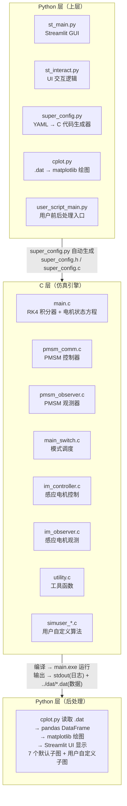
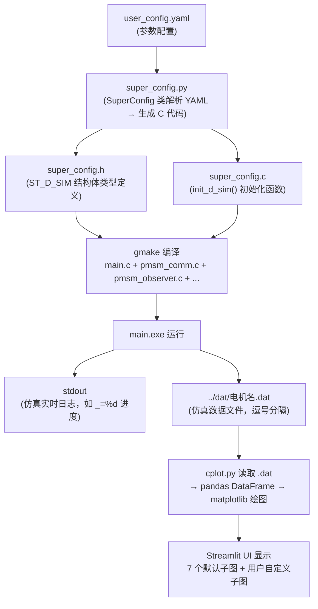

#  C 语言仿真验证 — 总索引

**版本：** v1.0
**日期：** 2026-05
**适用对象：** 电机控制学习者、嵌入式开发者

> 本索引将知识库理论模块与 emachinery C 语言仿真工程的运行模式建立对应关系，支持"按需查阅"——学完某节理论后，在此查找对应的仿真验证方案。

| 快速入口 | 说明 |
|---------|------|
| [SIM-01 快速上手指南](./SIM-01-C-Simulation-QuickStart.md) | 第一次使用仿真？从环境搭建到跑通第一个例子 |
| [SIM-02 代码概念映射](./SIM-02-C-Simulation-Code-Map.md) | 想深入理解 C 代码实现？理论概念→代码位置的精确映射 |
| [SIM-03 仿真绘图系统](./SIM-03-C-Simulation-Plotting.md) | 想自定义绘图？.dat 文件→matplotlib 完整管线 |
| [SIM-04 完整使用教程](./SIM-04-emachinery-Complete-Usage-Tutorial.md) | 从零开始的系统教程：架构、操作、模式、插件、扩展、进阶 |

---

##  启动 emachinery 仿真

emachinery 是一个独立的 Streamlit 应用，需要**先在 Windows 中启动**才能使用：

**第一步：启动仿真服务器**
双击 `%EMACHINERY_START_SCRIPT%`（约 10 秒启动，会弹出命令行窗口和一个浏览器标签页）

**第二步：在浏览器中操作仿真**
启动后默认打开 `http://localhost:8501/`，在 Streamlit 界面中选择电机、选择仿真模式、调参数、点击「Save to C and compile」运行仿真

**备用方式：仅编译运行 C 代码（无需浏览器）**
双击 `%EMACHINERY_BUILD_SCRIPT%` → 编译成功后手动运行 `main.exe` → 输出 `.dat` 数据文件

>  首次使用请确保已安装 TDM-GCC-64 和 Python 虚拟环境（`%EMACHINERY_VENV%`）。详见 [SIM-01 环境准备](./SIM-01-C-Simulation-QuickStart.md#1-环境准备)。

---

## 1. 仿真工程简介

emachinery 是一个 **Python + C 混合** 的电机控制数值仿真框架。

| 层 | 语言 | 职责 |
|---|------|------|
| **GUI 层** | Python (Streamlit) | 参数配置、电机选择、模式切换、结果可视化 |
| **仿真引擎** | C | 电机状态方程的 RK4 数值积分、控制算法执行、观测器计算 |
| **桥梁层** | Python (`super_config.py`) | YAML 配置 → C 头文件/源文件自动生成 |
| **后处理层** | Python (`cplot.py`) | 读取仿真输出 `.dat` 文件 → matplotlib 绘图 |

**支持电机类型：** PMSM（永磁同步电机）、IM（感应电机）

**涵盖仿真模式：** 24 种（从 PWM 直接控制到 Nyquist 图绘制）

**与纯理论推导的不同：**
-  可以看到真实的电流/转速/转矩波形
-  可以观察阶跃响应、参数失配影响
-  可以扫频获取实测 Bode 图和 Nyquist 图

**与 DSP 实验代码的不同：**
-  没有硬件限制，可以自由修改参数和算法
-  编译运行在 PC 端，秒级完成仿真
-  支持任意精度的浮点运算（`REAL` = `double`）

---

## 2. KB 模块 → 仿真模式对应表（核心部分）

### 主题 A: FOC 基础与电流环

| KB 模块 | 仿真验证内容 | 推荐 Mode | 关键操作 |
|--------|------------|----------|---------|
| [ALG-00 电流环直觉](../algorithm/ALG-00-Current-Loop-Intuition.md) | 观察 Kp/Ki 对电流阶跃响应的影响：增大 Kp 加快上升但可能超调，增大 Ki 消除静差但可能振荡 | `MODE_SELECT_FOC` (3) | 在 sidebar 可调参数中改 `FOC.CLBW_HZ`（=Kp/L）和 `FOC.delta`（影响 Ki），设定 id=0, iq=额定值，观察 iD/iQ 子图的阶跃响应波形 |
| [ALG-01 FOC 理论](../algorithm/ALG-01-FOC-Theory.md) | 验证 Clarke→Park→PI→解耦→InvPark 完整变换链路：id/iq 是否正确解耦，角度变换是否正确 | `MODE_SELECT_FOC` (3) | 设定非零 id 命令（如 id=0.5A, iq=0），观察 uAB 子图中 αβ 电压是否为旋转矢量；改变角度 theta_d，验证 dq 轴电流是否恒定 |
| [ALG-03 PI 电流调节器](../algorithm/ALG-03-PI-Current-Regulator.md) | 扫频验证电流环实际带宽：用正弦扫频激励测量电流环闭环频率响应，找到 -3dB 带宽点 | `MODE_SELECT_ID_SWEEPING_FREQ` (33) 或 `MODE_SELECT_IQ_SWEEPING_FREQ` (34) | 启用扫频模式，电流环带宽理论值 = CLBW_HZ，实际 -3dB 点受采样延迟和离散化影响会略低 |
| [ALG-02 电流采样时序](../algorithm/ALG-02-Current-Sampling-Timing.md) | 理解采样周期 CL_TS 对电流环性能的影响：采样越快控制越好，但计算负担越大 | 任意 FOC 模式 | 改 `sim.CLTS`（如从 1e-4 改为 5e-4），观察电流环阶跃响应是否变差；同时注意 `NUMBER_OF_STEPS` 相应调整以保持总仿真时间 |

---

### 主题 B: 速度环与位置环

| KB 模块 | 仿真验证内容 | 推荐 Mode | 关键操作 |
|--------|------------|----------|---------|
| [ALG-05 有感 FOC](../algorithm/ALG-05-Sensored-FOC.md) | 速度阶跃响应：给定阶跃转速指令，观察速度跟踪、iq 电流、转矩的时域响应 | `MODE_SELECT_VELOCITY_LOOP` (4) | 修改 `pmsm_comm.c` 的 `_user_commands()` 函数中的转速指令序列（如 0→400rpm→-400rpm），添加负载阶跃（ACM.TLoad），观察 Speed/Torque 子图 |
| [ALG-12 速度环与转矩观测器](../algorithm/ALG-12-Speed-Loop-Torque-Observer.md) | 负载转矩在线估计：ESO 能否准确跟踪未知负载转矩 | `MODE_SELECT_VELOCITY_LOOP_USING_ESO_FOR_SPEED` (47) | 在 `_user_commands()` 中施加未知负载阶跃，观察 `OFSR.esoaf.xTL` 是否跟踪真实负载 `ACM.TLoad` |
| [CT-04 PID 控制原理](../control-theory/CT-04-PID-Control-Principles.md) | P/I/D 各环节对速度环响应的影响：纯P有静差，加I消除静差，加D抑制超调 | `MODE_SELECT_VELOCITY_LOOP` (4) | 在 `init_CTRL()` 中分别将 `PID_Speed->Kp`/`Ki_CODE` 设为零，观察 Speed 子图的稳态误差和超调变化 |
| [CT-05 PID 整定与实现](../control-theory/CT-05-PID-Tuning-Implementation.md) | TI InstaSPIN 整定公式验证：Kp=L*BW, Ki=Kp*R/L*Ts 的实际效果 | `MODE_SELECT_VELOCITY_LOOP` (4) | 改 `FOC.delta`（速度/电流带宽比），delta 越大速度环越慢，观察 Speed 子图响应速度变化 |
| [CT-14 级联 PID](../control-theory/CT-14-Cascaded-PID-Control.md) | 电流环+速度环双环交互：速度环输出作为电流环给定 | `MODE_SELECT_VELOCITY_LOOP` (4) | 改 `VL_EXE_PER_CL_EXE`（速度环降频比），如从 1 改为 10，观察速度环控制效果变差 |
| [CT-06 前馈控制](../control-theory/CT-06-Feedforward-Control.md) | dq 轴解耦前馈的效果：抵消反电动势耦合项 | `MODE_SELECT_VELOCITY_LOOP` (4) | 切换 YAML 中 `bool_apply_decoupling_voltages_to_current_regulation`，观察高速时 id/iq 耦合是否减少 |

---

### 主题 C: 无感控制与观测器

| KB 模块 | 仿真验证内容 | 推荐 Mode | 关键操作 |
|--------|------------|----------|---------|
| [ALG-06 位置与速度观测器](../algorithm/ALG-06-Position-Speed-Observer.md) | 角度跟踪观测器（ATO/PLL）：观测位置能否跟踪真实位置 | `MODE_SELECT_FOC_SENSORLESS` (31) | 对比 `OBSV.theta_d`（观测角度）和 `ACM.theta_d`（真实角度），观察收敛过程和无感启动 |
| [ALG-07 无感观测器](../algorithm/ALG-07-Sensorless-Observers.md) | 多种观测器（反EMF/SMO/磁链/EKF）在低速和高速下的性能对比 | `MODE_SELECT_VELOCITY_LOOP_SENSORLESS` (41) | 切换观测器类型，观察低速（<100rpm）时的角度误差和高速反转时的跟踪性能 |
| [CT-11 观测器设计](../control-theory/CT-11-Observer-Design.md) | 观测器极点配置对收敛速度的影响：极点离原点越远收敛越快但对噪声越敏感 | `MODE_SELECT_Marino2005` (44) | 改观测器增益参数，观察角度误差收敛曲线（初始角度偏差→收敛到零的时间） |
| [CT-16 ADRC](../control-theory/CT-16-ADRC-Theory.md) | ESO 扩张状态观测器：同时估计转速、位置、负载转矩 | `MODE_SELECT_VELOCITY_LOOP_USING_ESO_FOR_SPEED` (47) | 改 `CAREFUL_ESOAF_OMEGA_OBSERVER`（观测器带宽），观察 OFSR.esoaf.xTL 对阶跃负载的估计 |
| [CT-17 LADRC](../control-theory/CT-17-LADRC-Linear-ADRC.md) | 线性 ADRC 验证：线性 ESO + 线性状态误差反馈控制律 | `MODE_SELECT_VELOCITY_LOOP_USING_ESO_FOR_SPEED` (47) | 对比 ADRC 与 PI 速度环的抗扰动性能 |

---

### 主题 D: 参数辨识

| KB 模块 | 仿真验证内容 | 推荐 Mode | 关键操作 |
|--------|------------|----------|---------|
| [ALG-13 参数自整定](../algorithm/ALG-13-Protection-Optimization.md) | 分步参数辨识全流程：电阻→电感→磁链→惯量，理解每步的物理原理 | `MODE_SELECT_COMMISSIONING` (9) | 观察控制台输出：R 辨识（电流扫频+最小二乘拟合）、L 辨识（正弦激励+相干解调）、KE 辨识（反电动势法）、Js 辨识（Awaya1992 观测器） |
| [HW-01 电机本体基础](../hardware/HW-01-Motor-Basics.md) | 不同电机参数（Ld/Lq、Rs、KE、Js）对控制性能的影响 | 任意 FOC 模式 | 在 Streamlit 中切换不同电机（SEW100W、SEW200W 等），观察相同 PI 参数下不同电机的响应差异 |

---

### 主题 E: 逆变器非线性与死区

| KB 模块 | 仿真验证内容 | 推荐 Mode | 关键操作 |
|--------|------------|----------|---------|
| [ALG-04 死区补偿](../algorithm/ALG-04-Deadtime-Compensation.md) | 逆变器非线性建模对比：理想/查表/Sigmoid拟合/Sul1996 模型 | `MODE_SELECT_INVERTER_NONLINEARITY_SENSORLESS` (49) | 在 `ACMSim.h` 中改 `__INVERTER_NONLINEARITY` 宏（0=理想, 1=Sul1996, 2=Sigmoid, 3=LUT, 4=LUT_Indexed），观察电流波形畸变程度 |
| [ALG-10 过调制](../algorithm/ALG-10-Overmodulation.md) | 电压利用率极限：母线电压利用率接近 1.0 时进入过调制区 | 任意 FOC 模式 | 将转速指令设到接近额定转速，改 `LIMIT_DC_BUS_UTILIZATION` 从 0.96 到 1.0，观察 Vdc Util 子图和电流谐波 |

---

### 主题 F: 扫频与频域分析

| KB 模块 | 仿真验证内容 | 推荐 Mode | 关键操作 |
|--------|------------|----------|---------|
| [CT-03 频域响应与 Bode 图](../control-theory/CT-03-Frequency-Response-Bode.md) | 实测电流环/速度环频率响应，生成 Bode 图 | `MODE_SELECT_SWEEPING_FREQ_FOR_VELOCITY_AND_CURRENT` (46) | 启用扫频，在 Streamlit 中切换到 `plugin_Sweeping` 插件查看自动生成的 Bode 图，找 -3dB 带宽和相位裕度 |
| [CT-07 Nyquist 稳定判据](../control-theory/CT-07-Nyquist-Stability.md) | 实测 Nyquist 图，验证系统稳定裕度 | `MODE_SELECT_NYQUIST_PLOTTING` (91) | 观察 Nyquist 轨迹相对于 (-1, 0) 点的位置，判断闭环稳定性 |

---

## 3. 仿真模式编号速查表

| Mode 值 | 宏名 | 说明 |
|---------|------|------|
| 1 | `MODE_SELECT_PWM_DIRECT` | PWM 直接控制：给定固定占空比 |
| 11 | `MODE_SELECT_VOLTAGE_OPEN_LOOP` | 电压开环控制：给定 αβ 轴电压旋转矢量 |
| 2 | `MODE_SELECT_WITHOUT_ENCODER_CURRENT_VECTOR_ROTATE` | 无编码器电流矢量旋转：开环电流控制 |
| 3 | `MODE_SELECT_FOC` | 磁场定向控制（有传感器）：Clarke→Park→PI→InvPark |
| 31 | `MODE_SELECT_FOC_SENSORLESS` | 无传感器 FOC：观测器估计角度代替编码器 |
| 32 | `MODE_SELECT_INDIRECT_FOC` | 间接磁场定向控制（用于感应电机） |
| 33 | `MODE_SELECT_ID_SWEEPING_FREQ` | D 轴电流扫频：验证电流环 D 轴频率响应 |
| 34 | `MODE_SELECT_IQ_SWEEPING_FREQ` | Q 轴电流扫频：验证电流环 Q 轴频率响应 |
| 4 | `MODE_SELECT_VELOCITY_LOOP` | 速度闭环控制（有感）：电流环+速度环级联 |
| 41 | `MODE_SELECT_VELOCITY_LOOP_SENSORLESS` | 无传感器速度闭环 |
| 42 | `MODE_SELECT_TESTING_SENSORLESS` | 无传感器算法测试模式 |
| 43 | `MODE_SELECT_VELOCITY_LOOP_WC_TUNER` | 速度环带宽整定（HitWall 分析） |
| 44 | `MODE_SELECT_Marino2005` | Marino 2005 年观测器实现 |
| 45 | `MODE_SELECT_VELOCITY_LOOP_HARNEFORS_1998` | Harnefors 1998 反计算观测器 |
| 46 | `MODE_SELECT_SWEEPING_FREQ_FOR_VELOCITY_AND_CURRENT` | 速度/电流扫频：同时支持速度环和电流环扫频 |
| 47 | `MODE_SELECT_VELOCITY_LOOP_USING_ESO_FOR_SPEED` | ESO 扩张状态观测器估计转速 |
| 48 | `MODE_SELECT_VARIABLE_PARAMETERS_VELOCITY_LOOP_SENSORLESS` | 变参数无传感器速度环 |
| 49 | `MODE_SELECT_INVERTER_NONLINEARITY_SENSORLESS` | 逆变器非线性补偿+无传感器控制 |
| 5 | `MODE_SELECT_POSITION_LOOP` | 位置闭环控制：位置环+速度环+电流环三级联 |
| 9 | `MODE_SELECT_COMMISSIONING` | 参数自整定全流程：R→L→KE→Js 分步辨识 |
| 91 | `MODE_SELECT_NYQUIST_PLOTTING` | Nyquist 图绘制：扫频提取频率响应 |
| 98 | `MODE_SELECT_UDQ_GIVEN_TEST` | 给定 Udq 测试：直接设定 dq 轴电压 |
| 8 | `MODE_SELECT_GENERATOR` | 发电机模式 |

---

## 4. 可观测信号速查表

### 转速类

| 变量表达式 | 物理含义 | 单位 |
|-----------|---------|------|
| `ACM.varOmega * MECH_RAD_PER_SEC_2_RPM` | 电机实际机械转速 | rpm |
| `(*CTRL).i->cmd_varOmega * MECH_RAD_PER_SEC_2_RPM` | 转速指令值 | rpm |
| `OFSR.esoaf.xOmg * ELEC_RAD_PER_SEC_2_RPM` | ESO 估计转速 | rpm |
| `OBSV.varOmega * MECH_RAD_PER_SEC_2_RPM` | 观测器估计转速 | rpm |

### 电流类

| 变量表达式 | 物理含义 | 单位 |
|-----------|---------|------|
| `ACM.iDQ[0]` | 电机实际 d 轴电流 | A |
| `ACM.iDQ[1]` | 电机实际 q 轴电流 | A |
| `(*CTRL).i->iDQ[0]` | 控制器测量 d 轴电流 | A |
| `(*CTRL).i->iDQ[1]` | 控制器测量 q 轴电流 | A |
| `(*CTRL).i->cmd_iDQ[0]` | d 轴电流指令 | A |
| `(*CTRL).i->cmd_iDQ[1]` | q 轴电流指令 | A |
| `ACM.iAB[0]` | 电机实际 α 轴电流 | A |
| `ACM.iAB[1]` | 电机实际 β 轴电流 | A |

### 转矩类

| 变量表达式 | 物理含义 | 单位 |
|-----------|---------|------|
| `ACM.Tem` | 电机电磁转矩 | N·m |
| `ACM.TLoad` | 负载转矩 | N·m |
| `OFSR.esoaf.xTL` | ESO 估计负载转矩 | N·m |

### 电压类

| 变量表达式 | 物理含义 | 单位 |
|-----------|---------|------|
| `ACM.uDQ[0]` | 电机实际 d 轴电压 | V |
| `ACM.uDQ[1]` | 电机实际 q 轴电压 | V |
| `ACM.uAB[0]` | 电机实际 α 轴电压 | V |
| `ACM.uAB[1]` | 电机实际 β 轴电压 | V |
| `(*CTRL).o->cmd_uDQ[0]` | 控制器输出 d 轴电压指令 | V |
| `(*CTRL).o->cmd_uDQ[1]` | 控制器输出 q 轴电压指令 | V |
| `(*CTRL).o->dc_bus_utilization_ratio` | 直流母线电压利用率 | - |

### 位置/角度类

| 变量表达式 | 物理含义 | 单位 |
|-----------|---------|------|
| `ACM.theta_d / M_PI * 180` | 电机实际电角度 | °（度） |
| `ACM.varTheta` | 电机实际机械角度 | rad |
| `(*CTRL).s->xRho / M_PI * 180` | 控制器使用的电角度 | °（度） |
| `OBSV.theta_d / M_PI * 180` | 观测器估计电角度 | °（度） |

### 磁链类

| 变量表达式 | 物理含义 | 单位 |
|-----------|---------|------|
| `ACM.KA` | 电机永磁磁链幅值 | Wb |
| `ACM.KL[2]` | dq 轴电感矩阵元素 | H |

---

## 5. 关键 C 文件速查表

| 文件 | 核心职责 | 主要函数/结构体 |
|------|---------|---------------|
| `main.c` | 仿真主循环、RK4 四阶龙格库塔积分器、PMSM/IM 电机状态方程、逆变器模型 | `DYNAMICS_MACHINE()`（电机状态微分方程）、`inverter_model()`（逆变器非线性模型）、`main()`（仿真主循环） |
| `pmsm_comm.c` | PMSM 控制器核心实现 | `_onlyFOC()`（Clarke→Park→PI→解耦→InvPark）、`FOC_with_velocity_control()`（速度环+电流环级联）、`tustin_PI()`/`incremental_PI()`（两种 PI 实现）、`StepByStepCommissioning_NEW_WB()`（分步参数辨识） |
| `pmsm_observer.c` | PMSM 无感观测器集合 | 反EMF/SMO/磁链/EKF/MRAS 等多种观测器实现函数 |
| `main_switch.c` | 仿真模式调度器 | `main_switch()` 根据 `MODE_SELECT_*` 枚举值分发到 24 种不同的控制算法执行路径 |
| `im_controller.c` | 感应电机控制器 | 间接磁场定向控制（IFOC）实现 |
| `im_observer.c` | 感应电机观测器 | 感应电机专用观测器实现 |
| `shared_flux_estimator.c` | 共享磁链估算器模块 | 磁链幅值和角度在线估计 |
| `utility.c` | 工具函数 | `write_data_to_file()`（数据记录）、`sign()`（符号函数）、`_lpf()`（低通滤波器）、`angle_diff()`（角度差计算） |
| `pi_math.h` | PI 控制器宏定义 | `PI_MACRO`（TI 官方增量式 PI）、`PI_POS_MACRO`（位置环 PI）、`PI_MACRO`（老明 PI） |
| `ACMSim.h` | 主头文件 | `struct MachineSimulated`（5 阶电机状态空间模型）、`struct ControllerForExperiment`（控制器结构体）、`MODE_SELECT_*` 枚举、跨文件 extern 声明 |
| `typedef.h` | 基础类型定义 | `REAL`（double）、`BOOL`（int）、`int32`、`Uint32`、`int16` 等 |
| `ACMConfig.h` | 仿真配置宏 | `PC_SIMULATION`、`WHO_IS_USER`、`ENABLE_COMMISSIONING`、电机类型选择 |
| `super_config.h` | **自动生成**：YAML 参数对应的 C 结构体类型定义 | `ST_D_SIM` 结构体（所有仿真参数的运行时结构） |
| `super_config.c` | **自动生成**：结构体初始化函数 | `init_d_sim()` 将 YAML 配置值赋给 `ST_D_SIM` 结构体各成员 |
| `simuser_*.c/h` | 各用户的算法扩展 | bezier: Bezier 曲线速度控制器；wb: 扫频/HitWall/Harnefors；cjh: 感应电机/Marino2005；yzz: RK4 观测器/逆变器补偿；cury, qian 等用户自定义算法 |

---

## 6. 阅读建议

| 你的情况 | 建议路径 |
|---------|---------|
|  第一次使用仿真？ | → [SIM-01 快速上手指南](./SIM-01-C-Simulation-QuickStart.md) |
|  学完某节理论想验证？ | → 在本页 **第 2 节对应表** 查找 → 打开 Streamlit → 选择对应 Mode → 按"关键操作"列执行 |
|  想深入理解 C 代码实现？ | → [SIM-02 代码概念映射](./SIM-02-C-Simulation-Code-Map.md) |
|  想看某个信号的波形？ | → 查本页 **第 4 节可观测信号速查表** 找变量名 |

---

## 7. 附录：emachinery 仿真工程架构分析

### 7.1 工程整体架构

**数据桥梁：** `super_config.py`（Python）自动生成 `super_config.h/c`（C），将 YAML 中配置的参数转换为 C 结构体的类型定义和初始化代码。`*.dat` 文件作为 C 仿真引擎到 Python 绘图层的输出接口。

### 7.2 Python 层文件职责

| 文件 | 职责 |
|------|------|
| `st_main.py` | Streamlit 主入口，调度 UI 和仿真流程 |
| `st_interact.py` | UI 交互逻辑：电机选择、模式选择、参数编辑、编译触发 |
| `super_config.py` | YAML 配置 → C 头文件/C 文件自动生成器 |
| `cplot.py` | 读取 C 仿真输出 `.dat` → matplotlib 绘图 |
| `user_script_main.py` | 用户自定义预处理（`user_pre_process`）/后处理（`user_cplot_post_process`）入口 |
| `user_config.yaml` | 默认仿真参数配置（CLTS, NUMBER_OF_STEPS, CLBW_HZ, delta...） |
| `user_config_*.yaml` | 各用户的自定义配置（wb/cjh/yzz/cury/qian/gen/gzt/bezier/xm/zjl/wb2） |
| `motor_library.json` | 电机参数数据库，包含 SEW100W/200W 等多种电机的额定参数和辨识参数 |

### 7.3 C 层文件职责

| 文件 | 职责 |
|------|------|
| `main.c` | 仿真主循环、RK4 四阶龙格库塔积分器、PMSM/IM 电机状态方程（`DYNAMICS_MACHINE`）、逆变器模型（`inverter_model`） |
| `pmsm_comm.c` | PMSM 控制器：`_onlyFOC()`（Clarke→Park→PI→解耦→InvPark）、`FOC_with_velocity_control()`（速度环+电流环级联）、`tustin_PI()`/`incremental_PI()`（两种 PI 实现）、`StepByStepCommissioning_NEW_WB()`（分步参数辨识） |
| `pmsm_observer.c` | PMSM 无感观测器集合：反EMF/SMO/磁链/EKF/MRAS 等多种观测器 |
| `main_switch.c` | 仿真模式调度器：`main_switch()` 函数根据 `MODE_SELECT_*` 枚举值分发到 24 种不同的控制算法 |
| `im_controller.c` | 感应电机控制器（间接磁场定向控制 IFOC） |
| `im_observer.c` | 感应电机观测器 |
| `shared_flux_estimator.c` | 共享磁链估算器模块 |
| `pi_math.h` | TI 官方增量式 PI 宏（`PI_MACRO`）、位置环 PI 宏（`PI_POS_MACRO`）、老明 PI（`PI_MACRO`） |
| `ACMSim.h` | 主头文件：`struct MachineSimulated`（5 阶电机状态空间模型）、`struct ControllerForExperiment`（控制器结构体）、`MODE_SELECT_*` 枚举、跨文件 extern 声明 |
| `typedef.h` | 基础类型定义：`REAL`（double）、`BOOL`（int）、`int32`、`Uint32`、`int16` 等 |
| `ACMConfig.h` | 仿真配置宏：`PC_SIMULATION`、`WHO_IS_USER`、`ENABLE_COMMISSIONING`、电机类型选择 |
| `super_config.h/c` | **自动生成**：`SuperConfig` 类解析 YAML 参数生成 C 结构体类型定义和 `init_d_sim()` 初始化函数 |
| `simuser_*.c/h` | 各用户的算法扩展（bezier: Bezier 曲线速度控制器, wb: 扫频/HitWall/Harnefors, cjh: 感应电机/Marino2005, yzz: RK4 观测器/逆变器补偿, cury, qian） |
| `utility.c` | 工具函数：`write_data_to_file()`（数据记录）、`sign()`、`_lpf()`（低通滤波器）、`angle_diff()`（角度差） |
| `makefile` | GNU Make 编译规则 |

### 7.4 数据流完整路径

### 7.5 仿真与实验的代码复用机制

emachinery 框架的核心设计理念之一是 **仿真代码与实验代码共享同一套 C 源码**，通过条件编译实现环境适配：

- 同一套 C 代码通过 `PC_SIMULATION` 宏区分仿真/实验环境
- `#if PC_SIMULATION` 块为仿真专用代码（如 `_user_time_varying_parameters()` 动态修改电机参数）
- `super_config.h/c` 由 Python 自动生成；在实验中由用户手动维护
- 仿真模式下 `__INVERTER_NONLINEARITY` 默认为 0（理想逆变器）
- 实验中 `#pragma DATA_SECTION` 指令指定 DSP 内存段，仿真中忽略

这意味着：**你在仿真中验证通过的 PI 参数和控制算法，可以直接迁移到 DSP 实验代码中**，只需修改 `ACMConfig.h` 中的 `PC_SIMULATION` 宏即可切换编译目标。

### 7.6 用户代码扩展机制

emachinery 支持多用户并行开发，每个用户可以创建独立的算法扩展和参数配置：

- 每个用户可创建 `simuser_*.c/h` 存放自定义算法（通过 `WHO_IS_USER` 宏条件编译启用）
- `user_config_*.yaml` 存放自定义参数（通过 Streamlit 侧栏的"可调参数"面板加载）
- `user_script_main.py` 中 `user_pre_process(d_sim, user_config)` 实现仿真前参数定制，`user_cplot_post_process(d_sim, user_plot_config, post_run)` 实现自定义信号和子图
- `WHO_IS_USER` 宏值定义在 `ACMConfig.h` 中（如 USER_WB=101976, USER_CJH=2023231051 等）

### 7.7 插件系统

`_plugins/` 目录下的独立 Python 模块，通过 `st_main_plugin()` 动态加载：

| 插件名 | 功能 |
|--------|------|
| `plugin_Sweeping` | 扫频分析  Bode 图自动生成 |
| `plugin_MOO` | 多目标优化（如带宽 vs 稳定裕度权衡） |
| `plugin_Performance_calc` | 性能计算 / 带宽计算 / 上升时间等指标 |
| `plugin_Lissajous` | 李沙育图绘制（αβ 轴电流/电压轨迹） |
| `plugin_arbitrarily_plot_2d` | 任意 2D 信号图绘制 |
| `plugin_example` | 插件开发示例 |

插件不修改主流程，在主界面选择插件模式即可使用。

### 7.8 仿真模式完整列表（24 种）

| Mode 值 | 宏名 | 说明 |
|---------|------|------|
| 1 | `MODE_SELECT_PWM_DIRECT` | PWM 直接控制：给定固定占空比 |
| 11 | `MODE_SELECT_VOLTAGE_OPEN_LOOP` | 电压开环控制：给定 αβ 轴电压旋转矢量 |
| 2 | `MODE_SELECT_WITHOUT_ENCODER_CURRENT_VECTOR_ROTATE` | 无编码器电流矢量旋转：开环电流控制 |
| 3 | `MODE_SELECT_FOC` | 磁场定向控制（有传感器）：Clarke→Park→PI→InvPark |
| 31 | `MODE_SELECT_FOC_SENSORLESS` | 无传感器 FOC：观测器估计角度代替编码器 |
| 32 | `MODE_SELECT_INDIRECT_FOC` | 间接磁场定向控制（用于感应电机） |
| 33 | `MODE_SELECT_ID_SWEEPING_FREQ` | D 轴电流扫频：验证电流环 D 轴频率响应 |
| 34 | `MODE_SELECT_IQ_SWEEPING_FREQ` | Q 轴电流扫频：验证电流环 Q 轴频率响应 |
| 4 | `MODE_SELECT_VELOCITY_LOOP` | 速度闭环控制（有感）：电流环+速度环级联 |
| 41 | `MODE_SELECT_VELOCITY_LOOP_SENSORLESS` | 无传感器速度闭环 |
| 42 | `MODE_SELECT_TESTING_SENSORLESS` | 无传感器算法测试模式 |
| 43 | `MODE_SELECT_VELOCITY_LOOP_WC_TUNER` | 速度环带宽整定（HitWall 分析） |
| 44 | `MODE_SELECT_Marino2005` | Marino 2005 年观测器实现 |
| 45 | `MODE_SELECT_VELOCITY_LOOP_HARNEFORS_1998` | Harnefors 1998 反计算观测器 |
| 46 | `MODE_SELECT_SWEEPING_FREQ_FOR_VELOCITY_AND_CURRENT` | 速度/电流扫频：同时支持速度环和电流环扫频 |
| 47 | `MODE_SELECT_VELOCITY_LOOP_USING_ESO_FOR_SPEED` | ESO 扩张状态观测器估计转速 |
| 48 | `MODE_SELECT_VARIABLE_PARAMETERS_VELOCITY_LOOP_SENSORLESS` | 变参数无传感器速度环 |
| 49 | `MODE_SELECT_INVERTER_NONLINEARITY_SENSORLESS` | 逆变器非线性补偿+无传感器控制 |
| 5 | `MODE_SELECT_POSITION_LOOP` | 位置闭环控制：位置环+速度环+电流环三级联 |
| 9 | `MODE_SELECT_COMMISSIONING` | 参数自整定全流程：R→L→KE→Js 分步辨识 |
| 91 | `MODE_SELECT_NYQUIST_PLOTTING` | Nyquist 图绘制：扫频提取频率响应 |
| 98 | `MODE_SELECT_UDQ_GIVEN_TEST` | 给定 Udq 测试：直接设定 dq 轴电压 |
| 8 | `MODE_SELECT_GENERATOR` | 发电机模式 |

### 7.9 关键注意事项

1. **修改 `super_config.h/c` 无效**：这两个文件由 Python 自动生成，下次编译会被覆盖。所有参数修改应通过 `user_config.yaml` 或 Streamlit UI 进行。

2. **仿真和实验共用 `pmsm_comm.c` 和 `main_switch.c`**：修改时注意 `#if PC_SIMULATION` 条件编译，确保你的修改不会破坏实验代码路径。

3. **首次运行如果遇到 gmake 报错 "CreateProcess failed"**：重启电脑，或按顺序安装 MinGW + CCS 的 gmake，确保 PATH 环境变量中 gmake 可被正常找到。

4. **YAML 编码问题**：如果 Streamlit 启动报 `UnicodeDecodeError`，确保 `user_config.yaml` 保存为 UTF-8 编码（**不带 BOM**）。Windows 记事本默认保存的 UTF-8 with BOM 会导致 YAML 解析失败。

5. **`.dat` 文件路径**：C 仿真程序运行时，输出的 `.dat` 文件位于 `../dat/` 目录（相对于 C 可执行文件所在目录），确保该目录存在且有写入权限。

6. **电机参数准确性**：仿真中使用的电机参数来自 `motor_library.json`，辨识实验中如果辨识结果与真实值偏差较大，检查 YAML 中的激励信号幅值是否合适（太小信噪比低，太大可能饱和）。

## 延伸实践
-  [路径13: 无位置传感器控制](../practice/PRACTICE-13-Sensorless-Control.md) — 无MATLAB许可证时，可用C仿真平台验证SMO/MRAS等无感算法
-  [SIM-05: 数字孪生与真实电机模型](./SIM-05-Digital-Twin.md) — 参数辨识、模型验证、在线自适应、仿真置信度评估
