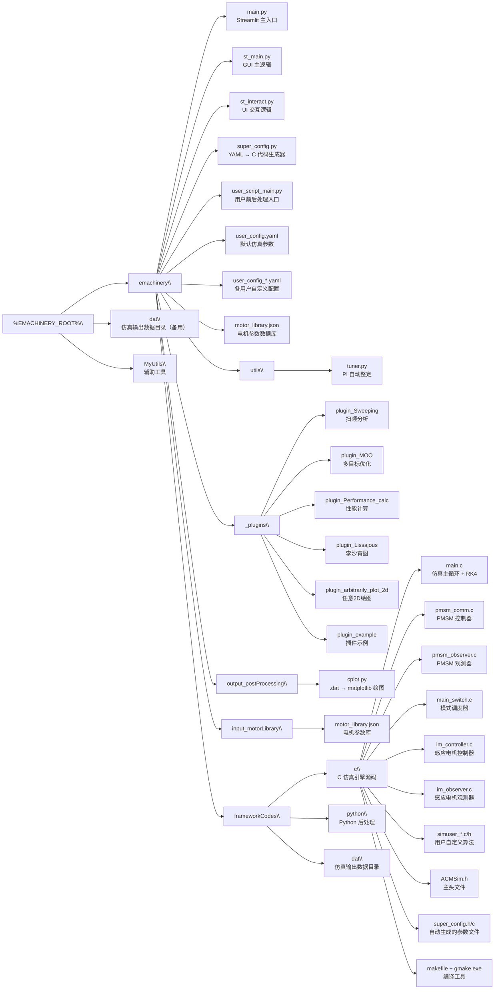

#  emachinery 仿真系统 — 完整使用教程

**版本：** v1.0
**日期：** 2026-06
**适用对象：** 电机控制学习者、嵌入式开发者、首次使用 emachinery 仿真框架的用户

> **目标：** 一份自包含的教程，让你从零开始理解 emachinery 仿真系统的架构、启动运行、操作使用、功能扩展，最终能独立使用该系统进行电机控制仿真研究。

---

## 1. 系统架构总览

### 1.1 emachinery 是什么

emachinery 是一个 **Python + C 混合** 的电机控制数值仿真框架，专为 PMSM（永磁同步电机）和 IM（感应电机）的控制算法验证而设计。

**核心特点：**
- C 语言仿真引擎：RK4 四阶龙格库塔法求解电机非线性状态方程，精度高、速度快
- Python GUI：基于 Streamlit 的 Web 界面，参数配置、模式切换、结果可视化一体化
- 自动代码生成：YAML 配置 → C 头文件/源文件自动生成，无需手动修改 C 代码
- 仿真与实验代码共享：同一套 C 代码通过条件编译适配 PC 仿真和 DSP 实验
- 24 种仿真模式：从开环到闭环、从有感到无感、从时域到频域全覆盖
- 6 个功能插件：扫频分析、多目标优化、性能计算等

### 1.2 四层架构

emachinery 采用清晰的四层架构设计：

```mermaid
flowchart TB
    subgraph L1["第1层：GUI 层（Python/Streamlit）"]
        direction LR
        ST_MAIN["st_main.py<br/>Streamlit 主入口，调度 UI 和仿真流程"]
        ST_INTERACT["st_interact.py<br/>UI 交互逻辑：电机选择、模式选择、参数编辑、编译触发"]
        NOTE1["用户看到的：浏览器中的 sidebar（电机/模式/参数）<br/>+ 主区域（波形图/性能指标）"]
    end

    subgraph L2["第2层：桥梁层（Python/super_config.py）"]
        direction LR
        SUPER_CONFIG["super_config.py<br/>YAML 配置 → C 头文件/C 源文件自动生成器"]
        USER_SCRIPT["user_script_main.py<br/>用户自定义预处理/后处理入口"]
        TUNER["utils/tuner.py<br/>TI InstaSPIN 系列 PI 自动整定"]
        NOTE2["核心功能：将 sidebar 中的参数字典 d_sim 解析为 C 结构体<br/>自动生成 super_config.h（类型定义）和 super_config.c（初始化函数）"]
    end

    subgraph L3["第3层：仿真引擎（C 语言）"]
        direction LR
        MAIN_C["main.c<br/>仿真主循环、RK4 积分器、电机状态方程、逆变器模型"]
        PMSM_COMM_C["pmsm_comm.c<br/>PMSM 控制器（FOC/速度环/PI/参数辨识）"]
        PMSM_OBS_C["pmsm_observer.c<br/>PMSM 无感观测器（反EMF/SMO/磁链/EKF）"]
        MAIN_SW_C["main_switch.c<br/>仿真模式调度器（24种模式分发）"]
        IM_C["im_controller.c / im_observer.c<br/>感应电机控制器和观测器"]
        SIMUSER["simuser_*.c/h<br/>各用户的自定义算法扩展"]
        NOTE3["编译产物：main.exe → 运行 → 输出 ../dat/电机名.dat"]
    end

    subgraph L4["第4层：后处理层（Python/cplot.py）"]
        direction LR
        CPLOT["cplot.py<br/>读取 .dat → pandas DataFrame → matplotlib 绘图"]
        PLUGINS["_plugins/<br/>功能插件（扫频/优化/性能计算/李沙育图等）"]
        NOTE4["输出：Streamlit 页面中的交互式波形图 + 性能指标表格"]
    end

    L1 -->|" "| L2
    L2 -->|"自动生成的 super_config.h/c"| L3
    L3 -->|".dat 数据文件"| L4
```



### 1.3 数据流全景图

从用户操作到看到仿真结果的完整数据流：

```text
用户在 Streamlit sidebar 中选择电机、修改参数
     │
     ▼
st_interact.py 构建 d_sim 字典（包含所有仿真参数）
     │
     ▼
user_script_main.py: user_pre_process()
  ├─ 加载用户专属 YAML 配置（user_config_*.yaml）
  └─ 调用 tuner.py 计算 PI 参数（Kp/Ki 自动整定）
     │
     ▼
用户点击「Save to C and compile」按钮
     │
     ▼
super_config.py: SuperConfig.update_super_config()
  ├─ 解析 d_sim 字典 → 分离出各结构体成员
  ├─ 生成 super_config.h（ST_D_SIM 结构体类型定义）
  └─ 生成 super_config.c（init_d_sim() 初始化函数）
     │
     ▼
super_config.py: SuperConfig.run_simulation()
  ├─ gmake 编译所有 C 文件 → main.exe
  └─ 运行 main.exe → 输出 dat/电机名.dat
     │
     ▼
cplot.py: main()
  ├─ pd.read_csv('电机名.dat') → DataFrame
  ├─ 遍历 YAML cplot.subplot 配置
  └─ matplotlib 绘制子图 → Streamlit st.pyplot(fig)
     │
     ▼
用户在浏览器中看到仿真波形图
```

### 1.4 支持的电机类型

| 电机类型 | 判断条件 | 说明 |
|---------|---------|------|
| **PMSM（表贴式永磁同步电机）** | `Rreq == 0` 且 `Ld == Lq` | 最常用，iD=0 控制策略 |
| **IPMSM（内置式永磁同步电机）** | `Rreq == 0` 且 `Ld ≠ Lq` | 支持最大转矩电流比（MTPA）控制 |
| **IM（感应电机）** | `Rreq > 0` | 需要励磁电流，使用间接磁场定向控制（IFOC） |

系统根据 `motor_library.json` 中电机的 `反伽马转子电阻 [Ohm]` 字段自动判断电机类型：
- `Rreq == 0` → 同步电机（PMSM/IPMSM），使用 `mode_select_synchronous_motor`
- `Rreq > 0` → 感应电机（IM），使用 `mode_select_induction_motor`

### 1.5 仿真模式概览

emachinery 提供 24 种仿真模式，按功能可分为 7 大类：

| 类别 | 模式编号 | 功能说明 |
|------|---------|---------|
| **开环控制** | 1, 11, 2 | PWM 直接控制、电压开环、电流矢量旋转 |
| **电流环 FOC** | 3, 31, 32, 33, 34, 35, 36 | 有感/无感 FOC、间接 FOC、D/Q 轴扫频、发电机模式、Harnefors |
| **速度环** | 4, 41, 42, 43, 44, 45, 46, 47, 48, 49 | 有感/无感速度环、WC整定、Marino2005、ESO速度估计、变参数无感、逆变器非线性+无感 |
| **位置环** | 5 | 位置闭环（位置环+速度环+电流环三级联） |
| **参数辨识** | 9 | 分步参数自整定（R→L→KE→Js） |
| **频域分析** | 91, 46 | Nyquist 图绘制、速度/电流扫频 |
| **测试/特殊** | 8, 98, 99 | 发电机模式、Udq 给定测试、NB 模式 |

---

## 2. 环境准备与启动

### 2.1 四大环境组件

仿真运行需要以下 4 个组件，均在 `%SIMULATION_TOOLS_ROOT%\` 目录下预装：

| 组件 | 路径 | 用途 | 验证方法 |
|------|------|------|---------|
| **TDM-GCC-64** | `%TDM_GCC_ROOT%\bin` | 编译 C 仿真代码（gcc/gmake） | 命令行输入 `gcc --version`，应显示 `gcc (tdm64-1) 10.3.0` |
| **Python 虚拟环境** | `%EMACHINERY_VENV%` | Python 3.12 + streamlit/numpy/pandas/matplotlib/control/sympy/numba | `%EMACHINERY_VENV%\Scripts\activate.bat` → `python --version` |
| **make.exe** | `%EMACHINERY_ROOT%\emachinery\frameworkCodes\c\gmake.exe` | 执行 Makefile 编译 C 工程 | 确认文件存在即可 |
| **MiKTeX** | `%MIKTEX_BIN%` | LaTeX 渲染引擎，用于绘图中的数学公式 | 可选，缺失时公式以纯文本显示 |

### 2.2 三种启动方式

#### 方式一（推荐）：Streamlit 图形界面

**操作：** 双击 `%EMACHINERY_START_SCRIPT%`

**脚本内容解析：**
```batch
@echo off
chcp 65001 >nul                          # 设置控制台编码为 UTF-8，防止中文乱码
title emy-c Motor Simulation (Source)
set PATH=%MIKTEX_BIN%;    # MiKTeX 路径
       %EMACHINERY_ROOT%\emachinery\frameworkCodes\c;  # gmake 路径
       %TDM_GCC_ROOT%\bin;                          # GCC 路径
       %PATH%
call %EMACHINERY_VENV%\Scripts\activate.bat    # 激活 Python 虚拟环境
cd /d %EMACHINERY_ROOT%                     # 切换到源码根目录
python -m emachinery.main                          # 启动 Streamlit GUI
```

**运行成功后：** 浏览器自动打开 `http://localhost:8501`，看到 Streamlit 界面。

**适合：** 日常使用、参数调优、查看仿真曲线

#### 方式二：命令行直接编译

**操作：** 双击 `%EMACHINERY_BUILD_SCRIPT%`

**脚本做的事：** 设置 PATH → 切换到 C 源码目录 → 执行 `gmake.exe`

编译成功后，`frameworkCodes\c` 目录下生成 `main.exe`。手动运行：
```bash
cd %EMACHINERY_ROOT%\emachinery\frameworkCodes\c
main.exe
```

仿真数据输出到 `%EMACHINERY_ROOT%\dat\电机名.dat`。

**适合：** 只改了 C 代码需要快速编译验证、不想启动 Streamlit

#### 方式三：手动命令

```bash
%EMACHINERY_VENV%\Scripts\activate.bat
cd /d %EMACHINERY_ROOT%
python -m emachinery.main
```

**适合：** 调试启动问题、在已有终端环境中快速启动

### 2.3 启动后确认

启动成功后，你应该在浏览器中看到：
- **左侧 sidebar**：模式选择下拉框、电机选择下拉框、仿真参数面板、可调参数面板
- **右侧主区域**：空白（等待运行仿真后显示波形图）

如果页面空白或一直转圈，参见第 9 节常见问题排查。

---

## 3. Streamlit UI 完整操作流程

### 3.1 操作流程总览

```text
Step 1: 选择模式 ──→ Step 2: 选择电机 ──→ Step 3: 选择用户
                                                      │
                                                      ▼
Step 6: 查看结果 ←── Step 5: 编译运行 ←── Step 4: 查看/修改参数
```

### 3.2 Step 1: 选择运行模式

**位置：** 左侧 sidebar 顶部的下拉菜单

**可选项：**

| 选项 | 说明 | 适合 |
|------|------|------|
| **C**（默认） | 编译运行 C 语言数值积分仿真，查看时域波形 | 日常学习、参数调优、波形观察 |
| **plugin_Sweeping** | 执行扫频分析，自动生成 Bode 图 | 频域分析、带宽测量 |
| **plugin_MOO** | 多目标优化（带宽 vs 稳定裕度权衡） | 参数寻优 |
| **plugin_Performance_calc** | 自动计算上升时间、超调量、带宽等性能指标 | 定量评估控制性能 |
| **plugin_Lissajous** | 李沙育图绘制（αβ 轴电流/电压轨迹） | 观察电流矢量轨迹 |
| **plugin_arbitrarily_plot_2d** | 任意 2D 信号图绘制 | 自定义信号对比 |
| **plugin_example** | 插件开发示例 | 学习如何开发插件 |

**首次使用建议：** 保持默认的 **「C」** 模式。

### 3.3 Step 2: 选择电机

**位置：** sidebar 中的「电机选择:」下拉菜单

**操作：** 从下拉列表中选择电机型号（如 `SEW100W`、`SEW200W` 等）

**底层机制：**
- 电机列表从 `motor_library.json` 读取
- 选中电机后，其额定参数（极对数、Rs、Ld、Lq、KE、Js、Vdc 等）自动加载
- 电机参数显示在 sidebar 的折叠面板中（只读表格）
- 也可以选择 `my-yaml-custom-motor` 使用 YAML 文件中的自定义电机参数

**首次使用建议：** 保持默认的 `SEW100W`（100W 表贴式 PMSM，参数经过辨识验证）。

### 3.4 Step 3: 选择用户

**位置：** sidebar 中的「who_is_user:」下拉菜单

**说明：** emachinery 支持多用户并行开发，每个用户有独立的算法扩展和参数配置。选择不同用户会加载对应的 `user_config_*.yaml` 文件，影响可调参数列表、信号库和绘图配置。

**首次使用建议：** 保持默认用户即可。如果你是开发者，可以创建自己的用户配置。

### 3.5 Step 4: 查看/修改参数

**位置：** sidebar 中的两个面板

**「仿真参数」折叠面板：** 显示当前 YAML 配置的完整内容（只读参考）

**「可调参数」折叠面板：**
1. 从下拉列表中选择你想调整的参数（可多选）
2. 选中的参数以可编辑表格形式显示
3. 直接在表格中修改数值
4. 点击「将上述设置保存为该电机默认设置」可持久化修改

**关键参数速查：**

| 参数 | 含义 | 典型值 | 修改影响 |
|------|------|--------|---------|
| `sim.CLTS` | 电流环采样周期 [s] | 1e-4 | 改大→性能下降；改小→计算量增加 |
| `sim.NUMBER_OF_STEPS` | 仿真总步数 | 50000 | 总仿真时间 = 步数 × CLTS |
| `FOC.CLBW_HZ` | 电流环目标带宽 [Hz] | 100~500 | 改大→电流响应更快但可能超调 |
| `FOC.delta` | 速度/电流带宽比 | 5~25 | 改大→速度环更慢更稳定 |
| `FOC.VL_EXE_PER_CL_EXE` | 速度环降频比 | 1~20 | 改大→速度环更新更慢 |
| `CL.LIMIT_DC_BUS_UTILIZATION` | 母线电压利用率上限 | 0.96 | 改小→更早电压限幅 |
| `VL.LIMIT_OVERLOAD_FACTOR` | 速度环输出限幅倍数 | 1.0 | 改大→允许更大转矩电流 |

**首次运行建议不改参数**，使用默认值即可看到正常的仿真结果。

### 3.6 Step 5: 编译并运行

**位置：** 页面上的 **「Save to C and compile」** 按钮

**点击后内部执行流程：**
1. 
`SuperConfig` 类解析 sidebar 中的 `d_sim` 参数字典
2. 自动生成 `super_config.h`（C 结构体类型定义）
3. 自动生成 `super_config.c`（`init_d_sim()` 初始化函数）
4. 调用 `gmake` 编译所有 C 文件 → 生成 `main.exe`
5. 运行 `main.exe` → 输出 `dat/电机名.dat` 数据文件

**编译成功标志：** 控制台输出 `_=50000`（表示仿真完成 50000 步）

**如果编译报错：** 错误信息会直接在 Streamlit 页面上显示（红色文本框），参见第 9 节。

### 3.7 Step 6: 查看仿真结果

编译运行成功后，页面自动切换到绘图视图。

**默认显示 7 个子图：**

| 子图 | Y轴 | 信号 | 怎么看 |
|------|-----|------|--------|
| **Speed** | 转速 [r/min] | 给定转速（虚线）、实际转速（实线）、ESO 观测转速（点线） | 看跟踪关系：超调量、调节时间、静差 |
| **iQ** | Q 轴电流 [A] | Q 轴电流指令（虚线）、Q 轴电流反馈（实线） | Q轴电流≈转矩电流，看电流环跟踪精度 |
| **Torque** | 转矩 [Nm] | 负载转矩、电磁转矩 | Tem 应跟踪 TLoad（加减速时有差异） |
| **iD** | D 轴电流 [A] | D 轴电流指令（虚线）、D 轴电流反馈（实线） | 表贴 PMSM 应维持在零附近 |
| **Vdc Util** | 母线电压利用率 | dc_bus_utilization_ratio | 稳态通常 < 0.9，超过 0.96 进入过调制 |
| **uAB** | 电压 [V] | D/Q 轴电压指令、α/β 轴电压指令 | dq 轴接近直流，αβ 轴为正弦波 |
| **Timebase** | 时间 [s] | timebase | 横轴参考 |

**交互操作：** 缩放（鼠标框选/滚轮）、平移（拖动）、保存（工具栏图标）、重置（Home 图标）

**自定义绘图布局：** 取消勾选「custom cplot display」旁边的复选框，或设置行×列数来自定义子图布局。

---

## 4. 仿真模式使用指南

### 4.1 开环控制模式

#### MODE_SELECT_PWM_DIRECT (1) — PWM 直接控制

**用途：** 给定固定占空比，验证逆变器基本功能

**操作步骤：**
1. 在 sidebar 模式选择中选择 `MODE_SELECT_PWM_DIRECT`
2. 点击「Save to C and compile」运行仿真
3. 观察输出：三相 PWM 占空比固定为 50%

**预期结果：** 电机不旋转（无电流环控制），仅用于验证 PWM 输出通道

#### MODE_SELECT_VOLTAGE_OPEN_LOOP (11) — 电压开环控制

**用途：** 给定 αβ 轴电压旋转矢量，验证电机基本旋转

**操作步骤：**
1. 选择 `MODE_SELECT_VOLTAGE_OPEN_LOOP`
2. 在 `pmsm_comm.c` 的 `init_debug()` 中修改 `vvvf_voltage`（电压幅值，默认 3.0V）和 `vvvf_frequency`（频率，默认 5.0Hz）
3. 编译运行

**预期结果：** 电机以给定频率旋转，电流为正弦波（无闭环控制，转速不精确）

#### MODE_SELECT_WITHOUT_ENCODER_CURRENT_VECTOR_ROTATE (2) — 无编码器电流矢量旋转

**用途：** 开环电流控制，验证 Park 变换和电流环基本功能

**操作步骤：**
1. 选择 `MODE_SELECT_WITHOUT_ENCODER_CURRENT_VECTOR_ROTATE`
2. 在 sidebar 可调参数中设定 `set_id_command` 和 `set_iq_command`
3. 编译运行

**预期结果：** 电流矢量以给定频率旋转，id/iq 跟踪给定值

### 4.2 电流环 FOC 模式

#### MODE_SELECT_FOC (3) — 有传感器 FOC

**用途：** 验证 Clarke→Park→PI→解耦→InvPark 完整 FOC 链路

**操作步骤：**
1. 选择 `MODE_SELECT_FOC`
2. 在 sidebar 可调参数中设定 `set_id_command = 0` 和 `set_iq_command = 额定值`（如 3A）
3. 编译运行

**预期结果：**
- iD 子图：给定 0，反馈也为 0，仅有微小波动
- iQ 子图：给定阶跃后，反馈在 2~5 个 CL_TS 内跟踪上，无超调或轻微超调（<5%）
- uAB 子图：αβ 轴电压呈幅值恒定的正弦波
- Vdc Util 子图：远小于 0.96

**异常排查：**
| 现象 | 可能原因 | 解决方案 |
|------|---------|---------|
| iQ 跟踪很慢 | CLBW_HZ 太小 | 增大 FOC.CLBW_HZ |
| iQ 严重超调或振荡 | CLBW_HZ 太大 | 减小 FOC.CLBW_HZ |
| iD 明显偏离零 | dq 轴耦合未解耦 | 启用 `bool_apply_decoupling_voltages_to_current_regulation` |

#### MODE_SELECT_FOC_SENSORLESS (31) — 无传感器 FOC

**用途：** 使用观测器估计角度代替编码器，验证无感控制

**操作步骤：**
1. 选择 `MODE_SELECT_FOC_SENSORLESS`
2. 确保对应的用户（如 USER_YZZ）的观测器代码已启用
3. 编译运行

**预期结果：** 观测器估计角度收敛到真实角度，电流环正常工作

#### MODE_SELECT_ID_SWEEPING_FREQ (33) / MODE_SELECT_IQ_SWEEPING_FREQ (34) — 电流环扫频

**用途：** 验证电流环频率响应，测量实际带宽

**操作步骤：**
1. 选择 `MODE_SELECT_ID_SWEEPING_FREQ`（D 轴扫频）或 `MODE_SELECT_IQ_SWEEPING_FREQ`（Q 轴扫频）
2. 在 sidebar 可调参数中启用 `bool_apply_sweeping_frequency_excitation: True`
3. 设置扫频参数：`CMD_CURRENT_SINE_AMPERE`（扫频幅值）、`CMD_SPEED_SINE_HZ`（起始频率）、`CMD_SPEED_SINE_HZ_CEILING`（终止频率）
4. 编译运行
5. 在 Streamlit 中切换到 `plugin_Sweeping` 插件查看 Bode 图

**预期结果：** -3dB 带宽接近设定的 `CLBW_HZ`，相位裕度 >45°

### 4.3 速度环模式

#### MODE_SELECT_VELOCITY_LOOP (4) — 速度闭环（最常用）

**用途：** 速度阶跃响应验证，观察速度环+电流环双环交互

**操作步骤：**
1. 选择 `MODE_SELECT_VELOCITY_LOOP`
2. 修改 `pmsm_comm.c` 的 `_user_commands()` 中的转速指令序列（或使用 sidebar 中的 `set_rpm_speed_command`）
3. 编译运行

**预期结果：**
- Speed 子图：转速反馈跟踪给定，阶跃时略有过冲（<10%），稳态无静差
- iQ 子图：加速时 iQ 冲到限幅值，稳速后下降
- Torque 子图：加速时 Tem > TLoad，稳速时 Tem ≈ TLoad

**异常排查：**
| 现象 | 可能原因 | 解决方案 |
|------|---------|---------|
| 转速持续振荡 | delta 太小 | 增大 FOC.delta |
| 稳态有静差 | Ki_CODE 为零 | 检查 VL_EXE_PER_CL_EXE 和 Ki 计算 |
| 加速时 iQ 未到限幅 | 电流限幅太小 | 增大 LIMIT_OVERLOAD_FACTOR |

#### MODE_SELECT_VELOCITY_LOOP_SENSORLESS (41) — 无传感器速度闭环

**用途：** 使用观测器估计角度和转速进行速度闭环控制

**操作步骤：**
1. 选择 `MODE_SELECT_VELOCITY_LOOP_SENSORLESS`
2. 确保对应观测器代码已启用
3. 编译运行

**预期结果：** 无感控制下转速跟踪给定，低速段角度误差较大

#### MODE_SELECT_VELOCITY_LOOP_USING_ESO_FOR_SPEED (47) — ESO 转速观测

**用途：** 使用扩张状态观测器（ESO）估计转速和负载转矩

**操作步骤：**
1. 选择 `MODE_SELECT_VELOCITY_LOOP_USING_ESO_FOR_SPEED`
2. 在 sidebar 可调参数中确保 `bool_ESO_SPEED_ON = True` 和 `bool_apply_ESO_SPEED_for_SPEED_FBK = True`
3. 设置 `CAREFUL_ESOAF_OMEGA_OBSERVER`（观测器带宽，典型值 1000~5000）
4. 编译运行

**预期结果：**
- Speed 子图：三条线（给定/实际/ESO 估计）完全重合
- 突加负载时 ESO 估计有短暂滞后（<50ms），但很快跟踪上

**异常排查：**
| 现象 | 可能原因 | 解决方案 |
|------|---------|---------|
| ESO 估计发散 | 观测器带宽太大 | 减小 CAREFUL_ESOAF_OMEGA_OBSERVER |
| ESO 估计噪声大 | 观测器带宽太大 | 减小 CAREFUL_ESOAF_OMEGA_OBSERVER |
| 使用 ESO 后速度环振荡 | ESO 有相位滞后 | 先用真实转速调试好速度环，再切换到 ESO |

#### MODE_SELECT_VELOCITY_LOOP_WC_TUNER (43) — 速度环带宽整定

**用途：** 使用 WC Tuner 自动整定速度环 PI 参数，并进行 HitWall 分析

**操作步骤：**
1. 选择 `MODE_SELECT_VELOCITY_LOOP_WC_TUNER`
2. 在 sidebar 可调参数中设置 `bool_apply_WC_tunner_for_speed_loop = True`
3. 配置 HitWall 分析参数（如 `HitWall_high_RPM_command`、`HitWall_time_interval`）
4. 编译运行

**预期结果：** WC Tuner 自动计算 PI 参数，HitWall 分析显示不同电压限幅下的速度响应

### 4.4 位置环模式

#### MODE_SELECT_POSITION_LOOP (5) — 位置闭环

**用途：** 位置环+速度环+电流环三级联控制

**操作步骤：**
1. 选择 `MODE_SELECT_POSITION_LOOP`
2. 在 sidebar 可调参数中设置 `set_deg_position_command`（位置指令，单位：度）
3. 编译运行

**预期结果：** 电机转子角度跟踪给定位置指令，无超调或轻微超调

### 4.5 参数辨识模式

#### MODE_SELECT_COMMISSIONING (9) — 参数自整定

**用途：** 分步辨识电机参数：电阻 R → 电感 L → 磁链 KE → 惯量 Js

**操作步骤：**
1. 选择 `MODE_SELECT_COMMISSIONING`
2. 建议将 `NUMBER_OF_STEPS` 设为 100000（辨识需要较长时间）
3. 编译运行
4. 观察控制台输出

**预期结果（按顺序）：**

| 阶段 | 辨识参数 | 正常输出示例 | 耗时参考 |
|------|---------|-------------|---------|
| 1 | 定子电阻 R | `R=0.475 Ohm, inverter_voltage_drop=0.0` | ~0.5s |
| 2 | 电感 L（阶跃） | `L=0.00205` | ~0.5s |
| 3 | 电感 L（正弦） | `L3=0.00205` | ~0.5s |
| 4 | 永磁体磁链 KE | `COMM.KE=0.01072` | ~2s |
| 5 | 转动惯量 Js | `Js=3.5e-6` | ~2s |

**异常排查：**
| 现象 | 可能原因 | 解决方案 |
|------|---------|---------|
| R 辨识值偏差大 | 逆变器压降未补偿 | 检查 __INVERTER_NONLINEARITY |
| L 辨识不收敛 | 电流环 PI 太弱 | 增大 CLBW_HZ |
| KE 辨识波动大 | 转速不稳定 | 检查速度环 PI 参数 |

### 4.6 频域分析模式

#### MODE_SELECT_SWEEPING_FREQ_FOR_VELOCITY_AND_CURRENT (46) — 速度/电流扫频

**用途：** 同时支持速度环和电流环的扫频分析

**操作步骤：**
1. 选择 `MODE_SELECT_SWEEPING_FREQ_FOR_VELOCITY_AND_CURRENT`
2. 在 sidebar 可调参数中启用 `bool_apply_sweeping_frequency_excitation: True`
3. 设置扫频参数：
   - `bool_sweeping_frequency_for_speed_loop`：True 扫速度环，False 扫电流环
   - `CMD_SPEED_SINE_RPM`：速度扫频幅值 [rpm]
   - `CMD_CURRENT_SINE_AMPERE`：电流扫频幅值 [A]
   - `CMD_SPEED_SINE_HZ`：起始频率 [Hz]
   - `CMD_SPEED_SINE_HZ_CEILING`：终止频率 [Hz]
   - `CMD_SPEED_SINE_STEP_SIZE`：频率步进 [Hz]
4. 编译运行
5. 切换到 `plugin_Sweeping` 插件查看 Bode 图

**预期结果：** 自动生成 Bode 图（幅频+相频），-3dB 带宽接近设定值

#### MODE_SELECT_NYQUIST_PLOTTING (91) — Nyquist 图绘制

**用途：** 扫频提取频率响应，绘制 Nyquist 图验证稳定裕度

**操作步骤：**
1. 选择 `MODE_SELECT_NYQUIST_PLOTTING`
2. 配置 Nyquist 参数（`Nyquist_Input_Current_Amp`、`Nyquist_Freq_Ceiling` 等）
3. 编译运行

**预期结果：** 控制台输出每个频率点的幅值和相位，可手动绘制 Nyquist 图

### 4.7 逆变器非线性模式

#### MODE_SELECT_INVERTER_NONLINEARITY_SENSORLESS (49) — 逆变器非线性+无感

**用途：** 研究逆变器死区效应对电流波形和无感观测器的影响

**操作步骤：**
1. 选择 `MODE_SELECT_INVERTER_NONLINEARITY_SENSORLESS`
2. 在 `ACMSim.h` 中修改 `__INVERTER_NONLINEARITY` 宏：
   - 0 = 理想逆变器（无死区效应）
   - 1 = Sul1996 数学模型
   - 2 = Sigmoid 实验拟合
   - 3 = LUT 查表插值
   - 4 = LUT_Indexed 查表索引
3. 编译运行

**预期结果：**
- 模式 0：电流波形光滑正弦
- 模式 1~4：电流波形在过零点出现钳位效应（顶部/底部变平），电流 THD 升高

---

## 5. 插件系统使用

### 5.1 插件系统概述

emachinery 的插件系统位于 `_plugins/` 目录下，每个插件是一个独立的 Python 模块，包含一个 `index.py` 入口文件。插件通过 Streamlit sidebar 的模式选择下拉框加载。

**插件加载机制：**
1. 
`_plugins/__init__.py` 自动扫描 `_plugins/` 下所有以 `plugin_` 开头的目录
2. 将插件名添加到 `PLUGINS` 列表
3. 用户在 sidebar 选择插件后，`st_main.py` 的 `st_main_plugin()` 函数动态加载插件的 `index.py`
4. 调用插件的 `main(d_sim, user_config)` 函数

### 5.2 plugin_Sweeping — 扫频分析

**功能：** 执行扫频分析，自动生成 Bode 图（幅频+相频曲线）

**使用方法：**
1. 在 sidebar 模式选择中选择 `plugin_Sweeping`
2. 选择仿真模式（通常为 46 或 33/34）
3. 启用扫频参数（`bool_apply_sweeping_frequency_excitation: True`）
4. 点击「Save to C and compile」运行仿真
5. 页面自动显示扫频结果和 Bode 图

**适用场景：** 测量电流环/速度环实际带宽、验证 PI 整定效果、评估稳定裕度

### 5.3 plugin_MOO — 多目标优化

**功能：** 多目标优化，在带宽和稳定裕度之间寻找最优权衡

**使用方法：**
1. 在 sidebar 模式选择中选择 `plugin_MOO`
2. 配置优化参数（贝塞尔曲线阶数等）
3. 运行优化

**适用场景：** 参数寻优、控制性能权衡分析

### 5.4 plugin_Performance_calc — 性能计算

**功能：** 自动计算控制性能指标

**计算的指标：**
- **带宽指标：** 电流环实际带宽（CLBW）、速度环实际带宽（VLBW）
- **时域指标：** 上升时间、超调量、调节时间
- **极值指标：** 各信号的最小值和最大值

**使用方法：**
1. 在 sidebar 模式选择中选择 `plugin_Performance_calc`
2. 运行仿真
3. 页面自动显示性能指标表格

**适用场景：** 定量评估控制性能、对比不同参数下的控制效果

### 5.5 plugin_Lissajous — 李沙育图

**功能：** 绘制 αβ 轴电流/电压的李沙育图形（椭圆轨迹）

**使用方法：**
1. 在 sidebar 模式选择中选择 `plugin_Lissajous`
2. 运行仿真
3. 查看李沙育图

**适用场景：** 观察电流矢量轨迹、验证 Clarke 变换正确性、分析电流谐波

### 5.6 plugin_arbitrarily_plot_2d — 任意 2D 绘图

**功能：** 自定义选择任意两个信号进行 2D 绘图

**使用方法：**
1. 在 sidebar 模式选择中选择 `plugin_arbitrarily_plot_2d`
2. 选择 X 轴和 Y 轴信号
3. 运行仿真

**适用场景：** 自定义信号对比、相平面分析

### 5.7 plugin_example — 插件开发示例

**功能：** 插件开发模板，展示如何创建新插件

**使用方法：** 参考 `plugin_example/index.py` 的代码结构开发自己的插件

**插件开发步骤：**
1. 在 `_plugins/` 下创建新目录 `plugin_你的名字/`
2. 创建 `index.py`，实现 `main(d_sim, user_config)` 函数
3. 插件会自动出现在 sidebar 的模式选择下拉框中

---

## 6. 电机库与参数管理

### 6.1 电机库结构

电机参数存储在 `motor_library.json` 中，每台电机的数据结构如下：

```json
{
  "SEW100W": {
    "基本参数": {
      "极对数 [1]": 2,
      "额定电流 [Arms]": 4.6,
      "定子电阻 [Ohm]": 5.5,
      "定子D轴电感 [mH]": 0.58,
      "定子Q轴电感 [mH]": 0.58,
      "额定反电势系数 [Wb]": 0.01359,
      "反伽马转子电阻 [Ohm]": 0,
      "转动惯量 [kg.cm^2]": 0.063,
      "母线电压 [Vdc]": 24
    }
  }
}
```

**关键参数说明：**

| 参数 | 含义 | 对 C 代码中的变量 |
|------|------|-----------------|
| 极对数 [1] | 电机极对数 | `ACM.npp` |
| 额定电流 [Arms] | 额定相电流有效值 | `ACM.IN` |
| 定子电阻 [Ohm] | 定子绕组电阻 | `ACM.R` |
| 定子D轴电感 [mH] | d 轴电感 | `ACM.Ld` |
| 定子Q轴电感 [mH] | q 轴电感 | `ACM.Lq` |
| 额定反电势系数 [Wb] | 永磁体磁链 | `ACM.KE` |
| 反伽马转子电阻 [Ohm] | 0=PMSM, >0=IM | `ACM.Rreq` |
| 转动惯量 [kg.cm^2] | 转子转动惯量 | `ACM.Js` |
| 母线电压 [Vdc] | 直流母线电压 | `(*CTRL).i->Vdc` |

### 6.2 如何添加自定义电机

**方法一：修改 motor_library.json**

在 `motor_library.json` 中添加新条目：

```json
{
  "MyCustomMotor": {
    "基本参数": {
      "极对数 [1]": 4,
      "额定电流 [Arms]": 10.0,
      "定子电阻 [Ohm]": 0.5,
      "定子D轴电感 [mH]": 2.0,
      "定子Q轴电感 [mH]": 2.0,
      "额定反电势系数 [Wb]": 0.05,
      "反伽马转子电阻 [Ohm]": 0,
      "转动惯量 [kg.cm^2]": 10.0,
      "母线电压 [Vdc]": 48
    }
  }
}
```

重启 Streamlit 后，新电机会出现在下拉列表中。

**方法二：使用 my-yaml-custom-motor**

在 sidebar 中选择 `my-yaml-custom-motor`，系统会使用 `user_config.yaml` 中的 `simulation` 部分的电机参数。你可以直接在 YAML 文件中修改 `init.*` 开头的参数。

### 6.3 YAML 参数速查表

所有仿真参数定义在 `user_config.yaml` 中，通过 sidebar 可调参数面板修改。

**仿真控制参数：**

| 参数 | 含义 | 典型值 | 约束 |
|------|------|--------|------|
| `sim.CLTS` | 电流环采样周期 [s] | 1e-4 | 对应实际 DSP 的 PWM 周期 |
| `sim.NUMBER_OF_STEPS` | 仿真总步数 | 50000 | 总时间 = 步数 × CLTS |
| `sim.MACHINE_SIMULATIONs_PER_SAMPLING_PERIOD` | 电机模型积分次数/每次控制器执行 | 1 | 通常保持 1 |

**FOC 控制参数：**

| 参数 | 含义 | 典型值 | 约束 |
|------|------|--------|------|
| `FOC.CLBW_HZ` | 电流环目标带宽 [Hz] | 100~500 | ≤ 1/CLTS/20 |
| `FOC.delta` | 速度/电流带宽比 | 5~25 | 速度环带宽 ≈ CLBW_HZ/delta |
| `FOC.VL_EXE_PER_CL_EXE` | 速度环降频比 | 1~20 | 仿真默认 1 |
| `FOC.bool_apply_decoupling_voltages_to_current_regulation` | dq 轴解耦前馈开关 | false | 高速时建议 true |

**限幅参数：**

| 参数 | 含义 | 典型值 |
|------|------|--------|
| `CL.LIMIT_DC_BUS_UTILIZATION` | 母线电压利用率上限 | 0.96 |
| `VL.LIMIT_OVERLOAD_FACTOR` | 速度环输出限幅倍数（× 额定电流） | 1.0 |

**参数间约束关系：**
```text
电流环实际带宽 ≤ 1/CLTS / 20     （采样定理约束）
速度环实际带宽 ≈ CLBW_HZ / delta  （级联控制设计约束）
总仿真时间   =  NUMBER_OF_STEPS × CLTS × MACHINE_SIMULATIONs_PER_SAMPLING_PERIOD
```

### 6.4 PI 自动整定原理

emachinery 使用 **TI InstaSPIN 系列 PI 整定方法**，在 `utils/tuner.py` 中实现。

**整定公式：**

```text
电流环：
  d_currentKp = CLBW_Hz × 2π × Ld
  d_currentKi = R / Ld
  q_currentKp = CLBW_Hz × 2π × Lq
  q_currentKi = R / Lq

速度环：
  speedKi = 2π × CLBW_Hz / delta²    （积分增益）
  speedKp = delta × speedKi / KT × Js （比例增益，KT = 1.5 × npp × KE）
```

**整定流程：**
1. 用户在 sidebar 中设置 `FOC.CLBW_HZ` 和 `FOC.delta`
2. 
`user_script_main.py` 的 `user_pre_process()` 调用 `tuner.InstaSPIN_series_PI_tuner()`
3. 自动计算 6 个 PI 参数（d_currentKp/Ki, q_currentKp/Ki, speedKp/Ki）
4. 计算结果写入 `d_sim` 字典，传递给 C 代码

**Streamlit 页面上显示的整定结果：**
```text
VLBW_Hz = 13.33 | speedKp = 1.294 | speedKi = 11.17 | q_currentKp = 27.46 | q_currentKi = 27.46
```

**如何验证整定效果：**
1. 运行速度闭环仿真（Mode 4）
2. 观察 Speed 子图的阶跃响应
3. 如果超调过大 → 增大 delta（降低速度环带宽）
4. 如果响应太慢 → 减小 delta（提高速度环带宽）

---

## 7. 用户扩展机制

### 7.1 扩展机制总览

emachinery 提供了 4 种用户扩展方式，从简单到复杂：

| 扩展方式 | 修改文件 | 难度 | 适用场景 |
|---------|---------|------|---------|
| 修改 YAML 参数 | `user_config.yaml` / sidebar |  | 调整仿真参数、PI 参数 |
| 添加用户配置 | `user_config_*.yaml` |  | 自定义可调参数列表、信号库、绘图配置 |
| Python 前后处理 | `user_script_main.py` |  | 仿真前参数计算、仿真后数据处理 |
| C 算法扩展 | `simuser_*.c/h` |  | 自定义控制算法、观测器 |

### 7.2 user_script_main.py 扩展点

`user_script_main.py` 是用户自定义逻辑的核心入口，提供 4 个扩展函数：

#### user_pre_process(d_sim, user_config)

**调用时机：** 仿真运行前（点击「Save to C and compile」之前）

**功能：** 修改仿真参数、加载用户配置、计算 PI 参数

**示例：**
```python
def user_pre_process(d_sim, user_config):
    # 1. 加载用户专属 YAML 配置
    if d_sim['user.who_is_user'] == YOUR_USER_ID:
        with open('user_config_yourname.yaml', encoding='utf-8') as f:
            user_config_overwrite = yaml.load(f, Loader=yaml.FullLoader)
            d_sim.update(user_config_overwrite['simulation'])
    
    # 2. 调用 PI 自动整定
    VLBW_Hz, d_Kp, d_Ki, q_Kp, q_Ki, speedKp, speedKi, *_ = tuner.InstaSPIN_series_PI_tuner(
        d_sim['FOC.delta'], d_sim['FOC.CLBW_HZ'],
        d_sim['init.Ld'], d_sim['init.Lq'],
        d_sim['init.R'], d_sim['init.Js'],
        d_sim['init.npp'], d_sim['init.KE'])
    
    # 3. 将整定结果写入 d_sim
    d_sim['CL.SERIES_KP_D_AXIS'] = d_Kp
    d_sim['CL.SERIES_KI_D_AXIS'] = d_Ki
    d_sim['CL.SERIES_KP_Q_AXIS'] = q_Kp
    d_sim['CL.SERIES_KI_Q_AXIS'] = q_Ki
    d_sim['VL.SERIES_KP'] = speedKp
    d_sim['VL.SERIES_KI'] = speedKi
    
    return d_sim
```

#### user_cplot_post_process(d_sim, user_plot_config, post_run)

**调用时机：** 绘图前

**功能：** 自定义绘图配置（添加新子图、修改信号列表、覆盖绘图样式）

**示例：**
```python
def user_cplot_post_process(d_sim, user_plot_config, post_run):
    if d_sim['user.who_is_user'] == YOUR_USER_ID:
        with open('user_config_yourname.yaml', encoding='utf-8') as f:
            user_config_overwrite = yaml.load(f, Loader=yaml.FullLoader)
            # 添加自定义信号
            user_plot_config['signal_library'].extend(user_config_overwrite['signal_library'])
            # 添加自定义子图
            user_plot_config['cplot']['subplot'].extend(user_config_overwrite['cplot']['subplot'])
```

#### user_py_post_process(d_sim, simulation_result)

**调用时机：** Python 仿真后（当前版本 C 仿真不使用此函数）

**功能：** 仿真结果后处理

#### user_cplot_post_plot_process(d_sim)

**调用时机：** 绘图完成后

**功能：** 在 Streamlit 页面上添加额外的可视化内容

### 7.3 user_config_*.yaml 自定义配置

每个用户可以创建自己的 YAML 配置文件，在 `user_pre_process()` 中根据 `who_is_user` 加载。

**YAML 配置文件结构：**
```yaml
simulation:
  # 追加到 d_sim 的仿真参数
  user.set_rpm_speed_command: 400
  user.bool_apply_sweeping_frequency_excitation: False

default_var_list:
  # 追加到 sidebar 可调参数列表
  - FOC.CLBW_HZ
  - FOC.delta
  - user.set_rpm_speed_command

signal_library:
  # 追加到 DATA_LABELS（C 代码输出的信号列名）
  - "ACM.varOmega * MECH_RAD_PER_SEC_2_RPM"
  - "(*CTRL).i->cmd_varOmega * MECH_RAD_PER_SEC_2_RPM"

cplot:
  subplot:
    # 追加到绘图子图配置
    - title: "Speed"
      y_title: "Speed [rpm]"
      y:
        - y_data: "ACM.varOmega * MECH_RAD_PER_SEC_2_RPM"
          y_label: "Speed"
        - y_data: "(*CTRL).i->cmd_varOmega * MECH_RAD_PER_SEC_2_RPM"
          y_label: "Speed cmd"
```

### 7.4 simuser_*.c/h 自定义算法

每个用户可以创建 `simuser_*.c/h` 文件存放自定义控制算法，通过 `WHO_IS_USER` 宏条件编译启用。

**现有用户算法扩展：**

| 用户 | 文件 | 算法 |
|------|------|------|
| USER_WB (101976) | `simuser_wb.c/h` | 扫频信号生成、HitWall 分析、WC Tuner、Harnefors 1998 反计算 |
| USER_CJH (2023231051) | `simuser_cjh.c/h` | 感应电机控制器、Marino2005 观测器、磁链估算器 |
| USER_YZZ (2023231060) | `simuser_yzz.c/h` | RK4 观测器、逆变器在线补偿 |
| USER_BEZIER (224) | `simuser_bezier.c/h` | 贝塞尔曲线速度控制器 |
| USER_CURY (201314) | `simuser_cury.c/h` | 自定义算法 |

**添加新用户算法的步骤：**
1. 在 `ACMConfig.h` 中定义用户 ID 宏：`#define USER_YOURNAME <USER_ID>`
2. 创建 `simuser_yourname.c` 和 `simuser_yourname.h`
3. 在 `main_switch.c` 的 `main_switch()` 函数中添加 `#if WHO_IS_USER == USER_YOURNAME` 条件编译块
4. 在 `makefile` 中添加新的 `.c` 文件
5. 在 `user_script_main.py` 中添加用户配置加载逻辑

### 7.5 WHO_IS_USER 机制

`WHO_IS_USER` 是一个编译时宏，用于启用不同用户的算法代码。其值由 `super_config.py` 自动写入 `super_config.h`：

```c
#define WHO_IS_USER 101976  // 来自 d_sim['user.who_is_user']
```

**工作流程：**
1. 用户在 sidebar 中选择 `who_is_user`
2. 
`st_interact.py` 将用户 ID 写入 `d_sim['user.who_is_user']`
3. 
`super_config.py` 生成 `super_config.h` 时写入 `#define WHO_IS_USER <ID>`
4. C 编译器根据 `WHO_IS_USER` 值条件编译对应的用户代码

---

## 8. 自定义仿真开发

### 8.1 修改 C 代码的注意事项

**可以修改的文件：**

| 文件 | 修改风险 | 说明 |
|------|---------|------|
| `pmsm_comm.c` 的 `_user_commands()` | 低 | 修改转速/负载指令序列，不影响控制算法 |
| `pmsm_comm.c` 的 `_user_time_varying_parameters()` | 低 | 添加时变参数（如模拟温升导致 R 增大） |
| `simuser_*.c/h` | 低 | 用户自定义算法，不影响核心代码 |
| `ACMSim.h` 的 `__INVERTER_NONLINEARITY` | 中 | 切换逆变器模型，影响仿真精度 |
| `main.c` 的 `DYNAMICS_MACHINE()` | 高 | 修改电机状态方程，影响仿真正确性 |
| `pmsm_comm.c` 的 `_onlyFOC()` | 高 | 修改 FOC 核心算法，影响控制性能 |

**绝对不要修改的文件：**
- `super_config.h` / `super_config.c`：由 Python 自动生成，修改会被覆盖

**修改后必须：**
1. 重新编译（点击「Save to C and compile」）
2. 验证仿真结果是否合理
3. 如果修改了 `_onlyFOC()` 等核心函数，确保 `#if PC_SIMULATION` 条件编译不会影响实验代码

### 8.2 添加新仿真模式

**步骤：**

1. **在 `ACMSim.h` 中定义模式宏：**
```c
#define MODE_SELECT_MY_NEW_MODE 100
```

2. **在 `main_switch.c` 的 `main_switch()` 中添加 case：**
```c
case MODE_SELECT_MY_NEW_MODE:
    // 你的控制算法
    my_new_controller();
    break;
```

3. **在 `st_interact.py` 的 `d_mode_select` 字典中添加选项：**
```python
d_mode_select = {
    ...
    'MODE_SELECT_MY_NEW_MODE': 100,
}
```

4. **在 `simuser_*.c` 中实现控制算法：**
```c
#if WHO_IS_USER == USER_YOURNAME
void my_new_controller() {
    // 你的控制逻辑
}
#endif
```

5. **在 `makefile` 中添加新的 `.c` 文件（如果创建了新文件）**

### 8.3 添加新观测信号

**步骤：**

1. **在 C 代码中计算信号值：** 在 `utility.c` 的 `write_data_to_file()` 函数中添加输出

2. **在 `user_config.yaml` 的 `signal_library` 中添加列名：**
```yaml
signal_library:
  - "ACM.varOmega * MECH_RAD_PER_SEC_2_RPM"
  - "my_new_signal"  # 添加新信号
```

3. **在 `user_config.yaml` 的 `cplot.subplot` 中添加子图：**
```yaml
cplot:
  subplot:
    - title: "My New Signal"
      y_title: "Value [unit]"
      y:
        - y_data: "my_new_signal"
          y_label: "New Signal"
```

4. **重新编译运行**

### 8.4 自定义绘图配置

绘图配置在 `user_config.yaml` 的 `cplot` 部分定义：

```yaml
cplot:
  width: 14          # 图形宽度（英寸）
  height: 3.5        # 每个子图高度（英寸）
  subplot:
    - title: "Speed"
      y_title: "Speed [rpm]"
      y:
        - y_data: "ACM.varOmega * MECH_RAD_PER_SEC_2_RPM"
          y_label: "Speed"
    - title: "Currents"
      y_title: "Current [A]"
      y:
        - y_data: "(*CTRL).i->cmd_iDQ[1]"
          y_label: "iq cmd"
        - y_data: "ACM.iDQ[1]"
          y_label: "iq fbk"
```

**绘图样式配置：**
```yaml
config:
  cjh_colors:
    - '#1f77b4'    # 蓝色
    - '#ff7f0e'    # 橙色
    - '#2ca02c'    # 绿色
    - '#d62728'    # 红色
  mpl:
    text.usetex: False
    font.family: 'Times New Roman'
    font.size: 10.0
  plt:
    lines.linewidth: 0.75
```

---

## 9. 常见问题排查

### 9.1 编译错误

| 错误信息 | 原因 | 解决方案 |
|---------|------|---------|
| `process_begin: CreateProcess(NULL, gcc ...) failed. make (e=2)` | gmake 找不到 gcc | ① 重启电脑使 PATH 生效 ② 确认 `%TDM_GCC_ROOT%\bin\gcc.exe` 存在 ③ 手动执行 `set PATH=%TDM_GCC_ROOT%\bin;%PATH%` 后再运行 gmake |
| `undefined reference to 'xxx'` | 缺少 C 源文件或函数未实现 | ① 检查是否缺少 `.c` 文件 ② 检查 makefile 是否包含所有 `.c` 文件 ③ 确保新增函数的声明在头文件中 |
| `'gmake' is not recognized` | gmake 不在 PATH 中 | 确认 `frameworkCodes\c\gmake.exe` 存在，启动脚本已添加该目录到 PATH |
| `super_config.h: No such file` | Python 代码生成失败 | 先在 Streamlit 中点击「Save to C and compile」让 Python 生成该文件 |
| `fatal error: ACMSim.h: No such file` | 头文件路径错误 | 确保在 `frameworkCodes\c` 目录下编译 |

### 9.2 运行时错误

| 错误信息 | 原因 | 解决方案 |
|---------|------|---------|
| `ACM.varOmega is nan` | PI 参数过大导致数值发散 | ① 减小 `FOC.CLBW_HZ`（如从 500 降到 100）② 增大 `FOC.delta`（如从 5 改为 20）③ 检查 `LIMIT_DC_BUS_UTILIZATION` 是否过高 |
| 仿真结果全为零 | 控制器未输出电压指令 | ① 检查 `mode_select` 是否正确 ② 检查 `_user_commands()` 中是否设置了转速指令 |
| 电流环不跟踪 | PI 参数不匹配或限幅太小 | ① 检查电机参数（Ld/Lq/Rs）是否正确 ② 检查 PI 限幅值 ③ 确认当前模式包含电流闭环 |
| 转速不响应 | 速度环未执行 | ① 检查 `mode_select` 是否为 4 ② 检查 `VL_EXE_PER_CL_EXE` 是否过大 ③ 确认负载转矩未导致堵转 |

### 9.3 绘图问题

| 问题 | 原因 | 解决方案 |
|------|------|---------|
| `.dat file does not exist` | 仿真未运行或运行失败 | 先点击「Save to C and compile」确保编译运行成功 |
| `.dat file is empty` | 仿真运行但未输出数据 | 检查 `write_data_to_file()` 是否被调用 |
| `UnicodeDecodeError` | YAML 文件编码问题 | 用 VS Code 打开 `user_config.yaml`，选择「Save with Encoding → UTF-8」（不带 BOM） |
| 信号名不匹配 | DATA_LABELS 与 cplot 配置不一致 | 检查 `signal_library` 中的列名是否与 C 代码输出的列名完全一致 |
| 子图数量不对 | cplot.subplot 配置与实际不符 | 检查 `user_config.yaml` 中的 `cplot.subplot` 列表 |

### 9.4 环境问题

| 问题 | 原因 | 解决方案 |
|------|------|---------|
| Streamlit 页面空白 | 虚拟环境未正确激活 | ① 确认终端提示符有 `(emy-env)` ② 检查 Streamlit 版本（`pip show streamlit`）③ 查看终端错误输出 |
| Python 包缺失 | 虚拟环境不完整 | `pip install streamlit numpy pandas matplotlib control sympy numba` |
| MiKTeX 公式渲染失败 | MiKTeX 未安装或路径错误 | 不影响仿真运行，仅公式以纯文本显示 |

---

## 10. 进阶使用场景

### 10.1 参数扫描

**目标：** 系统性地观察某个参数变化对仿真结果的影响

**方法：**
1. 在 Streamlit sidebar 中修改目标参数（如 `FOC.CLBW_HZ`）
2. 点击「Save to C and compile」运行仿真
3. 记录结果（截图或保存 .dat 文件）
4. 修改参数值，重复步骤 2-3

**典型参数扫描实验：**

| 扫描参数 | 范围 | 观察指标 |
|---------|------|---------|
| `FOC.CLBW_HZ` | 50, 100, 200, 400 | 电流环阶跃响应超调量、-3dB 带宽 |
| `FOC.delta` | 5, 10, 15, 20, 25 | 速度环阶跃响应超调量、调节时间 |
| `LIMIT_DC_BUS_UTILIZATION` | 0.8, 0.9, 0.96, 1.0 | 电压裕量、过调制程度 |
| `VL_EXE_PER_CL_EXE` | 1, 5, 10, 20 | 速度环控制效果随降频比的变化 |

### 10.2 对比实验

**目标：** 对比两种控制策略或参数设置的效果差异

**方法：**
1. 运行第一组参数的仿真，保存 .dat 文件（重命名，如 `SEW100W_case1.dat`）
2. 修改参数，运行第二组仿真
3. 使用 `plugin_arbitrarily_plot_2d` 或手动用 matplotlib 对比两组数据

**典型对比实验：**
- 有/无 dq 轴解耦前馈：`bool_apply_decoupling_voltages_to_current_regulation` true vs false
- 有/无 ESO 速度估计：Mode 4 vs Mode 47
- 不同逆变器模型：`__INVERTER_NONLINEARITY` 0 vs 1 vs 2
- 不同 PI 整定方法：TI InstaSPIN vs WC Tuner

### 10.3 从仿真到实验的代码迁移

emachinery 的核心设计理念是**仿真代码与实验代码共享同一套 C 源码**，通过条件编译实现环境适配。

**迁移步骤：**
1. 在仿真中验证控制算法和 PI 参数
2. 修改 `ACMConfig.h` 中的 `PC_SIMULATION` 宏为 0（或删除定义）
3. 修改 `WHO_IS_USER` 为实验中使用的用户 ID
4. 在 DSP 开发环境中编译（如 TI CCS）
5. 注意 `#pragma DATA_SECTION` 等 DSP 专用指令在仿真中被忽略
6. 注意 `super_config.h/c` 在实验中需要手动维护（不再由 Python 自动生成）

**关键差异：**

| 方面 | 仿真 | 实验 |
|------|------|------|
| 浮点精度 | `REAL = double`（64位） | `float`（32位）或定点数 |
| 采样周期 | 精确可控 | 受 PWM 中断周期约束 |
| 电流采样 | 理想（无噪声/偏移） | 有噪声、偏移、延迟 |
| 角度获取 | 精确（直接赋值） | 编码器/观测器估计 |
| 逆变器 | 可选理想/非线性模型 | 真实死区、管压降 |
| 执行时间 | 无限制 | 必须在 PWM 周期内完成 |

### 10.4 与知识库理论模块的联动学习

emachinery 仿真系统与知识库的理论模块紧密关联，建议按以下路径联动学习：

**路径 1：从理论到仿真**
1. 学习知识库理论模块（如 ALG-01 FOC 理论）
2. 在 SIM-00 的对应表中找到推荐的仿真模式
3. 运行仿真，观察理论预测的现象
4. 修改参数，验证理论分析的结论

**路径 2：从仿真到理论**
1. 运行仿真，观察异常现象（如电流振荡）
2. 在 SIM-02 代码概念映射中找到对应的 C 代码位置
3. 阅读相关知识库模块（如 CT-05 PID 整定）
4. 根据理论分析调整参数，再次仿真验证

**推荐学习顺序：**

| 阶段 | 理论模块 | 仿真模式 | 学习目标 |
|------|---------|---------|---------|
| 1 | ALG-00 电流环直觉 | Mode 3 | 理解 Kp/Ki 对电流响应的影响 |
| 2 | ALG-01 FOC 理论 | Mode 3 | 理解 Clarke/Park 变换和 dq 解耦 |
| 3 | CT-14 级联 PID | Mode 4 | 理解电流环+速度环双环交互 |
| 4 | CT-06 前馈控制 | Mode 4 | 理解 dq 轴解耦前馈的效果 |
| 5 | ALG-07 无感观测器 | Mode 41 | 理解无感控制的角度估计 |
| 6 | CT-16 ADRC | Mode 47 | 理解 ESO 扩张状态观测器 |
| 7 | ALG-13 参数辨识 | Mode 9 | 理解电机参数辨识原理 |
| 8 | CT-03 频域响应 | Mode 46 | 理解扫频分析和 Bode 图 |

---

## 附录 A：目录结构



**说明：** 以上为 emachinery 工程完整目录结构。核心路径：
- **C 仿真引擎**：`frameworkCodes/c/` — 包含 main.c、pmsm_comm.c、pmsm_observer.c、main_switch.c 等
- **Python 桥梁层**：`emachinery/` 下的 super_config.py、st_main.py、st_interact.py
- **后处理绘图**：`output_postProcessing/cplot.py`
- **插件扩展**：`_plugins/` 目录下各功能插件

## 附录 B：仿真模式完整列表

| Mode | 宏名 | 说明 | 分类 |
|------|------|------|------|
| 1 | MODE_SELECT_PWM_DIRECT | PWM 直接控制 | 开环 |
| 11 | MODE_SELECT_VOLTAGE_OPEN_LOOP | 电压开环控制 | 开环 |
| 2 | MODE_SELECT_WITHOUT_ENCODER_CURRENT_VECTOR_ROTATE | 无编码器电流矢量旋转 | 开环 |
| 3 | MODE_SELECT_FOC | 有传感器 FOC | 电流环 |
| 31 | MODE_SELECT_FOC_SENSORLESS | 无传感器 FOC | 电流环 |
| 32 | MODE_SELECT_INDIRECT_FOC | 间接 FOC（感应电机） | 电流环 |
| 33 | MODE_SELECT_ID_SWEEPING_FREQ | D 轴电流扫频 | 电流环 |
| 34 | MODE_SELECT_IQ_SWEEPING_FREQ | Q 轴电流扫频 | 电流环 |
| 35 | MODE_SELECT_FOC_AS_DC_GENERATOR | FOC 直流发电机模式 | 电流环 |
| 36 | MODE_SELECT_FOC_HARNEFORS_1998 | Harnefors 1998 FOC | 电流环 |
| 4 | MODE_SELECT_VELOCITY_LOOP | 速度闭环（有感） | 速度环 |
| 41 | MODE_SELECT_VELOCITY_LOOP_SENSORLESS | 无传感器速度闭环 | 速度环 |
| 42 | MODE_SELECT_TESTING_SENSORLESS | 无传感器测试 | 速度环 |
| 43 | MODE_SELECT_VELOCITY_LOOP_WC_TUNER | 速度环 WC 整定 | 速度环 |
| 44 | MODE_SELECT_Marino2005 | Marino2005 观测器 | 速度环 |
| 45 | MODE_SELECT_VELOCITY_LOOP_HARNEFORS_1998 | Harnefors 1998 速度环 | 速度环 |
| 46 | MODE_SELECT_SWEEPING_FREQ_FOR_VELOCITY_AND_CURRENT | 速度/电流扫频 | 频域 |
| 47 | MODE_SELECT_VELOCITY_LOOP_USING_ESO_FOR_SPEED | ESO 速度估计 | 速度环 |
| 48 | MODE_SELECT_VARIABLE_PARAMETERS_VELOCITY_LOOP_SENSORLESS | 变参数无感速度环 | 速度环 |
| 49 | MODE_SELECT_INVERTER_NONLINEARITY_SENSORLESS | 逆变器非线性+无感 | 速度环 |
| 5 | MODE_SELECT_POSITION_LOOP | 位置闭环 | 位置环 |
| 9 | MODE_SELECT_COMMISSIONING | 参数自整定 | 辨识 |
| 91 | MODE_SELECT_NYQUIST_PLOTTING | Nyquist 图绘制 | 频域 |
| 98 | MODE_SELECT_UDQ_GIVEN_TEST | Udq 给定测试 | 测试 |
| 8 | MODE_SELECT_GENERATOR | 发电机模式 | 特殊 |
| 99 | MODE_SELECT_NB_MODE | NB 模式 | 特殊 |

## 附录 C：第一次仿真检查清单

如果你是第一次使用 emachinery 仿真框架，按以下清单逐项确认：

- [ ] **环境确认：** `%TDM_GCC_ROOT%\bin\gcc.exe` 存在
- [ ] **环境确认：** `%EMACHINERY_VENV%\Scripts\python.exe` 存在
- [ ] **环境确认：** `%EMACHINERY_ROOT%\emachinery\frameworkCodes\c\gmake.exe` 存在
- [ ] **环境确认：** `%EMACHINERY_ROOT%\emachinery\main.py` 存在
- [ ] **启动：** 双击 `%EMACHINERY_START_SCRIPT%`，浏览器打开 Streamlit 页面
- [ ] **选模式：** 保持默认「C」
- [ ] **选电机：** 保持默认 `SEW100W`
- [ ] **选用户：** 保持默认
- [ ] **选仿真模式：** 选择 `MODE_SELECT_VELOCITY_LOOP`（Mode 4）
- [ ] **不改参数：** 跳过参数修改，直接点击「Save to C and compile」
- [ ] **看结果：** 等待编译完成，查看 7 个子图
- [ ] **验证：** Speed 子图中实际转速跟随给定转速变化，仿真成功！
- [ ] **进阶：** 尝试修改 `FOC.CLBW_HZ` 从 200 改为 100，再次运行，观察电流响应速度的变化

---

**相关文档：**
- [SIM-00 C 语言仿真总索引](./SIM-00-C-Simulation-Overview.md) — 按理论模块查找对应的仿真验证方案
- [SIM-01 快速上手指南](./SIM-01-C-Simulation-QuickStart.md) — 15 分钟跑通第一个仿真
- [SIM-02 代码概念映射](./SIM-02-C-Simulation-Code-Map.md) — C 代码与理论知识的精确映射
- [SIM-03 仿真绘图系统](./SIM-03-C-Simulation-Plotting.md) — .dat 文件→matplotlib 完整管线
