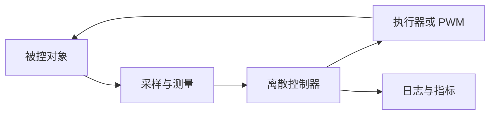

# Matlab/Simulink 仿真全教程

这个栏目不是软件菜单速查，而是一条控制仿真的学习路线。目标是让你能独立回答三个问题：模型是不是对的，控制器是不是按采样周期工作，仿真结果能不能指导实机调试。

## 学习顺序

| 阶段 | 先学什么 | 能解决的问题 |
| --- | --- | --- |
| 仿真基础 | 最小模型、采样时间、离散化 | 知道仿真为什么会发散、为什么一步延迟会改变稳定性 |
| Matlab 脚本 | 差分方程、离散 PID、状态空间 | 用最少变量复现控制环路 |
| Simulink 模型 | 离散模块、solver、多速率 | 把脚本拆成可以观察的框图 |
| 自定义模块 | Matlab Function、S-Function | 把算法封装成可复用模块 |
| 整定验证 | 参数扫描、自整定、日志对比 | 找到参数范围并解释为什么好或不好 |

## 最小心智模型

把控制系统看成一个按固定周期运行的循环。每个周期都做同一件事：读取测量值，计算误差，更新控制量，把控制量作用到对象，再记录结果。

## 新手先避开的坑

| 坑 | 现象 | 检查方法 |
| --- | --- | --- |
| 连续模型和离散控制器混用 | Matlab 脚本稳定，Simulink 里抖动 | 确认每个控制模块都有明确采样时间 |
| 采样周期写在多个地方 | 改了一个参数但结果没变 | 用同一个 `Ts` 变量驱动模型和脚本 |
| 忘记饱和与限幅 | 仿真响应很好，实机完全不可用 | 给控制量、积分项和执行器都加限幅 |
| 日志只看一张图 | 参数好坏凭感觉 | 固定超调、调节时间、稳态误差等指标 |

## 推荐入口

- [环境与最小模型](./foundation/MS-00-Simulation-Setup.md)
- [Matlab 离散控制系统](./matlab-discrete-control/MS-01-Matlab-Discrete-Control.md)
- [Simulink 离散控制系统](./simulink-discrete-control/MS-02-Simulink-Discrete-Control.md)
- [Matlab Function 使用](./custom-blocks/MS-03-Matlab-Function.md)
- [S-Function 使用](./custom-blocks/MS-04-S-Function.md)
- [参数自整定](./tuning-validation/MS-05-Parameter-Auto-Tuning.md)
