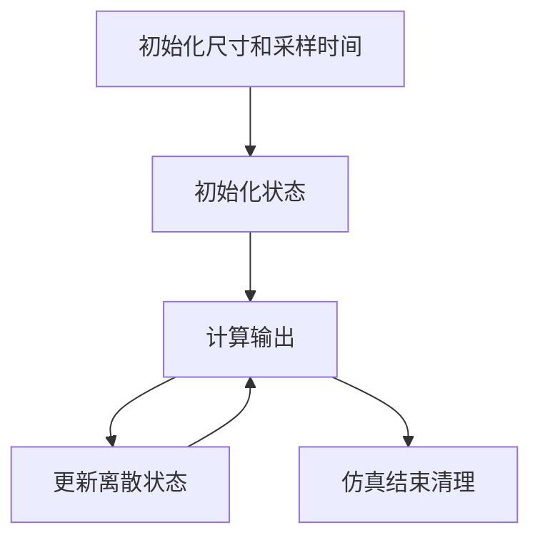

# MS-04 S-Function 使用

S-Function 是 Simulink 的自定义模块接口。它比 Matlab Function 更底层，能控制端口、采样时间、状态和回调函数，但也更容易写错。

## 1. 什么时候需要 S-Function

| 场景 | 是否需要 S-Function |
| --- | --- |
| 一个普通控制公式 | 不需要，Matlab Function 更简单 |
| 调用已有 C 算法 | 可以考虑 |
| 需要自定义采样时间和状态更新 | 可以考虑 |
| 需要模拟硬件驱动接口 | 可以考虑 |
| 只是为了让模型看起来高级 | 不需要 |

新手建议先掌握 Matlab Function，再学 S-Function。只有当模块边界、状态和采样时间都需要精确控制时，再使用 S-Function。

## 2. 生命周期



你可以把 S-Function 理解成一个带生命周期的模块。初始化阶段声明端口和状态，仿真循环里先计算输出，再更新下一拍状态。

## 3. C MEX S-Function 骨架

下面是骨架，不建议一开始就直接写复杂逻辑：

```c
#define S_FUNCTION_NAME pi_sfunc
#define S_FUNCTION_LEVEL 2
#include "simstruc.h"

static void mdlInitializeSizes(SimStruct *S)
{
    ssSetNumSFcnParams(S, 0);
    ssSetNumInputPorts(S, 1);
    ssSetInputPortWidth(S, 0, 2);
    ssSetNumOutputPorts(S, 1);
    ssSetOutputPortWidth(S, 0, 1);
    ssSetNumDiscStates(S, 1);
}

static void mdlInitializeSampleTimes(SimStruct *S)
{
    ssSetSampleTime(S, 0, 1e-3);
    ssSetOffsetTime(S, 0, 0.0);
}

static void mdlOutputs(SimStruct *S, int_T tid)
{
    const real_T *u = ssGetInputPortRealSignal(S, 0);
    real_T *y = ssGetOutputPortRealSignal(S, 0);
    real_T *x = ssGetRealDiscStates(S);
    real_T err = u[0] - u[1];
    y[0] = 0.8 * err + 30.0 * x[0];
}

static void mdlUpdate(SimStruct *S, int_T tid)
{
    const real_T *u = ssGetInputPortRealSignal(S, 0);
    real_T *x = ssGetRealDiscStates(S);
    real_T err = u[0] - u[1];
    x[0] += 1e-3 * err;
}

static void mdlTerminate(SimStruct *S) {}

#ifdef MATLAB_MEX_FILE
#include "simulink.c"
#else
#include "cg_sfun.h"
#endif
```

## 4. 常见错误

| 错误 | 表现 | 修正 |
| --- | --- | --- |
| 端口宽度不匹配 | 编译或运行时报维度错误 | 明确每个输入输出宽度 |
| 输出和状态更新混在一起 | 结果多一拍或少一拍 | `mdlOutputs` 只算输出，`mdlUpdate` 更新状态 |
| 采样时间写死 | 换模型后行为不一致 | 后续改成参数传入 |
| 没有最小测试模型 | 一出错不知道是模型还是代码 | 先做只含 S-Function 的测试模型 |

## 5. 学习建议

先写一个只有输入加法的 S-Function，确认编译链路可用。再加入离散状态。最后再把真实控制算法搬进去。每一步都保留一个能运行的测试模型。
