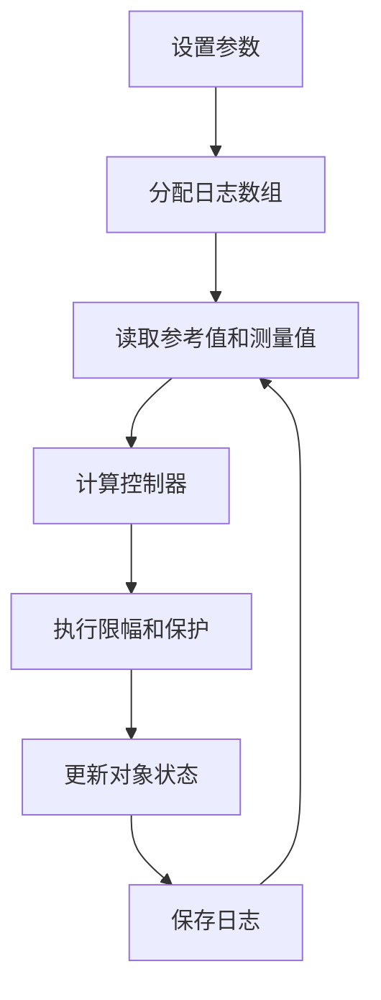

# MS-01 Matlab 仿真离散控制系统

Matlab 脚本适合做第一版控制算法验证，因为它透明、可重复、容易把每一步打印出来。你应该先用脚本证明控制思想，再把模型搬到 Simulink。

## 1. 离散控制循环

一个离散控制系统的脚本通常按这个顺序写：



关键点是不要在循环里临时扩展数组，也不要把状态更新藏在多个函数里。新手阶段，清楚比漂亮更重要。

## 2. 离散 PID 写法

位置式 PI 的基本形式是：

$$
u[k] = K_p e[k] + K_i \sum_{i=0}^{k} e[i]T_s
$$

实际仿真要加积分限幅，否则一旦输出饱和，积分项会继续累积：

```matlab
err = ref(k) - y(k);
integ = integ + Ts * err;
integ = min(max(integ, -integMax), integMax);

uRaw = Kp * err + Ki * integ;
u(k) = min(max(uRaw, -uMax), uMax);
```

如果加入一拍计算延迟，可以让对象使用上一拍控制量：

```matlab
uDelay = u(max(k - 1, 1));
y(k + 1) = y(k) + Ts * (-y(k) + Kplant * uDelay) / tau;
```

这一步很重要。真实数字控制系统通常都有采样、计算和 PWM 更新延迟，不考虑延迟的仿真会过于乐观。

## 3. 状态空间离散仿真

当对象不是一阶系统时，可以用离散状态空间：

$$
x[k+1] = A_d x[k] + B_d u[k]
$$

$$
y[k] = C_d x[k] + D_d u[k]
$$

示例脚本：

```matlab
Ts = 1e-3;
A = [0 1; -25 -4];
B = [0; 25];
C = [1 0];
D = 0;

sysd = c2d(ss(A, B, C, D), Ts, 'zoh');
Ad = sysd.A;
Bd = sysd.B;
Cd = sysd.C;
Dd = sysd.D;

x = [0; 0];
for k = 1:N
    y(k) = Cd * x + Dd * u(k);
    err = ref(k) - y(k);
    u(k) = Kp * err;
    x = Ad * x + Bd * u(k);
end
```

## 4. 指标计算

只看曲线容易误判。至少记录这些指标：

| 指标 | 计算含义 | 用途 |
| --- | --- | --- |
| 最大超调 | `max(y) - refFinal` | 判断参数是否太激进 |
| 调节时间 | 进入并保持在误差带内的时间 | 判断响应是否够快 |
| 稳态误差 | 最后一段平均误差 | 判断积分或模型偏差 |
| 控制量峰值 | `max(abs(u))` | 判断执行器是否会饱和 |

新手建议每次只改一个参数，并把指标保存成表格。这样你能知道参数变化和结果之间的关系，而不是靠感觉调参。
