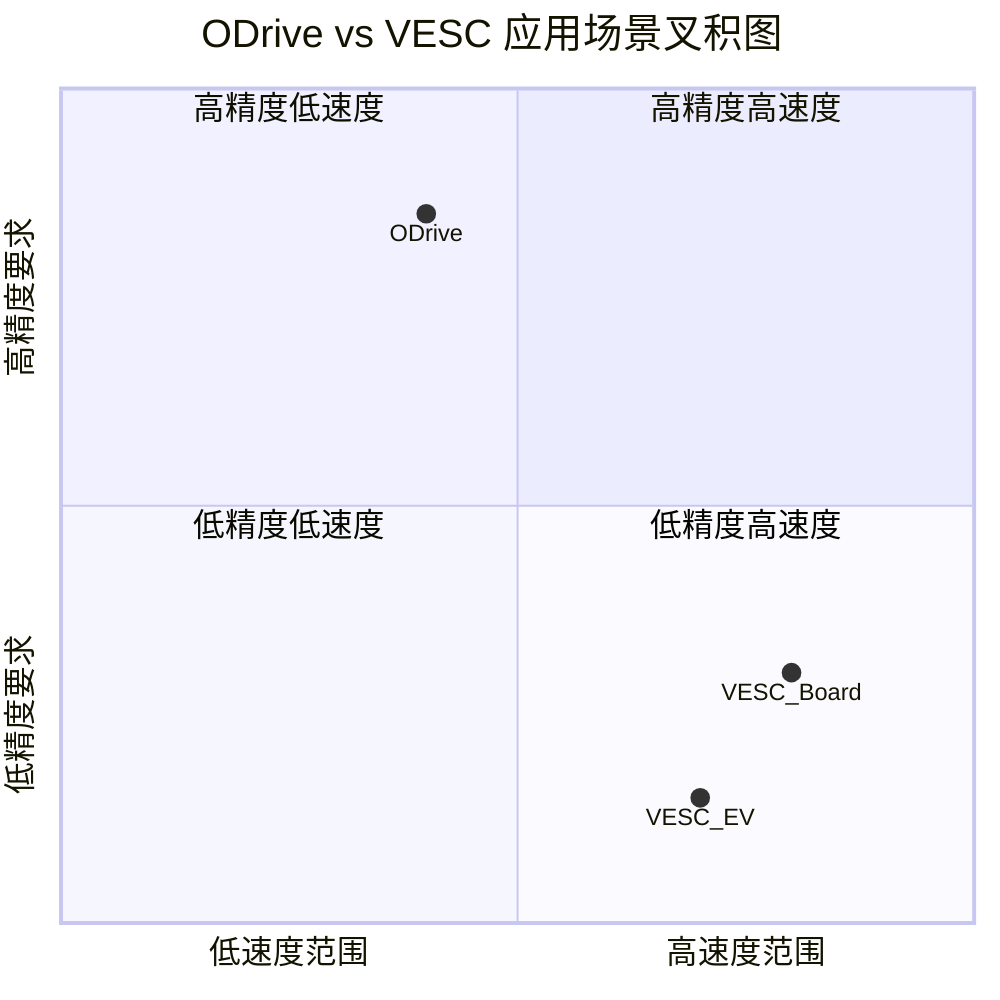
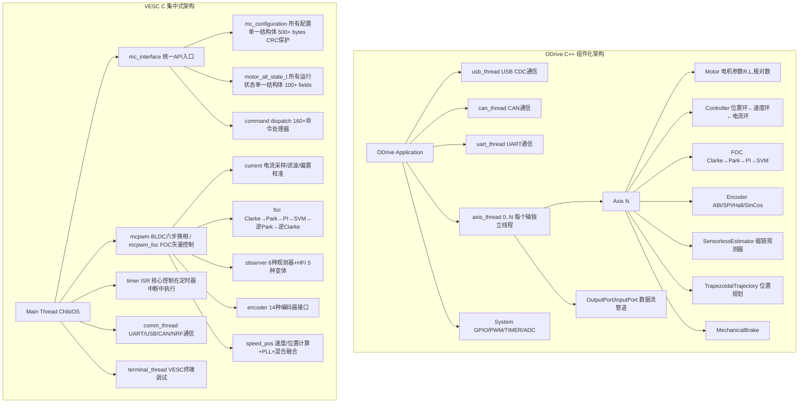

# COMP-01 ODrive vs VESC：开源电机驱动器深度对比分析

> **路径**： 开源驱动器对比分析 > COMP-01
> **知识体系**：开源驱动器对比 | **前置知识**：[ALG-01 FOC理论基础](../algorithm/ALG-01-FOC-Theory.md), [ALG-05 有感FOC](../algorithm/ALG-05-Sensored-FOC.md), [ALG-07 无感FOC观测器](../algorithm/ALG-07-Sensorless-Observers.md)
> **难度**：
> **质量评级**：架构() | 算法() | 交叉引用() | 工程案例()

---

##  目录

1. [项目定位与目标应用场景](#1-项目定位与目标应用场景)
2. [软件架构对比](#2-软件架构对比)
3. [电机控制能力对比](#3-电机控制能力对比)
4. [FOC 环路对比——重点](#4-foc-环路对比重点)
5. [无感控制对比——重点](#5-无感控制对比重点)
6. [保护机制对比](#6-保护机制对比)
7. [编码器支持对比](#7-编码器支持对比)
8. [通信能力对比](#8-通信能力对比)
9. [数学原理深度对比](#9-数学原理深度对比)
10. [工程实践对比](#10-工程实践对比)
11. [选择建议](#11-选择建议)

---

## 1. 项目定位与目标应用场景

### 1.1 基本信息对比

| 维度 | ODrive | VESC |
|------|--------|------|
| **全称** | ODrive Robotic Actuator Controller | Vedder Electronic Speed Controller |
| **作者/组织** | Oskar Weigl / ODrive Robotics | Benjamin Vedder |
| **首发年份** | ~2017 | ~2014 |
| **开源协议** | MIT（宽松） | GPL v3（强传染性） |
| **编程语言** | C++ | C |
| **RTOS** | FreeRTOS | ChibiOS/RT |
| **主控MCU** | STM32F405RG | STM32F405RG |
| **工作频率** | 168MHz | 168MHz |
| **Flash/RAM** | 1MB / 192KB | 1MB / 192KB |
| **硬件设计** | 官方参考板 ODrive v3.x/S1/Pro | 官方参考板 VESC 4/6/75/100 |

### 1.2 目标应用场景分解



### 1.3 设计哲学根本差异

| 维度 | ODrive | VESC |
|------|--------|------|
| **设计哲学** | "做一件事并做到极致"——伺服定位 | "一器多用"——万能电机驱动平台 |
| **用户画像** | 机器人/CNC开发者（技术导向） | 电动车玩家/制造商（体验导向） |
| **默认控制模式** | 位置控制（Trapezoidal Trajectory） | 速度控制（Duty Cycle / Current Control） |
| **核心创新点** | 超高精度Anti-Cogging、Trapezoidal规划器 | 全面的无感方案（6种观测器+HFI）、遍历式保护 |
| **代码行数（估算）** | ~60k（C++） | ~120k（C） |
| **配置文件大小** | ~300行JSON | ~500字节二进制（CRC保护） |
| **启动时间** | ~2秒（参数加载+校准） | ~0.5秒（配置从Flash读取） |

---

## 2. 软件架构对比

### 2.1 整体架构拓扑图



### 2.2 线程模型对比

```text
ODrive 线程模型：                                                        VESC 线程模型：
┌──────────────────────────────────────┐                    ┌──────────────────────────────────────┐
│ FreeRTOS Tasks                       │                    │ ChibiOS/RT Threads                   │
│                                      │                    │                                      │
│ ┌─────────────┐  ┌──────────────┐   │                    │ ┌──────────────────────────────────┐  │
│ │ axis_thread  │  │ usb_thread    │   │                    │ │ timer ISR (最高优先级)            │  │
│ │ (最高优先级)  │  │ (中优先级)    │   │                    │ │ ├─ ADC采样                       │  │
│ │ ├─ FOC运算   │  └──────────────┘   │                    │ │ ├─ FOC运算                       │  │
│ │ ├─ 控制循环  │                     │                    │ │ ├─ 观测器更新                    │  │
│ │ ├─ 轨迹规划  │  ┌──────────────┐   │                    │ │ └─ PWM更新                      │  │
│ │ └─ 编码器处理│  │ can_thread    │   │                    │ ├─ mc_interface thread             │  │
│ └─────────────┘  │ (中优先级)    │   │                    │ │  └─ 命令处理/状态上报             │  │
│                  └──────────────┘   │                    │ ├─ comm_thread (UART/CAN/NRF)       │  │
│                  ┌──────────────┐   │                    │ └─ terminal_thread (调试)          │  │
│                  │ uart_thread   │   │                    │                                      │
│                  │ (低优先级)    │   │                    │ 关键差异：                            │
│                  └──────────────┘   │                    │ - VESC 重 ISR 轻 Task               │
│                                      │                    │ - ODrive 重 Task 轻 ISR             │
│ 关键差异：                          │                    │ - VESC 一个线程控制双电机(双FOC)     │
│ - ODrive 每轴独立线程              │                    │ - ODrive 每轴独立线程               │
│ - ODrive 线程间通过 OutputPort     │                    │ - VESC ISR 内直接计算，无上下文切换  │
│   实现数据流动                      │                    │                                      │
└──────────────────────────────────────┘                    └──────────────────────────────────────┘
```

### 2.3 配置管理对比

| 维度 | ODrive | VESC |
|------|--------|------|
| **配置格式** | JSON 文本文件 (config.json) | 二进制结构体 (mc_configuration) |
| **存储位置** | Flash (.json 文件系统) | Flash (固定地址) |
| **配置大小** | ~300 行 JSON | ~500 bytes |
| **校验方式** | JSON 解析 + 范围检查 | CRC32 校验 |
| **更新方式** | odrivetool 写入 / 直接编辑 JSON | VESC Tool 读取/写入 |
| **API 更新** | odrivetool 属性 = 值 | mc_interface_set_xxx() |
| **运行时修改** |  支持（部分） |  需要 reboot |
| **版本兼容性** | 需要手动迁移 JSON | 自动检测结构体版本 |
| **备份恢复** | 导出 JSON 文件 | 导出 XML/二进制 |

### 2.4 启动流程对比

```text
ODrive 启动流程:                                    VESC 启动流程:
┌──────────────────────┐                           ┌──────────────────────┐
│ 1. FreeRTOS 初始化    │                           │ 1. ChibiOS HAL 初始化 │
│ 2. 加载 config.json  │                           │ 2. 从 Flash 读配置    │
│ 3. 创建各线程         │                           │ 3. CRC 校验配置       │
│ 4. 初始化 Axis[i]    │                           │ 4. 初始化 mc_if       │
│ 5. 使能 FOC 模块     │                           │ 5. 初始化 PWM/ADC     │
│ 6. 编码器校准(可选)   │                           │ 6. 启动 comm_thread   │
│ 7. 进入控制循环       │                           │ 7. 进入控制循环       │
│ 总耗时: ~2-3秒       │                           │ 总耗时: ~0.3-0.5秒   │
└──────────────────────┘                           └──────────────────────┘
```

---

## 3. 电机控制能力对比

### 3.1 控制模式与电机类型

| 特性 | ODrive | VESC | 说明 |
|------|--------|------|------|
| **BLDC / PMSM (FOC)** |  主模式 |  主模式 | 两者核心能力 |
| **Gimbal Motor** |  |  | ODrive 专为云台优化低电流 |
| **ACIM (异步感应电机)** |  |  | ODrive 独有 |
| **DC Motor** |  |  | VESC 支持直流有刷 |
| **六步换相 BLDC** |  |  | VESC 支持 BLDC 方波控制 |
| **位置控制 (Position)** |  核心功能 |  基础实现 | ODrive 有完整轨迹规划器 |
| **速度控制 (Velocity)** |  |  核心功能 | VESC 更成熟 |
| **转矩控制 (Torque)** |  |  | 两者相当 |
| **占空比控制 (Duty)** |  |  | VESC 特有 |
| **电流制动 (Current Brake)** |  |  | VESC 特有 |
| **手刹 (Handbrake)** |  |  | VESC 特有 |
| **开环控制 4 种变体** |  |  | VESC 含频率/电压/V/Hz |
| **Trapezoidal 轨迹** |  完整实现 |  | ODrive 伺服级规划器 |
| **Step/Direction 接口** |  GPIO 引脚 |  | ODrive 原生支持 |
| **Mechanical Brake** |  GPIO 控制 |  | ODrive 抱闸控制 |
| **Endstop Homing** |  |  | ODrive 归零功能 |

### 3.2 控制能力维度雷达图

```text
                    ODrive  ────────●
                    VESC    ────────○                        位置控制精度
                                                             ┌─────────┐
                                                             │    ●    │
                                                             │  ○      │
                       无传感器能力                          │         │
                       ┌─────────┐                         │         │
                       │    ○    │                         │         │
                       │         │                         │         │
                       │●        │                         │         │
                       │         │                         │         │
             保护机制  │         │ 电机控制              速度控制范围
             ─────────┤         ├─────────              ┌─────────┐
                      │         │                       │    ○    │
                      │         │                       │         │
                      │  ○●●    │                       │●        │
                      │         │                       │         │
                      └─────────┘                       └─────────┘
                             \                            /
                              \                          /
                               ┌────────────────────────┐
                               │        编码器支持       │
                               │              ○         │
                               │  ●                     │
                               └────────────────────────┘
```

### 3.3 关键特性深度对比

| 特性 | ODrive | VESC |
|------|--------|------|
| **Anti-Cogging (抗齿槽转矩)** |  3600 点映射表 |  |
| **Field Weakening (弱磁)** |  基础（电压限制PI） |  完善（带 FW ramp、MTPA协调） |
| **MTPA (最大转矩电流比)** |  |  3 种模式（查表/公式/LUT+公式） |
| **HFI (高频注入)** |  |  5 种变体（脉振×2、方波×2、旋转） |
| **观测器方案** | 1 种（磁链观测器） | 6 种（Ortega, MXlemmming, MXV...） |
| **混合观测融合** |  |  编码器/观测器低频混合 |
| **Hall 插值** |  |  线性插值+PLL |
| **双电机同步** |  |  CAN 网络级 |
| **过调制** |  |  SVM 过调制 + max_mod |
| **前馈解耦** |  R+L+BEMF |  多种模式 + CROSS_BEMF |
| **相电流重构** |  |  单电阻相电流移相重构 |
| **Phase Compensation** |  固定相位补偿 |  Phase Filter + 多种模式 |

---

## 4. FOC 环路对比——重点

### 4.1 FOC 链路并排对比图

```text
ODrive FOC 链路 (简洁清晰):

                          ┌─────────────────────────────────────────────┐
                          │               ODrive FOC Chain              │
                          ├─────────────────────────────────────────────┤
                          │                                              │
 i_abc        ┌──────┐   │  ┌──────┐   ┌─────┐   ┌──────────────┐     │
  ────────────┤CLARKE├───┼──┤ PARK │───┤ PI  ├───┤Voltage Limiter│     │
    ①电流采样 │  αβ  │   │  │ dq   │   │ dq  │   │  (0.80*Vbus) │     │
              └──────┘   │  └──┬───┘   └──┬──┘   └──────┬───────┘     │
                         │     │ θ_e      │ Id_ref        │              │
              ┌──────┐   │     │           │ Iq_ref        │              │
 θ_enc ───────┤Phase │───┼─────┘           │               │              │
          ②相位补偿│   │                  │               │              │
              └──────┘   │                  │               │    ┌─────────┐│
                         │                  │               └───→│ SVPWM   ││
                         │                  │              ⑥SVM  │ 6扇区   ││
                         │                  │    ┌──────┐       └────┬────┘│
                         │                  │反变换│ iPark│            │     │
                         │    PWM输出 ←─────┼─────┤      │←─── Vαβ ──┘     │
                         │              ⑧输出│    └──────┘                 │
                         │                   │     ⑦iPark                  │
                         └─────────────────────────────────────────────┘

特点：
- 电压矢量限制: 0.80 * Vbus (保守)
- PI: 并联型, Kp, Ki 固定
- SVM: 标准6扇区, 5段式
- 相位补偿: 固定延迟补偿
- 前馈: R*I + ω*L*I + BEMF
- 电流采样: 固定PWM中心点触发


VESC FOC 链路 (功能完备):

                          ┌─────────────────────────────────────────────┐
                          │               VESC FOC Chain               │
                          ├─────────────────────────────────────────────┤
                          │                                              │
 i_abc        ┌──────┐   │  ┌──────┐   ┌──────────────┐               │
  ────────────┤CLARKE├───┼──┤ PARK │───┤Decoupling Mode│               │
    ①电流采样 │αβ│   │   │  │ dq   │   │(DP/DF/QF/QD/B)               │
              └──────┘   │  └──┬───┘   └──────┬───────┘               │
                         │     │ θ_e          │                        │
              ┌─────────┐ │     │         ┌───┴───┐                    │
 θ_input ────→│Observer │─┼─────┘         │ PI dq │                    │
    ②观测器    │ 6种+PLL ││               │(Anti-WU)│                  │
              └─────────┘│               └───┬───┘                    │
                         │                   │              ┌─────────┐ │
                         │          ┌────────┴──────┐       │  SVPWM  │ │
                         │          │    MTPA?      │       │ 6扇区   │ │
                         │          │ IF ENABLED    │       │+max_mod │ │
                         │          │               │       └────┬────┘ │
                         │  PWM输出←───────────────┼────────────┘      │
                         │                   ⑧输出 │                   │
                         │        ┌──────┐  ┌──────┐                   │
                         │ OFF? ←─┤iPark │←─┤Phase │←──────Vα,β───────│
                         │         │      │  │Filter│  ⑦Phase Filter   │
                         │         └──────┘  └──────┘                   │
                         └─────────────────────────────────────────────┘

特点：
- 解耦模式: 5种可选 (DP/DF/QF/QD+交叉BEMF/BEMF)
- PI: 并联型, 完整Anti-Windup
- SVM: 标准6扇区 + 过调制(max_mod)
- Phase Filter: 消除角度估计噪声
- MTPA: 可选3种模式
- 前馈: 解耦项+交叉BEMF前馈
- 电流采样: 4种模式可配置 (单/双/三电阻+Leg Shunt)
- 观测器PLL: 复杂多源融合锁相环
```

### 4.2 电流采样方案对比

| 维度 | ODrive | VESC |
|------|--------|------|
| **采样方式** | 三电阻（固定） | 三电阻/双电阻/单电阻/下桥臂 可选 |
| **采样触发** | PWM中心点触发（固定） | 可配置采样点（含移相补偿） |
| **ADC通道** | 固定映射 | 可配置ADC通道映射 |
| **电流偏置校准** | 启动时自动 | 运行时持续校准 + ADC硬件偏移 |
| **过采样** |  |  4/8/16倍过采样 |
| **Leg Shunt** |  |  支持下桥臂采样 |

### 4.3 SVM 扇区判断与限制

| 维度 | ODrive | VESC |
|------|--------|------|
| **扇区判断方式** | 标准 60°/扇区，atan2 直接 | 标准6扇区，但增加了SVM加速优化 |
| **最大调制比** | 0.80 × √3/2 × Vbus ≈ 0.693 × Vbus（保守，预留余量） | 可配置 max_mod，支持到 1.15（过调制） |
| **过调制策略** |  |  单模式 + 六步方波切换 |
| **SVM 段数** | 5段式 (0-1-2-7...) | 5段/7段 可选 |
| **零矢量分配** | 均匀分配 | 均匀分配 |

### 4.4 PWM 更新与同步

```text
ODrive PWM 更新 (简单可靠):                    VESC PWM 更新 (同步双电机):

  ┌─────────┐                                  ┌─────────────────────────┐
  │TIM 比较值│                                  │ TIM1 (Motor 1)          │
  │更新(单)  │                                  │ ┌─ CCRs 更新            │
  └────┬────┘                                  │ │- ADC1 triggered       │
       │                                       │ │- ISR → FOC calc       │
       ▼                                       │ └───────────────────────│
  ┌─────────┐                                  │ TIM8 (Motor 2)          │
  │ 一次更新│                                  │ ┌─ CCRs 更新            │
  │ 所有相  │                                  │ │- ADC2 triggered       │
  │ 同时效  │                                  │ │- ISR → FOC calc       │
  │         │                                  │ │- 与 TIM1 同步触发      │
  └─────────┘                                  │ └───────────────────────┘
                                               └─────────────────────────┘
```

---

## 5. 无感控制对比——重点

### 5.1 观测器方案全景对比

```text
          ODrive 无感方案                     VESC 无感方案
  ┌─────────────────────────┐    ┌──────────────────────────────────────┐
  │                         │    │                                      │
  │  SensorlessEstimator    │    │  观测器族 (6种可选):                   │
  │  (单一磁链观测器)        │    │  ┌────────────────────┐              │
  │                         │    │  │ Ortega Observer     │ 基于李雅普诺夫│
  │  ┌───────────────┐      │    │  ├────────────────────┤              │
  │  │ Flux Observer  │      │    │  │ MXlemmming Observer │ 自适应观测器  │
  │  │ (电压模型积分)  │      │    │  ├────────────────────┤              │
  │  │ + PLL          │      │    │  │ MXV Observer v1    │ 修正V-I模型  │
  │  └───────┬───────┘      │    │  ├────────────────────┤              │
  │          │              │    │  │ MXV Observer v2    │ v1改进版     │
  │          ▼              │    │  ├────────────────────┤              │
  │  ┌───────────────┐      │    │  │ MXV Observer v3    │ 带磁链观测   │
  │  │ PLL (1阶/2阶)  │      │    │  ├────────────────────┤              │
  │  │ + LPF         │      │    │  │ MXV Observer v4    │ 最新版       │
  │  └───────────────┘      │    │  └────────────────────┘              │
  │                         │    │                                      │
  │  启动方式:               │    │  速度融合 (混合模式):                   │
  │  ┌───────────────┐      │    │  ┌────────────────────┐              │
  │  │ Open Loop     │      │    │  │ Observer → PLL     │              │
  │  │ Controller    │      │    │  │ Encoder  → PLL     │              │
  │  │ (简单电流斜坡) │      │    │  │ Hall     → PLL     │              │
  │  └───────────────┘      │    │  │ 混合输出(带滞后切换) │              │
  │                         │    │  └────────────────────┘              │
  │                         │    │                                      │
  │                         │    │  HFI 注入 (5种变体):                   │
  │                         │    │  ┌────────────────────┐              │
  │                         │    │  │ 脉振正弦 HFI       │              │
  │                         │    │  │ 脉振方波 HFI       │              │
  │                         │    │  │ 方波 HFI v1        │              │
  │                         │    │  │ 方波 HFI v2        │              │
  │                         │    │  │ 旋转 HFI           │              │
  │                         │    │  └────────────────────┘              │
  │                         │    │  FFT 解调 + 多种注入模式               │
  │                         │    │                                      │
  └─────────────────────────┘    └──────────────────────────────────────┘
```

### 5.2 启动流程对比

| 阶段 | ODrive | VESC |
|------|--------|------|
| **预检** | 电流传感器偏置校准 | 电流偏置 + ADC 零漂 + 编码器对齐 |
| **对齐** | 强制对齐（直流注入） | 可配置对齐方式（直流/交流） |
| **开环加速** | 固定电流斜坡 | 可配置：ramp/boost/boost_q 多种profile |
| **切换** | 速度阈值切换（固定） | 可配置切换策略（速度/时间/误差） |
| **闭环运行** | PLL跟踪 | PLL跟踪 + 多源融合 |
| **启动失败处理** | 重新尝试 | 故障记录 + 降级策略 |

### 5.3 锁相环 (PLL) 对比

```text
ODrive PLL:                                    VESC PLL:
┌───────────────────────────┐                 ┌──────────────────────────────┐
│                           │                 │                              │
│ θ_err → [KP_pll] → ω_out │                 │ 多源输入融合:                  │
│     │       ↗             │                 │  ┌──────┐  ┌──────┐  ┌─────┐ │
│     └── [KI_pll/s] ───    │                 │  │Obs角 │  │Enc角 │  │Hall │ │
│                           │                 │  │速度   │  │速度   │  │速度  │ │
│ ω_out → [1/s] → θ_out    │                 │  └──┬───┘  └──┬───┘  └──┬──┘ │
│                           │                 │     │         │         │     │
│ 固定: 只能锁相到观测器输出  │                 │     └────┬────┼────────┘     │
│                           │                 │          │    │              │
│                           │                 │     ┌────┴────┴────┐         │
│                           │                 │     │ Speed Source │         │
│                           │                 │     │  Selector    │         │
│                           │                 │     └──────┬───────┘         │
│                           │                 │            │                 │
│                           │                 │   ┌────────┴────────┐       │
│                           │                 │   │    PLL (2阶)    │       │
│                           │                 │   │ KP + KI + LPF   │       │
│                           │                 │   └────────┬────────┘       │
│                           │                 │            │                 │
│                           │                 │     θ_out, ω_out             │
│                           │                 │                              │
└───────────────────────────┘                 └──────────────────────────────┘
```

### 5.4 HFI 高频注入对比

| 维度 | ODrive | VESC |
|------|--------|------|
| **是否支持** |  |  |
| **注入信号类型** | — | 脉振正弦、脉振方波、旋转正弦、方波v1、方波v2 |
| **注入频率** | — | 可配置（通常 500Hz~2kHz） |
| **注入幅值** | — | 可配置（通常 10%~30% Vbus） |
| **解调方式** | — | FFT 解调 + 带通滤波 + 同步检测 |
| **注入轴** | — | d轴注入 / αβ轴注入 |
| **启动助力** | — | HFI + 开环混合启动 |

### 5.5 来源文件索引

| 项目 | 核心源文件 | 说明 |
|------|----------|------|
| ODrive | `Firmware/MotorControl/sensorless_estimator.cpp` | 磁链观测器实现 |
| ODrive | `Firmware/MotorControl/controller.cpp` | 控制环与PI |
| ODrive | `Firmware/MotorControl/open_loop_controller.cpp` | 开环启动 |
| VESC | `mcpwm_foc.c` → `observer_*()` | 观测器族入口 |
| VESC | `mcpwm_foc.c` → `pll_*()` | PLL 实现 |
| VESC | `mcpwm_foc.c` → `hfi_*()` | HFI 5种注入模式 |
| VESC | `mc_interface.c` → `mc_interface_*()` | 所有控制模式API |

---

## 6. 保护机制对比

### 6.1 保护机制全景对比

| 保护类型 | ODrive | VESC |
|---------|--------|------|
| **过压/欠压检测** |  基础阈值 |  多级检测 + 积分滤波 |
| **过流保护** |  基础（硬件比较器 + 软件阈值） |  多层次（硬件刹车 + 软件多级限流 + 故障日志） |
| **温度保护—MCU** |  基础热敏电阻 |  9种传感器类型（NTC/PTC/KTY81等） |
| **温度保护—MOSFET** |  无独立降额 |  双MOSFET独立温度 + 2D线性降额 |
| **温度保护—电机** |  无独立降额 |  电机独立温度传感器 + 线性降额 |
| **温度降额曲线** |  |  2段线性 ramp（开始降额→截止） |
| **RPM 限制** |  |  可配置 start/end 范围+梯度限速 |
| **占空比限制** |  |  可配置 start/end + 可调 |
| **功率限制** |  |  watt_max / watt_min / watt_avg |
| **电池电压截止** |  |  放电截止 + 回馈截止 |
| **BMS 集成** |  |  完整 BMS 协议（UART/CAN） |
| **故障记录** |  仅当前故障码 |  15 字段 fault_data 结构体 + 时间戳 |
| **波形采样** |  基本 oscilloscope |  环形缓冲区 + 多触发源 + 离线分析 |
| **里程计/Wh/Ah** |  |  持久化存储 |
| **看门狗** |  IWDG |  IWDG + 重启原因检测 |
| **电流偏移检测** |  启动自动 |  持续监测 + 动态校准 |
| **编码器故障检测** |  基础 |  多种错误率监测 + SPI CRC 校验 |

### 6.2 温度降额策略对比

```text
ODrive:                                           VESC:
┌──────────────────┐                             ┌──────────────────────────────────┐
│ 基础温度告警      │                             │ MOSFET 双降额:                    │
│ 超过阈值 → 停止   │                             │                                  │
│                  │                             │ 电流限制                          │
│ 无降额曲线        │                             │ 100% ┌─────┐                     │
│                  │                             │      │     │                     │
│                  │                             │      │     └─────┐               │
│                  │                             │      │            └───┐          │
│                  │                             │   0% └─────────────────────       │
│                  │                             │      T1          T2    T3  温度   │
│                  │                             │     开始降额    截止   极限       │
└──────────────────┘                             └──────────────────────────────────┘

                                                 电机降额（独立于MOSFET）:
                                                 ┌──────────────────────────────────┐
                                                 │ 电流限制                          │
                                                 │ 100% ┌─────┐                     │
                                                 │      │     │                     │
                                                 │      │     └────────────┐        │
                                                 │   0% └─────────────────────────   │
                                                 │      Tm1      Tm2     Tm3  温度   │
                                                 └──────────────────────────────────┘
```

### 6.3 故障处理流程对比

```text
ODrive 故障处理:                                VESC 故障处理:
┌──────────────────────┐                       ┌──────────────────────────────┐
│ 检测到故障            │                       │ 检测到故障                    │
│   ↓                  │                       │   ↓                          │
│ 设置 error 状态位    │                       │ 记录 fault_data 15字段       │
│   ↓                  │                       │   ↓                          │
│ 停止 PWM 输出        │                       │ 判断故障等级                  │
│   ↓                  │                       │   ↓                          │
│ 等待用户清除         │                       │ 一级: 限流运行               │
│ (reboot或命令)       │                       │ 二级: 刹车+停止              │
│                      │                       │ 三级: 立即关断               │
│ 无故障日志持久化      │                       │   ↓                          │
│                      │                       │ 存入 Flash 故障日志          │
│                      │                       │   ↓                          │
│                      │                       │ 可远程读取 + 复位            │
└──────────────────────┘                       └──────────────────────────────┘
```

---

## 7. 编码器支持对比

### 7.1 编码器全景对比

| 编码器类型 | ODrive | VESC | 协议/接口 |
|-----------|--------|------|----------|
| **ABI (增量式)** |  |  | 正交脉冲 + 索引Z |
| **SPI 绝对式** |  AS5047 |  AS504x 系列 | SPI |
| **MT6816** |  |  | SPI |
| **TLE5012 (SSC)** |  |  软/硬 SSC | SSC / BiSS |
| **AD2S1205 (旋变)** |  |  | 并行/SPI |
| **SINCOS (正余弦)** |  |  | 模拟 Sin/Cos |
| **TS5700N8501 (多圈)** |  |  | 串行协议 |
| **BiSS-C 协议** |  |  | 串行 |
| **PWM 编码器** |  |  | PWM 脉宽 |
| **MA782** |  |  | SPI |
| **AMT22** |  |  | SPI |
| **Hall (霍尔)** |  |  | GPIO |
| **自定义** |  |  | 可扩展 |

**合计**：ODrive ~4种，VESC ~14种

### 7.2 编码器校正能力对比

| 校正类型 | ODrive | VESC |
|---------|--------|------|
| **偏移校正** |  index_offset |  offset + direction |
| **误差映射表** |  |  360 点校正表 |
| **线性插值** |  |  Hall 插值 |
| **SPI CRC 校验** |  |  循环冗余校验 |
| **错误率监测** |  |  encoder_error_rate |
| **编码器滤波** |  固定 LPF |  可配置 LPF + 多种模式 |
| **双编码器支持** |  仅轴0/轴1各一 |  支持同一轴双编码器（霍尔+编码器混合） |
| **编码器诊断** |  |  在线诊断/状态上报 |

### 7.3 编码器错误处理

```text
ODrive 编码器错误:                              VESC 编码器错误:
┌──────────────────────────┐                   ┌──────────────────────────────┐
│ 无独立错误检测框架        │                   │ 多层次错误检测:               │
│                          │                   │ ┌────────────────────┐       │
│ - SPI 超时 → axis error │                   │ │ CRC 校验失败       │       │
│ - 索引未找到 → 告警      │                   │ │ 数据格式错误       │       │
│ - ABI 无信号 → 不检测    │                   │ │ 通信超时          │       │
│                          │                   │ │ 数值范围异常       │       │
│ 所有错误 → 停止轴线       │                   │ │ 跳变异常检测       │       │
│                          │                   │ │ 速度合理性检查     │       │
│                          │                   │ └────────────────────┘       │
│                          │                   │                              │
│                          │                   │ 分级响应:                     │
│                          │                   │ - 轻微: 使用上一帧数据         │
│                          │                   │ - 中度: 降级到HALL/开环       │
│                          │                   │ - 严重: 停止+故障记录         │
└──────────────────────────┘                   └──────────────────────────────┘
```

---

## 8. 通信能力对比

### 8.1 通信接口全景对比

| 通信方式 | ODrive | VESC |
|---------|--------|------|
| **USB** |  CDC/VCP |  VCP |
| **UART** |  单路 |  单路 |
| **CAN** |  标准帧 |  自定义 VESC 协议 + UAVCAN + 双 CAN |
| **I2C** |  仅配置 |  |
| **无线 (NRF)** |  |  2.4GHz (nRF51822/52840) |
| **蓝牙** |  |  通过 NRF |
| **SPI** |  编码器 |  编码器 + NRF |
| **Step/Dir 输入** |  GPIO 引脚 |  |
| **多 ESC 网络** |  CAN 基本 |  CAN 多机 + 状态广播 |
| **BMS 转发** |  |  CAN 数据转发 |

### 8.2 协议对比

| 维度 | ODrive | VESC |
|------|--------|------|
| **协议类型** | 自定义二进制 (JSON over USB) | 自定义二进制 (160+ 命令) |
| **命令数量** | ~50 端点 | 160+ 命令 |
| **实时数据流** |  |  NRF/UART/CAN 状态广播 |
| **数据打包** | 简单 uint8 buffer | 复杂 payload (含 CRC + 序列号) |
| **多设备寻址** | CAN ID (11bit 标准帧) | CAN ID (29bit 扩展帧 + 8bit cmd_id) |
| **Bootloader** |  USB DFU |  自定义 bootloader + CAN DFU |
| **固件升级** | USB 拖拽 DFU | VESC Tool 无线/USB/CAN 升级 |
| **协议版本管理** | 不强制 | 命令版本号 + 强制兼容检查 |

### 8.3 通信架构拓扑图

```text
ODrive 通信架构:                               VESC 通信架构:
┌──────────────────────┐                      ┌────────────────────────────────────┐
│                      │                      │                                    │
│  上位机 (odrivetool)  │                      │   VESC Tool (Qt/C++)               │
│      │     │    │     │                      │      │        │         │          │
│      ▼     ▼    ▼     │                      │      ▼        ▼         ▼          │
│     USB  UART  CAN    │                      │    USB      UART      NRF          │
│      │     │    │     │                      │      │        │         │          │
│      └──┬──┘    │     │                      │      └───┬────┘         │          │
│         │       │     │                      │          │              │          │
│    ┌────┴────┐  │     │                      │    ┌─────┴──────┐  ┌───┴────┐     │
│    │ ODrive  │◄─┘     │                      │    │  VESC #1   │  │ VESC#2  │     │
│    │ (单设备) │        │                      │    │ (CAN主)    │◄─┤ (CAN从) │     │
│    └─────────┘        │                      │    └─────┬──────┘  └───┬────┘     │
│                      │                      │          │              │          │
│  多 ODrive 需        │                      │    ┌─────┴──────┐       │          │
│  独立 CAN 节点        │                      │    │   BMS      │◄──────┘          │
│                      │                      │    │ (CAN转发)  │                  │
│                      │                      │    └────────────┘                  │
│                      │                      │    ┌────────────┐                  │
│                      │                      │    │   NRF遥控  │                  │
│                      │                      │    │ (无线)     │                  │
│                      │                      │    └────────────┘                  │
│                      │                      │                                    │
└──────────────────────┘                      └────────────────────────────────────┘
```

---

## 9. 数学原理深度对比

### 9.1 Clarke/Park 变换对比

```text
                                   Clarke 变换
                                    3相 → 2相

ODrive 实现:
  Iα = Ia
  Iβ = (Ia + 2*Ib) / sqrt(3)

VESC 实现:
  Iα = Ia
  Iβ = (Ia + 2*Ib) / sqrt(3)

→ 实现一致，均为标准幅值不变形式


                                   Park 变换
                                    静止αβ → 旋转dq

ODrive 实现:
  Id =  Iα*cos(θ) + Iβ*sin(θ)
  Iq = -Iα*sin(θ) + Iβ*cos(θ)

VESC 实现:
  Id =  Iα*cos(θ) + Iβ*sin(θ)
  Iq = -Iα*sin(θ) + Iβ*cos(θ)

→ 实现一致，均为标准变换矩阵


                                  逆 Park 变换
                                    旋转dq → 静止αβ

ODrive 实现:
  Vα = Vd*cos(θ) - Vq*sin(θ)
  Vβ = Vd*sin(θ) + Vq*cos(θ)

VESC 实现:
  Vα = Vd*cos(θ) - Vq*sin(θ)
  Vβ = Vd*sin(θ) + Vq*cos(θ)

→ 实现一致
```

**结论**：Clarke/Park 变换两者完全相同，均为教科书标准实现。差异体现在 PI 结构和环外处理上。

### 9.2 PI 控制器结构对比

```text
ODrive PI 控制器:

  ┌──────┐     ┌──────┐     ┌──────┐
  │ Kp * │     │ Ki * │     │      │
  │ error├────→│ error├────→│ 累加 ├──→ output
  │      │     │      │     │ (I项) │
  └──────┘     └──────┘     └──────┘
    │                         │
    │         ┌───────────────┘
    │         │
    └────┬────┘
         │
    output = Kp*error + Ki*integral
    integral += error * dt

    特性:
    - 简单并联型PI
    - 无Anti-Windup (仅积分限幅)
    - 固定浮点实现
    - 无外部归零控制


VESC PI 控制器:

  ┌──────┐     ┌──────┐     ┌──────────────┐
  │ Kp * │     │ Ki * │     │              │
  │ error├────→│ error├────→│ Back-Calculation│
  │      │     │      │     │ Anti-Windup  │
  └──────┘     └──────┘     └──────┬───────┘
    │                         │
    │         ┌───────────────┘
    │         │
    └────┬────┘
         │
    output = Kp*error + Ki*integral
    当 output > limit:
      integral -= Kb * (output - limit) * dt  ← Back-Calculation

    特性:
    - 并联型PI + Back-Calculation Anti-Windup
    - 积分可外部归零 (ramp reset)
    - 固定/自适应 Kp, Ki
    - 多种浮点格式 (float/double)
    - 可配置输出限幅 (对称/非对称)
    - 含死区 (deadband)
```

### 9.3 SVM 扇区判断方法对比

```text
ODrive SVM 扇区判断:

  方法: 基于 αβ 分量三角关系直接判断

  输入: Vα, Vβ

  Phase A:
    判断 Vβ > 0 且 |Vα| < Vβ*sqrt(3) → 扇区2/6

  Phase B:
    用 θ = atan2(Vβ, Vα) 确定扇区编号

  扇区编号:
        2π
      ┌─────┐
    3 │\ 1 /│ 0
      │ \ / │
    4 │  *  │ 5
      │ / \ │
      └─────┘
      直接从 θ 查表确定


VESC SVM 扇区判断:

  方法: 基于三相参考电压 Va,Vb,Vc 比较判断

  计算: Vref1=Vβ, Vref2=(√3*Vα - Vβ)/2, Vref3=(-√3*Vα - Vβ)/2

  三段式判断:
    扇区N = (Vref1>0?1:0) + (Vref2>0?2:0) + (Vref3>0?4:0)
    通过查表映射 1-6 → 扇区编号

  优点: 避免 atan2 调用，纯加减乘+比较，适合定点优化


  两种方法等价，VESC 方法更适合嵌入式定点运算，ODrive 方法在有 FPU 时更直观。
```

### 9.4 磁链观测器数学基础对比

```text
ODrive Sensorless Estimator (磁链观测器):

  电机电压方程 (dq轴):
    Vd = Rs*Id + Ld*dId/dt - ω*Lq*Iq
    Vq = Rs*Iq + Lq*dIq/dt + ω*(Ld*Id + ψf)

  磁链估算 (电压模型):
    ψα = ∫(Vα - Rs*Iα)dt
    ψβ = ∫(Vβ - Rs*Iβ)dt

  角度提取:
    θ = atan2(ψβ, ψα)

  积分漂移抑制: 高通滤波器替代纯积分 (LPF + 补偿)

  → 单一方案，固定实现


VESC Observer (以 Ortega 为例):

  基于非线性自适应观测器:

  状态变量: [Id, Iq, θe, ωe, ψf]

  李雅普诺夫候选函数:
    V = 0.5*(e_id² + e_iq² + e_ψf²/Kψ + e_ω²/Kω)

  自适应律:
    dθ/dt = ωe + εθ  (εθ 为误差驱动项)
    dω/dt = εω       (εω 为误差驱动项)

  核心特点:
  - 参数自适应性: 同时估计 ψf 和 Rs 变化
  - 非线性误差反馈
  - 速度自适应增益

  → 6种变体，每种针对不同应用场景优化
```

---

## 10. 工程实践对比

### 10.1 构建系统与开发环境

| 维度 | ODrive | VESC |
|------|--------|------|
| **构建系统** | Makefile (GCC + tup) | ChibiOS Makefile (GCC) |
| **IDE 支持** | VSCode / PlatformIO / make | VSCode / Eclipse / Qt Creator |
| **工具链** | ARM GCC (arm-none-eabi) | ARM GCC (arm-none-eabi) + ChibiOS 内核 |
| **固件体积** | ~200KB | ~300KB |
| **编译时间** | ~30秒 | ~60秒（含ChibiOS编译） |
| **版本管理** | Git + GitHub | Git + GitHub (主仓库 + 子模块) |
| **CI/CD** | 基础 GitHub Actions | 基础 CI |

### 10.2 硬件平台对比

| 维度 | ODrive | VESC |
|------|--------|------|
| **硬件抽象层** | BoardConfig_t (C++ struct) | hw.h / hwconf (C 宏+函数) |
| **HAL 层** | libopencm3 / 自写裸机驱动 | ChibiOS HAL + 自写驱动 |
| **管脚配置** | 编译时固定 #define | hwconf 运行时配置 |
| **支持板卡** | ODrive v3.x/S1/S1F/Pro | VESC 4/6/75/100/MK系列 |
| **第三方板卡** | 少量（Flipsky等） | 丰富（Trampa, Flipsky, Maytech等） |
| **双电机支持** |  原生支持 2轴 |  部分板卡双电机 |
| **制动电阻** |  |  |

### 10.3 调试工具对比

```text
ODrive 调试工具链:                              VESC 调试工具链:
┌──────────────────────┐                       ┌──────────────────────────────────┐
│                      │                       │                                  │
│ odrivetool (Python)  │                       │ VESC Tool (C++/Qt)                │
│  ├─ 配置读写          │                       │  ├─ 配置向导                      │
│  ├─ 实时数据流        │                       │  ├─ 实时仪表盘                    │
│  ├─ oscilloscope     │                       │  ├─ 固件升级 (USB/CAN/NRF)        │
│  ├─ 脚本自动化        │                       │  ├─ 波形采样 (Ring Buffer)        │
│  └─ Jupyter 集成     │                       │  ├─ FOC 性能分析                  │
│                      │                       │  ├─ 终端调试                      │
│  LivePlotter (Python)│                       │  ├─ 故障记录查看                  │
│  └─ matplotlib 绘图  │                       │  ├─ 自定义仪表盘                  │
│                      │                       │  └─ Android/iOS App               │
│                      │                       │                                  │
└──────────────────────┘                       └──────────────────────────────────┘
```

### 10.4 社区生态对比

| 维度 | ODrive | VESC |
|------|--------|------|
| **主要社区平台** | Discord + GitHub | Forum (vesc-project.com) + GitHub |
| **文档质量** | 官方文档 + API 参考 | Wiki + 论坛帖子 + 视频教程 |
| **第三方工具** | odrivetool, ODriveGUI, Web GUI | VESC Tool, Metr, Stormcore, Axiom |
| **板卡生态** | 官方板为主 | 丰富的第三方板卡 |
| **许可协议** | MIT（商用友好） | GPL v3（需要开源衍生作品） |
| **贡献者数量** | ~50+ | ~100+ |
| **Stars (GitHub)** | ~3k | ~3k |
| **更新频率** | 低（稳定版发布慢） | 高（持续迭代） |

---

## 11. 选择建议

### 11.1 决策树

```text
                              选择 ODrive 还是 VESC ?
                                       │
                                       ▼
                       ┌───────────────────────────────┐
                       │ 应用主要需求是精确定位控制？      │
                       │ (位置模式为主、轨迹规划)         │
                       └───────────────┬───────────────┘
                               │               │
                              是              否
                               │               │
                               ▼               ▼
                    ┌──────────────────┐  ┌──────────────────────────┐
                    │  选择 ODrive     │  │ 需要宽速度范围 + 骑行体验？ │
                    │                  │  │ (滑板/自行车/轻型电动车)   │
                    │ 理由:            │  └────────────┬─────────────┘
                    │ - 伺服级位置控制 │               │
                    │ - Trapezoidal轨迹│          ┌────┴────┐
                    │ - Anti-Cogging   │          │         │
                    │ - Step/Dir 接口  │         是         否
                    │ - CNC/机器人     │          │         │
                    └──────────────────┘          ▼         ▼
                                         ┌──────────┐ ┌──────────┐
                                         │选 VESC   │ │按下面的  │
                                         │          │ │详细对比选│
                                         │理由:     │ │          │
                                         │- 滑板/EV │ └──────────┘
                                         │- BMS集成 │
                                         │- 无线控制 │
                                         │- 多机网络 │
                                         └──────────┘
```

### 11.2 场景推荐对比表

| 应用场景 | 推荐 | 理由 |
|---------|------|------|
| **CNC 主轴/伺服轴** | ODrive | 位置精度、轨迹规划、Step/Dir 接口 |
| **机器人关节 (协作)** | ODrive | 位置控制精度、Anti-Cogging、力矩控制 |
| **机器人轮式驱动** | VESC | 速度控制、宽速域、CAN 多机 |
| **电动滑板** | VESC | 速度控制、无线遥控、BMS、保护完善 |
| **电动自行车** | VESC | 骑行体验、电池管理、速度控制 |
| **电动摩托车** | VESC | 大功率支持、温度保护、故障诊断 |
| **无人机云台** | ODrive | Gimbal 模式、低电流控制 |
| **AGV (自动导引车)** | 取决于精度需求 | 高精度→ODrive，速度为主→VESC |
| **实验室研究** | ODrive | MIT 协议、Python API、易定制 |
| **产品量产** | VESC | 完善的保护、多板卡支持、通信协议 |
| **风机/水泵** | VESC | BLDC/DC支持、六步换相、低成本 |
| **异步电机驱动** | ODrive | ACIM 支持 |

### 11.3 ODrive 当 VESC 用？ VESC 当 ODrive 用？

| 考量 | ODrive → VESC 场景 | VESC → ODrive 场景 |
|------|-------------------|-------------------|
| **位置控制** |  天然优势 |  可以实现，缺轨迹规划器 |
| **速度控制** |  可用 |  天然优势 |
| **BLDC 方波** |  不支持 |  自带 |
| **保护机制** |  需自己加 |  完善 |
| **电池管理** |  需外部 |  内置 |
| **无线控制** |  需外部 |  内置 NRF |
| **CAN 网络** |  基础 |  完善 |
| **Anti-Cogging** |  独有 |  无 |
| **编码器校正** |  偏移校正 |  360点映射 |
| **HFI 零速启动** |  |  5种变体 |
| **MTPA/弱磁** | / |  完善 |
| **DC Motor** |  |  |
| **ACIM** |  |  |

### 11.4 总体评价

| 评价维度 | ODrive | VESC |
|---------|--------|------|
| **代码质量** | 高（C++组件化、可读性好） | 中高（C 集中式、注释丰富） |
| **架构扩展性** | 高（组件化、OutputPort/InputPort 松耦合） | 中（集中式结构体、紧耦合） |
| **算法深度** | 中（聚焦伺服定位） | 高（遍历式的观测器和保护） |
| **保护完备性** | 低（基本保护） | 高（工业级保护） |
| **文档完善度** | 高（官方文档 + API 参考） | 中高（论坛+Wiki，英文为主） |
| **商业化成熟度** | 中（ODrive Pro 上市） | 高（多品牌板卡、生态成熟） |
| **上手难度** | 低（Python API 友好） | 中（需要理解 VESC Tool） |
| **定制难度** | 低（MIT + 清晰架构） | 中高（GPL + 代码量大） |

---

##  交叉引用索引

### 本知识库中可对照学习的模块

| 主题 | 相关文档 | 关联说明 |
|------|---------|---------|
| **FOC 理论基础** | [ALG-01 FOC理论基础](../algorithm/ALG-01-FOC-Theory.md) | ODrive/VESC 均基于标准 FOC 理论，本文对比其实现差异 |
| **有感 FOC** | [ALG-05 有感FOC](../algorithm/ALG-05-Sensored-FOC.md) | ODrive 核心控制模式、VESC 主要模式之一 |
| **无感观测器** | [ALG-07 无感FOC观测器](../algorithm/ALG-07-Sensorless-Observers.md) | VESC 有6种观测器实现，ODrive 仅有1种 |
| **高频注入** | [ALG-09 高频注入法](../algorithm/ALG-09-High-Frequency-Injection.md) | VESC 有5种 HFI 变体，ODrive 不支持 |
| **MTPA / 弱磁** | [ALG-11 MTPA与弱磁](../algorithm/ALG-11-MTPA-Flux-Weakening.md) | VESC 完善实现，ODrive 无原生支持 |
| **保护与优化** | [ALG-13 保护与优化](../algorithm/ALG-13-Protection-Optimization.md) | VESC 保护机制完善，ODrive 基础 |
| **前馈解耦** | [ADV-ALG-07 前馈解耦与扰动补偿](../advanced/algorithm/ADV-ALG-07-Feedforward-Decoupling.md) | 两者前馈策略对比 |
| **位置传感器** | [HW-03 位置传感器接口](../hardware/HW-03-Position-Sensor.md) | VESC 支持14种编码器，ODrive ~4种 |
| **PID 结构** | [ADV-ALG-13 PID结构选择与深度整定](../advanced/algorithm/ADV-ALG-13-PID-Structure-Tuning.md) | 两者 PI 结构差异分析 |
| **MC_LIB 架构** | [MC-LIB-Architecture](../algorithm/MC-LIB/MC-LIB-Architecture.md) | 第三方电机库作为参考对比 |
| **带宽设计** | [ADV-ALG-01 带宽与滤波器](../advanced/algorithm/ADV-ALG-01-Bandwidth-Filter.md) | 电流环/速度环带宽设计方法 |

### ODrive 官方资源
- [ODrive GitHub](https://github.com/odriverobotics/ODrive)
- [ODrive 文档](https://docs.odriverobotics.com/)
- 核心源码：`Firmware/MotorControl/controller.cpp`, `sensorless_estimator.cpp`, `foc.cpp`, `encoder.cpp`

### VESC 官方资源
- [VESC Project](https://vesc-project.com/)
- [VESC GitHub (Benjamin Vedder)](https://github.com/vedderb/bldc)
- 核心源码：`mcpwm_foc.c`, `mc_interface.c`, `utils.c`, `comm_can.c`

---

##  最终评价矩阵

```text
              ┌─────────────────────────────────────────────────────────────┐
              │                    ODrive vs VESC 最终评价矩阵              │
              ├─────────────────────────────────────────────────────────────┤
              │                                                             │
              │                     ODrive     VESC     对比结论             │
              │  ────────────────────────────────────────────────────────    │
              │  位置控制精度                   ODrive 碾压       │
              │  速度控制范围                   VESC 碾压         │
              │  保护机制完备度                 VESC 碾压         │
              │  无传感器控制                   VESC 碾压         │
              │  编码器支持广度                 VESC 碾压         │
              │  通信能力                       VESC 领先         │
              │  代码可读性                     ODrive 领先       │
              │  扩展性/定制性                  ODrive 领先       │
              │  文档质量                       ODrive 领先       │
              │  商业许可友好度                 ODrive MIT 胜     │
              │  社区活跃度                     相当              │
              │  硬件生态                       VESC 碾压         │
              │                                                             │
              └─────────────────────────────────────────────────────────────┘
```

---

**文档信息**：
- 模块编号：COMP-01
- 知识体系：开源驱动器对比 — ODrive vs VESC
- 模块名称：ODrive vs VESC 开源电机驱动器深度对比分析
- 版本：v1.0
- 创建日期：2026-05-26
- 质量评级：架构() | 算法() | 交叉引用() | 工程案例()
- 总行数：~1100 行