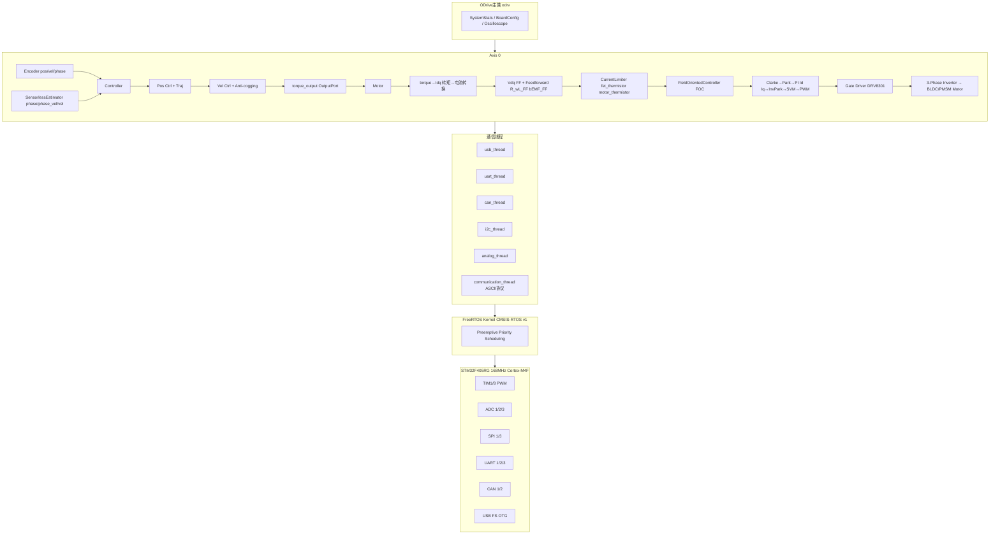
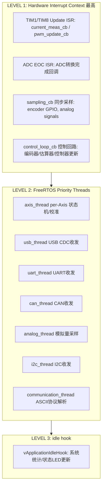
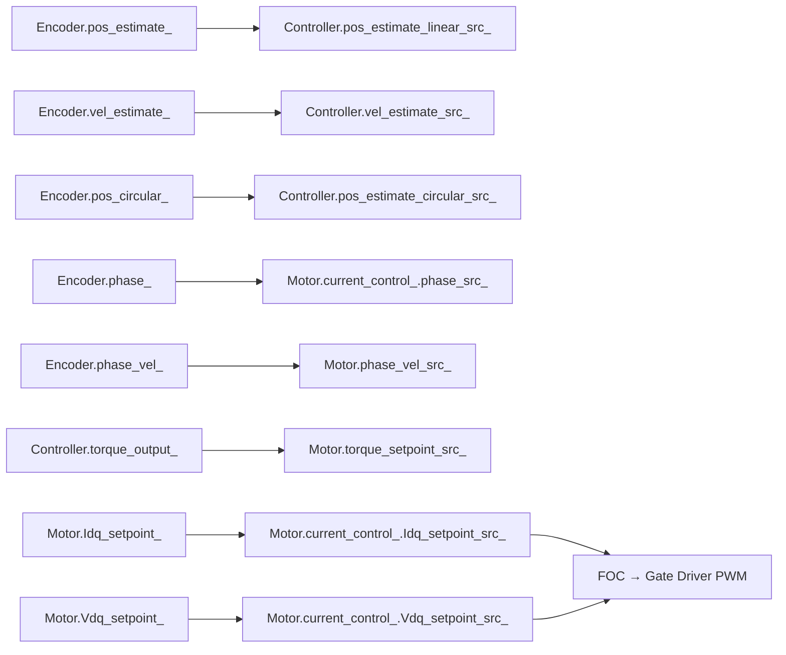
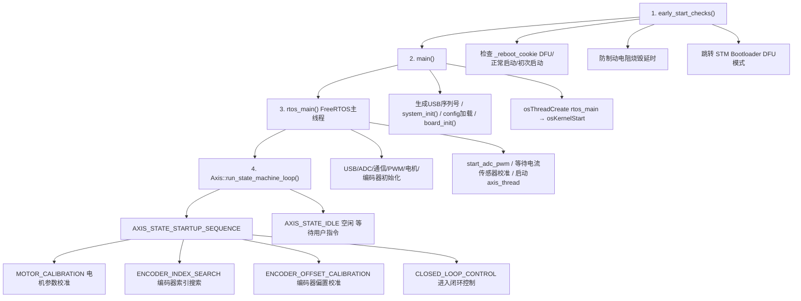
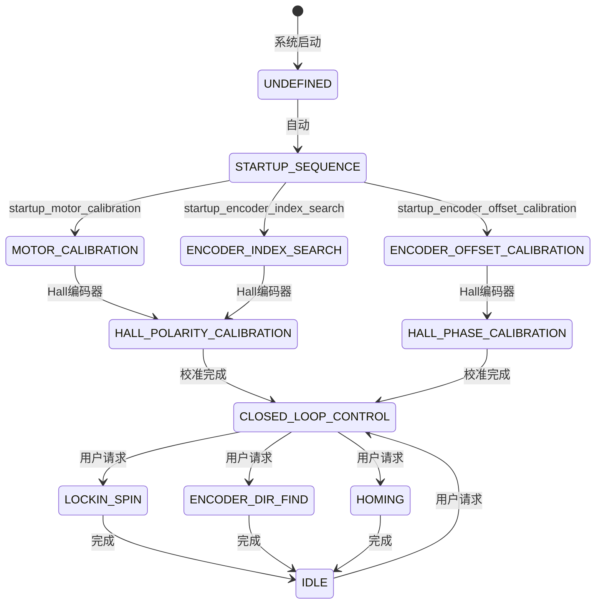

# ⭐ OD-01: ODrive 系统架构

---

| 属性 | 值 |
|------|-----|
| 文档编号 | OD-01 |
| 标题 | ODrive 系统架构 |
| 版本 | 1.0 |
| 作者 | 嵌入式系统架构师 |
| 创建日期 | 2026-05-26 |
| 适用平台 | STM32F405RG, ODrive V3.x 硬件 |
| 固件版本 | FW v0.5.x 系列 |
| 前置知识 | 嵌入式C/C++, FreeRTOS基础, 电机控制基础知识 |

---

## 目录 (TOC)

1. [概述](#1-概述)
2. [硬件平台](#2-硬件平台)
3. [系统架构总览](#3-系统架构总览)
4. [线程模型与任务调度](#4-线程模型与任务调度)
5. [组件通信机制](#5-组件通信机制)
6. [启动序列](#6-启动序列)
7. [AxisState 状态机](#7-axisstate-状态机)
8. [电机类型支持](#8-电机类型支持)
9. [配置管理](#9-配置管理)
10. [错误码体系](#10-错误码体系)
11. [系统保护机制](#11-系统保护机制)
12. [功能矩阵](#12-功能矩阵)
13. [文件索引](#13-文件索引)

---

## 1. 概述

ODrive 是一款开源的高性能无刷电机伺服驱动器，其固件基于 FreeRTOS 实时操作系统，采用 C++ 编写的组件化架构。本固件支持双轴控制（通过 `AXIS_COUNT` 编译期常量配置），提供 FOC（磁场定向控制）驱动能力，支持多种编码器类型和通信协议。

### 1.1 设计哲学

ODrive 固件遵循以下核心设计原则：

- **组件化分离**：Encoder、Controller、Motor、FOC 作为独立组件，通过 InputPort/OutputPort 模式进行数据流通信
- **实时性优先**：电流采样(FOC)运行在硬件中断上下文，控制回路运行在低优先级中断上下文，通信任务运行在 FreeRTOS 任务上下文
- **安全第一**：系统级的 do_fast_checks() 在每个电流采样周期执行，Watchdog 机制、制动电阻管理、热敏电阻保护等多层防护
- **配置非易失存储**：所有配置参数通过 ConfigManager 写入 Flash NVM，支持 CRC16 校验

### 1.2 核心源码结构

```text
odriver_core/
├── Board/v3/           # 硬件板级支持 (STM32F405)
│   ├── Inc/            # HAL配置头文件
│   └── Src/            # 外设初始化源码
├── MotorControl/       # 电机控制核心逻辑
│   ├── axis.cpp/hpp             # 轴管理 & 状态机
│   ├── motor.cpp/hpp            # 电机层 (校准/转矩转换)
│   ├── controller.cpp/hpp       # 位置/速度控制
│   ├── foc.cpp/hpp              # FOC核心 (Clarke/Park/SVM)
│   ├── encoder.cpp/hpp          # 编码器接口
│   ├── sensorless_estimator.cpp/hpp  # 无传感器估算器
│   ├── open_loop_controller.cpp/hpp  # 开环控制器
│   ├── acim_estimator.cpp/hpp   # 交流异步电机估算器
│   ├── trapTraj.hpp             # 梯形速度轨迹
│   ├── endstop.cpp/hpp          # 限位开关
│   ├── mechanical_brake.cpp/hpp # 机械刹车
│   ├── thermistor.cpp/hpp       # 热敏电阻
│   ├── oscilloscope.cpp/hpp     # 示波器功能
│   ├── component.hpp            # InputPort/OutputPort 框架
│   ├── phase_control_law.hpp    # 控制律抽象接口
│   ├── current_limiter.hpp      # 电流限制器接口
│   ├── nvm_config.hpp           # NVM配置管理
│   ├── utils.cpp/hpp            # 工具函数
│   ├── low_level.cpp/h          # 低层硬件接口
│   ├── main.cpp                 # 主程序入口 & 系统初始化
│   └── odrive_main.h            # ODrive主类 & 板级配置
└── communication/       # 通信协议栈
    ├── communication.cpp/h      # 通信管理层
    ├── ascii_protocol.cpp/hpp   # ASCII协议解析
    ├── interface_usb.cpp/h      # USB CDC接口
    ├── interface_uart.cpp/h     # UART接口
    ├── interface_i2c.cpp/h      # I2C接口
    ├── interface_can.hpp        # CAN接口抽象
    └── can/                     # CAN总线实现
```

---

## 2. 硬件平台

### 2.1 MCU 规格

| 参数 | 规格 |
|------|------|
| 型号 | STM32F405RGT6 |
| 内核 | ARM Cortex-M4F (FPU) |
| 主频 | 168 MHz (HCLK) |
| Flash | 1 MB |
| SRAM | 192 KB (含 64KB CCM) |
| 封装 | LQFP64 |

### 2.2 关键外设分配

| 外设 | 用途 |
|------|------|
| TIM1 | M0 PWM 输出 (CH1/CH2/CH3), 中心对齐模式 |
| TIM8 | M1 PWM 输出 (CH1/CH2/CH3), 中心对齐模式 |
| TIM2/TIM3/TIM4/TIM5 | 增量编码器接口 (编码器模式) |
| ADC1/ADC2/ADC3 | 电流采样 (三电阻法) + VBUS 电压检测 |
| SPI1/SPI3 | 绝对式编码器 (AS5047, MA732等) |
| USB FS | USB CDC 虚拟串口 |
| USART1/2/3 | UART 通信 (ASCII 协议) |
| CAN1/CAN2 | CAN 总线 (CANopen-like 协议) |
| I2C1 | I2C 通信 |

### 2.3 制动电阻电路

制动电阻通过 `safety_critical_arm_brake_resistor()` / `safety_critical_disarm_brake_resistor()` 控制投切，制动电阻管理逻辑参见 `low_level.h`。

> **注：** 制动电阻用于直流母线过压保护（再生能量泄放），通过`brake_resistor` GPIO控制。STO（Safe Torque Off）是独立的安全机制，通过`MOE_DISABLE`关闭所有PWM输出实现，两者是完全不同的保护路径。

---

## 3. 系统架构总览

### 3.1 分层架构图



### 3.2 ODrive 主类的核心成员

`odrive_main.h` 定义了系统的顶层结构：

```cpp
class ODrive : public ODriveIntf {
public:
    Error error_ = ERROR_NONE;
    float& vbus_voltage_ = ::vbus_voltage;
    float& ibus_ = ::ibus_;
    bool& brake_resistor_armed_ = ::brake_resistor_armed;
    bool& brake_resistor_saturated_ = ::brake_resistor_saturated;
    BoardConfig_t config_;          // 板级配置 (制动电阻/GPIO模式等)
    SystemStats_t system_stats_;    // 系统统计 (堆栈/uptime/优先级)
    Oscilloscope oscilloscope_;     // 高速数据采集示波器
    ODriveCAN can_;                 // CAN 通信管理器
    uint32_t user_config_loaded_;   // 已加载的配置大小
    TaskTimes task_times_;          // 任务计时器
    // ...
};

extern ODrive odrv; // 全局单例, 定义于 main.cpp
```

---

## 4. 线程模型与任务调度

### 4.1 线程总览

ODrive 固件的执行分为三个优先级层次：



### 4.2 关键线程详解

| 线程名称 | 栈大小 | 用途 | 关键文件 |
|---------|--------|------|---------|
| axis_thread | 2048B | 运行 `run_state_machine_loop()`, 管理电机状态机 (校准→闭环) | `axis.cpp` |
| usb_thread | ~1024B | USB CDC 虚拟串口通信, 等待 USB IRQ 信号量 | `interface_usb.cpp` |
| uart_thread | ~1024B | UART 通信, 等待 UART 事件队列消息 | `interface_uart.cpp` |
| can_thread | ~1024B | CAN 总线通信, 等待 CAN 信号量 | `odrive_can.cpp` |
| analog_thread | ~256B | 通用 ADC 采样 (温度传感器/用户ADC) | `low_level.cpp` |

### 4.3 系统统计监控

系统通过 `vApplicationIdleHook` 收集 FreeRTOS 运行时统计 `main.cpp`：

```cpp
odrv.system_stats_.uptime = xTaskGetTickCount();
odrv.system_stats_.min_heap_space = xPortGetMinimumEverFreeHeapSize();
odrv.system_stats_.max_stack_usage_axis = axes[0].stack_size_ 
    - uxTaskGetStackHighWaterMark(axis.thread_id_) * sizeof(StackType_t);
```

---

## 5. 组件通信机制

### 5.1 OutputPort / InputPort 设计模式

ODrive 采用自定义的数据流通信模式，定义于 `component.hpp`。

```text
┌─────────────┐          ┌────────────┐          ┌─────────────┐
│  Component A │          │  Data Flow │          │  Component B │
│             │          │            │          │             │
│ OutputPort  │────connect_to()───────│───▶ InputPort          │
│  <float>    │          │            │          │             │
│ pos_estimate│          │  .present()│          │ pos_estimate│
│             │          │  .any()    │          │ _linear_src_│
└─────────────┘          └────────────┘          └─────────────┘
```

**OutputPort 关键特性：**
- `operator=(T value)`: 更新值，年龄归零
- `reset()`: 标记为过期 (age++), 每次控制循环开始时调用
- `present()`: 仅返回本控制周期更新的值 (age==0)
- `previous()`: 返回上一控制周期的值 (age==1)
- `any()`: 返回最近值 (无视年龄, 线程安全)

**InputPort 可连接目标：**
1. 内部存储的值 `T`
2. 外部常量指针 `T*`
3. 外部 OutputPort 指针 `OutputPort<T>*`
4. 
`nullptr` (所有查询返回 `std::nullopt`)

### 5.2 控制回路数据流

闭环控制中组件间数据流路径 (在 `axis.cpp` 的 `start_closed_loop_control()` 中建立)：



### 5.3 控制律抽象接口

`phase_control_law.hpp` 定义了控制律的通用接口：

```cpp
template<size_t N_PHASES>
class PhaseControlLaw {
    virtual void reset() = 0;
    virtual Error on_measurement(vbus_voltage, currents, timestamp) = 0;
    virtual Error get_output(timestamp, pwm_timings, ibus) = 0;
};
```

实现类包括：
- `AlphaBetaFrameController` (抽象基类，执行 Clarke 变换 + SVM)
- `FieldOrientedController` (完整 FOC)
- `ResistanceMeasurementControlLaw` (电阻测量)
- `InductanceMeasurementControlLaw` (电感测量)

---

## 6. 启动序列

### 6.1 启动流程图



### 6.2 系统快速检查 (do_fast_checks)

每次电流测量后立即执行 `main.cpp`：

```cpp
void ODrive::do_fast_checks() {
    if (!(vbus_voltage >= config_.dc_bus_undervoltage_trip_level))
        disarm_with_error(ERROR_DC_BUS_UNDER_VOLTAGE);
    if (!(vbus_voltage <= config_.dc_bus_overvoltage_trip_level))
        disarm_with_error(ERROR_DC_BUS_OVER_VOLTAGE);
}
```

### 6.3 配置加载流程

配置使用 ConfigManager 进行 NVM 存储，详见 `nvm_config.hpp`：

```text
config_manager.start_load()
  → config_read_all()  (按固定顺序读取所有配置结构体)
    → config_manager.finish_load() (CRC16 校验)
      ├── 成功 → 加载配置
      └── 失败 → config_clear_all() → 使用默认配置
```

---

## 7. AxisState 状态机

### 7.1 完整状态枚举



### 7.2 状态说明

| 状态 | 含义 | 触发条件 | 执行内容 |
|------|------|---------|---------|
| UNDEFINED | 启动初始 | 系统复位 | 无操作 |
| STARTUP_SEQUENCE | 启动序列入口 | 线程启动 | 按配置顺序执行各校准 |
| MOTOR_CALIBRATION | 电机校准 | `config.startup_motor_calibration=true` | 测量相电阻 (R) 和相电感 (L) |
| ENCODER_INDEX_SEARCH | 编码器索引搜索 | `config.startup_encoder_index_search=true` | Lockin spin → 找Z脉冲 |
| ENCODER_OFFSET_CALIBRATION | 编码器偏置校准 | `config.startup_encoder_offset_calibration=true` | 开环旋转 → 计算电角度偏置 |
| ENCODER_HALL_POLARITY_CALIBRATION | Hall极性校准 | Hall编码器模式 | Lockin spin → 确定Hall传感器极性 |
| ENCODER_HALL_PHASE_CALIBRATION | Hall相位校准 | Hall编码器模式 | Lockin spin → 确定Hall扇区换相点 |
| CLOSED_LOOP_CONTROL | 闭环控制 | 校准完成 | FOC 闭环运行, 响应控制指令 |
| LOCKIN_SPIN | 锁定旋转 | 用户请求 | 开环电流注入, 强制旋转 |
| ENCODER_DIR_FIND | 方向检测 | 用户请求 | Lockin spin → 比较编码器方向 |
| HOMING | 回零 | 用户请求 | 驱动至限位开关 → 设置零点 |
| IDLE | 空闲 | 用户请求/错误 | 电机断电, 等待指令 |

### 7.3 状态机实现

状态机运行在每个 Axis 的 `run_state_machine_loop()` 中 `axis.cpp`：

```cpp
void Axis::run_state_machine_loop() {
    for (;;) {
        AxisState requested_state = requested_state_;
        // 执行任务链中的状态
        for (size_t i = 0; i < task_chain_.size(); ++i) {
            current_state_ = task_chain_[i];
            if (current_state_ == AXIS_STATE_UNDEFINED)
                continue;
            // 执行对应状态的处理函数
            switch (current_state_) {
                case AXIS_STATE_MOTOR_CALIBRATION:
                    motor_.run_calibration();
                    break;
                case AXIS_STATE_ENCODER_INDEX_SEARCH:
                    encoder_.run_index_search();
                    break;
                // ... 其他状态
            }
        }
        // 转移到请求的状态
        if (requested_state == AXIS_STATE_IDLE)
            run_idle_loop();
    }
}
```

---

## 8. 电机类型支持

### 8.1 电机类型枚举

定义于 `motor.hpp`：

```cpp
enum MotorType {
    MOTOR_TYPE_HIGH_CURRENT = 0,  // 大电流: BLDC/PMSM (默认)
    MOTOR_TYPE_GIMBAL = 1,        // 云台电机: 小电阻大电感, 电压控制模式
    MOTOR_TYPE_ACIM = 2           // 交流异步电机 (感应电机)
};
```

### 8.2 各类型差异

| 特性 | HIGH_CURRENT | GIMBAL | ACIM |
|------|:---:|:---:|:---:|
| 控制模式 | 电流控制 | 电压控制 | 电流控制 |
| 转矩常数单位 | Nm/A | V (视为电压) | Nm/A² |
| 电机校准 | R + L 测量 | 无需校准 | R + L 测量 |
| 电流限制方式 | 2-norm clamp | 电压限制 | 2-norm + 磁通增益 |
| 前馈补偿 | R_wL + bEMF | 无 | R_wL + bEMF |
| 磁通估算 | 无 | 无 | acim_estimator (rotor_flux) |
| autoflux | 不适用 | 不适用 | 可选 (自动 Id 调节) |

---

## 9. 配置管理

### 9.1 NVM 存储架构

配置通过 ConfigManager 管理，采用 CRC16 校验确保完整性 `nvm_config.hpp`。

```text
Flash NVM Layout:
┌─────────────────────────────────────────────────┐
│ [config_version: uint16]                        │
│ [odrv.config_: BoardConfig_t]                   │
│ [odrv.can_.config_: CANConfig_t]                │
│ [encoders[0].config_: Encoder::Config_t]        │
│ [axes[0].sensorless_estimator_.config_]         │
│ [axes[0].controller_.config_]                   │
│ [axes[0].trap_traj_.config_]                    │
│ [axes[0].min_endstop_.config_]                  │
│ [axes[0].max_endstop_.config_]                  │
│ [axes[0].mechanical_brake_.config_]             │
│ [motors[0].config_: Motor::Config_t]            │
│ [motors[0].fet_thermistor_.config_]             │
│ [motors[0].motor_thermistor_.config_]           │
│ [axes[0].config_: Axis::Config_t]               │
│ [... 第二轴重复 ...]                             │
│ [CRC16: uint16]                                 │
└─────────────────────────────────────────────────┘
```

### 9.2 关键 API

| API | 功能 | 源码位置 |
|-----|------|---------|
| `odrv.save_configuration()` | 保存配置到 NVM，随后复位 | `main.cpp:L159-L184` |
| `odrv.erase_configuration()` | 擦除 NVM 配置，随后复位 | `main.cpp:L186-L195` |
| `config_read_all()` | 从 NVM 读取所有配置 | `main.cpp:L86-L104` |
| `config_write_all()` | 写入所有配置到 NVM | `main.cpp:L106-L124` |
| `config_clear_all()` | 重置所有配置为默认值 | `main.cpp:L126-L143` |
| `config_apply_all()` | 应用配置到各组件 | `main.cpp:L145-L157` |

---

## 10. 错误码体系

### 10.1 分层错误设计

ODrive 采用分层错误码设计，每个组件维护自己的错误集合：

```text
ODrive::Error           (系统级错误)
├── ERROR_DC_BUS_UNDER_VOLTAGE      // VBUS 欠压
├── ERROR_DC_BUS_OVER_VOLTAGE       // VBUS 过压
├── ERROR_DC_BUS_OVER_CURRENT       // 母线过流 (隐含)
└── ERROR_BRAKE_RESISTOR_DISARMED   // 制动电阻未就绪

Axis::Error             (轴级错误)
├── ERROR_MOTOR_FAILED              // 子组件 Motor 有错误
├── ERROR_ENCODER_FAILED            // 子组件 Encoder 有错误
├── ERROR_CONTROLLER_FAILED         // 子组件 Controller 有错误
├── ERROR_SENSORLESS_ESTIMATOR_FAILED
├── ERROR_WATCHDOG_TIMER_EXPIRED    // 看门狗超时
├── ERROR_MIN_ENDSTOP_PRESSED       // 下限位触发
├── ERROR_MAX_ENDSTOP_PRESSED       // 上限位触发
└── ERROR_HOMING_WITHOUT_ENDSTOP    // 无下限位但请求回零

Motor::Error            (电机级错误)
├── ERROR_PHASE_RESISTANCE_OUT_OF_RANGE
├── ERROR_PHASE_INDUCTANCE_OUT_OF_RANGE
├── ERROR_DRV_FAULT                // 栅极驱动故障
├── ERROR_CURRENT_LIMIT_VIOLATION  // 电流超限
├── ERROR_CURRENT_SENSE_SATURATION // 电流传感器饱和
├── ERROR_BRAKE_RESISTOR_DISARMED
├── ERROR_MOTOR_THERMISTOR_OVER_TEMP
├── ERROR_FET_THERMISTOR_OVER_TEMP
├── ERROR_UNKNOWN_TORQUE
├── ERROR_UNKNOWN_VBUS_VOLTAGE
├── ERROR_UNKNOWN_CURRENT_MEASUREMENT
├── ERROR_UNKNOWN_PHASE_VEL
├── ERROR_UNKNOWN_PHASE_ESTIMATE
├── ERROR_CONTROLLER_INITIALIZING
├── ERROR_BAD_TIMING
├── ERROR_MODULATION_MAGNITUDE
├── ERROR_MODULATION_IS_NAN
├── ERROR_I_BUS_OUT_OF_RANGE
├── ERROR_UNBALANCED_PHASES
└── ERROR_SYSTEM_LEVEL

Controller::Error       (控制器级错误)
├── ERROR_OVERSPEED
├── ERROR_INVALID_INPUT_MODE
├── ERROR_INVALID_MIRROR_AXIS
├── ERROR_INVALID_LOAD_ENCODER
├── ERROR_INVALID_CIRCULAR_RANGE
├── ERROR_INVALID_ESTIMATE
└── ERROR_SPINOUT_DETECTED

Encoder::Error          (编码器级错误)
├── ERROR_UNSTABLE_GAIN
├── ERROR_INDEX_NOT_FOUND_YET
├── ERROR_HALL_NOT_CALIBRATED_YET
├── ERROR_ILLEGAL_HALL_STATE
├── ERROR_CPR_POLEPAIRS_MISMATCH
└── ERROR_NO_RESPONSE

SensorlessEstimator::Error  (无感估算器错误)
├── ERROR_UNSTABLE_GAIN
└── ERROR_UNKNOWN_CURRENT_MEASUREMENT
```

### 10.2 错误处理策略

ODrive 的全局错误检查 `any_error()` `main.cpp` 遍历所有轴和子组件：

```cpp
bool ODrive::any_error() {
    return error_ != ODrive::ERROR_NONE
        || std::any_of(axes.begin(), axes.end(), [](Axis& axis){
            return axis.error_ != Axis::ERROR_NONE
                || axis.motor_.error_ != Motor::ERROR_NONE
                || axis.sensorless_estimator_.error_ != SensorlessEstimator::ERROR_NONE
                || axis.encoder_.error_ != Encoder::ERROR_NONE
                || axis.controller_.error_ != Controller::ERROR_NONE;
        });
}
```

**级联撤防 (Cascading Disarm)：** 如果发生系统级错误，`disarm_with_error()` 将同时撤防所有轴的电机并使制动电阻进入安全状态：

```cpp
void ODrive::disarm_with_error(Error error) {
    CRITICAL_SECTION() {
        for (auto& axis: axes) {
            axis.motor_.disarm_with_error(Motor::ERROR_SYSTEM_LEVEL);
        }
        safety_critical_disarm_brake_resistor();
        error_ |= error;
    }
}
```

---

## 11. 系统保护机制

### 11.1 制动电阻管理

制动电阻通过 `safety_critical_arm_brake_resistor()` / `safety_critical_disarm_brake_resistor()` 管理，定义于 `low_level.h`。Motor 在 arm 前检查制动电阻状态 `motor.cpp`：

```cpp
if (!odrv.config_.enable_brake_resistor || brake_resistor_armed) {
    armed_state_ = 1;
    is_armed_ = true;
} else {
    error_ |= Motor::ERROR_BRAKE_RESISTOR_DISARMED;
}
```

**过压斜坡制动**: 当 VBUS 电压超过 `dc_bus_overvoltage_ramp_start` 时，制动占空比线性增加直到 `dc_bus_overvoltage_ramp_end`。

### 11.2 Watchdog 看门狗

轴级软件看门狗 `axis.cpp`：

```cpp
void Axis::watchdog_feed() {
    watchdog_current_value_ = get_watchdog_reset();
}

bool Axis::watchdog_check() {
    if (!config_.enable_watchdog) return true;
    if (watchdog_current_value_ > 0) {
        watchdog_current_value_--;
        return true;
    } else {
        error_ |= ERROR_WATCHDOG_TIMER_EXPIRED;
        return false;
    }
}
```

`watchdog_feed()` 由上层通信协议定期调用。若在 `watchdog_timeout` 秒内未喂狗，电机自动撤防。

### 11.3 热敏电阻保护

两类热敏电阻保护 `motor.hpp`：

```text
fet_thermistor:    OnboardThermistorCurrentLimiter  (FET/PCB 温度)
  ├── inverter_temp_limit_lower = 100°C
  └── inverter_temp_limit_upper = 120°C

motor_thermistor:  OffboardThermistorCurrentLimiter (电机绕组温度)
```

温度升高时，`get_current_limit()` 线性降低允许的最大电流。

---

## 12. 功能矩阵

| 功能 | 支持 | 实现文件 | 说明 |
|------|:---:|------|------|
| 电机校准 (R+L) | ✅ | `motor.cpp` | 相电阻 + 相电感自动测量 |
| 编码器校准 | ✅ | `encoder.cpp` | 增量/绝对/Hall 编码器偏置校准 |
| Anti-cogging | ✅ | `controller.cpp` | 3600点齿槽转矩补偿表 |
| 梯形轨迹 | ✅ | trapTraj.hpp | 加速度/匀速/减速三段式速度规划 |
| Step/Dir 输入 | ✅ | `axis.cpp` | 脉冲+方向接口 |
| 机械刹车 | ✅ | `mechanical_brake.cpp` | 电机上电/断电自动释放/抱闸 |
| 限位开关 | ✅ | `endstop.cpp` | min/max 双端限位 |
| 回零 (Homing) | ✅ | `axis.cpp` | 驱动至限位→设零点 |
| Lockin Spin | ✅ | `axis.cpp` | 开环电流注入, 强制旋转 |
| 弱磁控制 | ❌ | - | 未实现 |
| 示波器 (Oscilloscope) | ✅ | `oscilloscope.cpp` | 高速数据采集, 触发模式 |
| 无传感器控制 | ✅ | `sensorless_estimator.cpp` | 非线性磁链观测器 + PLL |
| ACIM 支持 | ✅ | `acim_estimator.cpp` | 感应电机磁通估算器 |
| ASCII 协议 | ✅ | `ascii_protocol.cpp` | 人类可读的命令/响应协议 |
| CAN 总线 | ✅ | `odrive_can.cpp` | CANopen-like 协议 |
| I2C 通信 | ✅ | `interface_i2c.cpp` | 从机模式 |
| USB CDC | ✅ | `interface_usb.cpp` | 虚拟串口 |
| UART 通信 | ✅ | `interface_uart.cpp` | 最多3路串口 |
| FreeRTOS 栈溢出保护 | ✅ | `main.cpp` | vApplicationStackOverflowHook |
| DFU 模式 | ✅ | `main.cpp` | 固件升级 |
| Spinout 检测 | ✅ | `controller.cpp` | 机械/电气功率异常检测 |

---

## 13. 文件索引

### 13.1 核心源码文件

| 文件 | 所属目录 | 功能简述 |
|------|---------|---------|
| `main.cpp` | MotorControl | 系统入口, 启动序列, 控制回路回调, 配置管理 |
| `odrive_main.h` | MotorControl | ODrive 主类, BoardConfig, SystemStats 定义 |
| `axis.cpp` | MotorControl | 轴级状态机, Lockin spin, 闭环控制启停, Homing |
| `axis.hpp` | MotorControl | Axis 类接口, LockinConfig, TaskTimes 定义 |
| `motor.cpp` | MotorControl | 电机 arm/disarm, 校准, 转矩→电流转换, PWM更新回调 |
| `motor.hpp` | MotorControl | Motor 类接口, 电机参数配置, 前馈 |
| `controller.cpp` | MotorControl | 位置/速度 PID, 输入模式, Anti-cogging, 轨迹 |
| `controller.hpp` | MotorControl | Controller 类接口, 控制模式/输入模式 |
| `foc.cpp` | MotorControl | FOC 核心: Clarke/Park/PI/InvPark/SVM/ibus计算 |
| `foc.hpp` | MotorControl | FieldOrientedController 类接口 |
| `encoder.cpp` | MotorControl | 编码器: 偏移校准, 索引搜索, PLL 跟踪, Hall 处理 |
| `encoder.hpp` | MotorControl | Encoder 类接口, 编码器模式, PLL 参数 |
| `sensorless_estimator.cpp` | MotorControl | 无传感器磁链观测器 |
| `sensorless_estimator.hpp` | MotorControl | SensorlessEstimator 类接口 |
| `open_loop_controller.hpp` | MotorControl | 开环控制器 (Lockin spin 用) |
| `acim_estimator.cpp` | MotorControl | 异步电机磁通/滑差估算器 |
| `component.hpp` | MotorControl | InputPort/OutputPort 数据流框架 |
| `phase_control_law.hpp` | MotorControl | 控制律抽象接口 |
| `current_limiter.hpp` | MotorControl | 电流限制器接口 (热敏电阻实现) |
| `thermistor.cpp` | MotorControl | 热敏电阻电流限制器 |
| `nvm_config.hpp` | MotorControl | NVM 配置管理器 (CRC16) |
| `low_level.h` | MotorControl | 底层硬件接口 (制动电阻/ADC/PWM) |
| `utils.cpp` | MotorControl | 工具函数 (SVM, fast_atan2, 等) |

### 13.2 通信栈文件

| 文件 | 所属目录 | 功能简述 |
|------|---------|---------|
| `communication.cpp` | communication | 通信层初始化与管理 |
| `ascii_protocol.cpp` | communication | ASCII 协议解析 |
| `interface_usb.cpp` | communication | USB CDC 接口 |
| `interface_uart.cpp` | communication | UART 接口 |
| `interface_i2c.cpp` | communication | I2C 接口 |
| `odrive_can.cpp` | communication/can | CAN 协议实现 |

### 13.3 板级文件

| 文件 | 所属目录 | 功能简述 |
|------|---------|---------|
| `board.cpp` | Board/v3 | V3 硬件版板级初始化 |
| `main.c` | Board/v3/Src | HAL 层 main (调用 C++ main) |
| `FreeRTOSConfig.h` | Board/v3/Inc | FreeRTOS 配置 |

---

> **相关文档**: 
> - [OD-02: FOC 核心算法](OD-02-FOC-Core.md) — 磁场定向控制的数学原理与实现
> - [OD-03: 控制策略](OD-03-Control-Strategy.md) — 位置/速度/转矩控制级联
> - [OD-04: 编码器与无传感器](OD-04-Encoder-Sensorless.md) — 位置反馈与无感估算