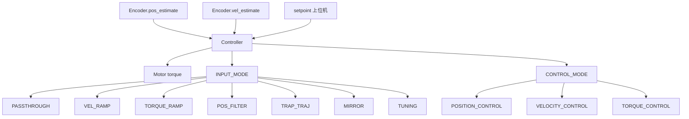
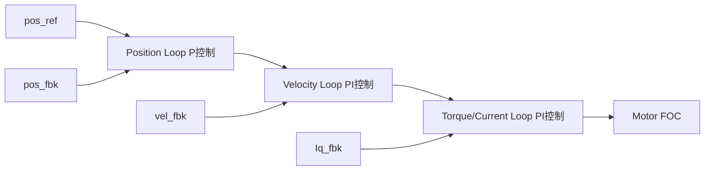

#  OD-03: 控制策略

---

| 属性 | 值 |
|------|-----|
| 文档编号 | OD-03 |
| 标题 | 控制策略 |
| 版本 | 1.0 |
| 作者 | 嵌入式系统架构师 |
| 创建日期 | 2026-05-26 |
| 适用平台 | ODrive V3.x (STM32F405RG) |
| 固件版本 | FW v0.5.x 系列 |
| 前置知识 | PID 控制, 运动规划, OD-01 系统架构 |

---

## 目录 (TOC)

1. [概述](#1-概述)
2. [原理推导](#2-原理推导)
3. [数学建模](#3-数学建模)
4. [代码实现](#4-代码实现)
5. [参数整定](#5-参数整定)
6. [硬件约束](#6-硬件约束)
7. [高级主题](#7-高级主题)
8. [文件索引](#8-文件索引)

---

## 1. 概述

ODrive 的控制器 (`controller.cpp`) 实现了完整的三环级联控制架构，支持多种输入模式和运动规划策略。控制器位于 Encoder/Motor 之间，接收位置/速度估计并输出转矩指令。

### 1.1 系统位置



### 1.2 控制级联



| 环 | 模式 | 输入 | 输出 | 典型带宽 |
|----|------|------|------|---------|
| 位置环 | P | pos_error [turn] | vel_des [turn/s] | 1-20 Hz |
| 速度环 | PI | vel_error [turn/s] | torque [Nm] | 20-100 Hz |
| 转矩/电流环 | FOC PI | I_error [A] | Vd,Vq [V] | 100-1000 Hz |

---

## 2. 原理推导

### 2.1 位置控制 (P 控制器)

位置环采用纯比例控制，输出速度期望：

$$v_{des} = v_{set} + K_p^{pos} \cdot (pos_{set} - pos_{est})$$

其中：
- $K_p^{pos}$: 位置增益 [(turn/s) / turn]，默认 20.0
- $pos_{set}$: 位置给定 [turn]
- $pos_{est}$: 位置估计 [turn]

**环形设定点 (Circular Setpoints):** 当 `circular_setpoints=true` 时，位置误差经过 wrap 处理：

$$\Delta pos = \text{wrap}_{\pm range}(pos_{set} - pos_{est})$$

这适用于旋转轴场景，避免 0→1 turn 的跳变。

### 2.2 增益调度 (Gain Scheduling)

V 形增益调度基于位置误差：

$$K_v^{eff} = K_v \cdot \min\left(\frac{|pos_{err}|}{W}, 1\right)$$

其中 $W$ 为增益调度宽度 (`gain_scheduling_width`)。当位置误差 ≤ W 时，增益线性降低，实现软着陆 (soft landing)，减少超调和振荡。

### 2.3 速度控制 (PI 控制器 + Anti-windup)

速度环采用 PI 控制器：

$$\tau = \tau_{set} + K_v^{eff} \cdot (v_{des} - v_{est}) + \tau_{int} + \tau_{cogging}$$

其中：
- $\tau_{set}$: 前馈转矩（由输入模式产生）[Nm]
- $\tau_{int}$: 速度积分项 [Nm]
- $\tau_{cogging}$: 齿槽转矩补偿 [Nm]

**积分项更新 (条件 anti-windup):**

$$\tau_{int}[k] = \tau_{int}[k-1] + K_i^{vel} \cdot K_v^{eff} / K_v \cdot T_s \cdot v_{err}[k]$$

$$\tau_{int} = \text{clamp}(\tau_{int}, -\tau_{int\_lim}, \tau_{int\_lim})$$

积分项仅在转矩未饱和时更新（隐含条件），并受 `vel_integrator_limit` 限制。

### 2.4 速度限幅

期望速度受限：

$$v_{des} = \text{clamp}(v_{des}, -v_{lim}, v_{lim})$$

- **超速检测：**

若 $|v_{est}| > v_{lim\_tol} \cdot v_{lim}$，触发 `ERROR_OVERSPEED`。

### 2.5 转矩模式下的速度限幅

在纯转矩控制模式下（CONTROL_MODE_TORQUE_CONTROL），可选速度限幅：

$$\tau_{max} = (v_{lim} - v_{est}) \cdot K_v$$

$$\tau_{min} = (-v_{lim} - v_{est}) \cdot K_v$$

$$\tau = \text{clamp}(\tau, \tau_{min}, \tau_{max})$$

---

## 3. 数学建模

### 3.1 二阶位置滤波器 (POS_FILTER)

二阶临界阻尼位置跟踪滤波器，频率响应由 `input_filter_bandwidth` 决定：

$$\dot{p} = v$$

$$\dot{v} = K_{kp} \cdot (p_{ref} - p) + K_{ki} \cdot (v_{ref} - v)$$

其中：

$$K_{ki} = 2 \cdot \omega_n$$

$$K_{kp} = 0.25 \cdot K_{ki}^2$$

截止频率 $\omega_n = \min(\text{input\_filter\_bandwidth}, 0.25 \cdot f_{ctrl})$。

### 3.2 梯形速度轨迹

三段式 (加速/匀速/减速) 速度规划：

```text
  vel
  ▲
  │     ┌─────────┐
  │    ╱           ╲
  │   ╱             ╲
  │  ╱               ╲
  │ ╱                 ╲
  └─┴──────────────────┴── time
   ↑  ↑         ↑       ↑
   t0 t1       t2      t3
  加速段      匀速段   减速段
```

轨迹由 `trapTraj.hpp` 的 `planTrapezoidal()` 生成，`eval(t)` 返回位置、速度、加速度。

### 3.3 齿槽转矩补偿 (Anti-Cogging)

3600点补偿图谱：

$$\tau_{cogging}(pos) = \text{cogging\_map}\left[\left\lfloor \frac{pos}{ratio} \right\rfloor \bmod 3600\right]$$

- **非阻塞标定流程：**

1. 逐点移动 (index 0 → 3599)
2. 等待位置误差 < `calib_pos_threshold` / CPR
3. 等待速度误差 < `calib_vel_threshold` / CPR
4. 采样当前速度积分转矩 `vel_integrator_torque_`
5. 完成后去偏置 (减去均值)

### 3.4 Spinout 检测

基于功率异常检测电机失步：

**机械功率** (一阶低通滤波)：

$$P_{mech}[k] = P_{mech}[k-1] + T_s \cdot BW_{mech} \cdot (v_{est} \cdot \tau - P_{mech}[k-1])$$

**电气功率** (一阶低通滤波)：

$$P_{elec}[k] = P_{elec}[k-1] + T_s \cdot BW_{elec} \cdot (P_{motor\_elec} - P_{elec}[k-1])$$

若 $P_{mech} > P_{mech\_thresh}$ 或 $P_{elec} > P_{elec\_thresh}$，触发 `ERROR_SPINOUT_DETECTED`。

典型 spinout 场景：机械功率为正（速度×转矩为正，能量输出），但电机实际在堵转或失步状态，功率异常飙升。

---

## 4. 代码实现

### 4.1 Controller::update() 主循环

`controller.cpp` 是控制器的核心，每个控制周期执行一次。

- **执行顺序：**

```text
1. 读取所有 InputPort (pos_estimate, vel_estimate, pos_wrap)
2. Step/Dir → 更新 input_pos_
3. Anti-cogging 标定 (如启用)
4. Circular setpoint → wrap input_pos_
5. INPUT_MODE 处理 → 生成 pos/vel/torque setpoint
6. 速度限幅
7. 转矩限幅 (max_available_torque)
8. 位置控制 (P + Gain Scheduling)
9. 速度限幅
10. 超速检测
11. ACIM 增益调度
12. Anti-cogging 前馈
13. 速度控制 (PI)
14. 转矩模式速度限幅
15. 转矩钳制
16. 速度积分器更新 (anti-windup)
17. Spinout 检测
18. torque_output_ = torque (OutputPort)
```

### 4.2 输入模式实现

#### PASSTHROUGH (直接透传)

```cpp
case INPUT_MODE_PASSTHROUGH: {
    pos_setpoint_ = input_pos_;
    vel_setpoint_ = input_vel_;
    torque_setpoint_ = input_torque_; 
} break;
```

#### VEL_RAMP (速度斜坡)

```cpp
case INPUT_MODE_VEL_RAMP: {
    float max_step_size = std::abs(current_meas_period * config_.vel_ramp_rate);
    float full_step = input_vel_ - vel_setpoint_;
    float step = std::clamp(full_step, -max_step_size, max_step_size);
    vel_setpoint_ += step;
    torque_setpoint_ = (step / current_meas_period) * config_.inertia;
} break;
```

`vel_ramp_rate` [(turn/s)/s] 控制速度变化率，产生平滑的加速度过渡。惯性前馈 `torque_setpoint_ = accel * inertia` 减少速度跟踪误差。

#### TORQUE_RAMP (转矩斜坡)

```cpp
case INPUT_MODE_TORQUE_RAMP: {
    float max_step_size = std::abs(current_meas_period * config_.torque_ramp_rate);
    float full_step = input_torque_ - torque_setpoint_;
    float step = std::clamp(full_step, -max_step_size, max_step_size);
    torque_setpoint_ += step;
} break;
```

#### POS_FILTER (二阶位置滤波器)

```cpp
case INPUT_MODE_POS_FILTER: {
    float delta_pos = input_pos_ - pos_setpoint_;
    if (config_.circular_setpoints) {
        delta_pos = wrap_pm(delta_pos, *pos_wrap);
    }
    float delta_vel = input_vel_ - vel_setpoint_;
    float accel = input_filter_kp_*delta_pos + input_filter_ki_*delta_vel;
    torque_setpoint_ = accel * config_.inertia;
    vel_setpoint_ += current_meas_period * accel;
    pos_setpoint_ += current_meas_period * vel_setpoint_;
} break;
```

#### MIRROR (镜像模式)

```cpp
case INPUT_MODE_MIRROR: {
    if (config_.axis_to_mirror < AXIS_COUNT) {
        auto& other = axes[config_.axis_to_mirror];
        pos_setpoint_ = *other.encoder_.pos_estimate_.present() * config_.mirror_ratio;
        vel_setpoint_ = *other.encoder_.vel_estimate_.present() * config_.mirror_ratio;
        torque_setpoint_ = *other.controller_.torque_output_.present() * config_.torque_mirror_ratio;
    }
} break;
```

镜像模式用于双轴协同运动，如 CNC XY 平台、多轴机器人等。

#### TRAP_TRAJ (梯形轨迹)

```cpp
case INPUT_MODE_TRAP_TRAJ: {
    if(input_pos_updated_){
        move_to_pos(input_pos_);
        input_pos_updated_ = false;
    }
    if (trajectory_done_) break;

    if (axis_->trap_traj_.t_ > axis_->trap_traj_.Tf_) {
        config_.control_mode = CONTROL_MODE_POSITION_CONTROL;
        pos_setpoint_ = axis_->trap_traj_.Xf_;
        trajectory_done_ = true;
    } else {
        TrapezoidalTrajectory::Step_t traj_step = axis_->trap_traj_.eval(axis_->trap_traj_.t_);
        pos_setpoint_ = traj_step.Y;
        vel_setpoint_ = traj_step.Yd;
        torque_setpoint_ = traj_step.Ydd * config_.inertia;
        axis_->trap_traj_.t_ += current_meas_period;
    }
} break;
```

#### TUNING (调谐模式)

```cpp
case INPUT_MODE_TUNING: {
    autotuning_phase_ = wrap_pm_pi(autotuning_phase_ + 
        (2.0f * M_PI * autotuning_.frequency * current_meas_period));
    float s = our_arm_sin_f32(autotuning_phase_);
    float c = our_arm_cos_f32(autotuning_phase_);
    pos_setpoint_ = input_pos_ + autotuning_.pos_amplitude * s;
    vel_setpoint_ = input_vel_ + autotuning_.vel_amplitude * c;
    torque_setpoint_ = input_torque_ + autotuning_.torque_amplitude * -s;
} break;
```

用于频率响应分析和系统辨识，可独立注入位置/速度/转矩正弦激励。

### 4.3 位置控制代码

```cpp
if (config_.control_mode >= CONTROL_MODE_POSITION_CONTROL) {
    float pos_err = pos_setpoint_ - *pos_estimate;
    if (config_.circular_setpoints)
        pos_err = wrap_pm(pos_err, *pos_wrap);
    vel_des += config_.pos_gain * pos_err;
    // V-shaped gain scheduling
    if (config_.enable_gain_scheduling && 
        std::abs(pos_err) <= config_.gain_scheduling_width) {
        gain_scheduling_multiplier = std::abs(pos_err) / config_.gain_scheduling_width;
    }
}
```

### 4.4 速度控制代码

```cpp
if (config_.control_mode >= CONTROL_MODE_VELOCITY_CONTROL) {
    v_err = vel_des - *vel_estimate;
    torque += (vel_gain * gain_scheduling_multiplier) * v_err;
    torque += vel_integrator_torque_;
}
```

### 4.5 Anti-cogging 前馈

```cpp
if (anticogging_valid_ && config_.anticogging.anticogging_enabled) {
    float anticogging_pos = *anticogging_pos_estimate / axis_->encoder_.getCoggingRatio();
    torque += config_.anticogging.cogging_map[
        std::clamp(mod((int)anticogging_pos, 3600), 0, 3600)];
}
```

### 4.6 Spinout 检测代码

```cpp
mechanical_power_ += current_meas_period * config_.mechanical_power_bandwidth 
    * ((*vel_estimate) * torque - mechanical_power_);
electrical_power_ += current_meas_period * config_.electrical_power_bandwidth 
    * (axis_->motor_.electrical_power() - electrical_power_);

if (config_.spinout_mechanical_power_threshold > 0.0f && 
    mechanical_power_ > config_.spinout_mechanical_power_threshold) {
    set_error(ERROR_SPINOUT_DETECTED);
    return false;
}
if (config_.spinout_electrical_power_threshold > 0.0f && 
    electrical_power_ > config_.spinout_electrical_power_threshold) {
    set_error(ERROR_SPINOUT_DETECTED);
    return false;
}
```

---

## 5. 参数整定

### 5.1 位置环整定

| 参数 | 默认值 | 含义 | 整定建议 |
|------|--------|------|---------|
| `pos_gain` | 20.0 | 位置比例增益 [(turn/s)/turn] | 从小开始，逐步增大直到出现振荡，然后取 0.5-0.7 倍 |
| `vel_limit` | 2.0 | 速度限制 [turn/s] | 根据电机额定速度和机械需求设置 |
| `vel_limit_tolerance` | 1.2 | 超速容差倍率 | 默认 1.2 即可 |

**经验法则 (PMSM/BLDC):**
- 高惯量负载: `pos_gain = 5~15`
- 低惯量负载: `pos_gain = 20~50`
- 高速应用: `pos_gain = 10~30`

### 5.2 速度环整定

| 参数 | 默认值 | 含义 | 整定建议 |
|------|--------|------|---------|
| `vel_gain` | 1.0/6.0 ≈ 0.167 | 速度比例增益 [Nm/(turn/s)] | 根据电机转矩常数和惯性调整 |
| `vel_integrator_gain` | 2.0/6.0 ≈ 0.333 | 速度积分增益 [Nm/(turn/s·s)] | 通常为 vel_gain 的 2 倍 |
| `vel_integrator_limit` | INFINITY | 积分限幅 [Nm] | 设为电机额定转矩的 20-50% |
| `inertia` | 0.0 | 负载惯量 [Nm/(turn/s²)] | 影响前馈精度 |

- **速度环整定流程：**
1. 设置 `vel_gain = 0.05`，`vel_integrator_gain = 0.1`
2. 逐步增大 vel_gain 直到速度跟踪良好但无振荡
3. 设置 vel_integrator_gain = 2 × vel_gain
4. 设置 vel_integrator_limit = 0.3 × 电机额定转矩
5. 如使用前馈，测量或估算 inertia 值

### 5.3 增益调度整定

| 参数 | 默认值 | 含义 |
|------|--------|------|
| `enable_gain_scheduling` | false | 启用 V 形增益调度 |
| `gain_scheduling_width` | 10.0 | 调度宽度 [turn] |

```text
  Effective Gain
  1.0 ┤                    ┌────────
      │                   ╱
      │                  ╱
  0.5 ┤                 ╱
      │                ╱
      │               ╱
    0 ┤──────────────┴─────────── |pos_err|
      0            W              2W
```

在增益调度宽度内，增益从 0 线性增加到满增益，实现平滑接近目标。

### 5.4 输入滤波器整定

| 参数 | 默认值 | 含义 |
|------|--------|------|
| `input_filter_bandwidth` | 2.0 | 二阶滤波器带宽 [1/s] |

滤波增益自动计算为临界阻尼：

$$K_{ki} = 2 \cdot \min(BW, 0.25 \cdot f_{ctrl})$$

$$K_{kp} = 0.25 \cdot K_{ki}^2$$

### 5.5 Spinout 检测整定

| 参数 | 默认值 | 含义 |
|------|--------|------|
| `spinout_mechanical_power_threshold` | 10.0 | 机械功率阈值 [W] |
| `spinout_electrical_power_threshold` | -10.0 | 电气功率阈值 [W] (负值禁用) |
| `mechanical_power_bandwidth` | 20.0 | 机械功率滤波器带宽 [rad/s] |
| `electrical_power_bandwidth` | 20.0 | 电气功率滤波器带宽 [rad/s] |

---

## 6. 硬件约束

### 6.1 转矩限幅

Controller 通过 `axis->motor_.max_available_torque()` 获取最大可用转矩 `motor.cpp`：

```cpp
float Motor::max_available_torque() {
    if (config_.motor_type == Motor::MOTOR_TYPE_ACIM) {
        float max_torque = effective_current_lim_ * config_.torque_constant 
            * axis_->acim_estimator_.rotor_flux_;
        return std::clamp(max_torque, 0.0f, config_.torque_lim);
    } else {
        float max_torque = effective_current_lim_ * config_.torque_constant;
        return std::clamp(max_torque, 0.0f, config_.torque_lim);
    }
}
```

其中 `effective_current_lim_` 由热敏电阻保护动态调整 `motor.cpp`。

### 6.2 Step/Dir 接口

硬件脉冲输入通过 GPIO 边沿中断处理 `axis.cpp`：

```cpp
void Axis::step_cb() {
    if (step_dir_active_) {
        dir_gpio_.read() ? ++steps_ : --steps_;
        controller_.input_pos_updated();
    }
}
```

Steps 向位置转换：

```cpp
if (config_.circular_setpoints) {
    input_pos_ = (float)(axis_->steps_ % config_.steps_per_circular_range) 
        * (*pos_wrap / (float)(config_.steps_per_circular_range));
} else {
    input_pos_ = (float)(axis_->steps_) / (float)(config_.steps_per_circular_range);
}
```

### 6.3 控制频率

Controller 运行在 `current_meas_hz` 频率下（与电流采样频率相同，通常 8kHz（可配置范围 1k~24kHz，由 PWM 频率和控制周期分频比决定））。控制周期 $T_s = 1 / \text{current\_meas\_hz}$。

---

## 7. 高级主题

### 7.1 Homing 归零

`axis.cpp`：

- **流程：**

1. 进入速度控制模式，以 `homing_speed` 向 min_endstop 驱动
2. 检测到 min_endstop 上升沿 → 停止
3. 切换到梯形轨迹模式，向 `endstop_offset` 位置移动
4. 设置当前位置为零点，`homing_.is_homed = true`

```cpp
bool Axis::run_homing() {
    controller_.input_vel_ = -controller_.config_.homing_speed;
    start_closed_loop_control();
    // 驱动直到限位
    while (!(done = min_endstop_.get_state())) { osDelay(1); }
    stop_closed_loop_control();
    // 移动到 offset 位置
    controller_.input_pos_ = pos_estimate + min_endstop_.config_.offset;
    start_closed_loop_control();
    while (!(done = controller_.trajectory_done_)) { osDelay(1); }
    // 设置零点
    homing_.is_homed = true;
}
```

### 7.2 Lockin Spin

开环电流注入强制旋转 `axis.cpp`：

```cpp
bool Axis::run_lockin_spin(const LockinConfig_t &lockin_config, bool remain_armed, 
        std::function<bool(bool)> loop_cb) {
    // 配置 OpenLoopController 参数
    open_loop_controller_.target_current_ = lockin_config.current;
    open_loop_controller_.target_vel_ = lockin_config.vel;
    // 连接数据路径
    motor_.current_control_.phase_src_.connect_to(&open_loop_controller_.phase_);
    motor_.arm(&motor_.current_control_);
    // 等待终止条件
    while (...) {
        if (terminal_condition) { success = true; break; }
        osDelay(1);
    }
}
```

Lockin spin 用于：
- 电机校准前确定相位
- 编码器索引搜索
- 无传感器启动前的初始加速
- Hall 传感器校准

### 7.3 ACIM 增益调度

异步电机转矩 = 转矩常数 × 磁通 × Iq，因此速度增益需随磁通调整 `controller.cpp`：

```cpp
if (axis_->motor_.config_.motor_type == Motor::MOTOR_TYPE_ACIM) {
    float effective_flux = axis_->acim_estimator_.rotor_flux_;
    float minflux = axis_->motor_.config_.acim_gain_min_flux;
    if (std::abs(effective_flux) < minflux)
        effective_flux = std::copysignf(minflux, effective_flux);
    vel_gain /= effective_flux;
    vel_integrator_gain /= effective_flux;
}
```

### 7.4 Anti-cogging 去偏置

标定完成后去除均值 `controller.cpp`：

```cpp
float Controller::remove_anticogging_bias() {
    auto& cogmap = config_.anticogging.cogging_map;
    auto sum = std::accumulate(std::begin(cogmap), std::end(cogmap), 0.0f);
    auto average = sum / std::size(cogmap);
    for(auto& val : cogmap) {
        val -= average;
    }
    return average;
}
```

去偏置确保补偿表不产生恒定转矩偏置。

### 7.5 双轴 Mirror 同步

Mirror 模式实现主从轴伺服同步，从轴跟踪主轴的位置/速度/转矩：

- `mirror_ratio`: 位置/速度缩放比
- `torque_mirror_ratio`: 转矩跟随比（通常为 0，仅位置/速度同步）

---

## 8. 文件索引

| 文件 | 关键内容 | 说明 |
|------|---------|------|
| `controller.cpp` | `update()`, 全部输入模式, Anti-cogging, Spinout | 控制器核心实现 |
| `controller.hpp` | Config_t, ControlMode, InputMode, Autotuning_t | 控制器接口与配置 |
| `axis.cpp` | `run_lockin_spin()`, `run_homing()`, `start_closed_loop_control()` | 轴级操作与状态机 |
| `axis.hpp` | LockinConfig_t, step/dir 接口 | 轴配置 |
| `trapTraj.hpp` | planTrapezoidal(), eval() | 梯形速度轨迹 |
| `endstop.cpp` | Endstop 检测 | 限位开关 |
| `mechanical_brake.cpp` | release() | 机械刹车控制 |
| `open_loop_controller.hpp` | OpenLoopController | 开环控制器 |
| `motor.hpp` | max_available_torque, effective_current_lim | 转矩/电流限幅 |
| `motor.cpp` | Motor::update() → Idq/Vdq 计算 | 转矩→电流转换 |

---

> **相关文档**:
> - [OD-01: 系统架构](OD-01-Architecture.md) — 组件关系与线程模型
> - [OD-02: FOC 核心算法](OD-02-FOC-Core.md) — 电流环实现细节
> - [OD-04: 编码器与无传感器](OD-04-Encoder-Sensorless.md) — 位置反馈与无感估算
