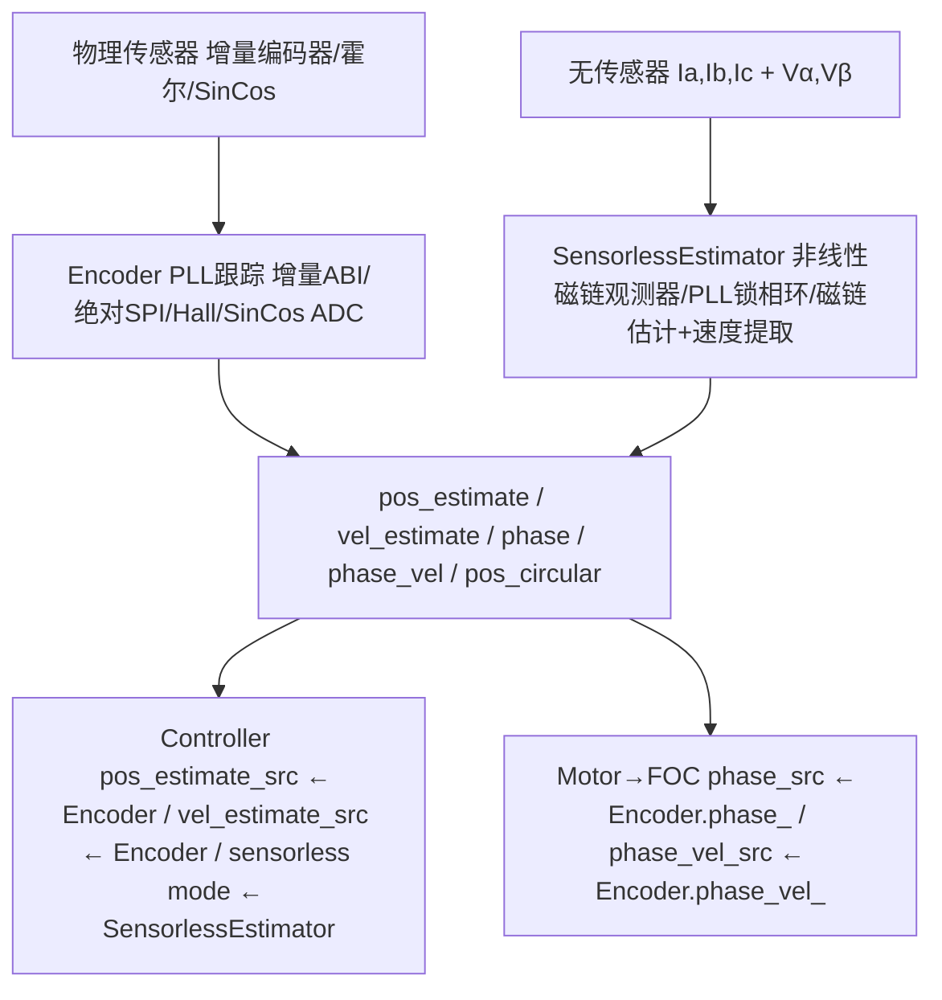
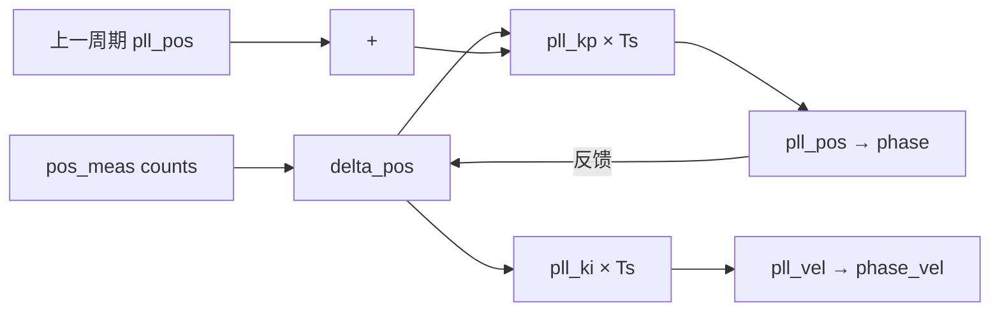

#  OD-04: 编码器与无传感器估算

---

| 属性 | 值 |
|------|-----|
| 文档编号 | OD-04 |
| 标题 | 编码器与无传感器估算 |
| 版本 | 1.0 |
| 作者 | 嵌入式系统架构师 |
| 创建日期 | 2026-05-26 |
| 适用平台 | ODrive V3.x (STM32F405RG) |
| 固件版本 | FW v0.5.x 系列 |
| 前置知识 | 编码器基础, PLL 锁相环, 磁链观测器 |

---

## 目录 (TOC)

1. [概述](#1-概述)
2. [原理推导](#2-原理推导)
3. [数学建模](#3-数学建模)
4. [代码实现](#4-代码实现)
5. [参数整定](#5-参数整定)
6. [硬件约束](#6-硬件约束)
7. [高级主题](#7-高级主题)
8. [文件索引](#8-文件索引)

---

## 1. 概述

ODrive 提供多种电机位置/速度反馈方案，支持有传感器和无传感器两种模式。编码器层（Encoder）实现于 `encoder.cpp`，无传感器估算器（SensorlessEstimator）实现于 `sensorless_estimator.cpp`。

### 1.1 位置反馈系统架构



### 1.2 编码器模式

| 模式 | 常量 | 接口 | 精度 | 绝对值 |
|------|------|------|------|:---:|
| MODE_INCREMENTAL | 0 | TIM 编码器模式 (ABI) | CPR×4 (如2048×4=8192) |  |
| MODE_HALL | 1 | 3× GPIO (Hall A/B/C) | 6 步/电周期 |  |
| MODE_SINCOS | 2 | 2× GPIO ADC (Sin/Cos) | ADC 分辨率 12bit |  |
| MODE_SPI_ABS_CUI | 0x100 | SPI (CUI协议) | 取决于传感器 |  |
| MODE_SPI_ABS_AMS | 0x101 | SPI (AMS协议, AS5047) | 14bit |  |
| MODE_SPI_ABS_AEAT | 0x102 | SPI (AEAT协议) | 取决于传感器 |  |
| MODE_SPI_ABS_RLS | 0x103 | SPI (RLS协议) | 取决于传感器 |  |
| MODE_SPI_ABS_MA732 | 0x104 | SPI (MA732协议) | 取决于传感器 |  |

`MODE_FLAG_ABS = 0x100` 位区分增量式与绝对式编码器。

---

## 2. 原理推导

### 2.1 增量编码器 PLL 跟踪

增量编码器产生正交脉冲 A/B，通过 STM32 的 TIM 编码器模式实现 4 倍频计数。PLL 用于从位置计数中提取速度和相位的连续值，实现平滑的插值。

### 2.2 编码器 PLL 模型

PLL 结构：



- **离散时间 PLL 方程：**

$$pll\_vel[k] = pll\_vel[k-1] + K_i \cdot T_s \cdot \Delta pos[k]$$

$$pll\_pos[k] = pll\_pos[k-1] + T_s \cdot pll\_vel[k-1] + K_p \cdot T_s \cdot \Delta pos[k]$$

其中：
- $\Delta pos = pos\_meas - pll\_pos$ (位置误差, 带 CPR 模运算)
- $K_p = 2 \cdot \omega_n$ (比例增益)
- $K_i = 0.25 \cdot K_p^2$ (积分增益, 临界阻尼)
- $\omega_n$ = `config_.bandwidth` (PLL 带宽 [rad/s])
- $T_s$ = `current_meas_period`

### 2.3 相位插值 (Phase Interpolation)

当 `enable_phase_interpolation = true` 时，基于增量计数的分数部分进行插值：

$$phase = \frac{pll\_pos + interpolation \times 0.25}{CPR} \times 2\pi + phase\_offset\_float$$

`interpolation` 由增量步长累积而来，限幅在 ±2.0 范围（相当于 ±0.5 个编码器步）。

插值使得电角度更新分辨率远超编码器物理分辨率，减少 FOC 角度量化噪声。

### 2.4 无传感器非线性磁链观测器

基于论文：*"Sensorless Control of Surface-Mount Permanent-Magnet Synchronous Motors Based on a Nonlinear Observer"* (Lee, Hong, Nam, Ortega, Praly, Astolfi, 2010)。

- **核心思想：** 从电压和电流中估算永磁体磁链的 αβ 分量，从磁链角度提取转子位置。

### 2.5 磁链观测器推导

- **电机电压方程 (αβ坐标系)：**

$$V_{\alpha\beta} = R_s I_{\alpha\beta} + L_s \frac{dI_{\alpha\beta}}{dt} + \frac{d\psi_{\alpha\beta}}{dt}$$

其中 $\psi_{\alpha\beta}$ 是永磁体磁链在 αβ 坐标系的分量：

$$\psi_\alpha = \psi_{PM} \cos\theta_e, \quad \psi_\beta = \psi_{PM} \sin\theta_e$$

- **总磁链驱动电压：**

$$y_{\alpha\beta} = V_{\alpha\beta} - R_s I_{\alpha\beta}$$

- **观测器结构：**

定义状态变量 $x_{\alpha\beta}$ = 总磁链 (定子磁链 + 永磁体磁链)：

$$\eta_{\alpha\beta} = x_{\alpha\beta} - L_s I_{\alpha\beta}$$

其中 $\eta_{\alpha\beta}$ 为估计的永磁体磁链。

- **非线性观测器 (eqn 8 of the paper)：**

$$\dot{x}_{\alpha\beta} = y_{\alpha\beta} + \frac{\gamma}{2} \cdot \frac{\psi_{PM}^2 - \|\eta\|^2}{\psi_{PM}^2} \cdot \eta_{\alpha\beta}$$

其中 $\gamma$ = `observer_gain`，$\psi_{PM}$ = `pm_flux_linkage`。

### 2.6 角度与速度提取 (PLL)

从估计的磁链 $\eta_{\alpha\beta}$ 中提取角度：

$$\theta_{obs} = \text{atan2}(\eta_\beta, \eta_\alpha)$$

PLL 跟踪观测角度：

$$\Delta\theta = \text{wrap}_{\pm\pi}(\theta_{obs} - \theta_{pll})$$

$$\theta_{pll} = \theta_{pll} + T_s \cdot \omega_{pll} + K_p^{pll} \cdot T_s \cdot \Delta\theta$$

$$\omega_{pll} = \omega_{pll} + K_i^{pll} \cdot T_s \cdot \Delta\theta$$

### 2.7 霍尔传感器模型

3 路霍尔传感器在 120° 电角度间隔下产生 6 种有效状态：

```text
        Hall 状态序列 (120° 分布)
  状态  C B A   电角度范围
  ──────────────────────────
  5     1 0 1   0°   - 60°
  4     1 0 0   60°  - 120°
  6     1 1 0   120° - 180°
  2     0 1 0   180° - 240°
  3     0 1 1   240° - 300°
  1     0 0 1   300° - 360°
```

ODrive 支持 60° 安装的霍尔传感器，通过极性校准 `hall_polarity` 翻转某个传感器的极性将其转换为 120° 等效。

---

## 3. 数学建模

### 3.1 编码器偏移校准模型

- **校准原理：** 施加已知电角度旋转（开环），测量编码器实际移动量，计算电角度与编码器计数的对应关系。

- **关键公式：**

$$elec\_rad\_per\_enc = pole\_pairs \times 2\pi / CPR$$

$$expected\_encoder\_delta = calib\_scan\_distance / elec\_rad\_per\_enc$$

$$phase\_offset = expected\_phase - mean\_enc\_delta \times elec\_rad\_per\_enc$$

$$config.phase\_offset = \text{round}(phase\_offset / elec\_rad\_per\_enc)$$

### 3.2 编码器方向检测

通过 Lockin spin 比较编码器计数方向与电机旋转方向：

```cpp
if (shadow_count_ > init_enc_val + 8) {
    config_.direction = 1;   // 同向
} else if (shadow_count_ < init_enc_val - 8) {
    config_.direction = -1;  // 反向
} else {
    config_.direction = 0;   // 无响应
}
```

### 3.3 编码器 PLL 稳定性条件

PLL 是离散系统，稳定条件为：

$$K_p \cdot T_s < 1.0$$

即 $2 \cdot bandwidth \cdot T_s < 1.0$，$bandwidth < \frac{1}{2T_s}$。

对于 8kHz 控制频率 ($T_s = 125\mu s$)，理论最大稳定带宽为 4000 rad/s。ODrive 在 `update_pll_gains()` 中验证此条件 `encoder.cpp`。

### 3.4 无感观测器离散时间实现

**Step 1: Clarke 变换 (与 FOC 相同)**

$$I_\alpha = I_a, \quad I_\beta = \frac{1}{\sqrt{3}}(I_b - I_c)$$

**Step 2: 磁链预测 (基于电压模型)**

$$\text{for } i \in \{\alpha,\beta\}:$$

$$y = -R_s \cdot I[i] + V\_memory[i]$$

$$\dot{x}_{pred} = y$$

$$x[i] \mathrel{+}= \dot{x}_{pred} \cdot T_s$$

$$\eta[i] = x[i] - L_s \cdot I[i]$$

**Step 3: 观测器反馈**

$$\text{est\_pm\_flux\_sqr} = \eta_\alpha^2 + \eta_\beta^2$$

$$\text{eta\_factor} = \frac{1}{2} \cdot \frac{\gamma}{\psi_{PM}^2} \cdot (\psi_{PM}^2 - \text{est\_pm\_flux\_sqr})$$

$$\text{for } i \in \{\alpha,\beta\}:$$

$$\dot{x}_{obs} = \text{eta\_factor} \cdot \eta[i]$$

$$x[i] \mathrel{+}= \dot{x}_{obs} \cdot T_s$$

$$\eta[i] = x[i] - L_s \cdot I[i]$$

**Step 4: 存储电压用于下周期**

$$V\_memory[\alpha] = V_\alpha^{final}$$

$$V\_memory[\beta] = V_\beta^{final}$$

**Step 5: PLL 角度/速度跟踪** (与编码器 PLL 相同结构)

---

## 4. 代码实现

### 4.1 编码器构造函数

`encoder.cpp`：

```cpp
Encoder::Encoder(TIM_HandleTypeDef* timer, Stm32Gpio index_gpio,
                 Stm32Gpio hallA_gpio, Stm32Gpio hallB_gpio, Stm32Gpio hallC_gpio,
                 Stm32SpiArbiter* spi_arbiter) :
        timer_(timer), index_gpio_(index_gpio),
        hallA_gpio_(hallA_gpio), hallB_gpio_(hallB_gpio), hallC_gpio_(hallC_gpio),
        spi_arbiter_(spi_arbiter)
{ }
```

### 4.2 增量编码器位置更新

`encoder.cpp`：

```cpp
bool Encoder::update() {
    if (mode_ == MODE_INCREMENTAL || mode_ == MODE_HALL) {
        int16_t tim_cnt = (int16_t)(int32_t)timer_->Instance->CNT;
        int32_t delta_cnt = tim_cnt - tim_cnt_sample_;
        tim_cnt_sample_ = tim_cnt;

        int32_t corrected_cnt;
        if (config_.direction == 1) {
            corrected_cnt = delta_cnt;
        } else if (config_.direction == -1) {
            corrected_cnt = -delta_cnt;
        } else {
            return true;  // 方向未确定,跳过
        }

        shadow_count_ += corrected_cnt;
        pos_estimate_counts_ += corrected_cnt;
        count_in_cpr_ = mod(count_in_cpr_ + corrected_cnt, config_.cpr);
    }

    // 相位插值
    float delta_pos = pos_estimate_counts_ - pos_estimate_counts_prev_;
    if (config_.enable_phase_interpolation) {
        interpolation_ += delta_pos;
        if (std::abs(interpolation_) > 0.5f * 4.0f) {
            interpolation_ = 0.0f;
        }
    }

    // PLL 跟踪
    float pll_pos = pos_cpr_counts_ + interpolation_ * 0.25f;
    delta_pos_cpr_counts_ = pll_pos - pll_pos_;
    pll_pos_ += current_meas_period * pll_vel_;
    pll_vel_ += current_meas_period * pll_ki_ * delta_pos_cpr_counts_;
    pll_pos_ += current_meas_period * pll_kp_ * delta_pos_cpr_counts_;

    // 输出
    float phase = (pll_pos_ * 2.0f * M_PI / (float)config_.cpr + config_.phase_offset_float);
    phase = wrap_pm_pi(phase);
    float phase_vel = pll_vel_ * 2.0f * M_PI / (float)config_.cpr;
    phase_ = phase;
    phase_vel_ = phase_vel;
    pos_estimate_ = (pos_estimate_counts_ / (float)config_.cpr) * config_.direction;
    vel_estimate_ = phase_vel / (2.0f * M_PI);
}
```

### 4.3 编码器偏移校准

`encoder.cpp`：

```cpp
bool Encoder::run_offset_calibration() {
    // Step 1: 锁定电机 (1秒)
    // 设置 OpenLoopController 参数
    axis_->open_loop_controller_.target_current_ = calibration_current;
    axis_->open_loop_controller_.phase_ = -calib_scan_distance / 2.0f;
    axis_->motor_.arm(&axis_->motor_.current_control_);

    osDelay(start_lock_duration * 1000);

    // Step 2: 开环旋转
    axis_->open_loop_controller_.target_vel_ = calib_scan_omega;
    int32_t init_enc_val = shadow_count_;
    int64_t encvaluesum = 0;
    int num_steps = 0;

    while (total_distance < calib_scan_distance) {
        encvaluesum += shadow_count_;
        num_steps++;
        osDelay(1);
    }

    // Step 3: 方向检测
    if (shadow_count_ > init_enc_val + 8)
        config_.direction = 1;
    else if (shadow_count_ < init_enc_val - 8)
        config_.direction = -1;

    // Step 4: 计算偏置
    float elec_rad_per_enc = pole_pairs * 2 * M_PI / CPR;
    float mean_enc_delta = (encvaluesum - init_enc_val * num_steps) / num_steps;
    float calib_enc_angle = mean_enc_delta * elec_rad_per_enc;
    config_.phase_offset = round((calib_scan_distance - calib_enc_angle) / elec_rad_per_enc);

    is_ready_ = true;
    motor_.disarm();
    return true;
}
```

### 4.4 编码器索引搜索

`encoder.cpp`：

```cpp
bool Encoder::run_index_search() {
    config_.use_index = true;
    index_found_ = false;
    set_idx_subscribe();
    bool success = axis_->run_lockin_spin(axis_->config_.calibration_lockin, false);
    return success;
}
```

索引引脚中断回调 `encoder.cpp`：

```cpp
void Encoder::enc_index_cb() {
    if (config_.use_index) {
        set_circular_count(0, false);
        if (config_.use_index_offset)
            set_linear_count((int32_t)(config_.index_offset * config_.cpr));
        if (config_.pre_calibrated) {
            is_ready_ = true;
        } else {
            is_ready_ = false;  // 需重新校准偏移
        }
        index_found_ = true;
    }
    index_gpio_.unsubscribe();
}
```

### 4.5 无传感器估算器

`sensorless_estimator.cpp`：

```cpp
bool SensorlessEstimator::update() {
    // PLL gains (critically damped)
    float pll_kp = 2.0f * config_.pll_bandwidth;
    float pll_ki = 0.25f * (pll_kp * pll_kp);

    // Clarke transform
    float I_alpha_beta[2] = {
        current_meas->phA,
        one_by_sqrt3 * (current_meas->phB - current_meas->phC)
    };

    // Flux observer
    for (int i = 0; i <= 1; ++i) {
        // Flux-driving voltage
        float y = -axis_->motor_.config_.phase_resistance * I_alpha_beta[i] 
                + V_alpha_beta_memory_[i];
        // Prediction
        float x_dot = y;
        flux_state_[i] += x_dot * current_meas_period;
        // Estimated PM flux
        eta[i] = flux_state_[i] - axis_->motor_.config_.phase_inductance * I_alpha_beta[i];
    }

    // Nonlinear observer correction
    float pm_flux_sqr = config_.pm_flux_linkage * config_.pm_flux_linkage;
    float est_pm_flux_sqr = eta[0] * eta[0] + eta[1] * eta[1];
    float bandwidth_factor = 1.0f / pm_flux_sqr;
    float eta_factor = 0.5f * (config_.observer_gain * bandwidth_factor) 
                     * (pm_flux_sqr - est_pm_flux_sqr);

    for (int i = 0; i <= 1; ++i) {
        float x_dot = eta_factor * eta[i];
        flux_state_[i] += x_dot * current_meas_period;
        eta[i] = flux_state_[i] - axis_->motor_.config_.phase_inductance * I_alpha_beta[i];
    }

    // Store V_alpha_beta for next cycle
    V_alpha_beta_memory_[0] = axis_->motor_.current_control_.final_v_alpha_;
    V_alpha_beta_memory_[1] = axis_->motor_.current_control_.final_v_beta_;

    // PLL angle/speed tracking
    float phase_vel = phase_vel_.previous().value_or(0.0f);
    pll_pos_ = wrap_pm_pi(pll_pos_ + current_meas_period * phase_vel);
    float phase = fast_atan2(eta[1], eta[0]);
    float delta_phase = wrap_pm_pi(phase - pll_pos_);
    pll_pos_ = wrap_pm_pi(pll_pos_ + current_meas_period * pll_kp * delta_phase);
    phase_vel += current_meas_period * pll_ki * delta_phase;

    // Outputs
    phase_ = phase;
    phase_vel_ = phase_vel;
    vel_estimate_ = phase_vel / (pole_pairs * 2.0f * M_PI);
    return true;
}
```

### 4.6 霍尔传感器处理

**极性校准** `encoder.cpp`：

Lockin spin 期间采集所有霍尔状态，通过状态位图分析确定极性：

```cpp
// 120° 分布的 6 种有效状态
auto flip_detect = [](uint8_t states, unsigned int idx)->bool {
    return (~states & 0xFF) == (1<<(0+idx) | 1<<(7-idx));
};
```

**相位校准** `encoder.cpp`：

30 秒 Lockin spin，记录每次霍尔状态变化时的电角度，计算 6 个霍尔换相边界。

### 4.7 GPIO 同步采样

`encoder.cpp`：

```cpp
void Encoder::sample_now() {
    if (mode_ & MODE_FLAG_ABS) {
        if (!abs_spi_pos_updated_) {
            abs_spi_start_transaction();
        }
    }
    port_samples_[0] = GPIOA->IDR;
    port_samples_[1] = GPIOB->IDR;
    port_samples_[2] = GPIOC->IDR;
}
```

`sample_now()` 在 `ODrive::sampling_cb()` (高优先级中断) 中调用，一次性捕获所有 GPIO 端口状态，确保霍尔传感器状态的一致性。

---

## 5. 参数整定

### 5.1 增量编码器配置

| 参数 | 默认值 | 含义 | 整定建议 |
|------|--------|------|---------|
| `cpr` | 2048×4=8192 | 每转计数 (含4倍频) | 按编码器规格设置 |
| `bandwidth` | 1000.0 | PLL 带宽 [rad/s] | 100-2000, 越高响应越快但噪声越大 |
| `use_index` | false | 启用 Z 索引脉冲 | 需硬件连接 |
| `enable_phase_interpolation` | true | 启用相位插值 | 建议保持启用 |
| `phase_offset` | 0 | 电角度偏置 (整数) | 自动校准 |
| `phase_offset_float` | 0.0 | 电角度偏置 (浮点) | 用户微调 |
| `direction` | 0 | 编码器方向 (-1/0/1) | 自动检测 |

### 5.2 编码器 PLL 带宽整定

PLL 带宽决定了位置/速度估计的响应速度：

| 应用场景 | 带宽 [rad/s] | 说明 |
|---------|-------------|------|
| 高精度位置控制 | 200-500 | 噪声低，平滑 |
| 通用伺服 | 500-1000 | 平衡 |
| 高速应用 | 1000-2000 | 响应快 |
| 最高允许 | < 1/(2Ts) = 4000 | 理论稳定上限 |

**经验法则**：带宽设置为期望控制带宽的 5-10 倍。

### 5.3 无传感器估算器配置

| 参数 | 默认值 | 含义 | 整定建议 |
|------|--------|------|---------|
| `observer_gain` | 1000.0 | 观测器增益 [rad/s] | 500-2000, 越大收敛越快但噪声越大 |
| `pll_bandwidth` | 1000.0 | PLL 带宽 [rad/s] | 通常与 observer_gain 相同 |
| `pm_flux_linkage` | 1.58e-3 | 永磁体磁链 [V/(rad/s)] | 从电机 KV 计算: $5.5133/(P \times KV_{rpm})$ |

**磁链计算**:

$$\psi_{PM} = \frac{K_e}{\omega_e} = \frac{60}{2\pi \cdot KV_{rpm} \cdot P} = \frac{5.5133}{P \cdot KV_{rpm}}$$

其中 $KV_{rpm}$ = 电机 KV 值 (RPM/V)。

### 5.4 无感应用的电机要求

| 条件 | 说明 |
|------|------|
| 足够的电阻/电感比 | R/L 越大越好 (>200 rad/s 典型值) |
| 足够的反电动势 | $\omega_e \cdot \psi_{PM}$ 必须 > 可测量阈值 |
| 电流传感器精度 | 低失真, 低偏置 |
| 电机参数准确性 | R, L 必须通过校准准确获得 |

**低速限制**：观测器在零速/极低速时反电动势过小，精度急剧下降。典型有效速度范围 > 额定速度的 5-10%。

### 5.5 霍尔传感器配置

| 参数 | 默认值 | 含义 |
|------|--------|------|
| `hall_polarity` | 0 | 霍尔极性 (000~111 位翻转) |
| `hall_polarity_calibrated` | false | 极性已校准标志 |
| `hall_edge_phcnt` | [0,1,2,3,4,5] | 6个换相边界电角度 |
| `ignore_illegal_hall_state` | false | 忽略非法霍尔状态 |

---

## 6. 硬件约束

### 6.1 增量编码器接口

ODrive V3.x 支持 AB 相增量编码器 + 可选的 Z 索引信号：

```text
STM32 GPIO → TIMx CH1 (A相), CH2 (B相)
           → TIM 编码器模式 (Encoder Mode)
           → 4倍频: CPR × 4 counts/rev

Z 索引 → GPIO 边沿中断 → enc_index_cb()
```

**编码器供电**: ODrive 提供 5V 编码器电源（JP4 跳线选择 5V/3.3V）。

### 6.2 绝对式编码器 SPI 接口

```text
STM32 SPI1/SPI3 → MOSI/SCLK/CS → 绝对编码器 (AS5047, MA732 等)
                              → DMA 传输
                              → abs_spi_cb() 回调
```

- **关键约束：**
- 绝对编码器读取通过 SPI DMA 异步进行
- `abs_spi_pos_updated_` 标志防止重复发起传输
- SPI 时钟和相位由编码器类型自动配置
- CS 引脚通过 `abs_spi_cs_gpio_pin` 配置

### 6.3 霍尔传感器接口

3 路 GPIO 输入，120° 或 60° 电角度分布：

```text
GPIO → 同步采样 (sample_now()) → IDR 端口读取
     → decode_hall_samples() → hall_state_ (3-bit)
```

### 6.4 SinCos 接口

两路 ADC 通道采样 Sin/Cos 模拟信号：

```text
GPIO ADC → SinCos 模拟量
         → sincos_sample_s_, sincos_sample_c_
         → 角度 = atan2(Sin, Cos)
```

### 6.5 编码器故障检测

| 故障 | 检测方式 | 错误码 |
|------|---------|--------|
| 无编码器响应 | 校准期间计数不变 | ERROR_NO_RESPONSE |
| CPR/极对数不匹配 | 预期 vs 实际编码器移动量比较 | ERROR_CPR_POLEPAIRS_MISMATCH |
| PLL 不稳定 | $K_p \cdot T_s \geq 1.0$ | ERROR_UNSTABLE_GAIN |
| 非法霍尔状态 | 校准期间未观测到预期状态 | ERROR_ILLEGAL_HALL_STATE |
| 索引未找到 | run_index_search 失败 | ERROR_INDEX_NOT_FOUND_YET |
| 霍尔未校准 | offset校准前检查 | ERROR_HALL_NOT_CALIBRATED_YET |

---

## 7. 高级主题

### 7.1 编码器偏置的深层理解

`phase_offset` 和 `phase_offset_float` 的含义：

- `phase_offset` (int32): 编码器计数的整数偏置
- `phase_offset_float` (float): 编码器计数的浮点微调偏置

两者共同作用，最终电角度 = (PLL位置 + 偏置) / CPR × 2π：

$$phase = \frac{pll\_pos + phase\_offset + phase\_offset\_float}{CPR} \times 2\pi$$

### 7.2 无感启动策略

ODrive 的无感启动使用 Lockin Spin 将电机加速到可观测速度，然后切换到闭环无感控制：

```text
1. Sensorless Lockin Spin (开环加速)
   ├── ramp_time: 斜坡时间
   ├── ramp_distance: 斜坡角度距离
   ├── vel: 目标速度 (通常比有传感器高)
   └── accel: 加速度
2. 闭环切换 (在 start_closed_loop_control() 中)
   ├── 连接 SensorlessEstimator 输出到 Controller
   ├── 连接 SensorlessEstimator 输出到 FOC
   └── 保持电机 armed (remain_armed = true)
```

### 7.3 电压前馈延迟补偿

无感观测器使用上一周期实际应用的电压（不是当前指令电压）来估计磁链。这是因为：

1. 当前 PWM 输出对应的是上一周期计算的电压
2. 当前电流测量反映的是上一周期电压的效果
3. 使用延迟的电压值确保因果一致性

```cpp
// 存储本周期的最终电压，下周期使用
V_alpha_beta_memory_[0] = axis_->motor_.current_control_.final_v_alpha_;
V_alpha_beta_memory_[1] = axis_->motor_.current_control_.final_v_beta_;
```

### 7.4 同步采样的重要性

霍尔传感器状态必须在电流采样相同的时间点读取，因为：
- 电流噪声会导致电压尖峰耦合到 GPIO
- 电机相电流切换期间霍尔传感器可能产生错误过渡
- 同步采样确保在 PWM 中心点（零噪声窗口）读取

### 7.5 绝对编码器预校准

当使用绝对式编码器 + `pre_calibrated = true` 时：
- Anti-cogging 图自动标记为有效（如果 `anticogging.pre_calibrated = true`）
- 编码器就绪 `is_ready_` 自动设为 true
- 跳过偏移校准步骤

### 7.6 编码器 CPR/极对数验证

偏移校准结束后验证预期移动量与实测移动量 `encoder.cpp`：

```cpp
float expected_encoder_delta = config_.calib_scan_distance / elec_rad_per_enc;
calib_scan_response_ = std::abs(shadow_count_ - init_enc_val);
if (std::abs(calib_scan_response_ - expected_encoder_delta) / expected_encoder_delta 
    > config_.calib_range) {
    set_error(ERROR_CPR_POLEPAIRS_MISMATCH);
    return false;
}
```

这有效防止因 `cpr` 或 `pole_pairs` 配置错误导致的严重后果。

### 7.7 无感观测器性能特性

| 特性 | 表现 |
|------|------|
| 零速/极低速度 | 不可用, 反电动势太低 |
| 低速 (5-20%额定) | 精度降低, 可能有振荡 |
| 中高速 (20-100%额定) | 良好跟踪 |
| 动态响应 | 由 observer_gain 决定 |
| 负载突变 | 需要足够带宽跟踪 |
| 参数鲁棒性 | 对 R 误差敏感 (低速), 对 L 误差不敏感 |
| 电流传感器偏置 | 对低速性能有严重影响 |

---

## 8. 文件索引

| 文件 | 关键内容 | 说明 |
|------|---------|------|
| `encoder.cpp` | `update()`, `run_offset_calibration()`, `run_index_search()`, `enc_index_cb()`, `run_direction_find()`, `sample_now()`, `decode_hall_samples()` | 编码器核心实现 |
| `encoder.hpp` | Config_t, 编码器模式枚举, PLL 状态 | 编码器接口定义 |
| `sensorless_estimator.cpp` | `update()`, `reset()` | 无传感器磁链观测器 |
| `sensorless_estimator.hpp` | Config_t, 磁链状态, PLL 输出 | 无感估算器接口 |
| `open_loop_controller.hpp` | OpenLoopController | 开环控制器 (校准/Lockin用) |
| `acim_estimator.cpp` | ACIM 磁通/滑差估算 | 异步电机位置估算 |
| `endstop.cpp` | Endstop 上升沿检测 | 限位开关 (与 Homing 配合) |
| `endstop.hpp` | Endstop 配置 | 限位开关接口 |
| `component.hpp` | OutputPort/InputPort | 编码器与控制器/电机之间的数据接口 |
| `axis.cpp` | `start_closed_loop_control()`, `run_lockin_spin()` | 编码器/无感输出连接到控制回路 |
| `foc.cpp` | final_v_alpha_, final_v_beta_ | FOC 输出最终电压用于无感观测器 |

---

> **相关文档**:
> - [OD-01: 系统架构](OD-01-Architecture.md) — 组件通信与线程模型
> - [OD-02: FOC 核心算法](OD-02-FOC-Core.md) — 电压输出到无感观测器的路径
> - [OD-03: 控制策略](OD-03-Control-Strategy.md) — 编码器数据在控制回路中的使用