# 电控知识库

**版本：** v2.1
**创建日期：** 2026-05-01
**适用对象：** 电机控制工程师、嵌入式开发者、电力电子工程师

---

##  知识库导航图

```mermaid
flowchart TB
    KB[" 电控知识库"]

    KB --> P1[" 硬件基础路径<br/>(9个模块)"]
    KB --> P2[" 电控硬件路径<br/>(7个模块)"]
    KB --> P3[" 控制理论路径<br/>(19个模块)"]
    KB --> P4[" 算法路径<br/>(22个模块)"]

    P1 --> EE1["EE-1 RLC基础"]
    P1 --> EE2["EE-4 MOSFET"]
    P1 --> EE3["EE-9 H桥驱动"]
    P1 --> EE4["EE-2 二极管"]
    P1 --> EE5["EE-6 IGBT"]
    P1 --> EE6["EE-7 运放"]

    P2 --> HW1["HW-1 电机本体"]
    P2 --> HW2["HW-2 电流采样"]
    P2 --> HW3["HW-3 位置传感"]
    P2 --> HW4["HW-4 MCU外设"]
    P2 --> HW5["HW-5 功率器件"]
    P2 --> HW6["HW-6 电源保护"]
    P2 --> HW7["HW-7 热/EMC"]

    P3 --> CT1["CT-1 开环闭环"]
    P3 --> CT2["CT-4 PID整定"]
    P3 --> CT3["CT-11 观测器"]
    P3 --> CT4["CT-13 LQR"]

    P4 --> ALG1["ALG-1 FOC理论"]
    P4 --> ALG2["ALG-2 有感FOC"]
    P4 --> ALG3["ALG-3 无感观测"]
    P4 --> ALG4["ALG-4 高频注入"]
    P4 --> ALG5["ALG-5 保护优化"]
    P4 --> ALG6["ALG-6 前沿研究"]

    KB --> P5[" 轨迹规划与运动控制<br/>(12个模块)"]
    P5 --> TP1["MC-TP-02 S曲线"]
    P5 --> TP2["MC-TP-06 插补"]
    P5 --> MC1["MC-MC-01 位置环"]
    P5 --> MC2["MC-MC-03 谐振抑制"]

    P1 & P2 & P3 & P4 & P5 --> XREF[" 交叉引用系统<br/>五路径关联"]
```



---

##  四条学习路径

###  硬件基础路径

> 从RLC元件到H桥驱动，为零基础电控工程师构建电力电子基础知识体系

| 站号 | 模块 | 核心内容 | 难度 | 预计学习时间 |
|------|------|---------|------|------------|
| 第1站 | [EE-01 RLC基础](./electronics-basics/EE-01-Resistance-Capacitance-Inductance-Basics.md) | 电阻、电容、电感基础特性、瞬态响应 |  | 3-4小时 |
| 第2站 | [EE-02 二极管与整流电路](./electronics-basics/EE-02-Diodes-And-Rectification.md) | PN结、二极管特性、整流电路、滤波 |  | 4-5小时 |
| 第3站 | [EE-03 BJT三极管基础](./electronics-basics/EE-03-BJT-Basics.md) | 双极型晶体管、放大区/饱和区/截止区 |  | 3-4小时 |
| 第4站 | [EE-04 MOSFET器件原理](./electronics-basics/EE-04-MOSFET-Principles.md) | MOS结构、沟道形成、阈值电压、输出特性 |  | 4-5小时 |
| 第5站 | [EE-05 MOSFET驱动与保护](./electronics-basics/EE-05-MOSFET-Gate-Drive.md) | 栅极驱动、米勒效应、保护电路 |  | 5-6小时 |
| 第6站 | [EE-06 IGBT器件原理](./electronics-basics/EE-06-IGBT-Principles.md) | IGBT结构、导通压降、关断拖尾 |  | 3-4小时 |
| 第7站 | [EE-07 运算放大器](./electronics-basics/EE-07-OpAmp.md) | 运放基础、同相反相放大、信号调理 |  | 4-5小时 |
| 第8站 | [EE-08 整流与逆变拓扑](./electronics-basics/EE-08-Rectifier-Inverter.md) | 整流电路、逆变拓扑、PWM调制 |  | 5-6小时 |
| 第9站 | [EE-09 H桥](./electronics-basics/EE-09-H-Bridge.md) | H桥结构、PWM调速、续流、死区插入 |  | 4-5小时 |

**学习路径推荐**：按站号顺序学习，EE-01~EE-03为零基础入门，EE-04~EE-06为功率器件核心，EE-07~EE-09为信号调理与拓扑应用

###  控制理论路径

> 从经典到现代控制理论，为电机控制工程师建立完整的控制系统分析与设计能力

| 站号 | 模块 | 核心内容 | 难度 | 预计学习时间 |
|------|------|---------|------|------------|
| 第1站 | [CT-01 开环与闭环控制](./control-theory/CT-01-Open-Loop-Closed-Loop.md) | 开环/闭环概念、反馈结构、灵敏度函数 |  | 2-3小时 |
| 第2站 | [CT-02 时域分析](./control-theory/CT-02-Time-Domain-Analysis.md) | 时域响应、一阶/二阶系统、性能指标 |  | 4-5小时 |
| 第3站 | [CT-03 频域响应与Bode图](./control-theory/CT-03-Frequency-Response-Bode.md) | 频率响应、Bode图、增益裕度/相位裕度 |  | 4-5小时 |
| 第4站 | [CT-04 PID控制原理](./control-theory/CT-04-PID-Control-Principles.md) | P/I/D各环节作用、时域分析 |  | 3-4小时 |
| 第5站 | [CT-05 PID整定与实现](./control-theory/CT-05-PID-Tuning-Implementation.md) | 整定方法(Z-N/频域)、抗积分饱和 |  | 4-5小时 |
| 第6站 | [CT-06 前馈控制](./control-theory/CT-06-Feedforward-Control.md) | 前馈原理、扰动补偿、2-DOF结构 |  | 3-4小时 |
| 第7站 | [CT-07 Nyquist稳定判据](./control-theory/CT-07-Nyquist-Stability.md) | Nyquist判据、稳定裕度、条件稳定 |  | 5-6小时 |
| 第8站 | [CT-08 根轨迹](./control-theory/CT-08-Root-Locus.md) | 根轨迹绘制、零极点配置、设计应用 |  | 4-5小时 |
| 第9站 | [CT-09 补偿器设计](./control-theory/CT-09-Compensator-Design.md) | 超前/滞后补偿、频域设计方法 |  | 5-6小时 |
| 第10站 | [CT-10 状态空间](./control-theory/CT-10-State-Space.md) | 状态空间模型、能控能观、极点配置 |  | 4-5小时 |
| 第11站 | [CT-11 观测器设计](./control-theory/CT-11-Observer-Design.md) | 全阶/降阶观测器、分离原理 |  | 5-6小时 |
| 第12站 | [CT-12 状态反馈](./control-theory/CT-12-State-Feedback.md) | 状态反馈控制、极点配置方法 |  | 5-6小时 |
| 第13站 | [CT-13 LQR/LQG](./control-theory/CT-13-LQR-LQG.md) | LQR原理、权矩阵选择、LQG结构 |  | 4-5小时 |
| 第14站 | [CT-14 三环级联PID](./control-theory/CT-14-Cascaded-PID-Control.md) | 三环带宽分配10:3:1法则、bumpless transfer、Anti-windup |  | 4-5小时 |
| 第15站 | [CT-15 PID优化策略](./control-theory/CT-15-PID-Optimization-Strategies.md) | 不完全微分、微分滤波、自适应PID增益调度、前馈解耦 |  | 4-5小时 |
| 第16站 | [CT-16 ADRC自抗扰控制](./control-theory/CT-16-ADRC-Theory.md) | ESO扩张状态观测器、扰动补偿、TD跟踪微分器 |  | 5-6小时 |
| 第17站 | [CT-17 LADRC线性自抗扰](./control-theory/CT-17-LADRC-Linear-ADRC.md) | LESO带宽参数化(ωo)、LADRC电流环/速度环设计 |  | 5-6小时 |
| 第18站 | [CT-18 ADRC/LADRC工程实现](./control-theory/CT-18-ADRC-LADRC-Implementation.md) | PI→LADRC迁移路径、频域对比、参数整定实操 |  | 4-5小时 |
| 第19站 | [CT-19 模型预测控制MPC](./control-theory/CT-19-Model-Predictive-Control.md) | FCS-MPC、MPC-CC、MPC-TC、与PI/ADRC对比 |  | 6-8小时 |

**学习路径推荐**：CT-01~CT-06为经典控制（电机控制核心），CT-07~CT-09为频域设计工具，CT-10~CT-13为现代控制方法

###  电控硬件路径

> 从硬件底层理解电控系统，建立"硬件决定算法边界"的认知

| 站号 | 模块 | 核心内容 | 难度 | 预计学习时间 |
|------|------|---------|------|------------|
| 第1站 | [HW-1 电机本体基础](./hardware/HW-01-Motor-Basics.md) | PMSM/BLDC结构、Ld/Lq/ψf/Rs/P参数、数学模型 |  | 3-4小时 |
| 第1.5站 | [电机学物理本质深入](./hardware/HW-01B-Motor-Physics-Deep-Dive.md) | 磁路分析、绕组设计、转矩产生机制、dq轴物理本质 |  | 4-5小时 |
| 第2站 | [HW-2 电流采样电路](./hardware/HW-02-Current-Sensing.md) | 采样电阻/霍尔方案、放大器设计、ADC精度 |  | 4-5小时 |
| 第2.5站 | [HW-02B 电流采样拓扑详解](./hardware/HW-02B-Current-Sensing-Topologies.md) | 单/双/三电阻、低侧/高侧/在线采样、放大倍数计算 |  | 5-6小时 |
| 第3站 | [HW-3 位置传感器接口](./hardware/HW-03-Position-Sensor.md) | 编码器类型、SPI/ABI协议、角度校准 |  | 3-4小时 |
| 第4站 | [HW-4 MCU外设与通信](./hardware/HW-04-MCU-Peripherals.md) | PWM/ADC/DMA/中断、通信接口 |  | 4-5小时 |
| 第5站 | [HW-5 功率器件与栅极驱动](./hardware/HW-05-Power-Devices-Gate-Drivers.md) | MOSFET/IGBT、米勒效应、驱动器计算 |  | 5-6小时 |
| 第6站 | [HW-6 电源管理与保护](./hardware/HW-06-Power-Management-Protection.md) | DC-DC/LDO、母线电容、过流过压保护 |  | 4-5小时 |
| 第7站 | [HW-7 热设计与EMC](./hardware/HW-07-Thermal-EMC-Design.md) | 热阻计算、散热设计、EMI滤波、PCB布局 |  | 5-6小时 |

**学习路径推荐**：按站号顺序学习，每站结束后完成对应检验题目

###  算法路径

> 从控制算法理解电控系统，建立"算法受硬件约束"的认知

| 站号 | 模块 | 核心内容 | 难度 | 预计学习时间 |
|------|------|---------|------|------------|
| 第0站 | [ALG-00 电流环物理直觉](./algorithm/ALG-00-Current-Loop-Intuition.md) | 时间常数τ、带宽α、零极点对消、PI参数的物理直觉与整定实践 |  | 2-3小时 |
| 第1站 | [ALG-1 FOC理论基础](./algorithm/ALG-01-FOC-Theory.md) | Clarke/Park变换、磁场定向、转矩产生、dq解耦 |  | 4-5小时 |
| 第2站 | [ALG-3 PI电流调节器](./algorithm/ALG-03-PI-Current-Regulator.md) | 电流环带宽设计、dq耦合解耦、抗积分饱和 |  | 4-5小时 |
| 第3站 | [ALG-2 有感FOC实现](./algorithm/ALG-05-Sensored-FOC.md) | 编码器接口、电流环/速度环PI、SVPWM、启动策略 |  | 5-6小时 |
| 第4站 | [ALG-7 无感FOC观测器](./algorithm/ALG-07-Sensorless-Observers.md) | 反EMF/SMO/磁链/EKF/MRAS观测器 |  | 6-8小时 |
| 第5站 | [ALG-9 高频注入法](./algorithm/ALG-09-High-Frequency-Injection.md) | 凸极效应、脉振/方波注入、N/S极判断、全速域切换 |  | 5-6小时 |
| 第6站 | [ALG-13 保护与优化](./algorithm/ALG-13-Protection-Optimization.md) | 保护算法、死区补偿、弱磁/MTPA、参数自整定 |  | 5-6小时 |
| 第7站 | [ALG-15 前沿研究](./algorithm/ALG-15-Advanced-Research.md) | 离散时间非线性磁链观测器、低载波比控制 |  | 6-8小时 |
| 第8站 | [ALG-02 电流采样时序](./algorithm/ALG-02-Current-Sampling-Timing.md) | ADC采样时刻、PWM同步策略、电流重构 |  | 4-5小时 |
| 第9站 | [ALG-10 过调制技术](./algorithm/ALG-10-Overmodulation.md) | 过调制策略、电压利用率提升、谐波分析 |  | 4-5小时 |
| 第10站 | [ALG-6 位置速度观测器](./algorithm/ALG-06-Position-Speed-Observer.md) | 角度跟踪观测器、速度估计、低通滤波设计 |  | 5-6小时 |
| 第11站 | [ALG-11 MTPA与弱磁控制](./algorithm/ALG-11-MTPA-Flux-Weakening.md) | 最大转矩电流比、弱磁场控制、电压约束 |  | 5-6小时 |
| 第12站 | [ALG-14 THD与谐波分析](./algorithm/ALG-14-THD-Harmonic-Analysis.md) | 总谐波失真、频谱分析、谐波抑制策略 |  | 3-4小时 |
| 第13站 | [ALG-04 死区补偿](./algorithm/ALG-04-Deadtime-Compensation.md) | 死区效应分析、电压误差补偿、相电流极性检测 |  | 4-5小时 |
| 第14站 | [ALG-08 初始位置检测](./algorithm/ALG-08-Initial-Position-Detection.md) | 转子初始位置、脉冲注入法、电感饱和检测 |  | 4-5小时 |
| 第15站 | [ALG-12 速度环与转矩观测器](./algorithm/ALG-12-Speed-Loop-Torque-Observer.md) | 速度环PI设计、负载转矩前馈、转动惯量辨识 |  | 4-5小时 |
| 第16站 | [ALG-17 V/F控制与开环启动](./algorithm/ALG-17-VF-Control.md) | V/f恒压频比、V/F+PG、开环启动、vs FOC选型 |  | 4-5小时 |
| 第17站 | [ALG-18 补偿算法专题](./algorithm/ALG-18-Compensation-Algorithms.md) | 死区深化、抗齿槽、转速纹波、角度延迟补偿 |  | 5-6小时 |
| 第18站 | [ALG-19 无差拍电流预测](./algorithm/ALG-19-Deadbeat-Current-Prediction.md) | 一拍到位电流控制、一拍延迟补偿、参数敏感性 |  | 5-6小时 |
| 第19站 | [ALG-16 非线性磁链观测器](./algorithm/ALG-16-Nonlinear-Flux-Observer.md) | 离散时间非线性磁链观测器、低载波比适用 |  | 5-6小时 |
| 第20站 | [ALG-20 控制视角下方程用途](./algorithm/ALG-20-Equations-From-Control-Perspective.md) | 电机方程在控制中的实际用途与推导 |  | 3-4小时 |
| 第21站 | [ALG-21 参数辨识](./algorithm/ALG-21-Parameter-Identification.md) | 电阻/电感/磁链/惯量辨识方法 |  | 4-5小时 |

**学习路径推荐：** ALG-00为新增入门引导站（第0站），建议所有新手从这里开始 → ALG-1~ALG-6为原有基础路径，ALG-7~ALG-15为专项深化模块，ALG-16~ALG-21为高级专题，可按需选学

###  轨迹规划与运动控制路径

> 从"电机能跑多快"的物理约束出发，到"怎么规划一条平滑轨迹"和"位置环怎么调"——补齐FOC电流/速度环到上层应用的最后一公里

| 站号 | 模块 | 核心内容 | 难度 | 预计学习时间 |
|------|------|---------|------|------------|
| 第1站 | [MC-TP-01 运动学基础与约束](./motion-control/MC-TP-01-Kinematics-Constraints.md) | 位置/速度/加速度/jerk约束、约束边界 |  | 3-4小时 |
| 第2站 | [MC-TP-02 梯形与S曲线速度规划](./motion-control/MC-TP-02-Trapezoidal-S-Curve.md) | 七段式S曲线、jerk约束、退化处理 |  | 4-5小时 |
| 第3站 | [MC-TP-03 多项式轨迹规划](./motion-control/MC-TP-03-Polynomial-Trajectory.md) | 三/五/七次多项式、连续性保证 |  | 4-5小时 |
| 第4站 | [MC-TP-04 多段轨迹拼接与Blend](./motion-control/MC-TP-04-Multi-Segment-Blend.md) | Blend过渡、前瞻算法、拐角限速 |  | 4-5小时 |
| 第5站 | [MC-TP-05 时间最优轨迹规划](./motion-control/MC-TP-05-Time-Optimal.md) | Bang-Bang控制、相平面切换曲线 |  | 5-6小时 |
| 第6站 | [MC-TP-06 插补原理](./motion-control/MC-TP-06-Interpolation.md) | 直线/圆弧/NURBS插补、实时插补器 |  | 4-5小时 |
| 第7站 | [MC-MC-01 位置环设计与整定](./motion-control/MC-MC-01-Position-Loop.md) | 位置环P控制、Kp整定、跟踪误差 |  | 3-4小时 |
| 第8站 | [MC-MC-02 速度与加速度前馈](./motion-control/MC-MC-02-Feedforward.md) | 前馈增益计算、零跟踪误差条件 |  | 4-5小时 |
| 第9站 | [MC-MC-03 机械谐振抑制](./motion-control/MC-MC-03-Resonance-Suppression.md) | 双惯量模型、陷波滤波器、谐振比 |  | 5-6小时 |
| 第10站 | [MC-MC-04 摩擦与重力补偿](./motion-control/MC-MC-04-Friction-Gravity.md) | Stribeck模型、摩擦查表、重力补偿 |  | 4-5小时 |
| 第11站 | [MC-MC-05 电子齿轮与凸轮](./motion-control/MC-MC-05-Electronic-Gearing.md) | 分数齿轮比、凸轮表、注册校正 |  | 3-4小时 |
| 第12站 | [MC-MC-06 多轴协调运动](./motion-control/MC-MC-06-Multi-Axis.md) | 交叉耦合、龙门同步、协调架构 |  | 5-6小时 |

**学习路径推荐**：MC-TP-01→02（轨迹规划基础）→ MC-MC-01→02（位置环+前馈）→ 按需学习谐振抑制/摩擦补偿/电子齿轮/多轴协调

###  学习路径5：hpm_MC 代码实践（工程视角）

> 适合已掌握理论，需要深入工程实现的开发者，通过先楫半导体官方 SDK 代码分析理解工业级电机控制实现

| 站号 | 模块 | 核心内容 | 难度 | 预计学习时间 |
|------|------|---------|------|------------|
| 第1站 | [HPM-MC-Architecture](./algorithm/HPM-MC/SDK-01-HPM-MC-Architecture.md) | hpm_mcl v1/v2 双版本架构对比总览 |  | 2-3小时 |
| 第2站 | [HPM-MC-Sample-Apps](./algorithm/HPM-MC/SDK-06-HPM-MC-Sample-Apps.md) | 9个示例应用全景分析，选择适合的参考工程 |  | 2-3小时 |
| 第3站 | [HPM-MC-v2-Core-Loop](./algorithm/HPM-MC/SDK-02-HPM-MC-v2-Core-Loop.md) | v2 主循环与控制调度，理解控制环实现 |  | 3-4小时 |
| 第4站 | [HPM-MC-v2-Detect](./algorithm/HPM-MC/SDK-03-HPM-MC-v2-Detect.md) | 离线参数检测模块（电阻/电感/磁链辨识） |  | 2-3小时 |
| 第5站 | [HPM-MC-v2-Hybrid-Ctrl](./algorithm/HPM-MC/SDK-04-HPM-MC-v2-Hybrid-Ctrl.md) | 混合控制（力位混合控制）分析 |  | 2-3小时 |
| 第6站 | [HPM-MC-v2-Path-Plan](./algorithm/HPM-MC/SDK-05-HPM-MC-v2-Path-Plan.md) | 路径规划模块分析 |  | 2-3小时 |

**学习路径推荐**：第1站了解整体架构 → 第2站选择参考工程 → 第3站深入控制环 → 第4~6站按需深入研究专题

###  学习路径6：ODrive 代码分析（伺服视角）

> 深入分析 ODrive 开源伺服驱动器固件，理解面向高精度定位应用的电机控制实现

| 站号 | 模块 | 核心内容 | 难度 | 预计学习时间 |
|------|------|---------|------|------------|
| 第1站 | [OD-01 系统架构](./ODrive/OD-01-Architecture.md) | FreeRTOS线程模型、AxisState状态机、组件通信、配置管理 |  | 2-3小时 |
| 第2站 | [OD-02 FOC核心算法](./ODrive/OD-02-FOC-Core.md) | Clarke/Park/SVM完整链路、PI电流环、电阻电感测量控制律 |  | 2-3小时 |
| 第3站 | [OD-03 控制策略](./ODrive/OD-03-Control-Strategy.md) | 三环级联、6种输入模式、Anti-cogging、梯形轨迹规划 |  | 2-3小时 |
| 第4站 | [OD-04 编码器与无感](./ODrive/OD-04-Encoder-Sensorless.md) | 编码器类型接口、磁链观测器、无感启动策略、校准流程 |  | 2-3小时 |

**学习路径推荐**：第1站理解整体架构 → 第2~4站按需深入研究

###  学习路径7：VESC 代码分析（电动载具视角）

> 深入分析 VESC 开源电机控制器固件，理解面向电动交通工具的宽范围电机控制与保护实现

| 站号 | 模块 | 核心内容 | 难度 | 预计学习时间 |
|------|------|---------|------|------------|
| 第1站 | [VC-01 系统架构](./VESC/VC-01-Architecture.md) | ChibiOS线程模型、mc_configuration(595行)、通信子系统、故障码 |  | 2-3小时 |
| 第2站 | [VC-02 FOC核心算法](./VESC/VC-02-FOC-Core.md) | ADC采样→Clarke→Park→PI→InvPark→SVPWM→PWM全链路、解耦、弱磁、MTPA |  | 3-4小时 |
| 第3站 | [VC-03 观测器与无感](./VESC/VC-03-Observer-Sensorless.md) | 七种观测器变体、PLL锁相环、HFI高频注入(5版本)、混合控制 |  | 3-4小时 |
| 第4站 | [VC-04 保护系统](./VESC/VC-04-System-Protection.md) | 11维度电流限制、故障处理、BMS集成、温度传感器、关机管理 |  | 2-3小时 |

**学习路径推荐**：第1站理解整体架构 → 第2站掌握FOC链路 → 第3站深入无感控制 → 第4站理解保护机制

###  学习路径8：ODrive vs VESC 对比分析

> 两大开源电机控制固件的全面对比，理解不同设计哲学下的工程取舍

| 站号 | 模块 | 核心内容 | 难度 | 预计学习时间 |
|------|------|---------|------|------------|
| 对比 | [全面对比分析](./COMPARISON/COMP-01-ODrive-vs-VESC.md) | 架构/FOC/无感/保护/编码器/通信 11维度对比 + 选择建议 |  | 3-4小时 |

###  学习路径9： C 语言仿真验证

> 电机控制算法的数值仿真实验平台，验证理论、观察现象、理解代码

| 站号 | 模块 | 核心内容 | 难度 | 预计学习时间 |
|------|------|---------|------|------------|
| 入站 | [仿真入口总索引](./simulation/SIM-00-C-Simulation-Overview.md) | KB 模块→仿真模式对应表（FOC/速度环/无感/参数辨识/逆变器/扫频） |  | 15分钟 |
| 第1站 | [快速上手指南](./simulation/SIM-01-C-Simulation-QuickStart.md) | 环境准备、三种启动方式、Streamlit 操作流程、YAML 参数速查、绘图解读 |  | 30分钟 |
| 第2站 | [代码概念映射](./simulation/SIM-02-C-Simulation-Code-Map.md) | C 仿真源码与 KB 理论的逐函数对照、代码定位指南、安全提示 |  | 1-2小时 |
| 第5站 | [数字孪生与真实电机模型](./simulation/SIM-05-Digital-Twin.md) | 参数辨识、模型验证、在线自适应、仿真置信度 |  | 5-6小时 |

**学习路径推荐**：入站查阅验证目标 → 第1站跑通第一个仿真 → 第2站深入理解 C 代码实现

###  学习路径11： FOC从仿真到固件（工程实战视角）

> 从Matlab仿真参数设计到STM32固件实现的FOC完整闭环，适合已掌握理论需要动手实践的开发者

| 站号 | 模块 | 核心内容 | 难度 | 预计学习时间 |
|------|------|---------|------|------------|
| 第1站 | [FOC课程概述](./practice/PRACTICE-11-FOC-Engineering.md#站1) | FOC课程框架、学习路线 |  | 1-2小时 |
| 第2站 | [电机原理与硬件平台](./practice/PRACTICE-11-FOC-Engineering.md#站2) | PMSM数学模型、ODrive v3.6硬件 |  | 2-3小时 |
| 第3站 | [电流环PI设计与仿真](./practice/PRACTICE-11-FOC-Engineering.md#站3) | PI参数计算、延迟分析、Simulink验证 |  | 4-5小时 |
| 第4站 | [低通滤波器设计](./practice/PRACTICE-11-FOC-Engineering.md#站4) | 一阶LPF参数设计、Simulink验证 |  | 2-3小时 |
| 第5站 | [FOC系统整合与SVPWM](./practice/PRACTICE-11-FOC-Engineering.md#站5) | 完整FOC链路、SVPWM扇区判断 |  | 4-5小时 |
| 第6站 | [PLL角度观测器与速度环](./practice/PRACTICE-11-FOC-Engineering.md#站6) | PLL带宽设计、TI速度环整定 |  | 4-5小时 |

**学习路径推荐**：按站号顺序学习，站3是核心（电流环PI），站5是系统整合关键

###  学习路径12： PMSM控制策略仿真（仿真验证视角）

> 从基础双闭环到高级MTPA+弱磁的PMSM控制策略系统性仿真验证

| 站号 | 模块 | 核心内容 | 难度 | 预计学习时间 |
|------|------|---------|------|------------|
| 第1站 | [双闭环FOC控制系统](./practice/PRACTICE-12-PMSM-Simulation.md#站1) | 电流环+速度环FOC仿真 |  | 4-5小时 |
| 第2站 | [电流环参数设计](./practice/PRACTICE-12-PMSM-Simulation.md#站2) | PI参数整定仿真 |  | 3-4小时 |
| 第3站 | [转速环参数设计](./practice/PRACTICE-12-PMSM-Simulation.md#站3) | 速度环PI整定仿真 |  | 3-4小时 |
| 第4站 | [模糊PI双闭环控制](./practice/PRACTICE-12-PMSM-Simulation.md#站4) | 模糊PI替代传统PI |  | 4-5小时 |
| 第5站 | [三闭环位置控制](./practice/PRACTICE-12-PMSM-Simulation.md#站5) | 电流+速度+位置三环 |  | 4-5小时 |
| 第6站 | [MTPA专题](./practice/PRACTICE-12-PMSM-Simulation.md#站6) | 最大转矩电流比 |  | 5-6小时 |
| 第7站 | [MTPA+弱磁综合策略](./practice/PRACTICE-12-PMSM-Simulation.md#站7) | MTPA+弱磁+模糊PI综合 |  | 6-8小时 |

**学习路径推荐**：站1-3为基础必学 → 站4-5为策略优化 → 站6-7为高级策略

###  学习路径13： 无位置传感器控制（无感控制视角）

> 5种无位置传感器控制方法的原理与仿真，从中高速到零低速全覆盖

| 站号 | 模块 | 核心内容 | 难度 | 预计学习时间 |
|------|------|---------|------|------------|
| 第1站 | [MRAS模型参考自适应](./practice/PRACTICE-13-Sensorless-Control.md#站1) | 模型参考自适应观测器 |  | 4-5小时 |
| 第2站 | [SMO滑模观测器](./practice/PRACTICE-13-Sensorless-Control.md#站2) | 滑模观测器+锁相环（含12篇论文） |  | 6-8小时 |
| 第3站 | [HFI高频注入](./practice/PRACTICE-13-Sensorless-Control.md#站3) | 凸极效应、脉振/方波注入 |  | 5-6小时 |
| 第4站 | [主动磁链观测器](./practice/PRACTICE-13-Sensorless-Control.md#站4) | 主动磁链+嵌入式C代码  不完善 |  | 4-5小时 |
| 第5站 | [SR-CKF无位置传感器](./practice/PRACTICE-13-Sensorless-Control.md#站5) | 平方根容积卡尔曼滤波  不完善 |  | 5-6小时 |

**学习路径推荐**：站1-3按顺序学习（中高速→低速）→ 站4-5为进阶方法

###  学习路径14： 工程实现与调试（落地实践视角）

> 从仿真到DSP/STM32的算法落地与系统调试，完成理论到产品的最后一公里

| 站号 | 模块 | 核心内容 | 难度 | 预计学习时间 |
|------|------|---------|------|------------|
| 第1站 | [DSP FOC代码实现](./practice/PRACTICE-14-Engineering-Practice.md#站1) | TMS320F28335 FOC代码 |  | 6-8小时 |
| 第2站 | [参数自整定方法](./practice/PRACTICE-14-Engineering-Practice.md#站2) | 电阻/电感/磁链/惯量四步辨识  不完善 |  | 4-5小时 |
| 第3站 | [算法嵌入式C实现](./practice/PRACTICE-14-Engineering-Practice.md#站3) | 主动磁链观测器C代码（ARM CMSIS-DSP）  不完善 |  | 4-5小时 |
| 第4站 | [固件架构与调试](./practice/PRACTICE-14-Engineering-Practice.md#站4) | 分层架构、调试方法论 |  | 6-8小时 |

**学习路径推荐**：站1-2为代码实现基础 → 站3为算法落地（建议先完成路径13）→ 站4为架构与调试

###  通信协议路径

> 从CAN到EtherCAT，从Modbus到AUTOSAR，构建电机控制系统通信全栈能力

| 站号 | 模块 | 核心内容 | 难度 | 预计学习时间 |
|------|------|---------|------|------------|
| 第1站 | [COM-01 CAN基础](./communication/COM-01-CAN-Basics.md) | CAN协议基础、帧结构、仲裁机制、位定时 |  | 3-4小时 |
| 第2站 | [COM-02 CAN-FD](./communication/COM-02-CAN-FD.md) | CAN-FD扩展、灵活数据率、与经典CAN对比 |  | 2-3小时 |
| 第3站 | [COM-03 CAN STM32实战](./communication/COM-03-CAN-STM32.md) | STM32 bxCAN配置、收发滤波、中断处理 |  | 4-5小时 |
| 第4站 | [COM-04 CAN仿真](./communication/COM-04-CAN-Simulation.md) | CAN总线仿真测试、虚拟网络 |  | 2-3小时 |
| 第5站 | [COM-05 Modbus协议](./communication/COM-05-Modbus.md) | Modbus RTU/TCP、寄存器映射、CRC校验 |  | 3-4小时 |
| 第6站 | [COM-06 EtherCAT](./communication/COM-06-EtherCAT.md) | EtherCAT分布式时钟、从站配置、实时通信 |  | 4-5小时 |
| 第7站 | [COM-07 协议对比选型](./communication/COM-07-Protocol-Compare.md) | CAN/Modbus/EtherCAT/PROFINET对比与选型 |  | 2-3小时 |
| 第8站 | [COM-08 AUTOSAR架构与电机控制](./communication/COM-08-AUTOSAR-Architecture.md) | AUTOSAR Classic分层、SWC设计、MCAL、功能安全 |  | 4-5小时 |
| 第9站 | [COM-09 工业通信物理层PHY](./communication/COM-09-Industrial-PHY.md) | CAN/EtherCAT/RS-485 PHY、隔离技术、ESD防护 |  | 3-4小时 |

**学习路径推荐**：第1~4站掌握CAN全栈 → 第5站Modbus补充 → 第6站EtherCAT进阶 → 第7站选型决策 → 第8~9站按需深入

###  学习路径10： PFC与电机控制集成（家电变频视角）

> 从功率因数校正到电机控制协同，理解家电变频器的完整功率链路与控制架构

| 站号 | 模块 | 核心内容 | 难度 | 预计学习时间 |
|------|------|---------|------|------------|
| 第1站 | [PMI-01 PFC与电机控制系统架构](./pfc-motor-integration/PMI-01-PFC-Motor-System-Architecture.md) | 完整功率链路、PFC拓扑选择、母线电容、单芯片集成 |  | 3-4小时 |
| 第2站 | [PMI-02 PFC与电机控制协同](./pfc-motor-integration/PMI-02-PFC-Motor-Control-Coordination.md) | 双环协同、制动能量管理、EMI协同、保护协调 |  | 3-4小时 |
| 第3站 | [PMI-03 家电变频专题](./pfc-motor-integration/PMI-03-Appliance-Variable-Frequency.md) | 空调/冰箱/洗衣机、单芯片PFC+FOC、成本优化 |  | 4-5小时 |

**学习路径推荐**：第1站理解系统架构 → 第2站掌握协同控制 → 第3站了解家电应用

###  学习路径10.5： 功能安全与系统验证（产品化视角）

> 从功能安全到系统测试，从数字孪生到模型验证，补齐"能写代码"到"能做产品"的关键知识

| 站号 | 模块 | 核心内容 | 难度 | 预计学习时间 |
|------|------|---------|------|------------|
| 第1站 | [SYS-05 功能安全体系](./advanced/system-methodology/SYS-05-Functional-Safety.md) | ISO 26262、ASIL分级、安全状态设计、FMEA/FTA |  | 5-6小时 |
| 第2站 | [SYS-06 系统测试与验证](./advanced/system-methodology/SYS-06-System-Testing-Validation.md) | HIL测试、型式试验、EMC测试、回归测试 |  | 5-6小时 |
| 第3站 | [SIM-05 数字孪生与真实电机模型](./simulation/SIM-05-Digital-Twin.md) | 参数辨识、模型验证、在线自适应、仿真置信度 |  | 5-6小时 |

**学习路径推荐**：第1站建立安全意识 → 第2站掌握测试方法 → 第3站深化仿真验证

---

##  交叉引用系统

四条路径之间通过交叉引用建立关联：

- ** 算法关联**：硬件模块中标注"该硬件特性如何影响算法设计"
- ** 硬件约束**：算法模块中标注"该算法决策受什么硬件约束"
- ** 基础↔应用关联**：硬件基础/控制理论模块中标注"该基础知识如何应用于电控实践"

详见 [交叉引用映射表](./cross-reference/cross-reference-map.md)

---

##  文档格式规范

### 硬件模块统一结构
1.  核心摘要（一句话讲清楚+认知挂钩）
2.  问题引入（工程师真实困惑+学习目标）
3.  直观理解（生活类比+图示）
4.  技术原理（物理机制+数学推导）
5.  交叉视角（硬件↔算法关联）
6.  工程案例（3-5个真实案例）
7.  实践练习（计算题+设计题+诊断题）

### 算法模块统一结构
1.  核心摘要（一句话讲清楚+认知挂钩）
2.  原理推导（从物理到数学）
3.  数学建模（公式推导+变量说明）
4.  代码实现（伪代码/C代码+MC_LIB引用）
5.  参数整定（调参指南+常见问题）
6.  硬件约束（算法受硬件限制的分析）
7.  前沿拓展（最新研究+进阶方向）

### 难度标识
```text
 入门级 - 生活类比为主，无需专业背景
 基础级 - 需要基本电学/控制知识
 进阶级 - 需要电路分析/算法理解能力
 专业级 - 需要设计计算/系统优化能力
 专家级 - 需要研究创新/前沿探索能力
```

### 类型标识
```text
 入门内容 - 适合零基础
 基础内容 - 必须掌握
 实践内容 - 动手操作
 交叉视角 - 硬件↔算法关联
 注意事项 - 常见错误
 工程案例 - 真实项目
```

---

##  目录结构

```text
motor-control-knowledge-base/
├── README.md                          # 本文件（主索引）
├── HANDOVER.md                        # 项目交接文档
├── TEMPLATE-SDK-Analysis.md           # SDK分析模板
├── electronics-basics/                # 硬件基础学习路径
│   ├── EE-01-Resistance-Capacitance-Inductance-Basics.md  # RLC基础
│   ├── EE-02-Diodes-And-Rectification.md  # 二极管与整流电路
│   ├── EE-03-BJT-Basics.md             # BJT三极管基础
│   ├── EE-04-MOSFET-Principles.md      # MOSFET器件原理
│   ├── EE-05-MOSFET-Gate-Drive.md      # MOSFET驱动与保护
│   ├── EE-06-IGBT-Principles.md        # IGBT器件原理
│   ├── EE-07-OpAmp.md                  # 运算放大器
│   ├── EE-08-Rectifier-Inverter.md     # 整流与逆变拓扑
│   └── EE-09-H-Bridge.md               # H桥
├── control-theory/                    # 控制理论学习路径
│   ├── CT-01-Open-Loop-Closed-Loop.md  # 开环与闭环控制
│   ├── CT-02-Time-Domain-Analysis.md   # 时域分析
│   ├── CT-03-Frequency-Response-Bode.md # 频域响应与Bode图
│   ├── CT-04-PID-Control-Principles.md # PID控制原理
│   ├── CT-05-PID-Tuning-Implementation.md # PID整定与实现
│   ├── CT-06-Feedforward-Control.md    # 前馈控制
│   ├── CT-07-Nyquist-Stability.md      # Nyquist稳定判据
│   ├── CT-08-Root-Locus.md             # 根轨迹
│   ├── CT-09-Compensator-Design.md     # 补偿器设计
│   ├── CT-10-State-Space.md            # 状态空间
│   ├── CT-11-Observer-Design.md        # 观测器设计
│   ├── CT-12-State-Feedback.md         # 状态反馈
│   ├── CT-13-LQR-LQG.md                # LQR/LQG
│   ├── CT-14-Cascaded-PID-Control.md    # 三环级联PID
│   ├── CT-15-PID-Optimization-Strategies.md # PID优化策略
│   ├── CT-16-ADRC-Theory.md             # ADRC自抗扰控制
│   ├── CT-17-LADRC-Linear-ADRC.md       # LADRC线性自抗扰
│   ├── CT-18-ADRC-LADRC-Implementation.md # ADRC/LADRC工程实现
│   └── CT-19-Model-Predictive-Control.md # 模型预测控制MPC
├── hardware/                          # 硬件学习路径
│   ├── README.md                      # 硬件路径索引
│   ├── HW-01-Motor-Basics.md          # 电机本体基础
│   ├── HW-01B-Motor-Physics-Deep-Dive.md  # 电机学物理本质深入
│   ├── HW-02-Current-Sensing.md       # 电流采样电路
│   ├── HW-02B-Current-Sensing-Topologies.md # 电流采样拓扑详解
│   ├── HW-03-Position-Sensor.md       # 位置传感器接口
│   ├── HW-04-MCU-Peripherals.md       # MCU外设与通信
│   ├── HW-05-Power-Devices-Gate-Drivers.md  # 功率器件与栅极驱动
│   ├── HW-06-Power-Management-Protection.md # 电源管理与保护
│   └── HW-07-Thermal-EMC-Design.md    # 热设计与EMC
├── algorithm/                         # 算法学习路径
│   ├── README.md                      # 算法路径索引
│   ├── ALG-00-Current-Loop-Intuition.md  #  电流环PI整定的物理直觉（入门引导）
│   ├── ALG-00-assessment.md           #  ALG-00 配套检验题目
│   ├── ALG-00-PI-Calculator.html      #  PI参数交互式计算器
│   ├── ALG-00-Pole-Zero-Animation.html #  零极点对消动画演示
│   ├── ALG-01-FOC-Theory.md           # FOC理论基础
│   ├── ALG-05-Sensored-FOC.md         # 有感FOC实现
│   ├── ALG-07-Sensorless-Observers.md # 无感FOC观测器
│   ├── ALG-09-High-Frequency-Injection.md  # 高频注入法
│   ├── ALG-13-Protection-Optimization.md    # 保护与优化
│   ├── ALG-15-Advanced-Research.md    # 前沿研究
│   ├── ALG-02-Current-Sampling-Timing.md  # 电流采样时序
│   ├── ALG-10-Overmodulation.md       # 过调制技术
│   ├── ALG-03-PI-Current-Regulator.md # PI电流调节器
│   ├── ALG-06-Position-Speed-Observer.md  # 位置速度观测器
│   ├── ALG-11-MTPA-Flux-Weakening.md  # MTPA与弱磁控制
│   ├── ALG-14-THD-Harmonic-Analysis.md   # THD与谐波分析
│   ├── ALG-04-Deadtime-Compensation.md   # 死区补偿
│   ├── ALG-08-Initial-Position-Detection.md  # 初始位置检测
│   ├── ALG-12-Speed-Loop-Torque-Observer.md  # 速度环与转矩观测器
│   ├── ALG-17-VF-Control.md             # V/F控制与开环启动
│   ├── ALG-18-Compensation-Algorithms.md # 补偿算法专题
│   ├── ALG-19-Deadbeat-Current-Prediction.md # 无差拍电流预测
│   ├── ALG-16-Nonlinear-Flux-Observer.md   # 非线性磁链观测器
│   ├── ALG-20-Equations-From-Control-Perspective.md # 控制视角下方程用途
│   ├── ALG-21-Parameter-Identification.md  # 参数辨识
│   ├── MC-LIB/                        # MC_LIB代码实践
│   │   ├── MC-LIB-Architecture.md     # 架构总览
│   │   ├── MC-LIB-FOC-Core.md         # FOC核心模块
│   │   ├── MC-LIB-SVPWM.md            # SVPWM模块
│   │   ├── MC-LIB-Control-Loop.md     # 控制环模块
│   │   ├── MC-LIB-Observer.md         # 观测器模块
│   │   ├── MC-LIB-Six-Step.md         # 六步换相模块
│   │   └── MC-LIB-Porting-Guide.md    # 移植使用指南
│   └── HPM-MC/                        #  hpm_MC 代码分析
│       ├── SDK-01-HPM-MC-Architecture.md     # v1/v2 双版本架构对比总览
│       ├── SDK-02-HPM-MC-v2-Core-Loop.md     # v2 主循环与控制调度
│       ├── SDK-03-HPM-MC-v2-Detect.md        # 离线参数检测模块
│       ├── SDK-04-HPM-MC-v2-Hybrid-Ctrl.md   # 混合控制分析
│       ├── SDK-05-HPM-MC-v2-Path-Plan.md     # 路径规划模块
│       └── SDK-06-HPM-MC-Sample-Apps.md      # 9个示例应用分析
├── advanced/                          #  高级篇
│   ├── README.md                      # 高级篇索引
│   ├── algorithm/                     # 高级算法
│   │   ├── ADV-ALG-01-Bandwidth-Filter.md     # 带宽设计与滤波器
│   │   ├── ADV-ALG-05-Field-Weakening-MTPA.md # 弱磁与MTPA深度
│   │   ├── ADV-ALG-07-Feedforward-Decoupling.md # 前馈解耦
│   │   ├── ADV-ALG-09-Per-Unit-Fixed-Point.md # 标幺值与定点数
│   │   ├── ADV-ALG-13-PID-Structure-Tuning.md # PID结构深度整定
│   │   └── ADV-ALG-15-Debug-Methodology.md    # 调试方法论
│   ├── hardware-algorithm-bridge/     # 硬件-算法桥接
│   │   ├── ADV-HW-01-PWM-Current-Sampling.md  # PWM与电流采样深度
│   │   ├── ADV-HW-02-ADC-DMA.md               # ADC与DMA深度
│   │   └── ADV-HW-03-Encoder-Speed.md         # 编码器与测速深度
│   └── system-methodology/            # 系统与方法论
│       ├── SYS-01-Design-Patterns.md           # 设计模式
│       ├── SYS-02-Inverter-vs-Motor-Control.md # 变频器vs电控
│       ├── SYS-03-PFC-vs-Motor-Control.md      # PFC vs 电控
│       ├── SYS-04-Simulation-to-Discrete.md    # 仿真到离散
│       ├── SYS-05-Functional-Safety.md    # 功能安全体系
│       └── SYS-06-System-Testing-Validation.md # 系统测试与验证
├── communication/                     # 通信协议
│   ├── COM-01-CAN-Basics.md           # CAN基础
│   ├── COM-02-CAN-FD.md               # CAN-FD
│   ├── COM-03-CAN-STM32.md            # CAN STM32实战
│   ├── COM-04-CAN-Simulation.md       # CAN仿真
│   ├── COM-05-Modbus.md               # Modbus协议
│   ├── COM-06-EtherCAT.md             # EtherCAT
│   ├── COM-07-Protocol-Compare.md     # 协议对比选型
│   ├── COM-08-AUTOSAR-Architecture.md  # AUTOSAR架构与电机控制
│   └── COM-09-Industrial-PHY.md        # 工业通信物理层PHY
├── mechanical/                        # 机械传动
│   ├── MEC-01-Planetary-Reducer.md    # 行星减速器
│   ├── MEC-02-Cycloidal-Reducer.md    # 摆线针轮减速器
│   └── MEC-03-Multi-Turn-Encoder.md   # 多圈编码器
├── power-path/                        # 功率变换
│   ├── PP-01-DCDC-Fundamental-Topologies.md      # DCDC基础拓扑
│   ├── PP-02-Isolated-DCDC-Flyback-Forward-PushPull.md # 隔离DCDC
│   ├── PP-03-LLC-Resonant-Converter.md           # LLC谐振
│   ├── PP-04-PFC-Power-Factor-Correction.md      # PFC功率因数校正
│   ├── PP-05-Magnetic-Design.md                  # 磁性元件设计
│   ├── PP-06-Loop-Compensation.md                # 环路补偿
│   └── PP-07-Power-Conversion-Motor-Drive.md     # 功率变换与电驱集成
├── pfc-motor-integration/             # PFC与电机控制集成
│   ├── PMI-01-PFC-Motor-System-Architecture.md   # PFC与电机控制系统架构
│   ├── PMI-02-PFC-Motor-Control-Coordination.md  # PFC与电机控制协同
│   └── PMI-03-Appliance-Variable-Frequency.md    # 家电变频专题
├── practice/                            #  实践学习路径
│   ├── PRACTICE-11-FOC-Engineering.md   # 路径11: FOC从仿真到固件
│   ├── PRACTICE-12-PMSM-Simulation.md   # 路径12: PMSM控制策略仿真
│   ├── PRACTICE-13-Sensorless-Control.md # 路径13: 无位置传感器控制
│   └── PRACTICE-14-Engineering-Practice.md # 路径14: 工程实现与调试
├── simulation/                        #  C语言仿真验证
│   ├── SIM-00-C-Simulation-Overview.md       # 仿真入口总索引
│   ├── SIM-01-C-Simulation-QuickStart.md     # 快速上手指南
│   ├── SIM-02-C-Simulation-Code-Map.md       # 代码概念映射
│   ├── SIM-03-C-Simulation-Plotting.md       # 仿真绘图系统
│   ├── SIM-04-emachinery-Complete-Usage-Tutorial.md # 完整使用教程
│   └── SIM-05-Digital-Twin.md       # 数字孪生与真实电机模型
├── cross-reference/                   # 交叉引用
│   ├── cross-reference-map.md         # 交叉引用映射表
│   ├── xref-hw-alg.md                 # 硬件↔算法映射
│   ├── xref-ee-hw.md                  # 硬件基础↔电控映射
│   ├── xref-ct-alg.md                 # 控制理论↔算法映射
│   ├── xref-adv-base.md               # 高级篇↔基础篇映射
│   ├── xref-hpm.md                    # HPM MC代码↔知识库文档映射
│   ├── xref-new-modules.md            # 新增模块映射
│   └── xref-practice.md               # 实践路径↔KB模块映射
├── ODrive/                            #  ODrive代码分析
│   ├── OD-01-Architecture.md          # 系统架构与FreeRTOS线程模型
│   ├── OD-02-FOC-Core.md              # FOC核心算法链（Clarke/Park/SVM/PI）
│   ├── OD-03-Control-Strategy.md      # 三环级联控制与输入模式
│   └── OD-04-Encoder-Sensorless.md    # 编码器接口与无感观测器
├── VESC/                              #  VESC代码分析
│   ├── VC-01-Architecture.md          # 系统架构与ChibiOS线程模型
│   ├── VC-02-FOC-Core.md              # FOC完整算法链与电流控制
│   ├── VC-03-Observer-Sensorless.md   # 七种观测器与HFI高频注入
│   └── VC-04-System-Protection.md     # 多维度限流与故障保护系统
├── COMPARISON/                        #  对比分析
│   └── COMP-01-ODrive-vs-VESC.md      # ODrive vs VESC 全面对比分析
└── assets/                            # 图表资源
```

---

##  知识来源

本知识库整合自以下三个来源：

1. **硬件知识库** - `knowledge_20260428_MOSFET_IGBT_Gate_Driver/`（11个模块）
2. **算法资料** - 原 FOC 五章、MC_LIB 文档与检验题目
3. **前沿研究** - IEEE TPEL 2026论文："Discrete-Time Nonlinear Flux Observer for Sensorless SPMSM Drives with Low Carrier Ratios"
4. **HPMicro 先楫半导体** - hpm_mcl v1 + hpm_mcl_v2 官方电机控制 SDK 代码分析，涵盖算法实现、硬件加速、工程架构，代码分析文档见 `algorithm/HPM-MC/`
5. **ODrive Robotics** - ODrive 开源伺服驱动器固件 (FreeRTOS + C++) 代码分析，面向高精度定位应用，代码分析文档见 `ODrive/`
6. **Benjamin Vedder** - VESC 开源电机控制器固件 (ChibiOS + C) 代码分析，面向电动交通工具应用，代码分析文档见 `VESC/`
7. **ODrive vs VESC 对比** - 两大开源固件的全面对比分析（11维度），见 `COMPARISON/`
8. **foc_controller-master** — Kevin Huhui 的 FOC 系统学习项目（6讲PPT + Matlab/Simulink仿真 + STM32F404固件），实践路径索引见 `practice/PRACTICE-11-FOC-Engineering.md`
9. **沉沙motor CSDN教程** — PMSM控制仿真系列教程（10个递进专题 + 3本教材 + 论文），实践路径索引见 `practice/PRACTICE-12~14-*.md`
