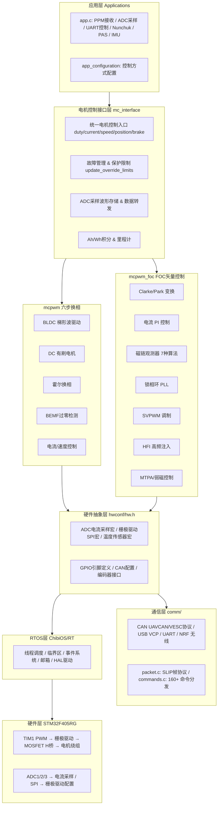
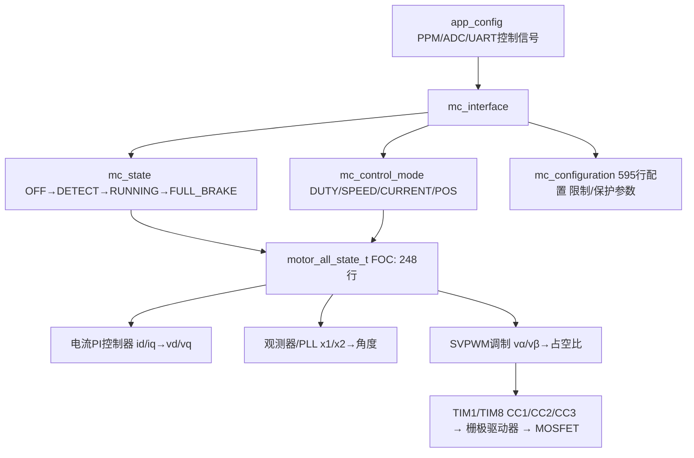
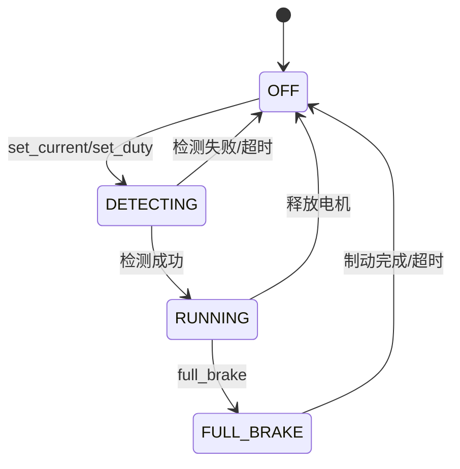
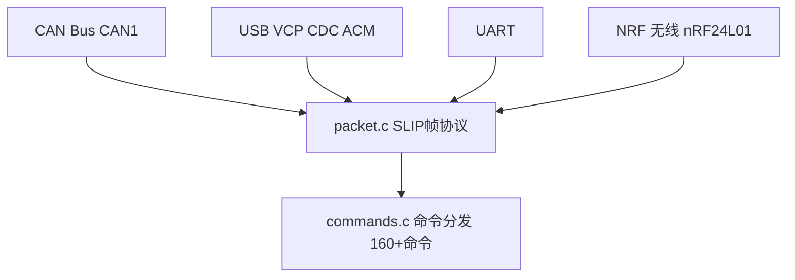

#  VC-01: VESC 固件系统架构

---

| 属性 | 值 |
|------|-----|
| 文档编号 | VC-01 |
| 标题 | VESC 固件系统架构 |
| 版本 | 1.0 |
| 作者 | 嵌入式系统架构师 |
| 创建日期 | 2026-05-26 |
| 适用平台 | STM32F405RG, VESC 硬件全系列 |
| 固件版本 | FW 7.00 |
| 前置知识 | 嵌入式C语言、ChibiOS/RT基础、电机控制基础概念 |

---

## 目录 (TOC)

1. [概述](#1-概述)
2. [硬件平台](#2-硬件平台)
3. [系统架构总览](#3-系统架构总览)
4. [线程模型](#4-线程模型)
5. [核心状态机](#5-核心状态机)
6. [数据结构总览](#6-数据结构总览)
7. [电机类型支持](#7-电机类型支持)
8. [通信子系统](#8-通信子系统)
9. [命令协议体系](#9-命令协议体系)
10. [故障码体系](#10-故障码体系)
11. [栅极驱动器支持](#11-栅极驱动器支持)
12. [功能矩阵](#12-功能矩阵)
13. [文件索引](#13-文件索引)

---

## 1. 概述

VESC（Vedder Electronic Speed Controller）是一款开源的、面向无刷直流电机和永磁同步电机的高性能电子调速器固件。由 Benjamin Vedder 于 2014 年发起，是目前开源电机控制领域最成熟、最广泛使用的项目之一。

### 1.1 设计哲学

VESC 固件遵循以下核心设计原则：

- **单一线程集中状态管理**：通过 `motor_all_state_t` 结构体管理所有电机运行状态，避免分布式状态带来的同步问题
- **编译期硬件抽象**：通过大量的 `#ifdef` / `#ifndef` 宏提供硬件层级编译时配置，零运行时开销
- **高度可配置**：595 行的 `mc_configuration` 结构体涵盖所有电机参数、控制参数、保护参数
- **多通信通道融合**：CAN、USB(VCP)、UART、NRF 四条通信通道共享统一的命令处理管道
- **安全第一**：30+ 种故障码、多层次电流限制、温度降额、电压保护等多层防护

### 1.2 核心源码结构

```text
vesc_core/
├── mc_interface.c/h        # 主电机控制接口层
├── mcpwm.c/h               # BLDC/DC 六步换相控制
├── mcpwm_foc.c/h           # FOC 矢量控制核心
├── foc_math.c/h            # FOC 数学库 (观测器/PLL/SVM)
├── conf_general.c/h        # 配置管理 & FW版本
├── datatypes.h             # 所有核心数据类型定义 (1470行)
├── mcconf_default.h        # 默认电机参数配置
├── appconf_default.h       # 默认应用配置
├── comm/
│   ├── comm_can.c/h        # CAN 总线通信
│   ├── comm_usb.c/h        # USB VCP 通信
│   ├── comm_usb_serial.c/h # USB 串行驱动
│   ├── commands.c/h        # 命令解析与分发
│   ├── packet.c/h          # 数据包封帧/解帧
│   └── log.c/h             # 数据记录
├── hwconf/
│   ├── hw.h                # 硬件抽象宏定义层 (749行)
│   ├── board.c/h           # 板级驱动
│   ├── drv8301.c/h         # DRV8301 栅极驱动
│   ├── drv8305.c/h         # DRV8305 栅极驱动
│   ├── drv8320s.c/h        # DRV8320S 栅极驱动
│   ├── drv8323s.c/h        # DRV8323S 栅极驱动
│   └── shutdown.c/h        # 关机管理
├── encoder/
│   ├── encoder.c/h         # 编码器抽象接口
│   ├── encoder_cfg.c/h     # 编码器配置管理
│   ├── encoder_datatype.h  # 编码器数据类型
│   └── enc_abi.c/h         # ABI 增量编码器
├── applications/
│   ├── app.c/h             # 应用层控制 (PPM/ADC/UART/Nunchuk)
│   ├── app_adc.c           # ADC 控制应用
│   └── appconf_default.h   # 默认应用配置
├── driver/
│   └── timer.c/h           # 定时器驱动层
├── utils_math.c/h          # 数学工具 (FFT/滤波/atan2)
├── utils_sys.c/h           # 系统工具 (时间/CRC)
├── buffer.c/h              # 环形缓冲区
├── crc.c/h                 # CRC 校验
├── digital_filter.c/h      # 数字滤波器
├── events.c/h              # 事件系统
├── mempools.c/h            # 内存池管理
├── terminal.c/h            # 终端命令行
├── timeout.c/h             # 超时管理
└── worker.c/h              # 工作线程
```

---

## 2. 硬件平台

### 2.1 MCU 核心

| 属性 | 值 |
|------|-----|
| MCU 型号 | STM32F405RG (ARM Cortex-M4) |
| 主频 | 168 MHz (`SYSTEM_CORE_CLOCK = 168000000`) |
| FPU | 硬件单精度浮点 (VFPv4-SP) |
| Flash | 1 MB |
| SRAM | 192 KB (含 64KB CCM) |
| TIM1 | 电机1 PWM (APB2, 168MHz) |
| TIM8 | 电机2 PWM (APB2, 168MHz) - 双电机模式 |
| TIM2 | ADC 采样触发定时器 |
| ADC1/ADC2/ADC3 | 三相电流 + 母线电压 + 温度采样 |

### 2.2 系统时钟配置

```text
SYSTEM_CORE_CLOCK = 168000000 Hz
├── HSE 外部晶振 → PLL (×N/×M/÷P)
├── APB2: 84 MHz (TIM1, TIM8)
├── APB1: 42 MHz (TIM2~TIM5)
└── ADC: 21 MHz (APB2 / 4 分频)
```

### 2.3 关键编译宏

| 宏定义 | 功能 |
|--------|------|
| `HW_HAS_DUAL_MOTORS` | 启用双电机支持 |
| `HW_HAS_3_SHUNTS` | 启用三电阻电流采样 |
| `HW_HAS_PHASE_SHUNTS` | 相线采样模式 |
| `HW_HAS_DRV8301` | 使用 DRV8301 栅极驱动 |
| `HW_HAS_DRV8305` | 使用 DRV8305 栅极驱动 |
| `HW_HAS_DRV8320S` | 使用 DRV8320S 栅极驱动 |
| `HW_HAS_DRV8323S` | 使用 DRV8323S 栅极驱动 |
| `CAN_ENABLE` | 启用 CAN 总线 |
| `DISABLE_HW_LIMITS` | 禁用硬件参数限制 |
| `FOC_CONTROL_LOOP_FREQ_DIVIDER` | FOC 控制环分频系数 |

---

## 3. 系统架构总览

### 3.1 分层架构图



### 3.2 数据流向图



---

## 4. 线程模型

### 4.1 线程列表

VESC 基于 ChibiOS/RT 实时操作系统，采用多线程 + 中断处理架构：

```text
┌─────────────────────────────────────────────────────────────────────┐
│                       线程优先级分布                                  │
│  HIGH                                                                 │
│  │  [HIGHPRIO-2]  mcpwm_foc timer_thread     (定时器管理, PWM频率切换)│
│  │  [HIGHPRIO-2]  mcpwm_foc hfi_thread       (HFI高频注入处理)       │
│  │  [HIGHPRIO-3]  fault_stop_thread          (故障停机处理)           │
│  │  [NORMALPRIO]  mc_interface timer_thread   (1ms定时任务)           │
│  │  [NORMALPRIO]  comm_can read_thread        (CAN接收)              │
│  │  [NORMALPRIO]  comm_can process_thread     (CAN命令处理)           │
│  │  [NORMALPRIO]  comm_can status_thread      (CAN状态发送)           │
│  │  [NORMALPRIO]  commands blocking_thread    (阻塞命令处理)          │
│  │  [NORMALPRIO]  encoder routine_thread      (编码器例程)            │
│  │  [NORMALPRIO-1] mc_interface sample_send   (采样数据发送)          │
│  │  [NORMALPRIO-1] mcpwm_foc pid_thread       (PID速度/位置环)       │
│  │  [NORMALPRIO]  stat_thread                 (统计线程)              │
│  │  [LOWPRIO]     终端/日志线程                                      │
│  ▼                                                                   │
│  LOW                                                                  │
└─────────────────────────────────────────────────────────────────────┘
```

### 4.2 关键线程详解

**mc_interface timer_thread (1ms 周期)**
```c
// 位于 mc_interface.c
static THD_WORKING_AREA(timer_thread_wa, 1024);
static THD_FUNCTION(timer_thread, arg) {
    for(;;) {
        chThdSleepMilliseconds(1);
        // 执行 run_timer_tasks(motor)
        //   → 电压慢速滤波
        //   → 里程计/运行时间更新
        //   → DRV故障恢复计数
        //   → update_override_limits() 更新限制
        //   → 辅助输出管理
        //   → 编码器数据更新
        //   → 电流不平衡检测
    }
}
```

**fault_stop_thread (高优先级)**
```c
// 位于 mc_interface.c, HIGHPRIO - 3
static THD_WORKING_AREA(fault_stop_thread_wa, 512);
static THD_FUNCTION(fault_stop_thread, arg) {
    for(;;) {
        chEvtWaitAny((eventmask_t)1);
        // 读取 m_fault_data 中的故障信息
        // 执行停机逻辑 (设置FULL_BRAKE / 释放电机)
        // 记录 fault_data (电流/电压/温度/duty/rpm)
    }
}
```

**CAN 通信线程组**
```c
// comm_can.c
static THD_WORKING_AREA(can_read_thread_wa, 512);    // CAN帧接收
static THD_WORKING_AREA(can_process_thread_wa, 512);  // CAN命令处理
static THD_WORKING_AREA(can_status_thread_wa, 512);   // CAN状态发送 (可配置频率)
```

---

## 5. 核心状态机

### 5.1 mc_state 电机控制状态



### 5.2 mc_control_mode 控制模式

```c
typedef enum {
    CONTROL_MODE_DUTY = 0,        // 开环占空比控制
    CONTROL_MODE_SPEED,           // 速度闭环 (PID)
    CONTROL_MODE_CURRENT,         // 电流闭环
    CONTROL_MODE_CURRENT_BRAKE,   // 再生制动
    CONTROL_MODE_POS,             // 位置闭环 (PID)
    CONTROL_MODE_HANDBRAKE,       // 驻车制动 (直流注入)
    CONTROL_MODE_OPENLOOP,        // 开环电流+速度
    CONTROL_MODE_OPENLOOP_PHASE,  // 开环电流+相位
    CONTROL_MODE_OPENLOOP_DUTY,   // 开环占空比+速度
    CONTROL_MODE_OPENLOOP_DUTY_PHASE, // 开环占空比+相位
    CONTROL_MODE_NONE             // 无控制
} mc_control_mode;
```

---

## 6. 数据结构总览

### 6.1 mc_configuration (595行, 电机所有参数)

```c
// 位于 datatypes.h: L393-L595
typedef struct {
    // ===== 限制参数 (Limits) =====
    float l_current_max;        // 最大电机电流
    float l_current_min;        // 最小电机电流 (负值=制动)
    float l_in_current_max;     // 最大输入电流
    float l_in_current_min;     // 最小输入电流
    float l_abs_current_max;    // 绝对最大电流阈值 (故障触发)
    float l_min_erpm;           // 最小ERPM
    float l_max_erpm;           // 最大ERPM
    float l_battery_cut_start/end;    // 电池低压截止
    float l_battery_regen_cut_start/end; // 再生过压截止
    float l_temp_fet_start/end;       // MOSFET温度降额
    float l_temp_motor_start/end;     // 电机温度降额
    float l_watt_max/min;             // 功率限制
    float l_duty_start;               // 占空比限制起始点

    // ===== 运行时覆盖限制 (Computed) =====
    float lo_current_max;       // 计算后的最大电流
    float lo_current_min;       // 计算后的最小电流
    float lo_in_current_max/min; // 计算后的输入电流限制

    // ===== BLDC 参数 =====
    mc_pwm_mode pwm_mode;       // PWM模式
    mc_comm_mode comm_mode;     // 换相模式
    mc_sensor_mode sensor_mode; // 传感器模式
    float sl_min_erpm;          // 无感最小ERPM
    float sl_bemf_coupling_k;   // BEMF耦合系数
    int8_t hall_table[8];       // 霍尔换相表

    // ===== FOC 核心参数 =====
    float foc_current_kp;       // 电流环 Kp
    float foc_current_ki;       // 电流环 Ki
    float foc_f_zv;             // FOC PWM 频率
    float foc_motor_l;          // 电机电感 (L)
    float foc_motor_ld_lq_diff; // Ld-Lq 差值 (IPM电机)
    float foc_motor_r;          // 电机电阻 (R)
    float foc_motor_flux_linkage; // 磁链 (λ)
    float foc_observer_gain;    // 观测器增益
    float foc_pll_kp/ki;        // 锁相环 Kp/Ki

    // ===== FOC 传感器配置 =====
    mc_foc_sensor_mode foc_sensor_mode;  // 传感器类型
    mc_foc_observer_type foc_observer_type; // 观测器算法

    // ===== HFI 高频注入参数 =====
    float foc_hfi_voltage_start/run/max; // HFI 电压等级
    float foc_hfi_gain;                  // HFI 增益
    float foc_hfi_max_err;               // HFI 最大误差

    // ===== 弱磁/MTPA 参数 =====
    float foc_fw_current_max;    // 弱磁最大 Id 电流
    float foc_fw_duty_start;     // 弱磁起始占空比
    MTPA_MODE foc_mtpa_mode;     // MTPA 模式

    // ===== 速度 PID =====
    float s_pid_kp/ki/kd;        // 速度环 PID 参数
    float s_pid_ramp_erpms_s;    // 速度斜坡

    // ===== 位置 PID =====
    float p_pid_kp/ki/kd;        // 位置环 PID 参数

    // ===== 电机参数 =====
    uint8_t si_motor_poles;      // 电机极对数
    float si_gear_ratio;         // 减速比
    float si_wheel_diameter;     // 轮径
    BATTERY_TYPE si_battery_type; // 电池类型
    int si_battery_cells;        // 电池串数

    // ===== BMS 配置 =====
    bms_config bms;              // BMS设置

    uint16_t crc;                // CRC 校验
} mc_configuration;
```

### 6.2 motor_all_state_t (FOC 运行时状态, 248行)

```c
// 位于 foc_math.h: L138-L248
typedef struct {
    mc_configuration *m_conf;        // 指向当前配置
    mc_state m_state;                // 当前状态
    mc_control_mode m_control_mode;  // 当前控制模式
    motor_state_t m_motor_state;     // 电机瞬时状态 (id/iq/vd/vq/phase/...)

    // 电流/电压瞬时值
    float m_duty_cycle_set;          // 设定占空比
    float m_id_set, m_iq_set;        // 设定 d/q 轴电流
    float m_i_fw_set;                // 弱磁 Id 设定

    // 速度/位置估计
    float m_phase_now_observer;      // 观测器估计角度
    float m_phase_now_encoder;       // 编码器角度
    float m_pll_phase, m_pll_speed;  // PLL 输出
    float m_speed_est_fast;          // 快速速度估计
    float m_speed_est_faster;        // 更快速速度估计

    // 观测器状态
    observer_state m_observer_state; // (x1, x2, lambda_est)

    // HFI 状态
    hfi_state_t m_hfi;               // 高频注入状态

    // 编码器校正
    float m_phase_now_encoder_no_index;
    float m_pos_pid_now;             // 位置PID当前值

    // PWM 输出
    int m_duty1_next, m_duty2_next, m_duty3_next;

    // 温度补偿参数
    float m_res_temp_comp;           // 温度补偿电阻
    float m_current_ki_temp_comp;    // 温度补偿 Ki

    // 预计算值
    float p_lq, p_ld;                // 预计算 Ld/Lq
    float p_duty_norm;               // 占空比归一化系数
    float p_fs, p_dt;                // 预计算 频率/时间步长
} motor_all_state_t;
```

### 6.3 app_configuration (应用层配置)

```c
// 位于 datatypes.h: L902-L951
typedef struct {
    uint8_t controller_id;        // CAN 控制器 ID
    uint32_t timeout_msec;        // 通信超时
    float timeout_brake_current;  // 超时制动电流

    CAN_MODE can_mode;            // CAN 模式 (VESC/UAVCAN/...)
    SHUTDOWN_MODE shutdown_mode;  // 关机模式

    app_use app_to_use;           // 激活的应用 (PPM/ADC/UART/...)
    ppm_config app_ppm_conf;      // PPM 控制配置
    adc_config app_adc_conf;      // ADC 控制配置
    chuk_config app_chuk_conf;    // Nunchuk 控制配置
    nrf_config app_nrf_conf;      // NRF 无线配置
    pas_config app_pas_conf;      // PAS 助力传感器配置
    imu_config imu_conf;          // IMU 配置

    uint16_t crc;                 // CRC 校验
} app_configuration;
```

---

## 7. 电机类型支持

### 7.1 三种电机类型

| 类型 | 枚举值 | 控制方式 | 适用场景 |
|------|--------|---------|---------|
| `MOTOR_TYPE_BLDC` | 0 | 六步换相 (方波) | 低成本BLDC, 高速风机, 电动工具 |
| `MOTOR_TYPE_DC` | 1 | 有刷直流 | 有刷电机, 简单应用 |
| `MOTOR_TYPE_FOC` | 2 | FOC 矢量控制 | 高性能伺服, 低噪音, 低速大转矩 |

### 7.2 控制方式路由

```text
mc_interface_set_current/duty/rpm/pos()
        │
        ▼
  switch(motor_type)
        │
  ┌─────┼─────────────────┐
  ▼     ▼                  ▼
BLDC   DC               FOC
mcpwm_*            mcpwm_foc_*
```

### 7.3 双电机支持

```c
// 通过 HW_HAS_DUAL_MOTORS 宏启用
#ifdef HW_HAS_DUAL_MOTORS
static volatile motor_all_state_t m_motor_1;  // TIM1 控制
static volatile motor_all_state_t m_motor_2;  // TIM8 控制
#endif

#define M_MOTOR(is_second_motor) \
    (is_second_motor ? &m_motor_2 : &m_motor_1)
```

---

## 8. 通信子系统

### 8.1 四大通信通道



### 8.2 CAN 模式

| 模式 | 枚举值 | 说明 |
|------|--------|------|
| `CAN_MODE_VESC` | 0 | 标准 VESC CAN 协议 (扩展帧) |
| `CAN_MODE_UAVCAN` | 1 | UAVCAN 协议 (无人机标准) |
| `CAN_MODE_COMM_BRIDGE` | 2 | CAN 通信桥接模式 |
| `CAN_MODE_VESC_UAVCAN` | 4 | VESC + UAVCAN 双协议 |

### 8.3 CAN 状态消息

VESC 通过 CAN 总线定期发送 6 种状态消息：

| 消息类型 | 内容 |
|---------|------|
| `CAN_PACKET_STATUS` | rpm, current, duty (基础状态) |
| `CAN_PACKET_STATUS_2` | amp_hours, amp_hours_charged |
| `CAN_PACKET_STATUS_3` | watt_hours, watt_hours_charged |
| `CAN_PACKET_STATUS_4` | temp_fet, temp_motor, current_in, pid_pos |
| `CAN_PACKET_STATUS_5` | v_in, tacho_value |
| `CAN_PACKET_STATUS_6` | adc_1, adc_2, adc_3, ppm |

---

## 9. 命令协议体系

### 9.1 COMM_PACKET_ID (160+ 命令)

主要命令组：

| 命令范围 | 功能组 |
|---------|--------|
| `COMM_FW_VERSION` (0) ~ `COMM_SET_HANDBRAKE` (10) | 基本控制命令 |
| `COMM_SET_DETECT` (11) ~ `COMM_DETECT_HALL_FOC` (28) | 电机参数检测 |
| `COMM_REBOOT` (29) ~ `COMM_GET_DECODED_CHUK` (33) | 系统/状态命令 |
| `COMM_FORWARD_CAN` (34) ~ `COMM_GET_VALUES_SETUP` (47) | CAN/数据采样 |
| `COMM_SET_MCCONF_TEMP` (48) ~ `COMM_GET_IMU_DATA` (65) | 配置/IMU |
| `COMM_BM_*` (66~71) | Bootloader 管理 |
| `COMM_PLOT_*` (75~78) | 实时绘图 |
| `COMM_BMS_*` (96~101) | BMS 电池管理 |
| `COMM_FILE_*` (140~144) | 文件系统操作 |
| `COMM_LOG_*` (145~148) | 数据日志 |
| `COMM_SHUTDOWN` (156) ~ `COMM_MOTOR_ESTOP` (159) | 系统控制 |

### 9.2 CAN_PACKET_ID (70+ CAN 命令)

| 命令范围 | 功能组 |
|---------|--------|
| `CAN_PACKET_SET_DUTY` (0) ~ `CAN_PACKET_SET_POS` (4) | CAN 控制命令 |
| `CAN_PACKET_STATUS` (9) ~ `CAN_PACKET_STATUS_6` (58) | CAN 状态上报 |
| `CAN_PACKET_CONF_*` (21~30) | CAN 配置设置 |
| `CAN_PACKET_BMS_*` (38~54) | BMS CAN 数据 |
| `CAN_PACKET_GNSS_*` (59~62) | GNSS 数据 |

---

## 10. 故障码体系

### 10.1 完整故障码列表 (30+ 种)

```c
typedef enum {
    FAULT_CODE_NONE = 0,                          // 无故障
    FAULT_CODE_OVER_VOLTAGE,                      // 过压
    FAULT_CODE_UNDER_VOLTAGE,                     // 欠压
    FAULT_CODE_DRV,                               // 栅极驱动故障
    FAULT_CODE_ABS_OVER_CURRENT,                  // 绝对过流
    FAULT_CODE_OVER_TEMP_FET,                     // MOSFET 过温
    FAULT_CODE_OVER_TEMP_MOTOR,                   // 电机过温
    FAULT_CODE_GATE_DRIVER_OVER_VOLTAGE,          // 栅极驱动过压
    FAULT_CODE_GATE_DRIVER_UNDER_VOLTAGE,         // 栅极驱动欠压
    FAULT_CODE_MCU_UNDER_VOLTAGE,                 // MCU 欠压
    FAULT_CODE_BOOTING_FROM_WATCHDOG_RESET,       // 看门狗复位启动
    FAULT_CODE_ENCODER_SPI,                       // 编码器 SPI 故障
    FAULT_CODE_ENCODER_SINCOS_BELOW_MIN_AMPLITUDE, // Sin/Cos 幅值过低
    FAULT_CODE_ENCODER_SINCOS_ABOVE_MAX_AMPLITUDE, // Sin/Cos 幅值过高
    FAULT_CODE_FLASH_CORRUPTION,                  // Flash 损坏
    FAULT_CODE_HIGH_OFFSET_CURRENT_SENSOR_1/2/3,  // 电流传感器偏移过大
    FAULT_CODE_UNBALANCED_CURRENTS,               // 电流不平衡
    FAULT_CODE_BRK,                               // 制动电阻故障
    FAULT_CODE_RESOLVER_LOT/DOS/LOS,              // Resolver 故障
    FAULT_CODE_FLASH_CORRUPTION_APP_CFG,          // App配置损坏
    FAULT_CODE_FLASH_CORRUPTION_MC_CFG,           // MC配置损坏
    FAULT_CODE_ENCODER_NO_MAGNET,                 // 编码器无磁铁
    FAULT_CODE_ENCODER_MAGNET_TOO_STRONG,         // 编码器磁铁过强
    FAULT_CODE_PHASE_FILTER,                      // 相位滤波器故障
    FAULT_CODE_ENCODER_FAULT,                     // 编码器通用故障
    FAULT_CODE_LV_OUTPUT_FAULT,                   // 低压输出故障
    FAULT_CODE_ENCODER_SLIP,                      // 编码器打滑
    FAULT_CODE_OVERSPEED,                         // 超速
    FAULT_CODE_UNDERSPEED,                        // 欠速
    FAULT_CODE_ABS_OVERSPEED                      // 绝对超速
} mc_fault_code;
```

### 10.2 故障数据记录

```c
typedef struct {
    uint8_t motor;               // 电机编号
    mc_fault_code fault;         // 故障码
    float current;               // 瞬时电流
    float current_filtered;      // 滤波电流
    float voltage;               // 输入电压
    float gate_driver_voltage;   // 栅极驱动电压
    float duty;                  // 占空比
    float rpm;                   // 转速
    int tacho;                   // 累计计数
    int cycles_running;          // 运行周期数
    int tim_val_samp;            // 采样时刻定时器值
    int tim_current_samp;        // 电流采样时刻
    int tim_top;                 // PWM 周期
    int comm_step;               // 换相步 (BLDC)
    float temperature;           // 温度
    int drv8301_faults;          // DRV8301 故障寄存器
    const char *info_str;        // 附加信息
    int info_argn;               // 附加信息参数数量
    float info_args[2];          // 附加信息参数
} fault_data;
```

---

## 11. 栅极驱动器支持

### 11.1 支持的驱动器

| 驱动器 | 宏定义 | 通信接口 | 特点 |
|--------|--------|---------|------|
| DRV8301 | `HW_HAS_DRV8301` | SPI | 经典三相栅极驱动, 双电流放大器 |
| DRV8305 | `HW_HAS_DRV8305` | SPI | 升级版, 3 PWM输入, 更小封装 |
| DRV8320S | `HW_HAS_DRV8320S` | SPI | 智能栅极驱动, 可调驱动强度 |
| DRV8323S | `HW_HAS_DRV8323S` | SPI | 3电流放大器版本, 独立 CSA |

### 11.2 SPI 配置标准

```c
// 每个驱动器通过 SPI 配置以下寄存器:
// - 栅极驱动电流
// - 过流保护阈值
// - 过流保护模式 (OC_LIMIT / OC_LATCH_SHUTDOWN / OC_REPORT_ONLY / OC_DISABLED)
// - 死区时间
// - PWM 模式

// 初始化调用顺序:
// 1. hw_init_gpio()  →  配置 SPI 引脚
// 2. drv8301_init()  →  初始化 SPI, 配置寄存器
// 3. ENABLE_GATE()   →  使能栅极驱动输出
```

---

## 12. 功能矩阵

| 功能 | BLDC 模式 | DC 模式 | FOC 模式 | 说明 |
|------|----------|---------|---------|------|
| 开环占空比控制 |  |  |  | `CONTROL_MODE_DUTY` |
| 速度闭环 |  | - |  | `CONTROL_MODE_SPEED` + PID |
| 电流闭环 |  | - |  | `CONTROL_MODE_CURRENT` + PI |
| 再生制动 |  | - |  | `CONTROL_MODE_CURRENT_BRAKE` |
| 位置闭环 | - | - |  | `CONTROL_MODE_POS` + PID |
| 驻车制动 | - | - |  | `CONTROL_MODE_HANDBRAKE` |
| 无感运行 |  (BEMF) | - |  (观测器/HFI) | 无位置传感器 |
| 有感运行 |  (霍尔) | - |  (编码器/霍尔) | 有位置传感器 |
| 高频注入启动 | - | - |  | HFI start→run 过渡 |
| 弱磁控制 | - | - |  | `foc_run_fw()` |
| MTPA | - | - |  | 三种模式 |
| 温度降额 |  |  |  | MOSFET + 电机 |
| 电池保护 |  |  |  | 低压截止 + 再生过压 |
| CAN 总线 |  |  |  | VESC/UAVCAN 协议 |
| USB 通信 |  |  |  | USB VCP |
| OTA 固件升级 |  |  |  | Bootloader + CAN |
| 音频输出 | - | - |  | 电机调制发声 |
| 双电机 |  | - |  | `HW_HAS_DUAL_MOTORS` |
| 编码器校正表 | - | - |  | 360点非线性校正 |
| BMS 集成 |  |  |  | BMS FWD CAN 模式 |

---

## 13. 配置存储与 Flash 管理

### 13.1 配置备份机制

VESC 在 Flash 中存储以下可持久化数据块：

```text
MCU Flash (1MB)
├── Bootloader (前 16KB)
├── 固件本体 (约 128KB)
├── mc_configuration (4KB, CRC16)
├── app_configuration (2KB, CRC16)
├── backup_data (1KB, Magic Number + CRC)
│   ├── 里程计 (odometer)
│   ├── 运行时间 (runtime)
│   ├── 硬件配置 (hw_config)
│   └── 编码器校正表 (enc_corr[360])
├── BMS 数据
└── 自定义配置文件
```

### 13.2 CRC 完整性校验

```c
// conf_general.c
// 每次写入前计算 CRC16, 读取后验证
uint16_t crc = crc16((uint8_t*)&conf, sizeof(mc_configuration) - 2);
conf.crc = crc;
conf_general_store_mc_configuration(&conf);

// 读取时
if (crc16(data, len) != stored_crc) {
    mc_interface_fault_stop(FAULT_CODE_FLASH_CORRUPTION_MC_CFG, ...);
}
```

### 13.3 Watchdog 复位检测

```c
// 系统启动时检查复位原因
if (RCC_GetFlagStatus(RCC_FLAG_IWDGRST) != RESET) {
    // 上一次复位来自独立看门狗 (1.6秒超时)
    mc_interface_fault_stop(FAULT_CODE_BOOTING_FROM_WATCHDOG_RESET, ...);
    RCC_ClearFlag();
}
// IWDG 配置: LSI (32kHz) / 256 = 125Hz, 200 计数值 = 1.6秒
```

---

## 14. SLIP 帧协议详解

### 14.1 帧格式

VESC 使用 SLIP (Serial Line Internet Protocol) 封帧，保证二进制数据传输的可靠性：

```text
┌─────────┬──────────┬──────────────────┬─────────┬─────────┐
│ 0x02    │ payload  │  crc16(2 bytes)  │ 0x03    │         │
│ (短帧)  │          │                  │         │         │
├─────────┼──────────┼──────────────────┼─────────┼─────────┤
│ 0x03    │ 长度MSB  │ 长度LSB │ payload│ crc16   │ 0x03    │
│ (长帧)  │          │         │        │         │         │
└─────────┴──────────┴─────────┴────────┴─────────┴─────────┘

payload = [command_id (1 byte)] [command_data (可变)]
最大载荷: PACKET_MAX_PL_LEN = 512 字节

转义规则 (SLIP):
  0x03 (帧尾) → 0xDB 0xDC (转义)
  0xDB (转义符) → 0xDB 0xDD
```

### 14.2 数据传输速率

| 通道 | 波特率 | 实际吞吐 |
|------|--------|---------|
| USB VCP | 12 Mbps | ~500 KB/s |
| UART | 115200 | ~10 KB/s |
| CAN | 500K/1M | ~50 KB/s |

---

## 15. mc_values 运行时状态

```c
// datatypes.h
typedef struct {
    float v_in;                      // 输入电压 (V)
    float temp_mos1/2/3;            // MOSFET 温度 (°C)
    float temp_motor;                // 电机温度 (°C)
    float current_motor;             // 电机电流 (A)
    float current_in;                // 输入电流 (A)
    float id, iq;                    // d/q 轴电流 (A)
    float rpm;                       // 当前 ERPM
    float duty_now;                  // 当前占空比
    float amp_hours;                 // Ah (放电)
    float amp_hours_charged;         // Ah (充电)
    float watt_hours;                // Wh (放电)
    float watt_hours_charged;        // Wh (充电)
    int tachometer;                  // 编码器脉冲累计
    int tachometer_abs;              // 绝对脉冲累计
    float position;                  // 编码器角度
    mc_fault_code fault_code;        // 当前故障码
    int vesc_id;                     // CAN ID
    float vd, vq;                    // d/q 轴电压
    float speed;                     // 速度 (km/h 或 mph)
} mc_values;
```

此结构通过 `COMM_GET_VALUES` 命令返回给上位机，用于实时显示。

---

## 16. 文件索引

| 文件路径 | 功能说明 | 行数 |
|---------|---------|------|
| `datatypes.h` | 所有核心数据类型/枚举/结构体定义 | ~1470 |
| `mc_interface.h` | 电机控制接口层 API 声明 | ~164 |
| `mc_interface.c` | 电机控制接口层实现 (ISR/故障/限制) | ~2600 |
| `mcpwm_foc.h` | FOC 控制模块 API 声明 | ~164 |
| `mcpwm_foc.c` | FOC 控制模块实现 (ADC ISR/SVPWM) | ~3000+ |
| `foc_math.h` | FOC 数学库 (状态结构体/函数声明) | ~265 |
| `foc_math.c` | FOC 数学库 (观测器/PLL/SVM/PID) | ~800+ |
| `mcpwm.h` | BLDC 六步换相 API | - |
| `mcpwm.c` | BLDC 六步换相实现 | - |
| `conf_general.h` | 全局配置/版本/频率分频/电流校准宏 | ~250 |
| `conf_general.c` | 配置存储/Flash读写/参数检测 | - |
| `hwconf/hw.h` | 硬件抽象宏层 (749行宏定义) | ~749 |
| `hwconf/board.c` | 板级硬件初始化 | - |
| `comm/comm_can.c` | CAN 总线通信实现 | - |
| `comm/comm_can.h` | CAN 总线通信 API | ~100 |
| `comm/commands.c` | 160+命令解析分发 | - |
| `comm/packet.c` | SLIP帧协议封帧/解帧 | - |
| `comm/comm_usb.c` | USB VCP 通信 | - |
| `applications/app.c` | 应用控制层 (PPM/ADC/UART/Nunchuk/PAS) | - |
| `utils_math.c` | 数学工具 (快速atan2/FFT/LPF) | - |
| `encoder/encoder.c` | 编码器抽象层 | - |
| `encoder/enc_abi.c` | ABI 增量编码器实现 | - |