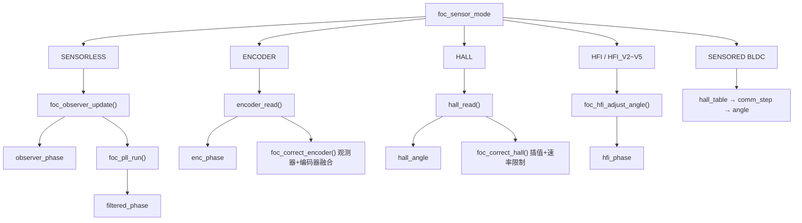
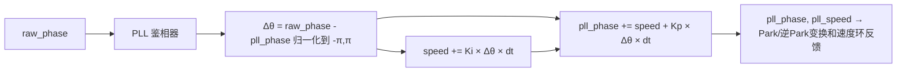
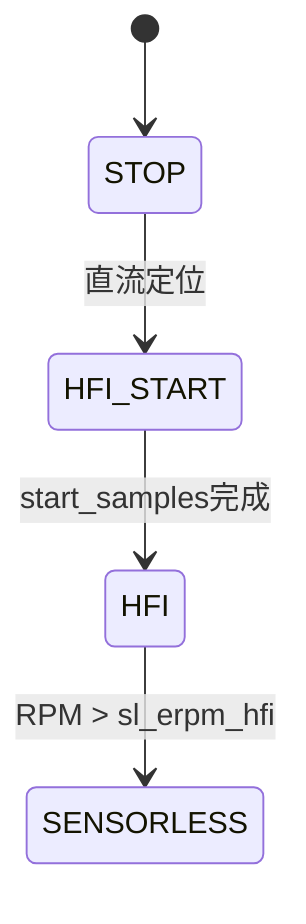
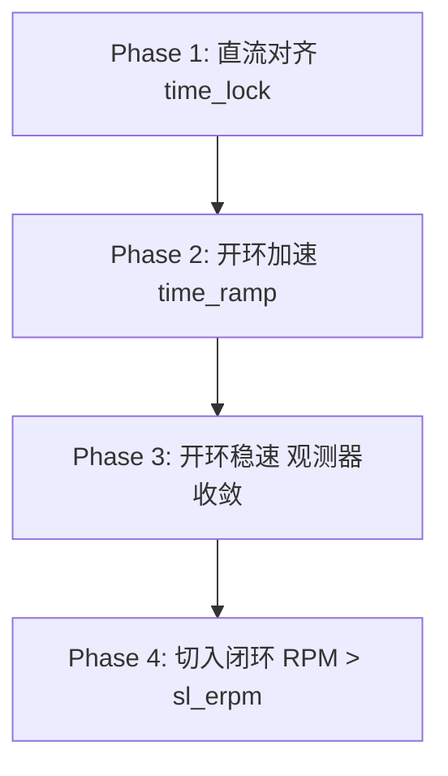

# ⭐ VC-03: VESC 磁链观测器与无感算法

---

| 属性 | 值 |
|------|-----|
| 文档编号 | VC-03 |
| 标题 | VESC 磁链观测器与无感控制算法 |
| 版本 | 1.0 |
| 作者 | 嵌入式系统架构师 |
| 创建日期 | 2026-05-26 |
| 适用平台 | STM32F405RG, VESC FOC 模式 |
| 固件版本 | FW 7.00 |
| 前置知识 | 永磁同步电机数学模型、状态观测器理论、信号处理基础 |

---

## 目录 (TOC)

1. [概述](#1-概述)
2. [传感器模式体系](#2-传感器模式体系)
3. [观测器算法详解](#3-观测器算法详解)
4. [锁相环 (PLL)](#4-锁相环-pll)
5. [饱和补偿 (SAT_COMP)](#5-饱和补偿-sat_comp)
6. [温度补偿](#6-温度补偿)
7. [凸极效应处理](#7-凸极效应处理)
8. [高频注入 (HFI)](#8-高频注入-hfi)
9. [编码器校正与融合](#9-编码器校正与融合)
10. [霍尔传感器校正](#10-霍尔传感器校正)
11. [开环启动策略](#11-开环启动策略)
12. [速度估计策略](#12-速度估计策略)
13. [参数调优指南](#13-参数调优指南)
14. [文件索引](#14-文件索引)

---

## 1. 概述

VESC 实现了业界最丰富的无感 FOC 算法库之一，包含 7 种磁链观测器变体、5 种高频注入变体，以及完善的 PLL、编码器校正、霍尔传感器处理、混合模式过渡等功能。所有算法均位于 `foc_math.c` 中。

### 1.1 核心文件

| 文件 | 功能 |
|------|------|
| `foc_math.c` | 观测器 / PLL / SVM / PID / HFI / 弱磁 全部实现 |
| `foc_math.h` | hfi_state_t, observer_state, motor_all_state_t 定义 |
| `mcpwm_foc.c` | ISR 中调用观测器 / PLL / HFI |
| `utils_math.c` | FFT (8/16/32点), 快速 atan2, 数字滤波器 |
| `encoder/encoder.c` | 编码器抽象接口 |

---

## 2. 传感器模式体系

### 2.1 FOC 传感器模式 (mc_foc_sensor_mode)

```c
typedef enum {
    FOC_SENSOR_MODE_SENSORLESS = 0,   // 纯无感 (观测器)
    FOC_SENSOR_MODE_ENCODER,          // 增量编码器
    FOC_SENSOR_MODE_HALL,             // 霍尔传感器
    FOC_SENSOR_MODE_HFI,              // 高频注入 (基本)
    FOC_SENSOR_MODE_HFI_START,        // HFI 启动过渡
    FOC_SENSOR_MODE_HFI_V2,           // HFI V2
    FOC_SENSOR_MODE_HFI_V3,           // HFI V3
    FOC_SENSOR_MODE_HFI_V4,           // HFI V4
    FOC_SENSOR_MODE_HFI_V5,           // HFI V5
    FOC_SENSOR_MODE_ENCODER_AB        // ABI 编码器
} mc_foc_sensor_mode;
```

### 2.2 角度来源路由



---

## 3. 观测器算法详解

### 3.1 观测器类型枚举

```c
typedef enum {
    FOC_OBSERVER_ORTEGA_ORIGINAL = 0,       // Ortega 原始算法
    FOC_OBSERVER_MXLEMMING,                 // David Molony 原始观测器
    FOC_OBSERVER_ORTEGA_LAMBDA_COMP,        // Ortega + 磁链补偿
    FOC_OBSERVER_MXLEMMING_LAMBDA_COMP,     // MXLEMMING + 磁链补偿
    FOC_OBSERVER_MXV,                       // 幅值钳位法
    FOC_OBSERVER_MXV_LAMBDA_COMP,           // MXV + 磁链补偿
    FOC_OBSERVER_MXV_LAMBDA_COMP_LIN,       // 线性化 MXV + 磁链补偿
} mc_foc_observer_type;
```

### 3.2 统一数学模型

**PMSM 在 αβ 坐标系下的电压方程**:
```text
v_α = R·i_α + L·di_α/dt - ω·λ·sin(θ)
v_β = R·i_β + L·di_β/dt + ω·λ·cos(θ)
```

**磁链定义**:
```text
x1 = λ_α = L·i_α + λ·cos(θ)
x2 = λ_β = L·i_β + λ·sin(θ)
```

**状态方程**:
```text
dx1/dt = v_α - R·i_α
dx2/dt = v_β - R·i_β
```

观测器任务：从可测量的 v_α, v_β, i_α, i_β 估计不可测的磁链状态 x1, x2。

### 3.3 观测器状态结构体

```c
typedef struct {
    float x1;            // α轴磁链估计值
    float x2;            // β轴磁链估计值
    float lambda_est;    // 估计磁链幅值 (λ_comp 模式)
    float i_alpha_last;  // 上一周期 α轴电流 (MXLEMMING 用)
    float i_beta_last;   // 上一周期 β轴电流 (MXLEMMING 用)
} observer_state;
```

### 3.4 FOC_OBSERVER_ORTEGA_ORIGINAL (梯度下降法)

**参考文献**:
- [Lee, Hong, Nam, Ortega, Praly, Astolfi (2010)](http://cas.ensmp.fr/~praly/Telechargement/Journaux/2010-IEEE_TPEL-Lee-Hong-Nam-Ortega-Praly-Astolfi.pdf)

**原理**:

Ortega 观测器基于磁链幅值约束条件：
```text
|x - L·i|² = λ²    (磁链幅值等于永磁体磁链)
```

定义误差函数：
```text
e = λ² - |x - L·i|²
```

使用梯度下降法修正状态：
```text
dx1/dt = v_α - R·i_α + (γ/2) · (x1 - L·i_α) · e
dx2/dt = v_β - R·i_β + (γ/2) · (x2 - L·i_β) · e
```

其中 γ = `foc_observer_gain`，是观测器收敛增益。

**代码实现**:
```c
// foc_math.c - foc_observer_update()
case FOC_OBSERVER_ORTEGA_ORIGINAL: {
    float err = SQ(lambda) - (SQ(state->x1 - L_ia) + SQ(state->x2 - L_ib));

    // 强制误差为非正以加速收敛
    // 参考: http://cas.ensmp.fr/Publications/Publications/Papers/ObserverPermanentMagnet.pdf
    if (err > 0.0) {
        err = 0.0;
    }

    float x1_dot = v_alpha - R_ia + gamma_half * (state->x1 - L_ia) * err;
    float x2_dot = v_beta - R_ib + gamma_half * (state->x2 - L_ib) * err;

    state->x1 += x1_dot * dt;
    state->x2 += x2_dot * dt;
} break;
```

**特点**:
- ✅ 理论完备, 有严格收敛性证明
- ✅ 对参数误差有一定鲁棒性
- ❌ 计算量较大 (每次需计算 `err = λ² - |x-Li|²`)
- ❌ 低速性能依赖磁链参数准确性

### 3.5 FOC_OBSERVER_MXLEMMING (David Molony 观测器)

**许可证**: BSD-3-clause (MESC FOC 项目)

**原理**:

基于电压积分 + 电流差分的最简观测器：
```text
x1[k] = x1[k-1] + (v_α - R·i_α)·dt - L·(i_α[k] - i_α[k-1])
x2[k] = x2[k-1] + (v_β - R·i_β)·dt - L·(i_β[k] - i_β[k-1])
```

然后对幅值进行钳位 (clamping)：
```text
|x| = clamp(|x|, 0, λ)
```

**代码实现**:
```c
case FOC_OBSERVER_MXLEMMING:
    state->x1 += (v_alpha - R_ia) * dt - L * (i_alpha - state->i_alpha_last);
    state->x2 += (v_beta - R_ib) * dt - L * (i_beta - state->i_beta_last);

    utils_truncate_number_abs(&(state->x1), lambda);
    utils_truncate_number_abs(&(state->x2), lambda);
    break;
```

**特点**:
- ✅ 计算量极低, 适合高频控制
- ✅ 启动快, 对动态响应好
- ❌ 纯电压积分导致漂移 (直流偏置累积)

### 3.6 FOC_OBSERVER_ORTEGA_LAMBDA_COMP (磁链在线辨识)

在 Ortega 原始算法基础上增加磁链 λ 的在线估计：

```c
// 磁链观测器: λ_est 的更新律
// 参考: https://cas.mines-paristech.fr/~praly/Telechargement/Conferences/2017_IFAC_Bernard-Praly.pdf
state->lambda_est += 0.2 * gamma_half * state->lambda_est * (-err) * dt;

// 钳位 λ 在合理范围
utils_truncate_number(&(state->lambda_est), lambda * 0.3, lambda * 2.5);
```

**特点**:
- ✅ 适用磁链未知或变化的场景 (温度/饱和)
- ✅ 自适应, 无需精确知道 λ
- ❌ 额外增加自由参数, 可能发散

### 3.7 FOC_OBSERVER_MXV (幅值钳位法)

**原理**:

类似于 MXLEMMING 的积分，但使用向量的幅值归一化钳位：

```text
x[k] = x[k-1] + (v - R·i)·dt
mag = |x[k] - L·i|
if (mag > λ):
    x[k] = (x[k] / mag) × λ
```

**代码实现**:
```c
case FOC_OBSERVER_MXV:
    state->x1 += (v_alpha - R_ia) * dt;
    state->x2 += (v_beta - R_ib) * dt;

    float mag = NORM2_f(state->x1 - L_ia, state->x2 - L_ib);
    if (mag > lambda) {
        state->x1 = (state->x1 / mag) * lambda;
        state->x2 = (state->x2 / mag) * lambda;
    }
    break;
```

**特点**:
- ✅ 中等计算量, 稳定性好
- ✅ 幅值约束简单直观
- ❌ 基于电压积分, 低速漂移

### 3.8 观测器算法对比

| 算法 | 计算量 | 低速性能 | 参数敏感度 | 磁链辨识 | 推荐场景 |
|------|--------|---------|-----------|---------|---------|
| ORTEGA_ORIGINAL | 高 | 好 | 中 | 无 | 高精度伺服 |
| MXLEMMING | 低 | 中 | 高 | 无 | 高速/大功率 |
| ORTEGA_LAMBDA_COMP | 很高 | 很好 | 低 | 有 | 变参数系统 |
| MXLEMMING_LAMBDA_COMP | 中 | 好 | 中 | 有 | 通用自适应 |
| MXV | 低 | 中 | 中 | 无 | 标准应用 |
| MXV_LAMBDA_COMP | 中 | 好 | 低 | 有 | 宽范围 |
| MXV_LAMBDA_COMP_LIN | 中 | 好 | 低 | 有(线性化) | 最新推荐 |

### 3.9 观测器共性后处理

所有观测器在输出角度前进行统一后处理：

```c
// foc_math.c - foc_observer_update() 末尾
// 1. 保护状态不收敛到 0
float mag = NORM2_f(state->x1, state->x2);
if (mag < (lambda * 0.5)) {
    state->x1 *= 1.1;
    state->x2 *= 1.1;
}

// 2. 计算电角度
if (phase) {
    *phase = utils_fast_atan2(state->x2 - L_ib, state->x1 - L_ia);
}
```

---

## 4. 锁相环 (PLL)

### 4.1 原理

PLL 用于从观测器估计的含噪声角度中提取平滑的速度和角度信息：



### 4.2 代码实现

```c
// foc_math.c
void foc_pll_run(float phase, float dt, float *phase_var,
                 float *speed_var, mc_configuration *conf) {
    UTILS_NAN_ZERO(*phase_var);

    // 角度误差 (归一化到 [-π, π])
    float delta_theta = phase - *phase_var;
    utils_norm_angle_rad(&delta_theta);

    UTILS_NAN_ZERO(*speed_var);

    // PLL 更新
    *phase_var += (*speed_var + conf->foc_pll_kp * delta_theta) * dt;
    utils_norm_angle_rad((float*)phase_var);

    // 速度 PI 积分
    *speed_var += conf->foc_pll_ki * delta_theta * dt;
}
```

### 4.3 PLL 参数整定

**带宽设计**:
```text
ω_n = sqrt(Ki)           (自然频率)
ζ = Kp / (2×sqrt(Ki))   (阻尼比)

推荐: ζ = 0.707 (Butterworth), ω_n = 2π × f_BW
f_BW = 50~200Hz (取决于观测器带宽)

示例:
f_BW = 100Hz → ω_n = 628.3 rad/s
Kp = 2×ζ×ω_n = 2×0.707×628.3 ≈ 888
Ki = ω_n² = 394,784
```

---

## 5. 饱和补偿 (SAT_COMP)

### 5.1 饱和问题

在大电流时, 铁芯磁饱和导致电感 L 和磁链 λ 下降, 观测器模型失配。

### 5.2 补偿模式

| 模式 | 枚举值 | 说明 |
|------|--------|------|
| `SAT_COMP_DISABLED` | 0 | 无补偿 |
| `SAT_COMP_FACTOR` | 1 | 基于电流按比例减小 L 和 λ |
| `SAT_COMP_LAMBDA` | 2 | 基于 λ_est 动态修正 L |
| `SAT_COMP_LAMBDA_AND_FACTOR` | 3 | 同时使用 LAMBDA 和 FACTOR |

### 5.3 代码实现

```c
// foc_math.c - foc_observer_update()
switch(conf_now->foc_sat_comp_mode) {
case SAT_COMP_LAMBDA:
    // 假设电感与磁链同比下降 (合理性存疑, 但工程有效)
    if (observer with lambda_comp) {
        L = L * (state->lambda_est / lambda);
    }
    break;

case SAT_COMP_FACTOR: {
    const float comp_fact = conf_now->foc_sat_comp *
        (motor->m_motor_state.i_abs_filter / conf_now->l_current_max);
    L -= L * comp_fact;
    lambda -= lambda * comp_fact;
} break;

case SAT_COMP_LAMBDA_AND_FACTOR: {
    // 同时使用两种方法
} break;
}
```

---

## 6. 温度补偿

### 6.1 原理

电机绕组电阻随温度升高而增大：
```text
R(T) = R(T_base) × [1 + α × (T - T_base)]
α_copper ≈ 0.00393 /°C
```

### 6.2 代码实现

```c
// mcpwm_foc.c
if (conf_now->foc_temp_comp) {
    motor->m_res_temp_comp = R_ref * (1.0 + 0.00393 * (temp_now - temp_ref));
    R = motor->m_res_temp_comp;  // 观测器使用温度补偿电阻
}
```

---

## 7. 凸极效应处理

### 7.1 问题

IPM 电机 (内置式永磁) 的 Ld ≠ Lq, 等效电感随角度变化：

```text
L(θ) = (Ld+Lq)/2 + (Ld-Lq)/2 × cos(2θ)
```

### 7.2 自适应电感

```c
// foc_math.c - foc_observer_update()
float ld_lq_diff = conf_now->foc_motor_ld_lq_diff; // Ld - Lq
float id = motor->m_motor_state.id;
float iq = motor->m_motor_state.iq;

// 根据 iq 占比在线调整等效电感
if (fabsf(id) > 0.1 || fabsf(iq) > 0.1) {
    L = L - ld_lq_diff / 2.0 + ld_lq_diff * SQ(iq) / (SQ(id) + SQ(iq));
}
```

---

## 8. 高频注入 (HFI)

### 8.1 原理

在 d 轴注入高频电压信号，通过检测 q 轴高频电流响应来估计转子位置（利用凸极效应）。适用于零速和极低速。

```text
注入信号:
V_d_inj = V_h × sin(ω_h × t)    (旋转高频注入)
或
V_d_inj = V_h × square_wave       (方波注入)

响应:
i_q_hf ∝ (Ld - Lq) × sin(2Δθ)    (旋转注入)
i_q_hf ∝ (Ld - Lq) × Δθ          (方波注入, 小Δθ近似)
```

### 8.2 HFI 状态结构体

```c
// foc_math.h
typedef struct {
    void(*fft_bin0_func)(float*, float*, float*);   // FFT bin0 解调函数
    void(*fft_bin1_func)(float*, float*, float*);   // FFT bin1
    void(*fft_bin2_func)(float*, float*, float*);   // FFT bin2

    int samples;                 // FFT 点数: 8/16/32
    int table_fact;              // 查表因子
    float buffer[32];            // q轴电流采样缓冲
    float buffer_current[32];    // d轴电流采样缓冲
    bool ready;                  // FFT 结果就绪标志
    int ind;                     // 缓冲区索引
    bool is_samp_n;              // 采样极性标志
    float sign_last_sample;      // 上一采样极性
    float cos_last, sin_last;    // 上一解调结果
    float prev_sample;           // 上一采样值
    float prev_sample_d;         // d轴上一采样值
    float angle;                 // HFI 估计角度
    float double_integrator;     // 双积分器 (误差累积)
    int est_done_cnt;            // 估计完成计数
    float observer_zero_time;    // 观测器归零计时
    int flip_cnt;                // 翻转计数
} hfi_state_t;
```

### 8.3 HFI AMB 模式

| 模式 | 枚举值 | 说明 |
|------|--------|------|
| `SIX_VECTOR` | 0 | 六矢量探测法 (用于初始位置检测) |
| `D_SINGLE_PULSE` | 1 | d 轴单脉冲法 |
| `D_DOUBLE_PULSE` | 2 | d 轴双脉冲法 |

### 8.4 FFT 解调

VESC 使用 8/16/32 点 DFT 进行 HFI 信号解调：

```c
// utils_math.c
// bin0: 直流分量 (用于电机参数估计)
// bin1: 基频分量 (Δθ 信息, 用于角度估计)
// bin2: 二次谐波 (用于极性判断 N/S)

// HFI_SAMPLES_8:  table_fact=4, fft8
// HFI_SAMPLES_16: table_fact=2, fft16
// HFI_SAMPLES_32: table_fact=1, fft32
```

### 8.5 HFI 关键参数

| 参数 | 说明 | 典型值 |
|------|------|--------|
| `foc_hfi_voltage_start` | 启动阶段注入电压 | 2~5V |
| `foc_hfi_voltage_run` | 运行阶段注入电压 | 1~3V |
| `foc_hfi_voltage_max` | 最大注入电压 | 10V |
| `foc_hfi_gain` | HFI 锁相增益 | 100~1000 |
| `foc_hfi_max_err` | 最大允许角度误差 | 0.3~0.5 rad |
| `foc_hfi_hyst` | 误差滞回区 | 0.05~0.1 rad |
| `foc_hfi_start_samples` | 启动采样数 | 100~500 |
| `foc_sl_erpm_hfi` | HFI→观测器 切换 ERPM | 500~2000 |

### 8.6 HFI 角度调整函数

```c
// foc_math.c
void foc_hfi_adjust_angle(float ang_err, motor_all_state_t *motor, float dt) {
    // 角度误差 → 积分器 → 角度修正 → PLL
    // 包含: 误差限幅, 滞回处理, 双积分器, 翻转检测
}
```

### 8.7 HFI 启动→运行过渡



---

## 9. 编码器校正与融合

### 9.1 编码器校正函数

```c
// foc_math.c
float foc_correct_encoder(float obs_angle, float enc_angle,
                          float speed, float sl_erpm,
                          motor_all_state_t *motor);
```

**功能**:
- 在低速时融合观测器和编码器角度 (平滑过渡)
- 使用 `sl_erpm` 作为切换阈值
- 滞回区域防止频繁切换
- 编码器 360 点非线性校正表

### 9.2 编码器校正表

```c
// datatypes.h - backup_data
typedef struct __attribute__((packed)) {
    // ...
    uint32_t enc_corr_init_flag;  // 校正表初始化标志
    int8_t enc_corr_en;           // 校正表使能
    int8_t enc_corr[360];         // 360点校正数据 (±角度补偿)
} backup_data;
```

每个机械角度整数度对应一个校正值，通过 `COMM_DETECT_ENCODER` 自动生成并存储到 Flash。

---

## 10. 霍尔传感器校正

### 10.1 霍尔校正函数

```c
// foc_math.c
float foc_correct_hall(float angle, float dt,
                       motor_all_state_t *motor, int hall_val);
```

**功能**:
- 霍尔扇区角度插值 (6扇区 → 连续角度)
- 速度速率限制 (防止霍尔扇区切换跳跃)
- 振荡抑制

### 10.2 霍尔参数

| 参数 | 说明 | 典型值 |
|------|------|--------|
| `foc_hall_table[8]` | 8 点霍尔换相表 | 自动检测 |
| `foc_hall_interp_erpm` | 霍尔插值 ERPM 阈值 | 1000~3000 |
| `foc_sl_erpm` | 霍尔→观测器 切换阈值 | 2000~5000 |

---

## 11. 开环启动策略

### 11.1 开环参数

| 参数 | 说明 |
|------|------|
| `foc_openloop_rpm` | 开环运行目标 RPM |
| `foc_openloop_rpm_low` | 低速开环 RPM (平滑过渡) |
| `foc_sl_openloop_hyst` | 开闭环切换滞回 |
| `foc_sl_openloop_time` | 开环运行时间 |
| `foc_sl_openloop_time_lock` | 锁定时间 (对齐) |
| `foc_sl_openloop_time_ramp` | 斜坡加速时间 |
| `foc_sl_openloop_boost_q` | 开环 Iq 提升 (克服摩擦) |
| `foc_sl_openloop_max_q` | 开环最大 Iq |

### 11.2 混合模式启动流程



---

## 12. 速度估计策略

### 12.1 速度源

```c
typedef enum {
    FOC_SPEED_SRC_CORRECTED = 0,  // 校正角度 (编码器/传感器融合)
    FOC_SPEED_SRC_OBSERVER,       // 观测器+PLL 角度
} FOC_SPEED_SRC;
```

### 12.2 速度 PID 速度源

```c
typedef enum {
    S_PID_SPEED_SRC_PLL = 0,     // PLL 后滤波速度 (最平滑)
    S_PID_SPEED_SRC_FAST,        // 快速估计 (编码器差分)
    S_PID_SPEED_SRC_FASTER,      // 更快速估计 (较少滤波)
} S_PID_SPEED_SRC;
```

### 12.3 速度估计方法

| 方法 | 实现 | 延迟 | 噪声 | 适用 |
|------|------|------|------|------|
| PLL 输出 | `m_pll_speed` | 高 (~5ms) | 低 | 速度环 PID |
| 快速估计 | `m_speed_est_fast` | 中 (~1ms) | 中 | 显示/状态 |
| 更快速估计 | `m_speed_est_faster` | 低 (~0.2ms) | 高 | 保护限速 |

---

## 13. 参数调优指南

### 13.1 观测器选型决策树

```text
是否需要磁链在线辨识?
  ├─ 是 → ORTEGA_LAMBDA_COMP / MXV_LAMBDA_COMP
  └─ 否 → 是否需要高频控制 (>30kHz)?
          ├─ 是 → MXLEMMING / MXV
          └─ 否 → 是否需要高精度?
                  ├─ 是 → ORTEGA_ORIGINAL
                  └─ 否 → MXV (推荐默认)
```

### 13.2 观测器增益调优

| 增益 | 过高后果 | 过低后果 | 推荐初始值 |
|------|---------|---------|------------|
| `foc_observer_gain` | 角度振荡, 噪声放大 | 角度滞后, 收敛慢 | 0.5~5.0 (ε × 1/L) |
| `foc_observer_gain_slow` | 低速抖动 | 低速时角度不准 | 0.1~1.0 |

**增益公式**: `γ = ε / L`, ε ∈ [0.5, 5.0]

### 13.3 PLL 调优

| 参数 | 推荐值 | 说明 |
|------|--------|------|
| `foc_pll_kp` | 500~2000 | 增大→响应快但噪声大 |
| `foc_pll_ki` | 10000~100000 | 增大→稳态误差小但可能过冲 |

### 13.4 HFI 调优

| 步骤 | 操作 |
|------|------|
| 1 | 设定 `foc_sensor_mode = HFI_V4` (推荐) |
| 2 | 设定 `foc_hfi_voltage_start = 3V` (从低开始) |
| 3 | 设定 `foc_hfi_gain = 500` (默认) |
| 4 | 增加电压直到角度估计稳定 |
| 5 | 降低增益减少噪声 |
| 6 | 调整 `foc_sl_erpm_hfi` 确定切换点 |

### 13.5 常见问题排查

| 现象 | 可能原因 | 解决方案 |
|------|---------|---------|
| 启动反转 | 开环 boost_q 过大 | 减小 `foc_sl_openloop_boost_q` |
| 启动失败 | 观测器增益过低 | 增大 `foc_observer_gain` |
| 高速抖动 | 饱和未补偿 | 启用 SAT_COMP |
| 低速振荡 | PLL Kp 过高 | 降低 `foc_pll_kp` |
| 速度不准 | L/R 参数不匹配 | 重新检测电机参数 |
| HFI 不稳定 | 电压不足 | 增大 `foc_hfi_voltage_run` |

---

## 14. 文件索引

| 文件路径 | 功能说明 |
|---------|---------|
| `foc_math.c` | 观测器(7种) / PLL / HFI / 编码器校正 / 霍尔校正 / 弱磁 |
| `foc_math.h` | observer_state, hfi_state_t, motor_all_state_t 完整定义 |
| `mcpwm_foc.c` | FOC ISR: 调用观测器/PLL/HFI, timer_reinit, 音频调制 |
| `mcpwm_foc.h` | FOC 模块 API (mcpwm_foc_get_phase_*) |
| `utils_math.c` | FFT (8/16/32), 快速 atan2, LPF, 角度归一化 |
| `utils_math.h` | 数学工具 API |
| `datatypes.h` | mc_configuration (观测器/HFI/PLL 参数), fault_codes |
| `conf_general.h` | FOC_PROFILE, 版本信息 |
| `encoder/encoder.c` | 编码器抽象层: 多种编码器类型支持 |
| `encoder/encoder.h` | 编码器 API |
| `encoder/enc_abi.c` | ABI 增量编码器 |