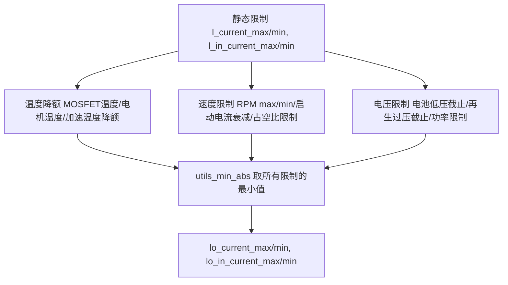
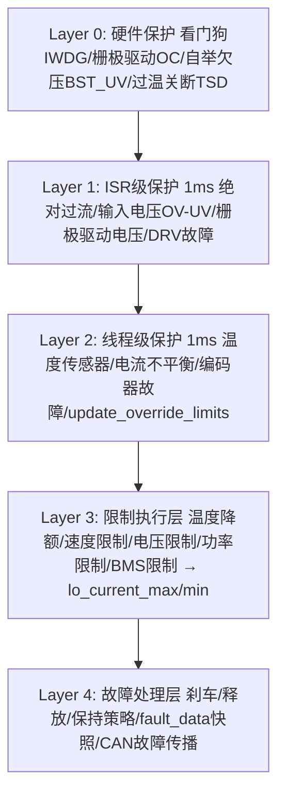

# ⭐ VC-04: VESC 系统保护机制

---

| 属性 | 值 |
|------|-----|
| 文档编号 | VC-04 |
| 标题 | VESC 系统保护机制 |
| 版本 | 1.0 |
| 作者 | 嵌入式系统架构师 |
| 创建日期 | 2026-05-26 |
| 适用平台 | STM32F405RG, VESC 全模式 |
| 固件版本 | FW 7.00 |
| 前置知识 | 电机控制、电力电子保护、嵌入式系统安全 |

---

## 目录 (TOC)

1. [概述](#1-概述)
2. [多层次电流限制系统](#2-多层次电流限制系统)
3. [保护层次架构](#3-保护层次架构)
4. [ISR 级保护 (1ms 定时中断)](#4-isr-级保护-1ms-定时中断)
5. [线程级保护 (run_timer_tasks)](#5-线程级保护-run_timer_tasks)
6. [故障停机机制](#6-故障停机机制)
7. [温度检测与保护](#7-温度检测与保护)
8. [电流不平衡检测](#8-电流不平衡检测)
9. [电压保护](#9-电压保护)
10. [栅极驱动保护](#10-栅极驱动保护)
11. [BMS 集成保护](#11-bms-集成保护)
12. [关机与电源管理](#12-关机与电源管理)
13. [Flash 数据完整性](#13-flash-数据完整性)
14. [CAN 网络故障传播](#14-can-网络故障传播)
15. [编码器故障检测](#15-编码器故障检测)
16. [调试与采样](#16-调试与采样)
17. [参数调优指南](#17-参数调优指南)
18. [文件索引](#18-文件索引)

---

## 1. 概述

VESC 固件实现了一套工业级的多层次、多维度电机保护系统。保护机制分布在 ISR 中断、高优先级线程、低优先级定时任务三个层次，确保在任何时刻都能快速响应故障，同时提供详尽的故障数据用于事后分析。

### 1.1 设计原则

- **纵深防御**：硬件级 (watchdog, 栅极驱动OC) → ISR级 (过流/过压) → 线程级 (温度降额/电流限制) → 应用级 (BMS/超时)
- **故障可追溯**：每次故障记录完整的运行状态快照 (电流/电压/温度/占空比/RPM)
- **优雅降级**：温度升高时线性降低电流限制, 而非直接停机
- **不对称保护**：保留制动能力同时限制加速 (温度降额时不对称限流)

### 1.2 核心文件

| 文件 | 功能 |
|------|------|
| `mc_interface.c` | 保护核心: update_override_limits, run_timer_tasks, mc_interface_mc_timer_isr, fault_stop |
| `mc_interface.h` | 保护 API (故障/状态/限制) |
| `datatypes.h` | mc_configuration 限制参数, fault_data, fault_code |
| `hwconf/hw.h` | 温度传感器宏, 栅极驱动故障宏 |
| `hwconf/shutdown.c` | 电源关机管理 |
| `conf_general.h` | FAC_CURRENT, 硬件限制宏 |

---

## 2. 多层次电流限制系统

### 2.1 update_override_limits 函数

位于 `mc_interface.c` 的 `update_override_limits()` 是保护系统的核心。它从 10+ 个维度计算运行时电流限制，取所有限制中的最小值：



### 2.2 温度降额曲线

**MOSFET 温度降额**:
```text
电流限制
  ▲
  │  l_current_max ───────────┐
  │                            ╲
  │                             ╲  (线性)
  │                              ╲
  │  0 ──────────────────────────┼─────────
  │                              │
  └──── l_temp_fet_start ─ l_temp_fet_end → 温度
```

```c
// mc_interface.c - update_override_limits()
if (motor->m_temp_fet < (conf->l_temp_fet_start + 0.1)) {
    // 正常范围, 不限制
} else if (motor->m_temp_fet > (conf->l_temp_fet_end - 0.1)) {
    lo_min_mos = 0.0;
    lo_max_mos = 0.0;
    mc_interface_fault_stop(FAULT_CODE_OVER_TEMP_FET, ...); // 超温故障
} else {
    // 线性降额
    maxc = utils_map(temp_fet, l_temp_fet_start, l_temp_fet_end, maxc_ref, 0.0);
}
```

**电机温度降额** (同样逻辑):
```c
// mc_interface.c
// 电机温度线性降额, 超过 l_temp_motor_end 触发 FAULT_CODE_OVER_TEMP_MOTOR
```

### 2.3 加速温度降额 (保留制动能力)

```c
// mc_interface.c
// 加速时使用更激进的降额起始温度, 保留制动时更高的电流裕量
const float temp_fet_accel_start = utils_map(
    conf->l_temp_accel_dec, 0.0, 1.0,
    conf->l_temp_fet_start, 25.0);

const float temp_fet_accel_end = utils_map(
    conf->l_temp_accel_dec, 0.0, 1.0,
    conf->l_temp_fet_end, 25.0);

// lo_fet_temp_accel: 基于加速温度的独立降额
// lo_motor_temp_accel: 同上
```

### 2.4 RPM 速度限制

```c
// mc_interface.c
// 正转速限制 (RPM > l_max_erpm * l_erpm_start → 电流衰减)
const float rpm_pos_cut_start = conf->l_max_erpm * conf->l_erpm_start;
const float rpm_pos_cut_end = conf->l_max_erpm;
lo_max_rpm = utils_map(rpm_now, rpm_pos_cut_start, rpm_pos_cut_end,
                       l_current_max_tmp, 0.0);

// 负转速限制 (对称)
const float rpm_neg_cut_start = conf->l_min_erpm * conf->l_erpm_start;
const float rpm_neg_cut_end = conf->l_min_erpm;
lo_min_rpm = utils_map(rpm_now, rpm_neg_cut_start, rpm_neg_cut_end,
                       l_current_max_tmp, 0.0);
```

### 2.5 启动电流衰减

```c
// mc_interface.c
// 零速时限制电流为 foc_start_curr_dec 比例, 防止启动冲击
float lo_max_curr_dec = l_current_max_tmp;
if (rpm_abs < conf->foc_start_curr_dec_rpm) {
    lo_max_curr_dec = utils_map(rpm_abs, 0, conf->foc_start_curr_dec_rpm,
        conf->foc_start_curr_dec * l_current_max_tmp,
        l_current_max_tmp);
}
```

### 2.6 占空比限制

```c
// mc_interface.c
// 高占空比时限制电流, 防止电压饱和失控
float lo_max_duty = 0.0;
if (duty_now_abs < (conf->l_duty_start * conf->l_max_duty) || 
    conf->l_duty_start > 0.99) {
    lo_max_duty = l_current_max_tmp;
} else {
    lo_max_duty = utils_map(duty_now_abs,
        (conf->l_duty_start * conf->l_max_duty),
        conf->l_max_duty, l_current_max_tmp,
        conf->cc_min_current * 5.0);
}
```

### 2.7 电池电压截止

```c
// mc_interface.c
// 电池低压截止 (输入电流限制)
float lo_in_max_batt = 0.0;
if (v_in > (conf->l_battery_cut_start - 0.1)) {
    lo_in_max_batt = conf->l_in_current_max;
} else if (v_in < (conf->l_battery_cut_end + 0.1)) {
    lo_in_max_batt = 0.0;
} else {
    lo_in_max_batt = utils_map(v_in, conf->l_battery_cut_start,
        conf->l_battery_cut_end, conf->l_in_current_max, 0.0);
}
```

### 2.8 再生过压截止

```c
// mc_interface.c
// 电池过压时限制再生电流 (防止电池过充/过压)
float lo_in_min_batt = 0.0;
if (v_in < (conf->l_battery_regen_cut_start + 0.1)) {
    lo_in_min_batt = conf->l_in_current_min;  // 允许全制动
} else if (v_in > (conf->l_battery_regen_cut_end - 0.1)) {
    lo_in_min_batt = 0.0;  // 禁止再生
} else {
    lo_in_min_batt = utils_map(v_in, conf->l_battery_regen_cut_start,
        conf->l_battery_regen_cut_end, conf->l_in_current_min, 0.0);
}
```

### 2.9 功率限制

```c
// mc_interface.c
const float lo_in_max_watt = conf->l_watt_max / v_in; // P = V × I → I = P/V
const float lo_in_min_watt = conf->l_watt_min / v_in;

float lo_in_max = utils_min_abs(lo_in_max_watt, lo_in_max_batt);
float lo_in_min = utils_min_abs(lo_in_min_watt, lo_in_min_batt);
```

### 2.10 BMS 限制叠加

```c
// mc_interface.c
bms_update_limits(&lo_in_min, &lo_in_max,
    conf->l_in_current_min, conf->l_in_current_max);
```

### 2.11 输入电流映射

```c
// mc_interface.c
// 将输入电流限制映射到 Iq 输出限制
float lo_max_i_in = l_current_max_tmp;
if (motor->m_i_in_filter > 0.0 && conf->l_in_current_map_start < 0.98) {
    float frac = motor->m_i_in_filter / conf->lo_in_current_max;
    if (frac > conf->l_in_current_map_start) {
        lo_max_i_in = utils_map(frac, conf->l_in_current_map_start,
            1.0, l_current_max_tmp, 0.0);
    }
}
```

### 2.12 最终综合限制

```c
// mc_interface.c - 取所有限制的最小绝对值
float lo_max = utils_min_abs(lo_max_mos, lo_max_mot);           // 温度
lo_max = utils_min_abs(lo_max, lo_max_rpm);                     // RPM
lo_max = utils_min_abs(lo_max, lo_min_rpm);                     // 负RPM
lo_max = utils_min_abs(lo_max, lo_max_curr_dec);                // 启动
lo_max = utils_min_abs(lo_max, lo_fet_temp_accel);              // 加速温度
lo_max = utils_min_abs(lo_max, lo_motor_temp_accel);            // 加速温度
lo_max = utils_min_abs(lo_max, lo_max_duty);                    // 占空比
lo_max = utils_min_abs(lo_max, lo_max_i_in);                    // 输入电流

// 保底不低于 cc_min_current
if (lo_max < conf->cc_min_current) lo_max = conf->cc_min_current;
if (lo_min > -conf->cc_min_current) lo_min = -conf->cc_min_current;

conf->lo_current_max = lo_max;
conf->lo_current_min = lo_min;
```

---

## 3. 保护层次架构



---

## 4. ISR 级保护 (1ms 定时中断)

### 4.1 mc_interface_mc_timer_isr

```c
// mc_interface.c
void mc_interface_mc_timer_isr(bool is_second_motor, float dt) {
    // ============================
    // 1. 输入电压实时滤波
    // ============================
    float input_voltage = GET_INPUT_VOLTAGE();
    UTILS_LP_FAST(motor->m_input_voltage_filtered, input_voltage, 0.02);

    // ============================
    // 2. 过压/欠压积分检测
    // ============================
    float voltage_diff = 0.0;
    if (input_voltage < conf_now->l_min_vin) {
        voltage_diff = conf_now->l_min_vin - input_voltage;
    } else if (input_voltage > conf_now->l_max_vin) {
        voltage_diff = input_voltage - conf_now->l_max_vin;
    }

    if (voltage_diff > 0.0) {
        wrong_voltage_integrator += voltage_diff * dt;
        const float max_voltage = (conf_now->l_max_vin * 0.05);
        if (wrong_voltage_integrator > max_voltage) {
            // 触发过压/欠压故障
            mc_interface_fault_stop(
                input_voltage < conf_now->l_min_vin ?
                FAULT_CODE_UNDER_VOLTAGE : FAULT_CODE_OVER_VOLTAGE,
                is_second_motor, true);
        }
    } else {
        wrong_voltage_integrator *= 0.99; // 缓慢衰减
    }

    // ============================
    // 3. Ah/Wh 积分
    // ============================
    motor->m_amp_seconds += current * dt;
    motor->m_watt_seconds += current * input_voltage * dt;

    // ============================
    // 4. 波形采样 (环形缓冲区)
    // ============================
    if (m_sample_mode == DEBUG_SAMPLING_NOW || ...) {
        m_curr0_samples[m_sample_now] = GET_CURRENT1();
        m_curr1_samples[m_sample_now] = GET_CURRENT2();
        m_ph1_samples[m_sample_now] = ...;
        // ...
    }

    // ============================
    // 5. 绝对过流检测
    // ============================
    float abs_current = ...; // 三相电流绝对值
    if (conf_now->l_slow_abs_current) {
        if (fabsf(abs_current_filtered) > conf_now->l_abs_current_max) {
            mc_interface_fault_stop(FAULT_CODE_ABS_OVER_CURRENT, ...);
        }
    } else {
        if (fabsf(abs_current) > conf_now->l_abs_current_max) {
            mc_interface_fault_stop(FAULT_CODE_ABS_OVER_CURRENT, ...);
        }
    }

    // ============================
    // 6. DRV 故障检测
    // ============================
    if (IS_DRV_FAULT()) {
        motor->m_drv_fault_iterations++;
        if (motor->m_drv_fault_iterations > 5) {
            mc_interface_fault_stop(FAULT_CODE_DRV, ...);
        }
    }

    // ============================
    // 7. 栅极驱动电压检测
    // ============================
    // (在 HW_HAS_GATE_DRIVER_SUPPLY_MONITOR 硬件上)
}
```

---

## 5. 线程级保护 (run_timer_tasks)

### 5.1 run_timer_tasks 1ms 线程

```c
// mc_interface.c
static void run_timer_tasks(volatile motor_if_state_t *motor) {
    // ============================
    // 1. 电压慢速滤波 (大时间常数)
    // ============================
    float voltage_fc = powf(2.0, -(float)motor->m_conf.m_batt_filter_const * 0.25);
    UTILS_LP_FAST(motor->m_input_voltage_filtered_slower,
                  motor->m_input_voltage_filtered, voltage_fc);

    // ============================
    // 2. 里程计/运行时间持久化
    // ============================
    uint64_t odometer = mc_interface_get_distance_abs();
    g_backup.odometer += odometer - motor->m_odometer_last;
    motor->m_odometer_last = odometer;

    // ============================
    // 3. DRV 故障恢复计数
    // ============================
    if (IS_DRV_FAULT()) {
        motor->m_drv_fault_iterations++;
    } else {
        motor->m_drv_fault_iterations = 0;
    }

    // ============================
    // 4. update_override_limits
    // ============================
    update_override_limits(motor, &motor->m_conf);

    // ============================
    // 5. 辅助输出管理
    // ============================
    switch (motor->m_conf.m_out_aux_mode) {
    case OUT_AUX_MODE_ON_WHEN_RUNNING:
        // 运行时控制辅助输出
        break;
    case OUT_AUX_MODE_MOTOR_50:
        // 电机温度 > 50°C 时开启
        break;
    // ...
    }

    // ============================
    // 6. 电流不平衡检测
    // ============================
    float curr_unbalance = mcpwm_foc_get_abs_motor_current_unbalance();
    if (curr_unbalance > MCCONF_MAX_CURRENT_UNBALANCE) {
        motor->m_motor_current_unbalance_error_rate +=
            MCCONF_MAX_CURRENT_UNBALANCE_RATE;
        if (motor->m_motor_current_unbalance_error_rate > 1.0) {
            mc_interface_fault_stop(FAULT_CODE_UNBALANCED_CURRENTS, ...);
        }
    } else {
        motor->m_motor_current_unbalance_error_rate -= 0.1;
    }

    // ============================
    // 7. 编码器故障检测
    // ============================
    // ...
}
```

---

## 6. 故障停机机制

### 6.1 故障触发

```c
// mc_interface.c
void mc_interface_fault_stop(mc_fault_code fault, bool is_second_motor,
                             bool is_isr) {
    m_fault_data.fault_code = fault;
    m_fault_data.is_second_motor = is_second_motor;

    if (is_isr) {
        // ISR 上下文: 使用 chEvtSignalI (ISR安全)
        chSysLockFromISR();
        chEvtSignalI(fault_stop_tp, (eventmask_t) 1);
        chSysUnlockFromISR();
    } else {
        // 线程上下文: 使用 chEvtSignal
        chEvtSignal(fault_stop_tp, (eventmask_t) 1);
    }
}
```

### 6.2 故障处理线程

```c
// mc_interface.c - HIGHPRIO - 3
static THD_WORKING_AREA(fault_stop_thread_wa, 512);
static THD_FUNCTION(fault_stop_thread, arg) {
    for(;;) {
        chEvtWaitAny((eventmask_t)1);

        mc_fault_code fault = m_fault_data.fault_code;

        // 记录故障快照
        fault_data fd;
        fd.motor = m_fault_data.is_second_motor ? 2 : 1;
        fd.fault = fault;
        fd.current = mc_interface_get_tot_current();
        fd.current_filtered = mc_interface_get_tot_current_filtered();
        fd.voltage = mc_interface_get_input_voltage_filtered();
        fd.gate_driver_voltage = ...;
        fd.duty = mc_interface_get_duty_cycle_now();
        fd.rpm = mc_interface_get_rpm();
        fd.tacho = mc_interface_get_tachometer_value(false);
        fd.cycles_running = ...;
        fd.temperature = mc_interface_temp_fet_filtered();
        fd.info_str = m_fault_data.info_str;
        fd.info_argn = m_fault_data.info_argn;
        fd.info_args[0] = m_fault_data.info_args[0];
        fd.info_args[1] = m_fault_data.info_args[1];

        // 根据故障类型执行停机策略
        switch(fault) {
        case FAULT_CODE_ABS_OVER_CURRENT:
        case FAULT_CODE_DRV:
            // 立即释放电机 (三相全关)
            mc_interface_release_motor();
            mcpwm_foc_stop_pwm(is_second_motor);
            break;

        case FAULT_CODE_OVER_VOLTAGE:
        case FAULT_CODE_UNDER_VOLTAGE:
            // 全制动
            mc_interface_brake_now();
            break;

        case FAULT_CODE_OVER_TEMP_FET:
        case FAULT_CODE_OVER_TEMP_MOTOR:
            // 当前限制已归零, 等待温度降低
            break;

        default:
            break;
        }
    }
}
```

### 6.3 故障数据记录结构

```c
// datatypes.h
typedef struct {
    uint8_t motor;               // 电机编号 (1/2)
    mc_fault_code fault;         // 故障码
    float current;               // 故障时刻瞬时电流 (A)
    float current_filtered;      // 故障时刻滤波电流 (A)
    float voltage;               // 故障时刻输入电压 (V)
    float gate_driver_voltage;   // 栅极驱动电压 (V)
    float duty;                  // 故障时刻占空比
    float rpm;                   // 故障时刻 ERPM
    int tacho;                   // 累计脉冲计数
    int cycles_running;          // 已运行周期数
    int tim_val_samp;            // 采样时刻定时器值
    int tim_current_samp;        // 电流采样定时器值
    int tim_top;                 // TIM ARR 值
    int comm_step;               // 换相步 (仅BLDC)
    float temperature;           // MOSFET 温度 (°C)
    int drv8301_faults;          // DRV8301 故障寄存器原始值
    const char *info_str;        // 附加信息字符串
    int info_argn;               // 附加参数数量
    float info_args[2];          // 附加参数
} fault_data;
```

---

## 7. 温度检测与保护

### 7.1 温度传感器类型

| 传感器类型 | 枚举值 | 公式 |
|-----------|--------|------|
| NTC 10K@25°C | `TEMP_SENSOR_NTC_10K_25C` | Steinhart-Hart / Beta |
| PTC 1K@100°C | `TEMP_SENSOR_PTC_1K_100C` | R/R0 = 1+α(T-T0) |
| KTY83-122 | `TEMP_SENSOR_KTY83_122` | 三次多项式拟合 |
| NTC 100K@25°C | `TEMP_SENSOR_NTC_100K_25C` | Beta 方程 |
| KTY84-130 | `TEMP_SENSOR_KTY84_130` | 四次多项式拟合 |
| NTCX | `TEMP_SENSOR_NTCX` | 自定义 R, β, Tbase |
| PTCX | `TEMP_SENSOR_PTCX` | 自定义 R, Coeff, Tbase |
| PT1000 | `TEMP_SENSOR_PT1000` | RTD 线性公式 |
| DISABLED | `TEMP_SENSOR_DISABLED` | 使用 m_temp_override |

### 7.2 NTC 10K 温度计算公式

```c
// hwconf/hw.h
// Beta 方程: 1/T = 1/T0 + (1/β) × ln(R/R0)
#define NTC_TEMP_MOTOR(beta) \
    (1.0 / ((logf(NTC_RES_MOTOR(ADC_Value[ADC_IND_TEMP_MOTOR]) / 10000.0) / beta) + \
    (1.0 / 298.15)) - 273.15)
```

其中:
- `R0 = 10000 Ω` (25°C 时)
- `T0 = 298.15 K` (25°C)
- `beta` 由 `m_ntc_motor_beta` 配置 (典型值 3380~4300)

### 7.3 KTY83-122 三次多项式

```c
// mc_interface.c
// 基于 KTY83_122 数据手册拟合
float res = NTC_RES_MOTOR(ADC_Value[...]);
float pow2 = res * res;
temp_motor = 0.0000000102114874947423 * pow2 * res
           - 0.000069967997703501 * pow2
           + 0.243402040973194 * res
           - 160.145048329356;
```

### 7.4 KTY84-130 四次多项式

```c
// mc_interface.c
temp_motor = -7.82531699e-12 * res * res * res * res
           + 6.34445902e-8 * res * res * res
           - 0.00020119157 * res * res
           + 0.407683016 * res
           - 161.357536;
```

### 7.5 温度异常保护

```c
// mc_interface.c - update_override_limits()
// 保护滤波器不被非法值污染
if (UTILS_IS_NAN(temp_motor) || UTILS_IS_INF(temp_motor) ||
    temp_motor > 600.0 || temp_motor < -200.0) {
    temp_motor = -100.0;  // 置为安全值, 继续运行
}

// 一阶低通
UTILS_LP_FAST(motor->m_temp_motor, temp_motor, MOTOR_TEMP_LPF);
UTILS_LP_FAST(motor->m_temp_fet, NTC_TEMP(...), 0.1);
```

---

## 8. 电流不平衡检测

### 8.1 检测原理

```c
// mc_interface.c - run_timer_tasks()
float curr_unbalance = mcpwm_foc_get_abs_motor_current_unbalance();

// 阈值: MCCONF_MAX_CURRENT_UNBALANCE = FAC_CURRENT * 512
if (curr_unbalance > MCCONF_MAX_CURRENT_UNBALANCE) {
    motor->m_motor_current_unbalance_error_rate +=
        MCCONF_MAX_CURRENT_UNBALANCE_RATE;  // 每次 +0.3

    if (motor->m_motor_current_unbalance_error_rate > 1.0) {
        mc_interface_fault_stop(FAULT_CODE_UNBALANCED_CURRENTS,
            !is_motor_1, false);
    }
} else {
    motor->m_motor_current_unbalance_error_rate -= 0.1; // 衰减
    if (motor->m_motor_current_unbalance_error_rate < 0.0) {
        motor->m_motor_current_unbalance_error_rate = 0.0;
    }
}
```

采用积分式判断 (非瞬时), 避免误触。

---

## 9. 电压保护

### 9.1 输入电压保护相关参数

| 参数 | 说明 |
|------|------|
| `l_min_vin` | 最低允许输入电压 |
| `l_max_vin` | 最高允许输入电压 |
| `l_battery_cut_start` | 电池低压开始限流 |
| `l_battery_cut_end` | 电池低压截止点 |
| `l_battery_regen_cut_start` | 再生过压开始限流 |
| `l_battery_regen_cut_end` | 再生过压截止点 |

### 9.2 栅极驱动电压保护

```c
// mc_interface.c - mc_interface_mc_timer_isr
#ifdef HW_HAS_GATE_DRIVER_SUPPLY_MONITOR
UTILS_LP_FAST(motor->m_gate_driver_voltage, GET_GATE_DRIVER_SUPPLY_VOLTAGE(), 0.01);

if (motor->m_gate_driver_voltage > HW_GATE_DRIVER_SUPPLY_MAX_VOLTAGE) {
    mc_interface_fault_stop(FAULT_CODE_GATE_DRIVER_OVER_VOLTAGE, ...);
}
if (motor->m_gate_driver_voltage < HW_GATE_DRIVER_SUPPLY_MIN_VOLTAGE) {
    mc_interface_fault_stop(FAULT_CODE_GATE_DRIVER_UNDER_VOLTAGE, ...);
}
#endif
```

---

## 10. 栅极驱动保护

### 10.1 DRV8301 过流模式

```c
typedef enum {
    DRV8301_OC_LIMIT = 0,          // 逐周期限流
    DRV8301_OC_LATCH_SHUTDOWN,     // 锁存关断
    DRV8301_OC_REPORT_ONLY,        // 仅上报
    DRV8301_OC_DISABLED            // 禁用
} drv8301_oc_mode;
```

### 10.2 DRV 故障检测与恢复

```c
// ISR 中
if (IS_DRV_FAULT()) {
    motor->m_drv_fault_iterations++;
    if (motor->m_drv_fault_iterations > 5) { // 5次确认
        mc_interface_fault_stop(FAULT_CODE_DRV, ...);
    }
} else {
    motor->m_drv_fault_iterations = 0;
}

// 在 run_timer_tasks 中尝试恢复
if (motor->m_drv_fault_iterations > 0 && motor->m_drv_fault_iterations < 100) {
    // 尝试通过 DRV 寄存器复位故障
    drv8301_reset_faults();
}
```

### 10.3 死区时间

```c
// conf_general.h
#define HW_DEAD_TIME_NSEC    360.0

// conf_general.c
uint8_t conf_general_calculate_deadtime(float deadtime_ns, float core_clock_freq);
// 死区时间 = deadtime_ns / (1 / core_clock_freq) / 2
// 360ns @ 168MHz → 30 个定时器时钟周期
```

---

## 11. BMS 集成保护

### 11.1 BMS 配置结构

```c
// datatypes.h
typedef struct {
    BMS_TYPE type;                    // BMS 类型 (NONE / VESC)
    uint8_t limit_mode;              // 限制模式
    float t_limit_start;             // 温度降额起始
    float t_limit_end;               // 温度降额终止
    float soc_limit_start;           // SOC 降额起始
    float soc_limit_end;             // SOC 降额终止
    float vmin_limit_start;          // 最低单体电压降额起始
    float vmin_limit_end;            // 最低单体电压降额终止
    float vmax_limit_start;          // 最高单体电压降额起始
    float vmax_limit_end;            // 最高单体电压降额终止
    BMS_FWD_CAN_MODE fwd_can_mode;   // CAN 转发模式
} bms_config;
```

### 11.2 BMS 采样数据

```c
// datatypes.h - bms_values (50 节单体 + 50 个温度点)
typedef struct {
    float v_tot;                        // 总电压
    float v_charge;                     // 充电电压
    float i_in;                         // 电流
    float i_in_ic;                      // IC 电流
    float ah_cnt;                       // Ah 计数
    float wh_cnt;                       // Wh 计数
    int cell_num;                       // 单体数量
    float v_cell[BMS_MAX_CELLS];        // 各单体电压 (最多50)
    bool bal_state[BMS_MAX_CELLS];      // 均衡状态
    int temp_adc_num;                   // 温度采集数量
    float temps_adc[BMS_MAX_TEMPS];     // 温度值 (最多50)
    float temp_ic;                      // IC 温度
    float temp_hum;                     // 湿度温度
    float pressure;                     // 气压
    float hum;                          // 湿度
    float temp_max_cell;                // 最高单体温度
    float v_cell_min;                   // 最低单体电压
    float v_cell_max;                   // 最高单体电压
    float soc;                          // SOC (%)
    float soh;                          // SOH (%)
    int can_id;                         // CAN ID
    float ah_cnt_chg_total;             // 总充电 Ah
    float wh_cnt_chg_total;             // 总充电 Wh
    float ah_cnt_dis_total;             // 总放电 Ah
    float wh_cnt_dis_total;             // 总放电 Wh
    int is_charging;                    // 充电标志
    int is_balancing;                   // 均衡标志
    int is_charge_allowed;              // 充电允许
    int data_version;                   // 数据版本
    char status[BMS_STATUS_LEN];        // 状态字符串
    systime_t update_time;              // 更新时刻
} bms_values;
```

### 11.3 BMS CAN 转发模式

| 模式 | 枚举值 | 说明 |
|------|--------|------|
| `BMS_FWD_CAN_MODE_DISABLED` | 0 | 不转发 |
| `BMS_FWD_CAN_MODE_USB_ONLY` | 1 | 仅 USB 转发 |
| `BMS_FWD_CAN_MODE_ANY` | 2 | 全部通道转发 |

---

## 12. 关机与电源管理

### 12.1 关机模式

```c
typedef enum {
    SHUTDOWN_MODE_ALWAYS_OFF = 0,     // 始终关闭
    SHUTDOWN_MODE_ALWAYS_ON,          // 始终开启
    SHUTDOWN_MODE_TOGGLE_BUTTON_ONLY, // 按钮切换
    SHUTDOWN_MODE_OFF_AFTER_10S,      // 10秒后关闭
    SHUTDOWN_MODE_OFF_AFTER_1M,       // 1分钟后关闭
    SHUTDOWN_MODE_OFF_AFTER_5M,       // 5分钟后关闭
    SHUTDOWN_MODE_OFF_AFTER_10M,      // 10分钟后关闭
    SHUTDOWN_MODE_OFF_AFTER_30M,      // 30分钟后关闭
    SHUTDOWN_MODE_OFF_AFTER_1H,       // 1小时后关闭
    SHUTDOWN_MODE_OFF_AFTER_5H,       // 5小时后关闭
} SHUTDOWN_MODE;
```

### 12.2 关机实现

```c
// hwconf/shutdown.c
void shutdown_init(void);
void shutdown_set_mode(SHUTDOWN_MODE mode);
void shutdown_hold(bool hold_on);    // 保持电源
void shutdown_timer_reset(void);     // 重置关机计时器
```

---

## 13. Flash 数据完整性

### 13.1 CRC 保护

```c
// datatypes.h
typedef struct {
    // ... 所有配置参数 ...
    uint16_t crc;  // CRC16 校验 (位于结构体末尾)
} mc_configuration;

typedef struct {
    // ... 所有应用配置 ...
    uint16_t crc;  // CRC16 校验
} app_configuration;
```

### 13.2 Flash 损坏故障

```c
// datatypes.h
FAULT_CODE_FLASH_CORRUPTION,           // 通用 Flash 损坏
FAULT_CODE_FLASH_CORRUPTION_APP_CFG,   // 应用配置损坏
FAULT_CODE_FLASH_CORRUPTION_MC_CFG,    // 电机配置损坏
```

### 13.3 Backup Data 完整性

```c
// datatypes.h
#define BACKUP_VAR_INIT_CODE    92891934

typedef struct __attribute__((packed)) {
    uint32_t odometer_init_flag;       // 里程计初始化标志
    uint64_t odometer;                 // 里程 (米)

    uint32_t runtime_init_flag;        // 运行时间初始化标志
    uint64_t runtime;                  // 运行时间 (秒)

    uint32_t hw_config_init_flag;      // 硬件配置初始化标志
    uint8_t hw_config[128];

    uint32_t enc_corr_init_flag;       // 编码器校正表标志
    int8_t enc_corr_en;
    int8_t enc_corr[360];

    uint32_t can_init_flag;
    uint8_t can_baud;
    uint8_t can_id;
} backup_data;
```

每个独立数据块有自己的 `init_flag` (Magic Number), 确保部分损坏不影响其他数据。

### 13.4 Watchdog 复位检测

```c
// 启动时检测: 是否从看门狗复位启动
if (RCC_GetFlagStatus(RCC_FLAG_IWDGRST) != RESET) {
    mc_interface_fault_stop(FAULT_CODE_BOOTING_FROM_WATCHDOG_RESET, ...);
    RCC_ClearFlag();
}
```

---

## 14. CAN 网络故障传播

### 14.1 机制

VESC 通过 CAN 总线传播故障状态，实现多 ESC 协同保护：

```c
// CAN 状态消息中包含:
// CAN_PACKET_STATUS: rpm, current, duty → 间接反映故障
// CAN_PACKET_STATUS_4: temp_fet, temp_motor → 温度传播
```

### 14.2 速度超限故障

```c
// mc_interface.c - update_override_limits()
// 可选的额外故障 (l_additional_faults 位掩码)
if ((conf->l_additional_faults & (1 << 1)) && rpm_slow > conf->l_max_erpm) {
    mc_interface_fault_stop(FAULT_CODE_OVERSPEED, ...);
}
if ((conf->l_additional_faults & (1 << 2)) && rpm_slow < conf->l_min_erpm) {
    mc_interface_fault_stop(FAULT_CODE_UNDERSPEED, ...);
}
if ((conf->l_additional_faults & (1 << 3)) &&
    fabsf(rpm_slow) > fabsf(utils_max_abs(conf->l_min_erpm, conf->l_max_erpm))) {
    mc_interface_fault_stop(FAULT_CODE_ABS_OVERSPEED, ...);
}
```

### 14.3 通信超时保护

```c
// datatypes.h - app_configuration
uint32_t timeout_msec;           // 通信超时 (ms)
float timeout_brake_current;     // 超时制动电流

// 当在 timeout_msec 内未收到有效控制指令时:
// 1. 施加 timeout_brake_current 的制动电流
// 2. 进入安全模式
```

---

## 15. 编码器故障检测

### 15.1 编码器故障类型

| 故障码 | 说明 |
|--------|------|
| `FAULT_CODE_ENCODER_SPI` | SPI 通信故障 |
| `FAULT_CODE_ENCODER_SINCOS_BELOW_MIN_AMPLITUDE` | Sin/Cos 信号幅值过低 |
| `FAULT_CODE_ENCODER_SINCOS_ABOVE_MAX_AMPLITUDE` | Sin/Cos 信号幅值过高 |
| `FAULT_CODE_ENCODER_NO_MAGNET` | 无磁铁 (AS5047) |
| `FAULT_CODE_ENCODER_MAGNET_TOO_STRONG` | 磁铁过强 |
| `FAULT_CODE_ENCODER_FAULT` | 通用编码器故障 |
| `FAULT_CODE_ENCODER_SLIP` | 编码器打滑检测 |
| `FAULT_CODE_RESOLVER_LOT` | Resolver 信号丢失 |
| `FAULT_CODE_RESOLVER_DOS` | Resolver 信号降级 |
| `FAULT_CODE_RESOLVER_LOS` | Resolver 信号丢失 |

---

## 16. 调试与采样

### 16.1 采样触发模式

```c
typedef enum {
    DEBUG_SAMPLING_OFF = 0,                   // 关闭
    DEBUG_SAMPLING_NOW,                       // 立即采样
    DEBUG_SAMPLING_START,                     // 开始连续采样
    DEBUG_SAMPLING_TRIGGER_START,             // 触发后开始
    DEBUG_SAMPLING_TRIGGER_FAULT,             // 故障触发
    DEBUG_SAMPLING_TRIGGER_START_NOSEND,      // 触发后开始 (不发送)
    DEBUG_SAMPLING_TRIGGER_FAULT_NOSEND,      // 故障触发 (不发送)
    DEBUG_SAMPLING_SEND_LAST_SAMPLES,         // 发送上一次采样
    DEBUG_SAMPLING_SEND_SINGLE_SAMPLE         // 发送单次采样
} debug_sampling_mode;
```

### 16.2 采样缓冲区

```c
// mc_interface.c - CCM RAM (.ram4 段, 零等待访问)
#define ADC_SAMPLE_MAX_LEN    1000

__attribute__((section(".ram4"))) static volatile int16_t m_curr0_samples[1000];
__attribute__((section(".ram4"))) static volatile int16_t m_curr1_samples[1000];
__attribute__((section(".ram4"))) static volatile int16_t m_curr2_samples[1000];
__attribute__((section(".ram4"))) static volatile int16_t m_ph1_samples[1000];
__attribute__((section(".ram4"))) static volatile int16_t m_ph2_samples[1000];
__attribute__((section(".ram4"))) static volatile int16_t m_ph3_samples[1000];
__attribute__((section(".ram4"))) static volatile int16_t m_vzero_samples[1000];
__attribute__((section(".ram4"))) static volatile uint8_t m_status_samples[1000];
__attribute__((section(".ram4"))) static volatile int16_t m_curr_fir_samples[1000];
__attribute__((section(".ram4"))) static volatile int16_t m_f_sw_samples[1000];
__attribute__((section(".ram4"))) static volatile int8_t m_phase_samples[1000];
```

共 11 条采样通道, 每条 1000 点, 总计容纳约 11ms 的 1μs 级别高速采样数据。

---

## 17. 参数调优指南

### 17.1 保护参数推荐值

| 参数 | 推荐起始值 | 应用调整 |
|------|-----------|---------|
| `l_temp_fet_start` | 80°C | 根据 MOSFET 规格书 Tj(max) |
| `l_temp_fet_end` | 100°C | 留 20~30°C 裕量 |
| `l_temp_motor_start` | 80°C | 根据电机绝缘等级 |
| `l_temp_motor_end` | 110°C | 根据电机规格 |
| `l_abs_current_max` | 2× l_current_max | 足够裕量避免误触发 |
| `l_battery_cut_start` | 3.3V × cells | 电池放电曲线拐点 |
| `l_battery_cut_end` | 3.0V × cells | 最低安全电压 |
| `l_battery_regen_cut_start` | 4.1V × cells | 接近满充电压 |
| `l_battery_regen_cut_end` | 4.25V × cells | 绝对上限 |
| `l_watt_max` | 额定功率 × 1.2 | 短时过载能力 |
| `foc_start_curr_dec` | 0.3 | 启动电流限制系数 |
| `l_duty_start` | 0.9 | 进入占空比限制的起始点 |

### 17.2 故障排查流程

```text
故障发生
    │
    ├─ 查看 mc_values.fault_code ──► 定位故障类型
    │
    ├─ 查看 fault_data:
    │   ├─ current, current_filtered  → 是否过流
    │   ├─ voltage                    → 是否过/欠压
    │   ├─ gate_driver_voltage        → 驱动电源是否正常
    │   ├─ duty                       → 是否大占空比
    │   ├─ rpm                        → 速度状态
    │   ├─ temperature                → 是否过温
    │   └─ drv8301_faults             → 驱动芯片原始故障
    │
    ├─ 使用 VESC Tool 实时图查看:
    │   ├─ 电流波形 → 振荡/噪声
    │   ├─ 电压波形 → 跌落/过冲
    │   └─ 温度曲线 → 温升速率
    │
    └─ 使用 DEBUG_SAMPLING_TRIGGER_FAULT 捕获故障时刻高速波形
```

---

## 18. 文件索引

| 文件路径 | 功能说明 |
|---------|---------|
| `mc_interface.c` | update_override_limits (L2239), run_timer_tasks (L2551), mc_interface_mc_timer_isr, fault_stop |
| `mc_interface.h` | mc_interface_fault_stop, mc_interface_get_fault, mc_state |
| `datatypes.h` | mc_configuration (限制参数), fault_data, fault_code (L145-L179), bms_config, bms_values, backup_data |
| `mcpwm_foc.c` | mcpwm_foc_adc_int_handler (ISR), control_current (电流PI+限幅) |
| `mcpwm_foc.h` | mcpwm_foc_get_abs_motor_current_unbalance, mcpwm_foc_stop_pwm |
| `hwconf/hw.h` | 温度传感器宏 (L596-L624), 电流校准宏, IS_DRV_FAULT, HW_DEAD_TIME_NSEC |
| `hwconf/shutdown.c` | shutdown_set_mode, shutdown_hold, 定时关机 |
| `hwconf/shutdown.h` | SHUTDOWN_MODE 枚举 / API |
| `hwconf/drv8301.c` | DRV8301 故障寄存器, OC 模式配置 |
| `hwconf/drv8305.c` | DRV8305 驱动配置 |
| `conf_general.h` | FAC_CURRENT, CURRENT_CAL, 死区时间计算, FOC_PROFILE |
| `conf_general.c` | conf_general_calculate_deadtime, 配置 CRC 校验 |
| `comm/comm_can.c` | CAN 状态发送, CAN 故障传播 |
| `utils_math.c` | UTILS_LP_FAST, utils_map, UTILS_IS_NAN |