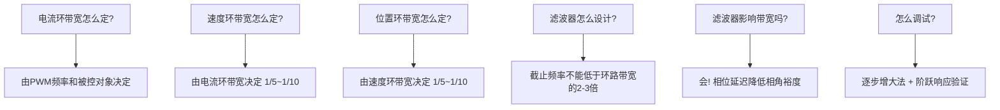
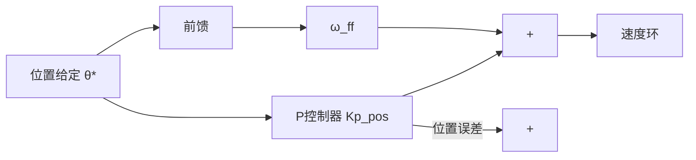

# ADV-ALG-01 控制环带宽设计与滤波器工程

**模块编号：** ADV-ALG-01
**模块名称：** 控制环带宽设计与滤波器工程（Control Loop Bandwidth Design & Filter Engineering）
**文档版本：** v2.0
**适用对象：** 已掌握FOC基本原理和PI控制的嵌入式工程师
**前置知识：** ALG-01 FOC理论基础、ALG-05 有感FOC实现、自动控制原理（传递函数、Bode图）
**难度等级：** ★★★★☆

---

## 1. 核心摘要

**一句话：** 带宽是控制环的"呼吸频率"——太低则响应迟钝，太高则噪声敏感，而滤波器是带宽的"守门人"——滤除噪声但引入相位延迟，二者必须联合设计。

**认知挂钩：** 把三环控制系统想象成一支军队：电流环是前线步兵，必须最快响应（kHz级）；速度环是营级指挥，需要统筹但不必事事亲力（百Hz级）；位置环是师级指挥部，关注大局方向（十Hz级）。每级之间约5-10倍的带宽衰减，保证了系统的稳定性和层次性。滤波器则是通信兵——信息过滤太狠会延误军情（相位延迟），不过滤则会被假情报干扰（噪声放大）。

**核心问题链：**



**典型配置速查表：**

| 控制环 | 典型带宽 | 典型频率范围 | 控制器类型 | 采样率 |
|--------|---------|-------------|-----------|--------|
| 电流环 | 1-3 kHz | f_PWM/10 ~ f_PWM/20 | PI | f_PWM |
| 速度环 | 100-500 Hz | f_BW_current/5 ~ /10 | PI | f_PWM/4 ~ /10 |
| 位置环 | 10-100 Hz | f_BW_speed/5 ~ /10 | P | f_PWM/10 ~ /20 |

---

## 2. 电流环带宽设计

### 2.1 电流环被控对象模型

PMSM在dq坐标系下的电压方程：

$$
\begin{cases}
u_d = R_s \cdot i_d + L_d \frac{di_d}{dt} - \omega_e L_q i_q \\
u_q = R_s \cdot i_q + L_q \frac{di_q}{dt} + \omega_e (L_d i_d + \psi_f)
\end{cases}
$$

其中：
- $R_s$：定子电阻
- $L_d, L_q$：d轴、q轴电感
- $\psi_f$：永磁体磁链
- $\omega_e$：电角速度

**忽略交叉耦合项**（后续由前馈解耦处理），d轴和q轴的电流环被控对象均为一阶RL电路：

$$
G_{plant}(s) = \frac{I(s)}{U(s)} = \frac{1}{Ls + R} = \frac{1/R}{\tau_e s + 1}
$$

其中：
- $G_{plant}(s)$：被控对象传递函数
- $I(s)$：电流拉普拉斯变换（A）
- $U(s)$：电压拉普拉斯变换（V）
- $L$：相电感（H），SPMSM中 $L = L_s$
- $R$：相电阻（Ω），即 $R_s$
- $\tau_e = L/R$：电气时间常数（s）

> **表贴式PMSM（SPMSM）**：$L_d = L_q = L_s$，d轴和q轴模型完全相同
>
> **内埋式PMSM（IPMSM）**：$L_d < L_q$，d轴和q轴需要分别设计参数

### 2.2 零极点对消法（PI参数与带宽的关系）

电流环采用PI控制器：

$$
G_{PI}(s) = K_p + \frac{K_i}{s} = K_p \cdot \frac{s + K_i/K_p}{s}
$$

其中：
- $G_{PI}(s)$：PI控制器传递函数
- $K_p$：比例增益（V/A）
- $K_i$：积分增益（V/(A·s)）

**零极点对消原理：** 令PI控制器的零点等于被控对象的极点，即：

$$
\frac{K_i}{K_p} = \frac{R}{L}
$$

这样PI的零点 $s = -K_i/K_p$ 与被控对象的极点 $s = -R/L$ 对消，系统简化为一阶惯性环节。

**闭环传递函数推导（以q轴为例，SPMSM）：**

开环传递函数：

$$
G_{ol}(s) = K_p \cdot \frac{s + R/L}{s} \cdot \frac{1}{Ls + R} = K_p \cdot \frac{s + R/L}{s} \cdot \frac{1/L}{s + R/L} = \frac{K_p/L}{s}
$$

其中：
- $G_{ol}(s)$：开环传递函数
- $K_p$：PI比例增益（V/A）
- $L$：相电感（H）
- $R$：相电阻（Ω）

闭环传递函数：

$$
G_{cl}(s) = \frac{G_{ol}(s)}{1 + G_{ol}(s)} = \frac{K_p/L}{s + K_p/L} = \frac{\omega_{cl}}{s + \omega_{cl}}
$$

其中：
- $G_{cl}(s)$：闭环传递函数
- $\omega_{cl} = K_p/L$：闭环带宽（rad/s）

因此 **电流环闭环带宽**：

$$
\boxed{\omega_{cl} = \frac{K_p}{L_s} \quad (\text{SPMSM})}
$$

$$
\boxed{\omega_{cl,d} = \frac{K_p}{L_d}, \quad \omega_{cl,q} = \frac{K_p}{L_q} \quad (\text{IPMSM})}
$$

其中：
- $\omega_{cl}$：电流环闭环带宽（rad/s）
- $K_p$：PI比例增益（V/A）
- $L_s$：SPMSM相电感（H）
- $L_d, L_q$：IPMSM的d轴、q轴电感（H）
- $\omega_{cl,d}, \omega_{cl,q}$：IPMSM的d轴、q轴闭环带宽（rad/s）

> **注意：** 对于IPMSM，如果d轴和q轴使用相同的Kp，则d轴和q轴的闭环带宽不同（$L_d < L_q$，所以d轴带宽更高）。若要d/q轴带宽一致，需要分别设置Kp。

**从带宽反推PI参数：**

$$
\begin{cases}
K_p = \omega_{cl} \cdot L_s \\
K_i = \omega_{cl} \cdot R
\end{cases}
$$

其中：
- $K_p$：PI比例增益（V/A）
- $K_i$：PI积分增益（V/(A·s)）
- $\omega_{cl}$：期望的电流环闭环带宽（rad/s）
- $L_s$：相电感（H）
- $R$：相电阻（Ω），即 $R_s$

### 2.3 带宽选择约束

电流环带宽不是越高越好，它受到以下约束：

#### 约束1：PWM采样约束（上限）

$$
f_{BW,current} \leq \frac{f_{PWM}}{10}
$$

其中：
- $f_{BW,current}$：电流环闭环带宽（Hz）
- $f_{PWM}$：PWM开关频率（Hz）

**原因：** 电流环的执行频率等于PWM频率（每个PWM周期执行一次），根据经验法则，闭环带宽不应超过采样频率的1/10。这不是Nyquist定理的硬性限制（Nyquist给出的是 $f_s/2$），而是工程实践中的保守准则，考虑了：

- 离散化带来的相位延迟（零阶保持器ZOH在 $f_s/2$ 处引入约 $90°$ 相位延迟）
- 计算延迟（一个采样周期的纯延迟）
- PWM调制延迟

> **更精确的上限分析：** 考虑1.5个采样周期的总延迟（1个ZOH + 0.5个计算延迟），在带宽频率 $f_{BW}$ 处引入的相位延迟为：
>
> $$\Delta\phi = 360° \times 1.5 \times \frac{f_{BW}}{f_{PWM}}$$
>
> 其中 $\Delta\phi$ 为总延迟引入的相位延迟（°），$f_{BW}$ 为闭环带宽频率（Hz），$f_{PWM}$ 为PWM频率（Hz），1.5为总延迟采样周期数。
>
> 若要求相角裕度 $\geq 45°$，则 $\Delta\phi \leq 45°$，即：
>
> $$f_{BW} \leq \frac{f_{PWM}}{12}$$

#### 约束2：反电动势扰动抑制（下限）

电流环必须足够快以抑制反电动势（Back-EMF）扰动。反电动势的频率等于电角频率 $f_e$，因此：

$$
f_{BW,current} \geq (3 \sim 5) \times f_{e,max}
$$

其中 $f_{e,max}$ 是电机最高转速对应的电角频率。

**计算示例：** 电机最高转速 10000 RPM，极对数 4：

$$
f_{e,max} = \frac{10000}{60} \times 4 = 666.7 \text{ Hz}
$$

因此电流环带宽下限：$f_{BW,current} \geq 3 \times 666.7 = 2000 \text{ Hz}$

#### 约束3：噪声敏感性（上限）

高带宽意味着高Kp，对电流采样噪声更敏感。如果电流采样信噪比有限，带宽不能太高。

### 2.4 典型值与设计示例

**典型配置：**

| PWM频率 | 电流环带宽上限（f_PWM/10） | 推荐电流环带宽 |
|---------|--------------------------|---------------|
| 10 kHz | 1 kHz | 500 Hz ~ 1 kHz |
| 15 kHz | 1.5 kHz | 800 Hz ~ 1.5 kHz |
| 20 kHz | 2 kHz | 1 kHz ~ 2 kHz |

**完整设计示例：**

> **电机参数：** SPMSM，$R_s = 0.5\,\Omega$，$L_s = 0.5\,\text{mH}$，$\psi_f = 0.0085\,\text{Wb}$，极对数 $p = 4$
>
> **系统参数：** PWM频率 $f_{PWM} = 20\,\text{kHz}$，最高转速 $n_{max} = 3000\,\text{RPM}$

**Step 1：** 确定带宽范围

- 上限：$f_{BW} \leq f_{PWM}/10 = 2000\,\text{Hz}$，即 $\omega_{cl} \leq 12566\,\text{rad/s}$
- 下限：$f_{e,max} = 3000/60 \times 4 = 200\,\text{Hz}$，$f_{BW} \geq 3 \times 200 = 600\,\text{Hz}$

**Step 2：** 选择带宽

取 $f_{BW} = 1500\,\text{Hz}$，即 $\omega_{cl} = 2\pi \times 1500 = 9425\,\text{rad/s}$

**Step 3：** 计算PI参数

$$
K_p = \omega_{cl} \times L_s = 9425 \times 0.5 \times 10^{-3} = 4.71
$$

$$
K_i = \omega_{cl} \times R_s = 9425 \times 0.5 = 4712
$$

**Step 4：** 验证零极点对消

$$
K_i / K_p = 4712 / 4.71 = 1000 = R_s / L_s = 0.5 / 0.0005 = 1000 \quad \checkmark
$$

**Step 5：** 离散化

采样周期 $T_s = 1/f_{PWM} = 50\,\mu\text{s}$

$$
K_{p,disc} = K_p = 4.71
$$

$$
K_{i,disc} = K_i \times T_s = 4712 \times 50 \times 10^{-6} = 0.2356
$$

> **代码中对应关系：** 在 `pid.c` 的 `serial_pid_ctrl()` 函数中，`pid->i_term += pid->ki * pid->p_term` 实现的是串联PI结构，其中 `ki` 对应离散化后的 $K_{i,disc}$。

### 2.5 带宽与Kp/Ki的关系总结

$$
\boxed{\text{带宽越高} \Rightarrow K_p\text{越大},\; K_i\text{越大}}
$$

| 带宽选择 | Kp | Ki | 响应速度 | 噪声敏感度 | 鲁棒性 |
|---------|-----|-----|---------|-----------|--------|
| 低 | 小 | 小 | 慢 | 低 | 好 |
| 中 | 中 | 中 | 适中 | 中 | 中 |
| 高 | 大 | 大 | 快 | 高 | 差 |

---

## 3. 速度环带宽设计

### 3.1 速度环被控对象模型

电机的机械运动方程：

$$
J \frac{d\omega_m}{dt} = T_e - T_L - B\omega_m
$$

其中：
- $J$：转动惯量
- $\omega_m$：机械角速度
- $T_e$：电磁转矩
- $T_L$：负载转矩
- $B$：粘性摩擦系数

忽略粘性摩擦（$B \approx 0$），转矩到速度的传递函数为纯积分：

$$
G_{mech}(s) = \frac{\omega_m(s)}{T_e(s)} = \frac{1}{Js}
$$

### 3.2 电流环简化模型

在设计速度环时，将电流环简化为一阶惯性环节：

$$
G_{current}(s) = \frac{\omega_{cl}}{s + \omega_{cl}}
$$

这个简化的前提是速度环带宽远低于电流环带宽（至少5倍以上），此时电流环的动态特性对速度环来说近似为一阶滞后。

### 3.3 速度环开环传递函数

速度环采用PI控制器：

$$
G_{PI,speed}(s) = K_{p,s} + \frac{K_{i,s}}{s} = K_{p,s} \cdot \frac{s + K_{i,s}/K_{p,s}}{s}
$$

速度环开环传递函数（考虑电流环简化模型）：

$$
G_{ol,speed}(s) = K_{p,s} \cdot \frac{s + \omega_{z,s}}{s} \cdot \frac{\omega_{cl}}{s + \omega_{cl}} \cdot \frac{K_t}{Js}
$$

其中：
- $\omega_{z,s} = K_{i,s}/K_{p,s}$：速度环PI零点频率
- $K_t = 1.5 \cdot p \cdot \psi_f$：转矩常数（SPMSM）

整理得：

$$
G_{ol,speed}(s) = \frac{K_{p,s} \cdot K_t \cdot \omega_{cl}}{J} \cdot \frac{s + \omega_{z,s}}{s^2(s + \omega_{cl})}
$$

### 3.4 对称最优法（Symmetric Optimum）

**核心思想：** 让开环穿越频率 $\omega_c$ 位于两个转折频率的几何中点，使相角裕度最大化。

开环传递函数有三个转折频率：
- $\omega_{z,s}$：PI零点
- $\omega_{cl}$：电流环极点
- $\omega_c$：穿越频率

对称最优法要求：

$$
\omega_c = \sqrt{\omega_{z,s} \cdot \omega_{cl}}
$$

即穿越频率是PI零点和电流环极点的几何中点。

此时最大相角裕度为：

$$
\phi_m = \arctan\left(\sqrt{\frac{\omega_{cl}}{\omega_{z,s}}}\right) - \arctan\left(\sqrt{\frac{\omega_{z,s}}{\omega_{cl}}}\right)
$$

当 $\omega_{cl}/\omega_{z,s} = a^2$（$a$ 为对称最优系数）时：

$$
\phi_m = \arctan(a) - \arctan(1/a)
$$

**典型取值：** $a = 2$ 时，$\omega_{z,s} = \omega_{cl}/4$，$\omega_c = \omega_{cl}/2$，相角裕度 $\phi_m \approx 36.9°$。

取 $a = \sqrt{2}+1 \approx 2.414$ 时，可获得最大相角裕度约 $46.4°$。

### 3.5 带宽选择原则

$$
\boxed{f_{BW,speed} \approx \frac{f_{BW,current}}{5 \sim 10}}
$$

其中：
- $f_{BW,speed}$：速度环闭环带宽（Hz）
- $f_{BW,current}$：电流环闭环带宽（Hz）

**原因：**
1. 电流环简化为一阶惯性的前提是速度环带宽远低于电流环带宽
2. 速度环的采样率通常低于电流环（如每4个PWM周期执行一次速度环）
3. 速度反馈通常经过滤波处理，引入额外相位延迟

**典型值：** 速度环带宽 100-500 Hz

**速度环带宽太高的后果：**
- 对电流环噪声敏感（电流噪声经积分后变为速度波动）
- 机械共振激发（机械系统存在共振频率，速度环带宽不应超过最低共振频率的1/3）
- 电流环简化模型失效，实际相角裕度低于理论值

### 3.6 速度环PI参数计算

**从带宽反推PI参数（简化方法）：**

设速度环闭环带宽为 $\omega_{BW,s}$，选择PI零点 $\omega_{z,s} = \omega_{BW,s}$：

$$
K_{p,s} = \frac{J \cdot \omega_{BW,s}}{K_t}
$$

$$
K_{i,s} = K_{p,s} \cdot \omega_{z,s} = \frac{J \cdot \omega_{BW,s}^2}{K_t}
$$

其中：
- $K_{p,s}$：速度环PI比例增益（A/(rad/s)）
- $K_{i,s}$：速度环PI积分增益（A/rad）
- $J$：转动惯量（kg·m²）
- $\omega_{BW,s}$：速度环期望闭环带宽（rad/s）
- $K_t = 1.5 \cdot p \cdot \psi_f$：转矩常数（N·m/A）
- $\omega_{z,s}$：速度环PI零点频率（rad/s）

**计算示例（续前例）：**

> 电机参数：$J = 0.0001\,\text{kg}\cdot\text{m}^2$，$K_t = 1.5 \times 4 \times 0.0085 = 0.051\,\text{N}\cdot\text{m/A}$
>
> 电流环带宽：$f_{BW,current} = 1500\,\text{Hz}$

选择速度环带宽 $f_{BW,speed} = 150\,\text{Hz}$，即 $\omega_{BW,s} = 942\,\text{rad/s}$：

$$
K_{p,s} = \frac{0.0001 \times 942}{0.051} = 1.847
$$

$$
K_{i,s} = \frac{0.0001 \times 942^2}{0.051} = 1740
$$

离散化（速度环采样周期 $T_{s,spd} = 4 \times T_s = 200\,\mu\text{s}$）：

$$
K_{i,s,disc} = K_{i,s} \times T_{s,spd} = 1740 \times 200 \times 10^{-6} = 0.348
$$

> **代码对应：** 在 `foc_ctrl.c` 中，速度环每4个PWM周期执行一次（`mt.period.spd_pid_cnt >= 4`），电流环每个PWM周期执行一次（`mt.period.cur_pid_cnt >= 1`），这正好是4:1的频率比。

---

## 4. 位置环带宽设计

### 4.1 位置环被控对象模型

速度到位置是纯积分关系：

$$
G_{pos}(s) = \frac{\theta(s)}{\omega_m(s)} = \frac{1}{s}
$$

加上速度环简化模型（一阶惯性），位置环被控对象为：

$$
G_{plant,pos}(s) = \frac{1}{s} \cdot \frac{\omega_{BW,s}}{s + \omega_{BW,s}}
$$

### 4.2 位置环控制器选择

**位置环通常只用P控制器，不加I。**

原因：
- 位置环被控对象已包含两个积分环节（速度→位置 + 速度环PI中的积分），系统型别足够
- 加I会导致位置超调，而位置伺服应用通常不允许超调（如CNC加工、机器人关节）
- P控制器结构简单，调试方便

位置环P控制器：

$$
G_{P,pos}(s) = K_{p,pos}
$$

### 4.3 带宽选择

$$
\boxed{f_{BW,position} \approx \frac{f_{BW,speed}}{5 \sim 10}}
$$

其中：
- $f_{BW,position}$：位置环闭环带宽（Hz）
- $f_{BW,speed}$：速度环闭环带宽（Hz）

**典型值：** 位置环带宽 10-100 Hz

| 应用场景 | 位置环带宽 | 特点 |
|---------|-----------|------|
| CNC加工 | 50-100 Hz | 高刚度，快速定位 |
| 机器人关节 | 20-50 Hz | 平滑运动，避免冲击 |
| 云台/PTZ | 10-30 Hz | 低刚度负载，需抑制共振 |
| 3D打印机 | 20-40 Hz | 平衡精度与速度 |

### 4.4 位置环Kp计算

闭环传递函数（简化分析）：

$$
G_{cl,pos}(s) = \frac{K_{p,pos} \cdot \omega_{BW,s}}{s^2 + \omega_{BW,s} \cdot s + K_{p,pos} \cdot \omega_{BW,s}}
$$

这是一个标准二阶系统，自然频率：

$$
\omega_n = \sqrt{K_{p,pos} \cdot \omega_{BW,s}}
$$

其中 $\omega_n$ 为闭环自然频率（rad/s），$K_{p,pos}$ 为位置环比例增益，$\omega_{BW,s}$ 为速度环闭环带宽（rad/s）。

阻尼比：

$$
\zeta = \frac{\omega_{BW,s}}{2\omega_n} = \frac{1}{2}\sqrt{\frac{\omega_{BW,s}}{K_{p,pos}}}
$$

其中 $\zeta$ 为阻尼比，$\omega_{BW,s}$ 为速度环闭环带宽（rad/s），$\omega_n$ 为自然频率（rad/s），$K_{p,pos}$ 为位置环比例增益。

取阻尼比 $\zeta = 0.707$（临界阻尼附近）：

$$
K_{p,pos} = \frac{\omega_{BW,s}}{2} = \pi \cdot f_{BW,speed}
$$

其中：
- $K_{p,pos}$：位置环比例增益（(rad/s)/rad）
- $\omega_{BW,s}$：速度环闭环带宽（rad/s）
- $f_{BW,speed}$：速度环闭环带宽（Hz）

**计算示例（续前例）：**

速度环带宽 $f_{BW,speed} = 150\,\text{Hz}$，选择位置环带宽 $f_{BW,position} = 15\,\text{Hz}$：

$$
K_{p,pos} = \pi \times 150 = 471 \,\text{rad/s}
$$

离散化（位置环采样周期 $T_{s,pos} = 20 \times T_s = 1\,\text{ms}$）：

$$
K_{p,pos,disc} = K_{p,pos} \times T_{s,pos} = 471 \times 0.001 = 0.471
$$

### 4.5 前馈补偿提高位置跟踪性能

**核心思想：** 前馈不改变闭环带宽和稳定性，但大幅提高位置跟踪精度。

位置环前馈结构：



速度前馈：

$$
\omega_{ff} = \frac{d\theta^*}{dt}
$$

其中 $\omega_{ff}$ 为速度前馈量（rad/s），$\theta^*$ 为位置给定（rad）。

加速度前馈（进一步）：

$$
i_{ff} = \frac{J}{K_t} \cdot \frac{d^2\theta^*}{dt^2}
$$

其中 $i_{ff}$ 为加速度前馈电流（A），$J$ 为转动惯量（kg·m²），$K_t$ 为转矩常数（N·m/A），$d^2\theta^*/dt^2$ 为位置给定的二阶导数即角加速度（rad/s²）。

**前馈的效果：**
- 不增加闭环带宽，不影响稳定性
- 位置跟踪误差可降低1-2个数量级
- 特别适合轨迹跟踪应用（CNC、机器人）

---

## 5. 三环带宽关系总结

### 5.1 带宽分配原则

$$
\boxed{f_{BW,current} : f_{BW,speed} : f_{BW,position} \approx 100 : 10 : 1}
$$

其中：
- $f_{BW,current}$：电流环闭环带宽（Hz）
- $f_{BW,speed}$：速度环闭环带宽（Hz）
- $f_{BW,position}$：位置环闭环带宽（Hz）

**典型配置：**

| 配置等级 | 电流环 | 速度环 | 位置环 | 适用场景 |
|---------|--------|--------|--------|---------|
| 高性能伺服 | 2 kHz | 200 Hz | 20 Hz | CNC、机器人 |
| 通用伺服 | 1.5 kHz | 150 Hz | 15 Hz | 自动化产线 |
| 经济型 | 1 kHz | 100 Hz | 10 Hz | 简单定位 |
| 云台/无人机 | 2 kHz | 100 Hz | - | 仅速度控制 |

### 5.2 带宽分配的物理意义

```text
频率轴 (Hz)
10  20  50  100  200  500  1000  2000
|   |   |    |    |    |    |     |
|   |   |    |    |    |    +-----+--- 电流环工作区
|   |   |    |    |    +----------+----- 速度环工作区
|   |   +----+----+---------------+----- 位置环工作区
|   +----------------------------------- 机械共振区（需避开）
+--------------------------------------- 噪声区（必须滤除）
```

### 5.3 带宽不是越高越好

| 指标 | 低带宽 | 高带宽 |
|------|--------|--------|
| 响应速度 | 慢 | 快 |
| 噪声敏感度 | 低 | 高 |
| 鲁棒性（参数变化容忍度） | 好 | 差 |
| 稳定性裕度 | 大 | 小 |
| 对传感器精度要求 | 低 | 高 |
| 对机械共振的抑制 | 好 | 差（易激发） |

> **工程经验：** 宁可带宽低一点、稳一点，也不要追求极限带宽。在工业现场，稳定性永远比响应速度重要。一个带宽1kHz但100%稳定的系统，远优于带宽2kHz但偶尔振荡的系统。

---

## 6. 低通滤波器设计

### 6.1 一阶IIR低通滤波器

**连续域传递函数：**

$$
G_{LPF}(s) = \frac{1}{\tau s + 1}
$$

其中 $\tau = 1/(2\pi f_c)$，$f_c$ 为截止频率。

**离散化（后向欧拉/一阶向后差分）：**

$$
y[n] = \alpha \cdot x[n] + (1 - \alpha) \cdot y[n-1]
$$

其中：

$$
\alpha = \frac{T_s}{\tau + T_s} = \frac{2\pi f_c T_s}{1 + 2\pi f_c T_s}
$$

**截止频率：**

$$
f_c = \frac{1}{2\pi\tau} = \frac{\alpha}{2\pi T_s(1-\alpha)}
$$

其中 $f_c$ 为截止频率（Hz），$\tau$ 为时间常数（s），$\alpha$ 为IIR滤波器系数，$T_s$ 为采样周期（s）。

> **代码对应：** 项目中 `lpf.c` 的实现：
>
> ```c
> void lpf_init(lpf_t *lpf, float init_val, float cutoff_freq, float sample_freq)
> {
>     lpf->out = init_val;
>     float tau = 1.0f / (2.0f * M_PI * cutoff_freq);
>     lpf->coeff = sample_freq / (sample_freq + tau);
> }
> ```
>
> 注意：此处的 `coeff` 计算方式为 $\alpha = f_s / (f_s + \tau)$，与标准公式 $\alpha = T_s / (\tau + T_s)$ 等价（$f_s = 1/T_s$）。但更精确的Tustin变换结果应为 $\alpha = 2\tau / (2\tau + T_s)$，在高截止频率（接近Nyquist频率）时差异明显。

### 6.2 二阶Butterworth低通滤波器

**特点：** 通带内幅频特性最平坦（maximally flat），-3dB截止频率精确。

**连续域传递函数：**

$$
G_{BW}(s) = \frac{\omega_c^2}{s^2 + \sqrt{2}\omega_c s + \omega_c^2}
$$

其中 $G_{BW}(s)$ 为二阶Butterworth低通滤波器传递函数，$\omega_c = 2\pi f_c$ 为截止角频率（rad/s），$f_c$ 为截止频率（Hz）。

**离散化（双线性变换后）：**

$$
\begin{aligned}
y[n] &= b_0 x[n] + b_1 x[n-1] + b_2 x[n-2] \\
     &\quad - a_1 y[n-1] - a_2 y[n-2]
\end{aligned}
$$

系数计算（预畸变Tustin变换）：

$$
\omega_d = \frac{2}{T_s}\tan\left(\frac{\omega_c T_s}{2}\right) \quad \text{(预畸变)}
$$

其中 $\omega_d$ 为预畸变后的数字角频率（rad/s），$T_s$ 为采样周期（s），$\omega_c$ 为期望截止角频率（rad/s）。

$$
K = \omega_d^2, \quad D = \sqrt{2}\omega_d, \quad N = \frac{2}{T_s}
$$

其中 $K$ 为频率平方项，$D$ 为阻尼项，$N$ 为归一化因子。

$$
b_0 = \frac{K}{N^2 + ND + K}, \quad b_1 = \frac{2K}{N^2 + ND + K}, \quad b_2 = b_0
$$

$$
a_1 = \frac{2K - 2N^2}{N^2 + ND + K}, \quad a_2 = \frac{N^2 - ND + K}{N^2 + ND + K}
$$

**C代码实现：**

```c
typedef struct {
    float x[3];    // 输入历史: x[0]=当前, x[1]=上一拍, x[2]=上上拍
    float y[3];    // 输出历史: y[0]=当前, y[1]=上一拍, y[2]=上上拍
    float b0, b1, b2, a1, a2;  // 滤波器系数
} biquad_lpf_t;

void biquad_lpf_init(biquad_lpf_t *f, float cutoff_freq, float sample_freq)
{
    float omega = 2.0f * 3.14159265f * cutoff_freq;
    float T = 1.0f / sample_freq;

    // 预畸变
    float omega_d = (2.0f / T) * tanf(omega * T / 2.0f);

    float K = omega_d * omega_d;
    float D = 1.41421356f * omega_d;   // sqrt(2) * omega_d
    float N = 2.0f / T;
    float denom = N * N + N * D + K;

    f->b0 =  K / denom;
    f->b1 = 2.0f * K / denom;
    f->b2 =  K / denom;
    f->a1 = (2.0f * K - 2.0f * N * N) / denom;
    f->a2 = (N * N - N * D + K) / denom;

    f->x[0] = f->x[1] = f->x[2] = 0.0f;
    f->y[0] = f->y[1] = f->y[2] = 0.0f;
}

float biquad_lpf_calc(biquad_lpf_t *f, float input)
{
    f->x[2] = f->x[1];
    f->x[1] = f->x[0];
    f->x[0] = input;

    f->y[2] = f->y[1];
    f->y[1] = f->y[0];
    f->y[0] = f->b0 * f->x[0] + f->b1 * f->x[1] + f->b2 * f->x[2]
             - f->a1 * f->y[1] - f->a2 * f->y[2];

    return f->y[0];
}
```

### 6.3 滤波器对相位的影响

**一阶低通滤波器**在截止频率 $f_c$ 处的相位延迟：

$$
\angle G_{LPF}(j\omega_c) = -45°
$$

在任意频率 $f$ 处：

$$
\angle G_{LPF}(j\omega) = -\arctan\left(\frac{f}{f_c}\right)
$$

其中 $f$ 为信号频率（Hz），$f_c$ 为滤波器截止频率（Hz）。

| 频率比 $f/f_c$ | 幅值衰减 | 相位延迟 |
|----------------|---------|---------|
| 0.1 | -0.04 dB | -5.7° |
| 0.5 | -1.0 dB | -26.6° |
| 1.0 | -3.0 dB | -45.0° |
| 2.0 | -7.0 dB | -63.4° |
| 5.0 | -14.2 dB | -78.7° |
| 10.0 | -20.0 dB | -84.3° |

**二阶Butterworth滤波器**在截止频率 $f_c$ 处的相位延迟：

$$
\angle G_{BW}(j\omega_c) = -90°
$$

> **关键结论：** 二阶滤波器在截止频率处的相位延迟是一阶的两倍！如果控制环带宽附近需要滤波，一阶滤波器对相位的影响更小。

### 6.4 电流采样滤波设计

**硬件滤波（RC低通）：**

- 截止频率通常 1-10 kHz
- 主要滤除开关频率噪声（PWM频率及其倍频）
- RC时间常数：$\tau = RC$
- 典型值：$R = 1\,\text{k}\Omega$，$C = 10\,\text{nF}$ → $f_c = 1/(2\pi \times 10^{-5}) \approx 15.9\,\text{kHz}$

**软件滤波（一阶IIR）：**

- 截止频率选择：$f_{c,sw} \approx (2 \sim 3) \times f_{BW,current}$
- 不能太低：否则在电流环带宽处引入过大相位延迟
- 不能太高：否则滤波效果不明显

**设计示例：**

电流环带宽 $f_{BW,current} = 1500\,\text{Hz}$，软件滤波器截止频率：

$$
f_{c,sw} = 3 \times 1500 = 4500\,\text{Hz}
$$

在电流环带宽处的相位延迟：

$$
\Delta\phi = -\arctan\left(\frac{1500}{4500}\right) = -18.4°
$$

这个延迟是可以接受的（相角裕度仍 > 45°）。

### 6.5 速度滤波设计

速度信号通常由位置微分得到，噪声较大，需要更强的滤波。

**截止频率选择：**

$$
f_{c,speed} \approx (2 \sim 3) \times f_{BW,speed}
$$

**设计示例：**

速度环带宽 $f_{BW,speed} = 150\,\text{Hz}$，速度滤波器截止频率：

$$
f_{c,speed} = 3 \times 150 = 450\,\text{Hz}
$$

**速度滤波器截止频率太低的后果：**

- 在速度环带宽处引入过大相位延迟
- 速度环实际相角裕度下降
- 速度环带宽被迫降低，否则系统不稳定

**定量分析：** 如果速度滤波器截止频率等于速度环带宽（$f_{c,speed} = f_{BW,speed}$），则在穿越频率处引入 $-45°$ 相位延迟，相角裕度减少 $45°$，系统很可能不稳定。

---

## 7. Bode图分析

### 7.1 开环Bode图：判断稳定性

**稳定性判据：**

- **相角裕度（Phase Margin, PM）：** 在穿越频率 $\omega_c$ 处（开环增益 = 0 dB），相位与 $-180°$ 的差值。PM > 45° 为良好设计。
- **增益裕度（Gain Margin, GM）：** 在相位穿越 $-180°$ 的频率处，增益与 0 dB 的差值。GM > 6 dB 为良好设计。

### 7.2 闭环Bode图：判断带宽和峰值

**带宽定义：** 闭环幅频特性从DC增益下降 -3 dB 的频率点。

**谐振峰值：** 闭环幅频特性的最大值。峰值 > 2 dB 通常意味着系统阻尼不足，时域上表现为明显振荡。

### 7.3 电流环Bode图分析示例

**系统参数（续前例）：** $L_s = 0.5\,\text{mH}$，$R_s = 0.5\,\Omega$，$K_p = 4.71$，$K_i = 4712$

**开环传递函数：**

$$
G_{ol}(j\omega) = \frac{K_p/L_s}{j\omega} = \frac{9425}{j\omega}
$$

（零极点对消后简化形式）

**考虑延迟后的开环传递函数：**

$$
G_{ol,real}(j\omega) = \frac{K_p/L_s}{j\omega} \cdot e^{-j\omega T_d}
$$

其中 $G_{ol,real}(j\omega)$ 为考虑延迟的开环传递函数，$K_p$ 为PI比例增益（V/A），$L_s$ 为相电感（H），$T_d$ 为总延迟时间（s）。

其中 $T_d = 1.5 T_s = 75\,\mu\text{s}$（1.5个采样周期延迟）。

**Bode图关键点：**

| 频率 | 幅值 | 相位 | 说明 |
|------|------|------|------|
| 100 Hz | 33.5 dB | -93.4° | 低频段，-20 dB/dec下降 |
| 500 Hz | 19.5 dB | -96.7° | |
| 1 kHz | 13.5 dB | -100.4° | |
| 1.5 kHz | 10.0 dB | -104.1° | 穿越频率（0 dB点） |
| 2 kHz | 7.4 dB | -107.7° | |
| 5 kHz | -0.7 dB | -127.0° | |
| 10 kHz | -6.5 dB | -154.1° | |

**穿越频率：** $\omega_c = K_p/L_s = 9425\,\text{rad/s}$，即 $f_c = 1500\,\text{Hz}$

**相角裕度：**

$$
PM = 180° - 90° - \frac{180° \times 1.5 T_s \times \omega_c}{\pi} = 90° - 360° \times 1.5 \times \frac{1500}{20000} = 90° - 40.5° = 49.5°
$$

PM > 45°，设计合理。

### 7.4 速度环Bode图分析示例

**开环传递函数：**

$$
G_{ol,speed}(j\omega) = \frac{K_{p,s} \cdot K_t \cdot \omega_{cl}}{J} \cdot \frac{j\omega + \omega_{z,s}}{(j\omega)^2(j\omega + \omega_{cl})}
$$

**Bode图特征：**

- 低频段：-40 dB/dec（双积分环节）
- PI零点后：-20 dB/dec（零点抵消一个极点）
- 电流环极点后：-40 dB/dec

**关键频率点：**

| 频率 | 幅值斜率 | 相位 | 说明 |
|------|---------|------|------|
| $\omega < \omega_{z,s}$ | -40 dB/dec | 接近-180° | 双积分主导 |
| $\omega = \omega_{z,s}$ | -40→-20 dB/dec | 开始回升 | PI零点起作用 |
| $\omega = \omega_c$ | 0 dB | PM | 穿越频率 |
| $\omega = \omega_{cl}$ | -20→-40 dB/dec | 继续下降 | 电流环极点 |

### 7.5 从Bode图判断是否需要前馈补偿

**判断标准：** 如果闭环Bode图在带宽频率附近出现明显谐振峰值（> 3 dB），说明系统阻尼不足，可以考虑：

1. **降低带宽** → 最简单但牺牲性能
2. **增加前馈补偿** → 不降低带宽但改善跟踪
3. **调整PI零点位置** → 改变阻尼特性

**前馈补偿效果在Bode图上的体现：**

- 闭环幅频特性在带宽内更平坦（接近0 dB）
- 相位延迟减小
- 谐振峰值降低

---

## 8. 数字滤波器对控制环的影响

### 8.1 滤波器引入的相位延迟

**核心问题：** 任何低通滤波器都会在信号频率处引入相位延迟，这个延迟会降低控制环的相角裕度。

**一阶IIR滤波器在控制环穿越频率处的相位延迟：**

$$
\Delta\phi_{filter} = -\arctan\left(\frac{f_c}{f_{c,filter}}\right)
$$

其中 $\Delta\phi_{filter}$ 为滤波器引入的相位延迟（°），$f_c$ 为控制环穿越频率（Hz），$f_{c,filter}$ 为滤波器截止频率（Hz）。

**对相角裕度的影响：**

$$
PM_{actual} = PM_{ideal} - |\Delta\phi_{filter}|
$$

其中 $PM_{actual}$ 为实际相角裕度（°），$PM_{ideal}$ 为无滤波器时的理想相角裕度（°），$\Delta\phi_{filter}$ 为滤波器引入的相位延迟（°）。

### 8.2 电流采样滤波器的约束

$$
\boxed{f_{c,current\text{-}filter} \geq (2 \sim 3) \times f_{BW,current}}
$$

其中 $f_{c,current\text{-}filter}$ 为电流采样滤波器截止频率（Hz），$f_{BW,current}$ 为电流环闭环带宽（Hz）。

**定量分析：**

| 滤波器截止频率 / 电流环带宽 | 在带宽处相位延迟 | 对PM的影响 |
|---------------------------|----------------|-----------|
| 1x | -45° | PM减少45°，很可能不稳定 |
| 2x | -26.6° | PM减少26.6°，需谨慎 |
| 3x | -18.4° | PM减少18.4°，可接受 |
| 5x | -11.3° | PM减少11.3°，影响很小 |
| 10x | -5.7° | PM减少5.7°，几乎无影响 |

### 8.3 速度滤波器的约束

$$
\boxed{f_{c,speed\text{-}filter} \geq (2 \sim 3) \times f_{BW,speed}}
$$

其中 $f_{c,speed\text{-}filter}$ 为速度滤波器截止频率（Hz），$f_{BW,speed}$ 为速度环闭环带宽（Hz）。

速度滤波器的影响更大，因为：
1. 速度信号噪声通常比电流信号大（位置微分放大噪声）
2. 速度环本身相角裕度就不如电流环充裕
3. 速度滤波器通常需要更强的滤波（截止频率更低），与相位延迟矛盾更突出

### 8.4 滤波器+控制器联合设计

**传统方法（分离设计）：** 先设计控制器，再设计滤波器，然后检查稳定性。

**联合设计方法：** 将滤波器纳入被控对象，统一设计控制器参数。

**示例：电流环含滤波器的联合设计**

被控对象变为：

$$
G_{plant,ext}(s) = \frac{1}{Ls + R} \cdot \frac{\omega_f}{s + \omega_f}
$$

其中 $\omega_f = 2\pi f_{c,filter}$。

此时被控对象是二阶系统（两个极点），零极点对消法不再直接适用。需要重新设计PI参数：

**方法1：** 仍用零极点对消消去 $s = -R/L$ 极点，然后调整Kp使闭环带宽满足要求，同时检查相角裕度。

**方法2：** 将滤波器极点也纳入考虑，使用极点配置法设计PI参数。

**联合设计后的开环传递函数：**

$$
G_{ol}(s) = K_p \cdot \frac{s + R/L}{s} \cdot \frac{1/L}{s + R/L} \cdot \frac{\omega_f}{s + \omega_f} = \frac{K_p \omega_f / L}{s(s + \omega_f)}
$$

闭环传递函数：

$$
G_{cl}(s) = \frac{K_p \omega_f / L}{s^2 + \omega_f s + K_p \omega_f / L}
$$

这是一个二阶系统，自然频率和阻尼比：

$$
\omega_n = \sqrt{\frac{K_p \omega_f}{L}}, \quad \zeta = \frac{\omega_f}{2\omega_n} = \frac{1}{2}\sqrt{\frac{\omega_f L}{K_p}}
$$

其中 $\omega_n$ 为自然频率（rad/s），$\zeta$ 为阻尼比，$K_p$ 为PI比例增益（V/A），$\omega_f$ 为滤波器转折频率（rad/s），$L$ 为相电感（H）。

取 $\zeta = 0.707$：

$$
K_p = \frac{\omega_f L}{2}
$$

其中 $K_p$ 为PI比例增益（V/A），$\omega_f$ 为滤波器转折频率（rad/s），$L$ 为相电感（H）。

**计算示例：**

$L = 0.5\,\text{mH}$，$f_{c,filter} = 4500\,\text{Hz}$，$\omega_f = 28274\,\text{rad/s}$：

$$
K_p = \frac{28274 \times 0.0005}{2} = 7.07
$$

对比无滤波器时的 $K_p = 4.71$，联合设计后Kp更大，因为需要"克服"滤波器引入的延迟。

---

## 9. 工程实践：带宽调试方法

### 9.1 逐步增大法

**最常用的工程调试方法，安全可靠。**

**步骤：**

1. **初始化：** 设置保守的PI参数（Kp为理论值的1/3，Ki为理论值的1/3）
2. **增大Kp：** 逐步增大Kp，每次增加20%，观察电流/速度响应
3. **找到临界点：** 当响应开始出现振荡时，记录此时的Kp值（$K_{p,crit}$）
4. **回退：** 取 $K_p = 0.5 \times K_{p,crit}$（回退50%）或 $K_p = 0.7 \times K_{p,crit}$（回退30%）
5. **调整Ki：** 保持零极点对消关系 $K_i = K_p \times R / L$
6. **验证：** 施加阶跃给定，检查超调量和调节时间

**C代码实现框架：**

```c
// 带宽调试辅助结构体
typedef struct {
    float kp_current;       // 当前Kp
    float kp_step;          // Kp步进值
    float kp_critical;      // 临界Kp（出现振荡时）
    uint8_t oscillation;    // 振荡标志
    float overshoot_pct;    // 超调量百分比
    float settle_time_ms;   // 调节时间
} bandwidth_debug_t;

// 振荡检测：连续N个采样点误差变号
uint8_t detect_oscillation(float error, float threshold, uint32_t N)
{
    static uint32_t sign_change_cnt = 0;
    static float prev_error = 0.0f;

    if ((error > threshold && prev_error < -threshold) ||
        (error < -threshold && prev_error > threshold))
    {
        sign_change_cnt++;
    }
    else
    {
        sign_change_cnt = 0;
    }

    prev_error = error;
    return (sign_change_cnt >= N) ? 1 : 0;
}
```

### 9.2 阶跃响应法

**通过阶跃响应的时域指标判断带宽是否合适。**

**测试步骤：**
1. 给电流环/速度环施加阶跃给定（如电流从0阶跃到额定值的50%）
2. 记录响应波形
3. 分析时域指标

**评判标准：**

| 指标 | 理想值 | 说明 |
|------|--------|------|
| 超调量 | < 10% | 过大说明阻尼不足 |
| 上升时间 | $t_r \approx 0.35 / f_{BW}$ | 反映带宽 |
| 调节时间（2%误差带） | $t_s \approx 4 / (\zeta\omega_n)$ | 反映阻尼和带宽 |
| 稳态误差 | 0 | PI控制应无稳态误差 |

**超调量与阻尼比的关系：**

$$
M_p = e^{-\pi\zeta/\sqrt{1-\zeta^2}} \times 100\%
$$

其中 $M_p$ 为超调量百分比，$\zeta$ 为阻尼比。

| 阻尼比 $\zeta$ | 超调量 $M_p$ | 评价 |
|----------------|-------------|------|
| 0.3 | 37.2% | 振荡过大 |
| 0.5 | 16.3% | 偏大 |
| 0.707 | 4.3% | 理想 |
| 1.0 | 0% | 临界阻尼，无超调 |

### 9.3 频域法

**最精确的调试方法，但需要专用设备或软件支持。**

**方法：** 注入正弦信号，测量系统在不同频率下的幅值响应和相位响应。

**实现方式：**

1. **在线频域测试：** 在控制环给定端叠加正弦扰动，测量输出响应
2. **离线分析：** 用示波器记录阶跃响应，通过FFT分析频域特性

**在线频域测试代码框架：**

```c
// 频域特性测试
typedef struct {
    float freq;             // 当前测试频率 (Hz)
    float freq_start;       // 起始频率
    float freq_end;         // 终止频率
    float freq_step;        // 频率步进（对数）
    float amplitude;        // 注入信号幅值
    uint32_t periods;       // 每个频率测试的周期数
    float gain_db;          // 测得的增益 (dB)
    float phase_deg;        // 测得的相位 (度)
} freq_response_test_t;

// 在PI控制器输出上叠加正弦扰动
float inject_sin_sweep(float t, freq_response_test_t *test)
{
    return test->amplitude * sinf(2.0f * M_PI * test->freq * t);
}
```

### 9.4 常见问题与诊断

| 现象 | 可能原因 | 诊断方法 | 解决方案 |
|------|---------|---------|---------|
| 电流环响应慢 | 带宽太低 | 阶跃响应上升时间长 | 增大Kp/Ki |
| 电流环振荡 | 带宽太高或延迟大 | 示波器看电流波形 | 降低Kp，检查延迟 |
| 电流噪声大 | Kp太大或滤波不足 | 观察电流反馈波形 | 增大滤波器截止频率或降低Kp |
| 速度环响应慢 | 带宽太低 | 速度阶跃响应 | 增大速度环Kp/Ki |
| 速度环振荡 | 带宽太高或机械共振 | 频谱分析速度信号 | 降低带宽，加notch滤波器 |
| 位置超调 | 位置环Kp太大 | 位置阶跃响应 | 降低Kp_pos |
| 位置跟踪误差大 | 带宽不够或无前馈 | 跟踪正弦轨迹 | 增加前馈补偿 |
| 低速爬行 | 摩擦力+带宽不够 | 低速阶跃响应 | 增大速度环Ki，加摩擦补偿 |

### 9.5 调试顺序

**严格按内环到外环的顺序调试：**

```mermaid
flowchart TD
    S1["Step 1: 电流环调试"]
    S1 --> S1a["先调d轴 Id=0控制, d轴给定=0"]
    S1 --> S1b["再调q轴 给定小阶跃电流"]
    S1 --> S1c["检查电流波形是否干净"]
    S1 --> S1d["确认电流环带宽和稳定性"]
    S2["Step 2: 速度环调试"]
    S2 --> S2a["电流环参数固定不变"]
    S2 --> S2b["给定小阶跃速度"]
    S2 --> S2c["观察速度响应和电流波形"]
    S2 --> S2d["确认速度环带宽和稳定性"]
    S3["Step 3: 位置环调试"]
    S3 --> S3a["电流环、速度环参数固定不变"]
    S3 --> S3b["给定小角度阶跃"]
    S3 --> S3c["观察位置、速度、电流波形"]
    S3 --> S3d["确认位置环带宽和稳定性"]
    S4["Step 4: 前馈补偿调试"]
    S4 --> S4a["在位置环稳定的基础上加入速度前馈"]
    S4 --> S4b["观察跟踪误差是否减小"]
    S4 --> S4c["逐步加入加速度前馈"]
```



> **重要原则：** 调试外环时，**绝不修改内环参数**。如果外环调不好，先检查内环是否真的调好了，而不是去调内环来迁就外环。

---

## 10. 综合设计示例

### 10.1 完整系统参数

> **电机：** SPMSM
> - 额定电流：10 A
> - 定子电阻：$R_s = 0.5\,\Omega$
> - 定子电感：$L_s = 0.5\,\text{mH}$
> - 永磁体磁链：$\psi_f = 0.0085\,\text{Wb}$
> - 极对数：$p = 4$
> - 转动惯量：$J = 0.0001\,\text{kg}\cdot\text{m}^2$
> - 最高转速：3000 RPM
>
> **驱动器：**
> - PWM频率：$f_{PWM} = 20\,\text{kHz}$
> - 母线电压：24 V

### 10.2 电流环设计

**带宽选择：** $f_{BW,current} = 1500\,\text{Hz}$（$f_{PWM}/13.3$，满足 $< f_{PWM}/10$ 的约束）

**PI参数：**

$$
K_p = 2\pi \times 1500 \times 0.5 \times 10^{-3} = 4.71
$$

$$
K_i = 2\pi \times 1500 \times 0.5 = 4712 \,\text{s}^{-1}
$$

**离散化（$T_s = 50\,\mu\text{s}$）：**

- 并联PI：$K_{p,disc} = 4.71$，$K_{i,disc} = 4712 \times 50 \times 10^{-6} = 0.2356$
- 串联PI：$K_{p,disc} = 4.71$，$K_{i,disc} = 0.2356$（积分项对P项输出积分）

**电流滤波器：** $f_{c,current} = 3 \times 1500 = 4500\,\text{Hz}$

$$
\alpha = \frac{2\pi \times 4500 \times 50 \times 10^{-6}}{1 + 2\pi \times 4500 \times 50 \times 10^{-6}} = \frac{1.414}{2.414} = 0.586
$$

### 10.3 速度环设计

**带宽选择：** $f_{BW,speed} = 150\,\text{Hz}$（电流环带宽的1/10）

**转矩常数：** $K_t = 1.5 \times 4 \times 0.0085 = 0.051\,\text{N}\cdot\text{m/A}$

**PI参数：**

$$
K_{p,s} = \frac{0.0001 \times 2\pi \times 150}{0.051} = 1.847
$$

$$
K_{i,s} = \frac{0.0001 \times (2\pi \times 150)^2}{0.051} = 1740 \,\text{s}^{-1}
$$

**离散化（速度环周期 $T_{s,spd} = 200\,\mu\text{s}$）：**

$$
K_{i,s,disc} = 1740 \times 200 \times 10^{-6} = 0.348
$$

**速度滤波器：** $f_{c,speed} = 3 \times 150 = 450\,\text{Hz}$

### 10.4 位置环设计

**带宽选择：** $f_{BW,position} = 15\,\text{Hz}$（速度环带宽的1/10）

**P参数：**

$$
K_{p,pos} = \pi \times 150 = 471 \,\text{rad/s}
$$

**离散化（位置环周期 $T_{s,pos} = 1\,\text{ms}$）：**

$$
K_{p,pos,disc} = 471 \times 0.001 = 0.471
$$

### 10.5 参数汇总

| 参数 | 值 | 单位 |
|------|-----|------|
| **电流环** | | |
| Kp | 4.71 | V/A |
| Ki (连续) | 4712 | V/(A*s) |
| Ki (离散) | 0.2356 | - |
| 闭环带宽 | 1500 | Hz |
| 采样周期 | 50 | us |
| 电流滤波截止频率 | 4500 | Hz |
| **速度环** | | |
| Kp | 1.847 | A/(rad/s) |
| Ki (连续) | 1740 | A/rad |
| Ki (离散) | 0.348 | - |
| 闭环带宽 | 150 | Hz |
| 采样周期 | 200 | us |
| 速度滤波截止频率 | 450 | Hz |
| **位置环** | | |
| Kp | 471 | (rad/s)/rad |
| Kp (离散) | 0.471 | - |
| 闭环带宽 | 15 | Hz |
| 采样周期 | 1000 | us |

---

## 11. 附录

### 11.1 关键公式速查

| 公式 | 表达式 | 说明 |
|------|--------|------|
| 电流环带宽 | $\omega_{cl} = K_p / L_s$ | 零极点对消法 |
| PI零极点对消 | $K_i / K_p = R / L$ | PI零点=对象极点 |
| 电流环Kp | $K_p = \omega_{cl} \cdot L_s$ | 从带宽反推 |
| 电流环Ki | $K_i = \omega_{cl} \cdot R_s$ | 从带宽反推 |
| 速度环Kp | $K_{p,s} = J \cdot \omega_{BW,s} / K_t$ | 从带宽反推 |
| 速度环Ki | $K_{i,s} = J \cdot \omega_{BW,s}^2 / K_t$ | 从带宽反推 |
| 位置环Kp | $K_{p,pos} = \omega_{BW,s} / 2$ | 阻尼比0.707 |
| 一阶IIR系数 | $\alpha = T_s / (\tau + T_s)$ | 截止频率$f_c = 1/(2\pi\tau)$ |
| 带宽上限 | $f_{BW} \leq f_{PWM} / 10$ | 经验法则 |
| 三环比 | current:speed:position = 100:10:1 | 带宽分配 |
| 滤波器约束 | $f_{c,filter} \geq 3 \times f_{BW}$ | 相位延迟约束 |

### 11.2 术语对照

| 中文 | 英文 | 缩写 |
|------|------|------|
| 带宽 | Bandwidth | BW |
| 相角裕度 | Phase Margin | PM |
| 增益裕度 | Gain Margin | GM |
| 穿越频率 | Crossover Frequency | - |
| 零极点对消 | Pole-Zero Cancellation | - |
| 对称最优 | Symmetric Optimum | SO |
| 一阶惯性 | First-Order Lag | - |
| 截止频率 | Cutoff Frequency | $f_c$ |
| 低通滤波器 | Low-Pass Filter | LPF |
| 双线性变换 | Tustin/Bilinear Transform | - |
| 零阶保持器 | Zero-Order Hold | ZOH |
| 前馈补偿 | Feedforward Compensation | - |
| 阶跃响应 | Step Response | - |
| 超调量 | Overshoot | $M_p$ |
| 调节时间 | Settling Time | $t_s$ |
| 阻尼比 | Damping Ratio | $\zeta$ |

### 11.3 与本项目的代码关联

| 本文档概念 | 项目代码位置 | 说明 |
|-----------|-------------|------|
| 电流环PI | `foc_ctrl.c` | `serial_pid_ctrl(&id_pi, ...)` / `serial_pid_ctrl(&iq_pi, ...)` |
| 速度环PI | `foc_ctrl.c` | `serial_pid_ctrl(&spd_pi, ...)` |
| 速度环/电流环频率比 | `foc_ctrl.c` | 速度环每4个PWM周期，电流环每1个PWM周期 |
| PI控制器实现 | `pid.c` | 并联PI和串联PI两种实现 |
| 低通滤波器 | `lpf.c` | 一阶IIR低通滤波器 |

### 11.4 延伸阅读

- ADV-ALG-07 前馈解耦与扰动补偿：带宽限制下前馈的必要性
- ADV-ALG-13 PID结构选择与深度整定：串联PI vs 并联PI对带宽设计的影响
- ADV-HW-01 PWM深度配置与电流采样时序联动：采样延迟对带宽的硬约束
- SYS-04 仿真到实现——连续域到离散域：离散化方法对带宽的影响

### 🔗 hpm_MC 工程关联

**控制参数配置** (`hpm_mcl_v2/core/control/hpm_mcl_control.h`):
- `mcl_control_pid_cfg_t` 定义电流环/速度环带宽参数 (kp/ki/kd + integral_limit + output_limit)
- d/q 轴电流环独立配置，支持不同带宽
- 增量式 PID (`delta_pid`) 用于电流内环（典型带宽 1-2kHz）
- 位置式 PID (`position_pid`) 用于速度/位置外环（典型带宽 100-500Hz）

参考: `SDK-02-HPM-MC-v2-Core-Loop.md` 第3节「控制链核心」

> 📝 检验你的理解：[ADV-ALG-01 检验题目](./ADV-ALG-01-assessment.md)

## 延伸实践
- 📂 [路径11-4: 低通滤波器设计](../../practice/PRACTICE-11-FOC-Engineering.md#站4) — 一阶LPF参数设计+Simulink验证
