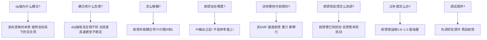
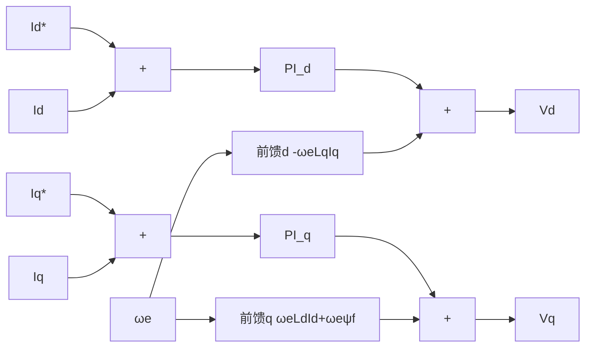

# ADV-ALG-07 前馈解耦与扰动补偿

**模块编号：** ADV-ALG-07
**模块名称：** 前馈解耦与扰动补偿（Feedforward Decoupling & Disturbance Compensation）
**文档版本：** v2.0
**适用对象：** 已掌握FOC基本原理、PI控制、电流环设计的嵌入式工程师
**前置知识：** ALG-01 FOC理论基础、ALG-05 有感FOC实现、ADV-ALG-01 控制环带宽设计
**难度等级：** 

---

## 1. 核心摘要

**一句话：** 前馈解耦是电机控制的"预判能力"——把已知的扰动提前补偿掉，让PI控制器只处理真正未知的部分，从而大幅提升动态性能和稳态精度。

**认知挂钩：** 想象你开车过弯道。如果只靠反馈（看到偏了再打方向盘），总是滞后；如果用前馈（看到弯道提前打方向），过弯又快又稳。电机控制也一样：d/q轴之间的交叉耦合、反电动势、重力、摩擦力，这些都是"看得见的弯道"，完全可以提前补偿。PI控制器就像驾驶员的修正——只处理路面坑洼等未知扰动就够了。

**核心问题链：**



**前馈解耦效果速查表：**

| 补偿类型 | 前馈量 | 补偿位置 | 效果 | 适用场景 |
| --- | --- | --- | --- | --- |
| d轴交叉耦合 | $-\omega_e L_q i_q$ | PI输出后+d轴 | 消除d轴受q轴影响 | 所有FOC，尤其高速 |
| q轴交叉耦合 | $\omega_e L_d i_d$ | PI输出后+q轴 | 消除q轴受d轴影响 | 所有FOC，尤其高速 |
| 反电动势 | $\omega_e \psi_f$ | PI输出后+q轴 | 消除反EMF扰动 | 所有PMSM |
| 速度前馈 | $d\theta_{ref}/dt$ | 速度环参考 | 位置跟踪零延迟 | 位置伺服 |
| 重力补偿 | $m g L \cos\theta / K_t$ | q轴电流参考 | 消除重力扰动 | 机械臂、云台 |
| 摩擦力前馈 | Coulomb + Viscous + Stribeck | q轴电流参考 | 消除低速爬行 | 精密定位 |

---

## 2. dq轴交叉耦合分析

### 2.1 PMSM电压方程回顾

PMSM在同步旋转dq坐标系下的电压方程：

$$
\begin{cases}
u_d = R_s i_d + L_d \dfrac{di_d}{dt} - \omega_e L_q i_q \\[8pt]
u_q = R_s i_q + L_q \dfrac{di_q}{dt} + \omega_e L_d i_d + \omega_e \psi_f
\end{cases}
$$

其中：
- $u_d, u_q$：d轴、q轴电压（V）
- $i_d, i_q$：d轴、q轴电流（A）
- $R_s$：定子电阻（Ω）
- $L_d, L_q$：d轴、q轴电感（H）
- $\omega_e$：电角速度（rad/s）
- $\psi_f$：永磁体磁链（Wb）
- $-\omega_e L_q i_q$：d轴交叉耦合项（V）
- $\omega_e L_d i_d$：q轴交叉耦合项（V）
- $\omega_e \psi_f$：反电动势项（V）

将方程重新整理，把"自项"和"耦合项"分离：

$$
\begin{cases}
L_d \dfrac{di_d}{dt} = u_d - R_s i_d + \underbrace{\omega_e L_q i_q}_{\text{d轴耦合项}} \\[8pt]
L_q \dfrac{di_q}{dt} = u_q - R_s i_q - \underbrace{\omega_e L_d i_d}_{\text{q轴耦合项}} - \underbrace{\omega_e \psi_f}_{\text{反电动势}}
\end{cases}
$$

**关键观察：** 从d轴方程看，$i_d$的变化不仅取决于$u_d$和$R_s i_d$（自项），还受$\omega_e L_q i_q$影响（耦合项）。同理，q轴受$\omega_e L_d i_d$和$\omega_e \psi_f$影响。

### 2.2 交叉耦合的物理本质

为什么dq坐标系下存在交叉耦合？这源于Clarke-Park变换的数学结构：

**物理直觉：** 在静止ABC坐标系中，三相绕组之间通过磁场耦合（互感），但不存在"交叉项"——每个相电压直接产生对应相电流。变换到旋转dq坐标系后，"旋转"本身引入了交叉耦合：

- **d轴方程中的 $-\omega_e L_q i_q$**：q轴电流产生的磁链在旋转坐标系中以$-\omega_e$的速率"切割"d轴，感应出电动势。本质是旋转电动势（motional EMF）。
- **q轴方程中的 $\omega_e L_d i_d$**：同理，d轴磁链在旋转中切割q轴。
- **q轴方程中的 $\omega_e \psi_f$**：永磁体磁链在旋转中切割q轴，即反电动势（Back-EMF）。

> **类比理解：** 想象你站在旋转木马上（旋转坐标系）。地面上静止的磁场（永磁体磁链$\psi_f$），在你看来以$-\omega_e$旋转，因此感应出电动势。同理，你自己在d轴产生的磁场，在q轴看来也在"运动"，因此产生交叉耦合。

### 2.3 耦合强度与转速的关系

交叉耦合项的大小直接取决于电角速度$\omega_e$：

| 转速条件 | 耦合项量级 | 影响 |
| --- | --- | --- |
| $\omega_e \approx 0$（静止/低速） | $\omega_e L_q i_q \approx 0$ | 耦合可忽略，d/q轴近似独立 |
| $\omega_e$ 中等 | 耦合项与电阻压降可比 | PI控制器勉强能抑制，动态有波动 |
| $\omega_e$ 高速 | 耦合项远大于电阻压降 | PI无法抑制，d/q轴严重互相干扰 |

**定量分析：** 以一台典型PMSM为例：

- $R_s = 0.5\,\Omega$，$L_q = 1.0\,\text{mH}$，$\psi_f = 0.01\,\text{Wb}$，$i_q = 10\,\text{A}$
- 额定转速$\omega_e = 3000\,\text{rpm}$对应电角速度$\omega_e = 314\,\text{rad/s}$（2极对）

| 转速 (rpm) | $R_s i_q$ (V) | $\omega_e L_q i_q$ (V) | $\omega_e \psi_f$ (V) | 耦合/电阻比 |
| --- | --- | --- | --- | --- |
| 100 | 5.0 | 0.33 | 0.33 | 0.07 |
| 1000 | 5.0 | 3.3 | 3.3 | 0.66 |
| 3000 | 5.0 | 10.0 | 10.0 | 2.0 |
| 6000 | 5.0 | 20.0 | 20.0 | 4.0 |

**结论：** 在3000rpm时，交叉耦合项已经是电阻压降的2倍！PI控制器必须同时处理耦合和跟踪，带宽严重不足。

### 2.4 不解耦的后果

**后果1：d/q轴电流互相影响**

当q轴电流$i_q$阶跃变化时（加速/加载），耦合项$\omega_e L_q i_q$突变，导致d轴电流$i_d$出现瞬态偏差。如果$i_d$控制的是磁场（弱磁运行），则磁场波动又反过来影响q轴，形成恶性循环。

**后果2：动态响应恶化**

PI控制器的积分项需要时间来"消化"耦合扰动。在耦合项突变时，电流环的超调量和调节时间显著增大。高速时甚至出现持续振荡。

**后果3：系统不稳定**

当耦合项的幅值超过PI控制器的调节能力时，系统可能失稳。具体表现为：

- 电流波形出现低频振荡
- 电机发出异常噪声
- 极端情况下电流发散，触发过流保护

**后果4：弱磁运行困难**

弱磁控制需要精确控制$i_d < 0$来抵消永磁体磁链。如果d/q轴耦合严重，$i_d$无法精确维持负值，弱磁效果打折，最高转速受限。

> **工程经验：** 实际项目中，未解耦的FOC在额定转速50%以上时，动态性能明显下降；超过80%额定转速时，阶跃响应超调可达30%以上，甚至出现振荡。加入前馈解耦后，全速范围内超调可控制在5%以内。

---

## 3. 反电动势前馈

### 3.1 反电动势作为可测扰动

反电动势项$\omega_e \psi_f$是PMSM电压方程中最大的扰动源。它的特点是：

- **可测量**：$\omega_e$由编码器或观测器获得，$\psi_f$是电机参数
- **可计算**：$\omega_e \psi_f$可以实时计算
- **与转速成正比**：低速时小，高速时大

从控制理论角度，反电动势是一个**可测扰动（measurable disturbance）**，对可测扰动的最优处理方式是**前馈补偿**，而非仅靠反馈抑制。

### 3.2 前馈补偿原理

将PMSM电压方程改写为：

$$
\begin{cases}
u_d = \underbrace{R_s i_d + L_d \dfrac{di_d}{dt}}_{\text{自项（PI控制对象）}} \underbrace{- \omega_e L_q i_q}_{\text{d轴扰动}} \\[8pt]
u_q = \underbrace{R_s i_q + L_q \dfrac{di_q}{dt}}_{\text{自项（PI控制对象）}} + \underbrace{\omega_e L_d i_d + \omega_e \psi_f}_{\text{q轴扰动}}
\end{cases}
$$

**前馈补偿策略：** 在控制电压中预先加入扰动量，使其与被控对象中的扰动相消：

$$
\begin{cases}
u_d = u_{d,PI} + u_{d,ff} \\[4pt]
u_q = u_{q,PI} + u_{q,ff}
\end{cases}
$$

其中前馈量为：

$$
\boxed{
\begin{cases}
u_{d,ff} = -\omega_e L_q i_q & \text{（d轴交叉耦合前馈）} \\[6pt]
u_{q,ff} = \omega_e L_d i_d + \omega_e \psi_f & \text{（q轴交叉耦合 + 反EMF前馈）}
\end{cases}
}
$$

其中：
- $u_{d,ff}$：d轴前馈补偿电压（V）
- $u_{q,ff}$：q轴前馈补偿电压（V）
- $\omega_e$：电角速度（rad/s）
- $L_d, L_q$：d轴、q轴电感（H）
- $i_d, i_q$：d轴、q轴电流反馈值（A）
- $\psi_f$：永磁体磁链（Wb）



**前馈补偿后的等效被控对象：**

将$u_d = u_{d,PI} + (-\omega_e L_q i_q)$代入d轴方程：

$$
u_{d,PI} - \omega_e L_q i_q = R_s i_d + L_d \frac{di_d}{dt} - \omega_e L_q i_q
$$

耦合项$-\omega_e L_q i_q$两边对消，得到：

$$
u_{d,PI} = R_s i_d + L_d \frac{di_d}{dt}
$$

同理，q轴：

$$
u_{q,PI} = R_s i_q + L_q \frac{di_q}{dt}
$$

**关键结论：** 前馈解耦后，d轴和q轴的电流环被控对象变为**纯一阶RL模型**，PI控制器只需处理$R_s i + L \, di/dt$，不再受交叉耦合和反电动势干扰。这正是ADV-ALG-01中零极点对消法的前提条件。

### 3.3 前馈增益设计

实际系统中，电机参数$R_s$、$L_d$、$L_q$、$\psi_f$存在测量误差和温漂，前馈不可能100%精确。因此引入前馈增益$K_{ff}$：

$$
\begin{cases}
u_{d,ff} = K_{ff} \cdot (-\omega_e L_{q,nom} i_q) \\[6pt]
u_{q,ff} = K_{ff} \cdot (\omega_e L_{d,nom} i_d + \omega_e \psi_{f,nom})
\end{cases}
$$

其中：
- $u_{d,ff}, u_{q,ff}$：d轴、q轴前馈补偿电压（V）
- $K_{ff}$：前馈增益（推荐0.85~0.95）
- $L_{d,nom}, L_{q,nom}$：d轴、q轴标称电感（H）
- $\psi_{f,nom}$：标称永磁体磁链（Wb）
- $\omega_e$：电角速度（rad/s）
- $i_d, i_q$：d轴、q轴电流反馈值（A）

**前馈增益选择原则：**

| $K_{ff}$ | 含义 | 风险 |
| --- | --- | --- |
| $K_{ff} = 1.0$ | 完全前馈（标称参数精确时） | 参数误差可能导致过补偿 |
| $K_{ff} = 0.8 \sim 0.95$ | 欠补偿，留安全裕量 | 残余耦合由PI处理 |
| $K_{ff} > 1.0$ | 过补偿 | 可能引起振荡！ |

**推荐值：** $K_{ff} = 0.85 \sim 0.95$

> **为什么不过补偿？** 过补偿时，前馈量大于实际扰动，PI控制器需要反向修正。这等效于在系统中引入了正反馈分量，可能降低相角裕度，极端情况下导致振荡。欠补偿则只是残余扰动稍大，PI仍可处理，安全性更好。

**参数误差对前馈效果的影响：**

设实际参数与标称参数的偏差为$\delta$，即$L_{actual} = L_{nom}(1+\delta)$。前馈补偿后的残余耦合为：

$$
\Delta u_{d,coupling} = -\omega_e L_q i_q + K_{ff} \cdot \omega_e L_{q,nom} i_q = \omega_e L_{q,nom} i_q (K_{ff}(1+\delta) - 1)
$$

其中 $\Delta u_{d,coupling}$ 为前馈补偿后的d轴残余耦合电压（V），$\delta$ 为电感参数相对偏差，$K_{ff}$ 为前馈增益，$\omega_e$ 为电角速度（rad/s），$L_{q,nom}$ 为q轴标称电感（H），$i_q$ 为q轴电流（A）。

当$K_{ff} = 0.9$，$\delta = 10\%$时，残余耦合为：

$$
\Delta u_{d,coupling} = \omega_e L_{q,nom} i_q (0.9 \times 1.1 - 1) = -0.01 \cdot \omega_e L_{q,nom} i_q
$$

残余仅为原始耦合的1%，效果显著。即使$\delta = 20\%$：

$$
\Delta u_{d,coupling} = \omega_e L_{q,nom} i_q (0.9 \times 1.2 - 1) = 0.08 \cdot \omega_e L_{q,nom} i_q
$$

残余为原始耦合的8%，仍远优于无前馈时的100%。**结论：前馈参数误差在20%以内时，仍有显著改善。**

---

## 4. 前馈在控制环中的位置

### 4.1 正确位置：PI输出之后

前馈量必须加在PI控制器的**输出**上，而非输入（参考值）上：

$$
\begin{cases}
u_d^* = u_{d,PI} + u_{d,ff} \\[4pt]
u_q^* = u_{q,PI} + u_{q,ff}
\end{cases}
$$

其中 $u_d^*, u_q^*$ 为d轴、q轴总电压参考值（V），$u_{d,PI}, u_{q,PI}$ 为PI控制器输出电压（V），$u_{d,ff}, u_{q,ff}$ 为前馈补偿电压（V）。

**完整信号流：**

```text
参考电流 → [PI控制器] → PI输出 → (+前馈量) → 总电压参考 → [反Park变换] → [SVPWM] → 逆变器
                ↑                                                    ↑
          电流反馈                                         角度反馈(θe)、转速(ωe)
```

### 4.2 为什么不能加在PI输入上？

**错误做法：** 将前馈量加在PI控制器的输入（参考值）上：

$$
i_d^{ref'} = i_d^{ref} + \Delta i_{d,ff} \quad \text{（错误！）}
$$

**这是错误的原因：**

1. **物理意义错误：** 前馈补偿的是**电压方程中的扰动**，不是电流参考值。把电压扰动折算到电流参考上，需要经过被控对象的逆模型，而PI控制器本身就是在做这件事——前馈加在参考值上等于让PI"多算一遍"，没有起到直接补偿的作用。

2. **动态响应差：** 加在参考值上，前馈效果要经过PI控制器的动态过程才能体现，引入了不必要的延迟。加在输出上则是瞬时补偿。

3. **稳态误差：** PI控制器的积分项会"消化"参考值上的偏移，最终前馈效果被积分项抵消，失去补偿作用。

**数学证明：**

设被控对象为$G(s) = 1/(Ls+R)$，PI控制器为$C(s) = K_p + K_i/s$。

- **正确做法（前馈加在输出）：** 扰动$D(s)$被前馈$-D(s)$直接对消，闭环传递函数不变，扰动抑制为0。
- **错误做法（前馈加在参考）：** 前馈量$D_{ff}(s)$加在参考上，经过PI和被控对象后的输出为：

$$
I(s) = \frac{C(s)G(s)}{1+C(s)G(s)} (I_{ref}(s) + D_{ff}(s)) + \frac{G(s)}{1+C(s)G(s)} D(s)
$$

要使扰动$D(s)$被抑制，需要$D_{ff}(s) \cdot C(s)G(s) = -D(s)$，即$D_{ff}(s) = -D(s)/(C(s)G(s))$。这要求前馈量经过PI控制器的逆模型，实现复杂且不精确。

### 4.3 完整控制框图

```text
                    ┌──────────┐     ┌──────────────────┐     ┌──────────┐
  i_d* ──────────→│  PI_d    │────→│  + u_d_ff        │────→│ 反Park   │
                    └──────────┘     │  = u_d*          │     │  变换    │
                         ↑           └──────────────────┘     └────┬─────┘
                         │ i_d_fdb              ↑                  │
                         │                      │ u_d_ff           │ uα, uβ
                    ┌────┴─────┐          ┌─────┴──────┐          ↓
                    │  ADC+    │          │  前馈计算   │     ┌──────────┐
                    │  Clarke  │          │  -ωeLq·iq  │     │  SVPWM   │
                    │  Park    │          └────────────┘     └──────────┘
                    └──────────┘               ↑
                                               │ ωe, iq

                    ┌──────────┐     ┌──────────────────┐     ┌──────────┐
  i_q* ──────────→│  PI_q    │────→│  + u_q_ff        │────→│ 反Park   │
                    └──────────┘     │  = u_q*          │     │  变换    │
                         ↑           └──────────────────┘     └────┬─────┘
                         │ i_q_fdb              ↑                  │
                         │                      │ u_q_ff           │ uα, uβ
                    ┌────┴─────┐          ┌─────┴──────┐          ↓
                    │  ADC+    │          │  前馈计算   │     ┌──────────┐
                    │  Clarke  │          │  ωeLd·id   │     │  SVPWM   │
                    │  Park    │          │  +ωe·ψf    │     └──────────┘
                    └──────────┘          └────────────┘
                                               ↑
                                               │ ωe, id, ψf
```

**信号流说明：**

1. 电流采样 → Clarke变换 → Park变换 → 得到$i_d$、$i_q$反馈值
2. $i_d^*$与$i_d$之差 → PI_d → 得到$u_{d,PI}$
3. $i_q^*$与$i_q$之差 → PI_q → 得到$u_{q,PI}$
4. 前馈计算：$u_{d,ff} = -\omega_e L_q i_q$，$u_{q,ff} = \omega_e L_d i_d + \omega_e \psi_f$
5. 合成：$u_d^* = u_{d,PI} + u_{d,ff}$，$u_q^* = u_{q,PI} + u_{q,ff}$
6. 反Park变换 → SVPWM → 逆变器驱动电机

---

## 5. 速度前馈

### 5.1 位置伺服中的速度前馈

在位置-速度-电流三环控制中，位置环的输出是速度参考值。如果仅靠位置环PI/P控制器产生速度参考，位置跟踪总是存在滞后。

**速度前馈原理：** 将位置参考的微分直接作为速度前馈量：

$$
\omega_{ff} = \frac{d\theta_{ref}}{dt}
$$

其中 $\omega_{ff}$ 为速度前馈量（rad/s），$\theta_{ref}$ 为位置参考值（rad）。

速度前馈加在速度环的**参考值**上（注意：这与电流环前馈加在PI输出上不同！）：

$$
\omega_{ref} = \omega_{ref,PI} + K_{vff} \cdot \omega_{ff}
$$

其中 $\omega_{ref}$ 为速度环总参考值（rad/s），$\omega_{ref,PI}$ 为位置环PI控制器输出的速度参考（rad/s），$K_{vff}$ 为速度前馈增益，$\omega_{ff}$ 为速度前馈量（rad/s）。

### 5.2 为什么速度前馈加在参考值上？

注意速度前馈与电流前馈的区别：

| 对比项 | 电流环前馈 | 速度前馈 |
| --- | --- | --- |
| 补偿对象 | 电压方程中的扰动 | 位置跟踪的延迟 |
| 前馈性质 | 扰动补偿 | 参考轨迹跟踪 |
| 前馈位置 | PI输出之后 | 速度环参考值上 |
| 物理意义 | 补偿已知的电压扰动 | 提供已知的速度需求 |

**关键区别：** 电流环前馈补偿的是**被控对象中的扰动**（电压方程中的耦合项），所以加在PI输出上。速度前馈补偿的是**参考轨迹的导数**（位置参考对应的速度需求），所以加在参考值上——它告诉速度环"你需要跟踪这个速度"。

### 5.3 前馈增益设计

- **$K_{vff} = 1$**：完全前馈，位置跟踪零延迟（理论值，实际有参数误差）
- **$K_{vff} = 0.8 \sim 0.95$**：推荐值，留安全裕量
- **$K_{vff} > 1$**：过前馈，可能引起超调

**位置跟踪误差分析：**

无速度前馈时，位置跟踪误差为：

$$
e_\theta = \frac{\omega_{ref}}{K_{p,\theta} \cdot K_{p,\omega} \cdot K_{p,i}}
$$

其中 $e_\theta$ 为位置跟踪误差（rad），$\omega_{ref}$ 为速度参考（rad/s），$K_{p,\theta}$ 为位置环比例增益，$K_{p,\omega}$ 为速度环比例增益，$K_{p,i}$ 为电流环比例增益。

有速度前馈（$K_{vff} = 1$）时，稳态位置跟踪误差为0（恒速段），仅在加减速段存在由惯性引起的瞬态误差。

### 5.4 加速度前馈

进一步，可以将位置参考的二阶微分作为加速度前馈：

$$
\alpha_{ff} = \frac{d^2\theta_{ref}}{dt^2}
$$

其中 $\alpha_{ff}$ 为加速度前馈量（rad/s²），$\theta_{ref}$ 为位置参考值（rad）。

加速度前馈加在电流环的q轴参考上：

$$
i_{q,ref} = i_{q,ref,PI} + K_{aff} \cdot \frac{J \cdot \alpha_{ff}}{K_t}
$$

其中 $i_{q,ref}$ 为q轴总电流参考（A），$i_{q,ref,PI}$ 为速度环PI输出的q轴电流参考（A），$K_{aff}$ 为加速度前馈增益，$J$ 为转动惯量（kg·m²），$\alpha_{ff}$ 为加速度前馈量（rad/s²），$K_t = 1.5 p \psi_f$ 为转矩常数（N·m/A）。

**三环前馈组合效果：**

| 前馈组合 | 位置跟踪误差 | 动态响应 |
| --- | --- | --- |
| 无前馈 | 大，与速度成正比 | 差 |
| +速度前馈 | 恒速段≈0，变速段有 | 好 |
| +速度前馈+加速度前馈 | 几乎为零 | 极好 |

---

## 6. 重力补偿前馈

### 6.1 重力矩模型

在机械臂、云台、倾斜平台等应用中，重力矩是已知的、可计算的扰动：

$$
T_{gravity} = m \cdot g \cdot L \cdot \cos(\theta)
$$

其中：
- $T_{gravity}$：重力矩（N·m）
- $m$：负载质量（kg）
- $g$：重力加速度（$9.81\,\text{m/s}^2$）
- $L$：质心到旋转轴的距离（m）
- $\theta$：关节角度（rad），$\theta = 0$为水平

**更一般的多连杆模型：**

对于n自由度机械臂，第$i$个关节的重力矩为：

$$
T_{gravity,i} = \sum_{j=i}^{n} m_j \cdot g \cdot \mathbf{r}_j(\theta) \times \hat{z}
$$

需要通过运动学正解计算各连杆质心位置。

### 6.2 重力补偿前馈实现

将重力矩转换为q轴电流前馈：

$$
i_{q,ff,gravity} = \frac{T_{gravity}}{K_t} = \frac{T_{gravity}}{1.5 \cdot p \cdot \psi_f}
$$

其中 $i_{q,ff,gravity}$ 为重力补偿q轴前馈电流（A），$T_{gravity}$ 为重力矩（N·m），$K_t = 1.5 \cdot p \cdot \psi_f$ 为转矩常数（N·m/A），$p$ 为极对数，$\psi_f$ 为永磁体磁链（Wb）。

**前馈位置：** 加在q轴电流参考值上（与速度前馈类似，这是参考轨迹的需求，不是被控对象扰动）：

$$
i_{q,ref} = i_{q,ref,PI} + i_{q,ff,gravity}
$$

> **注意区分：** 重力补偿前馈加在电流参考值上（不是PI输出上），因为重力是"需要产生的力矩"，属于参考需求。而交叉耦合前馈加在PI输出上，因为那是"需要补偿的电压扰动"。

### 6.3 重力补偿的精度要求

重力补偿的精度取决于：
- 负载质量$m$的精度
- 质心位置$L$的精度
- 角度$\theta$的精度

**典型场景：** 云台应用中，重力补偿可使静态保持电流从PI积分项承担变为前馈直接提供，大幅减小位置抖动。

---

## 7. 摩擦力前馈

### 7.1 摩擦模型

摩擦力是精密运动控制的主要障碍之一。完整的摩擦模型包含三个分量：

$$
T_{friction} = \underbrace{T_c \cdot \text{sign}(\omega)}_{\text{Coulomb摩擦}} + \underbrace{B_v \cdot \omega}_{\text{粘性摩擦}} + \underbrace{(T_s - T_c) \cdot e^{-|\omega|/\omega_s} \cdot \text{sign}(\omega)}_{\text{Stribeck效应}}
$$

其中：
- $T_{friction}$：总摩擦力矩（N·m）
- $T_c$：Coulomb摩擦力矩（N·m），恒定，与速度方向有关
- $B_v$：粘性摩擦系数（N·m·s/rad），与速度成正比
- $T_s$：静摩擦力矩（N·m），$T_s > T_c$
- $\omega_s$：Stribeck速度（rad/s），特征速度，典型值0.01~0.1 rad/s
- $\omega$：机械角速度（rad/s）

**摩擦力-速度特性曲线：**

```text
  T_friction
      ↑
  Ts  │ *
      │   *
  Tc  │─────*────────────────
      │      *              *  ← 粘性摩擦主导
      │        *          *
      │          *      *
      └────────────┼──────────→ ω
               0  ωs
      ← Stribeck →
```

**Stribeck效应：** 在极低速（$\lvert \omega \rvert < \omega_s$）时，摩擦力随速度减小而增大（从$T_c$增大到$T_s$），这导致"粘-滑"现象（stick-slip），表现为低速爬行。

### 7.2 摩擦力前馈实现

将摩擦力矩转换为q轴电流前馈：

$$
i_{q,ff,friction} = \frac{T_{friction}}{K_t} = \frac{T_{friction}}{1.5 \cdot p \cdot \psi_f}
$$

其中 $i_{q,ff,friction}$ 为摩擦力补偿q轴前馈电流（A），$T_{friction}$ 为总摩擦力矩（N·m），$K_t = 1.5 \cdot p \cdot \psi_f$ 为转矩常数（N·m/A），$p$ 为极对数，$\psi_f$ 为永磁体磁链（Wb）。

**前馈位置：** 加在q轴电流参考值上：

$$
i_{q,ref} = i_{q,ref,PI} + i_{q,ff,gravity} + i_{q,ff,friction}
$$

### 7.3 零速附近的处理

摩擦模型在$\omega = 0$处不连续（$\text{sign}(\omega)$跳变），直接使用会导致前馈量突变。常用处理方法：

**方法1：连续化近似**

用$\tanh$函数替代$\text{sign}$：

$$
\text{sign}(\omega) \approx \tanh\left(\frac{\omega}{\omega_{th}}\right)
$$

其中 $\omega$ 为机械角速度（rad/s），$\omega_{th}$ 为阈值速度（rad/s），典型值0.01~0.1 rad/s。

**方法2：预载摩擦模型**

在零速附近，根据运动方向"预加载"摩擦力：

```c
if (fabs(omega) < omega_threshold) {
    // 零速附近：根据参考力矩方向决定摩擦力方向
    if (T_ref > T_stiction) {
        T_friction_ff = Tc;  // 即将正向运动
    } else if (T_ref < -T_stiction) {
        T_friction_ff = -Tc; // 即将反向运动
    } else {
        T_friction_ff = 0;   // 保持静止
    }
} else {
    // 正常摩擦模型
    T_friction_ff = Tc * sign(omega) + Bv * omega
                  + (Ts - Tc) * exp(-fabs(omega)/omega_s) * sign(omega);
}
```

### 7.4 摩擦参数辨识

摩擦参数可通过以下方法辨识：

1. **恒速测试：** 在不同速度下测量稳态q轴电流，拟合$T_c$、$B_v$、$T_s$、$\omega_s$
2. **减速测试：** 自由减速过程中，记录速度-时间曲线，反推摩擦力矩
3. **极限循环测试：** 低速往复运动，分析stick-slip特征

---

## 8. 前馈与反馈的协调

### 8.1 前馈与反馈的分工

| 维度 | 前馈 | 反馈（PI） |
| --- | --- | --- |
| 处理对象 | 已知扰动、已知轨迹 | 未知扰动、模型误差 |
| 信号路径 | 开环（不经过被控对象反馈） | 闭环（经过被控对象反馈） |
| 稳定性影响 | 无（开环路径不影响特征方程） | 有（决定闭环极点位置） |
| 精度要求 | 参数误差<20%仍有显著改善 | 无特殊要求 |
| 鲁棒性 | 依赖参数精度 | 鲁棒，可处理不确定性 |

### 8.2 前馈不影响闭环稳定性

这是前馈控制最重要的性质。以电流环为例，加入前馈后的闭环特征方程为：

$$
1 + C(s)G(s) = 0
$$

其中 $C(s)$ 为PI控制器传递函数，$G(s)$ 为被控对象传递函数。前馈量不参与闭环，因此特征方程与无前馈时完全相同。

**数学证明：**

设扰动$D(s)$作用于被控对象输出，前馈$F(s)$加在控制器输出：

$$
Y(s) = \frac{C(s)G(s)}{1+C(s)G(s)} R(s) + \frac{G(s)}{1+C(s)G(s)} D(s) + \frac{G(s)}{1+C(s)G(s)} (-F(s))
$$

其中 $Y(s)$ 为系统输出，$R(s)$ 为参考输入，$D(s)$ 为扰动，$F(s)$ 为前馈补偿量，$C(s)$ 为控制器传递函数，$G(s)$ 为被控对象传递函数。

若$F(s) = D(s)$，则扰动完全对消。但无论$F(s)$取何值，闭环极点（特征方程$1+C(s)G(s)=0$的根）不变。

> **工程意义：** 前馈增益$K_{ff}$从0调到1的过程中，闭环稳定性不变。这意味着可以安全地逐步增大前馈增益，观察效果，不用担心失稳。

### 8.3 过补偿风险

虽然前馈不影响闭环极点，但**过补偿**（$K_{ff} > 1$）仍有风险：

- **残余耦合反向：** 原本$-\omega_e L_q i_q$是d轴的正向扰动，过补偿后残余变为负向扰动，PI需要反向修正
- **等效增大了扰动：** 过补偿10%等效于扰动增大了10%（方向相反），虽然PI仍能处理，但性能不如欠补偿
- **与PI积分项冲突：** 积分项积累了与过补偿方向相反的修正量，切换时可能产生瞬态

**推荐策略：** 宁可欠补偿（$K_{ff} = 0.85 \sim 0.95$），不要过补偿。

### 8.4 调试顺序

**正确的调试顺序：**

```text
步骤1：关闭所有前馈，调好PI参数
        → 确保闭环稳定，阶跃响应满意
        → 记录无前馈时的性能基线

步骤2：加入交叉耦合前馈（d轴和q轴）
        → Kff从0.5开始，逐步增大到0.9
        → 观察高速阶跃响应的改善

步骤3：加入反电动势前馈
        → 已包含在q轴前馈中（ωe·ψf项）
        → 验证高速稳态电流纹波减小

步骤4：加入速度前馈（位置伺服）
        → Kvff从0.5开始，逐步增大
        → 观察位置跟踪误差减小

步骤5：加入重力/摩擦力前馈（如需要）
        → 先辨识参数，再加前馈
        → 观察静态保持和低速性能
```

> **关键原则：** 每次只加一种前馈，确认效果后再加下一种。不要同时加多种前馈，否则出问题时无法定位原因。

---

## 9. 完整的前馈解耦实现

### 9.1 代码结构

```c
/**
 * @brief  电流环前馈解耦计算
 * @note   在PI控制器输出之后调用，前馈量加在PI输出上
 * @param  pCurrCtrl: 电流环控制器结构体
 * @param  omega_e:   电角速度 [rad/s]
 * @param  id_fdb:    d轴电流反馈 [A]
 * @param  iq_fdb:    q轴电流反馈 [A]
 * @retval 无，结果写入pCurrCtrl的前馈成员
 */
void MC_FeedforwardCalc(MC_CurrentCtrl_t *pCurrCtrl,
                         float omega_e,
                         float id_fdb,
                         float iq_fdb)
{
    float Ld_nom = pCurrCtrl->motorParams.Ld_nom;  /* 标称d轴电感 [H] */
    float Lq_nom = pCurrCtrl->motorParams.Lq_nom;  /* 标称q轴电感 [H] */
    float psi_f  = pCurrCtrl->motorParams.psi_f;   /* 标称磁链 [Wb] */
    float Kff    = pCurrCtrl->ffGain;               /* 前馈增益 (0.85~0.95) */

    /* ---- d轴交叉耦合前馈 ---- */
    /* 补偿电压方程中的 -ωe·Lq·Iq 项 */
    pCurrCtrl->ud_ff = -Kff * omega_e * Lq_nom * iq_fdb;

    /* ---- q轴交叉耦合 + 反EMF前馈 ---- */
    /* 补偿电压方程中的 ωe·Ld·Id + ωe·ψf 项 */
    pCurrCtrl->uq_ff = Kff * omega_e * (Ld_nom * id_fdb + psi_f);

    /* ---- 前馈使能平滑切换 ---- */
    if (!pCurrCtrl->ffEnable) {
        /* 禁止时前馈量渐变归零，避免突变 */
        pCurrCtrl->ud_ff *= pCurrCtrl->ffRampFactor;
        pCurrCtrl->uq_ff *= pCurrCtrl->ffRampFactor;
    }
}
```

### 9.2 电流环执行流程

```c
/**
 * @brief  电流环执行函数（每个PWM周期调用一次）
 * @param  pCurrCtrl: 电流环控制器结构体
 * @retval 无
 */
void MC_CurrentCtrlExecute(MC_CurrentCtrl_t *pCurrCtrl)
{
    /* 1. 获取反馈 */
    float id_fdb  = pCurrCtrl->id_fdb;   /* d轴电流反馈 */
    float iq_fdb  = pCurrCtrl->iq_fdb;   /* q轴电流反馈 */
    float omega_e = pCurrCtrl->omega_e;  /* 电角速度 */
    float theta_e = pCurrCtrl->theta_e;  /* 电角度 */

    /* 2. PI控制器计算 */
    float ud_pi = MC_PI_Execute(&pCurrCtrl->pi_d,
                                 pCurrCtrl->id_ref, id_fdb);
    float uq_pi = MC_PI_Execute(&pCurrCtrl->pi_q,
                                 pCurrCtrl->iq_ref, iq_fdb);

    /* 3. 前馈解耦计算（PI输出之后） */
    MC_FeedforwardCalc(pCurrCtrl, omega_e, id_fdb, iq_fdb);

    /* 4. 合成电压参考 = PI输出 + 前馈量 */
    float ud_ref = ud_pi + pCurrCtrl->ud_ff;
    float uq_ref = uq_pi + pCurrCtrl->uq_ff;

    /* 5. 加入重力/摩擦力前馈（加在电流参考上，已在PI之前处理） */
    /* 注意：重力/摩擦力前馈在步骤2之前加在iq_ref上 */

    /* 6. 电压限幅 */
    MC_VoltageLimiting(&ud_ref, &uq_ref, pCurrCtrl->Vdc);

    /* 7. 反Park变换 */
    float ualpha, ubeta;
    MC_InversePark(ud_ref, uq_ref, theta_e, &ualpha, &ubeta);

    /* 8. SVPWM */
    MC_SVPWM(ualpha, ubeta, pCurrCtrl->Vdc);
}
```

### 9.3 前馈使能/禁止的平滑切换

前馈量突变会导致电压参考跳变，引起电流尖峰。因此需要平滑切换：

```c
/**
 * @brief  前馈使能/禁止平滑切换
 * @param  pCurrCtrl: 电流环控制器结构体
 * @param  enable:     true=使能, false=禁止
 * @note   使用渐变因子实现平滑过渡，避免前馈量突变
 */
void MC_FeedforwardEnable(MC_CurrentCtrl_t *pCurrCtrl, bool enable)
{
    if (enable && !pCurrCtrl->ffEnable) {
        /* 使能：渐变因子从0开始递增到1 */
        pCurrCtrl->ffEnable = true;
        pCurrCtrl->ffRampFactor = 0.0f;
        pCurrCtrl->ffRampTarget = 1.0f;
    } else if (!enable && pCurrCtrl->ffEnable) {
        /* 禁止：渐变因子从1开始递减到0 */
        pCurrCtrl->ffRampTarget = 0.0f;
        /* ffEnable在渐变完成后才置false */
    }
}

/**
 * @brief  前馈渐变因子更新（每个控制周期调用）
 */
void MC_FeedforwardRampUpdate(MC_CurrentCtrl_t *pCurrCtrl)
{
    float rampRate = 0.01f;  /* 每个周期变化1%，约100个周期完成过渡 */

    if (pCurrCtrl->ffRampFactor < pCurrCtrl->ffRampTarget) {
        pCurrCtrl->ffRampFactor += rampRate;
        if (pCurrCtrl->ffRampFactor > pCurrCtrl->ffRampTarget) {
            pCurrCtrl->ffRampFactor = pCurrCtrl->ffRampTarget;
        }
    } else if (pCurrCtrl->ffRampFactor > pCurrCtrl->ffRampTarget) {
        pCurrCtrl->ffRampFactor -= rampRate;
        if (pCurrCtrl->ffRampFactor < pCurrCtrl->ffRampTarget) {
            pCurrCtrl->ffRampFactor = pCurrCtrl->ffRampTarget;
        }
    }

    /* 渐变到0后，正式禁止前馈 */
    if (pCurrCtrl->ffRampFactor <= 0.0f) {
        pCurrCtrl->ffEnable = false;
        pCurrCtrl->ffRampFactor = 0.0f;
    }
}
```

### 9.4 前馈参数自整定方法

**方法1：阶跃响应法**

1. 关闭前馈，在额定转速下做$i_q$阶跃，记录$d$轴电流瞬态偏差$\Delta i_{d,max}$
2. 开启前馈，$K_{ff}$从0.5开始，逐步增大
3. 当$\Delta i_{d,max}$最小时，对应的$K_{ff}$为最优值
4. 若$\Delta i_{d,max}$先减小后增大，说明出现了过补偿，应取减小段的最大$K_{ff}$

**方法2：稳态误差法**

1. 在额定转速下，维持恒定$i_q$
2. 关闭前馈，记录$d$轴PI积分项的稳态值$u_{d,int}$
3. 理论上$u_{d,int} = -\omega_e L_q i_q$（PI积分项在补偿耦合）
4. 调整$K_{ff}$使积分项趋近于0，说明前馈已接管了耦合补偿

**方法3：频域法**

1. 注入$i_q$正弦扰动，频率从1Hz扫到500Hz
2. 测量$i_d$的响应幅值
3. 无前馈时，$i_d$响应在耦合频率处有峰值
4. 调整$K_{ff}$使峰值最小

### 9.5 与弱磁控制的协调

弱磁运行时，$i_d < 0$导致d轴磁路饱和程度变化，$L_d$和$L_q$不再是常数：

$$
L_d(i_d) = L_{d0} \cdot (1 - k_{sat} \cdot |i_d|) \quad (i_d < 0 \text{时})
$$

其中 $L_d(i_d)$ 为考虑饱和的d轴电感（H），$L_{d0}$ 为未饱和时的d轴电感（H），$k_{sat}$ 为饱和系数（1/A），$i_d$ 为d轴电流（A）。

**协调策略：**

1. **查表法：** 预先测量不同$i_d$下的$L_d$和$L_q$，运行时查表插值
2. **在线辨识：** 通过高频注入或递推最小二乘在线辨识电感
3. **保守策略：** 弱磁时降低$K_{ff}$（如从0.9降到0.8），避免过补偿

```c
/**
 * @brief  考虑弱磁的电感查表
 * @param  id: d轴电流 [A]
 * @param  pMotorParams: 电机参数
 * @retval Ld, Lq 考虑饱和的电感值
 */
void MC_GetSaturatedInductance(float id,
                                const MC_MotorParams_t *pMotorParams,
                                float *pLd, float *pLq)
{
    /* 线性插值查表 */
    /* id_table[]: 预先标定的id点，如 [0, -2, -4, -6, -8] A */
    /* Ld_table[]: 对应的Ld值，如 [1.0, 0.95, 0.88, 0.80, 0.72] mH */
    /* Lq_table[]: 对应的Lq值，如 [1.2, 1.18, 1.15, 1.10, 1.05] mH */

    int16_t idx = 0;
    uint16_t tableSize = pMotorParams->inductanceTableSize;

    /* 找到id所在的区间 */
    for (idx = 0; idx < tableSize - 1; idx++) {
        if (id >= pMotorParams->id_table[idx]) {
            break;
        }
    }

    /* 线性插值 */
    float ratio = (id - pMotorParams->id_table[idx])
                / (pMotorParams->id_table[idx+1] - pMotorParams->id_table[idx]);

    *pLd = pMotorParams->Ld_table[idx]
         + ratio * (pMotorParams->Ld_table[idx+1] - pMotorParams->Ld_table[idx]);
    *pLq = pMotorParams->Lq_table[idx]
         + ratio * (pMotorParams->Lq_table[idx+1] - pMotorParams->Lq_table[idx]);
}
```

**弱磁时前馈计算的修改：**

```c
void MC_FeedforwardCalc_FluxWeakening(MC_CurrentCtrl_t *pCurrCtrl,
                                       float omega_e,
                                       float id_fdb,
                                       float iq_fdb)
{
    float Ld_sat, Lq_sat;

    /* 考虑饱和的电感值 */
    MC_GetSaturatedInductance(id_fdb, &pCurrCtrl->motorParams, &Ld_sat, &Lq_sat);

    float psi_f = pCurrCtrl->motorParams.psi_f;
    float Kff   = pCurrCtrl->ffGain;

    /* 弱磁时降低前馈增益，防止过补偿 */
    if (id_fdb < -0.5f) {
        Kff *= 0.9f;  /* 弱磁区域前馈增益降低10% */
    }

    pCurrCtrl->ud_ff = -Kff * omega_e * Lq_sat * iq_fdb;
    pCurrCtrl->uq_ff =  Kff * omega_e * (Ld_sat * id_fdb + psi_f);
}
```

---

## 10. 综合实例与调试指南

### 10.1 典型PMSM参数与前馈效果

**电机参数：**

| 参数 | 符号 | 值 | 单位 |
| --- | --- | --- | --- |
| 定子电阻 | $R_s$ | 0.5 | $\Omega$ |
| d轴电感 | $L_d$ | 1.0 | mH |
| q轴电感 | $L_q$ | 1.2 | mH |
| 永磁体磁链 | $\psi_f$ | 0.01 | Wb |
| 极对数 | $p$ | 4 | - |
| 额定转速 | $n_N$ | 3000 | rpm |
| 额定电流 | $I_N$ | 10 | A |
| 母线电压 | $V_{dc}$ | 48 | V |

**不同转速下的前馈量：**

| 转速 (rpm) | $\omega_e$ (rad/s) | $u_{d,ff}$ (V) @ $i_q$=10A | $u_{q,ff}$ (V) @ $i_d$=0A | $u_{q,ff}$ 占母线比 |
| --- | --- | --- | --- | --- |
| 500 | 209 | -0.25 | 2.09 | 4.4% |
| 1500 | 628 | -0.75 | 6.28 | 13.1% |
| 3000 | 1257 | -1.51 | 12.57 | 26.2% |
| 4500 | 1885 | -2.26 | 18.85 | 39.3% |

**结论：** 在3000rpm时，仅反电动势前馈就占了母线电压的26%！如果不前馈，PI控制器需要额外输出12.57V来补偿反电动势，严重压缩了动态调节范围。

### 10.2 调试检查清单

| 序号 | 检查项 | 预期结果 | 不通过的后果 |
| --- | --- | --- | --- |
| 1 | 无前馈时PI已调好 | 阶跃响应超调<15% | 先调PI，不要急着加前馈 |
| 2 | 前馈加在PI输出之后 | 电压参考 = PI输出 + 前馈 | 加错位置无效甚至有害 |
| 3 | 前馈量方向正确 | $u_{d,ff} < 0$（当$i_q > 0$时） | 方向错误会加剧耦合 |
| 4 | $K_{ff}$从0.5开始 | 逐步增大，观察效果 | 直接设1.0可能过补偿 |
| 5 | 高速阶跃测试 | $i_d$瞬态偏差减小 | 前馈有效 |
| 6 | 前馈使能/禁止平滑 | 无电流突变 | 突变可能触发过流保护 |
| 7 | 弱磁区前馈增益降低 | 弱磁时仍稳定 | 电感变化导致过补偿 |
| 8 | 前馈量不超过电压裕量 | $\lvert u_{ff} \rvert < V_{dc} - \lvert u_{PI} \rvert$ | 电压饱和，前馈失效 |

### 10.3 常见问题与解决

**问题1：加前馈后电流振荡**

- **原因：** $K_{ff}$过大，过补偿
- **解决：** 降低$K_{ff}$到0.8以下，检查电机参数是否准确

**问题2：加前馈后d轴电流仍有偏差**

- **原因：** $L_q$参数不准，或存在未建模的交叉耦合
- **解决：** 重新辨识$L_q$，或适当增大$K_{ff}$（不超过0.95）

**问题3：前馈使能瞬间电流突变**

- **原因：** 前馈量未平滑切换
- **解决：** 使用渐变因子，从0过渡到1

**问题4：弱磁时前馈效果变差**

- **原因：** $L_d$、$L_q$随饱和变化
- **解决：** 使用电感查表，弱磁时降低$K_{ff}$

**问题5：低速时前馈引入噪声**

- **原因：** $\omega_e$测量噪声被前馈放大
- **解决：** 低速时降低$K_{ff}$或关闭前馈；对$\omega_e$做低通滤波

---

## 11. 知识体系关联

```text
ADV-ALG-07 前馈解耦与扰动补偿
    ├── 前置：ADV-ALG-01 控制环带宽设计（PI参数与带宽关系）
    ├── 前置：ALG-01 FOC理论基础（dq坐标系、Park变换）
    ├── 前置：ALG-05 有感FOC实现（电流环实现）
    ├── 关联：ADV-ALG-05 弱磁控制（弱磁时Ld/Lq变化影响前馈）
    ├── 关联：MC-LIB-Control-Loop（控制环代码架构）
    └── 后续：ADV-ALG-09 自抗扰控制（ADRC处理未知扰动）
```

---

## 附录A：前馈解耦的数学推导

### A.1 完整的前馈解耦传递函数

以前馈解耦后的d轴电流环为例，闭环传递函数为：

$$
G_{cl,d}(s) = \frac{K_{p,d}/L_d}{s + K_{p,d}/L_d} = \frac{\omega_{cl,d}}{s + \omega_{cl,d}}
$$

其中 $G_{cl,d}(s)$ 为前馈解耦后d轴电流环闭环传递函数，$K_{p,d}$ 为d轴PI比例增益（V/A），$L_d$ 为d轴电感（H），$\omega_{cl,d} = K_{p,d}/L_d$ 为d轴电流环闭环带宽（rad/s）。

**扰动传递函数（残余耦合）：**

$$
G_{disturb}(s) = \frac{I_d(s)}{D_d(s)} = \frac{1/L_d}{s + \omega_{cl,d}} \cdot (1 - K_{ff})
$$

其中：
- $G_{disturb}(s)$：扰动传递函数
- $I_d(s)$：d轴电流拉普拉斯变换（A）
- $D_d(s) = -\omega_e L_q I_q(s)$：d轴耦合扰动（V）
- $L_d$：d轴电感（H）
- $\omega_{cl,d}$：d轴电流环闭环带宽（rad/s）
- $K_{ff}$：前馈增益
- $(1-K_{ff})$：前馈残余系数

- $K_{ff} = 0$：无前馈，扰动全由闭环抑制
- $K_{ff} = 1$：完全前馈，扰动完全对消
- $K_{ff} = 0.9$：残余扰动仅为无前馈时的10%

### A.2 前馈对电流环带宽需求的影响

无前馈时，电流环带宽需要足够高以抑制耦合扰动。设耦合扰动频率为$\omega_e$，要求在$\omega_e$处有$-20\,\text{dB}$的扰动抑制：

$$
\left|\frac{1/L}{j\omega_e + \omega_{cl}}\right| \leq \frac{1}{10} \cdot \frac{1}{\omega_e L}
$$

其中 $L$ 为相电感（H），$\omega_e$ 为电角速度（rad/s），$\omega_{cl}$ 为电流环闭环带宽（rad/s）。

解得$\omega_{cl} \geq 10 \omega_e$，即电流环带宽需要达到电角速度的10倍！

有前馈（$K_{ff} = 0.9$）时，残余扰动为10%，带宽需求降低为：

$$
\omega_{cl} \geq \omega_e
$$

**结论：** 前馈解耦可将电流环带宽需求降低一个数量级，这对于高速电机（$\omega_e$大）至关重要。

---

## 附录B：前馈解耦vs其他解耦方法对比

| 方法 | 原理 | 优点 | 缺点 | 适用场景 |
| --- | --- | --- | --- | --- |
| **前馈解耦** | 在PI输出加耦合项补偿 | 实现简单，不影响稳定性 | 依赖参数精度 | 最常用，推荐 |
| **对角化解耦** | 在被控对象前加解耦矩阵 | 理论上完全解耦 | 对参数敏感，可能引入不稳定零点 | MIMO系统 |
| **内模解耦** | 将耦合项纳入内模 | 鲁棒性好 | 实现复杂 | 高精度伺服 |
| **自适应解耦** | 在线辨识耦合参数 | 适应参数变化 | 计算量大 | 参数变化大的场景 |
| **滑模解耦** | 滑模面设计消除耦合 | 鲁棒性极强 | 抖振问题 | 扰动大的场景 |

**工程推荐：** 95%的应用场景使用前馈解耦即可。只有在参数变化极大（如开关磁阻电机）或精度要求极高（纳米级定位）时，才考虑更复杂的方法。

###  hpm_MC 工程关联

**耦合补偿** (`hpm_mcl_v2/core/control/hpm_mcl_hybrid_ctrl.h`):
- 混合控制中的前馈力矩 τ_ff = J × acc 消除惯性耦合
- 编译宏 `HPM_MCL_ENABLE_DQ_AXIS_DECOUPLING` 使能 d/q 轴电压解耦
- 速度 LPF + 死区 + 力矩限幅保证工程鲁棒性

参考: `SDK-04-HPM-MC-v2-Hybrid-Ctrl.md`

>  检验你的理解：[ADV-ALG-07 检验题目](./ADV-ALG-07-assessment.md)
