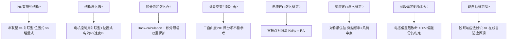
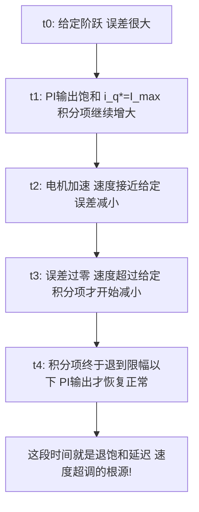
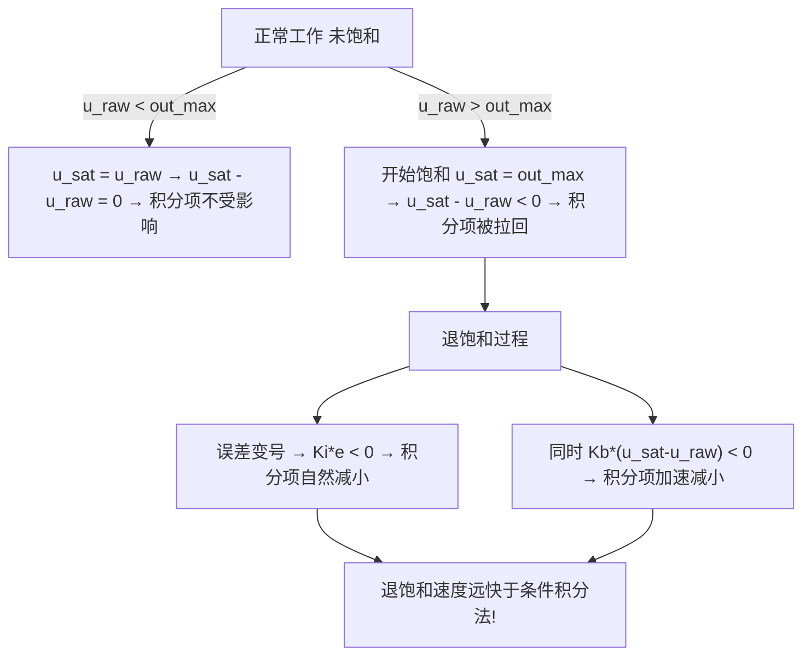

# ADV-ALG-13 PID结构选择与深度整定

**模块编号：** ADV-ALG-13
**模块名称：** PID结构选择与深度整定（PID Structure Selection & Deep Tuning Methods）
**文档版本：** v2.0
**适用对象：** 已掌握FOC基本原理和PI控制，需要深入理解PID结构差异与整定方法的嵌入式工程师
**前置知识：** ALG-01 FOC理论基础、ALG-05 有感FOC实现、ADV-ALG-01 控制环带宽设计、自动控制原理
**难度等级：** 

---

## 1. 核心摘要

**一句话：** PID不是一种算法而是一族算法——串联还是并联、位置式还是增量式、单自由度还是二自由度，每一种结构选择都决定了参数的物理含义和调节逻辑；而整定不是调参而是建模——零极点对消法和对称最优法本质上是把被控对象的物理参数"写进"控制器。

**认知挂钩：** 把PID控制器想象成一副眼镜：并联型是"三焦点眼镜"——远中近三个度数独立配，但三个镜片之间没有耦合；串联型是"渐进多焦点眼镜"——一副镜片连续过渡，但调一个区域会影响相邻区域。位置式PID是"绝对定位GPS"——每次告诉你"你在哪"；增量式PID是"惯性导航"——每次告诉你"你走了多远"。抗积分饱和则是"刹车辅助"——油门踩到底时，别让发动机继续加速。

**核心问题链：**



**PID结构选择速查表：**

| 决策维度 | 电机控制推荐 | 替代方案 | 选择依据 |
|---------|------------|---------|---------|
| 串联/并联 | 并联型 | 串联型 | 独立调节更灵活 |
| 位置/增量 | 位置式（电流/速度环） | 增量式（位置环可选） | 电流环需绝对输出 |
| 抗饱和 | Back-calculation + 积分限幅 | 条件积分 | 退饱和最快 |
| 自由度 | 二自由度（速度环） | 单自由度（电流环） | 减小速度阶跃冲击 |
| 微分项 | 电流环不用，速度环不用 | 位置环可用 | 噪声敏感，电机控制少用 |

---

## 2. 串联型PID vs 并联型PID

### 2.1 并联型PID（标准型/Independent Form）

并联型PID的三个通道独立并行计算，输出为三项之和：

$$
u(t) = K_p \cdot e(t) + K_i \cdot \int_0^t e(\tau)\,d\tau + K_d \cdot \frac{de(t)}{dt}
$$

传递函数形式：

$$
C_{parallel}(s) = K_p + \frac{K_i}{s} + K_d \cdot s = K_p \cdot \left(1 + \frac{1}{T_i s} + T_d s\right)
$$

其中：
- $K_p$：比例增益，无量纲（输入输出单位的比值）
- $K_i$：积分增益，单位 $1/s$（或 $\text{输出单位}/(\text{输入单位} \cdot s)$）
- $K_d$：微分增益，单位 $s$（或 $\text{输出单位} \cdot s / \text{输入单位}$）
- $T_i = K_p / K_i$：积分时间常数
- $T_d = K_d / K_p$：微分时间常数

**核心特征：**

1. **参数独立调节**：调 $K_p$ 不影响积分项和微分项的增益，三个参数完全解耦
2. **零点位置随 $K_p$ 变化**：PI零点为 $s = -K_i/K_p$，调 $K_p$ 会移动零点位置
3. **物理含义清晰**：$K_p$ 直接决定带宽，$K_i$ 决定稳态精度恢复速度，$K_d$ 决定阻尼

**离散化实现：**

```c
/**
 * @brief  并联型PID控制器（位置式）
 * @param  pid: PID结构体指针
 * @param  ref: 参考值
 * @param  fdb: 反馈值
 * @retval 控制器输出
 * @note   Kp、Ki、Kd独立调节，Ki单位为1/s（需乘以Ts离散化）
 *         项目代码参考: AxDr/AxDr/User/utils/pid.c 中的 parallel_pid_ctrl()
 */
float parallel_pid_calc(pid_t *pid, float ref, float fdb)
{
    float error = ref - fdb;

    /* 比例项 */
    pid->p_term = pid->kp * error;

    /* 积分项：Ki已经乘以Ts（离散化） */
    pid->i_term += pid->ki * error;

    /* 微分项：Kd已经除以Ts（离散化） */
    pid->d_term = pid->kd * (error - pid->prev_error);

    pid->prev_error = error;

    /* 并联求和 */
    pid->output = pid->p_term + pid->i_term + pid->d_term;

    return pid->output;
}
```

> **代码对应：** 项目中 `pid.c` 的 `parallel_pid_ctrl()` 函数实现了并联型PID，其中 `pid->i_term += pid->ki * pid->error` 对应积分项，`pid->ki` 是离散化后的 $K_i \times T_s$。

### 2.2 串联型PID（理想型/Dependent Form / Series Form）

串联型PID将比例、积分、微分三个环节串联：

$$
u(t) = K_p \cdot \left(e(t) + \frac{1}{T_i} \int_0^t e(\tau)\,d\tau + T_d \cdot \frac{de(t)}{dt}\right)
$$

传递函数形式：

$$
C_{series}(s) = K_p \cdot \left(1 + \frac{1}{T_i s} + T_d s\right) = K_p \cdot \frac{T_i T_d s^2 + T_i s + 1}{T_i s}
$$

**更精确的串联型（含微分滤波器）：**

实际应用中微分项需要加低通滤波器以抑制高频噪声放大：

$$
C_{series,real}(s) = K_p \cdot \left(1 + \frac{1}{T_i s}\right) \cdot \left(\frac{T_d s + 1}{\frac{T_d}{N} s + 1}\right)
$$

其中 $N$ 为微分滤波系数，通常取 8~20。

**核心特征：**

1. **$K_p$ 不影响零点位置**：PI零点为 $s = -1/T_i$，只由 $T_i$ 决定，调 $K_p$ 只改变整体增益
2. **参数耦合**：调 $K_p$ 同时改变了积分项和微分项的实际增益
3. **过程控制中常用**：先调 $K_p$ 确定响应速度，再调 $T_i$ 消除稳态误差，最后调 $T_d$ 改善阻尼

**离散化实现：**

```c
/**
 * @brief  串联型PID控制器（位置式）
 * @param  pid: PID结构体指针
 * @param  ref: 参考值
 * @param  fdb: 反馈值
 * @retval 控制器输出
 * @note   Kp不影响零点位置，Ti是积分时间常数，Td是微分时间常数
 *         项目代码参考: AxDr/AxDr/User/utils/pid.c 中的 serial_pid_ctrl()
 *         注意：项目中的serial_pid_ctrl()实现的是串联PI（无微分项），
 *         i_term += ki * p_term，即积分项对P项输出积分
 */
float series_pid_calc(pid_t *pid, float ref, float fdb)
{
    float error = ref - fdb;

    /* 比例项 */
    pid->p_term = pid->kp * error;

    /* 积分项：串联型中积分项对比例项输出积分 */
    /* 等价于 i_term += (Kp / Ti) * error * Ts */
    pid->i_term += pid->ki * pid->p_term;

    /* 微分项：串联型中微分项也乘以Kp */
    pid->d_term = pid->kd * pid->kp * (error - pid->prev_error);

    pid->prev_error = error;

    /* 串联求和：输出 = P项 + I项 + D项 */
    pid->output = pid->p_term + pid->i_term + pid->d_term;

    return pid->output;
}
```

> **代码对应：** 项目中 `pid.c` 的 `serial_pid_ctrl()` 函数实现了串联型PI控制器。关键区别在于第139行 `pid->i_term += pid->ki * pid->p_term`——积分项对P项输出积分，而非对误差积分。这意味着 `ki` 对应的是 $1/T_i$（积分时间常数的倒数），而非并联型中的 $K_i$。

### 2.3 两种形式的数学转换

**并联型 → 串联型：**

$$
K_{p,series} = K_p, \quad T_i = \frac{K_p}{K_i}, \quad T_d = \frac{K_d}{K_p}
$$

**串联型 → 并联型：**

$$
K_{p,parallel} = K_p, \quad K_i = \frac{K_p}{T_i}, \quad K_d = K_p \cdot T_d
$$

**转换示例：**

> 已知并联型参数：$K_p = 4.71$，$K_i = 4712\,\text{s}^{-1}$，$K_d = 0$（PI控制）
>
> 转换为串联型：
> $$T_i = \frac{K_p}{K_i} = \frac{4.71}{4712} = 0.001\,\text{s} = 1\,\text{ms}$$
>
> 验证：$T_i = L/R = 0.5\text{mH}/0.5\Omega = 1\,\text{ms}$，正好等于电气时间常数！

**关键洞察：** 零极点对消法中 $K_i/K_p = R/L$，等价于串联型中 $T_i = L/R = \tau_e$。串联型的 $T_i$ 直接对应被控对象的极点时间常数，物理含义更直观。但并联型的 $K_i$ 独立于 $K_p$，调节更灵活。

### 2.4 两种形式的调节行为对比

**场景：增大 $K_p$ 一倍**

| 指标 | 并联型 | 串联型 |
|------|--------|--------|
| 比例增益 | $K_p \to 2K_p$ | $K_p \to 2K_p$ |
| 积分增益 | $K_i$ 不变 | 实际积分增益 $K_p/T_i \to 2K_p/T_i$，翻倍 |
| 微分增益 | $K_d$ 不变 | 实际微分增益 $K_p \cdot T_d \to 2K_p \cdot T_d$，翻倍 |
| PI零点 | $-K_i/K_p$ 移动 | $-1/T_i$ 不变 |
| 闭环带宽 | 增大 | 增大 |
| 稳态误差消除速度 | 不变 | 加快（积分增益翻倍） |

**场景：仅调整积分速度**

| 操作 | 并联型 | 串联型 |
|------|--------|--------|
| 方法 | 直接调 $K_i$ | 调 $T_i$（减小 $T_i$ 加快积分） |
| 副作用 | 无（$K_p$、$K_d$ 不变） | 无（$K_p$ 不变，零点移动但增益不变） |
| 物理直觉 | $K_i$ 越大积分越快 | $T_i$ 越小积分越快 |

### 2.5 选择建议

**电机控制推荐并联型，理由：**

1. **独立调节**：调电流环 $K_p$ 改变带宽时，不希望积分增益跟着变。并联型中 $K_i$ 独立，带宽和稳态精度解耦
2. **零极点对消法直接**：$K_i/K_p = R/L$，调 $K_p$ 设定带宽后，$K_i$ 直接由电机参数决定，无需重新计算
3. **多环调试习惯**：先调内环 $K_p$ 确定带宽，再根据零极点对消关系确定 $K_i$。并联型中这一流程最自然
4. **工业标准**：大部分电机控制库（ST MC SDK、TI MotorWare、Infineon XMC）默认使用并联型

**过程控制推荐串联型，理由：**

1. **Ziegler-Nichols法**：经典Z-N整定公式基于串联型，给出的是 $K_p$、$T_i$、$T_d$
2. **$K_p$ 不影响零点**：过程控制中经常需要"先确定响应速度（$K_p$），再调消除偏差的速度（$T_i$）"，串联型中调 $K_p$ 不改变零点位置，不会破坏已调好的动态特性
3. **物理直觉**：$T_i$ 直接对应"积分消除偏差需要多少个采样周期"，比 $K_i$ 更直观

> **项目代码说明：** 本项目同时实现了并联型（`parallel_pid_ctrl`）和串联型（`serial_pid_ctrl`），但FOC控制中实际使用的是串联型 `serial_pid_ctrl`（见 `foc_ctrl.c`）。这意味着项目中的 `ki` 参数对应 $1/T_i$ 而非 $K_i$，在参数整定时需要注意这一区别。

---

## 3. 增量式PID vs 位置式PID

### 3.1 位置式PID（Position Form / Absolute Form）

位置式PID输出的是控制量的绝对值：

$$
u(k) = K_p \cdot e(k) + K_i \sum_{j=0}^{k} e(j) + K_d \cdot [e(k) - e(k-1)]
$$

展开写：

$$
u(k) = K_p \cdot e(k) + K_i \cdot e(k) + K_i \cdot \sum_{j=0}^{k-1} e(j) + K_d \cdot [e(k) - e(k-1)]
$$

**核心特征：**

1. **输出是绝对值**：$u(k)$ 直接对应执行器的绝对位置（如PWM占空比、DAC输出值）
2. **积分项累积**：$\sum e(j)$ 从系统启动开始累加，包含所有历史误差信息
3. **需要抗饱和**：执行器饱和时误差持续存在，积分项持续增大（详见第4节）
4. **切换时可能跳变**：从手动切自动、或切换给定值时，积分项的累积值可能导致输出突变

**离散化实现：**

```c
/**
 * @brief  位置式PID控制器（并联型）
 * @param  pid: PID结构体指针
 * @param  ref: 参考值
 * @param  fdb: 反馈值
 * @retval 控制器输出（绝对值）
 * @note   输出是控制量的绝对值，需要抗积分饱和处理
 *         适用于电流环、速度环（需要绝对输出电压/电流给定）
 */
float positional_pid_calc(pid_t *pid, float ref, float fdb)
{
    float error = ref - fdb;

    /* P项 */
    pid->p_term = pid->kp * error;

    /* I项：累加 */
    pid->i_term += pid->ki * error;

    /* 积分限幅（最基本的抗饱和） */
    if (pid->i_term > pid->i_term_max)
        pid->i_term = pid->i_term_max;
    else if (pid->i_term < pid->i_term_min)
        pid->i_term = pid->i_term_min;

    /* D项 */
    pid->d_term = pid->kd * (error - pid->prev_error);
    pid->prev_error = error;

    /* 输出 = P + I + D */
    pid->output = pid->p_term + pid->i_term + pid->d_term;

    /* 输出限幅 */
    pid->output = CLAMP(pid->output, pid->out_min, pid->out_max);

    return pid->output;
}
```

### 3.2 增量式PID（Incremental Form / Velocity Form）

增量式PID输出的是控制量的变化量（增量）：

$$
\Delta u(k) = u(k) - u(k-1)
$$

推导过程：

$$
u(k) = K_p \cdot e(k) + K_i \sum_{j=0}^{k} e(j) + K_d \cdot [e(k) - e(k-1)]
$$

$$
u(k-1) = K_p \cdot e(k-1) + K_i \sum_{j=0}^{k-1} e(j) + K_d \cdot [e(k-1) - e(k-2)]
$$

两式相减：

$$
\Delta u(k) = K_p \cdot [e(k) - e(k-1)] + K_i \cdot e(k) + K_d \cdot [e(k) - 2e(k-1) + e(k-2)]
$$

最终输出：

$$
u(k) = u(k-1) + \Delta u(k)
$$

**核心特征：**

1. **输出是增量**：$\Delta u(k)$ 是相对于上一拍的变化量，需要累加才能得到绝对值
2. **无积分累积**：公式中没有显式的积分项 $\sum e(j)$，积分效应隐含在 $u(k-1)$ 的递推中
3. **天然抗饱和**：执行器饱和时 $u(k-1)$ 被限幅，增量计算基于限幅后的值，不会出现积分项无限增大的问题
4. **切换无跳变**：手动/自动切换时，$u(k-1)$ 从当前执行器位置开始递推，输出连续
5. **需要执行器有积分特性**：步进电机（脉冲累加）、电动阀（行程累加）天然适合增量式

**离散化实现：**

```c
/**
 * @brief  增量式PID控制器（并联型）
 * @param  pid: PID结构体指针
 * @param  ref: 参考值
 * @param  fdb: 反馈值
 * @retval 控制器输出增量（需外部累加）
 * @note   输出是增量，天然抗积分饱和
 *         适合执行器有积分特性的系统（如步进电机、电动阀）
 *         也可用于位置环，输出为速度给定增量
 */
float incremental_pid_calc(pid_t *pid, float ref, float fdb)
{
    float error = ref - fdb;

    /* 增量计算 */
    float delta_u = pid->kp * (error - pid->prev_error)       /* P项增量 */
                  + pid->ki * error                             /* I项 */
                  + pid->kd * (error - 2.0f * pid->prev_error
                               + pid->prev_error2);            /* D项增量 */

    /* 保存历史误差 */
    pid->prev_error2 = pid->prev_error;
    pid->prev_error = error;

    /* 增量限幅（防止单步变化过大） */
    delta_u = CLAMP(delta_u, pid->delta_min, pid->delta_max);

    /* 累加得到绝对输出 */
    pid->output += delta_u;

    /* 输出限幅 */
    pid->output = CLAMP(pid->output, pid->out_min, pid->out_max);

    return pid->output;
}
```

### 3.3 位置式 vs 增量式深度对比

| 对比维度 | 位置式PID | 增量式PID |
|---------|----------|----------|
| **输出含义** | 控制量绝对值 | 控制量增量 |
| **积分项** | 显式累积 $\sum e(j)$ | 隐含在递推中 |
| **积分饱和** | 需要专门处理 | 天然免疫 |
| **手动/自动切换** | 可能跳变 | 无跳变（从当前值开始递推） |
| **故障恢复** | 积分项可能残留异常值 | 无积分项，恢复干净 |
| **计算量** | 略小（少一次历史误差存储） | 略大（需存储 $e(k-2)$） |
| **稳态精度** | 相同（数学等价） | 相同 |
| **动态性能** | 相同（无饱和时） | 饱和时更优（退饱和更快） |
| **P项影响** | $K_p \cdot e(k)$，误差大时P项大 | $K_p \cdot [e(k)-e(k-1)]$，只有误差变化时P项才非零 |
| **给定突变** | P项产生大冲击 | P项增量有限，冲击小 |

### 3.4 电机控制中的选择

**电流环：位置式PI（必须）**

电流环输出是电压给定值（$u_d^*, u_q^*$），是绝对值而非增量。PWM占空比需要绝对值。且电流环带宽高、执行器（逆变器）没有积分特性，必须用位置式。

**速度环：位置式PI（推荐）**

速度环输出是电流给定值（$i_q^*$），也是绝对值。虽然增量式可以工作（累加得到电流给定），但位置式更直观，且配合Back-calculation抗饱和效果更好。

**位置环：增量式PI（可选）**

位置环输出是速度给定值（$\omega^*$），可以用增量式。增量式的优势在于：
- 速度给定不会突变（增量被限制），对速度环更友好
- 手动/自动切换时速度给定连续
- 不需要专门的抗积分饱和处理

```c
/**
 * @brief  位置环增量式PID控制器
 * @param  pid: PID结构体指针
 * @param  ref: 位置给定 (rad)
 * @param  fdb: 位置反馈 (rad)
 * @retval 速度给定增量 (rad/s)
 * @note   输出是速度给定增量，外部累加得到速度绝对给定
 *         增量限幅限制了加速度，对机械系统更安全
 */
float position_loop_incremental(pid_t *pid, float ref, float fdb)
{
    float error = ref - fdb;

    /* 增量式PI（位置环通常不用D） */
    float delta_omega = pid->kp * (error - pid->prev_error)
                      + pid->ki * error;

    pid->prev_error = error;

    /* 增量限幅：限制加速度 */
    float max_delta = pid->max_accel * pid->Ts;  /* max_accel: 最大加速度 (rad/s^2) */
    delta_omega = CLAMP(delta_omega, -max_delta, max_delta);

    /* 累加得到速度给定 */
    pid->output += delta_omega;
    pid->output = CLAMP(pid->output, pid->out_min, pid->out_max);

    return pid->output;
}
```

---

## 4. 抗积分饱和

### 4.1 积分饱和问题的物理本质

**问题场景：** 电机启动时，速度给定从0阶跃到额定转速，速度环误差很大。速度环PI控制器输出（电流给定 $i_q^*$）迅速达到限幅值（额定电流），但误差仍然存在，积分项继续累积。



**定量分析：** 假设积分项累积到 $I_{accum}$（远大于限幅值），退饱和需要的时间：

$$
t_{unwind} \approx \frac{I_{accum} - I_{max}}{K_i \cdot |e_{typical}|}
$$

其中 $e_{typical}$ 是退饱和阶段的典型误差。积分项累积越多，退饱和越慢，超调越大。

### 4.2 方法一：条件积分（Conditional Integration / Clamping）

**原理：** 当控制器输出饱和时，停止积分项的累加。

```c
/**
 * @brief  条件积分抗饱和
 * @note   输出饱和时停止积分
 *         简单但可能导致稳态误差（如果饱和由非积分项引起）
 */
float conditional_integration_pid(pid_t *pid, float ref, float fdb)
{
    float error = ref - fdb;

    pid->p_term = pid->kp * error;
    pid->d_term = pid->kd * (error - pid->prev_error);
    pid->prev_error = error;

    /* 条件积分：仅在输出未饱和时积分 */
    float output_before_i = pid->p_term + pid->i_term + pid->d_term;
    uint8_t saturated = (output_before_i > pid->out_max) ||
                        (output_before_i < pid->out_min);

    /* 更精细的条件：输出饱和 且 误差方向会加剧饱和 */
    uint8_t error_worsens = ((output_before_i > pid->out_max) && (error > 0)) ||
                            ((output_before_i < pid->out_min) && (error < 0));

    if (!error_worsens) {
        pid->i_term += pid->ki * error;
    }

    /* 积分限幅 */
    pid->i_term = CLAMP(pid->i_term, pid->i_term_min, pid->i_term_max);

    pid->output = pid->p_term + pid->i_term + pid->d_term;
    pid->output = CLAMP(pid->output, pid->out_min, pid->out_max);

    return pid->output;
}
```

**优点：** 实现简单，计算量小

**缺点：**
- 可能导致稳态误差：如果P项输出已经接近限幅，积分项无法继续累积来消除残余误差
- 退饱和速度取决于误差变号时机，可能仍然较慢
- "饱和+误差方向"判断比简单"饱和就停止"更优，但仍有边界情况

### 4.3 方法二：反馈抑制（Back-calculation / Anti-windup）

**原理：** 当输出饱和时，将饱和值与未限幅值的差反馈到积分项，使积分项"知道"自己已经饱和，主动退回。

$$
u_{raw}(k) = K_p \cdot e(k) + i_{term}(k) + K_d \cdot [e(k) - e(k-1)]
$$

$$
u_{sat}(k) = \text{sat}(u_{raw}(k), u_{min}, u_{max})
$$

$$
i_{term}(k+1) = i_{term}(k) + K_i \cdot e(k) + K_b \cdot [u_{sat}(k) - u_{raw}(k)]
$$

其中 $K_b = 1/T_t$，$T_t$ 是跟踪时间常数（Tracking Time Constant）。

**物理直觉：** $u_{sat} - u_{raw}$ 是"被限幅砍掉的部分"。这个差值乘以 $K_b$ 反馈到积分项，相当于告诉积分项"你多输出了这么多，请减回来"。

**$T_t$ 的选择：**

$$
T_t = \sqrt{T_i \cdot T_d}
$$

对于PI控制器（$T_d = 0$）：

$$
T_t = \frac{T_i}{\sqrt{2}} = \frac{K_p}{K_i \cdot \sqrt{2}}
$$

即：

$$
K_b = \frac{K_i \cdot \sqrt{2}}{K_p}
$$

**更实用的经验值：** $T_t = T_i / 2$，即 $K_b = 2 / T_i = 2 K_i / K_p$。

```c
/**
 * @brief  Back-calculation抗饱和PID控制器
 * @param  pid: PID结构体指针
 * @param  ref: 参考值
 * @param  fdb: 反馈值
 * @retval 控制器输出
 * @note   最常用的抗积分饱和方法
 *         Kb = 1/Tt，Tt推荐取 Ti/sqrt(2) 或 Ti/2
 *         退饱和速度由Tt决定：Tt越小退饱和越快，但太小时积分项振荡
 */
float back_calc_pid_calc(pid_t *pid, float ref, float fdb)
{
    float error = ref - fdb;

    /* P项 */
    pid->p_term = pid->kp * error;

    /* I项：先正常积分 */
    pid->i_term += pid->ki * error;

    /* D项 */
    pid->d_term = pid->kd * (error - pid->prev_error);
    pid->prev_error = error;

    /* 未限幅输出 */
    float u_raw = pid->p_term + pid->i_term + pid->d_term;

    /* 限幅输出 */
    float u_sat = CLAMP(u_raw, pid->out_min, pid->out_max);

    /* Back-calculation：将限幅差反馈到积分项 */
    /* Kb = sqrt(2) * Ki / Kp（推荐值） */
    float Kb = 1.4142f * pid->ki / pid->kp;
    pid->i_term += Kb * (u_sat - u_raw);

    /* 更新输出 */
    pid->output = u_sat;

    return pid->output;
}
```

**Back-calculation的工作过程分析：**



### 4.4 方法三：积分限幅（Integrator Clamping）

**原理：** 直接限制积分项的取值范围。

$$
i_{term}(k) = \text{clamp}\left(i_{term}(k-1) + K_i \cdot e(k),\; i_{min},\; i_{max}\right)
$$

```c
/**
 * @brief  积分限幅抗饱和
 * @note   最简单粗暴的方法，单独使用时退饱和仍然较慢
 *         推荐与Back-calculation组合使用
 */
float integrator_clamp_pid(pid_t *pid, float ref, float fdb)
{
    float error = ref - fdb;

    pid->p_term = pid->kp * error;

    /* 积分项累加 */
    pid->i_term += pid->ki * error;

    /* 积分限幅：限制积分项不超过输出限幅 */
    /* 注意：i_term_max 应小于 out_max，留出P项的空间 */
    pid->i_term = CLAMP(pid->i_term, pid->i_term_min, pid->i_term_max);

    pid->d_term = pid->kd * (error - pid->prev_error);
    pid->prev_error = error;

    pid->output = pid->p_term + pid->i_term + pid->d_term;
    pid->output = CLAMP(pid->output, pid->out_min, pid->out_max);

    return pid->output;
}
```

**积分限幅值的设定：**

$$
i_{term,max} = u_{max} - K_p \cdot e_{max,normal}
$$

其中 $e_{max,normal}$ 是正常工作时的最大误差。如果 $K_p \cdot e_{max,normal}$ 很小（稳态附近），则 $i_{term,max} \approx u_{max}$。

**更保守的设定：**

$$
i_{term,max} = 0.8 \times u_{max}
$$

留出20%的余量给P项和D项。

### 4.5 推荐方案：Back-calculation + 积分限幅双重保护

```c
/**
 * @brief  工业级抗饱和PID控制器
 * @param  pid: PID结构体指针
 * @param  ref: 参考值
 * @param  fdb: 反馈值
 * @retval 控制器输出
 * @note   Back-calculation + 积分限幅双重保护
 *         Back-calculation：快速退饱和
 *         积分限幅：兜底保护，防止极端情况
 *         推荐用于电机控制的电流环和速度环
 */
float industrial_pid_calc(pid_t *pid, float ref, float fdb)
{
    float error = ref - fdb;

    /* ===== P项 ===== */
    pid->p_term = pid->kp * error;

    /* ===== I项：先正常积分 ===== */
    pid->i_term += pid->ki * error;

    /* ===== D项 ===== */
    pid->d_term = pid->kd * (error - pid->prev_error);
    pid->prev_error = error;

    /* ===== 未限幅输出 ===== */
    float u_raw = pid->p_term + pid->i_term + pid->d_term;

    /* ===== 输出限幅 ===== */
    float u_sat = CLAMP(u_raw, pid->out_min, pid->out_max);

    /* ===== Back-calculation抗饱和 ===== */
    float Kb = 1.4142f * pid->ki / pid->kp;  /* Kb = sqrt(2) * Ki/Kp */
    pid->i_term += Kb * (u_sat - u_raw);

    /* ===== 积分限幅（兜底保护） ===== */
    pid->i_term = CLAMP(pid->i_term, pid->i_term_min, pid->i_term_max);

    /* ===== 最终输出 ===== */
    pid->output = u_sat;

    return pid->output;
}
```

> **代码对应：** 项目中 `pid.c` 的 `parallel_pid_ctrl()` 使用了积分限幅（`i_term_max`/`i_term_min`），但未实现Back-calculation。建议在工业级应用中增加Back-calculation以获得更快的退饱和速度。

### 4.6 三种抗饱和方法对比

| 对比维度 | 条件积分 | Back-calculation | 积分限幅 |
|---------|---------|-----------------|---------|
| **实现复杂度** | 低 | 中 | 低 |
| **退饱和速度** | 慢 | 快 | 中 |
| **稳态误差** | 可能有 | 无 | 无 |
| **参数敏感性** | 低 | 中（需选 $K_b$） | 低 |
| **适用场景** | 简单系统 | 电机控制（推荐） | 兜底保护 |
| **物理直觉** | 饱和就停 | 饱和就拉回 | 积分有上限 |

---

## 5. 二自由度PID

### 5.1 传统PID的问题

传统（单自由度）PID中，参考值 $r$ 和反馈值 $y$ 共用同一个误差通道：

$$
e = r - y
$$

$$
u = K_p \cdot e + K_i \cdot \int e\,dt + K_d \cdot \frac{de}{dt}
$$

**问题1：参考突变引起微分冲击（Derivative Kick）**

当参考值 $r$ 发生阶跃时，$de/dt$ 出现脉冲，微分项输出极大值。在电机控制中，速度给定阶跃时，微分项会产生巨大的电流给定冲击。

**问题2：抗干扰和跟踪性能无法同时最优**

增大 $K_p$ 提高跟踪性能但降低抗干扰鲁棒性，减小 $K_p$ 提高鲁棒性但跟踪变差。单自由度PID无法同时优化两个方向。

### 5.2 二自由度PID结构

二自由度PID将参考通道和反馈通道的增益分离：

$$
u = K_p \cdot (\beta \cdot r - y) + K_i \cdot \int (r - y)\,dt + K_d \cdot \frac{d(\gamma \cdot r - y)}{dt}
$$

其中：
- $\beta$：参考比例增益系数（$0 < \beta \leq 1$）
- $\gamma$：参考微分增益系数（通常 $\gamma = 0$）

**各项展开：**

$$
u = \underbrace{K_p \cdot \beta \cdot r}_{\text{参考前馈}} - \underbrace{K_p \cdot y}_{\text{反馈比例}} + K_i \cdot \int (r - y)\,dt + K_d \cdot \gamma \cdot \frac{dr}{dt} - K_d \cdot \frac{dy}{dt}
$$

**参数含义：**

| 参数 | 范围 | 作用 | 推荐值 |
|------|------|------|--------|
| $\beta$ | 0.3 ~ 1.0 | 控制参考阶跃响应的超调量。$\beta$ 越小超调越小 | 0.5 ~ 0.7 |
| $\gamma$ | 0 ~ 1.0 | 控制微分项对参考的响应。$\gamma=0$ 完全消除微分冲击 | 0 |

**$\beta$ 的影响：**

- $\beta = 1.0$：退化为传统PID，参考阶跃响应最快但超调最大
- $\beta = 0.5$：参考阶跃响应超调减小约50%，但稳态精度不受影响（积分项仍看 $r-y$）
- $\beta = 0.3$：参考阶跃响应几乎无超调，但上升时间变长

### 5.3 在电机控制中的应用

**速度环二自由度PI：**

速度给定阶跃时，传统PI的P项产生 $K_p \cdot \Delta\omega^*$ 的电流冲击。二自由度PI中P项只产生 $K_p \cdot \beta \cdot \Delta\omega^*$，冲击减小。

```c
/**
 * @brief  二自由度PI控制器（用于速度环）
 * @param  pid: PID结构体指针
 * @param  ref: 速度给定 (rad/s)
 * @param  fdb: 速度反馈 (rad/s)
 * @retval 电流给定 (A)
 * @note   beta: 参考比例增益系数（0.3~1.0），减小速度阶跃时的电流冲击
 *         gamma: 参考微分增益系数（通常=0），消除微分冲击
 *         积分项仍看 r-y，保证稳态精度不受影响
 */
float two_dof_pi_calc(pid_t *pid, float ref, float fdb)
{
    float error = ref - fdb;

    /* P项：参考通道和反馈通道增益不同 */
    pid->p_term = pid->kp * (pid->beta * ref - fdb);

    /* I项：仍使用完整误差，保证稳态精度 */
    pid->i_term += pid->ki * error;

    /* 积分限幅 */
    pid->i_term = CLAMP(pid->i_term, pid->i_term_min, pid->i_term_max);

    /* 输出 */
    pid->output = pid->p_term + pid->i_term;
    pid->output = CLAMP(pid->output, pid->out_min, pid->out_max);

    return pid->output;
}
```

**$\beta$ 值的整定建议：**

| 应用场景 | $\beta$ | 理由 |
|---------|---------|------|
| 伺服电机（快速定位） | 0.7~1.0 | 响应速度优先 |
| 机器人关节 | 0.4~0.6 | 平滑运动，避免冲击 |
| 电梯/升降 | 0.3~0.5 | 舒适性优先，加速度受限 |
| 风机/水泵 | 0.5~0.7 | 平衡响应速度和冲击 |

> **重要说明：** 二自由度PID只影响参考跟踪性能，不影响抗干扰性能。$\beta$ 减小后，负载突变时的响应速度不变（因为反馈通道增益 $K_p$ 不变），但参考阶跃时的超调减小。这正是我们想要的——对操作员的指令响应平滑，对负载扰动响应迅速。

---

## 6. 电流环PI整定——零极点对消法

### 6.1 被控对象模型

PMSM在dq坐标系下，忽略交叉耦合项，d轴和q轴的电流环被控对象均为一阶RL电路：

$$
G_{plant}(s) = \frac{I(s)}{U(s)} = \frac{1}{Ls + R} = \frac{1/R}{\tau_e s + 1}
$$

其中电气时间常数 $\tau_e = L/R$。

### 6.2 零极点对消原理

PI控制器传递函数：

$$
C_{PI}(s) = K_p + \frac{K_i}{s} = K_p \cdot \frac{s + K_i/K_p}{s}
$$

PI控制器引入一个零点 $s = -K_i/K_p$ 和一个极点 $s = 0$（积分器）。

**零极点对消：** 令PI零点等于被控对象极点：

$$
\frac{K_i}{K_p} = \frac{R}{L}
$$

此时PI零点 $s = -R/L$ 与被控对象极点 $s = -R/L$ 对消。

### 6.3 闭环传递函数推导

开环传递函数：

$$
G_{ol}(s) = K_p \cdot \frac{s + R/L}{s} \cdot \frac{1/L}{s + R/L} = \frac{K_p/L}{s}
$$

闭环传递函数：

$$
G_{cl}(s) = \frac{G_{ol}(s)}{1 + G_{ol}(s)} = \frac{K_p/L}{s + K_p/L} = \frac{\omega_c}{s + \omega_c}
$$

其中 $\omega_c = K_p/L$ 是闭环带宽。

### 6.4 从带宽反推PI参数

$$
\boxed{K_p = \omega_c \cdot L}
$$

$$
\boxed{K_i = \omega_c \cdot R}
$$

**验证零极点对消：**

$$
\frac{K_i}{K_p} = \frac{\omega_c \cdot R}{\omega_c \cdot L} = \frac{R}{L} \quad \checkmark
$$

### 6.5 离散化

连续域PI参数到离散域的转换：

$$
K_{p,disc} = K_p \quad \text{（比例项不变）}
$$

$$
K_{i,disc} = K_i \times T_s \quad \text{（积分项乘以采样周期）}
$$

其中 $T_s = 1/f_{PWM}$ 是电流环采样周期。

### 6.6 IPMSM的d轴和q轴分别整定

对于内埋式PMSM（IPMSM），$L_d \neq L_q$：

$$
K_{p,d} = \omega_c \cdot L_d, \quad K_{i,d} = \omega_c \cdot R
$$

$$
K_{p,q} = \omega_c \cdot L_q, \quad K_{i,q} = \omega_c \cdot R
$$

注意：$K_i$ 相同（因为 $R$ 相同），但 $K_p$ 不同（因为 $L_d \neq L_q$）。如果d轴和q轴使用相同的 $K_p$，则d轴和q轴的闭环带宽不同。

### 6.7 完整计算示例

> **电机参数：** SPMSM，$R_s = 0.5\,\Omega$，$L_s = 0.5\,\text{mH}$，$\psi_f = 0.0085\,\text{Wb}$，极对数 $p = 4$
>
> **系统参数：** PWM频率 $f_{PWM} = 20\,\text{kHz}$，选择电流环带宽 $f_c = 1500\,\text{Hz}$

**Step 1：** 计算带宽角频率

$$
\omega_c = 2\pi \times 1500 = 9425\,\text{rad/s}
$$

**Step 2：** 计算PI参数

$$
K_p = 9425 \times 0.5 \times 10^{-3} = 4.712\,\text{V/A}
$$

$$
K_i = 9425 \times 0.5 = 4712\,\text{V/(A \cdot s)}
$$

**Step 3：** 验证零极点对消

$$
K_i/K_p = 4712/4.712 = 1000\,\text{s}^{-1}
$$

$$
R/L = 0.5/0.0005 = 1000\,\text{s}^{-1} \quad \checkmark
$$

**Step 4：** 离散化

$$
K_{p,disc} = 4.712
$$

$$
K_{i,disc} = 4712 \times 50 \times 10^{-6} = 0.2356
$$

**Step 5：** 串联型PI参数（如果使用串联型）

$$
T_i = K_p / K_i = 4.712 / 4712 = 0.001\,\text{s} = 1\,\text{ms}
$$

$$
K_{p,series} = 4.712, \quad K_{i,series} = 1/T_i = 1000\,\text{s}^{-1}
$$

离散化：$K_{i,series,disc} = 1000 \times 50 \times 10^{-6} = 0.05$

> **注意：** 串联型中 `i_term += ki * p_term`，其中 `ki = 0.05`，`p_term = Kp * error`。等效积分效果为 `ki * Kp * error = 0.05 * 4.712 * error = 0.2356 * error`，与并联型一致。

```c
/**
 * @brief  电流环PI参数计算（零极点对消法）
 * @param  R: 定子电阻 (Ohm)
 * @param  L: 定子电感 (H)
 * @param  bandwidth_hz: 期望闭环带宽 (Hz)
 * @param  Ts: 采样周期 (s)
 * @param  kp: 输出比例增益
 * @param  ki: 输出离散积分增益
 * @note   零极点对消法：Ki/Kp = R/L
 *         闭环带宽 = Kp/L
 *         离散Ki = 连续Ki * Ts
 */
void current_loop_pi_design(float R, float L, float bandwidth_hz,
                             float Ts, float *kp, float *ki)
{
    float omega_c = 2.0f * 3.14159265f * bandwidth_hz;

    *kp = omega_c * L;          /* 比例增益 */
    *ki = omega_c * R * Ts;     /* 离散积分增益 */
}
```

---

## 7. 速度环PI整定——对称最优法

### 7.1 被控对象模型

速度环的被控对象包括：
1. 电流环（简化为一阶惯性环节）
2. 机械惯性（纯积分环节）

$$
G_{plant,speed}(s) = \frac{1}{J s} \cdot \frac{\omega_c}{s + \omega_c} \cdot K_t
$$

其中：
- $J$：转动惯量（$\text{kg} \cdot \text{m}^2$）
- $\omega_c$：电流环闭环带宽（$\text{rad/s}$）
- $K_t = 1.5 p \psi_f$：转矩常数（SPMSM）

### 7.2 对称最优法原理

**核心思想：** 让开环穿越频率 $\omega_{c,speed}$ 位于PI零点 $\omega_{z,s}$ 和电流环极点 $\omega_c$ 的几何中点，使相角裕度最大化。

开环传递函数：

$$
G_{ol,speed}(s) = K_{p,s} \cdot \frac{s + \omega_{z,s}}{s} \cdot \frac{\omega_c}{s + \omega_c} \cdot \frac{K_t}{J s}
$$

整理：

$$
G_{ol,speed}(s) = \frac{K_{p,s} K_t \omega_c}{J} \cdot \frac{s + \omega_{z,s}}{s^2(s + \omega_c)}
$$

**对称最优条件：**

$$
\omega_{c,speed} = \sqrt{\omega_{z,s} \cdot \omega_c}
$$

设 $\omega_c / \omega_{z,s} = a^2$（$a$ 为对称最优系数），则：

$$
\omega_{z,s} = \frac{\omega_c}{a^2}, \quad \omega_{c,speed} = \frac{\omega_c}{a}
$$

### 7.3 PI参数推导

在穿越频率 $\omega_{c,speed} = \omega_c / a$ 处，开环增益为1：

$$
|G_{ol,speed}(j\omega_{c,speed})| = 1
$$

近似计算（$\omega_{z,s} \ll \omega_{c,speed} \ll \omega_c$）：

$$
\frac{K_{p,s} K_t \omega_c}{J} \cdot \frac{\omega_{c,speed}}{\omega_{c,speed}^2 \cdot \omega_c} \approx 1
$$

化简得：

$$
K_{p,s} = \frac{J \cdot \omega_{c,speed}}{K_t} = \frac{J \cdot \omega_c}{a \cdot K_t}
$$

PI零点频率：

$$
\omega_{z,s} = \frac{K_{i,s}}{K_{p,s}} = \frac{\omega_c}{a^2}
$$

因此：

$$
K_{i,s} = K_{p,s} \cdot \omega_{z,s} = \frac{J \cdot \omega_c^2}{a^3 \cdot K_t}
$$

### 7.4 对称最优系数 $a$ 的选择

$$
\boxed{a = 4 \sim 10}
$$

| $a$ 值 | $\omega_{c,speed}$ | 相角裕度 | 阶跃超调 | 适用场景 |
|--------|-------------------|---------|---------|---------|
| 2 | $\omega_c/2$ | 36.9° | ~43% | 不推荐（PM太小） |
| 4 | $\omega_c/4$ | 53.1° | ~20% | 高性能伺服 |
| $\sqrt{2}+1 \approx 2.414$ | $\omega_c/2.414$ | 46.4° | ~30% | 最大PM点 |
| 6 | $\omega_c/6$ | 59.0° | ~10% | 通用伺服 |
| 8 | $\omega_c/8$ | 62.7° | ~5% | 保守设计 |
| 10 | $\omega_c/10$ | 65.5° | ~2% | 鲁棒性优先 |

**推荐：** $a = 4 \sim 6$，兼顾响应速度和稳定性。

### 7.5 对称最优法的超调问题与加速度前馈

对称最优法的阶跃响应存在超调（即使相角裕度很大），原因是PI零点在s平面左半面靠近虚轴，产生了"零点超调"。

**解决方案：加速度前馈**

$$
i_{ff} = \frac{J}{K_t} \cdot \frac{d\omega^*}{dt}
$$

加速度前馈在速度给定变化时提前提供所需电流，消除超调的同时不改变闭环稳定性。

```c
/**
 * @brief  速度环PI参数计算（对称最优法）
 * @param  J: 转动惯量 (kg*m^2)
 * @param  Kt: 转矩常数 (N*m/A)
 * @param  omega_c_current: 电流环带宽 (rad/s)
 * @param  a: 对称最优系数 (4~10)
 * @param  Ts: 速度环采样周期 (s)
 * @param  kp: 输出比例增益
 * @param  ki: 输出离散积分增益
 * @note   对称最优法：穿越频率 = 几何中点
 *         omega_c_speed = omega_c_current / a
 *         阶跃响应有超调，加速度前馈可消除
 */
void speed_loop_pi_design(float J, float Kt, float omega_c_current,
                           float a, float Ts, float *kp, float *ki)
{
    float omega_c_speed = omega_c_current / a;

    *kp = J * omega_c_speed / Kt;                    /* 比例增益 */
    *ki = J * omega_c_speed * omega_c_speed / (Kt * a) * Ts;  /* 离散积分增益 */
    /* 等价于 ki = kp * omega_z_s * Ts，其中 omega_z_s = omega_c_speed / a */
}
```

### 7.6 完整计算示例

> **电机参数：** SPMSM，$R_s = 0.5\,\Omega$，$L_s = 0.5\,\text{mH}$，$\psi_f = 0.0085\,\text{Wb}$，极对数 $p = 4$，$J = 0.0001\,\text{kg}\cdot\text{m}^2$
>
> **电流环带宽：** $\omega_c = 9425\,\text{rad/s}$（$f_c = 1500\,\text{Hz}$）
>
> **对称最优系数：** $a = 6$

**Step 1：** 速度环穿越频率

$$
\omega_{c,speed} = \frac{9425}{6} = 1571\,\text{rad/s} \quad (f_{c,speed} = 250\,\text{Hz})
$$

**Step 2：** 转矩常数

$$
K_t = 1.5 \times 4 \times 0.0085 = 0.051\,\text{N}\cdot\text{m/A}
$$

**Step 3：** PI参数

$$
K_{p,s} = \frac{0.0001 \times 1571}{0.051} = 3.08\,\text{A/(rad/s)}
$$

$$
K_{i,s} = \frac{0.0001 \times 1571^2}{0.051 \times 6} = 807\,\text{s}^{-1}
$$

**Step 4：** 验证PI零点

$$
\omega_{z,s} = K_{i,s}/K_{p,s} = 807/3.08 = 262\,\text{rad/s}
$$

$$
\omega_c / a^2 = 9425/36 = 262\,\text{rad/s} \quad \checkmark
$$

**Step 5：** 离散化（速度环周期 $T_{s,spd} = 200\,\mu\text{s}$）

$$
K_{p,s,disc} = 3.08
$$

$$
K_{i,s,disc} = 807 \times 200 \times 10^{-6} = 0.161
$$

---

## 8. 参数敏感性分析

### 8.1 电感偏差对电流环的影响

零极点对消法中，PI零点 $-K_i/K_p$ 需要对消被控对象极点 $-R/L$。如果实际电感 $L_{real}$ 与设计电感 $L_{design}$ 不同，零极点无法完全对消。

**偏差模型：**

设计参数基于 $L_{design}$：

$$
K_p = \omega_c \cdot L_{design}, \quad K_i = \omega_c \cdot R
$$

实际闭环传递函数（零极点未对消）：

$$
G_{cl,real}(s) = \frac{K_p(s + R/L_{design})}{L_{real}s^2 + (R + K_p)s + K_i}
$$

**电感偏差的影响：**

| 偏差 $\Delta L / L$ | 闭环极点 | 阻尼比变化 | 带宽变化 | 稳定性 |
|---------------------|---------|-----------|---------|--------|
| -50% | 向右半面移动 | 减小 | 增大（约2x） | 可能振荡 |
| -30% | 轻微右移 | 略减 | 增大（约1.4x） | 仍稳定 |
| 0% | 理想位置 | 设计值 | 设计值 | 理想 |
| +30% | 向左半面移动 | 增大 | 减小（约0.77x） | 更稳定但慢 |
| +50% | 更远左移 | 更大 | 减小（约0.67x） | 过度阻尼 |

**关键结论：** 电感偏差比设计值小（$\Delta L < 0$）更危险，因为带宽增大可能导致振荡。电感偏差比设计值大（$\Delta L > 0$）只是响应变慢，不会失稳。

**原因：** 电机饱和时电感减小。额定电流下电感可能比零电流时小30%~50%。因此PI参数应基于额定工作点的电感设计，而非零电流电感。

### 8.2 电阻偏差对积分补偿的影响

电阻随温度变化：铜绕组温度系数约 $0.00393/\text{°C}$。

$$
R(T) = R_{20°C} \times [1 + 0.00393 \times (T - 20)]
$$

从20°C到130°C，电阻增加约43%。

**对零极点对消的影响：**

$$
\frac{K_i}{K_p} = \frac{R_{design}}{L_{design}} \neq \frac{R_{real}}{L_{real}}
$$

电阻偏差导致PI零点偏离被控对象极点，但影响比电感偏差小得多，因为：

1. 零极点对消后闭环简化为 $G_{cl}(s) = \omega_c / (s + \omega_c)$，带宽 $\omega_c = K_p/L$ 与 $R$ 无关
2. 电阻偏差只影响零极点对消的精度，产生一个"残余极点"，但该极点在高频段，对低频特性影响小
3. 积分项的主要作用是消除稳态误差，电阻偏差只影响暂态过程

### 8.3 转动惯量偏差对速度环的影响

速度环 $K_p$ 与 $J$ 成正比。如果实际惯量 $J_{real}$ 与设计惯量 $J_{design}$ 不同：

$$
K_{p,s} = \frac{J_{design} \cdot \omega_{c,speed}}{K_t}
$$

实际速度环带宽：

$$
\omega_{c,speed,real} = \frac{K_{p,s} \cdot K_t}{J_{real}} = \omega_{c,speed} \cdot \frac{J_{design}}{J_{real}}
$$

| 偏差 $\Delta J / J$ | 实际带宽 | 相角裕度 | 稳定性 |
|---------------------|---------|---------|--------|
| -50%（负载脱落） | 2x设计带宽 | 大幅减小 | 可能振荡！ |
| -30% | 1.43x | 减小 | 需验证 |
| 0% | 设计值 | 设计值 | 理想 |
| +100%（负载增加） | 0.5x | 增大 | 更稳定但慢 |
| +300% | 0.25x | 很大 | 过度保守 |

**关键结论：** 惯量偏差比设计值小更危险。负载脱落（如机械断裂）会导致速度环振荡。

### 8.4 磁链偏差对转矩精度的影响

转矩常数 $K_t = 1.5 p \psi_f$，磁链 $\psi_f$ 随温度变化（永磁体温度系数：NdFeB约 $-0.1\%/\text{°C}$，SmCo约 $-0.03\%/\text{°C}$）。

从20°C到150°C，NdFeB磁链减小约13%。

**影响：**

1. **转矩精度下降**：给定 $i_q^*$ 产生的实际转矩 $T_e = K_{t,real} \cdot i_q \neq K_{t,design} \cdot i_q$
2. **速度环带宽偏移**：$K_{p,s} \propto 1/K_t$，磁链减小等效于 $K_t$ 减小，速度环实际带宽增大
3. **前馈补偿误差**：加速度前馈 $i_{ff} = J \cdot \dot{\omega}^* / K_t$，$K_t$ 偏差导致前馈不准

### 8.5 鲁棒性设计准则

$$
\boxed{\text{参数偏差} \pm 30\% \text{时系统仍应稳定}}
$$

**设计策略：**

1. **保守带宽**：电流环带宽取 $f_{PWM}/15$ 而非 $f_{PWM}/10$，留出裕度
2. **基于最坏工况设计**：电感取饱和值（最小值），电阻取最高温度值
3. **增益调度**：根据电流幅值调整PI参数（电感随电流变化）
4. **在线辨识**：运行时实时辨识 $R$、$L$、$J$，动态调整PI参数

```c
/**
 * @brief  鲁棒性验证：参数偏差下的稳定性检查
 * @param  kp: PI比例增益
 * @param  ki: PI积分增益
 * @param  R_nom: 标称电阻
 * @param  L_nom: 标称电感
 * @param  R_var: 电阻偏差比例 (如0.3表示+30%)
 * @param  L_var: 电感偏差比例
 * @retval 1=稳定, 0=不稳定
 * @note   检查闭环极点是否全部在左半面
 */
uint8_t robustness_check(float kp, float ki,
                          float R_nom, float L_nom,
                          float R_var, float L_var)
{
    /* 最恶劣工况：电感最小（饱和），电阻最大（高温） */
    float R_worst = R_nom * (1.0f + R_var);
    float L_worst = L_nom * (1.0f - L_var);

    /* 闭环特征方程：L_worst * s^2 + (R_worst + Kp) * s + Ki = 0 */
    /* Routh判据：所有系数 > 0 且 (R_worst + Kp) * Ki > 0 */
    float a2 = L_worst;
    float a1 = R_worst + kp;
    float a0 = ki;

    /* 稳定条件：所有系数同号 */
    if (a2 > 0 && a1 > 0 && a0 > 0) {
        return 1;  /* 稳定 */
    }
    return 0;  /* 不稳定 */
}
```

---

## 9. PI参数自整定方法

### 9.1 阶跃响应法（Step Response Method）

**原理：** 注入阶跃电压，测量电流响应，从响应曲线辨识 $R$ 和 $L$。

**测试步骤：**

1. 电机静止，使能d轴电流环（开环模式）
2. 在d轴注入阶跃电压 $U_0$（如5V）
3. 记录d轴电流响应 $i_d(t)$

**一阶RL电路的阶跃响应：**

$$
i_d(t) = \frac{U_0}{R} \left(1 - e^{-t/\tau_e}\right)
$$

其中 $\tau_e = L/R$。

**参数辨识：**

1. **稳态值**：$i_{d,\infty} = U_0 / R$，因此 $R = U_0 / i_{d,\infty}$
2. **时间常数**：$i_d(\tau_e) = 0.632 \times i_{d,\infty}$，找到电流达到稳态值63.2%的时刻 $t_{63\%}$，则 $\tau_e = t_{63\%}$
3. **电感**：$L = R \times \tau_e$

```c
/**
 * @brief  阶跃响应法辨识R和L
 * @param  U_step: 注入阶跃电压 (V)
 * @param  i_samples: 电流采样数组
 * @param  sample_period: 采样周期 (s)
 * @param  num_samples: 采样点数
 * @param  R: 输出电阻 (Ohm)
 * @param  L: 输出电感 (H)
 * @note   电机必须静止，注入d轴电压
 *         稳态电流 = U_step / R
 *         63.2%时刻 = L/R
 */
void step_response_identify(float U_step, float *i_samples,
                             float sample_period, uint32_t num_samples,
                             float *R, float *L)
{
    /* Step 1: 找稳态值（取最后10%采样的平均值） */
    uint32_t steady_start = num_samples * 9 / 10;
    float i_steady = 0.0f;
    for (uint32_t i = steady_start; i < num_samples; i++) {
        i_steady += i_samples[i];
    }
    i_steady /= (num_samples - steady_start);

    /* Step 2: 计算电阻 */
    *R = U_step / i_steady;

    /* Step 3: 找63.2%时刻 */
    float i_632 = 0.632f * i_steady;
    float tau_e = 0.0f;
    for (uint32_t i = 1; i < num_samples; i++) {
        if (i_samples[i] >= i_632 && i_samples[i-1] < i_632) {
            /* 线性插值 */
            float ratio = (i_632 - i_samples[i-1]) / (i_samples[i] - i_samples[i-1]);
            tau_e = (i - 1 + ratio) * sample_period;
            break;
        }
    }

    /* Step 4: 计算电感 */
    *L = (*R) * tau_e;
}
```

### 9.2 频域法（Frequency Response Method）

**原理：** 注入不同频率的正弦电压，测量电流的幅值和相位，从频域特性辨识 $R$ 和 $L$。

**一阶RL电路的频率响应：**

$$
|G(j\omega)| = \frac{1}{\sqrt{R^2 + (\omega L)^2}}
$$

$$
\angle G(j\omega) = -\arctan\left(\frac{\omega L}{R}\right)
$$

**辨识方法：**

在两个不同频率 $\omega_1$ 和 $\omega_2$ 处测量幅值和相位：

$$
|G(j\omega_1)| = \frac{I_1}{U_1}, \quad \angle G(j\omega_1) = \phi_1
$$

从相位信息：

$$
\tan(-\phi_1) = \frac{\omega_1 L}{R} \Rightarrow \frac{L}{R} = \frac{\tan(-\phi_1)}{\omega_1}
$$

从幅值信息：

$$
R = \frac{1}{|G(j\omega_1)| \cdot \sqrt{1 + (\omega_1 L/R)^2}}
$$

```c
/**
 * @brief  频域法辨识R和L（单频率测量）
 * @param  freq: 注入频率 (Hz)
 * @param  U_amplitude: 注入电压幅值 (V)
 * @param  I_amplitude: 响应电流幅值 (A)
 * @param  phase_deg: 电流滞后相位 (度)
 * @param  R: 输出电阻 (Ohm)
 * @param  L: 输出电感 (H)
 */
void freq_response_identify(float freq, float U_amp, float I_amp,
                              float phase_deg, float *R, float *L)
{
    float omega = 2.0f * 3.14159265f * freq;
    float gain = I_amp / U_amp;  /* |G(jw)| */
    float phase_rad = phase_deg * 3.14159265f / 180.0f;

    /* 从相位计算 L/R */
    float tau_e = tanf(-phase_rad) / omega;

    /* 从增益计算 R */
    float R_squared = 1.0f / (gain * gain * (1.0f + tau_e * tau_e * omega * omega));
    *R = sqrtf(R_squared);

    /* 计算电感 */
    *L = (*R) * tau_e;
}
```

### 9.3 继电器法（Relay Feedback Method / Astrom-Hagglund Method）

**原理：** 用Bang-Bang控制（继电器特性）产生极限环振荡，从振荡频率和幅值辨识临界参数。

**测试步骤：**

1. 将控制器替换为继电器特性：误差 > 0 输出 $+U_0$，误差 < 0 输出 $-U_0$
2. 系统产生极限环振荡
3. 测量振荡周期 $T_u$（Ultimate Period）和振荡幅值 $A_u$

**参数辨识（Ziegler-Nichols法）：**

| 控制器类型 | $K_p$ | $T_i$ | $T_d$ |
|-----------|-------|-------|-------|
| P | $0.5 K_u$ | - | - |
| PI | $0.45 K_u$ | $T_u / 1.2$ | - |
| PID | $0.6 K_u$ | $T_u / 2$ | $T_u / 8$ |

其中临界增益 $K_u = 4 U_0 / (\pi A_u)$。

**注意：** Ziegler-Nichols法给出的参数通常超调较大，电机控制中需要大幅衰减。更适合作为初始值，再根据零极点对消法或对称最优法精调。

```c
/**
 * @brief  继电器法自整定
 * @param  pid: PID结构体指针
 * @param  relay_amplitude: 继电器输出幅值 (V)
 * @param  error: 当前误差
 * @param  oscillation_period: 测得的振荡周期 (s)
 * @param  oscillation_amplitude: 测得的振荡幅值
 * @note   使用方法：
 *         1. 将控制器切换为继电器模式
 *         2. 等待3-5个振荡周期稳定
 *         3. 测量振荡周期和幅值
 *         4. 调用此函数计算PI参数
 */
void relay_auto_tune(pid_t *pid, float relay_amp,
                      float osc_period, float osc_amplitude)
{
    /* 临界增益 */
    float Ku = 4.0f * relay_amp / (3.14159265f * osc_amplitude);

    /* 临界周期 */
    float Tu = osc_period;

    /* Tyreus-Luyben法（比Z-N法更保守，适合电机控制） */
    pid->kp = Ku / 3.2f;                /* 比Z-N的0.45Ku更保守 */
    pid->ki = pid->kp / (2.2f * Tu);    /* Ti = 2.2*Tu，比Z-N的Tu/1.2更保守 */

    /* 注意：这只是初始值，建议后续用零极点对消法精调 */
}
```

### 9.4 在线自适应（Online Adaptive Tuning）

**原理：** 根据运行数据实时调整PI参数，适应参数变化（温度、饱和、负载变化）。

**方法一：基于模型参考自适应（MRAC）**

设定参考模型（理想闭环响应），比较实际输出与参考模型输出的差异，通过自适应律调整PI参数。

**方法二：基于梯度下降的参数调整**

定义性能指标（如ITAE：$\int_0^t |e(\tau)| \cdot \tau\,d\tau$），沿梯度方向调整PI参数使性能指标最小化。

**方法三：基于参数辨识的增益调度**

实时辨识 $R$、$L$、$J$，根据辨识结果重新计算PI参数。

```c
/**
 * @brief  在线参数辨识与PI参数自适应调整
 * @param  pid: PID结构体指针
 * @param  voltage: 当前输出电压 (V)
 * @param  current: 当前电流 (A)
 * @param  speed: 当前速度 (rad/s)
 * @param  Ts: 采样周期 (s)
 * @note   使用递推最小二乘法（RLS）在线辨识R和L
 *         辨识结果用于实时更新PI参数
 */
void online_adaptive_tune(pid_t *pid, float voltage, float current,
                           float speed, float Ts)
{
    /* 递推最小二乘法辨识R和L */
    /* 离散化模型：i(k) = a1*i(k-1) + b1*u(k-1) */
    /* a1 = 1 - R*Ts/L, b1 = Ts/L */
    /* 从a1和b1反推R和L */

    static float i_prev = 0, u_prev = 0;
    static float theta[2] = {0.9f, 0.001f};  /* [a1, b1]初始估计 */
    static float P[2][2] = {{100, 0}, {0, 100}};  /* 协方差矩阵 */
    static float phi[2];  /* 回归向量 */
    float lambda = 0.995f;  /* 遗忘因子 */

    /* 回归向量 */
    phi[0] = i_prev;
    phi[1] = u_prev;

    /* 预测误差 */
    float y_hat = theta[0] * phi[0] + theta[1] * phi[1];
    float error = current - y_hat;

    /* RLS更新 */
    float K[2];
    float denom = lambda + phi[0] * P[0][0] * phi[0] + phi[0] * P[0][1] * phi[1]
                          + phi[1] * P[1][0] * phi[0] + phi[1] * P[1][1] * phi[1];

    K[0] = (P[0][0] * phi[0] + P[0][1] * phi[1]) / denom;
    K[1] = (P[1][0] * phi[0] + P[1][1] * phi[1]) / denom;

    theta[0] += K[0] * error;
    theta[1] += K[1] * error;

    /* 更新协方差矩阵 */
    float P00 = (P[0][0] - K[0] * (phi[0]*P[0][0] + phi[1]*P[1][0])) / lambda;
    float P01 = (P[0][1] - K[0] * (phi[0]*P[0][1] + phi[1]*P[1][1])) / lambda;
    float P10 = (P[1][0] - K[1] * (phi[0]*P[0][0] + phi[1]*P[1][0])) / lambda;
    float P11 = (P[1][1] - K[1] * (phi[0]*P[0][1] + phi[1]*P[1][1])) / lambda;

    P[0][0] = P00; P[0][1] = P01;
    P[1][0] = P10; P[1][1] = P11;

    /* 从辨识参数反推R和L */
    float b1 = theta[1];
    float a1 = theta[0];

    if (b1 > 1e-6f) {  /* 防止除零 */
        float L_est = Ts / b1;
        float R_est = (1.0f - a1) * L_est / Ts;

        /* 根据辨识结果更新PI参数（带低通滤波，避免参数跳变） */
        float omega_c = pid->kp / (L_est > 1e-6f ? L_est : 0.0001f);
        float alpha = 0.01f;  /* 参数更新速率（很慢，避免振荡） */

        pid->kp += alpha * (omega_c * L_est - pid->kp);
        pid->ki += alpha * (omega_c * R_est * Ts - pid->ki);
    }

    /* 保存历史数据 */
    i_prev = current;
    u_prev = voltage;
}
```

> **警告：** 在线自适应控制存在稳定性风险。参数辨识可能发散，自适应律可能导致闭环不稳定。工业应用中通常采用"辨识+监控"策略：在线辨识参数但只在安全范围内更新，超出范围则报警并回退到默认参数。

---

## 10. 综合设计流程

### 10.1 电机控制PID设计完整流程

```mermaid
flowchart TD
    S1["Step 1: 获取电机参数"]
    S1 --> S1a["测量或从数据手册获取: R, Ld, Lq, psi_f, J, p"]
    S1 --> S1b["注意: L应取额定电流下的饱和值"]
    S1 --> S1c["注意: R应取最高工作温度下的值"]
    S2["Step 2: 选择PID结构"]
    S2 --> S2a["电流环: 并联型 + 位置式PI"]
    S2 --> S2b["速度环: 并联型 + 位置式PI + 二自由度"]
    S2 --> S2c["位置环: 并联型 + 增量式PI 可选"]
    S3["Step 3: 电流环PI整定 零极点对消法"]
    S3 --> S3a["选择带宽: f_c = f_PWM/10 ~ f_PWM/15"]
    S3 --> S3b["计算: Kp = omega_c*L, Ki = omega_c*R"]
    S3 --> S3c["离散化: Kp_disc=Kp, Ki_disc=Ki*Ts"]
    S3 --> S3d["抗饱和: Back-calculation + 积分限幅"]
    S4["Step 4: 速度环PI整定 对称最优法"]
    S4 --> S4a["选择系数: a = 4~6"]
    S4 --> S4b["计算: Kp_s = J*omega_c/(a*Kt)"]
    S4 --> S4c["计算: Ki_s = J*omega_c²/(a³*Kt)"]
    S4 --> S4d["加速度前馈: i_ff = J/Kt * d(omega*)/dt"]
    S5["Step 5: 位置环P整定"]
    S5 --> S5a["Kp_pos = omega_BW_speed/2 阻尼比0.707"]
    S5 --> S5b["速度前馈: omega_ff = d(theta*)/dt"]
    S6["Step 6: 鲁棒性验证"]
    S6 --> S6a["参数偏差±30%时系统仍稳定"]
    S6 --> S6b["电感饱和 -30%~50% 时电流环不振荡"]
    S6 --> S6c["负载变化 惯量±100% 时速度环不振荡"]
    S7["Step 7: 实机调试"]
    S7 --> S7a["先电流环 再速度环 最后位置环"]
    S7 --> S7b["阶跃响应验证超调 上升时间 稳态误差"]
    S7 --> S7c["负载突变验证抗干扰性能"]
```



### 10.2 参数速查表

**电流环PI参数（零极点对消法）：**

| 公式 | 表达式 | 说明 |
|------|--------|------|
| 带宽 | $\omega_c = K_p / L$ | 闭环带宽 |
| 零极点对消 | $K_i / K_p = R / L$ | PI零点=对象极点 |
| Kp | $K_p = \omega_c \cdot L$ | 从带宽反推 |
| Ki（连续） | $K_i = \omega_c \cdot R$ | 从带宽反推 |
| Ki（离散） | $K_{i,disc} = K_i \cdot T_s$ | 积分项离散化 |

**速度环PI参数（对称最优法）：**

| 公式 | 表达式 | 说明 |
|------|--------|------|
| 穿越频率 | $\omega_{c,s} = \omega_c / a$ | $a = 4 \sim 10$ |
| PI零点 | $\omega_{z,s} = \omega_c / a^2$ | |
| Kp_s | $K_{p,s} = J \cdot \omega_c / (a \cdot K_t)$ | |
| Ki_s（连续） | $K_{i,s} = J \cdot \omega_c^2 / (a^3 \cdot K_t)$ | |
| Ki_s（离散） | $K_{i,s,disc} = K_{i,s} \cdot T_{s,spd}$ | |

**抗积分饱和参数：**

| 方法 | 参数 | 推荐值 |
|------|------|--------|
| Back-calculation | $K_b = \sqrt{2} \cdot K_i / K_p$ | $T_t = T_i / \sqrt{2}$ |
| 积分限幅 | $i_{term,max} = 0.8 \cdot u_{max}$ | 留20%给P项 |

**二自由度PID参数：**

| 参数 | 推荐值 | 说明 |
|------|--------|------|
| $\beta$ | 0.5 ~ 0.7 | 速度环参考比例增益 |
| $\gamma$ | 0 | 消除微分冲击 |

---

## 11. 术语对照

| 中文 | 英文 | 缩写/符号 |
|------|------|----------|
| 并联型PID | Parallel PID / Independent Form | - |
| 串联型PID | Series PID / Dependent Form / Ideal Form | - |
| 位置式PID | Position Form / Absolute Form | - |
| 增量式PID | Incremental Form / Velocity Form | - |
| 积分时间常数 | Integral Time Constant | $T_i$ |
| 微分时间常数 | Derivative Time Constant | $T_d$ |
| 积分饱和 | Integrator Windup | - |
| 退饱和 | Unwinding | - |
| 条件积分 | Conditional Integration / Clamping | - |
| 反馈抑制 | Back-calculation | - |
| 跟踪时间常数 | Tracking Time Constant | $T_t$ |
| 二自由度PID | Two-Degree-of-Freedom PID | 2-DOF PID |
| 微分冲击 | Derivative Kick | - |
| 零极点对消 | Pole-Zero Cancellation | - |
| 对称最优法 | Symmetric Optimum | SO |
| 临界增益 | Ultimate Gain | $K_u$ |
| 临界周期 | Ultimate Period | $T_u$ |
| 阶跃响应法 | Step Response Method | - |
| 继电器法 | Relay Feedback Method | - |
| 递推最小二乘 | Recursive Least Squares | RLS |
| 模型参考自适应 | Model Reference Adaptive Control | MRAC |
| 增益调度 | Gain Scheduling | - |

---

## 12. 与本项目的代码关联

| 本文档概念 | 项目代码位置 | 说明 |
|-----------|-------------|------|
| 并联型PID | `pid.c: parallel_pid_ctrl()` | `i_term += ki * error`，Ki独立于Kp |
| 串联型PID | `pid.c: serial_pid_ctrl()` | `i_term += ki * p_term`，积分项对P项输出积分 |
| 积分限幅 | `pid.c: L106-L109` | `i_term_max`/`i_term_min`限制积分项范围 |
| 输出限幅 | `pid.c: L119-L122` | `out_max`/`out_min`限制输出范围 |
| PID结构体 | `pid.h: pid_para_t` | 包含kp/ki/kd、各项输出、限幅参数 |
| 电流环PI | `foc_ctrl.c` | 使用serial_pid_ctrl() |
| 速度环PI | `foc_ctrl.c` | 使用serial_pid_ctrl() |

**项目代码改进建议：**

1. **增加Back-calculation抗饱和**：当前只有积分限幅，建议增加Back-calculation以获得更快的退饱和速度
2. **区分并联型和串联型的Ki含义**：当前两种结构共用同一个`pid_para_t`，但Ki的物理含义不同（并联型Ki单位是1/s，串联型Ki是1/Ti），容易混淆
3. **增加二自由度PI**：速度环增加beta参数，减小速度阶跃时的电流冲击
4. **增加增量式PID**：位置环可选用增量式，避免输出跳变

---

## 13. 延伸阅读

- **ADV-ALG-01 控制环带宽设计与滤波器工程**：带宽与PI参数的定量关系，滤波器对相位的影响
- **ADV-ALG-07 前馈解耦与扰动补偿**：电流环交叉耦合前馈，速度环加速度前馈
- **ALG-01 FOC理论基础**：dq坐标系下的电机模型，PI控制的物理本质
- **ALG-05 有感FOC实现**：三环控制的工程实现，调试顺序

###  hpm_MC 工程关联

**PID 配置实践** (`hpm_mcl_v2/core/control/hpm_mcl_control.h`):
- 示例 `bldc_foc.c` 中的默认 PI 参数和经验公式
- CLC 硬件加速 PID：`mcl_mode_hardware_foc` 模式，CPU 零介入电流环
- `delta_pid()` 增量式 PID 抗积分饱和（适合电流环）
- `position_pid()` 位置式 PID（适合速度/位置环）

参考: `SDK-02-HPM-MC-v2-Core-Loop.md` 第3节 + `ALG-03-PI-Current-Regulator.md`

>  检验你的理解：[ADV-ALG-13 检验题目](./ADV-ALG-13-assessment.md)
