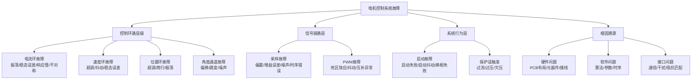
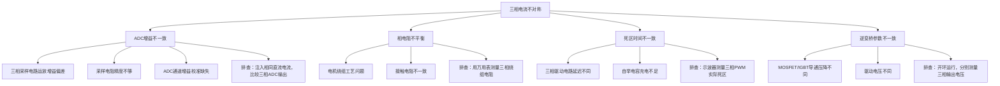
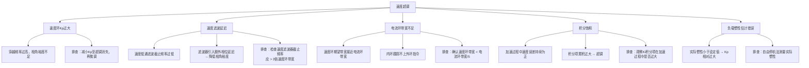
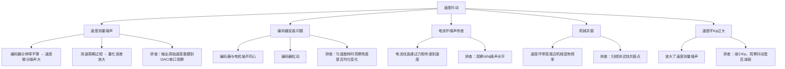
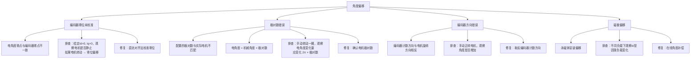
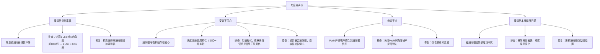
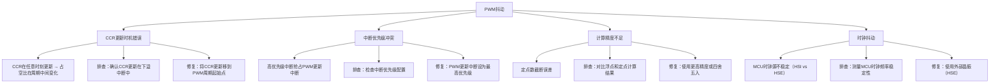
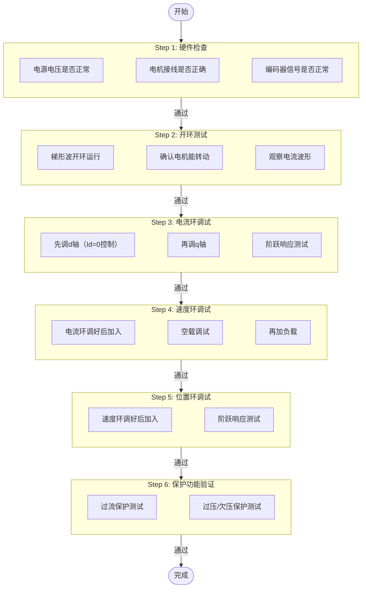

# ADV-ALG-15 电机控制系统问题诊断与调试方法论

- **模块编号：** ADV-ALG-15
- **模块名称：** 电机控制系统问题诊断与调试方法论（Motor Control System Diagnosis & Debugging Methodology）
- **文档版本：** v2.0
- **适用对象：** 已掌握FOC基本原理和多环控制，需要系统化掌握调试方法论的嵌入式工程师
- **前置知识：** ALG-01 FOC理论基础、ALG-05 有感FOC实现、ADV-ALG-01 控制环带宽设计、ADV-ALG-13 PID结构选择与深度整定
- **难度等级：** 

---

## 1. 核心摘要

- **一句话：** 调试不是"试错"而是"排除"——从硬件到软件、从开环到闭环、从内环到外环，每一步都只引入一个变量，用二分法锁定问题层级，用5-Why分析法深挖根因。

- **认知挂钩：** 把电机控制系统调试想象成医学诊断：症状是"发烧"（电机抖动），但发烧可能是感冒（PI参数过大）、肺炎（角度错误）或中暑（散热不良）引起的。庸医直接开退烧药（加滤波），好医生先验血（看电流波形）、拍片（看PWM时序）、问病史（什么时候开始的），然后对症下药。调试流程就是"分诊-检查-确诊-治疗-复查"的完整闭环。

- **核心问题链：**

> - 电机不转？ → 硬件检查 → 开环测试 → 逐步闭环
> - 电流振荡？ → 减小Kp → 检查角度 → 检查采样时序
> - 速度抖动？ → 看原始速度数据 → 检查编码器 → 加滤波
> - 角度跳变？ → 检查SPI通信 → CRC校验 → 信号完整性
> - 启动失败？ → 开环启动 → I/F启动 → 观测器收敛
> - 保护误触发？ → 检查阈值设置 → 检查采样偏置 → 检查毛刺
> - 怎么观测内部变量？ → DAC输出 / VOFA+串口 / DMA+printf
> - 调试顺序？ → 硬件→开环→电流环→速度环→位置环→保护

- **故障定位速查表：**

| 故障现象 | 最可能原因 | 首选排查手段 | 优先级 |
|---------|-----------|-------------|--------|
| 电流波形振荡 | PI参数过大 / 角度错误 | 减小Kp观察 | P0 |
| 电流稳态误差 | ADC偏置 / Ki过小 | 静态读ADC值 | P0 |
| 速度超调 | 速度环Kp过大 | 减小Kp | P1 |
| 速度抖动 | 编码器噪声 / 分辨率低 | 观察原始速度数据 | P1 |
| 角度偏移 | 零位未校准 | 直流对齐法 | P0 |
| 角度跳变 | SPI通信错误 | CRC校验 | P0 |
| 低调制比电流畸变 | 死区效应 | 观察低频5/7次谐波 | P2 |
| 启动失败 | 角度观测器未收敛 | I/F启动 | P1 |
| 过流误触发 | ADC偏置 / 阈值过低 | 静态检查ADC | P1 |

---

## 2. 电机控制系统常见故障分类

### 2.1 故障分类总览

电机控制系统的故障可以从**控制环路层级**和**物理成因**两个维度分类：



### 2.2 各类故障特征速判

- **电流环问题特征：**
- 振荡：电流波形呈现周期性摆动，频率通常在几百Hz到几kHz
- 稳态误差：给定与反馈之间持续存在偏差
- 响应慢：阶跃响应上升时间远超预期
- 不对称：三相电流幅值不等或相位偏移

- **速度环问题特征：**
- 超调：速度阶跃响应超过目标值后回调
- 抖动：稳态时速度在目标值附近快速波动
- 稳态误差：持续的速度偏差，尤其在带载时

- **角度问题特征：**
- 偏移：电机能转但力矩方向不对，效率降低
- 跳变：角度值突然发生大幅度变化
- 噪声：角度值在小范围内随机波动

- **采样问题特征：**
- 偏置：零电流时ADC输出不为中点值
- 增益误差：三相相同电流下ADC输出幅值不同
- 噪声：ADC读数随机波动
- 时序错误：电流波形出现非特征谐波

- **PWM问题特征：**
- 死区效应：低调制比时电流波形畸变，5次/7次谐波明显
- 抖动：PWM占空比不稳定
- 互补异常：上下桥臂同时导通（直通短路风险）

- **启动问题特征：**
- 启动失败：电机不转或反转
- 启动抖动：启动瞬间电机剧烈振动
- 换相失败：方波启动时换相时刻错误

- **保护误触发特征：**
- 过流误触发：正常运行中突然报过流
- 过压误触发：未达真实过压阈值就触发保护

---

## 3. 电流环问题定位

> **核心原则：** 电流环是FOC的根基，所有外环问题都可能源于电流环。调试时必须先确保电流环正常，再调外环。

### 3.1 现象一：电流波形振荡

- **典型表现：** Id或Iq波形呈现周期性振荡，电机发出啸叫声，电流频谱在特定频率出现峰值。

- **可能原因与排查路径：**

```text
电流振荡
├── PI参数过大 ──────────── 最常见！
│   ├── Kp过大 → 振荡频率较高，幅值较大
│   ├── Ki过大 → 低频振荡，类似"喘振"
│   └── 排查：逐步减小Kp，观察振荡是否消失
│
├── 采样延迟过大
│   ├── 计算耗时超过PWM周期
│   ├── ADC触发时刻不当
│   └── 排查：测量ISR执行时间，确认ADC在PWM中心触发
│
├── 角度错误
│   ├── 角度偏移 → dq轴解耦失败，Id/Iq交叉耦合
│   ├── 角度方向错误 → 正反馈而非负反馈
│   └── 排查：开环给定角度，观察电流是否稳定
│
├── 解耦补偿错误
│   ├── 反电动势补偿符号错误
│   ├── 交叉耦合补偿方向反
│   └── 排查：先关闭解耦项，单独调试PI
│
└── 电压饱和
    ├── PI输出达到限幅 → 积分饱和 → 退饱和振荡
    └── 排查：观察PI输出是否频繁触及限幅
```

- **逐步排查法：**

> **电流环振荡排查步骤**（每步只改一个变量，观察效果）：
>
> **Step 1:** 将Kp减半，Ki置零
> - 振荡消失？说明原Kp过大
> - 振荡仍在？进入Step 2
>
> **Step 2:** 检查角度
> - 开环给定固定角度（如0度），给定Vd=0, Vq=小值
> - 电流稳定？说明闭环角度有问题
> - 电流仍振荡？进入Step 3
>
> **Step 3:** 检查采样时序
> - 用示波器观察PWM中心与ADC触发的关系
> - 确认ADC采样点在PWM导通中间
> - 确认ISR执行时间 < PWM周期
>
> **Step 4:** 检查解耦项
> - 关闭所有前馈和解耦补偿
> - 单独调试PI，确认基本稳定后再逐步加入

- **振荡频率的判别意义：**

| 振荡频率范围 | 最可能原因 | 物理机制 |
|-------------|-----------|---------|
| 接近电流环带宽 | Kp过大 | 环路增益过高，相角裕度不足 |
| 远低于电流环带宽 | Ki过大 | 积分项引起低频振荡 |
| 等于电频率 $\omega_e$ | 角度偏移 | dq解耦不彻底，Id/Iq交叉耦合 |
| 等于2倍电频率 $2\omega_e$ | 三相不对称 | 负序分量在dq轴表现为2倍频 |
| 等于PWM频率 | 采样时序错误 | 采样点落在开关瞬间 |

### 3.2 现象二：电流稳态误差

- **典型表现：** 电流给定值与反馈值之间存在持续偏差，尤其Id给定0但实际不为0。

- **可能原因与排查路径：**

```text
电流稳态误差
├── Ki过小
│   ├── 积分作用不足，无法消除稳态误差
│   └── 排查：增大Ki，观察误差是否减小
│
├── ADC偏置未消除
│   ├── 零电流时ADC输出偏离中点
│   ├── PI积分器持续补偿偏置 → 输出偏移
│   └── 排查：电机静止时读取ADC原始值，检查是否为中点
│
├── 死区未补偿
│   ├── 死区导致实际输出电压与指令电压不一致
│   ├── 低调制比时影响最严重
│   └── 排查：低速运行时观察电流波形畸变
│
├── 电流采样增益误差
│   ├── 采样电阻精度不够
│   ├── 运放增益偏差
│   └── 排查：注入已知电流，比较ADC输出与理论值
│
└── 参考地偏移
    ├── 电流采样运放参考电压偏移
    └── 排查：测量运放参考引脚电压
```

- **ADC偏置校准代码：**

```c
/**
 * @brief  ADC偏置自校准
 * @note   上电时调用，电机静止、PWM关闭状态下执行
 *         采样N次取平均作为偏置值
 * @param  adc_raw: ADC原始值数组
 * @param  offset: 偏置值输出
 * @param  n_samples: 采样次数（建议1024次以上）
 */
void ADC_CalibrateOffset(uint16_t *adc_raw, float *offset, uint32_t n_samples)
{
    float sum = 0.0f;

    /* 确保PWM关闭，电机静止 */
    __disable_irq();

    for (uint32_t i = 0; i < n_samples; i++)
    {
        /* 触发ADC采样并读取 */
        ADC_StartConversion();
        while (!ADC_ConversionComplete()) {}
        sum += (float)ADC_GetValue();
    }

    __enable_irq();

    *offset = sum / (float)n_samples;

    /* 检查偏置是否合理：12bit ADC中点应为2048左右 */
    if (fabsf(*offset - 2048.0f) > 200.0f)
    {
        /* 偏置偏差过大，可能硬件有问题 */
        Error_Handler();
    }
}

/**
 * @brief  ADC偏置动态校准（运行时）
 * @note   在低速/零速时缓慢跟踪偏置漂移
 *         截止频率极低（约1Hz），不影响正常控制
 * @param  adc_value: 当前ADC采样值
 * @param  offset: 偏置值指针（会被更新）
 * @param  alpha: 滤波系数，alpha = Ts / (Ts + T_offset)
 *                T_offset建议1s，即截止频率约0.16Hz
 */
void ADC_DynamicCalibrate(float adc_value, float *offset, float alpha)
{
    /* 仅在电流接近零时更新偏置，避免负载电流影响 */
    *offset += alpha * (adc_value - *offset);
}
```

### 3.3 现象三：电流响应慢

- **典型表现：** 电流阶跃响应上升时间远大于设计值，跟踪给定斜坡时明显滞后。

- **可能原因与排查路径：**

```text
电流响应慢
├── PI参数过小
│   ├── Kp过小 → 带宽不足
│   ├── Ki过小 → 稳态建立慢
│   └── 排查：逐步增大Kp，观察响应速度
│
├── 电压饱和
│   ├── PI输出达到限幅 → 实际施加电压不足
│   ├── 母线电压过低
│   ├── 反电动势占比过大（高速时）
│   └── 排查：观察PI输出值是否触及Vbus限幅
│
├── 电流采样滤波过度
│   ├── 低通滤波器截止频率过低
│   ├── 多级滤波叠加延迟过大
│   └── 排查：检查滤波器参数，截止频率应>3倍电流环带宽
│
└── 电感参数偏差
    ├── 实际电感大于设定值 → 带宽低于设计值
    ├── 饱和效应：大电流时电感下降
    └── 排查：阶跃响应法测量实际L
```

- **电压饱和判断代码：**

```c
/**
 * @brief  检查电流环输出是否饱和
 * @param  vd_out: d轴电压输出
 * @param  vq_out: q轴电压输出
 * @param  vbus:   母线电压
 * @retval 1-饱和 0-未饱和
 */
int CurrentLoop_IsSaturated(float vd_out, float vq_out, float vbus)
{
    float v_mag = sqrtf(vd_out * vd_out + vq_out * vq_out);
    float v_max = vbus * ONE_OVER_SQRT3;  /* SVPWM线性调制最大值 */

    /* 留5%余量 */
    return (v_mag > 0.95f * v_max) ? 1 : 0;
}
```

### 3.4 现象四：三相电流不对称

- **典型表现：** 三相电流幅值不等，或相位差偏离120度，电机运行有振动。

- **可能原因与排查路径：**



- **三相开环对称性测试：**

```c
/**
 * @brief  三相开环对称性测试
 * @note   给定固定角度和电压，观察三相电流是否对称
 *         用于排查ADC增益和硬件对称性
 * @param  v_ref: 给定电压幅值（V）
 * @param  angle: 给定电角度（rad）
 */
void Test_ThreePhaseSymmetry(float v_ref, float angle)
{
    /* 开环输出三相电压 */
    float va = v_ref * cosf(angle);
    float vb = v_ref * cosf(angle - TWO_PI_OVER_3);
    float vc = v_ref * cosf(angle + TWO_PI_OVER_3);

    /* 反Park变换 */
    float vd = va;
    float vq = 0.0f;  /* 简化：仅测试对称性 */

    /* 设置PWM占空比 */
    PWM_SetPhaseVoltage(va, vb, vc);

    /* 读取三相电流ADC值并记录 */
    /* 对比三相应具有相同幅值和120度相位差 */
}
```

---

## 4. 速度环问题定位

> **核心原则：** 速度环调试的前提是电流环已经调好。如果电流环不稳定，速度环不可能稳定。

### 4.1 现象一：速度超调

- **典型表现：** 速度阶跃响应超过目标值后回调，超调量大于5%。

- **可能原因与排查路径：**



- **速度环Kp调整经验法则：**

$$K_{p,speed} = \frac{J \cdot \omega_{BW,speed}}{K_t}$$

其中：
- $J$：转动惯量（$\text{kg} \cdot \text{m}^2$）
- $\omega_{BW,speed}$：速度环期望带宽（$\text{rad/s}$）
- $K_t$：力矩系数（$\text{N} \cdot \text{m} / \text{A}$）

- **调整步骤：**
1. 从理论计算值的 1/3 开始
2. 逐步增大直到出现轻微超调（约5%）
3. 回退到该值的 70%-80%

### 4.2 现象二：速度抖动

- **典型表现：** 速度稳态时在目标值附近快速波动，波动频率较高（远高于速度环带宽），电机有高频振动感。

- **可能原因与排查路径：**



- **速度测量噪声分析：**

M法测速（脉冲计数法）的速度分辨率：

$$\Delta\omega = \frac{2\pi}{P \cdot T_s}$$

其中 $P$ 为编码器线数，$T_s$ 为测速周期。

例如：$P = 1000$ 线，$T_s = 1\text{ms}$，则：

$$\Delta\omega = \frac{2\pi}{1000 \times 0.001} = 6.28 \text{ rad/s} \approx 60 \text{ RPM}$$

这意味着在60RPM以下，速度量化噪声就非常严重。

- **改善方案：**

```c
/**
 * @brief  改进型速度计算——M/T法
 * @note   结合M法和T法的优点
 *         高速用M法（精度高），低速用T法（分辨率高）
 * @param  encoder_count: 编码器计数值
 * @param  time_count:    高频时钟计数值
 * @retval 速度值（rad/s）
 */
float Speed_Calculate_MT(int32_t encoder_count, uint32_t time_count)
{
    if (time_count == 0) return 0.0f;

    /* M/T法：速度 = 编码器脉冲数 / 高频时钟脉冲数 × 常数 */
    float speed = (float)encoder_count / (float)time_count * SPEED_CONSTANT;

    return speed;
}

/**
 * @brief  速度低通滤波器
 * @note   一阶IIR低通，截止频率应 > 3倍速度环带宽
 * @param  raw_speed: 原始速度值
 * @param  filtered_speed: 滤波后速度值指针
 * @param  alpha: 滤波系数 = Ts / (Ts + 1/(2*pi*fc))
 */
void Speed_LowPassFilter(float raw_speed, float *filtered_speed, float alpha)
{
    *filtered_speed += alpha * (raw_speed - *filtered_speed);
}
```

### 4.3 现象三：速度稳态误差

- **典型表现：** 速度给定与反馈之间存在持续偏差，尤其在带载时更明显。

- **可能原因与排查路径：**

```text
速度稳态误差
├── 摩擦力
│   ├── 静摩擦导致低速爬行
│   ├── 库仑摩擦导致方向性偏差
│   ├── 排查：正反方向分别测试，观察误差是否对称
│   └── 修复：摩擦力前馈补偿
│
├── 负载扰动
│   ├── 恒定负载力矩 → 速度Ki需消除
│   ├── 排查：空载测试，误差应接近零
│
├── 速度环Ki过小
│   ├── 积分作用不足以消除稳态误差
│   └── 排查：增大Ki，观察误差是否减小
│
├── 电流环稳态误差传递
│   ├── 电流环存在偏置 → 力矩偏置 → 速度偏差
│   └── 排查：先确保电流环零偏已校准
│
└── 速度反馈偏置
    ├── 编码器信号偏置导致测速偏移
    └── 排查：零速时观察速度反馈是否为零
```

- **摩擦力补偿代码：**

```c
/**
 * @brief  摩擦力前馈补偿
 * @param  speed_ref: 速度给定（rad/s）
 * @param  speed_fdb: 速度反馈（rad/s）
 * @retval 摩擦补偿力矩（N·m）
 * @note   Coulomb + Viscous + Stiction模型
 */
float FrictionCompensation(float speed_ref, float speed_fdb)
{
    float friction_torque = 0.0f;
    float speed = speed_fdb;

    /* 库仑摩擦：与速度方向有关，大小恒定 */
    float coulomb = COULOMB_FRICTION;  /* 单位：N·m */

    /* 粘性摩擦：与速度成正比 */
    float viscous = VISCOUS_COEFF * fabsf(speed);

    /* 静摩擦：速度过零时的额外摩擦 */
    float stiction = 0.0f;
    if (fabsf(speed) < STICTION_SPEED_THRESHOLD)
    {
        stiction = STICTION_FRICTION * (speed_ref > 0 ? 1.0f : -1.0f);
    }

    /* 合成 */
    if (speed > 0.001f)
        friction_torque = coulomb + viscous;
    else if (speed < -0.001f)
        friction_torque = -(coulomb + viscous);
    else
        friction_torque = stiction;

    return friction_torque;
}
```

---

## 5. 角度问题定位

> **核心原则：** 角度是FOC的灵魂——角度错一度，力矩偏千里。角度问题往往伪装成电流环问题，因为错误的角度导致dq解耦失败。

### 5.1 现象一：角度偏移（电机运行但力矩不对）

- **典型表现：** 电机能转动，但力矩不足或方向不对，Id给定0但实际不为0，效率明显降低。

- **可能原因与排查路径：**



- **直流对齐法校准零位：**

```c
/**
 * @brief  直流对齐法（DC Alignment）校准编码器零位
 * @note   原理：给定d轴正电压，使转子d轴对齐到电角度0
 *         此时编码器读数即为零位偏移
 * @retval 零位偏移角度（rad）
 *
 * 操作步骤：
 * 1. 确保电机可自由转动，无机械卡死
 * 2. 关闭所有控制环
 * 3. 给定 Vd = 对齐电压（约1-3V，足以克服摩擦）, Vq = 0
 * 4. 等待转子稳定（约1-2秒）
 * 5. 读取编码器角度 → 即为零位偏移
 * 6. 保存偏移值到Flash
 */
float Encoder_DCAlignment(void)
{
    float align_voltage = 2.0f;  /* 对齐电压，根据电机调整 */
    float angle_offset = 0.0f;

    /* Step 1: 开环输出d轴电压，电角度=0 */
    /* 反Park变换：角度=0时，Vd→A相，Vq→正交 */
    InversePark(align_voltage, 0.0f, 0.0f, &valpha, &vbeta);
    InverseClarke(valpha, vbeta, &va, &vb, &vc);
    PWM_SetDutyCycle(va, vb, vc);

    /* Step 2: 等待转子稳定 */
    HAL_Delay(2000);

    /* Step 3: 读取编码器角度 */
    angle_offset = Encoder_GetAngle();

    /* Step 4: 关闭输出 */
    PWM_SetDutyCycle(0.0f, 0.0f, 0.0f);

    /* Step 5: 保存偏移 */
    /* 注意：偏移值需取负号，因为后续角度 = 编码器角度 - 偏移 */
    return angle_offset;
}
```

### 5.2 现象二：角度跳变

- **典型表现：** 角度值突然发生大幅度跳变，导致电流环输出剧烈波动，电机瞬间抖动。

- **可能原因与排查路径：**



```mermaid
flowchart TD
    A["角度跳变"] --> B["编码器信号干扰"]
    A --> C["SPI通信错误"]
    A --> D["编码器多圈计数溢出"]
    A --> E["编码器分辨率不足"]
    A --> F["软件角度计算溢出"]

    B --> B1["编码器信号线未屏蔽"]
    B --> B2["信号线与动力线并行走线"]
    B --> B3["排查：示波器观察编码器信号波形<br/>检查是否有毛刺和振铃"]
    B --> B4["修复：使用屏蔽双绞线，远离动力线"]

    C --> C1["SPI时钟频率过高"]
    C --> C2["SPI线路上有干扰"]
    C --> C3["排查：降低SPI时钟频率，添加CRC校验"]
    C --> C4["修复：降低SPI速率，增加CRC"]

    D --> D1["绝对值编码器圈数计数翻转"]
    D --> D2["排查：观察角度数据是否在特定值跳变"]
    D --> D3["修复：处理圈数翻转逻辑"]

    E --> E1["低分辨率编码器在高速时量化跳变"]
    E --> E2["排查：观察跳变步长是否等于1个LSB"]
    E --> E3["修复：增加角度插值/观测器"]

    F --> F1["角度变量溢出（如uint16_t溢出）"]
    F --> F2["排查：检查角度数据类型和范围"]
    F --> F3["修复：使用float或处理溢出"]
```

- **SPI编码器CRC校验代码：**

```c
/**
 * @brief  AS5047P SPI编码器读取（带CRC校验）
 * @param  angle: 角度输出（rad）
 * @retval 0-成功 -1-CRC错误 -2-通信超时
 */
int Encoder_ReadAS5047P(float *angle)
{
    uint16_t tx_cmd = 0x3FFF | 0x4000;  /* 读角度寄存器，带CRC位 */
    uint16_t rx_data = 0;
    uint16_t rx_crc = 0;

    /* SPI读取 */
    SPI_CS_LOW();
    rx_data = SPI_Transfer(tx_cmd);
    SPI_CS_HIGH();

    /* 等待下一帧 */
    NOP_DELAY();

    /* 读取CRC帧 */
    SPI_CS_LOW();
    rx_crc = SPI_Transfer(0xC000);
    SPI_CS_HIGH();

    /* 检查错误标志位 */
    if (rx_data & 0x4000)
    {
        return -2;  /* 错误标志位置位 */
    }

    /* CRC校验 */
    uint8_t calc_crc = CRC6_Calculate(tx_cmd, rx_data & 0x3FFF);
    uint8_t recv_crc = rx_crc & 0x003F;

    if (calc_crc != recv_crc)
    {
        return -1;  /* CRC错误 */
    }

    /* 提取角度值 */
    uint16_t raw_angle = rx_data & 0x3FFF;
    *angle = (float)raw_angle * TWO_PI / 16384.0f;

    return 0;
}

/**
 * @brief  带错误处理的角度读取
 * @note   连续CRC错误超过阈值则报故障
 */
int Encoder_ReadAngleSafe(float *angle)
{
    static uint32_t error_count = 0;
    int result = Encoder_ReadAS5047P(angle);

    if (result != 0)
    {
        error_count++;
        if (error_count > ENCODER_ERROR_THRESHOLD)
        {
            Fault_Set(FAULT_ENCODER);
        }
        return result;
    }

    error_count = 0;  /* 成功则清零 */
    return 0;
}
```

### 5.3 现象三：角度噪声大

- **典型表现：** 电机静止时角度读数在小范围内随机波动，导致速度计算噪声大，低速运行不稳定。

- **可能原因与排查路径：**



- **偏心补偿代码：**

```c
/**
 * @brief  编码器偏心误差补偿
 * @note   偏心误差模型：delta_theta = A*sin(theta_mech + phi)
 *         通过标定获取A和phi，运行时补偿
 * @param  raw_angle: 原始机械角度（rad）
 * @retval 补偿后的角度（rad）
 */
float Encoder_EccentricityCompensation(float raw_angle)
{
    /* 偏心误差参数（标定时获取） */
    const float ecc_amplitude = ECC_AMPLITUDE;  /* 偏心误差幅值（rad） */
    const float ecc_phase = ECC_PHASE;          /* 偏心误差相位（rad） */

    /* 计算偏心误差 */
    float error = ecc_amplitude * sinf(raw_angle + ecc_phase);

    /* 补偿 */
    return raw_angle - error;
}
```

---

## 6. 采样问题定位

### 6.1 ADC偏置问题

- **问题描述：** 12bit ADC的理论中点为2048，但实际采样电路的偏置电压可能偏离该值，导致零电流时ADC输出非零，表现为电流零漂。

- **排查方法：**

> 1. 关闭PWM输出，电机静止
> 2. 读取三相ADC原始值（采样N次取平均）
> 3. 检查是否偏离2048
> 4. 偏离 > 20 LSB → 需要校准

- **修复方案：**

| 方案 | 适用场景 | 优点 | 缺点 |
|------|---------|------|------|
| 上电自校准 | 偏置稳定 | 简单可靠 | 无法跟踪温漂 |
| 运行时动态校准 | 偏置缓慢漂移 | 跟踪温漂 | 低速时可能受负载影响 |
| 硬件校准 | 偏置固定 | 不占软件资源 | 需要可调电阻 |
| ST MC库自校准 | STM32平台 | 利用硬件校准功能 | 仅限部分MCU |

- **STM32 ADC硬件自校准：**

```c
/**
 * @brief  STM32 ADC硬件自校准
 * @note   消除ADC内部偏移误差
 *         校准前需确保ADC未在转换中
 * @retval 校准结果（0-成功）
 */
HAL_StatusTypeDef ADC_HardwareCalibration(void)
{
    HAL_StatusTypeDef status;

    /* 停止ADC转换 */
    HAL_ADC_Stop(&hadc1);

    /* 启动硬件校准 */
    status = HAL_ADCEx_Calibration_Start(&hadc1, ADC_CALIB_OFFSET, ADC_SINGLE_ENDED);

    if (status != HAL_OK)
    {
        return status;
    }

    /* 等待校准完成 */
    status = HAL_ADCEx_Calibration_Wait(&hadc1, HAL_MAX_DELAY);

    return status;
}
```

### 6.2 ADC增益误差

- **问题描述：** 三相电流采样通道的增益不一致，导致相同电流下三相ADC输出幅值不同。

- **排查方法：**

> 1. 注入已知直流电流（如使用电流源）
> 2. 分别读取三相ADC值
> 3. 计算三相增益比例
> 4. 增益偏差 > 1% → 需要校准

- **增益校准代码：**

```c
/**
 * @brief  三相ADC增益校准
 * @note   标定三相增益系数，使相同电流产生相同ADC输出
 * @param  gain: 三相增益系数数组（输出）
 */
void ADC_CalibrateGain(float gain[3])
{
    /* 注入已知电流，读取三相ADC值 */
    /* 此处假设已通过外部电流源注入 */

    float adc_a = ADC_ReadChannel_A();
    float adc_b = ADC_ReadChannel_B();
    float adc_c = ADC_ReadChannel_C();

    /* 以A相为基准 */
    float ref = adc_a;

    gain[0] = 1.0f;
    gain[1] = ref / adc_b;  /* B相增益系数 */
    gain[2] = ref / adc_c;  /* C相增益系数 */
}
```

### 6.3 采样噪声

- **问题描述：** ADC读数随机波动，噪声过大导致电流环控制精度降低。

- **排查方法：**

> 1. 静态测量：电机静止、PWM关闭，读取ADC值
>    → 计算标准差，评估纯ADC噪声
> 2. 动态测量：电机运行，读取ADC值
>    → 噪声增大说明有开关噪声耦合
> 3. 对比：关闭PWM vs 开启PWM的噪声差异
>    → 差异大 → 开关噪声耦合问题

- **硬件+软件联合降噪：**

```text
硬件层面：
├── RC低通滤波（截止频率约10-50kHz）
├── 运放选择低噪声型号
├── PCB布局：采样电路远离开关管
├── 模拟地与数字地单点连接
└── 参考电压去耦（100nF + 10uF）

软件层面：
├── 多次采样取平均（过采样）
├── 数字低通滤波（一阶IIR）
├── 采样时刻选择（PWM中心触发）
└── 丢弃异常值（中值滤波）
```

```c
/**
 * @brief  ADC过采样+均值滤波
 * @note   4次过采样可提升1bit有效精度
 * @param  hadc: ADC句柄
 * @param  channel: ADC通道
 * @param  n_oversampling: 过采样次数
 * @retval 滤波后的ADC值
 */
uint16_t ADC_OversamplingRead(ADC_HandleTypeDef *hadc, uint32_t channel, uint8_t n_oversampling)
{
    uint32_t sum = 0;

    for (uint8_t i = 0; i < n_oversampling; i++)
    {
        ADC_ChannelConfTypeDef sConfig = {0};
        sConfig.Channel = channel;
        sConfig.Rank = ADC_REGULAR_RANK_1;
        sConfig.SamplingTime = ADC_SAMPLETIME_15CYCLES;
        HAL_ADC_ConfigChannel(hadc, &sConfig);

        HAL_ADC_Start(hadc);
        HAL_ADC_PollForConversion(hadc, 1);
        sum += HAL_ADC_GetValue(hadc);
    }

    return (uint16_t)(sum / n_oversampling);
}
```

### 6.4 采样时序错误

- **问题描述：** ADC未在PWM中心时刻触发采样，导致采样到开关噪声。

- **正确时序关系：**

```text
        PWM计数器（中心对齐模式）
        ┌───┐           ┌───┐
        │   │           │   │
   ─────┘   └───────────┘   └────
        ↑                   ↑
     下溢中断           上溢中断
     (CCR更新)         (ADC触发最佳点)
                         ↑
                    PWM导通中间
                    电流最稳定
```

- **排查方法：**

> 1. 用示波器同时观察PWM输出和ADC触发信号
> 2. 确认ADC触发在PWM导通时间的中间
> 3. 检查ADC采样保持时间是否足够
> 4. 检查从ADC触发到数据可用的延迟

- **STM32 ADC在PWM中心触发配置：**

```c
/**
 * @brief  配置ADC在PWM中心对齐模式下触发
 * @note   使用TIM1的TRGO事件触发ADC
 *         TRGO源选择Update事件（中心对齐模式下溢）
 */
void ADC_ConfigurePWMSyncTrigger(void)
{
    /* TIM1配置：TRGO在更新事件时触发 */
    __HAL_TIM_DISABLE(&htim1);

    /* 选择TRGO源为Update Event */
    htim1.Instance->CR2 &= ~TIM_CR2_MMS;
    htim1.Instance->CR2 |= TIM_TRGO_UPDATE;

    /* ADC配置：外部触发模式 */
    hadc1.Init.ExternalTrigConv = ADC_EXTERNALTRIGCONV_T1_TRGO;
    hadc1.Init.ExternalTrigConvEdge = ADC_EXTERNALTRIGCONVEDGE_RISING;
    HAL_ADC_Init(&hadc1);

    __HAL_TIM_ENABLE(&htim1);
}
```

---

## 7. PWM问题定位

### 7.1 死区效应

- **问题描述：** 死区时间导致实际输出电压与指令电压不一致，尤其在低调制比时影响最严重，表现为电流波形畸变和5次/7次谐波。

- **死区效应的数学模型：**

死区导致的电压误差：

$$\Delta V = \frac{2 \cdot V_{dc} \cdot T_d \cdot f_{sw}}{T_s} \cdot \text{sign}(i)$$

其中：
- $T_d$：死区时间
- $f_{sw}$：开关频率
- $T_s$：PWM周期
- $\text{sign}(i)$：电流方向

死区误差在dq坐标系下的表现：
- 5次谐波在dq轴表现为 $6\omega_e$ 分量
- 7次谐波在dq轴表现为 $6\omega_e$ 分量
- 二者叠加形成6倍电频率脉动

- **排查方法：**

> 1. 低速运行（低调制比），观察电流波形
> 2. FFT分析电流频谱
> 3. 如果5次/7次谐波明显 → 死区效应
> 4. 对比有/无死区补偿的波形

- **死区补偿代码：**

```c
/**
 * @brief  死区电压补偿
 * @note   根据电流方向补偿死区造成的电压损失
 * @param  v_ref: 指令电压（d或q轴）
 * @param  i_fdb: 反馈电流（d或q轴）
 * @param  vdc:   母线电压
 * @retval 补偿后的电压
 */
float DeadTimeCompensation(float v_ref, float i_fdb, float vdc)
{
    float v_error;
    float i_threshold = CURRENT_DEADZONE;  /* 电流过零检测阈值 */

    /* 计算死区电压误差 */
    float deadtime_error = 2.0f * vdc * DEAD_TIME * PWM_FREQ;

    /* 根据电流方向补偿 */
    if (i_fdb > i_threshold)
    {
        v_error = deadtime_error;   /* 正向电流，电压不足 */
    }
    else if (i_fdb < -i_threshold)
    {
        v_error = -deadtime_error;  /* 负向电流，电压过多 */
    }
    else
    {
        /* 电流过零区域，线性插值避免不连续 */
        v_error = deadtime_error * (i_fdb / i_threshold);
    }

    return v_ref + v_error;
}
```

### 7.2 PWM抖动

- **问题描述：** PWM占空比不稳定，输出电压存在随机波动。

- **可能原因与排查路径：**



- **正确的CCR更新时机：**

```c
/**
 * @brief  TIM1更新中断（下溢）——CCR更新点
 * @note   中心对齐模式下，计数器从0向上计数到ARR再向下计数到0
 *         下溢（计数器=0）时更新CCR，确保占空比在周期起始变化
 */
void TIM1_UP_IRQHandler(void)
{
    if (__HAL_TIM_GET_FLAG(&htim1, TIM_FLAG_UPDATE))
    {
        __HAL_TIM_CLEAR_FLAG(&htim1, TIM_FLAG_UPDATE);

        /* === 在此更新CCR === */
        /* 此时计数器刚从0开始向上计数，CCR变化不会产生毛刺 */
        TIM1->CCR1 = pwm_duty_a;
        TIM1->CCR2 = pwm_duty_b;
        TIM1->CCR3 = pwm_duty_c;

        /* 触发ADC采样（可选：在PWM中心触发） */
        /* ... */
    }
}
```

### 7.3 互补PWM异常

- **问题描述：** 上下桥臂同时导通（直通短路），或死区时间不正确。

- **排查清单：**

```text
□ MOE位（Main Output Enable）是否置位？
□ 互补通道极性是否正确？
   → STM32: CHx高电平有效，CHxN低电平有效（N沟MOSFET）
□ 死区时间是否配置？
   → DTG[7:0]寄存器计算：T_dts = DTG × T_ck_int
□ 空闲状态电平是否正确？
   → MOE=0时，CHx和CHxN应处于安全电平
□ Break功能是否正常？
   → BRK引脚触发时，输出应进入安全状态
□ 自举电容是否充电充足？
   → 首个PWM周期前需预充电
```

- **互补PWM配置验证代码：**

```c
/**
 * @brief  验证互补PWM配置
 * @retval 0-配置正确 -1-配置错误
 */
int PWM_VerifyComplementaryConfig(void)
{
    int result = 0;

    /* 检查MOE位 */
    if (!(TIM1->BDTR & TIM_BDTR_MOE))
    {
        result = -1;  /* MOE未使能 */
    }

    /* 检查死区时间 */
    uint32_t dtg = TIM1->BDTR & TIM_BDTR_DTG;
    if (dtg == 0)
    {
        result = -1;  /* 死区时间为0，有直通风险 */
    }

    /* 检查输出极性 */
    uint32_t cc1p = TIM1->CCER & TIM_CCER_CC1P;
    uint32_t cc1np = TIM1->CCER & TIM_CCER_CC1NP;
    /* 根据硬件设计验证极性 */

    /* 检查空闲状态 */
    uint32_t ossr = TIM1->BDTR & TIM_BDTR_OSSR;  /* 运行模式空闲状态 */
    uint32_t ossi = TIM1->BDTR & TIM_BDTR_OSSI;  /* 空闲模式空闲状态 */

    return result;
}
```

---

## 8. 启动问题定位

### 8.1 启动失败

- **典型表现：** 电机不转、反转、或启动瞬间报过流。

- **可能原因与排查路径：**

```text
启动失败
├── 角度观测器未收敛
│   ├── SMO/PLL在零速/低速不收敛
│   ├── 初始角度估计错误
│   ├── 排查：开环给定角度启动，观察是否能转
│   └── 修复：使用I/F启动法
│
├── I/F启动参数不当
│   ├── 电流给定过小 → 力矩不足
│   ├── 频率斜坡过快 → 失步
│   ├── 排查：降低频率斜坡速率，增大启动电流
│   └── 修复：调整I/F启动参数
│
├── 启动电流限幅过小
│   ├── 启动力矩不足以克服静摩擦
│   ├── 排查：增大启动电流限幅
│   └── 修复：设置独立的启动电流限幅
│
├── 方波启动换相错误
│   ├── Hall信号接反
│   ├── 换相逻辑错误
│   ├── 排查：手动转动电机，检查Hall信号顺序
│   └── 修复：修正Hall信号映射
│
└── 保护阈值过低
    ├── 启动瞬态电流触发保护
    ├── 排查：临时提高保护阈值测试
    └── 修复：设置启动阶段的保护阈值（可变阈值）
```

- **I/F启动法实现：**

```c
/**
 * @brief  I/F（电流/频率）启动
 * @note   开环给定角度和电流，逐步提高频率
 *         当速度达到切换阈值时，切换到闭环
 * @param  target_speed: 目标速度（rad/s）
 */
void Startup_IFMethod(float target_speed)
{
    float openloop_angle = 0.0f;
    float openloop_speed = STARTUP_INITIAL_SPEED;  /* 初始开环速度 */
    float openloop_current = STARTUP_CURRENT;      /* 开环电流幅值 */
    float speed_ramp = STARTUP_SPEED_RAMP;         /* 速度斜坡（rad/s²） */

    /* 阶段1：开环加速 */
    while (openloop_speed < SWITCH_SPEED_THRESHOLD)
    {
        /* 更新开环角度 */
        openloop_angle += openloop_speed * PWM_PERIOD;

        /* 给定Id=0, Iq=开环电流 */
        float id_ref = 0.0f;
        float iq_ref = openloop_current;

        /* 反Park变换（使用开环角度） */
        InversePark_Decoupling(id_ref, iq_ref, openloop_angle,
                               &vd_out, &vq_out);

        /* 速度斜坡 */
        openloop_speed += speed_ramp * PWM_PERIOD;
        if (openloop_speed > target_speed)
            openloop_speed = target_speed;

        /* 等待下一个PWM周期 */
        WaitPWMPeriod();
    }

    /* 阶段2：开环→闭环切换 */
    /* 使用观测器角度替换开环角度 */
    /* 切换时应保证角度连续性 */
    float closedloop_angle = Observer_GetAngle();

    /* 角度融合：线性过渡 */
    float blend_factor = 0.0f;
    while (blend_factor < 1.0f)
    {
        blend_factor += 0.01f;  /* 100步过渡 */
        float angle = (1.0f - blend_factor) * openloop_angle
                     + blend_factor * closedloop_angle;

        /* 使用融合角度进行FOC控制 */
        /* ... */

        WaitPWMPeriod();
    }

    /* 阶段3：完全闭环运行 */
}
```

### 8.2 启动抖动

- **典型表现：** 启动瞬间电机剧烈振动，可能伴随电流尖峰。

- **可能原因与排查路径：**

```text
启动抖动
├── 初始角度估计偏差大
│   ├── 高频注入法角度估计不准
│   ├── 排查：对比估计角度与实际角度
│   └── 修复：改善角度估计算法或用I/F启动
│
├── 电流环参数过大
│   ├── 启动瞬态电流突变 → 振荡
│   ├── 排查：降低启动阶段的Kp
│   └── 修复：启动阶段使用保守参数
│
├── 负载突变
│   ├── 启动时负载力矩突变
│   ├── 排查：空载启动测试
│   └── 修复：增加前馈补偿
│
└── PWM初始状态不当
    ├── CCR初始值导致上电瞬间有输出
    ├── 排查：检查上电时PWM输出状态
    └── 修复：确保上电时MOE=0，CCR=0
```

---

## 9. 保护误触发定位

### 9.1 过流误触发

- **典型表现：** 电机正常运行中突然报过流故障，但实际电流并未超过阈值。

- **可能原因与排查路径：**

```text
过流误触发
├── ADC偏置导致电流计算偏移
│   ├── 零电流时计算值不为零
│   ├── 实际电流 = 真实电流 + 偏置
│   ├── 排查：静止时读取电流计算值
│   └── 修复：校准ADC偏置
│
├── 过流阈值设置过低
│   ├── 未考虑启动瞬态电流
│   ├── 排查：记录触发时的实际电流值
│   └── 修复：设置合理的阈值（通常3-5倍额定电流）
│
├── 采样毛刺
│   ├── 开关噪声耦合到ADC输入
│   ├── 排查：示波器观察ADC输入信号
│   └── 修复：硬件RC滤波 + 软件去毛刺
│
├── 比较器硬件过流误触发
│   ├── 比较器参考电压不稳定
│   ├── 排查：测量比较器参考电压
│   └── 修复：增加参考电压去耦
│
└── 电流方向判断错误
    ├── 过流检测只看绝对值但符号判断错
    ├── 排查：检查过流检测逻辑
    └── 修复：使用绝对值比较
```

- **过流保护代码（含去毛刺）：**

```c
/**
 * @brief  过流检测（含去毛刺滤波）
 * @note   连续N次超过阈值才判定为过流
 *         避免单次毛刺误触发
 * @param  i_a, i_b, i_c: 三相电流
 * @retval 0-正常 1-过流
 */
uint8_t OverCurrentCheck(float i_a, float i_b, float i_c, float threshold)
{
    static uint8_t overcurrent_counter = 0;
    const uint8_t DEBOUNCE_COUNT = 3;  /* 连续3次触发才判定 */

    float i_max = fabsf(i_a);
    if (fabsf(i_b) > i_max) i_max = fabsf(i_b);
    if (fabsf(i_c) > i_max) i_max = fabsf(i_c);

    if (i_max > threshold)
    {
        overcurrent_counter++;
        if (overcurrent_counter >= DEBOUNCE_COUNT)
        {
            return 1;  /* 确认过流 */
        }
    }
    else
    {
        if (overcurrent_counter > 0)
            overcurrent_counter--;
    }

    return 0;
}
```

### 9.2 过压误触发

- **可能原因与排查路径：**

```text
过压误触发
├── 母线电压采样偏置
│   ├── 分压电阻精度不够
│   ├── 排查：万用表测量实际母线电压，对比ADC读数
│   └── 修复：校准母线电压采样
│
├── 再生制动过压
│   ├── 减速时电机反灌能量导致母线电压升高
│   ├── 排查：减速时观察母线电压变化
│   └── 修复：增加制动电阻或限制减速斜率
│
├── 过压阈值过低
│   ├── 未考虑电网波动
│   └── 修复：设置合理阈值（通常1.2倍额定电压）
│
└── 采样噪声
    ├── 母线电压采样未充分滤波
    └── 修复：增加RC滤波和数字滤波
```

---

## 10. 调试工具与方法

### 10.1 示波器

- **用途：** 观察PWM波形、电流波形、触发信号、通信信号。

- **触发设置建议：**

| 观测对象 | 触发源 | 触发方式 | 触发电平 | 时基 |
|---------|--------|---------|---------|------|
| PWM波形 | CH1（上桥臂） | 边沿上升 | 50% | 1-10 us/div |
| 电流波形 | CH1（一相电流） | 边沿上升 | 零点 | 1-10 ms/div |
| ADC触发 | CH1（PWM）+ CH2（触发信号） | PWM上升沿 | - | 1-5 us/div |
| 死区时间 | CH1（上桥臂）+ CH2（下桥臂） | CH1上升沿 | 50% | 100-500 ns/div |
| 编码器信号 | CH1（A相）+ CH2（B相） | A相上升沿 | 50% | 10-100 us/div |

- **探头衰减比选择：**

> - 母线电压（48V/310V）→ 10x探头
> - PWM波形（5V/3.3V） → 1x探头
> - 电流传感器输出（mV级）→ 1x探头，注意共模电压
> - 编码器信号（3.3V/5V）→ 1x探头

- **注意事项：**
- 测量高边电流时注意共模电压，使用差分探头
- 探头接地线尽量短，避免引入天线效应
- 测量PWM时使用足够高的时基分辨率

### 10.2 DAC输出观测变量

- **原理：** 将MCU内部变量（角度、速度、Id、Iq等）通过DAC输出到示波器，实现实时观测。

- **STM32 DAC配置代码：**

```c
/**
 * @brief  DAC调试输出初始化
 * @note   使用DAC1_CH1和DAC1_CH2输出两个变量
 *         适合观测：角度+速度、Id+Iq等
 */
void DAC_DebugInit(void)
{
    /* DAC时钟使能 */
    __HAL_RCC_DAC_CLK_ENABLE();

    /* GPIO配置：PA4(DAC1_OUT1), PA5(DAC1_OUT2) */
    GPIO_InitTypeDef GPIO_InitStruct = {0};
    GPIO_InitStruct.Pin = GPIO_PIN_4 | GPIO_PIN_5;
    GPIO_InitStruct.Mode = GPIO_MODE_ANALOG;
    GPIO_InitStruct.Pull = GPIO_NOPULL;
    HAL_GPIO_Init(GPIOA, &GPIO_InitStruct);

    /* DAC配置 */
    DAC_ChannelConfTypeDef sConfig = {0};
    hdac.Instance = DAC1;
    HAL_DAC_Init(&hdac);

    /* 通道1：无触发，直接写入 */
    sConfig.DAC_Trigger = DAC_TRIGGER_NONE;
    sConfig.DAC_OutputBuffer = DAC_OUTPUTBUFFER_ENABLE;
    HAL_DAC_ConfigChannel(&hdac, &sConfig, DAC_CHANNEL_1);

    /* 通道2 */
    HAL_DAC_ConfigChannel(&hdac, &sConfig, DAC_CHANNEL_2);

    /* 启动DAC */
    HAL_DAC_Start(&hdac, DAC_CHANNEL_1);
    HAL_DAC_Start(&hdac, DAC_CHANNEL_2);
}

/**
 * @brief  DAC输出调试变量
 * @note   将浮点变量映射到0-3.3V范围
 * @param  var1: 变量1（映射到DAC_CH1）
 * @param  var2: 变量2（映射到DAC_CH2）
 * @param  min:  变量范围最小值
 * @param  max:  变量范围最大值
 */
void DAC_DebugOutput(float var1, float var2, float min, float max)
{
    /* 将变量映射到0-4095（12bit DAC） */
    float norm1 = (var1 - min) / (max - min);
    float norm2 = (var2 - min) / (max - min);

    /* 限幅 */
    if (norm1 < 0.0f) norm1 = 0.0f;
    if (norm1 > 1.0f) norm1 = 1.0f;
    if (norm2 < 0.0f) norm2 = 0.0f;
    if (norm2 > 1.0f) norm2 = 1.0f;

    /* 写入DAC */
    HAL_DAC_SetValue(&hdac, DAC_CHANNEL_1, DAC_ALIGN_12B_R, (uint32_t)(norm1 * 4095.0f));
    HAL_DAC_SetValue(&hdac, DAC_CHANNEL_2, DAC_ALIGN_12B_R, (uint32_t)(norm2 * 4095.0f));
}

/* 使用示例：在FOC中断中调用 */
void FOC_InterruptHandler(void)
{
    /* ... FOC计算 ... */

    /* 输出Id和Iq到DAC */
    DAC_DebugOutput(Id, Iq, -5.0f, 5.0f);  /* 电流范围-5A~5A */
}
```

- **适合DAC观测的变量：**

| 变量 | 映射范围 | 示波器设置 |
|------|---------|-----------|
| Id, Iq | -I_rated ~ +I_rated | DC耦合，1V/div |
| 电角度 | 0 ~ 2π | DC耦合，1V/div |
| 速度 | 0 ~ max_speed | DC耦合，1V/div |
| Vd, Vq | 0 ~ Vbus | DC耦合，1V/div |
| PI输出 | -Vbus ~ +Vbus | DC耦合，1V/div |

### 10.3 VOFA+ / Serial Studio

- **原理：** 通过串口将变量数据发送到PC端上位机，实时显示波形。

- **VOFA+ JustFloat协议配置：**

```c
/**
 * @brief  VOFA+ JustFloat协议数据发送
 * @note   帧格式：[float1][float2]...[floatN][0x00 0x00 0x80 0x7f]
 *         尾部为NaN（0x7f800000），作为帧结束标识
 * @param  data: 数据数组
 * @param  len:  数据长度
 */
void VOFA_SendJustFloat(float *data, uint8_t len)
{
    /* 发送数据 */
    HAL_UART_Transmit_DMA(&huart1, (uint8_t *)data, len * sizeof(float));

    /* 发送帧尾（NaN） */
    static const uint8_t tail[4] = {0x00, 0x00, 0x80, 0x7f};
    HAL_UART_Transmit_DMA(&huart1, tail, 4);
}

/* 使用示例 */
void FOC_DebugOutput(void)
{
    float debug_data[6];

    debug_data[0] = theta_e;     /* 电角度 */
    debug_data[1] = speed_fdb;   /* 速度反馈 */
    debug_data[2] = Id_fdb;      /* d轴电流 */
    debug_data[3] = Iq_fdb;      /* q轴电流 */
    debug_data[4] = Id_ref;      /* d轴电流给定 */
    debug_data[5] = Iq_ref;      /* q轴电流给定 */

    VOFA_SendJustFloat(debug_data, 6);
}
```

- **VOFA+配置步骤：**

> 1. 下载VOFI+（https://www.vofa.plus/）
> 2. 选择"JustFloat"协议
> 3. 设置串口号和波特率（建议921600或更高）
> 4. 添加通道，命名变量
> 5. 点击"连接"开始接收数据
> 6. 调整波形显示范围和缩放

- **注意事项：**
- 波特率需足够高，否则数据延迟大
- 发送频率不宜过高（建议1kHz以下）
- DMA发送避免阻塞控制循环
- 通道数量不宜过多（建议不超过8个）

### 10.4 逻辑分析仪

- **用途：** 分析编码器信号（ABZ、SPI）、通信协议（UART、CAN、SPI）。

- **典型应用场景：**

> 1. 增量式编码器信号分析
>    → 同时采集A/B/Z三相信号
>    → 验证正交解码是否正确
>    → 检查信号边沿质量
>
> 2. SPI编码器通信分析
>    → 采集SCK/MOSI/MISO/CS信号
>    → 解码SPI协议数据
>    → 检查时序是否满足编码器要求
>
> 3. CAN总线分析
>    → 采集CANH/CANL信号
>    → 解码CAN帧
>    → 检查波特率和帧格式
>
> 4. PWM信号分析
>    → 测量死区时间
>    → 测量占空比精度
>    → 检查互补PWM时序

### 10.5 printf调试

- **原理：** 通过UART输出调试信息，适合非实时性要求的日志输出。

- **关键注意事项：**

> **【严禁】** 在ISR中使用阻塞式printf
> - printf可能耗时数百微秒
> - 会破坏实时性，导致PWM更新延迟
> - 可能引发看门狗复位
>
> **【推荐】** 使用环形缓冲区 + DMA发送
> - ISR中仅写入缓冲区（纳秒级）
> - DMA在后台发送
> - 不影响控制循环时序

- **非阻塞式printf实现：**

```c
/* 环形缓冲区大小 */
#define DEBUG_RING_SIZE  2048

static uint8_t debug_ring_buf[DEBUG_RING_SIZE];
static volatile uint16_t ring_head = 0;
static volatile uint16_t ring_tail = 0;
static volatile uint8_t dma_busy = 0;

/**
 * @brief  非阻塞式调试输出
 * @note   写入环形缓冲区，由DMA后台发送
 *         可在ISR中安全调用
 * @param  fmt: 格式字符串
 * @param  ...: 可变参数
 */
void Debug_Printf(const char *fmt, ...)
{
    char buf[128];
    va_list args;
    va_start(args, fmt);
    int len = vsnprintf(buf, sizeof(buf), fmt, args);
    va_end(args);

    if (len <= 0) return;

    /* 写入环形缓冲区 */
    __disable_irq();
    for (int i = 0; i < len; i++)
    {
        debug_ring_buf[ring_head] = buf[i];
        ring_head = (ring_head + 1) % DEBUG_RING_SIZE;

        /* 缓冲区满则丢弃旧数据 */
        if (ring_head == ring_tail)
        {
            ring_tail = (ring_tail + 1) % DEBUG_RING_SIZE;
        }
    }
    __enable_irq();
}

/**
 * @brief  DMA发送完成回调
 * @note   发送完成后检查缓冲区是否有新数据
 */
void HAL_UART_TxCpltCallback(UART_HandleTypeDef *huart)
{
    dma_busy = 0;

    /* 检查缓冲区是否有待发送数据 */
    if (ring_head != ring_tail)
    {
        Debug_Flush();
    }
}

/**
 * @brief  触发DMA发送
 */
void Debug_Flush(void)
{
    if (dma_busy) return;
    if (ring_head == ring_tail) return;

    dma_busy = 1;

    /* 计算待发送数据长度（处理环形回绕） */
    uint16_t len;
    if (ring_head > ring_tail)
    {
        len = ring_head - ring_tail;
        HAL_UART_Transmit_DMA(&huart1, &debug_ring_buf[ring_tail], len);
        ring_tail = ring_head;
    }
    else
    {
        /* 回绕情况：发送tail到缓冲区末尾 */
        len = DEBUG_RING_SIZE - ring_tail;
        HAL_UART_Transmit_DMA(&huart1, &debug_ring_buf[ring_tail], len);
        ring_tail = 0;
    }
}
```

---

## 11. 系统性调试流程

> **核心原则：** 从硬件到软件、从开环到闭环、从内环到外环，每一步只引入一个变量，确认稳定后再进入下一步。

### 11.1 调试流程总览



### 11.2 第一步：硬件检查

- **检查清单：**

> **□ 电源电压**
> - 母线电压是否在额定范围内？
> - 3.3V/5V逻辑电源是否稳定？
> - 电源纹波是否<100mV？
> - 测量工具：万用表 + 示波器
>
> **□ 电机接线**
> - 三相线是否接对？（UVW对应ABC）
> - 接线是否牢固？（接触电阻<10mΩ）
> - 编码器线是否接对？
> - 测量工具：万用表测导通
>
> **□ 编码器信号**
> - 供电是否正常？（3.3V/5V）
> - ABZ信号是否有输出？
> - 信号幅值是否满足逻辑电平要求？
> - 测量工具：示波器 / 逻辑分析仪
>
> **□ 驱动电路**
> - 栅极驱动电压是否正常？（自举电压>10V）
> - 死区时间是否正确？
> - PWM信号是否到达栅极？
> - 测量工具：示波器（差分探头）
>
> **□ 电流采样**
> - 采样电阻值是否正确？
> - 运放输出是否在中点附近？
> - ADC输入是否在有效范围？
> - 测量工具：万用表 + 示波器

### 11.3 第二步：开环测试

- **目的：** 确认电机能转动，验证基本硬件功能。

```c
/**
 * @brief  开环测试——梯形波驱动
 * @note   给定固定频率的电角度和电压
 *         电机应平稳转动
 * @param  v_amplitude: 电压幅值（V）
 * @param  freq: 电频率（Hz）
 */
void Test_OpenLoop(float v_amplitude, float freq)
{
    float angle = 0.0f;
    float omega = 2.0f * PI * freq;

    while (1)
    {
        /* 更新角度 */
        angle += omega * PWM_PERIOD;
        if (angle > TWO_PI) angle -= TWO_PI;

        /* 给定电压（开环，Id=0, Iq=V） */
        float vd = 0.0f;
        float vq = v_amplitude;

        /* 反Park变换 */
        float valpha, vbeta;
        float cos_theta = cosf(angle);
        float sin_theta = sinf(angle);
        valpha = vd * cos_theta - vq * sin_theta;
        vbeta  = vd * sin_theta + vq * cos_theta;

        /* 反Clarke变换 */
        float va = valpha;
        float vb = -0.5f * valpha + SQRT3_OVER_2 * vbeta;
        float vc = -0.5f * valpha - SQRT3_OVER_2 * vbeta;

        /* 设置PWM */
        SVPWM_SetVoltage(va, vb, vc);

        /* 观察电流波形是否正常 */
        /* 正常：三相正弦，幅值相等，相位差120度 */
        /* 异常：某相无电流 → 接线问题 */
        /*       电流尖峰 → 死区/驱动问题 */
        /*       电流非正弦 → 可能正常（开环无电流控制） */

        WaitPWMPeriod();
    }
}
```

- **开环测试判断标准：**

| 检查项 | 正常表现 | 异常表现 | 可能原因 |
|--------|---------|---------|---------|
| 电机转动 | 平稳正转 | 不转 | 接线/驱动问题 |
| | | 反转 | 相序错误 |
| | | 剧烈振动 | 缺相/角度错误 |
| 电流波形 | 三相近似正弦 | 某相无电流 | 接线断路 |
| | | 三相不对称 | ADC增益问题 |
| | | 电流尖峰 | 死区/驱动问题 |
| 声音 | 轻微电磁声 | 尖锐啸叫 | PWM频率在听觉范围 |
| | | 咔嗒声 | 机械问题 |

### 11.4 第三步：电流环调试

**调试顺序：先d轴，后q轴。**

> **电流环调试步骤：**
>
> 1. 设置Id_ref = 0, Iq_ref = 0
>    → 确认电机静止，Id/Iq反馈接近0
>    → 如果不为0 → ADC偏置问题
>
> 2. 设置Id_ref = 0, Iq_ref = 小值（如0.5A）
>    → 使用极小的Kp（理论值的1/10），Ki=0
>    → 观察Iq是否跟踪给定
>    → 如果方向反 → 角度方向错误或相序错误
>
> 3. 逐步增大Kp
>    → 每次增大50%
>    → 观察阶跃响应
>    → 出现轻微振荡时停止，回退到70%
>
> 4. 加入Ki
>    → 从Kp/10开始
>    → 观察稳态误差是否消除
>    → 出现低频振荡时停止
>
> 5. 阶跃响应测试
>    → Iq从0跳变到额定电流
>    → 检查上升时间、超调量
>    → 目标：上升时间 < 1/带宽，超调 < 5%
>
> 6. 交叉验证
>    → 不同速度下测试电流环
>    → 不同负载下测试电流环
>    → 确保全工况稳定

- **电流环阶跃响应评估代码：**

```c
/**
 * @brief  电流环阶跃响应测试
 * @note   给定Iq阶跃，记录响应曲线
 *         通过VOFA+或DAC输出观察
 * @param  step_current: 阶跃电流值（A）
 * @param  duration:     测试持续时间（ms）
 */
void Test_CurrentStepResponse(float step_current, uint32_t duration)
{
    uint32_t start_time = HAL_GetTick();
    float iq_ref = 0.0f;

    while ((HAL_GetTick() - start_time) < duration)
    {
        /* 50ms后施加阶跃 */
        if ((HAL_GetTick() - start_time) > 50)
        {
            iq_ref = step_current;
        }

        /* 设置电流给定 */
        FOC_SetCurrentReference(0.0f, iq_ref);

        /* 输出调试数据 */
        float debug[4] = {iq_ref, Iq_fdb, Id_ref, Id_fdb};
        VOFA_SendJustFloat(debug, 4);

        WaitPWMPeriod();
    }

    /* 恢复 */
    FOC_SetCurrentReference(0.0f, 0.0f);
}
```

### 11.5 第四步：速度环调试

- **前提：** 电流环已调好，阶跃响应满足要求。

> **速度环调试步骤：**
>
> 1. 设置速度环Kp = 理论值的1/5, Ki = 0
>    → 空载运行
>    → 给定小速度阶跃（如10%额定速度）
>    → 观察速度响应
>
> 2. 逐步增大Kp
>    → 每次增大50%
>    → 观察超调量
>    → 超调<5%时记录Kp值
>
> 3. 加入Ki
>    → 从Kp/10开始
>    → 观察稳态误差是否消除
>    → 加入负载，观察抗扰性能
>
> 4. 负载测试
>    → 逐步增加负载
>    → 观察速度跌落和恢复时间
>    → 调整Ki改善抗扰性
>
> 5. 全速范围测试
>    → 低速、中速、高速分别测试
>    → 确保全速范围稳定

### 11.6 第五步：位置环调试

- **前提：** 速度环已调好。

> **位置环调试步骤：**
>
> 1. 设置位置环Kp = 保守值, Kd = 0
>    → 给定小角度阶跃
>    → 观察位置响应
>
> 2. 逐步增大Kp
>    → 观察位置跟踪性能
>    → 出现振荡时停止
>
> 3. 加入Kd（可选）
>    → 提供阻尼，减小超调
>    → 注意：Kd对噪声敏感，需要速度反馈滤波
>
> 4. 位置跟踪测试
>    → 给定正弦位置指令
>    → 观察跟踪误差
>    → 调整参数减小跟踪误差

### 11.7 第六步：保护功能验证

- **保护功能测试清单：**

> **□ 过流保护**
> - 逐步增大负载电流至过流阈值
> - 确认保护动作时间<10us
> - 确认保护后PWM输出关闭
> - 确认需要手动复位才能恢复
>
> **□ 过压保护**
> - 减速时观察母线电压
> - 确认过压阈值合理
> - 确认制动电阻有效
>
> **□ 欠压保护**
> - 降低电源电压至欠压阈值
> - 确认保护动作
> - 确认恢复后能正常重启
>
> **□ 过温保护**
> - 监测MOSFET/IGBT温度
> - 确认温度阈值合理
> - 确认降功率或停机
>
> **□ 堵转保护**
> - 机械堵转电机
> - 确认在规定时间内检测到堵转
> - 确认保护动作
>
> **□ 编码器故障保护**
> - 断开编码器信号线
> - 确认检测到编码器故障
> - 确认保护动作
>
> **□ 看门狗**
> - 注入死循环
> - 确认看门狗复位
> - 确认复位后系统安全启动

### 11.8 5-Why分析法示例

**案例：电机抖动**

> **现象：** 电机在低速运行时出现明显抖动
>
> **Why 1:** 为什么电机抖动？
> → 因为速度环输出（Iq给定）在剧烈波动
>
> **Why 2:** 为什么Iq给定在波动？
> → 因为速度反馈在剧烈波动
>
> **Why 3:** 为什么速度反馈在波动？
> → 因为角度测量存在周期性噪声
>
> **Why 4:** 为什么角度测量存在周期性噪声？
> → 因为编码器安装不同心，每转一圈产生一次正弦误差
>
> **Why 5:** 为什么编码器安装不同心？
> → 因为编码器支架加工精度不够，配合间隙过大
>
> **根因：** 编码器支架加工精度不足
> **修复：** 重新加工支架，提高配合精度；软件增加偏心补偿
>
> **【经验教训】**
> - 电机抖动不要只调PI参数
> - 先观察原始传感器数据
> - 周期性误差 → 机械偏心
> - 随机性误差 → 电气干扰

**案例：电流振荡**

> **现象：** 电流波形出现高频振荡
>
> **Why 1:** 为什么电流振荡？
> → 因为电流环不稳定
>
> **Why 2:** 为什么电流环不稳定？
> → 因为相角裕度不足
>
> **Why 3:** 为什么相角裕度不足？
> → 因为采样延迟过大，导致相位延迟
>
> **Why 4:** 为什么采样延迟过大？
> → 因为ADC触发时刻不在PWM中心，而是在PWM边沿
>
> **Why 5:** 为什么ADC触发在PWM边沿？
> → 因为TIM1的TRGO源配置错误，选择了Compare事件而非Update事件
>
> **根因：** TIM1 TRGO源配置错误
> **修复：** 将TRGO源改为Update Event，使ADC在PWM中心触发
>
> **【经验教训】**
> - 电流振荡先检查采样时序
> - 用示波器验证ADC触发位置
> - STM32 TRGO源有多种选择，必须选对

**案例：启动过流**

> **现象：** 电机启动瞬间报过流故障
>
> **Why 1:** 为什么启动过流？
> → 因为启动电流超过了过流阈值
>
> **Why 2:** 为什么启动电流这么大？
> → 因为电流环PI参数在启动时太大
>
> **Why 3:** 为什么PI参数太大？
> → 因为PI参数是按稳态优化的，未考虑启动瞬态
>
> **Why 4:** 为什么启动瞬态需要不同参数？
> → 因为启动时角度估计不准确，dq解耦不完善
>
> **Why 5:** 为什么角度估计不准确？
> → 因为观测器在零速时无法收敛，使用了错误的初始角度
>
> **根因：** 零速时角度观测器不收敛
> **修复：** 使用I/F启动法，开环给定角度启动，达到一定速度后切换闭环
>
> **【经验教训】**
> - 启动问题先确认角度来源
> - 零速观测器收敛是sensorless的难点
> - I/F启动是最可靠的方案

---

## 12. 调试检查清单

### 12.1 上电前检查

> - □ 电源极性正确
> - □ 母线电容已预充电
> - □ 电机未连接负载（首次调试）
> - □ 编码器已安装并接线
> - □ 调试器已连接
> - □ 示波器探头已连接
> - □ 安全防护就绪（急停按钮、护目镜）

### 12.2 首次上电检查

> - □ 3.3V/5V电源电压正常
> - □ 母线电压正常
> - □ MCU运行正常（LED闪烁/串口输出）
> - □ PWM输出全为0（MOE=0）
> - □ ADC读取偏置值正常
> - □ 编码器角度读取正常

### 12.3 开环运行检查

> - □ 电机能正转
> - □ 电机能反转
> - □ 三相电流基本对称
> - □ 电流幅值与给定电压成比例
> - □ 无异常声音
> - □ 无异常发热

### 12.4 电流环检查

> - □ Id=0控制有效（Id反馈接近0）
> - □ Iq阶跃响应上升时间满足要求
> - □ Iq阶跃响应超调<5%
> - □ Iq稳态误差<1%额定电流
> - □ 不同速度下电流环稳定
> - □ 电流限幅功能正常

### 12.5 速度环检查

> - □ 速度阶跃响应超调<10%
> - □ 速度稳态误差<1%额定速度
> - □ 加载后速度跌落可接受
> - □ 正反转切换平稳
> - □ 全速范围稳定

### 12.6 保护功能检查

> - □ 过流保护动作正确
> - □ 过压保护动作正确
> - □ 欠压保护动作正确
> - □ 堵转保护动作正确
> - □ 编码器故障检测正确
> - □ 看门狗功能正常
> - □ 所有保护恢复后系统安全

---

## 13. 常见问题快速参考表

| 编号 | 故障现象 | 首查项 | 次查项 | 典型修复 |
|------|---------|--------|--------|---------|
| F01 | 电机不转 | PWM输出 | 电机接线 | 检查MOE位和接线 |
| F02 | 电机反转 | 相序 | 角度方向 | 交换任意两相或取反角度 |
| F03 | 电流振荡 | Kp过大 | 采样时序 | 减小Kp，修正ADC触发 |
| F04 | 电流稳态误差 | ADC偏置 | Ki过小 | 校准偏置，增大Ki |
| F05 | 电流响应慢 | 电压饱和 | Kp过小 | 检查母线电压，增大Kp |
| F06 | 三相电流不对称 | ADC增益 | 相电阻 | 校准增益，检查电机 |
| F07 | 速度超调 | Kp过大 | 积分饱和 | 减小Kp，加抗饱和 |
| F08 | 速度抖动 | 编码器噪声 | 速度滤波 | 加低通滤波，换编码器 |
| F09 | 速度稳态误差 | 摩擦力 | Ki过小 | 摩擦补偿，增大Ki |
| F10 | 角度偏移 | 零位校准 | 极对数 | 直流对齐法校准 |
| F11 | 角度跳变 | SPI通信 | 信号干扰 | CRC校验，改善屏蔽 |
| F12 | 角度噪声大 | 编码器分辨率 | 安装偏心 | 换编码器，偏心补偿 |
| F13 | 低调制比电流畸变 | 死区效应 | 5/7次谐波 | 添加死区补偿 |
| F14 | 启动失败 | 角度观测器 | I/F参数 | 使用I/F启动 |
| F15 | 启动抖动 | 初始角度 | 启动Kp | I/F启动，降低启动Kp |
| F16 | 过流误触发 | ADC偏置 | 阈值过低 | 校准偏置，调整阈值 |
| F17 | 过压误触发 | 采样偏置 | 再生制动 | 校准采样，加制动电阻 |
| F18 | PWM抖动 | CCR更新时机 | 中断优先级 | 下溢中断更新CCR |
| F19 | 互补PWM直通 | 死区配置 | 极性配置 | 检查BDTR寄存器 |
| F20 | 电机啸叫 | PWM频率 | 电流环振荡 | 提高PWM频率至>20kHz |

---

## 14. 调试安全须知

> **警告：** 电机控制系统涉及高电压、大电流和高速旋转部件，调试时必须遵守安全规程。

### 14.1 电气安全

> - □ 首次调试使用限流电源（如2A限流）
> - □ 母线电压>60V时必须使用绝缘工具
> - □ 测量高压侧信号使用差分探头
> - □ 调试台配备急停按钮
> - □ 人员佩戴护目镜
> - □ 确保接地良好

### 14.2 机械安全

> - □ 电机固定牢靠，防止旋转时移位
> - □ 旋转部件加装防护罩
> - □ 首次调试不连接负载
> - □ 设置转速上限（如额定转速的30%）
> - □ 设置电流上限（如额定电流的50%）

### 14.3 软件安全

> - □ 首次运行使用保守的PI参数（理论值的1/10）
> - □ 始终启用过流硬件保护
> - □ 看门狗始终开启
> - □ 关键变量使用volatile修饰
> - □ 保护功能不可被软件绕过

---

**附录：本模块与其他模块的关系**

> - ADV-ALG-01（带宽设计） → 调试时验证实际带宽是否达标
> - ADV-ALG-13（PID整定） → 电流环/速度环参数整定方法
> - ADV-ALG-15（本模块） → 系统性调试流程和问题定位
> - ALG-05（有感FOC） → FOC实现基础，调试的基础知识
> - ALG-07（无感FOC） → 无感启动和观测器调试

---

*文档结束。本模块建立了电机控制系统从硬件检查到保护验证的完整调试方法论，核心思想是"分层排查、逐步闭环、每次只变一个变量"。*

###  hpm_MC 工程关联

**调试工具** (`hpm_mcl_v2/core/control/`):
- `hpm_mcl_debug.h` 支持 FIFO trace 数据输出（高速不丢帧）
- CLC 模式下的硬件PID参数在线调整
- LittleVGL GUI 示例 (`bldc_littlevgl_foc`) 实时显示速度/位置曲线
- 故障检测模块独立监控四子系统状态

>  检验你的理解：[ADV-ALG-15 检验题目](./ADV-ALG-15-assessment.md)

## 延伸实践
-  [路径14-4: 固件架构与调试](../../practice/PRACTICE-14-Engineering-Practice.md#站4) — STM32 FOC固件调试实战
