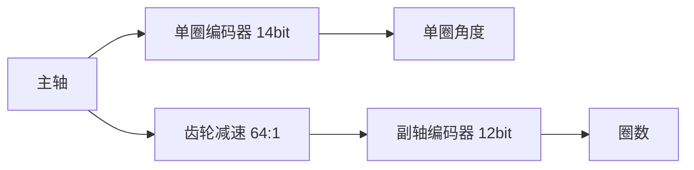
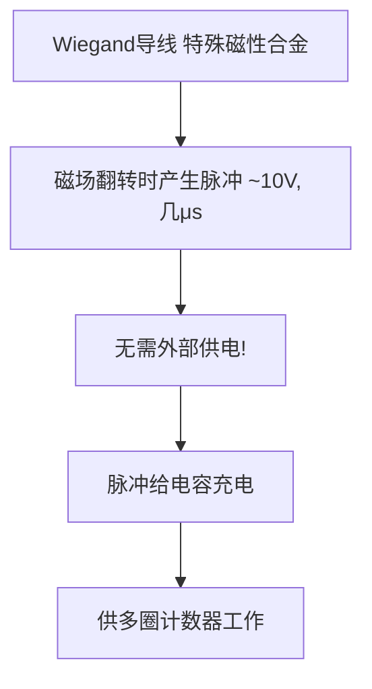
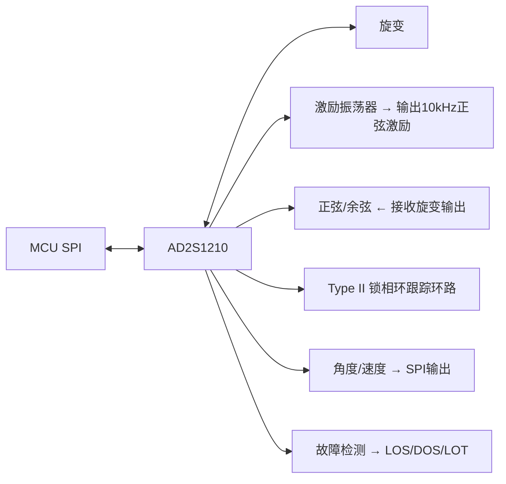
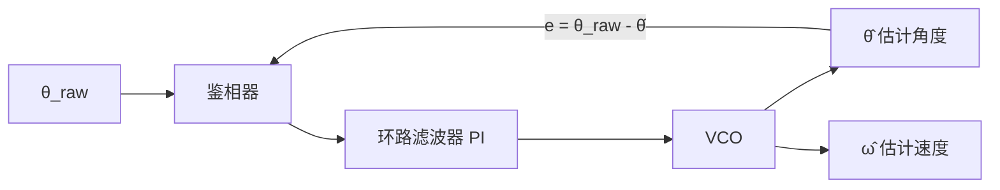
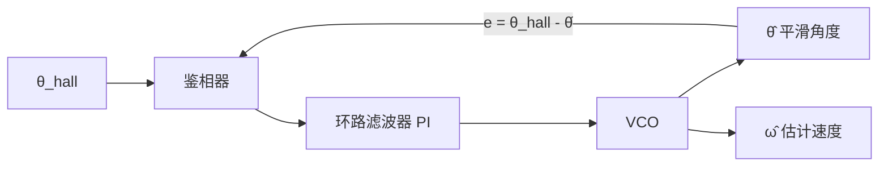
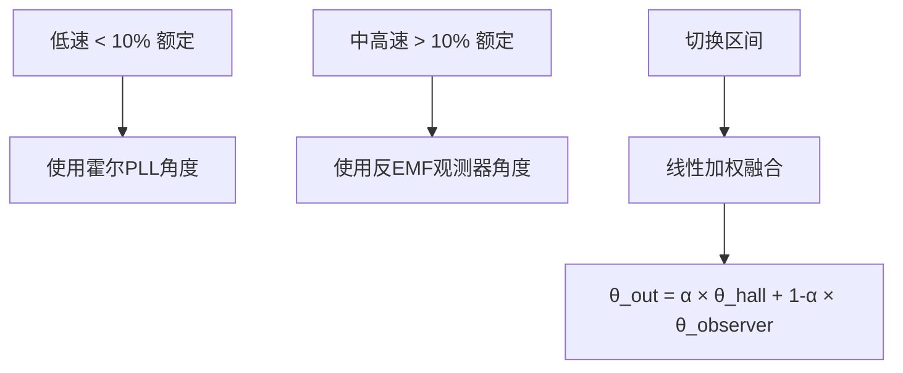
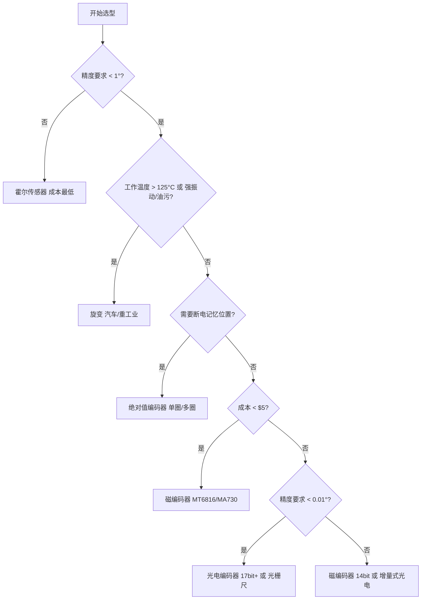

# ADV-HW-03 编码器深度处理与测速方法

**模块编号：** ADV-HW-03
**模块名称：** 编码器深度处理与测速方法（Encoder Deep Processing & Speed Measurement）
**文档版本：** v2.0
**适用对象：** 已掌握基础FOC理论的嵌入式工程师
**前置知识：** HW-03 位置传感器接口、ALG-05 有感FOC实现
**难度等级：** ★★★★★

---

## 1. 核心摘要

**一句话讲清楚**：编码器不是"读个角度"那么简单——从多圈计数到角度校准，从正交解码到测速算法，每一个环节的处理精度都直接决定FOC控制的性能上限。

**认知挂钩**：很多工程师以为编码器接口就是"SPI读个寄存器"或"定时器计个数"，**这是严重低估！** 实际上，编码器信号处理是一个完整的**信号链系统**：物理角度 → 传感器输出 → 硬件解码/解调 → 数字角度 → 电角度转换 → 速度估计。这条链路上任何一个环节的缺陷，都会导致Park变换错误、电流环震荡、低速爬行、高速失步。

**本模块解决的核心问题**：

| 问题 | 根因 | 本模块对应章节 |
|------|------|---------------|
| 断电重启后位置丢失 | 单圈编码器无多圈记忆 | 1. 多圈编码器处理 |
| 增量编码器高速丢脉冲 | 硬件解码器配置不当 | 2/3. 光电/ABZ编码器深度处理 |
| 旋变角度抖动 | RDC环路参数不合理 | 4. 旋变处理 |
| 绝对值编码器通信出错 | 协议时序/CRC未正确处理 | 5. 绝对值编码器 |
| 霍尔电机低速爬行 | 60°分辨率导致角度跳变 | 6. 霍尔角度平滑 |
| 电机启动抖动/反转 | 电角度零位未校准 | 7. 编码器校准与对齐 |
| 速度反馈噪声大/延迟 | 测速方法选择不当 | 8. 测速方法 |
| 编码器选型困惑 | 不了解各方案优劣 | 9. 方案对比与选型 |

---

## 2. 多圈编码器处理

### 2.1 单圈绝对值编码器的局限

单圈绝对值编码器（Single-turn Absolute Encoder）只能测量0~360°范围内的机械角度，存在两个致命缺陷：

**缺陷一：无法区分圈数**

$$\theta_{\text{total}} = N_{\text{turn}} \times 360° + \theta_{\text{single}}$$

其中 $N_{\text{turn}}$ 为圈数，$\theta_{\text{single}}$ 为单圈角度。单圈编码器只能提供 $\theta_{\text{single}}$，$N_{\text{turn}}$ 完全丢失。

**缺陷二：断电后丢失位置**

增量式编码器断电后计数值清零，单圈绝对值编码器虽然能记住断电时的单圈角度，但无法记住断电期间电机是否被外力转动过。

**实际影响**：

**场景：机器人关节电机，使用14bit单圈绝对值编码器**

> - 关节需要多圈运动（如0~720°范围）
> - 断电后人为搬动关节，重新上电位置错误
> - 后果：运动学计算错误 → 机器人碰撞

### 2.2 多圈计数方法

#### 2.2.1 软件多圈计数

**原理**：在软件中维护一个圈数计数器，每次检测到单圈角度过零点时更新圈数。

```c
/**
 * @brief  软件多圈计数器
 * @note   在每个控制周期调用，检测单圈角度过零事件
 * @param  mech_angle: 当前单圈机械角度 [0, 2π)
 * @param  prev_angle: 上一次单圈机械角度
 * @param  turn_count: 圈数计数器指针（正转为正，反转为负）
 */
void multi_turn_update(float mech_angle, float prev_angle, int32_t *turn_count)
{
    /* 检测正向过零：从接近2π跳到接近0 */
    if ((prev_angle > 5.0f) && (mech_angle < 1.0f)) {
        (*turn_count)++;
    }
    /* 检测反向过零：从接近0跳到接近2π */
    else if ((prev_angle < 1.0f) && (mech_angle > 5.0f)) {
        (*turn_count)--;
    }
}
```

**过零检测的关键**：不能简单判断"当前角度 < 上次角度"，因为存在角度量化噪声。必须设置阈值窗口，只有当跳变量远大于噪声时才判定为过零。

**更鲁棒的过零检测**：

```c
/**
 * @brief  鲁棒的多圈过零检测
 * @note   使用角度差分判断，避免噪声误触发
 * @param  angle_diff: 当前角度 - 上次角度（已处理2π回绕）
 * @retval 0: 无过零, +1: 正向过零, -1: 反向过零
 */
int8_t detect_zero_crossing(float angle_diff)
{
    /* 正向过零：角度突然从大变小，差分为大负值 */
    if (angle_diff < -M_PI) {
        return +1;
    }
    /* 反向过零：角度突然从小变大，差分为大正值 */
    if (angle_diff > M_PI) {
        return -1;
    }
    return 0;
}
```

**软件多圈计数的完整实现**：

```c
typedef struct {
    float    mech_angle;       /* 当前单圈机械角度 [0, 2π) */
    float    prev_angle;       /* 上一次单圈机械角度 */
    int32_t  turn_count;       /* 圈数计数器 */
    float    total_angle;      /* 多圈总角度 = turn_count * 2π + mech_angle */
    uint32_t last_save_time;   /* 上次保存时间戳 */
    bool     zero_cross_flag;  /* 过零标志 */
} multi_turn_encoder_t;

/**
 * @brief  多圈编码器更新
 * @param  enc: 多圈编码器结构体指针
 * @param  raw_angle: 编码器原始单圈角度 [0, 2π)
 */
void multi_turn_update(multi_turn_encoder_t *enc, float raw_angle)
{
    float angle_diff;

    enc->prev_angle = enc->mech_angle;
    enc->mech_angle = raw_angle;

    /* 计算角度差，处理2π回绕 */
    angle_diff = enc->mech_angle - enc->prev_angle;
    if (angle_diff > M_PI) {
        angle_diff -= M_2PI;
    } else if (angle_diff < -M_PI) {
        angle_diff += M_2PI;
    }

    /* 过零检测 */
    if (angle_diff > M_PI * 0.75f) {
        /* 反向过零：角度从0附近跳到2π附近 */
        enc->turn_count--;
        enc->zero_cross_flag = true;
    } else if (angle_diff < -M_PI * 0.75f) {
        /* 正向过零：角度从2π附近跳到0附近 */
        enc->turn_count++;
        enc->zero_cross_flag = true;
    } else {
        enc->zero_cross_flag = false;
    }

    /* 计算多圈总角度 */
    enc->total_angle = (float)enc->turn_count * M_2PI + enc->mech_angle;
}
```

**局限性**：
- 断电期间如果电机被转动，圈数信息丢失
- 需要持续供电或配合非易失性存储器

#### 2.2.2 硬件多圈编码器

**方案一：齿轮+电池**



**缺点**：电池有寿命限制（通常3~5年），低温下电池性能下降，更换电池时可能丢失圈数。

**方案二：Wiegand效应自供电（推荐）**



**Wiegand多圈编码器的数据帧**：

```text
  |<-- 单圈数据 -->|<-- 多圈数据 -->|<- 错误位 ->|<- CRC ->|
  |   14 bit       |   12 bit       |   2 bit    |  4 bit  |
  |   0~16383      |   0~4095       |            |         |
  
  总角度 = 多圈值 × 360° + 单圈值 × (360° / 16384)
```

### 2.3 圈数存储策略

软件多圈计数的圈数必须持久化存储，否则断电丢失。存储策略如下：

```c
/**
 * @brief  圈数存储策略
 * @note   三种触发保存的机制
 */

/* 策略1：定期保存（简单但不可靠） */
void periodic_save(multi_turn_encoder_t *enc, uint32_t current_time)
{
    /* 每10秒保存一次 */
    if (current_time - enc->last_save_time > 10000) {
        save_turn_count_to_flash(enc->turn_count);
        enc->last_save_time = current_time;
    }
}

/* 策略2：过零时保存（圈数变化时立即保存） */
void zero_cross_save(multi_turn_encoder_t *enc)
{
    if (enc->zero_cross_flag) {
        save_turn_count_to_flash(enc->turn_count);
    }
}

/* 策略3：掉电检测保存（最可靠） */
/* 硬件设计：电源输入端加电压检测比较器 */
/* 当Vcc下降到阈值时触发GPIO中断 */
void power_fail_isr(void)
{
    /* 紧急保存圈数到FRAM/EEPROM（写入时间<1ms） */
    emergency_save_turn_count(g_encoder.turn_count);
}
```

**Flash vs EEPROM vs FRAM选型**：

| 存储器 | 写入时间 | 擦写次数 | 掉电保存 | 适用场景 |
|--------|---------|---------|---------|---------|
| Flash | 10~50ms | 1万~10万次 | 是 | 不适合频繁保存 |
| EEPROM | 1~5ms | 100万次 | 是 | 中等频率保存 |
| FRAM | <1μs | 10^12次 | 是 | 高频保存、掉电紧急保存（最佳） |

**磨损均衡**（Flash频繁保存时必须实现）：

```c
/**
 * @brief  Flash磨损均衡写入
 * @note   在Flash的一个扇区内循环写入，避免同一地址反复擦写
 */
#define FLASH_SECTOR_SIZE   2048
#define RECORD_SIZE         8   /* 4字节圈数 + 4字节CRC */
#define MAX_RECORDS         (FLASH_SECTOR_SIZE / RECORD_SIZE)

typedef struct {
    int32_t  turn_count;
    uint32_t crc;
} turn_count_record_t;

int32_t load_turn_count_from_flash(void)
{
    turn_count_record_t *records = (turn_count_record_t *)FLASH_BASE_ADDR;
    int32_t latest_count = 0;
    uint32_t latest_idx = 0;

    /* 扫描整个扇区，找到最后一个有效记录 */
    for (uint32_t i = 0; i < MAX_RECORDS; i++) {
        uint32_t crc = calc_crc32(&records[i].turn_count, sizeof(int32_t));
        if (crc == records[i].crc) {
            latest_count = records[i].turn_count;
            latest_idx = i;
        }
    }
    return latest_count;
}
```

### 2.4 多圈角度计算汇总

$$\theta_{\text{total}} = N_{\text{turn}} \times 2\pi + \theta_{\text{single}}$$

$$\theta_{\text{elec}} = p \times \theta_{\text{total}} - \theta_{\text{offset}}$$

其中：
- $N_{\text{turn}}$：圈数（正/负整数）
- $\theta_{\text{single}}$：单圈机械角度 $[0, 2\pi)$
- $p$：极对数
- $\theta_{\text{offset}}$：电角度零位偏移（校准时获取）

**圈数回绕处理**：

> **正转过零**：角度从 359° → 0°，turn_count += 1
>
> - 359.9° → 0.1°  ✓ 正确检测
> - 359.9° → 0.1°  ✓ turn_count: 5 → 6
>
> **反转过零**：角度从 0° → 359°，turn_count -= 1
>
> - 0.1° → 359.9°  ✓ 正确检测
> - 0.1° → 359.9°  ✓ turn_count: 6 → 5
>
> **误判场景（需避免）**：
>
> - 角度量化噪声导致 0.01° → 359.99°
> - → 必须设置阈值窗口，差分角度 > π 才判定过零

---

## 3. 光电编码器数据处理

### 3.1 增量式光电编码器信号

增量式光电编码器输出三路信号：A、B、Z。

```text
         ┌──┐  ┌──┐  ┌──┐  ┌──┐  ┌──┐
  A ─────┘  └──┘  └──┘  └──┘  └──┘  └──
           ┌──┐  ┌──┐  ┌──┐  ┌──┐  ┌──┐
  B ───────┘  └──┘  └──┘  └──┘  └──┘  └──
                ┌──────────────────────┐
  Z ────────────┘                      └───
  
  正转：A超前B 90°（A上升沿时B=0）
  反转：B超前A 90°（A上升沿时B=1）
  Z信号：每转1个脉冲，用于绝对位置校准
```

### 3.2 A/B正交信号4倍频解码

4倍频是增量式编码器的标准解码方式，利用A和B的每个边沿都计数：

| 事件 | 正转计数 | 反转计数 |
|------|---------|---------|
| A上升沿 | +1 | -1 |
| A下降沿 | +1 | -1 |
| B上升沿 | +1 | -1 |
| B下降沿 | +1 | -1 |

**分辨率计算**：

$$\text{每转脉冲数} = \text{PPR} \times 4$$

例如：1000 PPR编码器，4倍频后每转4000个脉冲，角度分辨率为：

$$\Delta\theta = \frac{360°}{4000} = 0.09°$$

### 3.3 方向判断

方向判断基于A/B信号的相位关系：

```c
/**
 * @brief  正交信号方向判断
 * @note   在A信号边沿采样B信号电平
 * @param  b_level: A边沿时刻B信号的电平
 * @retval +1: 正转, -1: 反转
 */
int8_t quadrature_direction(bool b_level)
{
    /* A上升沿时：B=0 → 正转，B=1 → 反转 */
    return b_level ? -1 : 1;
}
```

**状态机视角的方向判断**：

```text
  正转序列：  00 → 10 → 11 → 01 → 00 → ...
  反转序列：  00 → 01 → 11 → 10 → 00 → ...
  
  状态转换表：
  ┌──────┬──────┬────────┐
  │ 当前 │ 下一个│ 方向    │
  │ 状态 │ 状态  │        │
  ├──────┼──────┼────────┤
  │  00  │  10  │  +1    │
  │  10  │  11  │  +1    │
  │  11  │  01  │  +1    │
  │  01  │  00  │  +1    │
  ├──────┼──────┼────────┤
  │  00  │  01  │  -1    │
  │  01  │  11  │  -1    │
  │  11  │  10  │  -1    │
  │  10  │  00  │  -1    │
  ├──────┼──────┼────────┤
  │ 其他 │ 非法  │  错误  │
  └──────┴──────┴────────┘
  
  非法转换：如 00 → 11，表示丢脉冲或噪声
```

### 3.4 Z信号处理

Z信号（Index pulse）每转输出一个脉冲，用于：

1. **绝对位置校准**：Z信号出现时，将计数器清零或设为已知值
2. **累积误差消除**：增量编码器长时间运行可能累积误差，Z信号可周期性修正

```c
/**
 * @brief  Z信号中断处理
 * @note   Z信号上升沿触发，校准编码器计数
 */
void encoder_z_signal_isr(void)
{
    /* Z信号出现时，将计数器设为0（或已知的机械零位偏移） */
    __HAL_TIM_SET_COUNTER(&htim3, 0);
    
    /* 标记已收到Z信号 */
    g_encoder.z_received = true;
    
    /* 可选：校验累积误差 */
    int32_t cnt = __HAL_TIM_GET_COUNTER(&htim3);
    if (abs(cnt) > ENCODER_PPR * 4) {
        /* 一个周期内计数超过了理论值，说明有丢脉冲 */
        g_encoder.error_count++;
    }
}
```

---

## 4. ABZ编码器深度处理

### 4.1 STM32定时器编码器模式

STM32的通用定时器和高级定时器支持硬件编码器接口，无需CPU干预即可完成正交解码。

**寄存器配置核心**：TIMx_SMCR的SMS位

| SMS[2:0] | 模式 | 说明 |
|-----------|------|------|
| 001 | 编码器模式1 | 仅在TI1（A）边沿计数 |
| 010 | 编码器模式2 | 仅在TI2（B）边沿计数 |
| 011 | 编码器模式3 | TI1和TI2边沿都计数（4倍频） |

**模式对比**：

```text
模式1（2倍频）：仅A信号边沿计数
  ┌──┐  ┌──┐  ┌──┐  ┌──┐
  ┘  └──┘  └──┘  └──┘  └──  A信号
  ↑  ↑    ↑  ↑    ↑  ↑    ↑  ↑
  计数    计数    计数    计数
  每转脉冲 = PPR × 2

模式2（2倍频）：仅B信号边沿计数
       ┌──┐  ┌──┐  ┌──┐  ┌──┐
  ─────┘  └──┘  └──┘  └──┘  └──  B信号
       ↑  ↑    ↑  ↑    ↑  ↑    ↑  ↑
       计数    计数    计数    计数
  每转脉冲 = PPR × 2

模式3（4倍频）：A+B信号边沿都计数（推荐）
  ┌──┐  ┌──┐  ┌──┐  ┌──┐
  ┘  └──┘  └──┘  └──┘  └──  A信号
  ↑  ↑    ↑  ↑    ↑  ↑    ↑  ↑
       ┌──┐  ┌──┐  ┌──┐  ┌──┐
  ─────┘  └──┘  └──┘  └──┘  └──  B信号
       ↑  ↑    ↑  ↑    ↑  ↑    ↑  ↑
  每转脉冲 = PPR × 4
```

### 4.2 STM32 HAL配置示例

```c
/**
 * @brief  编码器定时器初始化（STM32G4 TIM3为例）
 * @note   4倍频模式，带数字滤波
 * @param  ppr: 编码器每转线数（如1000）
 */
void encoder_tim_init(uint32_t ppr)
{
    TIM_Encoder_InitTypeDef encoder_config = {0};
    TIM_MasterConfigTypeDef master_config = {0};

    /* 定时器基座配置 */
    htim3.Instance = TIM3;
    htim3.Init.Prescaler = 0;                          /* 不分频 */
    htim3.Init.CounterMode = TIM_COUNTERMODE_CENTERALIGNED1; /* 不影响编码模式 */
    htim3.Init.Period = (ppr * 4) - 1;                 /* 4倍频后的满量程 */
    htim3.Init.ClockDivision = TIM_CLOCKDIVISION_DIV1;
    htim3.Init.AutoReloadPreload = TIM_AUTORELOAD_PRELOAD_DISABLE;

    /* 编码器模式配置 */
    encoder_config.EncoderMode = TIM_ENCODERMODE_TI12;  /* 模式3：4倍频 */
    encoder_config.IC1Polarity = TIM_ICPOLARITY_RISING;  /* A通道双边沿 */
    encoder_config.IC1Selection = TIM_ICSELECTION_DIRECTTI;
    encoder_config.IC1Prescaler = TIM_ICPSC_DIV1;       /* 不分频 */
    encoder_config.IC1Filter = 6;                        /* 数字滤波（关键！） */
    encoder_config.IC2Polarity = TIM_ICPOLARITY_RISING;  /* B通道双边沿 */
    encoder_config.IC2Selection = TIM_ICSELECTION_DIRECTTI;
    encoder_config.IC2Prescaler = TIM_ICPSC_DIV1;
    encoder_config.IC2Filter = 6;                        /* 数字滤波 */

    HAL_TIM_Encoder_Init(&htim3, &encoder_config);

    master_config.MasterOutputTrigger = TIM_TRGO_RESET;
    master_config.MasterSlaveMode = TIM_MASTERSLAVEMODE_DISABLE;
    HAL_TIMEx_MasterConfigSynchronization(&htim3, &master_config);

    /* 启动编码器 */
    HAL_TIM_Encoder_Start(&htim3, TIM_CHANNEL_ALL);
}
```

### 4.3 输入滤波配置

**为什么需要滤波？** 编码器信号在长线传输中会引入噪声，导致误计数。

**STM32定时器输入滤波**：通过TIMx_CCMR的ICxF[3:0]位配置。

| ICxF[3:0] | 滤波器配置 | 采样频率 | N个连续采样 |
|-----------|-----------|---------|------------|
| 0000 | 无滤波 | - | - |
| 0001 | f_DTS | 1 | 2 |
| 0010 | f_DTS | 1 | 4 |
| 0011 | f_DTS | 1 | 8 |
| 0100 | f_DTS/2 | 2 | 6 |
| 0101 | f_DTS/2 | 2 | 8 |
| 0110 | f_DTS/4 | 4 | 6 |
| 0111 | f_DTS/4 | 4 | 8 |
| 1000 | f_DTS/8 | 8 | 6 |
| 1001 | f_DTS/8 | 8 | 8 |
| 1010 | f_DTS/16 | 16 | 5 |
| 1011 | f_DTS/16 | 16 | 6 |
| 1100 | f_DTS/32 | 32 | 5 |
| 1101 | f_DTS/32 | 32 | 6 |
| 1110 | f_DTS/64 | 64 | 5 |
| 1111 | f_DTS/64 | 64 | 6 |

**滤波参数选择**：

$$f_{\text{sample}} = \frac{f_{\text{DTS}}}{\text{分频系数}}$$

$$t_{\text{filter}} = \frac{N}{f_{\text{sample}}}$$

其中：
- $f_{\text{sample}}$：滤波器采样频率 (Hz)
- $f_{\text{DTS}}$：定时器时钟分频后的频率 (Hz)
- $N$：连续采样次数
- $t_{\text{filter}}$：滤波时间常数 (s)

**原则**：滤波时间必须远小于编码器信号的最小脉冲宽度，否则会滤掉真实信号。

### 4.4 最大频率限制

编码器信号频率受限于定时器时钟和滤波配置：

$$f_{\text{encoder\_max}} = \frac{f_{\text{TIM\_CLK}}}{4 \times \text{滤波系数}}$$

其中：
- $f_{\text{encoder\_max}}$：编码器最大可跟踪信号频率 (Hz)
- $f_{\text{TIM\_CLK}}$：定时器时钟频率 (Hz)
- 滤波系数：由ICxF配置决定（分频系数 $\times$ 连续采样次数）

**计算示例**：

> STM32G4 TIM3 时钟 = 170 MHz
> - 编码器 PPR = 2500
> - 电机最高转速 = 6000 RPM
>
> 编码器信号频率 = 2500 × 6000 / 60 = 250 kHz
> - 4倍频后最大计数频率 = 250 kHz × 4 = 1 MHz
>
> - 无滤波时：f_max = 170 MHz / 4 = 42.5 MHz ✓ 远大于1 MHz
> - ICxF = 6 (f_DTS/4, N=6)：f_max = 170 MHz / (4 × 4 × 6) = 1.77 MHz ✓ 勉强够
> - ICxF = 10 (f_DTS/16, N=5)：f_max = 170 MHz / (4 × 16 × 5) = 531 kHz ✗ 不够！
>
> **结论**：高速应用中滤波参数不能设太大

### 4.5 计数值到角度的转换

$$\theta = \frac{2\pi \times \text{CNT}}{\text{PPR} \times 4}$$

其中：
- $\theta$：机械角度 (rad)
- $\text{CNT}$：定时器当前计数值
- $\text{PPR}$：编码器每转线数
- $4$：4倍频系数

```c
/**
 * @brief  编码器计数值转换为机械角度
 * @param  cnt: 定时器计数值
 * @param  ppr: 编码器每转线数
 * @retval 机械角度 [0, 2π)
 */
float encoder_cnt_to_angle(int32_t cnt, uint32_t ppr)
{
    float angle;
    int32_t max_cnt = (int32_t)(ppr * 4);

    /* 处理计数器溢出/下溢 */
    cnt = cnt % max_cnt;
    if (cnt < 0) {
        cnt += max_cnt;
    }

    angle = (float)cnt * M_2PI / (float)max_cnt;
    return angle;
}
```

**处理计数器回绕的更优方案**：利用16位计数器的自然溢出。

```c
/**
 * @brief  利用16位计数器自然溢出的角度计算
 * @note   CNT范围0~65535，Period设为PPR*4-1
 *         当PPR*4 < 65536时，CNT自然在0~Period间循环
 */
float encoder_get_angle(uint32_t ppr)
{
    uint16_t cnt = (uint16_t)__HAL_TIM_GET_COUNTER(&htim3);
    return (float)cnt * M_2PI / (float)(ppr * 4);
}
```

### 4.6 脉冲丢失检测

高速时编码器信号边沿过快，解码器可能跟不上，导致丢脉冲。

```c
/**
 * @brief  编码器脉冲丢失检测
 * @note   利用Z信号校验累积误差
 * @param  enc: 编码器结构体
 */
void encoder_loss_check(encoder_t *enc)
{
    if (enc->z_received) {
        int32_t expected_cnt = 0;  /* Z信号时理论计数值应为0 */
        int32_t actual_cnt = __HAL_TIM_GET_COUNTER(&htim3);
        int32_t error = actual_cnt - expected_cnt;

        /* 允许±2个脉冲的误差（Z信号边沿对齐精度） */
        if (abs(error) > 2) {
            enc->pulse_loss_detected = true;
            enc->pulse_loss_count = error;
        }
        enc->z_received = false;
    }
}
```

---

## 5. 旋变（Resolver）

### 5.1 旋变结构与工作原理

旋变是一种特殊的变压器型角度传感器，由转子和定子组成：

```text
结构示意图：

  ┌─────────────────────────────┐
  │         定子                 │
  │   ┌───────────────────┐     │
  │   │  sin线圈 ──────   │     │
  │   │  │              │ │     │
  │   │  │   ┌─────┐    │ │     │
  │   │  │   │ 转子 │    │ │     │
  │   │  │   │激励  │    │ │     │
  │   │  │   │线圈  │    │ │     │
  │   │  │   └─────┘    │ │     │
  │   │  │              │ │     │
  │   │  cos线圈 ──────  │     │
  │   └───────────────────┘     │
  └─────────────────────────────┘

  激励信号：V_exc = V_m × sin(ωt)，通常ω = 2π × 5~10kHz
  转子旋转角度：θ（机械角度）
```

**输出信号**：

$$V_{\sin} = K \times \sin(\theta) \times \sin(\omega t)$$

$$V_{\cos} = K \times \cos(\theta) \times \sin(\omega t)$$

其中：
- $K$ 为变压比（通常0.3~0.6）
- $\omega$ 为激励角频率
- $\theta$ 为转子机械角度

**关键理解**：激励信号 $\sin(\omega t)$ 是载波，角度信息 $\sin(\theta)$ / $\cos(\theta)$ 是调制信号。旋变输出的本质是**调幅信号**。

### 5.2 旋变解码方法

#### 5.2.1 硬件RDC芯片

**常用芯片**：

| 芯片 | 分辨率 | 跟踪速率 | 接口 | 特点 |
|------|--------|---------|------|------|
| AD2S1210 | 10/12/14/16bit | 3125 rps | SPI | 可编程分辨率，内置故障检测 |
| AU6802 | 12/14bit | 1000 rps | SPI | 汽车级，内置振荡器 |
| AD2S1205 | 12bit | 1250 rps | SPI | 低成本，12bit固定 |

**AD2S1210典型应用电路**：



#### 5.2.2 软件RDC实现

软件RDC（Software RDC）在MCU中实现旋变解码，省去专用RDC芯片，降低BOM成本。

**处理流程**：


**Step 1：同步解调**

$$S_{\sin} = V_{\sin} \times \text{sign}(\sin(\omega t)) \xrightarrow{\text{LPF}} K \times \sin(\theta)$$

$$S_{\cos} = V_{\cos} \times \text{sign}(\sin(\omega t)) \xrightarrow{\text{LPF}} K \times \cos(\theta)$$

```c
/**
 * @brief  同步解调
 * @note   在激励信号正半周和负半周分别采样，相减消除偏置
 * @param  sin_pos: 激励正半周的sin通道ADC值
 * @param  sin_neg: 激励负半周的sin通道ADC值
 * @param  cos_pos: 激励正半周的cos通道ADC值
 * @param  cos_neg: 激励负半周的cos通道ADC值
 * @retval 解调后的sin/cos值
 */
typedef struct {
    float sin_val;
    float cos_val;
} resolver_demod_t;

resolver_demod_t resolver_synchronous_demod(
    int16_t sin_pos, int16_t sin_neg,
    int16_t cos_pos, int16_t cos_neg)
{
    resolver_demod_t result;

    /* 正负半周相减 = 2×K×sin(θ) 或 2×K×cos(θ)，消除DC偏置 */
    result.sin_val = (float)(sin_pos - sin_neg);
    result.cos_val = (float)(cos_pos - cos_neg);

    return result;
}
```

**Step 2：arctan计算**

$$\theta_{\text{raw}} = \arctan2(S_{\sin}, S_{\cos})$$

```c
/**
 * @brief  使用CORDIC计算arctan2
 * @note   STM32G4内置CORDIC加速器，可零CPU开销计算
 */
float resolver_arctan2(float sin_val, float cos_val)
{
    /* 方法1：使用标准数学库 */
    return atan2f(sin_val, cos_val);

    /* 方法2：使用STM32G4 CORDIC硬件加速（推荐） */
    /* CORDIC配置为Phase模式，输入q1.31格式的sin/cos */
    /* 输出直接为角度，精度约0.01°，计算时间约4个时钟周期 */
}
```

**Step 3：Type II PLL跟踪环路**

直接使用arctan2输出的角度噪声大，需要PLL平滑。Type II跟踪环路是二阶系统，同时输出角度和速度：



```c
/**
 * @brief  Type II PLL跟踪环路
 * @note   二阶PLL，同时输出角度和速度估计
 */
typedef struct {
    float theta;     /* 估计角度 [rad] */
    float omega;     /* 估计速度 [rad/s] */
    float Kp;        /* 比例增益 */
    float Ki;        /* 积分增益 */
    float err_integ; /* 误差积分 */
    float Ts;        /* 采样周期 [s] */
} pll_tracker_t;

void pll_update(pll_tracker_t *pll, float theta_raw)
{
    float err;

    /* 鉴相器：计算角度误差，处理2π回绕 */
    err = theta_raw - pll->theta;
    if (err > M_PI) {
        err -= M_2PI;
    } else if (err < -M_PI) {
        err += M_2PI;
    }

    /* 环路滤波器：PI控制器 */
    pll->err_integ += err * pll->Ts;
    float omega_cmd = pll->Kp * err + pll->Ki * pll->err_integ;

    /* VCO：积分得到角度 */
    pll->omega = omega_cmd;
    pll->theta += pll->omega * pll->Ts;

    /* 角度归一化到 [0, 2π) */
    if (pll->theta >= M_2PI) {
        pll->theta -= M_2PI;
    } else if (pll->theta < 0.0f) {
        pll->theta += M_2PI;
    }
}
```

**PLL带宽设计**：

环路带宽 $f_{\text{bw}}$ 决定跟踪速度和噪声抑制的权衡：

$$K_p = \frac{4\pi f_{\text{bw}}}{\sqrt{2}}$$

$$K_i = 2\pi f_{\text{bw}} \times K_p = 2\sqrt{2} \cdot (2\pi f_{\text{bw}})^2$$

其中：
- $K_p$：PLL比例增益 (rad/s/rad)
- $K_i$：PLL积分增益 (rad/s^2/rad)
- $f_{\text{bw}}$：PLL环路带宽 (Hz)

| 带宽 | 响应速度 | 噪声抑制 | 适用场景 |
|------|---------|---------|---------|
| 100 Hz | 快 | 差 | 高动态响应 |
| 50 Hz | 中 | 中 | 通用（推荐） |
| 10 Hz | 慢 | 好 | 低速精密定位 |

### 5.3 旋变优劣势总结

**优势**：
- **耐恶劣环境**：工作温度-55°C~175°C，抗振动、抗冲击
- **可靠性高**：无光学元件，不怕油污、灰尘
- **汽车/工业首选**：满足ASIL-D功能安全要求

**劣势**：
- **需要激励信号**：必须提供5~10kHz正弦激励，增加硬件复杂度
- **解码复杂**：需要RDC芯片或软件RDC
- **成本较高**：旋变本体+激励电路+RDC，总成本高于磁编码器
- **体积较大**：相比磁编码器，旋变体积和安装空间要求更大

---

## 6. 绝对值编码器

### 6.1 SSI协议

SSI（Synchronous Serial Interface）是最简单的绝对值编码器通信协议：

```yaml
时序图：

  CLK:  ──┐ ┌─┐ ┌─┐ ┌─┐ ┌─┐ ┌─┐ ┌─┐ ┌─┐ ┌─┐ ┌─┐ ┌─┐ ┌─┐ ┌─┐ ┌─┐ ┌─┐ ┌─
         └─┘ └─┘ └─┘ └─┘ └─┘ └─┘ └─┘ └─┘ └─┘ └─┘ └─┘ └─┘ └─┘ └─┘ └─┘ └─
  DATA: ──────┐ D15┐D14┐D13┐D12┐D11┐D10┐ D9┐ D8┐ D7┐ D6┐ D5┐ D4┐ D3┐ D2┐
              └───┘───┘───┘───┘───┘───┘───┘───┘───┘───┘───┘───┘───┘───┘───

  特点：
  - 主设备发出时钟，从设备在时钟边沿输出数据
  - 最大时钟速率：2 MHz
  - 数据长度取决于编码器分辨率（如14bit = 14个时钟）
  - 无CRC校验（可靠性较低）
```

```c
/**
 * @brief  SSI协议读取编码器数据
 * @param  n_bits: 数据位数（如14）
 * @retval 编码器原始数据
 */
uint32_t ssi_read(uint8_t n_bits)
{
    uint32_t data = 0;

    /* 拉低CS（如果使用） */
    ENCODER_CS_LOW();

    /* 逐位读取 */
    for (int8_t i = n_bits - 1; i >= 0; i--) {
        /* 时钟上升沿 */
        ENCODER_CLK_HIGH();
        delay_ns(250);  /* t_clk/2 > 250ns (2MHz) */

        /* 读取数据位 */
        if (ENCODER_DATA_READ()) {
            data |= (1UL << i);
        }

        /* 时钟下降沿 */
        ENCODER_CLK_LOW();
        delay_ns(250);
    }

    ENCODER_CS_HIGH();
    return data;
}
```

### 6.2 BiSS协议

BiSS（Bidirectional Synchronous Serial）是SSI的增强版：

| 特性 | SSI | BiSS-C |
|------|-----|--------|
| 通信方向 | 单向 | 双向 |
| 最大速率 | 2 MHz | 10 MHz+ |
| CRC校验 | 无 | CRC6 |
| 延迟 | 1个帧周期 | 单周期 |
| 从站数量 | 1 | 多个 |

**BiSS-C数据帧**：

```text
  ┌─────┬──────────────────────────┬───────┬──────┐
  │ ACK │ 数据 (单圈+多圈)          │ Error │ CRC6 │
  │ 1bit│ N bit                    │ 2bit  │ 6bit │
  └─────┴──────────────────────────┴───────┴──────┘

  CRC6多项式：x^6 + x^1 + 1 = 0x43
```

```c
/**
 * @brief  CRC6计算（BiSS协议）
 * @param  data: 数据指针
 * @param  n_bits: 数据位数
 * @retval 6位CRC值
 */
uint8_t biss_crc6(const uint8_t *data, uint8_t n_bits)
{
    uint8_t crc = 0;
    uint8_t byte_idx, bit_idx;

    for (uint16_t i = 0; i < n_bits; i++) {
        byte_idx = i / 8;
        bit_idx = 7 - (i % 8);
        uint8_t bit = (data[byte_idx] >> bit_idx) & 0x01;

        uint8_t msb = (crc >> 5) & 0x01;
        crc = (crc << 1) & 0x3F;
        if (msb ^ bit) {
            crc ^= 0x03;  /* 多项式 x^6 + x + 1 */
        }
    }
    return crc;
}
```

### 6.3 EnDat协议

EnDat是HEIDENHAIN的专有协议，支持增量+绝对值混合模式：

**EnDat 2.2数据帧**：

> - **主站 → 从站**：模式命令(模式位+地址)
> - **从站 → 主站**：错误位 + 数据(单圈+多圈) + CRC
>
> **特点**：
>
> - 支持增量信号（1 Vpp正弦波）+ 绝对值数据
> - 增量信号提供高分辨率插值（可达27bit）
> - 绝对值数据提供断电不丢失的位置
> - 传输速率可达8 MHz

### 6.4 SPI接口磁编码器

SPI接口磁编码器是最简单的绝对值编码器方案，代表芯片：

| 芯片 | 分辨率 | 接口 | 特点 | 参考价格 |
|------|--------|------|------|---------|
| AS5047P | 14bit | SPI (10MHz) | 14bit无毛刺，PWM输出 | ~$5 |
| AS5048A | 14bit | SPI (10MHz) | 14bit，内置温度传感器 | ~$6 |
| MT6816 | 14bit | SPI (10MHz) | 低成本，国产替代 | ~$2 |
| AS5056A | 12bit | SPI | 汽车级，AEC-Q100 | ~$8 |
| MA730 | 14bit | SPI/ABI/UVW | 多接口输出 | ~$3 |

**MT6816 SPI读取（本项目实际使用）**：

参考项目代码 `encoder.c`：

```c
/**
 * @brief  MT6816 SPI读取角度数据
 * @note   读取0x03和0x04寄存器，16bit数据包含14bit角度+校验位
 *         数据格式：[angle_h 8bit][angle_l 8bit]
 *         bit[15:2] = 14bit角度值 (0~16383)
 *         bit[1]    = 无磁标志
 *         bit[0]    = 奇偶校验位
 */
void RINE_MT6816_SPI_Get_AngleData(void)
{
    uint16_t data_t[2];
    uint16_t data_r[2];
    uint8_t h_count;

    data_t[0] = (0x80 | 0x03) << 8;  /* 读寄存器0x03 */
    data_t[1] = (0x80 | 0x04) << 8;  /* 读寄存器0x04 */

    for (uint8_t i = 0; i < 3; i++) {
        MT6816_SPI_CS_L();
        HAL_SPI_TransmitReceive(&MT6816_SPI_Get_HSPI,
            (uint8_t *)&data_t[0], (uint8_t *)&data_r[0], 1, HAL_MAX_DELAY);
        MT6816_SPI_CS_H();

        MT6816_SPI_CS_L();
        HAL_SPI_TransmitReceive(&MT6816_SPI_Get_HSPI,
            (uint8_t *)&data_t[1], (uint8_t *)&data_r[1], 1, HAL_MAX_DELAY);
        MT6816_SPI_CS_H();

        mt6816_spi.sample_data = ((data_r[0] & 0x00FF) << 8) | (data_r[1] & 0x00FF);

        /* 奇偶校验验证 */
        h_count = 0;
        for (uint8_t j = 0; j < 16; j++) {
            if (mt6816_spi.sample_data & (0x0001 << j))
                h_count++;
        }
        if (h_count & 0x01) {
            mt6816_spi.pc_flag = false;  /* 校验失败，重试 */
        } else {
            mt6816_spi.pc_flag = true;
            break;
        }
    }

    if (mt6816_spi.pc_flag) {
        mt6816_spi.angle = mt6816_spi.sample_data >> 2;  /* 取14bit角度 */
        mt6816_spi.no_mag_flag = (bool)(mt6816_spi.sample_data & (0x0001 << 1));
    }
}
```

**AS5047P SPI读取**：

```c
/**
 * @brief  AS5047P SPI读取角度
 * @note   AS5047P使用16bit SPI帧
 *         发送帧：[0=R/W, A4:A0, 0:0:0:0:0:0:0:0, 0:0:C1:C0]
 *         接收帧：[EF, D13:D0, 0:0]
 *         EF = 错误标志+帧标志
 */
uint16_t as5047p_read_angle(void)
{
    uint16_t tx_cmd = 0x3FFF;  /* 读ANGLECOM寄存器 */
    uint16_t rx_data;

    AS5047P_CS_LOW();
    HAL_SPI_TransmitReceive(&hspi1, (uint8_t *)&tx_cmd,
        (uint8_t *)&rx_data, 1, HAL_MAX_DELAY);
    AS5047P_CS_HIGH();

    /* 第二次读取才能得到第一次命令的结果（流水线延迟） */
    tx_cmd = 0x0000;  /* NOP */
    AS5047P_CS_LOW();
    HAL_SPI_TransmitReceive(&hspi1, (uint8_t *)&tx_cmd,
        (uint8_t *)&rx_data, 1, HAL_MAX_DELAY);
    AS5047P_CS_HIGH();

    /* 提取14bit角度数据 */
    uint16_t angle = rx_data & 0x3FFF;
    return angle;
}
```

### 6.5 多圈绝对值编码器数据帧

多圈绝对值编码器的数据帧包含单圈数据、多圈数据和校验信息：

```text
  典型多圈编码器数据帧（如25bit = 14bit单圈 + 11bit多圈）：

  ┌──────────────┬──────────────┬──────┬──────┐
  │ 多圈数据      │ 单圈数据      │ 错误 │ CRC  │
  │ 11 bit       │ 14 bit       │ 2bit │ 4bit │
  └──────────────┴──────────────┴──────┴──────┘

  总角度 = 多圈值 × 360° + 单圈值 × (360° / 16384)
  
  多圈范围：0~2047（±2048圈，取决于是否有符号位）
```

---

## 7. 霍尔传感器角度处理与平滑

### 7.1 霍尔传感器输出

3路霍尔传感器将360°电角度分为6个扇区，每个扇区60°：

```text
  霍尔信号与扇区映射（120°安装方式）：

  Hall_U: ──┐     ┌─────────────┐     ┌──────────
            └─────┘             └─────┘
  Hall_V: ────────┐     ┌─────────────┐     ┌────
                  └─────┘             └─────┘
  Hall_W: ──────────────┐     ┌─────────────┐
                        └─────┘             └────

  扇区号:  5  1  3  2  6  4  5  1  3  2  6  4
  电角度:  0  60 120 180 240 300 360

  扇区到角度映射表：
  ┌──────┬──────┬──────┬──────┬──────────┐
  │ Hall │ H_U  │ H_V  │ H_W  │ 电角度中心│
  │ 值   │      │      │      │ (°)      │
  ├──────┼──────┼──────┼──────┼──────────┤
  │  5   │  1   │  0   │  1   │   30     │
  │  1   │  1   │  0   │  0   │   90     │
  │  3   │  1   │  1   │  0   │  150     │
  │  2   │  0   │  1   │  0   │  210     │
  │  6   │  0   │  1   │  1   │  270     │
  │  4   │  0   │  0   │  1   │  330     │
  └──────┴──────┴──────┴──────┴──────────┘
```

```c
/**
 * @brief  霍尔扇区到电角度映射
 * @param  hall_state: 3位霍尔状态 [H_U, H_V, H_W]
 * @retval 扇区起始电角度 [rad]
 */
float hall_to_angle(uint8_t hall_state)
{
    /* 查表法，扇区起始角度 */
    const float hall_angle_table[8] = {
        0.0f,                                    /* 000: 非法 */
        M_PI / 3.0f,                             /* 001 = 1: 60° */
        M_PI,                                    /* 010 = 2: 180° */
        2.0f * M_PI / 3.0f,                      /* 011 = 3: 120° */
        5.0f * M_PI / 3.0f,                      /* 100 = 4: 300° */
        0.0f,                                    /* 101 = 5: 0° */
        4.0f * M_PI / 3.0f,                      /* 110 = 6: 240° */
        0.0f,                                    /* 111: 非法 */
    };

    return hall_angle_table[hall_state & 0x07];
}
```

### 7.2 原始角度问题

60°分辨率导致角度跳变，直接用于FOC的Park变换会产生严重问题：

```text
  原始霍尔角度：
  ────────┐         ┌─────────┐         ┌─────────
          │  60°    │         │  180°   │
          │         │         │         │
  0° ─────┘         └─────────┘         └─────────
  
  问题1：角度跳变 → Park变换角度突变 → Id/Iq冲击
  问题2：60°内角度不变 → 电流环无角度更新 → 转矩脉动
  问题3：低速时一个扇区持续很长时间 → 完全无法控制
```

### 7.3 霍尔角度平滑方法

#### 7.3.1 线性插值法

**原理**：在两个换相点之间线性插值，需要速度信息。

$$\theta(t) = \theta_{\text{sector\_start}} + \frac{t - t_{\text{last\_comm}}}{T_{\text{sector}}} \times 60°$$

其中 $T_{\text{sector}}$ 为上一个扇区的持续时间。

```c
/**
 * @brief  霍尔线性插值角度计算
 * @note   在换相点之间线性插值，需要记录扇区持续时间
 */
typedef struct {
    float    sector_start_angle;  /* 当前扇区起始角度 [rad] */
    float    sector_duration;     /* 上一个扇区持续时间 [s] */
    uint32_t sector_start_time;   /* 当前扇区开始时刻 [ticks] */
    uint8_t  prev_hall;           /* 上一次霍尔状态 */
    float    interpolated_angle;  /* 插值后的角度 [rad] */
} hall_interpolator_t;

/**
 * @brief  霍尔换相检测与插值更新
 * @param  hall: 插值器结构体
 * @param  hall_state: 当前霍尔状态
 * @param  current_time: 当前时刻 [ticks]
 * @param  tick_freq: 时钟频率 [Hz]
 */
void hall_interpolate_update(hall_interpolator_t *hall,
    uint8_t hall_state, uint32_t current_time, uint32_t tick_freq)
{
    if (hall_state != hall->prev_hall) {
        /* 检测到换相事件 */
        uint32_t elapsed = current_time - hall->sector_start_time;

        /* 更新扇区持续时间（用上一次的持续时间做当前插值） */
        if (hall->sector_start_time > 0) {
            hall->sector_duration = (float)elapsed / (float)tick_freq;
        }

        /* 更新扇区起始角度 */
        hall->sector_start_angle = hall_to_angle(hall_state);
        hall->sector_start_time = current_time;
        hall->prev_hall = hall_state;
    }

    /* 线性插值 */
    if (hall->sector_duration > 0.0f) {
        uint32_t elapsed = current_time - hall->sector_start_time;
        float t_ratio = (float)elapsed / ((float)tick_freq * hall->sector_duration);

        /* 限制插值比例，防止超出当前扇区 */
        if (t_ratio > 1.0f) t_ratio = 1.0f;

        hall->interpolated_angle = hall->sector_start_angle
            + t_ratio * (M_PI / 3.0f);  /* 60° = π/3 */
    } else {
        /* 首次运行，无扇区时间信息 */
        hall->interpolated_angle = hall_to_angle(hall_state);
    }
}
```

**线性插值的问题**：

- 速度变化时，用上一个扇区时间估算当前扇区，插值不准确
- 加速时插值角度滞后，减速时插值角度超前
- 低速时扇区时间长，插值误差累积

#### 7.3.2 PLL跟踪法（推荐）

**原理**：用二阶PLL跟踪霍尔角度，PLL输出即为平滑的角度和速度估计。



```c
/**
 * @brief  霍尔PLL跟踪器
 * @note   用PLL跟踪霍尔角度，输出平滑角度和速度
 *         只在换相点更新鉴相器误差
 */
typedef struct {
    float    theta;          /* PLL估计角度 [rad] */
    float    omega;          /* PLL估计速度 [rad/s] */
    float    Kp;             /* 比例增益 */
    float    Ki;             /* 积分增益 */
    float    err_integ;      /* 误差积分 */
    float    Ts;             /* 采样周期 [s] */
    uint8_t  prev_hall;      /* 上一次霍尔状态 */
    float    hall_angle;     /* 当前霍尔扇区角度 [rad] */
    bool     commutation;    /* 换相事件标志 */
} hall_pll_t;

/**
 * @brief  霍尔PLL更新
 * @param  pll: PLL结构体指针
 * @param  hall_state: 当前霍尔状态
 */
void hall_pll_update(hall_pll_t *pll, uint8_t hall_state)
{
    float err;

    /* 检测换相事件 */
    if (hall_state != pll->prev_hall) {
        pll->hall_angle = hall_to_angle(hall_state);
        pll->commutation = true;
        pll->prev_hall = hall_state;
    }

    /* 鉴相器：只在换相点更新误差 */
    if (pll->commutation) {
        err = pll->hall_angle - pll->theta;
        /* 处理2π回绕 */
        if (err > M_PI) err -= M_2PI;
        else if (err < -M_PI) err += M_2PI;
        pll->commutation = false;
    } else {
        /* 非换相时刻，误差保持0（让PLL自由运行） */
        err = 0.0f;
    }

    /* 环路滤波器 */
    pll->err_integ += err * pll->Ts;
    float omega_cmd = pll->Kp * err + pll->Ki * pll->err_integ;

    /* VCO */
    pll->omega = omega_cmd;
    pll->theta += pll->omega * pll->Ts;

    /* 角度归一化 */
    if (pll->theta >= M_2PI) pll->theta -= M_2PI;
    else if (pll->theta < 0.0f) pll->theta += M_2PI;
}
```

**PLL带宽选择**：

| 转速范围 | 推荐带宽 | Kp | Ki | 说明 |
|---------|---------|-----|-----|------|
| < 100 RPM | 5~10 Hz | 小 | 小 | 低速平滑优先 |
| 100~1000 RPM | 20~50 Hz | 中 | 中 | 通用 |
| > 1000 RPM | 50~100 Hz | 大 | 大 | 高速跟随优先 |

**变带宽PLL**（推荐）：

```c
/**
 * @brief  变带宽霍尔PLL
 * @note   低速时低带宽（平滑），高速时高带宽（跟随）
 */
void hall_pll_adaptive_bw(hall_pll_t *pll)
{
    float speed_rpm = fabsf(pll->omega) * 60.0f / M_2PI;
    float bw;

    if (speed_rpm < 100.0f) {
        bw = 10.0f;
    } else if (speed_rpm < 1000.0f) {
        bw = 10.0f + (speed_rpm - 100.0f) * 0.044f;  /* 10→50 Hz */
    } else {
        bw = 50.0f + (speed_rpm - 1000.0f) * 0.05f;   /* 50→100 Hz */
    }

    pll->Kp = 4.0f * M_PI * bw / 1.414f;
    pll->Ki = 2.0f * M_PI * bw * pll->Kp;
}
```

#### 7.3.3 观测器辅助法

**原理**：中高速时用反EMF观测器提供精确角度，低速时用霍尔角度。



```c
/**
 * @brief  霍尔+观测器角度融合
 * @param  theta_hall: 霍尔PLL角度
 * @param  theta_observer: 反EMF观测器角度
 * @param  speed_rpm: 当前转速
 * @param  blend_start: 融合起始转速 [RPM]
 * @param  blend_end: 融合结束转速 [RPM]
 * @retval 融合后的角度
 */
float angle_fusion_hall_observer(float theta_hall, float theta_observer,
    float speed_rpm, float blend_start, float blend_end)
{
    float alpha;

    if (fabsf(speed_rpm) < blend_start) {
        alpha = 1.0f;  /* 纯霍尔 */
    } else if (fabsf(speed_rpm) > blend_end) {
        alpha = 0.0f;  /* 纯观测器 */
    } else {
        alpha = 1.0f - (fabsf(speed_rpm) - blend_start) / (blend_end - blend_start);
    }

    float err = theta_hall - theta_observer;
    if (err > M_PI) err -= M_2PI;
    else if (err < -M_PI) err += M_2PI;

    return theta_observer + alpha * err;
}
```

---

## 8. 编码器校准与对齐

### 8.1 为什么需要校准

编码器的机械零位与电机的电角度零位通常不一致：

```text
  电角度零位定义：d轴对准A相绕组轴线

  编码器零位：编码器自身的0°位置（随机安装）

  两者之间的差值 = θ_offset（电角度偏移）

  不校准的后果：
  - Park变换角度错误 → Id/Iq交叉耦合
  - 电机启动可能反转
  - 转矩脉动大
  - 效率降低
```

$$\theta_{\text{elec}} = p \times \theta_{\text{mech}} - \theta_{\text{offset}}$$

### 8.2 直流对齐法（最常用）

**原理**：给d轴注入恒定电流，电机转子锁定到d轴位置，此时编码器读数即为零位偏移。

**详细步骤**：

> **Step 1**: 开环输出d轴电压/电流，电角度=0
>
> - Ud = V_align (通常为额定电流对应的电压)
> - Uq = 0
> - θ_elec = 0 (强制d轴对准A相)
>
> **Step 2**: 等待电机稳定（0.5~1秒）
>
> - 转子被拉到d轴方向
> - 此时转子的物理位置就是电角度0°
>
> **Step 3**: 读取编码器当前值θ_mech
>
> - 这是电角度0°对应的机械角度
>
> **Step 4**: 计算电角度偏移
>
> - θ_offset = θ_mech × p (转换为电角度)
>
> **Step 5**: 运行时电角度计算
>
> - θ_elec = θ_mech × p - θ_offset

```c
/**
 * @brief  编码器直流对齐校准
 * @note   给d轴注入恒定电流，锁定转子，读取编码器偏移
 * @param  align_current: 对齐电流 [A]（通常为额定电流的50%~100%）
 * @param  pole_pairs: 极对数
 * @param  stable_time_ms: 稳定等待时间 [ms]
 * @retval 电角度偏移 [rad]
 */
float encoder_dc_align(float align_current, uint8_t pole_pairs, uint32_t stable_time_ms)
{
    float theta_mech;
    float theta_offset;
    uint32_t start_time = HAL_GetTick();

    /* Step 1: 开环输出d轴电流，θ_elec = 0 */
    foc_openloop_voltage(align_current, 0.0f, 0.0f);

    /* Step 2: 等待电机稳定 */
    while ((HAL_GetTick() - start_time) < stable_time_ms) {
        /* 持续输出对齐电流 */
        foc_openloop_voltage(align_current, 0.0f, 0.0f);
    }

    /* Step 3: 读取编码器当前值 */
    theta_mech = encoder_get_mechanical_angle();

    /* Step 4: 计算电角度偏移 */
    theta_offset = theta_mech * (float)pole_pairs;

    /* 归一化到 [0, 2π) */
    while (theta_offset >= M_2PI) theta_offset -= M_2PI;
    while (theta_offset < 0.0f) theta_offset += M_2PI;

    /* Step 5: 关闭输出 */
    foc_openloop_voltage(0.0f, 0.0f, 0.0f);

    return theta_offset;
}
```

**对齐过程中的关键注意事项**：

1. **对齐电流不宜过大**：过大会导致磁饱和，过小则无法克服摩擦力。推荐额定电流的50%~100%。
2. **等待时间要足够**：必须等转子振荡衰减完毕，通常0.5~1秒。
3. **对齐前电机必须能自由转动**：不能有机械卡死或负载过大。
4. **多次测量取平均**：可提高校准精度。

```c
/**
 * @brief  多次对齐取平均（提高精度）
 * @param  n_trials: 测量次数（如5次）
 * @retval 平均电角度偏移 [rad]
 */
float encoder_dc_align_average(float align_current, uint8_t pole_pairs,
    uint32_t stable_time_ms, uint8_t n_trials)
{
    float sum = 0.0f;
    float offsets[8];  /* 最多8次 */

    if (n_trials > 8) n_trials = 8;

    for (uint8_t i = 0; i < n_trials; i++) {
        offsets[i] = encoder_dc_align(align_current, pole_pairs, stable_time_ms);
        HAL_Delay(200);  /* 间隔200ms，让电机完全停止 */
    }

    /* 圆周平均（不能简单算术平均，因为角度有回绕） */
    float sin_sum = 0.0f, cos_sum = 0.0f;
    for (uint8_t i = 0; i < n_trials; i++) {
        sin_sum += sinf(offsets[i]);
        cos_sum += cosf(offsets[i]);
    }
    return atan2f(sin_sum, cos_sum);
}
```

### 8.3 高频注入对齐法

**原理**：注入高频电压信号，检测电流响应最大值对应的位置。

$$V_{\text{inj}}(t) = V_h \sin(\omega_h t)$$

$$I_{\text{resp}} \propto \frac{1}{L_d + \Delta L \cos(2(\theta - \theta_{\text{align}}))}$$

其中：
- $V_h$：高频注入电压幅值 (V)
- $\omega_h$：高频注入角频率 (rad/s)，通常为电频率的10倍以上
- $I_{\text{resp}}$：电流响应幅值 (A)
- $L_d$：d轴电感 (H)
- $\Delta L$：凸极电感差，$\Delta L = L_q - L_d$ (H)
- $\theta$：转子实际角度 (rad)
- $\theta_{\text{align}}$：d轴对齐角度 (rad)

当 $\theta = \theta_{\text{align}}$ 时，电流响应最大（d轴电感最小方向）。

**适用场景**：IPMSM（内置式永磁同步电机），凸极率 $\Delta L / L_d > 10\%$。

**优点**：无需电机转动，适合负载无法脱开的场景。

### 8.4 反电动势对齐法

**原理**：匀速拖动电机，检测反电动势过零点。

$$e_a = -\omega_e \psi_m \sin(\theta_e)$$

其中：
- $e_a$：A相反电动势 (V)
- $\omega_e$：电角速度 (rad/s)
- $\psi_m$：永磁体磁链幅值 (Wb)
- $\theta_e$：电角度 (rad)

反电动势过零点对应 $\theta_e = 0$ 或 $\theta_e = \pi$，结合方向可确定电角度零位。

**适用场景**：电机可被外力拖动旋转（如测功机拖动）。

### 8.5 极对数处理

机械角度到电角度的转换：

$$\theta_{\text{elec}} = p \times \theta_{\text{mech}}$$

注意电角度的周期性：电角度每 $2\pi$ 对应机械角度 $2\pi/p$。

```c
/**
 * @brief  机械角度转电角度（含偏移）
 * @param  mech_angle: 机械角度 [rad]
 * @param  pole_pairs: 极对数
 * @param  offset: 电角度偏移 [rad]
 * @retval 电角度 `0, 2π)
 */
float mech_to_elec_angle(float mech_angle, uint8_t pole_pairs, float offset)
{
    float elec_angle = mech_angle * (float)pole_pairs - offset;

    /* 归一化到 [0, 2π) */
    elec_angle = fmodf(elec_angle, M_2PI);
    if (elec_angle < 0.0f) {
        elec_angle += M_2PI;
    }
    return elec_angle;
}
```

**本项目实际实现**（参考 [encoder.c`）：

```c
void MT6816_Calc_Elec_Angle(uint8_t pole_pairs)
{
    float angle_diff;

    RINE_MT6816_SPI_Get_AngleData();
    mt6816.angle_data = mt6816_spi.angle;
    /* 14bit → 弧度：0~16383 → 0~2π */
    mt6816.mech_angle = (float)mt6816.angle_data * (2.0f * 3.14159265358f) / 16384.0f;

    /* 差分法测速 */
    angle_diff = mt6816.mech_angle - mt6816.last_angle;
    if (angle_diff > 3.14159265358f)
        angle_diff -= 2.0f * 3.14159265358f;
    else if (angle_diff < -3.14159265358f)
        angle_diff += 2.0f * 3.14159265358f;
    mt6816.speed = angle_diff * 20000.0f;  /* 20kHz控制频率 */
    mt6816.last_angle = mt6816.mech_angle;

    /* 机械角度 × 极对数 = 电角度 */
    mt6816.elec_angle = mt6816.mech_angle * (float)pole_pairs;
    while (mt6816.elec_angle > 2.0f * 3.14159265358f) {
        mt6816.elec_angle -= 2.0f * 3.14159265358f;
    }
}
```

**注意**：当前实现中缺少电角度偏移（$\theta_{\text{offset}}$）的处理，这意味着未进行编码器校准。生产代码必须加入校准流程。

### 8.6 校准数据存储

```c
/**
 * @brief  校准参数存储结构
 */
typedef struct {
    float    elec_angle_offset;   /* 电角度偏移 [rad] */
    float    mech_angle_offset;   /* 机械角度偏移 [rad] */
    uint32_t calibration_time;    /* 校准时间戳 */
    uint16_t calibration_crc;     /* 校准数据CRC */
    uint8_t  calibration_valid;   /* 校准有效标志 */
} encoder_calibration_t;

/**
 * @brief  保存校准数据到Flash
 */
void save_calibration(encoder_calibration_t *cal)
{
    cal->calibration_crc = calc_crc16((uint8_t *)cal,
        sizeof(encoder_calibration_t) - sizeof(uint16_t));
    flash_write(CALIBRATION_FLASH_ADDR, (uint8_t *)cal,
        sizeof(encoder_calibration_t));
}

/**
 * @brief  从Flash加载校准数据
 * @retval true: 校准数据有效, false: 无效
 */
bool load_calibration(encoder_calibration_t *cal)
{
    flash_read(CALIBRATION_FLASH_ADDR, (uint8_t *)cal,
        sizeof(encoder_calibration_t));

    uint16_t crc = calc_crc16((uint8_t *)cal,
        sizeof(encoder_calibration_t) - sizeof(uint16_t));

    if (crc != cal->calibration_crc || cal->calibration_valid != 0xA5) {
        return false;  /* 校准数据无效，需要重新校准 */
    }
    return true;
}
```

---

## 9. 测速方法

### 9.1 M法（测频法）

**原理**：固定时间窗口 $T$ 内计数脉冲数 $M$。

$$n = \frac{M}{\text{PPR} \times T} \times 60 \quad [\text{RPM}]$$

$$\omega = \frac{2\pi M}{\text{PPR} \times T} \quad [\text{rad/s}]$$

其中：
- $n$：转速 (RPM)
- $M$：时间窗口 $T$ 内的脉冲计数
- $\text{PPR}$：编码器每转线数
- $T$：固定测量时间窗口 (s)
- $\omega$：角速度 (rad/s)

```text
  ┌──────────────────────────────────┐
  │          固定时间窗口 T            │
  │  ┌──┐┌──┐┌──┐┌──┐┌──┐┌──┐┌──┐  │
  │  │  ││  ││  ││  ││  ││  ││  │  │
  │  ┘  └┘  └┘  └┘  └┘  └┘  └┘  └  │
  │  ←────── M = 7 个脉冲 ──────→   │
  └──────────────────────────────────┘

  量化误差：±1个脉冲
  相对误差：Δn/n = ±1/M
  → M越大（高速）误差越小
  → M越小（低速）误差越大
```

**适用场景**：高速，编码器分辨率较高时。

**缺点**：低速时分辨率极差。

**示例**：

> PPR = 1000, T = 10ms, 转速 = 60 RPM
>
> - M = 1000 × (60/60) × 0.01 = 10 个脉冲
> - 量化误差 = ±1/10 = ±10% ← 不可接受！
>
> 转速 = 3000 RPM
>
> - M = 1000 × (3000/60) × 0.01 = 500 个脉冲
> - 量化误差 = ±1/500 = ±0.2% ← 可接受

### 9.2 T法（测周法）

**原理**：测量相邻两个脉冲的时间间隔 $\tau$。

$$n = \frac{1}{\text{PPR} \times \tau} \times 60 \quad [\text{RPM}]$$

$$\tau = \frac{M_{\text{clk}}}{f_{\text{clk}}}$$

其中：
- $n$：转速 (RPM)
- $\text{PPR}$：编码器每转线数
- $\tau$：相邻两个脉冲的时间间隔 (s)
- $M_{\text{clk}}$：高频时钟计数值
- $f_{\text{clk}}$：高频时钟频率 (Hz)

```text
  编码器脉冲：
  ──┐     ┌────────────────────────────┐     ┌──
    └─────┘                            └─────┘
    ←──────── τ ────────────→
    
  高频时钟计数：
    ┌┐┌┐┌┐┌┐┌┐┌┐┌┐┌┐┌┐┌┐┌┐┌┐┌┐┌┐┌┐┌┐┌┐┌┐┌┐
    └┘└┘└┘└┘└┘└┘└┘└┘└┘└┘└┘└┘└┘└┘└┘└┘└┘└┘└┘└┘
    ←──── M_clk = 20 ────→

  量化误差：±1个时钟周期
  相对误差：Δτ/τ = ±1/M_clk
  → τ越大（低速）误差越小
  → τ越小（高速）误差越大
```

**适用场景**：低速，高分辨率编码器。

**缺点**：高速时两个脉冲间隔极短，测量频率过高。

**示例**：

> PPR = 1000, f_clk = 10 MHz, 转速 = 60 RPM
>
> - τ = 1 / (1000 × 1) = 1 ms
> - M_clk = 10 MHz × 1 ms = 10000
> - 量化误差 = ±1/10000 = ±0.01% ← 优秀！
>
> 转速 = 3000 RPM
>
> - τ = 1 / (1000 × 50) = 20 μs
> - M_clk = 10 MHz × 20 μs = 200
> - 量化误差 = ±1/200 = ±0.5% ← 还行
>
> 转速 = 10000 RPM
>
> - τ = 1 / (1000 × 166.7) = 6 μs
> - M_clk = 10 MHz × 6 μs = 60
> - 量化误差 = ±1/60 = ±1.7% ← 勉强

### 9.3 M/T法（推荐）

**原理**：同时测量脉冲数 $M$ 和时间 $T$，$T$ 的起止时刻与脉冲边沿对齐，消除±1脉冲误差。

$$n = \frac{M}{\text{PPR} \times T} \times 60 \quad [\text{RPM}]$$

```text
  编码器脉冲：
  ┌──┐┌──┐┌──┐┌──┐┌──┐┌──┐┌──┐┌──┐
  ┘  └┘  └┘  └┘  └┘  └┘  └┘  └┘  └
  ↑                                ↑
  起始边沿                         结束边沿
  ←──── M = 7 个脉冲 ────→
  ←──────── T (精确) ──────→

  关键：T的测量起止与脉冲边沿对齐
  → 消除了±1脉冲的量化误差
  → 精度仅取决于时钟分辨率
```

```c
/**
 * @brief  M/T法测速实现
 * @note   使用STM32定时器硬件实现
 *         TIM2: 编码器模式计数脉冲
 *         TIM5: 测量精确时间
 */
typedef struct {
    uint32_t pulse_count;    /* 脉冲计数 M */
    uint32_t time_count;     /* 时间计数 T（时钟周期数） */
    uint32_t last_pulse_cnt; /* 上次脉冲计数值 */
    uint32_t last_time_cnt;  /* 上次时间计数值 */
    float    speed_rpm;      /* 计算得到的转速 */
    float    ppr;            /* 编码器线数 */
    float    clk_freq;       /* 时钟频率 [Hz] */
} mt_speed_t;

/**
 * @brief  M/T法测速更新
 * @note   在固定周期（如1ms）的中断中调用
 */
void mt_speed_update(mt_speed_t *mt)
{
    uint32_t current_pulse = __HAL_TIM_GET_COUNTER(&htim2);
    uint32_t current_time  = __HAL_TIM_GET_COUNTER(&htim5);

    /* 计算增量 */
    mt->pulse_count = current_pulse - mt->last_pulse_cnt;
    mt->time_count  = current_time - mt->last_time_cnt;

    /* 处理计数器溢出（32位足够大，通常不需要） */

    /* M/T法计算转速 */
    if (mt->time_count > 0 && mt->pulse_count > 0) {
        mt->speed_rpm = (float)mt->pulse_count * mt->clk_freq * 60.0f
            / (mt->ppr * 4.0f * (float)mt->time_count);
    } else {
        mt->speed_rpm = 0.0f;
    }

    mt->last_pulse_cnt = current_pulse;
    mt->last_time_cnt  = current_time;
}
```

**M/T法的精度分析**：

$$\frac{\Delta n}{n} = \frac{1}{M} \times \frac{f_{\text{clk}}}{f_{\text{encoder}} \times N_{\text{avg}}}$$

其中 $N_{\text{avg}}$ 为时间窗口内平均的脉冲数。

**兼顾高低速的技巧**：动态调整测量窗口。

```c
/**
 * @brief  自适应M/T法：动态调整测量窗口
 * @note   低速时增大窗口，高速时减小窗口
 */
void mt_speed_adaptive_update(mt_speed_t *mt, float target_resolution)
{
    /* 目标：量化误差 < target_resolution */
    /* M ≥ 1/target_resolution */
    uint32_t min_pulses = (uint32_t)(1.0f / target_resolution);

    if (mt->pulse_count < min_pulses) {
        /* 低速：不更新速度，等待更多脉冲 */
        return;
    }

    mt_speed_update(mt);
}
```

### 9.4 差分法

**原理**：直接对角度做差分。

$$\omega = \frac{\theta(k) - \theta(k-1)}{T_s}$$

其中：
- $\omega$：角速度 (rad/s)
- $\theta(k)$：当前时刻角度 (rad)
- $\theta(k-1)$：上一时刻角度 (rad)
- $T_s$：采样周期 (s)

```c
/**
 * @brief  差分法测速
 * @note   最简单，但噪声大
 * @param  angle: 当前角度 [rad]
 * @param  Ts: 采样周期 [s]
 * @retval 角速度 [rad/s]
 */
float differential_speed(float angle, float Ts)
{
    static float prev_angle = 0.0f;
    float diff = angle - prev_angle;

    /* 处理角度回绕 */
    if (diff > M_PI) diff -= M_2PI;
    else if (diff < -M_PI) diff += M_2PI;

    float speed = diff / Ts;
    prev_angle = angle;
    return speed;
}
```

**差分法的噪声问题**：

角度量化误差 $\Delta\theta$ 在差分后被放大：

$$\Delta\omega = \frac{\Delta\theta}{T_s}$$

**示例**：

> 14bit编码器，Δθ = 2π/16384 = 0.000384 rad
>
> - Ts = 50μs (20kHz控制频率)
> - Δω = 0.000384 / 0.00005 = 7.68 rad/s = 73.3 RPM
>
> **这个噪声水平对于低速精密控制完全不可接受！**

**差分法+低通滤波**：

```c
/**
 * @brief  差分法测速 + 一阶低通滤波
 */
typedef struct {
    float prev_angle;
    float filtered_speed;
    float alpha;   /* 滤波系数 0~1，越小越平滑但延迟越大 */
    float Ts;
} diff_speed_t;

float differential_speed_filtered(diff_speed_t *ds, float angle)
{
    float diff = angle - ds->prev_angle;
    if (diff > M_PI) diff -= M_2PI;
    else if (diff < -M_PI) diff += M_2PI;

    float raw_speed = diff / ds->Ts;
    ds->filtered_speed = ds->alpha * raw_speed
        + (1.0f - ds->alpha) * ds->filtered_speed;
    ds->prev_angle = angle;

    return ds->filtered_speed;
}
```

### 9.5 PLL测速法

**原理**：用二阶PLL跟踪角度，PLL的速度输出即为平滑的速度估计。

$$\frac{d\hat{\theta}}{dt} = \hat{\omega}$$

$$\frac{d\hat{\omega}}{dt} = \hat{\alpha}$$

误差信号：

$$e = \sin(\theta - \hat{\theta}) \approx \theta - \hat{\theta} \quad (\text{小角度})$$

环路滤波器：

$$\hat{\alpha} = K_p \cdot e + K_i \cdot \int e \, dt$$

```c
/**
 * @brief  PLL测速器
 * @note   二阶PLL，同时输出角度和速度
 *         比差分法+低通滤波更优：相位延迟更小
 */
typedef struct {
    float theta;       /* 估计角度 [rad] */
    float omega;       /* 估计速度 [rad/s] */
    float Kp;          /* 比例增益 */
    float Ki;          /* 积分增益 */
    float err_integ;   /* 误差积分 */
    float Ts;          /* 采样周期 [s] */
} speed_pll_t;

/**
 * @brief  PLL测速更新
 * @param  pll: PLL结构体指针
 * @param  theta_meas: 编码器测量角度 [rad]
 */
void speed_pll_update(speed_pll_t *pll, float theta_meas)
{
    float err;

    /* 鉴相器 */
    err = theta_meas - pll->theta;
    if (err > M_PI) err -= M_2PI;
    else if (err < -M_PI) err += M_2PI;

    /* 环路滤波器 */
    pll->err_integ += err * pll->Ts;
    float accel = pll->Kp * err + pll->Ki * pll->err_integ;

    /* VCO */
    pll->omega += accel * pll->Ts;
    pll->theta += pll->omega * pll->Ts;

    /* 角度归一化 */
    if (pll->theta >= M_2PI) pll->theta -= M_2PI;
    else if (pll->theta < 0.0f) pll->theta += M_2PI;
}
```

**PLL vs 差分法+低通滤波**：

| 特性 | 差分法+LPF | PLL |
|------|-----------|-----|
| 噪声抑制 | 好（但牺牲相位） | 好（相位延迟更小） |
| 动态响应 | 延迟大 | 延迟小 |
| 加速跟踪 | 差 | 好（Ki项跟踪加速度） |
| 实现复杂度 | 简单 | 中等 |
| 带宽可调 | 间接（通过滤波系数） | 直接（通过Kp/Ki） |

### 9.6 测速方法选择指南

| 传感器类型 | 推荐测速方法 | 原因 |
|-----------|-------------|------|
| 霍尔传感器 | PLL法 | 原始角度太粗糙（60°），差分法完全不可用 |
| 低分辨率编码器 (<1000 PPR) | M/T法 | 兼顾高低速，工程最常用 |
| 高分辨率编码器 (>1000 PPR) | 差分法+低通滤波 或 PLL法 | 分辨率足够，差分噪声可接受 |
| 磁编码器 (14bit) | 差分法+低通滤波 | 如本项目MT6816，14bit分辨率足够 |
| 旋变 | 差分法（RDC输出角度） | RDC已做PLL跟踪，输出角度可直接差分 |

**本项目测速方法分析**：

参考 `encoder.c` 中的实现：

```c
/* 差分法测速 */
angle_diff = mt6816.mech_angle - mt6816.last_angle;
if (angle_diff > 3.14159265358f)
    angle_diff -= 2.0f * 3.14159265358f;
else if (angle_diff < -3.14159265358f)
    angle_diff += 2.0f * 3.14159265358f;
mt6816.speed = angle_diff * 20000.0f;  /* 20kHz控制频率 */
```

**问题分析**：MT6816为14bit编码器（16384步/转），在20kHz控制频率下：

$$\Delta\theta = \frac{2\pi}{16384} \approx 0.000384 \text{ rad}$$

$$\Delta\omega = \frac{0.000384}{50\mu\text{s}} = 7.68 \text{ rad/s} \approx 73.3 \text{ RPM}$$

**改进建议**：添加低通滤波或改用PLL测速。

```c
/* 改进方案1：差分法 + 一阶低通滤波 */
mt6816.speed = 0.1f * (angle_diff * 20000.0f) + 0.9f * mt6816.speed;

/* 改进方案2：使用PLL测速（推荐） */
speed_pll_update(&g_speed_pll, mt6816.mech_angle);
mt6816.speed = g_speed_pll.omega;
```

### 9.7 测速精度对比

**测试条件：14bit编码器，20kHz控制频率，电机转速3000 RPM**

> **方法1：差分法**
>
> - 角度变化/周期 = 3000/60 × 2π / 20000 = 0.0157 rad
> - 量化噪声 = 0.000384 / 0.00005 = 7.68 rad/s
> - 信噪比 = 0.0157 / 0.000384 = 40.9 → 约32 dB
> - → 噪声明显，速度波形有毛刺
>
> **方法2：差分法 + 一阶LPF (α=0.1)**
>
> - 噪声衰减约10倍
> - 但引入约9个周期的延迟（~0.45ms）
> - → 速度环带宽受限
>
> **方法3：PLL测速 (bw=200Hz)**
>
> - 噪声抑制与LPF相当
> - 但相位延迟更小（约1/4周期 @ bw）
> - → 速度环带宽更高
>
> **方法4：M/T法 (T=1ms)**
>
> - 脉冲数 = 16384 × 3000/60 × 0.001 = 819.2
> - 量化误差 = 1/819.2 = 0.12%
> - → 精度优秀，但1ms延迟

---

## 10. 各种编码器方案对比与选型

### 10.1 综合对比表

| 特性 | 增量式光电 | 绝对值磁编码器 | 旋变 | 霍尔传感器 | 光栅尺/EnDat |
|------|-----------|--------------|------|-----------|-------------|
| **分辨率** | 1000~5000 PPR | 12~14bit | 12~16bit | 60°(6步) | 17~23bit |
| **精度** | ±1~5 角分 | ±0.05°~0.2° | ±2~10 角分 | ±30° | ±0.5 角秒 |
| **响应速度** | 高(>100kHz) | 中(10kHz SPI) | 中(RDC带宽) | 低(换相频率) | 高 |
| **断电记忆** | 无 | 单圈有/多圈需额外 | 无 | 无 | 有(绝对值) |
| **环境适应性** | 怕油污灰尘 | 好 | 极好(汽车级) | 好 | 需防护 |
| **温度范围** | -20~85°C | -40~125°C | -55~175°C | -40~150°C | 0~50°C |
| **抗振动** | 中 | 好 | 极好 | 好 | 差 |
| **接口复杂度** | 简单(ABZ) | 简单(SPI) | 复杂(激励+RDC) | 极简单(GPIO) | 复杂(EnDat/BiSS) |
| **成本** | 中($10~50) | 低($2~8) | 高($20~50+RDC) | 极低($0.5~2) | 极高($200+) |
| **体积** | 中 | 小 | 大 | 小 | 大 |
| **EMC敏感度** | 中 | 低 | 极低 | 低 | 中 |

### 10.2 应用场景推荐

#### 工业伺服

**推荐：光电编码器(17~20bit) 或 磁编码器(14~16bit)**

> **理由**：
>
> - 需要高分辨率（<0.01°）和高精度
> - 环境相对干净
> - 成本敏感度中等
>
> **典型方案**：
>
> - 增量式2500PPR + 4倍频 = 10000步/转
> - 绝对值17bit (131072步/转)
> - 多圈绝对值：25bit (14bit单圈 + 11bit多圈)

#### 汽车电驱

**推荐：旋变**

> **理由**：
>
> - 工作温度-40~150°C，旋变可达175°C
> - 抗振动、抗EMI能力极强
> - 满足ASIL-D功能安全要求
> - 油污、灰尘不影响工作
>
> **典型方案**：
>
> - 单速旋变 + AD2S1210/AU6802
> - 分辨率12~14bit，跟踪速率>1000rps

#### 无人机/机器人关节

**推荐：磁编码器(AS5047P/MT6816/MA730)**

> **理由**：
>
> - 体积小（芯片级封装）
> - 重量轻
> - 成本低
> - SPI接口简单
>
> **典型方案**：
>
> - AS5047P: 14bit, SPI 10MHz, PWM输出
> - MT6816: 14bit, SPI, 国产低成本
> - MA730: 14bit, 多接口输出

#### 家电/低成本

**推荐：霍尔传感器**

> **理由**：
>
> - 成本极低（<$1）
> - 接口简单（3个GPIO）
> - 可靠性高
> - 6步换相足够
>
> **典型方案**：
>
> - 3路开关霍尔 + PLL角度平滑
> - 适用于洗衣机、空调压缩机等

#### 高精度CNC

**推荐：光栅尺 + EnDat编码器**

> **理由**：
>
> - 需要纳米级定位精度
> - 环境可控（恒温车间）
> - 成本不敏感
>
> **典型方案**：
>
> - HEIDENHAIN EnDat 2.2编码器
> - 23bit分辨率，±0.5角秒精度
> - 增量信号1Vpp + 绝对值数据

### 10.3 选型决策流程



---

## 11. 完整工程实现示例

### 11.1 通用编码器接口抽象层

```c
/**
 * @file   encoder_interface.h
 * @brief  通用编码器接口抽象层
 * @note   支持多种编码器类型，统一接口
 */

#ifndef ENCODER_INTERFACE_H
#define ENCODER_INTERFACE_H

#include <stdint.h>
#include <stdbool.h>

/* 编码器类型枚举 */
typedef enum {
    ENC_TYPE_INCREMENTAL_ABZ = 0,  /* 增量式ABZ */
    ENC_TYPE_ABSOLUTE_SPI,         /* 绝对值SPI (AS5047P/MT6816) */
    ENC_TYPE_ABSOLUTE_SSI,         /* 绝对值SSI */
    ENC_TYPE_ABSOLUTE_BISS,        /* 绝对值BiSS */
    ENC_TYPE_RESOLVER,             /* 旋变 */
    ENC_TYPE_HALL,                 /* 霍尔传感器 */
} encoder_type_t;

/* 编码器配置 */
typedef struct {
    encoder_type_t type;        /* 编码器类型 */
    uint32_t       ppr;         /* 线数(增量式) 或 分辨率bit数(绝对值) */
    uint8_t        pole_pairs;  /* 电机极对数 */
    float          elec_offset; /* 电角度偏移 [rad] */
    bool           inverted;    /* 是否反转方向 */
} encoder_config_t;

/* 编码器数据 */
typedef struct {
    float    mech_angle;       /* 机械角度 [rad] */
    float    elec_angle;       /* 电角度 [rad] */
    float    speed;            /* 角速度 [rad/s] */
    float    speed_rpm;        /* 转速 [RPM] */
    int32_t  turn_count;       /* 圈数（多圈） */
    float    total_angle;      /* 多圈总角度 [rad] */
    bool     data_valid;       /* 数据有效标志 */
    bool     error_flag;       /* 错误标志 */
} encoder_data_t;

/* 编码器接口（虚函数表） */
typedef struct encoder_interface {
    void    (*init)(const encoder_config_t *cfg);
    void    (*update)(void);                      /* 在控制周期中调用 */
    float   (*get_mech_angle)(void);
    float   (*get_elec_angle)(void);
    float   (*get_speed)(void);
    int32_t (*get_turn_count)(void);
    bool    (*is_valid)(void);
    bool    (*calibrate)(float align_current);    /* 校准 */
} encoder_interface_t;

/* 全局编码器实例 */
extern encoder_data_t g_encoder_data;
extern encoder_config_t g_encoder_config;

#endif /* ENCODER_INTERFACE_H */
```

### 11.2 编码器初始化与控制环集成

```c
/**
 * @brief  编码器系统初始化
 * @note   在main()中调用，在控制环启动前完成
 */
void encoder_system_init(void)
{
    /* 1. 加载校准参数 */
    if (!load_calibration(&g_calibration)) {
        /* 无有效校准数据，执行校准 */
        g_calibration.elec_angle_offset = encoder_dc_align(
            RATED_CURRENT * 0.5f, g_encoder_config.pole_pairs, 1000);
        g_calibration.calibration_valid = 0xA5;
        save_calibration(&g_calibration);
    }

    g_encoder_config.elec_offset = g_calibration.elec_angle_offset;

    /* 2. 根据编码器类型初始化硬件 */
    switch (g_encoder_config.type) {
    case ENC_TYPE_INCREMENTAL_ABZ:
        encoder_tim_init(g_encoder_config.ppr);
        break;
    case ENC_TYPE_ABSOLUTE_SPI:
        spi_encoder_init();
        break;
    case ENC_TYPE_HALL:
        hall_gpio_init();
        hall_pll_init(&g_hall_pll, 30.0f, 0.00005f);  /* 30Hz带宽, 50us周期 */
        break;
    default:
        break;
    }

    /* 3. 初始化测速PLL */
    speed_pll_init(&g_speed_pll, 200.0f, 0.00005f);  /* 200Hz带宽 */
}

/**
 * @brief  编码器更新（在FOC控制环中断中调用）
 * @note   调用频率 = PWM频率（如20kHz）
 */
void encoder_update_in_control_loop(void)
{
    /* 1. 读取原始角度 */
    float raw_angle = read_raw_angle();  /* 根据编码器类型 */

    /* 2. 方向反转处理 */
    if (g_encoder_config.inverted) {
        raw_angle = M_2PI - raw_angle;
    }

    /* 3. 多圈计数更新 */
    multi_turn_update(&g_multi_turn, raw_angle);

    /* 4. 更新机械角度 */
    g_encoder_data.mech_angle = raw_angle;
    g_encoder_data.total_angle = g_multi_turn.total_angle;
    g_encoder_data.turn_count = g_multi_turn.turn_count;

    /* 5. 计算电角度 */
    g_encoder_data.elec_angle = mech_to_elec_angle(
        raw_angle, g_encoder_config.pole_pairs, g_encoder_config.elec_offset);

    /* 6. 测速 */
    speed_pll_update(&g_speed_pll, raw_angle);
    g_encoder_data.speed = g_speed_pll.omega;
    g_encoder_data.speed_rpm = g_speed_pll.omega * 60.0f / M_2PI;
}
```

---

## 12. 常见问题与调试指南

### 12.1 编码器信号异常排查

| 现象 | 可能原因 | 排查方法 |
|------|---------|---------|
| 角度跳变 | SPI通信错误/CRC失败 | 示波器看SPI波形，检查CRC |
| 角度单向漂移 | 增量编码器丢脉冲 | 检查滤波参数，降低最大转速 |
| 角度固定不变 | 编码器损坏/接线断开 | 万用表检查供电和信号线 |
| 角度噪声大 | 电磁干扰 | 检查屏蔽和接地，增加滤波 |
| 低速爬行 | 分辨率不足 | 换更高分辨率编码器或用PLL |
| 高速失步 | 信号频率超限 | 计算最大频率，调整滤波参数 |

### 12.2 关键波形检查

**1. ABZ编码器**：用示波器检查A/B信号

> - 幅度：是否符合RS-422电平（差分±2V）
> - 正交性：A/B相位差是否为90°±5°
> - 占空比：是否为50%±5%
> - 边沿质量：上升/下降时间是否<100ns
>
> **2. SPI编码器**：用逻辑分析仪检查SPI时序
>
> - CPOL/CPHA是否正确
> - CS拉低到第一个SCK的建立时间
> - 最后一个SCK到CS拉高的保持时间
> - 数据是否通过CRC校验
>
> **3. 旋变**：用示波器检查激励和输出
>
> - 激励频率和幅度是否正确
> - sin/cos输出幅度比是否正常
> - 是否有明显的偏置或噪声

### 12.3 校准验证方法

```c
/**
 * @brief  校准结果验证
 * @note   校准后，给定d轴电流，检查Id是否接近给定值
 */
bool verify_calibration(void)
{
    float Id_measured, Iq_measured;
    float Id_ref = RATED_CURRENT * 0.3f;

    /* 给d轴注入小电流 */
    foc_set_current(Id_ref, 0.0f);
    HAL_Delay(100);

    /* 读取实际Id/Iq */
    foc_get_dq_current(&Id_measured, &Iq_measured);

    /* 关闭输出 */
    foc_set_current(0.0f, 0.0f);

    /* 验证：Id应接近Id_ref，Iq应接近0 */
    float Id_error = fabsf(Id_measured - Id_ref) / Id_ref;
    float Iq_ratio = fabsf(Iq_measured) / Id_ref;

    /* Id误差<10%，Iq/Id<10% → 校准合格 */
    return (Id_error < 0.1f) && (Iq_ratio < 0.1f);
}
```

---

## 附录A：角度归一化工具函数

```c
/**
 * @brief  角度归一化到 [0, 2π)
 */
static inline float angle_normalize_2pi(float angle)
{
    angle = fmodf(angle, M_2PI);
    if (angle < 0.0f) angle += M_2PI;
    return angle;
}

/**
 * @brief  角度差计算（处理回绕）
 * @retval angle1 - angle2，范围 (-π, π]
 */
static inline float angle_diff_wrap(float angle1, float angle2)
{
    float diff = angle1 - angle2;
    if (diff > M_PI) diff -= M_2PI;
    else if (diff < -M_PI) diff += M_2PI;
    return diff;
}

/**
 * @brief  角度融合（加权平均，处理回绕）
 * @param  alpha: angle1的权重 [0, 1]
 */
static inline float angle_blend(float angle1, float angle2, float alpha)
{
    float diff = angle_diff_wrap(angle1, angle2);
    return angle2 + alpha * diff;
}
```

## 附录B：常用编码器参数速查

| 编码器 | 接口 | 分辨率 | SPI速率 | 供电 | 特殊要求 |
|--------|------|--------|---------|------|---------|
| AS5047P | SPI | 14bit | 10MHz | 3.3V/5V | 无 |
| AS5048A | SPI | 14bit | 10MHz | 3.3V/5V | 内置温度传感器 |
| MT6816 | SPI | 14bit | 10MHz | 3.3V/5V | 奇偶校验 |
| MA730 | SPI/ABI/UVW | 14bit | 20MHz | 3.3V/5V | 多接口 |
| AS5056A | SPI | 12bit | 10MHz | 3.3V/5V | AEC-Q100 |
| AD2S1210 | SPI | 10/12/14/16bit | - | 5V | 外接旋变 |
| AU6802 | SPI | 12/14bit | - | 5V | 外接旋变 |

## 附录C：数学公式汇总

| 公式 | 说明 |
|------|------|
| $\theta_{\text{elec}} = p \times \theta_{\text{mech}} - \theta_{\text{offset}}$ | 机械角度转电角度 |
| $\theta_{\text{total}} = N_{\text{turn}} \times 2\pi + \theta_{\text{single}}$ | 多圈角度计算 |
| $\Delta\theta = \frac{2\pi}{\text{PPR} \times 4}$ | 4倍频后角度分辨率 |
| $n = \frac{M}{\text{PPR} \times T} \times 60$ | M法测速 |
| $n = \frac{1}{\text{PPR} \times \tau} \times 60$ | T法测速 |
| $\omega = \frac{\theta(k) - \theta(k-1)}{T_s}$ | 差分法测速 |
| $K_p = \frac{4\pi f_{\text{bw}}}{\sqrt{2}}$ | PLL比例增益 |
| $K_i = 2\sqrt{2}(2\pi f_{\text{bw}})^2$ | PLL积分增益 |
| $f_{\text{max}} = \frac{f_{\text{TIM}}}{4 \times \text{滤波系数}}$ | 编码器最大频率 |
| $V_{\sin} = K \sin(\theta) \sin(\omega t)$ | 旋变sin输出 |
| $V_{\cos} = K \cos(\theta) \sin(\omega t)$ | 旋变cos输出 |

### 🔗 hpm_MC 工程关联

**编码器测速实现** (`hpm_mcl_v2/core/sensor/hpm_mcl_encoder.h`, `hpm_mcl_v2/encoder/hpm_mcl_abz.h`):
- 四种速度计算方法：T法/M法/M-T法/PLL法（算法自动选择或用户指定）
- IIR 速度滤波器 + theta_forecast 角度预测补偿
- ABZ 驱动: θ = phase_count × 2π / encoder_resolution
- UVW 驱动: θ = hall_state × 60° + 30°偏移

参考: `SDK-02-HPM-MC-v2-Core-Loop.md` 第5节「传感器处理」+ `ALG-06-Position-Speed-Observer.md`

> 📝 检验你的理解：[ADV-HW-03 检验题目](./ADV-HW-03-assessment.md)
