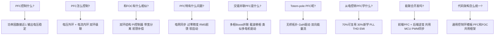

# SYS-03 PFC控制 vs 电机控制：跨领域方法论

- **模块编号：** SYS-03
- **模块名称：** PFC控制与电机控制的深度对比与知识迁移（PFC vs Motor Control: Cross-Domain Methodology）
- **文档版本：** v2.0
- **适用对象：** 已掌握FOC双环控制，希望拓展至PFC领域或同时开发PFC+电机控制的嵌入式工程师
- **前置知识：** ALG-01 FOC理论基础、ALG-05 有感FOC实现、ADV-ALG-01 控制环带宽设计、ADV-ALG-13 PID结构选择与深度整定
- **难度等级：** 

---

## 1. 核心摘要

- **一句话：** PFC和电机控制共享同一套双环控制方法论——外环管慢变量、内环管快变量、PI控制器是核心引擎——区别仅在于被控对象的物理本质不同：PFC控制的是电感电流跟踪正弦参考，FOC控制的是电机绕组电流跟踪旋转磁场。

- **认知挂钩：** 把PFC想象成"电网的FOC"——电网电压是"转子位置"，电感电流是"相电流"，电压外环是"速度环"，电流内环是"电流环"。如果你会调FOC，你就已经会了PFC 70%的内容。剩下的30%是PFC特有的：电网同步（类似PLL锁相环）、输入电压前馈、过零畸变处理、THD优化。

- **核心问题链：**



- **PFC vs FOC 核心对比速查表：**

| 对比维度 | PFC (Boost PFC) | FOC (PMSM) | 相似度 |
|---------|----------------|------------|--------|
| 外环 | 电压环（控制$V_{dc}$） | 速度环（控制$\omega$） | 高 |
| 内环 | 电流环（跟踪正弦参考） | 电流环（跟踪dq直流参考） | 高 |
| 外环被控对象 | $C_{out}$ + 负载 | $J$ + 摩擦 | 中 |
| 内环被控对象 | Boost电感$L$ | 电机绕组$L_s$ | 高 |
| 参考信号 | 半波正弦 | 直流（dq坐标系） | 低 |
| 前馈 | 输入电压前馈 | 反EMF前馈 | 高 |
| 同步需求 | 电网锁相(PLL) | 转子位置(编码器/观测器) | 中 |
| 采样同步 | PWM中心采样 | PWM中心采样 | 高 |
| 保护 | OVP/UVP/OCP | OVP/UVP/OCP/OTP | 高 |
| 关键指标 | PF > 0.99, THD < 5% | 转矩脉动 < 2% | - |

---

## 2. PFC控制结构

### 2.1 Boost PFC基本拓扑

Boost PFC是最常见的单相有源功率因数校正拓扑，其主电路结构如下：

```text
         L (Boost电感)     D (快恢复二极管)
  Vac ───┤├──────┬─────────►|──────┬─── Vdc (+)
         │      │ S1(MOSFET)│     │
         │      └────┤├─────┘    C (输出电容)
         │                         │
  N  ─────────────────────────────┴─── Vdc (-)
```

- **工作原理：**
- S1导通时：电感$L$储能，$i_L$上升，二极管D反偏截止
- S1关断时：电感$L$释放能量，$i_L$通过D向输出电容$C$和负载供电
- 通过控制S1的占空比，使电感电流$i_L$的包络跟踪输入电压$v_{in}$的波形

- **Boost PFC的电压增益：**

$$
V_{dc} = \frac{V_{in,peak}}{1 - D}
$$

其中$D$为占空比，$V_{in,peak}$为输入电压峰值。由于$D < 1$，输出电压必须高于输入电压峰值，这是Boost拓扑的固有约束。

- **关键参数设计：**

| 参数 | 设计公式 | 典型值 |
|------|---------|--------|
| Boost电感$L$ | $L = \frac{V_{in,min} \cdot D_{max}}{\Delta i_L \cdot f_{sw}}$ | 0.5 ~ 2 mH |
| 输出电容$C$ | $C = \frac{P_{out}}{2\omega \cdot V_{dc} \cdot \Delta V_{dc}}$ | 220 ~ 680 uF |
| 开关频率$f_{sw}$ | 工程权衡 | 65 ~ 100 kHz |
| 电流纹波$\Delta i_L$ | 通常取峰值电流的10%~20% | - |

### 2.2 双环控制结构

PFC采用经典的电压外环 + 电流内环双环级联结构：

```text
                    ┌─────────────┐
  Vdc_ref ──(+)──►│  电压环PI   │──┐
             │-   │  (慢, ~10Hz) │  │
             │    └─────────────┘  │ I_ref乘法器
             │                     │
  Vdc_fdb ───┘    ┌─────────────┐  │    ┌─────────────┐
                   │  |V_in|     │◄─┼───►│  电流环PI   │──► Duty
  V_in ──────────►│  / V_rms²   │  │    │  (快, ~5kHz) │
                   └─────────────┘  │    └─────────────┘
                                    │          │
  I_L_fdb ──────────────────────────┘──────────┘
  (与PWM同步采样)
```

- **电压外环（慢环）：**

$$
V_{err} = V_{dc,ref} - V_{dc,fdb}
$$

$$
I_{ref,raw} = K_{p,v} \cdot V_{err} + K_{i,v} \cdot \int V_{err}\,dt
$$

- **电流参考生成：**

$$
I_{ref} = I_{ref,raw} \cdot \frac{|v_{in}(t)|}{V_{rms}^2}
$$

这一步是PFC的核心——将电压环输出的直流信号$I_{ref,raw}$与输入电压波形相乘，生成正弦电流参考。除以$V_{rms}^2$是为了补偿电网电压波动，保证功率恒定。

- **电流内环（快环）：**

$$
I_{err} = I_{ref} - I_{L,fdb}
$$

$$
D = K_{p,i} \cdot I_{err} + K_{i,i} \cdot \int I_{err}\,dt
$$

### 2.3 控制目标

PFC的双重控制目标：

1. **功率因数接近1**：使输入电流波形跟踪输入电压波形，相位一致，谐波最小
   - PF > 0.99（满载）
   - THD < 5%（满载），< 10%（半载）

2. **输出电压稳定**：在负载跳变和电网波动下维持$V_{dc}$恒定
   - 稳态精度 < 1%
   - 动态恢复时间 < 100 ms

### 2.4 与FOC双环结构的类比

这是理解PFC最关键的一步——建立与FOC的映射关系：

| PFC概念 | FOC概念 | 映射关系 |
|---------|---------|---------|
| 电压外环 → 控制$V_{dc}$ | 速度外环 → 控制$\omega$ | 外环都是慢变量 |
| 电流内环 → 控制$i_L$ | 电流内环 → 控制$i_d, i_q$ | 内环都是快变量 |
| $V_{dc}$误差 → 产生$I_{ref,raw}$ | $\omega$误差 → 产生$I_{q,ref}$ | 外环输出是内环参考 |
| $I_{ref,raw} \times \|v_{in}\|$ | $I_{q,ref}$（直流） | PFC参考是正弦，FOC参考是直流 |
| 电网电压$v_{in}$ | 转子角度$\theta_e$ | 都是"同步信号源" |
| Boost电感$L$ | 电机电感$L_s$ | 内环被控对象都是L-R |
| 输出电容$C$ | 机械惯量$J$ | 外环被控对象都是积分器 |

> **核心洞察：** PFC的电流内环和FOC的电流内环在数学本质上是相同的——都是控制一个RL电路的电流。区别在于PFC的电流参考是正弦波（跟踪电网），FOC的电流参考是直流（dq坐标系下）。这意味着电流环的PI参数整定方法完全相同！

---

## 3. 与FOC的相似性（深度对比）

### 3.1 双环结构：带宽分离原则

PFC和FOC都遵循相同的带宽分离原则：

$$
f_{bw,outer} \ll f_{bw,inner}
$$

典型带宽分配：

| 控制环 | PFC | FOC | 倍数关系 |
|--------|-----|-----|---------|
| 外环带宽 | 5 ~ 15 Hz | 10 ~ 50 Hz | - |
| 内环带宽 | 2 ~ 10 kHz | 1 ~ 5 kHz | - |
| 内环/外环比 | 200 ~ 1000x | 50 ~ 200x | PFC分离更大 |

**为什么PFC的外环更慢？** 因为PFC输出电容$C$上的电压含有2倍工频纹波（100Hz或120Hz），电压环带宽必须远低于2倍工频，否则电流参考会含有2倍工频分量，导致输入电流畸变。这是PFC特有的约束——FOC的速度环没有类似限制。

- **带宽设计的工程准则：**

$$
f_{bw,voltage} \leq \frac{f_{line}}{10} \approx 5 \sim 6\,\text{Hz}
$$

$$
f_{bw,current} = \frac{f_{sw}}{10} \sim \frac{f_{sw}}{5}
$$

### 3.2 PI控制器：相同的参数整定方法

- **PFC电流环PI整定（与FOC电流环完全相同的方法）：**

Boost电感的电路方程：

$$
V_{in} = L \frac{di_L}{dt} + R_L \cdot i_L + (1-D) \cdot V_{dc}
$$

其中：
- $V_{in}$：输入电压 (V)
- $L$：Boost电感量 (H)
- $i_L$：电感电流 (A)
- $R_L$：电感等效串联电阻 ($\Omega$)
- $D$：开关管占空比
- $V_{dc}$：输出直流母线电压 (V)

忽略电阻$R_L$，电流环被控对象近似为一阶惯性环节：

$$
G_{plant}(s) = \frac{1}{L \cdot s}
$$

采用零极点对消法（与FOC电流环完全一致）：

$$
K_{p,i} = \frac{\omega_{cc} \cdot L}{V_{dc}}, \quad K_{i,i} = \frac{K_{p,i} \cdot R_L}{L}
$$

其中$\omega_{cc} = 2\pi f_{bw,current}$为电流环穿越频率。

> **关键结论：** PFC电流环和FOC电流环的PI整定方法完全相同——都是基于电感参数的零极点对消法。Boost电感的$L$和$R_L$对应电机的$L_s$和$R_s$。

- **PFC电压环PI整定：**

输出侧功率平衡方程（小信号模型）：

$$
C \frac{dv_{dc}}{dt} = \frac{P_{in}}{V_{dc}} - \frac{V_{dc}}{R_{load}}
$$

其中：
- $C$：输出电容 (F)
- $v_{dc}$：输出电压 (V)
- $P_{in}$：输入功率 (W)
- $R_{load}$：等效负载电阻 ($\Omega$)

电压环被控对象近似为：

$$
G_{v}(s) = \frac{1}{C \cdot s}
$$

采用对称最优法（与FOC速度环方法一致）：

$$
K_{p,v} = \frac{C \cdot \omega_{cv}}{K_I}, \quad K_{i,v} = \frac{K_{p,v} \cdot \omega_{cv}}{a}
$$

其中$\omega_{cv}$为电压环穿越频率，$K_I$为电流环增益，$a$为对称最优系数（通常取2或3）。

### 3.3 前馈补偿对比

| 前馈类型 | PFC | FOC | 数学表达 |
|---------|-----|-----|---------|
| 输入/反EMF前馈 | 输入电压前馈 | 反电动势前馈 | PFC: $D_{ff} = 1 - v_{in}/V_{dc}$; FOC: $V_{q,ff} = \omega_e \psi_f$ |
| 交叉解耦 | 无（单相） | dq交叉解耦 | PFC: N/A; FOC: $V_{d,ff} = -\omega_e L_q i_q$ |
| 扰动前馈 | 负载电流前馈 | 转矩前馈 | PFC: $I_{ref} += I_{load}$; FOC: $I_{q,ref} += T_{dist}/K_t$ |

- **PFC输入电压前馈的物理意义：**

稳态时Boost变换器的占空比：

$$
D = 1 - \frac{v_{in}(t)}{V_{dc}}
$$

将此占空比作为前馈量叠加到PI控制器输出上，可以大幅减轻电流环PI的负担——PI只需处理动态偏差，无需跟踪稳态占空比变化。这与FOC中反EMF前馈的作用完全一致：

$$
V_{q,ff} = \omega_e \psi_f
$$

都是把"已知的稳态关系"从PI控制器的负担中剥离出去。

### 3.4 采样时序：PWM同步采样

PFC和FOC都要求电流采样与PWM同步：

```text
PWM:    ┌──┐    ┌──┐    ┌──┐    ┌──┐
        │  │    │  │    │  │    │  │
     ───┘  └────┘  └────┘  └────┘  └───
              ↑                    ↑
           ADC触发              ADC触发
        (PWM中心/谷值)       (PWM中心/谷值)
```

- **PFC采样要点：**
- 电感电流在PWM谷值（开关管导通期间）采样，避免开关噪声
- 输入电压采样需要低通滤波，去除开关频率分量
- 输出电压采样需要低通滤波，去除2倍工频纹波

- **FOC采样要点：**
- 相电流在PWM中心采样，对应平均电流值
- 位置传感器在PWM周期起始或中心读取
- 母线电压采样用于占空比补偿

- **共同原则：** 采样时刻必须远离开关边沿，确保采样值反映真实的平均电流。

### 3.5 保护逻辑对比

| 保护类型 | PFC | FOC | 实现方式 |
|---------|-----|-----|---------|
| 过流保护(OCP) | 电感电流过限 | 相电流过限 | 硬件比较器 + 软件限幅 |
| 过压保护(OVP) | 输出电压过限 | 母线电压过限 | ADC采样 + 软件判断 |
| 欠压保护(UVP) | 输入电压过低 | 母线电压过低 | ADC采样 + 软件判断 |
| 过温保护(OTP) | MOSFET/二极管 | IGBT/MOSFET | NTC + ADC |
| 开路保护 | - | 编码器断线 | 信号合理性检查 |
| 堵转保护 | - | 电机堵转 | 转速/位置监测 |

> **工程经验：** PFC的过流保护比电机控制更严格——电感饱和速度极快（微秒级），一旦过流必须立即关断。电机绕组有更大的热容，过流容忍度更高。因此PFC通常需要硬件比较器实现逐周期限流，而电机控制可以依赖软件限幅。

---

## 4. PFC特有的问题

### 4.1 输入电压前馈

PFC需要实时采样输入电压，用于两个目的：

- **1. 电流参考波形生成：**

$$
I_{ref}(t) = I_{ref,raw} \cdot \frac{|v_{in}(t)|}{V_{rms}^2}
$$

这里$|v_{in}(t)|$提供正弦包络，使电流参考跟踪输入电压波形。

- **2. 占空比前馈：**

$$
D_{ff}(t) = 1 - \frac{|v_{in}(t)|}{V_{dc}}
$$

- **RMS计算方法：**

输入电压有效值$V_{rms}$的计算是PFC特有的需求，常用方法：

**方法一：低通滤波法（简单但有延迟）**

$$
V_{rms} = \sqrt{\frac{1}{T_{line}} \int_0^{T_{line}} v_{in}^2(t)\,dt}
$$

其中：
- $V_{rms}$：输入电压有效值 (V)
- $T_{line}$：电网电压周期 (s)
- $v_{in}(t)$：输入电压瞬时值 (V)

实际实现中用一阶低通滤波器近似：

$$
V_{rms}^2[n] = \alpha \cdot v_{in}^2[n] + (1-\alpha) \cdot V_{rms}^2[n-1]
$$

其中$\alpha$为滤波系数，截止频率需远低于2倍工频。

**方法二：滑动窗口法（精确但占内存）**

$$
V_{rms} = \sqrt{\frac{1}{N} \sum_{k=0}^{N-1} v_{in}^2[n-k]}
$$

存储一个工频周期的采样点，计算精确但需要$N$个存储单元。

**方法三：峰值检测法（最简单但不精确）**

$$
V_{rms} \approx \frac{V_{in,peak}}{\sqrt{2}}
$$

假设输入为理想正弦波，直接用峰值计算。电网畸变时误差大。

### 4.2 过零检测与畸变

- **问题本质：** 输入电压过零附近，Boost变换器的占空比接近1（因为$v_{in} \approx 0$），电感电流上升极慢，无法有效跟踪正弦参考。同时，二极管的反向恢复和死区效应导致电流波形在过零处出现"缺口"。

```text
  i_L参考:    ╱╲         ╱╲
             ╱  ╲       ╱  ╲
  i_L实际:  ╱    ╲     ╱    ╲
           ╱  ┌──╲   ╱  ┌──╲
          ╱   │   ╲ ╱   │   ╲
  ───────╱────┘    V    └────╱──────
              过零畸变区
```

- **过零畸变的成因分析：**

1. **占空比饱和**：$D_{max}$受限（通常<0.95），过零处$D_{required} \to 1$，控制器输出饱和
2. **电感电流断续(DCM)**：轻载时电感电流在过零附近进入DCM，平均电流与占空比的关系变为非线性
3. **二极管反向恢复**：快恢复二极管在过零处反向恢复电荷导致额外电流
4. **采样噪声**：过零处信噪比最低，采样误差最大

- **改善措施：**

| 措施 | 原理 | 效果 |
|------|------|------|
| 增大$D_{max}$ | 允许更大占空比 | 有限改善，受限于最小关断时间 |
| DCM补偿 | 在DCM区域修正占空比计算 | 显著改善轻载THD |
| 斜坡补偿 | 类似电流模式控制的斜坡补偿 | 防止次谐波振荡 |
| 优化采样 | 过零处增加采样滤波 | 减少噪声引起的畸变 |
| GaN器件 | 无反向恢复电荷 | 根本性改善过零畸变 |

### 4.3 电流参考生成详解

PFC电流参考的生成是整个控制系统的核心，完整公式：

$$
I_{ref}(t) = \underbrace{G_v(s) \cdot (V_{dc,ref} - V_{dc,fdb})}_{\text{电压环输出}} \times \underbrace{\frac{|v_{in}(t)|}{V_{rms}^2}}_{\text{波形整形+前馈}}
$$

- **分步解析：**

**Step 1：电压环输出$I_{ref,raw}$**

这是一个缓慢变化的直流信号，代表输入功率需求。负载增大时$I_{ref,raw}$增大，负载减小时$I_{ref,raw}$减小。

**Step 2：乘以$|v_{in}(t)|$——波形整形**

将直流信号调制为正弦半波，使电流参考跟踪电压波形。取绝对值是因为Boost PFC只能处理正极性电流。

**Step 3：除以$V_{rms}^2$——功率前馈**

这是PFC最精妙的设计。当电网电压升高时：
- $|v_{in}(t)|$增大 → 电流参考增大（趋势正确，功率应增加）
- 但$V_{rms}^2$也增大 → 电流参考减小（补偿效果）
- 净效果：电流参考随$1/V_{rms}$变化，保证输入功率恒定

$$
P_{in} = V_{rms} \cdot I_{rms} = V_{rms} \cdot \frac{I_{ref,raw} \cdot V_{rms}}{V_{rms}^2} \cdot \frac{1}{\sqrt{2}} = \frac{I_{ref,raw}}{\sqrt{2}}
$$

与电网电压无关！这就是$V_{rms}^2$前馈的物理意义。

### 4.4 软启动设计

PFC上电时输出电容$C$完全放电，如果直接启动，会产生巨大的冲击电流（仅受电感和线路阻抗限制）。

- **软启动策略：**

```text
  Vdc_ref
    │        ╭──────────────── Vdc_target
    │       ╱
    │      ╱  斜率限制
    │     ╱   (dV/dt ≤ Vdc_ramp_rate)
    │    ╱
    │   ╱
    │  ╱
    │ ╱
    │╱
    └──────────────────────────── 时间
    0
```

- **实现方式：**

```c
/**
 * @brief  PFC软启动斜坡
 * @param  pfc: PFC控制器结构体
 * @retval 无
 */
void PFC_SoftStart(PFC_Controller_t *pfc)
{
    if (pfc->state == PFC_STATE_SOFTSTART) {
        /* 电压参考缓慢上升 */
        pfc->vdc_ref += pfc->vdc_ramp_rate * pfc->ts;

        /* 到达目标值后切换到正常运行 */
        if (pfc->vdc_ref >= pfc->vdc_target) {
            pfc->vdc_ref = pfc->vdc_target;
            pfc->state = PFC_STATE_RUNNING;
        }
    }
}
```

- **软启动参数设计：**

$$
t_{ramp} = \frac{V_{dc,target}}{dV/dt}
$$

典型启动时间1~3秒。过快会导致冲击电流过大，过慢影响用户体验。

- **与电机软启动的类比：** 电机控制中速度环也有类似的斜坡启动——速度参考从0缓慢上升到目标值，避免电流冲击。两者本质相同：限制外环参考的变化率，从而限制内环的动态电流需求。

---

## 5. 交错并联PFC

### 5.1 多相Boost PFC并联

当单相Boost PFC的电流容量不足时，采用多相交错并联结构：

```text
  Vac ───┬── L1 ── S1 ── D1 ──┬─── Vdc (+)
         │                     │
         ├── L2 ── S2 ── D2 ──┤
         │                     │
         └── L3 ── S3 ── D3 ──┤    C
                               │
  N ───────────────────────────┴─── Vdc (-)
```

- **交错并联的优势：**

1. **输入电流纹波减小**：多相电流纹波相互抵消
2. **热分布均匀**：功率分散到多个开关管
3. **电感体积减小**：每相电感只需处理1/N的功率
4. **滤波器简化**：输入EMI滤波器可以更小

### 5.2 载波移相技术

N相交错并联时，各相载波错开$360°/N$：

```text
2相交错 (移相180°):
  Phase1: ┌─┐  ┌─┐  ┌─┐  ┌─┐
          │ │  │ │  │ │  │ │
       ───┘ └──┘ └──┘ └──┘ └───
  Phase2:   ┌─┐  ┌─┐  ┌─┐  ┌─┐
            │ │  │ │  │ │  │ │
       ─────┘ └──┘ └──┘ └──┘ └─

3相交错 (移相120°):
  Phase1: ┌─┐    ┌─┐    ┌─┐
          │ │    │ │    │ │
       ───┘ └────┘ └────┘ └───
  Phase2:   ┌─┐    ┌─┐    ┌─┐
            │ │    │ │    │ │
       ─────┘ └────┘ └────┘ └─
  Phase3:     ┌─┐    ┌─┐
              │ │    │ │
       ───────┘ └────┘ └──────
```

- **纹波抵消效果：**

对于N相交错并联，输入电流纹波频率提高为$N \cdot f_{sw}$，纹波幅值最大可降低至单相的$1/N$（在50%占空比附近）。

纹波抵消系数：

$$
\text{Ripple Reduction} = \frac{\Delta I_{N-phase}}{\Delta I_{1-phase}} = \frac{1}{N} \cdot \left| \frac{\sin(N\pi D)}{N \sin(\pi D)} \right|
$$

其中：
- $\Delta I_{N-phase}$：N相交错并联总电流纹波 (A)
- $\Delta I_{1-phase}$：单相电流纹波 (A)
- $N$：交错并联相数
- $D$：占空比

### 5.3 与多电机驱动的类比

| 交错并联PFC | 多电机驱动 | 类比关系 |
|------------|-----------|---------|
| 多相Boost电感 | 多台电机 | 多个被控对象 |
| 载波移相 | 载波移相 | 完全相同的PWM技术 |
| 均流控制 | 均流/均转矩控制 | 保证各相/各机均衡 |
| 总电流 = 各相之和 | 总转矩 = 各机之和 | 并联叠加 |
| 各相独立电流环 | 各机独立电流环 | 内环独立 |
| 共用电压环 | 共用速度/位置主控 | 外环统一 |

- **均流控制策略：**

```c
/**
 * @brief  交错并联PFC均流控制
 * @param  pfc: PFC控制器数组
 * @param  num_phases: 相数
 * @retval 无
 */
void PFC_BalanceCurrent(PFC_Phase_t *pfc, uint8_t num_phases)
{
    float i_avg = 0.0f;

    /* 计算平均电流 */
    for (uint8_t i = 0; i < num_phases; i++) {
        i_avg += pfc[i].i_L;
    }
    i_avg /= num_phases;

    /* 各相电流偏差补偿 */
    for (uint8_t i = 0; i < num_phases; i++) {
        float i_err = i_avg - pfc[i].i_L;
        /* 小增益PI补偿，避免影响主控制环 */
        pfc[i].duty_offset += pfc[i].balance_kp * i_err
                            + pfc[i].balance_ki * i_err * pfc[i].ts;
        /* 限幅 */
        pfc[i].duty_offset = CLAMP(pfc[i].duty_offset,
                                    -DUTY_OFFSET_MAX, DUTY_OFFSET_MAX);
    }
}
```

---

## 6. Totem-pole PFC

### 6.1 无桥PFC拓扑

Totem-pole PFC是新一代无桥PFC拓扑，消除了传统Boost PFC中整流桥的导通损耗：

```text
         L (Boost电感)
  Vac ───┤├──────┬──────────────┬─── Vdc (+)
         │      │              │
         │    S1(GaN)        S3(GaN)
         │      │  (高速桥臂)  │
         │      ├──────┬───────┤
         │      │      │       │
         │    S2(GaN)        S4(GaN)
         │      │  (低速桥臂)  │
         │      │              │
  N  ────┴──────┴──────────────┴─── Vdc (-)
```

- **工作模式：**

| 工频半周 | 低速桥臂 | 高速桥臂 | 功能 |
|---------|---------|---------|------|
| $v_{in} > 0$ | S4导通 | S1/S2高频切换 | Boost升压 |
| $v_{in} < 0$ | S2导通 | S3/S4高频切换 | Boost升压 |

- **与传统Boost PFC的效率对比：**

| 拓扑 | 导通路径 | 导通损耗 | 效率(3.3kW) |
|------|---------|---------|-------------|
| 传统Boost PFC | 整流桥(2×二极管) + MOSFET + 二极管 | 高 | ~97% |
| Totem-pole PFC | 1×GaN(低速) + 1×GaN(高速) | 低 | ~99% |

### 6.2 GaN器件的优势

Totem-pole PFC必须使用GaN（氮化镓）或SiC器件，原因：

- **反向恢复电荷问题：**

传统Si MOSFET的体二极管具有较大的反向恢复电荷$Q_{rr}$（数百nC到uC级别），在高速桥臂换流时会产生巨大的反向恢复电流，导致：
- 开关损耗急剧增加
- 严重的EMI问题
- 器件可能损坏

GaN HEMT的优势：
- **零反向恢复电荷**：$Q_{rr} \approx 0$，因为GaN没有体二极管
- **极低开关损耗**：$C_{oss}$小，开关速度快（dv/dt可达100 V/ns）
- **零输出电荷$Q_{oss}$小**：降低了开关损耗

$$
E_{sw,loss} = \frac{1}{2} C_{oss} \cdot V_{ds}^2 + Q_{rr} \cdot V_{ds}
$$

其中：
- $E_{sw,loss}$：单次开关损耗能量 (J)
- $C_{oss}$：器件输出电容 (F)
- $V_{ds}$：漏源电压 (V)
- $Q_{rr}$：反向恢复电荷 (C)

对于GaN：$Q_{rr} = 0$，第二项消失。

### 6.3 双向运行能力

Totem-pole PFC天然支持双向能量流——这是传统Boost PFC无法实现的：

- **正向（PFC模式）：** 交流 → 直流，功率从电网流向负载

- **反向（逆变模式）：** 直流 → 交流，功率从直流侧回馈电网

控制上只需改变电流参考的极性：

```c
if (power_direction == FORWARD) {
    i_ref = i_voltage_loop_output * |v_in| / v_rms_sq;
} else {
    /* 逆变模式：电流参考取反 */
    i_ref = -i_voltage_loop_output * |v_in| / v_rms_sq;
}
```

### 6.4 与电机驱动双向能量流的类比

| 特性 | Totem-pole PFC | 电机驱动逆变器 | 类比 |
|------|---------------|--------------|------|
| 正向能量流 | AC→DC (整流) | DC→AC (电动) | 电源侧供电 |
| 反向能量流 | DC→AC (逆变) | AC→DC (制动回馈) | 能量回馈 |
| 双向开关 | GaN半桥 | IGBT/MOSFET半桥 | 相同拓扑 |
| 控制切换 | PFC  逆变 | 电动  制动 | 模式切换 |
| 典型应用 | V2G、储能 | 伺服制动、电梯 | 能量管理 |

> **工程洞察：** 变频器系统中，前端Totem-pole PFC + 后端电机逆变器，天然构成了AC→DC→AC的完整能量链。制动时电机回馈能量通过逆变器充入母线电容，PFC检测到母线电压升高后切换到逆变模式，将能量回馈电网。这就是"主动前端(AFE)"的概念。

### 6.5 控制复杂度对比

| 控制维度 | 传统Boost PFC | Totem-pole PFC | 复杂度增加 |
|---------|--------------|----------------|-----------|
| 电流环 | 1个PI | 1个PI | 相同 |
| 电压环 | 1个PI | 1个PI | 相同 |
| 电网同步 | 过零检测 | PLL锁相环 | 增加 |
| 换流逻辑 | 无 | 工频半周切换 | 增加 |
| 死区补偿 | 简单 | 复杂（双向） | 增加 |
| 电流采样 | 1路 | 1~2路 | 略增 |
| 保护逻辑 | OVP/OCP | OVP/OCP + 换流保护 | 增加 |

---

## 7. 从电控转PFC需要学什么

### 7.1 知识迁移全景图

```text
┌─────────────────────────────────────────────────────┐
│                   可直接复用 (70%)                    │
│  ┌──────────┐ ┌──────────┐ ┌──────────┐ ┌────────┐ │
│  │ PI控制器  │ │ PWM配置  │ │ ADC采样  │ │ 保护逻辑│ │
│  └──────────┘ └──────────┘ └──────────┘ └────────┘ │
│  ┌──────────┐ ┌──────────┐ ┌──────────┐ ┌────────┐ │
│  │ DMA传输  │ │ 双环设计 │ │ 前馈补偿 │ │ 状态机 │ │
│  └──────────┘ └──────────┘ └──────────┘ └────────┘ │
├─────────────────────────────────────────────────────┤
│                   需要新学 (30%)                      │
│  ┌──────────┐ ┌──────────┐ ┌──────────┐ ┌────────┐ │
│  │ 电网PLL  │ │ PF/THD   │ │ EMI滤波  │ │ 安规   │ │
│  └──────────┘ └──────────┘ └──────────┘ └────────┘ │
│  ┌──────────┐ ┌──────────┐ ┌──────────┐            │
│  │ RMS计算  │ │ 过零处理 │ │ 电感设计 │            │
│  └──────────┘ └──────────┘ └──────────┘            │
└─────────────────────────────────────────────────────┘
```

### 7.2 新知识详解

**1. 电网同步（PLL锁相环）**

PFC需要精确获取电网电压的相位和频率，用于：
- 生成电流参考的正弦波形
- 过零切换（Totem-pole PFC）
- 频率自适应

- **SOGI-PLL（二阶广义积分器锁相环）：**

这是PFC中最常用的电网同步方法，与电机控制中的PLL有相似之处但更复杂：

$$
\text{SOGI传递函数：} \quad G_{SOGI}(s) = \frac{\omega' k s}{s^2 + \omega' k s + \omega'^2}
$$

其中$\omega'$为估计的电网角频率，$k$为阻尼系数。

```text
  v_in ──(+)──► SOGI ──► v_alpha' ──► Park ──► Vd, Vq
          │-                                 │
          │          ┌──────────┐            │
          └──────────┤  PI控制器 ├◄── Vq ────┘
                     └────┬─────┘
                          │ ω' (估计频率)
                     ┌────┴─────┐
                     │  积分器   │
                     └────┬─────┘
                          │ θ' (估计相位)
```

- **与电机PLL的对比：**

| 特性 | 电网SOGI-PLL | 电机PLL（高频注入/滑模） |
|------|-------------|----------------------|
| 被跟踪信号 | 电网电压（正弦） | 转子位置（非正弦） |
| 频率范围 | 45~65 Hz（窄） | 0~数千Hz（宽） |
| 动态要求 | 慢（电网频率稳定） | 快（电机加减速） |
| 实现复杂度 | 中等 | 高 |
| 关键挑战 | 电网谐波、不平衡 | 低速观测、噪声 |

**2. 功率因数定义与THD要求**

- **功率因数（PF）定义：**

$$
PF = \frac{P}{S} = \frac{\text{有功功率}}{\text{视在功率}} = \frac{V_1 I_1 \cos\varphi_1}{V_{rms} I_{rms}} = \underbrace{\cos\varphi_1}_{\text{位移因数}} \times \underbrace{\frac{I_1}{I_{rms}}}_{\text{畸变因数}}
$$

其中$I_1$为基波电流有效值，$I_{rms}$为总电流有效值。

- **总谐波畸变（THD）定义：**

$$
THD = \frac{\sqrt{\sum_{n=2}^{\infty} I_n^2}}{I_1} \times 100\%
$$

其中：
- $I_n$：第$n$次谐波电流有效值 (A)
- $I_1$：基波电流有效值 (A)

- **PF与THD的关系：**

$$
PF = \frac{\cos\varphi_1}{\sqrt{1 + THD^2}}
$$

当$\varphi_1 = 0$（位移因数为1）时：

$$
PF = \frac{1}{\sqrt{1 + THD^2}}
$$

| THD | PF |
|-----|-----|
| 0% | 1.000 |
| 5% | 0.999 |
| 10% | 0.995 |
| 20% | 0.981 |
| 30% | 0.958 |

- **标准要求：**

| 标准 | 适用功率 | PF要求 | THD要求 |
|------|---------|--------|---------|
| IEC 61000-3-2 | < 16A/相 | 特定谐波限值 | 各次谐波分别限制 |
| IEC 61000-3-12 | 16A~75A/相 | PF > 0.95 | THD < 15% |
| GB 17625.1 | 对应IEC 61000-3-2 | 同上 | 同上 |

**3. EMI滤波设计**

PFC的EMI滤波比电机驱动更关键——因为PFC直接连接电网，传导EMI必须满足标准：

- **传导EMI标准：**

| 频段 | EN 55032 Class B (民用) | EN 55032 Class A (工业) |
|------|------------------------|------------------------|
| 150 kHz ~ 500 kHz | 56 ~ 46 dBuV | 73 dBuV |
| 500 kHz ~ 5 MHz | 46 dBuV | 73 dBuV |
| 5 MHz ~ 30 MHz | 50 dBuV | 73 dBuV |

- **EMI滤波器典型结构：**

```text
  电网 ── L_CM ── C_X1 ── L_DM ── C_X2 ── PFC输入
         │                │              │
        C_Y              C_Y            C_Y
         │                │              │
        PE               PE             PE
```

- $L_{CM}$：共模电感，抑制共模噪声
- $L_{DM}$：差模电感，抑制差模噪声
- $C_X$：X电容（跨接L-N），抑制差模噪声
- $C_Y$：Y电容（L-PE, N-PE），抑制共模噪声

- **与电机驱动的EMI对比：** 电机驱动的EMI主要影响的是电机端（辐射EMI），而PFC的EMI直接影响电网（传导EMI），法规要求更严格。

**4. 安规要求**

PFC直接连接电网，必须满足安规标准：

| 安规维度 | 标准 | 关键要求 |
|---------|------|---------|
| 电气安全 | IEC 62368-1 | 绝缘、耐压、漏电流 |
| Y电容限制 | IEC 62368-1 | 漏电流 < 3.5mA (Class B) |
| 浪涌抗扰 | IEC 61000-4-5 | 1~4 kV浪涌测试 |
| 电压暂降 | IEC 61000-4-11 | 电压跌落/中断测试 |

### 7.3 可复用知识详解

**1. PI控制器——完全复用**

PFC的PI控制器与FOC的PI控制器在代码层面完全相同：

```c
/**
 * @brief  通用PI控制器（PFC和FOC共用）
 * @param  pi: PI结构体指针
 * @param  ref: 参考值
 * @param  fdb: 反馈值
 * @retval 控制器输出
 */
float PI_Execute(PI_Controller_t *pi, float ref, float fdb)
{
    float err = ref - fdb;

    /* 比例项 */
    float p_out = pi->kp * err;

    /* 积分项（带抗饱和） */
    pi->integral += pi->ki * err * pi->ts;

    /* 积分限幅 */
    pi->integral = CLAMP(pi->integral, pi->out_min, pi->out_max);

    /* 输出 */
    float out = p_out + pi->integral;

    /* 输出限幅 */
    out = CLAMP(out, pi->out_min, pi->out_max);

    /* Back-calculation抗积分饱和 */
    if (out != p_out + pi->integral) {
        pi->integral -= pi->kb * (out - p_out - pi->integral);
    }

    return out;
}
```

**2. PWM配置——高度复用**

PFC的PWM配置与电机驱动的PWM配置非常相似：

| PWM参数 | PFC | FOC | 差异 |
|---------|-----|-----|------|
| 中心对齐模式 | 是 | 是 | 相同 |
| 死区时间 | 0（单管）或与FOC相同（Totem-pole） | 有 | Totem-pole需要 |
| ADC触发 | PWM中心 | PWM中心 | 相同 |
| 频率 | 65~100 kHz | 10~20 kHz | PFC更高 |
| 载波移相 | 交错并联需要 | 多电机需要 | 相同技术 |

**3. ADC采样与DMA——完全复用**

```c
/**
 * @brief  ADC采样配置（PFC和FOC共用框架）
 *         PFC: 采样电感电流、输入电压、输出电压
 *         FOC: 采样相电流、母线电压、温度
 */
typedef struct {
    float   i_sample;       /* 电流采样值 */
    float   v_sample;       /* 电压采样值 */
    float   aux_sample;     /* 辅助采样（温度/位置等） */
    uint8_t adc_done;       /* ADC完成标志 */
} ADC_Sample_t;
```

**4. 保护逻辑——框架复用**

```c
/**
 * @brief  通用保护检测（PFC和FOC共用框架）
 */
typedef struct {
    float   ocp_threshold;      /* 过流阈值 */
    float   ovp_threshold;      /* 过压阈值 */
    float   uvp_threshold;      /* 欠压阈值 */
    float   otp_threshold;      /* 过温阈值 */
    uint8_t fault_flags;        /* 故障标志位 */
} Protection_t;
```

### 7.4 控制理论迁移

- **双环设计方法直接适用：**

| 设计步骤 | PFC | FOC | 迁移难度 |
|---------|-----|-----|---------|
| 内环被控对象建模 | $G(s) = 1/(Ls)$ | $G(s) = 1/(L_s s)$ | 零 |
| 内环PI整定 | 零极点对消 | 零极点对消 | 零 |
| 外环被控对象建模 | $G(s) = 1/(Cs)$ | $G(s) = 1/(Js)$ | 零 |
| 外环PI整定 | 对称最优法 | 对称最优法 | 零 |
| 带宽分离设计 | $f_{outer} \ll f_{inner}$ | $f_{outer} \ll f_{inner}$ | 零 |
| 前馈补偿设计 | 占空比前馈 | 反EMF前馈 | 低 |
| 稳定性分析 | Bode图/Nyquist | Bode图/Nyquist | 零 |

> **结论：** 从控制理论角度，PFC和FOC的设计方法完全一致。掌握FOC双环设计的工程师，只需理解PFC特有的信号处理（RMS计算、波形整形）和电网交互（PLL、安规），即可快速上手PFC开发。

### 7.5 硬件差异

| 硬件维度 | PFC | 电机控制 | 差异分析 |
|---------|-----|---------|---------|
| 储能元件 | Boost电感$L$ | 电机绕组$L_s$ | PFC电感需专门设计，电机绕组已固定 |
| 开关器件 | MOSFET/GaN + 快恢复二极管 | IGBT/MOSFET + 体二极管 | PFC需外部二极管，电机用体二极管 |
| 电流传感器 | 1路（电感电流） | 2~3路（相电流） | PFC传感器更少 |
| 电压传感器 | 2~3路（输入/输出/母线） | 1路（母线） | PFC需要更多电压采样 |
| 散热需求 | 中等（效率高） | 较高（损耗大） | 电机驱动散热更关键 |
| EMI滤波 | 必须满足传导EMI标准 | 辐射EMI为主 | PFC的EMI要求更严格 |
| 安规认证 | 必须通过（连接电网） | 部分需要 | PFC安规要求更高 |
| 电感设计 | 独立设计，需考虑饱和 | 绕组已定，需考虑温升 | PFC电感设计自由度更大 |

- **Boost电感设计 vs 电机绕组参数：**

| 参数 | Boost电感设计 | 电机绕组参数 |
|------|-------------|------------|
| 电感量 | 根据纹波电流要求计算 | 由电机结构决定 |
| 饱和电流 | 必须大于峰值电流+纹波 | 由磁路设计决定 |
| 磁芯材料 | 铁硅铝/铁粉芯（分布式气隙） | 硅钢片（电机铁芯） |
| 铜损 | $I_{rms}^2 \cdot R_{dc}$ | $I_{rms}^2 \cdot R_s$ |
| 铁损 | Steinmetz方程计算 | 铁耗模型计算 |
| 温升 | 需计算并验证 | 电机热模型 |

---

## 8. PFC与电控的联合开发

### 8.1 变频器中的PFC：前端PFC + 后端逆变器

工业变频器的典型架构：

```text
  电网 ──► PFC级 ──► 母线电容 ──► 逆变器 ──► 电机
         (AC→DC)    (C_bus)    (DC→AC)
```

**为什么需要PFC？**
- 没有PFC时，整流桥+电容的输入电流为窄脉冲，PF仅0.5~0.7
- 谐波电流污染电网，不满足IEC 61000-3-12标准
- PFC将PF提升至0.99以上，同时稳定母线电压

- **功率等级与拓扑选择：**

| 功率等级 | PFC拓扑 | 逆变器拓扑 | 典型应用 |
|---------|---------|-----------|---------|
| < 1 kW | 单相Boost PFC | 三相半桥 | 家电变频 |
| 1~5 kW | 单相交错PFC | 三相半桥 | 空调压缩机 |
| 5~20 kW | 三相Vienna | 三相半桥 | 工业变频器 |
| > 20 kW | 三相有源前端(AFE) | 三相半桥 | 大功率驱动 |

### 8.2 共用MCU的资源分配

当PFC和电机控制运行在同一MCU上时，资源分配是关键：

- **中断优先级设计：**

| 优先级 | 中断源 | 执行内容 | 频率 |
|--------|--------|---------|------|
| 最高 | PFC PWM中断 | PFC电流环 | 50~100 kHz |
| 高 | 电机PWM中断 | FOC电流环 | 10~20 kHz |
| 中 | 电机速度环 | 速度PI | 1~10 kHz |
| 低 | PFC电压环 | 电压PI | 1~10 kHz |
| 最低 | 通信/显示 | UI/协议 | 100~1000 Hz |

- **关键约束：** PFC的开关频率通常高于电机驱动（65~100 kHz vs 10~20 kHz），这意味着PFC电流环的中断频率更高。如果两个控制环共享同一个PWM定时器，需要仔细设计时序。

**方案一：独立PWM定时器（推荐）**

```text
TIM1 (PFC):  f_sw = 100 kHz, 中心对齐
TIM8 (电机): f_sw = 16 kHz,  中心对齐
ADC1: PFC电流采样，由TIM1触发
ADC2: 电机电流采样，由TIM8触发
```

**方案二：同步PWM（节省资源）**

```yaml
TIM1: f_sw = 100 kHz, 同时驱动PFC和电机
      - PFC: 每个周期执行电流环
      - 电机: 每6个周期执行一次电流环 (100/6 ≈ 16.7 kHz)
```

### 8.3 PFC和电机控制的PWM同步

- **同步约束：**

1. PFC的ADC采样不能被电机PWM中断打断
2. 电机的ADC采样不能被PFC PWM中断打断
3. 两个ADC的采样时刻不能重叠

- **时序设计示例（方案一）：**

```text
TIM1 (PFC, 100kHz, T=10us):
  ┌─┐ ┌─┐ ┌─┐ ┌─┐ ┌─┐ ┌─┐
  │ │ │ │ │ │ │ │ │ │ │ │
  ┘ └─┘ └─┘ └─┘ └─┘ └─┘ └
  ↑ADC1                    (PFC电流采样)

TIM8 (电机, 16.7kHz, T=60us):
  ┌────────┐
  │        │
  ┘        └─────────────
  ↑ADC2                    (电机电流采样)
```

- **中断嵌套策略：**

```c
/**
 * @brief  PFC PWM中断（最高优先级）
 *         不允许被电机中断打断
 */
void TIM1_UP_IRQHandler(void)
{
    /* PFC电流环 */
    PFC_CurrentLoop();

    /* PFC电压环（降频执行） */
    static uint8_t cnt = 0;
    if (++cnt >= PFC_VOLTAGE_LOOP_DIV) {
        cnt = 0;
        PFC_VoltageLoop();
    }
}

/**
 * @brief  电机PWM中断（次高优先级）
 *         可被PFC中断抢占
 */
void TIM8_UP_IRQHandler(void)
{
    /* FOC电流环 */
    FOC_CurrentLoop();

    /* 速度环（降频执行） */
    static uint8_t cnt = 0;
    if (++cnt >= SPEED_LOOP_DIV) {
        cnt = 0;
        FOC_SpeedLoop();
    }
}
```

### 8.4 母线电容的协同设计

PFC和电机控制共享母线电容$C_{bus}$，需要协同设计：

- **PFC对母线电容的要求：**
- 抑制2倍工频纹波：$C_{bus} \geq \frac{P_{out}}{2\omega \cdot V_{dc} \cdot \Delta V_{dc}}$
- 典型值：100~470 uF/kW

- **电机控制对母线电容的要求：**
- 吸收逆变器开关纹波：低ESR/ESL电容（薄膜电容）
- 提供瞬态功率：负载突变时的能量缓冲
- 典型值：10~68 uF/kW（薄膜电容）

- **协同设计要点：**

| 电容类型 | 容值 | 作用 | 位置 |
|---------|------|------|------|
| 电解电容 | 大（470~2200 uF） | 储能、抑制低频纹波 | PFC输出端 |
| 薄膜电容 | 小（1~10 uF） | 抑制高频纹波、低ESR | 逆变器输入端 |
| 陶瓷电容 | 极小（0.1~1 uF） | 去耦、抑制MHz级噪声 | 器件引脚处 |

- **母线电压纹波对电机控制的影响：**

PFC输出电压含有2倍工频纹波（100Hz/120Hz），如果不妥善处理，会通过逆变器耦合到电机电流，产生6倍工频的转矩脉动（$2 \times 3 = 6$，因为三相逆变器将2倍工频调制为6倍）。

- **解决方案：**
1. 增大电解电容，降低纹波
2. 逆变器中增加母线电压前馈补偿
3. PFC电压环带宽足够低，避免2倍工频分量传入电流参考

---

## 9. 代码架构对比

### 9.1 PFC控制环路 vs FOC控制环路

- **PFC控制环路代码结构：**

```c
/**
 * @brief  PFC主控制环路
 * @note   在PFC PWM中断中调用，频率 = f_sw
 */
void PFC_ControlLoop(void)
{
    /*==== 1. 采样与坐标变换 ====*/
    float i_L   = ADC_ToCurrent(ADC1->DR);     /* 电感电流 */
    float v_in  = ADC_ToVoltage(ADC2->DR);      /* 输入电压 */
    float v_dc  = ADC_ToVoltage(ADC3->DR);      /* 输出电压 */

    /*==== 2. 电压外环（降频执行）====*/
    if (++pfc.volt_cnt >= PFC_VOLT_DIV) {
        pfc.volt_cnt = 0;
        float v_err = pfc.vdc_ref - v_dc;
        pfc.i_ref_raw = PI_Execute(&pfc.pi_volt, pfc.vdc_ref, v_dc);
    }

    /*==== 3. 电流参考生成 ====*/
    float v_in_abs = fabsf(v_in);
    float i_ref = pfc.i_ref_raw * v_in_abs / (pfc.v_rms_sq + 1e-6f);

    /*==== 4. 电流内环 ====*/
    float duty = PI_Execute(&pfc.pi_curr, i_ref, i_L);

    /*==== 5. 前馈补偿 ====*/
    float duty_ff = 1.0f - v_in_abs / (v_dc + 1e-6f);
    duty += duty_ff;

    /*==== 6. 占空比限幅 ====*/
    duty = CLAMP(duty, DUTY_MIN, DUTY_MAX);

    /*==== 7. PWM更新 ====*/
    PWM_SetDuty(TIM1, duty);

    /*==== 8. 保护检测 ====*/
    PFC_ProtectionCheck(&pfc, i_L, v_dc, v_in);
}
```

- **FOC控制环路代码结构：**

```c
/**
 * @brief  FOC主控制环路
 * @note   在电机PWM中断中调用，频率 = f_sw
 */
void FOC_ControlLoop(void)
{
    /*==== 1. 采样与坐标变换 ====*/
    float i_a = ADC_ToCurrent(ADC1->DR);
    float i_b = ADC_ToCurrent(ADC2->DR);
    float theta = Encoder_GetAngle();
    float v_dc  = ADC_ToVoltage(ADC3->DR);

    Clarke_Transform(i_a, i_b, &foc.i_alpha, &foc.i_beta);
    Park_Transform(foc.i_alpha, foc.i_beta, theta, &foc.i_d, &foc.i_q);

    /*==== 2. 速度外环（降频执行）====*/
    if (++foc.speed_cnt >= SPEED_LOOP_DIV) {
        foc.speed_cnt = 0;
        foc.i_q_ref = PI_Execute(&foc.pi_speed, foc.speed_ref, foc.speed);
    }

    /*==== 3. 电流内环 ====*/
    float v_d = PI_Execute(&foc.pi_id, foc.i_d_ref, foc.i_d);
    float v_q = PI_Execute(&foc.pi_iq, foc.i_q_ref, foc.i_q);

    /*==== 4. 前馈解耦 ====*/
    float omega_e = foc.speed * foc.pole_pairs * 2.0f * PI;
    v_d -= omega_e * foc.L_q * foc.i_q;        /* d轴交叉解耦 */
    v_q += omega_e * foc.L_d * foc.i_d;        /* q轴交叉解耦 */
    v_q += omega_e * foc.psi_f;                 /* 反EMF前馈 */

    /*==== 5. 反Park变换 + SVPWM ====*/
    float theta_e = theta * foc.pole_pairs;
    InvPark_Transform(v_d, v_q, theta_e, &foc.v_alpha, &foc.v_beta);
    SVPWM_Generate(foc.v_alpha, foc.v_beta, v_dc);

    /*==== 6. 保护检测 ====*/
    FOC_ProtectionCheck(&foc, i_a, i_b, v_dc);
}
```

### 9.2 结构对比分析

| 代码步骤 | PFC | FOC | 相似度 |
|---------|-----|-----|--------|
| 1. 采样 | 1路电流 + 2路电压 | 2路电流 + 1路电压 + 角度 | 中 |
| 2. 外环 | 电压PI → $I_{ref,raw}$ | 速度PI → $I_{q,ref}$ | 高 |
| 3. 参考生成 | $I_{ref} = I_{ref,raw} \times \|v_{in}\| / V_{rms}^2$ | $I_{d,ref} = 0$（恒定） | 低 |
| 4. 内环 | 1个电流PI | 2个电流PI（d/q轴） | 中 |
| 5. 前馈 | 占空比前馈 | dq解耦 + 反EMF前馈 | 高 |
| 6. 输出 | 单路PWM占空比 | SVPWM三相占空比 | 低 |
| 7. 保护 | OVP/OCP/UVP | OCP/OVP/OTP/堵转 | 高 |

- **核心差异：** PFC是单输入单输出（SISO）系统，FOC是多输入多输出（MIMO）系统。PFC只有1个电流环，FOC有2个（d轴和q轴）。PFC的参考是时变正弦信号，FOC的参考是直流信号（在dq坐标系下）。

### 9.3 通用控制环模板

设计一个同时支持PFC和FOC的通用控制环框架：

```c
/**
 * @brief  通用控制环配置
 */
typedef enum {
    CTRL_MODE_PFC,          /* PFC模式 */
    CTRL_MODE_FOC,          /* FOC模式 */
    CTRL_MODE_DUAL          /* PFC + FOC双模式 */
} CtrlMode_e;

/**
 * @brief  通用PI控制器
 */
typedef struct {
    float kp;               /* 比例增益 */
    float ki;               /* 积分增益 */
    float kb;               /* 抗积分饱和增益 */
    float integral;         /* 积分累积值 */
    float out_min;          /* 输出下限 */
    float out_max;          /* 输出上限 */
    float ts;               /* 采样周期 */
} PI_Ctrl_t;

/**
 * @brief  通用外环配置
 */
typedef struct {
    PI_Ctrl_t   pi;         /* 外环PI控制器 */
    float       ref;        /* 外环参考值 */
    float       fdb;        /* 外环反馈值 */
    float       output;     /* 外环输出（= 内环参考的基准） */
    float       ramp_rate;  /* 参考斜坡率（软启动） */
    uint8_t     div;        /* 降频分频系数 */
    uint8_t     cnt;        /* 降频计数器 */
} OuterLoop_t;

/**
 * @brief  通用内环配置
 */
typedef struct {
    PI_Ctrl_t   pi;         /* 内环PI控制器 */
    float       ref;        /* 内环参考值 */
    float       fdb;        /* 内环反馈值 */
    float       output;     /* 内环输出 */
    float       ff;         /* 前馈量 */
} InnerLoop_t;

/**
 * @brief  PFC特有参数
 */
typedef struct {
    float       v_in;       /* 输入电压瞬时值 */
    float       v_in_abs;   /* 输入电压绝对值 */
    float       v_rms_sq;   /* 输入电压RMS平方 */
    float       vdc_ref;    /* 输出电压参考 */
    float       vdc_target; /* 最终目标电压 */
    float       vdc_ramp;   /* 软启动斜坡率 */
    float       duty_ff;    /* 占空比前馈 */
    float       i_ref_raw;  /* 电压环原始输出 */
} PFC_Params_t;

/**
 * @brief  FOC特有参数
 */
typedef struct {
    float       i_d;        /* d轴电流 */
    float       i_q;        /* q轴电流 */
    float       i_d_ref;    /* d轴电流参考 */
    float       i_q_ref;    /* q轴电流参考 */
    float       v_d;        /* d轴电压 */
    float       v_q;        /* q轴电压 */
    float       theta_e;    /* 电角度 */
    float       omega_e;    /* 电角速度 */
    float       psi_f;      /* 永磁体磁链 */
    float       L_d;        /* d轴电感 */
    float       L_q;        /* q轴电感 */
    uint8_t     pole_pairs; /* 极对数 */
} FOC_Params_t;

/**
 * @brief  通用控制器（统一PFC和FOC）
 */
typedef struct {
    CtrlMode_e  mode;               /* 控制模式 */
    OuterLoop_t outer_loop;         /* 外环（电压/速度） */
    InnerLoop_t inner_loop_d;       /* 内环d（PFC: 电流; FOC: d轴电流） */
    InnerLoop_t inner_loop_q;       /* 内环q（PFC: 不使用; FOC: q轴电流） */
    PFC_Params_t pfc;               /* PFC特有参数 */
    FOC_Params_t foc;               /* FOC特有参数 */
    Protection_t protect;           /* 保护配置 */
    float       v_dc;               /* 母线电压 */
    float       ts;                 /* 采样周期 */
} UnifiedCtrl_t;

/**
 * @brief  通用外环执行
 * @param  outer: 外环结构体指针
 * @retval 外环输出
 */
float OuterLoop_Execute(OuterLoop_t *outer)
{
    /* 参考斜坡（软启动） */
    if (outer->ref < outer->output + outer->ramp_rate * outer->pi.ts) {
        outer->output += outer->ramp_rate * outer->pi.ts;
    }

    /* 降频执行 */
    if (++outer->cnt >= outer->div) {
        outer->cnt = 0;
        return PI_Execute(&outer->pi, outer->ref, outer->fdb);
    }
    return outer->pi.integral;  /* 非执行周期保持上次积分值 */
}

/**
 * @brief  通用内环执行
 * @param  inner: 内环结构体指针
 * @retval 内环输出
 */
float InnerLoop_Execute(InnerLoop_t *inner)
{
    float out = PI_Execute(&inner->pi, inner->ref, inner->fdb);
    out += inner->ff;           /* 叠加前馈 */
    return out;
}

/**
 * @brief  统一控制环路入口
 * @param  ctrl: 统一控制器指针
 */
void UnifiedCtrl_Execute(UnifiedCtrl_t *ctrl)
{
    switch (ctrl->mode) {
    case CTRL_MODE_PFC:
        PFC_Loop(ctrl);
        break;
    case CTRL_MODE_FOC:
        FOC_Loop(ctrl);
        break;
    case CTRL_MODE_DUAL:
        PFC_Loop(ctrl);
        FOC_Loop(ctrl);
        break;
    }
}
```

### 9.4 统一框架下的PFC和FOC实现

```c
/**
 * @brief  PFC控制环路（基于统一框架）
 */
void PFC_Loop(UnifiedCtrl_t *ctrl)
{
    /* 采样 */
    float i_L  = ADC_ReadCurrent(PFC_ADC_CH);
    float v_in = ADC_ReadVoltage(VIN_ADC_CH);
    ctrl->v_dc = ADC_ReadVoltage(VDC_ADC_CH);

    /* 外环：电压环 */
    ctrl->outer_loop.fdb = ctrl->v_dc;
    ctrl->pfc.i_ref_raw = OuterLoop_Execute(&ctrl->outer_loop);

    /* 电流参考生成 */
    float v_in_abs = fabsf(v_in);
    ctrl->pfc.v_in_abs = v_in_abs;
    ctrl->inner_loop_d.ref = ctrl->pfc.i_ref_raw
                           * v_in_abs
                           / (ctrl->pfc.v_rms_sq + 1e-6f);

    /* 内环：电流环 */
    ctrl->inner_loop_d.fdb = i_L;
    ctrl->inner_loop_d.ff  = 1.0f - v_in_abs / (ctrl->v_dc + 1e-6f);
    float duty = InnerLoop_Execute(&ctrl->inner_loop_d);

    /* 占空比限幅与PWM更新 */
    duty = CLAMP(duty, DUTY_MIN, DUTY_MAX);
    PWM_SetDuty(PFC_TIM, duty);
}

/**
 * @brief  FOC控制环路（基于统一框架）
 */
void FOC_Loop(UnifiedCtrl_t *ctrl)
{
    /* 采样与坐标变换 */
    float i_a    = ADC_ReadCurrent(PHASE_A_ADC_CH);
    float i_b    = ADC_ReadCurrent(PHASE_B_ADC_CH);
    float theta  = Encoder_GetAngle();

    float i_alpha, i_beta;
    Clarke(i_a, i_b, &i_alpha, &i_beta);

    float i_d, i_q;
    Park(i_alpha, i_beta, theta * ctrl->foc.pole_pairs, &i_d, &i_q);

    /* 外环：速度环 */
    ctrl->outer_loop.fdb = Speed_Calculate(theta);
    ctrl->foc.i_q_ref   = OuterLoop_Execute(&ctrl->outer_loop);

    /* 内环：d轴电流环 */
    ctrl->inner_loop_d.ref = ctrl->foc.i_d_ref;  /* 通常为0 */
    ctrl->inner_loop_d.fdb = i_d;
    ctrl->inner_loop_d.ff  = -ctrl->foc.omega_e * ctrl->foc.L_q * i_q;
    float v_d = InnerLoop_Execute(&ctrl->inner_loop_d);

    /* 内环：q轴电流环 */
    ctrl->inner_loop_q.ref = ctrl->foc.i_q_ref;
    ctrl->inner_loop_q.fdb = i_q;
    ctrl->inner_loop_q.ff  = ctrl->foc.omega_e * ctrl->foc.L_d * i_d
                           + ctrl->foc.omega_e * ctrl->foc.psi_f;
    float v_q = InnerLoop_Execute(&ctrl->inner_loop_q);

    /* 反Park + SVPWM */
    float v_alpha, v_beta;
    InvPark(v_d, v_q, theta * ctrl->foc.pole_pairs, &v_alpha, &v_beta);
    SVPWM(v_alpha, v_beta, ctrl->v_dc);
}
```

---

## 10. 总结与知识迁移路线图

### 10.1 核心结论

1. **PFC和FOC共享同一套双环控制方法论**——外环慢、内环快、PI控制器、带宽分离、前馈补偿——这是控制理论的通用语言，不受被控对象物理本质的限制。

2. **PFC的70%可以直接从FOC迁移**——PI控制器、PWM配置、ADC采样、保护逻辑、状态机设计——代码层面几乎完全复用。

3. **PFC的30%需要新学**——电网同步(PLL)、功率因数/THD指标、EMI滤波设计、安规认证——这些是与电网交互特有的知识。

4. **联合开发的关键是资源分配**——中断优先级、ADC通道分配、PWM同步时序——需要系统级规划。

5. **Totem-pole PFC + 电机逆变器 = 完整的主动前端(AFE)**——这是未来变频器的标准架构，掌握PFC是必经之路。

### 10.2 从电控转PFC的学习路线图

```text
第1周：理解PFC拓扑与控制目标
  ├── Boost PFC工作原理
  ├── 双环控制结构（与FOC类比）
  └── PF和THD的定义与标准

第2周：搭建PFC仿真模型
  ├── MATLAB/Simulink搭建Boost PFC
  ├── 复用FOC的PI整定方法
  └── 验证电流跟踪和电压稳定

第3周：PFC特有问题
  ├── 输入电压前馈与RMS计算
  ├── 过零畸变分析与改善
  ├── 软启动设计
  └── 电网PLL（SOGI-PLL）

第4周：硬件实现
  ├── ADC采样配置（复用FOC框架）
  ├── PWM配置（注意频率差异）
  ├── 保护逻辑实现
  └── 调试与THD优化

第5~6周：联合开发
  ├── PFC + FOC共用MCU
  ├── 中断优先级与时序设计
  ├── 母线电容协同
  └── 系统集成测试
```

### 10.3 推荐参考资料

| 资料 | 内容 | 推荐理由 |
|------|------|---------|
| TI SLUA477B | PFC控制设计指南 | 工程实践性强 |
| Infineon AN2018-07 | 数字PFC实现 | C代码示例丰富 |
| ST AN3327 | STM32 PFC方案 | MCU外设配置详细 |
| UCC28070 datasheet | 交错PFC控制器 | 理解交错并联原理 |
| LMG3410 datasheet | GaN Totem-pole参考设计 | 理解无桥PFC |
| 《电力电子技术》(王兆安) | 理论基础 | 中文教材，系统性强 |
| IEC 61000-3-2/12 | 谐波标准 | 法规依据 |

---

> **模块关联：**
> - ADV-ALG-01 控制环带宽设计（双环带宽分离原则）
> - ADV-ALG-07 前馈解耦与扰动补偿（前馈补偿方法论）
> - ADV-ALG-13 PID结构选择与深度整定（PI参数整定方法）
> - ADV-HW-01 PWM与电流采样（采样同步技术）
> - ALG-01 FOC理论基础（双环控制基础）

###  hpm_MC 工程关联

**hpm_mcl_v2 架构方法论**:
- 分层设计: 应用层→Core层→驱动层→硬件加速层→HAL层（五层架构）
- 面向对象设计: `mcl_loop_t` 聚合体 + `mcl_control_method_t` 函数指针表（策略模式）
- 统一调度: 6种运行模式由单一 `hpm_mcl_loop()` 调度
- 编译时配置: `hpm_mcl_cfg.h` 宏配置控制特性使能（死区补偿/dq解耦/角度预测/无感SMC）
- API 版本管理: v1.9.0→v1.10.0 新增 hw_loop 参数，宏重载保证向后兼容

参考: `SDK-01-HPM-MC-Architecture.md` — 完整架构分析

>  检验你的理解：[SYS-03 检验题目](./SYS-03-assessment.md)
