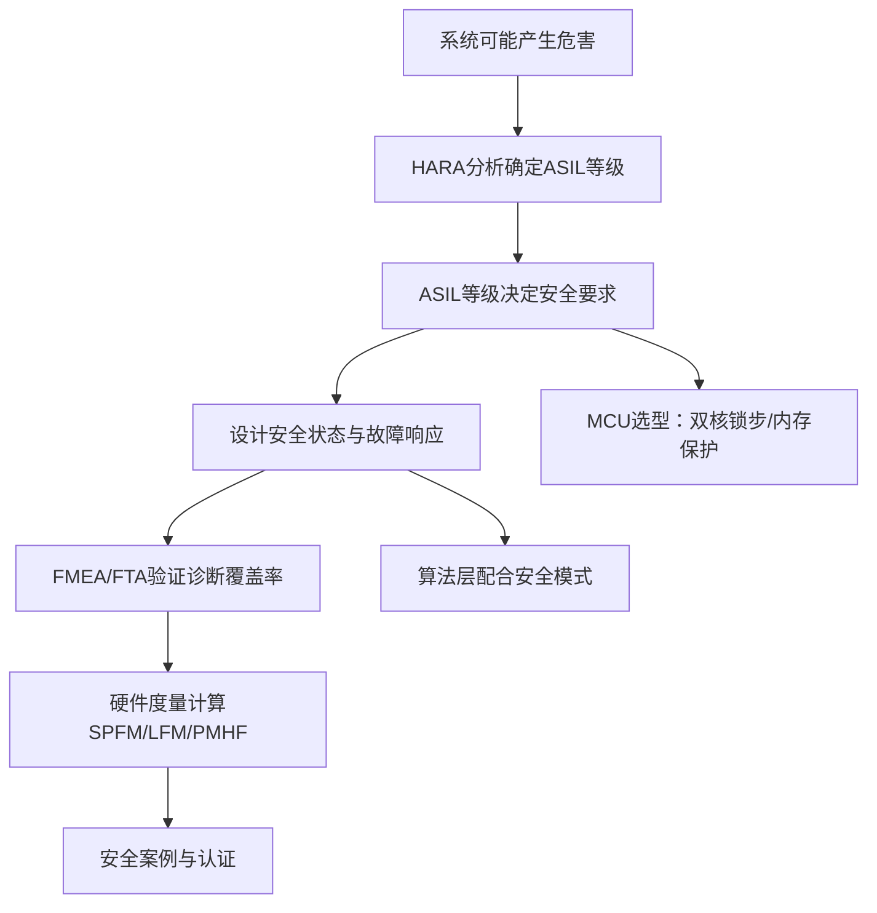
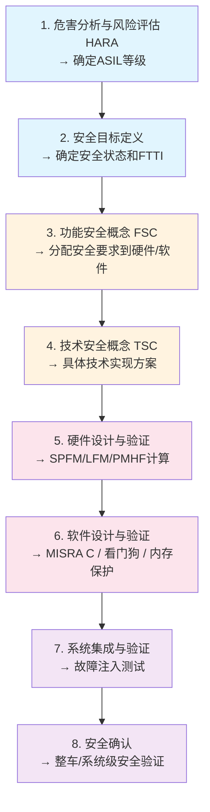
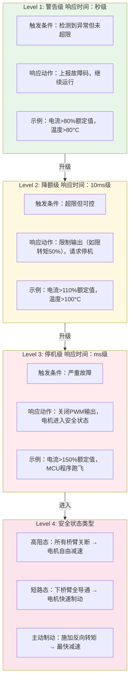

# SYS-05 功能安全：电控系统的生命线

- **模块编号：** SYS-05
- **模块名称：** 功能安全——电控系统的生命线（Functional Safety in Motor Control Systems）
- **文档版本：** v1.0
- **适用对象：** 具备电机控制基础的嵌入式工程师，需了解ISO 26262/IEC 61508基本概念
- **前置知识：** SYS-01 设计模式（状态机与故障处理）、ALG-15 保护优化、MC-LIB架构
- **难度等级：**  

**副标题：从ISO 26262到工程实践，理解安全不是"加个保险丝"**

---

## 1.  核心摘要  

**一句话讲清楚**：功能安全不是"加个保险丝"或"写个保护函数"，而是一套系统化的工程方法论——从危害分析确定安全等级，到安全状态设计实现故障响应，到硬件度量验证诊断覆盖率，每一步都有标准可依、有数据可查。

**认知挂钩**：很多人以为过流保护就是"电流超限就停机"，**这是致命简化！** 功能安全要求你回答：过流检测的延迟是多少？误检率多高？检测失效了怎么办？停机后电机是否进入安全状态（高阻/短路/制动）？这些问题不回答，你的"保护"在安全审计面前一文不值。

**与算法的关联**：
-  ASIL等级→决定是否需要双核锁步→影响MCU选型
-  安全状态→控制算法必须配合进入安全模式→影响状态机设计
-  故障检测→算法层需要参与（如电流采样合理性检查）→影响代码架构
-  看门狗→关键控制循环必须喂狗→影响任务调度

**核心问题链**：



**功能安全速查表**：

| 安全概念 | 电机控制场景 | 核心度量 | 解决的痛点 |
|---------|-------------|---------|-----------|
| ASIL等级 | 非预期加速=ASIL-D | S×E→C矩阵 | 安全投入不够或过度 |
| 安全状态 | 过流→高阻/短路制动 | 响应时间<ms级 | "关PWM"不等于安全 |
| 诊断覆盖率 | 电流采样偏移检测 | DC=90%/99% | 保护措施是否充分 |
| 硬件度量 | SPFM/LFM/PMHF | ≥97%/≥80%/<10⁻⁷/h | 量化残余风险 |
| 看门狗 | 程序跑飞检测 | 窗口/问答式 | MCU失控无感知 |
| 冗余设计 | 双核锁步/双路采样 | 输出比较一致 | 单点故障致命 |

---

## 2.  问题引入

### 工程师的真实困惑

**困惑1**：客户要求ASIL-C，我该怎么做？
> 很多工程师拿到需求后直接开始"加保护"，但ASIL-C首先要求你做HARA分析、定义安全目标、确定安全状态，然后才是具体的硬件/软件设计。跳过分析直接设计，等于在沙滩上建房子。

**困惑2**：过流保护到底是硬件做还是软件做？
> 答案是"都要做"。硬件比较器提供微秒级快速保护（诊断覆盖率约60%），软件过流检测提供可编程阈值和延时确认（诊断覆盖率约90%），两者组合才能达到ASIL-B/C要求的>97%诊断覆盖率。

**困惑3**：安全认证到底要准备什么材料？
> 安全案例（Safety Case）是核心文档，包含：危害分析报告、安全目标定义、FMEA/FTA报告、硬件度量计算报告、软件安全需求追溯矩阵、测试报告。不是写几页PPT就能糊弄的。

**困惑4**：双核锁步到底锁什么？为什么普通MCU不行？
> 双核锁步是两个相同的CPU核执行相同的指令流，每个时钟周期比较输出。一旦不一致，立即触发安全机制。普通MCU只有一个核，CPU内部寄存器损坏无法自检——这就是单点故障，ASIL-D不允许存在未检测的单点故障。

### 核心问题

功能安全的核心不是"怎么加保护"，而是**"怎么证明保护足够"**。这要求工程师从"我加了过流保护"的思维，转变为"我能证明过流保护的诊断覆盖率≥97%，且检测失效时系统仍能进入安全状态"。

---

## 3.  直观理解

### 安全等级类比

把ASIL等级想象成"出事的严重程度+出事的概率"：

| ASIL等级 | 生活类比 | 电机控制场景 | 后果 |
|---------|---------|-------------|------|
| QM | 车载收音机杂音 | 风机转速波动 | 无安全影响 |
| ASIL-A | 刮水器失灵 | 仪表显示异常 | 轻微不便 |
| ASIL-B | 转向助力突然变大 | 转矩突变 | 有一定危险 |
| ASIL-C | 动力转向突然锁死 | 非预期转向 | 严重危险 |
| ASIL-D | 刹车助力突然消失 | 非预期加速 | 致命危险 |

**关键认知**：ASIL等级不是由你的产品决定的，而是由**危害场景**决定的。同一个电机控制器，用在风扇上是QM，用在电动车上就是ASIL-D。

### 安全状态类比

把安全状态想象成"出了事怎么办"：

| 安全状态 | 汽车类比 | 电机控制类比 | 执行时间要求 |
|---------|---------|-------------|------------|
| 警告 | 仪表盘亮黄灯 | 上报故障码，继续运行 | 秒级 |
| 降额 | 限速30km/h | 限制输出转矩50% | 10ms级 |
| 停机 | 靠边停车熄火 | 关闭PWM，电机自由减速 | ms级 |
| 安全状态 | 汽车的"紧急车道" | 主动制动→高阻/短路 | μs~ms级 |

**关键认知**：安全状态不是"关PWM"就完事。电动汽车非预期加速时，直接关PWM（高阻态）意味着电机自由滑行——车辆仍在高速运动！正确的安全状态是：先施加制动转矩→减速到安全速度→再关PWM→进入高阻态。

---

## 4.  技术原理

### 4.1 功能安全标准框架

#### ISO 26262（汽车）vs IEC 61508（通用工业）

| 维度 | ISO 26262 | IEC 61508 |
|------|-----------|-----------|
| 适用领域 | 道路车辆（乘用车、商用车） | 电气/电子/可编程电子系统（通用） |
| 安全等级 | ASIL-A/B/C/D | SIL-1/2/3/4 |
| 开发模型 | 基于V模型 | 基于安全生命周期 |
| 关系 | IEC 61508在汽车领域的改编版 | 通用母标准 |
| 电控工程师关注点 | Part 5（硬件）、Part 6（软件） | Part 2（安全要求）、Part 3（设计） |

**行业选择指南**：
- 汽车电驱→ISO 26262
- 工业伺服→IEC 61508 + IEC 61800-5-2
- 家电变频→IEC 60335-1 Annex R
- 医疗器械→IEC 62304

#### 安全生命周期



**FTTI（Fault Tolerant Time Interval）**：从故障发生到系统进入安全状态的最大允许时间。电控系统典型FTTI：
- 过流保护：10~50μs（IGBT过热损坏时间）
- 非预期加速：100~200ms（驾驶员反应时间）
- 过温保护：1~10s（热惯性大）

### 4.2 危害分析与风险评估(HARA)

#### HARA流程

1. **识别潜在危害事件**（如"电机突然全转矩输出"）
2. **评估三个维度**：
   - 严重度(S)：0-3（无伤害→致命）
   - 暴露率(E)：0-4（不可能→频繁）
   - 可控性(C)：0-3（简单控制→无法控制）
3. **查ASIL等级矩阵**（见下表）
4. **确定安全目标和ASIL等级**

#### ASIL等级矩阵

| S×E | C0(可控) | C1(难控) | C2(很难控) | C3(不可控) |
|-----|---------|---------|-----------|-----------|
| S1×E1 | QM | QM | QM | ASIL-A |
| S1×E2 | QM | QM | ASIL-A | ASIL-B |
| S1×E3 | QM | ASIL-A | ASIL-B | ASIL-C |
| S1×E4 | QM | ASIL-A | ASIL-B | ASIL-C |
| S2×E1 | QM | QM | ASIL-A | ASIL-B |
| S2×E2 | QM | ASIL-A | ASIL-B | ASIL-C |
| S2×E3 | ASIL-A | ASIL-B | ASIL-C | ASIL-D |
| S2×E4 | ASIL-A | ASIL-B | ASIL-C | ASIL-D |
| S3×E1 | QM | ASIL-A | ASIL-B | ASIL-C |
| S3×E2 | ASIL-A | ASIL-B | ASIL-C | ASIL-D |
| S3×E3 | ASIL-B | ASIL-C | ASIL-D | ASIL-D |
| S3×E4 | ASIL-B | ASIL-C | ASIL-D | ASIL-D |

#### 电控系统常见危害事件

| 危害事件 | 严重度(S) | 暴露率(E) | 可控性(C) | 典型ASIL |
|---------|----------|----------|----------|---------|
| 非预期加速 | S3(致命) | E4(频繁驾驶) | C3(不可控) | **ASIL-D** |
| 非预期转向 | S3(致命) | E3(经常转向) | C2(很难控) | **ASIL-C/D** |
| 转矩突变 | S2(重伤) | E3(经常加速) | C1(难控) | **ASIL-B/C** |
| 丧失助力 | S2(重伤) | E4(频繁) | C1(难控) | **ASIL-A/B** |
| 过热起火 | S3(致命) | E2(偶尔) | C2(很难控) | **ASIL-B/C** |

### 4.3 ASIL分级与要求

| 要求项 | ASIL-A | ASIL-B | ASIL-C | ASIL-D |
|--------|--------|--------|--------|--------|
| 单点故障度量(SPFM) | ≥90% | ≥97% | ≥97% | ≥99% |
| 潜伏故障度量(LFM) | ≥60% | ≥80% | ≥80% | ≥90% |
| 随机硬件故障概率(PMHF) | <10⁻⁶/h | <10⁻⁷/h | <10⁻⁷/h | <10⁻⁸/h |
| 双核锁步 | 不要求 | 不要求 | 推荐 | 必须 |
| 内存保护(MPU) | 不要求 | 推荐 | 必须 | 必须 |
| 看门狗 | 推荐 | 必须 | 必须 | 必须 |
| 软件分区 | 不要求 | 推荐 | 必须 | 必须 |
| 代码审查 | 推荐 | 必须 | 必须 | 必须 |
| 单元测试覆盖率 | 推荐 | 分支覆盖 | MC/DC | MC/DC |
| 安全需求追溯 | 推荐 | 必须 | 必须 | 必须 |

**MC/DC（Modified Condition/Decision Coverage）**：修改条件/判定覆盖，要求每个条件的独立影响都被测试到。这是ASIL-C/D的强制要求，也是很多团队卡住的地方。

### 4.4 安全状态设计

#### 分级保护策略



#### 安全状态与控制算法的协调

安全状态不是"关PWM"就完事，需要控制算法配合：

```c
/**
 * @brief 安全状态进入序列（非预期加速场景）
 *
 * 正确的顺序：制动→减速→关PWM→高阻态
 * 错误的顺序：直接关PWM→高阻态（车辆仍在高速运动！）
 */
void Safety_EnterSafeState(ST_MOTOR_TASK *pMotor)
{
    /* 步骤1：切换到安全模式（控制算法配合） */
    pMotor->Motor_Loop_Mode = MOTOR_SAFE_MODE;

    /* 步骤2：施加制动转矩（主动制动） */
    pMotor->CURRENT_CTRL.PID_Iq.Ref = -BRAKE_CURRENT;  /* 反向电流 */
    MCFOC_CurrentLoop_F(&pMotor->CURRENT_CTRL, &pMotor->PMSM_ELEC_CTRL);

    /* 步骤3：等待速度降到安全阈值以下 */
    while (pMotor->PMSM_ELEC_CTRL.Speed > SAFE_SPEED_THRESHOLD) {
        /* 继续制动 */
    }

    /* 步骤4：关闭PWM输出 */
    BSP_PWM_Output_Disable();

    /* 步骤5：进入高阻态（所有桥臂关断） */
    /* 或短路态（下桥臂全导通），取决于安全目标 */
}
```

**安全状态选择指南**：

| 场景 | 推荐安全状态 | 原因 |
|------|------------|------|
| 电动汽车非预期加速 | 主动制动→高阻态 | 需要快速减速 |
| 工业伺服过流 | 短路制动→高阻态 | 快速制动保护机械 |
| 家电变频器故障 | 高阻态 | 简单可靠，用户可断电 |
| 无人机电机失控 | 高阻态 | 避免反向转矩导致失控 |

### 4.5 FMEA与FTA分析方法

#### FMEA（失效模式与影响分析）

FMEA是**自下而上**的分析方法：列出所有元器件的失效模式→分析影响→确定检测方法。

**电控系统FMEA示例**：

| 元器件 | 失效模式 | 失效影响 | 检测方法 | 诊断覆盖率 |
|--------|---------|---------|---------|-----------|
| 电流采样电阻 | 偏移漂移 | FOC角度错误→电机失控 | 三相之和=0检查 | ~90% |
| 电流采样电阻 | 增益漂移 | 转矩偏差 | 交直流分量比检查 | ~60% |
| 电流采样电阻 | 断线 | 采样值=0或满量程 | 信号范围检查 | ~99% |
| 位置传感器 | 信号丢失 | 无感模式无法启动 | 通信超时检测 | ~99% |
| 位置传感器 | 角度偏差 | 转矩脉动增大 | 双传感器交叉验证 | ~90% |
| PWM输出 | 桥臂锁定高 | 直通短路→过流→IGBT烧毁 | 硬件比较器+软件过流 | ~99% |
| PWM输出 | 桥臂锁定低 | 缺相运行→转矩脉动 | 相电流不平衡检测 | ~90% |
| MCU | 时钟漂移 | 控制周期异常 | 看门狗检测 | ~90% |
| MCU | 程序跑飞 | 输出不可控 | 窗口看门狗 | ~99% |
| 电源 | 过压 | IGBT过压击穿 | ADC采样+比较器 | ~99% |
| 电源 | 母线欠压 | 电机失步 | ADC采样+阈值检测 | ~99% |

#### FTA（故障树分析）

FTA是**自上而下**的分析方法：从顶事件→逐层分解→找到所有基本事件。

**示例：非预期加速的故障树**

```text
                    非预期加速（顶事件）
                         │
                    ┌────┴────┐
                    │         │
              转矩指令异常   电流采样失效
                    │         │
            ┌───────┼───────┐  │
            │       │       │  │
        加速踏板   通信    软件  电流偏移
        信号异常   错误    Bug   或增益漂移
            │
      ┌─────┴─────┐
      │           │
  传感器故障    线束短路
```

**定量计算**：顶事件概率 = f(基本事件概率, 逻辑门)

- OR门：P(top) = 1 - ∏(1 - Pi)
- AND门：P(top) = ∏Pi

### 4.6 硬件度量

#### 单点故障度量(SPFM)

衡量对单点故障的诊断覆盖率：

$$SPFM = 1 - \frac{\sum(\lambda_{SPi} \cdot (1 - DC_i))}{\sum \lambda_{SPi}}$$

其中：
- λSPi = 第i个安全相关元器件的单点故障率
- DCi = 诊断覆盖率（0%~100%）

**计算示例**：

| 元器件 | λSP (FIT) | DC | λSP·(1-DC) (FIT) |
|--------|----------|-----|------------------|
| MCU内核 | 10 | 99% | 0.1 |
| 电流采样 | 20 | 90% | 2.0 |
| PWM驱动 | 50 | 95% | 2.5 |
| **合计** | **80** | - | **4.6** |

SPFM = 1 - 4.6/80 = 1 - 0.0575 = **94.25%**

→ 不满足ASIL-B要求的≥97%，需要提高电流采样的诊断覆盖率！

#### 潜伏故障度量(LFM)

衡量对潜伏故障（多要点故障的一部分）的诊断覆盖率：

$$LFM = 1 - \frac{\sum(\lambda_{RMi} \cdot (1 - DC_i))}{\sum \lambda_{RMi}}$$

#### 随机硬件故障概率度量(PMHF)

衡量残余风险是否可接受：

$$PMHF = \sum(\lambda_{SPi} \cdot (1 - DC_i)) + \sum(\lambda_{RMi} \cdot (1 - DC_i) \cdot \tau)$$

其中τ为车辆生命周期内的暴露时间。

**1 FIT = 10⁻⁹/h**，即10亿小时发生1次故障。

### 4.7 看门狗与冗余设计

#### 看门狗类型

| 看门狗类型 | 工作原理 | 安全等级 | 典型应用 |
|-----------|---------|---------|---------|
| 独立看门狗(IWDG) | 超时复位MCU | ASIL-A/B | 基本保护 |
| 窗口看门狗(WWDG) | 必须在时间窗口内喂狗 | ASIL-B/C | 控制周期监控 |
| 问答看门狗(Q&A WDG) | 必须按特定序列喂狗 | ASIL-C/D | 高安全等级 |

**问答看门狗示例**：

```c
/**
 * @brief 问答看门狗喂狗序列
 *
 * 看门狗发出问题（随机数），软件必须计算正确答案并回复
 * 防止程序跑飞后碰巧在正确时间喂狗
 */
void Safety_Watchdog_Feed(void)
{
    uint8_t question = WDG_GetQuestion();
    uint8_t answer;

    /* 根据问题计算答案（简单哈希） */
    answer = (question * 0x37 + 0x5A) & 0xFF;

    /* 必须在窗口时间内回复 */
    WDG_SendAnswer(answer);
}
```

#### 冗余设计

| 冗余类型 | 实现方式 | 安全等级 | 代价 |
|---------|---------|---------|------|
| 双核锁步 | 两个核执行相同代码，比较输出 | ASIL-D | 计算资源翻倍，MCU成本高 |
| 冗余采样 | 两路ADC同时采样，交叉验证 | ASIL-B/C | 额外ADC通道+采样电阻 |
| 冗余通信 | CAN双通道，数据交叉校验 | ASIL-C/D | 额外CAN控制器+线束 |
| 冗余存储 | 关键变量存两份+CRC校验 | ASIL-B/C | 额外RAM/Flash |

**双核锁步工作原理**：

```text
┌──────────────────────────────────────────┐
│  双核锁步MCU（如Infineon Aurix）         │
│                                           │
│  ┌─────────┐    ┌─────────┐              │
│  │  Core 0  │    │  Core 1  │             │
│  │ (主核)   │    │ (检查核) │             │
│  └────┬─────┘    └────┬─────┘             │
│       │               │                   │
│       └───────┬───────┘                   │
│               │                           │
│        ┌──────┴──────┐                    │
│        │  比较器      │                    │
│        │  不一致→报警 │                    │
│        └─────────────┘                    │
│                                           │
│  主核：执行FOC + 输出PWM                   │
│  检查核：执行相同计算 + 比较结果            │
│  延迟2~3个时钟周期，检测瞬态故障           │
└──────────────────────────────────────────┘
```

### 4.8 安全认证流程

```text
1. 准备安全案例(Safety Case)
   ├── 危害分析报告(HARA)
   ├── 安全目标与ASIL等级
   ├── FSC/TSC文档
   ├── FMEA/FTA报告
   ├── 硬件度量计算报告
   ├── 软件安全需求追溯矩阵
   └── 测试报告（含故障注入测试）

2. 提交安全档案(Safety Report)
   └── 汇总所有安全证据

3. 第三方审核（TÜV/SGS等）
   ├── 文档审查
   ├── 现场审核（开发流程）
   └── 技术问答

4. 获得安全证书
   └── 证书有效期通常3~5年
```

**常见认证失败原因**：
- 安全需求未追溯到代码（追溯链断裂）
- FMEA未覆盖所有安全相关元器件
- 硬件度量不满足目标值
- 故障注入测试未执行
- 软件未遵循MISRA C规范

---

## 5.  交叉视角

| 功能安全要求 | 对控制算法的影响 | 对应KB模块 |
|------------|----------------|-----------|
| ASIL-C/D要求双核锁步 | MCU选型受限→算法需适配特定平台 | MC-LIB/HPM-MC |
| 安全状态设计 | 状态机需增加安全模式→代码架构变更 | SYS-01(设计模式) |
| 故障检测要求 | 算法层需加入信号合理性检查 | ALG-15(保护优化) |
| 看门狗要求 | 控制循环必须确定性执行→影响任务调度 | SYS-01(设计模式) |
| 诊断覆盖率要求 | 需要设计在线诊断算法 | ADV-ALG-15(调试方法论) |
| MISRA C合规 | 代码风格受限→影响编码习惯 | SYS-01(编码规范) |
| MC/DC覆盖率 | 单元测试设计复杂度增加 | SYS-04(仿真到离散) |
| 安全需求追溯 | 需求管理工具→影响开发流程 | SYS-01(开发流程) |

**与SYS-01状态模式的深度关联**：

功能安全要求状态机必须包含FAULT状态，且任何状态均可转入FAULT。SYS-01中的状态模式天然满足这一要求——全局故障检查在状态机引擎中统一处理：

```c
/* 全局故障检查：任何状态均可转入FAULT */
if (pMotor->MC_ERR.Motor_Error_Flag.all != 0 &&
    pMotor->Motor_Flow != MOTOR_STATE_FAULT) {
    nextState = MOTOR_STATE_FAULT;
}
```

但功能安全还要求**故障检测的延迟可量化**——从故障发生到FAULT状态进入的时间必须小于FTTI。这意味着：
1. 故障检测必须在每个控制周期执行（不能只在速度环检查）
2. FAULT进入函数必须关闭PWM（不能有条件判断延迟）
3. 看门狗超时时间必须大于最长控制周期

---

## 6.  工程案例

### 案例1：电动汽车加速踏板失效

**危害**：加速踏板信号异常→电机非预期全转矩输出→车辆失控

**HARA分析**：
- 严重度：S3（致命——高速失控可导致死亡）
- 暴露率：E4（频繁——每次驾驶都踩踏板）
- 可控性：C3（不可控——驾驶员无法对抗电机全转矩）
- **ASIL等级：D**

**安全措施**：
1. 双路踏板传感器交叉验证（诊断覆盖率>99%）
2. 问答看门狗监控MCU运行
3. 安全状态=主动制动→高阻态
4. FTTI=100ms（从故障到制动生效）

**诊断覆盖率分解**：
- 踏板信号范围检查：DC≈90%
- 双路交叉验证：DC≈99%
- 信号变化率检查：DC≈80%
- 组合DC：>99%

### 案例2：工业伺服过流保护

**危害**：电流采样失效→过流未检测→IGBT烧毁→可能起火

**HARA分析**：
- 严重度：S2（重伤——起火可导致烧伤）
- 暴露率：E3（经常——工业设备长时间运行）
- 可控性：C1（难控——操作人员可能无法及时断电）
- **ASIL等级：B**

**安全措施**：
1. 硬件比较器（微秒级快速保护，DC≈60%）
2. 软件过流检测（可编程阈值+延时确认，DC≈90%）
3. 双冗余保护组合DC：>97%
4. 安全状态=短路制动→高阻态

**关键设计**：

```c
/**
 * @brief 双冗余过流保护
 *
 * 硬件比较器：超硬件阈值→立即封锁PWM（μs级）
 * 软件检测：超软件阈值→延时确认→进入FAULT（ms级）
 */
void Safety_OverCurrentCheck(ST_MOTOR_TASK *pMotor)
{
    float current_pu = pMotor->PMSM_ELEC_CTRL.Iphase_Max_pu;

    /* 软件过流Level 1：警告 */
    if (current_pu > OC_WARN_LEVEL) {
        MC_Error_SetFlag(&pMotor->MC_ERR, ERR_OC_WARN);
    }

    /* 软件过流Level 2：延时确认后停机 */
    if (MATH_CHECK_Rise(&pMotor->MC_ERR.OC_Check,
                        current_pu > OC_TRIP_LEVEL)) {
        MC_Error_SetFlag(&pMotor->MC_ERR, ERR_OC_TRIP);
        /* 状态机将自动进入FAULT */
    }

    /* 硬件过流：由比较器直接封锁PWM，无需软件干预 */
    /* BSP_PWM_BrkInput 配置硬件BRK引脚 */
}
```

### 案例3：家电变频器安全认证

**危害**：MCU程序跑飞→压缩机非预期运行→过热起火

**ASIL等级**：B（IEC 60335-1 Annex R要求）

**安全措施**：
1. 独立看门狗（IWDG）监控程序运行
2. 关键变量CRC校验（防止RAM数据损坏）
3. 安全状态=高阻态（压缩机自由停机）
4. 上电自检（CPU寄存器、RAM、Flash校验）

**认证**：通过TÜV认证

**关键教训**：IEC 60335-1 Annex R要求"电子控制器的单一故障不能导致火灾危险"。这意味着：
- 过流保护不能只靠软件（软件可能跑飞）
- 必须有硬件级别的保护（比较器+BRK引脚）
- 看门狗复位后必须进入安全状态（不能自动重启运行）

### 案例4：双核锁步MCU的FOC实现

**挑战**：ASIL-D要求双核锁步，两个核执行FOC算法→结果比较

**方案**：
- 主核（Core 0）：执行FOC + 输出PWM
- 检查核（Core 1）：执行相同计算 + 比较结果
- 比较不一致→触发安全中断→进入安全状态

**代价**：
- 计算资源翻倍（两个核都要算FOC）
- 实时性受影响（比较逻辑增加延迟）
- 开发复杂度增加（两个核的代码同步）

**优化策略**：
- 检查核可以只计算关键路径（角度+电流环），跳过SVPWM等非安全相关计算
- 比较频率可以降低（每N个控制周期比较一次）
- 使用硬件比较器（部分MCU内置）减少软件开销

### 案例5：电流采样诊断

**危害**：电流采样偏移→FOC角度错误→电机失控

**诊断方法**：三相电流之和=0（基尔霍夫定律），偏差>阈值→故障

```c
/**
 * @brief 电流采样合理性检查
 *
 * 基尔霍夫定律：Ia + Ib + Ic = 0
 * 如果偏差超过阈值，说明采样存在偏移或增益故障
 *
 * 诊断覆盖率：约90%
 * 无法检测的情况：三相同比例缩放（如增益同时漂移）
 */
void Safety_CurrentPlausibilityCheck(ST_MOTOR_TASK *pMotor)
{
    float Ia = pMotor->PMSM_ELEC_CTRL._O_F_Ia;
    float Ib = pMotor->PMSM_ELEC_CTRL._O_F_Ib;
    float Ic = pMotor->PMSM_ELEC_CTRL._O_F_Ic;

    float sum = Ia + Ib + Ic;
    float threshold = CURRENT_SUM_THRESHOLD;

    if (fabsf(sum) > threshold) {
        MC_Error_SetFlag(&pMotor->MC_ERR, ERR_CURRENT_PLAUSIBILITY);
    }
}
```

**诊断覆盖率分析**：
- 偏移故障：可检测（三相之和≠0）→ DC≈99%
- 增益漂移：部分可检测（单相增益漂移导致之和≠0）→ DC≈80%
- 比例性故障：不可检测（三相同比例缩放，之和仍=0）→ DC≈0%
- 组合DC：约90%

**提高诊断覆盖率的方法**：
- 增加交直流分量比检查（检测增益漂移）
- 注入测试信号（上电时注入已知电流，验证采样链路）
- 双路ADC交叉验证（ASIL-C/D要求）

---

## 7.  实践练习

### HARA分析题

**Q1**：某电动自行车电机控制器，请对"电机突然全速运转"这一危害事件进行HARA分析，确定ASIL等级。

**提示**：
- 电动自行车最高速度25km/h
- 考虑骑行场景中的暴露率
- 考虑骑行者的可控性（能否刹车？）

**参考答案框架**：
- S（严重度）：高速失控可导致重伤→S2
- E（暴露率）：骑行时电机始终在工作→E3或E4
- C（可控性）：骑行者可刹车但可能来不及→C2
- ASIL等级：查表得ASIL-B或ASIL-C

### FMEA表格填写题

**Q2**：对电流采样电路进行FMEA分析，列出至少5种失效模式、影响和检测方法。

**参考框架**：

| 序号 | 失效模式 | 失效影响 | 检测方法 | DC估计 |
|------|---------|---------|---------|--------|
| 1 | 采样电阻偏移 | FOC角度偏差→转矩脉动 | 三相之和=0 | 90% |
| 2 | 采样电阻断线 | 采样值=0→FOC失控 | 信号范围检查 | 99% |
| 3 | ADC增益漂移 | 转矩偏差 | 交直流分量比 | 60% |
| 4 | 运放饱和 | 采样值钳位→FOC失控 | 信号范围检查 | 99% |
| 5 | 采样时刻抖动 | 电流重构误差 | 采样一致性检查 | 50% |

### 安全状态设计题

**Q3**：某工业伺服驱动器（ASIL-B），设计过流保护的安全状态序列（从检测到故障到电机停止）。

**参考答案框架**：

```text
T=0ms:    过流检测（硬件比较器触发，μs级）
          → 硬件BRK封锁PWM
T=0.1ms:  软件过流检测确认
          → 设置故障标志
          → 状态机转入FAULT
T=0.1ms:  FAULT进入函数执行
          → 关闭PWM输出
          → 下桥臂全导通（短路制动）
          → 记录故障码
          → 上报上位机
T=0.5ms:  电机开始减速（短路制动）
T=1~5s:   电机停止
          → 进入高阻态
          → 等待故障复位
```

### 计算题

**Q4**：某系统有3个安全相关元器件，故障率分别为λ1=10FIT, λ2=20FIT, λ3=50FIT，诊断覆盖率分别为DC1=99%, DC2=90%, DC3=95%。计算SPFM，并判断是否满足ASIL-B要求。

**参考解答**：

| 元器件 | λSP (FIT) | DC | λSP·(1-DC) (FIT) |
|--------|----------|-----|------------------|
| 元器件1 | 10 | 99% | 10×0.01 = 0.1 |
| 元器件2 | 20 | 90% | 20×0.10 = 2.0 |
| 元器件3 | 50 | 95% | 50×0.05 = 2.5 |
| **合计** | **80** | - | **4.6** |

SPFM = 1 - 4.6/80 = 1 - 0.0575 = **94.25%**

ASIL-B要求SPFM ≥ 97%，**当前不满足**。

**改进方案**：提高元器件2的诊断覆盖率至97%：
- λSP·(1-DC) = 20×0.03 = 0.6
- 总和 = 0.1 + 0.6 + 2.5 = 3.2
- SPFM = 1 - 3.2/80 = **96.0%**

仍不满足！需同时提高元器件3的DC至98%：
- λSP·(1-DC) = 50×0.02 = 1.0
- 总和 = 0.1 + 0.6 + 1.0 = 1.7
- SPFM = 1 - 1.7/80 = **97.875%** 

---

## 参考文献

1. ISO 26262:2018 - *Road vehicles — Functional safety*
2. IEC 61508:2010 - *Functional safety of electrical/electronic/programmable electronic safety-related systems*
3. IEC 61800-5-2:2016 - *Adjustable speed electrical power drive systems — Safety requirements — Functional*
4. IEC 60335-1 Annex R - *Household and similar electrical appliances — Safety — Electronic controls*
5. MISRA C:2012 - *Guidelines for the Use of the C Language in Critical Systems*
6. [SYS-01 设计模式在电机控制中的应用](./SYS-01-Design-Patterns.md) - 状态机与故障处理架构
7. [ALG-13 保护优化](../../algorithm/ALG-13-Protection-Optimization.md) - 过流/过压/过温保护设计

###  hpm_MC 工程关联

**hpm_mcl_v2 安全特性**:
- 硬件BRK引脚：过流比较器直接封锁PWM输出（μs级响应）
- MPU内存保护：关键数据区受保护，防止意外修改
- 窗口看门狗：监控控制循环执行周期
- 双核架构潜力：HPM6750支持双核锁步配置

参考: `SDK-01-HPM-MC-Architecture.md` — 完整架构分析

>  检验你的理解：[SYS-05 检验题目](./SYS-05-assessment.md)
