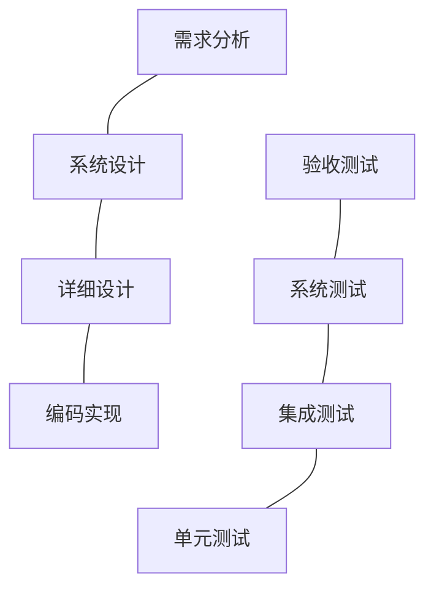
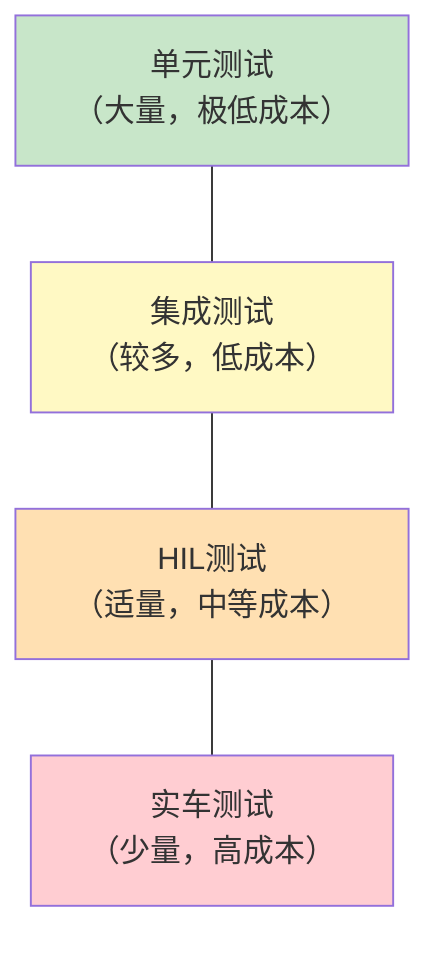

# SYS-06 系统测试与验证：从仿真到产品的最后一道关

**模块编号：** SYS-06
**模块名称：** 系统测试与验证方法论（System Testing and Validation: From Simulation to Production）
**文档版本：** v1.0
**适用对象：** 已掌握FOC基本原理和系统设计方法，需要建立系统化测试验证体系的嵌入式工程师
**前置知识：** SYS-04 仿真到离散、SYS-05 功能安全、HW-02 电流采样、HW-07 热设计
**难度等级：** 

---

**副标题：测试不是"跑一下看看"，是系统性的验证工程**

---

## 1.  核心摘要  

**一句话讲清楚**：系统测试是从"算法在仿真中跑通"到"产品在真实世界中可靠运行"的桥梁——HIL测试验证控制逻辑的完备性，型式试验验证硬件设计的鲁棒性，EMC测试验证电磁兼容性，三者缺一不可。

**认知挂钩**：很多人以为测试就是"上电转一下看看正反转"，**这是对验证工程的根本误解！** 系统测试是一套结构化的方法论：每个测试用例对应一个需求，每个缺陷追溯到根因，每轮回归验证修复有效性。没有系统测试，你的产品就是"薛定谔的电机"——不测不知道，一测吓一跳。

**与算法的关联**：
-  HIL测试→验证控制算法在实时约束下的行为→发现仿真无法暴露的时序问题
-  型式试验→验证硬件在极限工况下的表现→发现散热/过载设计不足
-  EMC测试→验证电磁干扰下的控制鲁棒性→发现采样噪声导致的算法失效
-  回归测试→验证修复不引入新问题→保障迭代质量

**测试层级速查表：**

| 测试层级 | 测试对象 | 运行环境 | 核心目的 | 典型周期 |
|---------|---------|---------|---------|---------|
| 单元测试 | 函数/模块 | PC仿真 | 验证算法逻辑正确性 | 分钟级 |
| 集成测试 | 模块组合 | PC仿真+MIL | 验证模块接口和数据流 | 小时级 |
| HIL测试 | 完整控制器 | 实时仿真器+真实ECU | 验证实时约束下的行为 | 天级 |
| 台架测试 | 控制器+电机 | 电机台架 | 验证真实负载下的性能 | 天级 |
| 实车测试 | 完整系统 | 真实车辆 | 验证整车级功能 | 周级 |

---

## 2.  问题引入

### 工程师的真实困惑

**困惑1**：仿真跑得好好的，上实车就不行？

这是嵌入式电机控制领域最经典的"仿真-实物鸿沟"问题。仿真环境中没有噪声、没有延迟抖动、没有参数漂移，算法在理想条件下当然能跑通。但真实世界中，ADC采样有偏移和噪声、PWM有死区效应、电机参数随温度变化、电源有纹波和跌落——这些"小问题"叠加起来，足以让一个仿真中完美的算法在实物上彻底失效。

**困惑2**：HIL测试到底要测什么？和软件仿真有什么区别？

HIL（Hardware-in-the-Loop）的核心价值在于：**用真实控制器硬件运行真实代码，在实时约束下验证系统行为。** 软件仿真（MIL/SIL）中，控制器的执行时间是"虚拟"的，中断响应是"即时"的，I/O信号是"理想"的。而HIL中，控制器必须在一个PWM周期内完成所有计算，中断必须在微秒级响应，I/O信号有真实的电气特性——这些是软件仿真永远无法暴露的问题。

**困惑3**：EMC测试总是不过，怎么整改？

EMC整改是电机控制器开发中最令人头疼的环节之一。功率逆变器本身就是一个大功率EMI源——高dv/dt的PWM输出、大di/dt的开关电流、长电缆的辐射天线效应。整改不是"加个电容"那么简单，需要从源头（开关策略）、传播路径（PCB布局和滤波）、接收端（采样和保护）三个层面系统考虑。

**困惑4**：型式试验要做哪些项目？周期多长？

型式试验是产品认证的必经之路，通常涵盖温升、效率、过载、防护等级、环境适应性等多个维度。周期从几周到几个月不等，取决于产品标准和认证机构要求。关键是：**型式试验不是"最后才做的事"，而是在设计阶段就要规划好的验证活动**——否则到测试时才发现问题，返工成本极高。

---

## 3.  直观理解

### V模型的对称关系

V模型是系统工程中设计与验证的经典框架，其核心思想是：**每一层设计都有对应的验证层，形成"V"字形的对称关系。**



- **左侧（设计）**：需求→系统设计→详细设计→编码，从抽象到具体
- **右侧（验证）**：单元测试→集成测试→系统测试→验收测试，从具体到抽象
- **对称原则**：需求分析对应验收测试，系统设计对应系统测试，详细设计对应集成测试，编码对应单元测试

**关键认知**：测试用例不是"写完代码再想"，而是在设计阶段就应该同步规划。需求文档中的每一条需求，都应该有对应的测试用例来验证。

### 测试层级类比

| 类比 | 测试层级 | 说明 |
|------|---------|------|
| 检查每个零件 | 单元测试 | 验证PI控制器、坐标变换、SVPWM等单个模块的正确性 |
| 检查零件组装 | 集成测试 | 验证PI输出→SVPWM→PWM生成的数据流是否正确 |
| 在台架上试驾 | HIL测试 | 真实控制器+仿真电机，验证实时性能和故障响应 |
| 实际上路 | 实车测试 | 真实控制器+真实电机+真实负载，验证整车级功能 |

### 测试的金字塔原则



**原则**：底层测试越多，问题发现越早，修复成本越低。一个在单元测试中发现的Bug，修复成本是1；在HIL测试中发现，成本是10；在实车测试中发现，成本是100；在客户现场发现，成本是1000。

---

## 4.  技术原理

### 4.1 测试层级体系

| 层级 | 对象 | 环境 | 目的 | 关键指标 |
|------|------|------|------|---------|
| 单元测试 | 函数/模块 | PC仿真 | 验证算法逻辑正确性 | 代码覆盖率>80% |
| 集成测试 | 模块组合 | PC仿真+MIL | 验证模块接口和数据流 | 接口覆盖率100% |
| HIL测试 | 完整控制器 | 实时仿真器+真实ECU | 验证实时约束下的行为 | 需求覆盖率100% |
| 台架测试 | 控制器+电机 | 电机台架 | 验证真实负载下的性能 | 性能指标达标 |
| 实车测试 | 完整系统 | 真实车辆 | 验证整车级功能 | 用户场景覆盖 |

**层级间的递进关系**：每一层测试通过后，才能进入下一层。如果单元测试都没通过就去做HIL测试，等于在沙子上建高楼——基础不牢，地动山摇。

### 4.2 HIL测试

#### HIL架构

HIL测试的核心架构由以下部分组成：

```text
┌─────────────────┐    真实I/O     ┌─────────────────┐
│   实时仿真器     │◄──────────────►│   真实控制器     │
│  (dSPACE/NI/    │  PWM/ADC/DIO   │    (ECU)        │
│   Speedgoat)    │                │                 │
│                 │                │  运行真实固件    │
│  运行电机模型   │                │  真实中断响应    │
│  模拟传感器信号 │                │  真实时序约束    │
└─────────────────┘                └─────────────────┘
        │
        ▼
┌─────────────────┐
│  测试自动化平台  │
│  Python脚本     │
│  故障注入       │
│  结果判定       │
└─────────────────┘
```

- **实时仿真器**（dSPACE/NI/Speedgoat）运行电机模型，模拟真实电机的电气和机械行为
- **真实控制器（ECU）** 通过真实I/O与仿真器连接，运行与产品完全相同的固件
- **仿真器模拟传感器信号**：编码器/霍尔信号、电流采样信号、电压采样信号
- **控制器输出PWM**→仿真器读取→更新电机模型→形成闭环

#### HIL vs 软件仿真

| 维度 | 软件仿真(MIL/SIL) | HIL测试 |
|------|-------------------|---------|
| 控制器 | 仿真模型 | 真实硬件 |
| 执行时间 | 非实时，计算完即可 | 严格实时，超时即出错 |
| I/O信号 | 仿真数值 | 真实电气信号（有噪声、偏移） |
| 中断行为 | 仿真调度 | 真实中断优先级和嵌套 |
| 发现问题 | 算法逻辑错误 | 时序/中断/资源冲突/内存溢出 |
| 成本 | 低（仅需PC和软件） | 高（需实时仿真器和ECU） |
| 可重复性 | 完全可重复 | 受硬件状态影响，需控制变量 |

**HIL的核心价值**：暴露软件仿真无法发现的问题——中断优先级配置错误导致的控制周期抖动、浮点运算精度不足导致的积分漂移、内存分配失败导致的看门狗复位、ADC采样时序与PWM同步偏差导致的电流采样偏移。

#### HIL测试用例设计

HIL测试用例应覆盖以下四大类工况：

**1. 正常工况**：验证基本功能的正确性
- 启动→加速→稳态→减速→停机的完整工作循环
- 不同转速设定点的阶跃响应
- 不同负载条件下的稳态精度
- 正反转切换的动态过程

**2. 边界工况**：验证设计极限处的表现
- 满载启动：验证启动电流限制和加速性能
- 零速满转矩：验证电流环在极低速度下的控制能力
- 最高速运行：验证弱磁算法和电压极限圆约束
- 母线电压极限：验证欠压/过压保护阈值

**3. 故障注入**：验证安全机制的有效性
- 传感器断线：编码器信号丢失、霍尔信号异常
- 采样偏移：电流采样零漂、增益偏差
- 通信超时：CAN/UART通信中断
- 电源跌落：母线电压瞬降、供电中断
- 存储器故障：Flash校验失败、EEPROM数据异常

**4. 极端工况**：验证环境应力下的鲁棒性
- 低温冷启动：-40°C环境下的启动性能
- 高温满载：+85°C环境下的持续运行能力
- 电压瞬变：电源电压快速波动
- 机械冲击：负载突变和堵转工况

### 4.3 型式试验

型式试验是产品认证的核心环节，验证产品在规定条件下是否满足标准要求。

#### 温升试验

温升试验是型式试验中最重要的项目之一，直接关系到产品的可靠性和寿命。

- **试验方法**：额定负载持续运行至热稳定（温度变化率<1K/h）
- **测量点**：绕组（电阻法）、铁芯（热电偶）、IGBT结温（热敏电阻/NTC）、电容外壳、PCB关键点
- **判据**：各点温度不超过绝缘等级限值（B级130°C、F级155°C、H级180°C）
- **注意事项**：热稳定时间可能长达2~4小时，需提前规划测试时间

#### 效率测试

效率测试绘制电机控制器在不同工作点的效率MAP图，是产品性能的核心指标。

- **测试方法**：在不同转速/转矩工作点测量输入功率（直流侧）和输出功率（交流侧）
- **效率MAP**：以转速为X轴、转矩为Y轴，绘制等效率曲线
- **关键指标**：最高效率点、典型工作点效率、加权平均效率
- **常见问题**：低速轻载效率低（开关损耗占比大）、高速弱磁区效率下降

#### 过载能力

- **短时过载**：如3倍额定电流持续10s，测量温升和保护动作时间
- **峰值过载**：如5倍额定电流持续1s，验证硬件极限承受能力
- **重复过载**：周期性过载循环，验证热累积效应
- **判据**：保护动作时间≤设计值，温升不超过限值

#### 防护等级

- **IP测试**：如IP67（防尘+短时浸水1m/30min）
- **测试方法**：粉尘箱测试+浸水测试
- **判据**：测试后绝缘电阻≥规定值，功能正常

### 4.4 EMC测试

EMC（电磁兼容性）测试是电机控制器产品化过程中最棘手的环节之一，包含发射（EMI）和抗扰度（EMS）两大类。

#### 传导发射(CE)

- **频率范围**：150kHz~30MHz
- **限值标准**：CISPR 25 / IEC 61800-3
- **测试方法**：LISN（线性阻抗稳定网络）串联在电源线上，测量共模和差模噪声
- **常见超标原因**：开关频率谐波（基频及倍频处出现尖峰）、共模噪声（高dv/dt通过寄生电容耦合到地）

#### 辐射发射(RE)

- **频率范围**：30MHz~1GHz
- **限值标准**：CISPR 25 / IEC 61800-3
- **测试方法**：在半电波暗室中，用接收天线测量辐射场强
- **常见超标原因**：PWM高频谐波（开关沿的高频成分）、电缆辐射（电机线缆作为天线辐射噪声）

#### 传导抗扰度(CS)

- **测试方法**：通过耦合钳/注入变压器将干扰信号注入电源线/信号线
- **干扰类型**：连续波、脉冲群、浪涌
- **判据**：
  - A级：功能正常，性能不降级
  - B级：功能暂时降级，干扰消失后自动恢复
  - C级：功能降级，需人工干预恢复
  - D级：功能丧失，设备损坏

#### 辐射抗扰度(RS)

- **测试方法**：在暗室中用天线对被测设备辐射干扰信号
- **频率范围**：80MHz~1GHz（部分标准到6GHz）
- **场强等级**：3V/m、10V/m、30V/m等
- **判据**：同CS测试

#### EMC整改思路

EMC整改需要系统思维，遵循"源头→路径→接收端"三层策略：

**1. 源头抑制**（最有效但可能影响性能）
- 降低dv/dt：增加栅极电阻（代价：开关损耗增大）
- 降低开关频率：从24kHz降到16kHz（代价：电流纹波增大）
- 采用展频技术：抖动开关频率，分散谐波能量
- 优化PWM策略：减少不必要的开关动作

**2. 传播路径**（最常用，成本适中）
- 增加共模电感：抑制共模电流，对差模信号影响小
- 增加X电容（线-线）：抑制差模噪声
- 增加Y电容（线-地）：抑制共模噪声，注意漏电流限制
- 增加磁珠：高频阻抗大，抑制高频噪声
- 优化PCB布局：缩短高频电流回路面积，完整地平面

**3. 接收端**（最后一道防线）
- 增加采样滤波：RC低通滤波器抑制ADC输入噪声
- 屏蔽：金属外壳、屏蔽电缆
- 差分布线：提高共模抑制比
- 软件滤波：数字滤波算法补偿硬件滤波不足

### 4.5 环境试验

环境试验验证产品在极端环境条件下的适应性和可靠性：

- **高低温试验**：-40°C~+85°C，验证温度范围内的功能正常性
- **温湿度循环**：85°C/85%RH（双85试验），验证潮湿环境下的绝缘性能
- **温度冲击**：-40°C↔+125°C快速切换，验证热应力下的焊接和连接可靠性
- **振动试验**：随机振动+正弦扫频，模拟运输和运行中的振动环境
- **盐雾试验**：海洋环境或含盐潮湿环境下的耐腐蚀性
- **跌落试验**：验证产品在运输和安装过程中的抗冲击能力

### 4.6 回归测试策略

回归测试是保障迭代质量的关键机制，确保每次修改不会引入新的问题：

- **触发条件**：每次代码修改后运行自动化测试套件
- **测试套件组成**：单元测试+集成测试+HIL关键用例
- **覆盖率要求**：至少覆盖修改模块的100%和关联模块的50%
- **自动化执行**：CI/CD流水线自动触发，无需人工干预
- **结果判定**：所有测试PASS才能合入主分支，任何FAIL必须修复

**回归测试的分层策略**：

| 修改范围 | 回归测试范围 | 执行时间 |
|---------|------------|---------|
| 单个函数修改 | 该函数的单元测试 | 分钟级 |
| 模块内部修改 | 该模块+直接依赖模块 | 小时级 |
| 接口变更 | 所有使用该接口的模块 | 天级 |
| 全局性修改 | 完整测试套件 | 天级 |

### 4.7 测试自动化

测试自动化是提高测试效率和一致性的关键手段：

**CI/CD流水线**：
```text
代码提交 → 自动编译 → 静态分析 → 自动运行单元测试 → 生成报告 → 通知结果
```

**HIL自动化**：
```text
Python脚本控制dSPACE → 加载测试场景 → 注入故障 → 记录响应 → 判定PASS/FAIL → 生成测试报告
```

**测试报告自动生成**：
- 测试用例执行结果（PASS/FAIL/NOT RUN）
- 覆盖率统计（需求覆盖率、代码覆盖率）
- 缺陷列表和状态
- 趋势分析（缺陷密度、测试通过率变化）

---

## 5.  交叉视角

| 测试类型 | 反馈到设计 | 对应KB模块 |
|---------|-----------|-----------|
| HIL测试 | 发现算法时序问题→修正控制周期或优化计算负载 | SYS-04(仿真到离散) |
| 型式试验 | 发现散热不足→修改散热器设计或降额使用 | HW-07(热设计) |
| EMC测试 | 发现采样噪声→修改PCB布局或增加滤波 | HW-02(电流采样) |
| 故障注入 | 验证安全机制有效性→完善FMEA和安全策略 | SYS-05(功能安全) |
| 回归测试 | 验证修复不引入新问题→保障迭代质量 | SYS-01(设计模式) |
| 环境试验 | 发现温度漂移→增加参数在线辨识或温度补偿 | ADV-ALG-01(控制环带宽) |

**交叉验证的闭环思维**：测试不是终点，而是反馈到设计的起点。每次测试发现的问题，都应该追溯到设计阶段的根因，并修改设计规范防止同类问题再次出现。这就是"测试驱动设计改进"的闭环。

---

## 6.  工程案例

### 案例1：HIL测试发现SMO低速失锁

**现象**：HIL测试中，电机从1000rpm减速至50rpm时，SMO（滑模观测器）估计角度突然跳变，电机失步。

**根因分析**：低速时反EMF太小，SMO信噪比不足，锁相环失锁。具体来说，SMO依赖反EMF来估计转子位置，而反EMF幅值与转速成正比。当转速降至50rpm时，反EMF幅值仅为额定值的5%，被采样噪声完全淹没。

**仿真中未发现**：仿真模型无噪声，SMO在低速时仍能正常工作——这是仿真与实物最大的区别之一。

**修复方案**：增加低速HFI（高频注入）启动+SMO中高速的混合策略。低速时利用磁凸极效应注入高频信号提取位置信息，中高速时切换到SMO。切换区间需要平滑过渡，避免角度跳变。

**教训**：仿真中"能跑通"≠实物中"能工作"。必须在仿真中主动加入噪声模型，才能更真实地评估算法鲁棒性。

### 案例2：EMC整改3轮迭代

**现象**：传导发射在2MHz处超标15dB（限值56dBμV，实测71dBμV）。

**第1轮整改**：增加共模电感（5mH）→改善5dB→仍超标10dB
- 分析：共模电感对低频共模噪声有效，但2MHz处的噪声成分较复杂

**第2轮整改**：优化PCB地平面（增加过孔连接）+增加Y电容（2.2nF）→改善8dB→仍超标2dB
- 分析：地平面优化减少了地阻抗，Y电容提供了共模噪声的低阻抗回流路径

**第3轮整改**：降低开关频率从24kHz到16kHz+增加栅极电阻（从10Ω到22Ω）→终于通过
- 分析：降低开关频率减少了2MHz处的谐波能量（2MHz/16kHz=125次谐波 vs 2MHz/24kHz=83次谐波，虽然谐波次数更高但基频更低），增加栅极电阻降低了dv/dt

**教训**：EMC整改需要系统思维，单一措施往往不够。而且整改措施之间存在耦合——增加栅极电阻会增大开关损耗，降低开关频率会增大电流纹波，需要在EMC和性能之间找到平衡点。

### 案例3：温升测试发现散热设计不足

**现象**：额定负载运行30分钟后IGBT温度达到120°C，超过设计限值105°C。

**根因**：散热器面积不足+风道设计不合理。CFD仿真中假设的环境温度25°C，但实际测试中控制器安装在密闭空间内，环境温度达到45°C。

**修复方案**：
1. 增大散热器面积30%（增加翅片数量和高度）
2. 优化风道设计（增加进风口面积，改善气流组织）
3. 增加温度保护阈值（从105°C调整为115°C，留出安全裕度）
4. 在软件中增加降额策略：温度>100°C时逐步降低电流限幅

**教训**：热仿真必须考虑实际安装环境，不能只看理想条件。温升测试应在最恶劣安装条件下进行。

### 案例4：故障注入验证安全机制

**测试场景**：HIL注入电流采样断线故障

**预期行为**：检测到故障→3ms内关闭PWM→进入安全状态

**实际行为**：检测耗时15ms→期间电机输出最大转矩（因采样值为0，PI积分器快速饱和）

**根因**：故障检测算法的滤波时间常数过大（50ms），为了抑制正常工况下的采样噪声毛刺而牺牲了故障响应速度。

**修复方案**：
1. 缩短软件滤波时间常数（从50ms降到5ms），同时增加前置判据（连续3个采样周期超阈值才判定为故障）
2. 增加硬件比较器作为快速保护：采样信号直接与硬件阈值比较，超限时在1μs内触发PWM封锁
3. 增加采样值合理性检查：当三相电流之和偏离零点超过阈值时，立即判定采样异常

**教训**：安全机制的响应时间必须通过故障注入测试来验证，不能仅凭理论分析。软件保护与硬件保护应形成"双保险"——软件保护灵活但响应慢，硬件保护快速但功能单一。

### 案例5：回归测试发现PI参数修改引入新问题

**现象**：修改速度环PI参数后，电流环出现振荡。

**根因**：速度环PI参数修改影响了电流环的前馈补偿项，导致d-q轴解耦不彻底。

**修复方案**：修改PI参数时，同步更新前馈解耦补偿项的系数。

**教训**：电机控制系统中各模块之间存在强耦合，修改一个参数可能影响其他模块的行为。回归测试必须覆盖关联模块，不能只测修改的模块。

---

## 7.  实践练习

### HIL测试用例设计题

**Q1**：为FOC电机控制器设计HIL测试用例，覆盖正常工况、边界工况和故障注入，至少10个用例。每个用例需包含：用例编号、测试目的、前置条件、测试步骤、预期结果、判定标准。

**参考框架**：
- 正常工况4个：启动、加速、稳态运行、停机
- 边界工况3个：满载启动、最高速运行、零速满转矩
- 故障注入3个：编码器断线、电流采样偏移、母线过压

### EMC预测试方案题

**Q2**：某电机控制器传导发射超标，设计预测试方案定位噪声源（不使用EMC暗室）。

**提示方向**：
- 使用近场探头定位PCB上的辐射热点
- 使用电流探头测量电源线上的共模/差模电流
- 通过改变开关频率观察噪声频谱移动
- 逐个断开外部电缆判断辐射路径

### 型式试验检查清单

**Q3**：列出PMSM电机控制器型式试验的完整检查清单（至少15项），涵盖电气性能、环境适应性、安全性和EMC四大类。

**提示方向**：
- 电气性能：温升、效率、过载、绝缘电阻、耐压
- 环境适应性：高低温、温湿度循环、振动、盐雾
- 安全性：过流保护、过压保护、欠压保护、过热保护
- EMC：传导发射、辐射发射、传导抗扰度、辐射抗扰度

---

> **关联模块：**
> - [SYS-04 从仿真到离散：连续域到离散域的完整转换工作流](./SYS-04-Simulation-to-Discrete.md)
> - [SYS-05 功能安全与故障管理](./SYS-05-Functional-Safety.md)
> - [SYS-01 设计模式与软件架构](./SYS-01-Design-Patterns.md)
