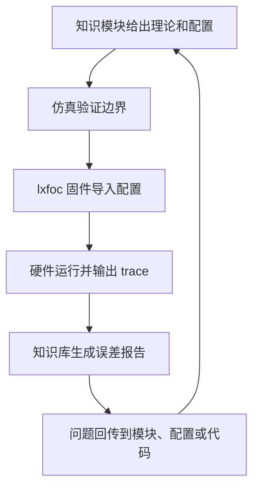
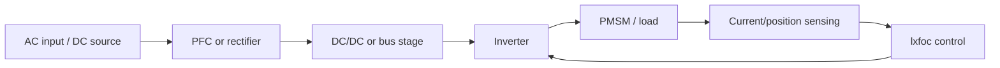

# SYS-07 电源-电控联合闭环系统设计

> **状态**: reviewed  
> **目标**: 把电源与电控从“两个章节”连接成一个可调试、可验证、可回传的系统闭环。

**模块编号：** SYS-07  
**模块名称：** 电源-电控联合闭环系统设计  
**文档版本：** v1.1  
**前置知识：** PP-11 Boost PFC 与母线动态、ALG-03 PI 电流调节器、SYS-06 系统测试与验证  
**难度等级：** ★★★★☆

---

## 1. 📌 核心摘要 ★★★★☆ 🔰📚

**一句话：** 电源和电控不能作为两个孤立模块调试：电源侧决定母线质量、保护边界和功率上限，电控侧决定电流、转矩和负载动态，两者必须通过统一配置、统一 trace、统一故障流和统一验证报告形成闭环。

**认知挂钩：** 电机系统像一条能量流水线。PFC、DC/DC、逆变器、传感器和 FOC 都在同一条线上工作。任何一段只做“本模块 OK”的局部验证，都可能在整机联调时失效。真正可发布的知识库不是只讲原理，而是能把理论、仿真、固件、实测数据和问题回传连起来。

**核心问题链：**



---

## 2. 🤔 问题引入 ★★★★☆ 🔰

### 工程师的真实困惑

> **场景 1：电源工程师说母线正常，电控工程师说电流环异常**  
> 空载测得母线稳定，但电机加速时 `vbus` 短暂跌落，FOC 电压限幅触发。电源侧只看稳态值，电控侧只看 dq 电流误差，双方都缺少统一 trace。

> **场景 2：仿真通过，硬件一跑就保护**  
> 仿真使用理想母线和理想采样，硬件中存在母线纹波、采样延迟、死区、限流和温度保护。没有把硬件限制写进 manifest，导致仿真结论无法对应实测。

> **场景 3：修复问题后知识库没有更新**  
> 工程调试中发现欠压迟滞、弱磁边界或电流限幅设置不合理，固件临时改好了，但文档、配置包和验证报告没有同步，下一次复现仍然踩同一个问题。

### 核心问题

为什么需要“电源-电控联合闭环”，而不是分别把电源和 FOC 调好？

**答案：** 因为实际系统的约束跨越模块边界。母线动态影响 FOC，FOC 负载阶跃反过来影响电源；保护和数据记录如果不统一，就无法判断问题来源，也无法把经验沉淀回知识库。

### 学习目标

读完本模块，你将能够：

✅ 定义电源、逆变器、传感器、FOC 和知识库之间的系统边界  
✅ 制定从电源前级到闭环运行的调试顺序  
✅ 设计统一实验 manifest 和 trace 字段  
✅ 建立故障记录、分析和回传流程  
✅ 判断模块是否只能标为 `reviewed`，还是可以升级为 `verified`  

---

## 3. 💡 直观理解 ★★★★☆ 🔰💡

### 3.1 系统边界

完整系统按功率流可以分为：



电源侧决定母线质量，电控侧决定电机电流和转矩。两者必须共享母线电压、保护状态、功率限制和故障策略。

### 3.2 闭环不是单个控制环

这里的“闭环”不是单指 PI 电流环，而是知识闭环：

1. 文档给出理论和参数边界。
2. 仿真验证理论是否能复现。
3. 固件按同一配置运行。
4. 硬件回传标准 trace。
5. 知识库生成报告并更新证据状态。

如果缺少任意一环，系统仍然可以运行，但知识库不能声称对应模块已经实测验证。

---

## 4. 🔬 技术原理 ★★★★☆ 📚🔧

### 4.1 调试顺序

推荐顺序如下：

1. 单独验证电源前级：空载、假负载、限流、保护。
2. 单独验证逆变器：不开电机时检查 PWM、死区、采样。
3. 低压低流验证 lxfoc：V/F、I/F、电流环。
4. 接入母线动态：记录 `vbus_V` 并验证电压限幅。
5. 闭环运行：导入 trace 到知识库生成误差报告。

这个顺序的目的不是拖慢进度，而是让每个故障都有明确归属。跳过前级验证直接闭环运行，问题会混在一起，难以复盘。

### 4.2 统一实验 manifest

每次实验必须绑定：

- `doc_id`: 知识模块来源。
- `experiment_id`: 仿真、固件、实测数据的共同 ID。
- `config_schema_version`: lxfoc 配置版本。
- `trace_schema_version`: 回传数据版本。
- `hardware_limits`: 电压、电流、温度、转速限制。

示例：

```json
{
  "doc_id": "power-path/PP-11-Boost-PFC-Bus-Dynamics",
  "experiment_id": "PP11-vbus-step-001",
  "config_schema_version": "1.0",
  "trace_schema_version": "1.0",
  "hardware_limits": {
    "vbus_min_V": 300,
    "vbus_max_V": 420,
    "phase_current_max_A": 10,
    "temperature_max_C": 85
  }
}
```

### 4.3 标准 trace

跨电源和电控的 trace 至少应包含：

```text
time_s,
vbus_V,
id_A, iq_A, id_ref_A, iq_ref_A,
ud_V, uq_V,
duty_a, duty_b, duty_c,
speed_hz,
fault_flags
```

如果验证对象涉及 PFC 或三电平母线，还应增加：

```text
vac_a_V, vac_b_V, vac_c_V,
iac_a_A, iac_b_A, iac_c_A,
vdc_upper_V, vdc_lower_V
```

### 4.4 故障流

故障不是只在硬件里处理，也要回传给知识库：

| 故障 | 必须记录 | 分析动作 |
|---|---|---|
| 欠压 | `vbus_V`, `fault_flags` | 判断是否由负载阶跃或输入跌落导致 |
| 过流 | 三相电流、dq 电流 | 判断采样、PI、负载、短路 |
| 过调制 | duty、ud/uq、vbus | 判断母线不足或弱磁不足 |
| 观测器失锁 | 估计角、传感器角、速度 | 判断适用速度范围 |

---

## 5. 🔗 交叉视角 ★★★★☆ 💡🔧

### 5.1 与知识库状态的关系

知识模块的状态必须与证据一致：

- `draft`: 内容仍在整理，未完成基本交叉检查。
- `reviewed`: 理论、仿真或代码证据已通过审查，但没有完整硬件闭环证据。
- `verified`: 有可复现硬件数据、原始采样、校准信息、审查人和误差报告。

未完成实测的模块必须显示为 `reviewed` 或 `draft`，不能标为 `verified`。

### 5.2 与 lxfoc 的关系

lxfoc 应提供标准配置导入和 trace 导出能力。知识库不应只写“调某个参数”，而应能明确：

- 参数来自哪个 `doc_id`。
- 固件使用哪个配置版本。
- trace 字段是否足以验证该模块。
- 报告是否能复现实验结论。

### 5.3 与系统测试的关系

SYS-06 关注测试和验证方法，本模块关注电源与电控跨域闭环。两者的交集是：所有测试都必须能回答“这个现象是电源侧、电控侧、采样侧、保护侧还是配置侧造成的”。

---

## 6. 🎯 工程案例 ★★★★☆ 🔧🎯

### 案例：母线跌落导致电流环限幅

**现象：**

电机从 1000 rpm 加速到 2500 rpm，`iq_ref` 阶跃。实测 `iq_A` 跟踪变差，随后 `fault_flags` 出现欠压预警。

**闭环排查：**

| 步骤 | 检查对象 | 结论判断 |
|---|---|---|
| 1 | `vbus_V` | 是否在 `iq_ref` 阶跃后跌落 |
| 2 | `ud_V/uq_V` | 是否接近实时电压限幅 |
| 3 | `duty_a/b/c` | 是否进入过调制或接近饱和 |
| 4 | `fault_flags` | 欠压是否先于电流误差恶化 |
| 5 | manifest | 硬件限流和母线阈值是否与固件一致 |

**可能结论：**

如果 `vbus_V` 先跌落，随后 `uq_V` 顶到限幅，最后 `iq_A` 误差增大，则优先处理 PFC 母线动态或加速功率限制，而不是直接调大电流环 PI。

### 案例输出物

一次合格的闭环验证至少产生：

- 实验 manifest。
- 固件配置快照。
- 标准 trace CSV。
- 自动生成的误差报告。
- proof 文件中的证据引用。

---

## 7. 📝 实践练习 ★★★★☆ 🎯📝

### 练习 1：故障归因

闭环运行中 `iq` 跟踪误差增大，同时 `vbus_V` 明显跌落。第一步应检查什么？

**参考答案：**

先检查 `ud/uq` 是否接近实时电压限幅，以及 duty 是否接近饱和。如果电压已经受限，优先分析母线动态、功率限制和弱磁策略，而不是直接调 PI。

### 练习 2：状态判定

某模块有仿真报告和代码审查，但没有硬件原始数据、校准信息和审查人。它可以标为 `verified` 吗？

**参考答案：**

不可以。它最多是 `reviewed`。`verified` 必须有可复现硬件数据、原始采样、校准信息、审查人和误差报告。

### 练习 3：Manifest 字段

为什么实验 manifest 必须包含 `doc_id` 和 `experiment_id`？

**参考答案：**

`doc_id` 说明实验验证哪个知识模块，`experiment_id` 把仿真、固件、实测数据和报告绑定到同一次实验，便于复现和追踪。

### 练习 4：Trace 字段

验证母线动态时，为什么只记录 dq 电流不够？

**参考答案：**

dq 电流只能说明控制结果，无法判断电压裕量和故障来源。必须记录 `vbus_V`、`ud/uq`、duty 和 `fault_flags`，才能判断是否由母线跌落、限幅或保护触发导致。

---

## 8. ✅ 验收标准

- 知识库能导出 lxfoc 配置包。
- lxfoc 能输出标准 trace。
- 知识库能生成理论/仿真/实测误差报告。
- 未完成实测的模块必须显示为 `reviewed` 或 `draft`，不能标为 `verified`。

本模块的 proof 文件位于 `_proofs/advanced/system-methodology/SYS-07-Power-Control-Closed-Loop.module-proof.yaml`。
