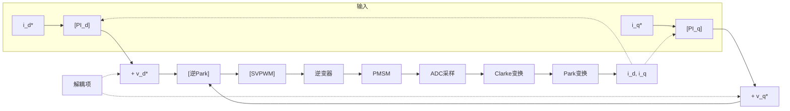

# ALG-03 PI 电流调节器设计

**模块编号：** ALG-03
**模块名称：** PI 电流调节器设计（PI Current Regulator Design）
**文档版本：** v2.0
**适用对象：** 电机控制工程师、嵌入式开发者
**前置知识：** FOC 磁场定向控制基础、dq 坐标变换（Clark/Park）、传递函数与频域分析、离散时间控制

---

## 1.  核心摘要  

**一句话总结：** PI 电流调节器是 FOC 级联控制的最内环核心，通过带宽参数化法将零极点对消，实现一阶闭环响应——带宽直接决定了系统的动态跟踪能力和抗负载扰动能力。

**认知钩子：** 把电流环想象成汽车的油门踏板——踩下踏板（给定 $i_q^*$）后，发动机扭矩（实际 $i_q$）必须迅速跟上。PI 调节器的 $K_p$ 决定了油门响应的"灵敏度"（太快会抖，太慢会迟滞），$K_i$ 决定了能否精确地消除稳态误差（就像巡航控制消除坡度影响）。带宽 $\omega_{bw}$ 是油门响应速度的统一度量。


<!-- 原ASCII电流环控制框图转为mermaid flowchart语法,提升可读性 -->

| 关键概念 | 说明 |
|---------|------|
| 带宽 $\omega_{bw}$ | 电流环 -3dB 截止频率（rad/s），核心设计参数 |
| 零极点对消 | PI 零点 $\frac{K_i}{K_p}$ 等于 RL 极点 $\frac{R}{L}$，系统降为一阶 |
| 解耦前馈 | 消除 d-q 轴间 $\omega_e L_q i_q$ 和 $\omega_e L_d i_d$ 交叉耦合 |
| Anti-Windup | 输出饱和时阻止积分器继续累积，防止超调/振荡 |

---

## 2.  原理推导  

### 2.1 dq 轴电流环结构

FOC 电流环是级联控制的最内环，直接决定了系统的动态响应和抗扰能力。

连续域 PI 控制器传递函数：

$$\text{PI}(s) = K_p + \frac{K_i}{s}$$

在 dq 坐标系下，永磁同步电机（PMSM）电压方程为：

$$v_d = R_s i_d + L_d \frac{di_d}{dt} - \omega_e L_q i_q$$

$$v_q = R_s i_q + L_q \frac{di_q}{dt} + \omega_e (L_d i_d + \psi_f)$$

其中：
- $v_d$, $v_q$ —— d、q 轴定子电压（V）
- $i_d$, $i_q$ —— d、q 轴定子电流（A）
- $R_s$ —— 定子相电阻（Ω）
- $L_d$, $L_q$ —— d、q 轴电感（H）
- $\omega_e$ —— 电气角速度（rad/s）
- $\psi_f$ —— 永磁体磁链（Wb）

$\omega_e L_q i_q$ 和 $\omega_e(L_d i_d + \psi_f)$ 为交叉耦合项，需通过前馈解耦消除。

### 2.2 dq 解耦前馈

消除 d-q 轴交叉耦合的经典方法——在 PI 输出上叠加解耦项：

$$v_d^* = PI_d(e_{id}) - \omega_e L_q i_q$$

$$v_q^* = PI_q(e_{iq}) + \omega_e (L_d i_d + \psi_f)$$

解耦后两轴完全独立，可分别整定。耦合项在高速运行时（$\omega_e$ 大）尤为显著，不解耦将导致高速下电流失控。

---

## 3.  数学建模  

### 3.1 带宽参数化法整定

将 PI 零点与电机 RL 极点对消，实现一阶闭环响应：

$$K_p = \omega_{bw} \cdot L$$

$$K_i = \omega_{bw} \cdot R$$

其中：
- $\omega_{bw}$ —— 期望的电流环带宽（rad/s）
- $L$ —— 对应轴电感 $L_d$ 或 $L_q$（H）
- $R$ —— 定子相电阻 $R_s$（Ω）

### 3.2 闭环传递函数

零极点对消后，闭环传递函数退化为一阶系统：

$$\frac{I(s)}{I^*(s)} = \frac{\omega_{bw}}{s + \omega_{bw}}$$

**物理意义：** 电流环的阶跃响应等价于 RC 一阶电路充放电，时间常数 $\tau = 1 / \omega_{bw}$。

### 3.3 带宽约束条件

电流环带宽受 PWM 频率和采样延迟限制：

$$\omega_{bw} \leq \frac{2\pi f_{pwm}}{20}$$

其中：
- $f_{pwm}$ —— PWM 开关频率（Hz）

对于 $f_{pwm} = 10kHz$：$\omega_{bw} \leq 2\pi \times 500 = 3142$ rad/s。

更严格的分析考虑数字控制引入的零阶保持（ZOH）延迟 $\frac{T_s}{2}$ 和计算延迟 $T_s$，总延迟 $T_{delay} = 1.5 T_s$，则带宽上限：

$$\omega_{bw} \leq \frac{1}{3 \sim 5 \cdot T_{delay}}$$

其中 $T_s$ 为电流环控制周期（s），通常等于 PWM 周期。

---

## 4.  代码实现  

### 4.1 增量式 PI 实现（后向欧拉离散化）

连续 PI → 离散（后向欧拉）：

$$u[k] = K_p \cdot e[k] + u_i[k-1] + K_i \cdot T_s \cdot e[k]$$

其中 $T_s$ 为电流环控制周期（s）。

```c
typedef struct {
    float kp;
    float ki;
    float ts;
    float integral;
    float integral_limit;
    float output_limit;
} pi_current_ctrl_t;

float pi_current_update(pi_current_ctrl_t *pi, float ref, float fb)
{
    float error = ref - fb;
    float p_term = pi->kp * error;

    pi->integral += pi->ki * pi->ts * error;
    if (pi->integral > pi->integral_limit)
        pi->integral = pi->integral_limit;
    if (pi->integral < -pi->integral_limit)
        pi->integral = -pi->integral_limit;

    float output = p_term + pi->integral;
    if (output > pi->output_limit)
        output = pi->output_limit;
    if (output < -pi->output_limit)
        output = -pi->output_limit;

    return output;
}
```

### 4.2 dq 轴解耦前馈实现

```c
void current_loop_decoupling(
    float id_ref, float iq_ref,
    float id_fb, float iq_fb,
    float omega_e,
    float *vd_out, float *vq_out)
{
    float id_err = id_ref - id_fb;
    float iq_err = iq_ref - iq_fb;

    float vd_pi = pi_current_update(&pi_d, id_ref, id_fb);
    float vq_pi = pi_current_update(&pi_q, iq_ref, iq_fb);

    *vd_out = vd_pi - omega_e * Lq * iq_fb;
    *vq_out = vq_pi + omega_e * (Ld * id_fb + psi_f);
}
```

### 4.3 Anti-Windup 反计算法

```c
float pi_update_antiwindup(pi_current_ctrl_t *pi, float setpoint, float feedback)
{
    float error = setpoint - feedback;
    float u_unsaturated = pi->kp * error + pi->integral;

    float u_saturated = u_unsaturated;
    if (u_saturated > pi->output_limit)  u_saturated = pi->output_limit;
    if (u_saturated < -pi->output_limit) u_saturated = -pi->output_limit;

    float u_diff = u_saturated - u_unsaturated;
    pi->integral += pi->ki * pi->ts * error + pi->kc * u_diff;

    return u_saturated;
}
```

其中 $k_c$ 为反计算增益，典型值 $k_c = 1 / K_p$。

---

## 5.  参数整定  

### 5.1 带宽参数化法

将 PI 零点和电机极点对消，实现一阶闭环响应：

$$K_p = \omega_{bw} \cdot L$$

$$K_i = \omega_{bw} \cdot R$$

其中 $\omega_{bw}$ 为期望的电流环带宽（rad/s）。

闭环传递函数退化为：

$$\frac{I(s)}{I^*(s)} = \frac{\omega_{bw}}{s + \omega_{bw}}$$

**约束条件：**
- 电流环带宽 ≤ PWM 频率的 1/20（避免激发采样频率分量）
- 对于 10kHz PWM：$\omega_{bw} \leq 2\pi \times 500 = 3142$ rad/s

### 5.2 典型参数参考值

| 电机参数 | 带宽建议 | $K_p$ 典型值 | $K_i$ 典型值 |
|---------|---------|-------------|-------------|
| 微型伺服（L=0.1mH, R=0.5Ω） | 3000 rad/s | 0.3 V/A | 1500 V/(A·s) |
| 工业伺服（L=5mH, R=2Ω） | 1000 rad/s | 5.0 V/A | 2000 V/(A·s) |
| 大功率主轴（L=20mH, R=0.2Ω） | 500 rad/s | 10.0 V/A | 100 V/(A·s) |

### 5.3 Anti-Windup 积分抗饱和

当输出电压饱和（达到 SVPWM 六边形边界）时，积分器继续累积会导致 Windup 现象：

- **条件积分**：仅在未饱和时积分
- **反计算**：积分值减去饱和前后的差值 × 增益（推荐，见 §4.3 代码）
- **钳位**：直接限幅积分项

### 5.4 性能指标

| 指标 | 定义 | 典型值 |
|------|------|--------|
| 上升时间 $t_r$ | 10%→90% 阶跃响应 | < 1ms |
| 调节时间 $t_s$ | 进入 ±2% 稳态误差 | < 3ms |
| 超调量 $\sigma$ | (峰值-稳态)/稳态 × 100% | < 5% |
| 相角裕度 PM | 开环相位裕度 | > 45° |
| 带宽 $\omega_{bw}$ | -3dB 截止频率 | 300~3000 rad/s |

---

## 6.  硬件约束  

### 6.1 PWM 更新延迟

数字控制系统普遍采用"采样-计算-更新"的单周期延迟模型。PWM 寄存器通常在周期开始时更新（影子寄存器），导致从 ADC 采样到 PWM 输出变化存在一个控制周期的滞后 $T_s$。该延迟引入的相位滞后为：

$$\phi_{delay} = -\omega_{bw} \cdot 1.5 T_s \cdot \frac{180°}{\pi}$$

对于 $\omega_{bw} = 3000$ rad/s、$T_s = 100\mu s$（10kHz PWM）：$\phi_{delay} \approx -25.8°$，将显著侵蚀相位裕度。

**工程对策：** 使用双更新模式（PWM 中点也更新一次），可将平均延迟降至 $0.75 T_s$。

### 6.2 ADC 转换时间对带宽的限制

ADC 转换 + DMA 传输完成时间构成反馈链路的测延迟。若 ADC 转换耗时 $3\mu s$，对于 10kHz PWM（$T_s = 100\mu s$），采样延迟占比仅 3%，影响有限。但当 PWM 频率升高至 50kHz（$T_s = 20\mu s$）时，$3\mu s$ 延迟占 15%，将显著限制可实现的电流环带宽。

> 相关算法模块：`ALG-02 电流采样时序` §6「硬件约束」

### 6.3 运算放大器带宽

电流采样链路的运放带宽直接影响反馈信号质量：

- 运放闭环带宽应 $\geq 10 \times \omega_{bw}$，否则反馈信号中的高频分量被衰减，电流环将无法抑制真实的电流纹波
- 若运放带宽过低，PI 控制器会"看到"一个被滤波后的虚假电流，导致高频振荡
- 建议选用 GBWP ≥ 10MHz 的轨到轨运放（如 OPA2365、TSV912），闭环增益 ≤ 20 倍

---

## 7.  前沿拓展  

### 7.1 自适应 PI 控制

传统固定增益 PI 在全工况范围（低速重载 → 高速轻载）中难以同时满足动态和稳态要求。自适应 PI 在线调整增益：

- 基于速度分段：低速区提高 $K_p$（加速启动），高速区降低 $K_p$（抑制噪声）
- 基于电流误差自适应：误差大时加大 $K_p$，误差小时恢复标称值
- 挑战：增益切换瞬间可能引入暂态扰动

### 7.2 增益调度（Gain Scheduling）

当电机参数随工况显著变化时（如 $L_d$, $L_q$ 随电流饱和下降 30~50%），采用预置增益表：

$$K_p(\lvert i\rvert) = \omega_{bw} \cdot L(\lvert i\rvert)$$

电感-电流曲线通过离线测量或在线辨识获得，以 LUT（Look-Up Table）形式存入 Flash。电机控制库 MC_LIB 中已内置部分增益调度逻辑。

### 7.3 无模型控制替代 PI

传统 PI 依赖精确的电机模型参数（$R_s$, $L_d$, $L_q$, $\psi_f$），参数不准或不稳定时性能劣化：

- **ADRC（自抗扰控制）**：将参数不确定性和外部扰动统一视为"总扰动"，由 ESO（扩张状态观测器）在线估计并补偿。无需精确电机参数，鲁棒性极强，在伺服领域逐渐替代 PI
- **无模型自适应控制（MFAC）**：仅使用 I/O 数据进行控制，无需系统模型。在电机参数大范围变化场景中有理论优势，但工程落地仍不成熟
- **滑模控制（SMC）**：对参数摄动和外部扰动不敏感，但需处理抖振问题

### 7.4 硬件加速 PI

HPM6xxx 系列内置 CLC（Current Loop Controller）硬件加速单元，可在 2~3 个时钟周期内完成一次完整的 PID 计算。与传统软件 PI 相比：
- 延迟从软件计算的 $5\sim10\mu s$ 降至硬件加速的 $<0.5\mu s$
- 可将电流环带宽推至 $\omega_{bw} \approx 2\pi \times 3000$ rad/s 以上

---

> **仿真体验**：调节 Kp/Ki/带宽，观察 Id/Iq 阶跃响应的上升时间、超调量和稳态误差变化。

:::sim current-loop

###  hpm_MC 代码实现参考

**v2 PID 实现** (`hpm_mcl_v2/core/control/hpm_mcl_control.h`):
- `mcl_control_pid_cfg_t`: kp/ki/kd + integral_limit + output_limit
- 两种 PID 实现：
  - `delta_pid()` — 增量式 PID（适合电流环，抗积分饱和）
  - `position_pid()` — 位置式 PID（适合位置环）
- 双电流环：d 轴电流 PI + q 轴电流 PI 独立配置

**v1 PI 实现** (`hpm_mcl/inc/hpm_foc.h`):
- `hpm_foc_current_pi()` / `hpm_foc_speed_pi()` — 串级 PI 控制

**硬件加速**:
- HPM CLC（Current Loop Controller）硬件加速 PID 计算
- 参考: `SDK-01-HPM-MC-Architecture.md` 第6节「硬件加速」
- 参考: `SDK-02-HPM-MC-v2-Core-Loop.md` 第3节「控制链核心」


##  仿真验证
> 本模块的理论可在 [C 语言仿真](../simulation/SIM-00-C-Simulation-Overview.md) 中验证。
> 对应仿真模式：MODE_SELECT_ID_SWEEPING (33) / MODE_SELECT_IQ_SWEEPING (34)，关键操作：启用扫频模式，测量电流环实际 -3dB 带宽与理论值 CLBW_HZ 的对比

## 延伸实践
-  [路径11-3: 电流环PI设计与仿真](../practice/PRACTICE-11-FOC-Engineering.md#站3) — PI参数计算+延迟分析+Simulink验证
-  [路径12-2: 电流环参数设计](../practice/PRACTICE-12-PMSM-Simulation.md#站2) — B站配套电流环整定仿真
-  [路径14-2: 参数自整定方法](../practice/PRACTICE-14-Engineering-Practice.md#站2) — 855行MATLAB参数自整定脚本