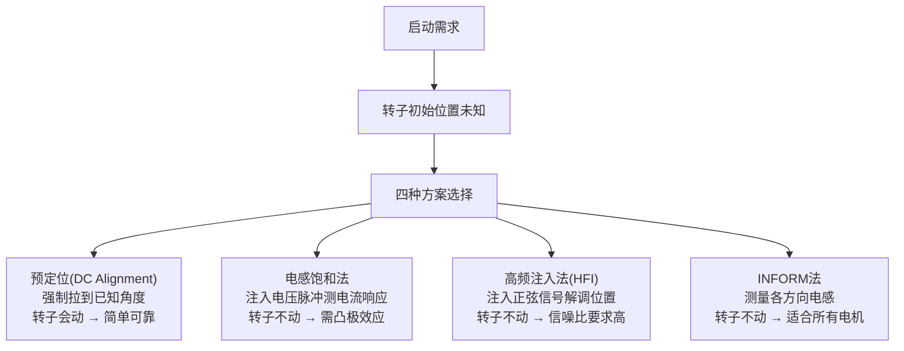
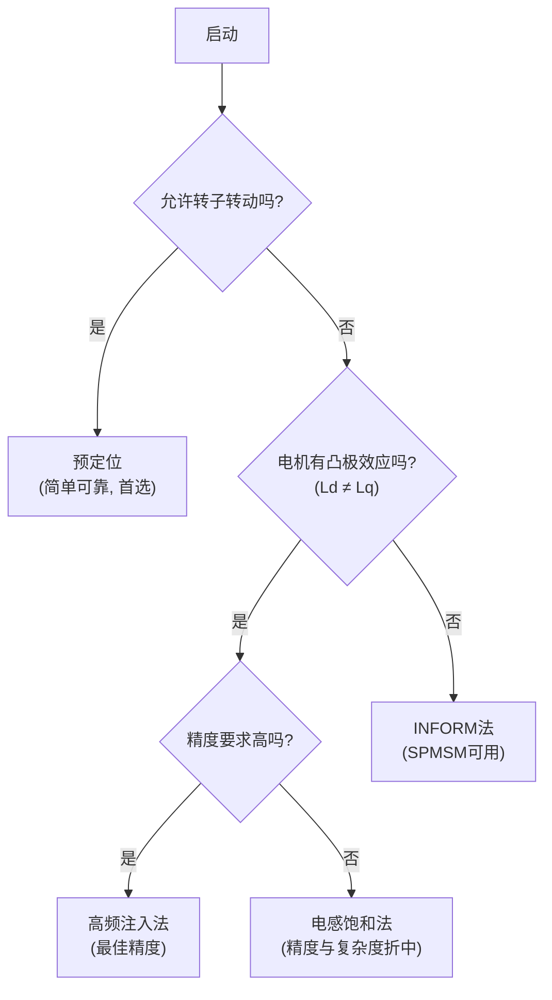
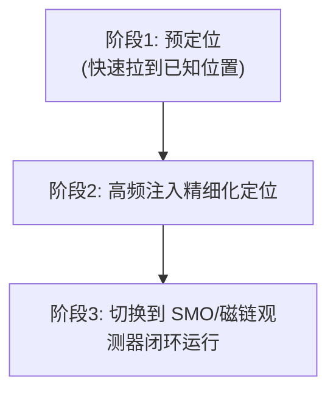

# ALG-08 启动定位与预定位

**模块编号：** ALG-08  
**模块名称：** 启动定位与预定位（Initial Position Detection & Pre-positioning）  
**文档版本：** v1.0  
**适用对象：** 电机控制工程师、嵌入式开发者  
**前置知识：** ALG-01 FOC理论基础、ALG-05 有感FOC实现、ALG-09 高频注入法

---

## 1. 📌 核心摘要 ★★★☆☆ 🔰📚

**一句话：** 无传感器 FOC 启动前必须获取转子初始位置，否则可能导致反转、启动失败或过流。电感饱和法、高频注入法适用于不允许转子转动的场合（精度高），预定位法适用于允许转子微动的场合（实现简单）。

**认知挂钩：** 如果说观测器是在电机转动时"听声音"判断位置，高频注入是在停止时"敲击"电机听回声，那么预定位就是"用手把转子拨到指定位置"——简单粗暴但转子会动，电感饱和法则是"对各个方向轻轻试探一下看哪个方向磁阻最小"。

**核心原理链：**


<!-- 原ASCII决策树转为mermaid flowchart语法,提升可读性 -->

**方法适用条件总览：**

| 条件 | 预定位 | 电感饱和法 | 高频注入 | INFORM |
|------|--------|-----------|---------|--------|
| 允许转子转动 | ✅ 必须 | ❌ 不需要 | ❌ 不需要 | ❌ 不需要 |
| 需要凸极效应 | 不需要 | ✅ Ld≠Lq | ✅ Ld≠Lq | 不需要 |
| 精度要求 | ±10° | ±5° | ±3° | ±5° |
| 实现复杂度 | 低 | 中 | 高 | 中 |

---

## 2. 📐 为什么需要初始位置检测 ★★★☆☆ 📚

### 2.1 无传感器启动的挑战

无传感器 FOC 依赖反电动势或凸极效应估算转子位置。但在零速和极低速时：

- **反电动势为零：** $E = k_e \cdot \omega$，$\omega = 0$ 时 $E = 0$，基于反电动势的观测器（SMO、磁链观测器）完全失效
- **信号不可观测：** 电流、电压信号中不含转子位置信息（对于SPMSM）
- **启动风险：** 若初始位置估算错误 > ±90°电角度，电磁转矩反向，电机可能反转甚至启动失败

### 2.2 增量式编码器的零位问题

即使是**有感 FOC**，若使用增量式编码器（ABZ），上电时只能知道相对位置变化，无法获取绝对位置。必须通过以下方式之一确定初始位置：

- 霍尔传感器粗略定位（60°分辨率）
- Z 相脉冲对齐（需要转子先转动一圈）
- 预定位拉到已知角度

### 2.3 初始位置误差的影响

设初始位置误差为 $\theta_{err}$，施加 q 轴电流 $I_q$ 时：

$$
T_e = \frac{3}{2} P \left[ \psi_f I_q \cos(\theta_{err}) + \frac{1}{2}(L_d - L_q) I_q^2 \sin(2\theta_{err}) \right]
$$

其中：
- $T_e$：电磁转矩 ($Nm$)
- $P$：极对数
- $\psi_f$：永磁磁链 ($Wb$)
- $\theta_{err}$：位置估计误差 ($rad$)

当 $\theta_{err} > 90°$ 时，$T_e < 0$，电机反向转动，严重时触发过流保护。

---

## 3. 📐 电感饱和法 (Inductance Saliency Method) ★★★★☆ 📚

### 3.1 基本原理

利用 IPM 电机的 **凸极效应**（$L_d \neq L_q$），向不同方向注入等幅等宽的电压脉冲，比较各方向的电流响应幅值。电流响应最大的方向即为 **d 轴（N 极）方向**——因为 d 轴电感最小，电流上升最快。

### 3.2 6 扇区脉冲注入法

#### 3.2.1 注入矢量序列

向 6 个方向依次注入短电压脉冲：

| 扇区 | 注入角度 (°电角度) | 对应电压矢量 | 导通开关管 |
|------|-------------------|-------------|-----------|
| 1 | 0° | V4 (100) | A+ B- C- |
| 2 | 60° | V6 (110) | A+ B+ C- |
| 3 | 120° | V2 (010) | A- B+ C- |
| 4 | 180° | V3 (011) | A- B+ C+ |
| 5 | 240° | V1 (001) | A- B- C+ |
| 6 | 300° | V5 (101) | A+ B- C+ |

#### 3.2.2 电流响应分析

对于方向 $k$，注入电压 $U_{inj}$，持续时间 $\Delta t$：

$$
I_k = \frac{U_{inj}}{L_k} \cdot \Delta t
$$

其中 $L_k$ 为该方向的等效电感。凸极效应导致 $L_k$ 随方向变化：

$$
L(\theta) = \frac{L_d + L_q}{2} + \frac{L_d - L_q}{2} \cos(2(\theta - \theta_{rotor}))
$$

**结论：** $L_k$ 最小时（即 d 轴方向），电流响应 $I_k$ 最大 → 找到最大电流方向即找到 d 轴方向。

### 3.3 N/S 极判断

电感饱和法存在 **180° 模糊**——$L(\theta)$ 和 $L(\theta + 180°)$ 相同，无法区分 N 极和 S 极。

**磁路饱和效应判断法：**

向初步定位方向及其反方向各注入一次较长脉冲，利用磁路饱和非线性：

- N 极方向：永磁体磁通与定子磁通同向 → 铁芯饱和加剧 → 电感进一步减小 → 电流更大
- S 极方向：永磁体磁通与定子磁通反向 → 铁芯退饱和 → 电感略大 → 电流略小

两次注入电流差 $\Delta I = I_{正向} - I_{反向}$，若 $\Delta I > 0$，则正向为 N 极。

### 3.4 代码实现

```c
typedef struct {
    float voltage_pulse;       // 注入电压幅值 V
    uint16_t pulse_ticks;      // 脉冲宽度 (PWM周期数)
    uint16_t settle_ticks;     // 等待电流归零的周期数
    float currents[6];         // 6个方向的电流响应
    uint8_t max_sector;        // 最大电流所在扇区
    float ns_diff;             // N/S判断电流差
    float detected_angle;      // 检测到的初始角度 rad
} IPD_Handle;

#define IPD_VOLTAGE      8.0f      // 注入电压 8V
#define IPD_PULSE_TICKS  50        // 50个PWM周期
#define IPD_SETTLE_TICKS 100       // 等待电流衰减

void IPD_InjectPulses(IPD_Handle *h)
{
    const float angles[6] = {0, 60, 120, 180, 240, 300};  // 6方向角度
    float max_current = 0;
    uint8_t max_idx = 0;

    for (uint8_t i = 0; i < 6; i++)
    {
        // 1. 设置电压矢量方向
        FOC_SetVoltageAngle(angles[i], h->voltage_pulse);

        // 2. 等待电流上升
        for (uint16_t t = 0; t < h->pulse_ticks; t++)
        {
            PWM_WaitNextCycle();
        }

        // 3. 采样电流
        h->currents[i] = ADC_ReadPhaseCurrentAmplitude();

        // 4. 关断所有开关管
        FOC_DisableOutput();
        for (uint16_t t = 0; t < h->settle_ticks; t++)
        {
            PWM_WaitNextCycle();
        }

        // 5. 记录最大值
        if (h->currents[i] > max_current)
        {
            max_current = h->currents[i];
            max_idx = i;
        }
    }

    h->max_sector = max_idx;
}

void IPD_NSPolarityCheck(IPD_Handle *h)
{
    float angle_n = h->max_sector * 60.0f;       // N极候选方向
    float angle_s = angle_n + 180.0f;              // S极候选方向
    float i_n, i_s;

    // 向N极方向注入
    FOC_SetVoltageAngle(angle_n, h->voltage_pulse * 1.2f);
    for (uint16_t t = 0; t < h->pulse_ticks; t++) PWM_WaitNextCycle();
    i_n = ADC_ReadPhaseCurrentAmplitude();
    FOC_DisableOutput();
    for (uint16_t t = 0; t < h->settle_ticks; t++) PWM_WaitNextCycle();

    // 向S极方向注入
    FOC_SetVoltageAngle(angle_s, h->voltage_pulse * 1.2f);
    for (uint16_t t = 0; t < h->pulse_ticks; t++) PWM_WaitNextCycle();
    i_s = ADC_ReadPhaseCurrentAmplitude();
    FOC_DisableOutput();

    h->ns_diff = i_n - i_s;

    // 若正向电流 > 反向电流，则为N极；否则加180°
    if (i_n < i_s)
    {
        angle_n += 180.0f;
    }

    h->detected_angle = angle_n * PI / 180.0f;
}
```

### 3.5 参数整定

| 参数 | 典型值 | 整定原则 |
|------|--------|---------|
| 注入电压幅值 | 5~15V | 太小→电流响应不明显；太大→转子可能抖动 |
| 脉冲宽度 | 50~200个PWM周期 | 太短→电流未充分上升；太长→转子可能转动 |
| 等待时间 | 100~500个PWM周期 | 确保电流衰减到零，避免残留影响下一方向 |
| N/S判断脉冲 | 比正常脉冲长20%~50% | 充分激发磁饱和非线性 |

---

## 4. 📐 高频注入法初始定位 ★★★★☆ 📚

### 4.1 旋转高频电压注入

在 $\alpha\beta$ 坐标系注入旋转高频电压：

$$
\begin{cases}
u_{\alpha h} = U_h \cos(\omega_h t) \\
u_{\beta h} = U_h \sin(\omega_h t)
\end{cases}
$$

其中：
- $U_h$：注入电压幅值 ($V$)
- $\omega_h$：注入角频率 ($rad/s$)

**高频电流响应**包含转子位置信息，通过提取负序分量得到：

$$
i_{\alpha\beta h} = I_p e^{j\omega_h t} + I_n e^{j(-\omega_h t + 2\theta_r)}
$$

其中：
- $I_p$：正序分量幅值，$I_p = \frac{U_h}{\omega_h} \cdot \frac{L_d + L_q}{2L_d L_q}$
- $I_n$：负序分量幅值，$I_n = \frac{U_h}{\omega_h} \cdot \frac{L_q - L_d}{2L_d L_q}$
- $\theta_r$：转子位置角 ($rad$)

负序分量的相位 $\angle = 2\theta_r$，提取后可获得转子位置。

### 4.2 脉振高频电压注入

在估计的 $\hat{d}$ 轴注入脉振高频电压：

$$
u_{\hat{d}h} = U_h \cos(\omega_h t), \quad u_{\hat{q}h} = 0
$$

$\hat{q}$ 轴高频电流响应：

$$
i_{\hat{q}h} \approx \frac{U_h}{\omega_h} \cdot \frac{L_q - L_d}{2L_d L_q} \cdot \sin(2\theta_{err}) \cdot \sin(\omega_h t)
$$

其中 $\theta_{err} = \theta_r - \hat{\theta}_r$ 为位置估计误差。

### 4.3 初始位置收敛过程

1. **任意初始角度** $\hat{\theta}_r(0) = \theta_0$
2. 注入脉振高频电压 → 测量 $i_{\hat{q}h}$
3. 乘法解调 + LPF → 提取误差信号 $\varepsilon \propto \sin(2\theta_{err})$
4. PI 调节器 → 修正 $\hat{\omega}_r$
5. 积分 → 更新 $\hat{\theta}_r$
6. 重复2~5直至 $\hat{\theta}_r \to \theta_r$

**收敛时间**取决于PLL带宽，典型值 50~200ms。

详见 [ALG-09 高频注入法](./ALG-09-High-Frequency-Injection.md) 中的 PLL 角度跟踪模型。

---

## 5. 📐 预定位 (DC Alignment) ★★★☆☆ 🔧📚

### 5.1 基本原理

向定子施加固定的直流电压矢量，产生固定方向的定子磁场，永磁转子在该磁场作用下旋转到与定子磁场对齐的位置。

**给定：**

$$
\begin{cases}
I_d = I_{align} \quad (\text{如 } 0.5 \times I_{rated}) \\
I_q = 0
\end{cases}
$$

对应的电角度 $\theta_{align} = 0°$（d 轴方向）。

### 5.2 运动方程

转子的机械运动方程：

$$
J \frac{d^2\theta_m}{dt^2} + B \frac{d\theta_m}{dt} = T_e - T_L
$$

其中对齐转矩：

$$
T_e = \frac{3}{2} P \psi_f I_d \sin(\theta_{err})
$$

当 $\theta_{err} \to 0$ 时，$T_e \to 0$，转子停在对齐位置。

### 5.3 定位时间估算

一阶近似（忽略阻尼和负载）：

$$
t_{align} \approx \sqrt{\frac{2J \cdot \Delta\theta}{\frac{3}{2} P^2 \psi_f I_{align}}}
$$

其中：
- $J$：转动惯量 ($kg \cdot m^2$)
- $\Delta\theta$：初始角偏差 ($rad$)
- $P$：极对数

实际定位过程为欠阻尼二阶振荡，包络衰减特性与转动惯量、阻尼系数相关。定位时间主要受机械时间常数影响：

$$
\tau_m \approx \frac{J \cdot R_s}{K_t \cdot K_e}
$$

其中 $K_t = \frac{3}{2}P\psi_f$ 为转矩常数，$K_e = P\psi_f$ 为反电势常数。

### 5.4 代码实现

```c
typedef struct {
    float align_current;       // 对齐电流 A
    float align_time_ms;       // 对齐持续时间 ms
    float current_ramp_rate;   // 电流斜坡速率 A/s
    uint8_t state;             // 状态: 0=未开始, 1=对齐中, 2=完成
    float elapsed_ms;          // 已对齐时间 ms
} PreAlign_Handle;

void PreAlign_Process(PreAlign_Handle *h, float dt_ms)
{
    switch (h->state)
    {
    case 0:  // 开始预定位
        h->state = 1;
        h->elapsed_ms = 0;
        break;

    case 1:  // 对齐中
    {
        h->elapsed_ms += dt_ms;

        // 电流软启动（斜坡上升）
        float ramp_frac = (h->elapsed_ms * h->current_ramp_rate / 1000.0f)
                          / h->align_current;
        if (ramp_frac > 1.0f) ramp_frac = 1.0f;

        float id_ref = h->align_current * ramp_frac;

        // 设置 Id 参考电流, Iq = 0, 角度 = 0°
        FOC_SetIdRef(id_ref);
        FOC_SetIqRef(0);
        FOC_SetElectricalAngle(0);

        if (h->elapsed_ms >= h->align_time_ms)
        {
            h->state = 2;  // 对齐完成
        }
        break;
    }

    case 2:  // 对齐完成, 切换到正常运行
        break;
    }
}
```

### 5.5 优缺点

| 优点 | 缺点 |
|------|------|
| 实现极简，无需额外算法 | 转子会转动一个角度 |
| 适用于所有电机类型 | 对齐时间受惯量影响 |
| 无需凸极效应 | 带载启动可能无法对齐 |
| 可靠性高 | 不适用于不允许转子转动的场合 |

---

## 6. 📐 短脉冲法 (INFORM) ★★★★☆ 📚

### 6.1 基本原理

INFORM（**I**ndirect Flux detection by **O**n-line **R**eactance **M**easurement）通过测量不同方向的电感来检测转子位置。施加极短的电压脉冲（$\mu s$级），测量电流变化率 $di/dt$：

$$
\frac{di}{dt} \approx \frac{U_{DC} - E}{L}
$$

由于脉冲极短（转子来不及转动），且各方向电感不同（凸极效应），$di/dt$ 随方向变化：

$$
\left|\frac{di}{dt}\right| \propto \frac{1}{L(\theta)}
$$

### 6.2 测量序列

与电感饱和法类似的 6 方向注入，但测量的是电流变化率而非峰值电流：

1. 依次向 6 个方向施加极短电压脉冲（1~5个PWM周期）
2. 测量每个方向上的 $di/dt$
3. $di/dt$ 最大的方向 → d 轴方向
4. N/S 极判断同电感饱和法

### 6.3 INFORM 信号处理

定义 INFORM 指标：

$$
y_k = \frac{\Delta i_k}{U_{DC} \cdot \Delta t}, \quad k = 0,1,...,5
$$

$y_k$ 随方向变化的关系：

$$
y_k \approx \frac{1}{2}\left(\frac{1}{L_d} + \frac{1}{L_q}\right) + \frac{1}{2}\left(\frac{1}{L_d} - \frac{1}{L_q}\right) \cos\left(2\left(k \cdot 60° - \theta_r\right)\right)
$$

通过对 6 个 $y_k$ 值进行三角函数拟合，可提取转子位置 $\theta_r$。

### 6.4 与电感饱和法的区别

| 特性 | 电感饱和法 | INFORM |
|------|-----------|--------|
| 测量量 | 峰值电流 | 电流变化率 $di/dt$ |
| 脉冲宽度 | 较长（50~200周期） | 极短（1~5周期） |
| 是否需要凸极 | 是 | 否（通过在线测量反应实现） |
| 适用电机 | IPMSM | IPMSM / SPMSM |
| 计算量 | 低 | 中等 |
| 抗噪声能力 | 较好 | 一般 |

---

## 7. 📊 方法对比与选型 ★★★★★ 📚

### 7.1 综合对比表

| 方法 | 精度 | 转子是否移动 | 所需时间 | 凸极要求 | 实现复杂度 | 适用场景 |
|------|------|-------------|---------|---------|-----------|---------|
| 预定位 (DC Alignment) | ±10° | **是** | 100~1000ms | 否 | ★☆☆☆☆ | 允许转动的通用场合 |
| 电感饱和法 | ±5° | 否 | 50~200ms | Ld≠Lq | ★★★☆☆ | IPM电机, 零速启动 |
| 高频注入法 (HFI) | ±3° | 否 | 100~500ms | Ld≠Lq | ★★★★★ | 高性能伺服, 零低速 |
| INFORM | ±5° | 否 | 30~100ms | 否（弱凸极可工作） | ★★★☆☆ | 通用, SPMSM可用 |

### 7.2 选型决策流程


<!-- 原ASCII决策树转为mermaid flowchart语法,提升可读性 -->

### 7.3 高频注入 vs 电感饱和 vs 观测器衔接

此模块与以下模块紧密衔接：

| 衔接模块 | 关系说明 |
|---------|---------|
| [ALG-09 高频注入法](./ALG-09-High-Frequency-Injection.md) | HFI 初始定位 → 低速运行 → 中高速切换 |
| [ALG-07 无感FOC观测器](./ALG-07-Sensorless-Observers.md) | 初始定位完成 → SMO/磁链观测器接管 |
| [HW-03 位置传感器](../hardware/HW-03-Position-Sensor.md) | 增量式编码器定位 → 绝对位置获取 |

---

## 8. 🔗 硬件约束 ★★★★☆ ⚠️

### 8.1 电流采样精度

🔗 **硬件约束：** 电感饱和法和 INFORM 法依赖精确的电流测量，ADC 分辨率和采样噪声直接影响定位精度。

- 12位 ADC：最小分辨电流 ≈ 额定电流 / 4096
- 注入脉冲时电流较小（可能仅为额定电流的 5~10%），量化噪声显著
- 建议使用过采样技术提高有效分辨率 → [HW-02 电流采样电路](../hardware/HW-02-Current-Sensing.md)

### 8.2 逆变器非线性

🔗 **硬件约束：** 死区效应和管压降在低电压注入时影响显著。

- 注入电压通常仅 5~15V，死区误差可达 2~5V，占比极大
- 管压降（IGBT约1.5V、MOSFET约0.3V）叠加是非线性的
- 需进行死区补偿 → [ALG-04 死区补偿](./ALG-04-Deadtime-Compensation.md)

### 8.3 PWM 频率限制

🔗 **硬件约束：** 注入脉冲的最短宽度受限于 PWM 频率。

- PWM 频率 10kHz → 最小单周期 = 100μs
- INFORM 需要极短脉冲（1~5周期），PWM 频率越高越好
- 高频注入法的注入频率 $f_h < f_{sw}/10$ → [HW-04 MCU外设与通信](../hardware/HW-04-MCU-Peripherals.md)

---

## 9. 🚀 前沿拓展 ★★★★★ 💡

### 9.1 无传感器初始位置检测的融合策略

实际工程中常采用**多级融合**策略：


<!-- 原ASCII多级融合策略流程图转为mermaid flowchart语法 -->

### 9.2 基于机器学习的初始位置检测

- 训练神经网络直接从电流响应波形预测转子位置
- 适用于高度非线性、多因素耦合的场景
- 需要大量实验数据训练，泛化到不同电机仍需研究

### 9.3 自适应脉冲参数

- 根据母线电压自动调整注入脉冲宽度
- 根据电机参数（$L_d, L_q, R_s$）在线优化脉冲幅值
- 动态补偿死区效应以提高小信号精度

### 9.4 全速域无缝启动

将初始位置检测、低速运行、高速运行统一在同一观测器框架下，消除切换冲击：

| 速度段 | 主导方法 | 特点 |
|--------|---------|------|
| 静止 | 电感饱和法 / INFORM | 快速初始定位 |
| 极低速 | 高频注入法 | 持续跟踪 |
| 中高速 | SMO / 磁链观测器 | 高动态响应 |

---

## 关键公式速查表

| 名称 | 公式 | 说明 |
|------|------|------|
| 电感方向依赖 | $L(\theta) = \frac{L_d+L_q}{2} + \frac{L_d-L_q}{2}\cos(2(\theta - \theta_r))$ | 电感随方向变化 |
| 脉冲电流响应 | $I_k = \frac{U_{inj}}{L_k} \cdot \Delta t$ | 等脉宽下的峰值电流 |
| N/S判断 | $\Delta I = I_{正向} - I_{反向}$ | 磁饱和判断 |
| 误差信号(脉振注入) | $\varepsilon \propto \frac{U_h(L_q-L_d)}{2\omega_h L_d L_q}\sin(2\theta_{err})$ | 位置误差提取 |
| 预定位时间(近似) | $t_{align} \approx \sqrt{\frac{2J\Delta\theta}{\frac{3}{2}P^2\psi_f I_{align}}}$ | 一级近似 |
| INFORM指标 | $y_k = \frac{\Delta i_k}{U_{DC} \cdot \Delta t}$ | 电感倒数测量 |

:::sim initial-position
:::

### 🔗 hpm_MC 代码实现参考

**初始位置检测** (`hpm_mcl_v2/core/loop/hpm_mcl_loop.h`):
- 三阶段对齐算法（Three-Stage Alignment）:
  1. 阶段1: 注入固定角度电流，将转子拉到已知位置
  2. 阶段2: 注入反方向电流，消除齿槽效应
  3. 阶段3: 注入最终对齐电流，稳定到目标角度
- 适用于有感FOC启动前的转子定位

**v1 启动定位** (`hpm_mcl/inc/hpm_foc.h`):
- `hpm_foc_posotion_pi()` 位置环直接拖动到目标角度

**HFI 初始位置检测** (`hpm_mcl/inc/hpm_hfi.h`):
- `hpm_hfi_pole_detect_para_t` N/S极辨识
- 高频注入可在转子静止时检测初始位置（无需拖动）

**示例**: `hpm_MC/samples/motor_ctrl/bldc_foc/` — 三阶段对齐参数配置

> 📝 检验你的理解：[ALG-08 检验题目](./ALG-08-assessment.md)
