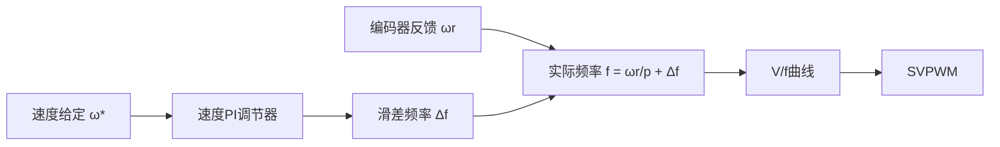
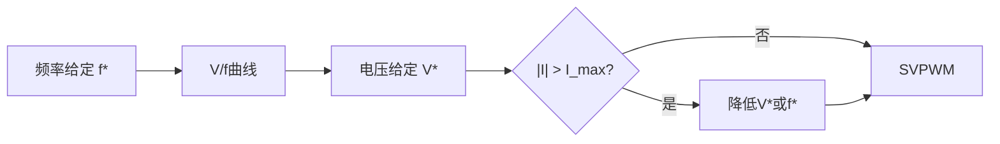
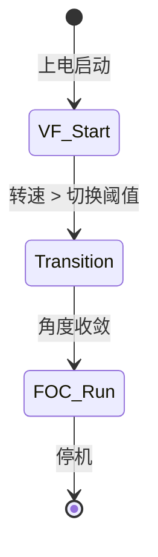
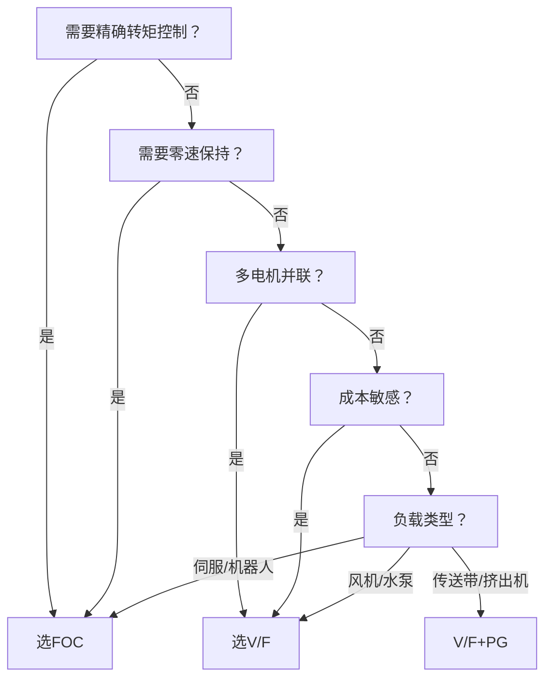

# ALG-17 V/F控制（恒压频比控制）

**模块编号：** ALG-17
**模块名称：** V/F控制（Volts-per-Hertz Control / 恒压频比控制）
**文档版本：** v1.0
**适用对象：** 电机控制工程师、变频器开发者、嵌入式开发者
**前置知识：** 交流电机原理、PWM调制、基础控制理论

---

## 1.  核心摘要  

**一句话：** V/F控制通过维持电压与频率的固定比值（$V/f = \text{常数}$）来保持电机气隙磁链恒定，是一种不依赖转子位置反馈的标量控制方法。

**认知挂钩：** 如果说FOC是"精确制导导弹"——知道目标在哪、实时调整弹道；那V/F就是"定时班车"——按固定时刻表发车，不管路上堵不堵。简单、可靠、成本低，覆盖了全球80%以上的变频器应用场景。

### 核心流程


### V/F vs FOC 速览

| 特性 | V/F控制 | FOC矢量控制 |
| --- | --- | --- |
| 反馈需求 | 无（开环） | 编码器/观测器 |
| 转矩响应 | 慢（百毫秒级） | 快（毫秒级） |
| 低速性能 | 差（5Hz以下不稳定） | 优秀（0速满转矩） |
| 效率 | 中等 | 高 |
| 控制复杂度 | 极低 | 高 |
| 成本 | 极低 | 较高 |
| 适用负载 | 风机/水泵/传送带 | 伺服/机器人/电动汽车 |

### 为什么V/F有效？

交流电机的反电动势与频率成正比：

$$E = 4.44 \cdot f \cdot N \cdot \phi_m \cdot K_w$$

其中 $E$ 为反电动势，$f$ 为频率，$N$ 为匝数，$\phi_m$ 为气隙磁链幅值，$K_w$ 为绕组系数。

忽略定子电阻压降时，端电压 $V \approx E$，因此：

$$\phi_m \propto \frac{V}{f}$$

只要维持 $V/f$ 恒定，气隙磁链就保持不变——这就是V/F控制的全部物理基础。

**相关模块：** [ALG-01 FOC理论基础](ALG-01-FOC-Theory.md) | [ALG-11 MTPA与弱磁控制](ALG-11-MTPA-Flux-Weakening.md)

---

## 2.  问题引入  

### 2.1 工程师的真实困惑

> "我做个风机变频器，为什么要上FOC？成本翻倍，调试周期翻三倍，客户根本不需要0.1Hz的调速精度。"

> "变频器厂家的V/F模式够用了，为什么还要搞矢量控制？多出来的性能谁买单？"

这是绝大多数工业变频器开发者的真实心声。答案很直接——**不是所有应用都需要FOC**。

### 2.2 为什么变频器都用V/F？

| 原因 | 说明 |
| --- | --- |
| **负载特性匹配** | 风机/水泵是二次方转矩负载，低速时转矩需求极低，V/F完全够用 |
| **成本敏感** | 变频器市场竞争激烈，省掉编码器和电流采样电路可降低BOM成本30%以上 |
| **可靠性优先** | 无传感器意味着无传感器故障，工业现场"能跑就是王道" |
| **多电机并联** | 一台变频器拖多台电机时，FOC无法工作（无法区分各电机状态），V/F天然支持 |
| **调试简单** | 现场电工10分钟就能调好V/F参数，FOC需要专业工程师 |

### 2.3 V/F的局限性

但V/F也有硬伤：

1. **低速转矩不足：** 5Hz以下定子电阻压降占比大，磁链衰减严重，电机"爬行"甚至堵转
2. **动态响应差：** 负载突变时转速波动大，无法实现精确转矩控制
3. **无法零速运行：** 开环V/F在0Hz时无法产生有效转矩
4. **效率非最优：** 无法像FOC那样实现MTPA，存在不必要的铜损

---

## 3.  V/F控制原理  

### 3.1 恒压频比的物理本质

交流电机稳态等效电路（每相）：

$$
\dot{V} = (R_s + j\omega_e L_{\sigma}) \dot{I} + j\omega_e \psi_m
$$

其中：
- $V$：相电压（$V$）
- $R_s$：定子电阻（$\Omega$）
- $L_{\sigma}$：漏电感（$H$）
- $\omega_e = 2\pi f$：电角速度（$rad/s$）
- $\psi_m$：气隙磁链（$Wb$）

气隙磁链由反电动势决定：

$$\psi_m = \frac{E}{\omega_e} = \frac{V - R_s I}{\omega_e}$$

当 $V \gg R_s I$ 时（中高速段）：

$$\psi_m \approx \frac{V}{\omega_e} = \frac{V}{2\pi f}$$

因此，维持 $V/f = \text{常数}$ 即可维持 $\psi_m$ 恒定。

### 3.2 磁链恒定的意义

磁链恒定带来两个关键好处：

1. **转矩可控：** 感应电机转矩 $T_e \propto \psi_m \cdot I_r$（$I_r$ 为转子电流），磁链恒定时转矩仅由转子电流决定
2. **铁芯利用率最优：** 磁链维持在额定值附近，既不浪费铁芯容量，也不致饱和

### 3.3 V/F控制的本质——标量控制

V/F只控制电压幅值和频率两个**标量**，不关心电压矢量的空间方向。这意味着：

- **不知道转子在哪：** 不需要编码器，但也无法精确控制转矩角
- **开环运行：** 给定频率后，电机以滑差自寻运行点，负载变化时滑差自动调节
- **稳定裕度有限：** 极低频时滑差相对值大，容易失稳


---

## 4.  V/F控制分类  

### 4.1 分类总览

| 类型 | 速度反馈 | 电流控制 | 性能等级 | 典型应用 |
| --- | --- | --- | --- | --- |
| 简单V/F（开环） | 无 | 无 |  | 风机/水泵 |
| V/F + PG | 有（编码器） | 无 |  | 传送带/挤出机 |
| 矢量V/F | 无 | 电流限幅 |  | 空调压缩机 |
| FOC矢量控制 | 有/无 | dq轴独立 |  | 伺服/电动汽车 |

### 4.2 简单V/F（开环无速度反馈）

最基础的V/F控制，无任何闭环：


**特点：**
- 零传感器，成本最低
- 转速精度取决于滑差（一般3%~5%）
- 负载突变时转速波动大
- 无法实现零速保持

**滑差估算：**

$$n = n_s - \Delta n = \frac{60f}{p} - \frac{60f \cdot s}{p}$$

其中 $s$ 为滑差率，$p$ 为极对数。

### 4.3 V/F + PG（有速度反馈的滑差补偿）

在简单V/F基础上增加编码器速度反馈，实现滑差频率补偿：



**核心思想：** 用PI调节器输出滑差频率 $\Delta f$，叠加到实际转速对应的频率上，实现转速无静差：

$$f_{output} = \frac{\omega_r}{2\pi p} + \Delta f$$

**与FOC的本质区别：** V/F+PG只补偿频率，不进行dq解耦，电流仍是交流量，无法独立控制励磁和转矩分量。

### 4.4 矢量V/F（V/f + 电流限幅）

在V/F基础上增加电流幅值限制，防止过流：



**电流限幅策略：**
- **电压截断：** 电流超限时降低电压幅值，间接限制电流
- **频率回退：** 电流超限时降低频率给定，减小滑差
- **I²t保护：** 短时过流允许，长时间过流降额

**与FOC的本质区别：** 矢量V/F只限制电流幅值（标量），FOC则分别控制 $i_d$ 和 $i_q$（矢量），实现精确的转矩和磁链解耦。

### 4.5 V/F与FOC的本质区别

| 维度 | V/F（标量控制） | FOC（矢量控制） |
| --- | --- | --- |
| 控制对象 | 电压幅值 + 频率 | dq轴电流（矢量） |
| 坐标变换 | 无 | Clarke + Park |
| 磁场控制 | 隐式（V/f比） | 显式（$i_d$ 直接控制） |
| 转矩控制 | 隐式（滑差自寻） | 显式（$i_q$ 直接控制） |
| 解耦 | 无 | dq轴完全解耦 |
| 动态响应 | 慢（受电机时间常数限制） | 快（电流环带宽高） |
| 电流波形 | 正弦度差 | 正弦度好 |

---

## 5.  V/F电压模型  

### 5.1 基频以下：恒转矩区（V/f恒定）

基频以下，电压和频率同步线性增长，维持 $V/f = \text{常数}$：

$$V^* = \frac{V_{rated}}{f_{rated}} \cdot f^*$$

其中：
- $V_{rated}$：额定电压（$V$）
- $f_{rated}$：额定频率（$Hz$），即基频
- $f^*$：给定频率（$Hz$）
- $V^*$：输出电压给定（$V$）

**物理意义：** 恒磁链运行，电机可输出额定转矩，称为**恒转矩区**。

```mermaid
quadrantChart
    title V/f特性曲线
    x-axis Frequency --> 
    y-axis Voltage -->
    quadrant-1 Constant Torque Region
    quadrant-2 
    quadrant-3
    quadrant-4 Field Weakening Region
```

### 5.2 基频以上：弱磁区（电压饱和）

频率超过基频后，电压受母线电压限制无法继续上升：

$$V^* = V_{max} = V_{dc} / \sqrt{3} \quad (f^* > f_{rated})$$

此时 $V/f$ 比值随频率升高而下降，磁链被"弱化"：

$$\psi_m = \frac{V_{max}}{2\pi f^*} \propto \frac{1}{f^*}$$

**转矩特性：** 弱磁区转矩与频率成反比，功率近似恒定——**恒功率区**。

$$T_e \propto \frac{1}{f^*}, \quad P \approx \text{常数}$$

### 5.3 完整V/f曲线

$$
V^*(f) = \begin{cases}
V_{boost} + \frac{V_{rated} - V_{boost}}{f_{rated}} \cdot f^* & 0 \leq f^* \leq f_{rated} \\
V_{max} & f^* > f_{rated}
\end{cases}
$$

其中 $V_{boost}$ 为低频补偿电压。

```text
电压V
  │         ╱───────── 弱磁区（恒功率）
  │        ╱
  │       ╱  恒转矩区（V/f恒定）
  │      ╱
  │     ╱
  │    ╱
  │___╱  ← 低频补偿（电压提升V_boost）
  │  ╱
  └────────────────── 频率f
  0
```

### 5.4 低频补偿（电压提升）

**问题根源：** 低频时定子电阻压降不可忽略。

电机相电压方程：

$$V = \underbrace{R_s I}_{\text{电阻压降}} + \underbrace{j\omega_e L_\sigma I}_{\text{漏抗压降}} + \underbrace{j\omega_e \psi_m}_{\text{反电动势}}$$

低频时 $\omega_e$ 很小，反电动势 $E = \omega_e \psi_m$ 很小，$R_s I$ 占比显著：

$$\frac{R_s I}{V}\bigg\lvert _{f=f_n} \approx 2\% \sim 5\%, \quad \frac{R_s I}{V}\bigg \rvert_{f=5Hz} \approx 20\% \sim 40\%$$

**补偿方法：**

| 方法 | 公式 | 特点 |
| --- | --- | --- |
| 固定提升 | $V_{boost} = R_s \cdot I_{rated}$ | 简单，轻载过补偿 |
| 线性提升 | $V_{boost}(f) = V_{boost0} \cdot (1 - f/f_{rated})$ | 随频率递减，较合理 |
| 电流反馈提升 | $V_{boost} = R_s \cdot \lvert I \rvert$ | 最精确，需电流采样 |
| 手动设置 | 用户根据负载调整 | 灵活，依赖经验 |

**过补偿风险：** 电压提升过大导致磁链饱和，电流畸变、铁损增大、电机发热。一般建议提升量不超过额定电压的10%~15%。

---

## 6.  开环启动策略  

### 6.1 V/F开环启动→切换到FOC

许多伺服驱动器采用"V/F启动 + FOC运行"的混合策略，解决无感FOC低速观测器不可靠的问题：



**切换流程：**

1. **V/F启动阶段（0 → $f_{switch}$）：**
   - 按V/f曲线逐步升频
   - 电机在开环下加速，滑差自动调节
   - 观测器后台运行但不参与控制

2. **切换阶段（$f \approx f_{switch}$）：**
   - 观测器角度 $\hat{\theta}$ 与V/F开环角度 $\theta_{ol}$ 比较
   - 当角度误差 $\lvert \hat{\theta} - \theta_{ol} \rvert < \theta_{threshold}$ 且持续 $N$ 个周期
   - 无扰动切换：

     $$\theta_{ctrl} = \hat{\theta}$$

3. **FOC运行阶段（$f > f_{switch}$）：**
   - 完全由观测器提供角度
   - dq轴电流闭环控制
   - 转矩响应显著改善

**切换阈值选择：** $f_{switch}$ 通常为5~15Hz，取决于观测器在哪个频率下能可靠收敛。

### 6.2 启动电流限制方法

V/F开环启动最大问题是启动电流不可控——频率给定突变时，滑差瞬间增大，电流可能达到额定值的5~8倍。

**限制策略：**

| 方法 | 原理 | 优缺点 |
| --- | --- | --- |
| 加速斜坡限制 | 限制频率变化率 $df/dt$ | 简单有效，启动慢 |
| 电流截断 | 电流超限时暂停升频 | 保护有效，但转矩波动 |
| 电压限幅 | 限制输出电压幅值 | 间接限流，精度差 |
| 软启动+直流制动 | 先通直流定位再升频 | 减少启动冲击，需额外逻辑 |

**推荐方案：** 加速斜坡 + 电流截断组合使用。

### 6.3 加速斜坡设计（S曲线加速）

线性加速斜坡在启停瞬间存在加速度突变（jerk无穷大），引起机械冲击。S曲线斜坡通过限制加加速度（jerk）实现平滑过渡：

$$
a(t) = \begin{cases}
J \cdot t & 0 \leq t \leq t_1 \quad \text{（加速段1：jerk恒正）} \\
a_{max} & t_1 < t \leq t_2 \quad \text{（匀加速段）} \\
a_{max} - J \cdot (t - t_2) & t_2 < t \leq t_3 \quad \text{（加速段2：jerk恒负）} \\
0 & t > t_3 \quad \text{（匀速段）} \\
\end{cases}
$$

其中 $J$ 为加加速度（$Hz/s^2$），$a_{max}$ 为最大加速度（$Hz/s$）。

**S曲线 vs 线性斜坡：**

```text
频率f
  │        ╭────────────── 匀速
  │      ╭╯
  │    ╭╯  ← S曲线：平滑过渡
  │  ╭╯
  │╭╯
  │╯
  │
  │      /────────────── 匀速
  │    /
  │  /      ← 线性：加速度突变
  │/
  └────────────────── 时间t
```

**参数设计：**
- 加速时间 $t_{acc}$：一般3~30s，根据负载惯性设定
- Jerk值 $J$：$J = a_{max} / t_{jerk}$，$t_{jerk}$ 一般取加速时间的10%~20%
- 减速时间 $t_{dec}$：通常等于或略短于加速时间（需考虑泵升电压）

---

## 7.  V/F的工程应用  

### 7.1 变频器（风机/水泵/传送带）

**风机水泵（二次方转矩负载）：**

$$T_L \propto n^2, \quad P_L \propto n^3$$

V/F控制完美匹配此类负载特性：
- 低速时转矩需求极低，V/F的弱磁问题不存在
- 节能效果显著：50%转速时功率仅为额定的12.5%
- 无需精确转速控制，3%~5%的滑差完全可接受

**传送带（恒转矩负载）：**

$$T_L = \text{常数}$$

V/F可用但需注意：
- 低速时需要足够的电压提升
- 启动时需限制加速斜坡，防止皮带打滑
- 建议使用V/F+PG模式保证转速精度

### 7.2 家电变频（空调压缩机）

空调压缩机是V/F控制最大的应用领域之一：

| 特性 | 要求 | V/F应对 |
| --- | --- | --- |
| 成本 | 极低（整机成本敏感） | 无传感器，MCU资源需求低 |
| 噪声 | 低噪音 | S曲线斜坡减少振动 |
| 调速范围 | 30~120Hz | V/f+低频补偿覆盖 |
| 可靠性 | 10年免维护 | 开环无传感器故障点 |
| 效率 | 能效等级要求 | 矢量V/F+电流限幅优化 |

**实际方案：** 多数空调压缩机采用"矢量V/F"——V/f曲线 + 电流幅值闭环，兼顾成本与效率。

### 7.3 多电机并联驱动

一台变频器拖动多台电机是V/F的独有优势场景：

**为什么FOC不行？** FOC需要精确知道每台电机的转子位置，多台电机并联时无法区分各电机状态。

**V/F方案：**
- 变频器输出固定V/f比的电压和频率
- 各电机按自身滑差独立运行
- 总电流 = 各电机电流之和

**注意事项：**
- 各电机参数应尽量一致
- 变频器容量需大于所有电机容量之和
- 无法实现单台电机的独立保护

---

## 8.  V/F vs FOC选型决策  

### 8.1 对比表

| 维度 | V/F控制 | FOC矢量控制 |
| --- | --- | --- |
| **硬件成本** | （无传感器） | （编码器+电流采样） |
| **MCU资源** | （<10% CPU） | （30%~60% CPU） |
| **开发周期** | （1~2周） | （1~3月） |
| **调速精度** | ±3%~5% | ±0.01%~0.1% |
| **转矩响应** | 100~500ms | 1~5ms |
| **低速性能** | >5Hz可用 | 0Hz满转矩 |
| **效率** | 85%~92% | 92%~97% |
| **多电机并联** | 支持 | 不支持 |
| **参数敏感性** | 低（几乎免调） | 高（电机参数必须准确） |

### 8.2 选型决策树



### 8.3 成本对比实例

以3kW变频器为例：

| 项目 | V/F方案 | FOC方案 |
| --- | --- | --- |
| MCU | STM32F103（¥8） | STM32F407（¥25） |
| 电流采样 | 无 | 3×运放+电阻（¥5） |
| 编码器 | 无 | 增量式（¥30~80） |
| 开发周期 | 2周 | 2月 |
| **总BOM差异** | **基准** | **+¥50~100** |

---

## 9.  代码实现  

### 9.1 V/F控制主流程

```c
typedef struct {
    float freq_ref;
    float freq_output;
    float volt_output;
    float v_by_f;
    float v_boost;
    float f_rated;
    float v_rated;
    float accel_rate;
    float decel_rate;
    float i_max;
} vf_ctrl_t;

void vf_control(vf_ctrl_t *vf)
{
    vf_ramp_generator(vf);
    vf_voltage_calc(vf);
    vf_boost_compensate(vf);
    vf_current_limit(vf);
    svpwm_generate(vf->volt_output, vf->freq_output);
}
```

### 9.2 V/f电压曲线计算

```c
void vf_voltage_calc(vf_ctrl_t *vf)
{
    float v_by_f_ratio = vf->v_rated / vf->f_rated;

    if (vf->freq_output <= vf->f_rated) {
        vf->volt_output = v_by_f_ratio * vf->freq_output;
    } else {
        vf->volt_output = vf->v_rated;
    }
}
```

### 9.3 低频电压补偿

```c
void vf_boost_compensate(vf_ctrl_t *vf)
{
    if (vf->freq_output < vf->f_rated) {
        float boost_ratio = 1.0f - vf->freq_output / vf->f_rated;
        vf->volt_output += vf->v_boost * boost_ratio;
    }
}
```

### 9.4 S曲线加速斜坡

```c
typedef struct {
    float freq_target;
    float freq_current;
    float accel;
    float accel_max;
    float jerk;
    int state;
} ramp_t;

void ramp_s_curve(ramp_t *r)
{
    switch (r->state) {
    case 0:
        r->accel += r->jerk * PWM_PERIOD;
        if (r->accel >= r->accel_max) {
            r->accel = r->accel_max;
            r->state = 1;
        }
        break;
    case 1:
        r->accel = r->accel_max;
        if ((r->freq_target - r->freq_current) < 
            (r->accel * r->accel) / (2.0f * r->jerk)) {
            r->state = 2;
        }
        break;
    case 2:
        r->accel -= r->jerk * PWM_PERIOD;
        if (r->accel <= 0.0f) {
            r->accel = 0.0f;
            r->state = 3;
        }
        break;
    case 3:
        r->accel = 0.0f;
        break;
    }

    r->freq_current += r->accel * PWM_PERIOD;

    if (r->freq_current >= r->freq_target) {
        r->freq_current = r->freq_target;
        r->accel = 0.0f;
        r->state = 3;
    }
}
```

### 9.5 电流限幅

```c
void vf_current_limit(vf_ctrl_t *vf)
{
    float i_mag = get_current_magnitude();

    if (i_mag > vf->i_max) {
        float scale = vf->i_max / i_mag;
        vf->volt_output *= scale;
    }
}
```

### 9.6 V/F→FOC无扰动切换

```c
typedef struct {
    float theta_vf;
    float theta_observer;
    float theta_output;
    float f_switch;
    int mode;
} hybrid_ctrl_t;

void hybrid_switch(hybrid_ctrl_t *hc, float freq)
{
    if (hc->mode == 0 && freq >= hc->f_switch) {
        float angle_error = fabsf(hc->theta_observer - hc->theta_vf);
        angle_error = fmodf(angle_error, 2.0f * PI);

        if (angle_error > PI) angle_error = 2.0f * PI - angle_error;

        if (angle_error < 0.1f) {
            hc->mode = 1;
            hc->theta_output = hc->theta_observer;
        } else {
            float blend = 0.1f;
            hc->theta_output = hc->theta_vf + blend * 
                (hc->theta_observer - hc->theta_vf);
        }
    }

    if (hc->mode == 0) {
        hc->theta_output = hc->theta_vf;
    } else {
        hc->theta_output = hc->theta_observer;
    }
}
```

---

## 10.  参数整定指南  

### 10.1 V/f比设定

$$\left(\frac{V}{f}\right)_{设定} = \frac{V_{rated}}{f_{rated}}$$

| 电机类型 | 典型V/f比 | 说明 |
| --- | --- | --- |
| 220V/50Hz | 4.4 V/Hz | 单相输入三相输出 |
| 380V/50Hz | 7.6 V/Hz | 工业标准 |
| 460V/60Hz | 7.67 V/Hz | 北美标准 |

**整定步骤：**
1. 按额定参数计算初始V/f比
2. 空载运行，测量各频率点电流
3. 若某频段电流偏大→V/f比偏高→适当降低
4. 若某频段输出转矩不足→V/f比偏低→适当提高

### 10.2 电压提升（V_boost）整定

**经验公式：**

$$V_{boost} = R_s \cdot I_{rated} \cdot (1 \sim 1.5)$$

**整定步骤：**

1. **初始值：** 设为额定电压的3%~5%
2. **低速测试：** 在5Hz空载运行，观察电流
3. **逐步增加：** 每次增加1%额定电压，直到低速启动正常
4. **满载验证：** 带载低速运行，确认转矩充足
5. **过补偿检查：** 空载低速电流不应超过额定电流的50%

**异常判断：**

| 现象 | 可能原因 | 处理 |
| --- | --- | --- |
| 低速空载电流大 | V_boost过高 | 降低V_boost |
| 低速带载堵转 | V_boost过低 | 增加V_boost |
| 低速振动 | V_boost不当或负载突变 | 微调+增加斜坡时间 |
| 电机发热 | 磁路饱和 | 降低V_boost |

### 10.3 加速/减速时间整定

**加速时间计算：**

$$t_{acc} = \frac{J_{total} \cdot \Delta\omega}{T_{acc} - T_{load}}$$

其中：
- $J_{total}$：电机+负载总转动惯量（$kg \cdot m^2$）
- $\Delta\omega$：速度变化量（$rad/s$）
- $T_{acc}$：加速转矩（$N \cdot m$）
- $T_{load}$：负载转矩（$N \cdot m$）

**经验值：**

| 应用 | 加速时间 | 减速时间 |
| --- | --- | --- |
| 风机 | 15~60s | 15~60s |
| 水泵 | 5~15s | 5~15s |
| 传送带 | 3~10s | 3~10s |
| 离心机 | 30~120s | 30~120s |

**减速注意事项：** 大惯量负载快速减速时，电机处于发电状态，直流母线电压泵升。需设置：
- 直流制动：低速时注入直流电流制动
- 制动电阻：消耗泵升能量
- 减速时间延长：限制泵升电压

### 10.4 电流限幅设定

$$I_{limit} = (1.2 \sim 2.0) \times I_{rated}$$

| 场景 | 限幅倍数 | 说明 |
| --- | --- | --- |
| 风机水泵 | 1.2~1.5 | 负载平稳，无需大过载 |
| 传送带 | 1.5~2.0 | 启动时需要较大转矩 |
| 离心机 | 1.5~1.8 | 大惯量启动 |

---

## 11.  交叉视角  

### 11.1 与ALG-01（FOC理论）的关联

V/F与FOC是交流电机控制的两个极端：

| 关联点 | V/F视角 | FOC视角 |
| --- | --- | --- |
| 磁链控制 | 隐式（V/f比） | 显式（$i_d$ 闭环） |
| 转矩控制 | 隐式（滑差自寻） | 显式（$i_q$ 闭环） |
| 坐标变换 | 无 | Clarke + Park |
| 电流控制 | 幅值限制 | dq轴独立PI |
| 角度信息 | 不需要 | 必须有（编码器/观测器） |

**进阶路径：** V/F → V/F+PG → 矢量V/F → FOC，每一步增加闭环环节，性能递增。

### 11.2 与ALG-11（弱磁控制）的关联

V/F的弱磁区与FOC弱磁控制物理本质相同，但实现方式截然不同：

| 关联点 | V/F弱磁 | FOC弱磁 |
| --- | --- | --- |
| 触发条件 | $f > f_{rated}$，电压饱和 | $\lvert u_{dq} \rvert > u_{max}$ |
| 弱磁手段 | 电压不再随频率增加 | 注入负 $i_d$ |
| 磁链变化 | $\psi \propto 1/f$ | $\psi = \psi_f + L_d i_d$ |
| 转矩控制 | 无法精确控制 | $i_q$ 闭环精确控制 |
| 最优轨迹 | 无（自然弱磁） | MTPA→弱磁→MTPV |

### 11.3 与SYS-02（变频器vs电控）的关联

V/F是变频器的标配算法，FOC是电控（伺服驱动器）的核心算法：

| 维度 | 变频器（V/F为主） | 电控/伺服（FOC为主） |
| --- | --- | --- |
| 核心指标 | 可靠性、成本 | 精度、响应 |
| 典型应用 | 风机/水泵/传送带 | 机器人/CNC/电动汽车 |
| 功率等级 | 0.75kW~几MW | 50W~几百kW |
| 控制算法 | V/F（80%）+ 简易矢量（20%） | FOC（95%）+ V/F启动（5%） |
| 行业标准 | IEC 61800系列 | IEC 61800系列 + 行业特定 |

---

## 12.  工程案例与实践练习  

### 12.1 工程案例：3kW风机变频器V/F调试

**系统参数：**
- 电机：3kW、380V、50Hz、4极、$\cos\varphi = 0.85$
- 额定电流：6.2A
- 定子电阻：

  $$R_s = 2.1\Omega$$
- 变频器：380V输入，SVPWM调制，开关频率4kHz

**调试过程：**

| 步骤 | 操作 | 观察量 | 判据 |
| --- | --- | --- | --- |
| 1 | 设置V/f比=7.6V/Hz | — | 按额定参数计算 |
| 2 | 设置V_boost=10V | 5Hz空载电流 | 应≤3A |
| 3 | 空载50Hz运行 | 电流波形 | 正弦度好，电流≈2A |
| 4 | 加速时间=20s | 启动电流 | ≤8A |
| 5 | 带载运行 | 转速稳定性 | 滑差≤3% |
| 6 | 减速测试 | 母线电压 | ≤800V |

**典型问题及解决：**

| 问题 | 现象 | 原因 | 解决 |
| --- | --- | --- | --- |
| 启动跳闸 | 启动瞬间过流保护 | 加速时间过短 | 增加至30s |
| 低速振动 | 10Hz以下电机抖动 | V_boost不足 | 增加至15V |
| 减速过压 | 减速时母线过压 | 大惯量泵升 | 增加减速时间+制动电阻 |
| 空载电流大 | 50Hz空载3.5A | V/f比偏高 | 降低至7.2V/Hz |

### 12.2 实践练习

**练习1：V/f曲线绘制 **

给定电机参数：220V/60Hz、$R_s = 3.5\Omega$、$I_{rated} = 4.5A$

1. 计算V/f比
2. 计算V_boost推荐值
3. 绘制含低频补偿的完整V/f曲线（0~90Hz）
4. 标注恒转矩区和弱磁区

**练习2：启动电流估算 **

给定：4极感应电机、50Hz、滑差率5%、转动惯量 $J = 0.05\,kg \cdot m^2$

1. 计算额定转速
2. 若加速时间设为10s，估算平均加速转矩
3. 估算启动峰值电流（假设启动转矩为额定2倍）

**练习3：V/F→FOC切换设计 **

给定：永磁同步电机、8极、观测器在10Hz以上可靠收敛

1. 设计V/F启动阶段的角度生成算法
2. 确定切换频率阈值
3. 设计无扰动切换逻辑（角度融合策略）
4. 分析切换失败的可能原因及保护措施

**练习4：多电机并联V/F设计 **

给定：一台7.5kW变频器拖动3台2.2kW风机电机

1. 计算变频器容量是否足够
2. 设计V/f参数（各电机参数一致）
3. 分析单台电机堵转时的系统行为
4. 设计保护策略

---

##  参考资源

| 资源 | 说明 |
| --- | --- |
| [ALG-01 FOC理论基础](ALG-01-FOC-Theory.md) | FOC完整理论推导 |
| [ALG-11 MTPA与弱磁控制](ALG-11-MTPA-Flux-Weakening.md) | 弱磁区深入分析 |
| [ALG-04 死区补偿](ALG-04-Deadtime-Compensation.md) | V/F低速时死区影响更大 |
| IEC 61800-2 | 变频器一般要求 |
| GB/T 12668 | 中国变频器标准 |
