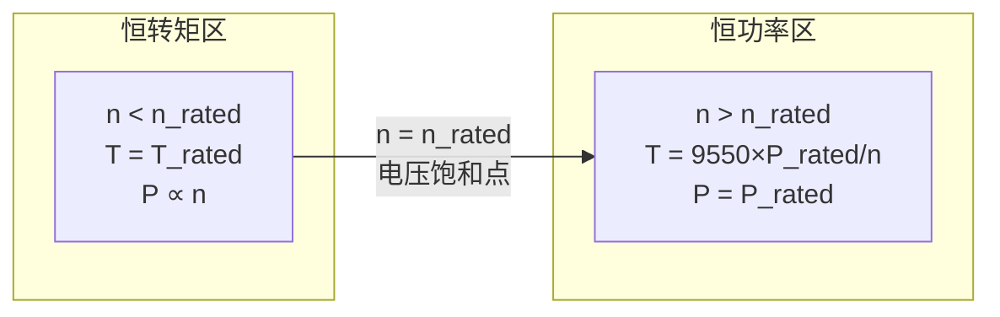
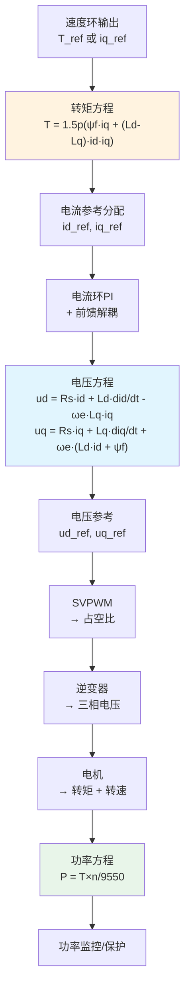

# ALG-20 控制视角下的dq方程与功率方程：用途解读

- **模块编号：** ALG-20
- **模块名称：** 控制视角下的dq电压方程、电磁转矩方程与机械功率方程用途解读
- **文档版本：** v1.0
- **适用对象：** 电机控制算法工程师、嵌入式开发者
- **前置知识：** FOC理论基础（ALG-01）、PI电流调节器（ALG-03）、电机物理本质（HW-01B）
- **难度等级：** 

---

## 1.  核心摘要  

- **一句话：** dq电压方程告诉你"电流环该输出什么电压"，电磁转矩方程告诉你"电流和转矩怎么换算"，机械功率方程告诉你"功率、转矩、转速三者如何快速互算"——三个方程分别对应控制系统的三个核心环节：**电流调节→转矩输出→功率评估**。

- **认知挂钩：** 很多人能默写出dq电压方程，但不知道每一项在控制代码中对应哪一行。就像会背牛顿第二定律F=ma，但不知道刹车时m和a怎么用一样。本模块不推导公式，而是回答一个工程师最关心的问题：**这个方程在我的控制代码里干什么用？**

### 三个方程的控制角色


| 方程 | 控制角色 | 核心用途 | 对应代码模块 |
|------|---------|---------|------------|
| dq电压方程 | 电流环设计依据 | PI参数计算、前馈解耦、电压饱和判断 | 电流环PI、解耦前馈 |
| 电磁转矩方程 | 电流→转矩映射 | 转矩常数计算、MTPA、弱磁轨迹 | 转矩参考生成、电流分配 |
| 机械功率方程 | 功率/转矩/转速换算 | 电机选型验证、过载能力评估、效率计算 | 保护阈值、功率监控 |

- **相关模块：** [ALG-01 FOC理论基础](ALG-01-FOC-Theory.md) | [ALG-03 PI电流调节器](ALG-03-PI-Current-Regulator.md) | [ALG-11 MTPA与弱磁](ALG-11-MTPA-Flux-Weakening.md) | [HW-01B 电机物理本质](../hardware/HW-01B-Motor-Physics-Deep-Dive.md)

---

## 2.  dq电压方程的控制用途  

### 2.1 方程回顾

IPMSM的dq电压方程：

$$
\begin{cases}
u_d = R_s i_d + L_d \frac{di_d}{dt} - \omega_e L_q i_q \\
u_q = R_s i_q + L_q \frac{di_q}{dt} + \omega_e (L_d i_d + \psi_f)
\end{cases}
$$

### 2.2 逐项拆解：每一项在控制中干什么

#### d轴方程逐项分析

| 项 | 表达式 | 物理含义 | 控制用途 | 代码对应 |
|----|--------|---------|---------|---------|
| 电阻压降 | $R_s i_d$ | d轴电流在定子电阻上的压降 | PI控制器的Ki项隐含补偿 | `Ki * id_error` 的积分项 |
| 电感压降 | $L_d \frac{di_d}{dt}$ | d轴电流变化时电感上的感应电压 | **PI参数设计的核心依据**：$K_p = L_d \cdot \omega_c$ | `Kp * id_error` |
| 旋转耦合项 | $-\omega_e L_q i_q$ | q轴电流在d轴产生的耦合电动势 | **前馈解耦补偿**：补偿此项使d/q轴独立 | `vd_ff = -omega_e * Lq * iq` |

#### q轴方程逐项分析

| 项 | 表达式 | 物理含义 | 控制用途 | 代码对应 |
|----|--------|---------|---------|---------|
| 电阻压降 | $R_s i_q$ | q轴电流在定子电阻上的压降 | PI控制器的Ki项隐含补偿 | `Ki * iq_error` 的积分项 |
| 电感压降 | $L_q \frac{di_q}{dt}$ | q轴电流变化时电感上的感应电压 | **PI参数设计的核心依据**：$K_p = L_q \cdot \omega_c$ | `Kp * iq_error` |
| d轴耦合项 | $\omega_e L_d i_d$ | d轴电流在q轴产生的耦合电动势 | **前馈解耦补偿** | `vq_ff += omega_e * Ld * id` |
| 反电动势 | $\omega_e \psi_f$ | 永磁体旋转产生的反电动势 | **反EMF前馈补偿**：高速时此项极大，必须补偿 | `vq_ff += omega_e * psi_f` |

### 2.3 用途一：PI参数设计

**核心思路**：忽略耦合项后，d/q轴各自退化为RL电路：

$$
u_d^{PI} = R_s i_d + L_d \frac{di_d}{dt}, \quad u_q^{PI} = R_s i_q + L_q \frac{di_q}{dt}
$$

传递函数：

$$
G(s) = \frac{i(s)}{u(s)} = \frac{1}{R_s + L s}
$$

用零极点对消法设计PI：

$$
K_p = L \cdot \omega_c, \quad K_i = R_s \cdot \omega_c
$$

**控制含义**：
- $K_p$ 正比于电感 $L$：电感越大，电流变化越慢，需要更大的比例增益来"推"电流
- $K_i$ 正比于电阻 $R_s$：电阻越大，稳态压降越大，需要更大的积分增益来消除稳态误差
- $\omega_c$ 是期望的电流环带宽，决定了响应速度

**工程陷阱**：
- d轴和q轴电感不同（IPMSM），**d轴和q轴PI参数应该不同**！
- 很多工程实现中d/q轴用同一组PI参数，这在凸极比不大时勉强可行，但凸极比大时性能下降
- 电感饱和时 $L_d, L_q$ 下降，$K_p$ 应随之减小，否则电流环震荡

### 2.4 用途二：前馈解耦

从电压方程中提取耦合项，作为前馈补偿：

$$
\begin{cases}
u_d^{ff} = -\omega_e L_q i_q \\
u_q^{ff} = \omega_e (L_d i_d + \psi_f)
\end{cases}
$$

**控制代码中的实现**：

```c
// 前馈解耦补偿
float vd_ff = -omega_e * Lq * iq;           // q轴对d轴的耦合
float vq_ff = omega_e * (Ld * id + psi_f);  // d轴对q轴的耦合 + 反EMF

// PI输出 + 前馈 = 总电压参考
vd_ref = vd_pi + vd_ff;
vq_ref = vq_pi + vq_ff;
```

**为什么必须做前馈解耦？**

| 转速 | 耦合项大小（典型值） | 不解耦的后果 |
|------|---------------------|------------|
| 低速（100rpm） | $\omega_e L_q i_q \approx 0.5V$ | 影响小，PI可自行补偿 |
| 额定转速（3000rpm） | $\omega_e L_q i_q \approx 15V$ | Id/Iq互相干扰，动态变差 |
| 高速（6000rpm） | $\omega_e L_q i_q \approx 30V$ | Id失控，弱磁失败 |

**关键理解**：耦合项与转速 $\omega_e$ 成正比。低速时可以忽略，高速时必须补偿。这就是为什么很多驱动器低速跑得很好，一上高速就出问题的根本原因。

### 2.5 用途三：电压饱和判断与弱磁控制

dq电压方程的稳态形式（忽略微分项）：

$$
\begin{cases}
u_d = R_s i_d - \omega_e L_q i_q \\
u_q = R_s i_q + \omega_e (L_d i_d + \psi_f)
\end{cases}
$$

电压幅值约束：

$$
u_s = \sqrt{u_d^2 + u_q^2} \leq \frac{V_{dc}}{\sqrt{3}}
$$

**控制用途**：
- 当 $u_s$ 接近电压极限时，说明逆变器输出能力不足
- 此时必须减小反电动势项 $\omega_e \psi_f$ 的影响→注入负的 $i_d$（弱磁）
- 弱磁控制的核心逻辑：**电压饱和 → 增大负id → 抵消部分永磁磁链 → 降低反EMF → 释放电压裕度**

**电压饱和的判断代码**：

```c
float us = sqrtf(vd_ref * vd_ref + vq_ref * vq_ref);
float us_max = vdc / sqrtf(3.0f);  // SVPWM线性调制极限

if (us > us_max * 0.95f) {
    // 接近电压饱和，触发弱磁
    id_ref -= fw_step;  // 增大负id
}
```

### 2.6 用途四：参数辨识

稳态电压方程可以反推电机参数：

**辨识定子电阻**（$i_d$ 稳态，$di_d/dt = 0$）：

$$
R_s = \frac{u_d + \omega_e L_q i_q}{i_d}
$$

**辨识永磁体磁链**（$i_d = 0$ 稳态）：

$$
\psi_f = \frac{u_q - R_s i_q}{\omega_e}
$$

**控制含义**：参数辨识不是"实验室的事"，而是运行时在线校正PI参数和前馈补偿精度的依据。

---

## 3.  电磁转矩方程的控制用途  

### 3.1 方程回顾

$$
T_e = \frac{3}{2} p [\psi_f i_q + (L_d - L_q) i_d i_q]
$$

- 第一项：**永磁转矩** $T_{pm} = \frac{3}{2} p \psi_f i_q$
- 第二项：**磁阻转矩** $T_{rel} = \frac{3}{2} p (L_d - L_q) i_d i_q$

### 3.2 用途一：转矩常数——电流和转矩的换算桥梁

**SPMSM（$L_d = L_q$）**：转矩方程简化为

$$
T_e = \frac{3}{2} p \psi_f i_q = K_t \cdot i_q
$$

其中转矩常数 $K_t = \frac{3}{2} p \psi_f$。

**控制含义**：
- 转矩与 $i_q$ 成正比，线性关系
- 速度环输出 $i_{q\_ref}$，本质上就是输出转矩参考
- $K_t$ 是速度环到电流环的"翻译系数"

**IPMSM**：转矩常数不是常数！

$$
K_t(i_d, i_q) = \frac{3}{2} p [\psi_f + (L_d - L_q) i_d]
$$

$K_t$ 随 $i_d$ 变化，这就是IPMSM控制比SPMSM复杂的根本原因之一。

### 3.3 用途二：MTPA——给定转矩下最小电流

**问题**：给定转矩 $T_e^*$，如何分配 $i_d$ 和 $i_q$ 使定子电流 $I_s = \sqrt{i_d^2 + i_q^2}$ 最小？

**SPMSM**：答案平凡，$i_d = 0$，$i_q = T_e^* / K_t$

**IPMSM**：利用磁阻转矩，$i_d < 0$ 可以用更小的总电流产生同样的转矩。

从转矩方程出发，MTPA条件为：

$$
i_d = \frac{\psi_f}{2(L_q - L_d)} - \sqrt{\frac{\psi_f^2}{4(L_q - L_d)^2} + i_q^2}
$$

**控制代码实现**（查表法）：

```c
// MTPA查表：根据转矩参考查id/iq分配
typedef struct {
    float torque;  // 转矩参考 (Nm)
    float id_ref;  // 对应的id参考 (A)
    float iq_ref;  // 对应的iq参考 (A)
} mtpa_table_entry_t;

// 离线计算MTPA表，运行时线性插值
void mtpa_lookup(float t_ref, float *id_ref, float *iq_ref) {
    // 二分查找 + 线性插值
    int idx = binary_search(mtpa_table, t_ref, TABLE_SIZE);
    float frac = (t_ref - mtpa_table[idx].torque)
               / (mtpa_table[idx+1].torque - mtpa_table[idx].torque);
    *id_ref = mtpa_table[idx].id_ref
            + frac * (mtpa_table[idx+1].id_ref - mtpa_table[idx].id_ref);
    *iq_ref = mtpa_table[idx].iq_ref
            + frac * (mtpa_table[idx+1].iq_ref - mtpa_table[idx].iq_ref);
}
```

**转矩方程在MTPA中的角色**：它是"等转矩曲线"的数学表达——在 $i_d$-$i_q$ 平面上，等转矩曲线是双曲线，MTPA就是找到双曲线上离原点最近的点。

### 3.4 用途三：弱磁轨迹——电压椭圆与转矩双曲线的交点

弱磁控制中，转矩方程和电压约束联立求解：

- 电压约束（电压椭圆）：$u_d^2 + u_q^2 \leq U_{max}^2$
- 转矩方程（转矩双曲线）：$T_e = \frac{3}{2}p[\psi_f i_q + (L_d - L_q)i_d i_q]$
- 电流约束（电流圆）：$i_d^2 + i_q^2 \leq I_{max}^2$

**控制含义**：弱磁轨迹就是在电压椭圆和电流圆的交集中，沿等转矩曲线寻找最大转矩工作点。转速越高，电压椭圆越小，可用工作点越少，输出转矩越低。

### 3.5 用途四：转矩观测与扰动补偿

**直接转矩观测**：如果已知 $i_d, i_q$ 和电机参数，可以直接计算电磁转矩：

```c
float torque_estimate = 1.5f * pole_pairs
    * (psi_f * iq + (Ld - Lq) * id * iq);
```

**控制用途**：
- 无转矩传感器时，用电流和参数估算转矩→转矩闭环控制
- 负载转矩观测器：$T_L = T_e - J \frac{d\omega_m}{dt} - B\omega_m$
- 前馈补偿：估算负载转矩后叠加到速度环输出，提高抗扰动能力

### 3.6 用途五：转矩脉动分析

转矩方程中如果 $\psi_f$ 或 $L_d, L_q$ 含有谐波分量（实际电机必然存在），则转矩会出现周期性脉动：

$$
T_e = \frac{3}{2}p[\psi_{f1}\cos(6\theta_e) \cdot i_q + \Delta L \cdot i_d \cdot i_q]
$$

**控制含义**：
- 6次转矩脉动是PMSM最常见的谐波问题
- 可以通过在 $i_q$ 参考中注入6次谐波补偿来抑制
- 补偿量的计算依据就是转矩方程的谐波展开

---

## 4.  机械功率方程的控制用途  

### 4.1 方程形式

**基本形式（SI单位制）**：

$$
P_m = T_e \cdot \omega_m
$$

其中：
- $P_m$：机械功率 ($W$)
- $T_e$：电磁转矩 ($N \cdot m$)
- $\omega_m$：机械角速度 ($rad/s$)

**工程常用形式（含9550系数）**：

$$
T_e = 9550 \times \frac{P_m}{n}
$$

或者：

$$
P_m = \frac{T_e \times n}{9550}
$$

其中：
- $P_m$：机械功率 ($kW$)
- $T_e$：电磁转矩 ($N \cdot m$)
- $n$：转速 ($r/min$，即rpm)
- $9550$：单位换算系数

### 4.2 9550系数的推导

为什么是9550？这是单位换算的结果：

$$
P = T \cdot \omega = T \cdot \frac{2\pi n}{60}
$$

当 $P$ 的单位为 $kW$（= 1000 $W$），$T$ 的单位为 $N \cdot m$，$n$ 的单位为 $rpm$ 时：

$$
P[kW] = \frac{T[N \cdot m] \times 2\pi \times n[rpm]}{60 \times 1000}
$$

$$
\frac{60 \times 1000}{2\pi} = \frac{60000}{6.2832} \approx 9549.3 \approx 9550
$$

所以：

$$
T = 9550 \times \frac{P[kW]}{n[rpm]}
$$

> **注意**：9550是近似值，精确值为 $60 \times 1000 / (2\pi) \approx 9549.3$。工程中统一用9550即可，误差不到0.01%。

### 4.3 用途一：电机选型验证——功率、转矩、转速三角关系

**场景**：你需要为一个负载选电机，已知负载需求：

| 参数 | 需求 |
|------|------|
| 负载转矩 | 10 Nm |
| 额定转速 | 3000 rpm |

**用9550公式快速计算所需功率**：

$$
P = \frac{T \times n}{9550} = \frac{10 \times 3000}{9550} = 3.14 \text{ kW}
$$

选一个3.5kW的电机，留约10%余量。

**反向验证**：电机铭牌标称额定功率3.5kW，额定转速3000rpm，则额定转矩：

$$
T = 9550 \times \frac{3.5}{3000} = 11.1 \text{ Nm}
$$

**控制含义**：9550公式让你在功率、转矩、转速三个量中知二求一，是电机选型和系统评估的速算工具。

### 4.4 用途二：过载能力评估

**场景**：电机额定3.5kW/3000rpm，短时过载2倍（7kW），转速不变，能输出多少转矩？

$$
T_{overload} = 9550 \times \frac{7}{3000} = 22.3 \text{ Nm}
$$

额定转矩11.1Nm，过载2倍转矩22.3Nm。

**但要注意**：过载能力受两个因素限制：
1. **电流限制**：过载2倍功率≠过载2倍电流（因为还有电压限制）
2. **热限制**：短时过载可以，长时间过载会烧电机

**控制代码中的保护阈值计算**：

```c
// 根据额定参数计算电流限制
float rated_torque = 9550.0f * rated_power_kw / rated_speed_rpm;  // 额定转矩
float rated_current = rated_torque / Kt;                          // 额定电流
float overload_current = rated_current * 2.0f;                    // 过载电流
float overcurrent_threshold = overload_current * 1.1f;            // 过流保护阈值（留10%余量）
```

### 4.5 用途三：效率计算与功率监控

**效率定义**：

$$
\eta = \frac{P_{out}}{P_{in}} = \frac{T_e \cdot \omega_m}{P_{in}} = \frac{T_e \cdot n / 9550}{P_{in}[kW]}
$$

**控制用途**：
- 实时计算电机效率，用于能量管理（如电动汽车续航优化）
- 效率异常下降→提示故障（如轴承磨损、磁体退磁）
- 在不同工作点选择最优控制策略（如MTPA就是在给定转矩下最小化电流→最小化铜损→提高效率）

**功率监控代码**：

```c
// 实时功率计算
float mech_power_kw = (torque_estimate * speed_rpm) / 9550.0f;  // 机械功率(kW)
float elec_power_w = 1.5f * (vd * id + vq * iq);                // 电功率(W)
float efficiency = (mech_power_kw * 1000.0f) / elec_power_w;    // 效率

// 功率保护
if (mech_power_kw > rated_power_kw * 1.2f) {
    // 持续过功率，触发降额或停机
    trigger_power_limit();
}
```

### 4.6 用途四：恒功率区分析

**恒转矩区**（基速以下）：电压未饱和，$i_d = 0$，转矩恒定，功率随转速线性增加

$$
P = T_{rated} \times \frac{n}{9550}
$$

**恒功率区**（基速以上，弱磁区）：电压饱和，通过弱磁维持功率恒定，转矩随转速反比下降

$$
T = 9550 \times \frac{P_{rated}}{n}
$$

**控制含义**：
- 基速点是恒转矩区和恒功率区的分界点
- 基速以上，转矩与转速成反比——这就是弱磁控制的物理本质
- 9550公式直接给出了弱磁区转矩-转速的关系



### 4.7 用途五：系统级功率匹配

**场景**：驱动器设计时，需要确保逆变器功率≥电机功率≥负载功率。

$$
P_{inv} \geq P_{motor} \geq P_{load}
$$

用9550公式快速校核：

| 环节 | 功率计算 | 校核条件 |
|------|---------|---------|
| 负载需求 | $P_{load} = T_{load} \times n_{load} / 9550$ | 已知 |
| 电机输出 | $P_{motor} = T_{rated} \times n_{rated} / 9550$ | $P_{motor} \geq P_{load}$ |
| 逆变器容量 | $P_{inv} = V_{dc} \times I_{rated} \times \eta_{inv}$ | $P_{inv} \geq P_{motor} / \eta_{motor}$ |

**控制含义**：如果逆变器功率不足，即使电机有能力，控制器也必须限制电流参考，避免逆变器过流保护触发。

---

## 5.  三个方程的协同关系  

### 5.1 从电压方程到转矩方程

dq电压方程中的功率关系：

$$
P_e = \frac{3}{2}(u_d i_d + u_q i_q)
$$

将电压方程代入，稳态时（忽略微分项和电阻损耗）：

$$
P_e = \frac{3}{2}\omega_e[\psi_f i_q + (L_d - L_q)i_d i_q] = T_e \cdot \omega_m
$$

**控制含义**：电压方程→电磁功率→转矩方程，三个方程通过功率守恒串联。

### 5.2 从转矩方程到功率方程

$$
P_m = T_e \cdot \omega_m = T_e \cdot \frac{2\pi n}{60}
$$

当 $P_m$ 用 $kW$，$n$ 用 $rpm$ 时：

$$
P_m[kW] = \frac{T_e \times n}{9550}
$$

**控制含义**：转矩方程给出 $T_e$，功率方程给出 $T_e$-$n$-$P$ 的快速换算。

### 5.3 完整控制链路



---

## 6.  工程速查表  

### 6.1 dq电压方程速查

| 用途 | 从方程提取的信息 | 代码实现要点 |
|------|----------------|------------|
| PI参数设计 | $K_p = L \cdot \omega_c$, $K_i = R_s \cdot \omega_c$ | d/q轴电感不同时参数应不同 |
| 前馈解耦 | $u_d^{ff} = -\omega_e L_q i_q$, $u_q^{ff} = \omega_e(L_d i_d + \psi_f)$ | 高速时必须补偿，否则Id失控 |
| 电压饱和判断 | $u_s = \sqrt{u_d^2 + u_q^2} \leq V_{dc}/\sqrt{3}$ | 接近饱和时触发弱磁 |
| 参数辨识 | $\psi_f = (u_q - R_s i_q)/\omega_e$ | 需稳态条件，$i_d = 0$ |

### 6.2 电磁转矩方程速查

| 用途 | 从方程提取的信息 | 代码实现要点 |
|------|----------------|------------|
| 转矩常数 | $K_t = 1.5 p \psi_f$（SPMSM） | IPMSM的$K_t$随$id$变化 |
| MTPA | $i_d = f(i_q)$ 使$I_s$最小 | 查表法最实用 |
| 转矩观测 | $T_e = 1.5p[\psi_f i_q + (L_d-L_q)i_d i_q]$ | 参数精度决定观测精度 |
| 弱磁轨迹 | 电压椭圆∩电流圆∩转矩双曲线 | 转速越高，可用转矩越小 |

### 6.3 机械功率方程速查

| 用途 | 公式 | 注意事项 |
|------|------|---------|
| 功率→转矩 | $T = 9550 \times P/n$ | P单位kW，n单位rpm，T单位Nm |
| 转矩→功率 | $P = T \times n/9550$ | 同上 |
| 恒功率区转矩 | $T = 9550 \times P_{rated}/n$ | 弱磁区转矩与转速成反比 |
| 效率计算 | $\eta = P_{out}/P_{in}$ | $P_{out} = T \times n/9550$ |
| 选型校核 | $P_{motor} \geq P_{load}$ | 留10%~20%余量 |

### 6.4 常见误区

| 误区 | 正确理解 |
|------|---------|
| "9550是物理常数" | 9550是单位换算系数，仅当P用kW、n用rpm、T用Nm时才成立 |
| "PI参数d/q轴用一样的就行" | IPMSM的$L_d \neq L_q$，d/q轴PI参数应该不同 |
| "前馈解耦低速也要做" | 低速时耦合项很小，PI可自行补偿；高速时必须做 |
| "转矩常数是常数" | SPMSM是常数；IPMSM的$K_t$随$i_d$变化 |
| "功率=电压×电流就行" | 电功率$\neq$机械功率，差在效率；dq下电功率$= 1.5(u_d i_d + u_q i_q)$ |

---

## 7.  代码集成示例  

### 7.1 完整的电流环+前馈解耦+功率监控

```c
typedef struct {
    // 电机参数
    float Rs;           // 定子电阻 (Ω)
    float Ld, Lq;       // d/q轴电感 (H)
    float psi_f;        // 永磁体磁链 (Wb)
    int   pole_pairs;   // 极对数

    // PI参数（d/q轴独立）
    float Kp_d, Ki_d;   // d轴PI
    float Kp_q, Ki_q;   // q轴PI

    // 状态变量
    float id_int, iq_int;  // PI积分器

    // 功率监控
    float rated_power_kw;  // 额定功率 (kW)
} motor_ctrl_t;

void current_loop(motor_ctrl_t *mc,
                  float id_ref, float iq_ref,
                  float id_meas, float iq_meas,
                  float omega_e, float speed_rpm,
                  float vdc,
                  float *vd_ref, float *vq_ref,
                  float *torque_est, float *power_kw)
{
    // === 1. PI控制 ===
    float id_err = id_ref - id_meas;
    float iq_err = iq_ref - iq_meas;

    mc->id_int += id_err;
    mc->iq_int += iq_err;

    float vd_pi = mc->Kp_d * id_err + mc->Ki_d * mc->id_int;
    float vq_pi = mc->Kp_q * iq_err + mc->Ki_q * mc->iq_int;

    // === 2. 前馈解耦（来自dq电压方程） ===
    float vd_ff = -omega_e * mc->Lq * iq_meas;
    float vq_ff = omega_e * (mc->Ld * id_meas + mc->psi_f);

    // === 3. 总电压参考 ===
    *vd_ref = vd_pi + vd_ff;
    *vq_ref = vq_pi + vq_ff;

    // === 4. 电压限幅（来自电压方程的约束） ===
    float us = sqrtf((*vd_ref) * (*vd_ref) + (*vq_ref) * (*vq_ref));
    float us_max = vdc / sqrtf(3.0f);
    if (us > us_max) {
        *vd_ref *= us_max / us;
        *vq_ref *= us_max / us;
    }

    // === 5. 转矩估算（来自转矩方程） ===
    *torque_est = 1.5f * mc->pole_pairs
                * (mc->psi_f * iq_meas
                 + (mc->Ld - mc->Lq) * id_meas * iq_meas);

    // === 6. 功率计算（来自功率方程，9550公式） ===
    *power_kw = (*torque_est) * speed_rpm / 9550.0f;
}
```

---

## 8.  交叉参考  

| 本模块内容 | 关联模块 | 关联点 |
|-----------|---------|--------|
| PI参数设计 | [ALG-03 PI电流调节器](ALG-03-PI-Current-Regulator.md) | Kp/Ki的物理来源 |
| 前馈解耦 | [ADV-ALG-07 前馈解耦](../advanced/algorithm/ADV-ALG-07-Feedforward-Decoupling.md) | 耦合项补偿方法 |
| MTPA | [ALG-11 MTPA与弱磁](ALG-11-MTPA-Flux-Weakening.md) | 转矩方程的优化应用 |
| 电压饱和与弱磁 | [ALG-11 MTPA与弱磁](ALG-11-MTPA-Flux-Weakening.md) | 电压椭圆约束 |
| 电感饱和 | [HW-01B 电机物理本质](../hardware/HW-01B-Motor-Physics-Deep-Dive.md) | 参数漂移的物理根源 |
| 参数辨识 | [ALG-01 FOC理论基础](ALG-01-FOC-Theory.md) | 在线参数校正 |
| 速度环设计 | [ALG-12 速度环与转矩观测器](ALG-12-Speed-Loop-Torque-Observer.md) | 转矩常数的作用 |

---

##  仿真验证
> 本模块的理论可在 [C 语言仿真](../simulation/SIM-00-C-Simulation-Overview.md) 中验证。
> 对应仿真模式：MODE_SELECT_FOC (3)，关键操作：修改前馈解耦开关，观察高速时id/iq跟踪差异

>  检验你的理解：ALG-20 检验题目（待补充）

## 延伸实践
-  [路径11-3: 电流环PI设计与仿真](../practice/PRACTICE-11-FOC-Engineering.md#站3) — 验证Kp = L·ωc的设计方法
-  [ADV-ALG-07: 前馈解耦专题](../advanced/algorithm/ADV-ALG-07-Feedforward-Decoupling.md) — 深入理解解耦补偿
-  [HW-01B: 电机物理本质](../hardware/HW-01B-Motor-Physics-Deep-Dive.md) — dq变换的物理本质
