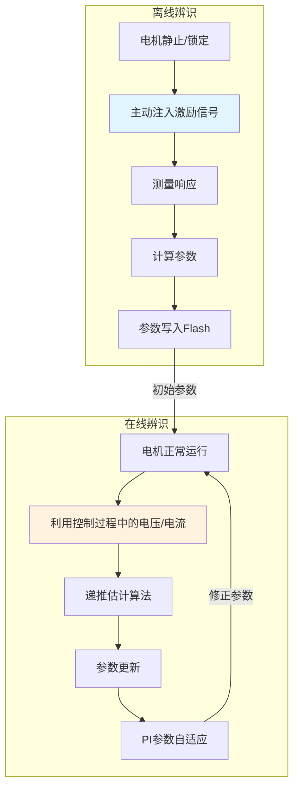
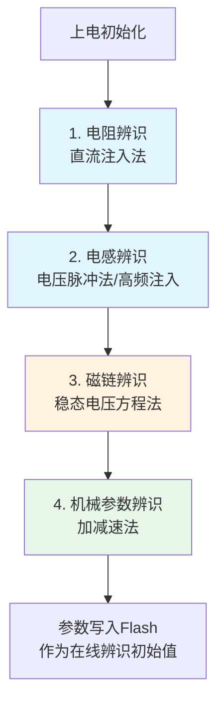
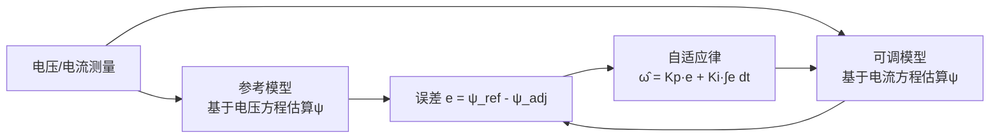
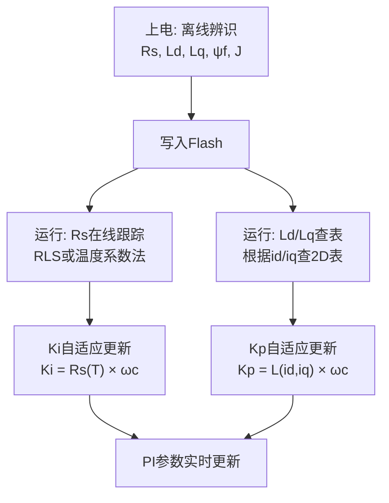

# ALG-21 电机参数辨识：离线辨识、在线辨识与工程难点

**模块编号：** ALG-21
**模块名称：** 电机参数辨识——离线辨识方法、在线辨识方法与工程难点深度分析
**文档版本：** v1.0
**适用对象：** 电机控制算法工程师、嵌入式开发者
**前置知识：** FOC理论基础（ALG-01）、PI电流调节器（ALG-03）、dq电压方程控制用途（ALG-20）
**难度等级：** 

---

## 1.  核心摘要  

**一句话：** 离线辨识是"体检"——上电后静止状态下测一次，给PI参数一个起点；在线辨识是"实时监护"——运行中持续跟踪参数漂移，但面临激励不足、噪声干扰、参数耦合三大难题，工程实现远比理论推导困难。

**认知挂钩：** 很多论文和仿真脚本声称实现了"电阻/电感/磁链/惯量四步辨识"，看起来很完美。但实际到硬件上一跑，发现辨识结果震荡、发散、甚至完全错误——因为仿真里没有逆变器死区、没有ADC量化噪声、没有电流采样偏置、没有d/q轴参数耦合。**在线参数辨识的难点不在于算法本身，而在于"在控制的同时辨识"这个约束条件太苛刻。**

### 离线辨识 vs 在线辨识



| 对比维度 | 离线辨识 | 在线辨识 |
|---------|---------|---------|
| 电机状态 | 静止或锁定 | 正常运行中 |
| 激励方式 | 主动注入（可控） | 依赖控制过程（不可控） |
| 辨识精度 | 高（信噪比好） | 低（噪声大、激励不足） |
| 辨识速度 | 慢（需等待稳态） | 快（实时跟踪） |
| 实现难度 | 低 | 高 |
| 主要用途 | 初始化参数 | 跟踪温漂/饱和 |

**相关模块：** [ALG-01 FOC理论基础](ALG-01-FOC-Theory.md) | [ALG-03 PI电流调节器](ALG-03-PI-Current-Regulator.md) | [ALG-20 dq方程控制用途](ALG-20-Equations-From-Control-Perspective.md) | [HW-01B 电机物理本质](../hardware/HW-01B-Motor-Physics-Deep-Dive.md)

---

## 2.  离线参数辨识  

离线辨识在电机静止或锁定状态下进行，可以主动设计激励信号，信噪比高，是参数辨识最可靠的方式。

### 2.1 定子电阻 $R_s$ 辨识

#### 方法：直流注入法

**原理**：稳态时电感压降为零，$u_d = R_s \cdot i_d$

**步骤**：
1. 锁定转子角度 $\theta_e = 0$
2. 注入d轴直流电压 $u_d = U_{test}$（$u_q = 0$）
3. 等待电流稳定（$> 5\tau$，$\tau = L_d/R_s$）
4. 测量稳态 $i_d$
5. $R_s = U_{test} / i_{d,steady}$

**消除逆变器非线性的方法**：正反方向各测一次

$$
R_s = \frac{U_{test+} - U_{test-}}{i_{d+} - i_{d-}}
$$

**为什么必须正反测？** 因为逆变器存在死区效应和管压降，实际输出电压 ≠ 参考电压。正反方向测试时，死区效应方向相反，相减后抵消。

**工程要点**：

| 要点 | 说明 |
|------|------|
| 测试电压 | 不宜过大（避免转子转动或过流），通常取额定电流的10%~30% |
| 等待时间 | $5\tau = 5L_d/R_s$，典型值50~200ms |
| 采样滤波 | 稳态后取多次采样平均，消除ADC噪声 |
| 温度条件 | 辨识结果对应冷态电阻，运行后需温漂补偿 |

### 2.2 电感 $L_d, L_q$ 辨识

#### 方法一：电压脉冲法（最常用）

**原理**：阶跃电压下，电流上升斜率由电感决定

$$
L = \frac{U \cdot \Delta t}{\Delta i}
$$

**d轴电感辨识**：
1. 锁定 $\theta_e = 0$
2. 施加d轴方波电压 $u_d = \pm U_{test}$
3. 测量 $i_d$ 上升/下降斜率
4. $L_d = U_{test} \cdot \Delta t / \Delta i_d$

**q轴电感辨识**：
1. 锁定 $\theta_e = 90°$（电角度）
2. 施加q轴方波电压
3. 测量 $i_q$ 上升/下降斜率
4. $L_q = U_{test} \cdot \Delta t / \Delta i_q$

**工程要点**：

| 要点 | 说明 |
|------|------|
| 脉冲宽度 | 必须远小于$L/R$时间常数，确保电流线性上升 |
| 脉冲幅度 | 不宜过大，避免饱和（否则测到的是饱和电感） |
| 角度精度 | $\theta_e$ 必须准确，否则d/q轴串扰 |
| 多点测量 | 不同电流幅值下测量，获得电感-电流曲线 |

#### 方法二：高频注入法（适用于IPMSM）

**原理**：注入高频旋转电压，从电流响应中提取$L_d, L_q$差异

注入信号：

$$
\begin{bmatrix} u_{dh} \\ u_{qh} \end{bmatrix} = U_h \begin{bmatrix} \cos(\omega_h t) \\ \sin(\omega_h t) \end{bmatrix}
$$

高频电流响应包含正序和负序分量，负序分量幅值与 $L_d - L_q$ 成正比。

**优势**：不需要转子锁定，可在静止状态下完成。

**局限**：仅对凸极电机有效（$L_d \neq L_q$）；SPMSM的负序分量极小，信噪比差。

### 2.3 永磁体磁链 $\psi_f$ 辨识

#### 方法一：空载反电动势法

**原理**：外部拖动电机旋转，测量空载线电压

$$
\psi_f = \frac{V_{line,rms}}{\sqrt{3} \cdot \omega_e}
$$

**局限**：需要外部拖动设备，生产线上不实用。

#### 方法二：稳态电压方程法（更实用）

**原理**：电机在FOC控制下稳态运行，从q轴电压方程反推

$i_d = 0$ 时：

$$
\psi_f = \frac{u_q - R_s i_q}{\omega_e}
$$

**前提条件**：
- $R_s$ 已知（先完成电阻辨识）
- 电机稳态运行（$di_q/dt \approx 0$）
- 转速足够高（$\omega_e$ 不能太小，否则除法放大噪声）

**工程要点**：此方法对 $R_s$ 的精度非常敏感。$R_s$ 偏差10%→$\psi_f$ 偏差可达10%以上（尤其在低速时）。

### 2.4 机械参数辨识

#### 转动惯量 $J$：加减速法

$$
J = \frac{T_{accel} - T_{decel}}{2 \times |d\omega_m/dt|}
$$

#### 摩擦系数 $B$ 和库仑摩擦 $T_c$

稳态时 $T_e = B\omega_m + T_c$，在不同转速下测量$T_e$，线性拟合。

### 2.5 离线辨识的完整流程



**辨识顺序很重要**：$R_s \to L_d, L_q \to \psi_f \to J, B$，因为后续辨识依赖前面的结果。

---

## 3.  在线参数辨识  

### 3.1 为什么需要在线辨识？

离线辨识给出的是**冷态、额定工况**下的参数。运行时参数会漂移：

| 参数 | 漂移原因 | 典型漂移量 | 对控制的影响 |
|------|---------|-----------|------------|
| $R_s$ | 绕组温升 | +40%/100°C | $K_i$偏小→稳态误差增大 |
| $\psi_f$ | 永磁体温退磁 | -10%/100°C | 转矩常数下降→同样电流输出转矩减小 |
| $L_d, L_q$ | 磁饱和 | -30% 大电流 | $K_p$偏大→电流环震荡 |

**核心矛盾**：离线辨识的参数在运行几分钟后就不准了，但PI参数的整定依赖这些参数。

### 3.2 在线辨识的基本框架

在线辨识的本质是：**从可测量的输入（电压参考）和输出（电流采样）中，递推估计模型参数。**

数学框架：

$$
y(k) = \varphi^T(k) \cdot \theta + e(k)
$$

- $y(k)$：输出（测量的电压或构造的函数）
- $\varphi(k)$：回归向量（测量的电流、转速等）
- $\theta$：待辨识参数（$R_s, L_d, L_q, \psi_f$）
- $e(k)$：残差（模型误差+测量噪声）

### 3.3 递推最小二乘法（RLS）

**最经典的在线辨识算法**：

$$
\begin{aligned}
\hat{\theta}(k) &= \hat{\theta}(k-1) + K(k)[y(k) - \varphi^T(k)\hat{\theta}(k-1)] \\
K(k) &= \frac{P(k-1)\varphi(k)}{\lambda + \varphi^T(k)P(k-1)\varphi(k)} \\
P(k) &= \frac{1}{\lambda}[I - K(k)\varphi^T(k)]P(k-1)
\end{aligned}
$$

其中 $\lambda \in (0.95, 0.999)$ 为遗忘因子，使算法"遗忘"旧数据、跟踪新参数。

#### RLS应用于电阻辨识

从d轴稳态电压方程：

$$
u_d = R_s i_d - \omega_e L_q i_q
$$

令 $y = u_d$，$\varphi = [i_d, -\omega_e i_q]^T$，$\theta = [R_s, L_q]^T$

**问题**：$R_s$ 和 $L_q$ 同时辨识，参数耦合严重（见3.4节难点分析）。

#### RLS应用于磁链辨识

从q轴稳态电压方程（$i_d = 0$时）：

$$
u_q = R_s i_q + \omega_e \psi_f
$$

令 $y = u_q - R_s i_q$，$\varphi = [\omega_e]$，$\theta = [\psi_f]$

**单参数辨识，条件较好**——但前提是 $R_s$ 准确。

### 3.4 模型参考自适应系统（MRAS）

**原理**：构造参考模型和可调模型，利用两者输出的误差驱动自适应律，使可调模型的参数趋近真实值。

**以转速/磁链辨识为例**：



**优势**：有Lyapunov稳定性证明，理论上保证收敛。

**局限**：自适应律的增益（$K_p, K_i$）需要调参；收敛速度和噪声敏感性矛盾。

---

## 4.  在线参数辨识的工程难点  

> **这是本模块的核心章节。** 很多论文和仿真脚本展示了"完美的"在线辨识效果，但实际工程中几乎不可能复现。以下逐一分析难点及对策。

### 难点1：激励不足——"没有信号怎么辨识？"

**问题描述**：

参数辨识的本质是从输入-输出数据中提取参数信息。如果系统运行在稳态（恒定转速、恒定负载），电压和电流几乎不变，辨识算法没有足够的信息来区分参数变化。

**具体表现**：

| 运行工况 | 激励情况 | 辨识效果 |
|---------|---------|---------|
| 启动/加速 | 电压电流剧烈变化 | 好（激励充分） |
| 稳态恒速恒载 | 电压电流几乎不变 | 差（激励不足） |
| 低速空载 | 电流很小，信噪比低 | 差（信号弱） |
| 高速弱磁 | 反EMF占主导，电阻项被淹没 | 差（$R_s$不可观测） |

**数学本质**：

RLS的协方差矩阵 $P(k)$ 反映参数估计的"置信度"。激励不足时，$\varphi^T P \varphi \to 0$，增益 $K(k) \to 0$，算法停止更新——这叫**协方差风暴（Covariance Wind-up）**的反面：**协方差枯竭**。

**对策**：

1. **主动激励注入**：在控制电压上叠加小幅度的PRBS（伪随机二进制序列）或正弦扰动
   - 代价：引入额外的电流纹波和转矩脉动
   - 工程折中：仅在参数变化较快时注入（如启动阶段）

2. **条件性更新**：只在激励充分时更新参数
   ```c
   // 检查激励是否充分
   float excitation = sqrtf(id_dot * id_dot + iq_dot * iq_dot);
   if (excitation > EXCITATION_THRESHOLD) {
       // 激励充分，允许参数更新
       update_rls();
   } else {
       // 激励不足，保持参数不变
       // 可选：增大遗忘因子λ，避免P矩阵发散
   }
   ```

3. **遗忘因子调节**：激励不足时增大 $\lambda$（接近1），避免 $P$ 矩阵发散

### 难点2：逆变器非线性——"你给的不是你说的"

**问题描述**：

在线辨识使用的是**电压参考值** $u_d^{ref}, u_q^{ref}$（PI控制器输出），而非**实际施加到电机上的电压**。两者之间存在显著差异：

| 非线性因素 | 大小 | 对辨识的影响 |
|-----------|------|------------|
| 死区效应 | 典型1~3μs，等效电压偏差可达5~15% | $R_s$辨识偏差最大 |
| 管压降（Vce, Vd） | IGBT: 1.5~2.5V, MOSFET: 0.1~0.5V | 低电压时影响大 |
| 开关延时 | 50~200ns | 高频时影响大 |
| 最小脉宽限制 | 限制占空比范围 | 过调制区影响大 |

**为什么死区对电阻辨识影响最大？**

死区导致的电压误差 $\Delta U_{dt}$ 近似为：

$$
\Delta U_{dt} \approx \frac{4 \cdot V_{dc} \cdot t_{dt}}{T_s}
$$

典型值：$V_{dc} = 48V$, $t_{dt} = 1\mu s$, $T_s = 100\mu s$ → $\Delta U_{dt} \approx 1.92V$

如果额定电流3A对应的电阻压降 $R_s \cdot i = 0.5 \times 3 = 1.5V$，那么死区误差比电阻压降还大！**用这样的数据辨识 $R_s$，结果完全不可信。**

**对策**：

1. **死区补偿**：在辨识之前先做死区补偿（参考ALG-04），用补偿后的电压参与辨识
2. **使用电流重构电压**：不用PI输出的电压参考，而是从母线电压和占空比重构实际电压
   ```c
   // 重构实际施加电压（比PI输出更准确）
   float ud_actual = duty_d * vdc - vdc * 0.5f;  // 考虑死区补偿
   float uq_actual = duty_q * vdc - vdc * 0.5f;
   ```
3. **正负方向平均**：利用正反转对称运行，死区效应方向相反，取平均可部分消除

### 难点3：参数耦合——"改一个牵动另一个"

**问题描述**：

dq电压方程中，$R_s, L_d, L_q, \psi_f$ 四个参数同时出现，且相互耦合：

$$
\begin{cases}
u_d = R_s i_d + L_d \frac{di_d}{dt} - \omega_e L_q i_q \\
u_q = R_s i_q + L_q \frac{di_q}{dt} + \omega_e L_d i_d + \omega_e \psi_f
\end{cases}
$$

**同时辨识多个参数时，回归向量 $\varphi$ 中各元素相关性高，导致 $P$ 矩阵条件数大，参数估计震荡甚至发散。**

**具体耦合分析**：

| 辨识目标 | 耦合参数 | 耦合原因 |
|---------|---------|---------|
| $R_s$ | $L_q$ | d轴方程中 $R_s i_d$ 和 $-\omega_e L_q i_q$ 同时存在 |
| $\psi_f$ | $R_s, L_d$ | q轴方程中 $\omega_e \psi_f$ 和 $R_s i_q + \omega_e L_d i_d$ 同时存在 |
| $L_d$ | $\psi_f$ | q轴方程中两者乘以同一系数 $\omega_e$ |
| $L_q$ | $R_s$ | d轴方程中 $-\omega_e L_q i_q$ 与 $R_s i_d$ 耦合 |

**最恶劣的情况**：$i_d = 0$ 控制时，d轴方程退化为 $u_d = -\omega_e L_q i_q$，完全无法辨识 $R_s$！

**对策**：

1. **分步辨识，不要同时辨识所有参数**
   - 先辨识 $R_s$（低速稳态，$i_d \neq 0$）
   - 再辨识 $L_d, L_q$（高频注入或脉冲法）
   - 最后辨识 $\psi_f$（高速稳态，$i_d = 0$）

2. **利用不同工况的可辨识性差异**
   - 低速：$R_s$ 可辨识性好（电阻压降占比大）
   - 高速：$\psi_f$ 可辨识性好（反EMF占比大）
   - 动态过程：$L_d, L_q$ 可辨识性好（$di/dt$ 项显著）

3. **约束辨识**：固定某些参数，只辨识一个
   ```c
   // 只辨识Rs，固定Ld, Lq, ψf
   // 从d轴方程：ud = Rs*id - ωe*Lq*iq
   // 已知Lq，则 Rs = (ud + ωe*Lq*iq) / id
   ```

### 难点4：噪声与量化——"信号被淹没了"

**问题描述**：

实际系统中，电流采样存在多种噪声源：

| 噪声源 | 大小 | 频率特征 |
|--------|------|---------|
| ADC量化噪声 | 12位ADC: ±1LSB ≈ 0.025A | 白噪声 |
| 开关噪声耦合 | 0.1~0.5A | 载波频率 |
| 运放偏置/漂移 | 0.01~0.1A | 直流/低频 |
| 采样时刻抖动 | 取决于PWM同步 | 载波频率 |

**对辨识的影响**：

- 电流微分 $di/dt$ 的计算对噪声极其敏感——微分放大高频噪声
- RLS对异常值（outlier）敏感——一次电流采样毛刺可能导致参数估计跳变
- 低速时信号幅度小，信噪比差

**对策**：

1. **避免数值微分**：用积分形式代替微分形式
   - 微分形式：$L = U \cdot \Delta t / \Delta i$（对噪声敏感）
   - 积分形式：$\int u \, dt = R_s \int i \, dt + L \cdot i$（对噪声不敏感）

2. **低通滤波**：对辨识输入/输出做低通滤波
   ```c
   // 一阶低通滤波
   id_filtered = id_filtered * alpha + id_meas * (1 - alpha);
   // alpha = exp(-2*pi*fc*Ts), fc通常取电流环带宽的1/5
   ```

3. **鲁棒估计算法**：用Huber损失函数替代最小二乘，降低异常值影响

### 难点5：收敛速度 vs 稳态精度——"快了不稳，稳了不快"

**问题描述**：

遗忘因子 $\lambda$ 控制RLS的收敛速度和稳态精度的权衡：

| $\lambda$ | 收敛速度 | 稳态精度 | 噪声敏感性 |
|-----------|---------|---------|-----------|
| 0.95 | 快 | 低（参数波动大） | 高 |
| 0.99 | 中 | 中 | 中 |
| 0.999 | 慢 | 高 | 低 |

**矛盾**：$R_s$ 随温度缓慢变化（时间常数分钟级），需要小 $\lambda$（快跟踪）还是大 $\lambda$（高精度）？

**答案**：$R_s$ 变化慢，用大 $\lambda$（0.998~0.999）即可。但如果电机从冷态快速启动，温升很快，需要中等 $\lambda$（0.99）。

**对策**：**可变遗忘因子**

```c
// 根据参数变化速度自适应调节遗忘因子
float lambda_adaptive(float error, float lambda_min, float lambda_max) {
    // 误差大→参数正在变化→减小λ→加快跟踪
    // 误差小→参数稳定→增大λ→提高精度
    float error_norm = fabsf(error) / ERROR_SCALE;
    float lambda = lambda_max - (lambda_max - lambda_min) * error_norm;
    return CLAMP(lambda, lambda_min, lambda_max);
}
```

### 难点6：辨识与控制的冲突——"辨识要折腾，控制要平稳"

**问题描述**：

好的辨识需要丰富的激励信号（电压/电流频繁变化），但好的控制需要平稳的输出（电压/电流尽量稳定）。两者天然矛盾。

**具体冲突**：

| 辨识需求 | 控制需求 | 冲突 |
|---------|---------|------|
| 电压/电流频繁变化 | 电压/电流平稳 | 激励注入引入纹波 |
| $i_d \neq 0$（辨识$R_s$需要） | $i_d = 0$（SPMSM最优控制） | 控制策略冲突 |
| 参数快速更新 | 参数缓慢变化（避免突变） | 更新速率冲突 |

**对策**：

1. **辨识结果低通滤波后再更新PI参数**：避免PI参数突变引起控制震荡
   ```c
   // 参数更新速率远低于控制环路速率
   Rs_for_pi = Rs_for_pi * 0.999f + Rs_identified * 0.001f;  // 很慢的跟踪
   Ki_d = Rs_for_pi * bandwidth;
   ```

2. **参数变化率限制**：
   ```c
   #define RS_CHANGE_RATE_MAX 0.01f  // 每次更新最大变化1%
   float delta = Rs_identified - Rs_current;
   delta = CLAMP(delta, -Rs_current * RS_CHANGE_RATE_MAX, Rs_current * RS_CHANGE_RATE_MAX);
   Rs_current += delta;
   ```

3. **仅在特定工况下辨识**：启动阶段辨识$R_s$（激励充分），稳态时不更新

---

## 5.  在线辨识方法对比  

| 方法 | 辨识参数 | 收敛性 | 计算量 | 工程实现难度 | 适用场景 |
|------|---------|--------|--------|------------|---------|
| RLS | $R_s, L_d, L_q, \psi_f$ | 依赖激励 | 中 |  | 通用框架 |
| MRAS | $\psi_f, \omega$ | Lyapunov保证 | 中 |  | 无感控制 |
| EKF/UKF | 全参数 | 最优估计 | 高 |  | 高精度伺服 |
| 高频注入 | $L_d, L_q$ | 快 | 低 |  | IPMSM静止辨识 |
| 温度系数法 | $R_s$ | 开环估算 | 极低 |  | 成本敏感型 |
| 查表法 | $L_d, L_q$ | 离线标定 | 极低 |  | 已标定电机 |

### 各方法的关键限制

**RLS**：参数耦合严重，必须分步辨识或加约束；激励不足时协方差矩阵发散

**MRAS**：自适应律增益需调参；稳态精度与收敛速度矛盾

**EKF/UKF**：计算量极大（矩阵运算），对MCU算力要求高；协方差矩阵初始化敏感

**高频注入**：仅对凸极电机有效；注入信号产生可听噪声和额外损耗

**温度系数法**：开环估算，无法补偿个体差异；需要温度传感器或$R_s$在线辨识

---

## 6.  工程实现建议  

### 6.1 实用方案：离线辨识 + 电阻在线跟踪 + 电感查表

这是目前工业界最成熟的方案：



### 6.2 Rs在线辨识的实用代码

```c
typedef struct {
    float Rs;            // 当前电阻估计值 (Ω)
    float Rs_25C;        // 25°C基准电阻 (Ω)
    float alpha_Cu;      // 铜温度系数 (0.00393/°C)
    float lambda;        // RLS遗忘因子
    float P;             // RLS协方差 (标量)
    float Rs_min;        // 电阻下限
    float Rs_max;        // 电阻上限
    float excitation_th; // 激励阈值
} rs_identifier_t;

void rs_online_update(rs_identifier_t *ri,
                      float ud_ref, float id_meas,
                      float iq_meas, float omega_e,
                      float Lq)
{
    // 1. 构造回归向量（d轴稳态方程）
    //    ud = Rs * id - ωe * Lq * iq
    //    令 y = ud + ωe*Lq*iq, φ = id
    float y = ud_ref + omega_e * Lq * iq_meas;
    float phi = id_meas;

    // 2. 检查激励是否充分
    if (fabsf(phi) < ri->excitation_th) {
        return;  // 激励不足，不更新
    }

    // 3. RLS更新（标量形式，计算量极小）
    float e = y - phi * ri->Rs;          // 预测误差
    float K = ri->P * phi / (ri->lambda + phi * phi * ri->P);  // 增益
    ri->Rs = ri->Rs + K * e;             // 参数更新
    ri->P = (1.0f / ri->lambda) * (1.0f - K * phi) * ri->P;   // 协方差更新

    // 4. 限幅
    ri->Rs = CLAMP(ri->Rs, ri->Rs_min, ri->Rs_max);

    // 5. 协方差防发散
    if (ri->P > 1e6f) ri->P = 1e6f;
    if (ri->P < 1e-6f) ri->P = 1e-6f;
}
```

### 6.3 参数更新与PI参数同步

```c
// 参数辨识结果→PI参数更新（慢速，1~10Hz）
void update_pi_from_identification(motor_ctrl_t *mc, rs_identifier_t *ri) {
    // Rs更新→Ki更新
    float Ki_new = ri->Rs * mc->bandwidth;
    mc->Ki_d = Ki_new;
    mc->Ki_q = Ki_new;

    // Ld/Lq查表→Kp更新
    float Ld = lookup_Ld(mc->id_meas, mc->iq_meas);
    float Lq = lookup_Lq(mc->id_meas, mc->iq_meas);
    mc->Kp_d = Ld * mc->bandwidth;
    mc->Kp_q = Lq * mc->bandwidth;
}
```

---

## 7.  交叉参考  

| 本模块内容 | 关联模块 | 关联点 |
|-----------|---------|--------|
| 离线辨识方法 | [ALG-01 FOC理论基础](ALG-01-FOC-Theory.md) | 5.4节参数辨识基础 |
| PI参数自适应 | [ALG-03 PI电流调节器](ALG-03-PI-Current-Regulator.md) | Kp/Ki的参数来源 |
| 电压方程与参数关系 | [ALG-20 dq方程控制用途](ALG-20-Equations-From-Control-Perspective.md) | 辨识的数学基础 |
| 死区补偿 | [ALG-04 死区补偿](ALG-04-Deadtime-Compensation.md) | 消除辨识中的逆变器非线性 |
| 电感饱和 | [HW-01B 电机物理本质](../hardware/HW-01B-Motor-Physics-Deep-Dive.md) | 参数漂移的物理根源 |
| 前馈解耦 | [ADV-ALG-07 前馈解耦](../advanced/algorithm/ADV-ALG-07-Feedforward-Decoupling.md) | 参数精度影响解耦效果 |

---

## 8. 关键公式速查表

| 辨识参数 | 方法 | 公式 | 前提条件 |
|---------|------|------|---------|
| $R_s$ | 直流注入 | $R_s = U_{test}/i_{d,steady}$ | 静止，稳态 |
| $R_s$ | 正反方向 | $R_s = (U_+ - U_-)/(I_+ - I_-)$ | 消除死区影响 |
| $R_s$ | RLS在线 | $\hat{R}_s(k) = \hat{R}_s(k-1) + K(k) \cdot e(k)$ | $i_d \neq 0$，激励充分 |
| $L_d$ | 电压脉冲 | $L_d = U \cdot \Delta t / \Delta i_d$ | $\theta_e = 0$ |
| $L_q$ | 电压脉冲 | $L_q = U \cdot \Delta t / \Delta i_q$ | $\theta_e = 90°$ |
| $\psi_f$ | 稳态电压方程 | $\psi_f = (u_q - R_s i_q)/\omega_e$ | $i_d = 0$，稳态 |
| $J$ | 加减速法 | $J = \Delta T / (2 \cdot \|d\omega/dt\|)$ | 恒加速/减速 |
| 功率-转矩 | 9550公式 | $T = 9550 \times P/n$ | P(kW), n(rpm) |

>  检验你的理解：ALG-21 检验题目（待补充）

## 9. 延伸实践
-  [ALG-01: FOC理论基础 5.4节](ALG-01-FOC-Theory.md) — 参数辨识基础方法
-  [ALG-04: 死区补偿](ALG-04-Deadtime-Compensation.md) — 消除辨识中的逆变器非线性
-  [HW-01B: 电机物理本质](../hardware/HW-01B-Motor-Physics-Deep-Dive.md) — 温度效应与饱和效应
