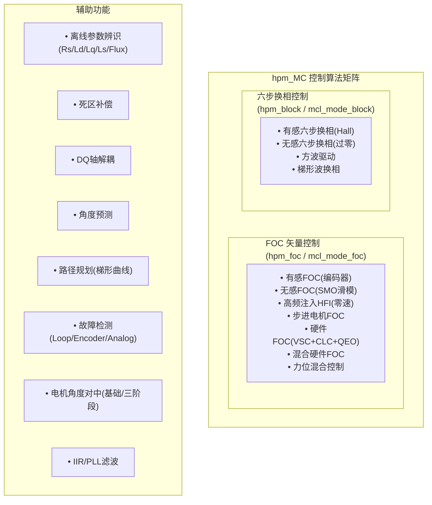

# HPM_MC电机控制库 - 架构总览  

>  关联模块：[ALG-01 FOC理论](../ALG-01-FOC-Theory.md) | [ALG-07 无感观测器](../ALG-07-Sensorless-Observers.md) | [CT-11 观测器设计](../../control-theory/CT-11-Observer-Design.md)

**文档版本：** v1.0  
**生成日期：** 2026-05-23  
**适用对象：** 电机控制工程师、嵌入式开发者  
**前置知识：** C语言编程、电机控制基础、FOC/六步换相原理

---

## 目录

1. [概述](#1-概述)
2. [版本对比 — v1 vs v2](#2-版本对比--v1-vs-v2)
3. [hpm_mcl v1 架构详析](#3-hpm_mcl-v1-架构详析)
4. [hpm_mcl_v2 架构详析](#4-hpm_mcl_v2-架构详析)
5. [与 MC_LIB 架构对比](#5-与-mc_lib-架构对比)
6. [数学库与硬件加速](#6-数学库与硬件加速)
7. [总结](#7-总结)
8. [v1 核心算法代码实现分析](#8-v1-核心算法代码实现分析)

---

## 1. 概述

### 1.1 库简介

hpm_MC 是先楫半导体（HPMicro）官方提供的电机控制软件开发套件（SDK），作为 `hpm_sdk` 中间件的一部分，提供从底层硬件抽象到上层控制算法的全套电机控制解决方案。

> **核心设计理念：**
>
> `硬件深度融合 + 算法模块化 + 接口可扩展`

该库充分利用 HPM 系列 MCU 独有的硬件加速器（VSC、CLC、QEO），在保证灵活性的前提下实现极致的实时性能。

### 1.2 双版本并存

hpm_MC 当前包含两个版本，共存于 `middleware/` 目录下：

| 版本 | 目录 | 状态 | 设计风格 |
|------|------|------|----------|
| **hpm_mcl v1** | `middleware/hpm_mcl/` | 即将退役（下一版本移除） | 平面化模块、功能独立 |
| **hpm_mcl_v2** | `middleware/hpm_mcl_v2/` | 主力版本 | 五层分层、统一调度、可扩展 |

如 `hpm_mcl/note.md` 所述：

> We will keep this mcl in this release, but will remove it in the next release.

### 1.3 覆盖的控制算法


<!-- 原ASCII hpm_MC控制算法矩阵转为mermaid flowchart语法 -->

---

## 2. 版本对比 — v1 vs v2

### 2.1 v1 架构（hpm_mcl）：平面化模块设计

```text
hpm_mcl/
├── common/
│   └── hpm_motor_math.c       # 数学运算实现
├── inc/
│   ├── hpm_bldc_define.h       # 核心数据结构和宏定义
│   ├── hpm_motor_math.h        # 数学抽象层（5种运算模式）
│   ├── hpm_foc.h               # FOC控制API
│   ├── hpm_block.h             # 方波控制API
│   ├── hpm_smc.h               # 滑模观测器API
│   ├── hpm_hfi.h               # 高频注入API
│   └── hpm_over_zero.h         # 过零检测API
├── sensor_control/
│   ├── hpm_foc.c               # FOC实现
│   └── hpm_block.c             # 方波实现
└── sensorless_control/
    ├── hpm_smc.c               # 滑模观测器实现
    ├── hpm_hfi.c               # 高频注入实现
    └── hpm_over_zero.c         # 过零检测实现
```

v1 的特点是每个算法模块（foc/block/smc/hfi/over_zero）各自独立，没有统一的调度框架和传感器抽象。

### 2.2 v2 架构（hpm_mcl_v2）：分层设计

```text
hpm_mcl_v2/
├── hpm_mcl_common.h            # 通用宏、状态码、断言
├── hpm_mcl_cfg.h               # 编译期功能开关
├── hpm_mcl_math.h              # 数学类型抽象
├── hpm_mcl_physical.h          # 物理参数定义（电机/板级/时间）
├── hpm_mcl_debug.h             # 调试FIFO
├── core/
│   ├── control/                # 控制算法核心
│   │   ├── hpm_mcl_control.h   # PID、SMC、离线辨识、SVPWM
│   │   ├── hpm_mcl_filter.h    # IIR/PLL滤波器
│   │   ├── hpm_mcl_path_plan.h # 梯形曲线路径规划
│   │   └── hpm_mcl_hybrid_ctrl.h # 力位混合控制
│   ├── loop/                   # 主循环调度
│   │   ├── hpm_mcl_loop.h      # 6种运行模式调度
│   │   └── hpm_mcl_debug.c     # 调试功能
│   ├── sensor/                 # 传感器抽象层
│   │   ├── hpm_mcl_encoder.h   # 编码器速度计算（T/M/MT/PLL）
│   │   └── hpm_mcl_analog.h    # 模拟采样（10通道+IIR滤波）
│   ├── drivers/                # 驱动抽象层
│   │   └── hpm_mcl_drivers.h   # PWM/ADC驱动回调接口
│   └── detect/                 # 故障检测
│       └── hpm_mcl_detect.h    # 多子系统状态监控
├── encoder/                    # 编码器驱动层
│   ├── hpm_mcl_abz.h           # ABZ/QEI编码器
│   └── hpm_mcl_uvw.h           # UVW/Hall编码器
└── drivers/                    # 硬件加速抽象
    └── hpm_mcl_hw_loop.h       # VSC/CLC/QEO硬件混合环
```

### 2.3 功能覆盖对比表

| 功能 | hpm_mcl v1 | hpm_mcl_v2 |
|------|:----------:|:----------:|
| FOC有感（编码器） |  |  |
| FOC无感（SMO滑模） |  |  |
| 高频注入（HFI） |  |  (已整合至control) |
| 六步换相（方波） |  |  |
| 过零检测（无感BLDC） |  |  (统一调度) |
| 步进电机FOC |  |  |
| 离线参数辨识 |  |  (Rs/Ld/Lq/Ls/Flux) |
| 硬件FOC（VSC/CLC/QEO） |  |  |
| 硬件混合环路FOC |  |  |
| 力位混合控制 |  |  |
| 路径规划（梯形曲线） |  |  |
| 死区补偿 |  |  |
| DQ轴解耦 |  |  |
| 角度预测 |  |  |
| 故障检测 |  |  |
| 编码器抽象（T/M/MT/PLL） |  |  |
| 模拟采样抽象（10通道） |  |  |
| 电机角度对中（多算法） |  |  |
| 统一调度 |  |  (6种模式) |

---

## 3. hpm_mcl v1 架构详析

### 3.1 模块职责

#### 3.1.1 hpm_bldc_define（核心数据结构）

定义位置: `hpm_mcl/inc/hpm_bldc_define.h`

所有控制算法共享的统一数据结构，是整个 v1 库的"骨架"：

```text
┌──────────────────────────────────────────────────────────┐
│                 hpm_bldc_define 核心结构体                 │
├──────────────────────────────────────────────────────────┤
│                                                           │
│  hpm_motor_para_t          BLDC_CONTRL_SPD_PARA          │
│  ├── i_rstator_ohm         ├── i_speedlooptime_s          │
│  ├── i_poles_n             ├── speedtheta                 │
│  ├── i_maxspeed_rs         ├── o_speedout                 │
│  ├── i_lstator_h           ├── i_speedfilter              │
│  ├── i_phasecur_a          └── func_getspd (函数指针)     │
│  ├── i_phasevol_v                                         │
│  ├── i_samplingper_s       BLDC_CONTRL_PID_PARA           │
│  ├── o_smc_f               ├── i_kp / i_ki / i_kd        │
│  ├── o_smc_g               ├── target / cur / outval      │
│  └── func_smc_const         └── func_pid (函数指针)       │
│                                                           │
│  BLDC_CONTROL_FOC_PARA      BLDC_CONTROL_PWM_PARA         │
│  ├── currentdpipar          ├── target_alpha / target_beta│
│  ├── currentqpipar          ├── sector                    │
│  ├── speedcalpar            └── pwmout (PWMOUT_PARA)      │
│  ├── electric_angle                                        │
│  ├── samplcurpar            BLDC_CONTROL_CURRENT_PARA      │
│  ├── motorpar               ├── adc_u/v/w                 │
│  ├── pwmpar                 ├── cal_u/v/w                 │
│  ├── pos_estimator_par      └── func_sampl (函数指针)     │
│  ├── ualpha / ubeta                                        │
│  ├── ialpha / ibeta         BLDC_CONTROL_PWMOUT_PARA       │
│  └── func_dqsvpwm           ├── pwm_u/v/w                 │
│                              └── func_set_pwm (函数指针)   │
└──────────────────────────────────────────────────────────┘
```

**设计特点：** v1 通过函数指针实现可替换性——`func_getspd`、`func_pid`、`func_sampl`、`func_set_pwm`、`func_dqsvpwm`、`func_smc_const` 等均可由用户替换。但这也意味着用户需要自己管理这些函数指针的初始化。

#### 3.1.2 hpm_motor_math（数学抽象层）

定义位置: `hpm_mcl/inc/hpm_motor_math.h`

v1 的核心创新——通过编译期宏开关，一套代码兼容五种运算模式：

| 模式 | 宏值 | 数据类型 | 适用场景 |
|------|------|----------|----------|
| `HPM_MOTOR_MATH_MOD_Q_SW` | 1 | int32_t (Q31软件) | 无FPU的MCU，纯软件定点 |
| `HPM_MOTOR_MATH_MOD_Q_HW` | 2 | int32_t/int16_t (Q31/Q15硬件) | 有硬件QMath加速 |
| `HPM_MOTOR_MATH_MOD_DSP_FP` | 3 | float (DSP浮点) | 有FPU+DSP指令 |
| `HPM_MOTOR_MATH_MOD_Q_ALL` | 4 | Q软件+硬件混合 | 软硬件定点混合 |
| `HPM_MOTOR_MATH_MOD_FP` | 5 | float (纯浮点) | 有FPU，默认模式 |

核心宏封装：

```c
// 以HPM_MOTOR_MATH_TYPE 统一抽象，所有算法代码无需修改
HPM_MOTOR_MATH_MUL(x, y)    // 乘法（模式切换时自动映射）
HPM_MOTOR_MATH_DIV(x, y)    // 除法
HPM_MOTOR_MATH_ATAN2(x, y)  // 反正切
HPM_MOTOR_MATH_FABS(x)      // 绝对值
HPM_MOTOR_MATH_FL_MDF(f32)  // 浮点转定点
HPM_MOTOR_MATH_MDF_FL(mdf)  // 定点转浮点
```

#### 3.1.3 hpm_foc（FOC控制）

定义位置: `hpm_mcl/inc/hpm_foc.h`，实现: `hpm_mcl/sensor_control/hpm_foc.c`

提供完整的 FOC 控制链函数：

| 函数 | 功能 | 输入 | 输出 |
|------|------|------|------|
| `hpm_mcl_bldc_foc_current_cal` | 三相电流重构 | ADC原始值 | 实测电流 |
| `hpm_mcl_bldc_foc_clarke` | Clarke变换 | Iu,Iv,Iw | Iα,Iβ |
| `hpm_mcl_bldc_foc_park` | Park变换 | Iα,Iβ,sinθ,cosθ | Id,Iq |
| `hpm_mcl_bldc_foc_inv_park` | 逆Park变换 | Ud,Uq,sinθ,cosθ | Uα,Uβ |
| `hpm_mcl_bldc_foc_svpwm` | SVPWM调制 | Uα,Uβ | PWM占空比 |
| `hpm_mcl_bldc_foc_pwmset` | PWM输出更新 | 占空比 | 硬件PWM |
| `hpm_mcl_bldc_foc_pi_contrl` | PI控制器 | 给定/反馈/Kp/Ki | 输出 |
| `hpm_mcl_bldc_foc_al_speed` | 角度微分测速 | 角度差 | 速度 |
| `hpm_mcl_bldc_foc_speed_ctrl` | 速度环PI | 目标/当前速度 | Iq参考值 |
| `hpm_mcl_bldc_foc_position_ctrl` | 位置环P | 目标/当前位置 | 速度参考值 |
| `hpm_mcl_bldc_foc_ctrl_dq_to_pwm` | dq电压到PWM一站式 | 全部FOC参数 | PWM输出 |

#### 3.1.4 hpm_block（方波控制）

定义位置: `hpm_mcl/inc/hpm_block.h`，实现: `hpm_mcl/sensor_control/hpm_block.c`

支持最多 4 路电机的六步换相控制：

| 函数 | 功能 |
|------|------|
| `hpm_mcl_bldc_block_ctrl` | 按步序输出PWM（60°电角度一步） |
| `hpm_mcl_bldc_block_step_get` | 根据Hall状态获取换相步号 |
| `hpm_mcl_al_pi_ctrl_func` | 方波模式PI速度控制 |
| `hpm_mcl_bldc_pwm_enable/disable` | 单引脚PWM开关控制 |

#### 3.1.5 hpm_smc（滑模观测器）

定义位置: `hpm_mcl/inc/hpm_smc.h`，实现: `hpm_mcl/sensorless_control/hpm_smc.c`

核心结构体：

```c
typedef struct hpm_mcl_para {
    float zero;          // 滑模收敛参数
    float ksmc;          // 滑模系数
    float filter_coeff;  // 低通滤波系数
    float *ualpha, *ubeta;
    float *ialpha, *ibeta;
    float ialpha_mem, ibeta_mem;  // 内部状态
    float alpha_cal, zalpha_cal;
    float beta_cal, zbeta_cal;
    hpm_motor_para_t *i_motorpar; // 依赖电机参数
    void (*func_smc)(void *str);   // 可替换SMC实现
} hpm_mcl_para_t;

typedef struct hpm_smc_pll_para {
    float theta, speedout;  // 输出角度和速度
    float kp, ki;           // PLL参数
    float mem;              // 积分存储
    float loop_in_sec;      // 循环周期
} hpm_smc_pll_para_t;
```

SMC算法流程：

```text
Iα,Iβ, Uα,Uβ ── 电流观测器 ── 滑模控制律 ── 低通滤波 ── PLL ── θ,ω
                    dI/dt =         Zα = H1·        滤除抖振     角度跟踪
                    -R/L·I +       sign(Î - I)
                    1/L·(U - Z)
```

关键函数：
- `hpm_mcl_smc_const_cal` — 根据电机参数计算静态系数`smc_f`和`smc_g`
- `hpm_mcl_smc_pos_cal` — 执行SMC位置估计
- `hpm_mcl_smc_pll` — PLL角度跟踪滤波
- `hpm_mcl_smc_loop` — 组合调用：位置估计→PLL→角度更新

#### 3.1.6 hpm_hfi（高频注入）

定义位置: `hpm_mcl/inc/hpm_hfi.h`，实现: `hpm_mcl/sensorless_control/hpm_hfi.c`

支持零速/低速时的转子位置检测：

| 结构体 | 用途 |
|--------|------|
| `hpm_hfi_para_t` | 注入参数（Vh、alpha/beta、e_alpha/beta） |
| `hpm_hfi_pll_para_t` | HFI专用PLL（带低通+滤波） |
| `hpm_hfi_pole_detect_para_t` | 磁极辨识（0°与180°脉冲响应比较） |

关键函数：
- `hpm_mcl_hfi_loop` — HFI电流环（注入→解调→PLL→角度）
- `hpm_mcl_hfi_pole_detect` — NS极辨识（d轴电流注入检测电感饱和度差异）

#### 3.1.7 hpm_over_zero（过零检测）

定义位置: `hpm_mcl/inc/hpm_over_zero.h`，实现: `hpm_mcl/sensorless_control/hpm_over_zero.c`

用于无感BLDC方波控制的换相时刻检测：

```text
状态机：INIT → LOCATION → RUNNING

六个区间：
  1━W↓ → 2━V↑ → 3━U↓ → 4━W↑ → 5━V↓ → 6━U↑

过零检测原理：
  悬浮相电压与中点电压比较，过零时刻即为换相基准点
  过零后延迟30°电角度即为最佳换相时刻
```

| 结构体 | 用途 |
|--------|------|
| `hpm_mcl_over_zero_cfg_t` | 过零配置（ADC值、连续过零次数、延迟角度、区间状态） |
| `hpm_mcl_over_zero_spd_para_t` | 速度滤波+PLL |
| `hpm_mcl_over_zero_pi_para_t` | 速度PID |

### 3.2 v1 数据流：ADC→坐标变换→PI→SVPWM

```text
┌─────────────────────────────────────────────────────────────────────┐
│                     v1 FOC控制数据流（电流环周期）                    │
├─────────────────────────────────────────────────────────────────────┤
│                                                                      │
│  ┌──────────┐    ┌──────────┐    ┌──────────┐    ┌──────────┐      │
│  │ ADC采样  │───│ 三相电流 │───│ Clarke   │───│  Park    │      │
│  │ (用户实现)│    │  重构    │    │  变换    │    │  变换    │      │
│  └──────────┘    └──────────┘    └──────────┘    └────┬─────┘      │
│                       │                               │              │
│              func_sampl(函数指针)                      ▼              │
│                                               ┌──────────────┐      │
│                                               │ 电流环PI     │      │
│                                               │ (Id/Iq)      │      │
│                                               └──────┬───────┘      │
│                                                      │              │
│  ┌──────────┐    ┌──────────┐    ┌──────────┐        │              │
│  │ PWM输出  │───│  SVPWM   │───│ 逆Park   │───────┘              │
│  │ (用户实现)│    │  调制    │    │  变换    │                       │
│  └──────────┘    └──────────┘    └──────────┘                       │
│                                                                      │
│  角度来源：                                                           │
│  ┌────────────────────────────────────────────────────────────┐     │
│  │ 有感：编码器/Hall → pos_estimator_par.func → θ              │     │
│  │ 无感：SMO → PLL → θ      │  HFI → PLL → θ                  │     │
│  └────────────────────────────────────────────────────────────┘     │
│                                                                      │
└─────────────────────────────────────────────────────────────────────┘
```

### 3.3 v1 的局限性

1. **无统一调度框架** — FOC/Block/SMC/HFI/OverZero 各自为政，用户需自行组装调用链
2. **无传感器抽象** — 编码器、Hall、ADC没有统一接口，位置/速度获取方式分散
3. **无离线参数检测** — 电机参数（Rs/Ld/Lq/Flux）需手动测量后填入
4. **无故障检测机制** — 过流、过压、失速等需用户自行实现
5. **无路径规划** — 无梯形曲线/S曲线加减速支持
6. **无死区补偿/DQ解耦** — 高级补偿功能缺失
7. **函数指针管理分散** — 10+个函数指针需用户逐个初始化，容易遗漏

---

## 4. hpm_mcl_v2 架构详析

### 4.1 五层架构模型

```text
┌─────────────────────────────────────────────────────────────────┐
│                      应用层 (User Application)                   │
│            bldc_foc.c / step_motor.c / hybrid_ctrl_demo.c        │
├─────────────────────────────────────────────────────────────────┤
│                      第4层：Core层 (core/)                        │
│  ┌──────────┐ ┌──────────┐ ┌──────────┐ ┌──────────┐          │
│  │ control/ │ │  loop/   │ │ sensor/  │ │ detect/  │          │
│  │ PID,SMC, │ │ 6种模式  │ │ encoder, │ │ 故障监控 │          │
│  │ SVPWM,   │ │ 调度     │ │ analog   │ │          │          │
│  │ filter,  │ │          │ │          │ │          │          │
│  │ path_plan│ │          │ │          │ │          │          │
│  └──────────┘ └──────────┘ └──────────┘ └──────────┘          │
├─────────────────────────────────────────────────────────────────┤
│                    第3层：驱动层 (drivers/ + encoder/)            │
│  ┌──────────────┐  ┌──────────┐  ┌──────────┐                  │
│  │ hpm_mcl_drivers│  │ ABZ/QEI  │  │ UVW/Hall │                  │
│  │ (PWM/ADC回调) │  │ 编码器   │  │ 编码器   │                  │
│  └──────────────┘  └──────────┘  └──────────┘                  │
├─────────────────────────────────────────────────────────────────┤
│                  第2层：硬件加速层 (HPM Hardware Accelerators)    │
│  ┌──────────┐  ┌──────────┐  ┌──────────┐                      │
│  │   VSC    │  │   CLC    │  │   QEO    │                      │
│  │ Clarke/  │  │ 电流环   │  │ 逆Park/  │                      │
│  │ Park加速 │  │ PID加速  │  │ SVPWM加速│                      │
│  └──────────┘  └──────────┘  └──────────┘                      │
├─────────────────────────────────────────────────────────────────┤
│                   第1层：HAL层 (hpm_sdk)                          │
│  PWM / ADC / QEI / GPIO / TRGM / DMA / SYNT / CLK              │
├─────────────────────────────────────────────────────────────────┤
│                   第0层：HPM MCU 硬件                             │
│        HPM5300 / HPM6200 / HPM6300 / HPM6800 系列             │
└─────────────────────────────────────────────────────────────────┘
```

### 4.2 各层模块详细分析

#### 4.2.1 Core层 — control（控制算法）

路径: `hpm_mcl_v2/core/control/hpm_mcl_control.h`

**-- 回调函数表（`mcl_control_method_t`）**

v2 将控制算法抽象为一组标准化的函数指针表，支持编译期或运行时替换：

```c
typedef struct {
    // 基础数学
    hpm_mcl_type_t (*sin_x)(hpm_mcl_type_t x);
    hpm_mcl_type_t (*cos_x)(hpm_mcl_type_t x);
    hpm_mcl_type_t (*arctan_x)(hpm_mcl_type_t y, hpm_mcl_type_t x);
    // 坐标变换
    hpm_mcl_stat_t (*park)(...);       // Park变换
    hpm_mcl_stat_t (*clarke)(...);     // Clarke变换
    hpm_mcl_stat_t (*invpark)(...);    // 逆Park变换
    // PID控制
    hpm_mcl_stat_t (*currentd_pid)(...);
    hpm_mcl_stat_t (*currentq_pid)(...);
    hpm_mcl_stat_t (*speed_pid)(...);
    hpm_mcl_stat_t (*position_pid)(...);
    // SVPWM
    hpm_mcl_stat_t (*svpwm)(...);      // 三相SVPWM
    hpm_mcl_stat_t (*step_svpwm)(...); // 步进电机SVPWM
    // 方波
    hpm_mcl_stat_t (*get_block_sector)(...);  // Hall换相
    // 死区补偿
    hpm_mcl_stat_t (*dead_area_polarity_detection)(...);
    // 滑模观测器
    void (*smc_init)(...);
    void (*smc_process)(...);
    // 离线参数辨识
    hpm_mcl_stat_t (*offline_param_detection_rs)(...);
    hpm_mcl_stat_t (*offline_param_detection_ld)(...);
    hpm_mcl_stat_t (*offline_param_detection_lq)(...);
    hpm_mcl_stat_t (*offline_param_detection_ls)(...);
    hpm_mcl_stat_t (*offline_param_detection_flux)(...);
    hpm_mcl_stat_t (*offline_param_detection_init)(...);
} mcl_control_method_t;
```

**-- PID控制器（`mcl_control_pid_t`）**

支持增量式和位置式两种PID：

| 函数 | 类型 | 特点 |
|------|------|------|
| `hpm_mcl_delta_pid` | 增量式PID | 天然抗积分饱和，平滑过渡 |
| `hpm_mcl_position_pid` | 位置式PID | 直接输出绝对控制量 |
| `hpm_mcl_pid_to_3p3z` | 转换函数 | PID参数→CLC 3P3Z系数 |

**-- 死区补偿（`mcl_control_dead_area_compensation_t`）**

通过检测电流极性自动计算A/B/C三相PWM偏移量，补偿逆变器死区导致的电压畸变。

**-- 滑模观测器配置（`mcl_control_smc_cfg_t`）**

将v1中分散的SMC参数统一为两级结构：
- `const_data`: 电机物理参数（电阻、电感、采样周期、循环周期）
- `factor`: 算法系数（smc_f、smc_g、zero、ksmc、filter_coeff）
- `pll`: 内置PLL参数（kp、ki、积分限幅）

**-- 离线参数辨识（`mcl_control_offline_param_detection_t`）**

> **支持五项参数的自动辨识：**
>
> **检测流程：**
>
> `INIT` → `RS`(电阻) → `LD`(d轴电感) → `LQ`(q轴电感) → `LS`(相电感) → `FLUX`(磁链) → `END`
>
> - **Rs检测**: 注入d轴直流电，测量稳态电压降
> - **Ld/Lq检测**: 注入高频脉冲电压，测量电流响应斜率
> - **Ls检测**: 注入旋转电压矢量，测量稳态电流
> - **Flux检测**: 开环旋转，测量反电动势

#### 4.2.2 Core层 — filter（滤波器）

路径: `hpm_mcl_v2/core/control/hpm_mcl_filter.h`

| 滤波器 | 说明 |
|--------|------|
| IIR DF1 | 直接I型结构IIR滤波器 |
| PLL Type I | 一阶锁相环，用于编码器速度估计 |
| PLL Type II | 二阶锁相环，频率/相位零误差跟踪 |

#### 4.2.3 Core层 — path_plan（路径规划）

路径: `hpm_mcl_v2/core/control/hpm_mcl_path_plan.h`

梯形曲线路径规划，用于步进电机或位置控制模式：

```text
         speed
           │      ┌────────┐
           │     ╱          ╲
           │    ╱            ╲
           │   ╱              ╲
           │  ╱                ╲
           └─┴──────────────────┴──── time
             t0   t1        t2   t3
             ├─加速─┤├匀速┤├─减速─┤

配置参数：
  acc - 加速度 (rad/s²)
  dec - 减速度 (rad/s²)
  speed - 匀速段速度 (rad/s)
  time - 总运行时间 (s)
```

核心API：
- `hpm_mcl_path_update_t_cure` — 更新曲线参数
- `hpm_mcl_path_t_cure_generate` — 周期调用生成角度序列
- `hpm_mcl_path_get_current_theta` — 获取当前规划角度
- `hpm_mcl_path_t_cure_complete` — 曲线是否完成

#### 4.2.4 Core层 — hybrid_ctrl（力位混合控制）

路径: `hpm_mcl_v2/core/control/hpm_mcl_hybrid_ctrl.h`

用于机器人关节控制的阻抗/柔顺控制算法：

> **控制律：**
>
> $\tau = \tau_{ff} + k_p \times (q_{des} - q) + k_d \times (\dot{q}_{des} - \dot{q})$
>
> - $\tau_{ff}$ — 前馈力矩（重力/摩擦补偿）
> - $k_p$ — 位置刚度增益
> - $k_d$ — 阻尼增益
> - $q_{des}$ — 期望位置
> - $\dot{q}_{des}$— 期望速度

特性：在线可调参数、力矩限幅保护、速度低通滤波+死区

#### 4.2.5 Core层 — loop（主循环调度）

路径: `hpm_mcl_v2/core/loop/hpm_mcl_loop.h`

v2 的核心——**6种运行模式**的统一调度器：

```c
typedef enum {
    mcl_mode_foc = 1,                    // 软件FOC控制
    mcl_mode_block = 2,                  // 方波六步换相
    mcl_mode_hardware_foc = 3,           // 硬件FOC（VSC+CLC+QEO全加速）
    mcl_mode_step_foc = 4,               // 步进电机FOC
    mcl_mode_offline_param_detection = 5, // 离线参数辨识
    mcl_mode_hybrid_foc = 6,             // 硬件混合FOC（可选加速）
} mcl_loop_mode_t;
```

**初始化流程（hpm_mcl_loop_init 宏多态重载）：**

```text
hpm_mcl_loop_init(loop, cfg, mcl_cfg, encoder, analog, control, drivers, path [, hw_loop])
                         │
        ┌────────────────┼────────────────────┐
        ▼                ▼                     ▼
   物理参数初始化    子模块初始化          模式配置
   (mcl_cfg_t)      encoder/analog/     mode / enable_speed_loop
                    control/drivers     enable_position_loop
                    path/hw_loop        enable_smc / enable_dead_area...
```

**运行期接口：**

| 函数 | 功能 |
|------|------|
| `hpm_mcl_loop` | 周期调用主循环（需在ISR中按时调用） |
| `hpm_mcl_loop_set_current_d/q` | 设置d/q轴电流给定 |
| `hpm_mcl_loop_set_speed` | 设置速度给定 |
| `hpm_mcl_loop_set_position` | 设置位置给定 |
| `hpm_mcl_loop_disable_all_user_set_value` | 禁用所有用户给定 |
| `hpm_mcl_loop_refresh_block` | 方波模式换相更新 |
| `hpm_mcl_loop_start_block` | 方波模式启动 |
| `hpm_mcl_loop_mode_set` | 动态切换运行模式 |
| `hpm_mcl_motor_angle_alignment` | 电机角度对中（支持基础/三阶段两种算法） |

**三阶段角度对中算法：**

```text
Stage 1: 大电流粗对中 (d_current + q_current, delay_ms)
         └── q轴扰动帮助克服静摩擦，确保转到位
Stage 2: 中等电流精对中 (d_current, delay_ms)
         └── 纯d轴电流，精确对准d轴
Stage 3: 小电流稳定化 (d_current, delay_ms)
         └── 降低电流，减少发热，等待稳定
```

#### 4.2.6 Core层 — sensor/encoder（编码器抽象）

路径: `hpm_mcl_v2/core/sensor/hpm_mcl_encoder.h`

统一的编码器/位置传感器抽象层，支持四种速度计算方法：

| 方法 | 枚举值 | 原理 | 适用速度范围 |
|------|--------|------|:----------:|
| **T法** | `encoder_method_t` | 固定角度间隔，测时间 | 低速 |
| **M法** | `encoder_method_m` | 固定时间间隔，计脉冲数 | 高速 |
| **M/T法** | `encoder_method_m_t` | 时间+脉冲同步测量 | 全速范围（自动切换） |
| **PLL法** | `encoder_method_pll` | 锁相环跟踪角度变化 | 全速范围（平滑性好） |
| **用户自定义** | `encoder_method_user` | 回调函数 | 特殊编码器 |

> **核心接口：**
>
> - `hpm_mcl_encoder_init` — 初始化编码器
> - `hpm_mcl_encoder_start_sample` — 启动采样
> - `hpm_mcl_encoder_process` — 周期处理（速度/角度计算）
> - `hpm_mcl_encoder_get_theta` — 获取电气角度
> - `hpm_mcl_encoder_get_speed` — 获取速度
> - `hpm_mcl_encoder_get_forecast_theta` — 获取角度预测值
> - `hpm_mcl_encoder_get_raw_theta` — 获取原始机械角度
> - `hpm_mcl_encoder_set_initial_theta` — 设置零位校准值
> - `hpm_mcl_encoder_force_theta` — 强制设置角度（无感模式切换用）
> - `hpm_mcl_encoder_get_sensorless_theta` — 获取无感估计角度

**角度预测机制：** 启用 `MCL_EN_THETA_FORECAST` 后，编码器根据当前速度和采样延迟预测电气角度，补偿中断处理延迟造成的角度滞后。

#### 4.2.7 Core层 — sensor/analog（模拟采样抽象）

路径: `hpm_mcl_v2/core/sensor/hpm_mcl_analog.h`

最多 10 通道模拟采样统一管理（`MCL_ANALOG_CHN_NUM = 10`）：

| 通道 | 枚举值 | 用途 |
|------|--------|------|
| A相电流 | `analog_a_current` | FOC电流环反馈 |
| B相电流 | `analog_b_current` | FOC电流环反馈 |
| C相电流 | `analog_c_current` | FOC电流环反馈 |
| A相电压 | `analog_a_voltage` | 电压监测 |
| B相电压 | `analog_b_voltage` | 电压监测 |
| C相电压 | `analog_c_voltage` | 电压监测 |
| Vbus | `analog_vbus` | 母线电压监测 |

每个通道可独立配置 IIR 滤波器（`mcl_filter_iir_df1_t`）。

#### 4.2.8 Core层 — drivers（驱动抽象层）

路径: `hpm_mcl_v2/core/drivers/hpm_mcl_drivers.h`

通过回调函数表解耦PWM/ADC硬件操作：

> **drivers通道（`mcl_drivers_channel_t`）：**
>
> - 三相电机: `chn_a/b/c`（成对上下桥）
> - 步进电机: `chn_a0/a1/b0/b1`
> - 三相独立: `chn_ah/al/bh/bl/ch/cl`（上下桥分开控制）

方波换相表由 `hpm_mcl_drivers_block_update` 内部根据方向和扇区自动查表输出。

#### 4.2.9 Core层 — detect（故障检测）

路径: `hpm_mcl_v2/core/detect/hpm_mcl_detect.h`

四级子系统状态监控：

> **四级子系统状态监控：**
>
> `mcl_detect_t`
>
> - `cfg->en_submodule_detect.loop` → `mcl_loop_status_t`
> - `cfg->en_submodule_detect.encoder` → `mcl_encoder_status_t`
> - `cfg->en_submodule_detect.analog` → `mcl_analog_status_t`
> - `cfg->en_submodule_detect.drivers` → `mcl_drivers_status_t`
>
> 任一子系统状态为 fail 时调用 `callback.disable_output()` 关闭输出
>
> 同时触发 `callback.user_process()` 执行用户自定义处理

#### 4.2.10 编码器驱动层（encoder/）

> **ABZ编码器（`hpm_mcl_v2/encoder/hpm_mcl_abz.h`）：**
>
> - `hpm_mcl_abz_get_theta` — 基于QEI外设计算增量角度
> - `hpm_mcl_abz_get_abs_theta` — 基于Z信号校准的绝对角度

> **UVW/Hall编码器（`hpm_mcl_v2/encoder/hpm_mcl_uvw.h`）：**
>
> 同时支持 HALL 和 QEIV2（增强型正交编码器）两种外设：
>
> - `hpm_mcl_uvw_get_theta` — 根据Hall/QEIV2状态查表获取扇区角度

#### 4.2.11 配置选项（hpm_mcl_cfg.h）

路径: `hpm_mcl_v2/hpm_mcl_cfg.h`

编译期功能开关：

| 宏 | 默认值 | 功能 |
|------|:------:|------|
| `MCL_EN_THETA_FORECAST` | 1 | 角度预测补偿 |
| `MCL_EN_DQ_AXIS_DECOUPLING_FUNCTION` | 1 | DQ轴解耦 |
| `MCL_EN_DEAD_AREA_COMPENSATION` | 1 | 死区补偿 |
| `MCL_EN_SENSORLESS_SMC` | 1 | 无感SMC滑模控制 |
| `MCL_USER_DEFINED_DEBUG_FIFO` | 100 | 调试FIFO大小 |

#### 4.2.12 物理参数配置（hpm_mcl_physical.h）

路径: `hpm_mcl_v2/hpm_mcl_physical.h`

三层物理参数结构：

```text
mcl_physical_para_t
├── motor (physical_motor_t)
│   ├── res / pole_num / vbus          — 电机基础参数
│   ├── ld / lq / ls                   — 电感参数
│   ├── i_max / i_rated / power        — 额定参数
│   ├── inertia / rpm_max / flux        — 机械/磁链参数
│   └── hall                            — Hall相位（60°/120°）
├── board (physical_board_t)
│   ├── analog[MCL_ANALOG_CHN_NUM]     — 10通道采样配置
│   │   ├── sample_res                  — 采样电阻
│   │   ├── opamp_gain                  — 运放增益
│   │   ├── adc_reference_vol           — ADC参考电压
│   │   └── sample_precision            — ADC精度
│   ├── num_current_sample_res          — 采样电阻数量
│   ├── pwm_reload / pwm_frequency      — PWM参数
│   └── pwm_dead_time_tick              — 死区时间
└── time (physical_time_t)
    ├── speed_loop_ts / current_loop_ts  — 各环周期
    ├── position_loop_ts                 — 位置环周期
    ├── encoder_process_ts               — 编码器处理周期
    ├── adc_sample_ts                    — ADC采样周期
    └── pwm_clock_tick / mcu_clock_tick  — 时钟参数
```

### 4.3 v2 数据流：analog→control→drivers→PWM

```text
┌──────────────────────────────────────────────────────────────────────────┐
│                     v2 FOC控制数据流（统一调度）                           │
├──────────────────────────────────────────────────────────────────────────┤
│                                                                           │
│   ┌───────────────┐                                                      │
│   │   hpm_mcl_loop │  ── ISR周期调用                                     │
│   └───────┬───────┘                                                      │
│           │                                                               │
│           ▼                                                               │
│   ┌───────────────┐     ┌───────────────┐                                │
│   │ mcl_analog_t  │────│ Ia,Ib,Ic      │                                │
│   │ (ADC采样+IIR) │     │ Vbus          │                                │
│   └───────────────┘     └───────┬───────┘                                │
│                                 │                                         │
│           ┌─────────────────────┤                                         │
│           │                     │                                         │
│           ▼                     ▼                                         │
│   ┌───────────────┐     ┌───────────────┐                                │
│   │ mcl_encoder_t │     │ mcl_control_t │                                │
│   │ (角度/速度)   │────│ Clarke→Park   │                                │
│   │               │  θ  │ 电流PI→逆变   │                                │
│   │               │     │ Park→SVPWM    │                                │
│   └───────────────┘     └───────┬───────┘                                │
│                                 │                                         │
│                                 ▼                                         │
│                        ┌───────────────┐                                 │
│                        │ mcl_drivers_t │                                 │
│                        │ (PWM占空比    │                                 │
│                        │  输出更新)    │                                 │
│                        └───────┬───────┘                                 │
│                                │                                          │
│   ┌────────────────────────────┼────────────────────────┐                │
│   │                            ▼                        │                │
│   │  ┌─────────────────────────────────────────────┐   │                │
│   │  │         硬件加速路径（可选）                  │   │                │
│   │  │                                             │   │                │
│   │  │  mcl_mode_hardware_foc:                    │   │                │
│   │  │  VSC(Clarke/Park) → CLC(PID) → QEO(逆变换) │   │                │
│   │  │                                             │   │                │
│   │  │  mcl_mode_hybrid_foc:                      │   │                │
│   │  │  VSC/CLC/QEO 可选启用，软硬件混合         │   │                │
│   │  └─────────────────────────────────────────────┘   │                │
│   └────────────────────────────────────────────────────┘                │
│                                                                           │
│   ┌──────────────────────────────────────────────────┐                   │
│   │ mcl_detect_t — 各子系统状态监控，异常时关断输出  │                   │
│   └──────────────────────────────────────────────────┘                   │
│                                                                           │
└──────────────────────────────────────────────────────────────────────────┘
```

### 4.4 v2 初始化顺序

```text
┌──────────────────────────────────────────────────────────────────┐
│                     v2 系统初始化流程                              │
├──────────────────────────────────────────────────────────────────┤
│                                                                   │
│  1. 物理参数配置                                                    │
│     └── mcl_physical_para_t (motor/board/time)                   │
│                                                                   │
│  2. 驱动层初始化                                                    │
│     ├── mcl_drivers_t  (PWM/ADC回调函数注册)                      │
│     └── hpm_mcl_drivers_init()                                    │
│                                                                   │
│  3. 传感器初始化                                                    │
│     ├── mcl_encoder_t (角度/速度计算配置)                          │
│     │   └── hpm_mcl_encoder_init()                               │
│     └── mcl_analog_t  (采样通道+IIR)                              │
│         └── hpm_mcl_analog_init()                                │
│                                                                   │
│  4. 控制算法初始化                                                  │
│     ├── mcl_control_t (PID/SMC/SVPWM函数指针)                     │
│     └── hpm_mcl_control_init()                                    │
│                                                                   │
│  5. 路径规划初始化                                                  │
│     └── mcl_path_plan_t → hpm_mcl_path_init()                    │
│                                                                   │
│  6. 主循环初始化                                                    │
│     └── hpm_mcl_loop_init(loop, cfg, mcl_cfg, encoder,           │
│                            analog, control, drivers, path)        │
│                                                                   │
│  7. 故障检测初始化                                                  │
│     └── hpm_mcl_detect_init(detect, cfg, loop, encoder,           │
│                              analog, drivers)                     │
│                                                                   │
│  8. 电机启动                                                        │
│     ├── hpm_mcl_motor_angle_alignment()  // 角度对中               │
│     ├── hpm_mcl_loop_set_speed()         // 设定速度               │
│     └── hpm_mcl_loop_enable()            // 使能主循环             │
│                                                                   │
└──────────────────────────────────────────────────────────────────┘
```

---

## 5. 与 MC_LIB 架构对比

### 5.1 分层模型对比

| 对比维度 | MC_LIB | hpm_mcl v1 | hpm_mcl_v2 |
|----------|--------|------------|------------|
| 分层数 | **6层** (0_MCU→1_HD→2_COM→3_MC→4_SYS→5_PRO) | **平面化** (无显式分层) | **5层** (HAL→加速器→驱动→Core→应用) |
| 分层风格 | 按工程目录编号 (0_~5_) | 按功能目录 (inc/control/sensorless) | 按抽象等级 (core/drivers/encoder) |
| 硬件抽象 | BSP层统一封装 | 函数指针直接替换 | 回调函数表抽象 |
| 调度方式 | 3_MC层MCFOC_TASK任务调度 | 无统一调度 | mcl_loop_t 6模式统一调度 |
| 配置方式 | 宏定义 + 结构体初始化 | 宏定义 + 函数指针 | 宏开关 + 结构体cfg + 回调表 |

### 5.2 模块粒度对比

```text
MC_LIB 模块划分（FOC为例）:            hpm_mcl_v2 模块划分（FOC为例）:
  ├── MCFOC_PMSM_F  (坐标变换)          ├── mcl_control_method_t
  ├── MCFOC_SVPWM_F (SVPWM调制)         │   ├── park / clarke / invpark
  ├── MCFOC_EST_F   (观测器)            │   ├── svpwm / currentd_pid / currentq_pid
  ├── MCFOC_LOOP_F  (控制环)            │   ├── speed_pid / position_pid
  ├── MCFOC_API_F   (应用接口)          │   ├── smc_init / smc_process
  ├── MCFOC_PARA_F  (参数管理)          │   └── offline_param_detection_*
  └── MCFOC_TASK_F  (任务调度)          ├── mcl_analog_t (采样)
                                        ├── mcl_encoder_t (传感器)
                                        ├── mcl_drivers_t (驱动)
                                        ├── mcl_loop_t (调度)
                                        └── mcl_detect_t (检测)
```

**差异分析：** MC_LIB 将算法逻辑（坐标变换、SVPWM、观测器）作为独立模块文件，每个模块有自己的状态结构体；hpm_mcl_v2 将这些算法统一收敛到 `mcl_control_method_t` 函数指针表中，模块边界由"功能职责"决定（采样/传感器/控制/驱动/调度/检测），而非"算法类型"。

### 5.3 硬件加速差异

| 加速器 | 功能 | hpm_mcl_v2 | MC_LIB |
|--------|------|:----------:|:------:|
| **VSC** | Clarke/Park硬件加速 |  专用硬件 |  纯软件 |
| **CLC** | 电流环PID硬件加速 |  专用硬件 |  纯软件 |
| **QEO** | 逆Park/SVPWM硬件加速 |  专用硬件 |  纯软件 |
| DSP指令集 | Cortex-M4 DSP |  (HPM也有) |  |
| FPU | 硬件浮点 |  浮点模式 |  `_F`版本 |

HPM MCU 的 VSC/CLC/QEO 硬件加速器可将整个 FOC 电流环完全由硬件执行，CPU 仅需处理速度环和通信任务，这是 MC_LIB 所不具备的。

### 5.4 算法覆盖对比表

| 算法/功能 | MC_LIB | hpm_mcl v1 | hpm_mcl_v2 |
|-----------|:------:|:----------:|:----------:|
| FOC有感 |  |  |  |
| FOC无感 SMO |  |  |  |
| FOC无感 HFI |  |  |  |
| 硬件全加速FOC |  |  |  |
| 硬件混合FOC |  |  |  |
| 六步换相 |  |  |  |
| 过零检测 |  |  |  |
| 步进电机FOC |  |  |  |
| 离线参数辨识 |  |  |  |
| 力位混合控制 |  |  |  |
| 路径规划 |  |  |  |
| 死区补偿 |  |  |  |
| DQ解耦 |  |  |  |
| 角度预测 |  |  |  |
| 故障检测 |  (MC_ERR) |  |  (mcl_detect) |
| 多平台支持 |  (STM32/RX/Z20) |  (仅HPM) |  (仅HPM) |

### 5.5 开发体验对比

| 维度 | MC_LIB | hpm_mcl_v2 |
|------|--------|------------|
| **配置方式** | 分散的宏+结构体初始化 | 集中的 `mcl_cfg_t` 物理参数 + `mcl_loop_cfg_t` 控制配置 |
| **API风格** | `模块_功能_动作_版本()` | `hpm_mcl_模块_动作()` 统一前缀 |
| **扩展方式** | 修改模块源文件 | 替换回调函数表 `mcl_control_method_t` |
| **文档完整度** | 源码注释 + 架构文档 | `README_zh.rst` + 头文件注释 + `API_COMPATIBILITY_GUIDE_zh.rst` |
| **版本兼容** | 浮点(_F)/定点(_T)双版本 | v1→v2 大版本重写，v2内部通过宏多态保持兼容 |

---

## 6. 数学库与硬件加速

### 6.1 hpm_motor_math 五种运算模式

路径: `hpm_mcl/inc/hpm_motor_math.h`

```text
┌────────────────────────────────────────────────────────────────┐
│                    数学运算模式选择树                            │
├────────────────────────────────────────────────────────────────┤
│                                                                 │
│  HPM_MOTOR_MATH_MOD ──┬── 1: Q_SW   纯软件Q31定点               │
│                       │            (无FPU MCU，ANSI C实现)      │
│                       │                                         │
│                       ├── 2: Q_HW   硬件QMath加速               │
│                       │            (HPM硬件乘法器+除法器)       │
│                       │                                         │
│                       ├── 3: DSP_FP DSP浮点指令加速              │
│                       │            (FPU + DSP单周期MAC)         │
│                       │                                         │
│                       ├── 4: Q_ALL  软硬件Q混合                  │
│                       │            (部分硬件加速+软件回退)      │
│                       │                                         │
│                       └── 5: FP    纯浮点                       │
│                                    (FPU，默认模式)              │
│                                                                 │
│  统一类型：HPM_MOTOR_MATH_TYPE (编译期确定)                      │
│  统一宏：  HPM_MOTOR_MATH_MUL / DIV / ATAN2 / FABS             │
│                                                                 │
└────────────────────────────────────────────────────────────────┘
```

v2 中此机制简化，默认使用 `float` 类型的 `hpm_mcl_type_t`，通过 `HPM_MCL_Q_EN` 可选开启Q格式定点支持。

### 6.2 HPM VSC（Vector Signal Controller）

**功能：** Clarke变换 + Park变换硬件加速

```text
输入: Ia, Ib, Ic (三相电流) + sinθ, cosθ
输出: Id, Iq (dq轴电流)

传统软件方式: 6次乘法 + 6次加法 (Clarke) + 4次乘法 + 2次加法 (Park)
VSC硬件方式: 1个时钟周期完成全部变换（硬件并行计算）
```

在 `mcl_mode_hardware_foc` 和 `mcl_mode_hybrid_foc` 模式下可用。

### 6.3 HPM CLC（Current Loop Controller）

**功能：** PID电流环硬件加速

```text
输入: Id_ref, Iq_ref, Id_fbk, Iq_fbk
输出: Ud, Uq (dq轴电压)

基于3P3Z（三极点三零点）控制器架构
hpm_mcl_pid_to_3p3z() 将用户PID参数转换为3P3Z系数
硬件在每个PWM周期自动执行电流环计算，无需CPU干预
```

在 `mcl_mode_hardware_foc` 和 `mcl_mode_hybrid_foc` 模式下可用。

### 6.4 HPM QEO（Quadrature Encoder Output）

**功能：** 逆Park变换 + SVPWM调制硬件加速

```text
输入: Ud, Uq, sinθ, cosθ
输出: PWM占空比 (Ta, Tb, Tc)

逆Park变换 + 逆Clarke变换 + SVPWM扇区判断 + 占空比计算
全部在硬件中完成，直接驱动PWM模块
```

在 `mcl_mode_hardware_foc` 模式下可用，实现**零CPU开销的FOC电流环**。

### 6.5 硬件加速模式对比

```text
┌─────────────────────────────────────────────────────────────┐
│                  硬件加速三模式对比                           │
├──────────────┬──────────────┬──────────────┬───────────────┤
│   模式       │  software_foc │ hardware_foc │ hybrid_foc    │
├──────────────┼──────────────┼──────────────┼───────────────┤
│   Clarke/Park│  软件CPU     │   VSC硬件    │ VSC(可选)     │
│   电流环PID  │  软件CPU     │   CLC硬件    │ CLC(可选)     │
│   逆Park/SVPWM│ 软件CPU     │   QEO硬件    │ QEO(可选)     │
│   速度环     │  软件CPU     │   软件CPU    │ 软件CPU       │
│   CPU占用    │  高          │   极低       │ 中            │
│   灵活性     │  最高        │   低         │ 高            │
│   适用场景   │  通用开发    │   量产       │ 研发/调试     │
└──────────────┴──────────────┴──────────────┴───────────────┘
```

**混合模式（hybrid_foc）的优势：** 可独立启用/禁用每个硬件加速模块，如在调试阶段用软件执行Clarke/Park（方便加断点观察中间值），量产时切换到全硬件加速。

---

## 7. 总结

### 7.1 v1 → v2 进化路线

```text
hpm_mcl v1 (2021-2023)                hpm_mcl_v2 (2023-2025)
     │                                       │
     │  平面化模块                              │  分层架构
     │  各自独立的API                           │  统一的mcl_loop_t调度
     │  用户自行管理函数指针                      │  标准化的回调表
     │  无传感器抽象                             │  encoder/analog 双抽象层
     │  无离线辨识                               │  5项参数自动辨识
     │  无故障检测                               │  4级子系统监控
     │  无硬件加速                               │  VSC+CLC+QEO三加速器
     │  单一FOC/方波模式                         │  6种运行模式
     │                                       │
     ▼                                       ▼
  即将退役                                主力版本，持续演进
```

### 7.2 选型建议

| 场景 | 选择 | 理由 |
|------|:----:|------|
| **遗留代码维护** | v1 | 已基于v1开发的项目无需迁移 |
| **新项目开发** | **v2** | 功能完整、架构清晰、持续维护 |
| **HPM6800等新MCU** | **v2** | v1不支持，v2原生支持VSC/CLC/QEO |
| **量产产品** | **v2 hardware_foc** | 硬件全加速，CPU占用极低 |
| **算法研究/调试** | **v2 hybrid_foc** | 可选硬件加速，灵活切换 |
| **步进电机应用** | **v2** | v2独有step_foc + path_plan |
| **机器人关节** | **v2** | v2独有hybrid_ctrl力位混合控制 |
| **简单BLDC方波** | v1或v2均可 | v1够用但v2架构更好 |

### 7.3 关键代码路径速查

| 模块 | 头文件路径 |
|------|-----------|
| v2 通用定义 | `hpm_mcl_v2/hpm_mcl_common.h` |
| v2 功能开关 | `hpm_mcl_v2/hpm_mcl_cfg.h` |
| v2 物理参数 | `hpm_mcl_v2/hpm_mcl_physical.h` |
| v2 控制算法 | `hpm_mcl_v2/core/control/hpm_mcl_control.h` |
| v2 滤波器 | `hpm_mcl_v2/core/control/hpm_mcl_filter.h` |
| v2 路径规划 | `hpm_mcl_v2/core/control/hpm_mcl_path_plan.h` |
| v2 力位混合 | `hpm_mcl_v2/core/control/hpm_mcl_hybrid_ctrl.h` |
| v2 主循环 | `hpm_mcl_v2/core/loop/hpm_mcl_loop.h` |
| v2 编码器 | `hpm_mcl_v2/core/sensor/hpm_mcl_encoder.h` |
| v2 模拟采样 | `hpm_mcl_v2/core/sensor/hpm_mcl_analog.h` |
| v2 驱动抽象 | `hpm_mcl_v2/core/drivers/hpm_mcl_drivers.h` |
| v2 故障检测 | `hpm_mcl_v2/core/detect/hpm_mcl_detect.h` |
| v2 ABZ编码器 | `hpm_mcl_v2/encoder/hpm_mcl_abz.h` |
| v2 UVW编码器 | `hpm_mcl_v2/encoder/hpm_mcl_uvw.h` |
| v2 硬件混合环 | `hpm_mcl_v2/drivers/hpm_mcl_hw_loop.h` |
| v1 核心定义 | `hpm_mcl/inc/hpm_bldc_define.h` |
| v1 数学库 | `hpm_mcl/inc/hpm_motor_math.h` |
| v1 FOC控制 | `hpm_mcl/inc/hpm_foc.h` |
| v1 方波控制 | `hpm_mcl/inc/hpm_block.h` |
| v1 滑模观测器 | `hpm_mcl/inc/hpm_smc.h` |
| v1 高频注入 | `hpm_mcl/inc/hpm_hfi.h` |
| v1 过零检测 | `hpm_mcl/inc/hpm_over_zero.h` |

## 8. v1 核心算法代码实现分析

本章节对 hpm_mcl v1 库中核心算法的实际 C 代码进行逐函数深度解析，涵盖坐标变换、SVPWM调制、PI控制、滑模观测器、方波换相、高频注入和过零检测七大模块。每个子节遵循 **原理公式 → 代码片段 → 逐行/逐块解析 → 工程要点** 的结构。

> **源码位置：** `hpm_MC/middleware/hpm_mcl/`

---

### 8.1 Clarke变换实现 (`hpm_mcl_bldc_foc_clarke`)

**原理公式：**

Clarke变换将三相静止坐标系（abc）的电流投影到两相静止坐标系（αβ）。对于三相平衡系统（$I_a + I_b + I_c = 0$），幅值不变形式的变换为：

$$I_\alpha = I_a$$

$$I_\beta = \frac{I_a + 2I_b}{\sqrt{3}} = \frac{1}{\sqrt{3}}I_a + \frac{2}{\sqrt{3}}I_b$$

**代码片段：**

```c
void hpm_mcl_bldc_foc_clarke(HPM_MOTOR_MATH_TYPE currentu, HPM_MOTOR_MATH_TYPE currentv, HPM_MOTOR_MATH_TYPE currentw,
             HPM_MOTOR_MATH_TYPE *currentalpha, HPM_MOTOR_MATH_TYPE *currentbeta)
{
    int32_t curbeta;

    (void)currentw;
    *currentalpha = currentu;
    curbeta = (((int)(9370 * HPM_MOTOR_MATH_MDF_FL(currentu))) + ((int)(18918 * HPM_MOTOR_MATH_MDF_FL(currentv))))>>14;
    *currentbeta = HPM_MOTOR_MATH_FL_MDF(curbeta);
}
```

**逐块解析：**

1. `(void)currentw;` — 三相平衡时 $I_c = -(I_a + I_b)$，W相电流不参与计算，直接忽略。

2. `*currentalpha = currentu;` — $I_\alpha = I_a$，α轴直接等于A相电流，这是Clarke变换最简单的分量。

3. 

`curbeta = (9370 * Iu + 18918 * Iv) >> 14;` — 这是整个Clarke变换的核心：**定点整数近似计算**。
   - `9370 / 16384 ≈ 0.5719`，近似 $1/\sqrt{3} \approx 0.5774$
   - `18918 / 16384 ≈ 1.1548`，近似 $2/\sqrt{3} \approx 1.1547$
   - `>>14` 等价于除以 $2^{14} = 16384$，完成定点缩放还原
   - `HPM_MOTOR_MATH_MDF_FL` 将 `HPM_MOTOR_MATH_TYPE` 转为浮点值用于整数乘法
   - `HPM_MOTOR_MATH_FL_MDF` 将整数结果转回 `HPM_MOTOR_MATH_TYPE`

4. 整个 $I_\beta$ 分支绕过了 `HPM_MOTOR_MATH_MUL` 宏，直接使用整数乘法+移位，这是为了在所有数学模式下都能获得一致的定点精度。

**工程要点：**

- **为何用定点整数而非浮点？** 嵌入式MCU上整数乘法+移位（1~2周期）远快于浮点除法（数十周期），即使FPU可用也如此。$1/\sqrt{3}$ 是无理数，浮点除法无法精确表示，定点近似同样有效。
- **系数精度：** `9370/16384 = 0.5719` 与理论值 $1/\sqrt{3} = 0.5774$ 存在约0.95%的偏差，`18918/16384 = 1.1548` 与 $2/\sqrt{3} = 1.1547$ 偏差仅0.01%。Iβ分量的主要贡献来自Iv项（系数≈1.15），Iu项（系数≈0.57）是次要贡献，因此整体误差可控。
- **K值缩放的作用：** $2^{14} = 16384$ 这个缩放因子（K值）的选择需要在精度和溢出之间权衡。14位小数精度下，电流值需在 $\pm 2^{17}/9370 \approx \pm 17.6$ 范围内才不会溢出 `int32_t` 的中间结果。

---

### 8.2 Park变换实现 (`hpm_mcl_bldc_foc_park`)

**原理公式：**

Park变换将两相静止坐标系（αβ）的电流旋转到两相旋转坐标系（dq），旋转角度为转子电角度θ：

$$I_d = I_\alpha \cos\theta + I_\beta \sin\theta$$

$$I_q = -I_\alpha \sin\theta + I_\beta \cos\theta$$

**代码片段：**

```c
void hpm_mcl_bldc_foc_park(HPM_MOTOR_MATH_TYPE currentalpha, HPM_MOTOR_MATH_TYPE currentbeta,
                   HPM_MOTOR_MATH_TYPE *currentd, HPM_MOTOR_MATH_TYPE *currentq,
                   HPM_MOTOR_MATH_TYPE sin_angle, HPM_MOTOR_MATH_TYPE cos_angle)
{
    *currentd = HPM_MOTOR_MATH_MUL(cos_angle, currentalpha) + HPM_MOTOR_MATH_MUL(sin_angle, currentbeta);
    *currentq = HPM_MOTOR_MATH_MUL(-sin_angle, currentalpha) + HPM_MOTOR_MATH_MUL(cos_angle, currentbeta);
}
```

**逐行解析：**

1. `*currentd = MUL(cos, Iα) + MUL(sin, Iβ)` — 标准Park变换d轴分量，旋转矩阵第一行。
2. `*currentq = MUL(-sin, Iα) + MUL(cos, Iβ)` — 标准Park变换q轴分量，旋转矩阵第二行。注意 $-\sin\theta$ 的负号。

**sin/cos查表法实现（`bldc_foc_sin_cos`）：**

```c
#define PRECISION       (0.18)
#define SIN_TABLE_INDEX_MAX   (500)
const float bldc_foc_sintable[SIN_TABLE_INDEX_MAX + 1] = { ... }; // 501个元素

static void bldc_foc_sin_cos(HPM_MOTOR_MATH_TYPE angle, HPM_MOTOR_MATH_TYPE angle_precision,
                            HPM_MOTOR_MATH_TYPE *sin_angle, HPM_MOTOR_MATH_TYPE *cos_angle)
{
    int16_t  transfer = 0;
    uint16_t angle_int = HPM_MOTOR_MATH_MDF_FL(angle);

    if (angle_int < 90) {
        transfer = HPM_MOTOR_MATH_MDF_FL(HPM_MOTOR_MATH_DIV(angle, angle_precision));
        *sin_angle = HPM_MOTOR_MATH_FL_MDF(bldc_foc_sintable[transfer]);
        *cos_angle = HPM_MOTOR_MATH_FL_MDF(bldc_foc_sintable[SIN_TABLE_INDEX_MAX - transfer]);
    } else if (angle_int < 180) {
        transfer = HPM_MOTOR_MATH_MDF_FL(HPM_MOTOR_MATH_DIV((180 - angle), angle_precision));
        *sin_angle = HPM_MOTOR_MATH_FL_MDF(bldc_foc_sintable[transfer]);
        *cos_angle = HPM_MOTOR_MATH_FL_MDF(-bldc_foc_sintable[SIN_TABLE_INDEX_MAX - transfer]);
    } else if (angle_int < 270) {
        transfer = HPM_MOTOR_MATH_MDF_FL(HPM_MOTOR_MATH_DIV((angle - 180), angle_precision));
        *sin_angle = HPM_MOTOR_MATH_FL_MDF(-bldc_foc_sintable[transfer]);
        *cos_angle = HPM_MOTOR_MATH_FL_MDF(-bldc_foc_sintable[SIN_TABLE_INDEX_MAX - transfer]);
    } else if (angle_int <= 360) {
        transfer = HPM_MOTOR_MATH_MDF_FL(HPM_MOTOR_MATH_DIV((360 - angle), angle_precision));
        *sin_angle = HPM_MOTOR_MATH_FL_MDF(-bldc_foc_sintable[transfer]);
        *cos_angle = HPM_MOTOR_MATH_FL_MDF(bldc_foc_sintable[SIN_TABLE_INDEX_MAX - transfer]);
    }
}
```

**查表法解析：**

- **表结构：** 501个float元素，覆盖0°~90°，步长0.18°（`PRECISION`），即 $90/0.18 = 500$ 个间隔 + 1 = 501个点。
- **四象限对称利用：** 只存储0°~90°的正弦值，通过三角函数对称性推导全0°~360°：
  - `[0°, 90°)`: $\sin(\theta) = \text{table}[i]$, $\cos(\theta) = \text{table}[500-i]$
  - `[90°, 180°)`: $\sin(\theta) = \text{table}[i]$, $\cos(\theta) = -\text{table}[500-i]$（第二象限cos为负）
  - `[180°, 270°)`: $\sin(\theta) = -\text{table}[i]$, $\cos(\theta) = -\text{table}[500-i]$（第三象限均负）
  - `[270°, 360°]`: $\sin(\theta) = -\text{table}[i]$, $\cos(\theta) = \text{table}[500-i]$（第四象限sin为负）
- **索引计算：** `transfer = angle / 0.18`，将角度映射到表索引。

**工程要点：**

- **查表 vs 实时计算：** `sinf()`/`cosf()` 即使有FPU也需数十周期，查表仅需一次数组访问+一次索引计算。501个float = 2004字节Flash，对HPM MCU来说微不足道。
- **0.18°分辨率：** 对应电角度360°有2000个插值点，角度误差最大0.09°，对大多数电机控制应用足够。若需更高精度，可改用线性插值。
- **`HPM_MOTOR_MATH_MUL` 的意义：** 在浮点模式下就是 `*`，在Q31模式下是硬件加速乘法，一套代码适配所有运算模式。

---

### 8.3 逆Park变换实现 (`hpm_mcl_bldc_foc_inv_park`)

**原理公式：**

逆Park变换将dq旋转坐标系的电压指令旋转回αβ静止坐标系，是Park变换的逆运算：

$$U_\alpha = U_d \cos\theta - U_q \sin\theta$$

$$U_\beta = U_d \sin\theta + U_q \cos\theta$$

**代码片段：**

```c
void hpm_mcl_bldc_foc_inv_park(HPM_MOTOR_MATH_TYPE ud, HPM_MOTOR_MATH_TYPE uq,
                    HPM_MOTOR_MATH_TYPE *ualpha, HPM_MOTOR_MATH_TYPE *ubeta,
                    HPM_MOTOR_MATH_TYPE sin_angle, HPM_MOTOR_MATH_TYPE cos_angle)
{
    *ualpha = HPM_MOTOR_MATH_MUL(cos_angle, ud) + HPM_MOTOR_MATH_MUL(-sin_angle, uq);
    *ubeta = HPM_MOTOR_MATH_MUL(sin_angle, ud) + HPM_MOTOR_MATH_MUL(cos_angle, uq);
}
```

**逐行解析：**

1. `*ualpha = MUL(cos, Ud) + MUL(-sin, Uq)` — 逆旋转矩阵第一行：$U_\alpha = U_d\cos\theta - U_q\sin\theta$
2. `*ubeta = MUL(sin, Ud) + MUL(cos, Uq)` — 逆旋转矩阵第二行：$U_\beta = U_d\sin\theta + U_q\cos\theta$

**工程要点：**

- **Park与逆Park的对称性：** Park变换的旋转矩阵是 $R(\theta)$，逆Park是 $R(\theta)^T$（正交矩阵的逆等于转置）。代码中可以清楚看到：Park的d轴行是 `[cos, sin]`，逆Park的α轴行是 `[cos, -sin]`，恰好是转置关系。
- **sin/cos复用：** 逆Park与Park共用同一组 sin/cos 值，在 `hpm_mcl_bldc_foc_ctrl_dq_to_pwm` 中只需查表一次，减少计算开销。
- **与Park变换的代码对比：** 两者结构完全对称，仅符号不同。Park中 `+sin` 在d轴，逆Park中 `-sin` 在α轴——这正是旋转矩阵正交性的体现。

---

### 8.4 SVPWM实现 (`hpm_mcl_bldc_foc_svpwm`)

**原理公式：**

空间矢量脉宽调制（SVPWM）将αβ坐标系下的电压参考矢量 $U_{ref}$ 分解为相邻两个基本电压矢量和一个零矢量的时间加权组合，生成三相PWM占空比。

**扇区判断原理：** 将电压参考矢量投影到三个相隔60°的轴上：

$$U_{ref1} = U_\beta$$

$$U_{ref2} = \frac{\sqrt{3}}{2}U_\alpha - \frac{1}{2}U_\beta$$

$$U_{ref3} = -\frac{\sqrt{3}}{2}U_\alpha - \frac{1}{2}U_\beta$$

根据 $U_{ref1}, U_{ref2}, U_{ref3}$ 的正负号组合确定扇区（1~6）。

**代码片段：**

```c
void hpm_mcl_bldc_foc_svpwm(BLDC_CONTROL_PWM_PARA *par)
{
    int32_t ualpha_60, ubeta_30;
    uint32_t pwm_reload;
    int32_t uref1, uref2, uref3;
    int32_t tx, ty, t0;
    int32_t tuon, tvon, twon = 0;
    int8_t sector = 0;

    uref1 = HPM_MOTOR_MATH_MDF_FL(par->target_beta);
    ualpha_60 = HPM_MOTOR_MATH_MDF_FL(par->target_alpha);
    ubeta_30 = HPM_MOTOR_MATH_MDF_FL(par->target_beta);
    ualpha_60 = (ualpha_60 * 14189) >> 14;
    ubeta_30 = ubeta_30 >> 1;
    uref2 = HPM_MOTOR_MATH_MDF_FL(ualpha_60 - ubeta_30);
    uref3 = HPM_MOTOR_MATH_MDF_FL(-ualpha_60 - ubeta_30);
    pwm_reload = par->pwmout.i_pwm_reload;

    if (uref1 >= 0)
        sector = 1;
    if (uref2 >= 0)
        sector = sector + 2;
    if (uref3 >= 0)
        sector = sector + 4;

    switch (sector) {
    case 1: /* sector2  000 010 110 111 110 010 000 */
        tx = -uref2;
        ty = -uref3;
        t0 = pwm_reload - tx - ty;
        if (t0 < 0) {
            tx = ((float)tx / (tx + ty)) * pwm_reload;
            ty = pwm_reload - tx;
            t0 = 0;
        }
        twon = t0 >> 1;
        tuon = ty + twon;
        tvon = tx + tuon;
        break;
    case 3: /* sector1  000 100 110 111 110 100 000 */
        tx = uref2;
        ty = uref1;
        t0 = pwm_reload - tx - ty;
        if (t0 < 0) {
            tx = ((float)tx / (tx + ty)) * pwm_reload;
            ty = pwm_reload - tx;
            t0 = 0;
        }
        twon = t0 >> 1;
        tvon = ty + twon;
        tuon = tx + tvon;
        break;
    /* case 2/4/5/6 结构类似，tx/ty来源和tuon/tvon/twon计算顺序不同 */
    default:
        tuon = (int)(pwm_reload/2);
        tvon = (int)(pwm_reload/2);
        twon = (int)(pwm_reload/2);
    }
    par->sector = sector;

    if (tuon < 0)
        tuon = 0;
    if (tuon < 0)
        tvon = 0;
    if (tuon < 0)
        twon = 0;

    par->pwmout.pwm_u = tuon;
    par->pwmout.pwm_v = tvon;
    par->pwmout.pwm_w = twon;
}
```

**逐块解析：**

**1) 参考电压投影与扇区判断：**

- `ualpha_60 = (ualpha_60 * 14189) >> 14` — 计算 $U_\alpha \cdot \frac{\sqrt{3}}{2}$。`14189/16384 ≈ 0.8663`，近似 $\frac{\sqrt{3}}{2} \approx 0.8660$。
- `ubeta_30 = ubeta_30 >> 1` — 计算 $U_\beta / 2$，右移1位等价于除以2。
- `uref1 = Uβ`, `uref2 = Uα·√3/2 - Uβ/2`, `uref3 = -Uα·√3/2 - Uβ/2` — 三个投影值。
- 扇区编码：`uref1≥0 → +1`, `uref2≥0 → +2`, `uref3≥0 → +4`，组合得到 sector 值1~6（注意：sector变量值与实际空间扇区号有偏移，如case 1对应实际扇区2）。

**2) 矢量作用时间计算（以sector2为例）：**

- `tx = -uref2` — 第一有效矢量作用时间
- `ty = -uref3` — 第二有效矢量作用时间
- `t0 = pwm_reload - tx - ty` — 零矢量作用时间
- **过调制处理：** 当 `t0 < 0`（即 $tx + ty > T_{reload}$），按比例缩放tx和ty，使零矢量时间为0，保持矢量方向不变但幅值被限幅。

**3) 七段式PWM占空比计算：**

以sector2为例，开关序列为 `000-010-110-111-110-010-000`：
- `twon = t0 >> 1` — W相从零矢量时间的一半开始
- `tuon = ty + twon` — U相在第二有效矢量结束后开始
- `tvon = tx + tuon` — V相在第一有效矢量结束后开始

这确保了对称的七段式开关模式，最小化开关损耗。

**4) 输出限幅：**

```c
if (tuon < 0) tuon = 0;
if (tuon < 0) tvon = 0;   //  代码缺陷：应为 tvon < 0
if (tuon < 0) twon = 0;   //  代码缺陷：应为 twon < 0
```

**工程要点：**

- **代码缺陷：** 输出限幅部分三次都检查 `tuon < 0`，应为分别检查 `tuon`、`tvon`、`twon`。这是典型的复制粘贴错误，在正常工况下不易触发（SVPWM输出通常不会为负），但在过调制或异常输入时可能导致tvon/twon为负值而未被钳位。
- **过调制策略：** 当参考电压超出六边形内切圆时，代码采用等比例缩放（保持方向、限幅幅值），这是最简单的过调制方法。更高级的实现可采用两步过调制（Overmodulation I/II）。
- **扇区映射：** 代码中的 `sector` 变量（1~6）与标准SVPWM扇区编号（1~6）有偏移关系，case 1 对应实际扇区2，case 3 对应实际扇区1，依此类推。注释中已标注实际扇区号。

---

### 8.5 PI控制器实现 (`hpm_mcl_bldc_foc_pi_contrl`)

**原理公式：**

位置式PI控制器的离散形式：

$$u(k) = K_p \cdot e(k) + K_i \cdot \sum_{j=0}^{k} e(j)$$

其中 $e(k) = \text{target} - \text{cur}$ 为误差，$\sum e(j)$ 为误差累积（积分项）。

**代码片段：**

```c
void hpm_mcl_bldc_foc_pi_contrl(BLDC_CONTRL_PID_PARA *par)
{
    HPM_MOTOR_MATH_TYPE result = 0;

    HPM_MOTOR_MATH_TYPE curerr = 0;
    HPM_MOTOR_MATH_TYPE portion_asp = 0;
    HPM_MOTOR_MATH_TYPE portion_asi = 0;

    curerr = par->target - par->cur;
    portion_asp = HPM_MOTOR_MATH_MUL(curerr, (par->i_kp));
    portion_asi = HPM_MOTOR_MATH_MUL(curerr, (par->i_ki)) + par->mem;
    result = portion_asi + portion_asp;

    if (result < (-par->i_max)) {
        result = -par->i_max;
    } else if (result > par->i_max) {
        result = par->i_max;
    } else {
        par->mem = portion_asi;
    }

    par->outval = result;
}
```

**逐行解析：**

1. 

`curerr = par->target - par->cur` — 计算误差 $e(k) = \text{目标值} - \text{反馈值}$。
2. 
`portion_asp = MUL(curerr, i_kp)` — 比例项：$P = K_p \cdot e(k)$。
3. 
`portion_asi = MUL(curerr, i_ki) + par->mem` — 积分项：$I = K_i \cdot e(k) + \text{mem}$，其中 `mem` 存储上一次的积分累积值。注意这里积分的实现是递推式：$I(k) = K_i \cdot e(k) + I(k-1)$。
4. 
`result = portion_asi + portion_asp` — PI输出：$u(k) = P + I$。
5. **输出限幅 + 抗积分饱和（Anti-Windup）：**
   - 若输出超限（`result > i_max` 或 `result < -i_max`），直接钳位输出
   - **关键：** `par->mem = portion_asi` 仅在 `else` 分支执行——即**输出未饱和时才更新积分存储**。当输出饱和时，积分项被冻结，防止积分器持续累积导致严重的超调和响应迟缓。

**工程要点：**

- **条件积分法 Anti-Windup：** 这是最简单的抗积分饱和方案——输出饱和时停止积分累积。相比更复杂的Back-calculation方法，实现简单但可能在饱和边界处有轻微的不连续性。
- **积分项的递推实现：** `portion_asi = Ki * e(k) + mem` 等价于 $I(k) = I(k-1) + K_i \cdot e(k)$，但代码先算 `Ki*e + mem` 再存回 `mem`，避免了一次额外的中间变量。注意 `mem` 存储的是"含当前误差的积分值"而非"纯积分和"，这意味着 $K_i$ 已经被乘入积分存储中。
- **对称限幅：** 限幅值为 `±i_max`，正负对称。在电机控制中，电流环的 `i_max` 通常设为额定电流的1.5~2倍（过载倍数），速度环的 `i_max` 设为最大电流参考值。
- **与方波PI的差异：** 方波模式的 `hpm_mcl_al_pi_ctrl_func` 对积分项和输出分别限幅，而FOC的PI仅对输出限幅（积分项通过条件更新间接限幅），这是两种不同的Anti-Windup策略。

---

### 8.6 FOC一站式控制链 (`hpm_mcl_bldc_foc_ctrl_dq_to_pwm`)

**原理概述：**

该函数是FOC电流环的完整执行链，在一个PWM周期内完成从ADC采样到PWM占空比输出的全部计算：

$$\text{ADC} \rightarrow \text{Clarke} \rightarrow \text{Park} \rightarrow \text{PI}_d/\text{PI}_q \rightarrow \text{InvPark} \rightarrow \text{SVPWM}$$

**代码片段：**

```c
void hpm_mcl_bldc_foc_ctrl_dq_to_pwm(BLDC_CONTROL_FOC_PARA *par)
{

    HPM_MOTOR_MATH_TYPE sin_angle = 0;
    HPM_MOTOR_MATH_TYPE cos_angle = 0;

    par->samplcurpar.func_sampl(&par->samplcurpar);
    hpm_mcl_bldc_foc_clarke(par->samplcurpar.cal_u, par->samplcurpar.cal_v, par->samplcurpar.cal_w,
                    &par->ialpha, &par->ibeta);

    bldc_foc_sin_cos(par->electric_angle, PRECISION, &sin_angle, &cos_angle);
    hpm_mcl_bldc_foc_park(par->ialpha, par->ibeta,
                &par->currentdpipar.cur, &par->currentqpipar.cur,
                sin_angle, cos_angle);

    par->currentdpipar.func_pid(&par->currentdpipar);
    par->currentqpipar.func_pid(&par->currentqpipar);

    hpm_mcl_bldc_foc_inv_park(par->currentdpipar.outval, par->currentqpipar.outval,
        &par->ualpha, &par->ubeta, sin_angle, cos_angle);
    par->pwmpar.target_alpha = par->ualpha;
    par->pwmpar.target_beta = par->ubeta;
    par->pwmpar.func_spwm(&par->pwmpar);

}
```

**逐行解析：**

| 步骤 | 代码 | 功能 | 数据流 |
|:----:|------|------|--------|
| 1 | `func_sampl(&samplcurpar)` | ADC采样回调 | ADC原始值 → cal_u/v/w |
| 2 | `hpm_mcl_bldc_foc_clarke(...)` | Clarke变换 | Iu,Iv,Iw → Iα,Iβ |
| 3 | `bldc_foc_sin_cos(...)` | sin/cos查表 | electric_angle → sinθ,cosθ |
| 4 | `hpm_mcl_bldc_foc_park(...)` | Park变换 | Iα,Iβ,sinθ,cosθ → Id,Iq |
| 5 | `func_pid(&currentdpipar)` | d轴电流PI | Id误差 → Ud |
| 6 | `func_pid(&currentqpipar)` | q轴电流PI | Iq误差 → Uq |
| 7 | `hpm_mcl_bldc_foc_inv_park(...)` | 逆Park变换 | Ud,Uq,sinθ,cosθ → Uα,Uβ |
| 8 | `pwmpar.target_α/β = ...` | 传递电压参考 | Uα,Uβ → pwmpar |
| 9 | `func_spwm(&pwmpar)` | SVPWM调制回调 | Uα,Uβ → PWM占空比 |

**工程要点：**

- **函数指针的串联：** `func_sampl`、`func_pid`、`func_spwm` 三个回调函数构成了用户与库的接口边界。用户需自行实现ADC采样、PI运算（或复用库提供的 `hpm_mcl_bldc_foc_pi_contrl`）和SVPWM（或复用 `hpm_mcl_bldc_foc_svpwm`），并注册到对应函数指针。
- **电流环→逆Park→SVPWM的串联关系：** PI输出的Ud/Uq是dq轴电压指令，必须经逆Park变换回αβ坐标系后才能送入SVPWM。这是因为SVPWM工作在静止坐标系下，需要αβ电压分量来计算扇区和占空比。
- **sin/cos只查一次表：** Park和逆Park共用同一组sin/cos值，这是正确的——同一个PWM周期内电角度不变，无需重复计算。
- **角度来源：** `par->electric_angle` 由外部提供（编码器、Hall、SMC或HFI），本函数不负责角度获取。这是v1"各自为政"设计的体现——角度管理完全由用户代码负责。

---

### 8.7 滑模观测器实现 (`hpm_mcl_smc_pos_cal` + `hpm_mcl_smc_pll`)

**原理公式：**

PMSM在αβ坐标系下的电压方程：

$$U_\alpha = R_s I_\alpha + L_s \frac{dI_\alpha}{dt} + E_\alpha$$

$$U_\beta = R_s I_\beta + L_s \frac{dI_\beta}{dt} + E_\beta$$

其中反电动势 $E_\alpha, E_\beta$ 包含转子位置信息：

$$E_\alpha = -\omega_e \psi_f \sin\theta, \quad E_\beta = \omega_e \psi_f \cos\theta$$

滑模观测器通过构造电流观测器，利用滑模控制律使观测电流追踪实际电流，从而提取反电动势估计值，再通过PLL提取位置和速度。

**代码片段 — 位置估计 (`hpm_mcl_smc_pos_cal`)：**

```c
void hpm_mcl_smc_pos_cal(hpm_mcl_para_t *par)
{
    float   alhpa_err;
    float   beta_err;

    par->ialpha_mem = par->i_motorpar->o_smc_f * par->ialpha_mem +
        par->i_motorpar->o_smc_g * (*par->ualpha - par->alpha_cal - par->zalpha_cal);
    par->ibeta_mem = par->i_motorpar->o_smc_f * par->ibeta_mem +
        par->i_motorpar->o_smc_g * (*par->ubeta - par->beta_cal - par->zbeta_cal);

    alhpa_err = par->ialpha_mem - *par->ialpha;
    beta_err = par->ibeta_mem - *par->ibeta;

    if (fabs(alhpa_err) < par->zero)
        par->zalpha_cal = 2 * alhpa_err * par->ksmc;
    else if (alhpa_err >= par->zero)
        par->zalpha_cal = par->ksmc;
    else if (alhpa_err <= -par->zero)
        par->zalpha_cal = -par->ksmc;

    if (fabs(beta_err) < par->zero)
        par->zbeta_cal = 2 * beta_err * par->ksmc;
    else if (beta_err >= par->zero)
        par->zbeta_cal = par->ksmc;
    else if (beta_err <= -par->zero)
        par->zbeta_cal = -par->ksmc;

    par->alpha_cal = (1 - par->filter_coeff) * par->alpha_cal + par->filter_coeff * par->zalpha_cal;
    par->beta_cal = (1 - par->filter_coeff) * par->beta_cal + par->filter_coeff * par->zbeta_cal;
}
```

**逐块解析：**

**1) 电流观测器（离散化模型）：**

```text
Îα[k] = F · Îα[k-1] + G · (Uα - Ẑα - Zα)
Îβ[k] = F · Îβ[k-1] + G · (Uβ - Ẑβ - Zβ)
```

- `o_smc_f = 1 - (Rs/Ls)·Ts` — 离散化系数F，由 `hpm_mcl_smc_const_cal` 预计算
- `o_smc_g = Ts/Ls` — 离散化系数G
- `ialpha_mem` — 观测电流 Îα
- `alpha_cal` — 低通滤波后的反电动势估计 Ẑα
- `zalpha_cal` — 滑模控制律输出 Zα（开关信号）

**2) 滑模控制律（带边界层的符号函数）：**

```text
if |error| < zero:  Z = 2·error·K_smc    (线性区，消除抖振)
if error ≥ zero:    Z = +K_smc            (正饱和)
if error ≤ -zero:   Z = -K_smc            (负饱和)
```

- `zero` — 边界层厚度，决定线性区宽度。边界层内用线性函数替代符号函数，显著减少抖振（chattering）。
- `ksmc` — 滑模增益，需满足 $K_{smc} > \max|E|$ 才能保证滑模面可达性。
- `2 * alhpa_err * ksmc` — 边界层内的斜率为 $2K_{smc}/zero$，在 `error = ±zero` 处与饱和值 `±ksmc` 平滑衔接。

**3) 低通滤波器提取等效控制：**

```text
Ẑα = (1 - λ) · Ẑα + λ · Zα
```

- `filter_coeff` — 滤波系数λ，越小滤波效果越强但相位延迟越大
- 滑模控制律输出Zα是高频开关信号，低通滤波提取其直流分量（等效控制），即为反电动势估计值

**代码片段 — PLL角度跟踪 (`hpm_mcl_smc_pll`)：**

```c
float hpm_mcl_smc_pll(hpm_mcl_para_t *par, hpm_smc_pll_para_t *pll)
{
    float portion_asp = 0;
    float portion_asi = 0;

    pll->err = -par->alpha_cal * cosf(pll->theta_last) -
            par->beta_cal * sinf(pll->theta_last);

    portion_asp = pll->kp * pll->err;
    portion_asi = pll->ki * pll->err;
    portion_asi += pll->mem;

    if (portion_asi > pll->max_i) {
        portion_asi = pll->max_i;
    } else if (portion_asi < pll->min_i) {
        portion_asi = pll->min_i;
    }
    pll->mem = portion_asi;
    pll->speedout = portion_asi + portion_asp;

    if (pll->speedout > pll->max_o) {
        pll->speedout = pll->max_o;
    } else if (pll->speedout < pll->min_o) {
        pll->speedout = pll->min_o;
    }

    pll->theta_last += pll->speedout * pll->loop_in_sec;
    pll->theta_last = fmodf(pll->theta_last, PI*2);
    pll->theta =  fmodf(pll->theta_last * 57.29578 + pll->theta0, 360);

    return pll->theta;
}
```

**逐块解析：**

**1) 相位误差计算：**

$$err = -\hat{E}_\alpha \cos\hat{\theta} - \hat{E}_\beta \sin\hat{\theta}$$

这是反电动势估计向量 $\hat{E}$ 与估计角度向量之间的叉积，物理含义是角度估计误差 $\Delta\theta$ 的线性近似（当 $\Delta\theta$ 很小时 $err \approx |\hat{E}| \cdot \Delta\theta$）。

**2) PI速度估计：**

- 比例项：$P = K_p \cdot err$
- 积分项：$I = K_i \cdot err + mem$，带积分限幅（`max_i/min_i`）
- 输出：$\hat{\omega} = P + I$，带输出限幅（`max_o/min_o`）

**3) 角度积分：**

- `theta_last += speedout * loop_in_sec` — $\hat{\theta}_{rad} += \hat{\omega} \cdot T_s$
- `fmodf(theta_last, 2π)` — 弧度值归一化到 $[0, 2\pi)$
- `theta = fmodf(theta_last * 57.29578 + theta0, 360)` — 转换为角度制（$180/\pi \approx 57.29578$），加上初始角度偏移 `theta0`，归一化到 $[0°, 360°)$

**工程要点：**

- **SMC参数整定优先级：** `ksmc`（滑模增益）> `zero`（边界层）> `filter_coeff`（滤波系数）。`ksmc` 过小导致观测器发散，过大加剧抖振；`zero` 过大降低位置精度，过小无法消除抖振；`filter_coeff` 需在响应速度和滤波效果间折中。
- **PLL vs 反正切法：** 早期无感FOC常用 $\hat{\theta} = \arctan(\hat{E}_\beta / \hat{E}_\alpha)$ 直接计算角度，但反正切法对噪声敏感且无法直接获取速度。PLL通过闭环跟踪自然获得平滑的速度和位置估计，是工业界的主流方案。
- **SMC的适用速度范围：** 滑模观测器依赖反电动势（$E \propto \omega$），低速时信噪比极低，通常在5%~10%额定转速以下不可用。零速/低速需切换到HFI高频注入。

---

### 8.8 方波换相控制实现 (`hpm_mcl_bldc_block_ctrl`)

**原理概述：**

六步换相（方波控制）将一个电角度周期（360°）分为6个区间，每个区间60°，对应一种特定的两相导通组合。根据Hall传感器状态确定当前区间，驱动对应的上下桥臂开关。

**代码片段：**

```c
void hpm_mcl_bldc_block_ctrl(uint8_t motorindex, uint8_t dir, uint8_t step)
{
    if (dir == BLDC_MOTOR_DIR_FORWARD) {
        switch (step) {
        case 2:
            hpm_mcl_bldc_pwm_enable(motorindex, BLDC_PWM_PIN_UH);
            hpm_mcl_bldc_pwm_disable(motorindex, BLDC_PWM_PIN_UL);
            hpm_mcl_bldc_pwm_disable(motorindex, BLDC_PWM_PIN_VH);
            hpm_mcl_bldc_pwm_disable(motorindex, BLDC_PWM_PIN_VL);
            hpm_mcl_bldc_pwm_disable(motorindex, BLDC_PWM_PIN_WH);
            hpm_mcl_bldc_pwm_enable(motorindex, BLDC_PWM_PIN_WL);
            break;
        case 3:
            hpm_mcl_bldc_pwm_enable(motorindex, BLDC_PWM_PIN_UH);
            hpm_mcl_bldc_pwm_disable(motorindex, BLDC_PWM_PIN_UL);
            hpm_mcl_bldc_pwm_disable(motorindex, BLDC_PWM_PIN_VH);
            hpm_mcl_bldc_pwm_enable(motorindex, BLDC_PWM_PIN_VL);
            hpm_mcl_bldc_pwm_disable(motorindex, BLDC_PWM_PIN_WH);
            hpm_mcl_bldc_pwm_disable(motorindex, BLDC_PWM_PIN_WL);
            break;
        /* case 4/5/6/1 结构类似 */
        default:
            break;
        }
    } else {
        /* 反转：上下桥臂交换 + 步序反转 */
        switch (step) {
        case 2:
            hpm_mcl_bldc_pwm_enable(motorindex, BLDC_PWM_PIN_UL);
            hpm_mcl_bldc_pwm_disable(motorindex, BLDC_PWM_PIN_UH);
            hpm_mcl_bldc_pwm_disable(motorindex, BLDC_PWM_PIN_VH);
            hpm_mcl_bldc_pwm_disable(motorindex, BLDC_PWM_PIN_VL);
            hpm_mcl_bldc_pwm_disable(motorindex, BLDC_PWM_PIN_WL);
            hpm_mcl_bldc_pwm_enable(motorindex, BLDC_PWM_PIN_WH);
            break;
        /* case 3/4/5/6/1 ... */
        default:
            break;
        }
    }
}
```

**Hall换相表 (`hpm_mcl_bldc_block_step_get`)：**

```c
uint8_t hpm_mcl_bldc_block_step_get(bldc_hall_phase_t phase, uint8_t hall_u, uint8_t hall_v, uint8_t hall_w)
{
   const uint8_t hall_tbl_120[8] = {0, 4, 2, 3, 6, 5, 1, 0};
   const uint8_t hall_tbl_60[8] = {5, 4, 0, 3, 6, 0, 1, 2};
    if (phase == bldc_hall_phase_120) {
        return hall_tbl_120[(hall_u<<2)|(hall_v<<1)|hall_w];
    } else if (phase == bldc_hall_phase_60) {
        return hall_tbl_60[(hall_u<<2)|(hall_v<<1)|hall_w];
    }
    return 0;
}
```

**逐块解析：**

**1) 正转换相表：**

| Step | 导通上桥 | 导通下桥 | 电流路径 |
|:----:|:--------:|:--------:|:--------:|
| 1 | V+ | W- | V→W |
| 2 | U+ | W- | U→W |
| 3 | U+ | V- | U→V |
| 4 | W+ | V- | W→V |
| 5 | W+ | U- | W→U |
| 6 | V+ | U- | V→U |

**2) 方向控制：** 反转时，正转的"上桥PWM+下桥常通"变为"下桥PWM+上桥常通"，同时步序反转，等效于电流方向翻转。

**3) Hall查表：** 3个Hall信号组合为3位索引 `(U<<2)|(V<<1)|W`（0~7），查表得到步号1~6。120° Hall和60° Hall使用不同的查找表，因为两者的电角度间距不同。

**工程要点：**

- **PWM引脚控制方式：** `hpm_mcl_bldc_pwm_enable/disable` 直接控制单个PWM引脚的输出使能，而非修改占空比。导通相的上桥输出PWM波形（由速度PI控制占空比），下桥常通；关断相的上下桥均关闭（高阻态）。
- **Hall相位配置：** 120° Hall（最常见）的三个Hall信号依次相差120°电角度；60° Hall相差60°。两者查表不同，必须正确配置 `bldc_hall_phase_t`，否则换相时序错误会导致电机抖动或反转。
- **方波PI速度控制 (`hpm_mcl_al_pi_ctrl_func`)：** 与FOC的PI不同，方波PI对积分项和输出分别限幅，且使用纯浮点运算（不经过 `HPM_MOTOR_MATH_MUL` 宏），这是因为方波控制的实时性要求较低（换相频率远低于PWM频率）。

---

### 8.9 HFI高频注入实现

**原理公式：**

高频注入法利用PMSM的磁凸极效应（d轴和q轴电感不等：$L_d \neq L_q$），在d轴注入高频电压信号 $V_{inj} = V_h \sin(\omega_h t)$，通过检测电流响应中的高频分量来估计转子位置。

d轴注入高频电压后，电流响应为：

$$i_{dh} = \frac{V_h}{\omega_h L_d} \sin(\omega_h t), \quad i_{qh} = \frac{\Delta L \cdot V_h}{2\omega_h L_d L_q} \sin(2\Delta\theta) \sin(\omega_h t)$$

其中 $\Delta L = L_q - L_d$ 为电感差，$\Delta\theta$ 为估计角度误差。q轴高频电流包含 $2\Delta\theta$ 信息，可用于角度跟踪。

**代码片段 — HFI核心解调 (`hpm_mcl_hfi_core`)：**

```c
void hpm_mcl_hfi_core(float alpha, float beta, hpm_hfi_para_t *inject)
{
    float alpha_inject, beta_inject;

    inject->e_alpha = (inject->last_alpha + alpha) / 2;
    inject->e_beta = (inject->last_beta + beta) / 2;
    alpha_inject = (alpha - inject->last_alpha);
    beta_inject = (beta - inject->last_beta);

    if (inject->vh < 0) {
        alpha_inject = -alpha_inject;
        beta_inject = -beta_inject;
    }
    inject->alpha = alpha_inject;
    inject->beta = beta_inject;

    inject->last_beta = beta;
    inject->last_alpha = alpha;
}
```

**逐块解析：**

1. 

`e_alpha = (last_alpha + alpha) / 2` — **均值滤波（低通）**：取相邻两个采样周期的平均值，提取基波电流分量（低频），滤除高频注入响应。
2. 
`alpha_inject = (alpha - last_alpha)` — **差分提取（高通）**：相邻两个采样周期的差值提取高频电流响应分量。因为注入电压每周期翻转（`vh = -vh`），高频电流在相邻周期符号相反，差分运算可将其提取出来。
3. 
`if (vh < 0) { alpha_inject = -alpha_inject; }` — **符号校正**：注入电压为负半周时，高频电流响应也反相，需要翻转差分结果以保持一致性。这实现了同步解调。
4. 
`last_alpha = alpha` — 保存当前值供下一周期使用。

**代码片段 — HFI PLL (`hpm_mcl_hfi_pll`)：**

```c
float hpm_mcl_hfi_pll(float alpha, float beta, float sin_val, float cos_val, hpm_hfi_pll_para_t *pll)
{
    float portion_asp = 0;
    float portion_asi = 0;

    pll->err_last = beta * cos_val - alpha * sin_val;
    portion_asp = pll->kp * pll->err_last;
    portion_asi = pll->ki * pll->err_last;
    portion_asi += pll->mem;

    if (portion_asi > pll->mem_max) {
        portion_asi = pll->mem_max;
    } else if (portion_asi < pll->mem_min) {
        portion_asi = pll->mem_min;
    }
    pll->mem = portion_asi;
    portion_asi += portion_asp;
    pll->deta += portion_asi * pll->loop_s;
    if (pll->deta > PI) {
        pll->deta -= 2 * PI;
    } else if (pll->deta < -PI) {
        pll->deta += 2 * PI;
    }
    if (pll->deta < 0) {
        pll->deta += 2 * PI;
    }
    pll->theta = pll->deta;

    return pll->theta;
}
```

**逐块解析：**

1. 

`err = β·cos(θ) - α·sin(θ)` — 角度误差信号。这是解调后的高频电流在估计q轴上的投影，正比于 $\sin(2\Delta\theta) \approx 2\Delta\theta$（小角度误差时）。
2. PI控制器计算速度估计，结构与SMC PLL类似。
3. 
`deta += speedout * loop_s` — 角度积分，`deta` 以弧度为单位。
4. 角度归一化到 $[0, 2\pi)$ 范围。

**代码片段 — HFI完整电流环 (`hpm_mcl_hfi_loop`)：**

```c
void hpm_mcl_hfi_loop(BLDC_CONTROL_FOC_PARA *par, hpm_hfi_para_t *inject,
        hpm_hfi_pll_para_t *pll, hpm_hfi_pole_detect_para_t *pole)
{
    static HPM_MOTOR_MATH_TYPE sin_angle = 0;
    static HPM_MOTOR_MATH_TYPE cos_angle = 0;

    par->samplcurpar.func_sampl(&par->samplcurpar);
    hpm_mcl_bldc_foc_clarke(par->samplcurpar.cal_u, par->samplcurpar.cal_v, par->samplcurpar.cal_w,
                    &par->ialpha, &par->ibeta);
    hpm_mcl_hfi_core(par->ialpha, par->ibeta, inject);
    hpm_mcl_hfi_pll(inject->alpha, inject->beta, sin_angle, cos_angle, pll);
    par->ialpha = inject->e_alpha;
    par->ibeta = inject->e_beta;
    hpm_mcl_hfi_sin_cos(par->electric_angle, &sin_angle, &cos_angle);
    hpm_mcl_bldc_foc_park(par->ialpha, par->ibeta,
                &par->currentdpipar.cur, &par->currentqpipar.cur,
                sin_angle, cos_angle);
    if (pole->currentd_force != 0) {
        par->currentdpipar.target = pole->currentd_force;
    }
    par->currentdpipar.func_pid(&par->currentdpipar);
    par->currentqpipar.func_pid(&par->currentqpipar);
    par->currentdpipar.outval += inject->vh;
    inject->vh = -inject->vh;
    hpm_mcl_bldc_foc_inv_park(par->currentdpipar.outval, par->currentqpipar.outval,
        &par->ualpha, &par->ubeta, sin_angle, cos_angle);
    par->pwmpar.target_alpha = par->ualpha;
    par->pwmpar.target_beta = par->ubeta;
    par->pwmpar.func_spwm(&par->pwmpar);
}
```

**逐块解析：**

1. ADC采样 + Clarke变换 — 获取三相电流
2. 
`hpm_mcl_hfi_core` — 解调：分离基波电流（`e_alpha/e_beta`）和高频电流（`alpha/beta`）
3. 
`hpm_mcl_hfi_pll` — 用高频电流分量跟踪角度
4. 
`par->ialpha = inject->e_alpha` — **关键**：将基波电流（而非原始电流）送入Park变换，避免高频分量干扰电流环
5. Park变换 + 电流环PI — 使用PLL估计角度进行dq解耦控制
6. 
`par->currentdpipar.outval += inject->vh` — **注入电压叠加**：在d轴PI输出上叠加高频方波电压
7. 
`inject->vh = -inject->vh` — 每个控制周期翻转注入电压极性（方波注入）
8. 逆Park + SVPWM — 生成PWM占空比

**工程要点：**

- **方波注入 vs 正弦注入：** 代码使用方波注入（`vh = -vh` 翻转），实现简单但频谱含奇次谐波。正弦注入需要sin/cos生成和更复杂的解调，但频谱更干净。方波注入在工业应用中更常见。
- **d轴目标电流的覆盖：** `if (pole->currentd_force != 0) par->currentdpipar.target = pole->currentd_force` — 磁极辨识期间强制设定d轴电流，覆盖用户设定值。辨识完成后 `currentd_force = 0`，恢复正常d轴电流控制（通常为0）。
- **NS极辨识 (`hpm_mcl_hfi_pole_detect`)：** HFI只能确定转子位置到180° ambiguity（d轴和-d轴的电流响应幅值不同），需要NS极辨识来确定正确的磁极方向。方法是在0°和180°方向分别注入d轴脉冲电流，比较电流响应幅值——电感饱和度在N极和S极方向不同，幅值较大者为正确的d轴方向。

---

### 8.10 过零检测实现

**原理公式：**

无感BLDC方波控制中，悬浮相（非导通相）的反电动势在过零点与中点电压相交。检测到过零点后，延迟30°电角度即为最佳换相时刻。

$$V_{floating} = V_{midpoint} \quad \Rightarrow \quad \text{过零点}$$

$$t_{commutation} = t_{zero\_crossing} + \frac{30°}{\omega_e}$$

由于中点电压通常不可直接测量，代码使用导通相电压的平均值近似：

$$V_{midpoint} \approx \frac{V_{active1} + V_{active2}}{2}$$

**代码片段 — 过零检测状态机 (`hpm_mcl_over_zero_step_get`)：**

```c
int8_t hpm_mcl_over_zero_step_get(hpm_mcl_over_zero_cfg_t *cfg)
{
    int32_t adc_over_zero_u, adc_over_zero_v, adc_over_zero_w;

    switch (cfg->fsm) {
    case hpm_mcl_over_zero_fsm_init:
        cfg->last_interval = hpm_mcl_interval_init;
        cfg->delay_degree_30 = 0;
        cfg->number_consecutive_zeros_w = 0;
        cfg->adc_zero_ph = 0;
        cfg->last_interval_tick = 0;
        cfg->number_consecutive_zeros = 0;
        cfg->interval_tick = 0;
        cfg->speed_tick = 0;
        cfg->interval = hpm_mcl_interval_init;
        cfg->fsm = hpm_mcl_over_zero_fsm_location;
        break;
    case hpm_mcl_over_zero_fsm_location:
        adc_over_zero_w = (cfg->adc_u + cfg->adc_v) >> 1;
        if (cfg->adc_zero_ph == 0) {
            if (adc_over_zero_w - cfg->adc_w > 0) {
                cfg->number_consecutive_zeros_w++;
                if (cfg->number_consecutive_zeros_w > HPM_OVER_ZERO_INIT_FILTER_TIMES) {
                    cfg->adc_zero_ph = 1;
                    cfg->number_consecutive_zeros_w = 0;
                }
            } else {
                cfg->number_consecutive_zeros_w = 0;
                return -1;
            }
        } else if (cfg->adc_zero_ph == 1) {
            if (adc_over_zero_w - cfg->adc_w > 0) {
                cfg->number_consecutive_zeros_w++;
                if (cfg->number_consecutive_zeros_w > HPM_OVER_ZERO_INIT_FILTER_TIMES) {
                    cfg->adc_zero_ph = 2;
                }
            } else {
                cfg->number_consecutive_zeros_w = 0;
                return -1;
            }
        } else if (cfg->adc_zero_ph == 2) {
            cfg->last_interval = hpm_mcl_interval_w_down;
            cfg->interval = cfg->last_interval;
            cfg->next_interval = hpm_mcl_interval_w_down;
            if (cfg->motor_dir) {
                cfg->next_interval = (cfg->interval % 6) + 1;
            } else {
                cfg->next_interval -= 1;
                if (cfg->next_interval == 0) {
                    cfg->next_interval = hpm_mcl_interval_u_up;
                }
            }
            cfg->delay_degree_30 = HPM_OVER_ZERO_INIT_FILTER_TIMES;
            cfg->interval_tick = HPM_OVER_ZERO_INIT_FILTER_TIMES;
            cfg->number_consecutive_zeros = 0;
            cfg->fsm = hpm_mcl_over_zero_fsm_running;
        }
        break;
    case hpm_mcl_over_zero_fsm_running:
        cfg->interval_tick++;
        cfg->delay_degree_30++;
        adc_over_zero_u = (cfg->adc_w + cfg->adc_v) >> 1;
        adc_over_zero_v = (cfg->adc_w + cfg->adc_u) >> 1;
        adc_over_zero_w = (cfg->adc_u + cfg->adc_v) >> 1;
        switch (HPM_OVER_ZERO_INDEX_GET(cfg->next_interval, cfg->motor_dir)) {
        case HPM_OVER_ZERO_INDEX_GET(hpm_mcl_interval_w_down, hpm_motor_dir_forward):
            if (adc_over_zero_w - cfg->adc_w > 0) {
                cfg->number_consecutive_zeros++;
            } else {
                cfg->number_consecutive_zeros = 0;
            }
            break;
        /* 其他区间类似，检测方向不同 */
        }
        if (cfg->number_consecutive_zeros >= HPM_OVER_ZERO_FILTER_TIMES) {
            cfg->number_consecutive_zeros = 0;
            cfg->last_interval_tick = cfg->interval_tick;
            cfg->interval_tick = 0;
            cfg->delay_degree_30 = HPM_OVER_ZERO_FILTER_TIMES;
            if (cfg->motor_dir == hpm_motor_dir_forward) {
                cfg->next_interval = (cfg->interval % 6) + 1;
            } else {
                cfg->next_interval -= 1;
                if (cfg->next_interval == 0) {
                    cfg->next_interval = hpm_mcl_interval_u_up;
                }
            }
        }
        if (cfg->delay_degree_30 > (cfg->last_interval_tick >> 1)) {
            cfg->speed_tick = cfg->last_interval_tick;
            cfg->interval =  cfg->next_interval;
        }
        break;
    default:
        break;
    }
    return cfg->interval;
}
```

**逐块解析：**

**1) 三状态状态机：**

| 状态 | 功能 | 说明 |
|:----:|------|------|
| `fsm_init` | 初始化 | 清零所有计数器和状态 |
| `fsm_location` | 初始定位 | 开环启动，等待W相反电动势过零，确定初始换相位置 |
| `fsm_running` | 正常运行 | 连续检测过零点，30°延迟后换相 |

**2) 初始定位阶段 (`fsm_location`)：**

- 计算 `adc_over_zero_w = (adc_u + adc_v) >> 1` — 用U和V相ADC值的中点近似W相的中点电压
- 两步确认：`adc_zero_ph == 0` → 等待W相电压低于中点（连续15次确认），`adc_zero_ph == 1` → 再次确认（连续15次），`adc_zero_ph == 2` → 定位完成，进入运行态
- `HPM_OVER_ZERO_INIT_FILTER_TIMES = 15` — 初始定位需要更严格的滤波（15次连续确认），避免启动时误触发

**3) 运行阶段过零检测 (`fsm_running`)：**

- 每个控制周期 `interval_tick++` 和 `delay_degree_30++` — 累计时间，用于30°延迟计算
- 根据当前待检测的区间和方向，选择对应的悬浮相和比较方向：
  - W下降沿（正转）：`adc_over_zero_w - adc_w > 0`（中点电压 > W相电压）
  - W上升沿（正转）：`adc_over_zero_w - adc_w < 0`
  - 其他区间类似
- `HPM_OVER_ZERO_FILTER_TIMES = 5` — 运行态滤波次数较少（5次），保证响应速度

**4) 30°延迟换相：**

- `last_interval_tick` — 上一次过零点到当前过零点的周期数（对应60°电角度）
- `delay_degree_30 > (last_interval_tick >> 1)` — 当延迟计数超过上次间隔的一半时换相。因为60°的一半是30°，所以 `last_interval_tick / 2` 对应30°电角度的时间
- 换相后更新 `next_interval`：正转 `(interval % 6) + 1`，反转递减

**速度计算 (`hpm_mcl_over_zero_cal_speed`)：**

```c
float hpm_mcl_over_zero_cal_speed(hpm_mcl_over_zero_cfg_t *cfg)
{
    return ((float)((60.0f / cfg->pole_num) / 360.0f))/(cfg->loop_time_in_sec *
        (cfg->speed_tick + 1));
}
```

公式推导：$\text{RPM} = \frac{60 / p}{360 \cdot T_s \cdot (N_{tick} + 1)}$，其中 $p$ 为极对数，$T_s$ 为控制周期，$N_{tick}$ 为两次换相间的周期数。

**工程要点：**

- **中点电压近似误差：** 用两相导通相电压的平均值近似中点电压，忽略了死区、管压降等非理想因素。在低母线电压或大电流时误差较大，可能导致换相偏移。更精确的实现应增加二极管压降补偿。
- **30°延迟的精度：** 基于上次换相间隔估算30°时间，在加速/减速过程中存在滞后。理想情况下应使用速度估计值实时计算30°延迟，但代码采用简单的"半间隔"近似，在稳态下精度足够。
- **启动定位策略：** 代码采用"开环定位→等待过零→切换闭环"的三段式启动。定位阶段需要电机已经旋转起来产生足够的反电动势，因此实际应用中通常先用开环强制换相将电机加速到一定转速后再切换到过零检测闭环。
- **正反转方向检测差异：** 同一个过零事件（如W相下降沿），正转时检测 `中点 > W相`，反转时检测 `中点 < W相`——这是因为反转时反电动势极性翻转，过零方向也相反。

---

*本章节源码版本：hpm_mcl v1，路径 `hpm_MC/middleware/hpm_mcl/`*

---

*文档更新时间: 2026-05-26*

## 延伸实践
-  [路径14-1: DSP FOC代码实现](../../practice/PRACTICE-14-Engineering-Practice.md#站1) — TMS320F28335 FOC代码，与HPM-MC(RISC-V)形成多平台对比