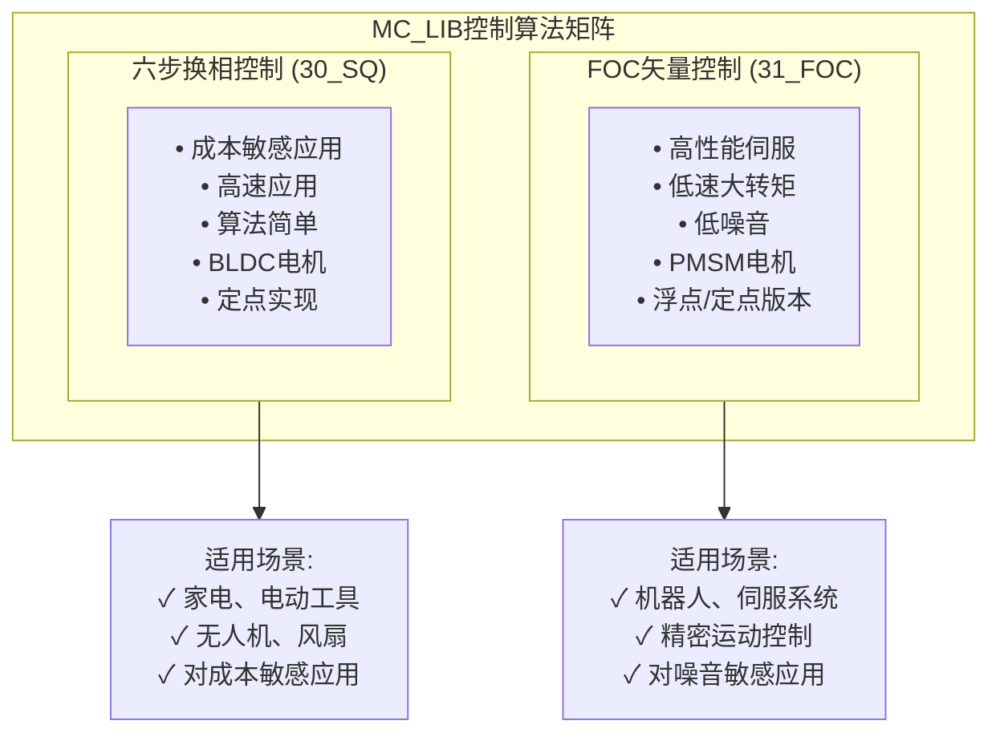
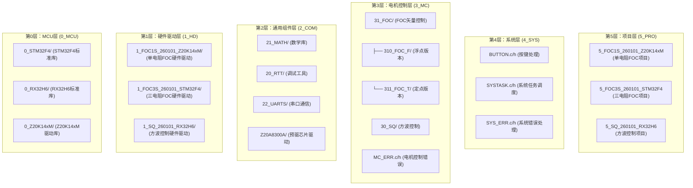
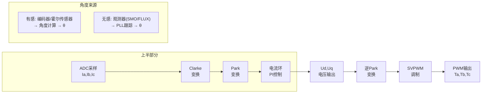
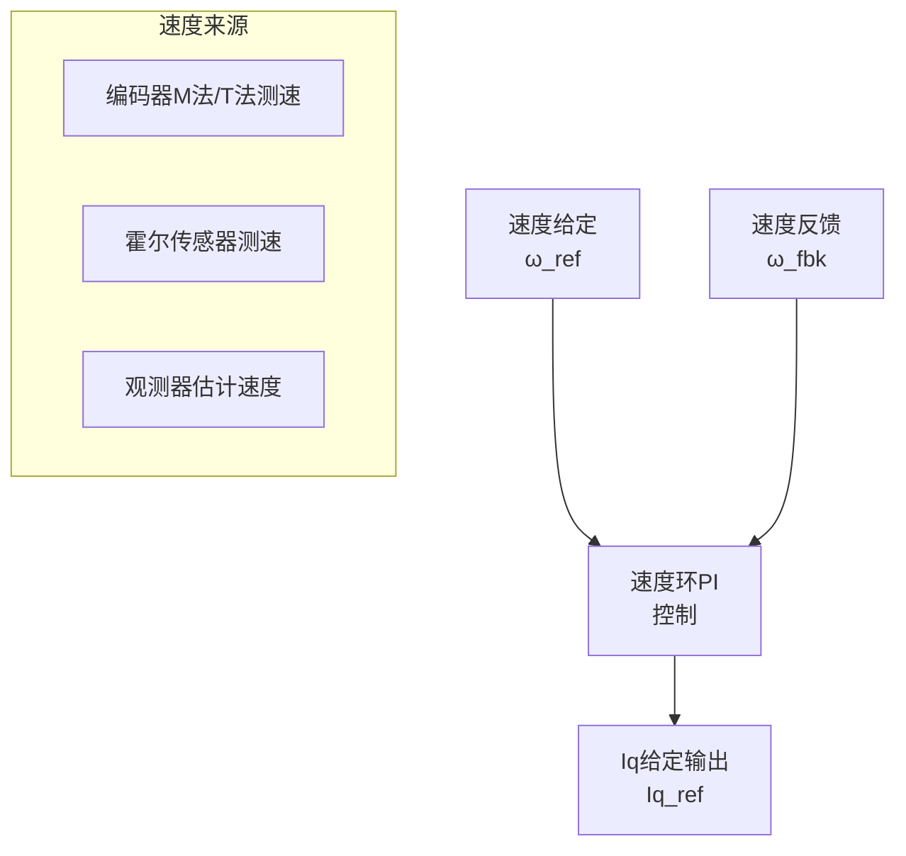
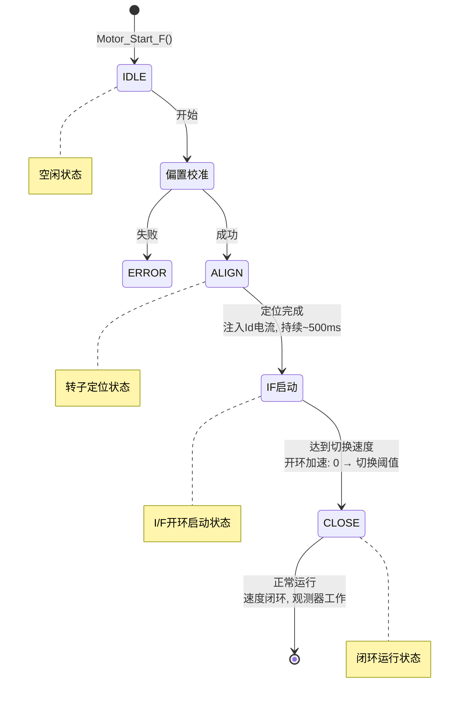

# MC_LIB电机控制库 - 架构总览

> 🔗 关联模块：[ALG-01 FOC理论](../ALG-01-FOC-Theory.md) | [ALG-05 有感FOC](../ALG-05-Sensored-FOC.md)

**文档版本：** v1.0  
**生成日期：** 2026-04-26  
**适用对象：** 电机控制工程师、嵌入式开发者  
**前置知识：** C语言编程、电机控制基础

---

## 目录

1. [库概述](#1-库概述)
2. [分层架构设计](#2-分层架构设计)
3. [模块依赖关系](#3-模块依赖关系)
4. [数据流分析](#4-数据流分析)
5. [初始化顺序](#5-初始化顺序)
6. [平台适配机制](#6-平台适配机制)
7. [命名规范](#7-命名规范)

---

## 1. 库概述

### 1.1 MC_LIB简介

MC_LIB是一个**分层模块化**的电机控制库，支持多种MCU平台和电机控制算法。其核心设计理念是：

```text
硬件无关性 + 算法可移植性 + 接口标准化
```

### 1.2 支持的平台

| MCU平台 | 目录 | 特点 |
|---------|------|------|
| STM32F4 | `0_MCU/0_STM32F4` | ARM Cortex-M4，DSP指令集 |
| RX32H6 | `0_MCU/0_RX32H6` | Renesas RX系列 |
| Z20K14xM | `0_MCU/0_Z20K14xM` | 国产车规级MCU |

### 1.3 支持的控制算法

MC_LIB支持**两种主流电机控制算法**，覆盖从成本敏感到高性能的全应用场景：


<!-- 原ASCII控制算法矩阵转为mermaid flowchart语法,使用subgraph分层展示 -->

#### 1.3.1 FOC矢量控制（31_FOC）

| 特性 | 说明 |
|------|------|
| **算法版本** | 浮点版本（310_FOC_F）和定点版本（311_FOC_T） |
| **采样方式** | 三电阻采样、单电阻采样 |
| **观测器** | 滑模观测器(SMO)、磁链观测器(FLUX)、反电动势观测器 |
| **控制链** | 定位→IF启动→闭环运行→弱磁控制 |
| **适用电机** | PMSM（正弦波反电动势） |

#### 1.3.2 六步换相控制（30_SQ）

| 特性 | 说明 |
|------|------|
| **换相方法** | 磁链法、反电动势法、比较器法 |
| **智能切换** | 低速磁链法，高速反电动势法 |
| **启动方式** | 定位启动、飞启动 |
| **控制链** | 偏置校准→启动→定位→运行→刹车 |
| **适用电机** | BLDC（梯形波反电动势） |

### 1.4 核心特性

```text
┌─────────────────────────────────────────────────────────────┐
│                    MC_LIB核心特性                            │
├─────────────────────────────────────────────────────────────┤
│  ✓ 双算法支持：FOC矢量控制 + 六步换相控制                    │
│  ✓ 多平台支持：STM32F4、RX32H6、Z20K14xM                    │
│  ✓ 多采样方式：三电阻采样、单电阻采样                        │
│  ✓ 多观测器：滑模观测器(SMO)、磁链观测器、反电动势观测器     │
│  ✓ 完整控制链：定位→启动→闭环运行→保护                     │
│  ✓ 参数自适应：速度相关增益、电感饱和补偿                    │
│  ✓ 工业级可靠性：死区补偿、故障检测、堵转保护                │
│  ✓ 灵活配置：浮点/定点、有感/无感、速度/转矩控制             │
└─────────────────────────────────────────────────────────────┘
```

---

## 2. 分层架构设计

### 2.1 六层架构模型


<!-- 原ASCII六层架构模型转为mermaid flowchart语法,使用subgraph分层展示 -->

### 2.2 各层职责

#### 第0层：MCU层 (0_MCU)

**职责：** 提供MCU底层硬件抽象

```text
0_MCU/
├── 00_DEVICE/     # 设备寄存器定义、启动文件
├── 01_STD/        # 标准外设库
│   ├── 010_INC/   # 头文件
│   └── 011_SRC/   # 源文件
├── 002_MAKE/      # 链接脚本
├── 003_START/     # 启动代码
└── 004_SYSTEM/    # 系统初始化
```

**关键文件：**
- `stm32f4xx.h` / `rx32h6xx.h` / `Z20K148M.h` - 设备寄存器定义
- `startup_xxx.s` - 启动汇编代码
- `system_xxx.c` - 系统时钟配置

#### 第1层：硬件驱动层 (1_HD)

**职责：** 封装硬件相关操作，提供统一接口

```text
1_HD/
├── 10_HAL/        # 硬件抽象层配置
│   └── HAL_CFG.h  # 硬件配置宏定义
├── 11_BSP/        # 板级支持包
│   ├── BSP_ADC.c/h   # ADC采样驱动
│   ├── BSP_PWM.c/h   # PWM输出驱动
│   ├── BSP_GPIO.c/h  # GPIO控制
│   ├── BSP_TIM.c/h   # 定时器配置
│   ├── BSP_ISR.c/h   # 中断服务
│   └── BSP_USART.c/h # 串口通信
└── 12_MCH/        # 硬件配置
    └── MCH.h      # 电机硬件参数
```

**BSP层设计原则：**
1. 所有硬件操作通过BSP函数封装
2. 使用宏定义配置硬件参数
3. 支持不同MCU平台的适配

#### 第2层：通用组件层 (2_COM)

**职责：** 提供与硬件无关的通用算法组件

```text
2_COM/
├── 21_MATH/       # 数学库
│   ├── 21_MATH_F/ # 浮点版本
│   │   ├── MATH_ANGLE_F.c/h  # 角度计算
│   │   ├── MATH_LPF_F.c/h    # 低通滤波器
│   │   ├── MATH_PID_F.c/h    # PID控制器
│   │   ├── MATH_RAMP_F.c/h   # 斜坡函数
│   │   └── MATH_TABLE_F.c/h  # 查找表
│   └── 21_MATH_T/ # 定点版本
├── 20_RTT/        # SEGGER RTT调试
├── 22_UARTS/      # 串口通信协议
└── Z20A8300A/     # 预驱芯片驱动
```

**数学库核心模块：**

| 模块 | 功能 | 关键函数 |
|------|------|---------|
| MATH_ANGLE | 角度归一化、三角函数 | `MATH_ANGLE_MOD_F()`, `Math_SinCos_F()` |
| MATH_LPF | 一阶低通滤波器 | `LPF_Cal_F()` |
| MATH_PID | 位置式/增量式PID | `PID_Pos_Cal_F()`, `PID_Sat_Cal_F()` |
| MATH_RAMP | 斜坡函数发生器 | `Ramp_Cal_F()` |
| MATH_TABLE | 一维/二维查表 | `TABLE_1D_Inter_F()`, `TABLE_2D_Inter_F()` |

#### 第3层：电机控制层 (3_MC)

**职责：** 实现电机控制核心算法

```text
3_MC/
├── 31_FOC/        # FOC矢量控制
│   ├── 310_FOC_F/ # 浮点版本
│   │   ├── MCFOC_PMSM_F.c/h   # 坐标变换
│   │   ├── MCFOC_SVPWM_F.c/h  # SVPWM调制
│   │   ├── MCFOC_EST_F.c/h    # 观测器
│   │   ├── MCFOC_LOOP_F.c/h   # 控制环
│   │   ├── MCFOC_API_F.c/h    # 应用接口
│   │   ├── MCFOC_PARA_F.c/h   # 参数管理
│   │   └── MCFOC_TASK_F.c/h   # 任务调度
│   └── 311_FOC_T/ # 定点版本
├── 30_SQ/         # 方波控制
│   ├── MCSQ_BLDC.c/h  # BLDC控制
│   ├── MCSQ_API.c/h   # 应用接口
│   └── MCSQ_TASK.c/h  # 任务调度
├── MC_ERR.c/h     # 错误处理
└── PMSM_PARA.h    # 电机参数定义
```

**FOC模块调用关系：**

```mermaid
flowchart TD
    A["MCFOC_TASK_F (任务调度)"]
    --> B["MCFOC_API_F (应用接口)"]
    B --> B1["Motor_Start_F()"]
    B --> B2["Motor_Stop_F()"]
    B --> B3["Motor_Set_Target_Speed_F()"]

    A --> C["MCFOC_LOOP_F (控制环)"]
    C --> C1["MCFOC_CurrentLoop_F()<br/>(电流环)"]
    C --> C2["MCFOC_SpeedLoop_F()<br/>(速度环)"]
    C --> C3["MCFOC_IF_CurrentLoop_F()<br/>(IF启动)"]
    C --> C4["MCFOC_ALIGN_CurrentLoop_F()<br/>(定位)"]

    A --> D["MCFOC_EST_F (观测器)"]
    D --> D1["MCFOC_EST_SMO_F()<br/>(滑模观测器)"]
    D --> D2["MCFOC_EST_FLUX_F()<br/>(磁链观测器)"]
    D --> D3["MCFOC_EST_EMF_F()<br/>(反电动势观测器)"]

    A --> E["MCFOC_PMSM_F (坐标变换)"]
    E --> E1["MCFOC_Clark_F()"]
    E --> E2["MCFOC_Park_F()"]
    E --> E3["MCFOC_Ipark_F()"]
    E --> E4["MCFOC_Iclark_F()"]

    A --> F["MCFOC_SVPWM_F (SVPWM调制)"]
    F --> F1["MCFOC_SVPWM_ThreeShunt_F()<br/>(三电阻)"]
    F --> F2["MCFOC_SVPWM_OneShunt_F()<br/>(单电阻)"]
    F --> F3["MCFOC_DeadTime_COMP_F()<br/>(死区补偿)"]
```


<!-- 原ASCII FOC模块调用关系转为mermaid flowchart语法,清晰展示模块层次 -->

#### 第4层：系统层 (4_SYS)

**职责：** 系统级任务管理和用户交互

```text
4_SYS/
├── BUTTON.c/h     # 按键消抖和处理
├── SYSTASK.c/h    # 系统任务调度
├── SYS_ERR.c/h    # 系统错误处理
└── SYS.h          # 系统配置
```

#### 第5层：项目层 (5_PRO)

**职责：** 具体项目的应用代码

```text
5_PRO/
├── 5_FOC1S_260101_Z20K14xM/  # 单电阻FOC项目
│   ├── 5_MAIN/
│   │   ├── Main.c/h          # 主程序
│   │   └── Main.h
│   └── Z20A8300A/            # 预驱芯片初始化
├── 5_FOC3S_260101_STM32F4/   # 三电阻FOC项目
│   └── 5_MAIN/
│       └── Main.c/h
└── 5_SQ_260101_RX32H6/       # 方波控制项目
    └── 5_MAIN/
        └── Main.c/h
```

---

## 3. 模块依赖关系

### 3.1 依赖图

```text
                    ┌─────────────┐
                    │   5_PRO     │
                    │  (项目层)    │
                    └──────┬──────┘
                           │
                    ┌──────▼──────┐
                    │   4_SYS     │
                    │  (系统层)    │
                    └──────┬──────┘
                           │
          ┌────────────────┼────────────────┐
          │                │                │
   ┌──────▼──────┐  ┌──────▼──────┐  ┌──────▼──────┐
   │  3_MC/FOC   │  │  3_MC/SQ    │  │  MC_ERR     │
   │ (FOC控制)   │  │ (方波控制)   │  │ (错误处理)  │
   └──────┬──────┘  └──────┬──────┘  └─────────────┘
          │                │
          └────────┬───────┘
                   │
          ┌────────▼────────┐
          │     2_COM       │
          │  (通用组件层)    │
          │  ┌───────────┐  │
          │  │ MATH_F    │  │
          │  │ MATH_T    │  │
          │  │ RTT       │  │
          │  │ UARTS     │  │
          │  └───────────┘  │
          └────────┬────────┘
                   │
          ┌────────▼────────┐
          │     1_HD        │
          │  (硬件驱动层)    │
          │  ┌───────────┐  │
          │  │ BSP_ADC   │  │
          │  │ BSP_PWM   │  │
          │  │ BSP_GPIO  │  │
          │  │ BSP_TIM   │  │
          │  └───────────┘  │
          └────────┬────────┘
                   │
          ┌────────▼────────┐
          │     0_MCU       │
          │   (MCU层)       │
          │  ┌───────────┐  │
          │  │ STM32F4   │  │
          │  │ RX32H6    │  │
          │  │ Z20K14xM  │  │
          │  └───────────┘  │
          └─────────────────┘
```

### 3.2 头文件包含关系

```c
// MCFOC_PMSM_F.h 的依赖
#include "MATH_ANGLE_F.h"   // 角度计算
#include "MATH_LPF_F.h"     // 低通滤波
#include "MATH_RAMP_F.h"    // 斜坡函数
#include "MATH_TABLE_F.h"   // 查找表
#include "MATH_CHECK.h"     // 条件检测

// MCFOC_SVPWM_F.h 的依赖
#include "MATH_RAMP_F.h"
#include "MCFOC_PMSM_F.h"   // 依赖PMSM电气量结构体

// MCFOC_EST_F.h 的依赖
#include "MATH_ANGLE_F.h"
#include "MATH_LPF_F.h"
#include "MATH_PID_F.h"
#include "MATH_TABLE_F.h"
#include "MCFOC_PMSM_F.h"

// MCFOC_LOOP_F.h 的依赖
#include "MATH_CHECK.h"
#include "MATH_ANGLE_F.h"
#include "MATH_LPF_F.h"
#include "MATH_PID_F.h"
#include "MATH_RAMP_F.h"
#include "MCFOC_PMSM_F.h"
```

---

## 4. 数据流分析

### 4.1 FOC控制数据流


<!-- 原ASCII FOC控制数据流转为mermaid flowchart语法,清晰展示电流环数据流 -->

### 4.2 速度环数据流


<!-- 原ASCII速度环数据流转为mermaid flowchart语法 -->

### 4.3 观测器数据流

```text
┌─────────────────────────────────────────────────────────────────────────┐
│                        滑模观测器数据流                                   │
├─────────────────────────────────────────────────────────────────────────┤
│                                                                          │
│  输入：Uα, Uβ, Iα, Iβ, 电机参数(Rs, Ld, Lq)                              │
│                                                                          │
│  ┌──────────────────────────────────────────────────────────────────┐   │
│  │                        电流观测器                                  │   │
│  │  dIα/dt = -Rs/Ld·Îα + 1/Ld·(Uα - Zα)                             │   │
│  │  dIβ/dt = -Rs/Ld·Îβ + 1/Ld·(Uβ - Zβ)                             │   │
│  └──────────────────────────────────────────────────────────────────┘   │
│                            │                                             │
│                            ▼                                             │
│  ┌──────────────────────────────────────────────────────────────────┐   │
│  │                        滑模控制律                                  │   │
│  │  Zα = H1·sign(Îα - Iα)                                           │   │
│  │  Zβ = H1·sign(Îβ - Iβ)                                           │   │
│  └──────────────────────────────────────────────────────────────────┘   │
│                            │                                             │
│                            ▼                                             │
│  ┌──────────────────────────────────────────────────────────────────┐   │
│  │                        反电动势提取                                │   │
│  │  Eα = Zα (经低通滤波)                                             │   │
│  │  Eβ = Zβ (经低通滤波)                                             │   │
│  └──────────────────────────────────────────────────────────────────┘   │
│                            │                                             │
│                            ▼                                             │
│  ┌──────────────────────────────────────────────────────────────────┐   │
│  │                        PLL角度跟踪                                 │   │
│  │  ε = -Eα·cos(θ̂) - Eβ·sin(θ̂)                                      │   │
│  │  ω = Kp·ε + Ki·∫ε dt                                             │   │
│  │  θ = ∫ω dt                                                       │   │
│  └──────────────────────────────────────────────────────────────────┘   │
│                                                                          │
│  输出：θ (估计角度), ω (估计速度)                                        │
│                                                                          │
└─────────────────────────────────────────────────────────────────────────┘
```

---

## 5. 初始化顺序

### 5.1 系统初始化流程

```mermaid
flowchart TD
    A["1. MCU层初始化"] --> A1["系统时钟配置<br/>(SystemClock_Config)"]
    A --> A2["中断向量表设置"]
    A --> A3["FPU使能 (SCB->CPACR)"]

    B["2. BSP层初始化"] --> B1["BSP_CLK_Init()"]
    B --> B2["BSP_GPIO_Init()"]
    B --> B3["BSP_PWM_Init()"]
    b --> B4["BSP_ADC_Init()"]
    B --> B5["BSP_TIM_Init()"]
    B --> B6["BSP_USART_Init()"]
    B --> B7["BSP_ISR_Init()"]

    C["3. 电机控制层初始化"] --> C1["MCFOC_PMSM_Para_Init_F()<br/>PMSM参数初始化"]
    C --> C2["MCFOC_SVPWM_Init_F()<br/>SVPWM初始化"]
    C --> C3["MCFOC_EST_SMO_Init_F()<br/>观测器初始化"]
    c --> C4["MCFOC_CurrentLoop_Init_F()<br/>电流环初始化"]
    C --> C5["MCFOC_SpeedLoop_Init_F()<br/>速度环初始化"]
    C --> C6["MCFOC_ALIGN_Init_F()<br/>定位初始化"]

    D["4. 系统层初始化"] --> D1["BUTTON_Init()"]
    D --> D2["SYSTASK_Init()"]

    E["5. 偏置校准"] --> E1["MCFOC_Offset_Check_Three_F()<br/>电流偏置校准"]
```


<!-- 原ASCII系统初始化流转为mermaid flowchart语法,清晰展示分层初始化顺序 -->

### 5.2 电机启动流程


<!-- 原ASCII电机启动流转为mermaid stateDiagram语法,清晰展示状态机转换 -->

---

## 6. 平台适配机制

### 6.1 条件编译

```c
// HAL_CFG.h - 硬件配置
#ifndef HAL_CFG_H
#define HAL_CFG_H

// MCU平台选择
#define MCU_STM32F4     1
#define MCU_RX32H6      2
#define MCU_Z20K14xM    3

// 当前平台配置
#define CURRENT_MCU     MCU_STM32F4

// 根据平台选择头文件
#if (CURRENT_MCU == MCU_STM32F4)
    #include "stm32f4xx.h"
#elif (CURRENT_MCU == MCU_RX32H6)
    #include "rx32h6xx.h"
#elif (CURRENT_MCU == MCU_Z20K14xM)
    #include "Z20K148M.h"
#endif

// PWM频率配置
#define PWM_FREQUENCY       10000   // 10kHz
#define PWM_DEAD_TIME       500     // 500ns

// ADC采样配置
#define ADC_SAMPLE_TIME     10      // 采样周期数

#endif
```

### 6.2 BSP层抽象

```c
// BSP_PWM.h - PWM驱动抽象接口
#ifndef BSP_PWM_H
#define BSP_PWM_H

// PWM初始化
void BSP_PWM_Init(void);

// PWM占空比设置
void BSP_PWM_SetDuty(float duty_a, float duty_b, float duty_c);

// PWM使能/禁止
void BSP_PWM_Enable(void);
void BSP_PWM_Disable(void);

// 获取PWM周期计数值
uint32_t BSP_PWM_GetPeriod(void);

#endif
```

**不同平台的实现：**

```c
// STM32F4实现
void BSP_PWM_SetDuty(float duty_a, float duty_b, float duty_c)
{
    TIM1->CCR1 = (uint32_t)(duty_a * TIM1->ARR);
    TIM1->CCR2 = (uint32_t)(duty_b * TIM1->ARR);
    TIM1->CCR3 = (uint32_t)(duty_c * TIM1->ARR);
}

// Z20K14xM实现
void BSP_PWM_SetDuty(float duty_a, float duty_b, float duty_c)
{
    MCPWM->CMPA = (uint32_t)(duty_a * MCPWM->PER);
    MCPWM->CMPB = (uint32_t)(duty_b * MCPWM->PER);
    MCPWM->CMPC = (uint32_t)(duty_c * MCPWM->PER);
}
```

---

## 7. 命名规范

### 7.1 文件命名

```text
模块名_功能_版本.扩展名

示例：
MCFOC_PMSM_F.c    // FOC模块，PMSM功能，浮点版本
MATH_PID_F.h      // 数学模块，PID功能，浮点版本
BSP_ADC.c         // BSP模块，ADC功能
```

### 7.2 函数命名

```text
模块名_功能_动作_版本()

示例：
MCFOC_Clark_F()           // FOC模块，Clarke变换，浮点版本
MCFOC_EST_SMO_F()         // FOC模块，观测器估计，SMO算法，浮点版本
PID_Pos_Cal_F()           // PID模块，位置式，计算，浮点版本
BSP_PWM_Init()            // BSP模块，PWM，初始化
```

### 7.3 变量命名

```text
作用域_类型_名称

作用域前缀：
_ I_  : 输入变量 (Input)
_ O_  : 输出变量 (Output)
_ V_  : 内部变量 (Variable)
_ D_  : 派生变量 (Derived)
_ P_  : 参数变量 (Parameter)

类型前缀：
F_    : 浮点类型 (Float)
Q32I_ : 32位有符号定点数
Q32U_ : 32位无符号定点数
Q12I_ : Q12格式定点数

示例：
_I_F_IdRef           // 输入，浮点，d轴电流给定
_O_F_Freq            // 输出，浮点，频率
_V_F_SMO_Aalfa       // 内部变量，浮点，SMO观测器α轴电流
_P_F_SMO_H1          // 参数，浮点，SMO增益H1
_I_Q12I_Ia_Data      // 输入，Q12格式，a相电流原始数据
```

### 7.4 结构体命名

```text
ST_模块_功能_版本

示例：
ST_PMSM_ELEC_F       // 结构体，PMSM电气量，浮点版本
ST_SMO_CONTROL_F     // 结构体，SMO控制，浮点版本
ST_PID_POS_F         // 结构体，PID位置式，浮点版本
```

---

## 总结

### 核心设计原则

1. **分层解耦**：每层只依赖下层，不跨层调用
2. **接口抽象**：BSP层屏蔽硬件差异，算法层不感知硬件
3. **参数可配**：所有参数通过结构体配置，支持运行时修改
4. **版本分离**：浮点版本(_F)和定点版本(_T)独立实现

### 关键数据结构

| 结构体 | 用途 | 核心成员 |
|--------|------|---------|
| `ST_PMSM_ELEC_F` | 电气量状态 | 电流、电压、角度 |
| `ST_PMSM_PARA_F` | 电机参数 | Rs, Ld, Lq, ψf |
| `ST_SMO_CONTROL_F` | SMO观测器 | 观测电流、反电动势、PLL |
| `ST_CURRENT_CONTROL_F` | 电流环 | Id/Iq PI控制器 |
| `ST_FREQ_CONTROL_F` | 速度环 | 速度PI控制器 |

### 下一步

#### FOC矢量控制学习路径
- [MC-LIB-FOC-Core](MC-LIB-FOC-Core.md)：深入分析坐标变换算法
- [MC-LIB-SVPWM](MC-LIB-SVPWM.md)：深入分析SVPWM调制算法
- [MC-LIB-Observer](MC-LIB-Observer.md)：深入分析观测器算法
- [FOC理论基础](../ALG-01-FOC-Theory.md)：学习FOC理论基础

#### 六步换相控制学习路径
- [MC-LIB-Six-Step](MC-LIB-Six-Step.md)：六步换相基本原理与无感换相方法
- [MC-LIB-Six-Step](MC-LIB-Six-Step.md)：深入分析MC_LIB的六步换相实现
- [MC-LIB-Porting-Guide](MC-LIB-Porting-Guide.md)：学习如何移植和使用

---

## 🆚 与 hpm_MC 架构对比

| 维度 | MC_LIB | hpm_MCL (v1) | hpm_MCL (v2) |
|------|--------|-------------|-------------|
| **分层模型** | 六层（MCU→BSP→COM→MC→SYS→PRO） | 平面式（无显式分层） | 五层（App→Core→Driver→HW-Accel→HAL） |
| **模块数量** | ~30个模块 | ~7个独立模块 | ~15个模块（core/sensor/encoder/detect分层） |
| **硬件平台** | STM32F4/RX32H6/Z20K14xM（3平台） | HPM6000/HPM5000系列 | HPM6000/HPM5000系列 |
| **API风格** | 函数式（MCFOC_前缀） | 函数式（hpm_foc_前缀） | 面向对象（mcl_loop_t 聚合体 + 函数指针表） |
| **配置方式** | 分散配置文件 | 宏定义+结构体 | 统一 mcl_loop_t 聚合初始化 |
| **硬件加速** | 无 | VSC/CLC/QEO 可选启用 | VSC/CLC/QEO 深度集成 |
| **算法覆盖** | FOC+六步换相 | FOC+Block+HFI+SMC+OverZero | v1全集 + 参数辨识 + 混合控制 + 路径规划 + 步进FOC |
| **观测器种类** | SMO/FLUX/EMF(3种) | SMC/HFI(2种) | SMC + 编码器融合(T/M/MT/PLL) |
| **调试支持** | RTT 调试打印 | 基础 trace | FIFO debug trace + LittleVGL GUI |

**选型建议**:
- **MC_LIB**: 适合多平台跨MCU移植、ST/Renesas/国产MCU生态
- **hpm_MCL v2**: 适合 HPM 平台极致性能优化，充分利用硬件加速器
- **hpm_MCL v1**: 遗留项目，建议向 v2 迁移

详细分析见: `算法/HPM-MC/SDK-01-HPM-MC-Architecture.md`

---

*文档更新时间: 2026-04-27*

## 延伸实践
- 📂 [路径14-1: DSP FOC代码实现](../../practice/PRACTICE-14-Engineering-Practice.md#站1) — TMS320F28335 FOC代码，与MC-LIB(STM32/Z20K)形成多平台对比
