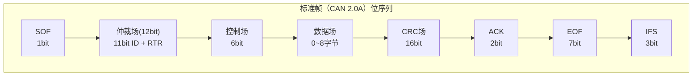
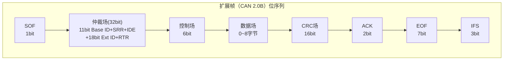
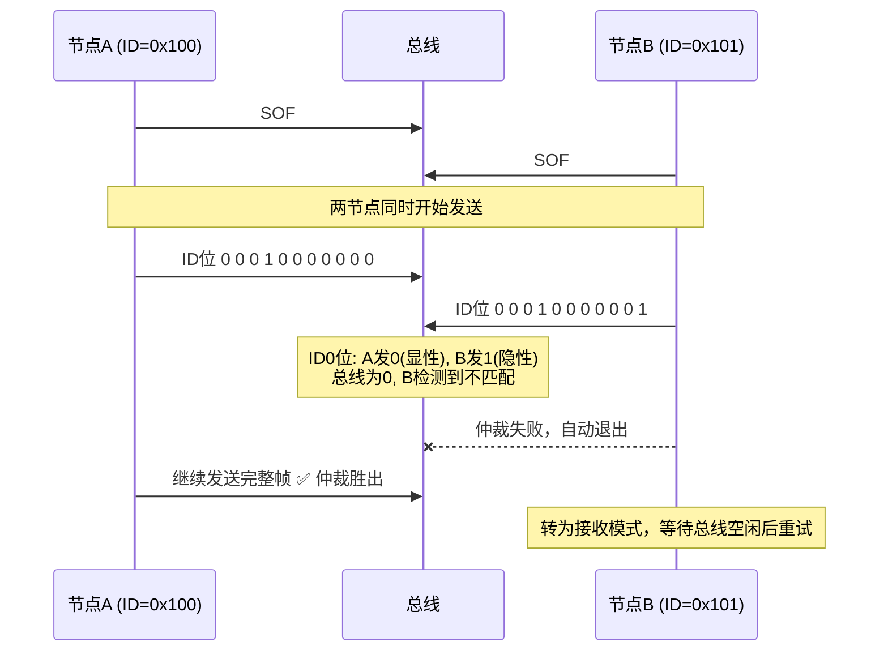
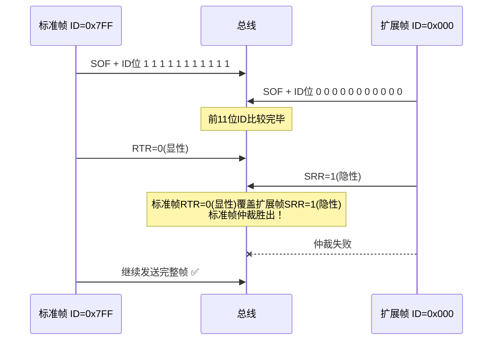
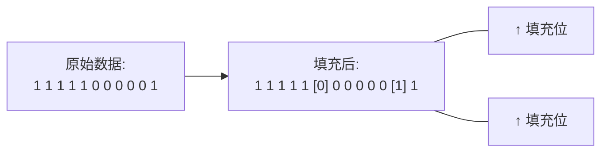
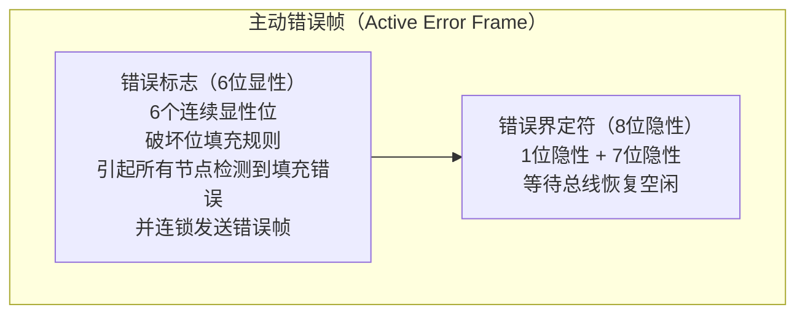
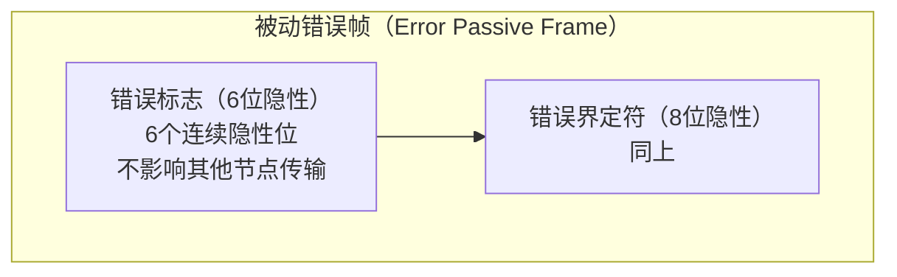
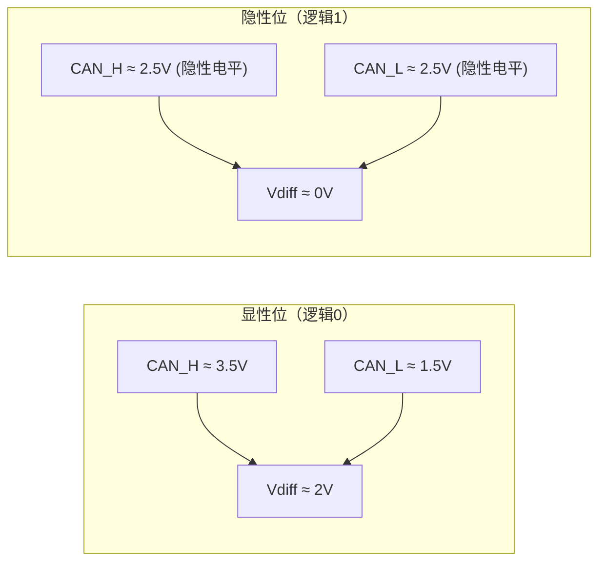
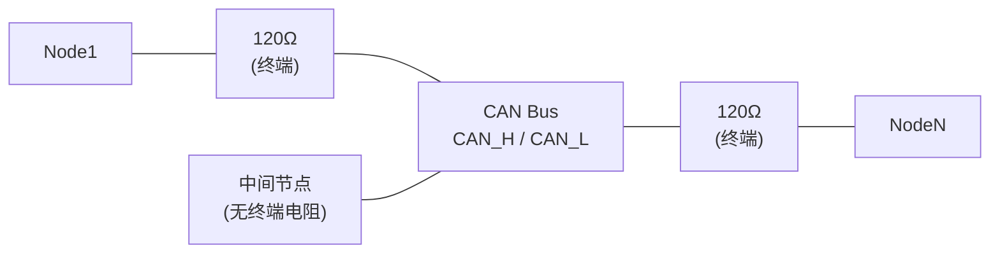
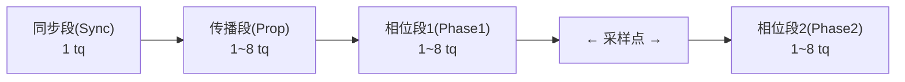

# COM-01 CAN总线基础

> 路径：📡 工业通信协议 > COM-01

**难度：** ★★★☆☆

## 概述

CAN（Controller Area Network）是由Bosch于1986年开发的串行通信协议，最初面向汽车领域，现已广泛应用于工业自动化、电机控制、医疗设备等场景。CAN协议的核心设计理念是：高可靠性、实时性和灵活性——这正是电机控制系统对通信总线的核心要求。

在电机控制系统中，CAN总线承担着多轴协调、指令下发、状态反馈、故障诊断等关键任务。理解CAN协议的底层机制，对于设计可靠的电机驱动通信系统至关重要。本文将从帧格式、仲裁机制、位填充、错误处理和物理层拓扑五个维度，深入剖析CAN 2.0A/2.0B的技术细节。

## 正文

### 1. CAN 2.0A/2.0B 帧格式详解

CAN 2.0定义了两种帧格式：**标准帧（CAN 2.0A）** 使用11位标识符，**扩展帧（CAN 2.0B）** 使用29位标识符。CAN总线上的报文有四种类型：数据帧、远程帧、错误帧和过载帧。

#### 1.1 数据帧结构

数据帧是CAN通信中最核心的帧类型，用于承载应用数据。其完整结构如下：





#### 1.2 各字段详解

**SOF（Start of Frame）** — 1位显性位

SOF标志一帧的开始。所有节点在检测到总线空闲后，通过发送显性位来同步。SOF的下降沿同时作为所有节点的硬同步信号。

> **工程经验**：SOF的检测是CAN控制器硬件自动完成的，软件无需干预。但在总线负载率极高时，SOF可能被噪声淹没导致帧丢失，因此高负载率下应关注总线信号质量。

**仲裁场（Arbitration Field）**

| 字段 | 标准帧 | 扩展帧 | 说明 |
|------|--------|--------|------|
| Base ID | 11位 | 11位 | 基础标识符，高位先发 |
| SRR | 无 | 1位（隐性） | 替代远程请求位，保持与标准帧兼容 |
| IDE | 1位（显性） | 1位（隐性） | 标识符扩展位，区分标准/扩展帧 |
| Extended ID | 无 | 18位 | 扩展标识符 |
| RTR | 1位 | 1位 | 远程传输请求位：显性=数据帧，隐性=远程帧 |

仲裁场的核心作用是**总线访问优先级判定**。标识符值越小，优先级越高（因为显性位0覆盖隐性位1）。

> **工程经验**：在电机控制系统中，通常将紧急停止指令分配最低ID（如0x01），周期性状态反馈分配较高ID（如0x100+轴号）。切勿将所有报文设为相同优先级，否则仲裁退化为随机竞争。

**控制场（Control Field）** — 6位

| 位 | 含义 |
|----|------|
| IDE（标准帧中） | 已在仲裁场中，此处为保留位r1 |
| r0 | 保留位，显性 |
| DLC[3:0] | 数据长度码，0~8（标准帧和扩展帧均只支持0~8字节） |

DLC编码表：

| DLC[3:0] | 数据字节数 |
|-----------|-----------|
| 0000 | 0 |
| 0001 | 1 |
| ... | ... |
| 1000 | 8 |
| 1001~1111 | 保留（CAN FD中使用） |

> **工程经验**：DLC=0的数据帧是合法的，常用于心跳信号或同步触发。在电机控制中，建议利用DLC=0帧作为同步信号，减少总线负载。

**数据场（Data Field）** — 0~8字节

数据场承载应用层有效载荷。在电机控制中，典型的数据映射方式：

```text
字节0-1: 电流/转矩设定值（int16, Q15格式）
字节2-3: 速度设定值（int16, RPM或Q15）
字节4-5: 位置设定值（int16或int32高16位）
字节6-7: 控制字/状态字
```

> **工程经验**：8字节限制是CAN 2.0的硬约束。对于需要传输32位位置值+16位速度值+16位电流值+16位状态字的场景（共10字节），需要拆帧或使用CAN FD。拆帧时务必在应用层实现帧序号和完整性校验。

**CRC场（Cyclic Redundancy Check）** — 16位

CRC序列15位 + CRC界定符1位（隐性）。CAN使用的CRC多项式为：

- CRC-15: $x^{15} + x^{14} + x^{10} + x^8 + x^7 + x^4 + x^3 + 1$

CRC的计算范围包括SOF到数据场的所有位（不含填充位后的结果）。

> **工程经验**：CRC是CAN通信可靠性的核心保障。在电磁干扰严重的电机驱动环境中，CRC能有效检测位翻转错误。但CRC仅检错不纠错，检测到错误后通过错误帧请求重发。

**ACK场** — 2位

ACK槽（ACK Slot）1位 + ACK界定符1位。发送节点在ACK槽发送隐性位，所有正确接收的节点在ACK槽发送显性位覆盖。ACK界定符固定为隐性位。

> **工程经验**：如果发送节点在ACK槽读回隐性位，说明没有任何节点正确接收该帧，将触发ACK错误。在单节点调试时（总线上只有一个节点），必然产生ACK错误，这是正常现象——需要接入至少一个其他节点或开启回环模式。

**EOF（End of Frame）** — 7位隐性位

标志帧结束。连续7位隐性位是帧结束的唯一判定条件。

**IFS（Inter Frame Space）** — 3位隐性位

帧间间隔，用于将当前帧与下一帧分隔开。只有在IFS之后，总线才被认为进入空闲状态。

#### 1.3 远程帧

远程帧（Remote Frame）用于请求某节点发送数据。其结构与数据帧类似，但：
- RTR位为隐性
- 无数据场
- DLC表示请求的数据长度

> **工程经验**：远程帧在实际工程中**极少使用**。原因是：远程帧请求→数据帧响应的过程增加了总线延迟和不确定性。在电机控制中，推荐使用"定时发送"模式替代"请求-响应"模式，确保数据传输的确定性。CiA 301（CANopen）标准也明确不推荐使用远程帧。

### 2. 仲裁机制

#### 2.1 线与特性（Wired-AND）

CAN总线物理层的核心特性是**线与（Wired-AND）逻辑**：

- **显性位（Dominant, 逻辑0）**：CAN_H ≈ 3.5V, CAN_L ≈ 1.5V，差分电压约2V
- **隐性位（Recessive, 逻辑1）**：CAN_H ≈ 2.5V, CAN_L ≈ 2.5V，差分电压约0V

当多个节点同时发送不同电平时，显性位总是覆盖隐性位——这就是"线与"特性。物理层收发器内部通过开集电极/开漏极结构实现：显性位时驱动管导通拉低总线，隐性位时驱动管关断由终端电阻上拉。

#### 2.2 非破坏性仲裁（Non-Destructive Arbitration）

当多个节点同时开始发送时，仲裁过程如下：



仲裁过程的关键特性：
1. **非破坏性**：胜出节点的报文完整发送，不会被破坏
2. **逐位仲裁**：每发送一位，节点同时回读总线电平，若不匹配则退出
3. **优先级确定**：ID值越小，优先级越高（因为高位先发，0覆盖1）

#### 2.3 仲裁的工程考量

**优先级倒置问题**：在扩展帧和标准帧混合使用时，由于扩展帧的SRR位为隐性，而标准帧对应位置为RTR（数据帧时为显性），标准帧总是优先于扩展帧——即使扩展帧的Base ID更小。



> **工程经验**：在电机控制系统中，**强烈建议统一使用标准帧或统一使用扩展帧**，避免混合使用导致的优先级混乱。如果必须混合，需要仔细分析仲裁场第12位（SRR/RTR）的影响。

:::sim-html comm_sim.html

### 3. 位填充规则

#### 3.1 填充机制

CAN协议规定：在SOF到CRC界定符之间的区域（即**位填充适用区域**），如果连续出现5个相同电平的位，发送节点自动插入一个相反电平的填充位。



接收节点执行逆过程：检测到5个连续相同位后，自动丢弃紧随的填充位。

#### 3.2 位填充的影响

**对CRC的影响**：CRC计算基于填充前的原始数据，接收端先去填充再计算CRC。

**对帧长度的影响**：位填充使帧长度变为可变的。最坏情况下，数据场全为0或全为1时，每5位插入1位，帧长度增加约20%。

**对实时性的影响**：填充位增加了传输时间，在计算总线负载率时必须考虑。

> **工程经验**：在计算最坏情况总线负载率时，应按帧长度增加17%~23%估算（考虑填充位开销）。对于安全关键系统，必须按最坏情况计算。一个简化的估算公式：

$$L_{stuff} \approx L_{raw} + \lfloor \frac{L_{raw}}{5} \rfloor$$

其中 $L_{raw}$ 是填充前的位长度。

**位填充与错误检测的协同**：位填充规则本身也是一种错误检测手段。如果接收节点在填充适用区域内检测到6个或更多连续相同电平位，将触发**填充错误（Stuff Error）**。

### 4. 错误处理

CAN协议的错误处理机制是其高可靠性的根本保障，这是CAN区别于UART、SPI等简单通信协议的核心优势。

#### 4.1 五种错误类型

| 错误类型 | 检测条件 | 检测节点 |
|----------|---------|---------|
| **位错误（Bit Error）** | 发送节点发出的电平与总线回读的电平不一致（ACK场和仲裁场除外） | 发送节点 |
| **填充错误（Stuff Error）** | 在填充适用区域内检测到6个或更多连续相同电平位 | 所有节点 |
| **CRC错误（CRC Error）** | 接收节点计算的CRC与接收到的CRC不一致 | 接收节点 |
| **格式错误（Form Error）** | 固定格式的字段（CRC界定符、ACK界定符、EOF、IFS）出现非法值 | 所有节点 |
| **ACK错误（ACK Error）** | 发送节点在ACK槽未检测到显性位 | 发送节点 |

#### 4.2 错误帧结构

检测到错误的节点立即发送**错误帧（Error Frame）**，中断当前传输：





> **工程经验**：主动错误帧的6位显性位会破坏正在传输的帧，这是CAN协议"全局通知错误"的设计哲学——让所有节点都知道当前帧出错。被动错误帧的6位隐性位不会影响总线，这是对"问题节点"的降级处理，防止其持续干扰总线。

#### 4.3 错误计数器与节点状态

每个CAN控制器维护两个8位错误计数器：**TEC（发送错误计数器）** 和 **REC（接收错误计数器）**。

计数规则（简化版）：

| 事件 | TEC变化 | REC变化 |
|------|---------|---------|
| 发送节点检测到错误 | +8 | — |
| 发送节点成功发送 | -1（最小0） | — |
| 接收节点检测到错误 | — | +8 |
| 接收节点成功接收后检测到错误 | — | +4 |
| 接收节点成功接收 | — | -1（最小0） |
| 成功发送后（TEC>127） | -128（每帧） | — |

节点状态转换：

```mermaid
stateDiagram-v2
    [*] --> ErrorActive : TEC≤127 且 REC≤127
    ErrorActive --> ErrorPassive : TEC>127 或 REC>127
    ErrorPassive --> ErrorActive : TEC≤127 且 REC≤127
    ErrorPassive --> BusOff : TEC>255
    BusOff --> ErrorPassive : 软件请求恢复\n监控128×11位隐性位后

    state ErrorActive as "Error Active (主动错误)"
    state ErrorPassive as "Error Passive (被动错误)"
    state BusOff as "Bus Off (总线关闭)"
```

**三种状态的行为差异**：

| 状态 | 错误标志类型 | 对总线影响 | 发送能力 |
|------|------------|-----------|---------|
| Error Active | 主动错误标志（6位显性） | 中断当前帧 | 正常 |
| Error Passive | 被动错误标志（6位隐性） | 不影响其他节点 | 发送前需等待额外空闲时间 |
| Bus Off | 不发送错误帧 | 完全脱离总线 | 禁止发送 |

> **工程经验**：
> 1. **Bus Off恢复策略**：在电机控制中，驱动器进入Bus Off是严重事件。恢复策略通常为：检测到Bus Off后等待一段时间（如100ms），然后请求恢复。恢复后TEC/REC从0开始。频繁Bus Off通常意味着硬件问题（终端电阻缺失、线缆断裂、波特率不匹配）。
> 2. **错误计数器监控**：在应用层应定期读取TEC/REC值，当计数器持续增长时，即使未达到Error Passive阈值，也应触发预警——这往往是总线质量恶化的早期信号。
> 3. **REC异常增长**：如果某个节点REC持续增长但TEC正常，说明该节点接收能力有问题，可能是晶振偏差过大或采样点配置错误。

### 5. 总线拓扑与物理层

#### 5.1 差分信号与抗干扰

CAN总线采用差分信号传输，这是其强抗干扰能力的物理基础：



差分信号的优势：
- 共模抑制：外部干扰同时作用于CAN_H和CAN_L，差分电压不变
- 电磁兼容：差分电流方向相反，辐射相互抵消
- 地偏移容忍：节点间地电位差在±2V范围内不影响通信

> **工程经验**：在电机驱动器中，逆变器开关产生的dv/dt和di/dt噪声是CAN通信的最大威胁。PCB布局时CAN收发器应尽量靠近连接器，CAN_H/CAN_L走线应等长、平行、紧耦合，远离功率走线。必要时使用共模扼流圈（如B82789）抑制共模噪声。

#### 5.2 终端电阻

CAN总线两端必须各安装一个**120Ω终端电阻**，作用是：
1. 阻抗匹配，防止信号反射
2. 在隐性状态下为总线提供确定的电平
3. 确保显性/隐性电平的快速切换



终端电阻的验证方法：断开总线电源，用万用表测量CAN_H和CAN_L之间的直流电阻：
- 两个120Ω并联 = **60Ω**（正常）
- 120Ω = 只有一端接了终端电阻（异常）
- 无穷大 = 两端都没接终端电阻（严重异常）

> **工程经验**：
> 1. 终端电阻的精度影响信号质量，建议使用1%精度的金属膜电阻。
> 2. 在实际调试中，"CAN通信不稳定"的根因有50%以上是终端电阻问题——要么缺失，要么多接（中间节点也接了终端电阻）。
> 3. 有些收发器（如TJA1050）内部没有终端电阻，必须外接；有些评估板内置了120Ω电阻，使用时需确认是否需要拆除。

#### 5.3 最大节点数

CAN协议理论上不限制节点数，但实际受限于：
- 收发器驱动能力：通常一个收发器可驱动32~110个节点
- 总线电容负载：每个节点增加约10~30pF输入电容
- 实际工程中建议**单网段不超过30个节点**

> **工程经验**：电机驱动系统中，通常一个CAN网段连接1~8个驱动器+1个主站。节点数超过30时，应使用CAN中继器或网关分割网段。

#### 5.4 线缆长度与波特率关系

线缆长度受信号传播延迟限制。CAN总线上信号的往返延迟（从一端到另一端再返回）必须在一个位时间内完成采样：

| 波特率 | 最大线缆长度（近似值） |
|--------|----------------------|
| 1 Mbit/s | 25 m |
| 500 kbit/s | 100 m |
| 250 kbit/s | 250 m |
| 125 kbit/s | 500 m |
| 50 kbit/s | 1000 m |
| 20 kbit/s | 2500 m |

计算依据：信号在双绞线中的传播速度约5 ns/m（光速的60%~70%），往返延迟约10 ns/m。加上收发器延迟和时钟容差，经验公式为：

$$L_{max} \approx \frac{t_{bit} - 2 \times t_{prop\_other}}{2 \times t_{prop\_per\_meter}}$$

> **工程经验**：
> 1. 电机控制常用500 kbit/s或1 Mbit/s，对应线缆长度100m和25m。对于多轴伺服系统，1 Mbit/s + 25m通常足够。
> 2. 线缆必须使用**特征阻抗120Ω的双绞线**，不要使用普通平行线。推荐使用CAN专用线缆（如AWG 22~24，特性阻抗120Ω±10%）。
> 3. 波特率选择需平衡实时性和可靠性。在电机控制中，500 kbit/s是性价比较高的选择——既保证1ms级控制周期，又有足够的线缆长度裕量。

#### 5.5 采样点配置

CAN协议定义了每位时间由多个时间量子（Time Quantum, tq）组成，分为四段：



采样点位置 = (1 + Prop + Phase1) / 总tq数 × 100%

CiA 301标准推荐采样点位置：
- 1 Mbit/s: 75%~87.5%
- 500 kbit/s: 87.5%
- 125~250 kbit/s: 87.5%

> **工程经验**：**采样点配置不一致是CAN通信失败的常见原因**。两个通信节点即使波特率相同，如果采样点不同，在高负载率下仍会出现CRC错误。在STM32中，通过BTR寄存器配置Prescaler、Seg1、Seg2来设定采样点。务必确保总线上所有节点的采样点配置一致。

## 小结

| 知识点 | 核心要点 | 工程关键 |
|--------|---------|---------|
| 帧格式 | 标准帧11位ID，扩展帧29位ID，数据场最大8字节 | 统一帧格式，避免混用；8字节限制需在应用层处理 |
| 仲裁机制 | 线与特性，ID越小优先级越高，非破坏性 | 标准帧优先于扩展帧；合理分配ID优先级 |
| 位填充 | 5个相同位后插入填充位 | 帧长度增加约17%~23%；填充错误是错误检测手段 |
| 错误处理 | 5种错误类型，3种节点状态，错误计数器 | 监控TEC/REC趋势；Bus Off恢复策略；REC异常增长预警 |
| 物理层 | 差分信号，120Ω终端电阻，线缆长度与波特率反比 | 终端电阻验证（60Ω）；采样点一致性；专用双绞线 |

## 参考

- Bosch, "CAN Specification 2.0", 1991
- CiA 301, "CANopen Application Layer and Communication Profile"
- ISO 11898-1:2015, "Road vehicles — Controller area network (CAN) — Part 1: Data link layer and physical signalling"
- ISO 11898-2:2016, "Road vehicles — Controller area network (CAN) — Part 2: High-speed medium access unit"
- Texas Instruments, "Controller Area Network Physical Layer Requirements" (SLLA270)
- NXP, "TJA1050 High-Speed CAN Transceiver Datasheet"
