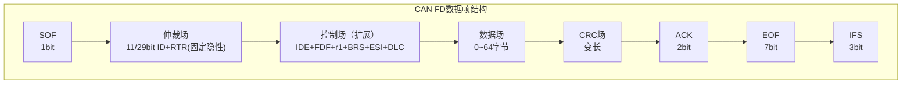
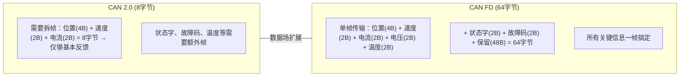

# COM-02 CAN FD扩展

> 路径： 工业通信协议 > COM-02

**难度：** 

## 概述

CAN FD（CAN with Flexible Data-rate）是Bosch于2012年发布的CAN协议扩展，解决了CAN 2.0的两个核心瓶颈：**8字节的数据场限制**和**固定的波特率**。CAN FD在保持CAN 2.0物理层和仲裁机制不变的前提下，将数据场扩展到最大64字节，并允许数据段以更高波特率传输，显著提升了总线带宽利用率。

2016年发布的CAN FD 1.1版本进一步增加了**CAN FD Lite**子集和更严格的CRC校验。ISO 11898-1:2015正式将CAN FD纳入国际标准。在电机控制领域，CAN FD正在逐步取代CAN 2.0，成为新一代伺服驱动器的标准通信接口。

## 正文

### 1. CAN FD帧格式

CAN FD数据帧在CAN 2.0帧格式基础上引入了三个新控制位，并修改了部分字段定义：



#### 1.1 三个新控制位

**FDF（Flexible Data Format）** — 帧格式指示

| FDF值 | 含义 |
|-------|------|
| 0（显性） | 经典CAN帧（CAN 2.0格式） |
| 1（隐性） | CAN FD帧 |

FDF位位于控制场中，替代了CAN 2.0帧中的r0保留位位置。当FDF=1时，该帧按CAN FD规则处理。

> **工程经验**：FDF位是CAN FD与CAN 2.0的**唯一帧格式区分标志**。经典CAN控制器在检测到FDF=1（隐性）时，由于该位在CAN 2.0中是保留位（显性），会检测到格式错误并发送错误帧——这就是为什么CAN FD帧与经典CAN节点不兼容的根本原因。

**BRS（Bit Rate Switch）** — 位速率切换

| BRS值 | 含义 |
|-------|------|
| 0（显性） | 不切换位速率，整帧使用仲裁段波特率 |
| 1（隐性） | 数据段使用更高波特率 |

BRS位仅在FDF=1（CAN FD帧）时有效。BRS=1时，从BRS位采样点之后到CRC界定符之前的区域使用数据段波特率。


> **工程经验**：BRS位本身使用仲裁段波特率发送，BRS位采样点之后才切换到数据段波特率。因此BRS位的采样是可靠的（在低速段完成），切换动作发生在BRS位之后。这意味着即使数据段波特率配置错误导致数据段通信失败，仲裁段仍能正常工作——节点至少能正确识别帧的开始和ID。

**ESI（Error State Indicator）** — 错误状态指示

| ESI值 | 含义 |
|-------|------|
| 0（显性） | 发送节点处于Error Active状态 |
| 1（隐性） | 发送节点处于Error Passive状态 |

ESI位为接收端提供了发送节点的错误状态信息，这是CAN 2.0中没有的诊断能力。

> **工程经验**：ESI位是极具价值的远程诊断手段。在多轴电机控制系统中，主站可以通过ESI位实时监控各驱动器的CAN控制器健康状态。如果某个驱动器持续发送ESI=1的帧，说明其CAN控制器已进入Error Passive，应触发预警并排查总线质量。

#### 1.2 RTR位的限制

CAN FD数据帧中**RTR位固定为隐性**（即CAN FD不支持远程帧）。这是合理的设计——远程帧在CAN 2.0中已不推荐使用，CAN FD直接废弃了这一机制。

### 2. 可变速率切换

#### 2.1 双波特率架构

CAN FD引入了**标称波特率（Nominal Bit Rate, NBR）** 和**数据波特率（Data Bit Rate, DBR）** 的双速率架构：

| 参数 | 标称波特率 | 数据波特率 |
|------|-----------|-----------|
| 适用区域 | 仲裁段（SOF到BRS位） | 数据段（BRS采样点到CRC界定符） |
| 典型值 | 500 kbit/s ~ 1 Mbit/s | 2 Mbit/s ~ 8 Mbit/s |
| 约束 | 受线缆长度限制 | 受收发器带宽和信号完整性限制 |
| 采样点 | 87.5%（推荐） | 75%~80%（推荐） |

#### 2.2 速率切换的时序约束

速率切换的关键约束是**位定时参数的独立性**：

- 标称波特率和数据波特率使用独立的分频器和位定时参数
- 切换点精确发生在BRS位采样点之后
- 切换回标称波特率发生在CRC界定符采样点之后

> **工程经验**：
> 1. 数据波特率的上限由**收发器环路延迟**决定。TJA1050等经典收发器的环路延迟约200ns，支持到约2 Mbit/s。要达到5 Mbit/s以上，必须使用CAN FD专用收发器（如TJA1462、TJA1463），其环路延迟约50ns。
> 2. 数据段采样点建议设为75%~80%，比仲裁段略提前，以补偿数据段更快的信号边沿和更小的时序裕量。
> 3. 在STM32G4中，标称波特率和数据波特率分别通过NBTP寄存器和DBTP寄存器独立配置。

#### 2.3 速率切换失败的影响

如果数据段波特率配置错误导致通信失败：

1. 发送节点：CRC校验失败（接收节点不会发送ACK），触发重发
2. 接收节点：检测到填充错误或CRC错误，发送错误帧
3. 仲裁段不受影响，下一帧可以正常仲裁

> **工程经验**：速率切换失败不会导致总线锁死，但会导致该帧反复重发，严重占用总线带宽。在调试CAN FD时，建议先用BRS=0（不切换速率）验证帧格式正确，再逐步提高数据段波特率。

### 3. 数据场扩展

#### 3.1 DLC编码扩展

CAN FD扩展了DLC字段的编码，支持0~64字节的数据场：

| DLC[3:0] | CAN 2.0数据字节数 | CAN FD数据字节数 |
|-----------|-------------------|-----------------|
| 0000 | 0 | 0 |
| 0001 | 1 | 1 |
| ... | ... | ... |
| 1000 | 8 | 8 |
| 1001 | — | 12 |
| 1010 | — | 16 |
| 1011 | — | 20 |
| 1100 | — | 24 |
| 1101 | — | 32 |
| 1110 | — | 48 |
| 1111 | — | 64 |

注意DLC=9~15不是连续映射，而是映射到12、16、20、24、32、48、64字节。

> **工程经验**：
> 1. 数据场长度不是任意值，只能是上述离散值。如果需要发送10字节数据，DLC应设为1010（16字节），其中后6字节为填充值（通常填0）。
> 2. 在电机控制中，常用的数据长度为8字节（兼容CAN 2.0）、16字节（可容纳完整的状态反馈）和64字节（批量参数读写）。

#### 3.2 数据场扩展对电机控制的影响

CAN FD的64字节数据场对电机控制系统的意义：

**单帧传输完整状态**：



**参数批量读写**：

```text
CAN 2.0: 读写一个32位参数需要1帧（8字节）
CAN FD:  一次可读写最多16个32位参数（64字节）
```

### 4. CRC场变化

#### 4.1 CRC多项式升级

CAN FD根据数据场长度使用不同的CRC多项式：

| 数据长度 | CRC位数 | 多项式 | 名称 |
|----------|---------|--------|------|
| 0~16字节 | 17位 | $x^{17} + x^{16} + x^{14} + x^{13} + x^{11} + x^{6} + x^{4} + x^{1} + 1$ | CRC-17 |
| 17~64字节 | 21位 | $x^{21} + x^{20} + x^{15} + x^{14} + x^{13} + x^{12} + x^{11} + x^{9} + x^{8} + x^{6} + x^{5} + x^{2} + 1$ | CRC-21 |

相比之下，CAN 2.0始终使用CRC-15。

#### 4.2 Stuff Count + Parity

CAN FD的CRC场前面增加了**Stuff Count（填充计数）** 和**Parity（奇偶校验）** 字段，这是CAN 2.0中没有的：


Stuff Count使用**灰度码（Gray Code）** 编码，范围0~15：

| 填充位个数 | 灰度码 | 填充位个数 | 灰度码 |
|-----------|--------|-----------|--------|
| 0 | 0000 | 8 | 1100 |
| 1 | 0001 | 9 | 1101 |
| 2 | 0011 | 10 | 1111 |
| 3 | 0010 | 11 | 1110 |
| 4 | 0110 | 12 | 1010 |
| 5 | 0111 | 13 | 1011 |
| 6 | 0101 | 14 | 1001 |
| 7 | 0100 | 15 | 1000 |

Parity位 = Stuff Count灰度码的偶校验位（即4位灰度码中1的个数为偶数时Parity=0，奇数时Parity=1）。

> **工程经验**：Stuff Count + Parity的设计是为了增强CAN FD的检错能力。在CAN 2.0中，如果填充位被噪声破坏，可能导致填充位的增减不被检测到（因为填充位的增减可能恰好使CRC校验仍然通过）。Stuff Count记录了填充位的总数，接收端可以验证填充位的增减是否被篡改，从而检测到这类"不可检测错误"。

#### 4.3 为什么CAN FD需要更强的CRC

CAN FD使用更长的CRC多项式（17位/21位 vs 15位）的原因：

1. **数据量增大**：64字节数据场需要更强的检错能力
2. **速率提高**：更快的位速率意味着每位时间更短，噪声窗口更宽
3. **填充位影响**：更长的帧意味着更多填充位，增加了填充错误与CRC错误的耦合概率

CAN 2.0的CRC-15对于8字节数据的汉明距离为6，但对于64字节数据汉明距离会降低到2~3，不可接受。CRC-17和CRC-21确保了在最大数据长度下仍有足够的汉明距离。

### 5. 与CAN 2.0的兼容性

#### 5.1 经典CAN节点如何处理FD帧

当经典CAN节点（仅支持CAN 2.0）接收到CAN FD帧时：

1. 经典CAN节点正常接收SOF和仲裁场
2. 在控制场中，经典CAN节点期望r0位（显性），但CAN FD帧发送FDF=1（隐性）
3. 经典CAN节点检测到格式错误，发送**主动错误帧**
4. 错误帧破坏了CAN FD帧的传输
5. CAN FD发送节点检测到错误，重发该帧
6. 经典CAN节点反复检测到格式错误，TEC快速增长
7. 最终经典CAN节点进入Bus Off状态

**结论：CAN FD帧和经典CAN帧不能在同一总线上混用**（除非使用特殊措施）。

#### 5.2 兼容性解决方案

| 方案 | 描述 | 优缺点 |
|------|------|--------|
| **全部升级** | 所有节点升级为CAN FD控制器 | 最佳方案，但成本高 |
| **BRS=0模式** | CAN FD节点发送FDF=1但BRS=0的帧 | 经典CAN节点仍无法识别FDF位 |
| **CAN FD收发器+经典帧** | 使用CAN FD收发器但只发送经典帧 | 浪费FD能力，但保证兼容 |
| **网关隔离** | 使用CAN FD网关连接经典CAN网段和FD网段 | 灵活但增加延迟和成本 |

> **工程经验**：在电机控制系统的升级过渡期，最实用的方案是**分网段部署**：新设备使用CAN FD网段，旧设备保留在经典CAN网段，通过网关桥接。STM32G4的FDCAN外设可以同时发送经典帧和FD帧，但总线上所有节点必须支持FD帧才能使用FD功能。

#### 5.3 CAN FD收发器的向下兼容

CAN FD专用收发器（如TJA1462）完全向下兼容经典CAN收发器。区别在于：

| 特性 | 经典CAN收发器 | CAN FD收发器 |
|------|-------------|-------------|
| 最大支持波特率 | 1 Mbit/s | 5~8 Mbit/s |
| 环路延迟 | 150~250 ns | 40~80 ns |
| 信号斜率 | 较慢 | 可控，支持快速边沿 |
| ESD保护 | 基础 | 增强 |
| 与经典CAN兼容 | — | 完全兼容 |

> **工程经验**：即使当前只使用CAN 2.0通信，新设计也应选用CAN FD收发器，为未来升级预留硬件空间。TJA1462与TJA1050引脚兼容，可直接替换。

### 6. CAN FD在电机控制中的应用优势

#### 6.1 带宽提升对比

以500 kbit/s仲裁段 + 5 Mbit/s数据段为例，发送一个16字节数据帧：

```text
CAN 2.0 (500 kbit/s, 8字节/帧, 需2帧):
  每帧约130位(含填充位) → 2帧 × 130位 / 500 kbit/s = 520 μs

CAN FD (500 kbit/s仲裁 + 5 Mbit/s数据, 16字节/帧, 1帧):
  仲裁段约40位 / 500 kbit/s = 80 μs
  数据段约180位 / 5 Mbit/s = 36 μs
  总计 ≈ 116 μs

带宽提升: 520 / 116 ≈ 4.5倍
```

#### 6.2 实时性提升

在多轴伺服系统中，CAN FD的优势更加明显：

| 场景 | CAN 2.0 | CAN FD | 提升 |
|------|---------|--------|------|
| 8轴位置反馈（每轴8字节） | 8帧 × 260μs = 2.08ms | 1帧 × 150μs = 0.15ms | 14× |
| 8轴速度+电流指令 | 8帧 × 260μs = 2.08ms | 1帧 × 150μs = 0.15ms | 14× |
| 参数批量读写（16个32位参数） | 16帧 × 260μs = 4.16ms | 1帧 × 200μs = 0.2ms | 21× |

> **工程经验**：CAN FD使多轴电机控制的通信周期从毫秒级降低到亚毫秒级，这对于高动态响应的伺服系统意义重大。但需注意：通信延迟的降低不等于控制带宽的等比例提升——控制带宽还受限于电流环和速度环的执行周期。

#### 6.3 协议栈适配

主流电机控制通信协议对CAN FD的支持情况：

| 协议 | CAN FD支持 | 说明 |
|------|-----------|------|
| CANopen (CiA 301) | CiA 301 v4.2+ | 支持FD帧，DLC扩展 |
| CANopen FD (CiA 1301) | 原生支持 | 专门为CAN FD设计 |
| EtherCAT over CAN FD | 支持 | 用CAN FD替代以太网物理层 |
| DeviceNet | 不支持 | 仅支持CAN 2.0A |
| 自定义协议 | 需自行适配 | 修改DLC处理和数据映射 |

## 小结

| 知识点 | CAN 2.0 | CAN FD | 工程意义 |
|--------|---------|--------|---------|
| 数据场 | 最大8字节 | 最大64字节 | 单帧传输完整状态，减少拆帧开销 |
| 波特率 | 固定 | 仲裁段+数据段双速率 | 带宽提升4~10倍 |
| CRC | CRC-15 | CRC-17/CRC-21 + Stuff Count | 更强的检错能力 |
| 远程帧 | 支持 | 不支持（RTR固定隐性） | 简化协议，去除不推荐机制 |
| 兼容性 | — | 与经典CAN节点不兼容 | 升级需全节点替换或网关隔离 |
| 新控制位 | — | FDF/BRS/ESI | 帧格式识别、速率切换、状态诊断 |

## 参考

- Bosch, "CAN with Flexible Data-Rate Specification Version 1.0", 2012
- Bosch, "CAN FD Specification Version 1.1", 2016
- ISO 11898-1:2015, "Road vehicles — Controller area network (CAN) — Part 1: Data link layer and physical signalling"
- CiA 1301, "CANopen FD — Application layer and communication profile"
- NXP, "TJA1462/TJA1463 CAN FD Transceiver Datasheet"
- Texas Instruments, "Introduction to CAN FD" (SLOA238)
