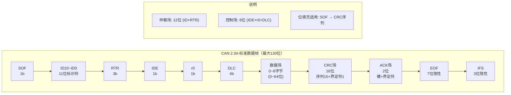
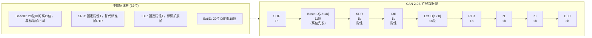
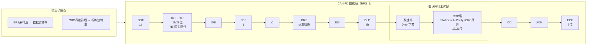
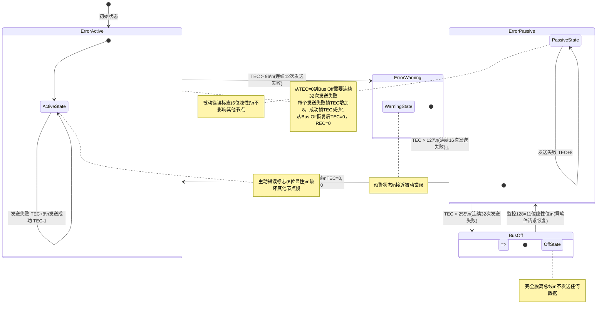
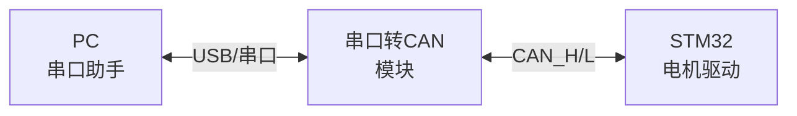

# COM-04 CAN通信仿真

> 路径： 工业通信协议 > COM-04

- **难度：** 

## 概述

理解CAN协议的帧结构、仲裁过程和错误处理机制，仅靠文字描述往往不够直观。本文通过ASCII art可视化、时序图演示和仿真工具指南，帮助工程师建立对CAN通信底层机制的直观理解。

在实际电机控制项目开发中，CAN通信调试往往占据大量时间。掌握仿真和调试工具的使用方法，能够显著缩短问题定位时间。本文不仅展示CAN协议的"理想行为"，更着重演示异常场景下的协议响应，为现场调试提供参考。

:::sim-html comm_sim.html

## 正文

### 1. CAN帧结构可视化

#### 1.1 CAN 2.0A标准数据帧



#### 1.2 CAN 2.0B扩展数据帧



#### 1.3 CAN FD数据帧



### 2. 仲裁过程演示

#### 2.1 两节点同时发送的仲裁过程

场景：节点A（ID=0x100）和节点B（ID=0x123）同时开始发送标准数据帧

```text
时间轴（从左到右）→
总线空闲后，两节点同时检测到空闲并开始发送

        SOF    ID10  ID9   ID8   ID7   ID6   ID5   ID4   ID3   ID2   ID1   ID0   RTR
        ───    ───   ───   ───   ───   ───   ───   ───   ───   ───   ───   ───   ───
节点A   0      0     0     1     0     0     0     0     0     0     0     0     0
(0x100) 显性   ←── 0x100 = 0b_001_0000_0000 ──────────────────────────────────→ 显性

节点B   0      0     0     1     0     0     1     0     0     0     1     1     0
(0x123) 显性   ←── 0x123 = 0b_001_0010_0011 ──────────────────────────────────→ 显性

总线    0      0     0     1     0     0     0     0     0     0     1     1     0
        ───    ───   ───   ───   ───   ───   ───   ───   ───   ───   ───   ───   ───
                                              ↑
                                         关键位！
                                    节点A发0(显性)，节点B发1(隐性)
                                    总线=0(显性)，线与特性
                                    节点B回读到0，与自身发送的1不匹配
                                    → 节点B仲裁失败，立即停止发送

结果: 节点A赢得仲裁，继续发送完整帧
      节点B退出发送，转为接收模式，等待总线空闲后重试
```

#### 2.2 三节点仲裁过程

场景：节点A（ID=0x050）、节点B（ID=0x100）、节点C（ID=0x07F）同时发送

```text
        SOF    ID10  ID9   ID8   ID7   ID6   ID5   ID4   ID3   ID2   ID1   ID0
        ───    ───   ───   ───   ───   ───   ───   ───   ───   ───   ───   ───
节点A   0      0     0     0     1     0     1     0     0     0     0     0
(0x050)        ←── 0x050 = 0b_000_1010_0000 ─────────────────────────────→

节点B   0      0     0     1     0     0     0     0     0     0     0     0
(0x100)        ←── 0x100 = 0b_001_0000_0000 ─────────────────────────────→
                              ↑
                         节点B发1，A/C发0 → B失败

节点C   0      0     0     0     1     1     1     1     1     1     1     1
(0x07F)        ←── 0x07F = 0b_000_1111_1111 ─────────────────────────────→
                                                    ↑
                                              节点A发0，节点C发1 → C失败

总线    0      0     0     0     1     0     1     0     0     0     0     0
        ───    ───   ───   ───   ───   ───   ───   ───   ───   ───   ───   ───

仲裁退出顺序:
  第1步: ID8位 → 节点B发1，A/C发0 → 节点B仲裁失败（最先退出）
  第2步: ID5位 → 节点A发0，节点C发1 → 节点C仲裁失败（第二退出）
  结果: 节点A（ID=0x050，最小）赢得仲裁

结论: ID值越小，优先级越高，仲裁越早胜出
```

#### 2.3 仲裁失败的节点行为

```text
时间轴 →
┌──────────────────────────────────────────────────────────────────────┐
│ 节点B（仲裁失败）的行为时序：                                        │
│                                                                      │
│ 发送: SOF ID10 ID9 ID8 ──→ 检测到不匹配，立即停止发送               │
│                          ╳                                           │
│ 总线: ══════════════════════════════════════════════════════════════ │
│       ← 节点A的完整帧在总线上传输 →                                  │
│                                                                      │
│ 节点B: ──发送──┤← 退出 →│← 接收节点A的帧 →│← 等待总线空闲 →│重试发送│
│               仲裁失败    转为接收模式       IFS检测          重新仲裁│
└──────────────────────────────────────────────────────────────────────┘

关键点:
1. 仲裁失败后，节点B立即停止发送（不产生错误帧）
2. 节点B自动转为接收模式，正确接收节点A的帧
3. 节点A的帧传输不受任何影响（非破坏性仲裁）
4. 节点A帧的EOF + IFS之后，节点B重新尝试发送
```

### 3. 错误帧模拟说明

#### 3.1 主动错误帧（Active Error Frame）

场景：节点A正在发送数据帧，节点B检测到CRC错误

```text
时间轴 →
┌─────────────────────────────────────────────────────────────────────┐
│ 节点A: │← 正常发送 SOF→仲裁→控制→数据→CRC →│← 检测到错误帧 →│重发│
│        │                                    │                  │    │
│ 总线:  │════════════════════════════════════╳══════════════════│    │
│        │← 正常数据 →│← CRC →│  错误标志   │ 错误界定符 │ IFS │    │
│        │             │       │  (6位显性)   │ (8位隐性)  │     │    │
│        │             │       │  000000      │ 11111111   │     │    │
│        │             │       │              │            │     │    │
│ 节点B: │← 接收 →│CRC校验失败│→ 发送错误标志 →│            │     │    │
│        │        │           │  000000       │            │     │    │
│        │        │           │               │            │     │    │
│ 节点C: │← 接收 →│ 检测到6位显性(填充错误) │→ 也发送错误标志│     │    │
│        │        │           │  000000       │            │     │    │
└─────────────────────────────────────────────────────────────────────┘

错误帧详细时序:
  1. 节点B检测到CRC错误
  2. 节点B在下一个位时间开始发送6位显性错误标志
  3. 6位连续显性违反位填充规则（5个相同位后应有填充位）
  4. 总线上所有其他节点检测到填充错误
  5. 其他节点也连锁发送错误标志（叠加在总线上）
  6. 错误标志结束后，发送8位隐性错误界定符
  7. 错误界定符结束后，总线空闲
  8. 节点A自动重发该帧

注意: 多个节点的错误标志在总线上叠加（都是显性），效果等同于单个错误标志
```

#### 3.2 被动错误帧（Error Passive Frame）

场景：节点B已进入Error Passive状态，检测到CRC错误

```text
时间轴 →
┌─────────────────────────────────────────────────────────────────────┐
│ 节点A: │← 正常发送 SOF→仲裁→控制→数据→CRC →│← 继续发送 →│完成│
│        │                                    │  ACK → EOF  │    │
│ 总线:  │════════════════════════════════════════════════════════│    │
│        │← 正常数据 →│← CRC →│  被动错误标志  │界定符│      │    │
│        │             │       │  (6位隐性)     │8位  │      │    │
│        │             │       │  111111        │隐性 │      │    │
│        │             │       │                │     │      │    │
│ 节点B: │← 接收 →│CRC校验失败│→ 发送6位隐性 →│     │      │    │
│(Passive)│       │           │  111111        │     │      │    │
│        │       │           │                │     │      │    │
│ 节点C: │← 正常接收 →│← 未受影响 →│← 正常接收 →│     │      │    │
│        │       │           │  (被动错误标志   │     │      │    │
│        │       │           │   不影响总线)   │     │      │    │
└─────────────────────────────────────────────────────────────────────┘

关键区别:
  主动错误帧: 6位显性 → 破坏当前帧，所有节点都知道出错
  被动错误帧: 6位隐性 → 不影响总线，其他节点正常接收

  被动错误节点"说话没人听得见"——这是对问题节点的降级处理
  防止一个故障节点持续干扰整个总线
```

#### 3.3 错误状态转换模拟



### 4. 仿真使用指南

#### 4.1 CAN通信调试工具概览

| 工具 | 类型 | 适用场景 | 成本 |
|------|------|---------|------|
| PCAN-View | USB-CAN适配器配套软件 | 基础收发调试 | 免费（需硬件） |
| CANoe | Vector专业工具 | 协议分析、仿真、测试 | 高（商业授权） |
| Busmaster | 开源CAN仿真工具 | 协议开发、测试 | 免费 |
| CANable + can-utils | 开源USB-CAN | Linux环境调试 | 低 |
| 串口助手+CAN模块 | 串口转CAN | 简单调试 | 低 |
| STM32回环模式 | MCU内置 | 无硬件调试 | 零 |

#### 4.2 STM32 FDCAN回环模式调试

回环模式（Loopback Mode）是无需外部硬件即可验证CAN协议栈的最佳方式：

```c
// 配置FDCAN为内部回环模式
void FDCAN_LoopbackTest(void)
{
    hfdcan1.Init.Mode = FDCAN_MODE_INTERNAL_LOOPBACK;
    HAL_FDCAN_Init(&hfdcan1);

    // 配置滤波器：接收所有帧
    FDCAN_FilterTypeDef filter = {
        .IdType = FDCAN_STANDARD_ID,
        .FilterIndex = 0,
        .FilterType = FDCAN_FILTER_MASK,
        .FilterConfig = FDCAN_FILTER_TO_RXFIFO0,
        .FilterID1 = 0x000,
        .FilterID2 = 0x000,
    };
    HAL_FDCAN_ConfigFilter(&hfdcan1, &filter);
    HAL_FDCAN_ConfigGlobalFilter(&hfdcan1, FDCAN_ACCEPT_IN_RXFIFO0,
                                  FDCAN_ACCEPT_IN_RXFIFO0,
                                  FDCAN_FILTER_REMOTE, FDCAN_FILTER_REMOTE);

    HAL_FDCAN_Start(&hfdcan1);

    // 发送测试帧
    FDCAN_TxHeaderTypeDef txHeader = {
        .Identifier = 0x123,
        .IdType = FDCAN_STANDARD_ID,
        .TxFrameType = FDCAN_DATA_FRAME,
        .ErrorStateIndicator = FDCAN_ESI_ACTIVE,
        .BitRateSwitch = FDCAN_BRS_OFF,
        .FDFormat = FDCAN_CLASSIC_CAN,
        .TxEventFifoControl = FDCAN_NO_TX_EVENTS,
        .MessageMarker = 0,
    };
    uint8_t txData[8] = {0x01, 0x02, 0x03, 0x04, 0x05, 0x06, 0x07, 0x08};
    HAL_FDCAN_AddMessageToTxFifoQ(&hfdcan1, &txHeader, txData);

    // 接收回环帧
    FDCAN_RxHeaderTypeDef rxHeader;
    uint8_t rxData[8];
    uint32_t timeout = 1000;
    while (HAL_FDCAN_GetRxFifoFillLevel(&hfdcan1, FDCAN_RX_FIFO0) == 0 && timeout--)
    {
        HAL_Delay(1);
    }

    if (timeout > 0)
    {
        HAL_FDCAN_GetRxMessage(&hfdcan1, FDCAN_RX_FIFO0, &rxHeader, rxData);
        // 验证: rxHeader.Identifier == 0x123, rxData == txData
    }
}
```

> **工程经验**：回环模式有三种：
> - **Internal Loopback**：TX信号内部回环到RX，不经过收发器，CAN_TX引脚无输出
> - **External Loopback**：TX信号同时发送到CAN_TX引脚和内部RX，可用于测试收发器
> - **Monitor Mode**：仅监听总线，不发送ACK和错误帧，用于被动监听

#### 4.3 使用串口转CAN模块调试

低成本调试方案：USB转串口 + 串口转CAN模块（如USBCAN-I）



串口转CAN模块的通信协议（通用格式）：

```text
发送CAN帧（主机→模块）：
┌──────┬──────┬──────┬──────┬──────┬──────┬──────┬──────┬──────┐
│ 0xAA │ 0x55 │ CMD  │ CH   │ ID_H │ ID_L │ DLC  │ DATA │ CHK  │
│ 帧头1 │ 帧头2 │ 命令  │ 通道 │ ID高 │ ID低 │ 长度 │ 数据 │ 校验 │
└──────┴──────┴──────┴──────┴──────┴──────┴──────┴──────┴──────┘

接收CAN帧（模块→主机）：
┌──────┬──────┬──────┬──────┬──────┬──────┬──────┬──────┬──────┐
│ 0xAA │ 0x55 │ CMD  │ CH   │ ID_H │ ID_L │ DLC  │ DATA │ CHK  │
│ 帧头1 │ 帧头2 │ 命令  │ 通道 │ ID高 │ ID低 │ 长度 │ 数据 │ 校验 │
└──────┴──────┴──────┴──────┴──────┴──────┴──────┴──────┴──────┘

CMD定义:
  0x01 = 发送标准帧
  0x02 = 发送扩展帧
  0x81 = 接收到标准帧
  0x82 = 接收到扩展帧

CHK = 之前所有字节的异或值
```

#### 4.4 使用CANable + can-utils（Linux环境）

CANable是开源USB-CAN适配器，配合Linux SocketCAN使用：

```bash
# 安装can-utils
sudo apt-get install can-utils

# 配置CAN接口（500 kbit/s）
sudo ip link set can0 up type can bitrate 500000 sample-point 0.875

# 发送标准帧
cansend can0 123#0102030405060708

# 发送扩展帧
cansend can0 1FFFFFFF#AABBCCDD

# 监听总线所有帧
candump can0

# 带时间戳和总线负载率监听
candump -ta can0

# 只监听特定ID
candump can0,123:7FF

# 发送周期性帧（每100ms）
cangen can0 -g 100 -I 123 -D 0102030405060708 -L 8

# 查看总线统计
ip -s link show can0

# 关闭接口
sudo ip link set can0 down
```

CAN FD配置：

```bash
# 配置CAN FD（仲裁段500k，数据段5M）
sudo ip link set can0 up type can bitrate 500000 dbitrate 5000000 fd on

# 发送CAN FD帧（16字节）
cansend can0 123##10102030405060708090A0B0C0D0E0F10

# 注意: ##1 表示CAN FD帧（BRS=1）
# ##0 表示CAN FD帧（BRS=0）
# #  表示经典CAN帧
```

#### 4.5 使用PCAN-View调试

PCAN-View是Peak System提供的免费CAN调试软件：

**基本操作流程**：

1. 连接PCAN-USB适配器
2. 选择波特率（如500 kbit/s）
3. 发送帧：在"Transmit"标签页设置ID、DLC、数据
4. 接收帧：在"Trace"标签页查看接收到的帧
5. 总线状态：查看TEC/REC和节点状态

**电机控制调试技巧**：

```text
1. 周期性发送测试：
   - 设置一个发送任务，每1ms发送速度指令
   - 观察驱动器响应是否稳定

2. 压力测试：
   - 设置多个发送任务，模拟高总线负载
   - 观察是否出现帧丢失或延迟增加

3. 错误注入：
   - 在发送过程中断开总线连接
   - 观察错误计数器变化和恢复过程

4. 波形分析：
   - 使用PCAN的波形显示功能
   - 实时监控电机状态数据（速度、电流、位置）
```

#### 4.6 自定义调试协议设计

在电机控制开发中，常需要自定义简单的调试协议：

```c
// 调试协议定义（基于CAN 2.0A标准帧）
// ID分配:
//   0x700 + 轴号: 主站→驱动器 指令帧
//   0x780 + 轴号: 驱动器→主站 状态帧
//   0x7F0:        广播同步帧
//   0x7F1:        调试读请求
//   0x7F2:        调试读响应
//   0x7F3:        调试写请求

// 调试读请求帧格式 (ID=0x7F1, DLC=4)
// Byte0-1: 寄存器地址（小端序）
// Byte2:   读取长度（1/2/4字节）
// Byte3:   保留

// 调试读响应帧格式 (ID=0x7F2, DLC=5~8)
// Byte0:   寄存器地址低8位
// Byte1:   状态（0=成功，非0=错误码）
// Byte2-5: 数据（最多4字节，小端序）
// Byte6-7: 时间戳（可选）

typedef struct __attribute__((packed))
{
    uint16_t address;
    uint8_t length;
    uint8_t reserved;
} CAN_DebugReadReq;

typedef struct __attribute__((packed))
{
    uint8_t address_lsb;
    uint8_t status;
    uint8_t data[4];
    uint16_t timestamp;
} CAN_DebugReadResp;

// 发送调试读请求
void CAN_DebugRead(uint16_t addr, uint8_t len)
{
    CAN_DebugReadReq req = {
        .address = addr,
        .length = len,
        .reserved = 0,
    };

    FDCAN_TxHeaderTypeDef txHeader = {
        .Identifier = 0x7F1,
        .IdType = FDCAN_STANDARD_ID,
        .TxFrameType = FDCAN_DATA_FRAME,
        .ErrorStateIndicator = FDCAN_ESI_ACTIVE,
        .BitRateSwitch = FDCAN_BRS_OFF,
        .FDFormat = FDCAN_CLASSIC_CAN,
        .TxEventFifoControl = FDCAN_NO_TX_EVENTS,
        .MessageMarker = 0,
    };

    HAL_FDCAN_AddMessageToTxFifoQ(&hfdcan1, &txHeader, (uint8_t *)&req);
}
```

> **工程经验**：
> 1. 调试协议的ID应与正常通信ID区分开，避免干扰正常控制流程。
> 2. 调试帧的优先级应低于控制帧（使用更高的ID值），确保调试不影响实时控制。
> 3. 在量产固件中应提供开关控制调试协议的启用/禁用，防止调试接口被滥用。
> 4. 使用CAN FD的64字节数据场，可以一次读取多个寄存器，大幅提高调试效率。

#### 4.7 常见CAN通信问题排查清单

| 现象 | 可能原因 | 排查方法 |
|------|---------|---------|
| 完全无法通信 | 波特率不匹配 | 用示波器测量总线位宽度，计算实际波特率 |
| | 接线错误（CAN_H/CAN_L反接） | 测量差分电压，显性位应约2V |
| | 终端电阻缺失 | 断电测量CAN_H/CAN_L间电阻，应为60Ω |
| | FDCAN时钟未使能 | 检查RCC寄存器，确认FDCAN时钟已开启 |
| 偶发通信失败 | 采样点不一致 | 检查所有节点的位定时配置 |
| | 总线负载率过高 | 统计总线帧率，计算负载率 |
| | 电磁干扰 | 示波器观察总线波形质量 |
| | 线缆过长/质量差 | 测量线缆长度，检查特性阻抗 |
| ACK错误 | 总线上只有一个节点 | 增加第二个节点或使用回环模式 |
| | 收发器故障 | 测量收发器TXD/RXD引脚信号 |
| 频繁进入Error Passive | 总线信号质量差 | 示波器检查差分信号眼图 |
| | 晶振偏差过大 | 测量各节点CAN时钟频率偏差 |
| | 收发器供电不稳 | 测量收发器VCC纹波 |
| Bus Off | 总线短路 | 测量CAN_H/CAN_L对地电阻 |
| | 收发器损坏 | 更换收发器测试 |
| | 严重EMC问题 | 检查PCB布局，增加共模扼流圈 |
| 能发不能收 | 滤波器配置错误 | 检查滤波器ID和掩码配置 |
| | RX FIFO溢出 | 增大FIFO深度，优化中断响应 |
| 能收不能发 | TX FIFO满 | 检查发送逻辑是否死锁 |
| | 发送超时 | 检查ACK是否被正确接收 |

## 小结

| 知识点 | 核心要点 | 工程关键 |
|--------|---------|---------|
| 帧结构可视化 | 标准帧/扩展帧/FD帧的位级结构 | 理解填充位对帧长度的影响 |
| 仲裁过程 | 线与特性，ID越小优先级越高 | 标准帧优先于扩展帧；合理分配ID |
| 错误帧 | 主动错误帧破坏总线，被动错误帧不影响 | Error Passive是降级保护；Bus Off需软件恢复 |
| 仿真调试 | 回环模式/串口转CAN/CANable/PCAN | 先回环验证协议栈，再外接硬件调试 |
| 调试协议 | 自定义调试读写协议 | 调试帧优先级低于控制帧；量产需禁用 |

## 参考

- Bosch, "CAN Specification 2.0", 1991
- Bosch, "CAN FD Specification Version 1.1", 2016
- STMicroelectronics, "AN5348 Getting started with FDCAN on STM32G4"
- Peak System, "PCAN-View User Manual"
- Linux Kernel Documentation, "SocketCAN"
- CANable Project, "https://canable.io/"
- Robert Bosch GmbH, "CAN Bit Timing Requirements" (AN-ION_1_3)
