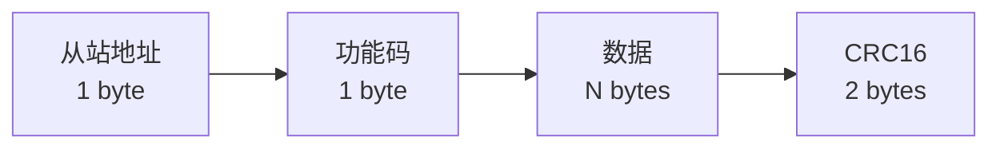
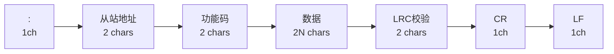
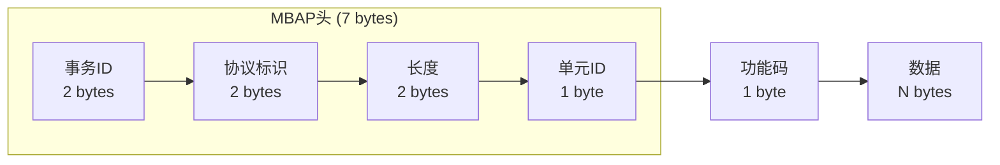
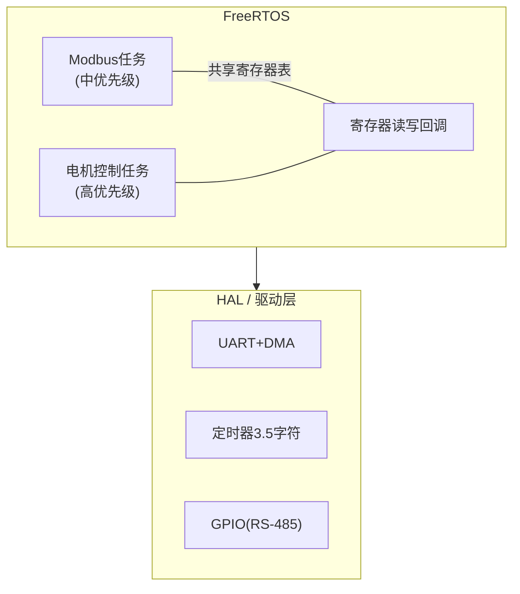
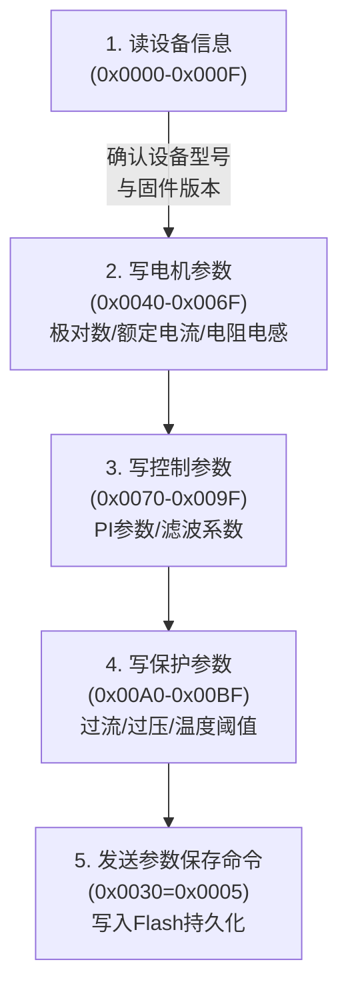
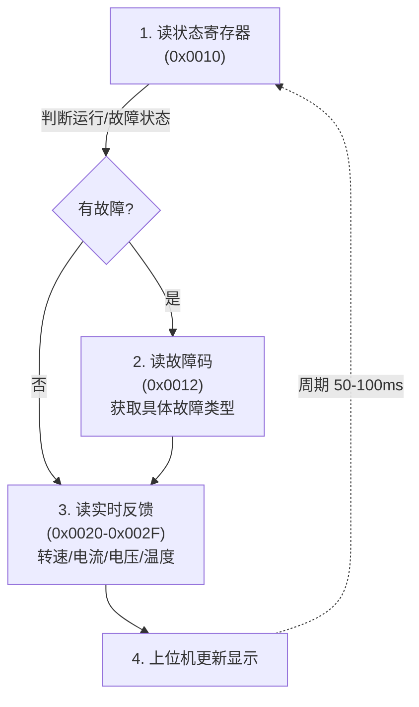
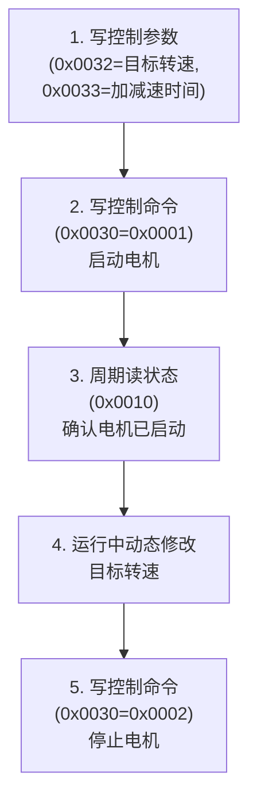

# COM-05 Modbus协议

> 路径：📡 工业通信协议 > COM-05

**难度：** ★★★☆☆

## 概述

Modbus是工业自动化领域应用最广泛的通信协议之一，由Modicon公司（现施耐德电气）于1979年发布。它是一种**应用层协议**，定义了控制器之间请求/响应的交互模型，独立于底层物理层。Modbus的简洁性、开放性和高可靠性使其成为电机驱动器参数配置、状态监控和远程控制的事实标准。

在电机控制场景中，Modbus RTU通过RS-485总线连接驱动器与上位机/PLC，实现参数读写、状态查询和命令下发。其主从（Master/Slave）架构天然适配"一主多从"的工业控制拓扑。理解Modbus帧格式、校验机制和寄存器映射设计，是电机驱动器通信功能开发的基本功。

## 正文

### 1. Modbus RTU帧格式

Modbus RTU（Remote Terminal Unit）是工业现场最常用的传输模式，采用二进制编码，通信效率高。

#### 1.1 帧结构



**帧间静默时间**：至少3.5个字符时间。对于9600bps，1个字符时间≈1.04ms（11bit/9600），3.5字符≈3.64ms。超过此时间的静默被视为新帧起始。

**帧内字符间隔**：不超过1.5个字符时间。超过则接收方丢弃不完整帧。

#### 1.2 CRC16计算方法

Modbus RTU使用**CRC-16/MODBUS**算法，多项式为0xA001（即0x8005的位反转）。

**算法步骤**：
1. 预置CRC寄存器为0xFFFF
2. 取第一个字节与CRC低8位异或
3. 对CRC寄存器执行8次右移：若移出位为1，则与0xA001异或；若为0，则不做操作
4. 重复步骤2-3直到所有字节处理完毕
5. 最终CRC寄存器的值即为CRC校验码，**低字节在前（Little-Endian）**发送

**C语言实现**：

```c
#include <stdint.h>

uint16_t modbus_crc16(const uint8_t *data, uint16_t length)
{
    uint16_t crc = 0xFFFF;
    uint16_t i, j;

    for (i = 0; i < length; i++) {
        crc ^= (uint16_t)data[i];
        for (j = 0; j < 8; j++) {
            if (crc & 0x0001) {
                crc >>= 1;
                crc ^= 0xA001;
            } else {
                crc >>= 1;
            }
        }
    }

    return crc;
}
```

**查表法实现**（适用于资源受限的MCU，以空间换时间）：

```c
static const uint16_t crc16_table[256] = {
    0x0000, 0xC0C1, 0xC181, 0x0140, 0xC301, 0x03C0, 0x0280, 0xC241,
    0xC601, 0x06C0, 0x0780, 0xC741, 0x0500, 0xC5C1, 0xC481, 0x0440,
    0xCC01, 0x0CC0, 0x0D80, 0xCD41, 0x0F00, 0xCFC1, 0xCE81, 0x0E40,
    0x0A00, 0xCAC1, 0xCB81, 0x0B40, 0xC901, 0x09C0, 0x0880, 0xC841,
    0xD801, 0x18C0, 0x1980, 0xD941, 0x1B00, 0xDBC1, 0xDA81, 0x1A40,
    0x1E00, 0xDEC1, 0xDF81, 0x1F40, 0xDD01, 0x1DC0, 0x1C80, 0xDC41,
    0x1400, 0xD4C1, 0xD581, 0x1540, 0xD701, 0x17C0, 0x1680, 0xD641,
    0xD201, 0x12C0, 0x1380, 0xD341, 0x1100, 0xD1C1, 0xD081, 0x1040,
    0xF001, 0x30C0, 0x3180, 0xF141, 0x3300, 0xF3C1, 0xF281, 0x3240,
    0x3600, 0xF6C1, 0xF781, 0x3740, 0xF501, 0x35C0, 0x3480, 0xF441,
    0x3C00, 0xFCC1, 0xFD81, 0x3D40, 0xFF01, 0x3FC0, 0x3E80, 0xFE41,
    0xFA01, 0x3AC0, 0x3B80, 0xFB41, 0x3900, 0xF9C1, 0xF881, 0x3840,
    0x2800, 0xE8C1, 0xE981, 0x2940, 0xEB01, 0x2BC0, 0x2A80, 0xEA41,
    0xEE01, 0x2EC0, 0x2F80, 0xEF41, 0x2D00, 0xEDC1, 0xEC81, 0x2C40,
    0xE401, 0x24C0, 0x2580, 0xE541, 0x2700, 0xE7C1, 0xE681, 0x2640,
    0x2200, 0xE2C1, 0xE381, 0x2340, 0xE101, 0x21C0, 0x2080, 0xE041,
    0xA001, 0x60C0, 0x6180, 0xA141, 0x6300, 0xA3C1, 0xA281, 0x6240,
    0x6600, 0xA6C1, 0xA781, 0x6740, 0xA501, 0x65C0, 0x6480, 0xA441,
    0x6C00, 0xACC1, 0xAD81, 0x6D40, 0xAF01, 0x6FC0, 0x6E80, 0xAE41,
    0xAA01, 0x6AC0, 0x6B80, 0xAB41, 0x6900, 0xA9C1, 0xA881, 0x6840,
    0x7800, 0xB8C1, 0xB981, 0x7940, 0xBB01, 0x7BC0, 0x7A80, 0xBA41,
    0xBE01, 0x7EC0, 0x7F80, 0xBF41, 0x7D00, 0xBDC1, 0xBC81, 0x7C40,
    0xB401, 0x74C0, 0x7580, 0xB541, 0x7700, 0xB7C1, 0xB681, 0x7640,
    0x7200, 0xB2C1, 0xB381, 0x7340, 0xB101, 0x71C0, 0x7080, 0xB041,
    0x5000, 0x90C1, 0x9181, 0x5140, 0x9301, 0x53C0, 0x5280, 0x9241,
    0x9601, 0x56C0, 0x5780, 0x9741, 0x5500, 0x95C1, 0x9481, 0x5440,
    0x9C01, 0x5CC0, 0x5D80, 0x9D41, 0x5F00, 0x9FC1, 0x9E81, 0x5E40,
    0x5A00, 0x9AC1, 0x9B81, 0x5B40, 0x9901, 0x59C0, 0x5880, 0x9841,
    0x8801, 0x48C0, 0x4980, 0x8941, 0x4B00, 0x8BC1, 0x8A81, 0x4A40,
    0x4E00, 0x8EC1, 0x8F81, 0x4F40, 0x8D01, 0x4DC0, 0x4C80, 0x8C41,
    0x4400, 0x84C1, 0x8581, 0x4540, 0x8701, 0x47C0, 0x4680, 0x8641,
    0x8201, 0x42C0, 0x4380, 0x8341, 0x4100, 0x81C1, 0x8081, 0x4040,
};

uint16_t modbus_crc16_table(const uint8_t *data, uint16_t length)
{
    uint16_t crc = 0xFFFF;
    uint16_t i;

    for (i = 0; i < length; i++) {
        crc = (crc >> 8) ^ crc16_table[(crc ^ data[i]) & 0xFF];
    }

    return crc;
}
```

### 2. Modbus ASCII帧格式

Modbus ASCII模式将每个字节编码为两个ASCII字符（0-9, A-F），可读性好但效率较低。

#### 2.1 帧结构



- 帧起始：冒号 `:`（0x3A）
- 帧结束：CR（0x0D）+ LF（0x0A）
- 每个字节用2个ASCII十六进制字符表示，如字节0x3A → "3A"
- 帧间间隔可达1秒

#### 2.2 LRC校验计算

LRC（Longitudinal Redundancy Check）为所有字节（从站地址到数据结束）的**二进制补码**。

```c
uint8_t modbus_lrc(const uint8_t *data, uint16_t length)
{
    uint8_t lrc = 0;
    uint16_t i;

    for (i = 0; i < length; i++) {
        lrc += data[i];
    }

    return (uint8_t)(-((int8_t)lrc));
}
```

**计算示例**：地址0x01 + 功能码0x03 + 数据0x00+0x6B+0x00+0x03
- 求和：0x01 + 0x03 + 0x00 + 0x6B + 0x00 + 0x03 = 0x72
- 取补码：0x100 - 0x72 = 0x8E → LRC = 0x8E

### 3. Modbus TCP帧格式

Modbus TCP将Modbus应用层协议封装在TCP/IP中，端口号502，用于以太网通信。

#### 3.1 帧结构



| 字段 | 长度 | 说明 |
|------|------|------|
| 事务ID (Transaction ID) | 2 bytes | 请求/响应匹配标识，由客户端递增 |
| 协议标识 (Protocol ID) | 2 bytes | Modbus协议固定为0x0000 |
| 长度 (Length) | 2 bytes | 从单元ID开始的数据字节数 |
| 单元ID (Unit ID) | 1 byte | 从站地址（串行Modbus中的从站地址） |
| 功能码 + 数据 | N bytes | 与RTU模式相同 |

**关键区别**：
- **无CRC校验**：TCP协议本身提供数据完整性保证
- **无帧间静默要求**：TCP是面向连接的流式传输
- **Big-Endian**：所有多字节字段采用大端序

### 4. 常用功能码详解

#### 4.1 功能码总览

| 功能码 | 名称 | 操作对象 | 数据类型 |
|--------|------|----------|----------|
| 01 | Read Coils | 线圈 | 位（可读写） |
| 02 | Read Discrete Inputs | 离散输入 | 位（只读） |
| 03 | Read Holding Registers | 保持寄存器 | 字（16bit，可读写） |
| 04 | Read Input Registers | 输入寄存器 | 字（16bit，只读） |
| 05 | Write Single Coil | 单线圈 | 位 |
| 06 | Write Single Register | 单寄存器 | 字（16bit） |
| 15 | Write Multiple Coils | 多线圈 | 位 |
| 16 | Write Multiple Registers | 多寄存器 | 字（16bit） |

#### 4.2 功能码03 — 读保持寄存器（最常用）

**请求帧**：

| 字段 | 字节数 | 示例值 | 说明 |
|------|--------|--------|------|
| 从站地址 | 1 | 0x01 | 目标从站 |
| 功能码 | 1 | 0x03 | 读保持寄存器 |
| 起始地址 | 2 | 0x006B | 从寄存器107开始 |
| 寄存器数量 | 2 | 0x0003 | 读取3个寄存器 |
| CRC | 2 | 0x7687 | 校验码 |

**响应帧**：

| 字段 | 字节数 | 示例值 | 说明 |
|------|--------|--------|------|
| 从站地址 | 1 | 0x01 | 从站地址回显 |
| 功能码 | 1 | 0x03 | 功能码回显 |
| 字节数 | 1 | 0x06 | 数据区字节数（3寄存器×2字节） |
| 寄存器值1 | 2 | 0x022B | 寄存器107的值 |
| 寄存器值2 | 2 | 0x0000 | 寄存器108的值 |
| 寄存器值3 | 2 | 0x0064 | 寄存器109的值 |
| CRC | 2 | — | 校验码 |

#### 4.3 功能码06 — 写单个寄存器

**请求帧**：

| 字段 | 字节数 | 示例值 | 说明 |
|------|--------|--------|------|
| 从站地址 | 1 | 0x01 | 目标从站 |
| 功能码 | 1 | 0x06 | 写单寄存器 |
| 寄存器地址 | 2 | 0x0001 | 目标寄存器 |
| 寄存器值 | 2 | 0x0003 | 写入值 |
| CRC | 2 | 0x9889 | 校验码 |

**响应帧**：原样回显请求帧（从站地址+功能码+寄存器地址+寄存器值+CRC）。

#### 4.4 功能码16 — 写多个寄存器

**请求帧**：

| 字段 | 字节数 | 示例值 | 说明 |
|------|--------|--------|------|
| 从站地址 | 1 | 0x01 | 目标从站 |
| 功能码 | 1 | 0x10 | 写多寄存器 |
| 起始地址 | 2 | 0x0001 | 起始寄存器 |
| 寄存器数量 | 2 | 0x0002 | 写入2个寄存器 |
| 字节数 | 1 | 0x04 | 后续数据字节数 |
| 寄存器值1 | 2 | 0x000A | 第1个寄存器值 |
| 寄存器值2 | 2 | 0x0102 | 第2个寄存器值 |
| CRC | 2 | — | 校验码 |

**响应帧**：从站地址+功能码+起始地址+寄存器数量+CRC。

#### 4.5 异常响应

当从站无法执行请求时，返回异常响应：功能码最高位置1 + 异常码。

| 异常码 | 名称 | 说明 |
|--------|------|------|
| 01 | Illegal Function | 不支持的功能码 |
| 02 | Illegal Data Address | 寄存器地址超出范围 |
| 03 | Illegal Data Value | 数据值不合法 |
| 04 | Slave Device Failure | 从站内部故障 |

**示例**：请求功能码0x03，地址越界 → 响应功能码0x83 + 异常码0x02。

### 5. 寄存器映射设计（电机控制场景）

寄存器映射是Modbus从站设计的核心，直接影响上位机与驱动器的交互效率。

#### 5.1 寄存器地址分配方案

| 地址范围 | 区域 | 属性 | 说明 |
|----------|------|------|------|
| 0x0000-0x000F | 系统信息 | 只读 | 设备型号、固件版本、序列号 |
| 0x0010-0x001F | 运行状态 | 只读 | 电机状态、故障码、告警标志 |
| 0x0020-0x002F | 实时反馈 | 只读 | 转速、转矩、电流、电压、温度 |
| 0x0030-0x003F | 控制命令 | 读写 | 启停命令、转向、目标转速/位置 |
| 0x0040-0x006F | 电机参数 | 读写 | 极对数、额定电流、电阻、电感 |
| 0x0070-0x009F | 控制参数 | 读写 | 速度环PI、电流环PI、滤波系数 |
| 0x00A0-0x00BF | 保护参数 | 读写 | 过流阈值、过压阈值、温度阈值 |
| 0x00C0-0x00DF | 通信参数 | 读写 | 站号、波特率、超时时间 |
| 0x00E0-0x00FF | 历史故障 | 只读 | 最近N条故障记录 |

#### 5.2 关键寄存器详细定义

**状态寄存器（0x0010）**：

| Bit | 名称 | 说明 |
|-----|------|------|
| 0 | RUN | 0=停止, 1=运行 |
| 1 | DIR | 0=正转, 1=反转 |
| 2 | FAULT | 0=正常, 1=故障 |
| 3 | ALARM | 0=无告警, 1=告警 |
| 4 | READY | 0=未就绪, 1=就绪 |
| 5-7 | 保留 | — |
| 8-15 | 控制模式 | 0=速度模式, 1=转矩模式, 2=位置模式 |

**故障码寄存器（0x0012）**：

| 值 | 故障类型 | 说明 |
|----|----------|------|
| 0x0000 | 无故障 | 正常运行 |
| 0x0001 | 过流 | 相电流超过阈值 |
| 0x0002 | 过压 | 母线电压超过阈值 |
| 0x0003 | 欠压 | 母线电压低于阈值 |
| 0x0004 | 过热 | 散热器温度超过阈值 |
| 0x0005 | 堵转 | 电机堵转保护 |
| 0x0006 | 编码器故障 | 编码器信号异常 |
| 0x0007 | 通信超时 | 主站通信丢失 |

**控制命令寄存器（0x0030）**：

| 值 | 命令 | 说明 |
|----|------|------|
| 0x0001 | 启动 | 电机启动运行 |
| 0x0002 | 停止 | 自由停车 |
| 0x0003 | 急停 | 快速减速停止 |
| 0x0004 | 故障复位 | 清除故障状态 |
| 0x0005 | 参数保存 | 将RAM参数写入Flash |
| 0x0006 | 恢复出厂 | 恢复默认参数 |

#### 5.3 32位数据传输

电机控制中的转速、电流等参数常需32位精度。Modbus寄存器为16位，32位数据需拆分为两个连续寄存器：

- **大端序（Big-Endian, CDAB）**：高字在低地址，低字在高地址
- **小端序（Little-Endian, BADC）**：低字在低地址，高字在高地址
- **字交换大端（ABCD）**：按内存顺序排列

**建议**：电机驱动器中统一采用**大端序（CDAB）**，与IEEE 754浮点数存储一致。

```c
typedef union {
    float f;
    uint32_t u;
    struct {
        uint16_t high_word;
        uint16_t low_word;
    } words;
} float_reg_t;

void float_to_registers(float value, uint16_t *reg_high, uint16_t *reg_low)
{
    float_reg_t conv;
    conv.f = value;
    *reg_high = conv.words.high_word;
    *reg_low = conv.words.low_word;
}

float registers_to_float(uint16_t reg_high, uint16_t reg_low)
{
    float_reg_t conv;
    conv.words.high_word = reg_high;
    conv.words.low_word = reg_low;
    return conv.f;
}
```

### 6. STM32实现示例（FreeRTOS + Modbus从站）

#### 6.1 架构设计



#### 6.2 核心数据结构

```c
#include <stdint.h>
#include <string.h>
#include "stm32f4xx_hal.h"
#include "cmsis_os2.h"

#define MODBUS_SLAVE_ADDR      0x01
#define MODBUS_UART_BAUDRATE   115200
#define MODBUS_RX_BUF_SIZE     256
#define MODBUS_TX_BUF_SIZE     256
#define MODBUS_REG_COUNT       0x0100

typedef struct {
    uint8_t  rx_buf[MODBUS_RX_BUF_SIZE];
    uint8_t  tx_buf[MODBUS_TX_BUF_SIZE];
    uint16_t rx_len;
    uint16_t tx_len;
    uint16_t holding_regs[MODBUS_REG_COUNT];
    uint16_t input_regs[MODBUS_REG_COUNT];
    uint8_t  coils[MODBUS_REG_COUNT / 8];
    uint8_t  discrete_inputs[MODBUS_REG_COUNT / 8];
    osMutexId_t reg_mutex;
    UART_HandleTypeDef *huart;
    TIM_HandleTypeDef *htim;
    GPIO_TypeDef *de_port;
    uint16_t de_pin;
    volatile uint8_t frame_received;
    volatile uint32_t last_byte_tick;
} modbus_slave_t;
```

#### 6.3 UART接收与帧检测

```c
extern modbus_slave_t g_modbus;

void modbus_uart_rx_callback(void)
{
    uint32_t now = osKernelGetTickCount();
    g_modbus.last_byte_tick = now;
}

void modbus_timer_callback(void)
{
    uint32_t now = osKernelGetTickCount();
    uint32_t char_time = 11000000UL / MODBUS_UART_BAUDRATE;
    uint32_t silent_time = char_time * 35 / 10;

    if (g_modbus.rx_len > 0 &&
        (now - g_modbus.last_byte_tick) >= silent_time) {
        g_modbus.frame_received = 1;
    }
}

void HAL_UART_RxCpltCallback(UART_HandleTypeDef *huart)
{
    if (huart == g_modbus.huart) {
        g_modbus.rx_len++;
        if (g_modbus.rx_len < MODBUS_RX_BUF_SIZE) {
            HAL_UART_Receive_IT(huart,
                &g_modbus.rx_buf[g_modbus.rx_len], 1);
        }
        modbus_uart_rx_callback();
    }
}
```

#### 6.4 Modbus从站处理核心

```c
static void modbus_process_request(modbus_slave_t *mb)
{
    if (mb->rx_len < 4) return;

    uint16_t recv_crc = mb->rx_buf[mb->rx_len - 2]
                      | (mb->rx_buf[mb->rx_len - 1] << 8);
    uint16_t calc_crc = modbus_crc16(mb->rx_buf, mb->rx_len - 2);

    if (recv_crc != calc_crc) return;

    if (mb->rx_buf[0] != MODBUS_SLAVE_ADDR) return;

    uint8_t func = mb->rx_buf[1];
    mb->tx_len = 0;
    mb->tx_buf[mb->tx_len++] = MODBUS_SLAVE_ADDR;
    mb->tx_buf[mb->tx_len++] = func;

    switch (func) {
    case 0x03:
        modbus_read_holding_registers(mb);
        break;
    case 0x06:
        modbus_write_single_register(mb);
        break;
    case 0x10:
        modbus_write_multiple_registers(mb);
        break;
    case 0x04:
        modbus_read_input_registers(mb);
        break;
    default:
        modbus_exception_response(mb, 0x01);
        break;
    }
}

static void modbus_read_holding_registers(modbus_slave_t *mb)
{
    uint16_t addr = (mb->rx_buf[2] << 8) | mb->rx_buf[3];
    uint16_t count = (mb->rx_buf[4] << 8) | mb->rx_buf[5];

    if (addr + count > MODBUS_REG_COUNT) {
        modbus_exception_response(mb, 0x02);
        return;
    }

    mb->tx_buf[mb->tx_len++] = (uint8_t)(count * 2);

    osMutexAcquire(mb->reg_mutex, osWaitForever);
    for (uint16_t i = 0; i < count; i++) {
        mb->tx_buf[mb->tx_len++] = (mb->holding_regs[addr + i] >> 8) & 0xFF;
        mb->tx_buf[mb->tx_len++] = mb->holding_regs[addr + i] & 0xFF;
    }
    osMutexRelease(mb->reg_mutex);

    modbus_append_crc(mb);
}

static void modbus_write_single_register(modbus_slave_t *mb)
{
    uint16_t addr = (mb->rx_buf[2] << 8) | mb->rx_buf[3];
    uint16_t value = (mb->rx_buf[4] << 8) | mb->rx_buf[5];

    if (addr >= MODBUS_REG_COUNT) {
        modbus_exception_response(mb, 0x02);
        return;
    }

    osMutexAcquire(mb->reg_mutex, osWaitForever);
    mb->holding_regs[addr] = value;
    osMutexRelease(mb->reg_mutex);

    memcpy(&mb->tx_buf[mb->tx_len], &mb->rx_buf[2], 4);
    mb->tx_len += 4;
    modbus_append_crc(mb);
}

static void modbus_write_multiple_registers(modbus_slave_t *mb)
{
    uint16_t addr = (mb->rx_buf[2] << 8) | mb->rx_buf[3];
    uint16_t count = (mb->rx_buf[4] << 8) | mb->rx_buf[5];
    uint8_t byte_count = mb->rx_buf[6];

    if (addr + count > MODBUS_REG_COUNT) {
        modbus_exception_response(mb, 0x02);
        return;
    }

    osMutexAcquire(mb->reg_mutex, osWaitForever);
    for (uint16_t i = 0; i < count; i++) {
        mb->holding_regs[addr + i] =
            (mb->rx_buf[7 + i * 2] << 8) | mb->rx_buf[8 + i * 2];
    }
    osMutexRelease(mb->reg_mutex);

    memcpy(&mb->tx_buf[mb->tx_len], &mb->rx_buf[2], 4);
    mb->tx_len += 4;
    modbus_append_crc(mb);
}

static void modbus_exception_response(modbus_slave_t *mb, uint8_t code)
{
    mb->tx_buf[1] |= 0x80;
    mb->tx_buf[2] = code;
    mb->tx_len = 3;
    modbus_append_crc(mb);
}

static void modbus_append_crc(modbus_slave_t *mb)
{
    uint16_t crc = modbus_crc16(mb->tx_buf, mb->tx_len);
    mb->tx_buf[mb->tx_len++] = crc & 0xFF;
    mb->tx_buf[mb->tx_len++] = (crc >> 8) & 0xFF;
}
```

#### 6.5 RS-485收发控制与任务实现

```c
static void modbus_rs485_tx_enable(modbus_slave_t *mb)
{
    HAL_GPIO_WritePin(mb->de_port, mb->de_pin, GPIO_PIN_SET);
}

static void modbus_rs485_rx_enable(modbus_slave_t *mb)
{
    HAL_GPIO_WritePin(mb->de_port, mb->de_pin, GPIO_PIN_RESET);
}

static void modbus_send_response(modbus_slave_t *mb)
{
    modbus_rs485_tx_enable(mb);
    HAL_UART_Transmit(mb->huart, mb->tx_buf, mb->tx_len, 100);
    uint32_t char_time = 11000000UL / MODBUS_UART_BAUDRATE;
    osDelay(char_time * mb->tx_len / 1000 + 1);
    modbus_rs485_rx_enable(mb);
}

void modbus_slave_task(void *argument)
{
    modbus_slave_t *mb = (modbus_slave_t *)argument;

    modbus_rs485_rx_enable(mb);
    HAL_UART_Receive_IT(mb->huart, &mb->rx_buf[0], 1);

    for (;;) {
        if (mb->frame_received) {
            mb->frame_received = 0;
            modbus_process_request(mb);
            if (mb->tx_len > 0) {
                modbus_send_response(mb);
            }
            mb->rx_len = 0;
            memset(mb->rx_buf, 0, MODBUS_RX_BUF_SIZE);
            HAL_UART_Receive_IT(mb->huart, &mb->rx_buf[0], 1);
        }
        osDelay(1);
    }
}
```

#### 6.6 初始化与寄存器绑定

```c
void modbus_slave_init(modbus_slave_t *mb,
                       UART_HandleTypeDef *huart,
                       TIM_HandleTypeDef *htim,
                       GPIO_TypeDef *de_port, uint16_t de_pin)
{
    memset(mb, 0, sizeof(modbus_slave_t));
    mb->huart = huart;
    mb->htim = htim;
    mb->de_port = de_port;
    mb->de_pin = de_pin;
    mb->reg_mutex = osMutexNew(NULL);

    mb->holding_regs[0x0000] = 0x0100;
    mb->holding_regs[0x0001] = 0x0001;
    mb->holding_regs[0x0040] = 4;
    mb->holding_regs[0x0041] = 3000;
    mb->holding_regs[0x0070] = 0x0064;
    mb->holding_regs[0x0071] = 0x000A;
    mb->holding_regs[0x00A0] = 2000;
    mb->holding_regs[0x00A1] = 850;
    mb->holding_regs[0x00C0] = MODBUS_SLAVE_ADDR;
    mb->holding_regs[0x00C1] = 115200 / 100;
}

osThreadId_t modbus_create_task(modbus_slave_t *mb)
{
    osThreadAttr_t attr = {
        .name = "modbus_slave",
        .stack_size = 512,
        .priority = osPriorityBelowNormal,
    };
    return osThreadNew(modbus_slave_task, mb, &attr);
}
```

### 7. Modbus在电机驱动器中的应用

#### 7.1 参数配置

驱动器上电后，上位机/PLC通过功能码03/06/16完成参数配置：



#### 7.2 状态监控

周期性读取运行状态和实时数据：



#### 7.3 远程控制

通过写控制命令寄存器实现远程启停和调速：



#### 7.4 通信可靠性设计

| 机制 | 实现方式 | 说明 |
|------|----------|------|
| 超时检测 | 主站设置响应超时（通常500ms-2s） | 超时未响应视为通信故障 |
| 重试机制 | 超时后重发请求（通常重试1-3次） | 避免偶发干扰导致误判 |
| 通信看门狗 | 从站检测主站轮询间隔 | 超时未收到请求则进入安全状态 |
| RS-485终端电阻 | 总线两端各加120Ω终端电阻 | 防止信号反射 |
| 隔离设计 | RS-485收发器加光耦/磁耦隔离 | 防止地环路干扰 |
| 波特率选择 | 根据节点数和距离选择 | 9600bps/1200m → 115200bps/10m |

#### 7.5 通信看门狗实现

```c
#define MODBUS_WATCHDOG_TIMEOUT_MS  1000

void modbus_watchdog_check(modbus_slave_t *mb)
{
    static uint32_t last_request_tick = 0;
    uint32_t now = osKernelGetTickCount();

    if (mb->rx_len > 0) {
        last_request_tick = now;
    }

    if ((now - last_request_tick) > MODBUS_WATCHDOG_TIMEOUT_MS) {
        mb->holding_regs[0x0010] &= ~0x0001;
        mb->holding_regs[0x0012] = 0x0007;
    }
}
```

## 小结

Modbus协议以其简洁、开放、可靠的特性，成为电机驱动器通信的首选方案。关键要点：

1. **帧格式**：RTU模式二进制编码+CRC16校验，效率最高；ASCII模式可读性好但效率低；TCP模式适用于以太网场景
2. **功能码**：03读保持寄存器和06/16写寄存器是电机控制中最常用的功能码
3. **寄存器映射**：合理规划地址空间，区分只读/读写区域，32位数据注意字节序
4. **实现要点**：UART+DMA接收、定时器帧检测、互斥量保护共享寄存器、RS-485收发方向控制
5. **可靠性**：通信看门狗、超时重试、终端电阻、电气隔离缺一不可

## 参考

- Modbus Protocol Specification, Modbus Organization Inc.
- Modbus over Serial Line Specification and Implementation Guide V1.02
- Modbus Messaging on TCP/IP Implementation Guide V1.0b
- IEC 61158 Type 15 (Modbus Protocol)
- STM32 HAL Library Reference Manual
- FreeRTOS API Reference
- TI Application Note: SPRAAB7 — Modbus RTU Implementation on MCU
