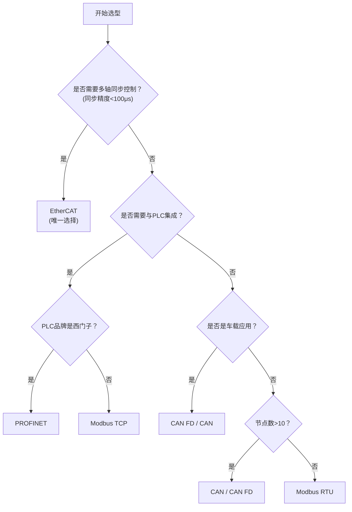
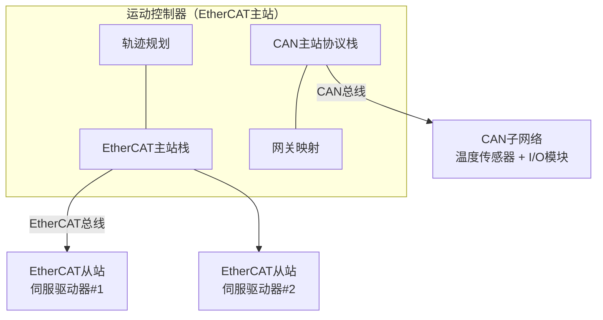
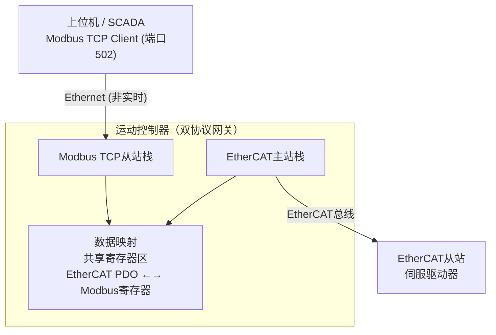
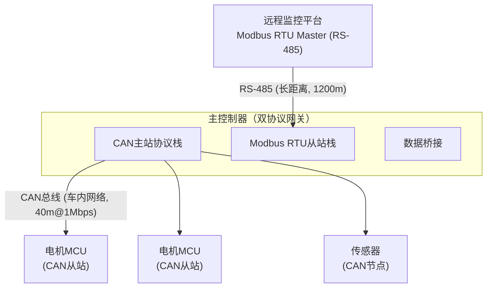

# COM-07 协议选型对比

> 路径： 工业通信协议 > COM-07

**难度：** 

## 概述

工业通信协议的选型直接影响电机控制系统的实时性、可靠性、成本和可扩展性。面对CAN 2.0、CAN FD、Modbus RTU、Modbus TCP、EtherCAT、PROFINET等多种协议，工程师需要根据应用场景的实时性要求、节点数量、拓扑结构、成本预算等因素进行综合权衡。错误的协议选型可能导致系统无法满足性能指标，或过度设计造成成本浪费。

本文从电机控制工程师的实际需求出发，系统对比主流工业通信协议的关键参数，给出典型场景的选型建议和决策流程，并探讨混合协议架构的设计方法。

## 正文

### 1. 协议核心参数对比

#### 1.1 综合对比表

| 对比维度 | CAN 2.0 | CAN FD | Modbus RTU | Modbus TCP | EtherCAT | PROFINET RT | PROFINET IRT |
|----------|---------|--------|------------|------------|----------|-------------|--------------|
| **物理层** | ISO 11898 | ISO 11898-1 | RS-485 | Ethernet | Ethernet | Ethernet | Ethernet |
| **最大波特率** | 1 Mbps | 5 Mbps (数据相) | 115.2 Kbps | 100 Mbps | 100 Mbps | 100 Mbps | 100 Mbps |
| **有效载荷** | 8 bytes/帧 | 64 bytes/帧 | 252 bytes/帧 | 250 bytes/事务 | 1490 bytes/帧 | 1440 bytes/帧 | 1440 bytes/帧 |
| **数据吞吐** | ~40 KB/s | ~500 KB/s | ~4 KB/s (9600) | ~500 KB/s | ~12 MB/s | ~5 MB/s | ~10 MB/s |
| **最大节点数** | 127 | 127 | 247 | 247 | 65535 | 256 | 256 |
| **确定性** | 非确定 | 非确定 | 非确定 | 非确定 | 确定 | 弱确定 | 确定 |
| **同步精度** | ~1ms | ~1ms | 无 | 无 | <1μs | ~1ms | <1μs |
| **最小周期** | 1-5ms | 0.5-2ms | 10-100ms | 5-50ms | 31.25μs | 1-10ms | 31.25μs |
| **拓扑** | 线性 | 线性 | 线性/星型 | 星型/树型 | 线/星/树/环 | 星型/树型 | 星型/树型 |
| **线缆** | 屏蔽双绞线 | 屏蔽双绞线 | 屏蔽双绞线 | Cat5e | Cat5e | Cat5e | Cat5e |
| **线缆成本** | 中 | 中 | 低 | 低 | 低 | 低 | 低 |
| **最大距离** | 40m@1Mbps(1) | 40m@5Mbps | 1200m@9600bps | 100m/段 | 100m/段 | 100m/段 | 100m/段 |
| **实现复杂度** | 低 | 低 | 低 | 中 | 高 | 高 | 高 |
| **MCU需求** | 内置CAN | 内置CAN FD | UART | MAC+TCP/IP | MAC+ESC | MAC+协议栈 | MAC+专用ASIC |
| **协议栈RAM** | ~2KB | ~2KB | ~1KB | ~20KB | ~30KB | ~30KB | ~30KB |
| **协议栈Flash** | ~10KB | ~12KB | ~8KB | ~60KB | ~80KB | ~80KB | ~80KB |
| **认证/标准** | ISO 11898 | ISO 11898-1 | Modbus Org. | Modbus Org. | IEC 61158 | IEC 61158 | IEC 61158 |
| **典型成本/节点** | ¥5-20 | ¥5-20 | ¥3-10 | ¥20-50 | ¥50-150 | ¥30-80 | ¥80-200 |

> (1) 40m为CAN 1Mbps的理论最大值（5ns/m传播延迟假设），实际工程中考虑信号衰减、EMI、连接器损耗等因素，**1Mbps推荐总线长度≤25m**。COM-01中的CAN长度表已采用25m的工程推荐值。对于多轴伺服系统，1Mbps+25m通常足够；若需更长距离，应降速至500kbps或使用CAN中继器。

#### 1.2 关键指标解读

**确定性**：消息从发送到接收的最大延迟是否可预测。
- CAN/Modbus：仲裁/轮询机制导致延迟不确定
- EtherCAT/PROFINET IRT：时分复用保证确定性

**同步精度**：多个节点执行同一动作的时间偏差。
- CAN SYNC：软件同步，受总线负载影响
- EtherCAT DC：硬件同步，与负载无关
- PROFINET IRT：硬件同步，需专用ASIC

**有效吞吐**：扣除协议开销后的实际数据传输率。
- CAN 2.0：8B有效载荷 / 130bit总帧长 ≈ 6.2%效率
- EtherCAT：1490B有效载荷 / 1518bit以太网帧 ≈ 79%效率

### 2. 电机控制场景选型建议

#### 2.1 单轴驱动器调试 — CAN / Modbus RTU

**场景特征**：
- 节点数：1-2个（驱动器 + 上位机/调试器）
- 实时性要求：低（参数配置、状态查询）
- 通信频率：100ms-1s
- 成本敏感：高

**推荐方案**：

| 方案 | 优势 | 劣势 | 推荐度 |
|------|------|------|--------|
| Modbus RTU | 实现最简单，成本最低 | 速度慢，无同步 |  |
| CAN 2.0 | 可靠性高，支持多主 | 需要CAN控制器 |  |
| CAN FD | 带宽提升8倍 | 芯片选择较少 |  |

**典型应用**：
- 风机/水泵变频器参数配置
- 电动工具驱动器调试
- 简易伺服驱动器上位机通信

```text
典型配置：
- MCU: STM32F103 (内置CAN + UART)
- 物理层: RS-485 (Modbus RTU) 或 CAN收发器 (TJA1050)
- 通信周期: 100ms
- 数据量: 状态(4B) + 命令(2B) + 参数(8B) ≈ 14B/周期
```

#### 2.2 多轴伺服同步 — EtherCAT

**场景特征**：
- 节点数：4-64轴
- 实时性要求：极高（同步精度<1μs）
- 通信频率：0.5-4kHz（250μs-2ms周期）
- 成本敏感：中

**推荐方案**：EtherCAT（唯一满足要求的方案）

| 对比项 | EtherCAT | PROFINET IRT |
|--------|----------|--------------|
| 同步精度 | <1μs | <1μs |
| 最小周期 | 31.25μs | 31.25μs |
| 从站硬件 | ESC芯片 | 专用ASIC (ERTEC) |
| 生态成熟度 | 极高（伺服领域） | 高（PLC领域） |
| 成本 | 中 | 高 |
| 伺服支持 | 几乎所有品牌 | 西门子生态 |

**典型应用**：
- CNC加工中心（5轴联动）
- 机器人关节控制（6轴+外部轴）
- 高速包装机械（8-16轴凸轮同步）
- 半导体设备（纳米级定位）

```text
典型配置：
- 主站: IPC + IgH EtherCAT Master / TwinCAT
- 从站MCU: STM32F4/F7/H7 + ESC (LAN9252/AX58100)
- 通信周期: 1ms (4轴) / 250μs (高速场景)
- 数据量/轴: RxPDO(12B) + TxPDO(12B) = 24B
- 4轴总数据量: 96B + 帧开销 ≈ 130B
- 传输时间: 130×8/100Mbps ≈ 10.4μs
```

> ** EtherCAT周期时间的正确理解**：以上传输时间仅为帧在物理层上的传播时间，**并非通信周期**。EtherCAT通过分布式时钟（DC, Distributed Clocks）实现从站间同步。实际通信周期由 **最大单个从站处理时间 + 帧传输时间 + DC同步抖动裕量** 决定，而非所有从站处理时间的简单求和——这得益于EtherCAT的 **on-the-fly处理机制**（从站在帧经过时即时读写数据，无需存储转发）。典型100从站、100μs周期的系统中，帧在从站间的转发延迟仅约1μs/站。因此切勿用"周期时间=从站数×单站处理时间"来估算EtherCAT性能，这会严重高估实际延迟。

#### 2.3 PLC集成 — Modbus TCP / PROFINET

**场景特征**：
- 节点数：2-32个
- 实时性要求：中（10-100ms响应）
- 通信频率：10-100ms
- 与PLC品牌绑定

**推荐方案**：

| PLC品牌 | 推荐协议 | 说明 |
|---------|----------|------|
| 西门子 S7 | PROFINET | 原生支持，无缝集成 |
| 三菱 | CC-Link / Modbus TCP | 取决于型号 |
| 欧姆龙 | EtherCAT / Modbus TCP | NJ/NX系列支持EtherCAT |
| 倍福 | EtherCAT | 原生支持 |
| AB (罗克韦尔) | EtherNet/IP | 需协议转换 |
| 通用 | Modbus TCP | 最广泛的PLC支持 |

**典型应用**：
- 产线驱动器集群管理
- 恒压供水系统
- 输送线速度同步

```text
典型配置：
- MCU: STM32F4 + LAN8720 (Modbus TCP)
- 或: STM32H7 + PROFINET协议栈
- 通信周期: 50ms
- 数据量: 20-50寄存器/节点
```

#### 2.4 车载电机控制 — CAN / CAN FD

**场景特征**：
- 节点数：10-50个ECU
- 实时性要求：中高（5-10ms响应）
- 通信频率：5-50ms
- 环境恶劣：EMI、温度、振动
- 功能安全：ISO 26262

**推荐方案**：

| 方案 | 优势 | 适用 |
|------|------|------|
| CAN 2.0 | 成熟可靠，芯片丰富 | 传统燃油车 |
| CAN FD | 带宽提升8倍，兼容CAN 2.0 | 新能源汽车 |
| CAN XL | 帧长可达2048B | 下一代车载网络 |

**典型应用**：
- 电动汽车主驱电机控制器（MCU）
- 电动助力转向（EPS）
- 电子稳定系统（ESC）
- 座椅/车窗/雨刮电机

```text
典型配置：
- MCU: STM32G4/F7 (内置CAN FD)
- 收发器: TJA1463 (CAN FD, 支持CAN SIC)
- 波特率: 500Kbps (仲裁相) / 2Mbps (数据相)
- 通信周期: 10ms
- 协议: CANopen / J1939 / 自定义协议
```

### 3. 选型决策流程图



#### 决策关键问题清单

| 序号 | 问题 | 影响 |
|------|------|------|
| 1 | 同步精度要求是多少？ | <1μs → EtherCAT/PROFINET IRT；>1ms → CAN/Modbus |
| 2 | 通信周期是多少？ | <1ms → EtherCAT；1-10ms → CAN FD；>10ms → Modbus |
| 3 | 轴数/节点数？ | >8轴 → EtherCAT；<8轴 → CAN/Modbus |
| 4 | 是否需要确定性？ | 是 → EtherCAT/PROFINET IRT；否 → CAN/Modbus |
| 5 | 是否需要与PLC集成？ | 是 → 根据PLC品牌选择 |
| 6 | 是否是车载应用？ | 是 → CAN/CAN FD |
| 7 | 成本预算？ | 低 → Modbus RTU；中 → CAN；高 → EtherCAT |
| 8 | 开发周期？ | 紧 → Modbus RTU（最简单）；宽 → EtherCAT |
| 9 | 是否需要功能安全？ | 是 → CAN FD (ISO 26262) / EtherCAT (FSoE) |
| 10 | 是否需要长距离传输？ | >100m → Modbus RTU (1200m) / CAN (500m@125K) |

### 4. 混合协议架构设计

#### 4.1 架构设计原则

实际工业系统中，单一协议往往无法满足所有需求。混合协议架构遵循以下原则：

1. **层次化**：高速实时层 + 低速配置层
2. **网关隔离**：协议转换集中在网关，从站不感知异构协议
3. **数据一致性**：不同协议间的共享数据通过原子操作或双缓冲保证一致性
4. **故障隔离**：一个协议段的故障不影响其他段

#### 4.2 EtherCAT主站 + CAN子站架构

**适用场景**：多轴伺服主系统 + 分布式I/O/传感器子网络



**网关映射设计**：

```c
typedef struct {
    uint16_t can_node_id;
    uint16_t ecat_pdo_offset;
    uint8_t  data_len;
    uint8_t  direction;
} gateway_map_entry_t;

#define GATEWAY_MAP_SIZE  16

static gateway_map_entry_t gateway_map[GATEWAY_MAP_SIZE] = {
    {0x01, 0x0000, 4, 0},
    {0x02, 0x0004, 2, 0},
    {0x03, 0x0006, 8, 1},
};

void gateway_transfer(gateway_map_entry_t *map, uint16_t count)
{
    for (uint16_t i = 0; i < count; i++) {
        if (map[i].direction == 0) {
            can_read_data(map[i].can_node_id,
                          &ecat_pdo_buf[map[i].ecat_pdo_offset],
                          map[i].data_len);
        } else {
            can_write_data(map[i].can_node_id,
                           &ecat_pdo_buf[map[i].ecat_pdo_offset],
                           map[i].data_len);
        }
    }
}
```

#### 4.3 EtherCAT + Modbus TCP混合架构

**适用场景**：实时控制层 + 上位监控层



**数据映射策略**：

| EtherCAT数据 | Modbus寄存器 | 映射方向 | 更新频率 |
|-------------|-------------|----------|----------|
| 状态字(0x6041) | 0x0010 | ECAT→Modbus | 1ms |
| 实际位置(0x6064) | 0x0020-0x0021 | ECAT→Modbus | 1ms |
| 实际速度(0x606C) | 0x0022-0x0023 | ECAT→Modbus | 1ms |
| 控制字(0x6040) | 0x0030 | Modbus→ECAT | 按需 |
| 目标位置(0x607A) | 0x0032-0x0033 | Modbus→ECAT | 按需 |

#### 4.4 CAN + Modbus RTU混合架构

**适用场景**：车载/移动机械 + 远程监控



#### 4.5 混合架构设计注意事项

| 注意事项 | 说明 | 解决方案 |
|----------|------|----------|
| 数据一致性 | 两个协议访问同一数据可能冲突 | 双缓冲 + 原子指针切换 |
| 时序差异 | 实时层(ms级) vs 非实时层(100ms级) | 非实时层读取快照，不阻塞实时层 |
| 故障传播 | 一侧故障影响另一侧 | 网关隔离，独立看门狗 |
| 地址映射 | 不同协议地址空间不同 | 统一映射表，运行时可配置 |
| 调试复杂度 | 双协议调试困难 | 独立日志通道，时间戳对齐 |
| 安全等级 | 不同协议安全等级不同 | 安全关键数据仅在安全协议传输 |

**双缓冲实现**：

```c
typedef struct {
    uint16_t status_word;
    int32_t  actual_position;
    int32_t  actual_speed;
    int16_t  actual_torque;
    uint16_t fault_code;
} motor_status_t;

typedef struct {
    motor_status_t buf[2];
    volatile uint8_t write_idx;
    volatile uint8_t read_idx;
} dual_buffer_t;

static dual_buffer_t g_status_buf = { .write_idx = 0, .read_idx = 1 };

void ecat_update_status(const motor_status_t *status)
{
    uint8_t idx = g_status_buf.write_idx;
    memcpy(&g_status_buf.buf[idx], status, sizeof(motor_status_t));
    g_status_buf.write_idx = g_status_buf.read_idx;
    g_status_buf.read_idx = idx;
}

void modbus_read_status(motor_status_t *status)
{
    uint8_t idx = g_status_buf.read_idx;
    memcpy(status, &g_status_buf.buf[idx], sizeof(motor_status_t));
}
```

### 5. 协议选型常见误区

#### 5.1 误区与纠正

| 误区 | 纠正 |
|------|------|
| "EtherCAT一定比CAN好" | EtherCAT成本高、实现复杂，单轴场景CAN/Modbus更合适 |
| "Modbus太慢不能用" | 参数配置和状态监控场景，Modbus RTU完全够用 |
| "CAN FD兼容CAN 2.0所以直接用FD" | 混用会降低FD带宽优势，建议全网统一 |
| "以太网一定比串口快" | 非实时以太网(TCP/IP)的延迟可能比RS-485更大 |
| "PROFINET和EtherCAT差不多" | PROFINET RT非确定性，仅IRT版本与EtherCAT可比 |
| "节点少就不需要考虑协议" | 即使2个节点，协议选型也影响开发周期和可扩展性 |
| "协议栈开源就等于免费" | 开源协议栈需要适配、测试、维护，隐性成本不可忽视 |

#### 5.2 成本估算参考

| 方案 | BOM成本/节点 | 开发人月 | 测试人月 | 总成本估算(10节点) |
|------|-------------|---------|---------|-------------------|
| Modbus RTU | ¥5-10 | 1 | 0.5 | ¥100-200 + 1.5人月 |
| CAN 2.0 | ¥8-15 | 1.5 | 0.5 | ¥80-150 + 2人月 |
| CAN FD | ¥10-20 | 2 | 1 | ¥100-200 + 3人月 |
| Modbus TCP | ¥20-40 | 2 | 1 | ¥200-400 + 3人月 |
| EtherCAT从站 | ¥50-150 | 4 | 2 | ¥500-1500 + 6人月 |
| PROFINET从站 | ¥30-80 | 3 | 2 | ¥300-800 + 5人月 |

### 6. 未来趋势

| 趋势 | 说明 | 影响 |
|------|------|------|
| TSN (Time-Sensitive Networking) | IEEE 802.1时间敏感网络，为标准以太网提供确定性 | PROFINET over TSN、EtherCAT over TSN |
| CAN XL | 帧长扩展至2048字节，速率10Mbps+ | 车载网络升级，替代部分低速以太网 |
| OPC UA FX | OPC UA现场级通信，结合TSN | 统一IT与OT通信 |
| 5G + 工业互联网 | 无线实时通信 | 移动设备/AGV控制 |
| 单对以太网 (SPE) | 1对线实现100Mbps，供电+通信 | 降低以太网布线成本 |

## 小结

工业通信协议选型没有"万能方案"，核心原则是**按需选型**：

1. **单轴调试/低成本场景**：Modbus RTU（最简单）或 CAN 2.0（更可靠）
2. **多轴高精度同步**：EtherCAT（伺服领域事实标准）
3. **PLC集成**：根据PLC品牌选择（西门子→PROFINET，通用→Modbus TCP）
4. **车载应用**：CAN FD（兼容CAN 2.0，带宽提升8倍）
5. **混合架构**：实时层与非实时层分离，网关桥接，双缓冲保证数据一致性

选型决策应基于**同步精度、通信周期、节点数量、成本预算、开发周期**五个核心维度，结合决策流程图进行系统评估，避免凭直觉选型导致后期返工。

## 参考

- IEC 61158: Industrial Communication Networks - Fieldbus Specifications
- IEC 61784: Industrial Communication Networks - Profiles
- ISO 11898-1: Road vehicles — Controller area network (CAN)
- Modbus Protocol Specification, Modbus Organization Inc.
- ETG.1000: EtherCAT Specification, EtherCAT Technology Group
- PROFINET Specification, PI (PROFIBUS & PROFINET International)
- CiA 301: CANopen Application Layer and Communication Profile
- IEEE 802.1AS: Timing and Synchronization for Time-Sensitive Applications
- ISO 26262: Road vehicles — Functional safety
