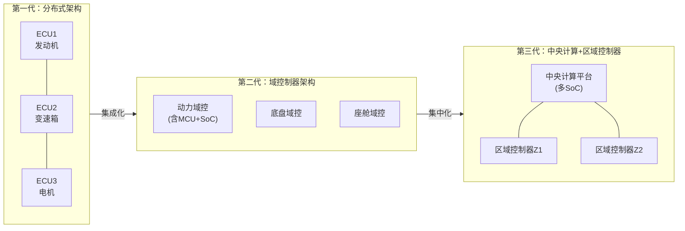
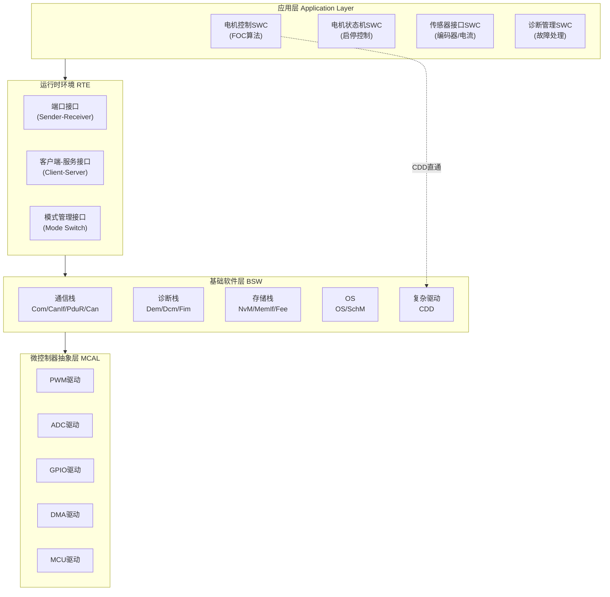
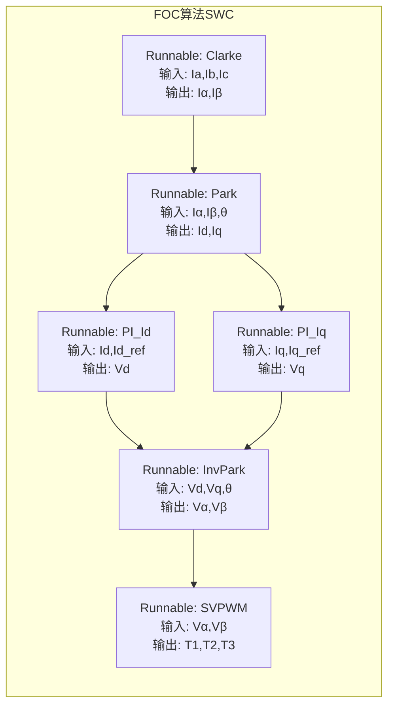
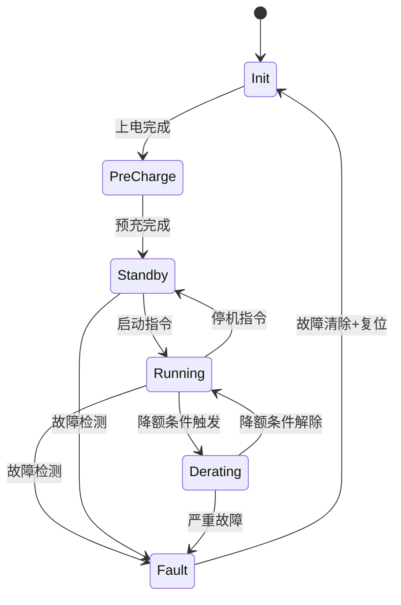
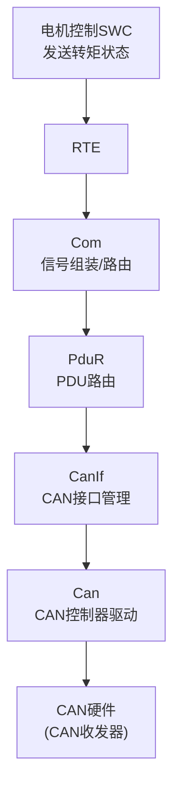
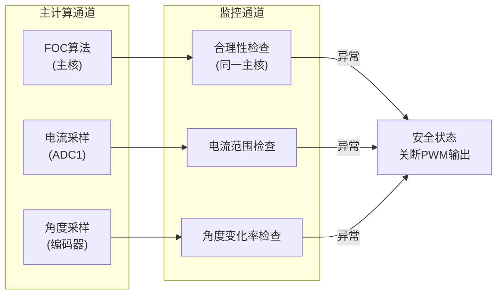
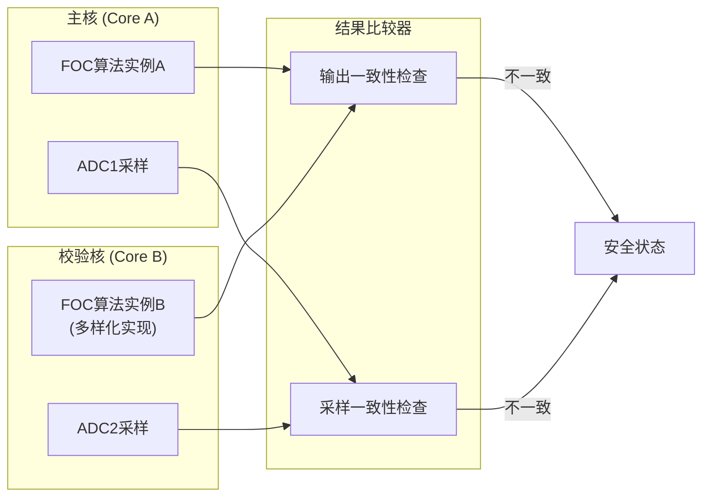
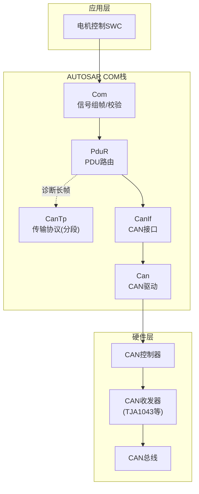

# COM-08 AUTOSAR架构与电机控制

> 路径：📡 工业通信协议 > COM-08

**难度：** ★★★★☆

## 核心摘要

AUTOSAR是汽车电子软件的标准化分层架构——它把"一坨裸跑的电机控制代码"拆解为SWC→RTE→BSW→MCAL四层，让算法工程师专注FOC策略，平台工程师专注底层驱动，双方通过RTE接口解耦。理解AUTOSAR，就是理解现代汽车电驱系统从"写寄存器"到"组组件"的范式跃迁。

## 问题引入

一位做了5年电机控制的嵌入式工程师，入职某新能源车企后被甩过来一份AUTOSAR工程：

- 以前一个`TIM1->CCR1 = duty;`搞定PWM输出，现在要配MCAL→Port→Dio→Pwm→RTE→SWC六层
- 以前`ADC1->DR`直接读电流，现在要搞AdcChannelGroup、DemEvent、NvM Block
- 以前`CAN_Send()`一发就完事，现在要过CanIf→PduR→Com→RTE→SWC

他困惑了：**这套架构到底是提升效率还是制造障碍？电机控制的实时性要求微秒级响应，AUTOSAR层层封装后还能不能跑FOC？**

答案是：AUTOSAR不是障碍，而是规模化协作的基础设施。关键在于理解每一层存在的理由，以及电机控制代码在架构中的正确位置。

## 正文

### 1. AUTOSAR概述

#### 1.1 AUTOSAR三大平台

AUTOSAR（AUTomotive Open System ARchitecture）成立于2003年，由全球主要OEM和Tier1联合推动，目标是实现汽车电子软件的标准化、可复用、可移植。

| 平台 | 全称 | 定位 | 典型应用 |
|------|------|------|----------|
| **Classic Platform (CP)** | AUTOSAR Classic | 高实时性、信号驱动的嵌入式ECU | 电机控制器、BCM、ESP |
| **Adaptive Platform (AP)** | AUTOSAR Adaptive | 高性能计算、服务导向的SoC | 自动驾驶域控、座舱域控 |
| **Foundation** | AUTOSAR Foundation | CP与AP的通用基础规范 | 通用数据类型、通信协议 |

> **工程经验**：电机控制器（MCU）使用Classic Platform，域控制器（SoC）使用Adaptive Platform。两者通过以太网SOME/IP协议通信。Foundation确保两者共享一致的基础数据模型。

#### 1.2 汽车EEA演进与AUTOSAR的关系



| EEA阶段 | 时间 | 特征 | AUTOSAR角色 |
|---------|------|------|-------------|
| 分布式 | 2000s | 一个功能一个ECU，点对点CAN | CP标准化ECU内部软件 |
| 域控 | 2015s | 多功能集成到域控制器 | CP+AP共存，以太网骨干 |
| 中央计算 | 2025s | 中央大脑+区域执行 | AP为主，CP在区域控制器 |

#### 1.3 电机控制在AUTOSAR中的定位

电机控制器在AUTOSAR体系中属于**动力域**的核心ECU，其定位：

- **实时性要求最高**：FOC电流环典型周期 $50\mu s \sim 100\mu s$，是整车ECU中实时性要求最高的模块
- **安全等级最高**：驱动电机涉及动力安全，通常要求ASIL-C/D
- **软硬件耦合最深**：PWM死区、ADC同步采样、DMA传输等与MCU硬件强绑定

因此，电机控制SWC在AUTOSAR中享有"特权"——可以直接通过RTE调用MCAL的复杂驱动（Complex Driver, CDD），绕过部分BSW中间层以满足实时性。

### 2. AUTOSAR Classic分层架构

#### 2.1 四层架构总览



#### 2.2 各层职责

**应用层（SWC - Software Component）**

SWC是AUTOSAR中最小的功能单元，具有明确的端口接口，可独立开发、测试和部署。电机控制相关的SWC包括：

- 电机控制算法SWC：实现FOC核心算法
- 电机状态机SWC：管理电机运行状态
- 传感器接口SWC：封装传感器数据获取
- 诊断管理SWC：故障检测与处理

**RTE（Runtime Environment）**

RTE是AUTOSAR的"总线"，它完成：
- SWC之间的通信路由（虚拟总线）
- SWC与BSW的接口适配
- 数据类型转换与一致性保证
- 通信模式管理（Sender-Receiver / Client-Server）

**BSW（Basic Software）**

BSW提供标准化的基础服务，电机控制主要涉及：

| BSW模块 | 功能 | 电机控制关联 |
|---------|------|-------------|
| Com | 信号层通信 | 转矩指令/状态反馈 |
| CanIf | CAN接口抽象 | CAN收发管理 |
| PduR | PDU路由 | 多路CAN信号分发 |
| Can | CAN驱动 | 底层CAN控制器 |
| Dem | 诊断事件管理 | 过流/过压/过温事件 |
| Dcm | 诊断通信管理 | UDS诊断服务 |
| NvM | 非易失存储 | PI参数/标定数据存储 |
| OS | 操作系统 | 任务调度与资源管理 |
| CDD | 复杂驱动 | FOC实时控制直通MCAL |

**MCAL（Microcontroller Abstraction Layer）**

MCAL是硬件的最后一层抽象，由芯片厂商提供（如Infineon MC-ISAR、NXP MCAL、ST AUTOSAR MCAL），直接操作寄存器：

| MCAL模块 | 功能 | 电机控制关联 |
|----------|------|-------------|
| Pwm | PWM生成 | 逆变器SVPWM输出 |
| Adc | ADC采样 | 相电流/母线电压采样 |
| Gpt | 通用定时器 | 采样触发时序 |
| Dio | 数字IO | 使能/方向/刹车信号 |
| Dma | DMA传输 | ADC结果自动搬运 |
| Mcu | MCU初始化 | 时钟/外设使能 |
| Port | 端口配置 | 引脚复用配置 |
| Spi | SPI通信 | 旋变/编码器接口 |

### 3. 电机控制SWC设计

#### 3.1 FOC算法组件化

传统裸机FOC实现中，Clarke变换、Park变换、PI控制器、SVPWM通常写在一个函数里顺序执行。在AUTOSAR中，需要将其拆解为独立的Runnable（可运行实体），通过RTE端口交换数据。



各Runnable的数据流：

$$
I_\alpha = I_a
$$

$$
I_\beta = \frac{I_a + 2I_b}{\sqrt{3}}
$$

$$
\begin{bmatrix} I_d \\ I_q \end{bmatrix} =
\begin{bmatrix} \cos\theta & \sin\theta \\ -\sin\theta & \cos\theta \end{bmatrix}
\begin{bmatrix} I_\alpha \\ I_\beta \end{bmatrix}
$$

$$
V_d = K_p(e_d) + K_i \int e_d \, dt, \quad e_d = I_{d\_ref} - I_d
$$

$$
V_q = K_p(e_q) + K_i \int e_q \, dt, \quad e_q = I_{q\_ref} - I_q
$$

> **工程经验**：虽然AUTOSAR规范允许将每个算法步骤拆为独立Runnable，但实际工程中**不建议过度拆分**。FOC电流环的全部Runnable应映射到同一个OS Task中顺序执行，避免RTE调度开销。典型做法是将Clarke→Park→PI→InvPark→SVPWM封装为一个Runnable，在$100\mu s$定时中断中触发。

#### 3.2 电机状态机SWC



状态机SWC的端口设计：

| 端口名 | 类型 | 方向 | 数据类型 |
|--------|------|------|----------|
| MotorCmd | Sender-Receiver | 输入 | MotorCmdType（启动/停止/复位） |
| TorqueRef | Sender-Receiver | 输入 | float32（转矩指令 N·m） |
| MotorStatus | Sender-Receiver | 输出 | MotorStatusType（状态+转速+转矩） |
| FaultInfo | Sender-Receiver | 输出 | FaultInfoType（故障码+故障等级） |
| SetMode | Client-Server | 提供 | 切换电机运行模式 |

#### 3.3 传感器接口SWC

传感器接口SWC封装硬件差异，向上提供统一的信号接口：

| 子组件 | 功能 | 输入源 | 输出 |
|--------|------|--------|------|
| 电流采样接口 | 三相电流获取 | ADC MCAL（注入组） | $I_a, I_b, I_c$ |
| 位置传感器接口 | 转子位置获取 | SPI/Encoder MCAL | $\theta, \omega$ |
| 温度采样接口 | 绕组/IGBT温度 | ADC MCAL（规则组） | $T_{winding}, T_{IGBT}$ |
| 母线电压接口 | 直流母线电压 | ADC MCAL（规则组） | $V_{dc}$ |

> **工程经验**：传感器接口SWC是软硬件解耦的关键。更换编码器方案（如从增量式换为绝对值编码器）时，只需修改该SWC内部实现和MCAL配置，上层FOC算法SWC无需任何改动。这正是AUTOSAR分层架构的核心价值。

### 4. BSW与电机控制的交互

#### 4.1 COM通信栈

AUTOSAR COM栈从上到下的完整调用链：



电机控制典型通信信号映射：

| 信号 | 方向 | 周期 | CAN ID | 数据格式 |
|------|------|------|--------|----------|
| 转矩指令 | RX | 10ms | 0x100 | int16, 0.1N·m/LSB |
| 转速指令 | RX | 10ms | 0x100 | int16, 1RPM/LSB |
| 电机状态 | TX | 10ms | 0x200 | uint8状态码 |
| 实际转速 | TX | 10ms | 0x200 | int16, 1RPM/LSB |
| 实际转矩 | TX | 10ms | 0x200 | int16, 0.1N·m/LSB |
| 故障码 | TX | 事件 | 0x201 | uint32故障码 |
| UDS诊断 | 双向 | 按需 | 0x700/0x708 | ISO 14229 |

> **工程经验**：CAN TP（传输协议）用于UDS诊断中超过8字节的数据传输（如读取DTC快照数据）。电机控制器通常需要支持CAN TP，因为故障快照数据可能包含电流波形、角度序列等大量信息。CanTp配置时注意STmin（帧间最小间隔）和BS（块大小）参数，避免影响周期性实时报文的发送。

#### 4.2 NvM非易失存储

电机控制器的NvM典型存储内容：

| Block ID | 内容 | 大小 | 写入策略 | 安全等级 |
|----------|------|------|----------|----------|
| NVM_BLOCK_PI_PARAMS | PI参数 $K_p, K_i$ | 32字节 | 上位机标定时写入 | CRC校验 |
| NVM_BLOCK_MOTOR_CALIB | 电机标定参数 | 128字节 | EOL下线写入 | CRC+冗余 |
| NVM_BLOCK_FAULT_LOG | 故障记录 | 256字节 | 故障发生时写入 | 循环覆盖 |
| NVM_BLOCK_RUNTIME | 运行统计（运行时长/最大温度） | 64字节 | 下电时写入 | CRC校验 |

NvM写入时机：

```text
上电 → NvM_ReadAll() → 加载PI参数/标定数据到RAM
运行中 → 上位机标定 → NvM_WriteBlock() → 立即写入
下电 → NvM_WriteAll() → 保存运行统计
```

> **工程经验**：NvM写入是阻塞操作（典型耗时$10ms \sim 100ms$），**绝对不能在FOC电流环任务中调用NvM写入**。应在低优先级任务中异步写入，通过NvM回调确认写入完成。PI参数在RAM中有一份工作副本，NvM中的是持久化副本。

#### 4.3 DEM诊断事件管理

电机控制器典型诊断事件：

| DemEventId | 事件名称 | 触发条件 | Debounce | 故障等级 |
|------------|----------|----------|----------|----------|
| DEM_EVENT_OVC | 过流 | $I > I_{max}$ 持续5ms | 计数3次 | 严重 |
| DEM_EVENT_OVV | 过压 | $V_{dc} > V_{max}$ | 计数3次 | 严重 |
| DEM_EVENT_UVV | 欠压 | $V_{dc} < V_{min}$ | 计数5次 | 一般 |
| DEM_EVENT_OTP | 过温 | $T > T_{max}$ | 计数3次 | 一般 |
| DEM_EVENT_ENC | 编码器异常 | 信号丢失/超速 | 计数1次 | 严重 |
| DEM_EVENT_PHASE | 缺相 | 电流不平衡度>阈值 | 计数5次 | 严重 |

Debounce机制防止瞬态干扰误触发：

$$
\text{DebounceCounter} =
\begin{cases}
\text{Counter} + 1 & \text{条件成立} \\
\text{Counter} - 1 & \text{条件不成立（下限为0）}
\end{cases}
$$

当 $\text{Counter} \geq \text{Threshold}$ 时，事件确认（pre-failed → confirmed）。

#### 4.4 OS任务调度

电机控制器典型OS任务配置：

| Task | 优先级 | 周期 | 执行内容 | 最大执行时间 |
|------|--------|------|----------|-------------|
| Task_FOC | 最高 | 100μs | FOC电流环（含ADC读取、PI计算、SVPWM） | ≤30μs |
| Task_Speed | 高 | 1ms | 速度环PI、位置传感器处理 | ≤50μs |
| Task_ComTx | 中 | 10ms | CAN发送（状态/转速/转矩） | ≤100μs |
| Task_ComRx | 中 | 10ms | CAN接收处理 | ≤100μs |
| Task_Diag | 低 | 50ms | 诊断处理（Dem/Dcm） | ≤500μs |
| Task_NvM | 最低 | 100ms | 非易失存储操作 | ≤5ms |

> **工程经验**：Task_FOC必须设为最高优先级且不可抢占（或仅被更高优先级的硬件中断抢占）。AUTOSAR OS支持优先级天花板协议（Priority Ceiling Protocol）防止优先级反转。FOC任务内部禁止调用任何可能阻塞的BSW服务（如NvM_Write、CanIf_Transmit的阻塞模式）。

### 5. MCAL配置要点

#### 5.1 PWM MCAL配置

电机控制PWM是整个系统的心跳，MCAL配置必须精确：

| 配置项 | 典型值 | 说明 |
|--------|--------|------|
| PwmChannelAssignment | TIM1_CH1/CH2/CH3 | 三相PWM输出通道 |
| PwmPeriod | 10kHz（100μs） | PWM开关频率 |
| PwmDutycycleDefault | 50% | 默认占空比（安全状态） |
| PwmAlignment | PWM_CENTER_ALIGNED | 中心对齐模式（FOC必须） |
| PwmDeadTime | 0.5μs ~ 2μs | 死区时间，防止上下桥臂直通 |
| PwmNotification | 启用 | 计数器溢出回调，触发FOC计算 |

中心对齐模式时序：

```text
        ┌───┐           ┌───┐
PWM_H   │   │           │   │
    ────┘   └───────────┘   └────
          ┌───┐           ┌───┐
PWM_L     │   │           │   │
    ──────┘   └───────────┘   └──
        ←DT→           ←DT→
        
    ↑ADC采样点（PWM计数器峰值/谷值）
```

> **工程经验**：死区时间必须根据IGBT/MOSFET的开关特性设置。过小会导致直通短路，过大会引起输出电压畸变（死区效应），需要在算法中补偿。死区补偿公式：$\Delta V_{dead} = \frac{4 \cdot V_{dc} \cdot t_{dead} \cdot f_{sw}}{T_s}$，其中 $t_{dead}$ 为死区时间，$f_{sw}$ 为开关频率，$T_s$ 为PWM周期。

#### 5.2 ADC MCAL配置

电机控制ADC采样需要与PWM精确同步：

| 配置项 | 注入组（电流） | 规则组（电压/温度） |
|--------|---------------|-------------------|
| AdcGroupDefinition | ADC_GROUP_INJECTION | ADC_GROUP_REGULAR |
| AdcTriggerSource | PWM定时器比较事件 | 软件触发或定时器 |
| AdcChannels | Ia(CH0), Ib(CH1), Ic(CH2) | Vdc(CH3), T_winding(CH4), T_IGBT(CH5) |
| AdcStreaming | 启用DMA传输 | 启用DMA传输 |
| AdcNotification | 转换完成回调 | 转换完成回调 |
| 采样精度 | 12bit（0.244mV/LSB @3.3V） | 12bit |
| 采样时间 | 1.5个ADC时钟周期（高速） | 4.5个ADC时钟周期 |

ADC采样与PWM同步的关键时序：

$$
t_{ADC\_trigger} = t_{PWM\_peak} - t_{ADC\_conversion} - t_{settling}
$$

其中 $t_{settling}$ 为电流传感器输出建立时间，典型值 $1\mu s \sim 3\mu s$。

> **工程经验**：注入组（Injected Group）是电机控制ADC的核心特性——它可以在规则组转换进行中**抢占**启动，确保电流采样时刻的确定性。这是普通ADC规则组无法保证的。务必使用注入组采样相电流，规则组采样温度和母线电压等非实时信号。

#### 5.3 MCU MCAL配置

| 配置项 | 典型配置 | 说明 |
|--------|----------|------|
| McuClockSetting | PLL 160MHz / SYSCLK 80MHz | 根据MCU型号和功耗要求选择 |
| McuPeripheralEnable | TIM1, ADC1, ADC2, DMA1, SPI2, CAN1 | 按需使能，降低功耗 |
| McuModeSetting | MCU_MODE_RUN / MCU_MODE_SLEEP | 运行模式与低功耗模式 |
| McuResetReason | 上电复位/看门狗复位/软件复位 | 用于故障诊断 |

> **工程经验**：MCU时钟配置直接影响PWM频率和ADC采样速率。例如STM32F4系列，TIM1挂载在APB2总线（168MHz），ADC挂载在APB2总线，DMA挂载在AHB总线。时钟树配置错误会导致PWM频率偏差或ADC采样不准。MCAL配置工具（如EB tresos、DaVinci Configurator）会自动计算分频系数，但仍需人工验证。

### 6. 功能安全与AUTOSAR

#### 6.1 ISO 26262 ASIL等级与AUTOSAR的关系

| ASIL等级 | 失效概率要求 | 电机控制典型场景 | AUTOSAR安全机制 |
|----------|-------------|-----------------|-----------------|
| ASIL-A | $<10^{-5}$/h | 风扇电机 | 基本监控 |
| ASIL-B | $<10^{-6}$/h | 转向助力电机 | 冗余计算+监控 |
| ASIL-C | $<10^{-7}$/h | 主驱动电机（低功率） | 冗余+诊断+安全状态 |
| ASIL-D | $<10^{-8}$/h | 主驱动电机（高功率） | 全冗余+多样化+安全状态 |

#### 6.2 ASIL-B/ASIL-D电机控制的安全机制

**ASIL-B典型方案（单核+监控）**：



**ASIL-D典型方案（双核锁步）**：



#### 6.3 安全机制实现要点

**冗余计算**：

ASIL-D要求多样化冗余，两个FOC实例应采用不同实现：

| 差异维度 | 主核实现 | 校验核实现 |
|----------|----------|-----------|
| 数据类型 | float32 | 定点Q15 |
| PI算法 | 位置式PI | 增量式PI |
| 角度获取 | 编码器 | 霍尔传感器估算 |
| 电流采样 | ADC1注入组 | ADC2注入组 |

**监控机制**：

- 电流合理性：$|I_{measured}| \leq I_{max}$，且变化率 $|\frac{dI}{dt}| \leq \frac{I_{max}}{T_{min}}$
- 角度合理性：$\omega_{min} \leq \omega \leq \omega_{max}$，且角度单调递增/递减
- 输出合理性：SVPWM占空比 $0 \leq D \leq 1$，三相之和 $\approx 0$

**安全状态**：

$$
\text{Fault} \xrightarrow{\text{FTTI}} \text{Safe State}
$$

FTTI（Fault Tolerant Time Interval）是安全关键指标：

- ASIL-B：FTTI $\leq 50ms$
- ASIL-D：FTTI $\leq 10ms$

在FTTI内必须完成：故障检测 → 故障确认 → 安全状态切换。

> **工程经验**：ASIL-D的FTTI $10ms$ 意味着从故障发生到PWM输出关断必须在$10ms$内完成。这要求故障检测在FOC任务中完成（$100\mu s$级），不能依赖低优先级的诊断任务。Dem事件确认后，FIM（Function Inhibition Manager）应立即禁止相应SWC的Runnable执行，并触发硬件级PWM关断（通过GPIO紧急关断引脚）。

### 7. 与COM模块的关联

#### 7.1 AUTOSAR COM栈在通信协议体系中的位置



#### 7.2 COM栈与物理层的关系

| 层次 | 模块 | 关注点 | 与电机控制的关联 |
|------|------|--------|-----------------|
| 信号层 | Com | 信号有效性、超时监控、滤波 | 转矩指令超时→进入安全转矩 |
| PDU层 | PduR | 多路复用、路由 | 区分实时控制PDU和诊断PDU |
| 传输层 | CanTp | 分段重组 | UDS诊断数据传输 |
| 接口层 | CanIf | 收发管理、模式控制 | CAN唤醒/睡眠管理 |
| 驱动层 | Can | 寄存器操作、中断处理 | CAN硬件初始化 |
| 物理层 | CAN PHY | 信号电平、ESD保护 | 电机EMI环境下的信号完整性 |

> **工程经验**：Com模块的信号超时监控（Deadline Monitoring）对电机安全至关重要。如果转矩指令CAN报文超时未收到，Com模块会通知RTE，RTE触发状态机SWC进入安全状态。超时阈值通常设为报文周期的3~5倍（如10ms周期报文，超时阈值30ms~50ms）。

#### 7.3 CAN FD在AUTOSAR COM栈中的支持

AUTOSAR从R4.2版本开始支持CAN FD，关键变化：

- CanIf层新增CanFd支持，DLC扩展至64字节
- PduR路由支持大于8字节的PDU
- Com模块信号组可超过8字节限制
- CanTp在CAN FD下仍可用，但单帧即可传输最多64字节

电机控制受益场景：一次CAN FD报文即可传输完整的电机状态（转速+转矩+电流+温度+故障码+角度），无需拆帧。

### 8. 工程案例

#### 8.1 案例：某新能源车主驱动电机控制器AUTOSAR架构

**系统参数**：

| 参数 | 值 |
|------|-----|
| MCU | Infineon Aurix TC387（三核锁步） |
| 安全等级 | ASIL-D |
| FOC频率 | 10kHz |
| 速度环频率 | 1kHz |
| CAN通信 | CAN FD, 5Mbps数据相 |
| 操作系统 | AUTOSAR OS (SC1) |

**SWC划分**：

| SWC | Runnable数量 | 映射Task | 核心功能 |
|-----|-------------|----------|----------|
| FOC_CurrentCtrl | 1 | Task_FOC (100μs) | 电流环控制 |
| SpeedCtrl | 1 | Task_Speed (1ms) | 速度环控制 |
| MotorStateMachine | 3 | Task_Speed | 状态管理 |
| SensorInterface | 4 | Task_FOC + Task_Speed | 传感器数据 |
| TorqueManager | 2 | Task_ComRx | 转矩指令处理 |
| DiagManager | 5 | Task_Diag (50ms) | 诊断管理 |
| NvMManager | 2 | Task_NvM (100ms) | 参数存储 |

**CDD使用**：

FOC电流环通过CDD（Complex Driver）直接操作MCAL，绕过部分BSW中间层：

```text
FOC_CurrentCtrl Runnable
  → CDD_FOC (复杂驱动)
    → Adc_ReadGroup() [注入组，DMA传输]
    → 角度读取 [SPI直接读取]
    → FOC计算 [纯软件]
    → Pwm_SetDutyCycle() [中心对齐PWM]
    → Gpt_StartTimer() [下一周期触发]
```

#### 8.2 案例：从裸机迁移到AUTOSAR的典型步骤

| 步骤 | 内容 | 注意事项 |
|------|------|----------|
| 1 | 梳理现有代码模块划分 | 识别算法/驱动/通信/诊断边界 |
| 2 | 定义SWC接口和端口 | 先定义数据流，再定义接口 |
| 3 | 提取MCAL配置 | PWM/ADC/GPIO/DMA参数化 |
| 4 | 配置BSW模块 | Com/Dem/NvM/OS |
| 5 | 实现SWC Runnable | 算法代码移植，接口适配 |
| 6 | 配置RTE映射 | Runnable到Task的映射 |
| 7 | 集成测试 | 功能验证+实时性验证 |
| 8 | 安全验证 | ASIL相关机制验证 |

> **工程经验**：从裸机迁移到AUTOSAR的最大风险不是功能错误，而是**实时性退化**。典型问题：FOC电流环执行时间从裸机的$25\mu s$增加到AUTOSAR的$35\mu s$（增加40%），原因是RTE调用开销和OS调度开销。解决方案：①FOC Runnable使用CDD直通MCAL；②FOC Task设为最高优先级不可抢占；③关键路径避免RTE数据拷贝，使用指针引用（RTE的`<DATA-REF>`机制）。

### 9. 实践练习

#### 练习1：SWC端口设计（★☆☆☆☆）

为一个简单的电机速度控制SWC设计端口接口，要求：
- 接收速度指令（float32, RPM）
- 接收实际速度反馈（float32, RPM）
- 输出转矩指令（float32, N·m）
- 输出电机使能信号（boolean）

请画出SWC端口图，标注每个端口的类型（Sender-Receiver / Client-Server）和数据类型。

#### 练习2：OS任务调度设计（★★★☆☆）

给定以下Runnable及其执行时间：

| Runnable | 执行时间 | 触发条件 |
|----------|----------|----------|
| FOC_CurrentCtrl | 30μs | 100μs定时 |
| SpeedCtrl | 40μs | 1ms定时 |
| ComTxProcessing | 80μs | 10ms定时 |
| DiagProcessing | 200μs | 50ms定时 |

要求：
1. 设计Task划分和优先级
2. 计算CPU利用率，判断是否可调度
3. 如果FOC任务增加10μs的RTE开销，是否仍然可调度？

提示：CPU利用率公式 $U = \sum_{i=1}^{n} \frac{C_i}{T_i}$，可调度条件 $U \leq n(2^{1/n} - 1)$。

#### 练习3：安全机制设计（★★★★☆）

某ASIL-D电机控制器需要设计过流保护机制，要求FTTI $\leq 10ms$。已知：
- FOC任务周期100μs
- 过流检测在FOC任务中完成，检测延迟 $\leq 200\mu s$
- Dem事件确认需要3次连续检测（Debounce计数），最坏情况 $3 \times 100\mu s = 300\mu s$
- 安全状态切换（PWM关断）需要 $\leq 50\mu s$

请分析：
1. 最坏情况下故障响应时间是否满足FTTI要求？
2. 如果Debounce计数改为5次，是否仍满足？
3. 如何优化使故障响应时间最小化？

#### 练习4：AUTOSAR COM栈配置（★★★★☆）

为电机控制器设计CAN通信矩阵，要求：
- 支持CAN FD（数据相5Mbps）
- 周期性报文：转矩指令（RX, 10ms）、电机状态（TX, 10ms）
- 事件报文：故障通知（TX, 事件触发）
- 诊断报文：UDS（RX/TX, 按需）

请完成：
1. CAN ID分配（考虑优先级）
2. 信号到PDU的映射
3. Com模块超时监控配置
4. CanTp配置（诊断通道）

---

**参考文献**：

1. AUTOSAR Classic Platform R20-11 Specification
2. ISO 26262:2018 Road Vehicles - Functional Safety
3. AUTOSAR_SWS_Com, AUTOSAR_SWS_CanIf, AUTOSAR_SWS_Dem
4. Infineon Aurix TC3xx AUTOSAR MCAL User Manual
5. 《汽车电子AUTOSAR规范与实践》- 张晓等
