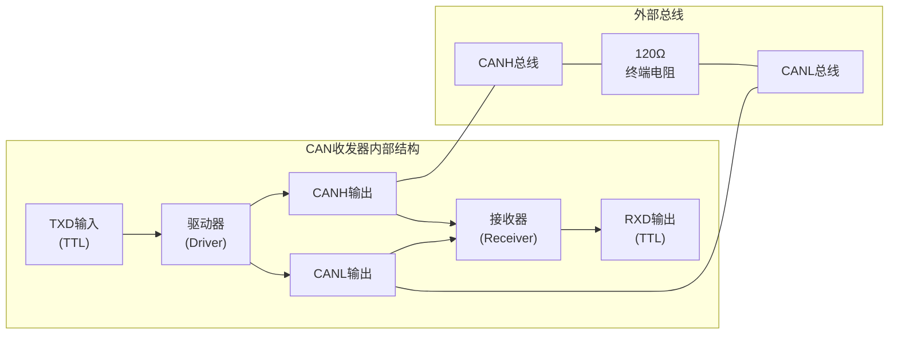
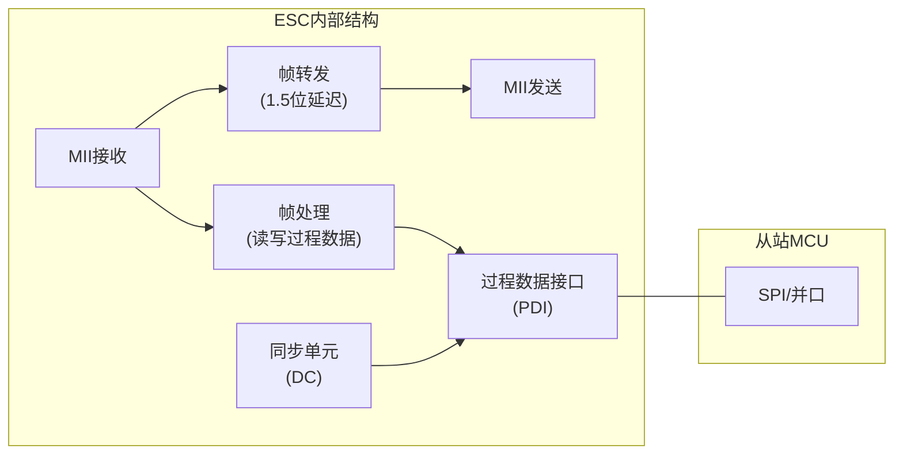
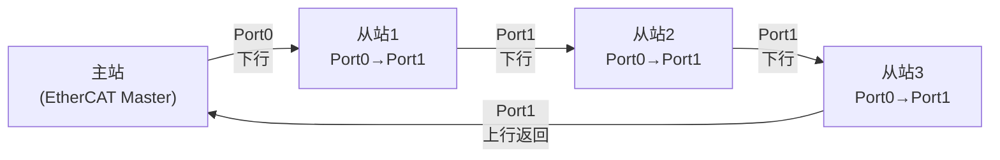
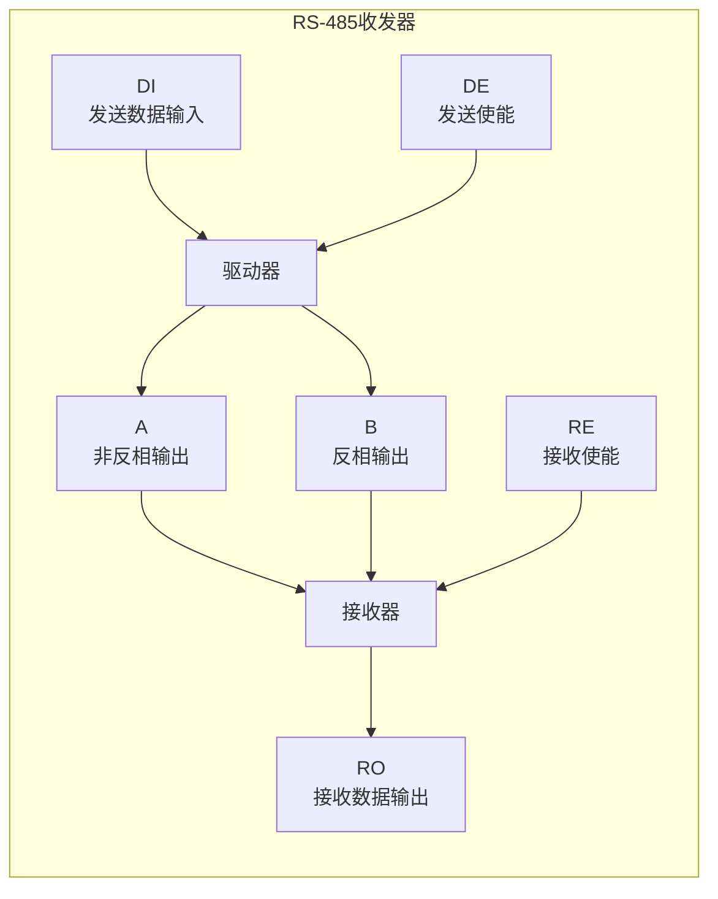
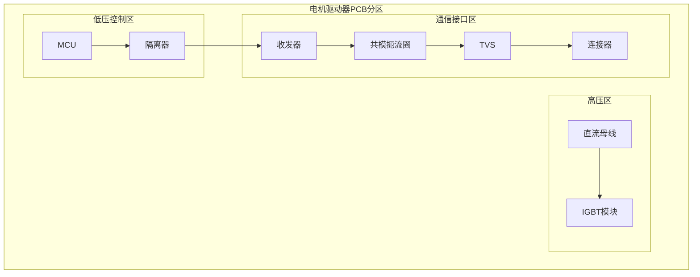
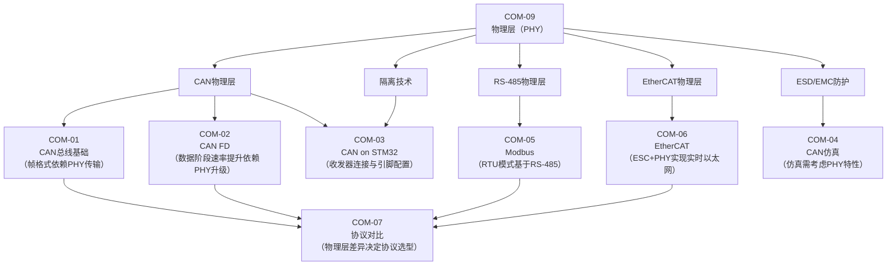

# COM-09 工业通信物理层（PHY）

> 路径： 工业通信协议 > COM-09

- **难度：** 

## 核心摘要

工业通信物理层（PHY）是协议栈与物理世界的接口——它决定了差分信号如何在双绞线上传输、隔离如何保护高压侧与低压侧、ESD/EMC防护如何抵御工业现场的电磁暴力。理解PHY，就是理解通信可靠性的物理根基：**协议再完美，物理层崩了，一切都是零。**

> **认知挂钩**：如果你曾在电机驱动器上遇到CAN通信偶发丢帧、RS-485通信乱码、EtherCAT从站掉站，问题大概率不在协议层，而在物理层——终端电阻缺失、隔离失效、共模干扰、线缆阻抗不匹配。PHY是通信问题的"第一嫌疑人"。

## 1. 问题引入：为什么电机控制工程师需要理解PHY？

电机控制系统是工业现场中电磁环境最恶劣的场景之一：

- **逆变器开关噪声**：IGBT/SiC开关产生极高 $dv/dt$（可达50 kV/μs）和 $di/dt$，通过寄生电容和空间辐射耦合到通信线
- **长线缆传输**：多轴伺服系统中，驱动器与上位机之间线缆可达数十米，信号衰减和反射严重
- **地电位差**：不同设备之间地电位差可达数十伏，直接连接会烧毁收发器
- **ESD冲击**：工业现场人体模型ESD可达8 kV，接触放电直接击穿通信接口

**一个残酷的事实**：90%的通信故障不是协议问题，而是物理层问题。理解PHY，是从"调参数碰运气"到"系统设计保可靠"的关键跨越。

## 2. CAN物理层

### 2.1 CAN收发器内部结构

CAN收发器是CAN控制器（协议层）与物理总线之间的桥梁，完成TTL电平与差分电平的转换。

典型高速CAN收发器（如TJA1050、SN65HVD230）的内部结构：

关键内部模块：

| 模块 | 功能 | 典型参数 |
|------|------|---------|
| 驱动器 | 将TXD的TTL信号转换为差分输出 | 驱动能力：最小50 mA |
| 接收器 | 将总线差分信号转换为RXD的TTL信号 | 共模范围：-2V ~ +7V |
| 斜率控制 | 限制信号边沿速率，降低EMI | TJA1050：固定高速；SN65HVD230：可调 |
| 热保护 | 芯片过温关断输出 | 结温>165°C关断 |
| 显性超时 | 防止TXD持续低电平锁死总线 | TJA1050：>1.5 ms自动释放 |

> **工程经验**：SN65HVD230的RS引脚（斜率控制）接地为高速模式，通过电阻接VCC可降低斜率。在电机驱动器中，由于EMI环境恶劣，建议使用高速模式+良好PCB布局，而非降低斜率来妥协。

### 2.2 差分信号电平

CAN总线采用非归零（NRZ）编码，通过差分电压判定逻辑状态：

| 总线状态 | CAN_H | CAN_L | 差分电压 $V_{diff}$ | 逻辑值 |
|---------|-------|-------|---------------------|--------|
| 显性（Dominant） | ≈3.5 V | ≈1.5 V | ≈2.0 V | 0 |
| 隐性（Recessive） | ≈2.5 V | ≈2.5 V | ≈0 V | 1 |

差分电压判定条件：

$$V_{diff} = V_{CAN\_H} - V_{CAN\_L}$$

- 显性判定：$V_{diff} > 0.9 \text{ V}$（最小0.9 V，典型2.0 V）
- 隐性判定：$V_{diff} < 0.5 \text{ V}$（典型0 V）

**线与特性**的物理本质：显性位（0）驱动CAN_H拉高、CAN_L拉低；隐性位（1）时收发器输出高阻，总线由终端电阻拉至隐性电平。因此多个节点同时发送显性位时，总线仍为显性——这就是仲裁机制的物理基础。

> **工程经验**：用示波器测量CAN总线时，应使用差分探头或两个通道相减。单端测量CAN_H或CAN_L无法准确判断信号质量。正常通信时，$V_{diff}$ 应在显性态稳定在1.5~3.0 V之间，若出现明显振铃或过冲，需检查终端电阻和线缆阻抗。

### 2.3 终端电阻：120Ω两端匹配

CAN总线特征阻抗约为120Ω，两端各需一个120Ω终端电阻进行阻抗匹配，防止信号反射。

**为什么是两端？**

CAN总线拓扑为线性总线（非环形），信号从一端传到另一端时，若末端阻抗不匹配，会产生反射：

$$\Gamma = \frac{Z_L - Z_0}{Z_L + Z_0}$$

其中 $Z_0 = 120\,\Omega$ 为线缆特征阻抗，$Z_L$ 为末端负载阻抗。当 $Z_L = Z_0$ 时，$\Gamma = 0$，无反射。

**终端电阻的并联效应**：两端各120Ω，并联后总线直流等效阻抗为60Ω。这是验证终端电阻是否正确安装的关键指标：

- 断电测量CAN_H与CAN_L之间电阻：应为约60Ω（两个120Ω并联）
- 若测得120Ω：只有一端安装了终端电阻
- 若测得无穷大：两端都没装
- 若测得40Ω：三端安装了终端电阻（错误）

> **工程经验**：终端电阻是CAN通信可靠性的第一道防线。在电机控制系统中，常见错误包括：(1) 只在一端安装终端电阻；(2) 在每个节点都安装终端电阻（应只在总线两端）；(3) 使用非120Ω电阻。调试CAN通信问题的第一步：**断电测量总线电阻是否为60Ω**。

### 2.4 CAN总线长度与波特率的关系

总线最大长度受信号传播延迟约束。CAN协议要求信号往返延迟必须在一个位时间的采样窗口内完成：

$$L_{max} \approx \frac{t_{bit} - 2 \times (t_{tx} + t_{rx})}{2 \times t_{prop\_per\_meter}}$$

其中：
- $t_{bit} = 1 / \text{波特率}$，一个位时间
- $t_{tx}$：发送端收发器延迟（典型50~100 ns）
- $t_{rx}$：接收端收发器延迟（典型50~100 ns）
- $t_{prop\_per\_meter}$：线缆每米传播延迟（约5 ns/m，即光速的60%~70%）

| 波特率 | 位时间 | 最大线缆长度 |
|--------|--------|------------|
| 1 Mbit/s | 1 μs | ~25 m |
| 500 kbit/s | 2 μs | ~100 m |
| 250 kbit/s | 4 μs | ~250 m |
| 125 kbit/s | 8 μs | ~500 m |
| 50 kbit/s | 20 μs | ~1000 m |

> **工程经验**：电机控制常用500 kbit/s（100 m）或1 Mbit/s（25 m）。多轴伺服系统中，1 Mbit/s + 25 m通常足够覆盖一个机柜内的所有驱动器。若需更长距离，降波特率比加中继器更可靠。

### 2.5 CAN FD的物理层变化

CAN FD（Flexible Data-rate）在数据阶段切换到更高波特率，对物理层提出更高要求：

| 参数 | CAN 2.0 | CAN FD（数据阶段） |
|------|---------|-------------------|
| 最高波特率 | 1 Mbit/s | 5 Mbit/s（典型2~5 Mbit/s） |
| 位时间 | ≥1 μs | ≥25 ns（5 Mbit/s时） |
| 收发器要求 | ISO 11898-2 | ISO 11898-2:2016（CAN FD tolerant或CAN FD capable） |
| 信号完整性 | 一般要求 | 严格：更短上升时间，更小抖动 |

**CAN FD收发器选型关键**：

- **传统收发器（如TJA1050）**：不支持CAN FD，在5 Mbit/s下信号完整性不满足要求
- **CAN FD capable收发器（如TJA1462、SN65HVD230）**：支持数据阶段高速传输
- **CAN FD tolerant收发器**：在仲裁阶段正常通信，数据阶段不干扰总线但不解析高速数据

> **工程经验**：CAN FD升级时，**必须同时更换所有节点的收发器**。混用传统收发器和FD收发器会导致数据阶段信号畸变，产生大量CRC错误。这是CAN FD升级中最常犯的错误。

## 3. EtherCAT物理层

### 3.1 EtherCAT从站控制器（ESC）

EtherCAT从站控制器（ESC）是EtherCAT物理层的核心芯片，负责实现实时以太网帧的处理和转发。

| ESC芯片 | 厂商 | 特点 | 典型应用 |
|---------|------|------|---------|
| ET1100 | Beckhoff | 经典ESC，3个MII端口 | 通用从站 |
| ET1200 | Beckhoff | 集成PHY，2个MII端口 | 紧凑型从站 |
| AX58100 | ASIX | 兼容ET1100，低成本 | 国产替代 |
| LAN9252 | Microchip | 集成PHY，SPI/并口 | 简化设计 |
| NZ32F108 | 纳芯微 | 国产ESC | 国产化方案 |

ESC内部核心功能：

**帧转发的物理层意义**：ESC在MII端口之间以1.5位延迟转发帧，这意味着帧不需要在ESC中完整接收后再转发，而是边收边发。这是EtherCAT实现"on-the-fly"处理和极低延迟的物理基础。

> **工程经验**：ESC的MII端口连接PHY芯片时，MII信号的PCB走线长度必须匹配（误差<0.5 inch），否则会导致时钟偏斜和帧错误。这是EtherCAT从站PCB设计中最关键的约束之一。

### 3.2 100Base-TX物理层

EtherCAT基于100 Mbit/s以太网（100Base-TX），物理层由PHY芯片和隔离变压器组成：

**100Base-TX信号特征**：

- 编码方式：4B/5B + MLT-3（三电平编码）
- 信号频率：31.25 MHz（125 MHz时钟4B/5B编码后，MLT-3每4位跳变1次）
- 差分幅度：±1 V（变压器初级侧）
- 线缆要求：Cat5及以上，特征阻抗100Ω±15%

**PHY芯片选型要点**：

| 参数 | 要求 | 说明 |
|------|------|------|
| 接口 | MII/RMII | 与ESC匹配，RMII引脚更少但时序更紧 |
| 速率 | 100 Mbit/s | EtherCAT不支持10 Mbit/s |
| 自动协商 | 必须禁用 | EtherCAT要求强制100M全双工 |
| 环路延迟 | <500 ns | 影响整体环路响应时间 |

> **工程经验**：EtherCAT从站PHY芯片的**自动协商（Auto-Negotiation）必须禁用**，强制设置为100 Mbit/s全双工。自动协商会导致上电后数百毫秒的链路建立延迟，且在干扰环境下可能错误协商到10 Mbit/s，导致EtherCAT通信失败。在PHY寄存器中通过硬件拉脚或软件配置禁用。

### 3.3 环形拓扑的物理层实现

EtherCAT采用逻辑环形拓扑，物理上呈现为线性菊花链：

**物理层实现要点**：

1. **每个从站两个以太网口**：Port0（入）和Port1（出），ESC内部直接转发
2. **全双工通信**：每个方向独立差分对，发送和接收同时进行
3. **线缆要求**：每段线缆最长100 m（100Base-TX标准限制）
4. **热连接（Hot Connect）**：从站热插拔时，ESC检测链路状态变化并通知主站

> **工程经验**：在电机驱动器EtherCAT从站设计中，两个RJ45连接器的PCB布局应尽量靠近ESC芯片，MII走线等长、差分对等长。两个端口之间应保持足够间距，避免串扰。实际产品中，建议Port0和Port1分别放在PCB两侧，减少交叉走线。

### 3.4 分布时钟（DC）的物理层同步机制

EtherCAT分布时钟（Distributed Clock, DC）是实现微秒级同步的核心机制，其精度直接取决于物理层时序：

**DC同步原理**：

1. 主站发送广播帧，记录发送时间戳 $t_{send}$
2. 帧经过每个从站时，ESC记录到达时间戳 $t_{arrive,i}$
3. 主站计算每个从站相对于参考时钟的偏移：$\Delta t_i = t_{arrive,i} - t_{arrive,ref}$
4. 从站根据偏移量调整本地时钟，实现同步

**物理层对DC精度的影响**：

| 影响因素 | 典型值 | 对DC精度的影响 |
|---------|--------|--------------|
| ESC转发延迟 | 10 ns/站 | 累加，可精确补偿 |
| PHY延迟 | 50~150 ns/站 | 随温度漂移，需周期校准 |
| 线缆传播延迟 | ~5 ns/m | 固定，可精确计算 |
| 晶振频差 | ±50 ppm | 累积漂移，需周期同步 |

最终DC同步精度可达 **<1 μs**（典型100 ns级），满足多轴伺服的同步要求。

> **工程经验**：DC同步精度受晶振质量影响显著。选择±25 ppm或更好的晶振，并确保晶振靠近ESC芯片。若DC同步抖动过大，检查PHY芯片的环路延迟是否稳定，以及线缆是否过长导致信号衰减。

## 4. RS-485物理层

### 4.1 RS-485收发器

RS-485是工业通信中最广泛使用的物理层标准之一，Modbus RTU、Profibus DP等协议均基于RS-485。

常用收发器对比：

| 型号 | 速率 | 共模范围 | 特点 |
|------|------|---------|------|
| SP3485 | 10 Mbit/s | -7V ~ +12V | 3.3 V供电，低成本 |
| MAX485 | 2.5 Mbit/s | -7V ~ +12V | 经典5 V方案 |
| SN65HVD75 | 25 Mbit/s | -20V ~ +25V | 高共模范围 |
| THVD1550 | 50 Mbit/s | -20V ~ +25V | 超高速，TI方案 |

RS-485收发器内部结构：

> **工程经验**：RS-485是半双工总线，**DE/RE引脚的切换时序是通信可靠性的关键**。发送完成后，DE必须及时拉低切换到接收模式，否则会漏掉从站的响应帧。典型做法：最后一个字节发送完成后，等待1~2个字符时间再释放DE。在STM32中，可通过UART发送完成中断+定时器延时实现。

### 4.2 差分信号与共模范围

RS-485差分信号定义：

| 参数 | 条件 | 最小值 | 典型值 | 最大值 |
|------|------|--------|--------|--------|
| 差分输出电压 $V_{OD}$ | $R_L = 54\,\Omega$ | 1.5 V | 2.0 V | 5.0 V |
| 接收器灵敏度 $V_{TH}$ | - | -200 mV | - | +200 mV |
| 共模范围 | - | -7 V | - | +12 V |
| 单位负载（UL） | - | - | - | 32 |

差分判定逻辑：

$$V_{diff} = V_A - V_B$$

- $V_{diff} > +200 \text{ mV}$：逻辑1（A > B）
- $V_{diff} < -200 \text{ mV}$：逻辑0（A < B）
- $|V_{diff}| < 200 \text{ mV}$：不确定态

**共模范围**是RS-485相比RS-232的核心优势：-7 V ~ +12 V的共模范围允许设备之间存在较大的地电位差，这是工业现场的基本要求。

> **工程经验**：RS-485的A/B命名在不同厂商间存在混淆。**EIA-485标准定义**：A为非反相端（标记为+或Data+），B为反相端（标记为-或Data-）。但部分厂商（如Maxim早期文档）A/B定义相反。接线时务必参考具体收发器数据手册的引脚定义，而非仅凭A/B标签。**经验法则**：空闲时（无通信），A线电压高于B线。

### 4.3 终端电阻与偏置电阻

**终端电阻**：与CAN类似，RS-485总线两端各需一个终端电阻匹配线缆特征阻抗。RS-485线缆特征阻抗通常为120Ω：

$$R_{term} = Z_0 \approx 120\,\Omega$$

**偏置电阻**：RS-485总线在空闲时（所有收发器都处于接收模式），差分线处于高阻态，容易受噪声干扰产生虚假数据。偏置电阻将总线拉到确定状态：

$$V_A = V_{CC} \times \frac{R_{bias}}{R_{bias} + R_{bias}} = \frac{V_{CC}}{2} + \frac{V_{CC}}{2} \times \frac{R_{term\_eq}}{R_{bias} + R_{term\_eq}/2}$$

简化计算：选择偏置电阻使 $V_{diff} \geq 200 \text{ mV}$：

$$R_{bias} \leq \frac{V_{CC} - V_{TH}}{I_{bias}} = \frac{V_{CC} - 0.2}{0.2 / R_{term\_eq}}$$

典型配置：$V_{CC} = 5\text{V}$，$R_{bias} = 680\,\Omega$（A端上拉至VCC，B端下拉至GND）。

> **工程经验**：偏置电阻只需在一端安装（通常在主站端）。在噪声严重的电机驱动环境中，偏置电阻是防止空闲态误触发中断的关键。若Modbus RTU通信中出现大量空闲态误帧，首先检查偏置电阻是否安装。

### 4.4 Modbus RTU的物理层要求

Modbus RTU对RS-485物理层的特殊要求：

| 参数 | Modbus RTU要求 | 说明 |
|------|---------------|------|
| 波特率 | 1200~115200 bps | 常用9600/19200 |
| 帧间静默时间 | ≥3.5字符时间 | 帧分隔依据 |
| 帧内字符间隔 | ≤1.5字符时间 | 超时则帧无效 |
| 从站数量 | ≤247（协议限制） | 物理层通常限制32个单位负载 |
| 线缆类型 | 屏蔽双绞线 | 特征阻抗120Ω |
| 最大长度 | 1200 m（9600 bps） | 随波特率升高而缩短 |

**帧间静默时间的物理层意义**：3.5字符时间在9600 bps下约4 ms，在此期间总线必须保持空闲态。若偏置电阻缺失，总线空闲时噪声可能被误判为帧起始位，导致从站解析出错误帧。

> **工程经验**：Modbus RTU通信中，**帧间静默时间是最常被忽视的参数**。许多MCU的UART外设在发送最后一个字节后，发送完成中断触发时移位寄存器可能还未完全清空。建议在最后一个字节发送完成后再等待至少1个字符时间，再释放DE引脚。使用STM32时，应检查TC（Transmission Complete）标志而非TXE（Transmit Data Register Empty）标志。

## 5. 隔离技术

### 5.1 隔离的必要性

在电机驱动器中，通信接口隔离是**安全要求**而非可选功能：

- **高压隔离**：电机驱动器母线电压可达数百伏甚至上千伏，IGBT故障时高压可能通过PCB爬电或击穿到达通信接口
- **地环路消除**：不同设备之间地电位差可达数十伏，不隔离会形成地环路电流，干扰通信甚至损坏收发器
- **共模抑制**：逆变器 $dv/dt$ 产生的高频共模电流通过寄生电容耦合到通信线，隔离可切断共模路径

**隔离等级要求**：

| 应用场景 | 隔离电压 | 隔离类型 |
|---------|---------|---------|
| 低压驱动器（<48 V） | 2500 Vrms | 基本隔离 |
| 工业驱动器（380 V AC） | 5000 Vrms | 加强隔离 |
| 高压驱动器（690 V AC） | 8000 Vrms | 加强隔离 |

### 5.2 光耦隔离

光耦是最传统的隔离方案，通过光信号传递数字状态：

| 型号 | 速率 | CTR | 隔离电压 | 特点 |
|------|------|-----|---------|------|
| 6N137 | 10 Mbit/s | - | 5000 Vrms | 高速逻辑光耦 |
| HCPL-0601 | 15 Mbit/s | - | 3750 Vrms | 超高速 |
| TLP2745 | 15 Mbit/s | - | 5000 Vrms | 东芝高速光耦 |
| PC817 | 低速 | 50~300% | 5000 Vrms | 仅适合低速信号 |

**光耦的局限性**：

1. **速度限制**：LED发光+光敏管响应的物理延迟，高速光耦最高约15 Mbit/s
2. **CTR衰减**：LED发光效率随温度和时间下降，长期运行后可能失效
3. **功耗较高**：LED需要持续驱动电流（6N137典型15 mA）
4. **单向传输**：每个信号方向需要独立光耦

> **工程经验**：6N137是CAN隔离的经典方案，但需注意：(1) 6N137需要VCC1和VCC2两组独立供电；(2) 使能引脚必须拉高；(3) 输出为开集结构，需上拉电阻。在CAN隔离中，TXD和RXD各需一个6N137，加上隔离DC-DC供电，BOM成本和PCB面积都较高。现代设计中，磁隔离方案更具优势。

### 5.3 磁隔离

磁隔离（如ADI的iCoupler系列）利用芯片内微型变压器耦合信号：

| 型号 | 通道数 | 速率 | 隔离电压 | 特点 |
|------|--------|------|---------|------|
| ADuM1201 | 2 | 25 Mbit/s | 5000 Vrms | 通用双通道 |
| ADuM3151 | 5 | 25 Mbit/s | 5000 Vrms | SPI隔离 |
| ADuM1412 | 4 | 25 Mbit/s | 5000 Vrms | 四通道 |
| ADuM3223 | 2 | 25 Mbit/s | 5000 Vrms | 栅极驱动隔离 |

**磁隔离的优势**：

1. **高速**：25 Mbit/s以上，满足CAN FD和EtherCAT要求
2. **低功耗**：无需LED驱动电流，静态功耗<2 mA
3. **长寿命**：无光衰问题，CTR等效参数不随时间退化
4. **双向通道**：单芯片可配置不同方向的通道组合
5. **集成度高**：可集成DC-DC隔离电源（isoPower系列）

> **工程经验**：ADuM1201是CAN隔离的现代首选方案，两个通道分别用于TXD和RXD，单芯片替代两个6N137+隔离DC-DC。PCB布局时，隔离栅两侧的覆铜间距需满足爬电距离要求（5000 Vrms至少8 mm），磁隔离芯片本身已保证内部隔离，但PCB走线不能跨越隔离栅。

### 5.4 电容隔离

电容隔离（如TI的ISO系列）利用SiO₂介质电容耦合信号：

| 型号 | 通道数 | 速率 | 隔离电压 | 特点 |
|------|--------|------|---------|------|
| ISO7721 | 2 | 100 Mbit/s | 5000 Vrms | 通用双通道 |
| ISO7742 | 4 | 100 Mbit/s | 5000 Vrms | 四通道 |
| ISO1050 | 1 | 1 Mbit/s | 5000 Vrms | 集成CAN收发器 |
| ISO6721 | 2 | 100 Mbit/s | 5000 Vrms | 低功耗 |

**电容隔离的特点**：

1. **超高速**：100 Mbit/s，满足EtherCAT等高速协议
2. **低功耗**：静态电流<300 μA/ch
3. **抗磁干扰**：电容耦合不受外部磁场影响（相比磁隔离的优势）
4. **TI专利**：双电容差分结构，单电容失效仍能工作

> **工程经验**：ISO1050是TI的隔离CAN收发器，将数字隔离器和CAN收发器集成在单芯片中，极大简化了CAN隔离设计。但注意ISO1050仅支持CAN 2.0（1 Mbit/s），不支持CAN FD。若需CAN FD隔离方案，应选择ISO7721 + TJA1462的组合。

### 5.5 三种隔离技术对比

| 对比项 | 光耦 | 磁隔离 | 电容隔离 |
|--------|------|--------|---------|
| 最高速率 | ~15 Mbit/s | ~150 Mbit/s | ~100 Mbit/s |
| 功耗 | 高（LED驱动） | 中 | 低 |
| 寿命 | CTR衰减 | 长 | 长 |
| 抗磁干扰 | 强 | 弱 | 强 |
| 抗电干扰 | 强 | 强 | 中 |
| 集成度 | 低 | 高 | 高 |
| 成本 | 低 | 中高 | 中 |
| 代表厂商 | 安华高/东芝 | ADI | TI |

> **工程经验**：电机驱动器中通信隔离的选型建议——CAN 2.0：ISO1050（电容隔离+收发器集成）；CAN FD：ADuM1201 + TJA1462（磁隔离+FD收发器）；EtherCAT：ADuM1412（磁隔离，4通道覆盖MII信号）；RS-485：ISO7721 + SP3485（电容隔离+收发器）。

## 6. ESD/EMC防护

### 6.1 TVS管选型（CAN总线ESD保护）

CAN总线暴露在工业环境中，需ESD/EFT/surge防护。TVS（瞬态电压抑制）管是首选：

**CAN总线TVS选型参数**：

| 参数 | 要求 | 说明 |
|------|------|------|
| 工作电压 $V_{RWM}$ | ≥5.5 V | 大于CAN_H最大共模电压 |
| 击穿电压 $V_{BR}$ | 6.0~8.0 V | 开始导通 |
| 钳位电压 $V_C$ | ≤12 V（$I_{PP}=5\text{A}$） | 钳位时最大电压 |
| 结电容 | ≤15 pF | 过大影响信号完整性 |
| ESD保护等级 | IEC 61000-4-2 ±8 kV接触/±15 kV空气 | 工业级 |

**推荐型号**：

| 型号 | 厂商 | $V_{RWM}$ | $V_C$ | 结电容 | 封装 |
|------|------|-----------|-------|--------|------|
| TCAN1042V | TI | 集成 | 集成 | 集成 | SOIC-8 |
| NUP2105L | ON Semi | 24 V | 40 V | 15 pF | SOT-23 |
| PESD2CAN | NXP | 24 V | 40 V | 11 pF | SOT-23 |
| TPD8S300 | TI | 集成 | 集成 | 集成 | WQFN |

> **工程经验**：TVS管应放置在连接器侧，位于终端电阻之前（靠近噪声入口）。TVS的结电容会与终端电阻形成RC低通滤波器，截止频率 $f_c = 1/(2\pi R_{term} C_{TVS})$。若 $C_{TVS} = 15\text{pF}$，$R_{term} = 120\,\Omega$，则 $f_c \approx 88\text{MHz}$，对1 Mbit/s CAN信号无影响，但对5 Mbit/s CAN FD需关注。

### 6.2 共模扼流圈

共模扼流圈（Common Mode Choke, CMC）用于抑制共模干扰，在电机驱动器通信线上几乎是必选：

**工作原理**：

差分信号在两个绕组中电流方向相反，产生的磁通相互抵消，差分信号无衰减通过；共模干扰在两个绕组中电流方向相同，磁通叠加，产生高阻抗，抑制共模电流。

$$Z_{diff} = Z_{self} - Z_{mutual} \approx 0$$

$$Z_{CM} = Z_{self} + Z_{mutual} \approx 2 \times Z_{self}$$

**CAN总线共模扼流圈选型**：

| 参数 | 要求 | 说明 |
|------|------|------|
| 差模阻抗 | <10 Ω@1 MHz | 不影响差分信号 |
| 共模阻抗 | >100 Ω@100 MHz | 有效抑制共模 |
| 额定电流 | ≥70 mA | 大于总线最大电流 |
| DCR | <1.5 Ω | 降低直流压降 |

推荐型号：B82789（TDK）、DLW21S（Murata）、ACT45B（TDK）。

> **工程经验**：共模扼流圈在PCB上的位置：连接器 → ESD保护 → 共模扼流圈 → 收发器。这个顺序确保ESD先被TVS泄放，残余共模能量再被扼流圈吸收。**切勿将扼流圈放在终端电阻和总线之间**，否则扼流圈的差模电感会与终端电阻形成LC谐振，恶化信号质量。

### 6.3 PCB布局对通信可靠性的影响

PCB布局是物理层设计的最终实现，直接影响通信可靠性：

**关键布局规则**：

| 规则 | 要求 | 原因 |
|------|------|------|
| 差分对等长 | 误差<5 mil | 防止共模转换 |
| 差分对间距 | ≥3倍线宽 | 减少串扰 |
| 隔离栅间距 | ≥8 mm（5000 Vrms） | 爬电距离要求 |
| 收发器靠近连接器 | <10 mm | 减少暴露走线长度 |
| TVS靠近连接器 | <5 mm | 最短泄放路径 |
| 地平面完整 | 隔离栅两侧各自完整 | 阻抗控制和回流路径 |
| 远离功率级 | >20 mm | 减少开关噪声耦合 |

**电机驱动器PCB布局典型分区**：

> **工程经验**：通信接口区应放在PCB边缘靠近连接器，远离功率级。隔离器是高压区和低压区的分界线，隔离栅两侧的GND平面必须完全断开，不允许有任何铜皮跨越。信号跨越隔离栅只能通过隔离器芯片内部。这是电机驱动器PCB设计中最基本也最容易被违反的规则。

## 7. 与COM-01~07的关联

PHY是协议栈的物理基础，与前面各篇的关系如下：

| 关联文档 | PHY如何支撑 | 关键物理层约束 |
|---------|-----------|--------------|
| COM-01 CAN基础 | 差分信号、线与特性是仲裁机制的物理基础 | 终端电阻、线缆长度 |
| COM-02 CAN FD | 数据阶段5 Mbit/s要求收发器升级 | FD capable收发器、信号完整性 |
| COM-03 STM32 CAN | MCU的CAN外设需外接收发器 | 收发器选型、隔离设计 |
| COM-04 CAN仿真 | 仿真模型需包含PHY特性 | 传播延迟、信号衰减 |
| COM-05 Modbus | RTU模式物理层为RS-485 | 偏置电阻、DE切换时序 |
| COM-06 EtherCAT | ESC+PHY实现100 Mbit/s实时以太网 | MII走线等长、禁用自动协商 |
| COM-07 协议对比 | 物理层差异是协议选型的重要维度 | 速率、距离、节点数、成本 |

## 8. 工程案例

### 案例1：CAN通信丢帧——终端电阻缺失

**现象**：某多轴伺服系统，3个驱动器通过CAN总线连接上位机，通信波特率1 Mbit/s。运行一段时间后，偶发丢帧，驱动器偶尔不响应指令。

**排查过程**：

1. 用示波器差分探头测量总线波形，发现信号边沿有严重振铃
2. 断电测量CAN_H与CAN_L之间电阻，发现为120Ω（仅一端有终端电阻）
3. 检查发现，机柜内线缆两端各有一个节点，但只有上位机端安装了120Ω终端电阻

**根因**：单端终端电阻导致信号反射，振铃使采样点读到错误值，产生CRC错误和丢帧。

**解决方案**：在驱动器端（总线远端）增加120Ω终端电阻，总线电阻恢复至60Ω，振铃消失，通信稳定。

### 案例2：RS-485通信乱码——偏置电阻缺失

**现象**：某Modbus RTU系统，1个主站+8个从站，9600 bps。主站偶尔收到无效响应帧（CRC错误），从站偶尔收到错误请求。

**排查过程**：

1. 用示波器测量A-B差分信号，发现空闲时总线电压在0 V附近波动
2. 检查偏置电阻，发现未安装
3. 逆变器开关噪声通过寄生电容耦合到通信线，空闲态差分电压在±100 mV范围内波动，超过接收器灵敏度阈值

**根因**：偏置电阻缺失，空闲态总线无确定电平，噪声被误判为帧起始位。

**解决方案**：在主站端A线上拉680Ω至VCC，B线下拉680Ω至GND，空闲态 $V_{diff} \approx 300\text{ mV}$，通信恢复正常。

### 案例3：EtherCAT从站掉站——MII走线不等长

**现象**：某EtherCAT多轴伺服系统，上电后偶尔有从站无法被主站识别，或运行中从站随机掉站。

**排查过程**：

1. 检查线缆和连接器，正常
2. 用以太网测试仪测量从站端口信号质量，发现眼图闭合
3. 检查PCB，发现MII信号TX_CLK与TXD[3:0]走线长度差异达15 mm
4. 信号在100 MHz下，15 mm延迟差约1 ns，足以导致建立/保持时间违例

**根因**：MII信号走线不等长导致时钟偏斜，PHY芯片采样时数据不稳定，产生位错误。

**解决方案**：修改PCB布局，MII信号组内走线等长（误差<0.5 inch），问题解决。

## 9. 实践练习

### 练习1：终端电阻测量与判断 

给定一个CAN总线网络，断电后测量CAN_H与CAN_L之间电阻为40Ω。判断：
1. 网络中有几个终端电阻？
2. 这种配置有什么问题？
3. 正确配置应该测到多少欧姆？

参考答案

1. 三个120Ω终端电阻并联：$120/3 = 40\,\Omega$
2. 问题：CAN总线应只在两端安装终端电阻，三个终端电阻说明中间节点也安装了，会导致信号衰减和驱动能力不足
3. 正确配置应测到60Ω（两个120Ω并联）

### 练习2：CAN FD收发器选型 

某电机驱动器需从CAN 2.0升级到CAN FD，数据阶段波特率2 Mbit/s。现有方案使用TJA1050收发器。请回答：
1. TJA1050能否支持CAN FD数据阶段2 Mbit/s？
2. 推荐的替代收发器型号？
3. 升级时是否需要更换所有节点的收发器？

参考答案

1. 不能。TJA1050是传统CAN收发器，不支持CAN FD数据阶段的高速传输，信号上升时间和环路延迟不满足2 Mbit/s要求
2. 推荐TJA1462（NXP）或SN65HVD230（TI），均为CAN FD capable收发器
3. 是的，必须更换所有节点的收发器。混用传统收发器和FD收发器会导致数据阶段信号畸变

### 练习3：隔离方案设计 

某380 V AC电机驱动器需要设计CAN和RS-485通信接口，要求加强隔离（5000 Vrms）。请设计：
1. CAN隔离方案（含收发器和隔离器选型）
2. RS-485隔离方案（含收发器和隔离器选型）
3. 隔离电源方案
4. PCB布局关键约束

参考答案

1. CAN隔离方案：ISO1050（集成隔离+CAN收发器，5000 Vrms，1 Mbit/s）或 ADuM1201 + TJA1462（磁隔离+FD收发器，支持CAN FD）
2. RS-485隔离方案：ISO7721 + SP3485（电容隔离双通道+3.3 V RS-485收发器），ISO7721的两个通道分别用于DI/DE和RO
3. 隔离电源：使用隔离DC-DC模块（如B0505S-2W，5 V输入5 V输出，2 W，5000 Vrms隔离），或选择集成isoPower的磁隔离芯片（如ADuM5010）
4. PCB布局约束：隔离栅两侧GND完全断开，爬电距离≥8 mm；TVS和共模扼流圈靠近连接器；收发器靠近隔离器；通信区远离功率级

### 练习4：总线长度计算 

某CAN总线系统，使用500 kbit/s波特率，线缆特征阻抗120Ω，信号传播速度5 ns/m。收发器总延迟（发送+接收）为200 ns。请计算：
1. 最大允许线缆长度
2. 若波特率提升到1 Mbit/s，最大线缆长度变为多少？

参考答案

1. 500 kbit/s时，$t_{bit} = 1/500000 = 2\,\mu\text{s}$

$$L_{max} = \frac{t_{bit} - 2 \times t_{prop\_other}}{2 \times t_{prop\_per\_meter}} = \frac{2000 - 2 \times 200}{2 \times 5} = \frac{1600}{10} = 160\,\text{m}$$

考虑安全裕量，实际推荐100 m。

2. 1 Mbit/s时，$t_{bit} = 1\,\mu\text{s}$

$$L_{max} = \frac{1000 - 400}{10} = 60\,\text{m}$$

考虑安全裕量，实际推荐25 m。

## 小结

| 知识点 | 核心要点 | 工程关键 |
|--------|---------|---------|
| CAN物理层 | 差分信号、线与特性、120Ω终端电阻 | 60Ω验证、收发器选型、CAN FD升级需换收发器 |
| EtherCAT物理层 | ESC帧转发、100Base-TX、DC同步 | MII等长、禁用自动协商、晶振质量 |
| RS-485物理层 | 差分信号、共模范围-7V~+12V | A/B定义确认、偏置电阻、DE切换时序 |
| 隔离技术 | 光耦/磁/电容三种方案 | 5000 Vrms加强隔离、隔离栅PCB间距≥8 mm |
| ESD/EMC防护 | TVS管+共模扼流圈+PCB布局 | TVS靠近连接器、扼流圈在TVS后、通信区远离功率级 |

## 参考

- ISO 11898-2:2016, "Road vehicles — Controller area network (CAN) — Part 2: High-speed medium access unit"
- TIA-485-A, "Standard for Telecommunications — Electrical Characteristics of Generators and Receivers for Use in Balanced Digital Multipoint Systems"
- IEC 61158-3-12, "Industrial communication networks — Fieldbus specifications — EtherCAT"
- Texas Instruments, "Controller Area Network Physical Layer Requirements" (SLLA270)
- NXP, "TJA1050 High-Speed CAN Transceiver Datasheet"
- Analog Devices, "iCoupler Digital Isolation Technology"
- Texas Instruments, "ISO7721 Dual-Channel Digital Isolator Datasheet"
- Beckhoff, "ET1100 EtherCAT Slave Controller Datasheet"
- IEC 61000-4-2, "Electromagnetic compatibility (EMC) — Part 4-2: Testing and measurement techniques — Electrostatic discharge immunity test"
