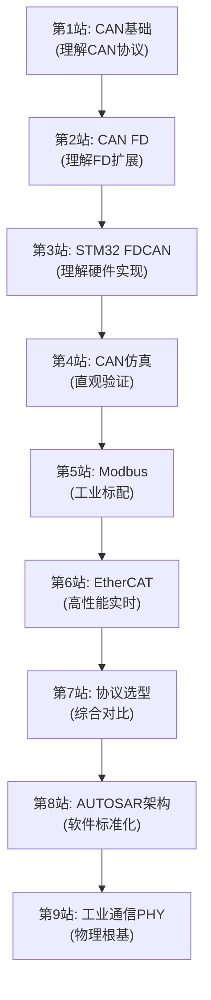

# 📡 工业通信协议学习路径

> **核心理念**：从通信协议理解电控系统的信息交互，建立"协议选型决定系统架构"的认知

---

## 学习路径总览

---

## 模块列表

| 编号 | 模块 | 核心问题 | 难度 |
|------|------|---------|------|
| COM-01 | [CAN总线基础](./COM-01-CAN-Basics.md) | CAN为什么能成为电机控制的通信标配？ | ★★★☆☆ |
| COM-02 | [CAN FD扩展](./COM-02-CAN-FD.md) | CAN FD如何突破8字节和波特率瓶颈？ | ★★★★☆ |
| COM-03 | [STM32 FDCAN实现](./COM-03-CAN-STM32.md) | STM32 FDCAN外设如何配置和使用？ | ★★★★☆ |
| COM-04 | [CAN通信仿真](./COM-04-CAN-Simulation.md) | 如何直观理解CAN底层机制？ | ★★★☆☆ |
| COM-05 | [Modbus协议](./COM-05-Modbus.md) | Modbus如何实现电机驱动器参数配置？ | ★★★☆☆ |
| COM-06 | [EtherCAT协议](./COM-06-EtherCAT.md) | EtherCAT如何实现μs级实时通信？ | ★★★★★ |
| COM-07 | [协议选型对比](./COM-07-Protocol-Compare.md) | 如何根据应用场景选择通信协议？ | ★★★☆☆ |
| COM-08 | [AUTOSAR架构与电机控制](./COM-08-AUTOSAR-Architecture.md) | AUTOSAR如何将电机控制软件标准化分层？ | ★★★★☆ |
| COM-09 | [工业通信物理层PHY](./COM-09-Industrial-PHY.md) | 通信可靠性的物理根基——隔离、防护、信号完整性 | ★★★★☆ |

---

## 学习建议

### 零通信基础入门路线
1. 先学COM-01（CAN基础），理解工业通信最核心的协议
2. 再学COM-02（CAN FD），掌握CAN协议的现代扩展
3. 学COM-03（STM32 FDCAN），将协议知识落地到硬件实现
4. 学COM-04（CAN仿真），通过仿真工具直观验证协议行为
5. 学COM-05（Modbus），掌握工业自动化另一大标配协议

### 有通信基础进阶路线
1. 直接从COM-06（EtherCAT）开始，深入理解高性能实时以太网
2. 学COM-07（协议选型），建立系统级协议对比能力
3. 学COM-08（AUTOSAR），理解汽车电子软件标准化架构
4. 学COM-09（工业PHY），掌握通信可靠性的物理层根基

### 每个模块的学习方法
1. 先读"核心摘要"或"概述"，快速把握要点
2. 精读技术原理，理解协议机制和设计思想
3. 结合硬件实践，在真实MCU上配置通信外设
4. 使用仿真/抓包工具验证通信行为
5. 对比不同协议的适用场景，建立选型判断力

---

## 文档信息
- 知识体系：电控知识库 / 工业通信协议
- 模块总数：9（COM-01 ~ COM-09）
- 覆盖范围：CAN/CAN FD + Modbus + EtherCAT + AUTOSAR + PHY
- 更新日期：2026-06-01
