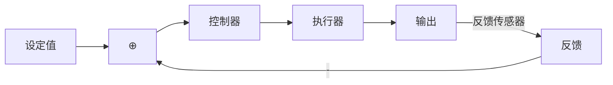
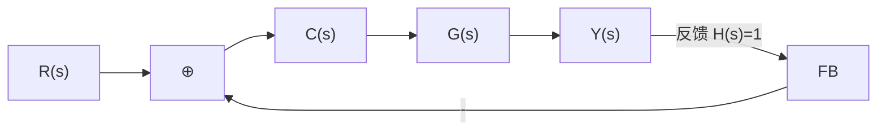
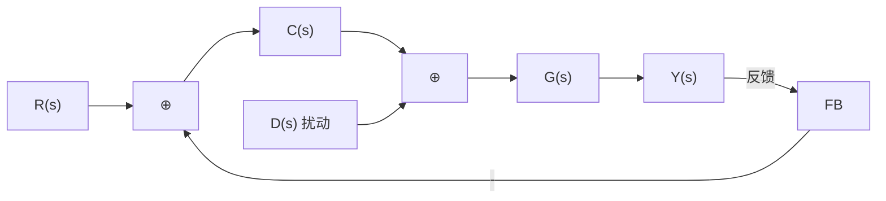
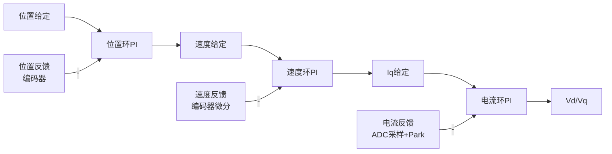
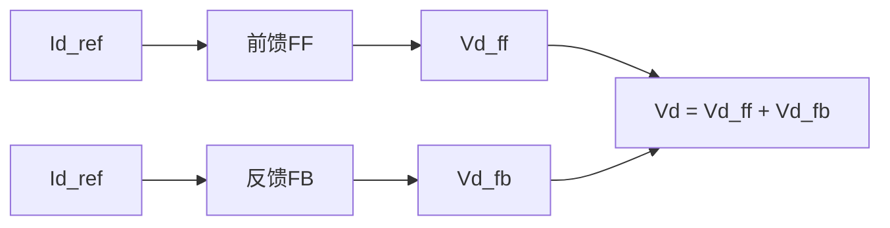

# CT-01: 开环与闭环控制系统

**副标题：从开环V/f控制到闭环FOC——理解反馈如何改变电机控制的一切**
**难度：**  入门级
**适用对象：** 电机控制工程师、自动化工程师、嵌入式开发者
**前置知识：** 拉普拉斯变换基础、传递函数概念、PMSM基本工作原理

---

## 1.  核心摘要

**一句话讲清楚**：开环系统直接按预设指令执行而不关心实际输出，闭环系统则实时测量输出并与期望值比较后修正——这正是V/f开环驱动与FOC闭环电流/速度控制之间的本质区别：前者对负载扰动和参数变化无能为力，后者通过反馈实现了鲁棒性。

**认知挂钩**：很多从方波驱动转到FOC的工程师会问：「我都给了电压，转速为什么不按公式走？」**答案就在这里**——开环控制的输出完全依赖于被控对象模型（电机的转矩常数、转矩-转速关系）的准确性，一旦负载变化或参数偏差，输出便偏离预期。而闭环FOC通过实时检测电流，将偏差送入PI调节器，自动补偿所有不确定性。

**与FOC算法的关联**：
-  **电流环**：FOC核心中的核心——闭环电流环保证了Id、Iq精确跟踪给定值，这是开环电压控制永远做不到的
-  **速度环**：在电流环外层的闭环速度环，对外部负载扰动具有天然免疫力
-  **位置环**：最高层闭环，使电机精确停在目标角度，适合伺服应用

---

## 2.  问题引入

### 工程师的真实困惑

**场景1：开环V/f驱动低速抖动**
```text
工程师A:"我用V/f控制驱动一台PMSM，中高速还行，但一降到100rpm以下就剧烈抖动..."
问题现象:
- 给定电压频率10Hz，理论上转速300rpm(4极电机)
- 实际转速波动±50rpm
- 电流不稳定，电机发热
- 无法带载启动
```

**场景2：电流环震荡**
```text
工程师B:"FOC电流环调了好久还是震荡，是不是闭环结构有问题？"
问题现象:
- Id电流在0附近±2A震荡
- Iq电流响应滞后，超调大
- 速度环无法正常工作
```

**场景3：速度环外扰敏感**
```text
工程师C:"加了负载后速度掉得很厉害，不加负载又超调..."
问题现象:
- 空载速度稳定，加载后转速下降15%
- 突加负载时恢复时间>500ms
- 超调最严重时达30%
```

### 核心问题

这些问题归根结底是**开环 vs 闭环**的问题：
- V/f低速抖动 → 开环对电阻压降和反电动势估计不准，低速时误差占比大
- 电流环震荡 → 闭环参数（PI增益）与系统模型不匹配
- 速度环外扰敏感 → 闭环带宽不够，对外扰的抑制能力不足

### 学习目标

读完本模块，你将能够：
 **区分开环与闭环系统**，理解各自适用场景
 **掌握传递函数框图化简**方法
 **理解灵敏度函数**，量化参数摄动对输出的影响
 **建立FOC各级闭环的直觉**——电流环、速度环、位置环各自解决了什么问题

---

## 3.  直观理解

### 类比1：开环 = 盲人开车

**生活场景**：想象你闭着眼睛开车，心里默数「1、2、3...10秒后该转弯了」。这就是**开环**——你只按预设计划执行，不管车子实际位置。


**电机对应**：V/f控制给定电压幅值和频率，但不知道电机实际转速。

### 类比2：闭环 = 看着路标开车

**生活场景**：睁开眼睛开车，不断观察路况，偏离车道就修正。



**电机对应**：FOC通过电流传感器实时测量三相电流，Park变换得到Id、Iq，与给定值比较，PI调节器输出修正电压。

| 特性 | V/f开环 | FOC闭环 |
|------|---------|---------|
| 电流跟踪精度 | 不可控 | ±0.5%以内 |
| 低速性能 | 差（<10%额定转速难运行） | 优秀（零速满转矩） |
| 负载响应 | 转速跌落大 | 跌落小，恢复快 |
| 参数敏感度 | 极高 | 低（闭环鲁棒） |
| 复杂度 | 简单 | 复杂 |

### 类比3：闭环灵敏度——精密天平

**生活场景**：老式杆秤是开环——砝码放上去就看读数；电子天平是闭环——内部力反馈传感器持续测量偏差，自动补偿。

杆秤：读数完全依赖杠杆比例精度 → 参数敏感
电子天平：读数通过反馈修正 → 参数不敏感

---

## 4.  技术原理

### 4.1 系统框图基础

**开环系统框图**：


传递函数：$T_{open}(s) = C(s)G(s)$

**闭环系统框图**（单位反馈）：



闭环传递函数：$T_{close}(s) = \frac{C(s)G(s)}{1 + C(s)G(s)}$

记开环传递函数 $L(s) = C(s)G(s)$，则：

$$T_{close}(s) = \frac{L(s)}{1 + L(s)}$$

### 4.2 开环传递函数的物理含义

在FOC电流环中，开环传递函数 $L(s)$ 包含了：
- PI控制器：$C(s) = K_p + \frac{K_i}{s} = K_p \frac{s + (K_i/K_p)}{s}$
- 电机电气模型：$G(s) = \frac{1}{R_s + L_s s} = \frac{1/R_s}{1 + (L_s/R_s)s}$

因此：

$$L(s) = \left(K_p + \frac{K_i}{s}\right) \cdot \frac{1}{R_s + L_s s}$$

当采用零极点对消 $(K_i/K_p = R_s/L_s)$ 时：

$$L(s) = \frac{K_p}{L_s s} = \frac{\omega_c}{s}$$

其中 $\omega_c = K_p / L_s$ 为电流环带宽。

### 4.3 灵敏度函数——闭环如何抑制参数变化

定义灵敏度函数 $S(s)$：输出对参数变化的敏感程度。

$$S(s) = \frac{1}{1 + L(s)}$$

**互补灵敏度函数** $T(s)$：

$$T(s) = \frac{L(s)}{1 + L(s)} = 1 - S(s)$$

**关键关系**：$S(s) + T(s) = 1$

**物理意义**：
- $|S(j\omega)| \ll 1$（低频区）：闭环对参数变化不敏感，鲁棒性好
- $|S(j\omega)| \approx 1$（高频区）：闭环退化为开环，无抑制能力
- $|T(j\omega)| \approx 1$（低频区）：输出能跟踪设定值
- $|T(j\omega)| \ll 1$（高频区）：设定值高频分量被衰减

**手推计算示例**（电流环）：
```text
设 ωc = 1000 rad/s（电流环带宽约160Hz）
L(jω) = 1000/(jω)

在 ω = 100 rad/s 处：
|L| = 1000/100 = 10（开环增益20dB）
|S| = 1/|1+L| ≈ 1/10 = 0.1 = -20dB
→ 参数变化的影响被衰减到原来的10%

在 ω = 10000 rad/s 处：
|L| = 1000/10000 = 0.1
|S| = 1/|1+0.1j| ≈ 0.995 ≈ 0dB
→ 闭环几乎无抑制能力
```

### 4.4 扰动抑制

带扰动的闭环系统框图：



扰动到输出的传递函数：

$$\frac{Y(s)}{D(s)} = \frac{G(s)}{1 + C(s)G(s)} = G(s) \cdot S(s)$$

**关键结论**：闭环将扰动的影响衰减了 $|1 + L(j\omega)|$ 倍。

**电机控制中的典型扰动**：
- **负载转矩扰动 $T_L$**：通过速度闭环抑制
- **反电动势扰动 $\omega_e \psi_f$**：通过电流闭环 + 前馈解耦抑制
- **母线电压波动**：通过电压前馈 + 电流闭环抑制

### 4.5 开环V/f vs 闭环FOC——数学对比

**开环V/f控制**：

$$
\begin{cases}
V_{out} = V_0 + K_v \cdot f_{ref} \\
\theta_{out} = \int 2\pi f_{ref} \, dt
\end{cases}
$$

问题：
- 低速时 $V_0$（IR补偿）不准 → 电流不可控
- $f_{ref}$ 不等于实际电频率 → 失步风险
- 无法控制Id=0 → 转矩效率低

**闭环FOC电流控制**：

$$
\begin{cases}
V_d = (K_p + \frac{K_i}{s})(i_d^{ref} - i_d) - \omega_e L_q i_q \\
V_q = (K_p + \frac{K_i}{s})(i_q^{ref} - i_q) + \omega_e(L_d i_d + \psi_f)
\end{cases}
$$

优势：
- 电流闭环 → 自动补偿电阻压降和电感效应
- dq解耦 → Id/Iq独立控制
- 零速满转矩 → 低速性能卓越

---

## 5.  交叉视角

### 5.1 FOC中的三级闭环层级



| 层级 | 被控量 | 反馈传感器 | 典型带宽 | 开环/闭环选择 |
|------|--------|-----------|---------|-------------|
| 电流环 | Id, Iq | 电流传感器+Park变换 | 1000-3000 rad/s | 必须闭环 |
| 速度环 | ωm | 编码器/霍尔 | 电流环的1/5~1/10 | 必须闭环（伺服） |
| 位置环 | θm | 编码器 | 速度环的1/5~1/10 | 必须闭环（伺服） |

**设计原则**：内环带宽约为外环的5~10倍，保证外环设计时可将内环近似为增益为1的一阶环节。

### 5.2 电流环——为什么不能开环？

**开环电流控制的失效**：
```text
给定 Iq_ref = 10A
开环：Vq = Rs × 10 + ωe × ψf（估计值）
如果 Rs 估计偏差20%，或 ψf 随温度变化10%
→ 实际 Iq ≠ 10A，误差无法消除
```

**闭环电流控制**：
```text
给定 Iq_ref = 10A
测量 Iq = Park(ia, ib, ic, θe) = 9.2A
误差 e = 10 - 9.2 = 0.8A
→ PI积分累积 → Vq增大 → Iq回到10A
```

**低速失效的根本原因**：
- 低速时 $\omega_e \psi_f$ 项（反电动势）很小
- 电阻压降 $R_s i_q$ 占主导
- 电阻温漂（可达30%）导致电压估计误差大
- 开环无法补偿此误差
- 闭环：PI积分自动补偿

---

## 6.  工程案例

### 案例1：V/f驱动升级为FOC——低速性能对比

**项目背景**：
```text
应用：工业风扇驱动
原方案：V/f开环控制，最低转速300rpm
新方案：FOC闭环电流+速度控制
目标：最低转速降至50rpm，转矩脉动<5%
```

**诊断过程**：
- V/f在300rpm以下出现电流失控，相电流峰值波动±50%
- 原因：300rpm时电频率10Hz，反电动势仅约10V，电阻压降15V占主导；电阻温漂30%→电压估计误差4.5V→电流误差30%

**FOC改造效果**：
```text
转速(rpm) | V/f转矩脉动 | FOC转矩脉动
   300    |    ±8%      |   ±2%
   150    |   失控       |   ±3%
    50    |   无法运行   |   ±4%
```

**经验总结**：对于需要低速运行的场合，闭环电流控制是必需的。

### 案例2：速度环带宽不足的外扰响应

**项目背景**：
```text
应用：AGV驱动轮
电机参数：P=5, Rs=0.2Ω, Ls=1.5mH, J=0.01 kg·m²
速度环带宽：15 rad/s (约2.4Hz)
问题：过减速带时转速跌落超20%，恢复时间>300ms
```

**分析**：
速度环灵敏度函数 $S(s)$ 在扰动频率处增益过高（接近0dB），无法抑制负载扰动。

**解决**：
- 提高速度环带宽至30 rad/s
- 增加加速度前馈
- 恢复时间降至120ms，跌落<10%

### 案例3：电流环采样延迟的开环效应

**背景**：
```text
应用：高速电主轴
采样频率：16kHz (Ts=62.5μs)
电流环带宽设计：ωc=2000 rad/s (318Hz)
问题：高速时电流环震荡
```

**根因分析**：
数字控制中有一拍计算延迟（约Ts），等效于开环传递函数中增加一个延迟环节 $e^{-sT_s}$。当 $\omega_c T_s$ 较大时（如2000×62.5μs=0.125 rad），相位滞后约7.2°，相位裕度被吃掉。

**解决**：采用角度前向补偿（在Park变换中补偿一个采样周期的角度）、降低电流环带宽或采用无差拍控制。

---

## 7.  实践练习

### 练习1：计算题——灵敏度函数

```text
已知电流环开环传递函数 L(s) = 1000/s：
1. 计算 ω=100 rad/s 时的 |S(jω)| 和 |T(jω)|
2. 如果电感参数偏差50%，开环增益降低50%（L'(s)=500/s），
   求 ω=100 rad/s 时的 |S'(jω)|，说明闭环鲁棒性损失

参考答案：
1. L(j100)=1000/(j100)=10/j=-10j, |L|=10
   |S|=1/|1+L|≈1/10=0.1 (-20dB)，|T|=|L|/|1+L|≈10/10=1
2. L'(j100)=500/(j100)=5/j, |L'|=5
   |S'|=1/|1+L'|≈1/5=0.2 (-14dB)，抑制能力从20dB降到14dB
   →电感偏差→PI参数不准→开环增益下降→灵敏度增大
```

### 练习2：设计题——电流环闭环需求分析

```text
一台PMSM参数：Rs=0.3Ω, Ls=2mH, ψf=0.08Wb, P=4
要求在0~3000rpm全范围内Id误差<5%，Iq误差<3%
分析：能否使用开环V/f控制？如果不能，电流环带宽应设计多少？

参考答案：
不能开环。低速时电阻压降主导（Rs×Iq≈3V），反电动势仅ψf×ωe≈2.5V(100rpm时)，
电阻温漂30%→电压误差0.9V→占低速输出电压~15%→电流误差超25%，远超5%要求。

电流环带宽设计：最高电频率ωe_max = 4×2π×3000/60 = 1257 rad/s，
按ωc ≥ 5×ωe_max ≈ 6300 rad/s，但受限于开关频率（通常16kHz），
实际ωc≈1500 rad/s。
```

### 练习3：诊断题——开环到闭环的迁移

```text
既有的V/f驱动系统参数：Rated V=220V, Rated f=50Hz, P=2
计划升级为FOC，列出从开环到闭环需要增加的全部硬件和软件模块

参考答案：
硬件增加：电流传感器（2个或3个）、电流采样电路（运放+ADC）
软件增加：Clarke/Park变换、电流PI控制器、解耦前馈、角度观测器（编码器或传感器）
```

---

## 8.  前沿拓展

### 8.1 自抗扰控制（ADRC）

韩京清研究员提出的ADRC将「内扰+外扰」统一视为「总扰动」，通过扩张状态观测器（ESO）实时估计并补偿，等价于将任一系统改造为积分串联型（开环增益为1/s²），然后用简单PD控制。

在电机控制中：ADRC可以在电机参数未知的情况下实现与FOC+PI相当的动态性能。

### 8.2 二自由度控制（2-DOF）

传统一自由度控制（只靠反馈）在「设定值跟踪」和「扰动抑制」之间存在折中。二自由度控制分别设计前馈控制器（优化跟踪）和反馈控制器（优化抗扰），可单独调节。



### 8.3 无模型自适应控制（MFAC）

完全不依赖电机数学模型，仅利用I/O数据在线估计伪偏导数（PPD），在电机参数完全未知或时变严重时具有吸引力。

---

**文档信息**：
- 模块编号：CT-01
- 知识体系：控制理论基础
- 模块名称：开环与闭环控制系统
- 算法关联：V/f开环→FOC闭环、灵敏度→电流环鲁棒性、带宽层级设计

>  检验你的理解：[CT-01 检验题目](./CT-01-assessment.md)
