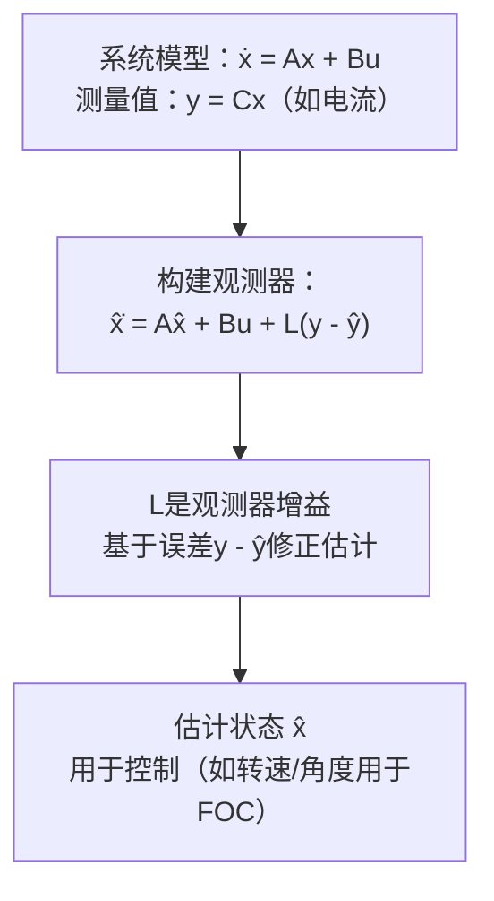

# CT-11: 观测器设计

**副标题：看不见的状态，算出来——从Luenberger到EKF的无传感器之路**
**难度：**  专家级
**适用对象：** 伺服驱动工程师、无传感器控制开发者
**前置知识：** 状态空间方程、线性代数、概率论基础、Kalman滤波

---

## 1.  核心摘要

**一句话：** 观测器是根据可测量的输入输出信号，实时估计系统不可测内部状态（如电机转速/角度）的数学算法，是无传感器FOC控制的核心技术——替代机械编码器，用软件"算"出转子位置。

**认知挂钩：** 编码器是"用眼睛看"转子位置；观测器是"用大脑推算"转子位置。就像你闭着眼睛跑步，通过感受加速度和步伐节奏来推断自己的速度和位置——观测器做的事本质上就是"用模型+测量来推断看不见的状态"。

**核心流程：**


**三种主流观测器对比：**
| 观测器 | 原理 | 优势 | 劣势 | 电机应用 |
| --- | --- | --- | --- | --- |
| Luenberger | 极点配置-误差反馈 | 简单、确定性 | 需要线性模型 | 中高速反电动势法 |
| SMO | 滑模-开关切换 | 鲁棒性强、参数不敏感 | 抖振 | 宽速域无传感器 |
| EKF | 概率-预测校正 | 处理噪声最优 | 计算量大、需调Q/R | 全速域最优估计 |

---

## 2.  问题引入

**场景：** 你要为一台成本敏感的风机驱动器做无传感器FOC。电机只有三相电流传感器和母线电压传感器——没有编码器、没有Hall传感器。你知道PMSM的dq电压方程中包含了反电动势项 ωe·ψf——理论上反电动势包含了转速信息，但从"包含"到"提取"还有很长的路。

**问题链：**
1. 如何从噪声严重的电流测量中提取转速和角度？
2. 零速和极低速时反电动势为零——此时怎么办？
3. 电机参数不准（L, R, ψf有误差）时，估计会差多少？

**答案就是观测器设计。** 不同的观测器用不同的数学工具回答这些问题。

---

## 3.  直观理解

### 3.1 观测器的核心思想

你有一个系统模型和一个"仿真器"：

- **真实系统：** ẋ = Ax + Bu（你看不到全部x）
- **模型仿真器：** x̂̇ = Ax̂ + Bu（模型在脑子里跑）

如果模型完美且初始状态准确，x̂ = x——不需要观测器。

但现实是：
- 模型有误差（参数不准）
- 初始状态未知
- 有噪声

所以需要"纠错机制"：

$$
\dot{\hat{\mathbf{x}}} = \mathbf{A}\hat{\mathbf{x}} + \mathbf{B}\mathbf{u} + \underbrace{\mathbf{L}(\mathbf{y} - \hat{\mathbf{y}})}_{\text{纠错项}}
$$

纠错项的含义：当模型预测的输出 ŷ = Cx̂ 与实际测量 y 不同时，用这个差异来修正状态估计。**L 矩阵决定了"相信模型多一些还是相信测量多一些"。**

### 3.2 Luenberger观测器的直观类比

Luenberger观测器 = 一个"带修正的仿真器"。

误差动力学：

$$
\mathbf{e} = \mathbf{x} - \hat{\mathbf{x}}, \quad \dot{\mathbf{e}} = (\mathbf{A} - \mathbf{L}\mathbf{C})\mathbf{e}
$$

如果 (A-LC) 的特征值都在左半平面 → e→0 → 估计收敛到真实值。

**L 的设计 = 极点配置**：选择 A-LC 的特征值，使观测器比控制器快 2~5 倍。

### 3.3 Kalman滤波的直观类比

Kalman滤波器 = "概率版的Luenberger观测器"。

- Luenberger：L是固定的（确定性）
- Kalman：L是动态计算的（基于噪声统计特性）

Kalman在两个不确定性之间做最优权衡：
- 模型不确定性（过程噪声）→ 更相信测量
- 测量不确定性（测量噪声）→ 更相信模型

---

## 4.  技术原理

### 4.1 Luenberger全维观测器

#### 4.1.1 结构

$$
\dot{\hat{\mathbf{x}}} = \mathbf{A}\hat{\mathbf{x}} + \mathbf{B}\mathbf{u} + \mathbf{L}(\mathbf{y} - \mathbf{C}\hat{\mathbf{x}})
$$

**误差动力学：**

$$
\dot{\mathbf{e}} = (\mathbf{A} - \mathbf{L}\mathbf{C})\mathbf{e}
$$

#### 4.1.2 增益设计（对偶原理）

观测器设计 = (Aᵀ, Cᵀ) 的状态反馈设计 → 对偶原理。

步骤：
1. 将 (A, C) 转化为对偶系统 (Aᵀ, Cᵀ)
2. 为 (Aᵀ, Cᵀ) 设计状态反馈 K_dual（用极点配置/Ackermann公式）
3. 观测器增益：L = K_dualᵀ

#### 4.1.3 极点选择准则

观测器极点应比控制器极点快 2~5 倍：
- 太快 → 放大测量噪声 → 估计抖动
- 太慢 → 估计滞后 → 控制器用"过时"的状态

**电机经验：** 电流环带宽 1kHz → 观测器带宽 3~5kHz。

#### 4.1.4 PMSM反电动势Luenberger观测器

**状态：** x = [iα, iβ, eα, eβ]ᵀ（αβ坐标系）

其中 eα, eβ 是反电动势，包含转速和角度信息：

$$
e_\alpha = -\psi_f \omega_e \sin\theta_e, \quad e_\beta = \psi_f \omega_e \cos\theta_e
$$

**状态方程（连续时间）：**

$$
\frac{d}{dt}\begin{bmatrix} i_\alpha \\ i_\beta \\ e_\alpha \\ e_\beta \end{bmatrix} = 
\begin{bmatrix} -R/L & 0 & -1/L & 0 \\ 0 & -R/L & 0 & -1/L \\ 0 & 0 & 0 & -\omega_e \\ 0 & 0 & \omega_e & 0 \end{bmatrix}
\begin{bmatrix} i_\alpha \\ i_\beta \\ e_\alpha \\ e_\beta \end{bmatrix} + 
\begin{bmatrix} 1/L & 0 \\ 0 & 1/L \\ 0 & 0 \\ 0 & 0 \end{bmatrix}
\begin{bmatrix} u_\alpha \\ u_\beta \end{bmatrix}
$$

**角度提取：**

$$
\hat{\theta}_e = \arctan2(-\hat{e}_\alpha, \hat{e}_\beta)
$$

**转速提取：**

$$
\hat{\omega}_e = \frac{\sqrt{\hat{e}_\alpha^2 + \hat{e}_\beta^2}}{\psi_f}
$$

### 4.2 降维观测器

全维观测器估计所有状态，但有些状态已经测量得到（如电流）。降维观测器只估计不可测状态（如反电动势）。

**结构：** 将状态分为 x₁（可测，如电流）和 x₂（不可测，如反电动势）

然后只对 x₂ 设计观测器，维数更低，计算更快。

### 4.3 滑模观测器（Sliding Mode Observer, SMO）

#### 4.3.1 核心思想

用符号函数 sign() 代替线性误差反馈：

$$
\dot{\hat{\mathbf{x}}} = \mathbf{A}\hat{\mathbf{x}} + \mathbf{B}\mathbf{u} + \mathbf{K} \cdot \text{sign}(\mathbf{y} - \hat{\mathbf{y}})
$$

sign 函数产生"开关"行为——强迫估计误差在有限时间内收敛到零（滑模面），然后沿滑模面滑动。

#### 4.3.2 PMSM SMO（电流误差为滑模面）

定义滑模面：s = îαβ - iαβ = 0

观测器：

$$
\begin{cases}
\dot{\hat{i}}_\alpha = -\frac{R}{L}\hat{i}_\alpha + \frac{1}{L}u_\alpha - \frac{k}{L}\text{sign}(\hat{i}_\alpha - i_\alpha) \\
\dot{\hat{i}}_\beta = -\frac{R}{L}\hat{i}_\beta + \frac{1}{L}u_\beta - \frac{k}{L}\text{sign}(\hat{i}_\beta - i_\beta)
\end{cases}
$$

当滑模发生时（î=i），等效控制信号包含反电动势信息：

$$
z_\alpha^{eq} = k \cdot \text{sign}(\tilde{i}_\alpha) = e_\alpha, \quad z_\beta^{eq} = k \cdot \text{sign}(\tilde{i}_\beta) = e_\beta
$$

低通滤波提取平滑反电动势：

$$
\hat{e}_{\alpha,LPF} = \frac{\omega_c}{s + \omega_c} z_\alpha^{eq}
$$

**SMO优势：**
- 对参数变化鲁棒（L, R误差影响小）
- 收敛速度快
- 在MC_LIB等商业库中广泛使用

**SMO挑战：**
- sign函数产生抖振（chattering）
- 需要低通滤波 → 相位滞后 → 角度补偿
- 低速性能受限（反电动势太小）

#### 4.3.3 改进SMO

**Sigmoid函数替代sign：**

$$
\text{sigmoid}(s) = \frac{2}{1+e^{-as}} - 1
$$

连续函数，减弱抖振，但收敛稍慢。

### 4.4 扩展Kalman滤波器（EKF）

#### 4.4.1 Kalman滤波基本框架

**离散时间系统：**

$$
\begin{cases}
\mathbf{x}_{k} = \mathbf{F}\mathbf{x}_{k-1} + \mathbf{B}\mathbf{u}_{k-1} + \mathbf{w}_{k-1} \\
\mathbf{y}_{k} = \mathbf{H}\mathbf{x}_{k} + \mathbf{v}_{k}
\end{cases}
$$

- w ~ N(0, Q)：过程噪声（模型不确定性）
- v ~ N(0, R)：测量噪声（传感器噪声）

**Kalman滤波两步法：**

**预测（先验）：**
$$
\hat{\mathbf{x}}_{k|k-1} = \mathbf{F}\hat{\mathbf{x}}_{k-1} + \mathbf{B}\mathbf{u}_{k-1}
$$
$$
\mathbf{P}_{k|k-1} = \mathbf{F}\mathbf{P}_{k-1}\mathbf{F}^T + \mathbf{Q}
$$

**校正（后验）：**
$$
\mathbf{K}_k = \mathbf{P}_{k|k-1}\mathbf{H}^T(\mathbf{H}\mathbf{P}_{k|k-1}\mathbf{H}^T + \mathbf{R})^{-1}
$$
$$
\hat{\mathbf{x}}_{k} = \hat{\mathbf{x}}_{k|k-1} + \mathbf{K}_k(\mathbf{y}_k - \mathbf{H}\hat{\mathbf{x}}_{k|k-1})
$$
$$
\mathbf{P}_{k} = (\mathbf{I} - \mathbf{K}_k\mathbf{H})\mathbf{P}_{k|k-1}
$$

#### 4.4.2 EKF for PMSM

PMSM是非线性的 → 需要EKF（在每步线性化）。

**状态向量：** $\mathbf{x} = [i_d, i_q, \omega_m, \theta_e]^T$

**非线性状态方程：**

$$
\mathbf{f}(\mathbf{x}, \mathbf{u}) = \begin{bmatrix}
(-R i_d + p\omega_m L i_q + u_d)/L \\
(-R i_q - p\omega_m(L i_d + \psi_f) + u_q)/L \\
(1.5p\psi_f i_q - B\omega_m)/J \\
p\omega_m
\end{bmatrix}
$$

**线性化（Jacobian矩阵）：**

$$
\mathbf{F}_k = \left.\frac{\partial \mathbf{f}}{\partial \mathbf{x}}\right|_{\hat{\mathbf{x}}_{k-1}} = \begin{bmatrix}
-R/L & p\hat{\omega}_m & p\hat{i}_q & 0 \\
-p\hat{\omega}_m & -R/L & -p(\hat{i}_d + \psi_f/L) & 0 \\
0 & 1.5p\psi_f/J & -B/J & 0 \\
0 & 0 & p & 0
\end{bmatrix}
$$

#### 4.4.3 EKF实现伪代码

```c
void ekf_pmsm_predict(float x[4], float P[16], float u[2], float dt) {
    // 非线性预测
    float xp[4];
    xp[0] = x[0] + dt * ((-R*x[0] + p*x[2]*L*x[1] + u[0]) / L);
    xp[1] = x[1] + dt * ((-R*x[1] - p*x[2]*(L*x[0]+psi_f) + u[1]) / L);
    xp[2] = x[2] + dt * ((1.5f*p*psi_f*x[1] - B*x[2]) / J);
    xp[3] = x[3] + dt * p * x[2];
    
    // 线性化F矩阵
    float F[16] = { /* Jacobian */ };
    
    // P = F*P*F' + Q
    mat_mul_4x4(F, P, tmp);
    mat_mul_4x4_t(tmp, F, P);
    mat_add_4x4(P, Q);
    
    memcpy(x, xp, 16);
}

void ekf_pmsm_update(float x[4], float P[16], float y[2]) {
    float H[8] = {1,0,0,0, 0,1,0,0};  // 测量id,iq
    float S[4], K[8];
    
    // S = H*P*H' + R
    // K = P*H'*inv(S)
    mat_kalman_gain(P, H, R, K);
    
    // x = x + K*(y - H*x)
    float innov[2] = {y[0] - x[0], y[1] - x[1]};
    x[0] += K[0]*innov[0] + K[1]*innov[1];
    // ... (all 4 states)
    
    // P = (I - K*H)*P
    mat_update_covariance(P, K, H);
}
```

#### 4.4.4 EKF调参（Q和R矩阵）

| 参数 | 含义 | 增大效果 | 电机典型值 |
| --- | --- | --- | --- |
| Q₁₁ | id模型噪声 | 更相信测量 | ~0.01 |
| Q₃₃ | ωm模型噪声 | 转速估计更快响应 | ~10 |
| Q₄₄ | θe模型噪声 | 角度更灵活 | ~0.1 |
| R₁₁ | id测量噪声 | 更相信模型 | ~0.001 |
| R₂₂ | iq测量噪声 | 更相信模型 | ~0.001 |

**调参原则：**
- R反映传感器噪声 → 从ADC噪声水平估计
- Q反映模型不准确性 → Q大=更相信测量=快速但噪声大
- 转速估计响应速度主要由Q₃₃控制

---

## 5.  交叉视角：观测器与电机控制的桥梁

### 5.1 无传感器启动策略

EKF在零速时理论上无法收敛（因反电动势为零，能观性丧失）。实际策略：

**阶段1（零速~5%额定转速）：** 开环IF控制（电流-频率控制）或高频注入
**阶段2（5%~15%）：** EKF/SMO开始收敛，逐步切换到闭环
**阶段3（>15%）：** 全闭环无传感器FOC

切换过程需要平滑过渡（fade-in/fade-out）。

### 5.2 观测器带宽与电流环带宽的关系

观测器估计的状态（特别是θe）用于Park变换。如果观测器滞后于实际角度 → Park变换角度误差 → dq轴耦合 → 转矩脉动。

**设计准则：** 观测器带宽 ≥ 5 × 电流环带宽。

例如电流环1kHz → 观测器带宽 ≥ 5kHz → 观测器极点实部 σobs ≥ 5000 → 观测器时间常数 τobs ≤ 0.2ms。

### 5.3 参数鲁棒性对比

**参数敏感性分析（对L变化±30%）：**
- Luenberger：角度估计偏差 ~5°~10°（线性反馈对参数敏感）
- SMO：角度估计偏差 ~2°~5°（滑模鲁棒性好）
- EKF：角度估计偏差 ~1°~3°（Q矩阵可吸收参数不确定性）

### 5.4 hpm_MC 工程实践

**观测器设计** (`hpm_mcl/inc/hpm_smc.h`, `hpm_mcl_v2/core/control/hpm_mcl_control.h`):
- SMC 滑模观测器: `mcl_control_smc_cfg_t` 配置 ksmc（滑模增益）、PLL kp/ki
- HFI 高频注入: `hpm_hfi_para_t` 配置注入电压幅值 vh、PLL 参数
- 编码器 PLL 观测器: `mcl_encoder_t` 内置 PLL 速度计算方法

**观测器选择策略**:
- 低速/零速: HFI（高频注入）
- 中高速: SMO（滑模观测器）
- 全速域: 混合控制（有感编码器 + 无感SMO 融合）

参考: [ALG-07-Sensorless-Observers.md](../algorithm/ALG-07-Sensorless-Observers.md) + [SDK-03-HPM-MC-v2-Detect.md](../algorithm/HPM-MC/SDK-03-HPM-MC-v2-Detect.md)

---

## 6.  工程案例

### 案例1：EKF实现无传感器PMSM FOC

**电机：** 24V, 4对极, L=0.3mH, R=0.1Ω, ψf=0.01Wb, J=1e-5kg·m²

**EKF配置：**
```c
// 初始协方差
P0 = diag([0.1, 0.1, 100, 1.0]);
// 过程噪声
Q = diag([0.01, 0.01, 50, 0.1]);
// 测量噪声（基于12位ADC，电流范围±10A）
R = diag([0.0001, 0.0001]);
```

**结果：**
- 500rpm以上：角度估计误差 < 3°电角度
- 200~500rpm：误差 3°~8°（反电动势信号弱）
- <200rpm：需要高频注入辅助

### 案例2：MC_LIB中的SMO实现分析

MC_LIB（如ST的Motor Control Library）中SMO的典型结构：
- 在αβ坐标系实现
- 使用sigmoid函数减轻抖振
- 低通滤波器截止频率随转速自适应调整
- 角度补偿（补偿LPF引入的相位滞后）

---

## 7.  实践练习

### 练习1：Luenberger观测器极点设计
给定PMSM参数，设计四阶反电动势Luenberger观测器。要求观测器带宽5倍于电流环带宽，计算增益矩阵L。

### 练习2：EKF调参对比
在同一电机平台上，分别用Q_diag=[0.01, 0.01, 10, 0.1]和Q_diag=[0.01, 0.01, 100, 0.1]运行EKF，对比转速估计的响应速度和噪声水平。

### 练习3：SMO vs EKF对比仿真
在MATLAB/Simulink中建立PMSM模型，对比SMO和EKF在阶跃转速指令下的跟踪性能。

---

## 8.  前沿拓展

### 8.1 无迹Kalman滤波（UKF）

EKF线性化引入截断误差（忽略高阶项）。UKF通过sigma点采样传播非线性变换，精度更高。对于高度非线性的PMSM，UKF可减少5~10%的估计误差。

代价：计算量约EKF的2~3倍（需传播2n+1个sigma点）。

### 8.2 自适应EKF/AEKF

在线估计Q和R矩阵：
- 基于新息（innovation）序列的统计特性自适应调整Q
- 基于电流传感器噪声水平在线调整R

在电机温度变化、传感器老化等场景下，自适应EKF比固定参数EKF更鲁棒。

### 8.3 深度学习辅助观测器

用神经网络补偿EKF的模型误差：
- EKF提供基准估计
- 神经网络学习EKF的残余误差模式
- 融合输出高精度估计

在电机参数高度非线性变化（如深度弱磁区电感骤变）的场景下有潜力。

### 8.4 多传感器融合

有传感器电机也可以使用观测器：
- 编码器（高精度但有延迟）+ EKF（低延迟但有噪声）→ 互补滤波 → 既快又准
- 加速度计 + 编码器 + 电流模型 → 多源融合 → 提高可靠性

---

## 关键公式速查表

| 名称 | 公式 | 说明 |
| --- | --- | --- |
| Luenberger观测器 | $\dot{\hat{\mathbf{x}}} = \mathbf{A}\hat{\mathbf{x}} + \mathbf{B}\mathbf{u} + \mathbf{L}(\mathbf{y} - \mathbf{C}\hat{\mathbf{x}})$ | 极点配置设计L |
| 误差动力学 | $\dot{\mathbf{e}} = (\mathbf{A} - \mathbf{L}\mathbf{C})\mathbf{e}$ | L使A-LC稳定 |
| SMO（电流） | $\dot{\hat{i}} = ... -\frac{k}{L}\text{sign}(\hat{i}-i)$ | 滑模切换项 |
| EKF预测 | $\hat{\mathbf{x}}_{k | k-1} = \mathbf{f}(\hat{\mathbf{x}}_{k-1}, \mathbf{u}_{k-1})$；非线性预测 |
| EKF协方差预测 | $\mathbf{P}_{k | k-1} = \mathbf{F}_k\mathbf{P}_{k-1}\mathbf{F}_k^T + \mathbf{Q}$；Jacobian F |
| Kalman增益 | $\mathbf{K}_k = \mathbf{P}_{k\lvert k-1}\mathbf{H}^T(\mathbf{H}\mathbf{P}_{k \rvertk-1}\mathbf{H}^T+\mathbf{R})^{-1}$ | 最优加权 |
| 角度提取(反电动势) | $\hat{\theta}_e = \arctan2(-\hat{e}_\alpha, \hat{e}_\beta)$ | 从SMO/Luenberger |

>  检验你的理解：[CT-11 检验题目](./CT-11-assessment.md)
