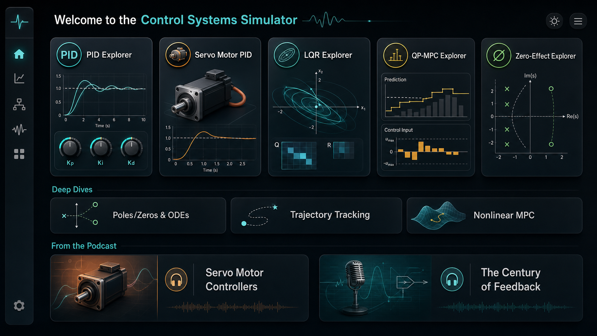
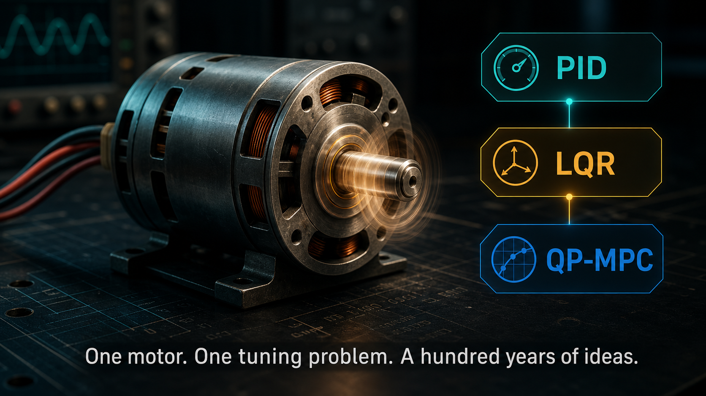
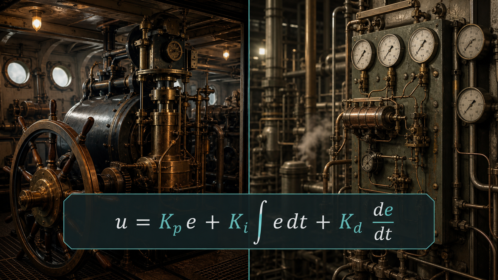
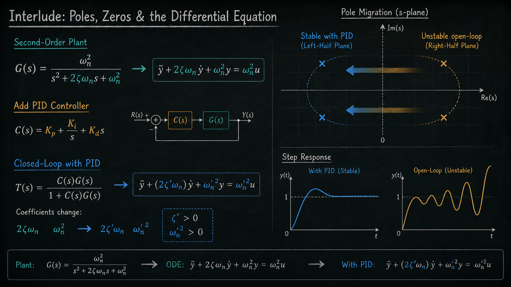
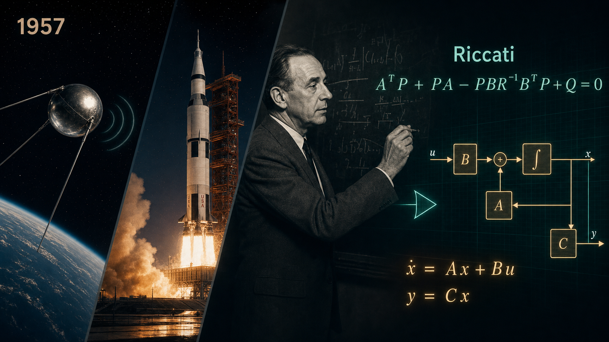
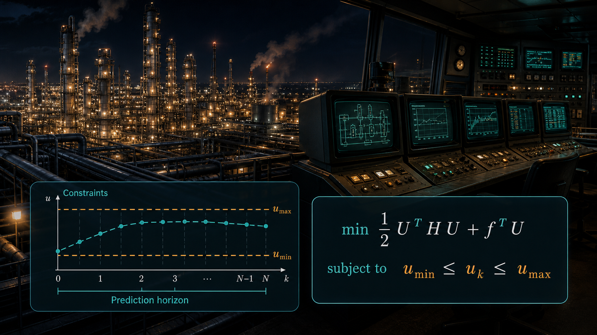
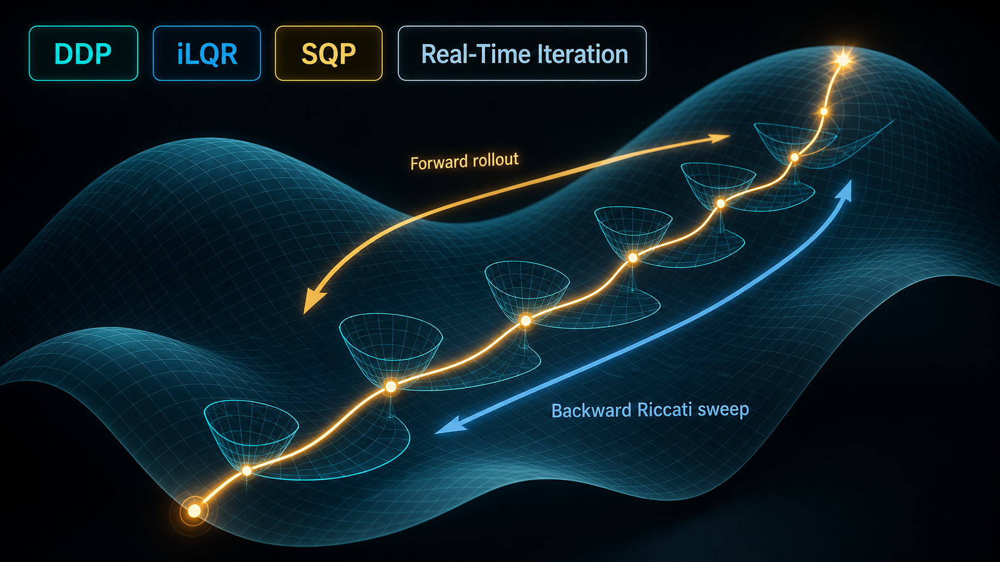
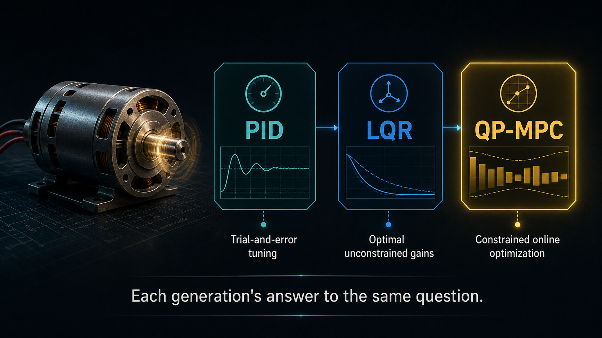
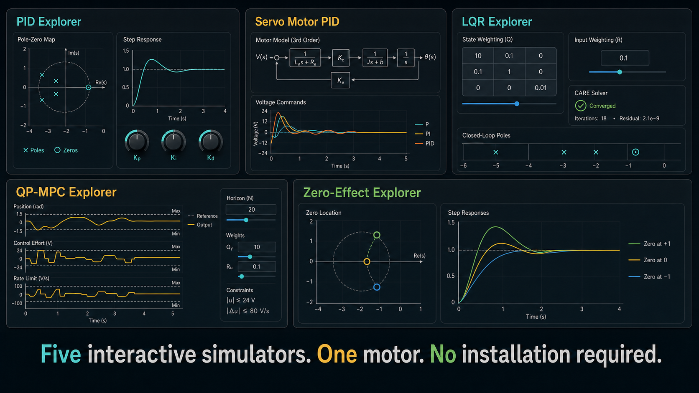

# CE-02: 伺服电机控制器——从PID、LQR到QP-MPC

**副标题：用一个直流电机伺服系统，串起一个世纪的控制理论演化史**
- **难度：**  进阶级
- **适用对象：** 电机控制工程师、自动化工程师、嵌入式开发者、控制理论学生
- **前置知识：** 无（但建议先学习CE-01建立历史背景）

---

## 1.  核心摘要

本文以一台直流电机伺服系统为线索，追溯从PID到LQR到QP-MPC再到非线性MPC的控制理论演化。与CE-01的历史叙事不同，本文更侧重技术细节：极点与零点如何通过微分方程塑造响应、LQR如何将"调参"替换为"声明代价函数让数学算出最优答案"、MPC如何将约束内建于优化而非事后打补丁、以及非线性MPC如何处理线性假设失效的真实动力学。全文配合五个交互式仿真器（PID Explorer、Servo Motor PID、LQR Explorer、QP-MPC Explorer、Zero-Effect Explorer）和三篇深度探索文章，构成一条从直觉到最优、从无约束到有约束、从线性到非线性的完整学习路径。

- **认知挂钩：** 从PID到LQR到MPC的跳跃，本质上是三个问题的递进——"什么误差修正感觉对？"→"什么控制策略在数学上最优？"→"在我的物理限制之内，我能做到的最好是什么？"而每一次跳跃，都伴随着数学工具的升级和计算能力的跃迁。理解这个递进，就理解了为什么你需要学三种方法，以及每种方法在什么场景下是正确答案。

---

## 分集大纲

| 镜头 | 章节 |
|------|------|
| 0 | 序幕 — 这个项目的使用指南 |
| 1 | 片头 — 那个伺服电机的问题 |
| 2 | 第一幕：PID（1910s–1940s）— 直觉变成数学 |
| 3 | 间奏 — 极点、零点与微分方程：连接直觉与最优性的数学桥梁 |
| 4 | 第二幕：状态空间与 LQR（1958–1960）— 太空竞赛重写控制理论 |
| 5 | 第三幕：MPC 与 QP-MPC（1970s–1990s）— 约束打破最优性，计算机来救场 |
| 6 | 超越线性 — 非线性 MPC 与当前的前沿 |
| 7 | 尾声 — 你桌上的那个电机 |
| 8 | 附录 — 一个电机，五种控制方式 |
| 9 | 参考文献与延伸阅读 |

---

## 镜头 0 — 序幕：这个项目的使用指南

- **画面：** 项目的欢迎页面——一张卡片网格。五个仿真器依次浮现：PID Explorer、Servo Motor PID、LQR Explorer、QP-MPC Explorer、Zero-Effect Explorer。然后一个"深度探索"书架滑入：极点/零点与常微分方程、轨迹跟踪、非线性MPC。最后两张播客封面："伺服电机控制器"和"反馈的世纪"。



---

- **旁白：**

在故事开始之前，先说一句你现在看的是什么。

这个仓库最初只有三个仿真器——PID、LQR、QP-MPC 各一个——外加一份配套的播客稿。现在它已经长成了一个接近小型控制理论课程的东西。

仿真器依然在中心位置：
- **PID Explorer**——一个二阶对象，你拖动 Kp、Kd、Ki，看零极点图实时更新。在碰真实电机之前先建立直觉。
- **Servo Motor PID**——同一个 PID，现在用在一台真实参数的直流有刷电机上：电阻、电感、转矩常数、转动惯量、摩擦。带电压饱和、抗积分饱和、扰动转矩注入。
- **LQR Explorer**——调节代价权重 Q 和 R，而非增益。CARE 求解器返回数学上最优的状态反馈矩阵。叠加 PID 响应，直观对比经典调参与最优控制。
- **QP-MPC Explorer**——硬约束进入优化。QP 求解器找出尊重电压和电流限制的最优控制序列，并行的 LQR 仿真证明约束最优解在结构上不同于简单地把 LQR 饱和掉。
- **Zero-Effect Explorer**——深度学习零点：为什么微分作用会加速响应，为什么右半平面零点施加硬性带宽限制，多个零点如何叠加。

仿真器周围是**深度探索文章**——比任何仿真器都更深入：
- *极点、零点与微分方程*——每个传递函数都是一个伪装的微分方程。理解为什么 −σ + jω 处的极点意味着频率为 ω rad/s、衰减包络为 e^(−σt) 的振荡。
- *LQR 与 MPC 的轨迹跟踪*——调节问的是"推到零"，跟踪问的是"跟着这个移动目标走"。反馈增益完全不变。
- *超越线性：非线性 MPC*——当 x_{k+1} = f(x_k, u_k) 而非 Ax_k + Bu_k 时会发生什么。DDP、SQP，以及替代 Riccati 方程的工具。

还有两份播客稿：
- 这一份——*伺服电机控制器：从 PID、LQR 到 QP-MPC*——通过一台电机追溯一个世纪的反馈控制。
- *反馈的世纪*——50 分钟的深度探索，250 年的历史，从瓦特的飞球到 SpaceX 的火箭着陆 QP-MPC。

这个项目里的所有内容都是自包含的。每个仿真器都是一个单独的 HTML 文件——没有构建步骤，不需要服务器，不需要框架。在任何浏览器中打开 `.html` 文件就能运行。我们的理念是：理解控制理论不应该要求你先装一堆东西。

这份稿子追溯的是主线故事。其余的内容，等你准备好深入时随时可用。

---

## 镜头 1 — 片头

- **画面：** 一台直流电机缓缓转动。三个标签依次出现在旁边——*PID*、*LQR*、*QP-MPC*——每个淡入后融入下一个。副标题：「同一个电机。同一个控制问题。一百年的思路。」



---

- **旁白：**

如果你想让一个直流电机转到指定角度并停在那里——做一个伺服——你需要回答一个问题：已知轴当前的位置和你想要的位置，应该施加多大电压？

听起来很简单。但把这个问题答好，整整耗掉了一个世纪的控制理论发展。三代工程师看着同一台电机，给出了三种截然不同的答案——不是因为电机变了，而是因为**他们手里有什么东西**变了。他们懂的数学。他们能摸到的计算机。他们被雇来真正解决的问题。

这就是这三种答案的故事。PID。LQR。QP-MPC。以及把每一种冲上岸的历史浪潮。

---

## 镜头 2 — 第一幕：PID（1910s–1940s）

### 直觉变成数学

- **画面：** 1910 年代船用操舵机。1930 年代炼油厂气动 PID 控制器。叠加公式：`u = Kp·e + Ki·∫e dt + Kd·de/dt`。



---

- **旁白：**

最早的反馈控制器不是被"设计"出来的——是被**发现**的。19 世纪的磨坊工人调浮球阀，发现增益太大了水位就振荡。他不知道为什么。他只是把螺丝往回拧，直到不晃为止。

第一个系统性的分析来自对船的观察。1860 年代，詹姆斯·克拉克·麦克斯韦——对，就是那个搞电磁学的麦克斯韦——写了一篇论文叫《论调节器》。他指出机械反馈回路可以用微分方程来描述，稳定性取决于方程根的位置。这在当时是革命性的：**反馈有数学了。**

但我们现在称为 PID 的三项控制器，真正成形是在 1910 到 1920 年代。推动力来自**船用自动驾驶仪**。轮船需要连续数小时保持航向。人类舵手当然可以，但会疲劳。Sperry 陀螺仪公司造出了机械式自动驾驶仪，实现了我们现在称为比例和微分控制的功能——同时响应航向偏差和转向速率。后来加入了积分控制，来纠正风和洋流造成的持续偏航。

"PID"这个名字，以及让普通人也能调的整定规则，来得更晚。1942 年，John Ziegler 和 Nathaniel Nichols——纽约州罗切斯特 Taylor 仪器公司的两位工程师——发表了著名的整定论文。他们的洞见极其务实：**大多数工业过程都可以近似为一阶惯性加纯滞后（First-Order Plus Dead Time, FOPDT），其 PID 参数可以直接从简单的阶跃响应实验中查表读出。** 不需要传递函数。不需要微分方程。给对象一个阶跃，量一下响应曲线，查表就行。

这就是 PID 的杀手锏。不是最优性。不是数学优雅。是**可及性。** 一个拿着秒表的技术员就能调控制器。而对于绝大多数工业回路——温度、压力、流量、液位——这已经足够好了。

然而，PID 的局限从一开始就刻在基因里：

- **单输入单输出（SISO）。** PID 天生没有能力协调多个执行器，也不能在竞争目标之间做权衡。你可以为位置调参，也可以为速度调参，但你不能把*两者*都表达为显式的设计目标。
- **被动响应。** 微分项让你有那么一点"预判"的意味，但 PID 没有关于对象未来的模型。它不能提前规划。
- **约束处理靠补丁。** 如果你的电机驱动器在 ±12V 处饱和了，PID 会在饱和期间不断累积积分误差——积分器"wind up"——然后在退出饱和时灾难性地超调。解决办法——抗积分饱和钳位（Anti-Windup Clamping）——本质上是承认核心算法不知道执行器的存在。

还有一个更深层的问题，PID 自己回答不了：*为什么*微分作用能减小振荡？*为什么*在控制器中加一个零点会加速响应？这些是关于传递函数及其零点（Zero）的问题——回答它们需要钻到 PID 的下面，到它底层的微分方程中去。本项目中的 **Zero-Effect Explorer**（`zero_effect_explorer.html`）让你直观看到这一点：在左半平面或右半平面放置零点，观察阶跃响应如何变化。左半平面零点把响应往前拉（"类似微分"的效果），而右半平面零点导致输出一开始朝*反方向*运动——一种非最小相位（Non-Minimum Phase）限制，无论你如何调参都无法消除。

到 1950 年代，PID 已经无处不在。而恰恰在此时，一个完全不同的问题，踹开了控制理论的大门。

---

## 镜头 3 — 间奏：极点、零点与微分方程

### 连接直觉与最优性的数学桥梁

- **画面：** 一块黑板上写着传递函数 $G(s) = \omega_n^2/(s^2 + 2\zeta\omega_n s + \omega_n^2)$。一支箭头连接到微分方程 $\ddot{y} + 2\zeta\omega_n\dot{y} + \omega_n^2 y = \omega_n^2 u$。然后同一个ODE，但把PID代入后——系数变了，极点迁移了，阶跃响应换了形状。



---

- **旁白：**

在离开 PID 走向 LQR 之前，我们需要面对一件事。本项目中的 PID Explorer 向你展示了极点在地图上移动、阶跃响应跟着变形。你可以从中建立真正的直觉——"加大 Kd 就能压制振荡"——但没有机制的直觉是脆弱的。那个"为什么"是有答案的，答案藏在微分方程里。

每个传递函数都是一个伪装的微分方程。当你看到：

$$G(s) = \frac{\omega_n^2}{s^2 + 2\zeta\omega_n s + \omega_n^2}$$

$s$ 就是 $d/dt$ 在拉普拉斯域的替身。交叉相乘并逆变换，得到：

$$\ddot{y}(t) + 2\zeta\omega_n\,\dot{y}(t) + \omega_n^2\,y(t) = \omega_n^2\,u(t)$$

$G(s)$ 的极点（Pole）就是左边特征方程的根——它们决定了齐次解，也就是系统的自然模态（Natural Mode）。$-\sigma$ 处的极点贡献模态 $e^{-\sigma t}$。$-\sigma \pm j\omega$ 处的一对极点贡献 $e^{-\sigma t}\sin(\omega t + \phi)$。**实部是衰减包络，虚部是振荡频率。**

$G(s)$ 的零点（Zero）则是右边对输入做的事情。$-z$ 处的零点意味着强迫项涉及 $\dot{u} + zu$——输入的导数。零点不创造模态，它们决定*每个模态被激发得有多强*。这就是为什么微分作用加快响应：它添加了零点，通过 $t=0$ 时刻的脉冲式踢打，把能量转移到衰减更快的成分上去。

当你在 PID Explorer 中拖动 $K_p$ 滑块，看着 $\zeta_{\text{eff}}$ 下降时，你是在看特征方程的判别式变成负数。数学是：

$$\lambda_{1,2} = -(\zeta\omega_n + \tfrac{1}{2}K_d\omega_n^2) \pm \sqrt{(\zeta\omega_n + \tfrac{1}{2}K_d\omega_n^2)^2 - \omega_n^2(1+K_p)}$$

$K_p$ 增大，根号下的项变负，根变成复数，振荡出现。$K_d$ 增大，实部变得更负，衰减加速，振荡被压制。**这不是魔法，这是代数。** 更深入的处理——包含所有推导步骤——见本项目中的 `poles_zeros_ode.md`。

为什么这对我们的故事很重要？因为 LQR 即将把"拖动滑块直到看起来差不多"替换为"声明你在意什么，让数学算出最优答案"。从 PID 到 LQR 的思维跳跃，本质上是从*调参*到*优化*的跳跃。而你要迈出这一步，首先得理解：那些滑块，一直在移动一个微分方程的根。

---

## 镜头 4 — 第二幕：状态空间与 LQR（1958–1960）

### 太空竞赛重写控制理论

- **画面：** 斯普特尼克在轨道上发出哔哔声（1957）。土星五号矗立在发射台上。卡尔曼在黑板上演算。Riccati 方程。过渡到状态空间框图：`ẋ = Ax + Bu`，`y = Cx`。



---

- **旁白：**

1957 年 10 月 4 日，苏联把一个无线电信号源送入了轨道。斯普特尼克没什么"功能"——它只会哔哔叫——但这意味着苏联火箭可以把载荷送到地球上任何一点。美国的反应是即时的，而且预算管够。问题是：你没法用 PID 把火箭送上月球。

根本性的困境在于：火箭是**多输入多输出（MIMO）**的，其动力学是耦合的。你不能独立地调俯仰通道和偏航通道，因为它们通过机身气动和执行器饱和相互影响。你也不能串行调参，因为交叉耦合意味着调好第二个回路会让第一个失稳。

更糟的是，目标不是"减少超调"。而是更形式化的东西：**给定有限的燃料和一条目标轨迹，找到那条最小化积分平方误差的控制历史。** 这是一个**优化问题**，不是一个调参问题。

数学工具来得非常密集。贝尔曼的动态规划原理（1957）。庞特里亚金的极大值原理（1956 年提出，1962 年英译）。而 1960 年，鲁道夫·卡尔曼发表了一篇重新定义这个领域的论文。

卡尔曼的贡献是双重的。首先，他指出控制系统的自然语言是**状态空间表示（State Space Representation）**：`ẋ = Ax + Bu`，所有动力学编码在矩阵 A 和 B 中，所有输出都是状态的线性组合。这是通用的。PID 只是一个特例——1×1 的控制器架构。状态空间可以同样自然地描述一个 20 个状态、5 个执行器的火箭。

其次，他把控制问题摆成了一个显式的代价最小化问题。选择控制 `u(t)`，最小化二次代价：

```text
J = ∫ (xᵀQx + uᵀRu) dt
```

其中 Q 惩罚状态误差，R 惩罚控制能耗。解是线性状态反馈 **u = −Kx**，K 通过求解代数Riccati方程（Algebraic Riccati Equation, CARE）得到。这就是**线性二次型调节器（Linear Quadratic Regulator, LQR）**。

Riccati 方程早在 1720 年代就为人所知——Riccati 伯爵在研究微分方程时提出的——但卡尔曼把它重新定位为最优控制的引擎。解出它，你就得到增益矩阵 K，对指定的 Q 和 R**可证明最优**。没有传统意义上的"调参"这回事。你声明你在意什么——位置精度、控制能耗、积分作用——作为权重，数学还你一组最优增益。所得闭环系统有保证的稳定裕度（Stability Margin）：每个通道至少 60° 相位裕度（Phase Margin）和无穷大幅值裕度（Gain Margin）。

这就是飞阿波罗任务的东西。LQR 被用于登月舱的下降和上升制导。不是 PID。这个问题要求最优性、MIMO 协调和数学保证——LQR 三者全给。

**一个自然的扩展：轨迹跟踪（Trajectory Tracking）。** 标准 LQR 解决的是*调节*问题——把状态推到零。但电机伺服要跟踪位置指令，无人机要跟随航点路径，机械臂要追踪期望的末端轨迹。这些都是*跟踪*问题：给定参考轨迹 $\{r_0, r_1, \ldots, r_N\}$，找到使 $x_k \approx r_k$ 的控制量。好消息：反馈增益 $K_k$ 与调节问题完全相同。你只需要添加一个前馈项（Feedforward Term）$u_k^{\text{ff}}$，把参考轨迹翻译到控制空间。定义跟踪误差 $e_k = x_k - r_k$，剩下的就交给同样的 LQR 机器。跟踪在调节之上只加了少得惊人的机制——但它解锁了几乎所有真实世界的应用。本项目中的 `trajectory_tracking_lqr_mpc.md` 一步步推导了这个过程。

但 LQR 有一个盲区，而且很大：**约束。** 公式 `min ∫ (xᵀQx + uᵀRu)` 假设 u 可以是任何值。但它不能。真实的电机有电压上限。真实的驱动器会饱和。真实的电流不能超过热极限。LQR 给出无约束的最优增益，如果那个增益要从 12V 电源中榨出 30V，答案就是错的。

一些扩展——LQI（带积分作用的 LQR）、抗饱和启发式——在打补丁。但它们终究是补丁。LQR 的数学纯粹性在碰到物理世界时就裂了。而整个一个行业，正要尖锐地感受到那道裂缝。

---

## 镜头 4 — 第三幕：MPC 与 QP-MPC（1970s–1990s）

### 约束打破最优性，计算机来救场

- **画面：** 夜晚的炼油厂——绵延数英里的管道和精馏塔。布满 CRT 显示器的中控室。一张图表显示长长的预测时域，约束画成水平线。QP 公式：`min ½UᵀHU + fᵀU  s.t. u_min ≤ u_k ≤ u_max`。



---

- **旁白：**

就在航空航天沉迷于 LQR 的同时，过程工业——炼油厂、化工厂、造纸厂——面对的是一个不同的问题。这些工厂连续运行。它们很慢（时间常数以分钟甚至小时计）。它们是强耦合 MIMO 的。而最关键的是，**它们活在约束边界上。**

一座炼油厂在紧贴着物理极限运行时最赚钱——最高温度、最高压力、最大处理量。经济最优工况几乎总是在某条约束边界上。如果你的控制器不能显式地处理约束，你就必须退回到一个"安全"工况，而每一度退缩都是利润损失。

1960 年代的学术控制理论——优雅、最优、无约束——对此毫无用处。工厂操作员心知肚明。他们继续用 PID，保守调参，把利润留在桌子上。

突破来自工业界，不是学术界。1978 年，Jacques Richalet 发表了"模型预测启发式控制（Model Predictive Heuristic Control, MPHC）"的论文。这个名字本身就道出了哲学：**model**（你用对象的动态模型），**predictive**（你向前仿真一个时域看未来走向），**heuristic**（实现是务实的，不是数学上无可指摘的）。差不多同时，壳牌石油的 Charlie Cutler 和 Brian Ramaker 开发了动态矩阵控制（Dynamic Matrix Control, DMC），使用阶跃响应模型（容易从工厂数据中获取），并在线上求解带约束的优化问题。

核心洞见是：不要计算一组固定的增益（像 LQR 那样），**而是在每个时间步求解一个优化问题。** 用模型在有限时域内预测对象的响应。找到最小化代价且满足所有约束的控制序列。只施加第一个控制动作。然后重复——重新测量，重新优化，重新施加。这就是**滚动时域控制（Receding Horizon Control）**，MPC 的核心。

为什么这发生在 1970 年代而不是更早？三个先决条件同时成熟了：

1. **计算机够快了。** 在线求解带约束的二次规划（Quadratic Programming, QP）——在每个采样周期内——需要实时优化能力。一个 10 步时域的电压约束 QP 不过 10 个变量。到 1970 年代后期，小型机已经可以为慢速过程做这件事。到 1990 年代，微处理器可以为快速机电系统做了。到 2010 年代，你可以在 kHz 级别对电机伺服跑 MPC。

2. **QP 求解器成熟了。** MPC 核心的带约束 QP 是一个凸优化（Convex Optimization）问题。高效算法——有效集法（Active Set Method）、内点法（Interior Point Method）、快速梯度投影（Fast Gradient Projection）——在 1980 到 1990 年代发展起来。如今，像 qpOASES 和 OSQP 这样的专用求解器可以在微秒级求解小规模 QP。

3. **有利可图。** 壳牌和其他过程公司资助了 MPC 开发，因为它直接提高了利润空间。学术兴趣跟随工业成功，而不是反过来。

MPC 比 LQR 多给了你什么？

- **硬约束处理。** 你指定 `u_min` 和 `u_max`，优化器保证每个控制动作都满足它们。没有饱和，没有 windup，没有补丁。如果最优无约束解会超限，控制器就找到**约束最优**——在不违反物理规律的前提下你能做到的最好。

- **预瞄和前馈。** 因为 MPC 在时域内向前仿真模型，它能看到参考轨迹的变化即将到来，在误差出现*之前*就开始动作。前馈是内建在公式里的，不是外加的。

- **约束边界经济学。** 当约束不活跃时，QP-MPC 精确复现 LQR 的解。当某条约束变得活跃时，控制器切换到一条不同的最优轨迹——紧贴着那条限制走——然后在约束松弛时平滑地回到无约束控制律。这是自动的。没有模式切换。没有增益调度（Gain Scheduling）。

代价是计算量。LQR 是一次性矩阵求解——算一次 K，永远用。QP-MPC 需要每个采样时间求解一个 QP。对于直流电机伺服，QP 足够小，现代微控制器轻松搞定。对于有数百个变量和约束的过程工厂，在专用硬件上跑的专用 QP 求解器是标配。

但 QP-MPC——无论它多强大——仍然假定了一个*线性*模型：$x_{k+1} = A x_k + B u_k$。当这个假设不成立时呢？大攻角下的火箭气动。遵循阿伦尼乌斯动力学的化学反应器。带接触动力学的行走机器人。这些都是非线性的，而 QP 的公式——它的固定 Hessian、它的凸性保证、它的一次性 Riccati 分解——不再适用。下一个前沿是非线性 MPC。

---

## 镜头 6 — 超越线性：非线性 MPC

### 当前的前沿

- **画面：** 一个光滑的非线性流形取代了线性超平面。一条轨迹在其间蜿蜒穿行。DDP 迭代可视化——前向 rollout，后向 Riccati 式扫描（现在是状态依赖的）。标签：DDP、iLQR、SQP、Real-Time Iteration。



---

- **旁白：**

目前为止的一切——PID、LQR、QP-MPC——都假定了对象是线性的：$\dot{x} = Ax + Bu$。这个假设给我们带来了很多。闭式 Riccati 解。保证全局最优的凸二次规划。与状态无关的 Hessian 矩阵，分解一次，永远复用。

现实是非线性的。而当 $x_{k+1} = f(x_k, u_k)$ 中的 $f$ 是非线性时，三根支柱全部崩塌：

1. **代价函数不再是控制序列的二次型。** 在线性动力学下，condensing 产生了 $J = \frac{1}{2}U^T H U + f^T U$。在非线性动力学下，状态轨迹变为 $U$ 的非线性函数，代价函数继承了这种非线性。没有 Riccati 递归能分解它。

2. **QP 不再是凸的。** $H \succeq 0$ 不再保证。局部极小值成为可能。求解器可能卡住。

3. **Hessian 依赖状态。** 你不能只分解一次。每个时间步都带来新的线性化、新的 Hessian、新的 QP——或者你干脆放弃 QP 框架。

这个领域以三类方法做出回应：

**DDP / iLQR（微分动态规划 / 迭代 LQR，Differential Dynamic Programming / Iterative LQR）。** 不 condensed 成单个 QP，而是将动力学线性化、代价二次化——*围绕当前的轨迹猜测*——然后沿着轨迹向后求解所得 LQR 问题（Riccati 扫描），再通过线搜索前向 rollout。重复迭代。每次迭代是一个 LQR 问题，但 A 和 B 矩阵在轨迹上的每个时间步都重新计算。这是现代机器人学的主力——Boston Dynamics 的行走控制器就使用了这类方法的变体。

**SQP（序贯二次规划，Sequential Quadratic Programming）。** 把整个非线性最优控制问题当作一个非线性规划（Nonlinear Program, NLP）。每次迭代中，构造一个 QP 近似——线性化约束，二次化拉格朗日函数——求解 QP 得到搜索方向，迈出一步（配合价值函数和线搜索），然后重复。SQP 比 DDP 更通用（它处理任意等式和不等式约束，不仅是动力学），但也更重。

**Real-Time Iteration（RTI，实时迭代）。** 核心洞见：在滚动时域设置中，你不需要每个时间步都完全收敛。对象在动。每个采样时间做一两次 SQP 迭代，用上一时刻的解平移一步做热启动（Warm Start），往往就足够跟踪轨迹。RTI 以每次迭代的精度换取时间上的一致性——对于快速系统，这是唯一的选择。

非线性 MPC 已经落到了真实硬件上。化学反应器。自主竞速无人机以 100 Hz 重新规划轨迹。火箭着陆——SpaceX 的 Grasshopper 和 Falcon 9 助推器在终端着陆阶段使用非线性 MPC，在这一阶段气动和节流的非线性不可忽视。

这个前沿正在快速移动。学习动力学（用神经网络从数据中拟合 $f$）。强化学习作为近似随机最优控制。但那些是另一期播客的故事了。本项目中的 `nonlinear_mpc.md` 从这张幻灯片停下的地方继续讲下去。

---

## 镜头 7 — 尾声

### 你桌上的那个电机

- **画面：** 镜头 1 中那台相同的直流电机。四个控制器模块排成一行：PID、LQR、QP-MPC、非线性MPC。每个下方标注：*试凑调参*、*无约束最优增益*、*带约束在线优化*、*处理真实非线性动力学*。QP-MPC 模块亮起。字幕：「每一代人，对同一个问题给出的不同答案。」



---

- **旁白：**

所以为什么花了一百年才搞清楚怎么控制一个电机？

其实并没有。电机从来不是难点。难点在于**知道该问什么问题。**

PID 问的是：**什么误差修正感觉对？** 它快、直觉、出奇鲁棒。它驱动了工业革命，至今控制着 90% 以上的反馈回路。如果你的过程是单回路、行为良好、约束宽松，PID 就是正确答案。

LQR 问的是：**什么控制策略在数学上最优？** 它从太空竞赛中脱颖而出，因为火箭是 MIMO 的，MIMO 要求状态空间，状态空间自然导向优化。如果你的系统有好的线性模型，约束不紧，LQR 给你可证明的最优性和有保证的稳定裕度。

QP-MPC 问的是：**在我的物理限制之内，我能做到的最好是什么？** 它从过程工业中涌现，因为炼油厂活在约束边界上，留出裕量就是损失真金白银。如果你的系统有硬限制——电压、电流、扭矩、温度——QP-MPC 显式地尊重它们，同时尽可能接近物理允许的最优。

非线性 MPC 问的是：**如果物理本身是非线性的呢？** 当空气动力学、化学动力学或接触动力学使 $Ax + Bu$ 成为一个糟糕的近似时，你需要 DDP、SQP 或实时迭代来找到尊重真实动力学的控制序列。这是当前的前沿——计算量更大，但当线性是错误假设时，它是必需的。

每一种控制器都是那个年代对它理解的问题的正确答案。PID 由蒸汽时代的机械反馈和经验调参赋予可能。LQR 由冷战对最优制导的胃口和状态空间理论赋予可能。QP-MPC 由廉价算力和过程工业在约束边界上盈利的需要赋予可能。非线性 MPC 由更快的求解器、自动微分以及机器人、火箭和自主系统不能被线性化掉的需求赋予可能。

电机没有变。变的是我们。而本项目——这些仿真器、这些深度文章、你正在读的这份播客稿——被设计成一条穿越整个演化史的动手实践之路。从 `pid_explorer.html` 开始，到 `nonlinear_mpc.md` 结束。在中间，你将亲手触摸现代控制理论的每一个重要概念，在同一台电机上，无需安装任何东西。

---

## 镜头 8 — 附录：一个电机，五种控制方式

- **画面：** 来自项目五个仿真器的方格对比面板。上排：PID Explorer（零极点图 + 阶跃响应）、Servo Motor PID（三阶电机 + 电压轨迹）、LQR Explorer（Q/R 调参 + CARE 求解器）。下排：QP-MPC Explorer（硬约束边界可见为水平限制线）、Zero-Effect Explorer（不同零点布置下的阶跃响应）。叠加字幕：「五个交互式仿真器。一个电机。无需安装。」



---

### 项目文件地图

| 文件 | 这是什么 | 打开方式 |
|---|---|---|
| `index.html` | 入口页面——链接到所有内容 | 浏览器 |
| `pid_explorer.html` | 带零极点图的二阶对象 PID | 浏览器 |
| `servo_motor_pid.html` | 带真实物理参数的直流电机 PID（R, L, Kt, J, B） | 浏览器 |
| `lqr_explorer.html` | 带 CARE 求解器的 LQR/LQI 最优控制 | 浏览器 |
| `servo_qp_mpc.html` | 带硬电压/电流约束的 QP-MPC，含 LQR 对比 | 浏览器 |
| `zero_effect_explorer.html` | 零点如何塑造阶跃响应（LHP、RHP、多个零点） | 浏览器 |
| `poles_zeros_ode.md` | 通过微分方程理解极点和零点 | 文本 / `mdviewer.html` |
| `trajectory_tracking_lqr_mpc.md` | 跟踪与调节，前馈设计 | 文本 / `mdviewer.html` |
| `nonlinear_mpc.md` | 超越线性：DDP、SQP、实时迭代 | 文本 / `mdviewer.html` |
| `The Century of Feedback - A History of Control Theory-zh.md` | 50 分钟深度探索反馈控制的 250 年历史 | 文本 / `mdviewer.html` |

### 控制器对比表

| | PID | LQR / LQI | QP-MPC | 非线性 MPC |
|---|---|---|---|---|
| **时代** | 1910s–1940s | 1958–1960 | 1970s–1990s | 1990s–至今 |
| **驱动来源** | 工业自动化、船舶导航 | 太空竞赛、导弹制导 | 过程工业（石油、化工） | 机器人、火箭、自主系统 |
| **核心洞见** | 三项误差反馈"够好了" | 最优控制即二次最小化，带保证裕度 | 滚动时域优化 + 显式约束处理 | 序贯线性化 + LQR 求解处理非线性动力学 |
| **数学工具** | 经验整定（Ziegler-Nichols） | Riccati 方程（CARE/DARE） | 在线二次规划（QP） | DDP、SQP、实时迭代 |
| **MIMO？** | 否（SISO） | 是 | 是 | 是 |
| **约束处理？** | 抗饱和补丁 | 饱和（破坏最优性） | 硬约束，保证满足 | 线性化子问题上的硬约束 |
| **模型** | 无（仅误差） | 线性状态空间 | 线性状态空间 | 非线性状态空间 $x_{k+1}=f(x_k,u_k)$ |
| **计算量** | 可忽略 | 一次性矩阵求解 | 每个采样周期求解 QP | 每个采样周期多次 QP + 线搜索 |
| **最适合** | 简单、行为良好的回路 | 约束宽松的 MIMO 系统 | 运行在物理极限附近的系统 | 线性是错误假设的系统 |
| **给电机的答案** | "调到看起来差不多就行" | "这是数学最优增益" | "这是 12V 电源下我能做到的最好" | "这是基于真实非线性物理的最优轨迹" |

---

## 镜头 9 — 参考文献与延伸阅读

### 基础文献

1. **Ziegler, J.G. & Nichols, N.B. (1942).** "Optimum Settings for Automatic Controllers." *Transactions of the ASME.* —— 赐予我们 PID 整定法则的经典。

2. **Kalman, R.E. (1960).** "Contributions to the Theory of Optimal Control." *Boletín de la Sociedad Matemática Mexicana.* —— LQR 与卡尔曼滤波器的诞生，同一年，同一作者。

3. **Richalet, J. et al. (1978).** "Model Predictive Heuristic Control: Applications to Industrial Processes." *Automatica.* —— 将 MPC 作为工业实践推出的论文。

4. **Cutler, C.R. & Ramaker, B.L. (1980).** "Dynamic Matrix Control — A Computer Control Algorithm." *Proceedings of the Joint Automatic Control Conference.* —— 壳牌的 DMC，过程控制中部署最广的 MPC 变体。

### MPC 与优化

5. **Qin, S.J. & Badgwell, T.A. (2003).** "A Survey of Industrial Model Predictive Control Technology." *Control Engineering Practice.* —— MPC 从研究到部署技术的全景综述。

6. **Maciejowski, J.M. (2002).** *Predictive Control with Constraints.* Prentice Hall. —— MPC 理论与实现的标准教材。

7. **Boyd, S. & Vandenberghe, L. (2004).** *凸优化.* 清华大学出版社（中译本）. —— 支撑现代 QP 求解器的优化理论基础。

8. **刘豹, 唐万生. (2011).** *现代控制理论.* 机械工业出版社. —— 国内本科自动化专业的经典教材，含状态空间与 LQR 的详细推导。

### 非线性 MPC 与轨迹优化

9. **Mayne, D.Q. et al. (2000).** "Constrained Model Predictive Control: Stability and Optimality." *Automatica.* —— 建立 MPC 稳定性与最优性保证的权威综述。

10. **Tassa, Y., Erez, T. & Todorov, E. (2012).** "Synthesis and Stabilization of Complex Behaviors through Online Trajectory Optimization." *IROS.* —— 实时非线性控制的 iLQR/DDP；支撑了现代足式机器人的大量工作。

11. **Diehl, M. et al. (2002).** "Real-Time Optimization and Nonlinear Model Predictive Control of Processes Governed by Differential-Algebraic Equations." *Journal of Process Control.* —— 使非线性 MPC 足够快以在线使用的实时迭代（RTI）方案。

12. **Rawlings, J.B., Mayne, D.Q. & Diehl, M. (2017).** *Model Predictive Control: Theory, Computation, and Design.* Nob Hill. —— 现代 MPC 综合教材，涵盖线性和非线性 MPC。

---

*本文档配合 `Controllers-from-PID-to-QP_MPC` 仓库中的交互仿真器和深度文章使用。建议按 `pid_explorer.html` → `lqr_explorer.html` → `servo_qp_mpc.html` → `nonlinear_mpc.md` 的顺序体验——历史的顺序也是教学的顺序。*
