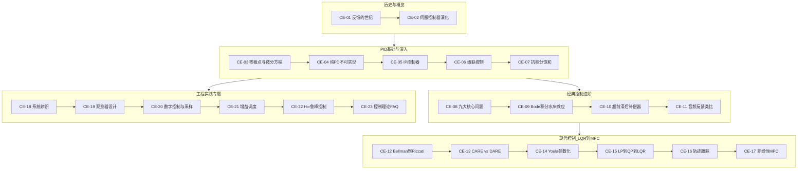

# 🎯 控制器演化路径：从PID到QP-MPC

> **核心理念**：三代工程师面对同一台电机，给出了三种截然不同的答案——不是因为电机变了，而是因为他们掌握的数学、能用的计算机、要解决的问题变了。这条路径追踪反馈控制从经典PID到最优LQR再到约束QP-MPC的完整演化。

---

## 学习路径总览

---

## 模块列表

### 历史与概览

| 编号 | 模块 | 核心问题 | 难度 | 交互工具 |
|------|------|---------|------|---------|
| CE-01 | [反馈的世纪——控制理论250年演化史](CE-01-Century-of-Feedback.md) | 从Watt到SpaceX，反馈控制如何改变世界？ | ★★☆☆☆ | — |
| CE-02 | [伺服电机控制器：从PID、LQR到QP-MPC](CE-02-Servo-Controllers-Evolution.md) | 三代控制器面对同一台电机，答案为何不同？ | ★★★☆☆ | — |

### PID基础与深入

| 编号 | 模块 | 核心问题 | 难度 | 交互工具 |
|------|------|---------|------|---------|
| CE-03 | [零极点与微分方程](CE-03-Poles-Zeros-ODE.md) | 传递函数背后隐藏的ODE是什么？ | ★★★☆☆ | 🔧 零极点探索器 |
| CE-04 | [纯PD控制的不可实现性](CE-04-Pure-PD-Unimplementable.md) | 为什么纯PD在物理上不可实现？ | ★★★☆☆ | 🔧 PID探索器 |
| CE-05 | [IP控制器——消除超调的比例项移位](CE-05-IP-Controller.md) | 把比例项移到反馈路径如何消除超调？ | ★★★☆☆ | 🔧 PID探索器 |
| CE-06 | [级联控制回路](CE-06-Cascaded-Control.md) | 电流环→速度环→位置环如何协同？ | ★★★★☆ | 🔧 伺服电机PID |
| CE-07 | [抗积分饱和](CE-07-Anti-Windup.md) | 执行器饱和时积分器如何"发疯"？ | ★★★★☆ | 🔧 伺服电机PID |

### 经典控制进阶

| 编号 | 模块 | 核心问题 | 难度 | 交互工具 |
|------|------|---------|------|---------|
| CE-08 | [控制器设计的九大核心问题](CE-08-Core-Problems.md) | 每个控制器必须解决的9个根本问题 | ★★★☆☆ | — |
| CE-09 | [Bode积分与水床效应](CE-09-Bode-Waterbed.md) | 为什么你无法在所有频率上同时降低灵敏度？ | ★★★★☆ | — |
| CE-10 | [超前滞后补偿器设计](CE-10-Lead-Lag-Compensator.md) | 如何直接塑造Bode图？ | ★★★★☆ | — |
| CE-11 | [音频反馈与控制理论的类比](CE-11-Audio-Feedback-Analogy.md) | 吉他啸叫和电机振荡有何共同本质？ | ★★☆☆☆ | — |

### 现代控制——从LQR到MPC

| 编号 | 模块 | 核心问题 | 难度 | 交互工具 |
|------|------|---------|------|---------|
| CE-12 | [从Bellman原理到Riccati方程](CE-12-Bellman-to-LQR.md) | 动态规划如何导出最优控制？ | ★★★★☆ | 🔧 LQR探索器 |
| CE-13 | [CARE vs DARE——连续与离散Riccati方程](CE-13-CARE-vs-DARE.md) | 何时用CARE，何时用DARE？ | ★★★★☆ | 🔧 LQR探索器 |
| CE-14 | [Youla参数化——所有稳定控制器的凸空间](CE-14-Youla-Parameterization.md) | 如何在一个凸空间中搜索所有稳定控制器？ | ★★★★★ | — |
| CE-15 | [LP→QP→LQR——现代控制的优化引擎](CE-15-LP-QP-LQR.md) | 线性规划、二次规划与LQR的统一视角 | ★★★★☆ | — |
| CE-16 | [轨迹跟踪——LQR与MPC如何跟踪运动目标](CE-16-Trajectory-Tracking.md) | 调节器如何变成跟踪器？ | ★★★★☆ | 🔧 QP-MPC探索器 |
| CE-17 | [非线性MPC——当动力学超越线性](CE-17-Nonlinear-MPC.md) | 线性化失效时MPC如何应对？ | ★★★★★ | 🔧 QP-MPC探索器 |

### 工程实践专题

| 编号 | 模块 | 核心问题 | 难度 | 交互工具 |
|------|------|---------|------|---------|
| CE-18 | [系统辨识](CE-18-System-Identification.md) | 控制器需要的模型从哪里来？ | ★★★★☆ | — |
| CE-19 | [观测器设计](CE-19-Observer-Design.md) | 如何估计不可测的状态？ | ★★★★★ | — |
| CE-20 | [数字控制与采样](CE-20-Digital-Control-Sampling.md) | 从s域到z域，什么改变了？ | ★★★★☆ | — |
| CE-21 | [增益调度](CE-21-Gain-Scheduling.md) | 非线性系统如何用线性控制器控制？ | ★★★★☆ | — |
| CE-22 | [H∞鲁棒控制](CE-22-H-Infinity-Robust-Control.md) | 模型有误差时如何保证性能？ | ★★★★★ | — |
| CE-23 | [控制理论常见问题FAQ](CE-23-Control-Theory-FAQ.md) | 控制理论学习中的常见困惑 | ★★☆☆☆ | — |

---

## 交互式仿真器

| 仿真器 | 关联模块 | 功能 |
|--------|---------|------|
| [PID探索器](/sims/ctrl_pid_explorer.html) | CE-03/04/05 | 经典3项控制，实时极零点图 |
| [伺服电机PID](/sims/ctrl_servo_motor_pid.html) | CE-06/07 | 真实电机物理+电压饱和+抗积分饱和 |
| [LQR探索器](/sims/ctrl_lqr_explorer.html) | CE-12/13 | 最优状态反馈，调权重而非增益 |
| [QP-MPC探索器](/sims/ctrl_servo_qp_mpc.html) | CE-16/17 | 约束模型预测控制，在线QP求解 |
| [零极点探索器](/sims/ctrl_zero_effect_explorer.html) | CE-03 | 零点如何改变二阶系统阶跃响应 |

---

## 学习建议

### 零基础入门路线
1. CE-01（反馈的世纪）→ CE-02（伺服控制器演化）建立全局观
2. CE-03（零极点与ODE）→ CE-04（纯PD不可实现）建立数学直觉
3. 打开PID探索器，亲手调参感受Kp/Kd/Ki的效果
4. CE-06（级联控制）→ CE-07（抗积分饱和）理解工程现实

### 电机控制工程师进阶路线
1. 从CE-12（Bellman到LQR）开始，理解最优控制的数学基础
2. CE-13（CARE vs DARE）→ CE-15（LP→QP→LQR）打通优化视角
3. 打开LQR探索器，对比LQR与PID的差异
4. CE-16（轨迹跟踪）→ CE-17（非线性MPC）进入约束控制
5. 打开QP-MPC探索器，观察约束如何改变控制策略

### 与控制理论路径（CT-*）的关系
- CT路径侧重**电机控制应用视角**：FOC电流环PI整定、三环级联、ADRC
- CE路径侧重**控制理论直觉视角**：交互式仿真、数学推导、控制器演化逻辑
- 建议先走CE路径建立直觉，再走CT路径深入工程应用

---

## 文档信息
- 知识体系：电控知识库 / 控制器演化路径
- 模块总数：23（CE-01 ~ CE-23）
- 覆盖范围：经典控制 + 现代控制 + 约束控制 + 工程实践
- 源项目：Controllers-from-PID-to-QP_MPC
- 更新日期：2026-06-05
