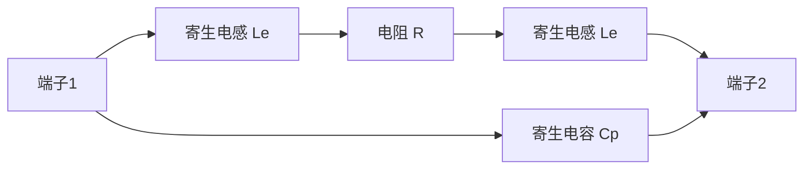
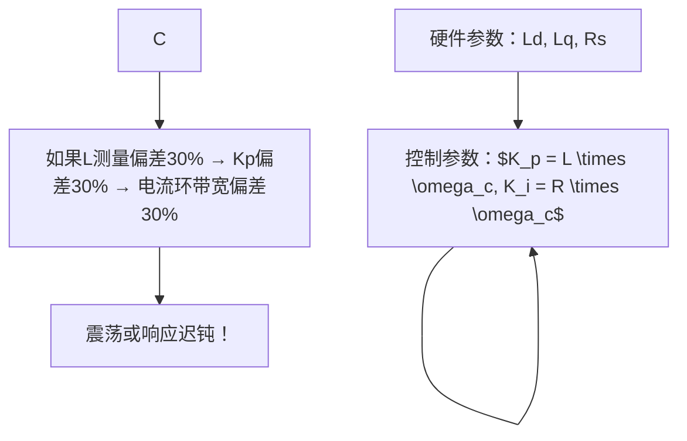

# EE-01: 电阻、电容、电感基础

**副标题：从欧姆定律到LC谐振——电驱系统的三大无源基石**

---

## 1.  核心摘要  

**一句话讲清楚**：电阻(R)、电容(C)、电感(L)是电子电路的三大无源元件，R决定能量耗散，C决定电场储能，L决定磁场储能——在电驱系统中，R对应电机绕组发热和采样电阻，C对应直流母线储能和滤波，L对应电机绕组电感和EMI滤波。

**认知挂钩**：很多软件工程师以为"RLC就是三个数学符号"，**这是致命的工程误解！** 实际上，RLC不只是电路课本里的概念——电机绕组本身就是R-L串联负载，直流母线电容直接决定逆变器的电压纹波和瞬态响应能力，电阻分压网络是电流采样精度的第一道关口。

**与电机控制的关联**：
-  **电机绕组(Rs + Ld/Lq)**：决定电流环PI参数 → `$K_p = L \times \omega_c, K_i = R \times \omega_c$`
-  **直流母线电容(Cdc)**：决定母线电压纹波 → `$\Delta V = I_{load} / (2 \times f_{PWM} \times C_{dc})$`
-  **采样电阻(Rshunt)**：决定电流测量精度 → `$V_{shunt} = I_{phase} \times R_{shunt}$`
-  **LC谐振($\omega = 1/\sqrt{LC}$)**：EMI滤波器设计、变压器设计

---

## 2.  问题引入  

### 工程师的真实困惑

**场景1：电流采样噪声大**
```text
工程师A:"我在电机相线上串联了采样电阻,但ADC读到的值噪声很大..."
问题现象:
- 电流波形上叠加高频毛刺
- 低占空比时采样误差特别大
- 增加滤波电容后响应变慢
```

**场景2：母线电容选择不当**
```text
工程师B:"电机加速时母线电压跌落严重,触发欠压保护..."
问题现象:
- 加速瞬间母线电压跌落超过20%
- 制动时母线电压飙升触发过压保护
- 电容器发热严重,温度超过85°C
```

**场景3：EMI滤波效果差**
```text
工程师C:"按照手册加了LC滤波,但传导发射还是超标..."
问题现象:
- LC滤波器反而放大了某些频段的噪声
- 不知道如何选择磁芯材质
```

### 核心问题

这些问题的根本原因是什么？

**答案**：不理解RLC元件的真实物理特性！

- 电流采样噪声 → 不理解电阻热噪声和寄生电感
- 母线电压跌落 → 不理解电容储能和ESR/ESL
- EMI滤波失效 → 不理解LC谐振和磁芯频率特性

### 学习目标

读完本模块，你将能够：

 **理解欧姆定律的工程意义** - 不仅是V=IR，更是功率计算、分压网络、电流检测
 **掌握RC时间常数** - `$\tau = RC$`，滤波截止频率 `$f_c = 1/(2\pi RC)$`
 **掌握LR时间常数** - `$\tau = L/R$`，电机绕组电流上升速率
 **掌握LC谐振** - `$\omega = 1/\sqrt{LC}$`，EMI滤波器自谐振频率
 **理解寄生参数** - 真实元件的ESR、ESL、泄漏电感
 **计算电机驱动中的实际参数** - 母线电容选型、滤波网络设计

---

## 3.  直观理解  

### 类比1：电阻就像"水管中的节流阀"

```text
水流系统           电路系统
───────           ───────
水压   (V)      电压   (V)
水流   (I)      电流   (I)
节流阀 (R)      电阻   (R)

欧姆定律：V = I × R
物理意义：电阻将电能转化为热能（铜损！）
```

**电机中的应用**：
- 定子绕组电阻Rs → 铜损 `$P_{cu} = 3 \times I^2 \times R_s$`
- 电流采样电阻 → `$V_{shunt} = I_{phase} \times R_{shunt}$`（0.1~10mΩ典型值）

### 类比2：电容就像"水库"

```text
水库系统             电容系统
─────────           ──────────
蓄水量   (Q)      电荷量   (Q)
水位     (V)      电压     (V)
库容量   (C)      电容量   (C)

电容基本方程：Q = C × V
电流关系：   i = C × dv/dt

水库越大 → 蓄水越多 → 水位变化越慢
电容越大 → 储能越多 → 电压变化越慢（电压纹波越小！）
```

**电机驱动中的关键洞察**：
> 直流母线电容就是逆变器的"水库"——电容越大，PWM开关引起的电压纹波越小，瞬态响应越好。

```text
母线电容储能：
  E = ½ × C × Vdc²
  
示例：C = 1000μF, Vdc = 310V
  E = ½ × 0.001 × 310² = 48J
  这48J的能量,在电机加速瞬间释放,支撑母线电压不跌落
```

### 类比3：电感就像"惯性飞轮"

```text
力学系统             电感系统
─────────           ──────────
飞轮惯性 (m)      电感     (L)
力       (F)      电压     (V)
速度     (v)      电流     (I)

电感基本方程：v = L × di/dt    F = m × dv/dt (牛顿第二定律!)

飞轮越重 → 速度变化越慢
电感越大 → 电流变化越慢
```

**电机中的直观理解**：
```text
电感阻碍电流变化：
  - L大 → 电流响应慢 → 电流环带宽低
  - L小 → 电流响应快 → 电流纹波大

电机绕组 = R-L串联：
  施加电压V,电流按指数上升：
  i(t) = (V/R) × (1 - e^(-t/τ)), τ = L/R
```

### 关键概念速查

| 元件 | 基本方程 | 储能 | 时间常数 | 频率特性 |
|------|---------|------|---------|---------|
| 电阻 R | `V = I×R` | 无储能(耗能) | 无 | 恒定的 |
| 电容 C | `i = C×dv/dt` | `½CV²` | `τ = RC` | `Zc = 1/(jωC)` |
| 电感 L | `v = L×di/dt` | `½LI²` | `τ = L/R` | `ZL = jωL` |

---

## 4.  技术原理  

### 4.1 电阻：耗能元件

#### 4.1.1 欧姆定律与功率计算

**基础关系**：
$$
V = I \times R
$$

**功率耗散**（发热！）：
$$
P = I^2 R = \frac{V^2}{R} = VI
$$

**电机铜损计算**：
$$
P_{cu} = 3 \times I_{rms}^2 \times R_s
$$

```text
手推示例：
  电机额定电流 Irms = 10A, Rs = 0.1Ω
  Pcu = 3 × 10² × 0.1 = 30W!
  
  这意味着什么？
  → 30W变成热量从绕组散出
  → 绕组温升 = Pcu × 热阻 ≈ 30 × 2 = 60°C
  → 如果环境温度40°C,绕组温度达100°C!
```

#### 4.1.2 串联与并联电阻

**串联**：
$$
R_{total} = R_1 + R_2 + \cdots + R_n
$$

**并联**：
$$
\frac{1}{R_{total}} = \frac{1}{R_1} + \frac{1}{R_2} + \cdots + \frac{1}{R_n}
$$

**分压器**（电机相电压检测的核心电路）：
$$
V_{out} = V_{in} \times \frac{R_2}{R_1 + R_2}
$$

```text
电机母线电压采样：
  Vdc = 310V, ADC量程 = 3.3V
  分压比 = 3.3/310 = 1/94
  → R1 = 94kΩ, R2 = 1kΩ (精度1%)
  → Vout = 310 × 1/(94+1) ≈ 3.26V 
```

#### 4.1.3 真实电阻的寄生参数

理想电阻是不存在的！高频下：


- **寄生电感Le**：引线电感，约5~20nH/mm
- **寄生电容Cp**：端子间分布电容，约0.1~1pF

**工程影响**：电流采样电阻的寄生电感在di/dt大时产生电压尖峰：
$$
V_{spike} = L_e \times \frac{di}{dt}
$$

示例：`$L_e = 5nH, di/dt = 100A/\mu s \rightarrow V_{spike} = 5nH \times 100A/\mu s = 0.5V$`
——叠加在真实采样信号上，造成ADC读数误差！

---

### 4.2 电容：储能元件

#### 4.2.1 电容基本特性

**电荷-电压关系**：
$$
Q = C \times V
$$

**电流-电压关系**：
$$
i(t) = C \times \frac{dv(t)}{dt}
$$

**储能**：
$$
E_C = \frac{1}{2} C V^2
$$

**阻抗频率特性**：
$$
Z_C(j\omega) = \frac{1}{j\omega C}
$$

- 低频($\omega \to 0$)：`$Z_C \to \infty$`，电容相当于开路
- 高频($\omega \to \infty$)：`$Z_C \to 0$`，电容相当于短路

#### 4.2.2 RC时间常数

**RC充电方程**：
$$
v_C(t) = V_0 \times (1 - e^{-t/RC})
$$

**时间常数**：
$$
\tau = R \times C
$$

τ时刻，电容电压达到63.2%；5τ时刻达到99.3%——可认为充放电完成。

**RC低通滤波截止频率**：
$$
f_c = \frac{1}{2\pi RC}
$$

```text
电机电流采样滤波：
  PWM频率 = 20kHz, 采样频率 = 20kHz (单电阻采样)
  奈奎斯特频率 = 10kHz
  滤波截止频率应  < 10kHz
  
  选择：R = 100Ω, C = 100nF
  fc = 1/(2π × 100 × 100e-9) = 15.9kHz > 10kHz 
  
  修正：C = 220nF
  fc = 1/(2π × 100 × 220e-9) = 7.2kHz < 10kHz 
```

#### 4.2.3 母线电容选型——电机驱动的核心

**纹波电压公式**：
$$
\Delta V_{ripple} = \frac{I_{load}}{2 \times f_{PWM} \times C_{dc}}
$$

```text
手推示例：
  Iload = 10A, fPWM = 20kHz, Cdc = 470μF
  ΔVripple = 10 / (2 × 20000 × 470e-6) = 0.532V
  → 母线310V,纹波0.53V,纹波率0.17% 
  
  若Cdc = 47μF:
  ΔVripple = 10 / (2 × 20000 × 47e-6) = 5.32V
  → 纹波率1.7%,勉强可接受
  
  若Cdc = 10μF:
  ΔVripple = 25V → 纹波率8%  严重!
```

**瞬态响应**：加速时电流突增，电容电压跌落：
$$
\Delta V_{dip} = \frac{I_{peak} \times \Delta t}{C_{dc}}
$$

```text
加速瞬态：
  Ipeak = 30A, Δt = 1ms (电流环响应时间)
  Cdc = 470μF:
  ΔVdip = 30 × 0.001 / 470e-6 = 63.8V ← 310V母线跌落20%! 
  
  需要更大电容或预充电电路!
  Cdc = 2000μF:
  ΔVdip = 15V → 跌落5%,可接受 
```

#### 4.2.4 真实电容的ESR和ESL

电解电容的等效模型：


**ESR引起的发热**：
$$
P_{ESR} = I_{rms}^2 \times ESR
$$

>  **工程警告**：电解电容的纹波电流额定值通常为1~3A，超过会导致ESR发热→寿命急剧缩短（每升温10°C寿命减半）！

---

### 4.3 电感：磁能元件

#### 4.3.1 电感基本特性

**电压-电流关系**：
$$
v(t) = L \times \frac{di(t)}{dt}
$$

**储能**：
$$
E_L = \frac{1}{2} L I^2
$$

**阻抗频率特性**：
$$
Z_L(j\omega) = j\omega L
$$

- 低频($\omega \to 0$)：`$Z_L \to 0$`，电感相当于短路
- 高频($\omega \to \infty$)：`$Z_L \to \infty$`，电感相当于开路

**串联与并联**：
$$
L_{series} = L_1 + L_2, \quad \frac{1}{L_{parallel}} = \frac{1}{L_1} + \frac{1}{L_2}
$$

#### 4.3.2 LR时间常数

**RL电路电流上升方程**：
$$
i(t) = \frac{V}{R} \times (1 - e^{-tR/L})
$$

**时间常数**：
$$
\tau = \frac{L}{R}
$$

在电机驱动中，**这个τ直接决定了电流环最大带宽**：
$$
\omega_{c,max} \approx \frac{1}{\tau} = \frac{R}{L}
$$

```text
典型PMSM：L = 1mH, R = 0.1Ω
τ = 0.001/0.1 = 10ms
ωc_max = 1/τ = 100 rad/s ≈ 16Hz

这太慢了！所以我们使用高电压（48V、310V）驱动 +
PI控制器前馈,实际电流环带宽可达1000~3000 rad/s
```

#### 4.3.3 电机绕组的电感特性

电机绕组是一个**非线性时变电感**：

| 工作点 | Ld表现 | Lq表现 | 原因 |
|--------|--------|--------|------|
| 未饱和 | 额定值 | 额定值 | 铁芯磁导率恒定 |
| 电流增大(饱和) | Ld↓ | Lq↓ | 铁芯磁饱和 |
| Id负向(弱磁) | Ld↓ | — | d轴去磁 |

**工程意义**：电感随电流变化 → PI参数应该在不同工作点自适应调节，否则电流环性能不一致！

#### 4.3.4 真实电感的寄生参数

- **直流电阻(DCR)**：绕线电阻，导致铜损
- **并联电容(Cp)**：匝间分布电容，限制高频特性
- **磁芯损耗**：涡流损耗 + 磁滞损耗，与频率相关

---

### 4.4 LC谐振

#### 4.4.1 谐振条件

理想LC电路（无损耗）的谐振频率：
$$
\omega_0 = \frac{1}{\sqrt{LC}}
$$

$$
f_0 = \frac{1}{2\pi\sqrt{LC}}
$$

**谐振时的特征**：
- 感抗 = 容抗：`$\omega_0 L = 1/(\omega_0 C)$`
- 总阻抗 = 0（串联谐振）或 $\infty$（并联谐振）
- 能量在L和C之间振荡，振荡周期 `$T_0 = 2\pi\sqrt{LC}$`

#### 4.4.2 实际RLC的谐振

加入电阻R（品质因数Q）：
$$
Q = \frac{\omega_0 L}{R} = \frac{1}{\omega_0 C R}
$$

```text
Q值含义：
  Q > 1：谐振峰明显（欠阻尼）
  Q = 0.5：临界阻尼（无超调）
  Q < 0.5：过阻尼（响应缓慢）
```

**电机驱动中的LC谐振陷阱**：
- EMI滤波器的LC谐振可能放大特定频率噪声！
- 需要在滤波器设计时加入阻尼电阻

---

## 5.  交叉视角  

> RLC不只是电路课本的知识，它们直接决定了电驱系统的设计：采样精度、母线纹波、电流环带宽、EMI滤波。

### 5.1 电阻 → 电流采样精度

** 硬件-算法关联**：
```text
采样电阻Rshunt的选择：
  [电流→电压]  `$V_{shunt} = I_{phase} \times R_{shunt}$`
  [电压→数字]  `$ADC_{code} = V_{shunt} \times 4096 / 3.3$` (12位ADC)
  
  Rshunt = 10mΩ, Iphase = 10A:
    Vshunt = 0.1V → ADC = 0.1 × 4096 / 3.3 = 124 counts
    → 电流分辨率 = 10A / 124 = 80mA/LSB ← 高分辨率!
  
  Rshunt = 1mΩ, Iphase = 10A:
    Vshunt = 0.01V → ADC = 12 counts
    → 电流分辨率 = 10A / 12 = 830mA/LSB ← 精度差! 
  
  但Rshunt=10mΩ → 损耗 = I²R = 100 × 0.01 = 1W ← 发热严重!
```

**经验法则**：采样电阻选型四步——(1) 最大电流×Rshunt 不超过运放输入范围；(2) 最小电流×Rshunt > ADC噪声；(3) `$I^2 R$` 损耗 < 0.5W（避免自热误差）；(4) 选用4端子Kelvin连接电阻，消除引线电阻影响。

### 5.2 电容 → 母线电压稳定性

**直流母线电容的三重角色**：
1. **滤波**：吸收PWM开关纹波
2. **储能**：提供瞬态电流（加速→放电，制动→充电）
3. **去耦**：为逆变器提供低阻抗直流源

**选型公式整合**：
$$
C_{dc} \geq \max\begin{cases}
\frac{I_{load}}{2 f_{PWM} \Delta V_{max}} & \text{(纹波约束)}\\
\frac{I_{peak} \Delta t}{\Delta V_{dip}} & \text{(瞬态约束)}\\
\frac{2 E_{brake}}{V_{dc,max}^2 - V_{dc,nom}^2} & \text{(制动能量约束)}
\end{cases}
$$

### 5.3 电感 → 电流环PI参数设计

这是最直接的交叉关联：


### 5.4 LC谐振 → EMI滤波器陷阱

EMI滤波器通常是L-C-L-C多级结构，每一级都有自谐振频率：
$$
f_{SRF} = \frac{1}{2\pi\sqrt{L_{filter} \times C_{filter}}}
$$

若`fSRF`落在PWM频率或开关谐波频率附近 → **噪声放大而非衰减！**

---

## 6.  工程案例  

### 案例1：电流采样噪声——寄生电感作祟

**项目背景**：
```text
应用:工业伺服驱动器
电机:PMSM,额定电流20A
采样:三电阻法,Rshunt = 5mΩ
问题:高di/dt时,ADC读数出现尖峰
```

**诊断过程**：
```text
步骤1:示波器测量Rshunt两端 → 正常电流波形但叠加窄脉冲
步骤2:分析窄脉冲出现时机 → 正好是MOSFET开关瞬间
步骤3:计算di/dt: 20A/50ns = 400A/μs
步骤4:估算寄生电感: 引线长度10mm → Le ≈ 8nH
     Vspike = 8nH × 400A/μs = 3.2V!
```

**根本原因**：采样电阻引线寄生电感 + MOSEFT开关di/dt = 电压尖峰叠加在真实信号上！

**解决方案**：
```bash
方案A:使用4端子Kelvin连接电阻 
  电流端子和检测端子分离,消除引线电感影响

方案B:采样时刻避开MOSFET开关沿 
  在PWM周期中点采样(远离开关瞬态)

方案C:增加RC滤波 
  R = 10Ω, C = 1nF, `$f_c = 1/(2\pi \times 10 \times 1e-9) = 15.9MHz$`
  > 注意:fc不能太低,否则电流环延迟增大!
```

### 案例2：母线电容容量不足——加速时欠压

**项目背景**：
```text
应用:电动叉车
电机:PMSM,额定功率5kW,母线电压72V
配置:Cdc = 2200μF, PWM = 10kHz
问题:满载加速时,母线电压跌至58V,触发欠压保护(60V门槛)
```

**诊断过程**：
```text
步骤1:计算加速瞬态电流 → Imax = 5000/(0.85×72) ≈ 82A
步骤2:计算电压跌落 → Cdc = 2200μF, Δt = 500μs
     ΔV = 82 × 500e-6 / 2200e-6 = 18.6V!
     Vdc_min = 72 - 18.6 = 53.4V ← 低于60V门槛!
步骤3:分析纹波 → ΔVripple = 82/(2×10000×2200e-6) = 1.86V(可接受)
→ 问题不是稳态纹波,而是瞬态!
```

**根本原因**：电容容量不足以支撑加速瞬态电流！**稳态纹波够用≠瞬态响应够用！**

**解决方案**：
```text
方案A:增大电容 → Cdc = 10000μF
  ΔVdip = 82 × 500e-6 / 10000e-6 = 4.1V(可接受) 
  缺点:体积大,成本高 

方案B:软件限制电流上升率 
  增加电流斜坡限制(如100A/s→ΔI=10A在100ms内)
  缺点:影响加速性能 

方案C:前馈电压补偿 
  加速时提前提升PWM调制比,补偿电压跌落
  零成本,只需软件修改!
```

### 案例3：EMI滤波器谐振——传导发射反而恶化

**项目背景**：
```text
应用:伺服驱动器,必须通过CISPR 11 Class A
EMI滤波:两级LC滤波器
问题:在1~5MHz频段,加滤波器后反而比不加更差!
```

**诊断过程**：
```text
步骤1:测试原始传导发射 → 150kHz~30MHz扫频
步骤2:加入滤波器 → 1~5MHz频段噪声反而增大8dB!
步骤3:计算滤波器谐振频率:
  L1 = 100μH, C1 = 1μF
  f0 = 1/(2π√(100e-6 × 1e-6)) = 15.9kHz ← 低于1MHz,不是主因
  
步骤4:发现问题 → 电容的ESL和电感的Cp在高频形成寄生谐振!
  陶瓷电容C1(ESL ≈ 5nH): fSRF_C1 = 1/(2π√(5nH×1μF)) = 71kHz... 不对
  电解电容C2(ESL ≈ 30nH): fSRF_C2 = 1/(2π√(30nH×100μF)) ≈ 2.9MHz!
  → 正是问题频段!
```

**根本原因**：滤波器电容的ESL在MHz频段形成寄生谐振峰！

**解决方案**：
```text
方案A:并联小容量陶瓷电容 
  100μF电解 + 1μF陶瓷 + 100nF陶瓷
  → 各电容在不同频段提供低阻抗

方案B:滤波器加阻尼电阻 
  在LC谐振支路串联Rdamp = √(L/C) ≈ 10Ω
  → 降低Q值,消除谐振峰
```

### 案例4：电机电感测量——LCR电桥 vs 高频注入

**问题**：LCR电桥测量Ld = 1.0mH，但FOC运行时电流响应与1.0mH不一致？

**解析**：
```text
LCR电桥：小信号(100mV), 1kHz, 铁芯未饱和 → 测得"初始电感"
FOC运行：大电流(10A), PWM(20kHz), 铁芯部分饱和 → 实际"工作电感"

差异原因：
  1. 饱和效应：大电流 → 铁芯磁导率↓ → 电感↓
  2. 频率效应：PWM 20kHz vs LCR 1kHz → 涡流效应不同
  3. 温度效应：运行温度高 → 磁芯特性变化

校正方法：
  在实际工作点(额定Idq)进行高频注入法在线测量
  → 更接近实际运行的电感值
```

### 案例5：电机选型时电感参数的工程评估

**快速评估电机电流响应能力**：
```text
电机电气时间常数：
  τ_elec = L / R
  
τ < 1ms  → 电流响应快 → 适合高性能伺服
τ = 1~5ms → 电流响应中等 → 适合通用变频器
τ > 10ms → 电流响应慢 → 适合低速大转矩应用

示例PMSM: L = 2mH, R = 0.5Ω
  τ = 2mH/0.5Ω = 4ms → 通用变频器级别
```

---

:::sim rlc

## 7.  实践练习

### 练习1：计算题——RC滤波截止频率

已知电流采样电路需滤除20kHz以上的噪声，ADC采样频率40kHz。计算RC低通滤波器参数，要求截止频率为采样频率的1/5，选定R = 100Ω，求C。

*参考答案：fc = 40kHz/5 = 8kHz；C = 1/(2π×R×fc) = 1/(2π×100×8000) ≈ 199nF → 选220nF标称值*

### 练习2：计算题——母线电容纹波

PMSM额定电流15A，PWM频率16kHz，直流母线电压310V，要求纹波率<0.5%（即ΔV<1.55V）。求最小母线电容值。

*参考答案：Cdc ≥ 15/(2×16000×1.55) = 302μF → 考虑20%余量，选390μF或470μF*

### 练习3：设计题——LR时间常数与PI参数

电机参数：Rs = 0.5Ω，Ld = Lq = 2mH，设计电流环带宽1600 rad/s。计算Kp和Ki，并判断该带宽是否合理。

*参考答案：Kp = 2mH×1600 = 3.2；Ki = 0.5×1600 = 800；τ = 2mH/0.5Ω = 4ms；ωc_max = 1/τ = 250 rad/s ← 设计1600远超自然响应极限！需要审视：PWM电压远大于IR压降，实际可行但需要验证相位裕度*

### 练习4：诊断题——LC谐振问题

一台逆变器的EMI滤波器参数：L = 47μH，C1 = 4.7μF（电解），C2 = 1μF（陶瓷）。发现150kHz附近传导发射超标，请分析并给出解决建议。

*参考答案：计算电解C1与L的谐振：f₀=1/(2π√(47e-6×4.7e-6))=10.7kHz，不是主因。计算C2(陶瓷)+ESL≈5nH的自谐振：fSRF=1/(2π√(5e-9×1e-6))≈2.25MHz。150kHz可能是PWM基频(20kHz)的7次谐波或共模噪声。建议：(1)增加共模扼流圈抑制共模；(2)在电解C1两端并联100nF高频瓷片电容；(3)检查PCB布局，缩短高频环路。*

### 练习5：选择题

**题目1**：在电机驱动中，采样电阻的寄生电感会产生什么影响？
- A. 降低采样精度  B. 产生电压尖峰  C. 引起相位延迟  D. 增加功耗

> 答案：B（di/dt产生L×di/dt尖峰）

**题目2**：增大直流母线电容可以？
- A. 降低稳态电压纹波  B. 改善加速瞬态响应  C. A和B都正确  D. 降低效率

> 答案：C

**题目3**：电机电感L减小到原来的一半，电流环PI的Kp应如何调整（保持相同带宽）？
- A. 加倍  B. 减半  C. 不变  D. 加倍Ki

> 答案：B（Kp = L × ωc）

**题目4**：电解电容ESR为2Ω，纹波电流有效值1A，ESR发热功率？
- A. 1W  B. 2W  C. 4W  D. 0.5W

> 答案：B（P = I²×ESR = 1×2 = 2W）

**题目5**：LC串联谐振时，总阻抗？
- A. 最大  B. 最小（等于R）  C. 等于ωL  D. 等于1/(ωC)

> 答案：B

---

**文档信息**：
- 模块编号：EE-01
- 知识体系：电子基础
- 模块名称：电阻、电容、电感基础
- 电机关联：绕组RL模型→电流环PI参数，母线电容→纹波与瞬态，采样电阻→电流检测精度

>  检验你的理解：[EE-01 检验题目](./EE-01-assessment.md)
