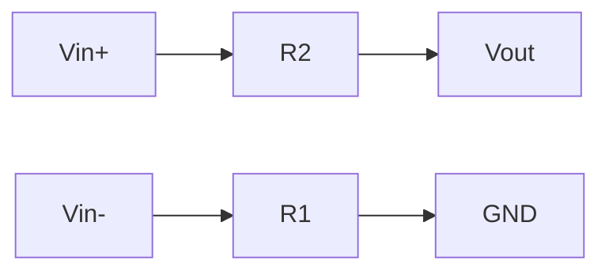
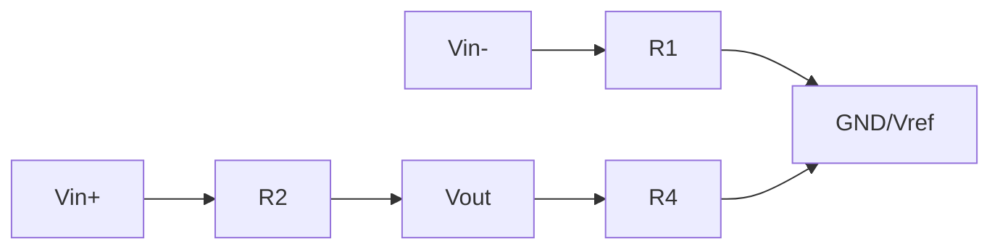
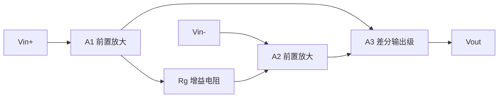
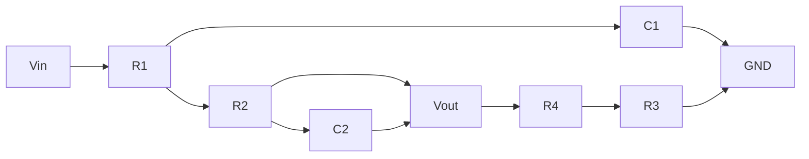
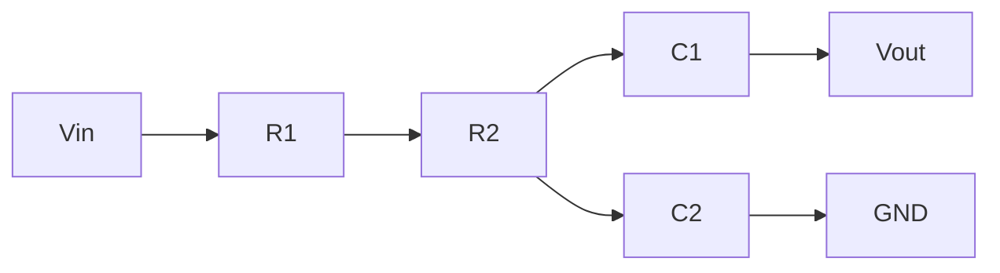
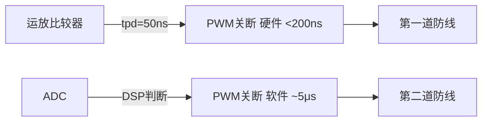

# EE-07 运算放大器

**副标题：从虚短虚断到信号调理，掌握电机驱动模拟前端的设计核心**

---

## 1.  核心摘要  

**一句话讲清楚**：运算放大器（Op-Amp）是电机驱动系统中连接"物理世界"与"数字世界"的桥梁——它把微弱的电流采样信号、相电压、温度传感器信号放大和调理成MCU ADC可用的干净信号，其精度和带宽直接决定FOC控制性能的天花板。

**认知挂钩**：很多嵌入式工程师认为运放"就是放大信号"，**这是典型的数字工程师思维误区！** 电机驱动的运放设计不是教科书上的简单放大电路——你需要同时处理mV级信号精度、μs级响应速度、数百伏共模电压、PWM开关噪声耦合。不理解CMRR、GBW、slew rate、bias current在实际电路中的影响，轻则电流采样噪声大导致FOC震荡，重则保护电路误触发。

**与电机控制的关联**：
-  **电流采样信号调理**：shunt电阻mV信号 → 差分放大/仪表放大 → ADC输入范围
-  **相电压测量**：电阻分压 → 差分运放 → ADC（需高CMRR抑制PWM共模噪声）
-  **过流保护比较器**：运放作高速比较器 → 直接触发PWM关断（绕过DSP延迟）
-  **有源滤波**：PWM斩波噪声 → LPF → 干净电流信号，截止频率影响电流环带宽
-  **温度传感器调理**：NTC/PTC → 桥式电路 → 仪表放大器

---

## 2.  问题引入  

### 工程师的真实困惑

**场景1：电流采样噪声导致FOC震荡**
```text
工程师A:"我在shunt电阻上用运放放大电流信号,但ADC采到的噪声很大,
FOC电流环一直在震荡..."
问题现象:
- 电流波形叠加高频噪声(与PWM频率一致的毛刺)
- 电流环PI输出震荡
- 低速时转矩脉动明显
```

**场景2：差分放大共模抑制不足**
```text
工程师B:"我用四电阻差分放大器测相电压,但在PWM开关时输出有巨大尖峰..."
问题现象:
- PWM边沿时刻运放输出出现±5V尖峰
- 正常区间输出正常
- 尖峰导致过压保护误触发
```

**场景3：运放带宽不够导致信号失真**
```text
工程师C:"运放输出的电流波形在峰值处变平了,像被削顶一样..."
问题现象:
- 大电流时运放输出饱和(但不是电源轨问题)
- 小电流正常
- 怀疑是运放压摆率不足
```

### 核心问题

这些问题的根本原因是什么？

- 采样噪声 → 运放未加LPF或LPF截止频率不对 → 高频开关噪声直通ADC
- 共模尖峰 → 四电阻差分放大器CMRR严重依赖电阻匹配 → 1%电阻导致CMRR仅34dB！
- 波形削顶 → 压摆率（Slew Rate）不足 → 运放跟不上信号变化率

### 学习目标

读完本模块，你将能够：

 **掌握理想运放法则** - 虚短、虚断的物理本质和工程边界
 **精通运放基本拓扑** - 同相、反相、差分、仪放，各自CMRR特性
 **理解运放非理想参数** - GBW、SR、$I_{bias}$、$V_{os}$及其工程影响
 **设计有源滤波器** - Sallen-Key LPF用于电流采样抗混叠
 **选型运放** - 根据电流采样精度选择GBW、SR、噪声指标

---

## 3.  直观理解  

### 类比1：运放 = "自动平衡天平"

**生活场景**：想象一个极其敏感的天平——它会自动加砝码使得两边平衡。


**关键理解**：
- 虚短是**运放自身调节的结果**，不是外部强制的！
- 虚断是因为输入端是MOSFET栅极（或BJT基极但电流极小）
- 负反馈是运放线性工作的前提

### 类比2：运放带宽 = "人反应的快慢"

```text
信号变化速度   运放响应
───────────┼──────────
缓慢变化    │ 完美跟随（低频区）
加快变化    │ 幅度减小 + 相位滞后（GBW限制区）
极快变化    │ 完全跟不上，变成三角波（SR限制区）

GBW(Gain-Bandwidth Product)：
  如果一个运放的GBW=10MHz：
    G=100时，BW=100kHz
    G=10时，BW=1MHz
    G=1时，BW=10MHz
```

### 类比3：四电阻差分的CMRR依赖 = "跷跷板的平衡精度"



---

## 4.  技术原理  

### 4.1 理想运放两大法则

#### 4.1.1 虚短（Virtual Short）

$$
V_+ = V_- \quad \text{（在深度负反馈条件下）}
$$

物理本质：运放开环增益 $A_{OL}$ 极高（>100dB），输出通过负反馈"强制"两个输入端电压相等。

$$
V_{out} = A_{OL} \times (V_+ - V_-)
$$
$$
V_+ - V_- = \frac{V_{out}}{A_{OL}} \approx \frac{V_{out}}{\infty} = 0
$$

**工程边界**：
- $A_{OL}$ 随频率上升下降 → 高频时"虚短"不成立
- 输出饱和时（$V_{out}$ 撞电源轨），虚短也打破
- 正反馈（如施密特触发器）时，虚短当然不成立

#### 4.1.2 虚断（Virtual Open）

$$
I_+ = I_- = 0
$$

物理本质：运放输入端是MOSFET栅极（CMOS运放）或BJT基极（双极型运放），输入阻抗极高。

**工程边界**：
- 双极型运放有输入偏置电流 $I_{bias} \approx nA \sim \mu A$
- $I_{bias}$ 流过外部电阻产生误差电压：$V_{error}=I_{bias} \times R_{source}$
  - 例：$I_{bias}=100nA, R_{source}=100k\Omega \to V_{error}=10mV$ ← 不可忽略！

### 4.2 基本放大拓扑

#### 4.2.1 反相放大器


$$
V_{out} = -\frac{R_f}{R_{in}} \times V_{in}
$$

$$
Z_{in} = R_{in} \quad \text{（输入阻抗有限，等于} R_{in}\text{）}
$$

**特点**：输入阻抗由 $R_{in}$ 决定，不适合高阻抗信号源。增益为负（反相）。

#### 4.2.2 同相放大器


$$
V_{out} = \left(1 + \frac{R_f}{R_g}\right) \times V_{in}
$$

$$
Z_{in} \to \infty \quad \text{（理想）}
$$

**特点**：输入阻抗极高（适合传感器信号），增益 $\ge 1$。

#### 4.2.3 差分放大器  电机驱动最常用



**平衡条件（$R_1=R_3, R_2=R_4$）**：

$$
V_{out} = \frac{R_2}{R_1} \times (V_{in+} - V_{in-})
$$

$$
CMRR \approx \frac{1+R_2/R_1}{4 \times \varepsilon} \quad \varepsilon = \text{电阻匹配误差}
$$

**为什么四电阻差分运放在电机驱动中会出问题？**

```text
电机驱动中的共模电压挑战：

PWM开关时，shunt电阻两端的共模电压在 0V ↔ Vdc(540V!) 之间跳变
  dv/dt ≈ 540V / 100ns = 5.4kV/μs

差分运放的共模电压：
  V_cm = (V_in+ + V_in-) / 2 ← 随PWM开关剧烈跳变!

如果CMRR=34dB（1%电阻）：
  共模干扰 = V_cm_jump × 10^(-CMRR/20) × G_diff
  = 540V × 10^(-34/20) × 10
  = 540 × 0.02 × 10 = 108V ← 输出完全饱和！
```

**解决方案**：
- 使用仪表放大器（3运放结构，内置精密电阻网络，CMRR>100dB）
- 使用专用电流检测放大器（如INA240，内置激光修调电阻）

#### 4.2.4 仪表放大器（Instrumentation Amplifier）



$$
V_{out} = \left(1 + \frac{2R_1}{R_g}\right) \times (V_{in+} - V_{in-})
$$

**优点**：
- 输入阻抗极高（同相输入）
- CMRR极高（>100dB，不受外部电阻匹配影响）
- 增益由单个 $R_g$ 设定

**电机驱动典型应用**：INA240（TI）、AD8418（ADI）等专用电流检测放大器，内置激光修调电阻，CMRR>120dB，共模电压范围-4V~+80V。

### 4.3 运放关键非理想参数

#### 4.3.1 增益带宽积（GBW）

$$
GBW = G_{CL} \times f_{BW}
$$

- $G_{CL}$：闭环增益
- $f_{BW}$：-3dB带宽

**工程影响**：
```text
电流采样：G=20, f_signal=DC~10kHz
  →需要 GBW > 20 × 10kHz × 10(裕量) = 2MHz

PWM噪声 f_noise=100kHz~1MHz
  → 若GBW=2MHz, G=20时BW=100kHz → 1MHz噪声被衰减
  → 若GBW=10MHz, G=20时BW=500kHz → 更多噪声通过！
   不是GBW越大越好——需要根据噪声频率选择合适带宽
```

#### 4.3.2 压摆率（Slew Rate, SR）

$$
SR = \frac{dV_{out}}{dt}\bigg|_{max} \quad [V/\mu s]
$$

**工程影响**：
```text
电机驱动电流波形在大电流跳变时的最大变化率：
  dV/dt_max = 2π × f_max × V_peak
  f_max = 1kHz（电流基频，考虑谐波取5kHz）
  V_peak = 3V（运放输出）
  dV/dt_max = 2π × 5k × 3 = 94mV/μs
  
  SR=0.5V/μs的运放 → 可以跟随（0.5 > 0.094）
  SR=0.1V/μs的运放 → 跟随不足，波形削顶！

更关键的是PWM开关边沿：
  开关边沿 ≈ 100ns, 输出跳变 ≈ 0.5V
  dV/dt_edge = 0.5V/100ns = 5V/μs ← 远超一般运放！
  → 这就是为什么需要在运放前加RC滤波！
```

#### 4.3.3 输入失调电压（$V_{os}$）

$$
V_{out\_error} = V_{os} \times \left(1 + \frac{R_f}{R_g}\right)
$$

```text
低端运放LM358: Vos ≈ 2~7mV → G=50时输出误差=100~350mV
精密运放OPA333: Vos ≈ 10μV → G=50时输出误差=0.5mV
电流检测应用：
  shunt=10mΩ, I=1A → Vsense=10mV
  G=100 → Vout=1V
  Vos=2mV → Vout_error=200mV（误差20%!）
  Vos=10μV → Vout_error=1mV（误差0.1%）
```

#### 4.3.4 共模抑制比（CMRR）

$$
CMRR = 20\log_{10}\left(\frac{A_{diff}}{A_{cm}}\right) \quad [dB]
$$

电机驱动中的共模噪声来源：
- PWM开关的 $dv/dt$ → 通过PCB寄生电容耦合
- 地弹（ground bounce）→ 大电流切换导致地电位跳变
- 三相不平衡 → 中性点偏移

**应对策略**：
- 选用仪表放大器（内置精密电阻，CMRR>100dB）
- PCB布局：差分走线紧密耦合，远离PWM开关节点
- 输入端加共模滤波器（共模扼流圈 + Y电容）

### 4.4 有源滤波器设计（电机驱动专用）

#### 4.4.1 Sallen-Key 二阶低通滤波器



$$
f_c = \frac{1}{2\pi\sqrt{R_1 R_2 C_1 C_2}}
$$

$$
Q = \frac{\sqrt{R_1 R_2 C_1 C_2}}{R_1 C_1 + R_2 C_1 + (1-G)R_1 C_2}
$$

$$
\text{直流增益} G = 1 + \frac{R_4}{R_3}
$$

**电机驱动电流采样LPF设计实例**：
```text
需求：
  - 电流信号带宽：DC~1kHz
  - PWM噪声频率：16kHz
  - 衰减要求：16kHz处至少-40dB

设计：
  fc = 2kHz（留1倍频裕量）
  二阶LPF在 16kHz/2kHz=8倍频处衰减 ≈ 36dB（-40dB/dec × 0.9dec ≈ 36dB）
  → 不够！需要三阶或更高Q值

改进：fc=1.5kHz
  16kHz/1.5kHz=10.67倍 → 衰减 ≈ 42dB 
```

#### 4.4.2 多重反馈（MFB）低通滤波器



$$
f_c = \frac{1}{2\pi\sqrt{R_2 R_3 C_1 C_2}}
$$

$$
G = -\frac{R_2}{R_1}
$$

**Sallen-Key vs MFB对比**：

| 特性 | Sallen-Key | MFB |
|------|-----------|-----|
| 增益 | ≥1（同相） | 负（反相） |
| 元件灵敏度 | 较高 | 较低 |
| 高频衰减 | Q值有关 | 优于SK |
| 适用场景 | 低Q值、G≥1 | 电机驱动（高衰减） |

**推荐**：电机驱动电流采样用MFB拓扑，因为：
1. 可提供反相增益（与后级差分组合）
2. 高频衰减更陡（对PWM噪声抑制更好）
3. 元件灵敏度低（批量一致性好）

### 4.5 电机驱动运放选型指南

```text
┌──────────────────────────────────────────────────────────────────┐
│  应用场景       │ 关键指标        │ 推荐值          │ 推荐型号     │
│  ─────────────┼───────────────┼───────────────┼─────────────│
│  电流采样(shunt)│ Vos, CMRR, BW  │ Vos<100μV       │ OPA333      │
│                │               │ CMRR>100dB      │ OPA388      │
│                │               │ GBW>2MHz        │ AD8628      │
│  ─────────────┼───────────────┼───────────────┼─────────────│
│  相电压测量    │ CMRR, 共模范围 │ CMRR>80dB       │ INA148      │
│                │               │ Vcm>±200V       │ AD629       │
│  ─────────────┼───────────────┼───────────────┼─────────────│
│  过流比较器    │ 速度, 延迟     │ tpd<100ns       │ TLV3501     │
│                │               │                 │ LT1719      │
│  ─────────────┼───────────────┼───────────────┼─────────────│
│  有源滤波     │ GBW, SR, 噪声  │ GBW>10MHz       │ OPA2350     │
│                │               │ SR>10V/μs       │ AD8065      │
│  ─────────────┼───────────────┼───────────────┼─────────────│
│  通用信号调理  │ 低成本, RRIO  │ Vos<1mV          │ LMV358      │
│                │               │ GBW>1MHz        │ TLV9002     │
└──────────────────────────────────────────────────────────────────┘
```

---

## 5.  交叉视角  

### 5.1 电流采样运放 → FOC电流环精度


### 5.2 LPF截止频率 → 电流环带宽

```text
LPF截止频率 fc 与电流环带宽 f_cur 的关系：

  fc > 5 × f_cur（经验准则）
  
  例：f_cur=2kHz → fc≥10kHz
  但 fc=10kHz 对16kHz PWM噪声衰减仅 -4dB!
  
  折中方案：
    1. fc=2kHz → 对PWM衰减 -36dB(二阶) → 噪声足够低
    2. f_cur=400Hz（fc/5 → 保守设计）
    
  改进方案：
    1. 同步采样（在PWM中心点采样，避开噪声尖峰）
    2. fc=8kHz → f_cur=1.6kHz  但需要同步采样来抑制噪声
```

### 5.3 过流保护比较器 → 硬件快速关断



---

## 6.  工程案例  

### 案例1：LM358做电流采样导致FOC无法稳定

**项目背景**：
```text
应用：3kW伺服驱动器
电流采样：10mΩ shunt → LM358差分放大(G=50)
ADC：12bit，3.3V
问题：FOC电流环震荡，无法稳定运行
```

**诊断过程**：
```text
步骤1：检查运放输出 → 静态噪声±80mV（约80LSB!）

步骤2：分析噪声来源
  - LM358 Vos = 2~7mV → 输出偏移 = 2mV×50 = 100mV（典型）
  - LM358 GBW = 1MHz, G=50 → BW=20kHz → 16kHz PWM噪声几乎不衰减
  - LM358 SR = 0.3V/μs → PWM边沿完全跟不上 → 输出畸变

步骤3：计算对电流控制的影响
  - Vos导致100mV offset → 折算电流误差 = 100mV/50/10mΩ = 200mA
  - 电机额定电流5A → 误差4%（低速时占比更大）
  - 加上噪声 → ADC读到的是"电流+200mA偏移+80mV噪声"
```

**解决方案**：
```text
1. 运放更换为OPA2333（零漂移，Vos=10μV）
   → offset误差从200mA降至0.2mA 

2. 增加二阶MFB LPF（fc=2kHz, G=50）
   → 16kHz PWM噪声衰减-36dB
   运放GBW=350kHz（OPA2333）→ 2kHz信号 G=50, BW=7kHz 足够 

3. 改为同步采样（PWM中心触发ADC）
   → 避开PWM边沿噪声

结果：电流波形干净，FOC稳定运行 
```

---

### 案例2：四电阻差分放大CMRR不足

**项目背景**：
```text
应用：5kW伺服相电压测量
电路：4×10kΩ 1%电阻差分放大器（G=1）
运放：TL084
问题：PWM开关时运放输出尖峰±3V，导致过压保护误触发
```

**诊断过程**：
```text
步骤1：计算CMRR
  R_f/R_in = 10k/10k = 1
  ε = 1%（最差2%四电阻组合）
  CMRR = (1+1)/(4×0.01) = 50 ≈ 34dB

步骤2：分析共模干扰
  PWM开关 dv/dt = 540V/100ns = 5.4kV/μs
  通过PCB走线耦合到运放输入：V_cm ≈ 50V（估算）
  共模抑制：34dB → 衰减 10^(34/20) = 50倍
  输出干扰：50V/50 = 1V（每边），差分后可能叠加 → 2V

步骤3：实测 → 尖峰±3V → 过压保护阈值±2.5V → 误触发!
```

**解决方案**：
```text
方案A：使用0.01%匹配电阻网络（LT5400-1）
  CMRR提高到74dB → 衰减5000倍
  50V/5000 = 10mV → 可忽略 
  成本：LT5400 ≈ $5

方案B：改用仪表放大器INA821（G=1, CMRR=120dB）
  衰减10^6倍 → 50V/1e6 = 50μV → 完美 
  成本：INA821 ≈ $3

推荐方案B：成本更低，CMRR更好
```

---

### 案例3：压摆率不足导致电流波形削顶

**项目背景**：
```text
应用：高速伺服（电流环2kHz）
运放：LM258（SR=0.3V/μs）
问题：大电流时ADC读数"饱和"，波形顶部变平
```

**诊断过程**：
```text
步骤1：计算信号最大斜率
  电流信号幅值 Vout_peak=3V（对应满量程电流）
  等效正弦波频率 f_max=2kHz（电流环带宽）×5（谐波）=10kHz
  dV/dt_max = 2π × 10k × 3 = 188mV/μs

  看起来 LM258 SR=300mV/μs > 188mV/μs → 应该够？

步骤2：实际测量 → 运放输出在峰值处变平！
  深入分析：运放输出驱动的ADC输入端有采样保持电容C_sh=20pF
  负载效应：I_out = C_sh × dV/dt = 20pF × 188mV/μs = 3.76μA
  LM258输出驱动能力 ≈ 20mA → 似乎没问题

步骤3：真正问题——PWM边沿噪声！
  PWM边沿的dV/dt ≈ 3V/200ns = 15V/μs（远超SR!）
  → 运放输出在PWM边沿饱和 → 恢复需要时间(overload recovery)
  → LM258 overload recovery ≈ 2μs
  → 2μs后电流已经变化 → ADC错过真实值!
```

**解决方案**：
```text
改用OPA2350（SR=22V/μs）：
  - 15V/μs < 22V/μs → 能跟上PWM边沿 
  - overload recovery < 100ns → 不影响下一个采样点 
  - GBW=38MHz, G=50 → BW=760kHz（足够！）
```

---

### 案例4：仪表放大器在电机驱动中的应用

**项目背景**：
```text
需求：三电阻shunt电流采样（低压侧），精度要求±0.5%
shunt：5mΩ, Imax=30A → Vsense_max=150mV
ADC输入范围：0~3.3V → 需要增益G=3.3/0.15=22
```

**设计过程**：
```text
1. 选择仪表放大器INA826
   - Vos_max=150μV, Vos_drift=0.5μV/°C
   - CMRR=120dB(G=10), CMRR=100dB(G=100)
   - GBW=1MHz(G=1)

2. 增益计算
   G = 3.3V / (30A × 5mΩ) = 22
   Rg = 49.4kΩ/(G-1) = 49.4k/21 = 2.35kΩ → 选2.37kΩ 0.1%

3. 输出滤波
   fc = 5kHz（一阶RC）
   确保电流环带宽: fc/5 = 1kHz

4. 保护：输入端加TVS（5V），防止shunt开路时高电压损坏INA

5. 精度分析（最差情况）：
   - Vos: 150μV → 输出误差 150μV×22=3.3mV → ADC 4LSB
   - CMRR: 100dB → 对50Hz工频共模噪声衰减10^5 → 可忽略
   - 增益误差：Rg 0.1%+内部电阻0.15% → 总增益误差<0.3%
   - 总精度 <0.5% （满足±0.5%要求）
```

---

### 案例5：有源滤波器在抗混叠中的应用

```text
需求：ADC采样率 fs=20kHz，根据Nyquist定理，>10kHz的信号会混叠
电机电流带宽：DC~1kHz（基波），PWM谐波集中在16kHz附近

抗混叠滤波器设计：
  fc = 5kHz（远>1kHz信号，远<10kHz Nyquist频率）
  在16kHz处衰减需 >40dB → 二阶LPF仅-20dB → 不够!

  改用三阶LPF：
    级联：一阶RC(fc=16kHz) + 二阶SK(fc=5kHz, Q=0.707)
    16kHz总衰减 ≈ -6dB(RC) + -20dB(SK二阶) = -26dB → 仍不够!

  改用四阶（两级SK级联）：
    fc=5kHz, Q1=0.541, Q2=1.306（Butterworth）
    16kHz/5kHz=3.2倍 → 四阶-80dB/dec × log2(3.2)=1.68dec ≈ -134dB 

  但四阶LPF延迟太大！f=1kHz信号在5kHz四阶LPF中的群延迟≈100μs
  → 100μs对应的电角度（3000rpm, P=4）≈ 100μs×4×314rad/s=0.126rad=7.2°
  → 7.2°的相位滞后 → 影响电流环稳定性！

最终方案：
  二阶LPF(fc=5kHz) + 同步采样 + 数字滤波(Sinc3, OSR=32)
  = 模拟衰减20dB + 数字衰减60dB+ → 足够!
  → 同时模拟LPF延迟小(二阶Butterworth 在1kHz时相位≈-28°)
```

---

## 7.  实践练习  

### 练习1：差分放大器CMRR计算

```text
四电阻差分放大器：R1=R3=10kΩ, R2=R4=100kΩ（增益G=10）
电阻精度分别使用：1%, 0.1%, 0.01%

要求：
1. 计算三种精度下的最差CMRR
2. 若共模电压为50V，计算每种精度下的输出共模误差
3. 哪种能满足±1%的测量精度？

参考答案：
1. ε=1%: CMRR=(1+10)/(4×0.01)=275→48.8dB
   ε=0.1%: CMRR=(1+10)/(4×0.001)=2750→68.8dB
   ε=0.01%: CMRR=27500→88.8dB
   注意：这是最差匹配情况（R1min/R2max, R3max/R4min组合）

2. Vcm=50V, 输出共模误差 = Vcm × 10^(-CMRR/20) × G
   ε=1%: 50V × 10^(-48.8/20) × 10 = 50 × 0.0037 × 10 = 1.85V ← 太大!
   ε=0.1%: 50V × 10^(-68.8/20) × 10 = 50 × 3.6e-4 × 10 = 0.18V
   ε=0.01%: 50V × 10^(-88.8/20) × 10 = 50 × 3.6e-5 × 10 = 18mV

3. 1%精度→1.85V误差在3.3V满量程占56%→完全不行
   0.1%精度→0.18V占5.5%→勉强
   0.01%精度→18mV占0.55%→达标
   结论：至少需0.01%电阻或用仪表放大器!
```

### 练习2：选择题

**题目1**：仪表放大器相比四电阻差分放大器的主要优势是：（ ）
- A. 增益更大  B. 输入阻抗高+CMRR不依赖外部电阻匹配  C. 成本更低  D. 带宽更大
> 答案：B。仪放内置激光修调电阻网络，CMRR>100dB，且输入阻抗极高。

**题目2**：运放压摆率（SR）不足时，输出波形会：（ ）
- A. 幅度减小  B. 变成三角波或削顶  C. 频率改变  D. 噪声增大
> 答案：B。SR限制斜率，正弦波峰值处斜率最大→峰值被削成三角波。

**题目3**：LM358不适合做精密电流采样的最主要原因是：（ ）
- A. GBW太低  B. Vos太大(2~7mV)  C. 不是轨到轨  D. 功耗太高
> 答案：B。shunt电压仅数十mV，2mV Vos占比过大。

**题目4**：抗混叠滤波器（LPF）的截止频率应：（ ）
- A. 等于ADC采样率  B. 小于Nyquist频率(fs/2)  C. 大于基波频率  D. B和C都对
> 答案：D。fc需大于信号频率（不衰减信号），小于fs/2（防止混叠）。

**题目5**：电机驱动中运放输入端常加RC滤波的主要原因是：（ ）
- A. 提高CMRR  B. 抑制PWM开关噪声  C. 增加输入阻抗  D. 降低功耗
> 答案：B。PWM边沿的dv/dt噪声通过共模路径耦合，RC可衰减高频分量。

---

## 附录：运放快速选型查表

### A. 电流采样差分放大器
```text
G=10~100, Vos<100μV, CMRR>100dB, BW>1MHz
推荐：INA240（集成式, Vcm=-4~+80V）
     INA821（仪表放）+精密Rg
```

### B. 过流保护比较器
```text
tpd<100ns, 推挽输出, 轨到轨输入
推荐：TLV3501（tpd=4.5ns, 推挽）
     LT1719（tpd=4.5ns, 轨到轨）
```

### C. 有源滤波器
```text
GBW>10×fc×G_max, SR>所需信号最大斜率×10
推荐：OPA2350（GBW=38MHz, SR=22V/μs, RRIO）
     AD8065（GBW=145MHz, SR=180V/μs, FET输入）
```

---

**文档信息**：
- 模块编号：EE-07
- 知识体系：电子学基础
- 模块名称：运算放大器
- 算法关联：电流采样精度→FOC电流环、LPF截止频率→电流环带宽、过流比较器→短路保护

>  检验你的理解：[EE-07 检验题目](./EE-07-assessment.md)
